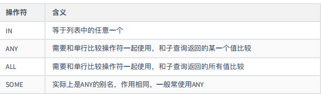
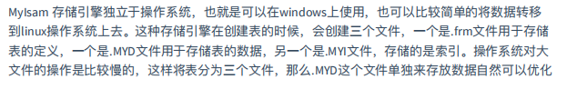
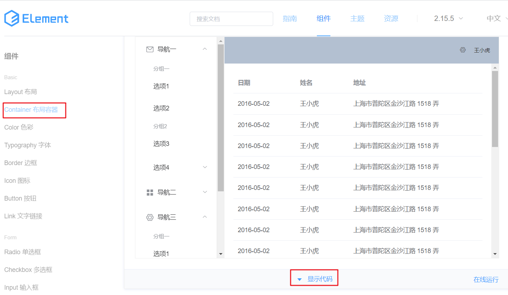

# Java基础

## 基本数据类型

### 内置数据类型

**byte：**

- byte 数据类型是8位、有符号的，以二进制补码表示的整数；
- 最小值是 **-128（-2^7）**；
- 最大值是 **127（2^7-1）**；
- 默认值是 **0**；
- byte 类型用在大型数组中节约空间，主要代替整数，因为 byte 变量占用的空间只有 int 类型的四分之一；
- 例子：byte a = 100，byte b = -50。

**short：**

- short 数据类型是 16 位、有符号的以二进制补码表示的整数
- 最小值是 **-32768（-2^15）**；
- 最大值是 **32767（2^15 - 1）**；
- Short 数据类型也可以像 byte 那样节省空间。一个short变量是int型变量所占空间的二分之一；
- 默认值是 **0**；
- 例子：short s = 1000，short r = -20000。

**int：**

- int 数据类型是32位、有符号的以二进制补码表示的整数；
- 最小值是 **-2,147,483,648（-2^31）**；
- 最大值是 **2,147,483,647（2^31 - 1）**；
- 一般地整型变量默认为 int 类型；
- 默认值是 **0** ；
- 例子：int a = 100000, int b = -200000。

**long：**

- long 数据类型是 64 位、有符号的以二进制补码表示的整数；
- 最小值是 **-9,223,372,036,854,775,808（-2^63）**；
- 最大值是 **9,223,372,036,854,775,807（2^63 -1）**；
- 这种类型主要使用在需要比较大整数的系统上；
- 默认值是 **0L**；
- 例子： **long a = 100000L**，**long b = -200000L**。
  "L"理论上不分大小写，但是若写成"l"容易与数字"1"混淆，不容易分辩。所以最好大写。

**float：**

- float 数据类型是单精度、32位、符合IEEE 754标准的浮点数；
- float 在储存大型浮点数组的时候可节省内存空间；
- 默认值是 **0.0f**；
- 浮点数不能用来表示精确的值，如货币；
- 例子：float f1 = 234.5f。

**double：**

- double 数据类型是双精度、64 位、符合 IEEE 754 标准的浮点数；

- 浮点数的默认类型为 double 类型；

- double类型同样不能表示精确的值，如货币；

- 默认值是 **0.0d**；

- 例子：

  ```
  double   d1  = 7D ;
  double   d2  = 7.; 
  double   d3  =  8.0; 
  double   d4  =  8.D; 
  double   d5  =  12.9867; 
  ```

  7 是一个 int 字面量，而 7D，7. 和 8.0 是 double 字面量。

**boolean：**

- boolean数据类型表示一位的信息；
- 只有两个取值：true 和 false；
- 这种类型只作为一种标志来记录 true/false 情况；
- 默认值是 **false**；
- 例子：boolean one = true。

**char：**

- char 类型是一个单一的 16 位 Unicode 字符；
- 最小值是 **\u0000**（十进制等效值为 0）；
- 最大值是 **\uffff**（即为 65535）；
- char 数据类型可以储存任何字符；
- 例子：char letter = 'A';。

### 引用数据类型

- 在Java中，引用类型的变量非常类似于C/C++的指针。引用类型指向一个对象，指向对象的变量是引用变量。这些变量在声明时被指定为一个特定的类型，比如 Employee、Puppy 等。变量一旦声明后，类型就不能被改变了。
- 对象、数组都是引用数据类型。
- 所有引用类型的默认值都是null。
- 一个引用变量可以用来引用任何与之兼容的类型。
- 例子：Site site = new Site("Runoob")。

### 常量

常量在程序运行时是不能被修改的。

在 Java 中使用 final 关键字来修饰常量，声明方式和变量类似：

```java
final static  public int FUNCTION = 0;
```

### 自动类型转换

> 范围小的转范围大的

### 强制类型转换

```
byte b = (byte)i1
```

### 隐含强制类型转换

-  整数的默认类型是 int。
- 小数默认是 double 类型浮点型，在定义 float 类型时必须在数字后面跟上 F 或者 f。

## 变量类型

- 类变量：独立于方法之外的变量，用 static 修饰。
- 实例变量：独立于方法之外的变量，不过没有 static 修饰。
- 局部变量：类的方法中的变量。

### 局部变量

- 局部变量声明在方法、构造方法或者语句块中；
- 局部变量在方法、构造方法、或者语句块被执行的时候创建，当它们执行完成后，变量将会被销毁；
- 访问修饰符不能用于局部变量；
- 局部变量只在声明它的方法、构造方法或者语句块中可见；
- 局部变量是在栈上分配的。
- 局部变量没有默认值，所以局部变量被声明后，必须经过初始化，才可以使用。

### 实例变量

- 实例变量声明在一个类中，但在方法、构造方法和语句块之外；
- 当一个对象被实例化之后，每个实例变量的值就跟着确定；
- 实例变量在对象创建的时候创建，在对象被销毁的时候销毁；
- 实例变量的值应该至少被一个方法、构造方法或者语句块引用，使得外部能够通过这些方式获取实例变量信息；
- 实例变量可以声明在使用前或者使用后；
- 访问修饰符可以修饰实例变量；
- 实例变量对于类中的方法、构造方法或者语句块是可见的。一般情况下应该把实例变量设为私有。通过使用访问修饰符可以使实例变量对子类可见；
- 实例变量具有默认值。数值型变量的默认值是0，布尔型变量的默认值是false，引用类型变量的默认值是null。变量的值可以在声明时指定，也可以在构造方法中指定；
- 实例变量可以直接通过变量名访问。但在静态方法以及其他类中，就应该创建对象

### 类变量（静态变量）

- 类变量也称为静态变量，在类中以 static 关键字声明，但必须在方法之外。
- 无论一个类创建了多少个对象，类只拥有类变量的一份拷贝。
- 静态变量除了被声明为常量外很少使用，静态变量是指声明为 public/private，final 和 static 类型的变量。静态变量初始化后不可改变。
- 静态变量储存在静态存储区。经常被声明为常量，很少单独使用 static 声明变量。
- 静态变量在第一次被访问时创建，在程序结束时销毁。
- 与实例变量具有相似的可见性。但为了对类的使用者可见，大多数静态变量声明为 public 类型。
- 默认值和实例变量相似。数值型变量默认值是 0，布尔型默认值是 false，引用类型默认值是 null。变量的值可以在声明的时候指定，也可以在构造方法中指定。此外，静态变量还可以在静态语句块中初始化。
- 静态变量可以通过：*ClassName.VariableName*的方式访问。
- 类变量被声明为 public static final 类型时，类变量名称一般建议使用大写字母。如果静态变量不是 public 和 final 类型，其命名方式与实例变量以及局部变量的命名方式一致。

## 修饰符

### 访问控制

- **default** (即默认，什么也不写）: 在同一包内可见，不使用任何修饰符。使用对象：类、接口、变量、方法。
- **private** : 在同一类内可见。使用对象：变量、方法。 **注意：不能修饰类（外部类）**
- **public** : 对所有类可见。使用对象：类、接口、变量、方法
- **protected** : 对同一包内的类和所有子类可见。使用对象：变量、方法。 **注意：不能修饰类（外部类）**。

| 修饰符      | 当前类 | 同一包内 | 子孙类(同一包) | 子孙类(不同包)                                               | 其他包 |
| :---------- | :----- | :------- | :------------- | :----------------------------------------------------------- | :----- |
| `public`    | Y      | Y        | Y              | Y                                                            | Y      |
| `protected` | Y      | Y        | Y              | Y/N（[说明](https://www.runoob.com/java/java-modifier-types.html#protected-desc)） | N      |
| `default`   | Y      | Y        | Y              | N                                                            | N      |
| `private`   | Y      | N        | N              | N                                                            | N      |

#### 继承

请注意以下方法继承的规则：

- 父类中声明为 public 的方法在子类中也必须为 public。
- 父类中声明为 protected 的方法在子类中要么声明为 protected，要么声明为 public，不能声明为 private。
- 父类中声明为 private 的方法，不能够被子类继承。

### 非访问

static 修饰符，用来修饰类方法和类变量。

final 修饰符，用来修饰类、方法和变量，final 修饰的类不能够被继承，修饰的方法不能被继承类重新定义，修饰的变量为常量，是不可修改的。

abstract 修饰符，用来创建抽象类和抽象方法。

synchronized 和 volatile 修饰符，主要用于线程的编程。

#### **static **

- **静态变量：**

  static 关键字用来声明独立于对象的静态变量，无论一个类实例化多少对象，它的静态变量只有一份拷贝。 静态变量也被称为类变量。局部变量不能被声明为 static 变量。

- **静态方法：**

  static 关键字用来声明独立于对象的静态方法。静态方法不能使用类的非静态变量。静态方法从参数列表得到数据，然后计算这些数据。

#### final 

- **final 变量：**

  final 表示"最后的、最终的"含义，变量一旦赋值后，不能被重新赋值。被 final 修饰的实例变量必须显式指定初始值。

  final 修饰符通常和 static 修饰符一起使用来创建类常量。

- **final 类**

  final 类不能被继承，没有类能够继承 final 类的任何特性。

#### abstract 

- **抽象类：**

  抽象类不能用来实例化对象，声明抽象类的唯一目的是为了将来对该类进行扩充。

  一个类不能同时被 abstract 和 final 修饰。如果一个类包含抽象方法，那么该类一定要声明为抽象类，否则将出现编译错误。

  抽象类可以包含抽象方法和非抽象方法。

- **抽象方法**

  抽象方法是一种没有任何实现的方法，该方法的具体实现由子类提供。

  抽象方法不能被声明成 final 和 static。

  任何继承抽象类的子类必须实现父类的所有抽象方法，除非该子类也是抽象类。

  如果一个类包含若干个抽象方法，那么该类必须声明为抽象类。抽象类可以不包含抽象方法。

  抽象方法的声明以分号结尾，例如：**public abstract sample();**。

#### **synchronized **

synchronized 关键字声明的方法同一时间只能被一个线程访问。synchronized 修饰符可以应用于四个访问修饰符。

#### **volatile** 

- 主要用于线程的编程。
- volatile 修饰的成员变量在每次被线程访问时，都强制从共享内存中重新读取该成员变量的值。而且，当成员变量发生变化时，会强制线程将变化值回写到共享内存。这样在任何时刻，两个不同的线程总是看到某个成员变量的同一个值。
- 一个 volatile 对象引用可能是 null。

#### **transient**

- 序列化的对象包含被 transient 修饰的实例变量时，java 虚拟机(JVM)跳过该特定的变量。

  该修饰符包含在定义变量的语句中，用来预处理类和变量的数据类型。

## 运算符

### 算术运算符

| 操作符 | 描述                              | 例子                               |
| :----- | :-------------------------------- | :--------------------------------- |
| +      | 加法 - 相加运算符两侧的值         | A + B 等于 30                      |
| -      | 减法 - 左操作数减去右操作数       | A – B 等于 -10                     |
| *      | 乘法 - 相乘操作符两侧的值         | A * B等于200                       |
| /      | 除法 - 左操作数除以右操作数       | B / A等于2                         |
| ％     | 取余 - 左操作数除以右操作数的余数 | B%A等于0                           |
| ++     | 自增: 操作数的值增加1             | B++ 或 ++B 等于 21（区别详见下文） |
| --     | 自减: 操作数的值减少1             | B-- 或 --B 等于 19（区别详见下文） |

### **自增（++）自减（--）**

- 前缀自增自减法(++a,--a): 先进行自增或者自减运算，再进行表达式运算。
- 后缀自增自减法(a++,a--):先进行表达式运算，再进行自增或者自减运算 。

### 关系运算符

| 运算符 | 描述                                                         | 例子             |
| :----- | :----------------------------------------------------------- | :--------------- |
| ==     | 检查如果两个操作数的值是否相等，如果相等则条件为真。         | （A == B）为假。 |
| !=     | 检查如果两个操作数的值是否相等，如果值不相等则条件为真。     | (A != B) 为真。  |
| >      | 检查左操作数的值是否大于右操作数的值，如果是那么条件为真。   | （A> B）为假。   |
| <      | 检查左操作数的值是否小于右操作数的值，如果是那么条件为真。   | （A <B）为真。   |
| >=     | 检查左操作数的值是否大于或等于右操作数的值，如果是那么条件为真。 | （A> = B）为假。 |
| <=     | 检查左操作数的值是否小于或等于右操作数的值，如果是那么条件为真。 | （A <= B）为真。 |

### 位运算符

| 操作符 | 描述                                                         | 例子                           |
| :----- | :----------------------------------------------------------- | :----------------------------- |
| ＆     | 如果相对应位都是1，则结果为1，否则为0                        | （A＆B），得到12，即0000 1100  |
| \|     | 如果相对应位都是 0，则结果为 0，否则为 1                     | （A \| B）得到61，即 0011 1101 |
| ^      | 如果相对应位值相同，则结果为0，否则为1                       | （A ^ B）得到49，即 0011 0001  |
| 〜     | 按位取反运算符翻转操作数的每一位，即0变成1，1变成0。         | （〜A）得到-61，即1100 0011    |
| <<     | 按位左移运算符。左操作数按位左移右操作数指定的位数。         | A << 2得到240，即 1111 0000    |
| >>     | 按位右移运算符。左操作数按位右移右操作数指定的位数。         | A >> 2得到15即 1111            |
| >>>    | 按位右移补零操作符。左操作数的值按右操作数指定的位数右移，移动得到的空位以零填充。 | A>>>2得到15即0000 1111         |

### 逻辑运算符

| 操作符 | 描述                                                         | 例子                |
| :----- | :----------------------------------------------------------- | :------------------ |
| &&     | 称为逻辑与运算符。当且仅当两个操作数都为真，条件才为真。     | （A && B）为假。    |
| \| \|  | 称为逻辑或操作符。如果任何两个操作数任何一个为真，条件为真。 | （A \| \| B）为真。 |
| ！     | 称为逻辑非运算符。用来反转操作数的逻辑状态。如果条件为true，则逻辑非运算符将得到false。 | ！（A && B）为真。  |

### 赋值运算符

| 操作符  | 描述                                                         | 例子                                     |
| :------ | :----------------------------------------------------------- | :--------------------------------------- |
| =       | 简单的赋值运算符，将右操作数的值赋给左侧操作数               | C = A + B将把A + B得到的值赋给C          |
| + =     | 加和赋值操作符，它把左操作数和右操作数相加赋值给左操作数     | C + = A等价于C = C + A                   |
| - =     | 减和赋值操作符，它把左操作数和右操作数相减赋值给左操作数     | C - = A等价于C = C - A                   |
| * =     | 乘和赋值操作符，它把左操作数和右操作数相乘赋值给左操作数     | C * = A等价于C = C * A                   |
| / =     | 除和赋值操作符，它把左操作数和右操作数相除赋值给左操作数     | C / = A，C 与 A 同类型时等价于 C = C / A |
| （％）= | 取模和赋值操作符，它把左操作数和右操作数取模后赋值给左操作数 | C％= A等价于C = C％A                     |
| << =    | 左移位赋值运算符                                             | C << = 2等价于C = C << 2                 |
| >> =    | 右移位赋值运算符                                             | C >> = 2等价于C = C >> 2                 |
| ＆=     | 按位与赋值运算符                                             | C＆= 2等价于C = C＆2                     |
| ^ =     | 按位异或赋值操作符                                           | C ^ = 2等价于C = C ^ 2                   |
| \| =    | 按位或赋值操作符                                             | C \| = 2等价于C = C \| 2                 |

### 三元运算符

条件运算符也被称为三元运算符。该运算符有3个操作数，并且需要判断布尔表达式的值。该运算符的主要是决定哪个值应该赋值给变量。

### instanceof

检查该对象是否是一个特定类型（类类型或接口类型）。

### Java运算符优先级

最高优先级的运算符在的表的最上面

| 类别     | 操作符                                     | 关联性   |
| :------- | :----------------------------------------- | :------- |
| 后缀     | () [] . (点操作符)                         | 左到右   |
| 一元     | expr++ expr--                              | 从左到右 |
| 一元     | ++expr --expr + - ～ ！                    | 从右到左 |
| 乘性     | * /％                                      | 左到右   |
| 加性     | + -                                        | 左到右   |
| 移位     | >> >>>  <<                                 | 左到右   |
| 关系     | > >= < <=                                  | 左到右   |
| 相等     | == !=                                      | 左到右   |
| 按位与   | ＆                                         | 左到右   |
| 按位异或 | ^                                          | 左到右   |
| 按位或   | \|                                         | 左到右   |
| 逻辑与   | &&                                         | 左到右   |
| 逻辑或   | \| \|                                      | 左到右   |
| 条件     | ？：                                       | 从右到左 |
| 赋值     | = + = - = * = / =％= >> = << =＆= ^ = \| = | 从右到左 |
| 逗号     | ，                                         | 左到右   |

## 流程控制

### 循环

- **while** 循环

- **do…while** 循环

- **for** 循环

- 增强 for 循环

  ```java
  for(声明语句 : 表达式)
  {
     //代码句子
  }
  ```

- break

- conuntion

### 条件

- if...else

-  switch case

  switch 语句中的变量类型可以是： byte、short、int 或者 char。从 Java SE 7 开始，switch 支持字符串 String 类型了，同时 case 标签必须为字符串常量或字面量。

  ```java
  switch(expression){
      case value :
         //语句
         break; //可选
      case value :
         //语句
         break; //可选
      //你可以有任意数量的case语句
      default : //可选
         //语句
  }
  ```

## 数组

### 声明

```java
dataType[] arrayRefVar;   // 首选的方法
 
或
 
dataType arrayRefVar[];  // 效果相同，但不是首选方法
```

### 创建

- ```java
  arrayRefVar = new dataType[arraySize];
  ```

- ```java
  dataType[] arrayRefVar = new dataType[arraySize];
  ```

- ```
  dataType[] arrayRefVar = {value0, value1, ..., valuek};
  ```

### 操作

#### 遍历

普通for

```java
// 打印所有数组元素
      for (int i = 0; i < myList.length; i++) {
         System.out.println(myList[i] + " ");
      }
```

增强for

```java
for(type element: array)
{
    System.out.println(element);
}
```

### 多为数组

```java
String[][] str = new String[3][4];
```

### 方法

#### 获取

arrays.length()   数组长度

arrays.toString()，获取字符串

Arrays.toString(newArr)，类名调用获取字符串

#### 增强for

for(声明变量 ：数组名)

#### 复制

**System.arraysCopy** 

```java
/**
  * sourceArray 源数组
  * index1 开始下标
  *	copyArray 目标数组
  *	index2 目标下标
  *长度
 **/
public static void  arraycopy(sourceArray, int index1, copyArray,int index2, int length)
```


**Arrays.copyOf(a,10);**  

```java
/**
  * sourceArray 源数组
  * newLength长度
  *
  * @return 新数组
**/
public static 数组类型 copyOf(数组类型 sourceArray ,int newLength )
```


**Arrays.copyOfRange(a,3,10);**

```java
public static（代表不用实例化） 数组类型 copyOfRang（数组类型 original,int from ,int to）
```

 把数组a指定的数组从下标（from-1）到下标（to-1）（数组original的第to个元素）
复制到一个新的数组中，新数组长度为to-from。如果to的值大于数组数组original的长度，那么超出部分取默认值。

#### 排序

**sort**

```java
public static void sort(数组类型 array)；
```

包含在Arrays类中,可以把数组array按升序排序

```java
public static void sort(array, int start, int end)
```

包含在Arrays类中,可以把参数array中下标start至下标end-1的元素（第end个元素）按升序排序。


#### 查找（二分）

**binarySearch**

```java
public static int binarySearch(数组类型 array， 类型 target)
```

判断参数target指定的数据是否在参数array指定的数组当中，如果target和数组array中的某个元素相同，该方法就返回该元素的索引（下标），否则返回一个负数。需要注意的是array必须是已排序好的数组。

## 面向对象

### 方法

#### 定义

- **修饰符：**修饰符，这是可选的，告诉编译器如何调用该方法。定义了该方法的访问类型。
- **返回值类型 ：**方法可能会返回值。returnValueType 是方法返回值的数据类型。有些方法执行所需的操作，但没有返回值。在这种情况下，returnValueType 是关键字**void**。
- **方法名：**是方法的实际名称。方法名和参数表共同构成方法签名。
- **参数类型：**参数像是一个占位符。当方法被调用时，传递值给参数。这个值被称为实参或变量。参数列表是指方法的参数类型、顺序和参数的个数。参数是可选的，方法可以不包含任何参数。
- **方法体：**方法体包含具体的语句，定义该方法的功能。

#### 构造方法

当一个对象被创建时候，构造方法用来初始化该对象。构造方法和它所在类的名字相同，但构造方法没有返回值。

```java
// 一个简单的构造函数
class MyClass {
  int x;
 
  // 以下是构造函数
  MyClass() {
    x = 10;
  }
}
```

#### 可变参数

在方法声明中，在指定参数类型后加一个省略号(...) 。

一个方法中只能指定一个可变参数，它必须是方法的最后一个参数。任何普通的参数必须在它之前声明。

```java
 public static void printMax( double... numbers) {
 	if (numbers.length == 0) {
            System.out.println("No argument passed");
            return;
        }
 }
```

#### finalize() 方法

Java 允许定义这样的方法，它在对象被垃圾收集器析构(回收)之前调用，这个方法叫做 finalize( )，它用来清除回收对象。

```
protected void finalize()
{
   // 在这里终结代码
}
```

> 关键字 protected 是一个限定符，它确保 finalize() 方法不会被该类以外的代码调用。
>
> 当然，Java 的内存回收可以由 JVM 来自动完成。如果你手动使用，则可以使用上面的方法。

### 重载

**重载(overloading) 是在一个类里面，方法名字相同，而参数不同。返回类型可以相同也可以不同。**

#### 规则

- 被重载的方法必须改变参数列表(参数个数或类型不一样)；
- 被重载的方法可以改变返回类型；
- 被重载的方法可以改变访问修饰符；
- 被重载的方法可以声明新的或更广的检查异常；·
- 方法能够在同一个类中或者在一个子类中被重载。
- 无法以返回值类型作为重载函数的区分标准。

### 重写

重写是子类对父类的允许访问的方法的实现过程进行重新编写, 返回值和形参都不能改变。**即外壳不变，核心重写！**

#### 规则

- 参数列表与被重写方法的参数列表必须完全相同。
- 返回类型与被重写方法的返回类型可以不相同，但是必须是父类返回值的派生类（java5 及更早版本返回类型要一样，java7 及更高版本可以不同）。
- 访问权限不能比父类中被重写的方法的访问权限更低。例如：如果父类的一个方法被声明为 public，那么在子类中重写该方法就不能声明为 protected。
- 父类的成员方法只能被它的子类重写。
- 声明为 final 的方法不能被重写。
- 声明为 static 的方法不能被重写，但是能够被再次声明。
- 子类和父类在同一个包中，那么子类可以重写父类所有方法，除了声明为 private 和 final 的方法。
- 子类和父类不在同一个包中，那么子类只能够重写父类的声明为 public 和 protected 的非 final 方法。
- 重写的方法能够抛出任何非强制异常，无论被重写的方法是否抛出异常。但是，重写的方法不能抛出新的强制性异常，或者比被重写方法声明的更广泛的强制性异常，反之则可以。
- 构造方法不能被重写。
- 如果不能继承一个类，则不能重写该类的方法。

### 封装

封装可以被认为是一个保护屏障，防止该类的代码和数据被外部类定义的代码随机访问。

封装最主要的功能在于我们能修改自己的实现代码，而不用修改那些调用我们代码的程序片段。

#### 优点

- 良好的封装能够减少耦合。
-  类内部的结构可以自由修改。
- 可以对成员变量进行更精确的控制。
-  隐藏信息，实现细节。

```java
public class Person{
    private String name;
    private int age;
​
    public int getAge(){
      return age;
    }
​
    public String getName(){
      return name;
    }
​
    public void setAge(int age){
      this.age = age;
    }
​
    public void setName(String name){
      this.name = name;
    }
}
```

### 继承

继承就是子类继承父类的特征和行为，使得子类对象（实例）具有父类的实例域和方法，或子类从父类继承方法，使得子类具有父类相同的行为。

优点：减少重复代码

#### 继承格式

```java
class 父类 {
}
 
class 子类 extends 父类 {
}
```

#### 继承类型


#### 特征

- 子类拥有父类非 private 的属性、方法。
- 子类可以拥有自己的属性和方法，即子类可以对父类进行扩展。
- 子类可以用自己的方式实现父类的方法。
- Java 的继承是单继承，但是可以多重继承，单继承就是一个子类只能继承一个父类，多重继承就是，例如 B 类继承 A 类，C 类继承 B 类，所以按照关系就是 B 类是 C 类的父类，A 类是 B 类的父类，这是 Java 继承区别于 C++ 继承的一个特性。
- 提高了类之间的耦合性（继承的缺点，耦合度高就会造成代码之间的联系越紧密，代码独立性越差）。

#### extends

在 Java 中，类的继承是单一继承，也就是说，一个子类只能拥有一个父类，所以 extends 只能继承一个类。

#### implements

使用 implements 关键字可以变相的使java具有多继承的特性，使用范围为类继承接口的情况，可以同时继承多个接口（接口跟接口之间采用逗号分隔）。

#### super

super（）无参构造

super关键字：我们可以通过super关键字来实现对父类成员的访问，用来引用当前对象的父类。

#### this

this（）无参构造

this关键字：指向自己的引用。

### 多态

多态是同一个行为具有多个不同表现形式或形态的能力。

#### 优点

-  消除类型之间的耦合关系
- 可替换性
- 可扩充性
- 接口性
- 灵活性
- 简化性

#### 存在的三个必要条件

- 继承
- 重写
- 父类引用指向子类对象：**Parent p = new Child();**

## 抽象类

如果一个类中没有包含足够的信息来描绘一个具体的对象，这样的类就是抽象类。

抽象类除了不能实例化对象之外，类的其它功能依然存在，成员变量、成员方法和构造方法的访问方式和普通类一样。

### 抽象类

```java
public abstract class Employee
{
   private String name;
   private String address;
   private int number;
   public Employee(String name, String address, int number)
   {
      System.out.println("Constructing an Employee");
      this.name = name;
      this.address = address;
      this.number = number;
   }
}
```

### 抽象方法

该类包含一个特别的成员方法，该方法的具体实现由它的子类确定，那么你可以在父类中声明该方法为抽象方法。

```java
public abstract class Employee
{
   private String name;
   private String address;
   private int number;
   
   public abstract double computePay();
   
   //其余代码
}
```

> 如果一个类包含抽象方法，那么该类必须是抽象类。
>
> 任何子类必须重写父类的抽象方法，或者声明自身为抽象类。

### 特点

- 抽象类不能被实例化(初学者很容易犯的错)，如果被实例化，就会报错，编译无法通过。只有抽象类的非抽象子类可以创建对象。
- 抽象类中不一定包含抽象方法，但是有抽象方法的类必定是抽象类。
- 抽象类中的抽象方法只是声明，不包含方法体，就是不给出方法的具体实现也就是方法的具体功能。
- 构造方法，类方法（用 static 修饰的方法）不能声明为抽象方法。
- 抽象类的子类必须给出抽象类中的抽象方法的具体实现，除非该子类也是抽象类。

## 接口

接口（英文：Interface），在JAVA编程语言中是一个抽象类型，是抽象方法的集合，接口通常以interface来声明。一个类通过继承接口的方式，从而来继承接口的抽象方法。

### 特点

一

- 接口不能用于实例化对象。
- 接口没有构造方法。
- 接口中所有的方法必须是抽象方法，Java 8 之后 接口中可以使用 default 关键字修饰的非抽象方法。
- 接口不能包含成员变量，除了 static 和 final 变量。
- 接口不是被类继承了，而是要被类实现。
- 接口支持多继承。

二

- 接口中每一个方法也是隐式抽象的,接口中的方法会被隐式的指定为 **public abstract**（只能是 public abstract，其他修饰符都会报错）。
- 接口中可以含有变量，但是接口中的变量会被隐式的指定为 **public static final** 变量（并且只能是 public，用 private 修饰会报编译错误）。
- 接口中的方法是不能在接口中实现的，只能由实现接口的类来实现接口中的方法。

### 声明

```java
[可见度] interface 接口名称 [extends 其他的接口名] {        
    // 声明变量        
    // 抽象方法 
}
```

### 规则

重写接口中声明的方法时，需要注意以下规则：

- 类在实现接口的方法时，不能抛出强制性异常，只能在接口中，或者继承接口的抽象类中抛出该强制性异常。
- 类在重写方法时要保持一致的方法名，并且应该保持相同或者相兼容的返回值类型。
- 如果实现接口的类是抽象类，那么就没必要实现该接口的方法。

在实现接口的时候，也要注意一些规则：

- 一个类可以同时实现多个接口。
- 一个类只能继承一个类，但是能实现多个接口。
- 一个接口能继承另一个接口，这和类之间的继承比较相似。

## 内部类

### 成员内部类

```java
class Circle {
    double radius = 0;
     
    public Circle(double radius) {
        this.radius = radius;
    }
     
    class Draw {     //内部类
        public void drawSahpe() {
            System.out.println("drawshape");
        }
    }
}
```

#### 访问

**内部类访问同名外部类变量**

```java
外部类.this.成员变量
外部类.this.成员方法
```

**外部类访问内部类**

```java
class Circle {
    private double radius = 0;
     
    private Draw getDrawInstance() {
        return new Draw().drawSahpe();//必须先创建成员内部类的对象，再进行访问
    }
     
    class Draw {     //内部类
        public void drawSahpe() {
            System.out.println(radius);  //外部类的private成员
        }
    }
}
```

#### 创建内部类

```java
public class Test {
    public static void main(String[] args)  {
        //第一种方式：
        Outter outter = new Outter();
        Outter.Inner inner = outter.new Inner();  //必须通过Outter对象来创建
         
        //第二种方式：
        Outter.Inner inner1 = outter.getInnerInstance();
    }
}
 
class Outter {
    private Inner inner = null;
    public Outter() {
         
    }
     
    public Inner getInnerInstance() {
        if(inner == null)
            inner = new Inner();
        return inner;
    }
      
    class Inner {
        public Inner() {
             
        }
    }
}
```

### 局部内部类

局部内部类是定义在一个方法或者一个作用域里面的类，它和成员内部类的区别在于局部内部类的访问仅限于方法内或者该作用域内。

```java
 public People getWoman(){
        class Woman extends People{   //局部内部类
            int age =0;
        }
        return new Woman();
    }
```

> **注意**: 局部内部类就像是方法里面的一个局部变量一样，是不能有 public、protected、private 以及 static 修饰符的。

### 匿名内部类

```java
scan_bt.setOnClickListener(new OnClickListener() {
    @Override
    public void onClick(View v) {
        // TODO Auto-generated method stub
         
    }
});
```

### 静态内部类

静态内部类也是定义在另一个类里面的类，只不过在类的前面多了一个关键字static。

它不能使用外部类的非static成员变量或者方法

```java
public class Test {
    public static void main(String[] args)  {
        Outter.Inner inner = new Outter.Inner();
    }
}
 
class Outter {
    public Outter() {
         
    }
     
    static class Inner {
        public Inner() {
             
        }
    }
}
```

## 代码块

### 局部代码块

在方法中出现，可以限定变量生命周期，及早释放，提高内存利用率

### 构造代码块

在类中方法外出现，每次调用构造方法都会执行，并且在构造方法前执行。

### **构造代码块与构造函数的区别**：

构造代码块是给所有对象进行统一初始化，而构造函数是给对应的对象初始化，因为构造函数是可以多个的，运行哪个构造函数就会建立什么样的对象，但无论建立哪个对象，都会先执行相同的构造代码块。

### 同步代码块

同步代码块指的是被Java中Synchronized关键词修饰的代码块，在Java中，Synchronized关键词不仅仅可以用来修饰代码块，与此同时也可以用来修饰方法，是一种线程同步机制，被Synchronized关键词修饰的代码块会被加上内置锁。

需要说明的是Synchronized同步代码块是一种高开销的操作，因此我们应该尽量减少被同步的内容，在很多场景，我们没有必要去同步整个方法，而只需要同步部分代码即可，也就是使用同步代码块（JDK源码中有很多应用）。

### 静态代码块

在类中方法外出现，并加上static修饰，常用于给类进行初始化，在加载的时候就执行，并且静态代码块执行一次。

### 代码块执行顺序

静态代码块：在类加载JVM时初始化，且只被执行一次；常用来执行类属性的初始化；静态块优先于各种代码块以及构造函数；此外静态代码块不能访问普通变量。

构造代码块：每次调用构造方法，构造代码块都执行一次；构造代码块优先于构造函数执行；同时构造代码块的运行依赖于构造函数。

父类静态块 ==> 子类静态块 ==> 父类代码块 ==> 父类构造器 ==> 子类代码块 ==> 子类构造器 。

## 枚举

### 枚举类

```java
public class Color{
    public static final Color WHITE;
    public static final Color BLACK;
    public static final Color PINK;
    
    static{
        WHITE = new Color();
        BLACK = new Color();
        PINK = new Color();
        
    }
    
    Private Color(){
        
    }
}
```

```java
ublic enum Rainbow implements Action {
    
    RED("红色"){  //对Rainbow 的子类的对象的引用
        @Override
        void test() {//重写Rainbow的test
            
        }

        @Override
        public void run() {//重写Rainbowchong实现的test方法
            
        }
    },
    ORANGE("橙色"){
        @Override
        void test() {
            super.test();
        }
        
    },
    YRELLO("黄色"),
    GREEN("黄色"),
    Cyanogen("黄色"),
    BLUE("黄色"),
    PURPLE("黄色");

    private int id;
    private String name;


    Rainbow(String name){
        this(1,name);
    }

    Rainbow(int id, String name){
        this.id = id;
        this.name = name;
    }

    public String getName() {
        return name;
    }

    public void setName(String name) {
        this.name = name;
    }

    @Override
    public String toString() {
        return "Rainbow{" +
                "id=" + id +
                ", name='" + name + '\'' +
                '}';
    }
//    abstract void test();
    
    void test(){};

    @Override
    public void run() {
        
    }
}
```

### 常量

```java
public enum Color {  
  RED, GREEN, BLANK, YELLOW  
}
```

### switch

```java
enum Signal {  
    GREEN, YELLOW, RED  
}  
public class TrafficLight {  
    Signal color = Signal.RED;  
    public void change() {  
        switch (color) {  
        case RED:  
            color = Signal.GREEN;  
            break;  
        case YELLOW:  
            color = Signal.RED;  
            break;  
        case GREEN:  
            color = Signal.YELLOW;  
            break;  
        }  
    }  
} 
```

### 添加方法

values()，可以返回这个枚举类型的所有对象，返回类型是数组

valueof(), 通过一个字符串可以返回枚举对象，这个字符串参数就是枚举对象 的名字

name()  返回这个枚举对象的名字

ordinal()  返回这个枚举对象的编号，默认从0开始

### 覆盖枚举的方法

```java
public enum Color {  
    RED("红色", 1), GREEN("绿色", 2), BLANK("白色", 3), YELLO("黄色", 4);  
    // 成员变量  
    private String name;  
    private int index;  
    // 构造方法  
    private Color(String name, int index) {  
        this.name = name;  
        this.index = index;  
    }  
    //覆盖方法  
    @Override  
    public String toString() {  
        return this.index+"_"+this.name;  
    }  
}
```

### 实现接口

```java
public interface Behaviour {  
    void print();  
    String getInfo();  
}  
public enum Color implements Behaviour{  
    RED("红色", 1), GREEN("绿色", 2), BLANK("白色", 3), YELLO("黄色", 4);  
    // 成员变量  
    private String name;  
    private int index;  
    // 构造方法  
    private Color(String name, int index) {  
        this.name = name;  
        this.index = index;  
    }  
//接口方法  
    @Override  
    public String getInfo() {  
        return this.name;  
    }  
    //接口方法  
    @Override  
    public void print() {  
        System.out.println(this.index+":"+this.name);  
    }  
} 
```

### 使用接口组织枚举

```java
public interface Food {  
    enum Coffee implements Food{  
        BLACK_COFFEE,DECAF_COFFEE,LATTE,CAPPUCCINO  
    }  
    enum Dessert implements Food{  
        FRUIT, CAKE, GELATO  
    }  
}
```

```java
 /**
     * 测试继承接口的枚举的使用（by 大师兄 or 大湿胸。）
     */
    private static void testImplementsInterface() {
        for (Food.DessertEnum dessertEnum : Food.DessertEnum.values()) {
            System.out.print(dessertEnum + "  ");
        }
        System.out.println();
        //我这地方这么写，是因为我在自己测试的时候，把这个coffee单独到一个文件去实现那个food接口，而不是在那个接口的内部。
        for (CoffeeEnum coffee : CoffeeEnum.values()) {
            System.out.print(coffee + "  ");
        }
        System.out.println();
        //搞个实现接口，来组织枚举，简单讲，就是分类吧。如果大量使用枚举的话，这么干，在写代码的时候，就很方便调用啦。
        //还有就是个“多态”的功能吧，
        Food food = Food.DessertEnum.CAKE;
        System.out.println(food);
        food = CoffeeEnum.BLACK_COFFEE;
        System.out.println(food);
    }
```

### 关于枚举集合的使用

java.util.EnumSet和java.util.EnumMap是两个枚举集合。EnumSet保证集合中的元素不重复；EnumMap中的 key是enum类型，而value则可以是任意类型。关于这个两个集合的使用就不在这里赘述，可以参考JDK文档。

```java
package com.lxk.enumTest;
 
/**
 * Java枚举用法测试
 * <p>
 * Created by lxk on 2016/12/15
 */
public class EnumTest {
    public static void main(String[] args) {
        forEnum();
        useEnumInJava();
    }
 
    /**
     * 循环枚举,输出ordinal属性；若枚举有内部属性，则也输出。(说的就是我定义的TYPE类型的枚举的typeName属性)
     */
    private static void forEnum() {
        for (SimpleEnum simpleEnum : SimpleEnum.values()) {
            System.out.println(simpleEnum + "  ordinal  " + simpleEnum.ordinal());
        }
        System.out.println("------------------");
        for (TYPE type : TYPE.values()) {
            System.out.println("type = " + type + "    type.name = " + type.name() + "   typeName = " + type.getTypeName() + "   ordinal = " + type.ordinal());
        }
    }
 
    /**
     * 在Java代码使用枚举
     */
    private static void useEnumInJava() {
        String typeName = "f5";
        TYPE type = TYPE.fromTypeName(typeName);
        if (TYPE.BALANCE.equals(type)) {
            System.out.println("根据字符串获得的枚举类型实例跟枚举常量一致");
        } else {
            System.out.println("大师兄代码错误");
        }
 
    }
 
    /**
     * 季节枚举(不带参数的枚举常量)这个是最简单的枚举使用实例
     * Ordinal 属性，对应的就是排列顺序，从0开始。
     */
    private enum SimpleEnum {
        SPRING,
        SUMMER,
        AUTUMN,
        WINTER
    }
 
 
    /**
     * 常用类型(带参数的枚举常量，这个只是在书上不常见，实际使用还是很多的，看懂这个，使用就不是问题啦。)
     */
    private enum TYPE {
        FIREWALL("firewall"),
        SECRET("secretMac"),
        BALANCE("f5");
 
        private String typeName;
 
        TYPE(String typeName) {
            this.typeName = typeName;
        }
 
        /**
         * 根据类型的名称，返回类型的枚举实例。
         *
         * @param typeName 类型名称
         */
        public static TYPE fromTypeName(String typeName) {
            for (TYPE type : TYPE.values()) {
                if (type.getTypeName().equals(typeName)) {
                    return type;
                }
            }
            return null;
        }
 
        public String getTypeName() {
            return this.typeName;
        }
    }
}

```

## 常用类

### Object

- object（）：构造器，构造一个新的对象

- getclass（）：返回此Object的运行时类， 返回的Class对象是被表示类的static synchronized方法锁定的对象

- hashCode（）：返回对象的哈希码值

- equals（）：指示一些其他对象是否等于此

- clone（）：创建并返回此对象的副本，一般对于任何对象x： x.clone() != x, x.clone().getClass() == x.getClass()将是true ，但这些都不是绝对的要求。 通常是： x.clone().equals(x)将是true ，但是这也不是一个绝对的要求。

- toString（）：返回对象的字符串表示形式，一般来说应该具有返回的字符串具简明扼要的特点，建议所有子类覆盖此类
  

### Arrays

- Arrays.toString(x)方法 : 快速[输出数组](https://so.csdn.net/so/search?q=输出数组&spm=1001.2101.3001.7020)内容
- Arrays.sort()方法 : 给数组排序，默认升序
- Arrays.equals()方法 : 比较两个数组内容是否相等
- Arrays.binarySearch(Datatype[], Datatype key) ：在数组中查找元素
- Arrays.copyOf()：第一个参数是原数组，第二个参数是拷贝长度，返回值是将原数组拷贝一份返回
- Collections.reverseOrder() : 倒序

### Number

`基本数据类型的包装类`

- xxxValue() :  以 xxx 形式返回指定的数值。
- compareTo() : 方法用于将 Number 对象与方法的参数进行比较；
- equals() : equals() 用于判断 Number 对象与方法的参数进是否相等
- Intanger .valueOf() : 用于返回给定参数的原生 Number 对象值；用于返回给定参数的原生 Number 对象值；
- toString() : 方法用于返回以一个字符串表示的 Number 对象值；
- parsexxx():将字符串解析为 xxx类型；

### Math

- abs（）：返回绝对值
- addExact（）：返回参数的和
- max（）：返回较大的值
- min（）：返回较小值
- multiplyExact（）：返回参数的乘积
- subtraExact（）：返回参数的差
- sqrt（）：返回参数的正确舍入的正平方根

> Math.

### Character

`char的包装类`

- isLetter()是否是一个字母          

- isDigit()是否是一个数字字符 
- isWhitespace()是否是一个空白字符 
- isUpperCase()是否是大写字母 
- isLowerCase()是否是小写字母 
- toUpperCase()指定字母的大写形式
- toLowerCase指定字母的小写形式 
- toString() 返回字符的字符串形式，字符串的长度仅为1

### String

- matches() ; 正则表达式

- charAt（）：传入一个int类型参数，返回指定位置的字符

- String（）：构造器，生成一个String对象

- compareTo（）与参数比较，相同返回0，小于返回-1，大于返回1

- concat（）：将参数字符串连接到字符串串尾

- contains():查找字符串中是否包含某字符

- equals（）：字符串值比较

- intern（）：返回对象的值（调用该方法时，返回值在常量池中）

- length（）：返回字符串的长度

- isEmpty（）：判断是否是空字符串

- toLowerCase（）：将所有字符串转换为小写

- toUpperCase（）：将字符串所有字符转换为大写

- trim（）：返回字符串副本，忽略首部和尾部空白

- equalsIgnoreCase()：与equals类似，忽略大小写

- substring()：截取字符串

- toCharArra（）：将字符串转换为字符数组

- split（）：以指定字符分割字符串

- getBytes（）：将字符串以字节数组返回

### StringBuffer和StringBuilder

append（）：在字符串后面添加字符，可以是大部分数据类型

charAt（）：传入一个int类型参数，返回指定位置的字符

delete（）：删除指定区间的字符

insert（）：在指定位置插入元素

setCharAt（）：替换指定位置字符，参数为char类型

reverse（）：字符串反转

replace（）：替换指定区间字符

### Random

- Random（）：生成一个对象

- nextInt（）：生成一个随机数，如果有参数则生成一个在0~参数之间的随机数

- nextBoolean（）：生成一个随机的布尔值（true或false）

- nextDouble（）：生成一个在0~1之间的小数

- nextFloat（）：生成一个在0~1之间的小数

- nextLong（）：生成一个随机的long型数

### Date

- Date（）：无参数时创建当前时间，传入long类型参数时创建一个从1970年1月1日00:00：00到参数毫秒后的时间，该时间以后统称原点时间

- getTime（）：获取当前时间距离原点时间的毫秒数

- setTime（）：设置时间，参数为long类型，可以将时间设置为距原点时间参数毫秒后的时间

- toLocaleString()：创建一个固定格式的对象，方便看懂，但是已经弃用

### SimpleDateFormat

- SimpleDateFormat（）：无参时创建一个使用默认的格式的对象，传入“yyyy-MM-dd HH：mm：ss”这种规定格式时创建一个规定格式的对象
- format（）：传入一个date类型的参数，然后返回一个一个转换后的字符串

### Calendar

- GregorianCalendar()：一般new对象时new的是该类的子类GregorianCalendar；

- getInstance()：通过类名点该方法获取Calender对象

- set（）：根据给定的参数设置年月日时分秒

- get（）：参数为int类型，根据参数返回指定字段的值，比如参数为1返回年

- getTime（）：返回一个Date类型的值（相当于Calander->Date

- setTime():传入一个Date类型的变量，返回一个Calander值（相当于Date->Calander）

- add（）：参数为指定字段（年月日等等，通过int或者Calander.XXX传入），另一个参数为改变的量，无返回值

## 集合类


### 接口

#### Collection 

Collection 是最基本的集合接口，一个 Collection 代表一组 Object，即 Collection 的元素, Java不提供直接继承自Collection的类，只提供继承于的子接口(如List和set)。

> Collection 接口存储一组不唯一，无序的对象。

#### List 

List接口是一个有序的 Collection，使用此接口能够精确的控制每个元素插入的位置，能够通过索引(元素在List中位置，类似于数组的下标)来访问List中的元素，第一个元素的索引为 0，而且允许有相同的元素。

> List 接口存储一组不唯一，有序（插入顺序）的对象。

#### Set

Set 具有与 Collection 完全一样的接口，只是行为上不同，Set 不保存重复的元素。

> Set 接口存储一组唯一，无序的对象。

#### SortedSet

> 继承于Set保存有序的集合。

#### **Map**

> Map 接口存储一组键值对象，提供key（键）到value（值）的映射。

#### Map.Entry

> 描述在一个Map中的一个元素（键/值对）。是一个 Map 的内部接口。

#### SortedMap

> 继承于 Map，使 Key 保持在升序排列。

#### Enumeration

> 这是一个传统的接口和定义的方法，通过它可以枚举（一次获得一个）对象集合中的元素。这个传统接口已被迭代器取代。

#### Set和List

-  Set 接口实例存储的是无序的，不重复的数据。List 接口实例存储的是有序的，可以重复的元素。
- Set 检索效率低下，删除和插入效率高，插入和删除不会引起元素位置改变 **<实现类有HashSet,TreeSet>**。
-  List 和数组类似，可以动态增长，根据实际存储的数据的长度自动增长 List 的长度。查找元素效率高，插入删除效率低，因为会引起其他元素位置改变 **<实现类有ArrayList,LinkedList,Vector>** 。

### 方法

#### Collection

```java
//向集合中添加元素
boolean add(E e)
//把一个指定集合中的所有数据，添加到当前集合中    
boolean addAll(Collection<? extends E> c)
//清空集合中所有的元素。
void clear()
//判断当前集合中是否包含给定的对象。
boolean contains(Object o)
//判断当前集合中是否包含给定的集合的所有元素。
boolean containsAll(Collection<?> c)
//判断当前集合是否为空。
boolean isEmpty()
//返回遍历这个集合的迭代器对象
Iterator<E> iterator()
//把给定的对象，在当前集合中删除。
boolean remove(Object o)
//把给定的集合中的所有元素，在当前集合中删除。
boolean removeAll(Collection<?> c)
//判断俩个集合中是否有相同的元素，如果有当前集合只保留相同元素，如果没有当前集合元素清空
boolean retainAll(Collection<?> c)
//返回集合中元素的个数。
int size()
//把集合中的元素，存储到数组中。
Object[] toArray()
//把集合中的元素，存储到数组中，并指定数组的类型
<T> T[] toArray(T[] a)
```

#### List

```java
//返回集合中指定位置的元素。
E get(int index);
//用指定元素替换集合中指定位置的元素,并返回被替代的旧元素。
E set(int index, E element);
//将指定的元素，添加到该集合中的指定位置上。
void add(int index, E element);//如果有数据退后
//从指定位置开始，把另一个集合的所有元素添加进来
boolean addAll(int index, Collection<? extends E> c);
//移除列表中指定位置的元素, 并返回被移除的元素。
E remove(int index);
//查收指定元素在集合中的索引，从前往后查到的第一个元素（List集合可以重复存放数据）
int indexOf(Object o);
//查收指定元素在集合中的索引，从后往前查到的第一个元素（List集合可以重复存放数据）
int lastIndexOf(Object o);
//根据指定开始和结束位置，截取出集合中的一部分数据
16 List<E> subList(int fromIndex, int toIndex);

```

#### LinkedList(可做栈)

```java
//将指定元素插入此列表的开头
void addFirst(E e)
//将指定元素添加到此列表的结尾
void addLast(E e)
//返回此列表的第一个元素
E getFirst()
//返回此列表的最后一个元素
E getLast()
//从此列表所表示的堆栈处弹出一个元素
E pop()
//将元素推入此列表所表示的堆栈
void push(E e)
//移除并返回此列表的第一个元素
E removeFirst()
//移除并返回此列表的最后一个元素
E removeLast()
```

#### Map

```java
//把key-value存到当前Map集合中
V 					put(K key, V value)
//把指定map中的所有key-value，存到当前Map集合中
void 				putAll(Map<? extends K,? extends V> m)
//当前Map集合中是否包含指定的key值
boolean 			containsKey(Object key)
//当前Map集合中是否包含指定的value值
boolean 			containyqsValue(Object value)
//清空当前Map集合中的所有数据
void 				clear()
//在当前Map集合中，通过指定的key值，获取对应的value
V 					get(Object key)
//在当前Map集合中，移除指定key及其对应的value
V 					remove(Object key)
//返回当前Map集合中的元素个数（一对key-value，算一个元素数据）
int 				size()
//判断当前Map集合是否为空
boolean 			isEmpty()
//返回Map集合中所有的key值
Set<K> 				keySet()
//返回Map集合中所有的value值
Collection<V> 		values()
//把Map集合中的的key-value封装成Entry类型对象，再存放到set集合中，并返回
Set<Map.Entry<K,V>> entrySet()
    interface Entry<K,V> {
    	K getKey();
    	V getValue();
	}
    
```


### 实现类

#### 实现

| 序号 | 类描述                                                       |
| :--- | :----------------------------------------------------------- |
| 1    | **AbstractCollection**  实现了大部分的集合接口。             |
| 2    | **AbstractList**  继承于AbstractCollection 并且实现了大部分List接口。 |
| 3    | **AbstractSequentialList**  继承于 AbstractList ，提供了对数据元素的链式访问而不是随机访问。 |
| 4    | [LinkedList](https://www.runoob.com/java/java-linkedlist.html) 该类实现了List接口，允许有null（空）元素。主要用于创建链表数据结构，该类没有同步方法，如果多个线程同时访问一个List，则必须自己实现访问同步，解决方法就是在创建List时候构造一个同步的List。例如：`List list=Collections.synchronizedList(newLinkedList(...));`LinkedList 查找效率低。 |
| 5    | [ArrayList](https://www.runoob.com/java/java-arraylist.html) 该类也是实现了List的接口，实现了可变大小的数组，随机访问和遍历元素时，提供更好的性能。该类也是非同步的,在多线程的情况下不要使用。ArrayList 增长当前长度的50%，插入删除效率低。 |
| 6    | **AbstractSet**  继承于AbstractCollection 并且实现了大部分Set接口。 |
| 7    | [HashSet](https://www.runoob.com/java/java-hashset.html) 该类实现了Set接口，不允许出现重复元素，不保证集合中元素的顺序，允许包含值为null的元素，但最多只能一个。 |
| 8    | LinkedHashSet 具有可预知迭代顺序的 `Set` 接口的哈希表和链接列表实现。 |
| 9    | TreeSet 该类实现了Set接口，可以实现排序等功能。              |
| 10   | **AbstractMap**  实现了大部分的Map接口。                     |
| 11   | [HashMap](https://www.runoob.com/java/java-hashmap.html) HashMap 是一个散列表，它存储的内容是键值对(key-value)映射。 该类实现了Map接口，根据键的HashCode值存储数据，具有很快的访问速度，最多允许一条记录的键为null，不支持线程同步。 |
| 12   | TreeMap 继承了AbstractMap，并且使用一颗树。                  |
| 13   | WeakHashMap 继承AbstractMap类，使用弱密钥的哈希表。          |
| 14   | LinkedHashMap 继承于HashMap，使用元素的自然顺序对元素进行排序. |
| 15   | IdentityHashMap 继承AbstractMap类，比较文档时使用引用相等。  |

### 集合遍历

#### **迭代器**

一般遍历数组都是采用for循环或者增强for，这两个方法也可以用在集合框架，但是还有一种方法是采用迭代器遍历集合框架，它是一个对象，实现了[Iterator](https://www.runoob.com/java/java-iterator.html) 接口或 ListIterator接口

```java
实现迭代器接口
//获取c1集合的迭代器对象
Iterator iterator = c1.iterator();
//判断迭代器中，是否还有下一个元素
while(iterator.hasNext()){
	//如果有的话，就取出来
	Object obj = iterator.next();
	System.out.println(obj);
}
```

#### **foreach**

> 不可以对集合里的元素进行操作，添加，删除。

```java
for(变量类型 变量名 : 集合){
//操作变量
}
```

#### **List遍历**

```java
//1.增强for
for(String s : list)
System.out.println(s);

//2Iterator
Iterator i = list.iterator();
while(i.hasNext())
	System.out.println(i.next());
          
//3.我偶然看到的，觉得很强。。。
for(Iterator i = list.iterator(); i.hasNext();)
	System.out.println(i.next());

//4.forEach的Lambda表达式实现
list.forEach(a -> System.out.println(a));
list.forEach(System.out::println);

```

#### Set遍历

```java
//1迭代器
        Iterator<String> iterator = set.iterator();
        while (iterator.hasNext()){
            System.out.println(iterator.next());
        }
        System.out.println("---------------------");
//2增强for
        for (String s : set) {
            System.out.println(s);
        }
        System.out.println("---------------------");
//3forEach
        set.forEach((String s)->{
            System.out.println(s);
        });
```

**Map遍历**

```java
//1先把所有键取出来
		Set<String> s1=buy.keySet();
		//开始根据键找值
		for (String key : s1) {
			Integer value=buy.get(key);
			System.out.println(key+"->>>>"+value);	
		}

//entrySet把Map结合转化成Set集合的形式
Set<Map.Entry<String,Integer>> en=buy.entrySet();
		for (Map.Entry<String, Integer> entry : en) {
			String key=entry.getKey();
			Integer value=entry.getValue();
			System.out.println(key+"->>>"+value);
			
		}

//Lamubda表达式遍历
		buy.forEach(new BiConsumer<String, Integer>() {
			@Override
			public void accept(String t, Integer u) {
				System.out.println(t+"->>>"+u);
				
			}
		});

//Lamubda表达式遍历
		buy.forEach((t,u)-> {
				System.out.println(t+"->>>"+u);
		});
```

### 排序

TreeSet和TreeMap的按照排序顺序来存储元素. 然而，这是通过比较器来精确定义按照什么样的排序顺序。

#### 自然排序 

如果一个类，实现了 java.lang.Comparable 接口，那么这个类的俩个对象就是可以比较大小的。 

```java
public interface Comparable<T> {
	public int compareTo(T o);
}
result的值大于0，说明o1比o2大
result的值小于0，说明o1比o2小
result的值等于0，说明o1与o2相等
    

```

```java
public class Student implements Comparable{
	String name;
	int age;
	public Student(){}
	public Student(String name, int age) {
		this.name = name;
		this.age = age;
	}
	@Override
	public String toString() {
		return "Student{" +
			"name='" + name + '\'' +
			", age=" + age +
			'}';
	}
	@Override
	public int compareTo(Object o) {
		//注意，这里this代表我，other代表你，也就是当前要和我比较大小的对象
		Student other = (Student)o;
		//如果我的年龄比你大，就返回正数，说明我比你大
		if(this.age > other.age){
			return 1;
		}
		//如果我的年龄比你小，就返回负数，说明我比你小
		else if(this.age < other.age){
			return -1;
		}
		//其他情况返回0，说明俩个对象（我和你）一样大
		else {
			return 0;
		}
	}
}
```

#### 比较器

` Comparator`

```java
class StudentComparator implements Comparator{
    @Override
    public int compare(Object o1, Object o2) {
      return  o1-o2;
    }
}

//匿名内部类
```

> Treeset和TreeMap
>
> 可以在创建时添加比较器对象

### ArrayList

ArrayList 类是一个可以动态修改的数组，与普通数组的区别就是它是没有固定大小的限制，我们可以添加或删除元素。

ArrayList 继承了 AbstractList ，并实现了 List 接口。

#### 特点

查找快增删除慢

| 方法                                                         | 描述                                          |
| :----------------------------------------------------------- | :-------------------------------------------- |
| [add()](https://www.runoob.com/java/java-arraylist-add.html) | 将元素插入到指定位置的 arraylist 中           |
| [addAll()](https://www.runoob.com/java/java-arraylist-addall.html) | 添加集合中的所有元素到 arraylist 中           |
| [clear()](https://www.runoob.com/java/java-arraylist-clear.html) | 删除 arraylist 中的所有元素                   |
| [clone()](https://www.runoob.com/java/java-arraylist-clone.html) | 复制一份 arraylist                            |
| [contains()](https://www.runoob.com/java/java-arraylist-contains.html) | 判断元素是否在 arraylist                      |
| [get()](https://www.runoob.com/java/java-arraylist-get.html) | 通过索引值获取 arraylist 中的元素             |
| [indexOf()](https://www.runoob.com/java/java-arraylist-indexof.html) | 返回 arraylist 中元素的索引值                 |
| [removeAll()](https://www.runoob.com/java/java-arraylist-removeall.html) | 删除存在于指定集合中的 arraylist 里的所有元素 |
| [remove()](https://www.runoob.com/java/java-arraylist-remove.html) | 删除 arraylist 里的单个元素                   |
| [size()](https://www.runoob.com/java/java-arraylist-size.html) | 返回 arraylist 里元素数量                     |
| [isEmpty()](https://www.runoob.com/java/java-arraylist-isempty.html) | 判断 arraylist 是否为空                       |
| [subList()](https://www.runoob.com/java/java-arraylist-sublist.html) | 截取部分 arraylist 的元素                     |
| [set()](https://www.runoob.com/java/java-arraylist-set.html) | 替换 arraylist 中指定索引的元素               |
| [sort()](https://www.runoob.com/java/java-arraylist-sort.html) | 对 arraylist 元素进行排序                     |
| [toArray()](https://www.runoob.com/java/java-arraylist-toarray.html) | 将 arraylist 转换为数组                       |
| [toString()](https://www.runoob.com/java/java-arraylist-tostring.html) | 将 arraylist 转换为字符串                     |
| [ensureCapacity](https://www.runoob.com/java/java-arraylist-surecapacity.html)() | 设置指定容量大小的 arraylist                  |
| [lastIndexOf()](https://www.runoob.com/java/java-arraylist-lastindexof.html) | 返回指定元素在 arraylist 中最后一次出现的位置 |
| [retainAll()](https://www.runoob.com/java/java-arraylist-retainall.html) | 保留 arraylist 中在指定集合中也存在的那些元素 |
| [containsAll()](https://www.runoob.com/java/java-arraylist-containsall.html) | 查看 arraylist 是否包含指定集合中的所有元素   |
| [trimToSize()](https://www.runoob.com/java/java-arraylist-trimtosize.html) | 将 arraylist 中的容量调整为数组中的元素个数   |
| [removeRange()](https://www.runoob.com/java/java-arraylist-removerange.html) | 删除 arraylist 中指定索引之间存在的元素       |
| [replaceAll()](https://www.runoob.com/java/java-arraylist-replaceall.html) | 将给定的操作内容替换掉数组中每一个元素        |
| [removeIf()](https://www.runoob.com/java/java-arraylist-removeif.html) | 删除所有满足特定条件的 arraylist 元素         |
| [forEach()](https://www.runoob.com/java/java-arraylist-foreach.html) | 遍历 arraylist 中每一个元素并执行特定操作     |

### LinkedList

链表（Linked list）是一种常见的基础数据结构，是一种线性表，但是并不会按线性的顺序存储数据，而是在每一个节点里存到下一个节点的地址。

#### 特点

rrayList 相比，LinkedList 的增加和删除的操作效率更高，而查找和修改的操作效率较低。

| 方法                                           | 描述                                                         |
| :--------------------------------------------- | :----------------------------------------------------------- |
| public boolean add(E e)                        | 链表末尾添加元素，返回是否成功，成功为 true，失败为 false。  |
| public void add(int index, E element)          | 向指定位置插入元素。                                         |
| public boolean addAll(Collection c)            | 将一个集合的所有元素添加到链表后面，返回是否成功，成功为 true，失败为 false。 |
| public boolean addAll(int index, Collection c) | 将一个集合的所有元素添加到链表的指定位置后面，返回是否成功，成功为 true，失败为 false。 |
| public void addFirst(E e)                      | 元素添加到头部。                                             |
| public void addLast(E e)                       | 元素添加到尾部。                                             |
| public boolean offer(E e)                      | 向链表末尾添加元素，返回是否成功，成功为 true，失败为 false。 |
| public boolean offerFirst(E e)                 | 头部插入元素，返回是否成功，成功为 true，失败为 false。      |
| public boolean offerLast(E e)                  | 尾部插入元素，返回是否成功，成功为 true，失败为 false。      |
| public void clear()                            | 清空链表。                                                   |
| public E removeFirst()                         | 删除并返回第一个元素。                                       |
| public E removeLast()                          | 删除并返回最后一个元素。                                     |
| public boolean remove(Object o)                | 删除某一元素，返回是否成功，成功为 true，失败为 false。      |
| public E remove(int index)                     | 删除指定位置的元素。                                         |
| public E poll()                                | 删除并返回第一个元素。                                       |
| public E remove()                              | 删除并返回第一个元素。                                       |
| public boolean contains(Object o)              | 判断是否含有某一元素。                                       |
| public E get(int index)                        | 返回指定位置的元素。                                         |
| public E getFirst()                            | 返回第一个元素。                                             |
| public E getLast()                             | 返回最后一个元素。                                           |
| public int indexOf(Object o)                   | 查找指定元素从前往后第一次出现的索引。                       |
| public int lastIndexOf(Object o)               | 查找指定元素最后一次出现的索引。                             |
| public E peek()                                | 返回第一个元素。                                             |
| public E element()                             | 返回第一个元素。                                             |
| public E peekFirst()                           | 返回头部元素。                                               |
| public E peekLast()                            | 返回尾部元素。                                               |
| public E set(int index, E element)             | 设置指定位置的元素。                                         |
| public Object clone()                          | 克隆该列表。                                                 |
| public Iterator descendingIterator()           | 返回倒序迭代器。                                             |
| public int size()                              | 返回链表元素个数。                                           |
| public ListIterator listIterator(int index)    | 返回从指定位置开始到末尾的迭代器。                           |
| public Object[] toArray()                      | 返回一个由链表元素组成的数组。                               |
| public T[] toArray(T[] a)                      | 返回一个由链表元素转换类型而成的数组。                       |

### HashSet

- HashSet 基于 HashMap 来实现的，是一个不允许有重复元素的集合。
- HashSet 允许有 null 值。
- HashSet 是无序的，即不会记录插入的顺序。
- HashSet 不是线程安全的， 如果多个线程尝试同时修改 HashSet，则最终结果是不确定的。 您必须在多线程访问时显式同步对 HashSet 的并发访问。
- HashSet 实现了 Set 接口。

#### 方法

###  HashMap

- HashMap 是一个散列表，它存储的内容是键值对(key-value)映射。
- HashMap 实现了 Map 接口，根据键的 HashCode 值存储数据，具有很快的访问速度，最多允许一条记录的键为 null，不支持线程同步。
- HashMap 是无序的，即不会记录插入的顺序。
- HashMap 继承于AbstractMap，实现了 Map、Cloneable、java.io.Serializable 接口。

方法

#### 方法

| 方法                                                         | 描述                                                         |
| :----------------------------------------------------------- | :----------------------------------------------------------- |
| [clear()](https://www.runoob.com/java/java-hashmap-clear.html) | 删除 hashMap 中的所有键/值对                                 |
| [clone()](https://www.runoob.com/java/java-hashmap-clone.html) | 复制一份 hashMap                                             |
| [isEmpty()](https://www.runoob.com/java/java-hashmap-isempty.html) | 判断 hashMap 是否为空                                        |
| [size()](https://www.runoob.com/java/java-hashmap-size.html) | 计算 hashMap 中键/值对的数量                                 |
| [put()](https://www.runoob.com/java/java-hashmap-put.html)   | 将键/值对添加到 hashMap 中                                   |
| [putAll()](https://www.runoob.com/java/java-hashmap-putall.html) | 将所有键/值对添加到 hashMap 中                               |
| [putIfAbsent()](https://www.runoob.com/java/java-hashmap-putifabsent.html) | 如果 hashMap 中不存在指定的键，则将指定的键/值对插入到 hashMap 中。 |
| [remove()](https://www.runoob.com/java/java-hashmap-remove.html) | 删除 hashMap 中指定键 key 的映射关系                         |
| [containsKey()](https://www.runoob.com/java/java-hashmap-containskey.html) | 检查 hashMap 中是否存在指定的 key 对应的映射关系。           |
| [containsValue()](https://www.runoob.com/java/java-hashmap-containsvalue.html) | 检查 hashMap 中是否存在指定的 value 对应的映射关系。         |
| [replace()](https://www.runoob.com/java/java-hashmap-replace.html) | 替换 hashMap 中是指定的 key 对应的 value。                   |
| [replaceAll()](https://www.runoob.com/java/java-hashmap-replaceall.html) | 将 hashMap 中的所有映射关系替换成给定的函数所执行的结果。    |
| [get()](https://www.runoob.com/java/java-hashmap-get.html)   | 获取指定 key 对应对 value                                    |
| [getOrDefault()](https://www.runoob.com/java/java-hashmap-getordefault.html) | 获取指定 key 对应对 value，如果找不到 key ，则返回设置的默认值 |
| [forEach()](https://www.runoob.com/java/java-hashmap-foreach.html) | 对 hashMap 中的每个映射执行指定的操作。                      |
| [entrySet()](https://www.runoob.com/java/java-hashmap-entryset.html) | 返回 hashMap 中所有映射项的集合集合视图。                    |
| [keySet](https://www.runoob.com/java/java-hashmap-keyset.html)() | 返回 hashMap 中所有 key 组成的集合视图。                     |
| [values()](https://www.runoob.com/java/java-hashmap-values.html) | 返回 hashMap 中存在的所有 value 值。                         |
| [merge()](https://www.runoob.com/java/java-hashmap-merge.html) | 添加键值对到 hashMap 中                                      |
| [compute()](https://www.runoob.com/java/java-hashmap-compute.html) | 对 hashMap 中指定 key 的值进行重新计算                       |
| [computeIfAbsent()](https://www.runoob.com/java/java-hashmap-computeifabsent.html) | 对 hashMap 中指定 key 的值进行重新计算，如果不存在这个 key，则添加到 hasMap 中 |
| [computeIfPresent()](https://www.runoob.com/java/java-hashmap-computeifpresent.html) | 对 hashMap 中指定 key 的值进行重新计算，前提是该 key 存在于 hashMap 中。 |

### Collections

#### 方法

```java
//随机排序
Collections.shuffle(cards);
//使用指定元素替换指定列表中的所有元素
Collections.fill(cards);
//根据元素的自然顺序，返回给定集合的最大元素
Collections.max(list);
//根据元素的自然顺序，返回给定集合的最小元素
Collections.min(list);    
```

## 泛型

Java 泛型（generics）是 JDK 5 中引入的一个新特性, 泛型提供了编译时类型安全检测机制，该机制允许程序员在编译时检测到非法的类型。

泛型的本质是参数化类型，也就是说所操作的数据类型被指定为一个参数。

### 规则：

- 所有泛型方法声明都有一个类型参数声明部分（由尖括号分隔），该类型参数声明部分在方法返回类型之前（在下面例子中的 **<E>**）。
- 每一个类型参数声明部分包含一个或多个类型参数，参数间用逗号隔开。一个泛型参数，也被称为一个类型变量，是用于指定一个泛型类型名称的标识符。
- 类型参数能被用来声明返回值类型，并且能作为泛型方法得到的实际参数类型的占位符。
- 泛型方法体的声明和其他方法一样。注意类型参数只能代表引用型类型，不能是原始类型（像 **int、double、char** 等）。

### **型标记符：**

- **E** - Element (在集合中使用，因为集合中存放的是元素)
- **T** - Type（Java 类）
- **K** - Key（键）
- **V** - Value（值）
- **N** - Number（数值类型）
- **？** - 表示不确定的 java 类型

```java
//泛型类
class Point<T>{
	private T x;
	private T y;
	public Point(){}
	public Point(T x, T y) {
		this.x = x;
		this.y = y;
	}
	public T getX() {
		return x;
	}
}

//泛型集合
Set<Map.Entry<Integer,String>> s = .....;

//泛型方法
public <T> T test(T a){
    return a;
}
```

> 俩个类型，如果是当做泛型的指定类型的时候，就没有多态的特点了
>
> 解决方案
>
> **就可以使用通配符（?）来表示泛型的父类型：**
>
> public void test(Collection < ?> c)

### 泛型上限

例如：  将来引用list就可以接收泛型是 Number 或者 Number 子类型的List集合对象

```java
public static void main(String[] args) {
List<? extends Number> list;
//list可以指向泛型是Number或者Number【子】类型的集合对象
	list = new ArrayList<Number>();
	list = new ArrayList<Integer>();
	list = new ArrayList<Double>();
	//编译报错，因为String不是Number类型，也不是Number的子类型
	//list = new ArrayList<String>();
}
```

### 泛型下限

例如：  将来引用list就可以接收泛型是 Number 或者 Number 父类型的List集合对象

```java
public static void main(String[] args) {
	List<? super Number> list;
	//list可以指向泛型是Number或者Number【父】类型的集合对象
	list = new ArrayList<Number>();
	list = new ArrayList<Serializable>();
	list = new ArrayList<Object>();
    //编译报错，因为String不是Number类型，也不是Number的父类型
	//list = new ArrayList<String>();

	//编译报错，因为Integer不是Number类型，也不是Number的父类型
	//list = new ArrayList<Integer>();
}
```

```java
public <T extends Action> void test(T t);
//限定继承那个接口
```

### 类型擦除

> 注意，泛型信息被擦除后，所有的泛型类型都会统一变为原始类型：Object

Java的泛型只存在于编译时期，泛型使编译器可以在编译期间对类型进行检查以提高类 型安全，减少运行时由于对象类型不匹配引发的异常。

### instanceof

```java
a instanceof typs
```

前面 **应用** 是否指向 **本身及其子类对象，和接口**

## 异常处理

程序在运行过程中，由于意外情况导致程序发生异常事件，默认情况下发生的异常会中断程序的运行。


Exception 中并没有定义方法，它的方法都是从 Throwable 中继承过来的，其中常用的方式有：

| 方法                           | 作用                                                         |
| ------------------------------ | ------------------------------------------------------------ |
| printStackTrace()              | 打印输出当前发送异常的详细信息（重要）                       |
| getMessage()                   | 返回异常对象被抛出的时候，所携带的信息，一般是异常的发生原因（重要） |
| printStackTrace(PrintWriter s) | 方法重载，可以指定字符输出流，对异常信息进行输出             |
| printStackTrace(PrintStream s) | 方法重载，可以指定字节输出流，对异常信息进行输出             |

### 分类

**编译时异常** : Exception 类，也称为checked exception，编译器在编译期间，会主动检查这种异 常，发现后会报错，并提示我们要对这种异常进行处理。 

**运行时异常**: 继承自 RuntimeException 类，也称为unchecked exception，编译器在编译期间，不会检 查这种异常，也不要求我们去处理，但是在运行期间，代码中可能会抛出这种类型的异常

### 抛出异常

> throw new Exception("用户名和预期不符！");

```java
public void test(String name){
	if(!"tom".equals(name)){
		throw new RuntimeException("用户名和预期不符！");
	}
}

public void test(String name)throw Exception{
	if(!"tom".equals(name)){
		throw new Exception("用户名和预期不符！");
	}
}

```

>  try{} catch(){}

```java
public void test(String className){
	try {
		Class.forName(className);
	} catch (ClassNotFoundException e) {
		e.printStackTrace();
	}
}
```

> 多种异常

```java
try {
	//forName声明抛出ClassNotFoundException
	Class c = Class.forName(className);
	//getMethod方法声明抛出NoSuchMethodException
	Method m = c.getMethod(methodName);
	//invoke方法声明抛出IllegalAccessException和InvocationTargetException
	m.invoke(null);
} //catch (ClassNotFoundException | NoSuchMethodException | IllegalAccessException | InvocationTargetException e) {
  //e.printStackTrace();
} catch (ClassNotFoundException){
    e.printStackTrace();
} catch (NoSuchMethodException e) {
	e.printStackTrace();
} catch (IllegalAccessException e) {
	e.printStackTrace();
} catch (InvocationTargetException e) {
	e.printStackTrace();
}
```

***注意，这种异常处理方式，要求多个catch中的异常不能相同，并且如果catch中的多个异常之间有子父类异常的关系的话，***

***那么子类异常要求在上面的catch处理，***

***父类异常在下面的catch处理。***

***因为如果父类型异常再最上面的话，下面catch语句代码，永远不会被执行***

> try-catch-finally

```java
try {
	t.test("zs");
} catch (Exception e) {
	e.printStackTrace();
}finally {
	System.out.println("briup");//这句代码一定会被执行
}

```

### 自定义异常

- 如果要自定义一个编译时异常类型，就自定义一个类，并继承 Exception 
- 如果要自定义一个运行时异常类型，就自定义一个类，并继承 RuntimeException

```java
public class LoginExceptin extends Exception{
	public LoginExceptin(){
}
	public LoginExceptin(String message) {
		super(message);
	}
}

```

### 断言 assert(开启)

**断言（ assert ）强制成立**，是JDK1.4的时候，增加的一个关键字。用它可以在程序中，确认一些关键性条件必 须是成立的，否则会抛出 AssertionError 类型的错误。（了解即可）

默认情况下，JVM是没有开启断言功能的，需要通过给JVM传参打开此项功能 需要使用 

-enableassertions 或者 -ea JVM参数


```java
assert 布尔表达式;
//或者
assert 布尔表达式 : "错误信息";

没有开启断言功能会被省略
```

## 多线程

Java 给多线程编程提供了内置的支持。 一条线程指的是进程中一个单一顺序的控制流，一个进程中可以并发多个线程，每条线程并行执行不同的任务。

### 简介

#### 生命周期


- 新建状态:

  使用 **new** 关键字和 **Thread** 类或其子类建立一个线程对象后，该线程对象就处于新建状态。它保持这个状态直到程序 **start()** 这个线程。

- 就绪状态:

  当线程对象调用了start()方法之后，该线程就进入就绪状态。就绪状态的线程处于就绪队列中，要等待JVM里线程调度器的调度。

- 运行状态:

  如果就绪状态的线程获取 CPU 资源，就可以执行 **run()**，此时线程便处于运行状态。处于运行状态的线程最为复杂，它可以变为阻塞状态、就绪状态和死亡状态。

- 阻塞状态:

  如果一个线程执行了sleep（睡眠）、suspend（挂起）等方法，失去所占用资源之后，该线程就从运行状态进入阻塞状态。在睡眠时间已到或获得设备资源后可以重新进入就绪状态。可以分为三种：

  - 等待阻塞：运行状态中的线程执行 wait() 方法，使线程进入到等待阻塞状态。
  - 同步阻塞：线程在获取 synchronized 同步锁失败(因为同步锁被其他线程占用)。
  - 其他阻塞：通过调用线程的 sleep() 或 join() 发出了 I/O 请求时，线程就会进入到阻塞状态。当sleep() 状态超时，join() 等待线程终止或超时，或者 I/O 处理完毕，线程重新转入就绪状态。

- 死亡状态:

  一个运行状态的线程完成任务或者其他终止条件发生时，该线程就切换到终止状态。

| 线程状态      | 名称        | 描述                                                         |
| ------------- | ----------- | ------------------------------------------------------------ |
| NEW           | 新建        | 线程刚被创建，还没调用start方法，或者刚刚调用了start方法，调用 start方法不一定"立即"改变线程状态，中间可能需要一些步骤才完成 一个线程的启动。 |
| RUNNABLE      | 可 行       | start方法调用结束,线程由NEW变成RUNNABLE，线程存活着，并尝试 抢占CPU资源，或者已经抢占到CPU资源正在运行，这俩种情况的状 态都显示为RUNNABLE |
| BLOCKED       | 锁阻塞      | 线程A和线程B都要执行方法test，而且方法test被加了锁，线程A先拿 到了锁去执行test方法，线程B这时候需要等待线程A把锁释放。这时 候线程B就是处理BLOCKED |
| WAITING       | 无限期等待  | 一个线程在等待另一个线程执行一个（唤醒）动作时，该线程进入 Waiting状态。进入这个状态后是不能自动唤醒的，必须等待另一个线 程调用notify或者notifyAll方法才能够唤醒。 |
| TIMED_WAITING | 有限期等待  | 和WAITING状态类似，但是有一个时间期限，时间到了，自己也会主 动醒来 |
| TERMINATED    | 终止死 亡） | run方法执行结束的线程处于这种状态。                          |

#### 优先级

- 每一个 Java 线程都有一个优先级，这样有助于操作系统确定线程的调度顺序。
- Java 线程的优先级是一个整数，其取值范围是 1 （Thread.MIN_PRIORITY ） - 10 （Thread.MAX_PRIORITY ）。
- 默认情况下，每一个线程都会分配一个优先级 NORM_PRIORITY（5）。
- 具有较高优先级的线程对程序更重要，并且应该在低优先级的线程之前分配处理器资源。但是，线程优先级不能保证线程执行的顺序，而且非常依赖于平台。

> setPriority(int priority)设置线程优先级

### Thread

#### 构造器

| 构造方法名                           | 备注           |
| ------------------------------------ | -------------- |
| Thread()                             |                |
| Thread(String name)                  | name为线程名字 |
| Thread(Runnable target)              |                |
| Thread(Runnable target, String name) | name为线程名字 |

#### 方法

| **序号**                                    |                         **方法描述**                         |
| :------------------------------------------ | :----------------------------------------------------------: |
| public void start()                         |   使该线程开始执行；**Java** 虚拟机调用该线程的 run 方法。   |
| public void run()                           | 如果该线程是使用独立的 Runnable 运行对象构造的，则调用该 Runnable 对象的 run 方法；否则，该方法不执行任何操作并返回。 |
| public final void setName(String name)      |             改变线程名称，使之与参数 name 相同。             |
| public final void setPriority(int priority) |                      更改线程的优先级。                      |
| public final void setDaemon(boolean on)     |              将该线程标记为守护线程或用户线程。              |
| public final void join(long millisec)       |           等待该线程终止的时间最长为 millis 毫秒。           |
| public void interrupt()                     |                          中断线程。                          |
| public final boolean isAlive()              |                  测试线程是否处于活动状态。                  |
| public static void yield()                  |         暂停当前正在执行的线程对象，并执行其他线程。         |
| public static void sleep(long millisec)     | 在指定的毫秒数内让当前正在执行的线程休眠（暂停执行），此操作受到系统计时器和调度程序精度和准确性的影响。 |
| public static boolean holdsLock(Object x)   | 当且仅当当前线程在指定的对象上保持监视器锁时，才返回 true。  |
| public static Thread currentThread()        |             返回对当前正在执行的线程对象的引用。             |
| public static void dumpStack(）             |            将当前线程的堆栈跟踪打印至标准错误流。            |

#### sleep

| 方法名                         | 作用                   |
| ------------------------------ | ---------------------- |
| static void sleep(long millis) | 让当前线程休眠millis秒 |

静态方法：Thread.sleep(1000);
参数是毫秒
作用： 让当前线程进入休眠，进入“阻塞状态”  **TIMED_WAITING**，放弃占有CPU时间片，让给其它线程使用。
这行代码出现在A线程中，A线程就会进入休眠。
这行代码出现在B线程中，B线程就会进入休眠。
Thread.sleep()方法，可以做到这种效果：间隔特定的时间，去执行一段特定的代码，每隔多久执行一次。

```java
public class ThreadTest06 {
    public static void main(String[] args) {
    	//每打印一个数字睡1s
        for(int i = 0; i < 10; i++){
            System.out.println(Thread.currentThread().getName() + "--->" + i);

            // 睡眠1秒
            try {
                Thread.sleep(1000);
            } catch (InterruptedException e) {
                e.printStackTrace();
            }
        }
    }
}

```

#### interrup()

谁调用打断谁

interrupt 方法是通过改变线程对象中的一个标识的值（true|false），来达到打断阻塞状态的效果。 一个线程在阻塞状态下，会时刻监测这个标识的值是不是true，如果一旦发现这个值变为true，那么就抛 出异常结束阻塞状态，并再把这个值改为false。

| 方法名                         | 作用                                                         |
| ------------------------------ | ------------------------------------------------------------ |
| void interrupt()               | 终止线程的睡眠                                               |
| t1.isInterrupted();            | 只是返回这个“打断标识”值，并且不会对这个值进行清除（true- >false) |
| currentThread().interrupted(); | 返回这个“打断标识”值，并且会对这个值进行清除（true->false）  |

```java
public class ThreadTest08 {
    public static void main(String[] args) {
        Thread t = new Thread(new MyRunnable2());
        t.setName("t");
        t.start();

        // 希望5秒之后，t线程醒来（5秒之后主线程手里的活儿干完了。）
        try {
            Thread.sleep(1000 * 5);
        } catch (InterruptedException e) {
            e.printStackTrace();
        }
        // 终断t线程的睡眠（这种终断睡眠的方式依靠了java的异常处理机制。）
        t.interrupt();
    }
}

class MyRunnable2 implements Runnable {
    @Override
    public void run() {
        System.out.println(Thread.currentThread().getName() + "---> begin");
        try {
            // 睡眠1年
            Thread.sleep(1000 * 60 * 60 * 24 * 365);
        } catch (InterruptedException e) {
            e.printStackTrace();
        }
        //1年之后才会执行这里
        System.out.println(Thread.currentThread().getName() + "---> end");
}

```

#### join()

使用join方法，可以让当前线程阻塞，进入**无限期等待**（**WAITING**）等待另一个指定的线程运行结束后，当前线程才可以继续运行

```java
public static void main(String ags0){
    Thread t1 = new Thread();
    
    t1.join(); //main 阻塞 t1 运行；
}
```

#### join(long tiome)

使用 join(long time）方法，可以让当前线程阻塞，进入**有限期等待**（**TIMED_WAITING**）等待时间结束后，当前线程才可以继续运行

### 创建线程

#### 实现 Runnable 

创建一个线程，最简单的方法是创建一个实现 Runnable 接口的类。为了实现 Runnable，一个类只需要执行一个方法调用 run()，声明如下：

```java
public class ThreadTest03 {
    public static void main(String[] args) {
        Thread t = new Thread(new MyRunnable()); 
        // 启动线程
        t.start();
        
        for(int i = 0; i < 100; i++){
            System.out.println("主线程--->" + i);
        }
    }
}

// 这并不是一个线程类，是一个可运行的类。它还不是一个线程。
class MyRunnable implements Runnable {
    @Override
    public void run() {
        for(int i = 0; i < 100; i++){
            System.out.println("分支线程--->" + i);
        }
    }
}
```

#### 继承Thread

创建一个线程的第二种方法是创建一个新的类，该类继承 Thread 类，然后创建一个该类的实例。

继承类必须重写 run() 方法，该方法是新线程的入口点。

```java
public class ThreadTest02 {
    public static void main(String[] args) {
        MyThread t = new MyThread();
        // 启动线程
        //t.run(); // 不会启动线程，不会分配新的分支栈。（这种方式就是单线程。）
        t.start();
        // 这里的代码还是运行在主线程中。
        for(int i = 0; i < 1000; i++){
            System.out.println("主线程--->" + i);
        }
    }
}

class MyThread extends Thread {
    @Override
    public void run() {
        // 编写程序，这段程序运行在分支线程中（分支栈）。
        for(int i = 0; i < 1000; i++){
            System.out.println("分支线程--->" + i);
        }
    }
}
```

#### 匿名内部类创建

```java
public class ThreadTest04 {
    public static void main(String[] args) {
        // 创建线程对象，采用匿名内部类方式。
        Thread t = new Thread(new Runnable(){
            @Override
            public void run() {
                for(int i = 0; i < 100; i++){
                    System.out.println("t线程---> " + i);
                }
            }
        });

        // 启动线程
        t.start();

        for(int i = 0; i < 100; i++){
            System.out.println("main线程---> " + i);
        }
    }
}
```

#### 实现Callable接口

（这种方式实现的线程**可以获取线程的返回值**。）可以获取到线程的执行结果。

```java
public class ThreadTest15 {
    public static void main(String[] args) throws Exception {

        // 第一步：创建一个“未来任务类”对象。
        // 参数非常重要，需要给一个Callable接口实现类对象。
        FutureTask task = new FutureTask(new Callable() {
            @Override
            public Object call() throws Exception { // call()方法就相当于run方法。只不过这个有返回值
                // 线程执行一个任务，执行之后可能会有一个执行结果
                // 模拟执行
                System.out.println("call method begin");
                Thread.sleep(1000 * 10);
                System.out.println("call method end!");
                int a = 100;
                int b = 200;
                return a + b; //自动装箱(300结果变成Integer)
            }
        });

        // 创建线程对象
        Thread t = new Thread(task);

        // 启动线程
        t.start();

        // 这里是main方法，这是在主线程中。
        // 在主线程中，怎么获取t线程的返回结果？
        // get()方法的执行会导致“当前线程阻塞”
        Object obj = task.get();
        System.out.println("线程执行结果:" + obj);

        // main方法这里的程序要想执行必须等待get()方法的结束
        // 而get()方法可能需要很久。因为get()方法是为了拿另一个线程的执行结果
        // 另一个线程执行是需要时间的。
        System.out.println("hello world!");
    }
}
```

#### 线程池

**线程复用技术**

##### **优点**

1. 降低系统资源消耗，通过重用已存在的线程，降低线程创建和销毁造成的消耗；
2. 提高系统响应速度，当有任务到达时，无需等待新线程的创建便能立即执行；
3. 方便线程并发数的管控，线程若是无限制的创建，不仅会额外消耗大量系统资源，更是占用过多资源而阻塞系统或oom等状况，从而降低系统的稳定性。线程池能有效管控线程，统一分配、调优，提供资源使用率；
4. 更强大的功能，线程池提供了定时、定期以及可控线程数等功能的线程池，使用方便简单。

##### 创建

**ExecutorService**

**方式一**：使用**ExecutorService**的实现类**ThreadPoolExecutor**自创建一个线程池对象

**方式二**：使用**Executors**（线程池的工具类）调用方法返回不同特点的线程池对象

```java
// 创建线程池
ThreadPoolExecutor threadPool = new ThreadPoolExecutor(CORE_POOL_SIZE,
                                             MAXIMUM_POOL_SIZE,
                                             KEEP_ALIVE,
                                             TimeUnit.SECONDS,
                                             sPoolWorkQueue,
                                             sThreadFactory);
// 向线程池提交任务//启动线程
threadPool.execute(new Runnable() {
    @Override
    public void run() {
        ... // 线程执行的任务
    }
});
// 关闭线程池
threadPool.shutdown(); // 设置线程池的状态为SHUTDOWN，然后中断所有没有正在执行任务的线程
threadPool.shutdownNow(); // 设置线程池的状态为 STOP，然后尝试停止所有的正在执行或暂停任务的线程，并返回等待执行任务的列表
```

##### 构造器的参数

```java
public ThreadPoolExecutor(int corePoolSize,
                          int maximumPoolSize,
                          long keepAliveTime,
                          TimeUnit unit,
                          BlockingQueue<Runnable> workQueue,
                          ThreadFactory threadFactory,
                          RejectedExecutionHandler handler) 

```

参数一：指定线程池的线程数量（核心线程）： corePoolSize

参数二：指定线程池可支持的最大线程数： maximumPoolSize

参数三：指定临时线程的最大存活时间： keepAliveTime

参数四：指定存活时间的单位(秒、分、时、天)： unit

参数五：指定任务队列： workQueue

参数六：指定用哪个线程工厂创建线程： threadFactory

参数七：指定线程忙，任务满的时候，新任务来了怎么办： handler

###### 任务队列（workQueue）

任务队列是基于阻塞队列实现的，即采用生产者消费者模式，在 Java 中需要实现 BlockingQueue 接口。但 Java 已经为我们提供了 7 种阻塞队列的实现：

1. ArrayBlockingQueue：一个由数组结构组成的有界阻塞队列（数组结构可配合指针实现一个环形队列）。
2. LinkedBlockingQueue： 一个由链表结构组成的有界阻塞队列，在未指明容量时，容量默认为 Integer.MAX_VALUE。
3. PriorityBlockingQueue： 一个支持优先级排序的无界阻塞队列，对元素没有要求，可以实现 Comparable 接口也可以提供 Comparator 来对队列中的元素进行比较。跟时间没有任何关系，仅仅是按照优先级取任务。
4. DelayQueue：类似于PriorityBlockingQueue，是二叉堆实现的无界优先级阻塞队列。要求元素都实现 Delayed 接口，通过执行时延从队列中提取任务，时间没到任务取不出来。
5. SynchronousQueue： 一个不存储元素的阻塞队列，消费者线程调用 take() 方法的时候就会发生阻塞，直到有一个生产者线程生产了一个元素，消费者线程就可以拿到这个元素并返回；生产者线程调用 put() 方法的时候也会发生阻塞，直到有一个消费者线程消费了一个元素，生产者才会返回。
6. LinkedBlockingDeque： 使用双向队列实现的有界双端阻塞队列。双端意味着可以像普通队列一样 FIFO（先进先出），也可以像栈一样 FILO（先进后出）。
7. LinkedTransferQueue： 它是ConcurrentLinkedQueue、LinkedBlockingQueue 和 SynchronousQueue 的结合体，但是把它用在 ThreadPoolExecutor 中，和 LinkedBlockingQueue 行为一致，但是是无界的阻塞队列。

注意有界队列和无界队列的区别：如果使用有界队列，当队列饱和时并超过最大线程数时就会执行拒绝策略；而如果使用无界队列，因为任务队列永远都可以添加任务，所以设置 maximumPoolSize 没有任何意义。

###### 线程工厂（默认）

```java
/**
 * The default thread factory.
 */
private static class DefaultThreadFactory implements ThreadFactory {
    private static final AtomicInteger poolNumber = new AtomicInteger(1);
    private final ThreadGroup group;
    private final AtomicInteger threadNumber = new AtomicInteger(1);
    private final String namePrefix;
 
    DefaultThreadFactory() {
        SecurityManager s = System.getSecurityManager();
        group = (s != null) ? s.getThreadGroup() :
                              Thread.currentThread().getThreadGroup();
        namePrefix = "pool-" +
                      poolNumber.getAndIncrement() +
                     "-thread-";
    }
 
    public Thread newThread(Runnable r) {
        Thread t = new Thread(group, r,
                              namePrefix + threadNumber.getAndIncrement(),
                              0);
        if (t.isDaemon())
            t.setDaemon(false);
        if (t.getPriority() != Thread.NORM_PRIORITY)
            t.setPriority(Thread.NORM_PRIORITY);
        return t;
    }
}

```

######  拒绝策略（handler）

当线程池的线程数达到最大线程数时，需要执行拒绝策略。拒绝策略需要实现 RejectedExecutionHandler 接口，并实现 rejectedExecution(Runnable r, ThreadPoolExecutor executor) 方法。不过 Executors 框架已经为我们实现了 4 种拒绝策略：

1. AbortPolicy（默认）：丢弃任务并抛出 RejectedExecutionException 异常。
2. CallerRunsPolicy：由调用线程处理该任务。
3. DiscardPolicy：丢弃任务，但是不抛出异常。可以配合这种模式进行自定义的处理方式。
4. DiscardOldestPolicy：丢弃队列最早的未处理任务，然后重新尝试执行任务。

##### 功能线程池（不推荐）

嫌上面使用线程池的方法太麻烦？其实Executors已经为我们封装好了 4 种常见的功能线程池，如下：

- 定长线程池（FixedThreadPool）
- 定时线程池（ScheduledThreadPool ）
- 可缓存线程池（CachedThreadPool）
- 单线程化线程池（SingleThreadExecutor）

######  **定长线程池（FixedThreadPool）**

源码

```java
public static ExecutorService newFixedThreadPool(int nThreads) {
    return new ThreadPoolExecutor(nThreads, nThreads,
                                  0L, TimeUnit.MILLISECONDS,
                                  new LinkedBlockingQueue<Runnable>());
}
public static ExecutorService newFixedThreadPool(int nThreads, ThreadFactory threadFactory) {
    return new ThreadPoolExecutor(nThreads, nThreads,
                                  0L, TimeUnit.MILLISECONDS,
                                  new LinkedBlockingQueue<Runnable>(),
                                  threadFactory);
}
```

- **特点**：只有核心线程，线程数量固定，执行完立即回收，任务队列为链表结构的有界队列。
- **应用场景**：控制线程最大并发数。

```java
// 1. 创建定长线程池对象 & 设置线程池线程数量固定为3
ExecutorService fixedThreadPool = Executors.newFixedThreadPool(3);
// 2. 创建好Runnable类线程对象 & 需执行的任务
Runnable task =new Runnable(){
  public void run() {
     System.out.println("执行任务啦");
  }
};
// 3. 向线程池提交任务
fixedThreadPool.execute(task);
```

###### **定时线程池（ScheduledThreadPool ）**

源码

```java
private static final long DEFAULT_KEEPALIVE_MILLIS = 10L;
 
public static ScheduledExecutorService newScheduledThreadPool(int corePoolSize) {
    return new ScheduledThreadPoolExecutor(corePoolSize);
}
public ScheduledThreadPoolExecutor(int corePoolSize) {
    super(corePoolSize, Integer.MAX_VALUE,
          DEFAULT_KEEPALIVE_MILLIS, MILLISECONDS,
          new DelayedWorkQueue());
}
 
public static ScheduledExecutorService newScheduledThreadPool(
        int corePoolSize, ThreadFactory threadFactory) {
    return new ScheduledThreadPoolExecutor(corePoolSize, threadFactory);
}
public ScheduledThreadPoolExecutor(int corePoolSize,
                                   ThreadFactory threadFactory) {
    super(corePoolSize, Integer.MAX_VALUE,
          DEFAULT_KEEPALIVE_MILLIS, MILLISECONDS,
          new DelayedWorkQueue(), threadFactory);
}
```

- **特点**：核心线程数量固定，非核心线程数量无限，执行完闲置 10ms 后回收，任务队列为延时阻塞队列。
- **应用场景**：执行定时或周期性的任务。

```java
// 1. 创建 定时线程池对象 & 设置线程池线程数量固定为5
ScheduledExecutorService scheduledThreadPool = Executors.newScheduledThreadPool(5);
// 2. 创建好Runnable类线程对象 & 需执行的任务
Runnable task =new Runnable(){
  public void run() {
     System.out.println("执行任务啦");
  }
};
// 3. 向线程池提交任务
scheduledThreadPool.schedule(task, 1, TimeUnit.SECONDS); // 延迟1s后执行任务
scheduledThreadPool.scheduleAtFixedRate(task,10,1000,TimeUnit.MILLISECONDS);// 延迟10ms后、每隔1000ms执行任务
```

###### **可缓存线程池（CachedThreadPool）**

源码

```java
public static ExecutorService newCachedThreadPool() {
    return new ThreadPoolExecutor(0, Integer.MAX_VALUE,
                                  60L, TimeUnit.SECONDS,
                                  new SynchronousQueue<Runnable>());
}
public static ExecutorService newCachedThreadPool(ThreadFactory threadFactory) {
    return new ThreadPoolExecutor(0, Integer.MAX_VALUE,
                                  60L, TimeUnit.SECONDS,
                                  new SynchronousQueue<Runnable>(),
                                  threadFactory);
}
```

- **特点**：无核心线程，非核心线程数量无限，执行完闲置 60s 后回收，任务队列为不存储元素的阻塞队列。
- **应用场景**：执行大量、耗时少的任务。

```java
// 1. 创建可缓存线程池对象
ExecutorService cachedThreadPool = Executors.newCachedThreadPool();
// 2. 创建好Runnable类线程对象 & 需执行的任务
Runnable task =new Runnable(){
  public void run() {
     System.out.println("执行任务啦");
  }
};
// 3. 向线程池提交任务
cachedThreadPool.execute(task);
```

###### **单线程化线程池（SingleThreadExecutor**）

源码

```java
public static ExecutorService newSingleThreadExecutor() {
    return new FinalizableDelegatedExecutorService
        (new ThreadPoolExecutor(1, 1,
                                0L, TimeUnit.MILLISECONDS,
                                new LinkedBlockingQueue<Runnable>()));
}
public static ExecutorService newSingleThreadExecutor(ThreadFactory threadFactory) {
    return new FinalizableDelegatedExecutorService
        (new ThreadPoolExecutor(1, 1,
                                0L, TimeUnit.MILLISECONDS,
                                new LinkedBlockingQueue<Runnable>(),
                                threadFactory));
}
```

- **特点**：只有 1 个核心线程，无非核心线程，执行完立即回收，任务队列为链表结构的有界队列。
- **应用场景**：不适合并发但可能引起 IO 阻塞性及影响 UI 线程响应的操作，如数据库操作、文件操作等。

```java
// 1. 创建单线程化线程池
ExecutorService singleThreadExecutor = Executors.newSingleThreadExecutor();
// 2. 创建好Runnable类线程对象 & 需执行的任务
Runnable task =new Runnable(){
  public void run() {
     System.out.println("执行任务啦");
  }
};
// 3. 向线程池提交任务
singleThreadExecutor.execute(task);
```

### 守护线程

- 一类是：**用户线程**

- 一类是：**守护线程**（**后台线程**）

  一般守护线程是一个**死循环**，**所有的用户线程只要结束，守护线程自动结束**。注意：主线程main方法是一个用户线程。

#### 方法

| 方法名                     | 作用                             |
| -------------------------- | -------------------------------- |
| void setDaemon(boolean on) | on为true表示把线程设置为守护线程 |

### 线程组

java.lang.ThreadGroup类

```java
ThreadGroup group = new ThreadGroup("我的线程组");
//指定线程所属的线程组
Thread t = new Thread(group,"t线程");

ThreadGroup threadGroup = t.getThreadGroup();

System.out.println(threadGroup);
```

#### 方法

| 方法                           | 备注                                       |
| ------------------------------ | ------------------------------------------ |
| int        activeCount()       | 返回此线程组及其子组中活动线程数的估计。   |
| int         activeGroupCount() | 返回此线程组及其子组中活动组数的估计。     |
| void       checkAccess()       | 确定当前运行的线程是否有权限修改此线程组。 |
| void        destroy()          | 销毁此线程组及其所有子组。                 |
| int           getMaxPrioity()  | 返回此线程组的最大优先级                   |
| String     getName()           | 返回此线程组的名称。                       |
| ThreadGroup      getParent()   | 返回此线程组的父级。                       |
| void         intterrupt()      | 中断此线程组中的所有线程。                 |

### 定时器

在实际的开发中，每隔多久执行一段特定的程序，这种需求是很常见的，那么在java中其实可以采用多种方式实现：

可以使用sleep方法，睡眠，设置睡眠时间，没到这个时间点醒来，执行任务。这种方式是最原始的定时器。（比较low）

在java的类库中已经写好了一个定时器：java.util.Timer，可以直接拿来用。
不过，这种方式在目前的开发中也很少用，因为现在有很多高级框架都是支持定时任务的。

在实际的开发中，目前使用较多的是Spring框架中提供的SpringTask框架，这个框架只要进行简单的配置，就可以完成定时器的任务。

#### Timer

| 构造方法名                           | 备注                             |
| ------------------------------------ | -------------------------------- |
| Timer()                              | 创建一个定时器                   |
| Timer(boolean isDaemon)              | isDaemon为true为守护线程定时器   |
| Timer(String name)                   | 创建一个定时器，其线程名字为name |
| Timer(String name, boolean isDaemon) | 结合2、3                         |

| 方法名                                                     | 作用                                                 |
| ---------------------------------------------------------- | ---------------------------------------------------- |
| void schedule(TimerTask task, Date firstTime, long period) | 安排指定的任务在指定的时间开始进行重复的固定延迟执行 |
| void cancel()                                              | 终止定时器                                           |

```java
class TimerTest01{
    public static void main(String[] args) {
        Timer timer = new Timer();
//        Timer timer = new Timer(true);//守护线程
        String firstTimeStr = "2021-05-09 17:27:00";
        SimpleDateFormat sdf = new SimpleDateFormat("yyyy-MM-dd HH:mm:ss");
        try {
            Date firstTime = sdf.parse(firstTimeStr);
            timer.schedule(new MyTimerTask(), firstTime, 1000 * 5);//每5s执行一次
        } catch (ParseException e) {
            e.printStackTrace();
        }
    }
}

class MyTimerTask extends TimerTask{
    @Override
    public void run() {
        Date d = new Date();
        SimpleDateFormat sdf = new SimpleDateFormat("yyyy-MM-dd HH:mm:ss");
        String time = sdf.format(d);
        System.out.println(time + ":备份日志一次！");
    }
}

```

```java
class TimerTest02{
    public static void main(String[] args) {
        Timer timer = new Timer();
        String firstTimeStr = "2021-05-09 17:56:00";
        SimpleDateFormat sdf = new SimpleDateFormat("yyyy-MM-dd HH:mm:ss");
        try {
            Date firstTime = sdf.parse(firstTimeStr);
            timer.schedule(new TimerTask() {
                @Override
                public void run() {
                    Date d = new Date();
                    SimpleDateFormat sdf = new SimpleDateFormat("yyyy-MM-dd HH:mm:ss");
                    String time = sdf.format(d);
                    System.out.println(time + ":备份日志一次！");
                }
            }, firstTime, 1000 * 5);
        } catch (ParseException e) {
            e.printStackTrace();
        }
    }
}

```

### 线程安全

JVM内存中的堆区，是一个共享的区域，是所有线程都可以访问的内存空间。 

JVM内存中的栈区，是线程的私有空间，每个线程都有自己的栈区，别的线程无法访问到自己栈区 的数据。

如果有多个线程，它们在一段时间内，并发访问堆区中的同一个变量，并且有写入的操作，那么最终可 能会出数据的结果和预期不符的情况，这种情况就是线程安全问题。

##### 线程同步

**synchronized(锁对象)**

**同步代码块**

```java
synchronized (锁对象){
	//操作共享变量的代码，这些代码需要线程同步，否则会有线程安全问题
	//...
}

```

代码的执行原理？
1、假设t1和t2线程并发，开始执行以下代码的时候，肯定有一个先一个后。

2、假设t1先执行了，遇到了synchronized，这个时候自动找“后面共享对象”的对象锁，
找到之后，并占有这把锁，然后执行同步代码块中的程序，在程序执行过程中一直都是
占有这把锁的。直到同步代码块代码结束，这把锁才会释放。

3、假设t1已经占有这把锁，此时t2也遇到synchronized关键字，也会去占有后面
共享对象的这把锁，结果这把锁被t1占有，t2只能在同步代码块外面等待t1的结束，
直到t1把同步代码块执行结束了，t1会归还这把锁，此时t2终于等到这把锁，然后
t2占有这把锁之后，进入同步代码块执行程序。

4、这样就达到了线程排队执行。

```java
class Account {
    private String actno;
    private double balance; //实例变量。

    //对象
    Object o= new Object(); // 实例变量。（Account对象是多线程共享的，Account对象中的实例变量obj也是共享的。）

    public Account() {
    }

    public Account(String actno, double balance) {
        this.actno = actno;
        this.balance = balance;
    }

    public String getActno() {
        return actno;
    }

    public void setActno(String actno) {
        this.actno = actno;
    }

    public double getBalance() {
        return balance;
    }

    public void setBalance(double balance) {
        this.balance = balance;
    }

    //取款的方法
    public void withdraw(double money){
        /**
         * 以下可以共享,金额不会出错
         * 以下这几行代码必须是线程排队的，不能并发。
         * 一个线程把这里的代码全部执行结束之后，另一个线程才能进来。
         */
        synchronized(this) {
        //synchronized(actno) {
        //synchronized(o) {
        
        /**
         * 以下不共享，金额会出错
         */
		  /*Object obj = new Object();
	        synchronized(obj) { // 这样编写就不安全了。因为obj2不是共享对象。
	        synchronized(null) {//编译不通过
	        String s = null;
	        synchronized(s) {//java.lang.NullPointerException*/
            double before = this.getBalance();
            double after = before - money;
            try {
                Thread.sleep(1000);
            } catch (InterruptedException e) {
                e.printStackTrace();
            }
            this.setBalance(after);
        //}
    }
}

class AccountThread extends Thread {
    // 两个线程必须共享同一个账户对象。
    private Account act;

    // 通过构造方法传递过来账户对象
    public AccountThread(Account act) {
        this.act = act;
    }

    public void run(){
        double money = 5000;
        act.withdraw(money);
        System.out.println(Thread.currentThread().getName() + "对"+act.getActno()+"取款"+money+"成功，余额" + act.getBalance());
    }
}

public class Test {
    public static void main(String[] args) {
        // 创建账户对象（只创建1个）
        Account act = new Account("act-001", 10000);
        // 创建两个线程，共享同一个对象
        Thread t1 = new AccountThread(act);
        Thread t2 = new AccountThread(act);

        t1.setName("t1");
        t2.setName("t2");
        t1.start();
        t2.start();
    }
}

```

synchronized出现在实例方法上，一定锁的是 **`this`**。没得挑。只能是this。不能是其他的对象了。所以这种方式**不灵活**。

synchronized出现在实例方法上，表示**整个方法体都需要同步**，可能会无故**扩大同步的范围**，导致程序的**执行效率降低**。所以这种方式**不常用**。

代码写的少了。节俭了。

如果共享的对象就是**this**，并且需要**同步的代码块是整个方法体**，建议使用这种方式。

```java
    public synchronized void withdraw(double money){
        double before = this.getBalance();
        double after = before - money;
        try {
            Thread.sleep(1000);
        } catch (InterruptedException e) {
            e.printStackTrace();
        }
        this.setBalance(after);
    }

```

在方法调用处使用synchronized

```java
    public void run(){
        double money = 5000;
        // 取款
        // 多线程并发执行这个方法。
        //synchronized (this) { //这里的this是AccountThread对象，这个对象不共享！
        synchronized (act) { // 这种方式也可以，只不过扩大了同步的范围，效率更低了。
            act.withdraw(money);
        }

        System.out.println(Thread.currentThread().getName() + "对"+act.getActno()+"取款"+money+"成功，余额" + act.getBalance());
    }

```

##### 死锁（DeadLock）

```java
/**
 * 比如：t1想先穿衣服在穿裤子
 *       t2想先穿裤子在传衣服
 * 此时：t1拿到衣服，t2拿到裤子；
 * 由于t1拿了衣服，t2找不到衣服；t2拿了裤子，t1找不到裤子
 * 就会导致死锁的发生！
 */
public class Thread_DeadLock {
    public static void main(String[] args) {
        Dress dress = new Dress();
        Trousers trousers = new Trousers();
        //t1、t2共享dress和trousers。
        Thread t1 = new Thread(new MyRunnable1(dress, trousers), "t1");
        Thread t2 = new Thread(new MyRunnable2(dress, trousers), "t2");
        t1.start();
        t2.start();
    }
}

class MyRunnable1 implements Runnable{
    Dress dress;
    Trousers trousers;

    public MyRunnable1() {
    }

    public MyRunnable1(Dress dress, Trousers trousers) {
        this.dress = dress;
        this.trousers = trousers;
    }

    @Override
    public void run() {
        synchronized(dress){
            try {
                Thread.sleep(1000);
            } catch (InterruptedException e) {
                e.printStackTrace();
            }
            synchronized (trousers){
                System.out.println("--------------");
            }
        }
    }
}

class MyRunnable2 implements Runnable{
    Dress dress;
    Trousers trousers;

    public MyRunnable2() {
    }

    public MyRunnable2(Dress dress, Trousers trousers) {
        this.dress = dress;
        this.trousers = trousers;
    }

    @Override
    public void run() {
        synchronized(trousers){
            try {
                Thread.sleep(1000);
            } catch (InterruptedException e) {
                e.printStackTrace();
            }
            synchronized (dress){
                System.out.println("。。。。。。。。。。。。。。");
            }
        }
    }
}

class Dress{

}

class Trousers{

}

```

### Object类线程

#### wait()、notify()、notifyAll()方法

| 方法名           | 作用                                                     |
| ---------------- | -------------------------------------------------------- |
| void wait()      | 让活动在当前对象的线程无限等待（释放之前占有的锁）       |
| void notify()    | 唤醒当前对象正在等待的线程（只提示唤醒，不会释放锁）     |
| void notifyAll() | 唤醒当前对象全部正在等待的线程（只提示唤醒，不会释放锁） |

**第一**：wait和notify方法**不是线程对象的方法**，是java中任何一个java对象都有的方法，因为这两个方法是 **`Object类中自带`** 的。

**wait方法和notify方法不是通过线程对象调用**，
不是这样的：t.wait()，也不是这样的：t.notify()…不对。

**第二**：**wait()方法作用？**

```java
Object o = new Object();

o.wait();

```

**表示：**
**让正在o对象上活动的线程进入等待状态，无期限等待，直到被唤醒为止。o.wait();方法的调用，会让“当前线程（正在o对象上活动的线程）”进入等待状态。**

**第三**：**notify()\**方法\**作用**？

```java
Object o = new Object();

o.notify();

```

**表示：唤醒正在o对象上等待的线程。**

**第四**：**notifyAll()** 方法 **作用**？

```java
Object o = new Object();

o.notifyAll();

```

**表示：这个方法是唤醒o对象上处于等待的所有线程**。

## IO 流

### File

#### 构造器

```java
public class File{
//通过指定文件路径，创建File对象。
public File(String pathname){...}
//通过父路径名和子路径名，创建File实例。
public File(String parent, String child){...}
//通过父路径名和子路径名，创建File实例。
public File(File parent, String child){...}
}
```

#### FileAPI

| 方法名称             | 说明                                                         |
| -------------------- | ------------------------------------------------------------ |
| canRead()            | 测试应用程序是否能从指定的文件中进行读取                     |
| canWrite()           | 测试应用程序是否能写当前文件                                 |
| delete()             | 删除当前对象指定的文件                                       |
| exists()             | 测试当前 File 是否存在                                       |
| getAbsolutePath()    | 返回由该对象表示的文件的绝对路径名                           |
| getName()            | 返回表示当前对象的文件名或路径名（如果是路径，则返回最后一级子路径名） |
| getParent()          | 返回当前 File 对象所对应目录（最后一级子目录）的父目录名     |
| isAbsolute()         | 测试当前 File 对象表示的文件是否为一个绝对路径名。该方法消除了不同平台的差异，可以直接判断 file 对象是否为绝对路径。在 UNIX/Linux/BSD 等系统上，如果路径名开头是一条斜线`/`，则表明该 File 对象对应一个绝对路径；在 Windows 等系统上，如果路径开头是盘符，则说明它是一个绝对路径。 |
| isDirectory()        | 测试当前 File 对象表示的文件是否为一个目录                   |
| isFile()             | 测试当前 File 对象表示的文件是否为一个“普通”文件             |
| lastModified()       | 返回当前 File 对象表示的文件最后修改的时间                   |
| length()             | 返回当前 File 对象表示的文件长度                             |
| list()               | 返回当前 File 对象指定的路径文件列表                         |
| list(FilenameFilter) | 返回当前 File 对象指定的目录中满足指定过滤器的文件列表       |
| mkdir()              | 创建一个目录，它的路径名由当前 File 对象指定                 |
| mkdirs()             | 创建一个目录，包括任何必需但不存在的父目录。                 |
| renameTo(File)       | 将当前 File 对象指定的文件更名为给定参数 File 指定的路径名   |
| createNewFile()      | 当且仅当具有该名称的文件尚不存在时，原子地创建一个由该抽象路径名命名的新的空文件。 |

### IO流


#### 节点流

##### 字节流

**java.io.InputStream** 是所有字节输入流的抽象父类型：

**java.io.outputStream** 是所有字节输入流的抽象父类型

案例

手动改变控制台的输入和输出

```java
public class tEST {
    public static void main(String[] args) {
        //手动改变控制台的输入和输出
        //声明流
        InputStream is = null;
        OutputStream os = null;
        //创建流
        is = System.in;
        os = System.out;

        //使用流
        int data = -1;
        try {
            //读一个字节
            while ((data = is.read()) != -1) {
                //将这个字节写出去
                os.write(data);
                //刷新输出流
                os.flush();
            }
        } catch (IOException e) {
            e.printStackTrace();
        }finally {
            //关闭流
            try {
                is.close();
                os.close();
            } catch (IOException e) {
                e.printStackTrace();
            }
        }
    }
}
```

###### 字节数组

> 字节数组  java.io.ByteArrayInputStream    java.io.ByteArrayOutputStream

**构造方法**

| 构造方法                                                  | 备注                                              |
| --------------------------------------------------------- | ------------------------------------------------- |
| ByteArrayInputStream(byte[] buf                           | buf—输入缓冲区                                    |
| ByteArrayInputStream(byte[] buf,  int offset, int length) | buf—输入缓冲区，offset—偏移量， length—最大字节数 |

**方法**

| 方法                              | 备注                                       |
| --------------------------------- | ------------------------------------------ |
| available()                       | 返回从该输入流读取的剩余字节数（或跳过）。 |
| close()                           | 关闭 `ByteArrayInputStream`没有影响。      |
| mark(int readAheadLimit)          | 在流中设置当前标记位置。                   |
| markSupported()                   | 如果这个测试 `InputStream`支持马克/复位。  |
| read()                            | 从这个输入流读取下一个数据字节。           |
| read(byte[] b,  int off, int len) | 读到 `len`数据从输入流中的字节数组的字节。 |
| reset()                           | 重置缓存到标记的位置。                     |
| skip(long n)                      | 跳过 `n`字节的输入从输入流。               |

**案例**

```java
public class tEST {
    public static void main(String[] args) throws IOException {
        //声明流
        ByteArrayInputStream bais = null;
        ByteArrayOutputStream baos = null;
        //创建流
        //提供字节数组的数据源
        byte[] b1 = new byte[]{10,20,30,40,50,60,70};
        byte[] b2 = "helo wprld".getBytes();
        bais = new ByteArrayInputStream(b1);
        baos = new ByteArrayOutputStream();
        //使用流
        int len = -1;
        byte[] bytes = new byte[2];
        
        while ((len = bais.read(bytes)) != -1){
            baos.write(bytes,0,len);
            baos.flush();

            byte[] bytes1 = baos.toByteArray();
            System.out.println(Arrays.toString(bytes1));
        }
    }
}
```

###### 管道

> 管道流 ： java.io.PipedInputStream     java.io.PipedOutputStream


```java
 public static void main(String[] args) {
        //声明流
        PipedInputStream pis = null;
        PipedOutputStream pos = null;
        //创建流
        pis = new PipedInputStream();
        pos = new PipedOutputStream();

        try {
            pis.connect(pos);
            Thread t1 = new WriteThread("t1",pos);
            Thread t2 = new ReadThread("t1",pis);
            t1.start();
            t2.start();

            t1.join();
            t2.join();

        }catch (IOException e) {
            e.printStackTrace();
        } catch (InterruptedException e) {
            e.printStackTrace();
        }
    }
}

class WriteThread extends Thread{
    PipedOutputStream pos;

    public WriteThread(String name, PipedOutputStream pos){
        super(name);
        this.pos=pos;
    }
    @Override
    public void run() {
        //准备原始数据
        String name = "线程t1的局部变量";
        //将数据name装换为字节数组
        byte[] data = name.getBytes();
        try {
            //将字节数组完整写道管道里
            pos.write(data);
        } catch (IOException e) {
            e.printStackTrace();
        }finally {
            try {
                pos.close();
            } catch (IOException e) {
                e.printStackTrace();
            }
        }
    }
}
class ReadThread extends Thread {
    PipedInputStream pis;

    public ReadThread(String name, PipedInputStream pis) {
        super(name);
        this.pis = pis;
    }

    @Override
    public void run() {
        //准备原始数据
        //将数据name装换为字节数组
        int len = -1;
        byte[] data = new byte[1024];
        try {
            while ((len = pis.read(data)) != -1){
                System.out.print("t2:"+new String(data, 0, len));
            }
        } catch (IOException e) {
            e.printStackTrace();
        }finally {
            try {
                pis.close();
            } catch (IOException e) {
                e.printStackTrace();
            }
        }
    }
```

###### 文件

> FileInputStream和FileOutputStream

**构造方法**

| 构造方法名                   | 备注           |
| ---------------------------- | -------------- |
| FileInputStream(String name) | name为文件路径 |
| FileInputStream(File file)   |                |

**方法**

| 方法名                               | 作用                                                         |
| ------------------------------------ | ------------------------------------------------------------ |
| int read()                           | 读取一个字节，返回值为该字节ASCII码；读到文件末尾返回-1      |
| int read(byte[] b)                   | 读b数组长度的字节到b数组中，返回值为读到的字节个数；读到文件末尾返回-1 |
| int read(byte[] b, int off, int len) | 从b素组off位置读len长度的字节到b数组中，返回值为读到的字节个数；读到文件末尾返回-1 |
| int available()                      | 返回文件有效的字节数                                         |
| long skip(long n)                    | 跳过n个字节                                                  |
| void close()                         | 关闭文件输入流                                               |

**构造方法**

| 构造方法名                                    | 备注                                                         |
| --------------------------------------------- | ------------------------------------------------------------ |
| FileOutputStream(String name)                 | name为文件路径                                               |
| FileOutputStream(String name, boolean append) | name为文件路径，append为true表示在文件末尾追加；为false表示清空文件内容，重新写入 |
| FileOutputStream(File file)                   |                                                              |
| FileOutputStream(File file, boolean append)   | append为true表示在文件末尾追加；为false表示清空文件内容，重新写入 |

**方法**

| 方法名                                 | 作用                                        |
| -------------------------------------- | ------------------------------------------- |
| void write(int b)                      | 将指定字节写入文件中                        |
| void write(byte[] b)                   | 将b.length个字节写入文件中                  |
| void write(byte[] b, int off, int len) | 将b素组off位置开始，len长度的字节写入文件中 |
| void flush()                           | 刷新此输出流并强制写出所有缓冲的输出字节    |
| void close()                           | 关闭文件输出流                              |

```java
//通过打开与实际文件的连接创建一个 FileInputStream ，该文
件由文件系统中的 File 对象 file 命名
FileInputStream(File file) {}

//通过打开与实际文件的连接来创建一个 FileInputStream ，该
文件由文件系统中的路径名 name 命名。
FileInputStream(String name) {}

//创建文件输出流以写入由指定的 File 对象表示的文件。
FileOutputStream(File file) {}
//创建文件输出流以指定的名称写入文件.
FileOutputStream(String name) {}

```

```java
public static void main(String[] args) throws IOException {
	FileInputStream fin=new FileInputStream("D:\\C++1.jpg");
	FileOutputStream fout=new FileOutputStream("D:\\C++1111.jpg");
	int len=0;
	byte[] buff=new byte[1024];
	while((len=fin.read(buff))!=-1) {
		fout.write(buff, 0, len);
	}
	fin.close();
	fout.close();
	}
}

```

##### 字符流

## 网络编程

**常见的通信模式有如下2种形式：Client-Server(CS) 、 Browser/Server(BS)**

client（客户端）     Browser（浏览器）    Server（服务端）

###  TCP与UDP的区别

1. TCP基于连接，UDP是无连接的；
2. 对系统资源的要求，TCP较多，UDP较少；
3. UDP程序结构较简单；
4. TCP是流模式，而UDP是数据报模式；
5. TCP保证数据正确性，而UDP可能丢包；TCP保证数据顺序，而UDP不保证；

java.net类

### InetAddress 的使用

1. 获取本机信息：
   获取本机信息需要使用 getLocalHost 方法创建 InetAddress 对象。getLocalHost() 方法返回一个 InetAddress 对象，这个对象包含了本机的 IP 地址，计算机名等信息。

```java
 @Test
    public void method_01() throws Exception {
        //实例化InetAddress对象
        InetAddress inetAddress = InetAddress.getLocalHost();
        InetAddress inetAddress = InetAddress.getByName("36.152.44.96");
        InetAddress inetAddress = InetAddress.getByName("www.baidu.com");.
        //返回当前计算机的IP地址
        System.out.println(inetAddress.getHostAddress());
        //返回当前计算机名ml;
        System.out.println(inetAddress.getHostName());
    }

```

| 名称                                              | 说明                                             |
| ------------------------------------------------- | ------------------------------------------------ |
| public static  InetAddress getLocalHost()         | 返回本主机的地址对象                             |
| public static  InetAddress getByName(String host) | 得到指定主机的IP地址对象，参数是域名或者IP地址   |
| public String  getHostName()                      | 获取此IP地址的主机名                             |
| public String  getHostAddress()                   | 返回IP地址字符串                                 |
| public boolean isReachable(int timeout)           | 在指定毫秒内连通该IP地址对应的主机，连通返回true |

### UDP通信

**DatagramPacket**数据包对象（韭菜盘子）

| 构造器                                                       | 说明                                                         |
| ------------------------------------------------------------ | ------------------------------------------------------------ |
| public           DatagramPacket(byte[] buf, int  length, InetAddress address,  int port) | 创建发送端数据包对象  buf：要发送的内容，字节数组  length：要发送内容的字节长度  address：接收端的IP地址对象  port：接收端的端口号 |
| public            DatagramPacket(byte[] buf, int  length)    | 创建接收端的数据包对象  buf：用来存储接收的内容  length：能够接收内容的长度 |

| 方法                   | 说明                     |
| ---------------------- | ------------------------ |
| public int getLength() | 获得实际接收到的字节个数 |

**DatagramSocket****发送端和接收端对象（人） 

| 构造器                          | 说明                                               |
| ------------------------------- | -------------------------------------------------- |
| public DatagramSocket()         | 创建发送端的Socket对象，系统会随机分配一个端口号。 |
| public DatagramSocket(int port) | 创建接收端的Socket对象并指定端口号                 |

| 方法                                  | 说明       |
| ------------------------------------- | ---------- |
| public void send(DatagramPacket dp)   | 发送数据包 |
| public void receive(DatagramPacket p) | 接收数据包 |

```java
public static void main(String[] args) throws Exception {
        DatagramSocket socket = new DatagramSocket();
        Scanner sc =new Scanner(System.in);

        while (true){
            String rs = sc.next();
            if (!rs.equals("exit")){
                byte[] buffer = rs.getBytes();
                DatagramPacket packet = new DatagramPacket(buffer,buffer.length, InetAddress.getLocalHost(),8080);
                socket.send(packet);
            }else {
                break;
            }
        }
        socket.close();
    }
}
```

```java
  public static void main(String[] args) throws Exception {
        DatagramSocket socket = new DatagramSocket(8080);

        byte[] butter = new byte[1024*64];
        DatagramPacket packet = new DatagramPacket(butter,butter.length);


        while (true) {
            socket.receive(packet);
            String rs = new String(butter,0,packet.getLength());
            System.out.println(rs);
//            socket.close();
        }
    }
```

```java
  public static void main(String[] args) throws Exception {
        MulticastSocket socket = new MulticastSocket(8080);//组播
      socket.joinGrop( InetAddress.getByName("224.0.1.1"));
      

        byte[] butter = new byte[1024*64];
        DatagramPacket packet = new DatagramPacket(butter,butter.length);


        while (true) {
            socket.receive(packet);
            String rs = new String(butter,0,packet.getLength());
            System.out.println(rs);
//            socket.close();
        }
    }
```

### TCP通信

java.net.Socket     客户端    套接字

java.net.ServerSocket  服务端

服务器先启动

客户端

| 构造器                                | 说明                                                         |
| ------------------------------------- | ------------------------------------------------------------ |
| public Socket(String host , int port) | 创建发送端的Socket对象与服务端连接，参数为服务端程序的ip和端口。 |

| 方法                           | 说明               |
| ------------------------------ | ------------------ |
| OutputStream getOutputStream() | 获得字节输出流对象 |
| InputStream getInputStream()   | 获得字节输入流对象 |

服务端

| 构造器                        | 说明           |
| ----------------------------- | -------------- |
| public ServerSocket(int port) | 注册服务端端口 |

| 方法                   | 说明                                                         |
| ---------------------- | ------------------------------------------------------------ |
| public Socket accept() | 等待接收客户端的Socket通信连接  连接成功返回Socket对象与客户端建立端到端通信 |

```java
public static void main(String[] args) {
        try {
            System.out.println("====客户端启动===");
            // 1、创建Socket通信管道请求有服务端的连接
            // public Socket(String host, int port)
            // 参数一：服务端的IP地址
            // 参数二：服务端的端口
            Socket socket = new Socket("127.0.0.1", 7777);

            // 2、从socket通信管道中得到一个字节输出流 负责发送数据
            OutputStream os = socket.getOutputStream();

            // 3、把低级的字节流包装成打印流
            PrintStream ps = new PrintStream(os);

            // 4、发送消息
            ps.println("我是TCP的客户端，我已经与你对接，并发出邀请：约吗？");
            ps.flush();

            // 关闭资源。
            // socket.close();

        } catch (Exception e) {
            e.printStackTrace();
        }
    }
```

```java
 public static void main(String[] args) {
        try {
            System.out.println("===服务端启动成功===");
            // 1、注册端口
            ServerSocket serverSocket = new ServerSocket(7777);
            // 2、必须调用accept方法：等待接收客户端的Socket连接请求，建立Socket通信管道
            Socket socket = serverSocket.accept();
            // 3、从socket通信管道中得到一个字节输入流
            InputStream is = socket.getInputStream();
            // 4、把字节输入流包装成缓冲字符输入流进行消息的接收
            BufferedReader br = new BufferedReader(new InputStreamReader(is));
            // 5、按照行读取消息
            String msg;
            if ((msg = br.readLine()) != null){
                System.out.println(socket.getRemoteSocketAddress() + "说了：: " + msg);
            }
        } catch (Exception e) {
            e.printStackTrace();
        }
    }
```

### 多用户接受消息（多线程）

```java
 public static void main(String[] args) {
        try {
            System.out.println("====客户端启动===");
            // 1、创建Socket通信管道请求有服务端的连接
            // public Socket(String host, int port)
            // 参数一：服务端的IP地址
            // 参数二：服务端的端口
            Socket socket = new Socket("127.0.0.1", 7777);

            // 2、从socket通信管道中得到一个字节输出流 负责发送数据
            OutputStream os = socket.getOutputStream();

            // 3、把低级的字节流包装成打印流
            PrintStream ps = new PrintStream(os);

            Scanner sc =  new Scanner(System.in);
            while (true) {
                System.out.println("请说：");
                String msg = sc.nextLine();
                // 4、发送消息
                ps.println(msg);
                ps.flush();
            }

            // 关闭资源。
            // socket.close();

        } catch (Exception e) {
            e.printStackTrace();
        }
    }
```

```java
public static void main(String[] args) {
        try {
            System.out.println("===服务端启动成功===");
            // 1、注册端口
            ServerSocket serverSocket = new ServerSocket(7777);
            // a.定义一个死循环由主线程负责不断的接收客户端的Socket管道连接。
            while (true) {
                // 2、每接收到一个客户端的Socket管道，交给一个独立的子线程负责读取消息
                Socket socket = serverSocket.accept();
                System.out.println(socket.getRemoteSocketAddress()+ "它来了，上线了！");
                // 3、开始创建独立线程处理socket
                new ServerReaderThread(socket).start();
            }
        } catch (Exception e) {
            e.printStackTrace();
        }
    }


/**
    线程类
   */
public class ServerReaderThread extends Thread{
    private Socket socket;
    public ServerReaderThread(Socket socket){
        this.socket = socket;
    }
    @Override
    public void run() {
        try {
            // 3、从socket通信管道中得到一个字节输入流
            InputStream is = socket.getInputStream();
            // 4、把字节输入流包装成缓冲字符输入流进行消息的接收
            BufferedReader br = new BufferedReader(new InputStreamReader(is));
            // 5、按照行读取消息
            String msg;
            while ((msg = br.readLine()) != null){
                System.out.println(socket.getRemoteSocketAddress() + "说了：: " + msg);
            }
        } catch (Exception e) {
            System.out.println(socket.getRemoteSocketAddress() + "下线了！！！");
        }
    }
}
```

### 线程池

```java
 // 使用静态变量记住一个线程池对象
    private static ExecutorService pool = new ThreadPoolExecutor(300,
            1500, 6, TimeUnit.SECONDS,
            new ArrayBlockingQueue<>(2)
    , Executors.defaultThreadFactory(), new ThreadPoolExecutor.AbortPolicy());

    public static void main(String[] args) {
        try {
            System.out.println("===服务端启动成功===");
            // 1、注册端口
            ServerSocket serverSocket = new ServerSocket(6666);
            // a.定义一个死循环由主线程负责不断的接收客户端的Socket管道连接。
            while (true) {
                // 2、每接收到一个客户端的Socket管道，
                Socket socket = serverSocket.accept();
                System.out.println(socket.getRemoteSocketAddress()+ "它来了，上线了！");

                // 任务对象负责读取消息。
                Runnable target = new ServerReaderRunnable(socket);
                pool.execute(target);
            }
        } catch (Exception e) {
            e.printStackTrace();
        }
    }
```

### URI和URL

- URI（uniform resource identifier），统一资源标识符，用来唯一的标识一个资源。
- URL（uniform resource locator），统一资源定位符，它是一种具体的URI，即URL可以用来标识一个资

例如，http://127.0.0.1/hello ，这就是一个URL，它不仅标识了一个资源，还能定位这个资源。 例如，/hello ，这就是一个URI，它只是标识了一个资源。

## 反射

### 简介

`类的类`存取类信息的类

#### 相关类

| 类名          | 用途                                             |
| ------------- | ------------------------------------------------ |
| Class类       | 代表类的实体，在运行的Java应用程序中表示类和接口 |
| Field类       | 代表类的成员变量（成员变量也称为类的属性）       |
| Method类      | 代表类的方法                                     |
| Constructor类 | 代表类的构造方法                                 |

#### 获取反射对象

```java
//任意类型
类名.class;

//类类型和接口
Class.forName("com.briup.demo.Student");

 //引用类型
obj.getClass();
```

### Class类

Class代表类的实体，在运行的Java应用程序中表示类和接口。在这个类中提供了很多有用的方法，这里对他们简单的分类介绍。

**获得类相关的方法**

JAVA反射机制是在运行状态中，对于任意一个类，都能够知道这个类的所有属性和方法；对于任意一个对象，都能够调用它的任意一个方法和属性；这种动态获取的信息以及动态调用对象的方法的功能称为java语言的反射机制。
要想解剖一个类,必须先要获取到该类的字节码文件对象。而解剖使用的就是Class类中的方法.所以先要获取到每一个字节码文件对应的Class类型的对象.

- 反射是指对于任何一个Class类，在"运行的时候"都可以直接得到这个类全部成分。
- 在运行时,可以直接得到这个类的构造器对象：Constructor
- 在运行时,可以直接得到这个类的成员变量对象：Field
- 在运行时,可以直接得到这个类的成员方法对象：Method
- 这种运行时动态获取类信息以及动态调用类中成分的能力称为Java语言的反射机制。

反射的第一步都是先得到编译后的Class类对象，然后就可以得到Class的全部成分。

```java
HelloWorld.java -> javac -> HelloWorld.class
    Class c = HelloWorld.class;

```

#### 方法

```java
//获取类的名字，全限定名
c.getName();
//获取类的名字，简单类名
c.getSimpleName();
//获取类所属包的名字
c.getPackage().getName();
//获取类的修饰符 值
c.getModifiers();
//获取类的修饰符 名
Modifier.toString(f.getModifiers()))
//获取类的父类型的名字
c.getSuperclass().getName();
//获取类实现的所有接口
c.getInterfaces();
//判断c2代表的类型是不是c代表类型 的父类型
c2.isAssignableFrom(c);
```

### Field 类

#### 方法

```java
//获取类中的public修饰的属性
Field[] getFields()
Field getField(String name)
    
//获取类中声明的属性（包含私有的），但是不能获取从父类中继承过来的属性
Field[] getDeclaredFields()
Field getDeclaredField(String name)
    
//属性方法
Field[] fields = c.getDeclaredFields();
for(Field f : fields){
	System.out.println("属性的修饰符："+Modifier.toString(f.getModifiers()));
	System.out.println("属性的类型："+f.getType().getName());
	System.out.println("属性的名称："+f.getName());
	System.out.println("---------------------");
	}
}
```

### Method 类

#### 方法

```java
//获取当前类中的public方法
Method[] getMethods()
Method getMethod(String name, Class<?>... parameterTypes)
//获取当前类中声明的方法（包含私有的）
Method[] getDeclaredMethods()
Method getDeclaredMethod(String name, Class<?>... parameterTypes)
//方法方法
//获取方法的修饰符
System.out.println(Modifier.toString(m.getModifiers()));
//获取方法的返回类型
System.out.println(m.getReturnType().getSimpleName());
//获取方法的名字
System.out.println(m.getName());
System.out.println("方法参数个数："+m.getParameterCount());
//获取方法的参数列表
Class[] paramArr = m.getParameterTypes();
//输出方法的参数列表
System.out.println("\t"+Arrays.toString(paramArr));
//获取方法所抛出的异常类型
Class[] exceptionArr = m.getExceptionTypes();
System.out.println("方法抛出异常个数："+exceptionArr.length);
//输出方法所抛出的异常列表
System.out.println("\t"+Arrays.toString(exceptionArr));
```

### Constructor类

#### 方法

```java
//获取当前类中的public构造器
public Constructor<?>[] getConstructors()
public Constructor<T> getConstructor(Class<?>... parameterTypes)
//获取当前类中的所有构造器，包含私有的
public Constructor<?>[] getDeclaredConstructors()
public Constructor<T> getDeclaredConstructor(Class<?>... parameterTypes)
//构造器方法
//构造器的修饰符
constructor.getModifiers();
//构造器的名字
constructor.getName();
//构造器的参数列表
Class[] paramList = constructor.getParameterTypes();
System.out.println(java.util.Arrays.toString(paramList));
//构造器的抛出异常
Class[] exceptionList = constructor.getExceptionTypes();
System.out.println(java.util.Arrays.toString(exceptionList));
```

### 反射用处

#### 动态修改属性值

```java
//获取类中名字叫name的属性
Field f1 = c.getDeclaredField("name");
//新建对象
Student stu = new Student();
//设置私有属性可以被访问，否则报错
f1.setAccessible(true);
//修改值
f1.set(stu,"tom");
```

#### 动态修改方法

```java
//新建对象
Student stu = new Student();
//获取类中的toString方法，没有参数，这是从父类继承的方法
Method m1 = c.getMethod("toString", null); 
//反射的方式，调用stu对象中的这个方法，没有参数，并接收执行结果
//相当于之前的：Object result = stu.toString();
Object result = m1.invoke(stu,null);
```

#### 反射创建对象

```java
//默认调用类中的无参构造器来创建对象
//相当于之前的：Object obj = new Student();
Object obj = c.newInstance();
System.out.println(obj);

//获取类中的俩参构造器
Constructor constructor = c.getConstructor(String.class, int.class);
//调用有参构造器创建对象，并传入对应的参数值
//相当于之前的：Object obj = new Student("tom",20);
Object obj = constructor.newInstance("tom",20);
System.out.println(obj);

```


### **获取构造器对象**

- 反射的第一步是先得到类对象，然后从类对象中获取类的成分对象。
- Class类中用于获取构造器的方法

| 方法                                                         | 说明                                       |
| ------------------------------------------------------------ | ------------------------------------------ |
| Constructor<?>[]  getConstructors()                          | 返回所有构造器对象的数组（只能拿public的） |
| Constructor<?>[]  getDeclaredConstructors()                  | 返回所有构造器对象的数组，存在就能拿到     |
| Constructor<T>  getConstructor(Class<?>...  parameterTypes)  | 返回单个构造器对象（只能拿public的）       |
| Constructor<T>  getDeclaredConstructor(Class<?>...  parameterTypes) | 返回单个构造器对象，存在就能拿到           |

```java
/**
    目标：反射_获取Constructor构造器对象.

    反射的第一步是先得到Class类对象。（Class文件）

    反射中Class类型获取构造器提供了很多的API:
         1. Constructor getConstructor(Class... parameterTypes)
            根据参数匹配获取某个构造器，只能拿public修饰的构造器，几乎不用！
         2. Constructor getDeclaredConstructor(Class... parameterTypes)
            根据参数匹配获取某个构造器，只要申明就可以定位，不关心权限修饰符，建议使用！
         3. Constructor[] getConstructors()
            获取所有的构造器，只能拿public修饰的构造器。几乎不用！！太弱了！
         4. Constructor[] getDeclaredConstructors()
            获取所有申明的构造器，只要你写我就能拿到，无所谓权限。建议使用！！
    小结：
        获取类的全部构造器对象： Constructor[] getDeclaredConstructors()
            -- 获取所有申明的构造器，只要你写我就能拿到，无所谓权限。建议使用！！
        获取类的某个构造器对象：Constructor getDeclaredConstructor(Class... parameterTypes)
            -- 根据参数匹配获取某个构造器，只要申明就可以定位，不关心权限修饰符，建议使用！

 */
public class TestStudent01 {
    // 1. getConstructors:
    // 获取全部的构造器：只能获取public修饰的构造器。
    // Constructor[] getConstructors()
    @Test
    public void getConstructors(){
        // a.第一步：获取类对象
        Class c = Student.class;
        // b.提取类中的全部的构造器对象(这里只能拿public修饰)
        Constructor[] constructors = c.getConstructors();
        // c.遍历构造器
        for (Constructor constructor : constructors) {
            System.out.println(constructor.getName() + "===>" + constructor.getParameterCount());
        }
    }


    // 2.getDeclaredConstructors():
    // 获取全部的构造器：只要你敢写，这里就能拿到，无所谓权限是否可及。
    @Test
    public void getDeclaredConstructors(){
        // a.第一步：获取类对象
        Class c = Student.class;
        // b.提取类中的全部的构造器对象
        Constructor[] constructors = c.getDeclaredConstructors();
        // c.遍历构造器
        for (Constructor constructor : constructors) {
            System.out.println(constructor.getName() + "===>" + constructor.getParameterCount());
        }
    }

    // 3.getConstructor(Class... parameterTypes)
    // 获取某个构造器：只能拿public修饰的某个构造器
    @Test
    public void getConstructor() throws Exception {
        // a.第一步：获取类对象
        Class c = Student.class;
        // b.定位单个构造器对象 (按照参数定位无参数构造器 只能拿public修饰的某个构造器)
        Constructor cons = c.getConstructor();
        System.out.println(cons.getName() + "===>" + cons.getParameterCount());
    }


    // 4.getConstructor(Class... parameterTypes)
    // 获取某个构造器：只要你敢写，这里就能拿到，无所谓权限是否可及。
    @Test
    public void getDeclaredConstructor() throws Exception {
        // a.第一步：获取类对象
        Class c = Student.class;
        // b.定位单个构造器对象 (按照参数定位无参数构造器)
        Constructor cons = c.getDeclaredConstructor();
        System.out.println(cons.getName() + "===>" + cons.getParameterCount());

        // c.定位某个有参构造器
        Constructor cons1 = c.getDeclaredConstructor(String.class, int.class);
        System.out.println(cons1.getName() + "===>" + cons1.getParameterCount());

    }

}
```

**获取构造器的作用依然是初始化一个对象返回。**

#### **通过反射创建对象**

| 符号                                      | 说明                                      |
| ----------------------------------------- | ----------------------------------------- |
| T newInstance(Object...  initargs)        | 根据指定的构造器创建对象                  |
| public  void setAccessible(boolean  flag) | 设置为true,表示取消访问检查，进行暴力反射 |

```java
/**
    目标: 反射_获取Constructor构造器然后通过这个构造器初始化对象。

    反射获取Class中的构造器对象Constructor作用：
            也是初始化并得到类的一个对象返回。

    Constructor的API:
         1. T newInstance(Object... initargs)
                创建对象，注入构造器需要的数据。
         2. void setAccessible(true)
                修改访问权限，true代表暴力攻破权限，false表示保留不可访问权限(暴力反射)
    小结：
        可以通过定位类的构造器对象。
        如果构造器对象没有访问权限可以通过：void setAccessible(true)打开权限
        构造器可以通过T newInstance(Object... initargs)调用自己，传入参数！
 */
public class TestStudent02 {
    // 1.调用构造器得到一个类的对象返回。
    @Test
    public void getDeclaredConstructor() throws Exception {
        // a.第一步：获取类对象
        Class c = Student.class;
        // b.定位单个构造器对象 (按照参数定位无参数构造器)
        Constructor cons = c.getDeclaredConstructor();
        System.out.println(cons.getName() + "===>" + cons.getParameterCount());

        // 如果遇到了私有的构造器，可以暴力反射
        cons.setAccessible(true); // 权限被打开

        Student s = (Student) cons.newInstance();
        System.out.println(s);

        System.out.println("-------------------");

        // c.定位某个有参构造器
        Constructor cons1 = c.getDeclaredConstructor(String.class, int.class);
        System.out.println(cons1.getName() + "===>" + cons1.getParameterCount());

        Student s1 = (Student) cons1.newInstance("孙悟空", 1000);
        System.out.println(s1);
    }


}
```

### 获取成员变量对象

- l反射的第一步是先得到类对象，然后从类对象中获取类的成分对象。
- lClass类中用于获取成员变量的方法

| 方法                                  | 说明                                         |
| ------------------------------------- | -------------------------------------------- |
| Field[]  getFields()                  | 返回所有成员变量对象的数组（只能拿public的） |
| Field[]  getDeclaredFields()          | 返回所有成员变量对象的数组，存在就能拿到     |
| Field  getField(String  name)         | 返回单个成员变量对象（只能拿public的）       |
| Field  getDeclaredField(String  name) | 返回单个成员变量对象，存在就能拿到           |

```java
/**
     目标：反射_获取Field成员变量对象。

     反射的第一步是先得到Class类对象。

     1、Field getField(String name);
            根据成员变量名获得对应Field对象，只能获得public修饰
     2.Field getDeclaredField(String name);
            根据成员变量名获得对应Field对象，只要申明了就可以得到
     3.Field[] getFields();
            获得所有的成员变量对应的Field对象，只能获得public的
     4.Field[] getDeclaredFields();
            获得所有的成员变量对应的Field对象，只要申明了就可以得到
     小结：
        获取全部成员变量：getDeclaredFields
        获取某个成员变量：getDeclaredField
 */
public class FieldDemo01 {
    /**
     * 1.获取全部的成员变量。
     * Field[] getDeclaredFields();
     *  获得所有的成员变量对应的Field对象，只要申明了就可以得到
     */
    @Test
    public void getDeclaredFields(){
        // a.定位Class对象
        Class c = Student.class;
        // b.定位全部成员变量
        Field[] fields = c.getDeclaredFields();
        // c.遍历一下
        for (Field field : fields) {
            System.out.println(field.getName() + "==>" + field.getType());
        }
    }

    /**
        2.获取某个成员变量对象 Field getDeclaredField(String name);
     */
    @Test
    public void getDeclaredField() throws Exception {
        // a.定位Class对象
        Class c = Student.class;
        // b.根据名称定位某个成员变量
        Field f = c.getDeclaredField("age");
        System.out.println(f.getName() +"===>" + f.getType()//获取类型);
    }

}
```

**l获取成员变量的作用依然是在某个对象中取值、赋值**

#### **属性取值、赋值**

| 符号                                      | 说明                                      |
| ----------------------------------------- | ----------------------------------------- |
| void  set(Object obj, Object value)：     | 赋值                                      |
| Object  get(Object obj)                   | 获取值。                                  |
| public  void setAccessible(boolean  flag) | 设置为true,表示取消访问检查，进行暴力反射 |

```java
/**
    目标：反射获取成员变量: 取值和赋值。

    Field的方法：给成员变量赋值和取值
        void set(Object obj, Object value)：给对象注入某个成员变量数据
        Object get(Object obj):获取对象的成员变量的值。
        void setAccessible(true);暴力反射，设置为可以直接访问私有类型的属性。
        Class getType(); 获取属性的类型，返回Class对象。
        String getName(); 获取属性的名称。
 */
public class FieldDemo02 {
    @Test
    public void setField() throws Exception {
        // a.反射第一步，获取类对象
        Class c = Student.class;
        // b.提取某个成员变量
        Field ageF = c.getDeclaredField("age");

        ageF.setAccessible(true); // 暴力打开权限

        // c.赋值
        Student s = new Student();
        ageF.set(s , 18);  // s.setAge(18);
        System.out.println(s);

        // d、取值
        int age = (int) ageF.get(s);
        System.out.println(age);

    }
}
```

### 获取方法对象

- l反射的第一步是先得到类对象，然后从类对象中获取类的成分对象。
- lClass类中用于获取成员方法的方法

| 方法                                                         | 说明                                         |
| ------------------------------------------------------------ | -------------------------------------------- |
| Method[]  getMethods()                                       | 返回所有成员方法对象的数组（只能拿public的） |
| Method[]  getDeclaredMethods()                               | 返回所有成员方法对象的数组，存在就能拿到     |
| Method  getMethod(String  name, Class<?>... parameterTypes)  | 返回单个成员方法对象（只能拿public的）       |
| Method  getDeclaredMethod(String  name, Class<?>... parameterTypes) | 返回单个成员方法对象，存在就能拿到           |

```java
/**
    目标：反射——获取Method方法对象

    反射获取类的Method方法对象：
         1、Method getMethod(String name,Class...args);
             根据方法名和参数类型获得对应的方法对象，只能获得public的

         2、Method getDeclaredMethod(String name,Class...args);
             根据方法名和参数类型获得对应的方法对象，包括private的

         3、Method[] getMethods();
             获得类中的所有成员方法对象，返回数组，只能获得public修饰的且包含父类的

         4、Method[] getDeclaredMethods();
            获得类中的所有成员方法对象，返回数组,只获得本类申明的方法。

    Method的方法执行：
        Object invoke(Object obj, Object... args)
          参数一：触发的是哪个对象的方法执行。
          参数二： args：调用方法时传递的实际参数
 */
public class MethodDemo01 {
    /**
     * 1.获得类中的所有成员方法对象
     */
    @Test
    public void getDeclaredMethods(){
        // a.获取类对象
        Class c = Dog.class;
        // b.提取全部方法；包括私有的
        Method[] methods = c.getDeclaredMethods();
        // c.遍历全部方法
        for (Method method : methods) {
            System.out.println(method.getName() +" 返回值类型：" + method.getReturnType() + " 参数个数：" + method.getParameterCount());
        }
    }

    /**
     * 2. 获取某个方法对象
     */
    @Test
    public void getDeclardMethod() throws Exception {
        // a.获取类对象
        Class c = Dog.class;
        // b.提取单个方法对象
        Method m = c.getDeclaredMethod("eat");
        Method m2 = c.getDeclaredMethod("eat", String.class);

        // 暴力打开权限了
        m.setAccessible(true);
        m2.setAccessible(true);

        // c.触发方法的执行
        Dog d = new Dog();
        // 注意：方法如果是没有结果回来的，那么返回的是null.
        Object result = m.invoke(d);
        System.out.println(result);

        Object result2 = m2.invoke(d, "骨头");
        System.out.println(result2);
    }
}
```

l**获取成员方法的作用依然是在某个对象中进行执行此方法**

#### **触发执行方法**

| 符号                                      | 说明                                                         |
| ----------------------------------------- | ------------------------------------------------------------ |
| Object invoke(Object obj, Object... args) | 运行方法  参数一：用obj对象调用该方法  参数二：调用方法的传递的参数（如果没有就不写）  返回值：方法的返回值（如果没有就不写） |
| void setAccessible(boolean  flag)         | 设置为true,表示取消访问检查，进行暴力反射                    |

```java
/**
    目标：反射——获取Method方法对象

    反射获取类的Method方法对象：
         1、Method getMethod(String name,Class...args);
             根据方法名和参数类型获得对应的方法对象，只能获得public的

         2、Method getDeclaredMethod(String name,Class...args);
             根据方法名和参数类型获得对应的方法对象，包括private的

         3、Method[] getMethods();
             获得类中的所有成员方法对象，返回数组，只能获得public修饰的且包含父类的

         4、Method[] getDeclaredMethods();
            获得类中的所有成员方法对象，返回数组,只获得本类申明的方法。

    Method的方法执行：
        Object invoke(Object obj, Object... args)
          参数一：触发的是哪个对象的方法执行。
          参数二： args：调用方法时传递的实际参数
 */
public class MethodDemo01 {
    /**
     * 1.获得类中的所有成员方法对象
     */
    @Test
    public void getDeclaredMethods(){
        // a.获取类对象
        Class c = Dog.class;
        // b.提取全部方法；包括私有的
        Method[] methods = c.getDeclaredMethods();
        // c.遍历全部方法
        for (Method method : methods) {
            System.out.println(method.getName() +" 返回值类型：" + method.getReturnType() + " 参数个数：" + method.getParameterCount());
        }
    }

    /**
     * 2. 获取某个方法对象
     */
    @Test
    public void getDeclardMethod() throws Exception {
        // a.获取类对象
        Class c = Dog.class;
        // b.提取单个方法对象
        Method m = c.getDeclaredMethod("eat");
        Method m2 = c.getDeclaredMethod("eat", String.class);

        // 暴力打开权限了
        m.setAccessible(true);
        m2.setAccessible(true);

        // c.触发方法的执行
        Dog d = new Dog();
        // 注意：方法如果是没有结果回来的，那么返回的是null.
        Object result = m.invoke(d);
        System.out.println(result);

        Object result2 = m2.invoke(d, "骨头");
        System.out.println(result2);
    }
}
```

### eg

**反射的作用绕过编译阶段为集合添加数据**

- 反射是作用在运行时的技术，此时集合的泛型将不能产生约束了，此时是可以为集合存入其他任意类型的元素

- 泛型只是在编译阶段可以约束集合只能操作某种数据类型，在编译成Class文件进入运行阶段的时候，其真实类型都是ArrayList了，泛型相当于被擦除了。

```java
public static void main(String[] args) throws Exception {
        // 需求：反射实现泛型擦除后，加入其他类型的元素
        ArrayList<String> lists1 = new ArrayList<>();
        ArrayList<Integer> lists2 = new ArrayList<>();

        System.out.println(lists1.getClass());
        System.out.println(lists2.getClass());

        System.out.println(lists1.getClass() ==  lists2.getClass());  // ArrayList.class

        System.out.println("---------------------------");
        ArrayList<Integer> lists3 = new ArrayList<>();
        lists3.add(23);
        lists3.add(22);
        // lists3.add("黑马");

        Class c = lists3.getClass(); // ArrayList.class  ===> public boolean add(E e)
        // 定位c类中的add方法
        Method add = c.getDeclaredMethod("add", Object.class);
        boolean rs = (boolean) add.invoke(lists3, "黑马");
        System.out.println(rs);

        System.out.println(lists3);

        ArrayList list4 = lists3;//突破泛型
        list4.add("白马");
        list4.add(false);
        System.out.println(lists3);
    }
}
```

```java
 /**
     保存任意类型的对象
     * @param obj
     */
    public static void save(Object obj){
        try (
                PrintStream ps = new PrintStream(new FileOutputStream("junit-reflect-annotation-proxy-app/src/data.txt", true));
        ){
            // 1、提取这个对象的全部成员变量：只有反射可以解决
            Class c = obj.getClass();  //   c.getSimpleName()获取当前类名   c.getName获取全限名：包名+类名
            ps.println("================" + c.getSimpleName() + "================");

            // 2、提取它的全部成员变量
            Field[] fields = c.getDeclaredFields();
            // 3、获取成员变量的信息
            for (Field field : fields) {
                String name = field.getName();
                // 提取本成员变量在obj对象中的值（取值）
                field.setAccessible(true);
                String value = field.get(obj) + "";
                ps.println(name  + "=" + value);
            }
        } catch (Exception e) {
            e.printStackTrace();
        }
    }
```

## 注解

**对Java中类、方法、成员变量做标记，然后进行特殊处理，至于到底做何种处理由业务需求来决定。**

**例如：JUnit框架中，标记了注解@Test的方法就可以被当成测试方法执行，而没有标记的就不能当成测试方法执行。**

### 内置注解

**作用在代码的注解是**

- @Override - 检查该方法是否是重写方法。如果发现其父类，或者是引用的接口中并没有该方法时，会报编译错误。
- @Deprecated - 标记过时方法。如果使用该方法，会报编译警告。
- @SuppressWarnings - 指示编译器去忽略注解中声明的警告。

**作用在其他注解的注解(或者说 元注解)是:**

- @Retention - 标识这个注解怎么保存，是只在代码中，还是编入class文件中，或者是在运行时可以通过反射访问。
- @Documented - 标记这些注解是否包含在用户文档中。
- @Target - 约束自定义注解只能在哪些地方使用，
- @Inherited - 标记这个注解是继承于哪个注解类(默认 注解并没有继承于任何子类)

**从 Java 7 开始，额外添加了 3 个注解:**

- @SafeVarargs - Java 7 开始支持，忽略任何使用参数为泛型变量的方法或构造函数调用产生的警告。
- @FunctionalInterface - Java 8 开始支持，标识一个匿名函数或函数式接口。
- @Repeatable - Java 8 开始支持，标识某注解可以在同一个声明上使用多次。

### 自定义注解

```java
public @interface 注解名称{
   public String name();  // 不带默认值的属性
    String msg() default "hello";//带默认值的属性
}
```

### 元注解

元注解：就是注解注解的注解。

- **@Target**: 约束自定义注解只能在哪些地方使用，
- **@Retention**：申明注解的生命周期 
- **@Documented**: 用于描述该注解将会被javadoc生产到API文档中
- **@Inherited**: 用于表示某个被标注的类型是被继承的，如果一个使用了@Inherited修饰的annotation 类型被用于一个class，则这个annotation将被用于该class的子类。

**@Target**中可使用的值定义在 **ElementType** 枚举类中，常用值如下

- TYPE，类，接口

- FIELD, 成员变量

- METHOD, 成员方法

- PARAMETER, 方法参数

- CONSTRUCTOR, 构造器

- LOCAL_VARIABLE, 局部变量

- PACKAGE，使用在包上面（了解）

  > **包注解只能写在package-info.java文件中**

- ANNOTATION_TYPE，使用在注解类型上面（了解）

- TYPE_PARAMETER，使用在声明泛型参数前面，JDK1.8新增（了解）

- TYPE_USE，使用在代码中任何类型前面，JDK1.8新增（了解）

**@Retention**中可使用的值定义在 **RetentionPolicy** 枚举类中，常用值如下

-  SOURCE： 注解只作用在源码阶段，生成的字节码文件中不存在
-  CLASS： 注解作用在源码阶段，字节码文件阶段，运行阶段不存在，默认值.
-  RUNTIME：注解作用在源码阶段，字节码文件阶段，运行阶段（开发常用）``		

### 注解解析（反射）

注解的操作中经常需要进行解析，注解的解析就是判断是否存在注解，存在注解就解析出内容。

**与注解解析相关的接口**

- Annotation: 注解的顶级接口，注解都是Annotation类型的对象
- AnnotatedElement:该接口定义了与注解解析相关的解析方法

| 方法                                                         | 说明                                                         |
| ------------------------------------------------------------ | ------------------------------------------------------------ |
| Annotation[]  getDeclaredAnnotations()                       | 获得当前对象上使用的所有注解，返回注解数组。                 |
| T getDeclaredAnnotation(Class<T>  annotationClass)           | 根据注解类型获得对应注解对象                                 |
| boolean isAnnotationPresent(Class<Annotation>  annotationClass) | 判断当前对象是否使用了指定的注解，如果使用了则返回true，否则false |

- 所有的类成分Class, Method , Field , Constructor，都实现了AnnotatedElement接口他们都拥有解析注解的能力：

**解析注解的技巧**

- 注解在哪个成分上，我们就先拿哪个成分对象。
- 比如注解作用成员方法，则要获得该成员方法对应的Method对象，再来拿上面的注解
- 比如注解作用在类上，则要该类的Class对象，再来拿上面的注解
- 比如注解作用在成员变量上，则要获得该成员变量对应的Field对象，再来拿上面的注解

```java
/**
   目标：完成注解的解析
 */
public class AnnotationDemo3 {
    @Test
    public void parseClass(){
        // a.先得到类对象
        Class c = BookStore.class;
        // b.判断这个类上面是否存在这个注解
        if(c.isAnnotationPresent(Bookk.class)){
            //c.直接获取该注解对象
            Bookk book = (Bookk) c.getDeclaredAnnotation(Bookk.class);
            System.out.println(book.value());
            System.out.println(book.price());
            System.out.println(Arrays.toString(book.author()));
        }
    }

    @Test
    public void parseMethod() throws NoSuchMethodException {
        // a.先得到类对象
        Class c = BookStore.class;

        Method m = c.getDeclaredMethod("test");

        // b.判断这个类上面是否存在这个注解
        if(m.isAnnotationPresent(Bookk.class)){
            //c.直接获取该注解对象
            Bookk book = (Bookk) m.getDeclaredAnnotation(Bookk.class);
            System.out.println(book.value());
            System.out.println(book.price());
            System.out.println(Arrays.toString(book.author()));
        }
    }
}

@Bookk(value = "《情深深雨濛濛》", price = 99.9, author = {"琼瑶", "dlei"})
class BookStore{

    @Bookk(value = "《三少爷的剑》", price = 399.9, author = {"古龙", "熊耀华"})
    public void test(){
    }
}
```

# Java8

## Lambda

- Lambda 表达式，也可称为闭包，它是推动 Java 8 发布的最重要新特性。
- Lambda 允许把函数作为一个方法的参数（函数作为参数传递进方法中）。
- 使用 Lambda 表达式可以使代码变的更加简洁紧凑。

### 语法

```java
(parameters) -> expression
或
(parameters) ->{ statements; }
```

### 特征

- **可选类型声明：**不需要声明参数类型，编译器可以统一识别参数值。
- **可选的参数圆括号：**一个参数无需定义圆括号，但多个参数需要定义圆括号。
- **可选的大括号：**如果主体包含了一个语句，就不需要使用大括号。
- **可选的返回关键字：**如果主体只有一个表达式返回值则编译器会自动返回值，大括号需要指定表达式返回了一个数值。

### eg

```java
// 1. 不需要参数,返回值为 5  
() -> 5  
  
// 2. 接收一个参数(数字类型),返回其2倍的值  
x -> 2 * x  
  
// 3. 接受2个参数(数字),并返回他们的差值  
(x, y) -> x – y  
  
// 4. 接收2个int型整数,返回他们的和  
(int x, int y) -> x + y  
  
// 5. 接受一个 string 对象,并在控制台打印,不返回任何值(看起来像是返回void)  
(String s) -> System.out.print(s)
```

> lambda 表达式只能引用标记了 final 的外层局部变量，这就是说不能在 lambda 内部修改定义在域外的局部变量，否则会编译错误。

## 方法应用

- 方法引用通过方法的名字来指向一个方法。
- 方法引用可以使语言的构造更紧凑简洁，减少冗余代码。
- 方法引用使用一对冒号 **::** 。

### 语法

#### 静态方法

使用Lambda表达式可以引用类中的静态方式，语法要求为：

```java
类名::静态方法名
```

> 注意，方法名字后面一定没有小括号，因为这里不是在调用方法，而是在引用这个方法的定义

#### 实例方法引用

```java
对象：：非静态方法
```

```java
interface Action{
	void run(); 
}

结构保持一致
```

```java
类名：：非静态方法
```

```java
interface Action{
	void run(String name,int a);
    
    String类中参数为int的方法
}

抽象方法中第一个参数的类型，决定了你能引用那个类中的方法 其他为参数
```

#### 构造方法引用

```java
类名：：new
```

```java
interface Action{
	String run(String name,int a);   
}
抽象方法的参数列表一定要和引用类中构造方法的参数一致
```

```java
数组类型：：new
```

### 用法

- **构造器引用：**它的语法是Class::new，或者更一般的Class< T >::new实例如下：

  ```java
  final Car car = Car.create( Car::new ); 
  
  final List< Car > cars = Arrays.asList( car );
  ```

  

- **静态方法引用：**它的语法是Class::static_method，实例如下：

  ```java
  cars.forEach( Car::collide );
  ```

  

- **特定类的任意对象的方法引用：**它的语法是Class::method实例如下：

  ```java
  cars.forEach( Car::repair );
  ```

  

- **特定对象的方法引用：**它的语法是instance::method实例如下：

  ```java
  final Car police = Car.create( Car::new );
  
  cars.forEach( police::follow );
  ```

#### eg

```java
public class Java8Tester {
   public static void main(String args[]){
      List<String> names = new ArrayList();
        
      names.add("Google");
      names.add("Runoob");
      names.add("Taobao");
      names.add("Baidu");
      names.add("Sina");
        
      names.forEach(System.out::println);
   }
}
```


## 函数式接口

> 结合匿名内部类，Lambda使用

有且只有一个抽象方法的接口，就是函数式接口。该接口中，也允许有其他的默认方法和静态方 法。

**@FunctionalInterface**

自己写@FunctionalInterface 检查是否为函数式接口

### Predicate（有返回值，有参数）

```java
@FunctionalInterface
public interface Predicate<T> {
	boolean test(T t);
    default Predicate<T> and(Predicate<? super T> other) {//和
        Objects.requireNonNull(other);
        return (t) -> test(t) && other.test(t);
    }
	default Predicate<T> or(Predicate<? super T> other) {//或
        Objects.requireNonNull(other);
        return (t) -> test(t) || other.test(t);
    }
	default Predicate<T> negate() {//取反
        return (t) -> !test(t)
    }
}
```

### Consumer (无返回值，有参数）

```java
@FunctionalInterface
public interface Consumer<T> {
	void accept(T t);
    
	default Consumer<T> andThen(Consumer<? super T> after) {
		Objects.requireNonNull(after);
		return (T t) -> { accept(t); after.accept(t); };
	}
}
```

### For Each

JDK1.8中，给Collection集合增加了默认方法： forEach 用来遍历集合，定义如下：

```java

```

### Function（有返回 ，值有参数）

```java
@FunctionalInterface
public interface Function<T, R> {
	R apply(T t);
    
	default <V> Function<V, R> compose(Function<? super V, ? extends T> before) {
		Objects.requireNonNull(before);
		return (V v) -> apply(before.apply(v));
	}
    
	default <V> Function<T, V> andThen(Function<? super R, ? extends V> after) {
		Objects.requireNonNull(after);
		return (T t) -> after.apply(apply(t));
	}
	//Returns a function that always returns its input argument.
		static <T> Function<T, T> identity() {
		return t -> t;
	}
}

```

### Supplier（有返回值，无参数）

```java
@FunctionalInterface
public interface Supplier<T> {
	/**
	* Gets a result.
	*
	* @return a result
	*/
	T get()
}
```

## 默认方法

- Java 8 新增了接口的默认方法。
- 简单说，默认方法就是接口可以有实现方法，而且不需要实现类去实现其方法。
- 我们只需在方法名前面加个 default 关键字即可实现默认方法。

### 语法

```java
public interface Vehicle {
   default void print(){
      System.out.println("我是一辆车!");
   }
}
```

### 多个默认方法

一个接口有默认方法，考虑这样的情况，一个类实现了多个接口，且这些接口有相同的默认方法，以下实例说明了这种情况的解决方法：

第一个解决方案是创建自己的默认方法，来覆盖重写接口的默认方法：

```java
public class Car implements Vehicle, FourWheeler {   
    default void print(){      
        System.out.println("我是一辆四轮汽车!");   
    } }
```

第二种解决方案可以使用 super 来调用指定接口的默认方法：

```java
public class Car implements Vehicle, FourWheeler {   
    public void print(){      
        Vehicle.super.print();   
    } }
```

### 静态默认方法

```java
public interface Vehicle {
   default void print(){
      System.out.println("我是一辆车!");
   }
    // 静态方法
   static void blowHorn(){
      System.out.println("按喇叭!!!");
   }
}
```


## Stream

Stream（流）是一个来自数据源的元素队列并支持聚合操作

- 元素是特定类型的对象，形成一个队列。 Java中的Stream并不会存储元素，而是按需计算。
- **数据源** 流的来源。 可以是集合，数组，I/O channel， 产生器generator 等。
- **聚合操作** 类似SQL语句一样的操作， 比如filter, map, reduce, find, match, sorted等。

和以前的Collection操作不同， Stream操作还有两个基础的特征：

- **Pipelining**: 中间操作都会返回流对象本身。 这样多个操作可以串联成一个管道， 如同流式风格（fluent style）。 这样做可以对操作进行优化， 比如延迟执行(laziness)和短路( short-circuiting)。
- **内部迭代**： 以前对集合遍历都是通过Iterator或者For-Each的方式, 显式的在集合外部进行迭代， 这叫做外部迭代。 Stream提供了内部迭代的方式， 通过访问者模式(Visitor)实现。

### 生成流

在 Java 8 中, 集合接口有两个方法来生成流：

- **stream()** − 为集合创建串行流。
- **parallelStream()** − 为集合创建并行流。

### 方法

Stream操作分为中间操作或者最终操作两种： 

- 中间操作，返回Stream本身，这样就可以将多个操作依次串起来 
  - 例如， map、flatMap、filter、distinct、sorted、peek、limit、skip、parallel、 sequential、unordered 
- 最终操作，返回一特定类型的计算结果 
  - 例如， forEach、forEachOrdered、toArray、reduce、collect、min、max、count、 anyMatch、allMatch、noneMatch、findFirst、findAny、iterator

| 返回值       | 方法                                                         | 备注                                                         |
| ------------ | ------------------------------------------------------------ | ------------------------------------------------------------ |
| Stream<T>    | filter(Predicate<? super T> predicate)                       | 保留predicate为true的结果                                    |
| Stream<T>    | distinct()                                                   | 去除重复元素，通过equals判断是否相等                         |
| Stream<T>    | sorted(Comparator<? super T> comparator)                     | 排序 如果实现Comparable接口，直接用，否侧匿名内部类          |
| Stream<T>    | limit(long n)                                                | 返回前几个元素                                               |
| Stream<T>    | skip(long n)                                                 | 去除前几个元素                                               |
| <R>Stream<R> | map(Function<? super T,? extends R> mapper)                  | 返回由给定函数应用于此流的元素的结果组成的流。(映射)         |
| <R>Stream<R> | flatMap(Function<? super T,? extends Stream<? extends R>> mapper | 将流中的每一个元素 T 映射为一个流，再把每一个流连接成为一个流 |
| boolean      | anyMatch(Predicate<? super T> predicate)                     | 流中是否有一个元素匹配给定的 `T -> boolean` 条件             |
| boolean      | allMatch(Predicate<? super T> predicate)                     | 流中是否所有元素都匹配给定的 `T -> boolean` 条件             |
| boolean      | noneMatch(Predicate<? super T> predicate)                    | 流中是否没有元素匹配给定的 `T -> boolean` 条件               |
| Optional<T>  | findAny()                                                    | 找到其中一个元素 （使用 stream() 时找到的是第一个元素；使用 parallelStream() 并行时找到的是其中一个元素） |
| Optional<T>  | findFirst()                                                  | 找到第一个元素                                               |
| long         | count()                                                      | 返回流中的个数                                               |
| <R,A> R      | collect(Collector<? super T,A,R> collector)                  | 收集方法                                                     |
| void         | forEach(Consumer<? super T> action)                          | 遍历                                                         |
| Optional<T>  | max(Comparator<? super T> comparator)                        | 根据提供的 `Comparator`返回此流的最大元素。                  |
| Optional<T>  | min(Comparator<? super T> comparator)                        | 根据提供的 `Comparator`返回此流的最小元素。                  |

## Optional类

> java.util.Optional 类，是用来防止NullPointerException异常的辅助类型， Optional 对 象中封装的值，可以是 null ，也可以不是 null

### 方法

| 方法       | 备注                                                         |                                              |
| ---------- | ------------------------------------------------------------ | -------------------------------------------- |
| of         | of方法 为非null的值创建一个Optional对象                      |                                              |
| ofNullable | ofNullable与of方法相似,唯一的区别是可以接受参数为null的情况  |                                              |
| isPresent  | isPresent方法 如果值存(不为null)在返回true,否则返回false     |                                              |
| ifPresent  | ifPresent方法 如果Optional实例有(！null)值则为其调用Consumer接口中的方法,否则不做处理 |                                              |
| get        | 如果Optional有值则将其返回,否则抛出NoSuchElementException    |                                              |
| orElse     | orElse方法 如果有值则将其返回,否则返回指定的其它值           |                                              |
| orElseGet  | orElseGet方法 orElseGet与orElse方法类似,区别在于得到的默认值的方式不同 |                                              |
| map        | map方法 如果有值,则调用mapper的函数处理并得到返回值   返回值并且依然Optional包裹起来,其泛型和你返回值的类型一致 | public  Optional map(Function mapper)        |
| flatMap    | flatMap方法 如果有值,则调用mapper的函数返回Optional类型返回值,否则返回空 Optional | public  Optional flatMap(Function> mapper);  |
| filter     | filter方法 如果有值并且满足断言条件返回包含该值的Optional,否则返回空Optional | public Optional filter(Predicate predicate); |

## 时间日期api

在旧版的 Java 中，日期时间 API 存在诸多问题，其中有：

- **非线程安全** − java.util.Date 是非线程安全的，所有的日期类都是可变的，这是Java日期类最大的问题之一。
- **设计很差** − Java的日期/时间类的定义并不一致，在java.util和java.sql的包中都有日期类，此外用于格式化和解析的类在java.text包中定义。java.util.Date同时包含日期和时间，而java.sql.Date仅包含日期，将其纳入java.sql包并不合理。另外这两个类都有相同的名字，这本身就是一个非常糟糕的设计。
- **时区处理麻烦** − 日期类并不提供国际化，没有时区支持，因此Java引入了java.util.Calendar和java.util.TimeZone类，但他们同样存在上述所有的问题。

Java 8 在 **java.time** 包下提供了很多新的 API。以下为两个比较重要的 API：

- **Local(本地)** − 简化了日期时间的处理，没有时区的问题。
- **Zoned(时区)** − 通过制定的时区处理日期时间。

新的java.time包涵盖了所有处理日期，时间，日期/时间，时区，时刻（instants），过程（during）与时钟（clock）的操作。

### 方法

# XML

## 简介

XML是可扩展(用户可以自定义)标记语言（eXtensible Markup Language）的缩写，它是是一种数据表示格式，可以描述非常复杂的数据结构，常用于传输和存储数据。

```xml
<?xml version="1.0" encoding="UTF-8"?>
<data>
    <sender>张三</sender>
    <receiver>李四</receiver>
    <src>
    	 <addr>北京</addr>
         <date>2022-11-11 11:11:11</date>
    </src>
    <current>武汉</current>
    <dest>广州</dest>
</data>

```

- 一是纯文本，默认使用UTF-8编码；二是可嵌套；
- 如果把XML内容存为文件，那么它就是一个XML文件。
- XML的使用场景：**XML内容经常被当成消息进行网络传输，或者作为配置文件用于存储系统的信息。** 

## 语法

### 基本

- XML文件的后缀名为：xml
- 文档声明必须是第一行

```xml
<?xml version="1.0" encoding="UTF-8" ?>
version：XML默认的版本号码、该属性是必须存在的
encoding：本XML文件的编码

```

- 标签由一对尖括号和合法标识符组成: <name></name>，必须存在一个根标签，有且只能有一个。
- 标签必须成对出现，有开始，有结束: <name></name>
- 特殊的标签可以不成对，但是必须有结束标记，如:<br/>
- 标签中可以定义属性，属性和标签名空格隔开,属性值必须用引号引起来<student id = “1"></name>
- 标签需要正确的嵌套

### 实体

```xml
<!--自定义-->
<!DOCTYPE 根元素名称[
	<!ENTITY 实体名 实体内容>
]> 

<!– 注释内容 -->
    &lt;    <  小于
    &gt;    >  大于
    &amp;   &  和号
    &apos;  '  单引号
    &quot;  "  引号
	XML文件中可以存在CDATA区: 不冲突
    <![CDATA[   …内容…  ]]>
```

```xml
<?xml version="1.0" encoding="UTF-8"?>
<?xml-stylesheet type="text/css" href="test.css"?>
<!DOCTYPE students [
	<!ENTITY brind "付豪">
]>
<students>

	<student id="2">

		<![CDATA[]]>
		<id>2</id>
		<name>name</name>
		<age>13</age>
		<fuhao>&brind;</fuhao>
        
        <sql>
        select * from user where age &lt; 18;
        select * from user where age &lt; 18 &amp;&amp; age > 10
        <!--原样输出< -->
        <![CDATA[
                select * from user where age < 18
        ]]>
    	</sql>
	</student>
</students>
```

> PCDATA
>
> 解析器进行解析的内容，称为PCDATA（Parsed CDATA） 
>
> CDATA
>
> 解析器不会解析的内容，称为CDATA，（Character Data）
>
> ```java
> <![CDATA[需要原样输出的字符串]]>
> ```

### xml和css

```xml
<?xml version="1.0" encoding="UTF-8"?>
<?xml-stylesheet type="text/css" href="test.css"?>//引入css
<!DOCTYPE students [
	<!ENTITY brind "付豪">
]>
<students>
	<student id="1">
		<id>1</id>
		<name>tom</name>
		<age>12</age>
		<fuhao>&lt;</fuhao>
	</student>

	<student id="2">

		<![CDATA[]]>
		<id>2</id>
		<name>name</name>
		<age>13</age>
		<fuhao>&brind;</fuhao>
	</student>
</students>
```

```css
name{
	font-size: 30px;
	font-weight: bold;
	color: red;
}
age{
	font-size: 30px;
	font-weight: bold;
	color: green;
}
```

## 命名空间	

### java包名

```xml
<?xml version="1.0" encoding="utf-8"?>
<x:table xmlns:x="http:www.fuhao.baidu">
	<tr>
		<td>hello</td>
		<td>world</td>
	</tr>
</x:table>

<table xmlns="http:www.fuhao.baidu"> 默认命名
	<tr>
		<td>hello</td>
		<td>world</td>
	</tr>
</table>
```

## 文档约束

#### **DTD**约束

- 编写DTD约束文档，后缀必须是.dtd
- 在需要编写的XML文件中导入该DTD约束文档
- 按照约束的规定编写XML文件的内容。
- 不能约束数据类型

语法

```xml-dtd
<!ELEMENT 元素名 (内容模式)>
```

1. EMPTY：元素不能包含子元素和文本（空元素） 
2. (#PCDATA)：可以包含任何字符数据，但是不能在其中包含任何子元素 
3. ANY：元素内容为任意的，主要是使用在元素内容不确定的情况下 
4. 修饰符：() | + * ? , 
   1. () 用来给元素分用组 
   2. | 在列出的元素中选择一个 
   3. +表示该元素最少出现一次，可以出现多次 (1或n次) 
   4. *表示该元素允许出现零次到任意多次（0到n次） 
   5. ?表示该元素可以出现，但只能出现一次 (0到1次) 
   6. ,对象必须按指定的顺序出现

```xml-dtd
<!ELEMENT students (stu*)>
<!ELEMENT stu (id|name|age)*>
```

描述属性

```xml-dtd
<!ATTLIST 元素名称
	属性名称 属性类型 属性特点
	属性名称 属性类型 属性特点
>
```

属性类型： 

		1. CDATA：属性值可以是任何字符（包括数字和中文） 
		1. ID：属性值必须唯一,属性值必须满足xml命名规则 
		1. IDREF：属性的值指向文档中其它地方声明的ID类型的值。 
		1.  IDREFS:同IDREF，但是可以具有由空格分开的多个引用。 
		1. enumerated：(枚举值1|枚举值2|枚举值3...)，属性值必须在枚举值中 

属性特点： 

	1. #REQUIRED：元素的所有示例都必须有该属性 
	1. #IMPLIED ：属性可以不出现 
	1. default-value：属性可以不出现，但是会有默认值
	1.  #FIXED ：属性可以不出现，但是如果出现的话必须是指定的属性值

```xml-dtd
<!ELEMENT students (student+)>
<!ELEMENT student (name,age?,score*)>
<!ATTLIST student id CDATA #REQUIRED>
<!ELEMENT name (#PCDATA)>
<!ATTLIST name firstName CDATA #IMPLIED>
<!ELEMENT age (#PCDATA)>
<!ATTLIST age xuAge CDATA #FIXED "20">
<!ELEMENT score (#PCDATA)>
<!ATTLIST score sel (60|80|100) #REQUIRED>
```

引入

1. 内部的DTD，DTD和xml文档在同一个文件中。（不常用）

2. 外部的DTD，DTD和xml文档不在同一个文件中。（常用）

   1. 本地DTD文件引入，这种方式一般都是自己编写DTD，然后自己使用。

      ```xml-dtd
      <!DOCTYPE 根元素 SYSTEM "DTD文件的路径">
      ```

   2. 公共DTD文件引入，这种方式可以让很多人使用共同的一个DTD文件。

      ```xml-dtd
      <!DOCTYPE 根元素 PUBLIC "DTD名称" "DTD文档的URL">
      ```

#### **schema**约束

- schema可以约束具体的数据类型，约束能力上更强大。
- schema本身也是一个xml文件，本身也受到其他约束文件的要求，所以编写的更加严谨

①：编写schema约束文档，后缀必须是.xsd，具体的形式到代码中观看。

②：在需要编写的XML文件中导入该schema约束文档

③：按照约束内容编写XML文件的标签。

```xml
<?xml version="1.0" encoding="UTF-8" ?>
<schema xmlns="http://www.w3.org/2001/XMLSchema"
        targetNamespace="http://www.itcast.cn"
        elementFormDefault="qualified" >
    <!-- targetNamespace:申明约束文档的地址（命名空间）-->
    <element name='书架'>
        <!-- 写子元素 -->
        <complexType>
            <!-- maxOccurs='unbounded': 书架下的子元素可以有任意多个！-->
            <sequence maxOccurs='unbounded'>
                <element name='书'>
                    <!-- 写子元素 -->
                    <complexType>
                        <sequence>
                            <element name='书名' type='string'/>
                            <element name='作者' type='string'/>
                            <element name='售价' type='double'/>
                        </sequence>
                    </complexType>
                </element>
            </sequence>
        </complexType>
    </element>
</schema>


<?xml version="1.0" encoding="UTF-8" ?>
<书架 xmlns="http://www.itcast.cn"
    xmlns:xsi="http://www.w3.org/2001/XMLSchema-instance"
    xsi:schemaLocation="http://www.itcast.cn data.xsd">
    <!-- xmlns="http://www.itcast.cn"  基本位置
         xsi:schemaLocation="http://www.itcast.cn books02.xsd" 具体的位置 -->
    <书>
        <书名>神雕侠侣</书名>
        <作者>金庸</作者>
        <售价>399.9</售价>
    </书>
    <书>
        <书名>神雕侠侣</书名>
        <作者>金庸</作者>
        <售价>19.5</售价>
    </书>

</书架>
```

## xml解析

### 简介

`使用程序读取xml中的数据`

#### SAX解析

一行一行解析（大文件）

#### DOM解析

全部解析（小文件）

文档树解析

工具

| 名称  | 说明                                                         |
| ----- | ------------------------------------------------------------ |
| JAXP  | SUN公司提供的一套XML的解析的API                              |
| JDOM  | JDOM是一个开源项目，它基于树型结构，利用纯JAVA的技术对XML文档实现解析、生成、序列化以及多种操作。 |
| dom4j | 是JDOM的升级品，用来读写XML文件的。具有性能优异、功能强大和极其易使用的特点，它的性能超过sun公司官方的dom  技术，同时它也是一个开放源代码的软件，Hibernate也用它来读写配置文件。 |
| jsoup | 功能强大DOM方式的XML解析开发包，尤其对HTML解析更加方便       |

### JAXP

#### DOM

###### 解析

```java
//创建 DOM 解析器的工厂 
DocumentBuilderFactory factory = DocumentBuilderFactory.newInstance();
//调用工厂对象的 newDocumentBuilder 方法得到 DOM 解析器对象 
DocumentBuilder documentBuilder = factory.newDocumentBuilder();
//调用 DOM 解析器对象的 parse() 方法解析 XML 文档
Document document = documentBuilder.parse("url");
```

| 方法                         | 备注                          |
| ---------------------------- | ----------------------------- |
| getDocumentElement()         | 获取根元素                    |
| getChildNodes();             | 获取子节点                    |
| childNodes.   item(int);     | 获取当前处理的子节点          |
| node.    getNodeType()       | 得到节点类型                  |
| node.    getTextContent()    | 得到文本节点内容              |
| node.    getNodeName()       | 得到节点名字                  |
| node.    getAttributes()     | /获取当前元素节点中的所有属性 |
| (Attr)attributes.   item(j); | 获取当前处理的属性            |
| attr.getName()               | 属性名                        |
| attr.getValue()              | 属性值                        |

###### 生成

```java
//创建 DOM 解析器的工厂 
DocumentBuilderFactory factory = DocumentBuilderFactory.newInstance();
//调用工厂对象的 newDocumentBuilder 方法得到 DOM 解析器对象 
DocumentBuilder documentBuilder = factory.newDocumentBuilder();
//调用 DOM 解析器对象的 parse() 方法解析 XML 文档
Document document = documentBuilder.newDocument();
```

| 方法                            | 备注                          |
| ------------------------------- | ----------------------------- |
| createElement("root")           | 创建节点                      |
| getChildNodes();                | 获取子节点                    |
| setAttribute("id", "2022001")   | 设置元素属性                  |
| createComment("这里是注释信息") | 创建注释节点                  |
| node.    getTextContent()       | 得到文本节点内容              |
| setTextContent("tom")           | 创建节点中的文本内容          |
| node.    getAttributes()        | /获取当前元素节点中的所有属性 |
| appendChild（）；               | 将根节点添加到document中      |
| attr.getName()                  | 属性名                        |
| attr.getValue()                 | 属性值                        |

```java
private void createXMLByDocument(Document document,String filePath) {
//获取TransformerFactory工厂类对象
TransformerFactory transformerFactory =
	TransformerFactory.newInstance();
	try {
		//通过工厂类对象，获得转换器对象
		//负责把document对象转换为xml文件
		Transformer transformer =
		transformerFactory.newTransformer();
		//设置xml中的编码
		transformer.setOutputProperty(OutputKeys.ENCODING, "UTF-8");
		//设置xml中的内容换行，否则全部写到一行中
		transformer.setOutputProperty(OutputKeys.INDENT, "yes");
		//把document对象转为xml文件
		transformer.transform(new DOMSource(document), new
		StreamResult(filePath));
	} catch (Exception e) {
		e.printStackTrace();
	}
}
```

eg

```java
public static void main(String[] args) {
    DocumentBuilderFactory factory = DocumentBuilderFactory.newInstance();
    try {
        DocumentBuilder documentBuilder = factory.newDocumentBuilder();
        Document parse = documentBuilder.parse("test/src/com/fuhao/work/user.xml");
        System.out.println("<?xml version=\"1.0\" encoding=\"UTF-8\"?>");

        Element root = parse.getDocumentElement();
        String nodeName = root.getNodeName();

        System.out.println("<" + nodeName + ">");
        
        NodeList childNodes = root.getChildNodes();
        for (int i = 1; i < childNodes.getLength(); i++) {
            Node item = childNodes.item(i);

            if (item.getNodeType() == Node.ELEMENT_NODE){
                System.out.print("\t");
                System.out.print("<" + item.getNodeName() + " ");
                NamedNodeMap attributes = item.getAttributes();
                for (int j = 0; j < attributes.getLength(); j++) {
                    Attr item1 = (Attr) attributes.item(j);
                    System.out.print(item1.getName() + "=" + item1.getValue());
                }
                System.out.println(">");


                NodeList childNodes1 = item.getChildNodes();

                for (int i1 = 1; i1 < childNodes1.getLength(); i1++) {
                    Node item1 = childNodes1.item(i1);
                    if (item1.getNodeType() == Node.ELEMENT_NODE) {
                        System.out.print("\t\t");
                        System.out.println("<" + item1.getNodeName() + ">"+item1.getTextContent()+"</"+item1.getNodeName()+">");
                    }
                }
                System.out.print("\t");
                System.out.println("</"+item.getNodeName()+">");
            }

        }

        System.out.println("</" + root.getNodeName() + ">");


    } catch (ParserConfigurationException e) {
        e.printStackTrace();
    } catch (IOException e) {
        e.printStackTrace();
    } catch (SAXException e) {
        e.printStackTrace();
    }


}
```

#### SAX

### Dom4j

#### 使用

①下载Dom4j框架，官网下载。[dom4j](https://dom4j.github.io/)

②在项目中创建一个文件夹：lib

③将dom4j-2.1.1.jar文件复制到 lib 文件夹

④在jar文件上点右键，选择 Add as Library -> 点击OK

⑤在类中导包使用

#### 相关类

**Dom4j解析XML-得到Document对象**

**SAXReader**

| 构造器/方法                | 说明                        |
| -------------------------- | --------------------------- |
| public SAXReader()         | 创建Dom4J的解析器对象       |
| Document  read(String url) | 加载XML文件成为Document对象 |

**Document类**

| 方法名                   | 说明           |
| ------------------------ | -------------- |
| Element getRootElement() | 获得根元素对象 |

**Dom4j解析XML的元素、属性、文本**

| 方法名                               | 说明                                                         |
| ------------------------------------ | ------------------------------------------------------------ |
| List<Element> elements()             | 得到当前元素下所有子元素                                     |
| List<Element>  elements(String name) | 得到当前元素下指定名字的子元素返回集合                       |
| Element  element(String name)        | 得到当前元素下指定名字的子元素,如果有很多名字相同的返回第一个 |
| String  getName()                    | 得到元素名字                                                 |
| String attributeValue(String name)   | 通过属性名直接得到属性值                                     |
| String  elementText(子元素名)        | 得到指定名称的子元素的文本                                   |
| String  getText()                    | 得到文本                                                     |

#### 案例

```java
public class Dom4JHelloWorldDemo1 {
    @Test
    public void parseXMLData() throws Exception {
        // 1、创建一个Dom4j的解析器对象，代表了整个dom4j框架
        SAXReader saxReader = new SAXReader();

        // 2、把XML文件加载到内存中成为一个Document文档对象
        // Document document = saxReader.read(new File("xml-app\\src\\Contacts.xml")); // 需要通过模块名去定位
        // Document document = saxReader.read(new FileInputStream("xml-app\\src\\Contacts.xml"));

        // 注意: getResourceAsStream中的/是直接去src下寻找的文件
        InputStream is = Dom4JHelloWorldDemo1.class.getResourceAsStream("/Contacts.xml");
        Document document = saxReader.read(is);

        // 3、获取根元素对象
        Element root = document.getRootElement();
        System.out.println(root.getName());

        // 4、拿根元素下的全部子元素对象(一级)
        // List<Element> sonEles =  root.elements();
        List<Element> sonEles =  root.elements("contact");
        for (Element sonEle : sonEles) {
            System.out.println(sonEle.getName());
        }

        // 拿某个子元素
        Element userEle = root.element("user");
        System.out.println(userEle.getName());

        // 默认提取第一个子元素对象 (Java语言。)
        Element contact = root.element("contact");
        // 获取子元素文本
        System.out.println(contact.elementText("name"));
        // 去掉前后空格
        System.out.println(contact.elementTextTrim("name"));
        // 获取当前元素下的子元素对象
        Element email = contact.element("email");
        System.out.println(email.getText());
        // 去掉前后空格
        System.out.println(email.getTextTrim());

        // 根据元素获取属性值
        Attribute idAttr = contact.attribute("id");
        System.out.println(idAttr.getName() + "-->" + idAttr.getValue());
        // 直接提取属性值
        System.out.println(contact.attributeValue("id"));
        System.out.println(contact.attributeValue("vip"));

    }
}

<contactList>
    <contact id="1" vip="true">
        <name>   潘金莲  </name>
        <gender>女</gender>
        <email>panpan@itcast.cn</email>
    </contact>
    <contact id="2" vip="false">
        <name>武松</name>
        <gender>男</gender>
        <email>wusong@itcast.cn</email>
    </contact>
    <contact id="3" vip="false">
        <name>武大狼</name>
        <gender>男</gender>
        <email>wuda@itcast.cn</email>
    </contact>
    <user>
    </user>
</contactList>
```

```java
 @Override
    public String toString() {
        return "Contact{" +
                "id='" + id + '\'' +
                ", name='" + name + '\'' +
                ", gender='" + gender + '\'' +
                ", email='" + email + '\'' +
                '}';
    }

@Test
    public void parseXmlData() throws Exception {
        List<Contact> contacts = new ArrayList<>();
        SAXReader saxParser = new SAXReader();
        InputStream is = demo1.class.getResourceAsStream("/demo.xml");
        Document document = saxParser.read(is);
        Element root = document.getRootElement();
        List<Element> elements = root.elements();
        for (Element element : elements) {
            Contact contact = new Contact();
            contact.setId(element.attributeValue("id"));
            contact.setName(element.elementTextTrim("name"));
            contact.setGender(element.elementTextTrim("gender"));
            contact.setEmail(element.elementTextTrim("email"));
            contacts.add(contact);
        }
        System.out.println(contacts);

    }
```

#### 生成xml

#### Xpath（XML检索）

XPath在解析XML文档方面提供了一独树一帜的路径思想，更加优雅，高效

XPath使用路径表达式来定位XML文档中的元素节点或属性节点。

①导入jar包(dom4j和jaxen-1.1.2.jar)，Xpath技术依赖Dom4j技术

②通过dom4j的SAXReader获取Document对象

③利用XPath提供的API,结合XPath的语法完成选取XML文档元素节点进行解析操作。

④Document中与Xpath相关的API如下：

| 方法名                           | 说明                     |
| -------------------------------- | ------------------------ |
| Node  selectSingleNode("表达式") | 获取符合表达式的唯一元素 |
| List<Node> selectNodes("表达式") | 获取符合表达式的元素集合 |

**方案**

绝对路径

- 采用绝对路径获取从根节点开始逐层的查找/contactList/contact/name节点列表并打印信息

| 方法名                | 说明                                     |
| --------------------- | ---------------------------------------- |
| /根元素/子元素/孙元素 | 从根元素开始，一级一级向下查找，不能跨级 |

相对路径

- 先得到根节点contactList
- 再采用相对路径获取下一级contact 节点的name子节点并打印信息

| 方法名          | 说明                                       |
| --------------- | ------------------------------------------ |
| ./子元素/孙元素 | 从当前元素开始，一级一级向下查找，不能跨级 |

全文搜索

- 直接全文搜索所有的name元素并打印


| 方法名          | 说明                                                       |
| --------------- | ---------------------------------------------------------- |
| //contact       | 找contact元素，无论元素在哪里                              |
| //contact/name  | 找contact，无论在哪一级，但name一定是contact的子节点       |
| //contact//name | contact无论在哪一种，name只要是contact的子孙元素都可以找到 |

属性查找

- 在全文中搜索属性，或者带属性的元素

| 方法名                 | 说明                                                       |
| ---------------------- | ---------------------------------------------------------- |
| //@属性名              | 查找属性对象，无论是哪个元素，只要有这个属性即可。         |
| //元素[@属性名]        | 查找元素对象，全文搜索指定元素名和属性名。                 |
| //元素//[@属性名=‘值’] | 查找元素对象，全文搜索指定元素名和属性名，并且属性值相等。 |

```java
import java.util.List;

/**
    目标：XPath检索XML中的信息啊。(了解)

    引入：
        Dom4J可以用于解析整个XML的数据。
        但是如果要检索XML中的某些信息，建议使用XPath.（Xpath依赖Dom4j技术）
        Dom4J用于解析数据，Xpath用于检索数据。
    XPath使用步骤：
        1.导入dom4j框架。（XPath依赖于Dom4j技术,必须先导入dom4j框架！）
        2.导入XPath独有的框架包。jaxen-1.1.2.jar
    XPath常用API:
        List<Node> selectNodes(String var1):检索出一批节点集合。
        Node selectSingleNode(String var1)：检索出一个节点返回。
    XPath提供的四种检索数据的写法：
        1.绝对路径。
        2.相对路径。
        3.全文搜索。
        4.属性查找。
    小结：
         1.绝对路径： /根元素/子元素/子元素。
         2.相对路径： ./子元素/子元素。 (.代表了当前元素)
         3.全文搜索：
                //元素  在全文找这个元素
                //元素1/元素2  在全文找元素1下面的一级元素2
                //元素1//元素2  在全文找元素1下面的全部元素2
         4.属性查找。
                //@属性名称  在全文检索属性对象。
                //元素[@属性名称]  在全文检索包含该属性的元素对象。
                //元素[@属性名称=值]  在全文检索包含该属性的元素且属性值为该值的元素对象。
 */
public class XPathDemo {
    /**
     1.绝对路径: /根元素/子元素/子元素。
     */
    @Test
    public void parse01() throws Exception {
        // a、创建解析器对象
        SAXReader saxReader = new SAXReader();
        // b、把XML加载成Document文档对象
        Document document =
                saxReader.read(XPathDemo.class.getResourceAsStream("/Contacts2.xml"));
        // c、检索全部的名称
        List<Node> nameNodes = document.selectNodes("/contactList/contact/name");
        for (Node nameNode : nameNodes) {
            Element  nameEle = (Element) nameNode;
            System.out.println(nameEle.getTextTrim());
        }
    }

    /**
     2.相对路径： ./子元素/子元素。 (.代表了当前元素)
     */
    @Test
    public void parse02() throws Exception {
        // a、创建解析器对象
        SAXReader saxReader = new SAXReader();
        // b、把XML加载成Document文档对象
        Document document =
                saxReader.read(XPathDemo.class.getResourceAsStream("/Contacts2.xml"));
        Element root = document.getRootElement();
        // c、检索全部的名称
        List<Node> nameNodes = root.selectNodes("./contact/name");
        for (Node nameNode : nameNodes) {
            Element  nameEle = (Element) nameNode;
            System.out.println(nameEle.getTextTrim());
        }
    }

    /**
     3.全文搜索：
     //元素  在全文找这个元素
     //元素1/元素2  在全文找元素1下面的一级元素2
     //元素1//元素2  在全文找元素1下面的全部元素2
     */
    @Test
    public void parse03() throws Exception {
        // a、创建解析器对象
        SAXReader saxReader = new SAXReader();
        // b、把XML加载成Document文档对象
        Document document =
                saxReader.read(XPathDemo.class.getResourceAsStream("/Contacts2.xml"));
        // c、检索数据
        //List<Node> nameNodes = document.selectNodes("//name");
        // List<Node> nameNodes = document.selectNodes("//contact/name");
        List<Node> nameNodes = document.selectNodes("//contact//name");
        for (Node nameNode : nameNodes) {
            Element  nameEle = (Element) nameNode;
            System.out.println(nameEle.getTextTrim());
        }
    }

    /**
     4.属性查找。
     //@属性名称  在全文检索属性对象。
     //元素[@属性名称]  在全文检索包含该属性的元素对象。
     //元素[@属性名称=值]  在全文检索包含该属性的元素且属性值为该值的元素对象。
     */
    @Test
    public void parse04() throws Exception {
        // a、创建解析器对象
        SAXReader saxReader = new SAXReader();
        // b、把XML加载成Document文档对象
        Document document =
                saxReader.read(XPathDemo.class.getResourceAsStream("/Contacts2.xml"));
        // c、检索数据
        List<Node> nodes = document.selectNodes("//@id");
        for (Node node : nodes) {
            Attribute attr = (Attribute) node;
            System.out.println(attr.getName() + "===>" + attr.getValue());
        }

        // 查询name元素（包含id属性的）
//      Node node = document.selectSingleNode("//name[@id]");
        Node node = document.selectSingleNode("//name[@id=888]");
        Element ele = (Element) node;
        System.out.println(ele.getTextTrim());
    }
}
```


# 数据库

## 数据库

### 简介（**DB（DataBase）**）

**概念**：数据仓库，`软件`，安装在操作系统之上

**作用**：存储数据，管理数据

#### 分类

**MyS关系型数据库：SQL（Structured Query Language）**

MySQL、Oracle、Sql Server、DB2、SQLlite
通过表和表之间，行和列之间的关系进行数据的存储
通过外键关联来建立表与表之间的关系

**非关系型数据库：NoSQL（Not Only SQL）**

Redis、MongoDB
指数据以对象的形式存储在数据库中，而对象之间的关系通过每个对象自身的属性来决定

### 数据库设计

#### 软件研发步骤


#### 数据库设计概念

* 数据库设计就是根据业务系统的具体需求，结合我们所选用的DBMS，为这个业务系统构造出最优的数据存储模型。
* 建立数据库中的==表结构==以及==表与表之间的关联关系==的过程。
* 有哪些表？表里有哪些字段？表和表之间有什么关系？

#### 数据库设计的步骤

* 需求分析（数据是什么? 数据具有哪些属性? 数据与属性的特点是什么）

* 逻辑分析（通过ER图对数据库进行逻辑建模，不需要考虑我们所选用的数据库管理系统）

  如下图就是ER(Entity/Relation)图：

  

* 物理设计（根据数据库自身的特点把逻辑设计转换为物理设计）

* 维护设计（1.对新的需求进行建表；2.表优化）

#### 数据建模

- 概念建模  

  客户交流 理解需求 形成实体

- 逻辑建模 

  此阶段主要是对概念建模阶段的实体进行细化、优化、测试等。E-R图

- 物理建模

  在逻辑建模阶段创建的实体关系图，根据选择使用的数据库，转为相应的 SQL代码

#### E-R图

构成ER图的三大要素有： 

- 实体 

  用来表示据有相同特征和性质的事物，实体由实体名和实体属性组成。

- 属性 

  实体所具有的某一特性就是它的属性，一个实体可以拥有多个属性

- 关系 

  一对一关系，一对多关系，多对多关系

**说明**

1. \# ，表示唯一 
2. *，表示非空 
3. o ，表示可以为空
4. 虚线 ，表示may be 
5. 实现 ，表示must be 
6. 表示关系的连线，伞状的一端表示多的一方，另一端表示一的一方 
7. 连线上面还有可以加上文字说明
8. 矩形或圆角矩形，表示实体 
9. 菱形，描述关系 
10. 圆形，表示属性 
11. 连线，表示关系

#### 绘制工具

windows visio，（安装） 

power designer，（安装） 

navicat，（安装） 

diagrams.net，（在线） 

processon，（在线）

#### 主键

**主键的作用，就是用来唯一标识一行数据的**

> 能做主键的列必要满足非空唯一的特点
>
> 可以让多个列联合在一起做表中的主键 这个主键就是一个**联合主键**，要求这几个列的值联合在一起是非空唯一的

#### 外键

**外键的作用，就是用来标识这个类中的数据，是引用另一种表的一个字段值**

> 表中的某一个列声明为外键列，一般这个外键列都会引用另外一张表的主键列的值
>
> 如果把B表中的联合主键，引用到A表中做外键，那么这个外键就是一个联合外键

#### 范式

第一范式： 一个表中，每个列里面的值是不能再分割的。

第二范式： 第二范式是在满足第一范式的基础上，表中的非主键列都必须依赖于主键列

第三范式： 第三范式是在满足第二范式的基础上，表中的非主键列都必须直接依赖于主键列，而不能间接的依赖， 也就是不能出现依赖传递。

### SQL

- 英文：Structured Query Language，简称 SQL 
- 结构化查询语言，一门操作关系型数据库的编程语言 
- 定义操作所有关系型数据库的统一标准 
- 对于同一个需求，每一种数据库操作的方式可能会存在一些不一样的地方，我们称为“方言”

#### 语法

- SQL 语句可以单行或多行书写，以分号结尾。
- MySQL 数据库的 SQL 语句不区分大小写，关键字建议使用大写。
- 单行注释: -- 注释内容 或 #注释内容(MySQL 特有）  ：使用-- 添加单行注释时，--后面一定要加空格，而#没有要求
- 多行注释: /* 注释 */

#### 分类

- DQL (Data Query Language)，数据查询语言 用于检索数据库中的数据，主要是 SELECT 语句 
- DML (Data Manipulation Language)，数据操纵语言 用于改变数据库中的数据，主要是 INSERT , UPDATE , DELETE 语句
- DDL（Data Define Langage)，数据定义语言 用来建立、修改、删除数据库对象，主要是 CREATE 、 ALTER 、 DROP 、 TRUNCATE 语句 
- TCL (Transaction Control Language)，事务控制语言 用于维护数据的一致性，主要是 COMMIT , ROLLBACK , SAVEPOINT 语句 
- DCL（Data Control Language），数据控制功能 用于执行权限授予和权限收回操作，主要是 GRANT , REVOKE 语

## MySQL

### 简介

#### 配置

```mysql
mysqld --initialize-insecure    //初始化
mysqld -install  //组策mysql服务
net start mysql  // 启动mysql服务   
net stop mysql  // 停止mysql服务
mysqladmin -u root password 1234  //修改默认密码
mysql -uroot -p1234  //登录mysql
exit
quit
mysql -u用户名 -p密码 -h要连接的mysql服务器的ip地址(默认127.0.0.1) -P端口号(默认3306)
卸载
net stop mysql
mysqld -remove mysql

#执行sql文件
source result.sql ;

#查看系统变量
show variables;

#查看以auto开头的所有变量
show variables like 'auto%';

#临时设置变量
set character_set_server=gbk

#显示那个线程正在运行
show [full] processlist


#显示系统状态
show status;

```


### DDL（建表/库）

#### 字段类型

> 数值

| 数据类型  | 描述                                 | 大小    |
| --------- | ------------------------------------ | ------- |
| tinyint   | 十分小的数据                         | 1个字节 |
| smallint  | 较小的数据                           | 2个字节 |
| mediumint | 中等大小的数据                       | 3个字节 |
| int       | 标准的整数                           | 4个字节 |
| bigint    | 较大的数据                           | 8个字节 |
| float     | 浮点数                               | 4个字节 |
| double    | 浮点数                               | 8个字节 |
| decimal   | 字符串形式的浮点数，一般用于金融计算 |         |

> 字符串

| 数据类型           | 描述           | 大小    |
| ------------------ | -------------- | ------- |
| char               | 字符串固定大小 | 0~255   |
| varchar            | 可变字符串     | 0~65535 |
| tinytext           | 微型文本       | 2^8-1   |
| text               | 文本串         | 2^16-1  |
| binary 和varbinary | 二进制字符串   |         |
| blob               | 二进制         |         |

> 时间日期

| 数据类型  | 描述                           | 格式                  |
| --------- | ------------------------------ | --------------------- |
| date      | 日期格式                       | YYYY-MM-DD            |
| time      | 时间格式                       | HH：mm：ss            |
| datetime  | 最常用的时间格式               | YYYY-MM-DD HH：mm：ss |
| timestamp | 时间戳，1970.1.1到现在的毫秒数 |                       |
| year      | 年份表示                       |                       |

> null

- 没有值，未知
- 不要使用NULL值进行计算 

> 二进制

BINARY和VARBINARY 存储二进制字符串

> 枚举类型

enum('value1','value2','valuw3')   最多有65535个值

> 集合类型

set（'value1','value2','value3'）

> 位数类型

Bit(1) 定义包含一个位数的数据 最大64位，b'00111001'。

> json类型


#### 字段属性

| MySQL关键字        | 含义                     |
| ------------------ | ------------------------ |
| NULL               | 数据列可包含NULL值       |
| NOT NULL           | 数据列不允许包含NULL值   |
| DEFAULT            | 默认值                   |
| PRIMARY KEY        | 主键                     |
| AUTO_INCREMENT     | 自动递增，适用于整数类型 |
| UNSIGNED           | 无符号                   |
| CHARACTER SET name | 指定一个字符集           |
| UNIQUE KEY         | 唯一键                   |
| COMMENT            | 字段描述                 |

> 每一个表，都必须存在以下五个字段：
>
> | 名称       | 描述     |
> | ---------- | -------- |
> | id         | 主键     |
> | version    | 乐观锁   |
> | is_delete  | 伪删除   |
> | gmt_create | 创建时间 |
> | gmt_update | 修改时间 |

#### 操作数据库

| 语句  操作数据库                                             | 备注                       |
| ------------------------------------------------------------ | -------------------------- |
| SHOW DATABASES;                                              | 查询所有数据库             |
| CREATE DATABASE  【IF NOT EXISTS]】 数据库名称 CHARACTER SET utf8 ; | 创建数据库                 |
| CREATE DATABASE  【IF NOT EXISTS】  数据库名称;              | 判断如果不存在则创建数据库 |
| DROP DATABASE  【if EXISTS】   数据库名称;                   | 删除数据库                 |
| DROP DATABASE 【 IF EXISTS】 数据库名称;                     | 判断如果不存在则删除数据库 |
| USE 数据库名称;                                              | 使用数据库                 |
| SELECT DATABASE();                                           | 查看当前数据库表           |
| ALTER DATABASE 数据库名 CHARACTER SET GBK                    | 修改数据库格式             |
| SHOW CREATE DATABASE 数据库名                                | 显示数据库创建过程         |

格式

```mysql
CREATE DATABASE IF NOT EXISTS bs1 CHARACTER SET UTF8
```


#### 操作数据库表

| 语句  操作表                                                 | 备注                               |
| ------------------------------------------------------------ | ---------------------------------- |
| SHOW TABLES;                                                 | 查询当前数据库下的所有表           |
| DESC 表名称;                                                 | 查询表结构                         |
| CREATE TABLE 表名 ( 字段名1 数据类型1, 字段名2 数据类型2, … 字段名n 数据类型n ); | 创建表（最后一行末尾，不能加逗号） |
| CREATE 【TEMPORARY】TABLE  表名 AS 【字段  from】表名        | 复制表                             |
| DROP TABLE 表名;                                             | 删除表                             |
| DROP TABLE 【 IF EXISTS】 表名;                              | 判断存在则删除                     |
| ALTER TABLE 表名 RENAME TO 新的表名;                         | 修改表名                           |
| ALTER TABLE 表名 ADD 列名 数据类型;                          | 添加一列                           |
| ALTER TABLE 表名 MODIFY 列名 新数据类型;                     | 修改数据类型                       |
| ALTER TABLE 表名 CHANGE 列名 新列名 新数据类型;              | 修改数据类型和列名                 |
| ALTER TABLE 表名 DROP 列名;                                  | 删除列                             |
| ALTER TABLE <表名> ENGINE=<存储引擎名>;                      | 改变表的存储引擎                   |
| show columns from s_emp  like 'la%'                          | 查看s_emp 表中基于la开头列的信息   |
| show index from s_emp [from briup];                          | 显示某个表的索引                   |
| show engines;                                                | 查看数据库支持的引擎               |
| truncate table tb_name;                                      | 删除表中数据，释放储存空间·        |
| show create table briup.s_emp;                               | 查看表的构键语句                   |

格式

```mysql
CREATE TABLE IF NOT EXISTS `student`(
	'字段名' 列类型 [属性] [索引] [注释],
    '字段名' 列类型 [属性] [索引] [注释],
    ......
    '字段名' 列类型 [属性] [索引] [注释]
)[表的类型][字符集设置][注释]

```

```mysql
CREATE TABLE IF NOT EXISTS `student`(
	`id` INT(4)	NOT NULL AUTO_INCREMENT COMMENT '学号',
	`name` VARCHAR(30) NOT NULL DEFAULT '匿名' COMMENT '姓名',
	`pwd` VARCHAR(20) NOT NULL DEFAULT '123456' COMMENT '密码',
	`sex` VARCHAR(2) NOT NULL DEFAULT '女' COMMENT '性别',
	`birthday` DATETIME DEFAULT NULL COMMENT '出生日期',
	`address` VARCHAR(100) DEFAULT NULL COMMENT '家庭住址',
	`email` VARCHAR(50) DEFAULT NULL COMMENT '邮箱',
	PRIMARY KEY (`id`)
)ENGINE=INNODB DEFAULT CHARSET=utf8
```

```mysql
create table emp1 
as
select id asuserid,last_name name salary sal 
from s_emp;
```

在第一列插入列

```mysql
alter table user3 add column uid int first;
desc user3;
```

在某列之后插入列

```mysql
alter table user3 add column age int after id;
desc user3;
```


> - 表名和字段尽量使用``括起来
> - AUTO_INCREMENT 代表自增
> - 所有的语句后面加逗号，最后一个不加
> - 字符串使用单引号括起来
> - 主键的声明一般放在最后，便于查看
> - 不设置字符集编码的话，会使用MySQL默认的字符集编码Latin1，不支持中文，可以在my.ini里修改
> - 删除表时当前表不能被其他表引用
> - 数据，结构，索引全被删除，如果有事务正在运行立刻被提交
> - 删除表不能被回滚5.7 不存在也能删除，8.0不能

### DML(操作表)

#### 添加

| 添加数据                                                     | 备注             |
| ------------------------------------------------------------ | ---------------- |
| INSERT INTO 表名(列名1,列名2,…) VALUES(值1,值2,…)；          | 给指定列添加数据 |
| INSERT INTO 表名 VALUES(值1,值2,…);                          | 给全部列添加数据 |
| INSERT INTO 表名 VALUES(值1,值2,…),(值1,值2,…),(值1,值2,…）； | 批量添加数据     |
| INSERT INTO 表名(列名1,列名2,…) VALUES(值1,值2,…),(值1,值2,…),(值1,值2,…)…; | 批量添加数据     |

```mysql
#将查询到的结果插入表中
insert into emp(id,name,alary) select (id,last_name name,alary) from s_emp where id>9;
```

插入json数据并读取

```mysql
insert into user2 values('{"id":1,"name":"lisi","age":30,"addr{"province":"jiansu","city":"kuns"}}');

select person_data->'$.id',
person_data->'$.name' as name,
person_data->'$.age'as age,
person_data->'$.addr.province' as 
province,person_data->'$.addr.city' as city
from user2;
```

#### 修改

| 修改数据                                             | 备注                                                         |
| ---------------------------------------------------- | ------------------------------------------------------------ |
| UPDATE 表名 SET 列名1=值1,列名2=值2,… [WHERE 条件] ; | 修改表数据      ！如果update语句没有加where条件，则会将表中所有数据全部修改！ |

```mysql
update emp set id = 1,name = 'lisi';
```


#### 删除

| 删除                            | 备注                                                         |
| ------------------------------- | ------------------------------------------------------------ |
| DELETE FROM 表名 [WHERE 条件] ; | 删除数据  ！如果delete语句没有加where条件，则会将表中所有数据全部修改！ |


> DELETE和TRUNCATE 的区别：
>
> - DELETE可以条件删除（where子句），而TRUNCATE只能删除整个表
> - TRUNCATE 重新设置自增列，计数器会归零，而DELETE不会影响自增
> - DELETE是数据操作语言（DML - Data Manipulation Language），操作时原数据会被放到 rollback segment中，可以被回滚；而TRUNCATE是数据定义语言（DDL - Data Definition Language)，操作时不会进行存储，不能进行回滚。

### DQL（查询）

#### 语法

```mysql
SELECT
	字段列表
FROM
	表名列表
WHERE
	条件列表
GROUP BY
	分组字段
HAVING
	分组后条件
ORDER BY
	排序字段
LIMIT
	分页限定
```

#### 基础查询

```mysql
查询多个字段
SELECT 字段列表 FROM 表名;
SELECT * FROM 表名; -- 查询所有数据   *所有，不使用

去除重复记录
SELECT DISTINCT 字段列表  FROM 表名;

起别名
AS: AS 也可以省略  SELECT  字段列表 AS 别名 FROM 表名;
```

#### 条件查询

```mysql
SELECT 字段列表 FROM 表名 WHERE 条件列表;
```

**使用**

```mysql
select * from stu where age >= 20 &&  age <= 30;
select * from stu where age >= 20 and  age <= 30;
select * from stu where age BETWEEN 20 and 30;
select * from stu where english is not null;
```

> 
>
> and 优先级大于or

#### 模糊查询

```mysql
select * from stu where name like '马%';
```

模糊查询使用like关键字，可以使用通配符进行占位:

（1）_ : 代表单个任意字符

（2）% : 代表任意个数字符

```mysql
查询姓'马'的学员信息
select * from stu where name like '马%';
查询第二个字是'花'的学员信息  
select * from stu where name like '_花%';
查询名字中包含 '德' 的学员信息
select * from stu where name like '%德%';
```

#### 去重

如果有多列组合去重

```mysql
select distinct dept_id,id,name
from s_emp;
```


#### 排序查询

```mysql
SELECT 字段列表 FROM 表名 ORDER BY 排序字段名1 [排序方式1],排序字段名2 [排序方式2] …;
```

上述语句中的排序方式有两种，分别是：

* ASC ： 升序排列 **（默认值）**
* DESC ： 降序排列

> 注意：如果有多个排序条件，当前边的条件值一样时，才会根据第二条件进行排序

#### 聚合函数

将一列数据作为一个整体，进行纵向计算。

| 函数名      | 功能                             |
| ----------- | -------------------------------- |
| count(列名) | 统计数量（一般选用不为null的列） |
| max(列名)   | 最大值                           |
| min(列名)   | 最小值                           |
| sum(列名)   | 求和                             |
| avg(列名)   | 平均值                           |

**语法**

该字段某一行的值为null的话，将不会被统计。所以可以在count(*) 来实现。\* 表示所有字段数据，一行中也不可能所有的数据都为null，所以建议使用 count(\*)

```sql
SELECT 聚合函数名(列名) FROM 表;
select count(*) from stu;
```

> 注意：null 值不参与所有聚合函数运算


#### 分组查询

```mysql
select 分组函数，分组后的字段
from 表
【where 筛选条件】
group by 分组的字段
【having 分组后的筛选】
【order by 排序列表】
```

> 注意：分组之后，查询的字段为聚合函数和分组字段，查询其他字段无任何意义

**使用**

```sql
SELECT 字段列表 FROM 表名 [WHERE 分组前条件限定] GROUP BY 分组字段名 [HAVING 分组后条件过滤];

查询男同学和女同学各自的数学平均分
select sex, avg(math) from stu group by sex;

查询男同学和女同学各自的数学平均分，以及各自人数，要求：分数低于70分的不参与分组，分组之后人数大于2个的
select sex, avg(math),count(*) from stu where math > 70 group by sex having count(*)  > 2;
```

> **where 和 having 区别：**
>
> * 执行时机不一样：where 是分组之前进行限定，不满足where条件，则不参与分组，而having是分组之后对结果进行过滤。
>
> * 可判断的条件不一样：where 不能对聚合函数进行判断，having 可以。
>

#### 分页查询

```sql
SELECT 字段列表 FROM 表名 LIMIT  起始索引 , 查询条目数;

每页显示3条数据，查询第3页数据
select * from stu limit 6 , 3;
```

从上面的练习推导出起始索引计算公式：

> **起始索引** = (当前页码 - 1) * 每页显示的条数

> LIMIT是MySql的方言
>
> Oracl 是rownumber
>
> SQLServer 是top

### 约束

```sql
select * from information_schema.table_constraints
where table_name = 's_emp';

#修改约束
alter table test_null modify tel varchar(11) not null;

#删除列级约束
alter table test_null modify tel varchar(11) null;

#删除表级约束
alter table user4 drop index name_passwd_un
#如果创建唯一约束时为指定名称，如果是单列，就默认和列名相同；
#如果是组合列，那么就默认和（）中排第一个的列名相同2
```

* 约束是作用于表中列上的规则，用于限制加入表的数据

  例如：我们可以给id列加约束，让其值不能重复，不能为null值。

* 约束的存在保证了数据库中数据的正确性、有效性和完整性

  添加约束可以在添加数据的时候就限制不正确的数据，年龄是3000，数学成绩是-5分这样无效的数据，继而保障数据的完整性。

  

#### **NOT NULL**

**非空约束：**  

```sql
-- 创建表时添加非空约束
CREATE TABLE 表名(
   列名 数据类型 NOT NULL,
   …
); 

-- 建完表后添加非空约束
ALTER TABLE 表名 MODIFY 字段名 数据类型 NOT NULL;

-- 删除约束
ALTER TABLE 表名 MODIFY 字段名 数据类型;
```


#### UNIQUE

唯一约束： 

```sql
-- 创建表时添加唯一约束
CREATE TABLE 表名(
   列名 数据类型 UNIQUE [AUTO_INCREMENT],
   -- AUTO_INCREMENT: 当不指定值时自动增长
   …
); 
CREATE TABLE 表名(
   列名 数据类型,
   …
   [CONSTRAINT] [约束名称] UNIQUE(列名,.,.)
); 

-- 建完表后添加唯一约束
ALTER TABLE 表名 MODIFY 字段名 数据类型 UNIQUE;

-- 删除约束
ALTER TABLE 表名 DROP INDEX 字段名;
```


#### **PRIMARY KEY**

**主键约束： 

> 自增长 ：AUTO_INCREMENT 数字类型且唯一
>
> 创建主键约束时建立主键索引

```sql
-- 创建表时添加主键约束
CREATE TABLE 表名(
   列名 数据类型 PRIMARY KEY [AUTO_INCREMENT],
   …
); 
CREATE TABLE 表名(
   列名 数据类型,
   [CONSTRAINT] [约束名称] PRIMARY KEY(列名)
); 

-- 建完表后添加主键约束
ALTER TABLE 表名 ADD PRIMARY KEY(字段名);

-- 删除约束
ALTER TABLE 表名 DROP PRIMARY KEY;
```

####  DEFAULT

默认约束: 

```sql
-- 创建表时添加默认约束
CREATE TABLE 表名(
   列名 数据类型 DEFAULT 默认值,
   …
); 

-- 建完表后添加默认约束
ALTER TABLE 表名 ALTER 列名 SET DEFAULT 默认值;

-- 删除约束
ALTER TABLE 表名 ALTER 列名 DROP DEFAULT;
```

#### **CHECK** 

检查约束： 

> mysql**无检查约束**

#### 外键约束

- 外键用来让两个表的数据之间建立链接，保证数据的一致性和完整性。
- 通过外键让这两张表产生数据库层面的关系，这样你要删除部门表中的1号部门的数据将无法删除。

```
[CONSTRAINT] [外键名称] FOREIGN KEY(外键列名) REFERENCES 主表(主表列名) 
```


```sql
-- 创建表时添加外键约束
CREATE TABLE 表名(
   列名 数据类型,
   …
   [CONSTRAINT] [外键名称] FOREIGN KEY(外键列名) REFERENCES 主表(主表列名) 
    -- 添加外键 dep_id,关联 dept 表的id主键
	CONSTRAINT fk_emp_dept FOREIGN KEY(dep_id) REFERENCES dept(id)	
); 

-- 建完表后添加外键约束
ALTER TABLE 表名 ADD CONSTRAINT 外键名称 FOREIGN KEY (外键字段名称) REFERENCES 主表名称(主表列名称);
alter table emp add CONSTRAINT fk_emp_dept FOREIGN key(dep_id) REFERENCES dept(id);

-- 删除约束
ALTER TABLE 表名 DROP FOREIGN KEY 外键名称;
```

### 多表查询

#### 语法

```sql
select * from emp , dept;  -- 从emp和dept表中查询所有的字段数据
笛卡尔积 获取所有组合
select * from emp , dept where emp.dep_id = dept.did; -- 消除无效数据
```

#### 内连接

内连接查询 ：相当于查询AB交集数据

```sql
-- 隐式内连接
SELECT 字段列表 FROM 表1,表2… WHERE 条件;

-- 显示内连接
SELECT 字段列表 FROM 表1 [INNER] JOIN 表2 ON 条件;
```

**使用**

```sql
查询 emp的 name， gender，dept表的dname
SELECT
	emp. NAME,
	emp.gender,
	dept.dname
FROM
	emp t1,
	dept t2
WHERE
	emp.dep_id = dept.did;

显式内连接
select * from emp inner join dept on emp.dep_id = dept.did;
-- 上面语句中的inner可以省略，可以书写为如下语句
select * from emp  join dept on emp.dep_id = dept.did;
```

#### 外连接

* 左外连接查询 ：相当于查询A表所有数据和交集部门数据
* 右外连接查询 ： 相当于查询B表所有数据和交集部分数据

```sql
-- 左外连接
SELECT 字段列表 FROM 表1 LEFT [OUTER] JOIN 表2 ON 条件;

-- 右外连接
SELECT 字段列表 FROM 表1 RIGHT [OUTER] JOIN 表2 ON 条件;
```

**使用**

```sql
查询emp表所有数据和对应的部门信息（左外连接）
select * from emp left join dept on emp.dep_id = dept.did;

查询dept表所有数据和对应的员工信息（右外连接）
select * from emp right join dept on emp.dep_id = dept.did;

或者
select * from dept left join emp on emp.dep_id = dept.did;-- 改变表一表二
```

### 子查询

**本质**：在 `where`子句中嵌套一个子查询语句

#### **语法**

```sql
查询工资高于猪八戒的员工信息。
select salary from emp where name = '猪八戒'
select * from emp where salary > 3600;

-- 可以嵌套 
select * from emp where salary > (select salary from emp where name = '猪八戒');
```

子查询根据查询结果不同，作用不同

* 子查询语句结果是单行单列，子查询语句作为条件值，使用 =  !=  >  <  等进行条件判断
* 子查询语句结果是多行单列，子查询语句作为条件值，使用 in 等关键字进行条件判断
* 子查询语句结果是多行多列，子查询语句作为虚拟表

#### **使用**

```sql
-- 查询 '财务部' 和 '市场部' 所有的员工信息
-- 查询 '财务部' 或者 '市场部' 所有的员工的部门did
select did from dept where dname = '财务部' or dname = '市场部';

select * from emp where dep_id in (select did from dept where dname = '财务部' or dname = '市场部');

查询入职日期是 '2011-11-11' 之后的员工信息和部门信息
-- 查询入职日期是 '2011-11-11' 之后的员工信息
select * from emp where join_date > '2011-11-11' ; #多行多列作为虚拟表
-- 将上面语句的结果作为虚拟表和dept表进行内连接查询
select * from (select * from emp where join_date > '2011-11-11' ) t1, dept where t1.dep_id = dept.did;
```

#### 多行子查询



```mysql
select id,last_name,salary
from s_emp
where salary>1450 or salary>1200 or salary>1400 or salary>940;

select id,last_name,salary
from s_emp
where salary > Any(select salary
 from s_emp
 where dept_id=41);
```

### 结果集


### 事务

- 数据库的事务（Transaction）是一种机制、一个操作序列，包含了一组数据库操作命令。

- 事务把所有的命令作为一个整体一起向系统提交或撤销操作请求，即这一组数据库命令要么同时成功，要么同时失败。

- 事务是一个不可分割的工作逻辑单元。

#### 特征

* 原子性（Atomicity）: 事务是不可分割的最小操作单位，要么同时成功，要么同时失败

* 一致性（Consistency） :事务完成时，必须使所有的数据都保持一致状态

* 隔离性（Isolation） :多个事务之间，操作的可见性

* 持久性（Durability） :事务一旦提交或回滚，它对数据库中的数据的改变就是永久的

> ==说明：==
>
> mysql中事务是自动提交的。
>
> 也就是说我们不添加事务执行sql语句，语句执行完毕会自动的提交事务。
>
> 可以通过下面语句查询默认提交方式：
>
> ```java
> SELECT @@autocommit;
> ```
>
> 查询到的结果是1 则表示自动提交，结果是0表示手动提交。当然也可以通过下面语句修改提交方式
>
> ```sql
> set @@autocommit = 0;
> ```

#### 语法

```sql
-- 开启事务
START TRANSACTION;
或者  
BEGIN;

savepoint b;#设置节点

-- 提交事务
commit;

-- 回滚事务
rollback;
```

**使用**

```sql
-- 开启事务
BEGIN;
-- 转账操作
-- 1. 查询李四账户金额是否大于500

-- 2. 李四账户 -500
UPDATE account set money = money - 500 where name = '李四';

出现异常了...  -- 此处不是注释，在整体执行时会出问题，后面的sql则不执行
-- 3. 张三账户 +500
UPDATE account set money = money + 500 where name = '张三';

-- 提交事务
COMMIT;

-- 回滚事务
ROLLBACK;
```

#### 事务隔离级别

- 不可重复读

  - 

- 幻影读

  - 

    

    

- 脏读

  - 

- READ UNCOMMITTED 幻读，不可重复读，和脏读都允许
- READ COMMITTED 允许幻影读，不可重复读，不允许脏读
- REPEATABLE READ （默认）允许幻读，不允许不可重复读和脏读
- SERIALIZABLE 幻读，不可重复读和脏读都不允许

```mysql
show variables like '%isolation%';#查看数据库默认隔离级别
```

```mysql
set session transaction isolation level READ COMMITTED;#修改数据库中的隔离级别
```

### MySQL函数

#### 常用函数

```sql
-- 数学运算
SELECT ABS(-8); -- 绝对值
SELECT CEIL(5.1); -- 向上取整
SELECT CEILING(5.1); -- 向上取整
SELECT RAND(); -- 返回0~1之间的一个随机数
SELECT SIGN(-10); -- 返回一个数的符号;0返回0;正数返回1;负数返回-1

-- 字符串函数
SELECT CHAR_LENGTH('我喜欢你'); -- 字符串长度
SELECT CONCAT('我','喜欢','你'); -- 拼接字符串
SELECT INSERT('我喜欢',1,1,'超级') -- INSERT(str,pos,len,newstr) 从str的pos位置开始替换为长度为len的newstr
SELECT UPPER('zsr'); -- 转大写
SELECT LOWER('ZSR'); -- 转小写
SELECT INSTR('zsrs','s'); -- 返回第一次出现字串索引的位置
SELECT REPLACE('加油就能胜利','加油','坚持'); -- 替换出现的指定字符串
SELECT SUBSTR('坚持就是胜利',3,6); -- 返回指定的字符串(源字符串,截取位置,截取长度)
SELECT REVERSE('rsz'); -- 反转字符串

-- 时间日期函数
SELECT CURRENT_DATE(); -- 获取当前日期
SELECT CURDATE(); -- 获取当前日期
SELECT now(); -- 获取当前时间
SELECT LOCALTIME(); -- 本地时间
SELECT SYSDATE(); -- 系统时间

SELECT YEAR(NOW());
SELECT MONTH(NOW());
SELECT DAY(NOW());
SELECT HOUR(NOW());
SELECT MINUTE(NOW());
SELECT SECOND(NOW());

-- 系统信息
SELECT SYSTEM_USER();
SELECT USER();
SELECT VERSION();
```

### MD5加密

> **MD5信息摘要算法**（MD5 Message-Digest Algorithm）

- MD5由MD4、MD3、MD2改进而来，主要增强算法复杂度和不可逆性
- MD5破解网站的原理，背后有一个字典，MD5加密后的值，加密前的值

#### 使用

```sql
CREATE TABLE `testMD5`(
	`id` INT(4) NOT NULL,
	`name` VARCHAR(20) NOT NULL,
	`pwd` VARCHAR(50) NOT NULL,
	PRIMARY KEY(`id`)
)ENGINE=INNODB DEFAULT CHARSET =utf8;

-- 明文密码
INSERT INTO `testMD5` VALUES(1,'zsr','200024'),
(2,'gcc','000421'),(3,'bareth','123456');

-- 加密
UPDATE `testMD5` SET `pwd`=MD5(pwd) WHE RE id=1;
UPDATE `testMD5` SET `pwd`=MD5(pwd); -- 加密全部的密码

-- 插入的时候加密
INSERT INTO `testMD5` VALUES(4,'barry',MD5('654321'));

-- 如何校验:将用户传递进来的密码，进行MD5加密，然后对比加密后的值
SELECT * FROM `testMD5` WHERE `name`='barry' AND `pwd`=MD5('654321');
```

### 索引

> 索引（`Index`）是帮助MySQL高效获取数据的**数据结构**。

- 提高查询速度
- 确保数据的唯一性
- 可以加速表和表之间的连接 , 实现表与表之间的参照完整性
- 使用分组和排序子句进行数据检索时 , 可以显著减少分组和排序的时间
- 全文检索字段进行搜索优化

#### 优势：

- 类似大学图书馆建书目索引，提高数据检索的效率，降低数据库的IO成本。
- 通过索引列对数据进行排序，降低数据排序的成本，降低了CPU的消耗。

#### 劣势：

- 实际上索引也是一张表，该表保存了主键与索引字段，并指向实体表的记录，所以索引列也是要占用空间的（占空间）
- 虽然索引大大提高了查询速度，同时却会降低更新表的速度，如对表进行INSERT、UPDATE和DELETE。因为更新表时，MySQL不仅要保存数据，还要保存一下索引文件每次更新添加了索引列的字段，都会调整因为更新所带来的键值变化后的索引信息。
- 索引只是提高效率的一个因素，如果你的MysQL有大数据量的表，就需要花时间研究建立最优秀的索引，或优化查询


#### PRIMARY KEY

*主键索引*

唯一的标识，主键不可重复，只有一个列作为主键

- 最常见的索引类型，不允许为空值
- 确保数据记录的唯一性
- 确定特定数据记录在数据库中的位置

```sql
-- 创建表的时候指定主键索引
CREATE TABLE tableName(
  ......
  PRIMARY INDEX (columeName)
)

-- 修改表结构添加主键索引
ALTER TABLE tableName ADD PRIMARY INDEX (columnName)
```

#### KEY / INDEX

*普通索引*

- 默认的，快速定位特定数据
- index 和 key 关键字都可以设置常规索引
- 应加在查询找条件的字段
- 不宜添加太多常规索引,影响数据的插入,删除和修改操作

```sql
-- 直接创建普通索引
CREATE INDEX indexName ON tableName (columnName)

-- 创建表的时候指定普通索引
CREATE TABLE tableName(
  ......
  INDEX [indexName] (columeName)
)

-- 修改表结构添加普通索引
ALTER TABLE tableName ADD INDEX indexName(columnName)
```

#### UNIQUE KEY

*唯一索引*

- 它与前面的普通索引类似，不同的就是：索引列的值必须唯一，但允许有空值

- 与主键索引的区别：主键索引只能有一个、唯一索引可以有多个


```sql
-- 直接创建唯一索引
CREATE UNIQUE INDEX indexName ON tableName(columnName)

-- 创建表的时候指定唯一索引
CREATE TABLE tableName(  
	......
	UNIQUE INDEX [indexName] (columeName)  
);  

-- 修改表结构添加唯一索引
ALTER TABLE tableName ADD UNIQUE INDEX [indexName] (columnName)
```

#### FULLText

*全文索引*

快速定位特定数据（百度搜索就是全文索引）

- 在特定的数据库引擎下才有：MyISAM
- 只能用于CHAR , VARCHAR , TEXT数据列类型
- 适合大型数据集

```sql
-- 增加一个全文索引
ALTER TABLE `student` ADD FULLTEXT INDEX `StudentName`(`StudentName`);

-- EXPLAIN 分析sql执行的情况
EXPLAIN SELECT * FROM student; -- 非全文索引
EXPLAIN SELECT * FROM student WHERE MATCH(StudentName) AGAINST('d'); -- 全文索引

```

### 索引的使用

#### 创建

在创建表的时候给字段增加索引

```sql
CREATE TABLE 表名 (
    字段名1 数据类型 [完整性约束条件…],
    字段名2 数据类型 [完整性约束条件…],
    [UNIQUE|FULLTEXT|SPATIAL] INDEX|KEY [索引名] (字段名[(长度)] [ASC |DESC])
);
```

创建完毕后，增加索引

```sql
1. -- 方法一：CREATE在已存在的表上创建索引
       CREATE [UNIQUE|FULLTEXT|SPATIAL] INDEX 索引名
       ON 表名 (字段名[(长度)] [ASC |DESC]) ;

-- 方法二：ALTER TABLE在已存在的表上创建索引
ALTER TABLE 表名 ADD [UNIQUE|FULLTEXT|SPATIAL] 
INDEX 索引名 (字段名[(长度)] [ASC |DESC]) ;
```

#### 删除

```sql
-- 删除索引
DROP INDEX 索引名 ON 表名;
-- 删除主键索引
ALTER TABLE 表名 DROP PRIMARY KEY;
```

#### 显示索引信息

```sql
SHOW INDEX FROM 表名;
```

#### explain分析sql执行的情况

```sql
-- 增加一个全文索引
ALTER TABLE `student` ADD FULLTEXT INDEX `StudentName`(`StudentName`);

-- EXPLAIN 分析sql执行的情况
EXPLAIN SELECT * FROM student; -- 非全文索引
EXPLAIN SELECT * FROM student WHERE MATCH(StudentName) AGAINST('d'); -- 全文索引
```

### 存储引擎


#### Archive


#### Blackhole


#### Mylsam




#### Mrg_Myisam


#### Federated


#### Proformance_Schema


#### InnoDB


#### Memory


#### CSV


#### Cluster/NDm


## Mysql高级 

索引：排好序的快速查找数据结构

### Mysql架构介绍

#### 文件结构


#### 修改字符集

```sql
#查询所有跟字符集相关的信息
show variables like ‘%char%’

#修改数据库的字符集
alter database 库名 character set 'utf8'

#修改表的字符集
alter table 表 名 convert to character set'utf8'
```

> 在/usr/share/mysql/ 中找到 my.cnf 的配置文件，拷贝其中的 my-huge.cnf 到 /etc/ 并命名为 my.cnf 。添加以 下内容后再重启服务。

```cnf
[client]
default-character-set=utf8
[mysqld]
character_set_server=utf8
character_set_client=utf8
collation-server=utf8_general_ci
[mysql]
default-character-set=utf8
```

#### sql_mode

​		sql_mode 定义了对 Mysql 中 sql 语句语法的校验规则！ 

​		sql_mode 是个很容易被忽视的变量，默认值是空值，在这种设置下是可以允许一些非法操作的，比如允许一些 非法数据的插入。在生产环境必须将这个值设置为严格模式，所以开发、测试环境的数据库也必须要设置，这样在 开发测试阶段就可以发现问题。


### 优化分析


## ORacle

### ...

## JDBC

### 注册驱动

```java
//forName方式加载驱动类
Class.forName(className);

//new创建出驱动对象
Driver driver = new oracle.jdbc.driver.OracleDriver();

//设置环境变量
//jdbc.drivers=oracle.jdbc.driver.OracleDriver
//java -Djdbc.drivers=oracle.jdbc.driver.OracleDriver com.briup.test.Hello
//驱动管理器会自动加载该驱动类
System.setProperty("jdbc.drivers", "oracle.jdbc.driver.OracleDriver");
System.out.println(System.getProperty("jdbc.drivers"));
```

### 步骤

1. 注册驱动  

   ```java
    Class.forName(dirverClassName);
   ```

2. 获取数据库连接 

   ```java
   Connection conn = DriverManager.getConnection(url, username, password);
   ```

3. 创建 Statement 类型或者子类型对象 

   ```java
   Statement stmt = conn.createStatement();
   ```

4. 执行sql  

   ```java
   //受影响的行数
   int count = stmt.executeUpdate(sql);
   ```

5. 处理结果（如果需要的话，一般查询语句必须要处理

   ```java
    System.out.println(count);
   ```

6. 关闭资源

   ```java
   stmt.close();
   conn.close();
   ```

### 操作代码

```java
public class JDBCDemo {

    public static void main(String[] args) throws Exception {
        //mysql
        String dirverClassName = "jdbc:mysql://127.0.0.1:3306/db1";
        String url = "com.mysql.jdbc.Driver";
        String username = "root";
        String password = "root";
        
        //oracle
        String dirverClassName = "oracle.jdbc.driver.OracleDriver";
        String url = "jdbc:oracle:thin:@127.0.0.1:1521:XE";
        String username = "system";
        String password = "system";
        
        //1. 注册驱动
        Class.forName(dirverClassName);
        //2. 获取连接
        Connection conn = DriverManager.getConnection(url, username, password);
        //3. 定义sql
        String sql = "update account set money = 2000 where id = 1";
        //4. 获取执行sql的对象 Statement
        Statement stmt = conn.createStatement();
        //5. 执行sql
        int count = stmt.executeUpdate(sql);//受影响的行数
        //6. 处理结果
        System.out.println(count);
        //7. 释放资源
        stmt.close();
        conn.close();
    }
}


```

###  DriverManager类

方法

| 方法                                                         | 备注                 |
| ------------------------------------------------------------ | -------------------- |
| static void registerDriver(new Driver())                     | 使用注册指定的驱动类 |
| static Connection  getConnection(String url,String user,String password); | 获取数据库链接       |

> MySQL 5之后的驱动包，可以省略注册驱动的步骤
>
> 自动加载jar包中META-INF/services/java.sql.Driver文件中的驱动类

### Connection类

`数据库连接对象`

方法

| 方法                                     | 备注                                    |
| ---------------------------------------- | --------------------------------------- |
| Statement createStatement()              | 获取普通执行SQL对象                     |
| PreparedStatement  prepareStatement(sql) | 获取预编译SQL的执行SQL对象：防止SQL注入 |
| CallableStatement prepareCall(sql)       | 获取执行存储过程的对象（不常用）        |

事务控制

| 方法                              | 备注                     |
| --------------------------------- | ------------------------ |
| setAutoCommit(bollean autoCommit) | true为自动提交，开启事务 |
| setSavepoint("p1")                | 设置回滚点               |
| commit（）                        | 提交事务                 |
| rollback（）                      | 回滚事务                 |

### Statement类

`执行SQL语句`

| 方法                         | 备注                                                         |
| ---------------------------- | ------------------------------------------------------------ |
| boolean      exectue()       | 执行sql语句                                                  |
| int execyueUpdate(sql)       | 执行DML，DDL语句 返回DML语句受影响的行数，返回执行后成功也可能是0   DDL （极少使用） |
| ResultSet exectueQuery(sql)  | 执行DQL                                                      |
| addBatch(sql)                | 添加到批处理中                                               |
| int []        executeBatch() | 执行批处理中的sql语句,返回每一个语句的结果                   |

### ResultSet类

`结果集对象`

| 语法                        | 备注                                                         |
| --------------------------- | ------------------------------------------------------------ |
| ResultSet executeQuery(sql) | 执行DQL 语句，返回 ResultSet 对象                            |
| boolean  next()             | 将光标从当前位置向下移动一行  判断当前行是否为有效行     true  ： 有效航，当前行有数据   false ： 无效行，当前行没有数据 |
| xxx  getXxx(参数)：获取数据 | xxx : 数据类型；如： int getInt(参数) ；String getString(参数)  **参数** （ int类型的参数：列的编号，从1开始）   String类型的参数：（ 列的名称 ） |

使用

```java
 ResultSet resultSet = statement.executeQuery(sql);
    List<Account> list = new ArrayList<>();
    while (resultSet.next()){
        Account account = new Account();
        account.setId(resultSet.getInt("id"));
        account.setName(resultSet.getString("name"));
        list.add(account);
    }
```

### PreparedStatement类

`预处理`

| 方法                                     | 备注                                                         |
| ---------------------------------------- | ------------------------------------------------------------ |
| PreparedStatement  prepareStatement(sql) | Connection类下 获取sql对象   String sql = "select * from user where username = ? and password = ?"; |
| setXxx(参数1，参数2)                     | PreparedStatement类下    给 ?“1” 赋值                        |
| execute()                                | PreparedStatemen类下  执行sql语句                            |
| executeUpdate();                         | PreparedStatemen类下  执行DDL语句和DML语句                   |
| executeQuery()；                         | PreparedStatemen类下  执行DQL语句                            |
| addBatch();                              | 把这组数据加入到批处理中                                     |
| executeBatch();                          | 执行批处理                                                   |

### 数据库添加日期

- 第一种：

  ```sql
  insert into s_emp(id,age,date) values(1,17,sysdate) --获取当前时间--
  ```

- 第二种：

  ```sql
  insert into t_user values(2,'tom',20,'23-10月-22')  --根据字符串的日期格式添加，注意中英文回话环境
  ```

- 第三种：

  ```sql
  insert into t_user values(3,'tom',20,to_date('2022-10-01','yyyy-mm-dd') --转换函数--
  ```

- 第四种：

  ```java
  java.sql.Date d1 = new java.sql.Date(System.currentTimeMillis());
  ps.setDate(4, d1);
  ```

- 第五种：

### Driud

`连接池`

> * 导入jar包 druid-1.1.12.jar
> * 定义配置文件
> * 加载配置文件
> * 获取数据库连接池对象
> * 获取连接

```java
//1.导入jar包
//2.定义配置文件
//3. 加载配置文件
Properties prop = new Properties();
prop.load(new FileInputStream("jdbc-demo/src/druid.properties"));

//4. 获取连接池对象
DataSource dataSource = DruidDataSourceFactory.createDataSource(prop);

//5. 获取数据库连接 Connection
Connection connection = dataSource.getConnection();
System.out.println(connection); //获取到了连接后就可以继续做其他操作了

```

```java
Properties prop = new Properties();
//1. 配置文件流
InputStream resourceAsStream = DruidDemo2.class.getClassLoader().getResourceAsStream("");

//2. 加载配置文件
prop.load(resourceAsStream);

//3. 获取连接池对象
DataSource dataSource = DruidDataSourceFactory.creatDataSource(prop);

//4. 获取数据库连接 Connection
Connection conn = dataSource.getConnection();
```

### 案例

#### 查询

```java
 /**
   * 查询所有
   * 1. SQL：select * from tb_brand;
   * 2. 参数：不需要
   * 3. 结果：List<Brand>
   */

@Test
public void testSelectAll() throws Exception {
    //1. 获取Connection
    //3. 加载配置文件
    Properties prop = new Properties();
    prop.load(new FileInputStream("jdbc-demo/src/druid.properties"));
    //4. 获取连接池对象
    DataSource dataSource = DruidDataSourceFactory.createDataSource(prop);

    //5. 获取数据库连接 Connection
    Connection conn = dataSource.getConnection();
    //2. 定义SQL
    String sql = "select * from tb_brand;";
    //3. 获取pstmt对象
    PreparedStatement pstmt = conn.prepareStatement(sql);
    //4. 设置参数
    //5. 执行SQL
    ResultSet rs = pstmt.executeQuery();
    //6. 处理结果 List<Brand> 封装Brand对象，装载List集合
    Brand brand = null;
    List<Brand> brands = new ArrayList<>();
    while (rs.next()){
        //获取数据
        int id = rs.getInt("id");
        String brandName = rs.getString("brand_name");
        String companyName = rs.getString("company_name");
        int ordered = rs.getInt("ordered");
        String description = rs.getString("description");
        int status = rs.getInt("status");
        //封装Brand对象
        brand = new Brand();
        brand.setId(id);
        brand.setBrandName(brandName);
        brand.setCompanyName(companyName);
        brand.setOrdered(ordered);
        brand.setDescription(description);
        brand.setStatus(status);

        //装载集合
        brands.add(brand);
    }
    System.out.println(brands);
    //7. 释放资源
    rs.close();
    pstmt.close();
    conn.close();
}
```

#### 添加

```java
/**
  * 添加
  * 1. SQL：insert into tb_brand(brand_name, company_name, ordered, description, status) values(?,?,?,?,?);
  * 2. 参数：需要，除了id之外的所有参数信息
  * 3. 结果：boolean
  */
@Test
public void testAdd() throws Exception {
    // 接收页面提交的参数
    String brandName = "香飘飘";
    String companyName = "香飘飘";
    int ordered = 1;
    String description = "绕地球一圈";
    int status = 1;

    //1. 获取Connection
    //3. 加载配置文件
    Properties prop = new Properties();
    prop.load(new FileInputStream("jdbc-demo/src/druid.properties"));
    //4. 获取连接池对象
    DataSource dataSource = DruidDataSourceFactory.createDataSource(prop);
    //5. 获取数据库连接 Connection
    Connection conn = dataSource.getConnection();
    //2. 定义SQL
    String sql = "insert into tb_brand(brand_name, company_name, ordered, description, status) values(?,?,?,?,?);";
    //3. 获取pstmt对象
    PreparedStatement pstmt = conn.prepareStatement(sql);
    //4. 设置参数
    pstmt.setString(1,brandName);
    pstmt.setString(2,companyName);
    pstmt.setInt(3,ordered);
    pstmt.setString(4,description);
    pstmt.setInt(5,status);

    //5. 执行SQL
    int count = pstmt.executeUpdate(); // 影响的行数
    //6. 处理结果
    System.out.println(count > 0);

    //7. 释放资源
    pstmt.close();
    conn.close();
}
```

#### 修改

```java
/**
  * 修改
  * 1. SQL：

     update tb_brand
         set brand_name  = ?,
         company_name= ?,
         ordered     = ?,
         description = ?,
         status      = ?
     where id = ?

   * 2. 参数：需要，所有数据
   * 3. 结果：boolean
   */

@Test
public void testUpdate() throws Exception {
    // 接收页面提交的参数
    String brandName = "香飘飘";
    String companyName = "香飘飘";
    int ordered = 1000;
    String description = "绕地球三圈";
    int status = 1;
    int id = 4;

    //1. 获取Connection
    //3. 加载配置文件
    Properties prop = new Properties();
    prop.load(new FileInputStream("jdbc-demo/src/druid.properties"));
    //4. 获取连接池对象
    DataSource dataSource = DruidDataSourceFactory.createDataSource(prop);
    //5. 获取数据库连接 Connection
    Connection conn = dataSource.getConnection();
    //2. 定义SQL
    String sql = " update tb_brand\n" +
        "         set brand_name  = ?,\n" +
        "         company_name= ?,\n" +
        "         ordered     = ?,\n" +
        "         description = ?,\n" +
        "         status      = ?\n" +
        "     where id = ?";

    //3. 获取pstmt对象
    PreparedStatement pstmt = conn.prepareStatement(sql);

    //4. 设置参数
    pstmt.setString(1,brandName);
    pstmt.setString(2,companyName);
    pstmt.setInt(3,ordered);
    pstmt.setString(4,description);
    pstmt.setInt(5,status);
    pstmt.setInt(6,id);

    //5. 执行SQL
    int count = pstmt.executeUpdate(); // 影响的行数
    //6. 处理结果
    System.out.println(count > 0);

    //7. 释放资源
    pstmt.close();
    conn.close();
}
```

#### 删除

```java
/**
  * 删除
  * 1. SQL：
            delete from tb_brand where id = ?
  * 2. 参数：需要，id
  * 3. 结果：boolean
  */
@Test
public void testDeleteById() throws Exception {
    // 接收页面提交的参数
    int id = 4;
    //1. 获取Connection
    //3. 加载配置文件
    Properties prop = new Properties();
    prop.load(new FileInputStream("jdbc-demo/src/druid.properties"));
    //4. 获取连接池对象
    DataSource dataSource = DruidDataSourceFactory.createDataSource(prop);
    //5. 获取数据库连接 Connection
    Connection conn = dataSource.getConnection();
    //2. 定义SQL
    String sql = " delete from tb_brand where id = ?";
    //3. 获取pstmt对象
    PreparedStatement pstmt = conn.prepareStatement(sql);
    //4. 设置参数
    pstmt.setInt(1,id);
    //5. 执行SQL
    int count = pstmt.executeUpdate(); // 影响的行数
    //6. 处理结果
    System.out.println(count > 0);

    //7. 释放资源
    pstmt.close();
    conn.close();
}
```

# Java应用

## 日志

Maven

```xml
<!-- ⽇志 -->
<dependency>
	<groupId>log4j</groupId>
	<artifactId>log4j</artifactId>
	<version>1.2.17</version>
</dependency>
```

### 简介

#### 分类

- **SLF4J**
- **Apache Commons Logging**
- **Log4j 2**
- **Log4j**
- **JDK logging**

#### **主要作用**

- 编程期调试代码
- 运营期记录信息
- 记录日常运营重要信息（峰值流量、平均响应时长……）
- 记录应用报错信息（错误堆栈）
- 记录运维过程数据（扩容、宕机、报警……）

### 导入

直接使用maven导入依赖

#### 依赖

```xml
<!-- ⽇志 -->
<dependency>
	<groupId>log4j</groupId>
	<artifactId>log4j</artifactId>
	<version>1.2.17</version>
</dependency>
<!-- 集成 slf4j
很简单的就是为了能够少写两行代码，不用每次都在类的最前边写上：
private static final Logger logger = LoggerFactory.getLogger(this.XXX.class);

我们只需要在类前面添加注解@Slf4j，即可使用log日志的功能了
-->
<dependency>
	<groupId>org.slf4j</groupId>
	<artifactId>slf4j-log4j12</artifactId>
	<version>1.7.21</version>
</dependency>
```

### 使用logj

#### 案例&详解

```java
package log4j;
 
import org.apache.log4j.BasicConfigurator;
import org.apache.log4j.Level;
import org.apache.log4j.Logger;
 
public class TestLog4j {
    static Logger logger = Logger.getLogger(TestLog4j.class);//基于类的名称获取日志对象
    public static void main(String[] args) throws InterruptedException {
        BasicConfigurator.configure(); //进行默认配置
  //PropertyConfigurator.configure("e:\\project\\log4j\\src\\log4j.properties");//加载配配置文件
        logger.setLevel(Level.DEBUG);//设置日志输出级别
        logger.trace("跟踪信息");
        logger.debug("调试信息");
        logger.info("输出信息");
        Thread.sleep(1000);
        logger.warn("警告信息");
        logger.error("错误信息");
        logger.fatal("致命信息");
 
    }
}
```


### 配置

#### log4j.properties

```properties
###配置日志根Logger
log4j.rootLogger=DEBUG,stdout,D,E,I,file
#ERROR 为严重错误 主要是程序的错误
#WARN 为一般警告，比如session丢失
#INFO 为一般要显示的信息，比如登录登出
#DEBUG 为程序的调试信息
log4j.additivity.org.apache=true
###配置日志信息输出目的地Appender
log4j.appender.stdout=org.apache.log4j.ConsoleAppender
 
 
 
### 输出到日志文件 ###
#org.apache.log4j.ConsoleAppender（控制台）
#org.apache.log4j.FileAppender（文件）
#org.apache.log4j.DailyRollingFileAppender（每天产生一个日志文件）
#org.apache.log4j.RollingFileAppender（文件大小到达指定尺寸的时候产生一个新的文件）
#org.apache.log4j.WriterAppender（将日志信息以流格式发送到任意指定的地方）
#log4j.appender.error.Target=System.out
log4j.appender.D = org.apache.log4j.DailyRollingFileAppender
log4j.appender.D.File = /data/log/bill.debug.log
log4j.appender.file.layout=org.apache.log4j.PatternLayout
log4j.appender.file.DatePattern='.'yyyy-MM-dd-HH-mm
# '.'yyyy-MM：每月
# '.'yyyy-ww：每周
# '.'yyyy-MM-dd：每天
# '.'yyyy-MM-dd-a：每天两次
# '.'yyyy-MM-dd-HH：每小时
# '.'yyyy-MM-dd-HH-mm：每分钟
#log4j.appender.file.MaxFileSize=1MB
###滚动文件的最大数
#log4j.appender.file.MaxBackupIndex=8
log4j.appender.file.layout.ConversionPattern=%d{yyyy-MM-dd HH:mm:ss} [%-5p](%-30c{1}) [TxId : %X{PtxId} , SpanId : %X{PspanId}] [ET:%X{ENV_TYPE},AN:%X{APP_NAME},SN:%X{SERVICE_NAME},CN:%X{CONTAINER_NAME},CI:%X{CONTAINER_IP}] %m%n
log4j.appender.file.Threshold=DEBUG
###将消息增加到指定文件中,false指将消息覆盖指定的文件内容
log4j.appender.file.append=true
###日志的保存位置
#log4j.appender.file.File=E:/logs/file-debug-log.log
log4j.appender.file.File=E:/logs/debug-debug.log
###每天产生一个日志文件
#log4j.appender.file=org.apache.log4j.DailyRollingFileAppender
#log4j.appender.file.layout=org.apache.log4j.PatternLayout
#log4j.appender.file.maxFileSize=100
#log4j.appender.file.maxBackupIndex=5
#log4j.appender.file.layout.ConversionPattern=%d{yyyy-MM-dd HH:mm:ss} [%-5p](%-30c{1}) [TxId : %X{PtxId} , SpanId : %X{PspanId}] [ET:%X{ENV_TYPE},AN:%X{APP_NAME},SN:%X{SERVICE_NAME},CN:%X{CONTAINER_NAME},CI:%X{CONTAINER_IP}] %m%n
#log4j.appender.file.Threshold=DEBUG
#log4j.appender.file.append=true
#log4j.appender.file.File=E:/logs/debug-log.log
 
 
 
log4j.appender.D.Append = true
log4j.appender.D.Threshold = DEBUG
###配置日志信息的格式（布局）
log4j.appender.stdout.layout=org.apache.log4j.PatternLayout
#org.apache.log4j.HTMLLayout（以HTML表格形式布局）
#org.apache.log4j.PatternLayout（可以灵活地指定布局模式）
#org.apache.log4j.SimpleLayout（包含日志信息的级别和信息字符串）
#org.apache.log4j.TTCCLayout（包含日志产生的时间、线程、类别等等信息）
log4j.appender.D.layout = org.apache.log4j.PatternLayout
###配置日志打印的格式格式化日志信息
#%m   输出代码中指定的消息
#%p   输出优先级，即DEBUG，INFO，WARN，ERROR，FATAL
#%r   输出自应用启动到输出该log信息耗费的毫秒数
#%c   输出所属的类目，通常就是所在类的全名
#%t   输出产生该日志事件的线程名
#%n   输出一个回车换行符，Windows平台为“\r\n”，Unix平台为“\n”
#%d   输出日志时间点的日期或时间，默认格式为ISO8601，也可以在其后指定格式，比如：%d{yyy MMM dd HH:mm:ss , SSS}
#%l   输出日志事件的发生位置，包括类目名、发生的线程，以及在代码中的行数
 
log4j.appender.D.layout.ConversionPattern = %-d{yyyy-MM-dd HH:mm:ss} [%t:%r] - [%p] %m%n
 
### 输出到日志文件 ###
log4j.appender.I = org.apache.log4j.DailyRollingFileAppender
log4j.appender.I.File = /data/log/bill.info.log
log4j.appender.I.Append = true
log4j.appender.I.Threshold = INFO
log4j.appender.I.layout = org.apache.log4j.PatternLayout
log4j.appender.I.layout.ConversionPattern = %-d{yyyy-MM-dd HH:mm:ss} [%t:%r] - [%p] %m%n
 
### 保存异常信息到单独文件 ###
log4j.appender.E = org.apache.log4j.DailyRollingFileAppender
log4j.appender.E.File = /data/log/bill.error.log
log4j.appender.E.Append = true
log4j.appender.E.Threshold = ERROR
log4j.appender.E.layout = org.apache.log4j.PatternLayout
log4j.appender.E.layout.ConversionPattern =%-d{yyyy-MM-dd HH:mm:ss} [%t:%r] - [%p] %m%
```

#### 输出格式


> log4j日志输出格式一览：
> %c 输出日志信息所属的类的全名
> %d 输出日志时间点的日期或时间，默认格式为ISO8601，也可以在其后指定格式，比如：%d{yyy-MM-dd HH:mm:ss }，输出类似：2002-10-18- 22：10：28
> %f 输出日志信息所属的类的类名
> %l 输出日志事件的发生位置，即输出日志信息的语句处于它所在的类的第几行
> %m 输出代码中指定的信息，如log(message)中的message
> %n 输出一个回车换行符，Windows平台为“rn”，Unix平台为“n”
> %p 输出优先级，即DEBUG，INFO，WARN，ERROR，FATAL。如果是调用debug()输出的，则为DEBUG，依此类推
> %r 输出自应用启动到输出该日志信息所耗费的毫秒数
> %t 输出产生该日志事件的线程名
>
> 所以：
> %5p [%t] (%F:%L) - %m%n 就表示
> 宽度是5的优先等级 线程名称 (文件名:行号) - 信息 回车换行

#### 案例

```properties
log4j.rootLogger=DEBUG, stdout
log4j.appender.stdout=org.apache.log4j.ConsoleAppender
log4j.appender.stdout.layout=org.apache.log4j.PatternLayout
log4j.appender.stdout.layout.ConversionPattern=%d [%-5p] %c - %m%n
#show sql
log4j.logger.java.sql.ResultSet=INFO 
log4j.logger.org.apache=INFO 
log4j.logger.java.sql.Connection=DEBUG 
log4j.logger.java.sql.Statement=DEBUG 
log4j.logger.java.sql.PreparedStatement=DEBUG
# set springframework log-level
log4j.logger.org.springframework=WARN
# set mybatis log-level
log4j.logger.org.mybatis=WARN
```

#### spring boot配置

设置日志组，控制指定包对应的日志输出级别，也可以直接控制指定包对应的日志输出级别

```yaml
logging:
	# 设置日志组
    group:
    	# 自定义组名，设置当前组中所包含的包
        ebank: com.itheima.controller
    level:
    	root: warn
        # 为对应组设置日志级别
        ebank: debug
    	# 为对包设置日志级别
        com.itheima.controller: debug
```

**日志文件**

日志信息显示，记录已经控制住了，下面就要说一下日志的转存了。日志不能仅显示在控制台上，要把日志记录到文件中，方便后期维护查阅。

​		对于日志文件的使用存在各种各样的策略，例如每日记录，分类记录，报警后记录等。这里主要研究日志文件如何记录。

​		记录日志到文件中格式非常简单，设置日志文件名即可。

```YAML
logging:
	file:
    	name: server.log
```

​		虽然使用上述格式可以将日志记录下来了，但是面对线上的复杂情况，一个文件记录肯定是不能够满足运维要求的，通常会每天记录日志文件，同时为了便于维护，还要限制每个日志文件的大小。下面给出日志文件的常用配置方式：

```YAML
logging:
	logback:
    	rollingpolicy:
        	max-file-size: 3KB
            file-name-pattern: server.%d{yyyy-MM-dd}.%i.log
```

​		以上格式是基于logback日志技术设置每日日志文件的设置格式，要求容量到达3KB以后就转存信息到第二个文件中。文件命名规则中的%d标识日期，%i是一个递增变量，用于区分日志文件。

## 单元测试

Maven

```xml
<!-- junit 5-->
<!-- https://mvnrepository.com/artifact/org.junit.jupiter/junit-jupiter-api -->
<dependency>
    <groupId>org.junit.jupiter</groupId>
    <artifactId>junit-jupiter-api</artifactId>
    <version>5.9.1</version>
    <scope>test</scope>
</dependency>


<!-- junit4 -->
<!-- https://mvnrepository.com/artifact/junit/junit -->
<dependency>
    <groupId>junit</groupId>
    <artifactId>junit</artifactId>
    <version>4.13.1</version>
    <scope>test</scope>
</dependency>

```


### 入门

需求：使用单元测试进行业务方法预期结果、正确性测试的快速入门

分析：

①将JUnit的jar包导入到项目中

​				IDEA通常整合好了Junit框架，一般不需要导入。

​				如果IDEA没有整合好，需要自己手工导入如下2个JUnit的jar包到模块

②编写测试方法：该测试方法必须是公共的无参数无返回值的非静态方法。

③在测试方法上使用@Test注解：标注该方法是一个测试方法

④在测试方法中完成被测试方法的预期正确性测试。

⑤选中测试方法，选择“JUnit运行” ，如果**测试良好**则是**绿色**；如果**测试失败**，则是**红色**

### junit 4（常用注解）

| 注解         | 说明                                                         |
| ------------ | ------------------------------------------------------------ |
| @Test        | 测试方法                                                     |
| @Before      | 用来修饰实例方法，该方法会在每一个测试方法执行之前执行一次。 |
| @After       | 用来修饰实例方法，该方法会在每一个测试方法执行之后执行一次。 |
| @BeforeClass | 用来静态修饰方法，该方法会在所有测试方法之前只执行一次。     |
| @AfterClass  | 用来静态修饰方法，该方法会在所有测试方法之后只执行一次。     |

- 开始执行的方法:初始化资源。
- 执行完之后的方法:释放资源。

### junit 5 （常用注解）

| 注解                      | 说明                                                         |
| ------------------------- | ------------------------------------------------------------ |
| @Test                     | 测试方法                                                     |
| @BeforeEach               | 用来修饰实例方法，该方法会在每一个测试方法执行之前执行一次。 |
| @AfterEach                | 用来修饰实例方法，该方法会在每一个测试方法执行之后执行一次。 |
| @BeforeAll                | 用来静态修饰方法，该方法会在所有测试方法之前只执行一次。     |
| @AfterAll                 | 用来静态修饰方法，该方法会在所有测试方法之后只执行一次。     |
| @DidplayName(String)      | 起名。                                                       |
| @RepeatedTest(int)        | 循环测试                                                     |
| @ParameterizedTest        | 带参数测试搭配@ValueSource                                   |
| @ValueSource(strings= {}) | 传参   多次测试                                              |

- 开始执行的方法:初始化资源。
- 执行完之后的方法:释放资源。

```java
//测试类
public class TestUserService {

    // 修饰实例方法的
    @Before
    public void before(){
        System.out.println("===before方法执行一次===");
    }

    @After
    public void after(){
        System.out.println("===after方法执行一次===");
    }

    // 修饰静态方法
    @BeforeClass
    public static void beforeClass(){
        System.out.println("===beforeClass方法执行一次===");
    }

    @AfterClass
    public static void afterClass(){
        System.out.println("===afterClass方法执行一次===");
    }


    /**
       测试方法
       注意点：
            1、必须是公开的，无参数 无返回值的方法
            2、测试方法必须使用@Test注解标记。
     */
    @Test
    public void testLoginName(){
        UserService userService = new UserService();
        String rs = userService.loginName("admin","123456");

        // 进行预期结果的正确性测试：断言。
        Assert.assertEquals("您的登录业务可能出现问题", "登录成功", rs );
    }

    @Test
    public void testSelectNames(){
        UserService userService = new UserService();
        userService.selectNames();
    }

}

//主类
public class UserService {
    public String loginName(String loginName , String passWord){
        if("admin".equals(loginName) && "123456".equals(passWord)){
            return "登录成功";
        }else {
            return "用户名或者密码有问题";
        }
    }

    public void selectNames(){
        System.out.println(10/2);
        System.out.println("查询全部用户名称成功~~");
    }
}
```

## Hutool

https://plus.hutool.cn/docs/

Maven

```xml
<dependency>
     <groupId>cn.hutool</groupId>
     <artifactId>hutool-all</artifactId>
     <version>5.8.0.M4</version>
</dependency>
```

### 包含组件

一个Java基础工具类，对文件、流、加密解密、转码、正则、线程、XML等JDK方法进行封装，组成各种Util工具类，同时提供以下组件：

| 模块               | 介绍                                                         |
| ------------------ | ------------------------------------------------------------ |
| hutool-aop         | JDK动态代理封装，提供非IOC下的切面支持                       |
| hutool-bloomFilter | 布隆过滤，提供一些Hash算法的布隆过滤                         |
| hutool-cache       | 简单缓存实现                                                 |
| hutool-core        | 核心，包括Bean操作、日期、各种Util等                         |
| hutool-cron        | 定时任务模块，提供类Crontab表达式的定时任务                  |
| hutool-crypto      | 加密解密模块，提供对称、非对称和摘要算法封装                 |
| hutool-db          | JDBC封装后的数据操作，基于ActiveRecord思想                   |
| hutool-dfa         | 基于DFA模型的多关键字查找                                    |
| hutool-extra       | 扩展模块，对第三方封装（模板引擎、邮件、Servlet、二维码、Emoji、FTP、分词等） |
| hutool-http        | 基于HttpUrlConnection的Http客户端封装                        |
| hutool-log         | 自动识别日志实现的日志门面                                   |
| hutool-script      | 脚本执行封装，例如Javascript                                 |
| hutool-setting     | 功能更强大的Setting配置文件和Properties封装                  |
| hutool-system      | 系统参数调用封装（JVM信息等）                                |
| hutool-json        | JSON实现                                                     |
| hutool-captcha     | 图片验证码实现                                               |
| hutool-poi         | 针对POI中Excel和Word的封装                                   |
| hutool-socket      | 基于Java的NIO和AIO的Socket封装                               |
| hutool-jwt         | JSON Web Token (JWT)封装实现                                 |

### 文档

[Overview (hutool - Gitee.com))——api](https://apidoc.gitee.com/dromara/hutool/)

### 常用模块

**命令行工具-RuntimeUtil——显示网关信息**

> String str = RuntimeUtil.execForStr("ipconfig");

 

**图形验证码——直接输出流在浏览器显示**

```java
@RestController
public class CaptchaController {
    @GetMapping("/getCaptcha")
    @ApiOperation(value = "获取验证码")
    public void getCaptcha(HttpServletResponse response) {
        //生成验证码图片
        LineCaptcha circleCaptcha = CaptchaUtil.createLineCaptcha(200/*宽*/, 100/*高*/, 4/*验证码显示几个*/, 50/*有几个线段*/);
        //告诉浏览器输出内容为jpeg类型的图片
        response.setContentType("image/jpeg");
        //禁止浏览器缓存
        response.setHeader("Pragma", "No-cache");
        try {
            ServletOutputStream outputStream = response.getOutputStream();
            circleCaptcha.write(outputStream);
            String code = circleCaptcha.getCode();
            Console.log(code);
            //关闭流
            outputStream.close();
        } catch (IOException e) {
            e.printStackTrace();
        }
    }
}
```

 

**识别使用的操作系统及版本、浏览器及版本、浏览器渲染引擎等**

```java
@RestController
public class SysCallController {    
     @Autowired
    HttpServletRequest request;
   @GetMapping("getAgent")
     public void findAll() {
        //获取当前访问的浏览器的UA
        String uaStr = request.getHeader("User-Agent");
        UserAgent ua = UserAgentUtil.parse(uaStr);
        System.out.println("ua.getBrowser().toString() = " + ua.getBrowser().toString());
        System.out.println("ua.getVersion() = " + ua.getVersion());
        System.out.println("ua.getEngine().toString() = " + ua.getEngine().toString());
        System.out.println("ua.getEngineVersion() = " + ua.getEngineVersion());
        System.out.println("ua.getOs().toString() = " + ua.getOs().toString());
        System.out.println("ua.getPlatform().toString() = " + ua.getPlatform().toString());
        //判断终端是否为移动终端
        return Console.log(ua.isMobile());
    }
}
```

## dom4j

```xml
<!-- xml解析 -->
<!-- https://mvnrepository.com/artifact/org.dom4j/dom4j -->
<dependency>
    <groupId>org.dom4j</groupId>
    <artifactId>dom4j</artifactId>
    <version>2.1.1</version>
</dependency>

```

### 简介

DOM4J是 dom4j.org 出品的一个开源 [XML](https://so.csdn.net/so/search?q=XML&spm=1001.2101.3001.7020) 解析包。DOM4J应用于 Java 平台，采用了 Java 集合框架并完全支持 DOM，SAX 和 JAXP。

### 详情

见xml解析

## lombok

Maven

```xml
<dependency>
	<groupId>org.projectlombok</groupId>
	<artifactId>lombok</artifactId>
	<version>1.18.4</version>
	<scope>provided</scope>
</dependency>

```

### 简介

Lombok是一个Java库，能自动插入编辑器并构建工具，简化Java开发。通过添加注解的方式，不需要为类编写getter或eques方法，同时可以自动化日志变量

### 使用

#### 安装插件

打开idea的设置，点击**Plugins**，点击**Browse repositories**，在弹出的窗口中搜索**lombok**，然后安装即可。


### 常用注解

- @Setter 注解在类或字段，注解在类时为所有字段生成setter方法，注解在字段上时只为该字段生成setter方法。
- @Getter 使用方法同上，区别在于生成的是getter方法。
- @ToString 注解在类，添加toString方法。
- @EqualsAndHashCode 注解在类，生成hashCode和equals方法。
- @NoArgsConstructor 注解在类，生成无参的构造方法。
- @RequiredArgsConstructor 注解在类，为类中需要特殊处理的字段生成构造方法，比如final和被@NonNull注解的字段。
- @AllArgsConstructor 注解在类，生成包含类中所有字段的构造方法。
- @Data 注解在类，生成setter/getter、equals、canEqual、hashCode、toString方法，如为final属性，则不会为该属性生成setter方法。
- @Slf4j 注解在类，生成log变量，严格意义来说是常量。private static final Logger log = LoggerFactory.getLogger(UserController.class);

# JAVA Web

## servlet

```xml
<dependency>
    <groupId>javax.servlet</groupId>
    <artifactId>javax.servlet-api</artifactId>
    <version>3.1.0</version>
    <!--
      此处为什么需要添加该标签?
      provided指的是在编译和测试过程中有效,最后生成的war包时不会加入
       因为Tomcat的lib目录中已经有servlet-api这个jar包，如果在生成war包的时候生效就会和Tomcat中的jar包冲突，导致报错
    -->
    <scope>provided</scope>
</dependency>
```

### 快速入门

1. 导入坐标
2. 定义一个类，实现Servlet接口，并重写接口中所有方法
3. 配置:在类上使用`@WebServlet`注解，配置该Servlet的访问路径
4. 访问:启动Tomcat,浏览器中输入URL地址访问该Servlet

```java
package com.itheima.web;

import javax.servlet.*;
import java.io.IOException;

@WebServlet("/demo1")
public class ServletDemo1 implements Servlet {

    public void service(ServletRequest servletRequest, ServletResponse servletResponse) throws ServletException, IOException {
        System.out.println("servlet hello world~");
    }
    public void init(ServletConfig servletConfig) throws ServletException {

    }

    public ServletConfig getServletConfig() {
        return null;
    }

    public String getServletInfo() {
        return null;
    }

    public void destroy() {

    }
}
```

### 执行过程

* 浏览器发出`http://localhost:8080/web-demo/demo1`请求，从请求中可以解析出三部分内容，分别是`localhost:8080`、`web-demo`、`demo1`
  * 根据`localhost:8080`可以找到要访问的Tomcat Web服务器
  * 根据`web-demo`可以找到部署在Tomcat服务器上的web-demo项目
  * 根据`demo1`可以找到要访问的是项目中的哪个Servlet类，根据@WebServlet后面的值进行匹配
* 找到ServletDemo1这个类后，Tomcat Web服务器就会为ServletDemo1这个类创建一个对象，然后调用对象中的service方法
  * ServletDemo1实现了Servlet接口，所以类中必然会重写service方法供Tomcat Web服务器进行调用
  * service方法中有ServletRequest和ServletResponse两个参数，ServletRequest封装的是请求数据，ServletResponse封装的是响应数据，后期我们可以通过这两个参数实现前后端的数据交互

> Servlet由web服务器创建，Servlet方法由web服务器调用
>
> 因为我们自定义的Servlet,必须实现Servlet接口并复写其方法，而Servlet接口中有service方法

### 声明周期

*生命周期: 对象的生命周期指一个对象从被创建到被销毁的整个过程。*

1. 加载和实例化：默认情况下，当Servlet第一次被访问时，由容器创建Servlet对象

   ```java
   默认情况，Servlet会在第一次访问被容器创建，但是如果创建Servlet比较耗时的话，那么第一个访问的人等待的时间就比较长，用户的体验就比较差，那么我们能不能把Servlet的创建放到服务器启动的时候来创建，具体如何来配置?
   
   @WebServlet(urlPatterns = "/demo1",loadOnStartup = 1)
   loadOnstartup的取值有两类情况
   	（1）负整数:第一次访问时创建Servlet对象
   	（2）0或正整数:服务器启动时创建Servlet对象，数字越小优先级越高
   ```

2. 初始化：在Servlet实例化之后，容器将调用Servlet的`init()`方法初始化这个对象，完成一些如加载配置文件、创建连接等初始化的工作。该方法只调用一次
3. 请求处理：每次请求Servlet时，Servlet容器都会调用Servlet的`service()`方法对请求进行处理
4. 服务终止：当需要释放内存或者容器关闭时，容器就会调用Servlet实例的`destroy()`方法完成资源的释放。在destroy()方法调用之后，容器会释放这个Servlet实例，该实例随后会被Java的垃圾收集器所回收

### 具体方法

* 初始化方法，在Servlet被创建时执行，只执行一次

```java
void init(ServletConfig config) 
```

* 提供服务方法， 每次Servlet被访问，都会调用该方法

```java
void service(ServletRequest req, ServletResponse res)
```

* 销毁方法，当Servlet被销毁时，调用该方法。在内存释放或服务器关闭时销毁Servlet

```java
void destroy() 
```

* 获取Servlet信息

```java
String getServletInfo() 
//该方法用来返回Servlet的相关信息，没有什么太大的用处，一般我们返回一个空字符串即可
public String getServletInfo() {
    return "";
}
```

* 获取ServletConfig对象

```java
ServletConfig getServletConfig()
```

ServletConfig对象，在init方法的参数中有，而Tomcat Web服务器在创建Servlet对象的时候会调用init方法，必定会传入一个ServletConfig对象，我们只需要将服务器传过来的ServletConfig进行返回即可。

**源码**

```java
/**
 * Servlet方法介绍
 */
@WebServlet(urlPatterns = "/demo3",loadOnStartup = 1)
public class ServletDemo3 implements Servlet {

    private ServletConfig servletConfig;
    /**
     *  初始化方法
     *  1.调用时机：默认情况下，Servlet被第一次访问时，调用
     *      * loadOnStartup: 默认为-1，修改为0或者正整数，则会在服务器启动的时候，调用
     *  2.调用次数: 1次
     * @param config
     * @throws ServletException
     */
    public void init(ServletConfig config) throws ServletException {
        this.servletConfig = config;
        System.out.println("init...");
    }
    public ServletConfig getServletConfig() {
        return servletConfig;
    }
    
    /**
     * 提供服务
     * 1.调用时机:每一次Servlet被访问时，调用
     * 2.调用次数: 多次
     * @param req
     * @param res
     * @throws ServletException
     * @throws IOException
     */
    public void service(ServletRequest req, ServletResponse res) throws ServletException, IOException {
        System.out.println("servlet hello world~");
    }

    /**
     * 销毁方法
     * 1.调用时机：内存释放或者服务器关闭的时候，Servlet对象会被销毁，调用
     * 2.调用次数: 1次
     */
    public void destroy() {
        System.out.println("destroy...");
    }
    
    public String getServletInfo() {
        return "";
    }
}
```

### HttpServlet


```java
@WebServlet("/demo4")
public class ServletDemo4 extends HttpServlet {
    @Override
    protected void doGet(HttpServletRequest req, HttpServletResponse resp) throws ServletException, IOException {
        //TODO GET 请求方式处理逻辑
        System.out.println("get...");
    }
    @Override
    protected void doPost(HttpServletRequest req, HttpServletResponse resp) throws ServletException, IOException {
        //TODO Post 请求方式处理逻辑
        System.out.println("post...");
    }
}
```

### urlPattern（路径）

一个Servlet,可以配置多个urlPattern

```java
@WebServlet(urlPatterns = {"/demo7","/demo8"})
public class ServletDemo7 extends MyHttpServlet {
```

**规则**

- 精确匹配 

  @web Servlet("/user/select")

- 目录匹配

  @web Servlet("/user/*")

- 扩展名匹配

  @web Servlet("/*.do")

- 任意匹配

  @web Servlet("/")

  @web Servlet("/*")

> 1. 当我们的项目中的Servlet配置了 "/",会覆盖掉tomcat中的DefaultServlet,当其他的url-pattern都匹配不上时都会走这个Servlet
>
> 2. 当我们的项目中配置了"/*",意味着匹配任意访问路径
>
> 3. DefaultServlet是用来处理静态资源，如果配置了"/"会把默认的覆盖掉，就会引发请求静态资源的时候没有走默认的而是走了自定义的Servlet类，最终导致静态资源不能被访问

### web.xml

在web.xml中配置该Servlet

```xml
<?xml version="1.0" encoding="UTF-8"?>
<web-app xmlns:xsi="http://www.w3.org/2001/XMLSchema-instance"
         xmlns="http://xmlns.jcp.org/xml/ns/javaee"
         xsi:schemaLocation="http://xmlns.jcp.org/xml/ns/javaee
http://xmlns.jcp.org/xml/ns/javaee/web-app_3_1.xsd"
         version="3.1">
  <servlet>
    <servlet-name>life</servlet-name>
    <servlet-class>com.fuhao.servlet.ServletTest1</servlet-class> 
    <init-param>
      <param-name>username</param-name>
      <param-value>briup</param-value>
    </init-param>
    <init-param>
      <param-name>password</param-name>
      <param-value>123456</param-value>
    </init-param>
     <!--启动加载--><!--启动加载-->
    <load-on-startup>1</load-on-startup>
  </servlet>
    
  <!--路径--> 
  <servlet-mapping>
    <servlet-name>life</servlet-name>
    <url-pattern>/life</url-pattern>
  </servlet-mapping>
    
  <!--<error-page> 来定制错误的返回页面-->   
  <error-page>
	<error-code>404</error-code>
	<location>/404.html</location>
  </error-page>
  <error-page>
      <!--异常类型--> 
	<error-type>java.io.FileNotFoundException</error-type>
	<location>/not_found.html</location>
</error-page>
    
</web-app>
```

### WEB-INF

WEB-INF是Java的WEB应用中的安全目录。

> 只有服务端可以访问的目录。
>
> 在servlet中是可以通过服务器内部跳转，来访问到WEB-INF目录下的资源的。

*'浏览器可以访问servlet，让servlet再通过服务器内部跳转的方式，来访问WEB-INF下的hello.html，从而提高页面的安全性，因为在servlet中可以对本次请求进行验证，通过后跳转到WEB-INF下的页面，否则返回错误信息。*

## Request

request:获取请求数据

* 浏览器会发送HTTP请求到后台服务器[Tomcat]
* HTTP的请求中会包含很多请求数据[请求行+请求头+请求体]
* 后台服务器[Tomcat]会对HTTP请求中的数据进行解析并把解析结果存入到一个对象中
* 所存入的对象即为request对象，所以我们可以从request对象中获取请求的相关参数
* 获取到数据后就可以继续后续的业务，比如获取用户名和密码就可以实现登录操作的相关业务

### 获取请求行数据（get）


* 获取请求方式: `GET`

```
String getMethod()
```

* 获取虚拟目录(项目访问路径): `/request-demo`

```
String getContextPath()
```

* 获取URL(统一资源定位符): `http://localhost:8080/request-demo/req1`

```
StringBuffer getRequestURL()
```

* 获取URI(统一资源标识符): `/request-demo/req1`

```
String getRequestURI()
```

* 获取请求参数(GET方式): `username=zhangsan&password=123`

```
String getQueryString()
```

### 获取请求头数据

对于请求头的数据，格式为`key: value`如下:


- 请求头名称获取对应值

```
String getHeader(String name)
```

### 获取请求体数据(post)


- 获取字节输入流

  如果前端发送的是字节数据，比如传递的是文件数据，则使用该方法

  ```java
  ervletInputStream getInputStream()
  ```

- 获取字符输入流

  如果前端发送的是纯文本数据，则使用该方法

  ```java
  BufferedReader getReader()
  ```

### Request API

* 请求行

  ```java
  getMethod()	//获取请求方式
  getContextPath()	//获取项目访问路径
  getRequestURL()	//获取请求URL
  getRequestURI()	//获取请求URI
  getQueryString()	//获取GET请求方式的请求参数
  ```

* 请求头

  ```java
  getHeader(String name)  //根据请求头名称获取其对应的值
  ```

  

* 请求体

  * 注意: ==浏览器发送的POST请求才有请求体==

  ```java
  getReader() //如果是纯文本数据
  getInputStream() //如果是字节数据如文件数据
  ```

### 获取参数通用方法

* 获取所有参数Map集合

```
Map<String,String[]> getParameterMap()
```

* 获取所有参数名

```java
Enumeration<String> names = req.getParameterNames();

遍历
while(names.hasMoreElement){
    String name = names.nextElement();
}
```

* 根据名称获取参数值（多个值）

```
String[] getParameterValues(String name)
```

* 根据名称获取参数值(单个值)

```
String getParameter(String name)
```

> 

### 请求中文乱码

#### POST

* 分析出现中文乱码的原因：
  * POST的请求参数是通过request的getReader()来获取流中的数据
  * TOMCAT在获取流的时候采用的编码是ISO-8859-1
  * ISO-8859-1编码是不支持中文的，所以会出现乱码
* 解决方案：
  * 页面设置的编码格式为UTF-8
  * 把TOMCAT在获取流数据之前的编码设置为UTF-8
  * 通过 **request.setCharacterEncoding("UTF-8")** 设置编码,UTF-8也可以写成小写

```java
/**
 * 中文乱码问题解决方案
 */
@WebServlet("/req4")
public class RequestDemo4 extends HttpServlet {
    @Override
    protected void doGet(HttpServletRequest request, HttpServletResponse response) throws ServletException, IOException {
        //1. 解决乱码: POST getReader()
        //设置字符输入流的编码，设置的字符集要和页面保持一致
        request.setCharacterEncoding("UTF-8");
       //2. 获取username
       String username = request.getParameter("username");
       System.out.println(username);
    }

    @Override
    protected void doPost(HttpServletRequest request, HttpServletResponse response) throws ServletException, IOException {
        this.doGet(request, response);
    }
}
```

####  GET

(1)浏览器通过HTTP协议发送请求和数据给后台服务器（Tomcat)

(2)浏览器在发送HTTP的过程中会对中文数据进行URL==编码==

(3)在进行URL编码的时候会采用页面`<meta>`标签指定的UTF-8的方式进行编码，`张三`编码后的结果为`%E5%BC%A0%E4%B8%89`

(4)后台服务器(Tomcat)接收到`%E5%BC%A0%E4%B8%89`后会默认按照`ISO-8859-1`进行URL==解码==

(5)由于前后编码与解码采用的格式不一样，就会导致后台获取到的数据为乱码。

**Tomcat**

如果是GET请求中携带的参数，出现乱码，可以在Tomcat服务器的server.xml文件中进行配置。

因为GET请求的参数写在URI后的，所以需要在 <Connector> 中加入新的属性URIEncoding="XXX"

```xml
<Connector URIEncoding="UTF-8" connectionTimeout="20000" port="8989"
protocol="HTTP/1.1" redirectPort="8443"/>
```

**URL编码**

这块知识我们只需要了解下即可,具体编码过程分两步，分别是:

(1)将字符串按照编码方式转为二进制

(2)每个字节转为2个16进制数并在前边加上%

`张三`按照UTF-8的方式转换成二进制的结果为:

```
1110 0101 1011 1100 1010 0000 1110 0100 1011 1000 1000 1001
```

编码:

```java
java.net.URLEncoder.encode("需要被编码的内容","字符集(UTF-8)")
```

解码:

```java
java.net.URLDecoder.decode("需要被解码的内容","字符集(UTF-8)")
```

接下来咱们对`张三`来进行编码和解码

```java
 //1. URL编码
        String encode = URLEncoder.encode(username, "utf-8");
        System.out.println(encode); //打印:%E5%BC%A0%E4%B8%89

       //2. URL解码
       //String decode = URLDecoder.decode(encode, "utf-8");//打印:张三
       String decode = URLDecoder.decode(encode, "ISO-8859-1");//打印:`å¼ ä¸ `
```

至此对于GET请求中文乱码的解决方案，我们就已经分析完了，最后在代码中去实现下:

```java
/**
 * 中文乱码问题解决方案
 */
@WebServlet("/req4")
public class RequestDemo4 extends HttpServlet {
    @Override
    protected void doGet(HttpServletRequest request, HttpServletResponse response) throws ServletException, IOException {

        //3. GET,获取参数的方式：getQueryString
        // 乱码原因：tomcat进行URL解码，默认的字符集ISO-8859-1
       /* //3.1 先对乱码数据进行编码：转为字节数组
        byte[] bytes = username.getBytes(StandardCharsets.ISO_8859_1);
        //3.2 字节数组解码
        username = new String(bytes, StandardCharsets.UTF_8);*/

        username  = new String(username.getBytes(StandardCharsets.ISO_8859_1),StandardCharsets.UTF_8);

        System.out.println("解决乱码后："+username);

    }

    @Override
    protected void doPost(HttpServletRequest request, HttpServletResponse response) throws ServletException, IOException {
        this.doGet(request, response);
    }
}
```

#### 写回数据乱码

```java
@Override
protected void doGet(HttpServletRequest req, HttpServletResponse resp) throws ServletException, IOException {
	//设置响应中的编码为UTF-8
	resp.setCharacterEncoding("UTF-8");
	//告诉浏览器当前响应中的内容的类型，和内容的编码为UTF-8
	resp.setContentType("text/plain;charset=UTF-8");
    
	PrintWriter out = resp.getWriter();
	out.println("你好，程序员");
}
```

#### 中文乱码（总结）

* POST请求和GET请求的参数中如果有中文，后台接收数据就会出现中文乱码问题

  GET请求在Tomcat8.0以后的版本就不会出现了

* POST请求解决方案是:设置输入流的编码

  ```
  request.setCharacterEncoding("UTF-8");
  注意:设置的字符集要和页面保持一致
  ```

* 通用方式（GET/POST）：需要先解码，再编码

  ```
  new String(username.getBytes("ISO-8859-1"),"UTF-8");
  ```

2. URL编码实现方式:

* 编码:

  ```
  URLEncoder.encode(str,"UTF-8");
  ```

* 解码:

  ```
  URLDecoder.decode(s,"ISO-8859-1");
  ```

### 请求转发

请求转发(forward):一种在服务器**内部**的资源跳转方式。

(1)浏览器发送请求给服务器，服务器中对应的资源A接收到请求

(2)资源A处理完请求后将请求发给资源B

(3)资源B处理完后将结果响应给浏览器

(4)请求从资源A到资源B的过程就叫==请求转发==

**API:**

```
req.getRequestDispatcher("资源B路径").forward(req,resp);
```

**特点**

* 浏览器地址栏路径不发生变化

  虽然后台从`/req5`转发到`/req6`,但是浏览器的地址一直是`/req5`,未发生变化

* 只能转发到当前服务器的内部资源

  不能从一个服务器通过转发访问另一台服务器

* 一次请求，可以在转发资源间使用request共享数据

  虽然后台从`/req5`转发到`/req6`，但是这个只有一次请求


## Responce

response:设置响应数据

* 业务处理完后，后台就需要给前端返回业务处理的结果即响应数据
* 把响应数据封装到response对象中
* 后台服务器[Tomcat]会解析response对象,按照[响应行+响应头+响应体]格式拼接结果
* 浏览器最终解析结果，把内容展示在浏览器给用户浏览

响应行


响应头


响应体


### 设置响应数据

1. **响应行**

设置响应状态码:

```java
void setStatus(int sc);
```

2. **响应头**

设置响应头键值对：

```java
void setHeader(String name,String value);
```

3. **响应体**

   1. 获取字符输出流:

      ```java
      PrintWriter getWriter();
      ```

   2. 获取字节输出流

      ```java
      ServletOutputStream getOutputStream();
      ```


### 请求重定向

Response重定向(redirect):一种资源跳转方式。

(1)浏览器发送请求给服务器，服务器中对应的资源A接收到请求

(2)资源A现在无法处理该请求，就会给浏览器响应一个302的状态码+location的一个访问资源B的路径

(3)浏览器接收到响应状态码为302就会重新发送请求到location对应的访问地址去访问资源B

(4)资源B接收到请求后进行处理并最终给浏览器响应结果，这整个过程就叫`重定向`

**API**

```java
resp.setStatus(302);
resp.setHeader("location","资源B的访问路径");
```

**简化**

```java
resposne.sendRedirect("/request-demo/resp2")
```

```java
response.sendRedirect("https://www.baidu.com");
```

### 响应字符数据

要想将字符数据写回到浏览器，我们需要两个步骤:

* 通过Response对象获取字符输出流： PrintWriter writer = resp.getWriter();
* 通过字符输出流写数据: writer.write("aaa");
* 不需要关闭流

**eg**

返回一个简单的字符串`aaa`

```java
 //1. 获取字符输出流
        PrintWriter writer = response.getWriter();
		 writer.write("aaa");
```

返回一串html字符串，并且能被浏览器解析

```java
PrintWriter writer = response.getWriter();
//content-type，告诉浏览器返回的数据类型是HTML类型数据，这样浏览器才会解析HTML标签
response.setHeader("content-type","text/html");
writer.write("<h1>aaa</h1>");
```

返回一个中文的字符串`你好`，需要注意设置响应数据的编码为`utf-8`

```java
//设置响应的数据格式及数据的编码
response.setContentType("text/html;charset=utf-8");
PrintWriter writer = response.getWriter();

writer.write("你好");
```


### 响应字节数据

要想将字节数据写回到浏览器，我们需要两个步骤:

- 通过Response对象获取字节输出流：ServletOutputStream outputStream = resp.getOutputStream();
- 通过字节输出流写数据: outputStream.write(字节数据);

**eg**

```java
 //1. 读取文件
        FileInputStream fis = new FileInputStream("d://a.jpg");
        //2. 获取response字节输出流
        ServletOutputStream os = response.getOutputStream();
        //3. 完成流的copy
        byte[] buff = new byte[1024];
        int len = 0;
        while ((len = fis.read(buff))!= -1){
            os.write(buff,0,len);
        }
        fis.close();
```

## 范围对象

### request

> javax.servlet.http.HttpServletRequest
>
> 请求范围，数据存入后，在同一个请求内有效

**创建**

```java
//方法参数可直接使用
```

**生命**

客户端每次发请求，服务器就会创建一个新的request对象，本次访问结束后，该request对象就会被销毁，所以每次请求都是一个全新的request对象。

### session

> javax.servlet.http.HttpSession 
>
> 会话范围，数据存入后，在同一个会话内有效

**创建**

```java
//使用request对象，调用getSession方法即可
HttpSession session = request.getSession();

//如果request有对应的session,则返回这个session
//如果request没有对应的session,则创建一个新的session并返回
//request.getSession()等价于这种情况
HttpSession session = request.getSession(true);

//如果request有对应的session,则返回这个session
//如果request没有对应的session,则返回null
HttpSession session = request.getSession(false);
```

**生命**

request.getSession() 方法第一次被调用时，会创建session对象， session.invalidate() 调用的时候会销毁session。

session如果自动超时的话，也会被销毁，默认超时时间为30分钟，可以在web.xml中进行设置，单位是分钟

```xml
<session-config>
	<session-timeout>30</session-timeout>
</session-config>
```

### application

> javax.servlet.ServletContext 
>
> 应用范围，数据存入后，在同一个项目内有效

**创建**

```java
ServletContext application = request.getServletContext();
// 或者使用以下方式，默认当前servlet继承了HttpServlet
// request.getSession().getServletContext();
// super.getServletContext();
// super.getServletConfig().getServletContext();
//application对象有且只有一个，所以无论什么方式获取到的，都是同一个对象（内存地址一样）
```

**生命**

启动tomcat服务器的时候，就会被创建，关闭tomcat服务器的时候，就会被销毁。每个项目在运行期间，都会**有且只有一个**application对象，与这个项目对应。

### 存取数据

- 存

  ```java
  request.setAttribute("key", value);
  session.setAttribute("key", value);
  application.setAttribute("key", value);
  ```

- 取

  ```java
  request.getAttribute("key");
  session.getAttribute("key");
  application.getAttribute("key");
  ```

- 删

  ```java
  request.removeAttribute("key");
  session.removeAttribute("key");
  application.removeAttribute("key");
  ```


## 会话技术

### Cookie

`Cookie`：客户端会话技术，将数据保存到客户端，以后每次请求都携带Cookie数据进行访问。

* 服务端提供了两个Servlet，分别是ServletA和ServletB
* 浏览器发送HTTP请求1给服务端，服务端ServletA接收请求并进行业务处理
* 服务端ServletA在处理的过程中可以创建一个Cookie对象并将`name=zs`的数据存入Cookie
* 服务端ServletA在响应数据的时候，会把Cookie对象响应给浏览器
* 浏览器接收到响应数据，会把Cookie对象中的数据存储在浏览器内存中，此时浏览器和服务端就==建立了一次会话
* 在同一次会话==中浏览器再次发送HTTP请求2给服务端ServletB，浏览器会携带Cookie对象中的所有数据
* ServletB接收到请求和数据后，就可以获取到存储在Cookie对象中的数据，这样同一个会话中的多次请求之间就实现了数据共享

#### **发送Cookie**

* 创建Cookie对象，并设置数据

```
Cookie cookie = new Cookie("key","value");
```

* 设置Cookie的存活时间

```java
cookie.setMaxAge(int seconds)      
//1.正数：将Cookie写入浏览器所在电脑的硬盘，持久化存储。到时间自动删除
//2.负数：默认值，Cookie在当前浏览器内存中，当浏览器关闭，则Cookie被销毁
//3.零：删除对应Cookie
```

* 发送Cookie到客户端：使用==response==对象

```
response.addCookie(cookie);
```

#### **获取Cookie**

- jsp获取

```jsp
${cookie.key.value}
```

- 获取客户端携带的所有Cookie，使用==request==对象

```
Cookie[] cookies = request.getCookies();
```

- 遍历数组，获取每一个Cookie对象：for
- 使用Cookie对象方法获取数据

```
cookie.getName();
cookie.getValue();
```

####  Cookie存储中文

```java
//对中文进行URL编码
        value = URLEncoder.encode(value, "UTF-8");
        System.out.println("存储数据："+value);

 //URL解码
value = URLDecoder.decode(value,"UTF-8");
```


### Session

`Session`：服务端会话跟踪技术：将数据保存到服务端。

* Session是存储在服务端而Cookie是存储在客户端
* 存储在客户端的数据容易被窃取和截获，存在很多不安全的因素
* 存储在服务端的数据相比于客户端来说就更安全

#### 方法

在JavaEE中提供了`HttpSession`接口，来实现一次会话的多次请求之间数据共享功能。

* 获取Session对象,使用的是request对象

```
HttpSession session = request.getSession();
```

* Session对象提供的功能:

  * 存储数据到 session 域中

    ```
    void setAttribute(String name, Object o)
    ```

  * 根据 key，获取值

    ```
    Object getAttribute(String name)
    ```

  * 根据 key，删除该键值对

    ```
    void removeAttribute(String name)
    ```

#### Session的原理分析

> Session是基于Cookie实现的

(1)demo1在第一次获取session对象的时候，session对象会有一个唯一的标识，假如是`id:10`

(2)demo1在session中存入其他数据并处理完成所有业务后，需要通过Tomcat服务器响应结果给浏览器

(3**)Tomcat服务器发现业务处理中使用了session对象，就会把session的唯一标识`id:10`当做一个cookie，添加`Set-Cookie:JESSIONID=10`到响应头中，并响应给浏览器**

(4)浏览器接收到响应结果后，会把响应头中的coookie数据存储到浏览器的内存中

(5)浏览器在同一会话中访问demo2的时候，会把cookie中的数据按照`cookie: JESSIONID=10`的格式添加到请求头中并发送给服务器Tomcat

(6)demo2获取到请求后，从请求头中就读取cookie中的JSESSIONID值为10，然后就会到服务器内存中寻找`id:10`的session对象，如果找到了，就直接返回该对象，如果没有则新创建一个session对象

(7)关闭打开浏览器后，因为浏览器的cookie已被销毁，所以就没有JESSIONID的数据，服务端获取到的session就是一个全新的session对象

> Session是基于Cookie来实现的

#### Session钝化与活化

服务器重启后，Session中的数据是否还在?

(1)服务器端AServlet和BServlet共用的session对象应该是存储在服务器的内存中

(2)服务器重新启动后，内存中的数据应该是已经被释放，对象也应该都销毁了

* 钝化：在服务器正常关闭后，Tomcat会自动将Session数据写入硬盘的文件中

  * 钝化的数据路径为:`项目目录\target\tomcat\work\Tomcat\localhost\项目名称\SESSIONS.ser`

    

* 活化：再次启动服务器后，从文件中加载数据到Session中

  * 数据加载到Session中后，路径中的`SESSIONS.ser`文件会被删除掉

#### Session销毁

默认情况下，无操作，30分钟自动销毁

* 对于这个失效时间，是可以通过配置进行修改的

  * 在项目的web.xml中配置

    ```xml
    <?xml version="1.0" encoding="UTF-8"?>
    <web-app xmlns="http://xmlns.jcp.org/xml/ns/javaee"
             xmlns:xsi="http://www.w3.org/2001/XMLSchema-instance"
             xsi:schemaLocation="http://xmlns.jcp.org/xml/ns/javaee http://xmlns.jcp.org/xml/ns/javaee/web-app_3_1.xsd"
             version="3.1">
    
        <session-config>
            <session-timeout>100</session-timeout>
        </session-config>
    </web-app>
    ```

  * 如果没有配置，默认是30分钟，默认值是在Tomcat的web.xml配置文件中写死的

- 调用Session对象的invalidate()进行销毁

> Cookie 和 Session 都是来完成一次会话内多次请求间数据共享的。
>
> 所需两个对象放在一块，就需要思考:
>
> Cookie和Session的区别是什么?
>
> Cookie和Session的应用场景分别是什么?
>
> * 区别:
>   * 存储位置：Cookie 是将数据存储在客户端，Session 将数据存储在服务端
>   * 安全性：Cookie不安全，Session安全
>   * 数据大小：Cookie最大3KB，Session无大小限制
>   * 存储时间：Cookie可以通过setMaxAge()长期存储，Session默认30分钟
>   * 服务器性能：Cookie不占服务器资源，Session占用服务器资源
> * 应用场景:
>   * 购物车:使用Cookie来存储
>   * 以登录用户的名称展示:使用Session来存储
>   * 记住我功能:使用Cookie来存储
>   * 验证码:使用session来存储
> * 结论
>   * Cookie是用来保证用户在未登录情况下的身份识别
>   * Session是用来保存用户登录后的数据
>

## Filter

Filter 表示过滤器，是 JavaWeb 三大组件(Servlet、Filter、Listener)之一

过滤器一般完成一些通用的操作(权限控制)（过滤器还可以做 `统一编码处理`、 `敏感字符处理`）

过滤器可以把对资源的请求==拦截==下来，从而实现一些特殊的功能。

### 执行流程


### 入门

* 定义类，实现 Filter接口，并重写其所有方法
* 配置Filter拦截资源的路径：在类上定义 `@WebFilter` 注解。而注解的 `value` 属性值 `/*` 表示拦截所有的资源
* 在doFilter方法中输出一句话，并放行

```java
@WebFilter("/*")
public class FilterDemo implements Filter {

    @Override
    public void doFilter(ServletRequest request, ServletResponse response, FilterChain chain) throws IOException, ServletException {
        //放行
 		chain.doFilter(request,response);
    }

    @Override
    public void init(FilterConfig filterConfig) throws ServletException {
    }

    @Override
    public void destroy() {
    }
}
```

### 拦截路径配置

**web.xml**

```xml
<filter>
	<filter-name>encodingFilter</filter-name>
	<filter-class>com.briup.filter.EncodingFilter</filter-class>
</filter>

<filter-mapping>
	<filter-name>encodingFilter</filter-name>
	<url-pattern>/*</url-pattern>
</filter-mapping>
```

> **执行顺序：按照web.xml中配置的**顺序从上到下**执行的**

**@WebFilter**

如：`@WebFilter("拦截路径")` 

拦截路径有如下四种配置方式：

* 拦截具体的资源：/index.jsp：只有访问index.jsp时才会被拦截
* 目录拦截：/user/*：访问/user下的所有资源，都会被拦截
* 后缀名拦截：*.jsp：访问后缀名为jsp的资源，都会被拦截
* 拦截所有：/*：访问所有资源，都会被拦截

> **执行顺序：过滤器类名(字符串)的自然排序。**

### 过滤器链

过滤器链是指在一个Web应用，可以配置多个过滤器，这多个过滤器称为过滤器链。


1. 执行 `Filter1` 的放行前逻辑代码
2. 执行 `Filter1` 的放行代码
3. 执行 `Filter2` 的放行前逻辑代码
4. 执行 `Filter2` 的放行代码
5. 访问到资源
6. 执行 `Filter2` 的放行后逻辑代码
7. 执行 `Filter1` 的放行后逻辑代码

### 配置

默认情况下，服务器内部跳转的请求，就无法被拦截，除非进行配置：

```xml
<filter>
	<filter-name>checkFilter</filter-name>
	<filter-class>com.briup.filter.CheckFilter</filter-class>
</filter>

<filter-mapping>
	<filter-name>checkFilter</filter-name>
	<url-pattern>/test</url-pattern>
	<dispatcher>FORWARD</dispatcher>
</filter-mapping>
```

**注解配置**

```java
@WebFilter(value = "/*", //路径
           initParams = {@WebInitParam(name = "encoding",value ="UTF-8")}, // 配置文件
           dispatcherTypes = {DispatcherType.REQUEST}) //拦截类型
```

## Listener

* Listener 表示监听器，是 JavaWeb 三大组件(Servlet、Filter、Listener)之一。

* 监听器可以监听就是在 `application`，`session`，`request` 三个对象创建、销毁或者往其中添加修改删除属性时自动执行代码的功能组件。

  request 和 session 我们学习过。而 `application` 是 `ServletContext` 类型的对象。

  `ServletContext` 代表整个web应用，在服务器启动的时候，tomcat会自动创建该对象。在服务器关闭时会自动销毁该对象。

### 监听创建

- 监听 request、Session、application 的创建和销毁，这些接口分别

  ServletRequestListener

  HttpSessionListener

  ServletContextListener

```java
// 创建 session
public void sessionCreated(HttpSessionEvent se) {
	HttpSession session = se.getSession();
	System.out.println("新创建一个session, ID为: " + session.getId());
}

// 销毁 session
public void sessionDestroyed(HttpSessionEvent se) {
	HttpSession session = se.getSession();
	System.out.println("销毁一个session, ID为: " + session.getId());
}

// 加载 application
public void contextInitialized(ServletContextEvent sce) {
	ServletContext servletContext = sce.getServletContext();
	System.out.println("即将启动" + servletContext.getContextPath());
}

// 卸载 application
public void contextDestroyed(ServletContextEvent sce) {
	ServletContext servletContext = sce.getServletContext();
	System.out.println("即将关闭" + servletContext.getContextPath());
}

// 创建 request
public void requestInitialized(ServletRequestEvent sre) {
	HttpServletRequest request = (HttpServletRequest)sre.getServletRequest();
   	//项目名
	String uri = request.getRequestURI();
    //请求路径
    String query = request.getQueryString();
    
	uri = query == null ? uri : (uri + "?" +query);
    
	request.setAttribute("dateCreated", System.currentTimeMillis());
	System.out.println("IP " + request.getRemoteAddr() + " 请求 " + uri);
}

// 销毁 request
public void requestDestroyed(ServletRequestEvent sre) {
	HttpServletRequest request = (HttpServletRequest) sre.getServletRequest();
    long time = System.currentTimeMillis() - (Long)
	request.getAttribute("dateCreated");
	System.out.println(request.getRemoteAddr() + "请求处理结束, 用时" + time +"毫秒. ");
}
```

### 监听属性

- **监听request、session、application三个对象中属性变化**

  ServletRequestAttributeListener

  HttpSessionAttributeListener

  ServletContextAttributeListener

```java
// 添加属性
public void attributeAdded(HttpSessionBindingEvent se) {
	//HttpSession session = se.getSession();
	String name = se.getName();
	Object value = se.getValue();
	System.out.println("新建session属性：" + name + ", 值为：" + value);
}

// 删除属性
public void attributeRemoved(HttpSessionBindingEvent se) {
	//HttpSession session = se.getSession();
	String name = se.getName();
	Object value = se.getValue();
	System.out.println("删除session属性：" + name + ", 值为：" + value);
}

// 修改属性
public void attributeReplaced(HttpSessionBindingEvent se) {
	HttpSession session = se.getSession();
	String name = se.getName();
	Object oldValue = se.getValue();
	Object newValue = session.getAttribute(name);
    System.out.println("修改session属性：" + name + ", 原值：" + oldValue + "新值：" + newValue);
```

### 监听存放着的其他对象

- **监听Session对象里面存放着的其他对象，这些接口分别为**

​		HttpSessionBindingListener

​		HttpSessionActivationListener

```java
//对象被放进session前调用
public void valueBound(HttpSessionBindingEvent event);
//对象从session中移除后调用
public void valueUnbound(HttpSessionBindingEvent event);
//session即将被持久化到硬盘时
public void sessionWillPassivate(HttpSessionEvent se);
//session从硬盘加载后调用
public void sessionDidActivate(HttpSessionEvent se);
```

eg

```java
public class User implements HttpSessionBindingListener,HttpSessionActivationListener,Serializable{
	private static final long serialVersionUID = 1L;
	private long id;
	private String name;
    
	public User() {}
    
	public User(long id, String name) {
		this.id = id;
		this.name = name;
	}
    
	public long getId() {
		return id;
	}
    
	public void setId(long id) {
		this.id = id;
	}
    
	public String getName() {
		return name;
	}
    
	public void setName(String name) {
		this.name = name;
	}
    
	@Override
	public String toString() {
		return "User [id=" + id + ", name=" + name + "]";
	}
    
	// session从硬盘加载后
	@Override
	public void sessionDidActivate(HttpSessionEvent se) {
		HttpSession session = se.getSession();
		System.out.println(this + "已经成功从硬盘中加载。sessionId: " +session.getId());
	}
    
	// session即将被持久化到硬盘时
	@Override
	public void sessionWillPassivate(HttpSessionEvent se) {
		HttpSession session = se.getSession();
		System.out.println(this + "即将保存到硬盘。sessionId: " + session.getId());
    }
    
	// 当前对象被放进session前
	@Override
	public void valueBound(HttpSessionBindingEvent event) {
		HttpSession session = event.getSession();
		String name = event.getName();
		System.out.println(this + "被绑定到session \"" + session.getId() + "\"的" +name + "属性上");
	}
    
	// 当前对象从session中移除后
	@Override
	public void valueUnbound(HttpSessionBindingEvent event) {
		HttpSession session = event.getSession();
		String name = event.getName();
		System.out.println(this + "被从session \"" + session.getId() + "\"的" +
name + "属性上移除");
}
```


### 配置

```xml
<listener>
    <listener-class>listener.ContextListener</listener-class>
</listener>
```


## JSP

```xml
 <!--JSP 的依赖-->
<dependency>
    <groupId>javax.servlet.jsp</groupId>
    <artifactId>jsp-api</artifactId>
    <version>2.2</version>
    <scope>provided</scope>
</dependency>

 <!--jstl-->
<dependency>
    <groupId>jstl</groupId>
    <artifactId>jstl</artifactId>
    <version>1.2</version>
</dependency>
<dependency>
    <groupId>taglibs</groupId>
    <artifactId>standard</artifactId>
    <version>1.1.2</version>
</dependency>

 <!--引入jstl-->
<%@ taglib prefix="c" uri="http://java.sun.com/jsp/jstl/core" %> 
```

**创建 jsp 页面**

在项目的 `webapp` 下创建jsp页面

**编写代码**

在 `hello.jsp` 页面中书写 `HTML` 标签和 `Java` 代码，如下

```jsp
<%@ page contentType="text/html;charset=UTF-8" language="java" %>
<html>
<head>
    <title>Title</title>
</head>
<body>
    <h1>hello jsp</h1>

    <%
        System.out.println("hello,jsp~");
    %>
</body>
</html>
```

### 原理

> JSP 本质上就是一个 Servlet


1. 浏览器第一次访问 `hello.jsp` 页面
2. `tomcat` 会将 `hello.jsp` 转换为名为 `hello_jsp.java` 的一个 `Servlet`
3. `tomcat` 再将转换的 `servlet` 编译成字节码文件 `hello_jsp.class`
4. `tomcat` 会执行该字节码文件，向外提供服务

JSP脚本用于在 JSP页面内定义 Java代码。在之前的入门案例中我们就在 JSP 页面定义的 Java 代码就是 JSP 脚本。

### 语法

* <%...%>：内容会直接放到_jspService()方法之中  Java 代码
* <%=…%>：内容会放到out.print()中，作为out.print()的参数，可以写Java代码
* <%!…%>：内容会放到_jspService()方法之外，被类直接包含 全局变量 或方法

**eg**

```jsp
<%@ page import="com.itheima.pojo.Brand" %>
<%@ page import="java.util.List" %>
<%@ page import="java.util.ArrayList" %>
<%@ page contentType="text/html;charset=UTF-8" language="java" %>

<%
    // 查询数据库
    List<Brand> brands = new ArrayList<Brand>();
    brands.add(new Brand(1,"三只松鼠","三只松鼠",100,"三只松鼠，好吃不上火",1));
    brands.add(new Brand(2,"优衣库","优衣库",200,"优衣库，服适人生",0));
    brands.add(new Brand(3,"小米","小米科技有限公司",1000,"为发烧而生",1));

%>


<!DOCTYPE html>
<html lang="en">
<head>
    <meta charset="UTF-8">
    <title>Title</title>
</head>
<body>
<input type="button" value="新增"><br>
<hr>
<table border="1" cellspacing="0" width="800">
    <tr>
        <th>序号</th>
        <th>品牌名称</th>
        <th>企业名称</th>
        <th>排序</th>
        <th>品牌介绍</th>
        <th>状态</th>
        <th>操作</th>
    </tr>
    <%
        for (int i = 0; i < brands.size(); i++) {
            Brand brand = brands.get(i);
        //代码截断
    %>  
     

    <tr align="center">
        <td><%=brand.getId()%></td>
        <td><%=brand.getBrandName()%></td>
        <td><%=brand.getCompanyName()%></td>
        <td><%=brand.getOrdered()%></td>
        <td><%=brand.getDescription()%></td>
		<td><%=brand.getStatus() == 1 ? "启用":"禁用"%></td>
        <td><a href="#">修改</a> <a href="#">删除</a></td>
    </tr>

    <%
        }
    %>
</table>
</body>
</html>
```

### 指令

- page

  1.设置页面信息

  ```jsp
  <%@ page language="java" contentType="text/html; charset=UTF-8"
  pageEncoding="UTF-8"%>
  
  <%--作用--%>
  指定当前jsp页面中嵌入的语言是java
  指定写回给浏览器页面的时候，contentType的内容
  指定当前页面件保存时候所用的编码
  ```

  2.在jsp中引入其他的类和接口

  ```jsp
  <%@ page import="java.util.List,java.util.ArrayList" %>
  ```

  3.指定当前jsp页面中是否支持session的使用，默认值就是true

  ```jsp
  <%@ page session="true" %>
  ```

  4.指定当前页面是专门用来显示错误的页面，在当前页面中可以使用隐藏对象exception来显示错误

  信息

  ```
  <%@ page isErrorPage="true" %>
  ```

- include

  可以将另一个页面的显示内容，引入到当前页面中的指定位置

  ```jsp
  <%@include file="" %>
  ```

- taglib

  在jsp中可以引入标签库，然后就可以使用标签库中的标签，来完成相应的功能了

  ```jsp
  <%@ taglib uri="http://java.sun.com/jsp/jstl/core" prefix="c" %>
  ```

> 注意1，引入标签库，需要先在项目中引入对应的jar包
>
> 注意2，uri属性，指的是标签库的设置的URI地址
>
> 注意3，prefix属性，指的是给引入的标签库起一个别名，这样使用起来较为方便

### 动作

jsp中还有内置的标签，称之为jsp的动作元素，它的本质就是把固定的java代码，封装成了标签的形式。

**创建对象**

```jsp
<jsp:useBean id="s" class="com.briup.bean.Student" scope="page"</jsp:useBean>
```

**设置对象属性**

```jsp
<jsp:setProperty property="name" value="tom" name="s"/>
```

**得到对象属性**

```jsp
<jsp:getProperty property="name" name="s"/>
```

**页面跳转**

```jsp
<jsp:forward page="target.jsp"> <!--跳转页面- ->
	<jsp:param value="tom" name="name"/>  <!-- 添加参数-->
</jsp:forward>
```

**动态包含**

```jsp
<jsp:include page="foot.jsp">
	<jsp:param value="lisi" name="name"/>
</jsp:include>
```

### 对象

在jsp页面代码中，可以直接使用的内置的对象，只要对象名字写对即可。jsp中的内置对象一共有九种：


> 注意，这些对象的类型和名字都是固定的，任意打开一个jsp页面翻译成的java代码，查看
>
> _jspService方法，就可以看到这些内置的对象

> 注意，JSP中比servlet多了一个更加小的传值范围pageContext，存进去的值，只会在一个页面中有效，比之前的request范围还要小
>

### 路径

一般情况下，jsp中路径问题是和我们之前在servlet中讨论的html里面的路径问题是一样的，但是在jsp中可以动态获得该项目的URL地

```JSP
<%
	String path = request.getContextPath();
	String basePath =request.getScheme()+"://"+request.getServerName()+":"+request.getServerPort()+path+"/";
%>

<base href="<%=basePath%>" />
```

### 缺点

通过上面的案例，我们可以看到 JSP 的很多缺点。

由于 JSP页面内，既可以定义 HTML 标签，又可以定义 Java代码，造成了以下问题：

* 书写麻烦：特别是复杂的页面

  既要写 HTML 标签，还要写 Java 代码

* 阅读麻烦

  上面案例的代码，相信你后期再看这段代码时还需要花费很长的时间去梳理

* 复杂度高：运行需要依赖于各种环境，JRE，JSP容器，JavaEE…

* 占内存和磁盘：JSP会自动生成.java和.class文件占磁盘，运行的是.class文件占内存

* 调试困难：出错后，需要找到自动生成的.java文件进行调试

* 不利于团队协作：前端人员不会 Java，后端人员不精 HTML

  如果页面布局发生变化，前端工程师对静态页面进行修改，然后再交给后端工程师，由后端工程师再将该页面改为 JSP 页面

### EL

EL（全称Expression Language ）表达式语言，用于简化 JSP 页面内的 Java 代码。

EL 表达式的主要作用是 ==获取数据==。其实就是从域对象中获取数据，然后将数据展示在页面上。

而 EL 表达式的语法也比较简单，==${expression}== 。例如：${brands} 就是获取域中存储的 key 为 brands 的数据。

#### 语法

**获取客户端参数**

```Jsp
${param.name1 }
```

**指定范围并取值**

```jsp
${pageScope.name2 }
${requestScope.name3 }
${sessionScope.name4 }
${applicationScope.name5 }
```

**不指定范围再去取值**

```jsp
${name} 
```

> 这时候会按照pageContext request session application这样一个顺序依次的去找，有没有一个叫name的值存在，一旦找到了就输出出来，最终没有找到那么就什么都不输出

**取出一个对象中的属性值**

```jsp
${requestScope.student.id}
${requestScope.student.name}
${requestScope.student.age}
//或者
${student.id}
${student.name}
${student.age}
//或者
${student["id"]}
${student['id']}
${student["name"]}
${student['name']}
${student["age"]}
${student['age']}
```

####  域对象

JavaWeb中有四大域对象，分别是：

* page：当前页面有效
* request：当前请求有效
* session：当前会话有效
* application：当前应用有效

el 表达式获取数据，会依次从这4个域中寻找，直到找到为止。而这四个域对象的作用范围如下图所示


例如： ${brands}，el 表达式获取数据，会先从page域对象中获取数据，如果没有再到 requet 域对象中获取数据，如果再没有再到 session 域对象中获取，如果还没有才会到 application 中获取数据。

### JSTL

[JSP 标准标签库（JSTL） | 菜鸟教程 (runoob.com)](https://www.runoob.com/jsp/jsp-jstl.html)

JSP标准标签库(Jsp Standarded Tag Library) ，使用标签取代JSP页面上的Java代码。如下代码就是JSTL标签

JSTL 使用也是比较简单的，分为如下步骤：

* **导入坐标**

  ```xml
  <dependency>
      <groupId>jstl</groupId>
      <artifactId>jstl</artifactId>
      <version>1.2</version>
  </dependency>
  <dependency>
      <groupId>taglibs</groupId>
      <artifactId>standard</artifactId>
      <version>1.1.2</version>
  </dependency>
  ```

* **在JSP页面上引入JSTL标签库**

  ```jsp
  <%@ taglib prefix="c" uri="http://java.sun.com/jsp/jstl/core" %> 
  ```

- 

#### 标签

#### **核心标签**


#### **格式化标签**


#### **SQL标签**


#### **XML标签**


#### **JSTL函数**


## JSON

概念：`JavaScript Object Notation`。JavaScript 对象表示法.

接下来我们再看看 `JSON` 的格式：

```json
{
	"name":"zhangsan",
	"age":23,
	"city":"北京"
}
```

> 由于其语法格式简单，层次结构鲜明，现多用于作为数据载体，在网络中进行数据传输

### 语法

#### 格式

- 据在**名称/值**对中
- 数据由逗号 **,** 分隔
- 使用斜杆 **\** 来转义字符
- 大括号 **{}** 保存对象
- 中括号 **[]** 保存数组，数组可以包含多个对象

```json
key : value
```

#### 数据类型

* 数字（整数或浮点数）
* 字符串（使用双引号括起来）""
* 逻辑值（true或者false） 
* 数组（在方括号中）[]
* 对象（在花括号中）{}
* null

```json
{
    "age":30,
    "name":"名字"，
    "arrays":[
    	{ "name":"菜鸟教程" , "url":"www.runoob.com" }, 对象
		{ "name":"菜鸟教程" , "url":"www.runoob.com" }
		],
	"flag":true,
	 "runoob":null
}
```

### 数据转换

#### **JavaScript**

##### JSON对象转为字符串

```js
var jsonObj = {name:"tom",age:20};
var jsonStr = JSON.stringify(jsonObj);
```

##### 字符串转为JSON对象

```js
var jsonStr = "{\"name\":\"tom\",\"age\":20}";
var jsonObj = JSON.parse(jsonStr);
```

##### JSON数组对象转字符串

```js
var jsonArr = [];
var obj1 = {name:"tom1",age:21};
var obj2 = {name:"tom2",age:22};
jsonArr.push(obj1);
jsonArr.push(obj2);
console.log(JSON.stringify(jsonArr));
```

##### 字符串转换JSON数组对象

```js
var jsonArrStr = "[{\"name\":\"tom1\",\"age\":21},
{\"name\":\"tom2\",\"age\":22}]";
var jsonArr = JSON.parse(jsonArrStr);
console.log(jsonArr);
```

#### JAVA

##### Fastjson 

`Fastjson` 是阿里巴巴提供的一个Java语言编写的高性能功能完善的 `JSON` 库，是目前Java语言中最快的 `JSON` 库，可以实现 `Java` 对象和 `JSON` 字符串的相互转换。

**Fastjson 使用**

`Fastjson` 使用也是比较简单的，分为以下三步完成

1. **导入坐标**

   ```xml
   <dependency>
       <groupId>com.alibaba</groupId>
       <artifactId>fastjson</artifactId>
       <version>1.2.62</version>
   </dependency>
   ```

2. **Java对象转JSON**

   ```java
   String jsonStr = JSON.toJSONString(obj);
   ```

   将 Java 对象转换为 JSON 串，只需要使用 `Fastjson` 提供的 `JSON` 类中的 `toJSONString()` 静态方法即可。

3. **JSON字符串转Java对象**

   ```java
   User user = JSON.parseObject(jsonStr, User.class);
   ```

   将 json 转换为 Java 对象，只需要使用 `Fastjson` 提供的 `JSON` 类中的 `parseObject()` 静态方法即可。

```java
@WebServlet("/selectAllServlet")
public class SelectAllServlet extends HttpServlet {
    private BrandService brandService = new BrandService();

    @Override
    protected void doGet(HttpServletRequest request, HttpServletResponse response) throws ServletException, IOException {
        //1. 调用Service查询
        List<Brand> brands = brandService.selectAll();

        //2. 将集合转换为JSON数据   序列化
        String jsonString = JSON.toJSONString(brands);

        //3. 响应数据  application/json   text/json
        response.setContentType("text/json;charset=utf-8");
        response.getWriter().write(jsonString);
    }

    @Override
    protected void doPost(HttpServletRequest request, HttpServletResponse response) throws ServletException, IOException {
        this.doGet(request, response);
    }
}
```

```java
@WebServlet("/addServlet")
public class AddServlet extends HttpServlet {

    private BrandService brandService = new BrandService();

    @Override
    protected void doGet(HttpServletRequest request, HttpServletResponse response) throws ServletException, IOException {

        //1. 接收数据,request.getParameter 不能接收json的数据
       /* String brandName = request.getParameter("brandName");
        System.out.println(brandName);*/

        // 获取请求体数据
        BufferedReader br = request.getReader();
        String params = br.readLine();
        // 将JSON字符串转为Java对象
        Brand brand = JSON.parseObject(params, Brand.class);
        //2. 调用service 添加
        brandService.add(brand);
        //3. 响应成功标识
        response.getWriter().write("success");
    }

    @Override
    protected void doPost(HttpServletRequest request, HttpServletResponse response) throws ServletException, IOException {
        this.doGet(request, response);
    }
}
```

##### jackson

```xml
<dependency>
	<groupId>com.fasterxml.jackson.core</groupId>
	<artifactId>jackson-databind</artifactId>
	<version>2.11.3</version>
</dependency>
```

> 注意， @JsonFormat(pattern = "yyyy-MM-dd") 指定该属性转换json格式字符串的时候的日期格式

> 注意， @JsonIgnoreProperties({"password"}) 指定改属性在转json格式字符串的时候可以忽
>
> 略掉

**User对象转换json字符**串

```java
@Test
public void test_obj2json() {
	ObjectMapper mapper = new ObjectMapper();
	User user = new User(1,"tom",new Date(),"123456");
	try {
		String jsonStr = mapper.writeValueAsString(user);
		System.out.println(jsonStr);
	} catch (JsonProcessingException e) {
		e.printStackTrace();
	}
}
```

**json格式字符串转User对象**

```java
@Test
public void test_json2Obj() {
	ObjectMapper mapper = new ObjectMapper();
	String jsonStr = "{\"id\":1,\"name\":\"tom\",\"dob\":\"2022-10-29\"}";
	try {
		User user = mapper.readValue(jsonStr, User.class);
		System.out.println(user);
	} catch (JsonMappingException e) {
		e.printStackTrace();
	} catch (JsonProcessingException e) {
		e.printStackTrace();
	}
}
```

详情看json ppt


# 前端

## 开发模式

### MVC模式

MVC 模式和三层架构是一些理论的知识，将来我们使用了它们进行代码开发会让我们代码维护性和扩展性更好。

MVC 是一种分层开发的模式，其中：

* M：Model，业务模型，处理业务

* V：View，视图，界面展示

* C：Controller，控制器，处理请求，调用模型和视图


控制器（serlvlet）用来接收浏览器发送过来的请求，控制器调用模型（JavaBean）来获取数据，比如从数据库查询数据；控制器获取到数据后再交由视图（JSP）进行数据展示。

**MVC 好处：**

* 职责单一，互不影响。每个角色做它自己的事，各司其职。

* 有利于分工协作。

* 有利于组件重用

### 三层架构

三层架构是将我们的项目分成了三个层面，分别是 `表现层`、`业务逻辑层`、`数据访问层`。


* 数据访问层：对数据库的CRUD基本操作
* 业务逻辑层：对业务逻辑进行封装，组合数据访问层层中基本功能，形成复杂的业务逻辑功能。例如 `注册业务功能` ，我们会先调用 `数据访问层` 的 `selectByName()` 方法判断该用户名是否存在，如果不存在再调用 `数据访问层` 的 `insert()` 方法进行数据的添加操作
* 表现层：接收请求，封装数据，调用业务逻辑层，响应数据

三层架构的每一层都有特有的包名称：

* 表现层： `com.itheima.controller` 或者 `com.itheima.web`
* 业务逻辑层：`com.itheima.service`
* 数据访问层：`com.itheima.dao` 或者 `com.itheima.mapper`

### MVC 和 三层架构


可以将 `MVC 模式` 理解成是一个大的概念，而 `三层架构` 是对 `MVC 模式` 实现架构的思想。 那么我们以后按照要求将不同层的代码写在不同的包下，每一层里功能职责做到单一，将来如果将表现层的技术换掉，而业务逻辑层和数据访问层的代码不需要发生变化。

## Html

## CSS

## ES6

## js

## Ajax

`AJAX` (Asynchronous JavaScript And XML)：异步的 JavaScript 和 XML

- **与服务器进行数据交换**：通过AJAX可以给服务器发送请求，服务器将数据直接响应回给浏览器。
- **异步交互**：可以在不重新加载整个页面==的情况下，与服务器交换数据并更新部分网页的技术，如：搜索联想、用户名是否可用校验，等等…

### 同步和异步

* 同步发送请求过程如下


浏览器页面在发送请求给服务器，在服务器处理请求的过程中，浏览器页面不能做其他的操作。只能等到服务器响应结束后才能，浏览器页面才能继续做其他的操作。

- 异步发送请求过程如下


### 实现

```jsp
<!DOCTYPE html>
<html lang="en">
<head>
    <meta charset="UTF-8">
    <title>Title</title>
</head>
<body>

<script>
    //1. 创建核心对象
    var xhttp;
    if (window.XMLHttpRequest) {
        xhttp = new XMLHttpRequest();
    } else {
        // code for IE6, IE5
        xhttp = new ActiveXObject("Microsoft.XMLHTTP");
    }
    //2. 发送请求
    xhttp.open("GET", "http://localhost:8080/ajax-demo/ajaxServlet");
    xhttp.send();

    //3. 获取响应
    xhttp.onreadystatechange = function() {
        if (this.readyState == 4 && this.status == 200) {
            alert(this.responseText);
        }
    };
</script>
</body>
</html>
```

### axios

Axios 对原生的AJAX进行封装，简化书写。

Axios官网是：https://www.axios-http.cn

####  基本使用

axios 使用是比较简单的，分为以下两步：

* 引入 axios 的 js 文件

  ```html
  <script src="js/axios-0.18.0.js"></script>
  ```

* 使用axios 发送请求，并获取响应结果

  * 发送 get 请求

    ```js
    axios({
        method:"get",
        url:"http://localhost:8080/ajax-demo1/aJAXDemo1?username=zhangsan"
    }).then(function (resp){
        alert(resp.data);
    })
    ```

  * 发送 post 请求

    ```js
    axios({
        method:"post",
        url:"http://localhost:8080/ajax-demo1/aJAXDemo1",
        data:"username=zhangsan"
    }).then(function (resp){
        alert(resp.data);
    });
    ```

`axios()` 是用来发送异步请求的，小括号中使用 js 对象传递请求相关的参数：

* `method` 属性：用来设置请求方式的。取值为 `get` 或者 `post`。
* `url` 属性：用来书写请求的资源路径。如果是 `get` 请求，需要将请求参数拼接到路径的后面，格式为： `url?参数名=参数值&参数名2=参数值2`。
* `data` 属性：作为请求体被发送的数据。也就是说如果是 `post` 请求的话，数据需要作为 `data` 属性的值。

```HTML
<!DOCTYPE html>
<html lang="en">
<head>
    <meta charset="UTF-8">
    <title>Title</title>
</head>
<body>

<script src="js/axios-0.18.0.js"></script>
<script>
    //1. get
   /* axios({
        method:"get",
        url:"http://localhost:8080/ajax-demo/axiosServlet?username=zhangsan"
    }).then(function (resp) {
        alert(resp.data);
    })*/

    //2. post  在js中{} 表示一个js对象，而这个js对象中有三个属性
    axios({
        method:"post",
        url:"http://localhost:8080/ajax-demo/axiosServlet",
        data:"username=zhangsan"
    }).then(function (resp) {
        alert(resp.data);
    })
</script>
</body>
</html>
```

####  请求方法别名

为了方便起见， Axios 已经为所有支持的请求方法提供了别名。如下：

* `get` 请求 ： `axios.get(url[,config])`

* `delete` 请求 ： `axios.delete(url[,config])`

* `head` 请求 ： `axios.head(url[,config])`

* `options` 请求 ： `axios.option(url[,config])`

* `post` 请求：`axios.post(url[,data[,config])`

* `put` 请求：`axios.put(url[,data[,config])`

* `patch` 请求：`axios.patch(url[,data[,config])`

而我们只关注 `get` 请求和 `post` 请求。

入门案例中的 `get` 请求代码可以改为如下：

```js
axios.get("http://localhost:8080/ajax-demo/axiosServlet?username=zhangsan").then(function (resp) {
    alert(resp.data);
});
```

入门案例中的 `post` 请求代码可以改为如下：

```js
axios.post("http://localhost:8080/ajax-demo/axiosServlet","username=zhangsan").then(function (resp) {
    alert(resp.data);
})
```

## vue

## Element

Element：是饿了么公司前端开发团队提供的一套基于 Vue 的网站组件库，用于快速构建网页。

https://element.eleme.cn/#/zh-CN

###  快速入门

1. 将资源 `04-资料\02-element` 下的 `element-ui` 文件夹直接拷贝到项目的 `webapp` 下。目录结构如下

2. 创建页面，并在页面引入Element 的css、js文件 和 Vue.js

   ```html
   <script src="vue.js"></script>
   <script src="element-ui/lib/index.js"></script>
   <link rel="stylesheet" href="element-ui/lib/theme-chalk/index.css">
   ```

3. .创建Vue核心对象

   Element 是基于 Vue 的，所以使用Element时必须要创建 Vue 对象

   ```html
   <script>
       new Vue({
           el:"#app"
       })
   </script>
   ```

4. 官网复制Element组件代码

   在左菜单栏找到 `Button 按钮` ，然后找到自己喜欢的按钮样式，点击 `显示代码` ，在下面就会展示出对应的代码，将这些代码拷贝到我们自己的页面即可。

**整体页面代码如下：**

```html
<!DOCTYPE html>
<html lang="en">
<head>
    <meta charset="UTF-8">
    <title>Title</title>
</head>
<body>
<div id="app">


    <el-row>
     	<el-button>默认按钮</el-button>
        <el-button type="primary">主要按钮</el-button>
        <el-button type="success">成功按钮</el-button>
        <el-button type="info">信息按钮</el-button>
        <el-button type="warning">警告按钮</el-button>
        <el-button type="danger">删除</el-button>
    </el-row>
    <el-row>
        <el-button plain>朴素按钮</el-button>
        <el-button type="primary" plain>主要按钮</el-button>
        <el-button type="success" plain>成功按钮</el-button>
        <el-button type="info" plain>信息按钮</el-button>
        <el-button type="warning" plain>警告按钮</el-button>
        <el-button type="danger" plain>危险按钮</el-button>
    </el-row>

    <el-row>
        <el-button round>圆角按钮</el-button>
        <el-button type="primary" round>主要按钮</el-button>
        <el-button type="success" round>成功按钮</el-button>
        <el-button type="info" round>信息按钮</el-button>
        <el-button type="warning" round>警告按钮</el-button>
        <el-button type="danger" round>危险按钮</el-button>
    </el-row>

    <el-row>
        <el-button icon="el-icon-search" circle></el-button>
        <el-button type="primary" icon="el-icon-edit" circle></el-button>
        <el-button type="success" icon="el-icon-check" circle></el-button>
        <el-button type="info" icon="el-icon-message" circle></el-button>
        <el-button type="warning" icon="el-icon-star-off" circle></el-button>
        <el-button type="danger" icon="el-icon-delete" circle></el-button>
    </el-row>
</div>

<script src="js/vue.js"></script>
<script src="element-ui/lib/index.js"></script>
<link rel="stylesheet" href="element-ui/lib/theme-chalk/index.css">

<script>
    new Vue({
        el:"#app"
    })
</script>

</body>
</html>
```

###   Element 布局

Element 提供了两种布局方式，分别是：

* Layout 布局
* Container 布局容器


**整体页面代码如下：**

```html
<!DOCTYPE html>
<html lang="en">
<head>
    <meta charset="UTF-8">
    <title>Title</title>

    <style>
        .el-row {
            margin-bottom: 20px;
        }
        .el-col {
            border-radius: 4px;
        }
        .bg-purple-dark {
            background: #99a9bf;
        }
        .bg-purple {
            background: #d3dce6;
        }
        .bg-purple-light {
            background: #e5e9f2;
        }
        .grid-content {
            border-radius: 4px;
            min-height: 36px;
        }
        .row-bg {
            padding: 10px 0;
            background-color: #f9fafc;
        }
    </style>
</head>
<body>
<div id="app">
    <el-row>
        <el-col :span="24"><div class="grid-content bg-purple-dark"></div></el-col>
    </el-row>
    <el-row>
        <el-col :span="12"><div class="grid-content bg-purple"></div></el-col>
        <el-col :span="12"><div class="grid-content bg-purple-light"></div></el-col>
    </el-row>
    <el-row>
        <el-col :span="8"><div class="grid-content bg-purple"></div></el-col>
        <el-col :span="8"><div class="grid-content bg-purple-light"></div></el-col>
        <el-col :span="8"><div class="grid-content bg-purple"></div></el-col>
    </el-row>
    <el-row>
        <el-col :span="6"><div class="grid-content bg-purple"></div></el-col>
        <el-col :span="6"><div class="grid-content bg-purple-light"></div></el-col>
        <el-col :span="6"><div class="grid-content bg-purple"></div></el-col>
        <el-col :span="6"><div class="grid-content bg-purple-light"></div></el-col>
    </el-row>
    <el-row>
        <el-col :span="4"><div class="grid-content bg-purple"></div></el-col>
        <el-col :span="4"><div class="grid-content bg-purple-light"></div></el-col>
        <el-col :span="4"><div class="grid-content bg-purple"></div></el-col>
        <el-col :span="4"><div class="grid-content bg-purple-light"></div></el-col>
        <el-col :span="4"><div class="grid-content bg-purple"></div></el-col>
        <el-col :span="4"><div class="grid-content bg-purple-light"></div></el-col>
    </el-row>
</div>
<script src="js/vue.js"></script>
<script src="element-ui/lib/index.js"></script>
<link rel="stylesheet" href="element-ui/lib/theme-chalk/index.css">

<script>
    new Vue({
        el:"#app"
    })
</script>
</body>
</html>
```

现在需要添加一行，要求该行显示8个格子，通过计算每个格子占 3 栏，具体的html 代码如下

```html
<!--
添加一行，8个格子  24/8 = 3
-->
<el-row>
    <el-col :span="3"><div class="grid-content bg-purple"></div></el-col>
    <el-col :span="3"><div class="grid-content bg-purple-light"></div></el-col>
    <el-col :span="3"><div class="grid-content bg-purple"></div></el-col>
    <el-col :span="3"><div class="grid-content bg-purple-light"></div></el-col>
    <el-col :span="3"><div class="grid-content bg-purple"></div></el-col>
    <el-col :span="3"><div class="grid-content bg-purple-light"></div></el-col>
    <el-col :span="3"><div class="grid-content bg-purple"></div></el-col>
    <el-col :span="3"><div class="grid-content bg-purple-light"></div></el-col>
</el-row>
```

### Container 布局容器

用于布局的容器组件，方便快速搭建页面的基本结构。如下图就是布局容器效果。

如下图是官网提供的 Container 布局容器实例：



该效果代码中包含了样式、页面标签、模型数据。将里面的样式 `<style>` 拷贝到我们自己页面的 `head` 标签中；将html标签拷贝到 `<div id="app"></div>` 标签中，再将数据模型拷贝到 `vue` 对象的 `data()` 中。

**整体页面代码如下：**

```html
<!DOCTYPE html>
<html lang="en">
<head>
    <meta charset="UTF-8">
    <title>Title</title>

    <style>
        .el-header {
            background-color: #B3C0D1;
            color: #333;
            line-height: 60px;
        }

        .el-aside {
            color: #333;
        }
    </style>
</head>
<body>
<div id="app">
    <el-container style="height: 500px; border: 1px solid #eee">
        <el-aside width="200px" style="background-color: rgb(238, 241, 246)">
            <el-menu :default-openeds="['1', '3']">
                <el-submenu index="1">
                    <template slot="title"><i class="el-icon-message"></i>导航一</template>
                    <el-menu-item-group>
                        <template slot="title">分组一</template>
                        <el-menu-item index="1-1">选项1</el-menu-item>
                        <el-menu-item index="1-2">选项2</el-menu-item>
                    </el-menu-item-group>
                    <el-menu-item-group title="分组2">
                        <el-menu-item index="1-3">选项3</el-menu-item>
                    </el-menu-item-group>
                    <el-submenu index="1-4">
                        <template slot="title">选项4</template>
                        <el-menu-item index="1-4-1">选项4-1</el-menu-item>
                    </el-submenu>
                </el-submenu>
                <el-submenu index="2">
                    <template slot="title"><i class="el-icon-menu"></i>导航二</template>
                    <el-submenu index="2-1">
                        <template slot="title">选项1</template>
                        <el-menu-item index="2-1-1">选项1-1</el-menu-item>
                    </el-submenu>
                </el-submenu>
                <el-submenu index="3">
                    <template slot="title"><i class="el-icon-setting"></i>导航三</template>
                    <el-menu-item-group>
                        <template slot="title">分组一</template>
                        <el-menu-item index="3-1">选项1</el-menu-item>
                        <el-menu-item index="3-2">选项2</el-menu-item>
                    </el-menu-item-group>
                    <el-menu-item-group title="分组2">
                        <el-menu-item index="3-3">选项3</el-menu-item>
                    </el-menu-item-group>
                    <el-submenu index="3-4">
                        <template slot="title">选项4</template>
                        <el-menu-item index="3-4-1">选项4-1</el-menu-item>
                    </el-submenu>
                </el-submenu>
            </el-menu>
        </el-aside>

        <el-container>
            <el-header style="text-align: right; font-size: 12px">
                <el-dropdown>
                    <i class="el-icon-setting" style="margin-right: 15px"></i>
                    <el-dropdown-menu slot="dropdown">
                        <el-dropdown-item>查看</el-dropdown-item>
                        <el-dropdown-item>新增</el-dropdown-item>
                        <el-dropdown-item>删除</el-dropdown-item>
                    </el-dropdown-menu>
                </el-dropdown>
                <span>王小虎</span>
            </el-header>

            <el-main>
                <el-table :data="tableData">
                    <el-table-column prop="date" label="日期" width="140">
                    </el-table-column>
                    <el-table-column prop="name" label="姓名" width="120">
                    </el-table-column>
                    <el-table-column prop="address" label="地址">
                    </el-table-column>
                </el-table>
            </el-main>
        </el-container>
    </el-container>
</div>
<script src="js/vue.js"></script>
<script src="element-ui/lib/index.js"></script>
<link rel="stylesheet" href="element-ui/lib/theme-chalk/index.css">

<script>
    new Vue({
        el:"#app",
        data() {
            const item = {
                date: '2016-05-02',
                name: '王小虎',
                address: '上海市普陀区金沙江路 1518 弄'
            };
            return {
                tableData: Array(20).fill(item)
            }
        }
    })
</script>
</body>
</html>
```


## Jquery

jQuery 是一个高效、精简并且功能丰富的 JavaScript 工具库。它提供的 API 易于使用且兼容众多浏览器，这让诸如 HTML 文档遍历和操作、事件处理、动画和 Ajax 操作更加简单。目前超过90%的网站都使用了jQuery库，jQuery的宗旨：写的更少，做得更多！

官方地址：[点击打开](https://jquery.com/)

官方文档：[点击打开](https://api.jquery.com/)

### 简介

#### 版本

- 1.x

   

  （本教程所采用）

  - 兼容老版本IE
  - 文件较大，但兼容性最好

- 2.x

  - 部分IE8及以下版本不支持
  - 文件较小，执行效率更高

- 3.x

  - 完全不再支持IE8及以下版本
  - 提供了一些新的API
  - 提供不包含AJAX/动画API的版本

#### 引入

- 本地引入：将jQuery下载下来，然后导入项目中，使用script标签进行引用

```html
<head>
    <script src="jquery-1.9.1.min.js"></script>
</head>   
```


- CDN引入：使用远程CDN资源库在线引入，避免了文件下载（本教程所采用）

```html
<head>
    <script src="https://cdn.bootcdn.net/ajax/libs/jquery/1.9.1/jquery.min.js"></script>
</head> 
```

###    选择器

#### 基本选择器

| 选择器       | 语法            | 描述                                        |
| ------------ | --------------- | ------------------------------------------- |
| 标签选择器   | $('div')        | **选择页面中所有的div标签**                 |
| id选择器     | $('#btn')       | **选择页面中所有id为btn的按钮**             |
| class选择器  | $('.red')       | **选择页面中所有class为red的段落**          |
| 通配符选择器 | $('.content *') | **选择页面中class为content的div下所有元素** |
| 并集选择器   | $('p,button')   | **选择页面中所有的段落与按钮**              |
| 交集选择器   | $('p.red')      | **选择页面中所有class为red的段落**          |

#### 层级选择器

| 选择器       | 语法                                  | 描述                                                         |
| ------------ | ------------------------------------- | ------------------------------------------------------------ |
| 子代选择器   | $('ul>span')                          | **选择ul下的所有span子元素**                                 |
| 后代选择器   | $('ul span')                          | **选择ul下的所有span元素**                                   |
| 兄弟选择器   | $('#box+li')                          | **选中id为box的下一个兄弟li**                                |
|              | $('#box~li')                          | **选中id为box的后边的兄弟li**                                |
| 过滤选择器   | $('tr:even')                          | **实现隔行变色，让表格的偶数行**                             |
|              | $('tr:odd')                           | **实现隔行变色，让表格的奇数行**                             |
|              | $('tr:first')                         | **实现让表格的第一行的背景变为红色**                         |
|              | $('tr:last')                          | **实现让表格的最后一行的背景变为红色**                       |
|              | $('tr:lt(2)')                         | **实现让下标（从0开始）小于2的行数的背景变为红色**           |
|              | $('tr:gt(2)')                         | **实现让下标（从0开始）大于2的行数的背景变为红色**           |
|              | $('tr:eq(2)')                         | **实现让下标（从0开始）等于2的行数的背景变为红色**           |
|              | $('tr:not(tr:eq(2))')                 | **实现让下标（从0开始）不等于2的行数的背景变为红色**         |
| 内容筛选器   | $('td:contains("男")')                | **实现让内容为“男”的单元格的背景变为红色**                   |
|              | $('td:has(span)')                     | **实现让内容为span标签的单元格的背景变为红色**               |
|              | $('td:empty')                         | **实现让内容为空的单元格的背景变为红色**                     |
|              | $('td:parent')                        | **实现让内容不为空的单元格的背景变为红色**                   |
| 属性筛选器   | $('[hreflang]')                       | **查找herflang属性的标签元素**                               |
|              | $('a[hreflang="en"]')                 | **查找hreflang属性值是en的所有超链接，设置其背景为红色**     |
|              | $('a[hreflang!="en"]')                | **查找hreflang属性值不是en的所有超链接**                     |
|              | $('a[hreflang \|="en"]')              | **查找hreflang属性值是en或者以en开头的所有超链接**           |
|              | $('a[hreflang\$="CN"]')               | **查找hreflang属性值是以给定值CN结尾的元素**                 |
|              | $('a[hreflang*="CN"]')                | **选择hreflang属性具有包含一个给定的子字符串CN的超链接**     |
|              | $('a[hreflang~="CN"]')                | **选择hreflang属性用空格分隔的值中包含一个给定值为CN的超链接** |
|              | $('a[hreflang = \][title="Chinese"]') | **选择hreflang属性为zh-CN，title属性为Chinese的超链接**      |
| 可见性筛选器 | $('p:hidden')                         | **让隐藏的段落显示出来**                                     |
|              | $('p:visible')                        | **让显示的段落隐藏起来**                                     |
| 子元素筛选器 | $('ul li:first-child')                | **选择所有父级元素ul下的第一个子元素li**                     |
|              | $('ul li:last-child')                 | **选择所有父级元素ul下的最后一个子元素li**                   |
|              | $('ul li:nth-child(2)')               | **选择所有父级元素ul下的第二个子元素li**                     |

#### 表单选择器

| 选择器         | 语法                | 备注                                     |
| -------------- | ------------------- | ---------------------------------------- |
| 表单类型选择器 | $('input:text')     | **选中表单中的文本框**                   |
|                | $('input:password') | **密码框**                               |
|                | $('input:password') | **文件框**                               |
|                | $('input:password') | **按钮**                                 |
|                | $('input:password') | **提交按钮**                             |
|                | $('input:password') | **重置按钮**                             |
|                | $(':checkbox')      | **选中复选框、单选框，然后输出标签信息** |
| 表单状态选择器 | $(':focus')         | **输出表单获取焦点**                     |
|                | $(':checked')       | **表单选中**                             |
|                | $(':disabled')      | **表单禁用**                             |
|                | $(':selected')      | **表单列表项选中**                       |

### 工具

#### $.each方法

```js
//使用$.each方法进行遍历输出
$.each(arr, function (index, element) {
    console.log(index, element);
});

//使用$.each方法进行遍历输出
$.each(obj, function (key, value) {
    console.log(key, value);
});
```

#### $.trim方法

```js
//去掉该字符串的前后空格
$.trim(str)
```

#### $.type方法

```js
//输出该对象的类型
$.type(str)
```

#### $.isArray方法

```js
//输出该对象是不是数组类型
$.isArray(arr)
```

#### $.isFunction方法

```js
//输出该对象是不是函数类型
$.isFunction(fun)
```

#### $.ajax

```js
//执行一个异步的HTTP GET请求
$.ajax({
    url: '/user/login',
    type: 'get',
    data: {
        username: 'zhangsan',
        password: '123456'
    },
    dataType: 'text',
    success: function (response) {
        alert(response);
    },
    error: function (response) {
        alert(response);
    }
});

//执行一个异步的HTTP POST请求
$.ajax({
    url: '/user/login',
    type: 'post',
    data: {
        username: 'zhangsan',
        password: '123456'
    },
    dataType: 'text',
    success: function (response) {
        alert(response);
    },
    error: function (response) {
        alert(response);
    }
});
```

#### $.get方法

```js
$.get('/user/login', {username: 'zhangsan', password: '123456'}, function (response) {
    alert(response);
});
```

#### $.post方法

```js
$.post('/user/login', {username: 'zhangsan', password: '123456'}, function (response) {
    alert(response);
});
```

### api

#### 对象

**bind**

> 将事件绑定到对象

```js
$("#m_fn_ul li").bind("click", $.sidebar.events.onFnLiClick);
```

**removeClass**

> 移除Class 内属性

```js
lis.removeClass("on");
```

**addClass**

> 添加Class 内属性

```js
$(this).addClass("on");
```

**attr**

> 获取属性

```js
var cls = $.attr(this, "className");
```


### 属性

# 开发框架

## Spring

http://spring.io/3

```xml
<!--spring 核⼼ -->
<dependency>
	<groupId>org.springframework</groupId>
	<artifactId>spring-context</artifactId>
	<version>5.1.9.RELEASE</version>
</dependency>
```


- 容器性质，⽅便解耦，简化开发**（核⼼）**

  Spring提供的 IOC 容器，可以将对象间的依赖关系交由Spring容器进⾏控制，避免硬编码所造成的过度程序耦合。

- AOP编程的⽀持**（核⼼）**

  通过Spring的 AOP 功能，⽅便进⾏⾯向切⾯的编程，许多不容易⽤传统OOP实现的功能可以通过AOP轻松应付。

- 声明式事务的⽀持

  通过声明式⽅式灵活的进⾏事务的管理，提⾼开发效率和质量

- 集成各种优秀框架

  Spring不仅不排除其他各种优秀的框架，同时对这些框架(Mybatis、Quartz等)提供了很好的⽀持

- 降低JavaEE API的使⽤难度

  Spring对JavaEE API 进⾏了封装，使得这些API降低了使⽤难度

### 组成


#### **Core Container**

> **核⼼容器**

```xml
<!--spring 核⼼ -->
<dependency>
	<groupId>org.springframework</groupId>
	<artifactId>spring-context</artifactId>
	<version>5.1.9.RELEASE</version>
</dependency>

<!--lombok 新版本idea不需要此依赖-->
<dependency>
	<groupId>org.projectlombok</groupId>
	<artifactId>lombok</artifactId>
	<version>1.18.22</version>
</dependency>
```

Core Container包含有Core、Beans、Context和Expression Language模块

Core和Beans模块：框架的基础部分，提供反转控制（IOC）和依赖注⼊（DI）特性。

Context模块：构建于Core和Beans模块基础之上，提供了对国际化、事件传播、资源加载和对Context的透明创建

的⽀持。ApplicationContext接⼝是Context模块的关键。

Expression Language模块：Expression Language模块提供了⼀个强⼤的表达式语⾔⽤于在运⾏时查询和操纵对象。

#### **Data Access/Integration**

> **数据访问/集成部分**

Data Access/Integration层包含有JDBC、ORM、OXM、JMS和Transaction模块

JDBC模块：该模块提供了⼀个JDBC抽象层，它可以消除冗⻓的JDBC编码和解析数据库⼚商特有的错误代码。

ORM模块：该模块为流⾏的对象-关系映射API——JPA、JDO、Hibernate、Mybatis等提供了⼀个交互层。利⽤

ORM封装包，可以混合使⽤所有Spring提供的特性进⾏O/R映射。如前边提到的简单声明性事物管理。

OXM模块：该模块提供了⼀个对Object/XML映射实现的抽象层，Object/XML映射实现包括JAXB、Castor、XMLBeans、JiBX和XStream。

JMS模块：JMS(Java Messaging Service)模块主要包含了⼀些制造和消费消息的特性。

Transaction模块：该模块⽀持编程和声明性的事物管理，这些事物类必须实现特定的接⼝，并且对所有的POJO都适⽤。

#### **Web**

> **javaweb**

Web层包含了Web、Servlet、WebSocket、Portlet模块

Web模块：该模块提供了基础的⾯向web的集成特性。例如多⽂件上传、使⽤servlet listeners初始化IoC容器以及

⼀个⾯向web的应⽤上下⽂。它还包含Spring远程⽀持中web相关部分。

Servlet模块：该模块包含Spring的model-view-controller（MVC）实现。Spring的MVC框架使得模型范围内的代码

和web forms之间能够清楚的分离开来，并与Spring框架的其他特性集成在⼀起。

WebSocket模块：该模块提供了对WebSocket的⽀持。

Portlet模块：提供了⽤于portlet环境的MVC的实现，Portlet是和Servlet类似的⼀种web技术。

#### **AOP和Instrumentation**

AOP模块：提供了⼀个符合AOP联盟标准的⾯向切⾯编程的实现，它让你可以定义⽅法拦截器和切点，从⽽将逻辑

代码分开，降低它们之间的耦合性。

Aspects模块：提供了对AspectJ的集成⽀持，Spring框架的AOP功能是使⽤AspectJ框架来实现的。

Instrumentation模块提供了class instrumentation⽀持和classloader实现，使得可以在特定的应⽤服务器上使⽤。

#### Test

Test模块：⽀持使⽤JUnit和TestNG对Spring组件进⾏测试。

### Ioc(反转控制)

```xml
<!--spring 核⼼ -->
<dependency>
	<groupId>org.springframework</groupId>
	<artifactId>spring-context</artifactId>
	<version>5.1.9.RELEASE</version>
</dependency>
```

Spring容器在初始化时先读取配置文件，根据配置文件或元数据创建与组织对象存入容器中，程序使用时再从Ioc容器中取出需要的对象。

#### 容器

##### 继承关系


- BeanFactory
  - 创建容器时不会创建对象，当从容器⾥⾯获取对象时才会创建
  - 是Spring容器的顶层接⼝，ApplicationContext是其⼦接⼝
- ApplicationContext
  - 创建容器时就会创建对象
  - 接⼝,它由BeanFactory接⼝派⽣⽽来，包含BeanFactory的所有功能
  - ClassPathXmlApplicationContext 从类路径下加载配置文件 resources/
  - FileSystemXmlApplication 从本地文件加载配置文件D:/
  - AnnotationConfigApplicationContext 通过注解加载配置

#### 获取对象

##### id获取对象

**xml文件**

```xml
<?xml version="1.0" encoding="UTF-8"?>
<beans xmlns="http://www.springframework.org/schema/beans"
       xmlns:xsi="http://www.w3.org/2001/XMLSchema-instance"
       xsi:schemaLocation="http://www.springframework.org/schema/beans
http://www.springframework.org/schema/beans/spring-beans.xsd">
    <!--
    bean标签的作⽤：⽤于配置让Spring容器创建对象
    class : 要创建对象的全限定类名
    name: 该对象在容器中的名字
    -->
    <bean id="husband" name="husband" class="com.briup.ioc.Husband"></bean>
</beans>
```

**操作**

```java
public class SpringIocTest {
@Test
public void test(){
	// 1.解析配置⽂件,创建容器
	ApplicationContext ac = new ClassPathXmlApplicationContext("applicationContext.xml");
	
    // 2.根据配置的Id值,从容器中获取对象
	Husband hunsband = (Husband) ac.getBean("husband");
	System.out.println(hunsband);
 }
}
```

##### **⼯⼚获取对象**

**普通工厂**

```xml
<!--
 配置⼯⼚，让Spring容器产⽣⼯⼚实例
 -->
 <bean name="factory" class="com.briup.ioc.HusbandFactory"></bean>
 
 <!--
 factory-bean ⼯⼚实例在Spring容器中的唯⼀标识
 factory-method ⼯⼚实例中的⽅法
 -->
 <bean name="husband" factory-bean="factory" factory-method="getInstance"></bean>
 
</beans>

//普通⼯⼚类
public class HusbandFactory {
 	public Husband getInstance() {
 	Husband h = new Husband();
    return h;
    }
}
```

**静态工厂**

```xml
<!--
class ⼯⼚类的全限定类名
factory-method ⼯⼚类⾥⾯的静态⽅法
将来容器取出 name 中的值 本质上调⽤的是 class 中的 factory-method ⽅法
-->
<bean name ="husband" class ="com.briup.ioc.factory.HusbandStaticFactory" factory-method="getInstance" />

//静态工厂
public class HusbandStaticFactory {
	// 静态⽅法
	public static Husband getInstance() {
		return new Husband();
 	}
}
```

#### \<bean>

##### 属性

- id 给在容器中的对象提供⼀个唯⼀标识，⽤来获取对象
- name 功能类似id，命名要求没有id严格
- class 指定类的全限定类名。⽤于反射创建对象。默认情况下调⽤⽆参构造函数
- abstract 设置bean是否为抽象类，默认abstract="false",如果设为true，将不能被实例化；
- autowire-candidate 默认为true，如果为false，那么该bean不能作为其他bean自动装配的候选者
- scope 指定对象范围
  - sigleton 默认值，单例
  - prototype 多例
  - request WEB项⽬中,Spring容器创建⼀个Bean对象，会将该对象存⼊request
  - session WEB项⽬中，Spring容器创建⼀个Bean对象，会将该对象存⼊session
  - golbal session 只有应⽤在基于portlet的Web应⽤程序中才有意义，它映射到portlet的global范围的sessionr
- depends-on：它的作用是一个bean实例化的过程需要依赖于另一个bean的初始化，也就是说被依赖的bean将会在需要依赖的bean初始化之前加载。多个依赖bean之间用","号分割；
- factory-bean ：设置了factory-bean属性后，将指定创建bean的工厂类对象，class属性将失效；
- factory-method : 属性后，将指定创建bean的工厂方法；
- init-method : 指定类的初始化⽅法的名称
- destory-method : 指定类中销毁⽅法的名称
- lazy-init ：指定使⽤进⾏延迟加载
- parent ：指定bean的父类，class属性失效。
- primary ：当一个bean出现多个候选者时，设置primary="true"后，则优先使用该bean来自动装配。

### DI(依赖注入）

#### set方法注入

```xml
<!--
 property 给属性采⽤set⽅法赋值
 name : 属性名，调⽤该属性的set⽅法
 value: 属性值，通过set⽅法赋值
 ref: 属性是其他bean类型采⽤ref(字符串除外)
 
 -->
 <bean name="hunsband" class="com.briup.ioc.Hunsband">
 	<property name="id" value="1"></property>
 	<property name="name" value="tom"></property>
 	<property name="salary" value="2000"></property>
 	<property name="date" ref="now"></property>
 </bean>

<bean name="now" class="java.util.Date"></bean>
```

#### **构造器注⼊**

```xml
<!--
 constructor-arg 让属性赋值采⽤构造函数赋值
 index: 指定参数在构造函数中的索引位置
 type: 指定参数在构造函数中的数据类型
 name: 指定参数在构造函数中的名字
 value: 具体的参数值
 ref: 如果需要的数据为其他bean类型，使⽤ref
-->
<bean id="husband" class="com.briup.ioc.Husband">
 	<constructor-arg name="id" value="2"></constructor-arg>
 	<constructor-arg name="name" value="mary"></constructor-arg> 
 	<constructor-arg name="salary" value="3000"></constructor-arg> 
 	<constructor-arg name="date" ref="now"></constructor-arg>
 </bean>

或者

<bean name="husband" class="com.briup.ioc.Husband">
	<constructor-arg index="0" value="3"></constructor-arg>
	<constructor-arg index="1" value="lucy"></constructor-arg>
	<constructor-arg index="2" value="5000"></constructor-arg>
	<constructor-arg index="3" ref="now"></constructor-arg>
</bean>

<bean name="now" class="java.util.Date"></bean>
```

#### 名明空间注入

```xml
xmlns:p="http://www.springframework.org/schema/p"
```


```xml
<?xml version="1.0" encoding="UTF-8"?>
<beans xmlns="http://www.springframework.org/schema/beans"
 xmlns:p="http://www.springframework.org/schema/p"
xmlns:xsi="http://www.w3.org/2001/XMLSchema-instance"
xsi:schemaLocation="http://www.springframework.org/schema/beans
https://www.springframework.org/schema/beans/spring-beans.xsd">
 
 <bean name="husband" class="com.briup.ioc.Husband" p:id="3" p:name="lucy" p:salary="4000"
p:date-ref="now"></bean>
 
 <bean name="now" class="java.util.Date"></bean>
 
</beans>
```

#### **集合属性注⼊**

```java
@Data
public class Entity {
 private String[] myStrs;
 private List<String> myList;
 private Set<String> mySet;
 private Map<String, String> myMap;
 private Properties myProps;
}
```

```xml
<?xml version="1.0" encoding="UTF-8"?>
<beans xmlns="http://www.springframework.org/schema/beans"
xmlns:xsi="http://www.w3.org/2001/XMLSchema-instance"
xsi:schemaLocation="http://www.springframework.org/schema/beans
https://www.springframework.org/schema/beans/spring-beans.xsd">
 
 	<bean name="entity" class="com.briup.ioc.Entity">
 		<!-- 注⼊数组 -->
 		<property name="myStrs">
 			<array>
 				<value>AAA</value>
 				<value>BBB</value>
			  	<value>CCC</value>
 			</array>
 		</property>
 
 		<!-- 注⼊List -->
 		<property name="myList">
 			<list>
 				<value>DDD</value>
 				<value>EEE</value>
 				<value>FFF</value>
 			</list>
 		</property>
        
        <!-- 注⼊Set -->
 		<property name="mySet">
 			<set>
 				<value>GGG</value>
 				<value>KKK</value>
                <value>LLL</value>
 			</set>
 		</property>
        
        <!-- 注⼊myMap -->
 		<property name="myMap">
 			<map>
 				<!-- 俩种形式都可以注⼊ -->
 				<entry key="name" value="tom"></entry>
 				<entry key="age">
 					<value>20</value>
 				</entry>
 			</map>
 		</property>
 
 
 		<!-- 注⼊Properties -->
 		<property name="myProps">
 			<props>
 				<prop key="name">mary</prop>
 				<prop key="age">30</prop>
 			</props>
 		</property>
 	</bean>
</beans>
        
        
```

### 注解开发

#### 配置

##### 文件

添加context名称空间的声明，已经其对对应schema⽂件的声明

```xml
xmlns:context="http://www.springframework.org/schema/context"

http://www.springframework.org/schema/context
http://www.springframework.org/schema/context/spring-context.xsd">
```

```xml
<?xml version="1.0" encoding="UTF-8"?>
<beans xmlns="http://www.springframework.org/schema/beans"
	xmlns:xsi="http://www.w3.org/2001/XMLSchema-instance"
	xmlns:context="http://www.springframework.org/schema/context"
	xsi:schemaLocation="http://www.springframework.org/schema/beans
		https://www.springframework.org/schema/beans/spring-beans.xsd
		http://www.springframework.org/schema/context
		http://www.springframework.org/schema/context/spring-context.xsd">
 
 <!-- 配置要扫描的注解包 -->
 	<context:component-scan base-package="com.briup.ioc"></context:component-scan>
 
</beans>
```

##### 不用配置文件

用AnnotationConfigApplicationContext

```java
ApplicationContext ac = new AnnotationConfigApplicationContext("com.briup.ioc");
```

##### JavaApi配置

 @Configuration+@Bean

```java
@Configuration
public class SpringConfig {
    /**
     * ⼀个@Bean注解就相当于bean标签
 	 * ⽅法的返回值对象会存储在Spring容器中
 	 * ⽅法名就是该对象在容器中的唯⼀标识
 	 */
    
    @Bean
    //⼿动指定名字，例如 @Bean("teacher")
 	public Teacher teacher() {
 		return new Teacher();
 	}
}
```


#### 常用注解

##### 原始注解

- @Component

  作⽤：

  ​		让spring容器来管理对象，相当于在xml中配置⼀个bean。

  属性：

  ​		value: 指定bean的名字，如果不指定，默认为当前类名且⾸字⺟⼩写

- @Controller , @Service , @Repository

  作⽤：

  ​		功能与 @Component 作⽤⼀样，只不过其语义更加明确

  ​		@Controller ⼀般作⽤于 表现层

  ​		@Service ⼀般作⽤于 业务层

  ​		@Repository ⼀般作⽤于 持久层

  属性：

  ​		value : 指定bean的名字,如果不指定，默认为当前类名，且⾸字⺟⼩写

- @Value

  作⽤：

  ​		⽤于给属性注⼊基本数据，此注解中还⽀持SpEL

  属性：

  ​		value :具体的属性值

- @Autowaired

  > JavaApi配中取
  >
  > @Autowaired（required = false）如果找不到就不注入

  作⽤：

  ​		⾃动按照类型注⼊，使⽤注解注⼊属性时，set⽅法可以省略，该注解只能注⼊bean类型，当有多个相同类型时，将bean的名字作为要注⼊对象的属性名，也可以注⼊成功

- @Qualifier

  作⽤：

  ​		在 @Autowaired 注⼊的基础之上，再按照Bean的名字注⼊。在给属性注⼊数据时不能独⽴使⽤，必须

  和 @Autowaired ⼀起使⽤

  属性：

  ​		value：指定bean的名字

- @Resource

  作⽤：

  ​		直接按照bean的id注⼊,只能注⼊bean类型

  属性：

  ​		name: bean的名字

- @Scope

  作⽤：

  ​		指定bean的作⽤范围

  属性：

  ​		value: 指定范围值

  ​		取值为： singleton , prototype , request , session , golbalsession

- @PostConstruct

  作⽤：

  ​		指定初始化⽅法

- @PreDestroy

  作⽤：

  ​		指定销毁⽅法

##### 新注解

- **@Configuration**

作⽤：

​		⽤于指定当前类是⼀个spring配置类，当创建容器时会从该类上加载注解

​		可以使⽤AnnotationConfigApplicationContext(配置类.class) 加载配置

```java
/**
* @Configuration
* 表示当前类是spring的⼀个配置类
* 相当于之前的xml，可以完成其对应的配置功能
*/
@Configuration
public class SpringConfig {
}
```

- **@ComponentScan**

作⽤：

​		⽤于指定spring在初始化容器时要扫描的包

```java
/**
* @Configuration
* 表示当前类是spring的⼀个配置类
* 相当于之前的xml，可以完成其对应的配置功能
*
* @ComponentScan("com.briup.ioc")
* 扫描当前包和指定包下⾯的java类，发现其中spring注解
* 包含指定包下⾯的⼦包
*/
@Configuration
@ComponentScan("com.briup.ioc")
public class SpringConfig {
}
```

- **@Bean**

```java
@Configuration
public class SpringConfig {
    /**
     * ⼀个@Bean注解就相当于bean标签
 	 * ⽅法的返回值对象会存储在Spring容器中
 	 * ⽅法名就是该对象在容器中的唯⼀标识
 	 */
    
    @Bean
    //⼿动指定名字，例如 @Bean("teacher")
 	public Teacher teacher() {
 		return new Teacher();
 	}
}
```

- **@PropertySource**

作⽤：

​		⽤于加载 .properties ⽂件中的值，加载后可以使⽤ @Value("${key}") 的形式来获取

```java
@Configuration
@PropertySource("my-value.properties")//指定要读取的资源⽂件位置
public class SpringConfig {
 @Value("${teacher.id}")
 private int id;
 @Value("${teacher.name}")
 private String name;
 @Value("${teacher.age}")
 private int age;
}
```

properties⽂件：my-value.properties

```properties
teacher.id=2
teacher.name=mary
teacher.age=30
```

- **@Import**

作⽤：

​		⽤于导⼊其他配置类

​		被引⼊配置类中，可以不⽤再写 @Configuration 注解。当然，写上也没问题

​		⼀般项⽬中写了很多配置类的时候，可以再写⼀个总的配置类，这个配置类上使⽤ @Import 去引⼊其他的配置，将来容器只要读取这个⼀个总的配置类即可

```java
@Configuration
@Import(value = {SpringConfig.class})
public class AppConfig {
}
```

### AOP

```xml
<!-- AspectJ 是⼀个基于 Java 语⾔的 AOP 框架 -->
<dependency>
	<groupId>org.aspectj</groupId>
	<artifactId>aspectjweaver</artifactId>
	<version>1.9.4</version>
</dependency>
```


- 在软件业中，AOP为Aspect Oriented Programming的缩写，意为：⾯向切⾯编程，通过预编译⽅式和运⾏期间动态代理实现程序功能的统⼀维护的⼀种技术。
- 利⽤AOP可以对业务逻辑的各个部分进⾏隔离，从⽽使得业务逻辑各部分之间的耦合度降低，提⾼程序的可重⽤性，同时提⾼了开发的效率。
- 将程序中重复的代码抽取出来，在程序执⾏的时候，利⽤动态代理技术，在不修改源码的基础上，把抽取出来的代码，在重新织⼊到原有的程序中，对现有的功能进⾏动态的增强。

> 解决统一功能代码的问题  原理代理模式

####  **术语**

- 切⾯/切⾯类（aspect）

  将来要被织⼊到⽅法执⾏ 前/后/异常 的时候去执⾏的代码⽚段

- 连接点（joinpoint）

  Spring中的连接点是⽬标对象⾥⾯需要被代理的⽅法，默认情况下是⽬标对象中所有⾮final修饰的⽅法

  **如果不是在SpringAOP中，joinPoint可能还会是属性**

- 切⼊点（pointCut）

  ⼀组连接点的集合，就是⼀个切⼊点。因为连接点就是⽅法(spring中是这样)，所有⼀个切⼊点也是⼀组⽅法的集合

- 通知/拦截器（advice）

  控制 切⾯/切⾯类 将来要在⽬标对象中⽅法的什么位置执⾏，例如⽅法的前⾯或者后⾯或者抛异常的时候

- 织⼊（wave）

  将切⾯类织⼊到指定⽅法中去执⾏的动作

- ⽬标对象（target）

  需要被代理的对象，⼀般是代理⽬标对象的⼀个或多个指定的⽅法

- 代理对象（proxy）

  代理⽬标对象，在完成核⼼功能的前提下，添加额外的代码去执⾏

#### 案例

```xml
<!-- AspectJ 是⼀个基于 Java 语⾔的 AOP 框架 -->
<dependency>
	<groupId>org.aspectj</groupId>
	<artifactId>aspectjweaver</artifactId>
	<version>1.9.4</version>
</dependency>
```

**⽬标类接⼝**

```java
package com.briup.service;
public interface ITeacherService {
 
 	void saveOrUpdate();
 	void delete();
 	void deleteBatch();
 
}
```

**⽬标类**

```java
package com.briup.service.impl;
import com.briup.service.ITeacherService;
public class TeacherServiceImpl implements ITeacherService {
 	@Override
 	public void saveOrUpdate() {
 		System.out.println("teacher:保存成功");
 	}
 	@Override
 	public void delete() {
		System.out.println("teacher:删除成功");
 	}
 	@Override
 	public void deleteBatch() {
 		System.out.println("teacher:批量删除成功");
 	}
}
```

**切⾯类（Aspect）**

```java
package com.briup.aspect;
import org.aspectj.lang.ProceedingJoinPoint;
public class MyAspect {
 
	//将该代码⽚段织⼊到⽬标对象中⽅法的执⾏之前
 	public void beforAdvice() {
 		System.out.println("前置通知");
 	}
 
	//将该代码⽚段织⼊到⽬标对象中⽅法的执⾏之后（被代理的⽅法必须正常返回，抛出异常不织⼊）
 	public void afterReturn() {
 		System.out.println("后置通知");
 	}
 
	//将该代码⽚段织⼊到⽬标对象中⽅法的执⾏抛异常的时候
 	public void throwable() {
 		System.out.println("异常通知");
 	}
 
	//将该代码⽚段织⼊到⽬标对象中⽅法的执⾏之后（被代理的⽅法正常返回或者抛出异常都会织⼊该代码⽚段）
 	public void after() {
 		System.out.println("最终通知");
 	}
 
	//将该代码⽚段织⼊到⽬标对象中⽅法的执⾏之前和和之后
 	public void around(ProceedingJoinPoint joinPoint) throws Throwable {
 	System.out.println("环绕通知：前");
 	// 获取执⾏⽅法的参数
 	Object[] args = joinPoint.getArgs();
 	joinPoint.proceed(args);
 	System.out.println("环绕通知: 后");
 	} 
}
```

#### **xml配置**

```xml
<?xml version="1.0" encoding="UTF-8"?>
<beans xmlns="http://www.springframework.org/schema/beans"
       xmlns:aop="http://www.springframework.org/schema/aop"
       xmlns:xsi="http://www.w3.org/2001/XMLSchema-instance"
       xsi:schemaLocation="http://www.springframework.org/schema/beans
 http://www.springframework.org/schema/beans/spring-beans.xsd
 http://www.springframework.org/schema/aop
 http://www.springframework.org/schema/aop/spring-aop.xsd">

    <!-- 配置⽬标类到SpringIOC容器中-->
    <bean name="teacherService" class="com.briup.service.impl.TeacherServiceImpl"></bean>
    <!-- 配置切⾯类到SpringIOC容器中-->
    <bean name="myAspect" class="com.briup.aspect.MyAspect"></bean>
    <!-- 配置aop -->
    <aop:config>
        <!-- 配置切⼊点，⼀组连接点的集合（Spring中就是⼀组⽅法的集合） -->
        <!-- id: 切⼊点的唯⼀标识 -->
        <!-- expression:切⼊点表达式 
			* 包.子包.类.方法(..)
		-->
        <aop:pointcut id="myPointcut1" expression="execution(* com.briup.service..*.*(..))"/>
        <aop:pointcut id="myPointcut2" expression="execution(* com.briup.service..*.delete*(..))"/>

        <!-- 指定容器中，那个对象是切⾯类对象 -->
        <aop:aspect id="aspect" ref="myAspect">
            <!-- 注意，切⼊点myPointcut1和myPointcut2分别代表俩组不同的连接点（⽅法） -->
            <!-- 前置通知，会将切⾯类中的代码⽚段（beforAdvice⽅法）织⼊到myPointcut1中 -->
            <aop:before method="beforAdvice" pointcut-ref="myPointcut1"></aop:before>
            <!-- 最终通知，会将切⾯类中的代码⽚段（after⽅法）织⼊到myPointcut1中 -->
            <aop:after method="after" pointcut-ref="myPointcut1"/>
            <!-- 后置通知，会将切⾯类中的代码⽚段（afterReturn⽅法）织⼊到myPointcut1中 -->
            <aop:after-returning method="afterReturn" pointcut-ref="myPointcut1"/>
            <!-- 环绕通知(d)，会将切⾯类中的代码⽚段（around⽅法）织⼊到myPointcut1中 -->
            <aop:around method="around" pointcut-ref="myPointcut1"/>
            <!-- 异常通知，会将切⾯类中的代码⽚段（throwable⽅法）织⼊到myPointcut2中 -->
            <aop:after-throwing method="throwable" pointcut-ref="myPointcut2"/>
        </aop:aspect>
    </aop:config>
</beans>
```

### 注解开发

> @EnableAspectJAutoProxy 开启aop

#### 注解

切⾯类加⼊@Component注解，代替执⾏XML的bean配置，同时加⼊@Aspect注解，指定这是⼀个切⾯类

```java
package com.briup.aspect;
import org.aspectj.lang.ProceedingJoinPoint;
import org.aspectj.lang.annotation.After;
import org.aspectj.lang.annotation.AfterReturning;
import org.aspectj.lang.annotation.AfterThrowing;
import org.aspectj.lang.annotation.Around;
import org.aspectj.lang.annotation.Aspect;
import org.aspectj.lang.annotation.Before;
import org.aspectj.lang.annotation.Pointcut;
import org.springframework.stereotype.Component;
@Component
@Aspect
public class MyAspect {
 
	//注意，⽅法名字就是这个切⼊点的名字
	@Pointcut("execution(* com.briup.service..*.*(..))")
 	public void pointcut1() {}
 
	//注意，⽅法名字就是这个切⼊点的名字
 	@Pointcut("execution(* com.briup.service..*.delete*(..))")
 	public void pointcut2() {}
 
 	@Before("pointcut1()")
 	public void beforAdvice() {
 		System.out.println("前置通知");
 	}
 
 	@AfterReturning("pointcut1()")
 	public void afterReturn() {
 		System.out.println("后置通知");
 	}
 
 	@AfterThrowing("pointcut2()")
 	public void throwable() {
 		System.out.println("异常通知");
 	}
 
 	@After("pointcut1()")
 	public void after() {
 		System.out.println("最终通知");
 	}
 
 	@Around("pointcut1()")
 	public void around(ProceedingJoinPoint joinPoint) throws Throwable {
 		System.out.println("环绕通知：前");
 		// 获取执⾏⽅法的参数
 		Object[] args = joinPoint.getArgs();
 		joinPoint.proceed(args);//执行方法
 		System.out.println("环绕通知: 后");
 	}
}
```

接⼝不变，实现类（⽬标类）上加 @Service ，代替XML中的bean配置

```java
package com.briup.service.impl;
import org.springframework.stereotype.Service;
import com.briup.service.ITeacherService;
@Service
public class TeacherServiceImpl implements ITeacherService {
 	@Override
	public void saveOrUpdate() {
 		System.out.println("teacher:保存成功");
 	}
 	@Override
 	public void delete() {
 		System.out.println("teacher:删除成功");
 	}
 	@Override
 	public void deleteBatch() {
 		System.out.println("teacher:批量删除成功");
 	}
}
```

编写配置类，代替XML⽂件的读取

```java
package com.briup.config;
import org.springframework.context.annotation.ComponentScan;
import org.springframework.context.annotation.Configuration;
import org.springframework.context.annotation.EnableAspectJAutoProxy;
@Configuration
@ComponentScan("com.briup")
@EnableAspectJAutoProxy开启aop
public class AOPConfig {
    
}
```

> 注意，@EnableAspectJAutoProxy⽤来指定当前spring配置中使⽤了AspectJ框架的注解
>
> 注意，AspectJ框架是专⻔实现AOP功能的⼀个框架，Spring中AOP功能也是依赖于AspectJ来实现的

```java
@Slf4j
@SpringJUnitConfig(classes = SpringConfig.class)
//@ContextConfiguration(locations = "classpath:applicationContext.xml"
class UserServiceImplTest {
    @Autowired
    private User user;

    @Autowired
    private UserService userService;

    @Test
    void save() {
        log.debug("User:{}",user);
        userService.save(user);
        userService.deleteById(1);
    }
}
```

### 事务

Spring中操作事务的⽅式主要有两种：

- 编程式事务
- 声明式事务

#### 编程式事务

​	使⽤编程的⽅式，⾃⼰去实现事务管理⼯作，例如事务的开启、提交、回滚操作，需要开发⼈员⾃⼰调⽤commit()或者rollback()等⽅法来实现。

​	编程式事务需要我们⾃⼰在逻辑代码中⼿动书写事务控制逻辑，所以编程式事务是具有侵⼊性的。

```java
Sqlsession session = sqlSessionFactory.openSqlSession(false);
TeacherMapper mapper = session.getMapper(TeacherMapper.class)
try{
    mapper.insert(teacher);
    session.commi;
}catch(Exception e){
    session.rollback();
}
```

#### 声明式事务

> @EnableTransactionManagement  开启事务

​	只需要声明或者配置⼀个事务就可以了，不需要我们⼿动去编写事务管理代码。

这种⽅式属于⾮侵⼊性的，可以使⽤AOP思想实现事务管理，能够提⾼代码的复⽤性，提⾼开发效率。

例如，在Spring中，使⽤AOP来实现事务操作

- 将service层事务的开启、提交、回滚等代码抽出来，封装成切⾯类
- 使⽤环绕通知，将事务管理的代码织⼊到service层需要事务⽀持的⽅法中
- 获取service 实现类的代理对象，调⽤⽅法时会动态加⼊事务管理的代码

Spring中，使⽤AOP

- 目标类service下的类
- 切面类 开启事务，提交事务 回滚事务
  - spring提供了 PlatformTransactionManager类
- 代理类

##### **接⼝**

Spring事务管理器的接⼝是 org.springframework.transaction.PlatformTransactionManager ，通过这个接⼝，Spring为各个平台如JDBC、Hibernate、JPA、JTA等都提供了对应的事务管理器，但是具体的实现就是各个平台⾃⼰的事情了。


整PlatformTransactionManager 接⼝中只有三个⽅法：

```java
Public interface PlatformTransactionManager{ 
	// 由TransactionDefinition得到TransactionStatus对象
	TransactionStatus getTransaction(TransactionDefinition definition) throws
TransactionException;
	// 提交
	Void commit(TransactionStatus status) throws TransactionException; 
	// 回滚
	Void rollback(TransactionStatus status) throws TransactionException; 
}
```

> 该接⼝中的 getTransaction ⽅法通过 TransactionDefinition 类型参数，获取事务的状态

##### 事务属性

org.springframework.transaction.TransactionDefinition 接⼝中，定义了事务的⼀些基本的属性，事务的属性主要包括五个⽅⾯：**（重要）**

- 传播⾏为

  > 事务传播⾏为（propagation behavior），当事务⽅法被另⼀个事务⽅法调⽤时，必须指定事务应该如何传播 

  在事务⽅法A调⽤事务⽅法B的时候，事务⽅法B可能继续在现有事务中运⾏，也可能开启⼀个新事务，并在这个⾃⼰的事务中运⾏。Spring定义了七种传播⾏为：

  

  ```java
  public interface TransactionDefinition {
   int PROPAGATION_REQUIRED = 0;
   
   int PROPAGATION_SUPPORTS = 1;
   
   int PROPAGATION_MANDATORY = 2;
   
   int PROPAGATION_REQUIRES_NEW = 3;
   
   int PROPAGATION_NOT_SUPPORTED = 4;
   
   int PROPAGATION_NEVER = 5;
   
   int PROPAGATION_NESTED = 6;
  	
   int getPropagationBehavior();
  }
  ```

- 隔离级别

  相对于JDBC的隔离级别，Spring除了读未提交、读已提交、可重复读和串⾏化之外，还为我们提供了⼀个默认的隔离级别，例如：

  - ISOLATION_DEFAULT 默认级别，归属下⾯级别中的某⼀种

    ISOLATION_READ_UNCOMMITTED 读未提交

    ISOLATION_READ_COMMITTED 读已提交

    ISOLATION_REPEATABLE_READ 可重复读

    ISOLATION_SERIALIZABLE 串⾏化

  ```java
  public interface TransactionDefinition {
  int ISOLATION_DEFAULT = -1;
   
   int ISOLATION_READ_UNCOMMITTED = Connection.TRANSACTION_READ_UNCOMMITTED;
   
   int ISOLATION_READ_COMMITTED = Connection.TRANSACTION_READ_COMMITTED;
   
   int ISOLATION_REPEATABLE_READ = Connection.TRANSACTION_REPEATABLE_READ;
   
   int ISOLATION_SERIALIZABLE = Connection.TRANSACTION_SERIALIZABLE;
  int getIsolationLevel();
  }
  ```

  其中， ISOLATION_DEFAULT 是 DataSourceTransactionManager 的默认隔离级别，该隔离级别的意思就是使⽤数据库默认的隔离级别：

  mysql是REPEATABLE_READ

  oracle是READ_COMMITTED

- 是否只读

  如果事务中只包含对数据库的读操作，那么数据库可以利⽤事务的只读特性来进⾏⼀些特定的优化。

  ```java
  public interface TransactionDefinition {
  	boolean isReadOnly();
  }
  ```

- 事务超时

  为了使应⽤程序很好地运⾏，事务不能运⾏太⻓的时间。因为事务可能涉及对后端数据库的锁定，所以⻓时间的事务会不必要的占⽤数据库资源。

  ```java
  public interface TransactionDefinition {
  	int TIMEOUT_DEFAULT = -1;
  	int getTimeout();
  }
  ```

- 回滚规则

  在声明式事务的配置中，我们⼀般还会配置事务的另⼀个属性就是回滚规则

  > 默认配置下，事务只会对Error与RuntimeException及其⼦类这些UnChecked异常，做出回滚。⾮运⾏时异常这些Checked异常不会发⽣回滚，如果⼀般Exception想要回滚那么必须进⾏配置。


##### JDBC事务管理

```xml
<?xml version="1.0" encoding="UTF-8"?>
<beans xmlns="http://www.springframework.org/schema/beans"
	xmlns:xsi="http://www.w3.org/2001/XMLSchema-instance"
 	xmlns:aop="http://www.springframework.org/schema/aop"
 	xmlns:tx="http://www.springframework.org/schema/tx"
 	xsi:schemaLocation="http://www.springframework.org/schema/beans
	 	http://www.springframework.org/schema/beans/spring-beans.xsd
 		http://www.springframework.org/schema/tx
 		http://www.springframework.org/schema/tx/spring-tx.xsd
 		http://www.springframework.org/schema/aop
 		http://www.springframework.org/schema/aop/spring-aop.xsd">
 	
     <!-- 配置JDBC的事务管理器 -->
 	 <bean name="transactionManager" class="org.springframework.jdbc.datasource.DataSourceTransactionManager">
 		<!-- 注⼊数据源 -->
 		<property name="dataSource" ref="dataSource"></property>
 	</bean>
 
 	<!-- 配置事务拦截器 -->
	<tx:advice id="txAdvice" transaction-manager="transactionManager">
 		<!-- 配置事务属性 -->
 		<tx:attributes>
 			<!--
 			name : 指定⽅法名称 *代表任意赐福
 			read-only 是否是只读事务
 			isolation：指定事务的隔离级别。默认值是使⽤数据库的默认隔离级别。
 			propagation：指定事务的传播⾏为。
 			timeout：指定超时时间。默认值为：-1。永不超时。
 			rollback-for：⽤于指定⼀个异常，当执⾏产⽣该异常时，事务回滚。
 			no-rollback-for：⽤于指定⼀个异常，当产⽣该异常时，事务不回滚。
 			-->
 			<tx:method name="find*" read-only="true" propagation="SUPPORTS"/>
 			<tx:method name="*" propagation="REQUIRED" rollback-for="Exception"/>
 		</tx:attributes>
    </tx:advice>
        
</beans>
```

```java
@Transactional(propagation = Propagation.REQUIRED,isolation = Isolation.DEFAULT)
@Service
public class TeacherServiceImpl implements TeacherService {
//    属性注入 get set
    @Autowired
    private TeacherDao teacherDao;

    @Transactional(propagation = Propagation.REQUIRED,isolation = Isolation.DEFAULT)
    @Override
    public void insert(Teacher teacher) {

    }
}
```

## spring整合

### spring-junit

### spring-web

## SpringMVC

### 简介

#### MVC

MVC（Model-View-Controller），是⼀种架构型的模式,本身不引⼊新功能,只是帮助我们将开发的代码结构,组织的更加合理。其中：

- Model(模型)

  负责提供要展示的数据,因此包含数据和⾏为,⾏为是⽤来处理这些数据的。

  不过现在⼀般都分离开来，例如分为Value Object（数据） 和 服务层（⾏为）。

  也就是数据由实体类或者javabean来提供,⾏为由service层来提供。

- View(视图)

  负责进⾏模型的展示,⼀般就是我们⻅到的⽤户界⾯,客户想看到的东⻄

- Controller(控制器)

  负责接收⽤户请求,委托给模型进⾏处理,处理完毕后把返回的模型数据交给给视图。

  也就是说控制器在中间起到⼀个调度的作⽤。


#### **Spring Web MVC**

SpringWebMVC简称SpringMVC，它是Spring Framework框架中提供的⼀个模块,通过实现MVC模式来很好地将数据、业务与展现进⾏分离。

**SpringMVC** 是一种基于 Java 的实现 **MVC 设计模型**的请求驱动类型的轻量级 **Web 框架**，属于**SpringFrameWork** 的后续产品，已经融合在 Spring Web Flow 中。

SpringMVC 已经成为目前最主流的MVC框架之一，并且随着Spring3.0 的发布，全面超越 Struts2，成为最优秀的 MVC 框架。它通过一套注解，让一个简单的 Java 类成为处理请求的控制器，而无须实现任何接口。同时它还支持  <font color="#ffoooo">RESTful</font>编程风格的请求

#### 组件

SpringMVC中的核⼼组件，有以下⼏种：

- 分发器 DispatcherServlet

  > 前端控制器。⽤来过滤客户端发送过来,想要进⾏逻辑处理的请求

- 映射器 HandlerMapping

  > 找到控制器（那个selvet）

  处理器映射器（简称映射器）。DispatcherServlet接收到客户端请求的URL之后,根据⼀定的匹配规则,再把请求转发给对应的Handler,这个匹配规则由HandlerMapping 决定

- 控制器 Controller/Headler

  控制器/处理器。开发⼈员⾃定义,⽤来处理⽤户请求的,并且处理完成之后返回给⽤户指定视图的对象相当于我们之前编写的Servlet

- 适配器 HandlerAdaptor

  > 找到控制器对应方法 返回字符串(页面名)

  ⽤来适配每⼀个要执⾏的Handler对象。通过HandlerAdapter可以⽀持任意的类作为处理器。作⽤是告诉SpringMVC框架，将来需要调⽤Controller中的哪⼀个⽅法。

- 视图解析器 ViewResolver

  > 将适配器返回的字符转转为页面

  视图解析器（简称解析器）。Controller/Headler返回的是逻辑视图名,需要有⼀个解析器能够将逻辑视图名转换成实际的物理视图。例如，Controller中返回的逻辑视图名字为"hello"，解析器可以给这个逻辑视图名转换为真正的物理视图名，例如加⼊前缀和后缀：/WEB-INF/jsp/hello.jsp

  SpringMVC的可扩展性，决定了视图可以有很多种,所以不同的情况下需要不同的视图解析器，例如使⽤jsp充当视图的时候，就需要使⽤专⻔的jsp解析器

- 拦截器 Interceptor

  > flter

  ⽇志记录 权限检查 性能监控 通⽤⾏为

  适配器

  

​	


当⼀个请求进来之前，SpringMVC中的核⼼组件会⼀起配合来完成本次请求的处理：

1. 请求被前端控制器（DispatcherServlet）接收到
2. 前端控制器（DispatcherServlet）根据映射器（HandlerMapping）中配置的映射关系，将这个请求转交给真正能够处理客户端请求的处理（Controller/Headler）

3. 处理器（Controller/Headler）通过适配器（HandlerAdaptor），执⾏指定⽅法进⾏处理，完成后返回给⽤户ModelAndView（模型和视图的结合体）

4. 视图解析器（ViewResolver）根据ModelAndView中的逻辑视图名找到真正的物理视图

5. 使⽤ModelAndView中的模型对视图进⾏渲染


### 项目搭建xml

#### 步骤

1. 构建Web项⽬

2. 导⼊所需jar包

3. 配置前端控制器 DispatcherServlet

4. 编写 Controller 控制器(也称为 Handler 处理器)

5. 配置处理器映射器(可省去,有默认配置)

6. 配置处理器适配器(可省去,有默认配置)

7. 配置视图解析器(可省去,有默认配置,但是前缀和后缀都为"")

8. 配置控制器/处理器

#### 依赖

```xml
<dependencies>
    <!--spring核⼼-->
    <dependency>
        <groupId>org.springframework</groupId>
        <artifactId>spring-context</artifactId>
        <version>5.1.9.RELEASE</version>
    </dependency>
    <!--spring集成测试-->
    <dependency>
        <groupId>org.springframework</groupId>
        <artifactId>spring-test</artifactId>
        <version>5.1.9.RELEASE</version>
    </dependency>
    <!--测试单元-->
    <dependency>
        <groupId>junit</groupId>
        <artifactId>junit</artifactId>
        <version>4.12</version>
    </dependency>
    <!--⽇志-->
    <dependency>
        <groupId>log4j</groupId>
        <artifactId>log4j</artifactId>
        <version>1.2.17</version>
    </dependency>
    <!--集成slf4j-->
    <dependency>
        <groupId>org.slf4j</groupId>
        <artifactId>slf4j-log4j12</artifactId>
        <version>1.7.21</version>
    </dependency>
    <!--lombok 新版本idea不需要此依赖-->
    <dependency>
        <groupId>org.projectlombok</groupId>
        <artifactId>lombok</artifactId>
        <version>1.18.22</version>
        <scope>provided</scope>
    </dependency>
    <!-- aop  https://mvnrepository.com/artifact/org.aspectj/aspectjweaver -->
    
    <dependency>
        <groupId>org.aspectj</groupId>
        <artifactId>aspectjweaver</artifactId>
        <version>1.9.4</version>
    </dependency>
    <!--数据库-->
    <dependency>
        <groupId>com.oracle</groupId>
        <artifactId>ojdbc8</artifactId>
        <version>8</version>
    </dependency>
    <!--连接池-->
    <dependency>
        <groupId>com.alibaba</groupId>
        <artifactId>druid</artifactId>
        <version>1.1.10</version>
    </dependency>
    <!--整合mybatis 需要mybatis,mybatis-spring,spring-jdbc三个依赖 -->
    <dependency>
        <groupId>org.mybatis</groupId>
        <artifactId>mybatis</artifactId>
        <version>3.4.6</version>
    </dependency>
    <!-- https://mvnrepository.com/artifact/org.mybatis/mybatis-spring -->
    <dependency>
        <groupId>org.mybatis</groupId>
        <artifactId>mybatis-spring</artifactId>
        <version>2.0.6</version>
    </dependency>
    <dependency>
        <groupId>org.springframework</groupId>
        <artifactId>spring-jdbc</artifactId>
        <version>5.1.9.RELEASE</version>
    </dependency>
    <!--springmvc所需依赖-->
    <!-- servlet3.1规范的坐标 -->
    <dependency>
        <groupId>javax.servlet</groupId>
        <artifactId>javax.servlet-api</artifactId>
        <version>3.1.0</version>
        <scope>provided</scope>
    </dependency>
    <!--jsp坐标-->
    <dependency>
        <groupId>javax.servlet.jsp</groupId>
        <artifactId>jsp-api</artifactId>
        <version>2.1</version>
        <scope>provided</scope>
    </dependency>
    <!--spring web的坐标-->
    <dependency>
        <groupId>org.springframework</groupId>
        <artifactId>spring-web</artifactId>
        <version>5.1.9.RELEASE</version>
    </dependency>
    <!--springmvc的坐标-->
    <dependency>
        <groupId>org.springframework</groupId>
        <artifactId>spring-webmvc</artifactId>
        <version>5.1.9.RELEASE</version>
    </dependency>
</dependencies>
```

#### 编写控制器

```java
public class HelloController implements Controller{
 	@Override
 	public ModelAndView handleRequest(HttpServletRequest request, HttpServletResponse response) throws Exception {
 
 		String name = request.getParameter("name");
 
 		//ModelAndView对象中包括了要返回的逻辑视图,以及数据模型
		ModelAndView mv = new ModelAndView();
 
 		//设置数据模型
 		mv.addObject("name", name);
    	//设置逻辑视图名称
 		mv.setViewName("hello");
 		return mv;
 	}
}
```

##### ModelAndView

```java
//ModelAndView对象中包括了要返回的逻辑视图,以及数据模型
ModelAndView mv = new ModelAndView();
 
//设置数据模型
mv.addObject("name", name);
//设置逻辑视图名称
mv.setViewName("hello");
```


#### 配置分发器（web.xml）

```xml
<?xml version="1.0" encoding="UTF-8"?>
<web-app xmlns="http://xmlns.jcp.org/xml/ns/javaee"
         xmlns:xsi="http://www.w3.org/2001/XMLSchema-instance"
         xsi:schemaLocation="http://xmlns.jcp.org/xml/ns/javaee http://xmlns.jcp.org/xml/ns/javaee/web-app_4_0.xsd"
         version="4.0">
	
    
   <!--陪值过滤器-->
   <filter>
		<filter-name>CharacterEncodingFilter</filter-name>
		<filterclass>org.springframework.web.filter.CharacterEncodingFilter</filter-class>
       <!--设置编码-->
		<init-param>
			<param-name>encoding</param-name>
			<param-value>UTF-8</param-value>
		</init-param>
       <!--是否强制使用-->
		<init-param>
			<param-name>forceEncoding</param-name>
			<param-value>true</param-value>
		</init-param>
	</filter>
    <!--拦截规则-->
	<filter-mapping>
		<filter-name>CharacterEncodingFilter</filter-name>
		<url-pattern>/*</url-pattern>
	</filter-mapping>
    
    
    <!--配置servlet-->
    <servlet>
        <!--分发器-->
        <!--执行servlet service-->
        <servlet-name>DispatcherServlet</servlet-name>
        <servlet-class>org.springframework.web.servlet.DispatcherServlet</servlet-class>
        
        <!--DispatcherServlet协调组件 来自于spring配置文件
			默认去/WEB-INF下<servlet-name>-spring.xml-->
		<!--配置spring⽂件的加载路径-->
        <init-param>
            <param-name>contextConfigLocation</param-name>
            <param-value>classpath:springmvc.xml</param-value>
        </init-param>
        
        <!--每次启动生效>1-->
        <load-on-startup>1</load-on-startup>
    </servlet>
    
    
    <!--配置针对image/css/js等访问给则-->
    <servlet-mapper>
    	<servlet-name>default</servlet-name>
        <url-pattern>*.css</url-pattern>
    </servlet-mapper>

    <servlet-mapping>
        <!--只要命中.url-pattern 就DispatcherServlet拦截-->
        <!--只要.action结尾的都走组件
			/*.拦截所有资源
			/拦截servlet资源和静态资源，不拦截jsp资源-->
        
        <servlet-name>DispatcherServlet</servlet-name>
        <url-pattern>*.action</url-pattern>
    </servlet-mapping>

</web-app>
```


#### 配置(springmvc.xml)

```xml
<?xml version="1.0" encoding="UTF-8"?>
<beans xmlns="http://www.springframework.org/schema/beans"
       xmlns:xsi="http://www.w3.org/2001/XMLSchema-instance"
       xsi:schemaLocation="http://www.springframework.org/schema/beans http://www.springframework.org/schema/beans/spring-beans.xsd">


    <!--配置控制器-->
    <bean id="/hello.action" class="com.fuhao.controller.HelloController"/>
    <!--配置拦截器-->
    <bean name="helloInterceptor" class="com.fuhao.interceptor.HelloInterceptor"/>
    
    方法一
    <!-- 使⽤专⻔的mvc标签配置拦截器 -->
 	<mvc:interceptors>
 		<mvc:interceptor>
 			<!-- 指定需要拦截的请求路径 -->
 			<mvc:mapping path="/**"/>
 			<!-- 指定不进⾏拦截的请求路径 -->
 			<mvc:exclude-mapping path="/test"/>
 			<!-- 指定拦截器对象 -->
 			<ref bean="myInterceptor"/>
 		</mvc:interceptor>
 	</mvc:interceptors>

    <!--配置映射器
        映射规则 beanname(/hello.action) === url(/hello.action)-->
    <bean class="org.springframework.web.servlet.handler.BeanNameUrlHandlerMapping">
        方法二
        <!--配置拦截器绑定-->
        <property name="interceptors" >
            <list>
                <ref bean="helloInterceptor"/>
            </list>
        </property>
    </bean>

    <!--配置适配器-->
    <bean class="org.springframework.web.servlet.mvc.SimpleControllerHandlerAdapter"/>

    <!--配置试图解析器
        选取页面解析引擎，解析，试图 hello -> /WEB-INF/jsp/hello.jsp-->
    <bean class="org.springframework.web.servlet.view.InternalResourceViewResolver">
        
        <!-- 需要jstl依赖 设置⽣成的视图的类型
 		<property name="viewClass" value="org.springframework.web.servlet.view.JstlView"/>
 		
		<dependency>
			<groupId>javax.servlet</groupId>
			<artifactId>jstl</artifactId>
			<version>1.2</version>
  		</dependency>
		-->
        
        
        <!--地址前缀-->
        <property name="prefix" value="/WEB-INF/jsp/"/>
        <!--hello.jsp-->
        <property name="suffix" value=".jsp"/>
    </bean>


</beans>
```

### 注解

#### 配置

- @Controller （指定控制器）
- @RequestMapping （指定控制器中的⽅法和对应的映射路径）

##### web.xml

```xml
<?xml version="1.0" encoding="UTF-8"?>
<web-app xmlns="http://xmlns.jcp.org/xml/ns/javaee"
         xmlns:xsi="http://www.w3.org/2001/XMLSchema-instance"
         xsi:schemaLocation="http://xmlns.jcp.org/xml/ns/javaee http://xmlns.jcp.org/xml/ns/javaee/web-app_4_0.xsd"
         version="4.0">
	
    
   <!--陪值过滤器-->
   <filter>
		<filter-name>CharacterEncodingFilter</filter-name>
		<filterclass>org.springframework.web.filter.CharacterEncodingFilter</filter-class>
       <!--设置编码-->
		<init-param>
			<param-name>encoding</param-name>
			<param-value>UTF-8</param-value>
		</init-param>
       <!--是否强制使用-->
		<init-param>
			<param-name>forceEncoding</param-name>
			<param-value>true</param-value>
		</init-param>
	</filter>
    <!--拦截规则-->
	<filter-mapping>
		<filter-name>CharacterEncodingFilter</filter-name>
		<url-pattern>/*</url-pattern>
	</filter-mapping>
    
    
    <!--配置servlet-->
    <servlet>
        <!--分发器-->
        <!--执行servlet service-->
        <servlet-name>DispatcherServlet</servlet-name>
        <servlet-class>org.springframework.web.servlet.DispatcherServlet</servlet-class>
        
        <!--DispatcherServlet协调组件 来自于spring配置文件
			默认去/WEB-INF下<servlet-name>-spring.xml-->
		<!--配置spring⽂件的加载路径-->
        <init-param>
            <param-name>contextConfigLocation</param-name>
            <param-value>classpath:spring-web-mvc-annotation.xml</param-value>
        </init-param>
        
        <!--每次启动生效>1-->
        <load-on-startup>1</load-on-startup>
    </servlet>
    
    
    <!--配置针对image/css/js等访问给则-->
    <servlet-mapper>
    	<servlet-name>default</servlet-name>
        <url-pattern>*.css</url-pattern>
    </servlet-mapper>

    <servlet-mapping>
        <!--只要命中.url-pattern 就DispatcherServlet拦截-->
        <!--只要.action结尾的都走组件
			/*.拦截所有资源
			/拦截servlet资源和静态资源，不拦截jsp资源-->
        
        <servlet-name>DispatcherServlet</servlet-name>
        <url-pattern>*.action</url-pattern>
    </servlet-mapping>

</web-app>
```

> 使⽤ @Controller 后，TestController就成为了SpringIOC容器中的bean对象了，但是需要我们在xml中，指定Spring扫描的包路径，这样Spring就可以找到TestController类上⾯的注解了。

##### spring-web-mvc-annotation.xml

```xml
<?xml version="1.0" encoding="UTF-8"?>
<beans xmlns="http://www.springframework.org/schema/beans"
       xmlns:p="http://www.springframework.org/schema/p"
       xmlns:context="http://www.springframework.org/schema/context"
       xmlns:mvc="http://www.springframework.org/schema/mvc"
       xmlns:xsi="http://www.w3.org/2001/XMLSchema-instance"
       xsi:schemaLocation="http://www.springframework.org/schema/beans
http://www.springframework.org/schema/beans/spring-beans.xsd
http://www.springframework.org/schema/context
http://www.springframework.org/schema/context/spring-context.xsd
http://www.springframework.org/schema/mvc
http://www.springframework.org/schema/mvc/spring-mvc.xsd">
    <!-- 指定spring扫描的包路径 -->
    <context:component-scan base-package="com.briup.web.controller"></context:component-scan>
    <!-- 开启springmvc的注解功能 -->
    <mvc:annotation-driven conversion-service="formatService"></mvc:annotation-driven>
    
    <!--类型转换器-->
    <bean name="formatService"
class="org.springframework.format.support.FormattingConversionServiceFactoryBean">
	<property name="converters">
		<set>
		<!-- ⾃⼰编写的类型转换器,可以有多个 -->
			<bean class="com.briup.web.converter.StringToDateConverter"></bean>
		</set>
	</property>
</bean>

    <!-- 配置视图解析器-->
    <bean class="org.springframework.web.servlet.view.InternalResourceViewResolver">
        <property name="viewClass" value="org.springframework.web.servlet.view.JstlView"/>
        <property name="prefix" value="/WEB-INF/jsp/"/>
        <property name="suffix" value=".jsp"/>
    </bean>

    <!-- 配置静态资源不被拦截 -->
    <mvc:default-servlet-handler/>
    
    <!-- 配置请求中如果访问/upload路径，那么就直接返回 upload_test 逻辑视图名 -->
    <mvc:view-controller path="/upload" view-name="upload_test"/>

</beans>
```

##### 案例

```java
@RequestMapping("/mvc")
//时Controller中所有的映射⽅法的访问，都会多⼀个前缀 /mvc
@Controller
public class TestController {
 
 	@RequestMapping("/test")
 	public ModelAndView test(){
 		ModelAndView mv = new ModelAndView("hello");
 		return mv;
 	}
 
    //返回值为String 返回逻辑视图名
 	@RequestMapping("/test1")
	public String test1(){ 
 		return "hello";
 	}
    
    //返回值为void 不需要前端控制器处理，⽅法内部就处理本次请求的响应了
    @RequestMapping("/test2")
 	public void test2(HttpServletResponse response) throws IOException{
 		response.getWriter().println("hello world");
 	}
    
    //可以在参数列表中声明request，如果要传值给视图，可以在参数列表中声明model，将数据存放在model中即可
    
    //request、response、model，这些参数只要声明，就可以直接使⽤，springmvc在调⽤的时候会⾃动注⼊的，参数的名字和顺序没要求，只要参数的类型正确即可
    @RequestMapping("/test3")
 	public String test3(HttpServletRequest request, Model model) throws IOException{
 
 		String name = request.getParameter("name");
 		model.addAttribute("name", name);
 		return "hello";
 	}
}
```

##### 其他

Spring2.5中，引⼊注解对Controller进⾏⽀持

- @Controller，⽤于标识是处理器类
- @RequestMapping，请求到处理器功能⽅法的映射规则
- @RequestParam，请求参数到处理器功能处理⽅法的⽅法参数上的绑定
- @ModelAttribute，请求参数到Model中的绑定
- @SessionAttributes，⽤于声明session级别的数据存储
- @InitBinder，⾃定义数据绑定的注册⽀持

Spring3中，引⼊了更多的注解，其中包含了对 RESTful 架构⻛格的⽀持

- @CookieValue，cookie数据到处理器功能处理⽅法的⽅法参数上的绑定
- @RequestHeader，请求头数据到处理器功能处理⽅法的⽅法参数上的绑定
- @RequestBody，请求的body体的绑定
- @ResponseBody，处理器功能处理⽅法的返回值作为响应体
- @ResponseStatus，定义处理器功能处理⽅法/异常处理器返回的状态码和原因
- @ExceptionHandler，注解式声明异常处理器
- @PathVariable，请求URI 中的模板变量部分到处理器功能处理⽅法的⽅法参数上的绑定,从⽽⽀持 RESTful架构⻛格的URI

Spring4以后，引⼊了的⼀些注解，简化之前注解的配置

- @RestController
- @GetMapping
- @PostMapping
- @PutMapping
- @DeleteMapping
- @PatchMapping


### @RequestMapping

##### 请求映射

> 从格式中我们可以看到【请求⽅法、URL、请求头信息、请求正⽂】这四部分⼀般是可变的

1. URL路径映射

​		使⽤URL映射到处理器的功能处理⽅法

2. 请求⽅法映射

​		例如，限定功能处理⽅法只处理GET请求

3. 请求参数映射

​		例如，限定只处理包含username参数的请求

4. 请求头映射

​		例如，限定只处理"Accept=application/json"的请求

##### $\textcolor{Blue}{请求路径映射} $

> **普通URL路径映射请求路径映射**

@RequestMapping(value="/test")

@RequestMapping("/hello")

> **URI模板模式映射**

{}中可以添加任意值

@RequestMapping(value="/users/{userId}")

- {userId}占位符, 请求的URL可以是"/users/123456"或"/users/abcd"
- 之后可以通过@PathVariable可以提取URI模板模式中的{userId}中的值

@RequestMapping(value="/users/{userId}/create")

@RequestMapping(value="/users/{userId}/topics/{topicId}")

> **Ant⻛格的URL路径映射**

@RequestMapping(value="/users/**")

- 可以匹配"/users/abc/123"
- **代表该路径及其⼦路径
- 但"/users/123"将会被【URI模板模式映射中的"/users/{userId}"模式优先映射到】

@RequestMapping(value="/product/?")

- 可匹配"/product/1"或"/product/a"
- 但不匹配"/product"或"/product/aa"
- ?代表有且只有⼀个字符

@RequestMapping(value="/product*")

- 可匹配"/productabc"或"/product"
- 但不匹配"/productabc/abc"
- *代表0~n个字符

@RequestMapping(value="/product/*")

- 可匹配"/product/abc"
- 但不匹配"/productabc"

@RequestMapping(value="/products/**/{productId}")

- 可匹配"/products/abc/abc/123"或"/products/123"
- 也就是Ant⻛格和URI模板变量⻛格可混⽤
- **代表所有的⼦路径

> **正则表达式⻛格的URL路径映射**

从Spring3.0 开始，⽀持正则表达式⻛格的URL路径映射。

格式为{变量名:正则表达式}，然后通过 @PathVariable 可以提取{XXX:正则表达式}中的XXX这个变量的值。

@RequestMapping(value="/products/{categoryCode:\\d+}-{pageNumber:\\d+}")

- 可以匹配"/products/123-1"
- 但不能匹配"/products/abc-1"
- 这样可以设计更加严格的规则

@RequestMapping(value="/user/{userId:^\\d{4}-[a-z]{2}$}")

可以匹配"/user/1234-ab"

##### $\textcolor{Blue}{请求方法映射}$

但之前URL路径映射⽅式对任意请求⽅法都是接受的，因此我们需要某种⽅式来告诉相应的功能处理⽅法，只处理如GET⽅式的请求或POST⽅式的请求。

> @RequestMapping(value="/user/{userId:\\d+}",method=RequestMethod.GET)
>
> @GetMapping("/test")

- 可以匹配"/user/100"
- 并且请求⽅式只能是GET

> @RequestMapping(value="/hello", method= {RequestMethod.POST,RequestMethod.GET})
>
> @PostMapping("/test")

- 可以匹配"/hello"
- 并且请求⽅式只能是POST或者GET

##### $\textcolor{Blue}{请求参数映射} $

> @RequestMapping(params="create",method=RequestMethod.GET)

- 必须是GET⽅式请求
- 请求参数中必须有create参数

> @RequestMapping(params="!create", method=RequestMethod.GET)

- 必须是GET⽅式请求
- 请求参数中不能出现create参数

> @RequestMapping(params="username=tom")

- 请求参数中必须出现username=tom

> @RequestMapping(params="username!=tom")

- username参数名可以不出现
- 如果出现，那么参数值⼀定不能等于tom

> @RequestMapping(params={"create","username=tom"})

- 请求参数中必须有create参数
- 请求参数中必须有username=tom

##### $\textcolor{Blue}{请求头映射} $

> @RequestMapping(value="/header/test1", headers="Accept")

- 请求的URL必须为"/header/test1"

- 请求头中必须有Accept参数

> @RequestMapping(value="/header/test2", headers="!abc")

- 请求的URL必须为"/header/test2"
- 请求头中必须没有abc参数

> @RequestMapping(value="/header/test3", headers="Content-Type=application/json")

- 请求的URL必须为"/header/test3"
- 请求头中必须有"Content-Type=application/json"参数

> @RequestMapping(value="/header/test4", headers="Accept!=text/html")

- 请求的URL必须为"/header/test4"
- 请求头中必须有Accept参数,但是值不等于text/html
- Accept默认/*

> @RequestMapping(value="/header/test5", headers={"Accept!=text/html", "abc=123"})

- 请求的URL必须为"/header/test5"
- 请求头中必须有"Accept"参数，但值不等于"text/html"
- 请求中必须有参数"abc=123"

##### $\textcolor{Blue}{consumes} $

> consumes 指定处理请求中所提交数据类型(消费)

> @RequestMapping(value="/test",consumes="application/json")

- ⽅法仅处理请求中,Content-Type为"application/json"的情况

*请求头中的Content-Type属性，表示请求中携带给服务器的数据是什么类型的*

##### $\textcolor{Blue}{produces} $

> 指定返回的数据类型(⽣产)

> @RequestMapping(value= "/test", produces="application/json")

- ⽅法将产⽣json格式的数据
- 此时根据请求头中的Accept进⾏匹配,如请求头"Accept=application/json"时即可匹配

*请求中Accept属性，表示请求希望服务器返回的数据是什么类型的*

### 页面跳转

##### **servlet**

```java
@RequestMapping("/a")
public String testA(HttpServletRequest request,HttpServletResponse response) throws
ServletException, IOException{
 	System.out.println("testA");
 	//服务器内部跳转到⼀个⻚⾯
 	//request.getRequestDispatcher("/WEB-INF/jsp/hello.jsp").forward(request, response);
 	//服务器内部跳转到⼀个功能处理⽅法
 	//request.getRequestDispatcher("/forward-redirect/test").forward(request, response);
 	//客户端重定向到另⼀个功能处理⽅法
 	response.sendRedirect("/forward-redirect/test");
 	return null;
}
```

##### **字符串**

```java
@RequestMapping("/b")
 public String testB(){
 System.out.println("testB");
 	//服务器内部跳转到另⼀个功能处理⽅法
 	//return "forward:/forward-redirect/test";
 	//客户端重定向到另⼀个功能处理⽅法
 	//return "redirect:/forward-redirect/test";
 	//服务器内部跳转到⼀个⻚⾯
 	return "hello";
 }
```

##### **ModelAndView**

```java
 @RequestMapping("/c")
 public ModelAndView testC() throws ServletException, IOException{
 	System.out.println("testC");
 
 	//服务器内部跳转到另⼀个功能处理⽅法
 	//ModelAndView mv = new ModelAndView("forward:/forward-redirect/test");
 
 	//客户端重定向到另⼀个功能处理⽅法
 	//ModelAndView mv = new ModelAndView("redirect:/forward-redirect/test");
 
 	//服务器内部跳转到⼀个⻚⾯
 	ModelAndView mv = new ModelAndView("hello");
 
 	return mv;
 }
```


### 数据交互

经常会遇到这样的场景，前端⻚⾯中发送ajax请求给Controller中的处理⽅法，处理⽅法返回json格式的字符串给这个ajax请求。

#### 请求参数

##### 注解

Controller中的业务方法的参数名称要与请求参数的name一致，参数值会自动映射匹配。

```
http://localhost:8080/itheima_springmvc1/quick9?username=zhangsan&age=12
```

```java
public class User {
	private String username;
	private int age;
	getter/setter…
}

@RequestMapping("/quick10")
@ResponseBody
public void quickMethod10(User user) throws IOException {
	System.out.println(user);
}
```

Controller中的业务方法数组名称与请求参数的name一致，参数值会自动映射匹配。

```
http://localhost:8080/itheima_springmvc1/quick11?strs=111&strs=222&strs=333
```

```java
@RequestMapping("/quick11")
@ResponseBody
public void quickMethod11(String[] strs) throws IOException {
	System.out.println(Arrays.asList(strs));
}
```

获得集合参数时，要将集合参数包装到一个POJO中才可以。

```html
<form action="${pageContext.request.contextPath}/quick12" method="post">
	<input type="text" name="userList[0].username"><br>
	<input type="text" name="userList[0].age"><br>
    <input type="text" name="userList[1].username"><br>
	<input type="text" name="userList[1].age"><br>
	<input type="submit" value="提交"><br>
</form>
```

```java
@RequestMapping("/quick12")
@ResponseBody
public void quickMethod12(Vo vo) throws IOException {
	System.out.println(vo.getUserList());
}
```

当使用ajax提交时，可以指定contentType为json形式，那么在方法参数位置使用@RequestBody可以直接接收集合数据而无需使用POJO进行包装。

```js
<script>
	//模拟数据
	var userList = new Array();
	userList.push({username: "zhangsan",age: "20"});
	userList.push({username: "lisi",age: "20"});
	$.ajax({
		type: "POST",
		url: "/itheima_springmvc1/quick13",
		data: JSON.stringify(userList),
		contentType : 'application/json;charset=utf-8'
	});
</script>
```

```java
@RequestMapping("/quick13")
@ResponseBody
public void quickMethod13(@RequestBody List<User> userList) throws IOException {
	System.out.println(userList);
}
```

##### 案例

```java
//参数是基本数据类型/包装类型/String
@RequestMapping("test")
//注意，参数名字要和客户端传的参数名⼀致,否则需要使⽤ @RequestParam 来指定参数名
public String test(int age){...}
public String test(long id){...}
public String test(boolean flag){...}
public String test(Long id){...}
public String test(String name){...}

//参数是数组类型
@RequestMapping("test")
//注意，客户端传值类似于这样：name=tom&name=lisi
public String test(int[] age){...}
public String test(long[] id){...}
public String test(boolean[] flag){...}
public String test(Long[] id){...}
public String test(String[] name){...}

//参数是数组类型（json格式）
@RequestMapping("/index")
@ResponseBody
public String index(@RequestBody String[] arr){...}

//参数是类类型
@RequestMapping("test")
//注意，客户端传值类似于这样：id=1&name=tom&dob=1999-11-11
public String test(User user){...}

//参数是类类型的数组（json格式）
@RequestMapping("/test")
public String test(@RequestBody User[] users){...}

//参数是List/Set集合（json格式）
@RequestMapping("/index")
@ResponseBody
public String index(@RequestBody List<String> list){...}

//参数是Map集合（json格式）
@RequestMapping("/index")
@ResponseBody
public String index(@RequestBody Map<Long,User> map){...}


```

#### **回写数据**

##### 返回字符串

通过SpringMVC框架注入的response对象，使用response.getWriter().print(“hello world”) 回写数据，此时不需要视图跳转，业务方法返回值为void。

```java
@RequestMapping("/quick4")
public void quickMethod4(HttpServletResponse response) throws IOException {
	response.getWriter().print("hello world");
}
```

**@ResponseBody**注解告知SpringMVC框架，方法返回的字符串不是跳转是直接在http响应体中返回。

```java
@RequestMapping("/quick5")
@ResponseBody
public String quickMethod5() throws IOException {
	return "hello springMVC!!!";
}
```

##### 返回json

通过jackson转换json格式字符串，回写字符串。

```java
@RequestMapping("/quick7")
@ResponseBody
public String quickMethod7() throws IOException {
	User user = new User();
	user.setUsername("zhangsan");
	user.setAge(18);
	ObjectMapper objectMapper = new ObjectMapper();
	String s = objectMapper.writeValueAsString(user);
	return s;
}
```

**返回对象或集合**

通过SpringMVC帮助我们对对象或集合进行json字符串的转换并回写，为处理器适配器配置消息转换参数，指定使用jackson进行对象或集合的转换，因此需要在spring-mvc.xml中进行如下配置：

```xml
<!--配置适配器-->
<bean class="org.springframework.web.servlet.mvc.method.annotation.RequestMappingHandlerAdapter">
        <property name="messageConverters">
            <list>
                <bean class="org.springframework.http.converter.json.MappingJackson2HttpMessageConverter"></bean>
            </list>
        </property>
 </bean>
```

直接返回json

```java
@RequestMapping("/quick8")
@ResponseBody
public User quickMethod8() throws IOException {
	User user = new User();
	user.setUsername("zhangsan");
	user.setAge(18);
	return user;
}
```

> *<!--mvc**的注解驱动**-->*
>
> <<mvc:annotation-driven/>>
>
> 
>
> 在 SpringMVC 的各个组件中，**处理器映射器**、**处理器适配器**、**视图解析器**称为 SpringMVC 的三大组件。使用<mvc:annotation-driven>自动加载 RequestMappingHandlerMapping（处理映射器）和RequestMappingHandlerAdapter（ 处 理 适 配 器 ），可用在Spring-xml.xml配置文件中使用<mvc:annotation-driven>替代注解处理器和适配器的配置。同时使用<mvc:annotation-driven>默认底层就会集成jackson进行对象或集合的json格式字符串的转换。

```java
//给ajax请求返回单值
@ResponseBody
@RequestMapping(value="test1",consumes="application/json",produces="application/json",method=RequestMethod.POST)
public String test1(@RequestBody User user){
	System.out.println("user = "+user);
	return "hello world";
}

//给ajax请求返回数组（json格式）
@ResponseBody
@RequestMapping(value="test2",consumes="application/json",produces="application/json",method=RequestMethod.POST)
public String[] test2(@RequestBody User user){
	System.out.println("user = "+user);
	return new String[]{"hello","world","tom"};
}

//给ajax请求返回⾃定义类型的数组（json格式）
@ResponseBody
@RequestMapping(value="test3",consumes="application/json",produces="application/json",method=RequestMethod.POST)
public User[] test3(@RequestBody User user){
	System.out.println("user = "+user);
	return new User[]{new User(1L,"tom1"),new User(2L,"tom2"),new User(3L,"tom3")};
}

//给ajax请求返回List集合（json格式）
@ResponseBody
@RequestMapping(value="test4",consumes="application/json",produces="application/json",method=RequestMethod.POST)
public List<User> test4(@RequestBody User user){
	System.out.println("user = "+user);
	return Arrays.asList(new User(1L,"tom1"),new User(2L,"tom2"),new User(3L,"tom3"));
}

//给ajax请求返回Set集合（json格式）
@ResponseBody
@RequestMapping(value="test5",consumes="application/json",produces="application/json",method=RequestMethod.POST)
public Set<User> test5(@RequestBody User user){
	System.out.println("user = "+user);
	Set<User> set = new HashSet<>();
	set.add(new User(1L,"tom1"));
	set.add(new User(2L,"tom2"));
	set.add(new User(3L,"tom3"));
	return set;
}

//给ajax请求返回Map集合（json格式）
@ResponseBody
@RequestMapping(value="test6",consumes="application/json",produces="application/json",method=RequestMethod.POST)
public Map<String,User> test6(@RequestBody User user){
	System.out.println("user = "+user);
	Map<String,User> map = new HashMap<>();
	map.put("tom1", new User(1L,"tom1"));
	map.put("tom2", new User(2L,"tom2"));
	map.put("tom3", new User(3L,"tom3"));
	return map;
}
```

### 数据绑定

请求中携带的参数，或者将数据存放到Model（request）或者session中，或者设置响应中携带的数据，这些事情Springmvc中都提供了相应的注解，可以帮我们很⽅便的完成

####  **@RequestParam**

> 当请求的参数名称与Controller的业务方法参数名称不一致时，就需要通过@RequestParam注解显示的绑定。

```java
@RequestMapping("/test1")
/**
*value 与请求参数名称
*required = false 此在指定的请求参数是否必须包括，默认是true，提交时如果没有此参数则报错
*defaultValue 当没有指定请求参数时，则使用指定的默认值赋值
*
*/
public String test1(@RequestParam(value="name",required=false,defaultValue="#{systemProperties['java.vm.name']}") String username){
	System.out.println("username = "+username);
	return "hello";
}
```

#### **@PathVariable**

> @PathVariable ⽤于将请求URL中的模板变量映射到功能处理⽅法的参数上

```java
@RequestMapping("/test2/{name}")
public String test2(@PathVariable("name") String username){
	System.out.println("username = "+username);
	return "hello";
}
```

*注意，@PathVariabl还可以⾃动的把数据放到模型中去，⻚⾯中可以直接使⽤EL表达式取值 : ${name}*

#### **@CookieValue**

> @CookieValue ⽤于将请求中的Cookie数据映射到功能处理⽅法的参数上

```java
@RequestMapping("/test3")
/**
*value 参数
*required = false 不抛出异常 默认抛出
*
*/
public String test3(@CookieValue(value="JSESSIONID",required=false) String sessionId){
	System.out.println("sessionId = "+sessionId);
	return "hello";
}

@RequestMapping("/test3")
//传⼊参数类型也可以是javax.servlet.http.Cookie
public String test3(@CookieValue(value="JSESSIONID",required=false) Cookie cookie){
	System.out.println("cookie = "+cookie);
	return "hello";
}

```

#### **@RequestHeader**

> @RequestHeader ⽤于将请求的头中的值映射到功能处理⽅法的参数上

```java
@RequestMapping("/test4")
//⾃动将请求头"User-Agent"的值，⼊参到userAgent参数上，并将"Accept"请求头值⼊参到accepts参数上
public String test4(@RequestHeader("User-Agent") String userAgent,@RequestHeader(value="Accept") String[] accepts){
	System.out.println("userAgent = "+userAgent);
	System.out.println("accepts = "+Arrays.toString(accepts));
	return "hello";
}
```

#### **@ModelAttribute**

@ModelAttribute 注解⽤于将⽅法的参数或⽅法的返回值绑定到指定的模型属性上，并返回给Web视图

```java
@RequestMapping("/model")
@Controller
public class ModelAttributeController {
 
 	//任何映射⽅法执⾏之前，都会先调⽤该⽅法，将返回值存⼊模型中
	//key默认为返回类型的⾸字⺟⼩写，string
 	@ModelAttribute
 	public String addModel1() {
		 return "hello";
 	}
 
 	//任何映射⽅法执⾏之前，都会先调⽤该⽅法，将返回值存⼊模型中
	//如果是集合，key默认为泛型类型⾸字⼩写+List，这⾥为stringList
 	@ModelAttribute
	public List<String> addModel2() {
 		return java.util.Arrays.asList("hello","world");
 	}
 
 	//任何映射⽅法执⾏之前，都会先调⽤该⽅法，将返回值存⼊模型中
	//可以指定key的值，这⾥设置为name
	@ModelAttribute("name")
 	public String addModel3() {
 		return "tom";
 	}
 
 	@RequestMapping("/test")
 	public String test(Model model) {
		//输出model，可以看出⾥⾯存放的key和value
 		System.out.println(model);
 		return "hello";
 	}
    
    @RequestMapping("/test")
    //如果处理器⽅法的参数是⾃定义实体类型（例如User），会默认存放到模型中，key的默认值为类型⾸字⺟⼩写
 	public String test(User user,Model model) {
 		System.out.println(model);
 		return "hello";
 	}
    
    //@ModelAttribute("name")会先从模型中查询key为name的值
	//如果有key为name的值，那么就取出来注⼊到这个⽅法参数name上，这个值显示为：tom
	//及时这个时候访问地址并传参 /test?name=lucy ,这个lucy的是⽆法接收的
	//除⾮再添加⼀个注解 @RequestParam("name") ,这时候就可以拿到请求参数中的name值：lucy
 	@RequestMapping("/test")
 public String test(@ModelAttribute("name")String name) {
	 	System.out.println("name = "+name);
	 	return "hello";
 }
    
    @RequestMapping("/test")
    //⽆论是⾃定义实体类User，还是基本类型或者字符串类型，都可以使⽤ @ModelAttribute 注解将其存⼊模型中，并指定key的值
 	public String test(@ModelAttribute("name") String name,Model model) {
 		System.out.println(model);
 		return "hello";
 	}
    
}


```

{user=User [id=1, name=tom],

org.springframework.validation.BindingResult.user=org.springframework.validation.BeanPropertyBindingResult: 0 errors}

> 这⾥除了把User对象放⼊模型中，还把参数的验证结果存放了进来，之外在数据验证的时候会⽤到


#### **@SessionAttributes**

> @SessionAttributes 注解只⽤作⽤在类上，作⽤是将指定的 Model 的键值对保存在 **session** 中

```java
@SessionAttributes({"name"})
@RequestMapping("/session")
@Controller
public class SessionAttributesController {
 
 	@RequestMapping("/test1")
 	public String test1(Model model) {
 		model.addAttribute("name", "mary");
 		return "hello";
 	}
 
 	@RequestMapping("/test2")
 	public String test2(HttpSession session) {
 		System.out.println(session.getAttribute("name"));
 		return "hello";
 	}
}
```

#### **@Value**

> @Value 可以将⼀个SpEL表达式结果映射到功能处理⽅法的参数上

```java
 @RequestMapping("/test1")
 public String test1(@Value("#{systemProperties['java.vm.version']}") String jvmVersion) {
 
 	System.out.println(jvmVersion);
 
 	return "hello";
 }
```

> 使⽤SpEL，访问Spring容器中bean对象的属性和⽅法修改User类，添加sayHello⽅法

```java
@RequestMapping("/value")
@Controller
public class ValueController {

    @RequestMapping("/test1")
    public String test1(@Value("#{systemProperties['java.vm.version']}") String jvmVersion) {

        System.out.println(jvmVersion);

        return "hello";
    }

    @RequestMapping("/test2")
    public String test2(@Value("#{user.name}") String username) {

        System.out.println(username);

        return "hello";
    }

    @RequestMapping("/test3")
    public String test3(@Value("#{user.sayHello()}") String msg) {

        System.out.println(msg);

        return "hello";
    }

    @RequestMapping("/test4")
    public String test4(@Value("#{user.sayHello('mary')}") String msg) {

        System.out.println(msg);

        return "hello";
    }

    //这⾥的?号，是为了防⽌空指针，以为sayHello()⽅法可能返回null,不为null的时候才会继续调⽤
    @RequestMapping("/test5")
    public String test5(@Value("#{user.sayHello()?.toUpperCase()}") String msg) {

        System.out.println(msg);

        return "hello";
    }

}
```

> 如果要调⽤的某个类是外部类的静态⽅法,⽽不是spring中定义的bean,使⽤表达式T()

```java
@RequestMapping("/value")
@Controller
public class ValueController {
 
 	@RequestMapping("/test6")
 	public String test6(@Value("#{T(java.lang.Math).random()}") String msg) {
 
 		System.out.println(msg);
 
 		return "hello";
 	}
 
}
```

#### **@InitBinder**

> @InitBinder 注解可以解决类型转换的问题

```java
 @InitBinder//定义本类中实体类的日期 - 形式
 public void format(WebDataBinder binder){
 SimpleDateFormat dateFormat = new SimpleDateFormat("yyyy-MM-dd"); 
 	//指定⽇期转换的格式，true表示允许为空
 	binder.registerCustomEditor(Date.class, new CustomDateEditor(dateFormat, true)); 
 }
```

#### @DateTimeFormat

除了这种⽅式，将接收到的⽇期参数进⾏转换外，还有另⼀种⽅式，只需要添加⼀个 @DateTimeFormat 注解即可

```java
public class User {
 	private long id;
 	private String name;
 	@DateTimeFormat(pattern = "yyyy-MM-dd")
 	private Date dob;
 
 	public long getId() {
 		return id;
 	}
 	public void setId(long id) {
 		this.id = id;
 	}
}
```

#### **@Scope**

> Controller默认情况下和servlet⼀样也是单例,但是spring提供了⼀个@Scope注解可以让Controller对象变为⾮单例,只需在Controller类上⾯加⼊@Scope("prototype")即可

```java
@Controller
@RequestMapping("/hello")
@Scope("prototype")
public class HelloWorldController{
 //....
}
```

#### **@RequestBody**

> @RequestBody 表示从请求正⽂中取值 必须是post请求

```java
@RequestMapping(value="/test",method = RequestMethod.POST)
 public String test(@RequestBody String content) {
System.out.println(content);
 	return "hello";
 }
```

该注解⼀般⽤于接收请求体中的JSON格式字符串，并转换为java对象，但是需要引⼊操作json的相关jar包

```xml
<!-- https://mvnrepository.com/artifact/com.fasterxml.jackson.core/jackson-databind -->
<dependency>
	<groupId> com.fasterxml.jackson.core </groupId>
	<artifactId> jackson-databind </artifactId>
	<version> 2.13.3 </version>
</dependency>
```

```java
@RequestMapping(value="/test",method = RequestMethod.POST,consumes = "application/json")
 	public String test(@RequestBody User user) {
 		System.out.println(user);
 	return "hello";
 }
```

/WEB-INF/jsp/ajax.jsp⻚⾯，因为在WEB-INF下，所以浏览器⽆法直接⽅法，需要先放我Controller，然后返回逻辑视图名"ajax"，经过视图解析器，解析成真实的物理视图的路径，然后在显示。

简化

```xml
<mvc:view-controller path="/ajax" view-name="ajax"/>
```

*该配置的意思是，浏览器中放我/ajax，SpringMVC中直接返回ajax逻辑视图名*

由于是ajax请求，那么Controller中的处理⽅法就不能返回视图⻚⾯了，⽽是直接写回数据给⻚⾯

```java
@RequestMapping(value="/test",method = RequestMethod.POST,consumes = "application/json")
public void test(@RequestBody User user,Writer out)throws	Exception {
	System.out.println(user);
	out.write(user);
}
```

#### **@ResponseBody**

@ResponseBody 注解⽤于将处理器中功能处理⽅法返回的对象，经过转换为指定格式后，写⼊到Response对象的body数据区，也就是响应正⽂。

### **Restful风格**

#### 简介

> 在Spring中@RestController的作用等同于@Controller + @ResponseBody。
>
> 可以直接在类上标注@RestController，而不用在每个方法中标注@ResponseBody，简化了开发过程。

**Restful**是一种软件**架构风格**、**设计风格**，而不是标准，只是提供了一组设计原则和约束条件。主要用于客户端和服务器交互类的软件，基于这个风格设计的软件可以更简洁，更有层次，更易于实现缓存机制等。

**Restful**风格的请求是使用**“url+请求方式”**表示一次请求目的的，HTTP 协议里面四个表示操作方式的动词如下：

- GET：用于获取资源
- POST：用于新建资源
- PUT：用于更新资源
- DELETE：用于删除资源

案例

-  /user/1 GET ： 得到 id = 1 的 user
-  /user/1 DELETE： 删除 id = 1 的 user
-  /user/1 PUT： 更新 id = 1 的 user
-  /user POST：新增 user

#### 获得Restful风格

上述url地址/user/1中的1就是要获得的请求参数，在SpringMVC中可以使用占位符进行参数绑定。地址/user/1可以写成/user/{id}，占位符{id}对应的就是1的值。在业务方法中我们可以使用@PathVariable注解进行占位符的匹配获取工作。

```java
@RequestMapping("/quick19/{name}")
@ResponseBody
public void quickMethod19(@PathVariable(value = "name",required = true) String name){
	System.out.println(name);
}
```

```java
@GetMapping //使用Get方式请求
@PostMapping //使用Post方式请求
@PutMapping //使用Put方式请求
@DeleteMapping //使用Delete方式请求
@PatchMapping //使用Patch方式请求
```


#### 方法参数

> **HttpServletRequest和 HttpServletResponse**

```java
@RequestMapping("test1")
public void test1(HttpServletRequest request,HttpServletResponse response){
	System.out.println("request = "+request);
	System.out.println("response = "+response);
}
```

> **InputStream/OutputStream 和Reader/Writer**
>
> 使用流不能用试图输出，只能void

```java
@RequestMapping("test2")
public void test2(InputStream in,OutputStream out){
	//对应request.getInputStream();
	System.out.println("in = "+in);
	//对应response.getOutputStream();
	System.out.println("out = "+out);
}

@RequestMapping("test2")
public void test2(Reader in,Writer out){
	//request.getReader();
	System.out.println("in = "+in);
	//response.getWriter();
	System.out.println("out = "+out);
}
```

> **WebRequest/NativeWebRequest**

WebRequest是SpringMVC提供的统⼀请求访问接⼝,可以访问各个范围的数据；NativeWebRequest继承了WebRequest,并提供访问本地ServletAPI的⽅法。

```java
@RequestMapping("test3")
public String test3(WebRequest webRequest, NativeWebRequest nativeWebRequest){
	System.out.println(webRequest.getParameter("test"));
	webRequest.setAttribute("name", "tom",WebRequest.SCOPE_REQUEST); 
	System.out.println(webRequest.getAttribute("name",WebRequest.SCOPE_REQUEST)); 
	HttpServletRequest request = nativeWebRequest.getNativeRequest(HttpServletRequest.class);
	HttpServletResponse response = nativeWebRequest.getNativeResponse(HttpServletResponse.class); 
	return "test";
}
```

> **HttpSession**

```java
@RequestMapping("test4")
public void test4(HttpSession session){
	System.out.println("session = "+session);
}
```

> **值对象（Value Object）**

请求中含有 id=1&name=tom，这些值就会被封装到User对象中，需要参数名和属性名字⼀致

日期必须2001/9/10

```java
@RequestMapping("test5")
public void test5(User user){
	System.out.println("user = "+user);
}
```

> **Model、Map、ModelMap**

SpringMVC提供Model、Map或ModelMap让我们能去封装模型数据，将来再传⼊视图中

```java
@RequestMapping("test6")
public String test6(Model m1, Map<String,Object> m2, ModelMap m3){
model.addAttribute("name1", "tom1");
 	map.put("name2", "tom2");
 	modelMap.addAttribute("name3", "tom3");
 
 	System.out.println(model);
 
 	System.out.println(model == map);
 	System.out.println(model == modelMap);
 
 	System.out.println(model.getClass());
	return "hello";
}
```

*注意，虽然此处注⼊的是三个不同的类型参数，但三者是同⼀个对象*

> **HttpEntity<T>和ResponseEntity<T>**

例如，HttpEntity可以获取请求中各个部分的内容

请求实体

```java
@RequestMapping("test7")
public String test7(HttpEntity<String> httpEntity){
	//获得请求中的所有的header部分
	HttpHeaders headers = httpEntity.getHeaders();
	//获得请求中的所有的body部分
	String body = httpEntity.getBody(); 
	Set<Entry<String,List<String>>> set = headers.entrySet();
	StringBuffer s = new StringBuffer();
	for(Entry<String,List<String>> entry:set){
		String key = entry.getKey();
		s.append(key+": ");
		List<String> list = entry.getValue();
		for(String value:list){
			s.append(value+" ");
 		}
		System.out.println(s.toString());
		s.setLength(0);
 	}
	System.out.println("----------------");
	System.out.println("body = "+body);
	return "hello";
}
```

相应实体

```JAVA
@RequestMapping("test7")
public ResponseEntity<String> test7(){
	//创建响应头对象
	HttpHeaders headers = new HttpHeaders();
	//创建MediaType对象
	MediaType mt = new MediaType("text","html",Charset.forName("UTF-8"));
	//设置ContentType
	headers.setContentType(mt); 
	//准备好响应体
	String content = new String("hello world");
	//根据 响应内容/响应头信息/响应状态码 创建响应对象
	ResponseEntity<String> re = new ResponseEntity<String>(content,headers,HttpStatus.OK);//响应体 x'a
	//返回ResponseEntity对象
	return re;
}
```

### 类型转换器

SpringMVC 默认已经提供了一些常用的类型转换器，例如客户端提交的字符串转换成int型进行参数设置。但是不是所有的数据类型都提供了转换器，没有提供的就需要自定义转换器，例如：日期类型的数据就需要自定义转换器。

只针对普通（json）有问题

```java
//转换器 负责把String转换为Date
public class StringToDateConverter implements Converter<String,Date>{
 	private SimpleDateFormat dateFormat = new SimpleDateFormat("yyyy-MM-dd");
    @Override
 	public Date convert(String str) {
 		Date date = null;
 		try {
 			if(str!=null && !"".equals(str.trim())){
 				date = dateFormat.parse(str);
 			}
 		} catch (Exception e) {
 			e.printStackTrace();
 		}
 		return date;
 	}
}
```

#### 配置文件

```xml
<mvc:annotation-driven conversion-service="formatService"/>

<bean name="formatService"
	class="org.springframework.format.support.FormattingConversionServiceFactoryBean">
	<property name="converters">
		<set>
		<!-- ⾃⼰编写的类型转换器,可以有多个 -->
			<bean class="com.briup.web.converter.StringToDateConverter"></bean>
		</set>
	</property>
</bean>
```

### 静态资源放行

#### 方式一

> 在web.xml配置静态映射规则

```xml
 <!--配置针对image/css/js等访问给则-->
    <servlet-mapper>
    	<servlet-name>default</servlet-name>
        <url-pattern>*.css</url-pattern>
    </servlet-mapper>
```

#### 方式二

> 在springmvc.xml

```xml
<!--手动配置静态映射规则
		mapping 访问的路径
		location 资源位置-->
    <mvc:resources mapping="/static/css/*" location="/static/css/" />
```

#### 方式三

> 在springmvc直接配置使用tomcat的静态处理方式

```xml
<!--image/css/js...走默认路径-->
    <mvc:default-servlet-handler/>
```

### 请求乱码

#### 配置

当post请求时，数据会出现乱码，我们可以设置一个过滤器来进行编码的过滤。

```xml
<filter>
	<filter-name>CharacterEncodingFilter</filter-name>
	<filter-class>org.springframework.web.filter.CharacterEncodingFilter</filter-class>
	<init-param>
		<param-name>encoding</param-name>
		<param-value>UTF-8</param-value>
	</init-param>
</filter>
<filter-mapping>
	<filter-name>CharacterEncodingFilter</filter-name>
	<url-pattern>/*</url-pattern>
</filter-mapping>
```

### 日期

@ResponseBody ⼀般在处理器⽅法返回的数据不是html⻚⾯，⽽是json数据的时候使⽤，并且可以⾃动将对象转为json格式的字符串，放⼊响应体中，并返回。

```java
 @ResponseBody
 @RequestMapping("/test1")
 public User test1() {
 	User user = new User();
 	user.setId(1L);
 	user.setName("tom");
 	user.setDob(new Date());
	return user;
 }
```

可以看出，它默认把dob这个⽇期对象转为了⼀个时间戳，如果想按照⾃⼰的⽇期格式进⾏转换，那么需要⾃定义⼀个json的⽇期类型格式化类：

#### 定义类

```java
//java对象中的⽇期属性 转 json字符串的时候，⽇期格式的设置
public class DateJsonSerializer extends JsonSerializer<Date> { 
 	@Override
 	public void serialize(Date value, JsonGenerator jgen,SerializerProvider provider) throws IOException,JsonProcessingException { 
 		SimpleDateFormat formatter = new SimpleDateFormat("yyyy-MM-dd"); 
 		String formattedDate = formatter.format(value); 
 		jgen.writeString(formattedDate); 
 	} 
}
```

#### 配置

```java
public class User {
 	private long id;
 	private String name;
    @JsonSerialize(using=DateJsonSerializer.class)//响应的日期格式
 	@DateTimeFormat(pattern = "yyyy-MM-dd")//接受的日期格式
 	private Date dob;
    
    /*
    @JsonSerialize(using=DateJsonSerializer.class)
 	public Date getDob() {
 		return dob;
 	}
 	*/
}
```

- @DateTimeFormat(pattern = "yyyy-MM-dd") ，是SpringMVC接收客户端请求中参数的时候，字符串转⽇期对象的格式
- @JsonSerialize(using=DateJsonSerializer.class) ，是Controller处理⽅法的返回值，将java对象转为json格式字符串的⽇期格式

### 拦截器

##### 定义

属于映射器管理在映射器里配置

> 拦截器接⼝为： org.springframework.web.servlet.HandlerInterceptor

```java
public interface HandlerInterceptor {
 
 	default boolean preHandle(HttpServletRequest request,HttpServletResponse response, Object handler)
 	throws Exception {
 	return true;
 }
 
 	default void postHandle(HttpServletRequest request,HttpServletResponse response, Object handler,
 @Nullable ModelAndView modelAndView) throws Exception {
 }
 
 default void afterCompletion(HttpServletRequest request,HttpServletResponse response, Object handler,
 	@Nullable Exception ex) throws Exception {
 	}
}
```

- preHandle

  目标方法执行之前

  true表示继续流程，也就是将请求放⾏(如调有下⼀个拦截器或处理器)

  false表示流程中断，此时需要通过response来产⽣响应

  第三个参数为的处理器(本次请求要访问的那个Controller)

- postHandle

  目标方法执行后

- afterCompletion

  渲染试图之后

**适配**

Spring 提供了⼀个 HandlerInterceptorAdapter 适配器,允许我们只实现需要的回调⽅法。在 HandlerInterceptorAdapter 中,对 HandlerInterceptor 接⼝中的三个⽅法都进⾏了空实现,其中preHandle⽅法的返回值,默认是true

##### 配置拦截器

方法1

```xml
<!--配置拦截器-->
    <bean name="helloInterceptor" class="com.fuhao.interceptor.HelloInterceptor"/>

<!--配置映射器
        映射规则 beanname(/hello.action) === url(/hello.action)-->
    <bean class="org.springframework.web.servlet.handler.BeanNameUrlHandlerMapping">
        <!--配置拦截器绑定-->
        <property name="interceptors" >
            <list>
                <ref bean="helloInterceptor"/>d
            </list>
        </property>
    </bean>
```

方法2

```xml
<!--配置拦截器-->
    <bean name="helloInterceptor" class="com.fuhao.interceptor.HelloInterceptor"/>

<!-- 使⽤专⻔的mvc标签配置拦截器 -->
 <mvc:interceptors>
 	<mvc:interceptor>
 		<!-- 指定需要拦截的请求路径 -->
 		<mvc:mapping path="/**"/>
 		<!-- 指定不进⾏拦截的请求路径 -->
 		<mvc:exclude-mapping path="/test"/>
 		<!-- 指定拦截器对象 -->
 		<ref bean="myInterceptor"/>
 	</mvc:interceptor>
 </mvc:interceptors>
```

##### 单例（线程安全）

> SpringMVC中的拦截器是单例，因此不管多少⽤户请求多少次，都只有⼀个拦截器实现，即⾮线程安全

A 线程中只能看到A线程的ThreadLocal,不能看到B线程的ThreadLocal。那么将值存到ThreadLocal中，那么⼀个线程在执⾏期间，就知道能拿到⾃⼰线程中的ThreadLocal⾥⾯的值了

```java
public class HelloInterceptor implements HandlerInterceptor {
    //拦截器是单例,不是线程安全的,所以这⾥使⽤ThreadLocal
    private ThreadLocal<Long> local = new ThreadLocal<>();

    @Override
    public boolean preHandle(HttpServletRequest request, HttpServletResponse response, Object
            handler)
            throws Exception {
        long start = System.currentTimeMillis();
        local.set(start);
        return true;
    }
    @Override
    public void afterCompletion(HttpServletRequest request, HttpServletResponse response, Object
            handler, Exception ex)
            throws Exception {
        long end = System.currentTimeMillis();
        System.out.println("共耗时:"+(end-local.get()));
    }
}
```


### 数据验证（@Valid）

> 通常在项⽬中使⽤较多的是前端校验，⽐如⻚⾯中js校验。对于安全要求较⾼的建议在服务端同时校验

SpringMVC使⽤hibernate的实现的校验框架validation，所以需要导⼊相关依赖

```xml
<!-- 校验依赖 -->
<dependency>
	<groupId> org.hibernate.validator </groupId>
	<artifactId> hibernate-validator </artifactId>
	<version> 6.2.0.Final </version >
</dependency>
```

##### 注解


```java
public class Teacher {
 
 	@NotNull(message = "ID不能为空")
 	private Long id;
 	@Size(min=5,max=8,message = "⻓度需要在5-8之间")
 	private String name;
 	@Min(value = 18,message = "年龄必须是18以上")
 	private Integer age;
 	@Past(message = "必须是过去的⽇期时间")
    @DateTimeFormat(pattern = "yyyy-MM-dd")
    //@DateTimeFormat(pattern = "yyyy-MM-dd")是为了接收参数时候的⽇期字符串格式的设置
 	private Date dob;
}
```

##### 测试

```java
@RequestMapping("/valid")
@Controller
public class ValidController {


    @RequestMapping(value="/test",method = {RequestMethod.GET,RequestMethod.POST})
    public String addTeacher(@Valid Teacher teacher, BindingResult bindingResult){
        //如果验证数据中有错误信息,将保存在bindingResult对象中
        if(bindingResult.hasErrors()){
            List<ObjectError> errorList = bindingResult.getAllErrors();
            for(ObjectError error : errorList){
                System.out.println(error.getDefaultMessage());
            }
        }
        return "hello";
    }
}
```

##### 前端验证

```xml
<html>
        <head>
            <meta http-equiv="Content-Type" content="text/html; charset=UTF-8">
            <title>valid.jsp</title>
        </head>
        <body>

            <sf:form method="post" modelAttribute="teacher">
                <sf:label path="name">⽤户名:</sf:label>
                <sf:input path="name"/>
                <sf:errors path="name" cssStyle="color:red"></sf:errors><br>
                <sf:label path="age"> 年 龄:</sf:label>
                <sf:input path="age"/>
                <sf:errors path="age" cssStyle="color:red"></sf:errors><br>
                <sf:label path="dob"> ⽣ ⽇:</sf:label>
                <sf:input path="dob"/>
                <sf:errors path="dob" cssStyle="color:red"></sf:errors><br>
                <input type="submit" value="提交"/>
            </sf:form>

        </body>
    </html>
```

### 异常处理

> 在SpringMVC中可以把异常统⼀进⾏处理，可以xml配置，也可以注解配置

#### xml

只要在xml配置⽂件中，添加⼀个异常解析器即可，并且指定⼀般异常需要跳转的视图，以及特定的异常需要跳转的视图。

##### 内置的异常处理器

```xml
<bean class="org.springframework.web.servlet.handler.SimpleMappingExceptionResolver">
	<!-- 默认异常 -->
	<!-- value="error/error" 表示error/⽬录下的逻辑视图，名字为error -->
	<property name="defaultErrorView" value="error/error"></property>
	<!-- 异常对象的变量名，默认名为exception -->
	<property name="exceptionAttribute" value="ex"></property>
<!-- 具体的异常，⽤简单类名或全限定名作为key，异常⻚名的逻辑视图名作为value -->
	<property name="exceptionMappings">
		<props>
			<prop key="IOException">error/error_io</prop>
			<prop key="java.sql.SQLException">error/error_sql</prop>
		</props>
	</property>
</bean>
```

##### **⾃定义的异常解析器**

```java
public class MyExceptionResolver implements HandlerExceptionResolver {
    /**
     *
     * @param request
     * @param response
     * @param handler 
     * @param ex 异常信息
     * @return
     */
    @Override
    public ModelAndView resolveException(HttpServletRequest request, HttpServletResponse response, Object handler,Exception ex) {

        Map<String,Object> model = new HashMap<>();
        model.put("ex", ex);

        String viewName = "error/error";

        if(ex instanceof IOException) {
            viewName = "error/error_io";
        }
        else if(ex instanceof SQLException) {
            viewName = "error/error_sql";
        }
        return new ModelAndView(viewName, model);
    }
}
```

```xml
<!-- 配置⾃定义异常解析器 -->
 <bean class="com.briup.web.resolver.MyExceptionResolver"></bean>
```

#### 注解

##### **@ExceptionHandler**

> 使⽤@ExceptionHandler注解作⽤在⽅法上⾯，参数是具体的异常类型。⼀旦系统抛出这种类型的异常时，会引导到该⽅法来处理

```java
@RequestMapping("/error")
@Controller
public class ErrorController {

    @RequestMapping("/test")
    public void test() throws IOException {
        Random random = new Random();
        int num = random.nextInt(10);
        if (num % 2 == 0) {
            throw new RuntimeException("Runtime异常测试");
        } else {
            throw new IOException("IO异常测试");
        }

    }

    //指定需要的处理的异常类型
    @ExceptionHandler({Exception.class})
    public String ex(Exception ex, Model model) {

        model.addAttribute("ex", ex);

        String viewName = "error/error";

        if (ex instanceof IOException) {
            viewName = "error/error_io";
        } else if (ex instanceof SQLException) {
            viewName = "error/error_sql";
        }

        return viewName;
    }
}
```

> 注意，处理异常的⽅法 和 抛出异常的⽅法 必须 在同⼀个controller中
>
> 注意，此外就不需要其他配置了

##### **@ControllerAdvice + @ExceptionHandler**

> 使⽤@ControllerAdvice 和@ExceptionHandler 可以全局控制异常，异常处理⽅法 和 抛出异常⽅法可以分开例如，

```java
@ControllerAdvice
public class GlobalExceptionHandler {

    @ExceptionHandler({Exception.class})
    public String ex(Exception ex,Model model) {

        model.addAttribute("ex", ex);

        String viewName = "error/error";

        if(ex instanceof IOException) {
            viewName = "error/error_io";
        }
        else if(ex instanceof SQLException) {
            viewName = "error/error_sql";
        }

        return viewName;
    }

}
```

> 此时全局的异常处理器可以单独编写，和其他Controller分开

```xml
<!-- 指定spring扫描的包路径 -->
<context:component-scan base-package="com.briup.web.annotation,com.briup.web.resolver"></context:component-scan>
```

### 文件上传

**文件上传客户端三要素**

- 表单项type=“file”
- 表单的提交方式是post
- 表单的enctype属性是多部分表单形式，及enctype=“multipart/form-data”

```jsp
<%@ page language="java" contentType="text/html; charset=UTF-8"
         pageEncoding="UTF-8"%>
<!DOCTYPE html PUBLIC "-//W3C//DTD HTML 4.01 Transitional//EN"
"http://www.w3.org/TR/html4/loose.dtd">
<html>
<head>
    <meta http-equiv="Content-Type" content="text/html; charset=UTF-8">
    <title>upload.jsp</title>
</head>
<body>
    <h1>普通上传</h1>
    <form action="/upload/test" method="post" enctype="multipart/form-data">
        <input type="file" name="file"><br>
        <input type="file" name="file"><br>
        <input type="submit" value="上传">
    </form>
</body>
</html>
```

> 注意，enctype的属性值，⼀定要设置为 "multipart/form-data ，这⾥可以同时上传俩个⽂件

原理

- 当form表单修改为多部分表单时，request.getParameter()将失效。
- enctype=“application/x-www-form-urlencoded”时，form表单的正文内容格式是**key=value&key=value&key=value**
- 当form表单的enctype取值为Mutilpart/form-data时，请求正文内容就变成多部分形式：

##### 依赖

```xml
<!-- ⽂件上传 -->
<dependency>
	<groupId> commons-fileupload </groupId>
	<artifactId> commons-fileupload </artifactId>
	<version> 1.3.3 </version>
</dependency>

<dependency>
	<groupId>commons-io</groupId>
	<artifactId>commons-io</artifactId>
	<version>2.4</version>
</dependency>
```

##### 文件上传解析器

```xml
<!-- SpringMVC上传⽂件时，需要配置MultipartResolver处理器 -->
    <!-- 注意:bean的名字不要改,⼀定要叫multipartResolver,否则上传报错 -->
    <bean name="multipartResolver"
          class="org.springframework.web.multipart.commons.CommonsMultipartResolver">
        <property name="defaultEncoding" value="UTF-8"/>
        <!-- 指定所上传⽂件的总⼤⼩不能超过指定字节⼤⼩ -->
        <property name="maxUploadSize" value="20000000"/>
    </bean>
```

##### Controller

```java
@RequestMapping("/upload")
@Controller
public class UploadController {

    @RequestMapping("/test")
    public String test(@RequestParam("file") MultipartFile[] files, HttpServletRequest request) {
        if (files != null && files.length > 0) 
            for(MultipartFile file: files){
                saveFile(request, file);
			}
         }
        // 重定向到/upload，在xml⽂件中可以配置/upload路径对应 upload_test 逻辑视图名
        return "redirect:/upload";
    }
    private void saveFile(HttpServletRequest , MultipartFile file) {
        // 判断⽂件是否为空
        if (!file.isEmpty()) {
            try {
                //保存的⽂件路径
                //需要的话，可以给⽂件名上加时间戳
                String filePath = "D:/briup/upload/"+file.getOriginalFilename();

                File newFile = new File(filePath);

                //⽂件所在⽬录不存在就创建
                if (!newFile.getParentFile().exists()){
                    newFile.getParentFile().mkdirs();
                }
                // 转存⽂件
                file.transferTo(newFile);
            } catch (Exception e) {
                e.printStackTrace();
            }
        }
    }

}
```

### **ajax上传**

> 在⻚⾯中，引⼊ajax上传的插件，也可以使⽤ajax完成上传功能

#### 文件上传解析器

```xml
<!-- SpringMVC上传⽂件时，需要配置MultipartResolver处理器 -->
 <!-- 注意:bean的名字不要改,⼀定要叫multipartResolver,否则上传报错 -->
<bean name="multipartResolver"
class="org.springframework.web.multipart.commons.CommonsMultipartResolver">
	<property name="defaultEncoding" value="UTF-8"/>
	<property name="maxUploadSize" value="20000000"/>
</bean>
```

#### 页面

```xml
<script type="text/javascript" src="/static/js/jquery-1.8.3.min.js"></script>
<script type="text/javascript" src="/static/js/ajaxfileupload.js"></script>
```

```jsp
<%@ page language="java" contentType="text/html; charset=UTF-8"
         pageEncoding="UTF-8"%>
<!DOCTYPE html PUBLIC "-//W3C//DTD HTML 4.01 Transitional//EN"
"http://www.w3.org/TR/html4/loose.dtd">
<html>
<head>
    <meta http-equiv="Content-Type" content="text/html; charset=UTF-8">
    <title>upload.jsp</title>
    <script type="text/javascript" src="/static/js/jquery-1.8.3.min.js"></script>
    <script type="text/javascript" src="/static/js/ajaxfileupload.js"></script>
    <script type="text/javascript">

        $(function(){
            $("input:button").on("click",function(){
                if(!$("#myfile").val()){
                    alert("请选择上传⽂件");
                    return;
                }
                ajaxFileUpload();
            });
        });

        function ajaxFileUpload(){
            $.ajaxFileUpload(
                {
                    url: '/upload/ajax',
                    fileElementId: 'myfile',
                    dataType: 'text',
                    success: function (data){
                        $("input:file").val("");
                        $("#sp").html(data).css("color","green");
                    },
                    error: function (data){
                        $("#sp").html(data).css("color","red");
                    }
                }
            );
        }

    </script>
</head>
<body>
	<h1>普通上传</h1>
	<form action="/upload/test" method="post" enctype="multipart/form-data">
    	<input type="file" name="file"><br>
    	<input type="file" name="file"><br>
    	<input type="submit" value="上传">
	</form>

	<h1>ajax上传</h1>
	<!-- ajax上传不需要表单 -->
	<!-- 这个上传框的id值⼀定要写,需要和js中的设置对应 -->
	<input id="myfile" type="file" name="myfile"><br>
	<input type="button" value="上传"><br>
	<span id="sp"></span>
</body>
</html>
```

```java
@RequestMapping("/upload")
@Controller
public class UploadController {

    @RequestMapping("/test")
    public String test(@RequestParam("file") MultipartFile[] files, HttpServletRequest request) {
        if (files != null && files.length > 0) {
            for (MultipartFile file : files) {
                // 保存⽂件
                saveFile(request, file);
            }
        }
        // 重定向
        return "redirect:/upload";
    }

    @RequestMapping("/ajax")
    @ResponseBody
    public String ajax(@RequestParam(value="myfile",required=false) MultipartFile[] files,HttpServletRequest request) throws Exception {
        if (files != null && files.length > 0) {
            for (MultipartFile file : files) {
                saveFile(request, file);
            }
        }
        return "上传成功";
    }
    
    private void saveFile(HttpServletRequest request, MultipartFile file) {
        // 判断⽂件是否为空
        if (!file.isEmpty()) {
            try {
                //保存的⽂件路径
                //需要的话可以给⽂件名上加时间戳
                String filePath = "D:/briup/upload/"+file.getOriginalFilename();

                File newFile = new File(filePath);

                //⽂件所在⽬录不存在就创建
                if (!newFile.getParentFile().exists()){
                    newFile.getParentFile().mkdirs();
                }
                // 转存⽂件
                file.transferTo(newFile);
            } catch (Exception e) {
                e.printStackTrace();
            }
        }
    }

}
```

### 乱码

SpringMVC默认处理的字符集是ISO-8859-1，使⽤ @ResponseBody 注解后，springmvc会⽤ HttpMessageConverter 消息转换机制。

⽀持 String 类型的消息转换器有 StringHttpMessageConverter ，它默认的字符编码为ISO-8859-1

##### 解决

解决这个问题，可以在配置⽂件中，配置 StringHttpMessageConverter ，在该消息转换器中注⼊媒体类型，并指定编码即可

```xml
<!-- 开启springmvc的注解功能 -->
<mvc:annotation-driven>
	<!-- 配置消息转换器，指定返回的字符编码 -->
	<mvc:message-converters>
		<bean class="org.springframework.http.converter.StringHttpMessageConverter">
			<property name="supportedMediaTypes">
				<list>
					<value>text/plain;charset=utf-8</value>
					<value>text/html;charset=utf-8</value>
				</list>
			</property>
		</bean>
	</mvc:message-converters>
</mvc:annotation-driven>
```


### 文件下载

> SpringMVC的下载功能，只需要⾃⼰设置response信息中的各个部分就可以，可以使⽤之前学习过的ResponseEntity<T> 来完成

#### 页面

```xml
<%@ page language="java" contentType="text/html; charset=UTF-8"
pageEncoding="UTF-8"%>
<!DOCTYPE html PUBLIC "-//W3C//DTD HTML 4.01 Transitional//EN"
"http://www.w3.org/TR/html4/loose.dtd">
<html>
<head>
<meta http-equiv="Content-Type" content="text/html; charset=UTF-8">
<title>download.jsp</title>
</head>
<body>
 	<a href="/download/test?fileName=测试.txt">点击下载</a>
</body>
</html>xml
```

#### xml

```xml
<!--新增路径/download和逻辑视图名字download_test 的对应关系-->
<mvc:view-controller path="/download" view-name="download_test"/>
```

#### 测试

```java
@RequestMapping("/download")
@Controller
public class DownloadController {

    @RequestMapping("/test")
    public ResponseEntity<byte[]> test(String fileName, HttpServletRequest request) throws
            IOException {
        //指定下载⽂件所在路径 可以指向系统中的任意⼀个有权访问的路径
        //这⾥可以设置从之前的上传⽬录中下载
        String downLoadPath = "D:/briup/upload/";

        //创建要下载的⽂件对象
        File file = new File(downLoadPath,fileName);
        
        //处理⼀下要下载的⽂件名字,解决中⽂乱码
        String downFileName = new String(fileName.getBytes("UTF-8"), "iso-8859-1");
        //创建响应头信息的对象
        HttpHeaders headers = new HttpHeaders();

        //设置下载的响应头信息,通知浏览器，响应正⽂的内容是要下载的,不⽤浏览器解析
        headers.setContentType(MediaType.APPLICATION_OCTET_STREAM);
        //设置下载的⽂件显示的名字
        headers.setContentDispositionFormData("attachment", downFileName);

        //通过响应内容、响应头信息、响应状态来构建⼀个响应对象并返回
        //org.apache.commons.io.FileUtils
        return new ResponseEntity<byte[]>(FileUtils.readFileToByteArray(file), headers,
                HttpStatus.CREATED);
    }
}
```

### 纯注解配置

#### 编写SpringConfig

- SpringConfig.class用来代替Spring的配置文件spring.xml.

```java
package com.limi.config;

import com.alibaba.druid.pool.DruidDataSource;
import org.springframework.context.annotation.Bean;
import org.springframework.context.annotation.ComponentScan;
import org.springframework.context.annotation.Configuration;
import org.springframework.jdbc.core.JdbcTemplate;

import javax.sql.DataSource;
@ComponentScan("com.limi")  //开启组件扫描
@Configuration //配置类, 代替xml配置文件
public class SpringConfig {
    //ssm整合之后，spring的配置信息写在此类中

    //创建数据库连接池
    //@Bean注解写在方法上面, 用于将方法的返回值加入到IOC容器中
    @Bean
    public DruidDataSource getDruidDataSource() {
        DruidDataSource dataSource = new DruidDataSource();
        dataSource.setDriverClassName("com.mysql.jdbc.Driver");
        dataSource.setUrl("jdbc:mysql://localhost:3306/db_springtest");
        dataSource.setUsername("root");
        dataSource.setPassword("123456");
        return dataSource;
    }
    //创建 JdbcTemplate 对象, 参数dataSource会自动从IOC容器中寻找并注入
    @Bean
    public JdbcTemplate getJdbcTemplate(DataSource dataSource) {
        //到 ioc 容器中根据类型找到 dataSource
        JdbcTemplate jdbcTemplate = new JdbcTemplate();
        //注入 dataSource
        jdbcTemplate.setDataSource(dataSource);
        return jdbcTemplate;
    }
}


```

- 对比在Spring配置文件spring.xml中的配置方式.

```xml
<?xml version="1.0" encoding="UTF-8"?>
<beans xmlns="http://www.springframework.org/schema/beans"
       xmlns:xsi="http://www.w3.org/2001/XMLSchema-instance"
       xmlns:context="http://www.springframework.org/schema/context"
       xmlns:aop="http://www.springframework.org/schema/aop"
       xsi:schemaLocation="http://www.springframework.org/schema/beans http://www.springframework.org/schema/beans/spring-beans.xsd http://www.springframework.org/schema/context https://www.springframework.org/schema/context/spring-context.xsd http://www.springframework.org/schema/aop https://www.springframework.org/schema/aop/spring-aop.xsd">
    <!--开启组件扫描-->
    <context:component-scan base-package="com.limi"></context:component-scan>

    <!-- 1.在 spring 配置文件配置数据库连接池-->
    <!-- 数据库连接池 -->
    <bean id="dataSource" class="com.alibaba.druid.pool.DruidDataSource" destroy-method="close">
        <property name="url" value="jdbc:mysql://localhost:3306/db_springtest" />
        <property name="username" value="root" />
        <property name="password" value="123456" />
        <property name="driverClassName" value="com.mysql.jdbc.Driver" />
    </bean>

    <!--2.配置 JdbcTemplate 对象，注入 DataSource-->
    <!-- JdbcTemplate 对象 -->
    <bean id="jdbcTemplate" class="org.springframework.jdbc.core.JdbcTemplate">
        <!--注入 dataSource-->
        <property name="dataSource" ref="dataSource"></property>
    </bean>

</beans>


```

#### 编写SpringMvcConfig

- SpringMvcConfig.class用来代替SpringMVC的配置类springMVC.xml,该类实现了WebMvcConfigurer.

```java
package com.limi.config;

import com.limi.interceptor.FirstInterceptor;
import org.springframework.context.annotation.Bean;
import org.springframework.context.annotation.Configuration;
import org.springframework.web.multipart.commons.CommonsMultipartResolver;
import org.springframework.web.servlet.HandlerExceptionResolver;
import org.springframework.web.servlet.ViewResolver;
import org.springframework.web.servlet.config.annotation.*;
import org.springframework.web.servlet.handler.SimpleMappingExceptionResolver;
import org.thymeleaf.spring5.SpringTemplateEngine;
import org.thymeleaf.spring5.templateresolver.SpringResourceTemplateResolver;
import org.thymeleaf.spring5.view.ThymeleafViewResolver;
import org.thymeleaf.templatemode.TemplateMode;
import org.thymeleaf.templateresolver.ITemplateResolver;


import java.util.List;
import java.util.Properties;


@Configuration
//开启MVC注解驱动
@EnableWebMvc
public class SpringMvcConfig implements WebMvcConfigurer {

    //使用默认的servlet处理静态资源
    @Override
    public void configureDefaultServletHandling(DefaultServletHandlerConfigurer configurer) {
        configurer.enable();
    }

    //配置文件上传解析器
    @Bean
    public CommonsMultipartResolver multipartResolver(){
        return new CommonsMultipartResolver();
    }

    //配置拦截器
    @Override
    public void addInterceptors(InterceptorRegistry registry) {
        FirstInterceptor firstInterceptor = new FirstInterceptor();//l
        registry.addInterceptor(firstInterceptor).addPathPatterns("/**") //拦截所有
                .excludePathPatterns("/index", "/login", "error");      //但是这些不拦截

    }

    //配置视图控制
    @Override
    public void addViewControllers(ViewControllerRegistry registry) {
        registry.addViewController("/").setViewName("index");
    }

    //配置异常映射
    @Override
    public void configureHandlerExceptionResolvers(List<HandlerExceptionResolver> resolvers) {
        SimpleMappingExceptionResolver exceptionResolver = new SimpleMappingExceptionResolver();
        Properties prop = new Properties();
        prop.setProperty("java.lang.ArithmeticException", "error");
        //设置异常映射
        exceptionResolver.setExceptionMappings(prop);
        //设置共享异常信息的键
        exceptionResolver.setExceptionAttribute("ex");
        resolvers.add(exceptionResolver);
    }

    //配置生成模板解析器
    @Bean
    public SpringResourceTemplateResolver templateResolver() {
        SpringResourceTemplateResolver templateResolver = new SpringResourceTemplateResolver();
        templateResolver.setPrefix("/WEB-INF/templates/");
        templateResolver.setSuffix(".html");
        templateResolver.setCharacterEncoding("UTF-8");
        templateResolver.setTemplateMode(TemplateMode.HTML);
        return templateResolver;
    }

    //生成模板引擎并为模板引擎注入模板解析器
    @Bean
    public SpringTemplateEngine templateEngine(ITemplateResolver templateResolver) {
        SpringTemplateEngine templateEngine = new SpringTemplateEngine();
        templateEngine.setTemplateResolver(templateResolver);
        return templateEngine;
    }

    //生成视图解析器并未解析器注入模板引擎
    @Bean
    public ViewResolver viewResolver(SpringTemplateEngine templateEngine) {
        ThymeleafViewResolver viewResolver = new ThymeleafViewResolver();
        viewResolver.setCharacterEncoding("UTF-8");
        viewResolver.setTemplateEngine(templateEngine);
        return viewResolver;
    }

}


```

- 对比在SpringMVC配置文件springMVC.xml中的配置方式.

```xml
<?xml version="1.0" encoding="UTF-8"?>
<beans xmlns="http://www.springframework.org/schema/beans"
       xmlns:xsi="http://www.w3.org/2001/XMLSchema-instance"
       xmlns:mvc="http://www.springframework.org/schema/mvc"
       xmlns:context="http://www.springframework.org/schema/context"
       xsi:schemaLocation="http://www.springframework.org/schema/beans http://www.springframework.org/schema/beans/spring-beans.xsd http://www.springframework.org/schema/context https://www.springframework.org/schema/context/spring-context.xsd http://www.springframework.org/schema/mvc https://www.springframework.org/schema/mvc/spring-mvc.xsd">

    <!--开启组件扫描-->
    <context:component-scan base-package="com.limi" ></context:component-scan>
    
    <!--
           处理静态资源，例如html、js、css、jpg
          若只设置该标签，则只能访问静态资源，其他请求则无法访问
          此时必须设置<mvc:annotation-driven/>解决问题
         -->
    <mvc:default-servlet-handler/>

    <!--必须通过文件解析器的解析才能将文件转换为MultipartFile对象-->
    <bean id="multipartResolver" class="org.springframework.web.multipart.commons.CommonsMultipartResolver"></bean>


    <!--拦截器-->
    <mvc:interceptors>
        <mvc:interceptor>
            <!-- 通过mvc:mapping设置需要拦截的请求，
                通过mvc:exclude-mapping设置需要排除的请求，即不需要拦截的请求
                -->
            <mvc:mapping path="/**"/>
            <mvc:exclude-mapping path="/index"/>
            <mvc:exclude-mapping path="/login"/>
            <mvc:exclude-mapping path="/error"/>
            <bean class="com.limi.interceptor.FirstInterceptor"></bean>
        </mvc:interceptor>
    </mvc:interceptors>


    <!-- 开启mvc注解驱动 -->
    <mvc:annotation-driven>
        <mvc:message-converters>
            <!-- 处理响应中文内容乱码 -->
            <bean class="org.springframework.http.converter.StringHttpMessageConverter">
                <property name="defaultCharset" value="UTF-8" />
                <property name="supportedMediaTypes">
                    <list>
                        <value>text/html</value>
                        <value>application/json</value>
                    </list>
                </property>
            </bean>
        </mvc:message-converters>
    </mvc:annotation-driven>


    <!-- 当SpringMVC中设置任何一个view-controller时，
         此时需要在SpringMVC的核心配置文件中设置开启mvc注解驱动的标签：mvc:annotation-driven
         不然其他控制器中的请求映射将全部失效，也就是说controller类里面的请求方法都会失效-->
        <!--<mvc:annotation-driven></mvc:annotation-driven>-->
    <mvc:view-controller path="/index" view-name="index"></mvc:view-controller>

    <!--自定义异常处理-->
    <bean class="org.springframework.web.servlet.handler.SimpleMappingExceptionResolver">

        <property name="exceptionMappings">
            <props>
                <!--
                    properties的键表示处理器方法执行过程中出现的异常
                    properties的值表示若出现指定异常时，设置一个新的视图名称，跳转到指定页面
                -->
                <prop key="java.lang.ArithmeticException">error</prop>
            </props>
        </property>
        <!--
            exceptionAttribute属性设置一个属性名，将出现的异常信息在请求域中进行共享
        -->
        <property name="exceptionAttribute" value="ex"></property>
    </bean>


    <!-- 配置Thymeleaf视图解析器 -->
    <bean id="viewResolver" class="org.thymeleaf.spring5.view.ThymeleafViewResolver">
        <property name="order" value="1"/>
        <property name="characterEncoding" value="UTF-8"/>
        <property name="templateEngine">
            <bean class="org.thymeleaf.spring5.SpringTemplateEngine">
                <property name="templateResolver">
                    <bean class="org.thymeleaf.spring5.templateresolver.SpringResourceTemplateResolver">
                        <!-- 视图前缀 -->
                        <property name="prefix" value="/WEB-INF/templates/"/>
                        <!-- 视图后缀 -->
                        <property name="suffix" value=".html"/>
                        <property name="templateMode" value="HTML5"/>
                        <property name="characterEncoding" value="UTF-8" />
                    </bean>
                </property>
            </bean>
        </property>
    </bean>

</beans>

```

#### 编写WebConfig

- WebConfig.class用来代替web工程配置文件web.xml,继承了AbstractAnnotationConfigDispatcherServletInitializer.

```java
package com.limi.config;

import org.springframework.context.annotation.Configuration;
import org.springframework.web.filter.CharacterEncodingFilter;
import org.springframework.web.filter.HiddenHttpMethodFilter;
import org.springframework.web.servlet.support.AbstractAnnotationConfigDispatcherServletInitializer;

import javax.servlet.Filter;

@Configuration
public class WebConfig extends AbstractAnnotationConfigDispatcherServletInitializer {

    /**
     * 指定spring的配置类
     * @return
     */
    @Override
    protected Class<?>[] getRootConfigClasses() {
        return new Class[]{SpringMvcConfig.class};
    }

    /**
     * 指定SpringMVC的配置类
     * @return
     */
    @Override
    protected Class<?>[] getServletConfigClasses() {
        return new Class[]{SpringConfig.class};
    }

    /**
     * 指定DispatcherServlet的映射规则，即url-pattern
     * @return
     */
    @Override
    protected String[] getServletMappings() {
        return new String[]{"/"};
    }

    /**
     * 添加过滤器
     * @return
     */
    @Override
    protected Filter[] getServletFilters() {
        CharacterEncodingFilter encodingFilter = new CharacterEncodingFilter();
        encodingFilter.setEncoding("UTF-8");
        encodingFilter.setForceRequestEncoding(true);
        HiddenHttpMethodFilter hiddenHttpMethodFilter = new HiddenHttpMethodFilter();
        return new Filter[]{encodingFilter, hiddenHttpMethodFilter};
    }
}


```

- 对比在WEB工程配置文件web.xml中的配置方式.

```xml
<?xml version="1.0" encoding="UTF-8"?>
<web-app xmlns="http://xmlns.jcp.org/xml/ns/javaee"
         xmlns:xsi="http://www.w3.org/2001/XMLSchema-instance"
         xsi:schemaLocation="http://xmlns.jcp.org/xml/ns/javaee http://xmlns.jcp.org/xml/ns/javaee/web-app_4_0.xsd"
         version="4.0">

    <!--配置springMVC的编码过滤器-->
    <filter>
        <filter-name>CharacterEncodingFilter</filter-name>
        <filter-class>org.springframework.web.filter.CharacterEncodingFilter</filter-class>
        <init-param>
            <!--配置请求编码-->
            <param-name>encoding</param-name>
            <param-value>UTF-8</param-value>
        </init-param>
        <init-param>
            <!--配置响应编码-->
            <param-name>forceResponseEncoding</param-name>
            <param-value>true</param-value>
        </init-param>
    </filter>
    <filter-mapping>
        <filter-name>CharacterEncodingFilter</filter-name>
        <url-pattern>/*</url-pattern>
    </filter-mapping>

    <!--配置HiddenHttpMethodFilter 请求方法过滤器-->
    <filter>
        <filter-name>HiddenHttpMethodFilter</filter-name>
        <filter-class>org.springframework.web.filter.HiddenHttpMethodFilter</filter-class>
    </filter>
    <filter-mapping>
        <filter-name>HiddenHttpMethodFilter</filter-name>
        <url-pattern>/*</url-pattern>
    </filter-mapping>


    <!-- 配置SpringMVC的前端控制器，对浏览器发送的请求统一进行处理 -->
    <servlet>
        <servlet-name>springMVC</servlet-name>
        <servlet-class>org.springframework.web.servlet.DispatcherServlet</servlet-class>
        <!-- 通过初始化参数指定SpringMVC配置文件的位置和名称 -->
        <init-param>
            <!-- contextConfigLocation为固定值 -->
            <param-name>contextConfigLocation</param-name>
            <!-- 使用classpath:表示从类路径查找配置文件，例如maven工程中的src/main/resources -->
            <param-value>classpath:springMVC.xml</param-value>
        </init-param>
        <!--
             作为框架的核心组件，在启动过程中有大量的初始化操作要做
            而这些操作放在第一次请求时才执行会严重影响访问速度
            因此需要通过此标签将启动控制DispatcherServlet的初始化时间提前到服务器启动时
        -->
        <load-on-startup>1</load-on-startup>
    </servlet>
    <servlet-mapping>
        <servlet-name>springMVC</servlet-name>
        <!--
            设置springMVC的核心控制器所能处理的请求的请求路径
            /所匹配的请求可以是/login或.html或.js或.css方式的请求路径
            但是/不能匹配.jsp请求路径的请求
        -->
        <url-pattern>/</url-pattern>
    </servlet-mapping>
</web-app>

```

## MyBatis


## SSM整合

## MyBatis Plus

## SSMP整合

## SpringBoot 

### 搭建项目

#### IDEA


#### 网站

[Spring Initializr](https://start.spring.io/)


#### IDEA国内


#### 手工搭建

pom文件

```xml
<?xml version="1.0" encoding="UTF-8"?>
<project xmlns="http://maven.apache.org/POM/4.0.0"
         xmlns:xsi="http://www.w3.org/2001/XMLSchema-instance"
         xsi:schemaLocation="http://maven.apache.org/POM/4.0.0 http://maven.apache.org/xsd/maven-4.0.0.xsd">
    <modelVersion>4.0.0</modelVersion>

    <parent>
        <groupId>org.springframework.boot</groupId>
        <artifactId>spring-boot-starter-parent</artifactId>
        <version>2.5.4</version>
    </parent>

    <groupId>com.itheima</groupId>
    <artifactId>springboot_01_04_quickstart</artifactId>
    <version>1.0-SNAPSHOT</version>

    <properties>
        <maven.compiler.source>8</maven.compiler.source>
        <maven.compiler.target>8</maven.compiler.target>
    </properties>

    <dependencies>
        <dependency>
            <groupId>org.springframework.boot</groupId>
            <artifactId>spring-boot-starter-web</artifactId>
        </dependency>
    </dependencies>

</project>
```

入口

```java
@SpringBootApplication
public class Application {
    public static void main(String[] args) {
        SpringApplication.run(<Application.class);
    }
}
```

### 简介

#### parent

- 解决版本冲突
  - 将所有的技术版本的常见使用方案都给开发者整理了出来，以后开发者使用时直接用它提供的版本方案，就不用担心冲突问题了，相当于SpringBoot做了无数个技术版本搭配的列表，这个技术搭配列表的名字叫做<font color="#ff0000"><b>parent</b></font>。
  - 每个<font color="#ff0000"><b>parent</b></font>版本中包含有几百个其他技术的版本号，不同的parent间使用的各种技术的版本号有可能会发生变化。
  - <font color="#ff0000"><b>parent</b></font>仅仅帮我们进行版本管理，它不负责帮你导入坐标，说白了用什么还是你自己定，只不过版本不需要你管理了。整体上来说，<font color="#ff0000"><b>使用parent可以帮助开发者进行版本的统一管理</b></font>

> 因为在maven中继承机会只有一次，上述继承的格式还可以切换成导入的形式进行，并且在阿里云的starter创建工程时就使用了此种形式

```xml
<dependencyManagement>
    <dependencies>
        <dependency>
            <groupId>org.springframework.boot</groupId>
            <artifactId>spring-boot-dependencies</artifactId>
            <version>${spring-boot.version}</version>
            <type>pom</type>
            <scope>import</scope>
        </dependency>
    </dependencies>
</dependencyManagement>
```

#### start

<font color="#ff0000"><b>使用starter可以帮助开发者减少依赖配置</b></font>

把所有的技术使用的固定搭配格式都给开发出来，以后你用某个技术，就不用一次写一堆依赖了，还容易写错，我给你做一个东西，代表一堆东西，开发者使用的时候，直接用我做好的这个东西就好了，对于这样的固定技术搭配，SpringBoot给它起了个名字叫做<font color="#ff0000"><b>starter</b></font>

#### 区别

1. <font color="#ff0000"><b>starter</b></font>是一个坐标中定了若干个坐标，以前写多个的，现在写一个，<font color="#ff0000"><b>是用来减少依赖配置的书写量的</b></font>
2. <font color="#ff0000"><b>parent</b></font>是定义了几百个依赖版本号，以前写依赖需要自己手工控制版本，现在由SpringBoot统一管理，这样就不存在版本冲突了，<font color="#ff0000"><b>是用来减少依赖冲突的</b></font>

> SpringBoot官方给出了好多个starter的定义，方便我们使用，而且名称都是如下格式

```JAVA
命名规则：spring-boot-starter-技术名称
```

#### 引导类

```java
@SpringBootApplication
public class Springboot0101QuickstartApplication {
    public static void main(String[] args) {
        ConfigurableApplicationContext ctx = SpringApplication.run(Springboot0101QuickstartApplication.class, args);
        BookController bean = ctx.getBean(BookController.class);
        System.out.println("bean======>" + bean);
    }
}
```

> 其实SpringBoot程序启动还是创建了一个Spring容器对象。这个类在SpringBoot程序中是所有功能的入口，称这个类为<font color="#ff0000"><b>引导类</b></font>。
>
> 作为一个引导类最典型的特征就是当前类上方声明了一个注解<font color="#ff0000"><b>@SpringBootApplication</b></font>

#### 内嵌tomcat

tomcat-embed-core，叫做<font color="#ff0000"><b>tomcat内嵌核心</b></font>。就是这个东西把tomcat功能引入到了我们的程序中。

**运行原理**

```xml
<dependencies>
    <dependency>
        <groupId>org.apache.tomcat.embed</groupId>
        <artifactId>tomcat-embed-core</artifactId>
        <version>9.0.52</version>
        <scope>compile</scope>
    </dependency>
</dependencies>
```

以一个对象的形式存在，保存在Spring容器中悄悄运行的。

> 可以通过依赖排除可以去掉这个web服务器功能

```xml
<dependencies>
    <dependency>
        <groupId>org.springframework.boot</groupId>
        <artifactId>spring-boot-starter-web</artifactId>
        <exclusions>
            <exclusion>
                <groupId>org.springframework.boot</groupId>
                <artifactId>spring-boot-starter-tomcat</artifactId>
            </exclusion>
        </exclusions>
    </dependency>
</dependencies>
```

**更换内嵌Tomcat**

SpringBoot提供了3款内置的服务器

- tomcat(默认)：apache出品，粉丝多，应用面广，负载了若干较重的组件
- jetty：更轻量级，负载性能远不及tomcat
- undertow：负载性能勉强跑赢tomcat

```xml
<dependencies>
    <dependency>
        <groupId>org.springframework.boot</groupId>
        <artifactId>spring-boot-starter-web</artifactId>
        <exclusions>
            <exclusion>
                <groupId>org.springframework.boot</groupId>
                <artifactId>spring-boot-starter-tomcat</artifactId>
            </exclusion>
        </exclusions>
    </dependency>
    <dependency>
        <groupId>org.springframework.boot</groupId>
        <artifactId>spring-boot-starter-jetty</artifactId>
    </dependency>
</dependencies>
```

### 基础配置

#### 属性配置

```properties
name=itheima
```

1. SpringBoot程序可以在application.properties文件中进行属性配置
2. application.properties文件中只要输入要配置的属性关键字就可以根据提示进行设置
3. SpringBoot将配置信息集中在一个文件中写，不管你是服务器的配置，还是数据库的配置，总之都写在一起，逃离一个项目十几种配置文件格式的尴尬局面

打开SpringBoot的官网，找到SpringBoot官方文档，打开查看附录中的Application Properties就可以获取到对应的配置项了，网址奉上：https://docs.spring.io/spring-boot/docs/current/reference/html/application-properties.html#application-properties

> 所有的starter中都会依赖下面这个starter，叫做spring-boot-starter。这个starter是所有的SpringBoot的starter的基础依赖，里面定义了SpringBoot相关的基础配置，
>
> ```xml
> <dependency>
>  <groupId>org.springframework.boot</groupId>
>  <artifactId>spring-boot-starter</artifactId>
>  <version>2.5.4</version>
>  <scope>compile</scope>
> </dependency>
> ```
>
> 


#### 配置文件

- properties格式（传统格式/默认格式）

  ```properties
  server.port=80
  ```

- yml格式（主流格式）

  ```yaml
  server:
    port: 81
  ```

- yaml格式

  ```yaml
  server:
    port: 82
  ```

**优先级**

<font color="#ff0000">application.properties  >  application.yml  >  application.yaml></font>

> 每个配置文件中的项都会生效，只不过如果多个配置文件中有相同类型的配置会优先级高的文件覆盖优先级的文件中的配置。如果配置项不同的话，那所有的配置项都会生效。


#### yaml文件

**格式**

1. 大小写敏感
2. 属性层级关系使用多行描述，**每行结尾使用冒号结束**
3. 使用缩进表示层级关系，同层级左侧对齐，只允许使用空格（不允许使用Tab键）
4. 属性值前面添加空格（属性名与属性值之间使用冒号+空格作为分隔）
5. #号 表示注释

**书写**

```yaml
boolean: TRUE  						#TRUE,true,True,FALSE,false，False均可
float: 3.14    						#6.8523015e+5  #支持科学计数法
int: 123       						#0b1010_0111_0100_1010_1110    #支持二进制、八进制、十六进制
null: ~        						#使用~表示null
string: HelloWorld      			#字符串可以直接书写
string2: "Hello World"  			#可以使用双引号包裹特殊字符
date: 2018-02-17        			#日期必须使用yyyy-MM-dd格式
datetime: 2018-02-17T15:02:31+08:00  #时间和日期之间使用T连接，最后使用+代表时区
```

**数组**

```yaml
subject:
	- Java
	- 前端
	- 大数据
enterprise:
	name: itcast
    age: 16
    subject:
    	- Java
        - 前端
        - 大数据
likes: [王者荣耀,刺激战场]			#数组书写缩略格式
users:							 #对象数组格式一
  - name: Tom
   	age: 4
  - name: Jerry
    age: 5
users:							 #对象数组格式二
  -  
    name: Tom
    age: 4
  -   
    name: Jerry
    age: 5			    
users2: [ { name:Tom , age:4 } , { name:Jerry , age:5 } ]	#对象数组缩略格式
```


#### yaml读取

**读取单一数据**


**读取全部数据**


**读取对象数据**

首先定义一个对象，并将该对象纳入Spring管控的范围，也就是定义成一个bean，然后使用注解@ConfigurationProperties指定该对象加载哪一组yaml中配置的信息。


#### yaml数据引用

```yaml
baseDir: /usr/local/fire
	center:
    dataDir: ${baseDir}/data
    tmpDir: ${baseDir}/tmp
    logDir: ${baseDir}/log
    msgDir: ${baseDir}/msgDir
```


## Spring Security


# 开发规范

## 代码规范

- 代码风格
- 命名
- 其他规则

- 代码校验（CheckStyle）
- 提交规范

# 设计模式


## 七大原则

单一

# 工具

## Maven

## 调试

## Git

## Linux

### 目录结构

#### 介绍

#### 目录结构


- **/bin**：
  bin 是 Binaries (二进制文件) 的缩写, 这个目录存放着最经常使用的命令。

- **/boot：**
  这里存放的是启动 Linux 时使用的一些核心文件，包括一些连接文件以及镜像文件。

- **/dev ：**
  dev 是 Device(设备) 的缩写, 该目录下存放的是 Linux 的外部设备，在 Linux 中访问设备的方式和访问文件的方式是相同的。

- **/etc：**
  etc 是 Etcetera(等等) 的缩写,这个目录用来存放所有的系统管理所需要的配置文件和子目录。

- **/home**：
  用户的主目录，在 Linux 中，每个用户都有一个自己的目录，一般该目录名是以用户的账号命名的，如上图中的 alice、bob 和 eve。

- **/lib**：
  lib 是 Library(库) 的缩写这个目录里存放着系统最基本的动态连接共享库，其作用类似于 Windows 里的 DLL 文件。几乎所有的应用程序都需要用到这些共享库。

- **/lost+found**：
  这个目录一般情况下是空的，当系统非法关机后，这里就存放了一些文件。

- **/media**：
  linux 系统会自动识别一些设备，例如U盘、光驱等等，当识别后，Linux 会把识别的设备挂载到这个目录下。

- **/mnt**：
  系统提供该目录是为了让用户临时挂载别的文件系统的，我们可以将光驱挂载在 /mnt/ 上，然后进入该目录就可以查看光驱里的内容了。

- **/opt**：
  opt 是 optional(可选) 的缩写，这是给主机额外安装软件所摆放的目录。比如你安装一个ORACLE数据库则就可以放到这个目录下。默认是空的。

- **/proc**：
  proc 是 Processes(进程) 的缩写，/proc 是一种伪文件系统（也即虚拟文件系统），存储的是当前内核运行状态的一系列特殊文件，这个目录是一个虚拟的目录，它是系统内存的映射，我们可以通过直接访问这个目录来获取系统信息。

- **/root**：
  该目录为系统管理员，也称作超级权限者的用户主目录。

- **/sbin**：
  s 就是 Super User 的意思，是 Superuser Binaries (超级用户的二进制文件) 的缩写，这里存放的是系统管理员使用的系统管理程序。

- **/selinux**：
  这个目录是 Redhat/CentOS 所特有的目录，Selinux 是一个安全机制，类似于 windows 的防火墙，但是这套机制比较复杂，这个目录就是存放selinux相关的文件的。

- **/srv**：
  该目录存放一些服务启动之后需要提取的数据。

- **/sys**：

  这是 Linux2.6 内核的一个很大的变化。该目录下安装了 2.6 内核中新出现的一个文件系统 sysfs 。

  sysfs 文件系统集成了下面3种文件系统的信息：针对进程信息的 proc 文件系统、针对设备的 devfs 文件系统以及针对伪终端的 devpts 文件系统。

  该文件系统是内核设备树的一个直观反映。

  当一个内核对象被创建的时候，对应的文件和目录也在内核对象子系统中被创建。

- **/tmp**：
  tmp 是 temporary(临时) 的缩写这个目录是用来存放一些临时文件的。

- **/usr**：
  usr 是 unix shared resources(共享资源) 的缩写，这是一个非常重要的目录，用户的很多应用程序和文件都放在这个目录下，类似于 windows 下的 program files 目录。

- **/usr/bin：**
  系统用户使用的应用程序。

- **/usr/sbin：**
  超级用户使用的比较高级的管理程序和系统守护程序。

- **/usr/src：**
  内核源代码默认的放置目录。

- **/var**：
  var 是 variable(变量) 的缩写，这个目录中存放着在不断扩充着的东西，我们习惯将那些经常被修改的目录放在这个目录下。包括各种日志文件。

- **/run**：
  是一个临时文件系统，存储系统启动以来的信息。当系统重启时，这个目录下的文件应该被删掉或清除。如果你的系统上有 /var/run 目录，应该让它指向 run。

### 命令

#### 通用

##### &

#### 目录处理

##### ls

> 2(列出目录的内容)

```sh
#语法：ls  选项[-ald]  [文件或目录] 
-a    显示所有文件，包括隐藏文件
-l     详细信息显示
-d    查看目录属性
```

##### mkdir

> 创建目录

```sh
#语法：mkdir -p  [目录名]
-p 递归创建
```

##### cd

>  切换工作目录

```sh
#语法：cd [目录] 
```

##### pwd

> 显示当前路径

```sh
#语法：pwd
```

##### rmdir

> 删除空目录

```sh
#语法：rmdir [目录名]
```

##### cp

> 拷贝文件

```sh
#语法：cp  -rp  [原文件或目录] [目标目录]

-r  复制目录
-p  保留文件属性
```

##### rm 

> 删除文件

```sh
#语法：rm  -rf   [文件或目录] 

-r  删除目录
-f  强制执行
```

#### 文件处理

##### touch

> 创建文件

```sh
#语法：touch  [文件名]
```

##### cat

> 显示文件内容

```sh
#语法：cat [文件名]

-n  显示行号
```

##### more

> 分屏显示

```sh
#语法：more  [文件名]

(空格) 或f   翻页               
(Enter)     换行                 
```

##### less

> 分屏显示

```sh
#语法：less  [文件名]

tips: 按下 / 后可以搜索 会反显高亮  
按q退出（more也可以）
```

##### head

> 取首n行

```sh
#语法：head  [文件名]
-n 指定行数 
```

##### tail

> 取尾n行

```sh
#语法：tail  [文件名]
-n 指定行数    
-f  动态显示文件末尾内容
```

##### nl

> 显示文件行号

```sh

```

ftp

> 上传文件

```sh

```


#### 链接

##### ln

> 建立链接文件

```sh
#语法：ln  -s  [原文件]  [目标文件]
-s  创建软链接
```

#### 权限管理

##### chmod

> 修改文件权限

```sh
#语法：chmod  [{ugoa}{+-=}{rwx}] [文件或目录]
[mode=421 ]  [文件或目录]                          
-R  递归修改

u
g
o
a


权限的数字表示      
r  ---- 4      w ---- 2      x  ---- 1
rwxrw-r--    7   6    4

$ chmod  g+w  testfile         
赋予文件testfile所属组写权限
```

##### chown

> 修改文件所有者

```sh
#语法：chown  [用户] [文件或目录]
```

##### chgrp

> 修改文件所属组

```sh
#语法：chgrp [用户组] [文件或目录]
```

##### umask

> 默认权限

```sh
#语法：umask [-S]
```

#### 文件搜索

##### find

> 查找文件

```sh
#语法：find  [搜索范围] [参数] [匹配条件]
-name 文件名
-user 所有者
-size 文件大小
+n  大于   -n 小于   n 等于  
-cmin 指定时间内被修改的属性
-amin 访问时间
-nmin 文件内容

$ find  /etc -size  +163840 -a -size  -204800          
在/etc下查找大于80MB小于100MB的文件 
-a 两个条件同时满足         
-o 两个条件满足任意一个即可 

$ find /etc -name inittab -exec ls -l {} \;         
在/etc下查找inittab文件并显示其详细信息         
-exec/-ok 命令 {} \;  对搜索结果执行操作
tips:-exec直接执行，ok会询问操作

-type 根据文件类型查找                  
f 文件    d 目录    l 软链
-inum  根据i节点查找
```

##### locate

> 文件资料库查找

```sh
#语法：locate  文件名

-i 作用你不区分大小写类似

tips:新建文件locate不到，可以updatedb,更新文件资料库后查找[tmp不在文件资料库内]
```

##### which

> 搜索命令所在目录及别名信息

```sh
#语法：which  命令
```

##### whereis

> 搜索命令所在目录及帮助文档路径

```sh
#语法：whereis  [命令名称]
```

##### grep

> 在文件中搜寻字串匹配的行并输出

```sh
#语法：grep  -iv [指定字串] [文件] 
-i  不区分大小写             
 -v 排除指定字串
 
 ^表示以XXX开头
```

#### 帮助命令

##### main

> 帮助

```sh
#语法：man  [命令或配置文件] 
(空格) 或f           翻页               
   (Enter)             换行                 
   q或Q                退出
```

##### whatis

> 帮助介绍

```sh
#语法：whatis 命令
```

##### help

>  获取帮助

```
#语法：help 命令
```

#### 压缩解压

##### gzip

> 压缩

```sh
#语法：gzip [-1~9] [文件]
-1~9 压缩级别

```

##### gunzip

> 解压缩

```sh
#语法：gunzip [压缩文件]
```

##### tar

> 归档

```sh
#语法：tar  选项[-zcf] [压缩后文件名] [目录]
-c    打包                 
-v    显示详细信息                 
-f     指定文件名            
-z     打包同时压缩

tar命令解压缩语法：           
-x     解包           
-v    显示详细信息           
-f     指定解压文件           
-z     解压缩
```

##### zip

> 压缩

```sh
#语法 ： zip  选项[-r]  [压缩后文件名]  [文件或目录]
-r    压缩目录
```

##### unzip

> 解压

```
#语法：unzip  [压缩文件]
```

### Vim

#### 插入命令

| 命令 | 作用                 |
| ---- | -------------------- |
| a    | 在光标所在字符后插入 |
| A    | 在光标所在行尾插入   |
| i    | 在光标所在字符前插入 |
| I    | 在光标所在行行首插入 |
| o    | 在光标下插入新行     |
| O    | 在光标上插入新行     |

#### 定位命令 

| 命令       | 作用       |
| ---------- | ---------- |
| ：set nu   | 设置行号   |
| ：set nonu | 取消行号   |
| gg         | 到第一行   |
| GG         | 到最后一行 |
| nG         | 到第n行    |
| ：n        | 到第n行    |
| $          | 移至行尾   |
| 0          | 移至行首   |

#### 删除命令

| 命令    | 作用                         |
| ------- | ---------------------------- |
| x       | 删除光标所在处字符           |
| nx      | 删除光标所在处后n个字符      |
| dd      | 删除光标所在行，ndd删除n行   |
| dG      | 删除光标所在行到文件末尾内容 |
| D       | 删除光标所在处到行尾内容     |
| :n1,n2d | 删除指定范围的行             |

#### 复制和剪切命令

| 命令 | 作用                           |
| ---- | ------------------------------ |
| yy   | 复制当前行                     |
| nyy  | 复制当前行以下n行              |
| dd   | 剪切当前行                     |
| ndd  | 剪切当前行以下n行              |
| p、P | 粘贴在当前光标所在行下或者行上 |

#### 保存和退出命令

| 命令       | 作用                                                     |
| ---------- | -------------------------------------------------------- |
| ：w        | 保存修改                                                 |
| ：w 文件名 | 另存为指定文件                                           |
| ：wq       | 保存修改并退出                                           |
| ZZ         | 快捷键，保存修改并退出                                   |
| ：q！      | 不保存修改退出                                           |
| ：wq！     | 保存修改退出（文件所有者和root均可忽略只读权限强制写入） |

### 软件安装

#### rpm

```sh
rpm –ivh 包全名
选项：
        -i（install） 安装
        -v（verbose） 显示详细信息
        -h（hash） 显示进度
        --nodeps 不检测依赖性
        
        -U 升级
        
        -e 卸载
```

#### yum

```sh
yum list
 
#查询所有可用软件包列表
 
yum search 关键字
 
#搜索服务器上所有和关键字相关的包

yum –y install 包名
 
选项：
 
         install 安装
         
         update 升级
         
         remove 卸载
 
         -y 自动回答yes
         

```

### 进程

#### top

> 每5秒刷新磁盘使用率

#### 查

```sh
ps命令查找与进程相关的PID号：
 
ps a 显示现行终端机下的所有程序，包括其他用户的程序。
 
ps -A 显示所有程序。
 
ps c 列出程序时，显示每个程序真正的指令名称，而不包含路径，参数或常驻服务的标示。
 
ps -e 此参数的效果和指定"A"参数相同。
 
ps e 列出程序时，显示每个程序所使用的环境变量。
 
ps f 用ASCII字符显示树状结构，表达程序间的相互关系。
 
ps -H 显示树状结构，表示程序间的相互关系。
 
ps -N 显示所有的程序，除了执行ps指令终端机下的程序之外。
 
ps s 采用程序信号的格式显示程序状况。
 
ps S 列出程序时，包括已中断的子程序资料。
 
ps -t<终端机编号> 指定终端机编号，并列出属于该终端机的程序的状况。
 
ps u 以用户为主的格式来显示程序状况。
 
ps x 显示所有程序，不以终端机来区分。
   
最常用的方法是ps aux,然后再通过管道使用grep命令过滤查找特定的进程,然后再对特定的进程进行操作。
 
ps aux | grep program_filter_word,ps -ef |grep tomcat

//zhong'dian
ps -ef|grep java|grep -v grep 显示出所有的java进程，去处掉当前的grep进程。
```

#### 杀

```sh
常用：kill －9 324
```

### 磁盘

# 中间件

## Docker

Docker为了解决依赖的兼容问题的，采用了两个手段：

- 将应用的Libs（函数库）、Deps（依赖）、配置与应用一起打包
- 将每个应用放到一个隔离**容器**去运行，避免互相干扰


Docker如何解决不同系统环境的问题？

- Docker将用户程序与所需要调用的系统(比如Ubuntu)函数库一起打包
- Docker运行到不同操作系统时，直接基于打包的函数库，借助于操作系统的Linux内核来运行

### docker架构

#### 镜像和容器

**镜像（Image）**：Docker将应用程序及其所需的依赖、函数库、环境、配置等文件打包在一起，称为镜像。

**容器（Container）**：镜像中的应用程序运行后形成的进程就是**容器**，只是Docker会给容器进程做隔离，对外不可见。


**DockerHub**

- DockerHub：DockerHub是一个官方的Docker镜像的托管平台。这样的平台称为Docker Registry。
- 国内也有类似于DockerHub 的公开服务，比如 [网易云镜像服务](https://c.163yun.com/hub)、[阿里云镜像库](https://cr.console.aliyun.com/)等。

**Docker架构**

Docker是一个CS架构的程序，由两部分组成：

- 服务端(server)：Docker守护进程，负责处理Docker指令，管理镜像、容器等
- 客户端(client)：通过命令或RestAPI向Docker服务端发送指令。可以在本地或远程向服务端发送指令。

### Docker基本操作

#### 镜像操作

##### 镜像名称

首先来看下镜像的名称组成：

- 镜名称一般分两部分组成：[repository]:[tag]。
- 在没有指定tag时，默认是latest，代表最新版本的镜像


##### 镜像命令

****

**拉去镜像**

```dockerfile
docker pull nginx
```

**查看镜像**

```dockerfile
docker images
```

**导出到磁盘**

```
docker save -o [保存的目标文件名称] [镜像名称]

docker save -o nginx.tar nginx:latest
```

**从磁盘加载**

```
docker load -i nginx.tar
```

**删除镜像**

```
docker rmi nginx:latest
```

#### 容器操作

##### 容器状态


容器保护三个状态：

- 运行：进程正常运行
- 暂停：进程暂停，CPU不再运行，并不释放内存
- 停止：进程终止，回收进程占用的内存、CPU等资源

##### 命令

- docker run：创建并运行一个容器，处于运行状态
- docker pause：让一个运行的容器暂停
- docker unpause：让一个容器从暂停状态恢复运行
- docker stop：停止一个运行的容器
- docker start：让一个停止的容器再次运行
- docker rm：删除一个容器 

创建并运行nginx容器的命令：

```sh
docker run --name containerName -p 80:80 -d nginx

- docker run ：创建并运行一个容器
- --name : 给容器起一个名字，比如叫做mn
- -p ：将宿主机端口与容器端口映射，冒号左侧是宿主机端口，右侧是容器端口
- -d：后台运行容器
- nginx：镜像名称，例如nginx
```

进入容器，修改文件

```sh
docker exec -it mn bash

- docker exec ：进入容器内部，执行一个命令
- -it : 给当前进入的容器创建一个标准输入、输出终端，允许我们与容器交互
- mn ：要进入的容器的名称
- bash：进入容器后执行的命令，bash是一个linux终端交互命令
```

文件系统看档

修改index.html内容

```sh
sed -i -e 's#Welcome to nginx#传智教育欢迎您#g' -e 's#<head>#<head><meta charset="utf-8">#g' index.html
```

查看日志

```sh
docker logs
添加 -f 参数可以持续查看日志
```

查看容器状态

```sh
- docker ps
- docker ps -a 查看所有容器，包括已经停止的
```

##### 数据卷

**数据卷（volume）**是一个虚拟目录，指向宿主机文件系统中的某个目录。


我们操作宿主机的/var/lib/docker/volumes/html目录，就等于操作容的/usr/share/nginx/html目录了

##### 命令

- docker volume create：创建数据卷
- docker volume ls：查看所有数据卷
- docker volume inspect：查看数据卷详细信息，包括关联的宿主机目录位置
- docker volume rm：删除指定数据卷
- docker volume prune：删除所有未使用的数据卷

```sh
docker volume [COMMAND]

- create 创建一个volume
- inspect 显示一个或多个volume的信息
- ls 列出所有的volume
- prune 删除未使用的volume
- rm 删除一个或多个指定的volume
```

创建数据卷

```sh
docker volume create html
```

查看所有数据

```sh
docker volume ls
```

查看数据卷详细信息卷

```sh
docker volume inspect html
```

##### 挂载数据卷

我们在创建容器时，可以通过 -v 参数来挂载一个数据卷到某个容器内目录，命令格式如下：

```sh
docker run \
  --name mn \
  -v html:/root/html \
  -v ...
  -p 8080:80
  nginx \
  
`-v html:/root/htm` ：把html数据卷挂载到容器内的/root/html这个目录中
```

eg

```sh
docker run --name mn -v html:/usr/share/nginx/html -p 80:80 -d nginx

# 查看html数据卷的位置
docker volume inspect html
# 进入该目录
cd /var/lib/docker/volumes/html/_data
# 修改文件
vi index.html
```

##### 挂在到本地

- 带数据卷模式：宿主机目录 --> 数据卷 ---> 容器内目录
- 直接挂载模式：宿主机目录 ---> 容器内目录

```
- -v [宿主机目录]:[容器内目录]
- -v [宿主机文件]:[容器内文件]

docker run --name mysql -v /tmp/mysql/data:/usr/share/nginx/html -v /tmp/mysql/conf/hmy.cnf -p 3306:3306 -d nginx
```

#### 自定义镜像

##### 镜像结构

镜像是将应用程序及其需要的系统函数库、环境、配置、依赖打包而成。


##### Dockerfile语法

构建自定义的镜像时，并不需要一个个文件去拷贝，打包。

我们只需要告诉Docker，我们的镜像的组成，需要哪些BaseImage、需要拷贝什么文件、需要安装什么依赖、启动脚本是什么，将来Docker会帮助我们构建镜像。而描述上述信息的文件就是Dockerfile文件。


##### 操作

##### 构建

上传文件


其中的内容如下：

```dockerfile
# 指定基础镜像
FROM ubuntu:16.04
# 配置环境变量，JDK的安装目录
ENV JAVA_DIR=/usr/local

# 拷贝jdk和java项目的包
COPY ./jdk8.tar.gz $JAVA_DIR/
COPY ./docker-demo.jar /tmp/app.jar

# 安装JDK
RUN cd $JAVA_DIR \
 && tar -xf ./jdk8.tar.gz \
 && mv ./jdk1.8.0_144 ./java8

# 配置环境变量
ENV JAVA_HOME=$JAVA_DIR/java8
ENV PATH=$PATH:$JAVA_HOME/bin

# 暴露端口
EXPOSE 8090
# 入口，java项目的启动命令
ENTRYPOINT java -jar /tmp/app.jar
```

进入docker-demo

```
将准备好的docker-demo上传到虚拟机任意目录，然后进入docker-demo目录下
```

运行命令

```
docker build -t javaweb:1.0 .
```

##### 基于java8构建Java项目

虽然我们可以基于Ubuntu基础镜像，添加任意自己需要的安装包，构建镜像，但是却比较麻烦。所以大多数情况下，我们都可以在一些安装了部分软件的基础镜像上做改造。

需求：基于java:8-alpine镜像，将一个Java项目构建为镜像

实现思路如下：

- ① 新建一个空的目录，然后在目录中新建一个文件，命名为Dockerfile

- ② 拷贝课前资料提供的docker-demo.jar到这个目录中

- ③ 编写Dockerfile文件：

  - a ）基于java:8-alpine作为基础镜像

  - b ）将app.jar拷贝到镜像中

  - c ）暴露端口

  - d ）编写入口ENTRYPOINT

    内容如下：

```
FROM java:8-alpine
COPY ./app.jar /tmp/app.jar
EXPOSE 8090
ENTRYPOINT java -jar /tmp/app.jar
```

```sh
docker build -t javaweb:1.0 .
```

### Docker-Compose

Docker Compose可以基于Compose文件帮我们快速的部署分布式应用，而无需手动一个个创建和运行容器！

#### 快速入门

```yml
version: "3.8"
services:
  mysql:
    image: mysql:5.7.25
    environment:
     MYSQL_ROOT_PASSWORD: 123 
    volumes:
     - "/tmp/mysql/data:/var/lib/mysql"
     - "/tmp/mysql/conf/hmy.cnf:/etc/mysql/conf.d/hmy.cnf"
  web:
    build: .
    ports:
     - "8090:8090"
```

上面的Compose文件就描述一个项目，其中包含两个容器：

- mysql：一个基于`mysql:5.7.25`镜像构建的容器，并且挂载了两个目录
- web：一个基于`docker build`临时构建的镜像容器，映射端口时8090

DockerCompose的详细语法参考官网：https://docs.docker.com/compose/compose-file/

> 其实DockerCompose文件可以看做是将多个docker run命令写到一个文件，只是语法稍有差异。

#### 部署微服务集群

**实现思路**：

① 查看课前资料提供的cloud-demo文件夹，里面已经编写好了docker-compose文件

② 修改自己的cloud-demo项目，将数据库、nacos地址都命名为docker-compose中的服务名

③ 使用maven打包工具，将项目中的每个微服务都打包为app.jar

④ 将打包好的app.jar拷贝到cloud-demo中的每一个对应的子目录中

⑤ 将cloud-demo上传至虚拟机，利用 docker-compose up -d 来部署

```yml
version: "3.2"

services:
  nacos:
    image: nacos/nacos-server
    environment:
      MODE: standalone
    ports:
      - "8848:8848"
  mysql:
    image: mysql:5.7.25
    environment:
      MYSQL_ROOT_PASSWORD: 123
    volumes:
      - "$PWD/mysql/data:/var/lib/mysql"
      - "$PWD/mysql/conf:/etc/mysql/conf.d/"
  userservice:
    build: ./user-service
  orderservice:
    build: ./order-service
  gateway:
    build: ./gateway
    ports:
      - "10010:10010"
```

- `nacos`：作为注册中心和配置中心
  - `image: nacos/nacos-server`： 基于nacos/nacos-server镜像构建
  - `environment`：环境变量
    - `MODE: standalone`：单点模式启动
  - `ports`：端口映射，这里暴露了8848端口
- `mysql`：数据库
  - `image: mysql:5.7.25`：镜像版本是mysql:5.7.25
  - `environment`：环境变量
    - `MYSQL_ROOT_PASSWORD: 123`：设置数据库root账户的密码为123
  - `volumes`：数据卷挂载，这里挂载了mysql的data、conf目录，其中有我提前准备好的数据
- `userservice`、`orderservice`、`gateway`：都是基于Dockerfile临时构建的

> 因为微服务将来要部署为docker容器，而容器之间互联不是通过IP地址，而是通过容器名。这里我们将order-service、user-service、gateway服务的mysql、nacos地址都修改为基于容器名的访问。

### Docker镜像仓库

#### 简化版镜像仓库

Docker官方的Docker Registry是一个基础版本的Docker镜像仓库，具备仓库管理的完整功能，但是没有图形化界面。

搭建方式比较简单，命令如下：

```sh
docker run -d \
    --restart=always \
    --name registry	\
    -p 5000:5000 \
    -v registry-data:/var/lib/registry \
    registry
```


命令中挂载了一个数据卷registry-data到容器内的/var/lib/registry 目录，这是私有镜像库存放数据的目录。

访问http://YourIp:5000/v2/_catalog 可以查看当前私有镜像服务中包含的镜像


#### 带有图形化界面版本

```
version: '3.0'
services:
  registry:
    image: registry
    volumes:
      - ./registry-data:/var/lib/registry
  ui:
    image: joxit/docker-registry-ui:static
    ports:
      - 8080:80
    environment:
      - REGISTRY_TITLE=传智教育私有仓库
      - REGISTRY_URL=http://registry:5000
    depends_on:
      - registry
```

#### 配置Docker信任地址

```sh
# 打开要修改的文件
vi /etc/docker/daemon.json
# 添加内容：
"insecure-registries":["http://192.168.150.101:8080"]
# 重加载
systemctl daemon-reload
# 重启docker
systemctl restart docker
```

#### 操作

① 重新tag本地镜像，名称前缀为私有仓库的地址：192.168.150.101:8080/

 ```sh
docker tag nginx:latest 192.168.150.101:8080/nginx:1.0 
 ```

② 推送镜像

```sh
docker push 192.168.150.101:8080/nginx:1.0 
```

③ 拉取镜像

```sh
docker pull 192.168.150.101:8080/nginx:1.0 
```

## K8s

### 概念

## Redis

### Redis7

#### 介绍

##### **NoSQL**

NoSQL（“non-relational”， “Not Only SQL”），泛指非关系型的数据库。

NoSQL 数据库的产生就是为了解决大规模数据集合多重数据种类带来的挑战，特别是大数据应用难题。

分类

- **键值存储数据库**

  就像 Map 一样的 key-value 对。典型代表就是 Redis。

- **列存储数据库**

  关系型数据库是典型的行存储数据库。其存在的问题是，按行存储的数据在物理层面占用的是连续存储空间，不适合海量数据存储。而按列存储则可实现分布式存储，适合海量存储。典型代表是 HBase。

- **文档型数据库**

  其是 NoSQL 与关系型数据的结合，最像关系型数据库的 NoSQL。典型代表是 MongoDB。

- **图形(Graph)数据库**

  用于存放一个节点关系的数据库，例如描述不同人间的关系。典型代表是 Neo4J。

##### 用途

Redis 在生产中使用最多的场景就是做数据缓存。

即客户端从 DBMS （数据库）中查询出的数据首写入到 Redis 中，后续无论哪个客户端再需要访问该数


##### 缓存分类

**实时同步缓存**

DBMS 中数据更新后，Redis 缓存中的存放的相关数据会被立即清除，

**阶段性同步缓存**

Redis 缓存中的数据允许在一段时间内与 DBMS 中的数据不完全一致。而这个时间段就是这个缓存数据的过期时间。

`大差不差`

##### 特征

- 性能极高：Redis 读的速度可以达到 11w 次/s，写的速度可以达到 8w 次/s。

  只所以具有这么高的性能，因为以下几点原因：

  （1）Redis 的所有操作都是在内存中发生的。

  （2）Redis 是用 C 语言开发的。

  （3）Redis 源码非常精细（集性能与优雅于一身）。

- 简单稳定：Redis 源码很少。

  早期版本只有 2w 行左右。从 3.0 版本开始，增加了集群功能，代码变为了 5w 行左右。

- 持久化：Redis 内存中的数据可以进行持久化，其有两种方式：RDB 与 AOF。

- 高可用集群：Redis 提供了高可用的主从集群功能，可以确保系统的安全性。

- 丰富的数据类型：Redis 是一个 key-value 存储系统。

  支持存储的 value 类型很多，包括String(字符串)、List(链表)、Set(集合)、Zset(sorted set --有序集合)和 Hash（哈希类型）等，还有 BitMap、HyperLogLog、Geospatial 类型。

  BitMap：一般用于大数据量的二值性统计。

  HyperLogLog：其是 Hyperlog Log，用于对数据量超级庞大的日志做去重统计。

  Geospatial：地理空间，其主要用于地理位置相关的计算。

- 强大的功能：Redis 提供了数据过期功能、发布/订阅功能、简单事务功能，还支持 Lua脚本扩展功能。

- 客户端语言广泛：Redis提供了简单的 TCP 通信协议，编程语言可以方便地的接入 Redis。所以，有很多的开源社区、大公司等开发出了很多语言的 Redis 客户端。

- 支持 ACL 权限控制：之前的权限控制非常笨拙。从 Redis6 开始引入了 ACL 模块，可以

  为不同用户定制不同的用户权限。

> ACL，Access Control List，访问控制列表，是一种细粒度的权限管理策略，可以针对任意用户与组进行权限控制。目前大多数 Unix 系统与 Linux 2.6 版本已经支持 ACL 了。Zookeeper 早已支持 ACL 了。Unix 与 Linux 系统默认使用是 UGO（User、Group、Other）权限控制策略，其是一种粗粒度的权限管理策略。

- 支持多线程 IO 模型：Redis 之前版本采用的是单线程模型，从 6.0 版本开始支持了多线程模型。


#### IO模型


Redis 客户端提交的各种请求是如何最终被 Redis 处理的？Redis 处理客户端请求所采用的处理架构，称为 Redis 的 IO 模型。不同版本的 Redis 采用的 IO 模型是不同的。

##### **单线程模型**

对于 Redis 3.0 及其以前版本，Redis 的 IO 模型采用的是纯粹的单线程模型。即所有客户

端的请求全部由一个线程处理。

- Redis 的单线程模型采用了多路复用技术。
  - 对于多路复用器的多路选择算法常见的有三种：select 模型、poll 模型、epoll 模型。
    -  poll 模型的选择算法：采用的是轮询算法。该模型对客户端的就绪处理是有延迟的。
    -  epoll 模型的选择算法：采用的是回调方式。根据就绪事件发生后的处理方式的不同
  - 又可分为 LT 模型与 ET 模型。
- 每个客户端若要向 Redis 提交请求，都需要与 Redis 建立一个 socket 连接，并向事件分发器注册一个事件。一旦该事件发生就表明该连接已经就绪。而一旦连接就绪，事件分发器就会感知到，然后获取客户端通过该连接发送的请求，并将由该事件分发器所绑定的这个唯一的线程来处理。如果该线程还在处理多个任务，则将该任务写入到任务队列等待线程处理。
- 只所以称为事件分发器，是因为它会根据不同的就绪事件，将任务交由不同的事件处理器去处理。


- 优点：可维护性高，性能高。不存在并发读写情况，所以也就不存在执行顺序的不确定性，不存在线程切换开销，不存在死锁问题，不存在为了数据安全而进行的加锁/解锁开销。
- 缺点：性能会受到影响，且由于单线程只能使用一个处理器，所以会形成处理器浪费。

##### 混合线程模型

- 从 Redis 4.0 版本开始，Redis 中就开始加入了多线程元素。处理客户端请求的仍是单线程模型，但对于一些比较耗时但又不影响对客户端的响应的操作，就由后台其它线程来处理。例如，持久化、对 AOF 的 rewrite、对失效连接的清理等。

**多线程模型**


- Redis 6.0 版本，才是真正意义上的多线程模型。因为其对于客户端请求的处理采用的是多线程模型
- 多线程 IO 模型中的“多线程”仅用于接受、解析客户端的请求，然后将解析出的请求写入到任务队列。而对具体任务（命令）的处理，仍是由主线程处理。这样做使得用户无需考虑线程安全问题，无需考虑事务控制，无需考虑像 LPUSH/LPOP 等命令的执行顺序问题。
- 优点：其结合了多线程与单线程的优点，避开了它们的所有不足
- 缺点：该模型没有显示不足。如果非要找其不足的话就是，其并非是一个真正意义上的“多线程”，因为真正处理“任务”的线程仍是单线程。所以，其对性能也是有些影响的。

#### 配置

#####  安装

```sh
#前台启动
redis-server

#查看redis进程
ps aux | grep redis

# 命令式后台启动
nohup redis-server &

#配置式后台启动
#daemonize 属性值由 no 改为 yes
redis-server /opt/local/redis.conf

#停止
redis-cli shutdown
```

##### 连接前

```sh
#绑定客户端 IP
bind 127.0.0 -:: 1#注释

#关闭保护者模式
protected-mode no

#设置访问密码
requirepass 111

#连接
redis-cli -a 111

#使用密码
auth 111

#退出使用密码
redis-cli -a 111 shutdown

#禁止/重命名命令
rename-command flushall ""#删除所有
rename-command flushdb ""#删除当前数据库
```

##### 客户端

```sh
#命令行客户端
redis-cli -a 111 -h 127.0.0.1 -p 6379

#图形客户端Redis Desktop Manager
https://resp.app/

#java代码客户端

```

##### 配置文件

[见详情文件](动力节点-内存数据库Redis7.pdf)

#### 命令

##### 数据类型

- none (key 不存在)

- string (字符串) 

  String 类型的 Value 中可以存放任意数据，包括数值型，甚至是二进制

  的图片、音频、视频、序列化对象等。一个 String 类型的 Value 最大是 512M 大小。

- list (列表)

  Redis 存储数据的 Value 可以是一个 String 列表类型数据。即该列表中的每个元素均为

  String 类型数据。列表中的数据会按照插入顺序进行排序。不过，该列表的底层实际是一个无头节点的双向链表，所以对列表表头与表尾的操作性能较高，但对中间元素的插入与删除的操作的性能相对较差。

- set (集合)

  Redis 存储数据的 Value 可以是一个 Set 集合，且集合中的每一个元素均 String 类型。Set

  与 List 非常相似，但不同之处是 Set 中的元素具有无序性与不可重复性，而 List 则具有有序性与可重复性。

  Redis 中的 Set 集合与 Java 中的 Set 集合的实现相似，其底层都是 value 为 null 的 hash

  表。也正因为此，才会引发无序性与不可重复性。

- zset (有序集)

  Redis 存储数据的 Value 可以是一个有序 Set，这个有序 Set 中的每个元素均 String 类型。有序 Set 与 Set 的不同之处是，有序 Set 中的每一个元素都有一个分值 score，Redis 会根据score 的值对集合进行由小到大的排序。其与 Set 集合要求相同，元素不能重复，但元素的score 可以重复。由于该类型的所有命令均是字母 z 开头，所以该 Set 也称为 ZSet。

- hash (哈希表)

  Redis 存储数据的 Value 可以是一个 Hash 类型。Hash 类型也称为 Hash 表、字典等。

  Hash 表就是一个映射表 Map，也是由键-值对构成，为了与整体的 key 进行区分，这里

  的键称为 field，值称为 value。注意，Redis 的 Hash 表中的 field-value 对均为 String 类型。

##### 基本命令

```sh
#测试连接
ping 

#读写键值命令
set key value
get key

#切换数据库
select db索引

#查看key数量
dbsize

#删除数据库中的数据
flushdb

#删除所有库中的数据命令
flushall

#退出客户端
exit
quit
```

##### Key命令

Redis 中存储的数据整体是一个 Map，其 key 为 String 类型，而 value 则可以是 String、

Hash 表、List、Set 等类型。

| 命令             | 格式               | 功能                                                        | 说明                                                         |
| ---------------- | ------------------ | ----------------------------------------------------------- | ------------------------------------------------------------ |
| keys             | KEYS pattern       | 查找所有符合给定模式 pattern 的 key，pattern 为正则表达式。 | 所以生产环境中一般不使用该命令，而使用 scan 命令代替。       |
| exists           | EXISTS key         | 检查给定 key 是否存在。                                     | ：若 key 存在，返回 1 ，否则返回 0 。                        |
| del              | DEL key [key ...]  | 删除给定的一个或多个 key 。不存在的 key 会被忽略。          | 返回被删除 key 的数量。                                      |
| rename           | RENAME key newkey  | 将 key 改名为 newkey。                                      | 当 key 和 newkey 相同，或者 key 不存在时，返回一个错误。当 newkey 已经存在时， RENAME 命令将覆盖旧值。改名成功时提示 OK ，失败时候返回一个错误。 |
| move             | MOVE key db        | 将当前数据库的 key 移动到给定的数据库 db 当中。             | 如果当前数据库(源数据库)和给定数据库(目标数据库)有相同名字的给定 key ，或者 key 不存在于当前数据库，那么 MOVE 没有任何效果。移动成功返回 1 ，失败 |
| type             | TYPE key           | 返回 key 所储存的值的类型。                                 | 返回值有以下六种                                             |
| expire与 pexpire | EXPIRE key seconds | 为给定 key 设置生存时间。                                   | expire 的时间单位为秒。pexpire 的时间单位为毫秒 。生存时间设置成功返回 1。若 key 不存在时返回 0 。rename 操作不会改变 key的生存时间。 |
| ttl 与pttl       | TTL key            | 返回给定 key 的剩余生存时间。                               | 当 key 不存在时，返回 -2 。当 key 存在但没有设置剩余生存时间时，返回 -1 。 否则，返回 key 的剩余生存时间。ttl 命令返回的时间单位为秒，而 pttl 命令返回的时间单位为毫秒。 |
| persist          | PERSIST key        | 去除生存时间                                                | 当生存时间移除成功时，返回 1；若 key 不存在或 key 没有设置生存时间，则返回 0。 |
| randomkey        | RANDOMKEY          | 随机返回一个 key。                                          | 当数据库不为空时，返回一个 key。当数据库为空时，返回 nil。   |

scan

格式：SCAN cursor [MATCH pattern] [COUNT count] [TYPE type]

功能：用于迭代数据库中的数据库键。其各个选项的意义为：

- cursor：本次迭代开始的游标。
- pattern ：本次迭代要匹配的 key 的模式。
- count ：本次迭代要从数据集里返回多少元素，默认值为 10 。
- type：本次迭代要返回的 value 的类型，默认为所有类型。

SCAN 命令是一个基于游标 cursor 的迭代器：

SCAN 命令每次被调用之后，都会向用

- 户返回返回一个包含两个元素的数组，

  -  第一个元素是用于进行下一次迭代的新游标，
  -  而第二个元素则是一个数组， 这个数组中包含了所有被迭代的元素。

  用户在下次迭代时需要使用这个新游标作为 SCAN 命令的游标参数，以此来延续之前的迭代过程。当SCAN 命令的游标参数被设置为 0 时，服务器将开始一次新的迭代。如果新游标返回 0 表示迭代已结束。

- 说明：使用间断的、负数、超出范围或者其他非正常的游标来执行增量式迭代不会造成服务器崩溃。

  - 当数据量很大时，count 的数量的指定可能会不起作用，Redis 会自动调整每次的遍历数目。由于 scan 命令每次执行都只会返回少量元素，所以该命令可以用于生产环境，而不会出现像 KEYS 命令带来的服务器阻塞问题。
  - 增量式迭代命令所使用的算法只保证在数据集的大小有界的情况下迭代才会停止，换句话说，如果被迭代数据集的大小不断地增长的话，增量式迭代命令可能永远也无法完成一次完整迭代。即当一个数据集不断地变大时，想要访问这个数据集中的所有元素就需要做越来越多的工作， 能否结束一个迭代取决于用户执行迭代的速度是否比数据集增长的速度更快。
  - 相关命令：另外还有 3 个 scan 命令用于对三种类型的 value 进行遍历。
    - hscan：属于 Hash 型 Value 操作命令集合，用于遍历当前 db 中指定 Hash 表的所有 field-value 对。
    - sscan：属于 Set 型 Value 操作命令集合，用于遍历当前 db 中指定 set 集合的所有元素
    - zscan：属于 ZSet 型 Value 操作命令集合，用于遍历当前 db 中指定有序集合的所有元素（数值与元素值）

> **数据类型**
>
> - none (key 不存在)
> - string (字符串)
> - list (列表)
> - set (集合)
> - set (有序集)
> - hash (哈希表)

##### **String** **型** **Value** 操作命令

一个 String 类型的 Value 最大是 512M 大小。

**set**

- 格式：SET key value [EX seconds | PX milliseconds] [NX|XX]
- 功能：SET 除了可以直接将 key 的值设为 value 外，还可以指定一些参数。
  - EX seconds：为当前 key 设置过期时间，单位秒。等价于 SETEX 命令。
  - PX milliseconds：为当前 key 设置过期时间，单位毫秒。等价于 PSETEX 命令。
  - NX：指定的 key 不存在才会设置成功，用于添加指定的 key。等价于 SETNX 命令。
  - XX：指定的 key 必须存在才会设置成功，用于更新指定 key 的 value。
- 说明：如果 value 字符串中带有空格，则该字符串需要使用双引号或单引号引起来，否则会认为 set 命令的参数数量不正确，报错。

**setex** **与** **psetex**

- 格式：SETEX/PSETEX key seconds value

- 功能：set expire，其不仅为 key 指定了 value，还为其设置了生存时间。setex 的单位秒，psetex 的单位为毫秒。

- 说明：如果 key 已经存在， 则覆写旧值。该命令类似于以下两个命令，不同之处是，SETEX 是一个原子性操作，关联值和设置生存时间两个动作会在同一时间内完成，该命令在 Redis 用作缓存时，非常实用。

  SET key value

  EXPIRE key seconds # 设置生存时间

**setnx**

- 格式：SETNX key value
- 功能：SET if Not eXists，将 key 的值设为 value ，当且仅当 key 不存在。若给定的 key已经存在，则 SETNX 不做任何动作。成功，返回 1，否则，返回 0。
- 说明：该命令等价于 set key value nx

**getset**

- 格式：GETSET key value
- 功能：将给定 key 的值设为 value ，并返回 key 的旧值。
- 说明：当 key 存在但不是字符串类型时，返回一个错误；当 key 不存在时，返回 nil 。

**mset** **与** **msetnx**

- 格式：MSET/MSETNX key value [key value ...]

- 功能：同时设置一个或多个 key-value 对。

- 说明：如果某个给定 key 已经存在，那么 MSET 会用新值覆盖原来的旧值，如果这不是你所希望的效果，请考虑使用 MSETNX 命令：它只会在所有给定 key 都不存在的情况下进行设置操作。MSET/MSETNX 是一个原子性(atomic)操作，所有给定 key 都会在同一时间内被设置，某些给定 key 被更新而另一些给定 key 没有改变的情况不可能发生。

  该命令永不失败。

**mget**

- 格式：MGET key [key ...]

- 功能：返回所有(一个或多个)给定 key 的值。

- 说明：如果给定的 key 里面，有某个 key 不存在，那么这个 key 返回特殊值 nil 。

  因此，该命令永不失败。

**append**

- 格式：APPEND key value
- 功能：如果 key 已经存在并且是一个字符串， APPEND 命令将 value 追加到 key 原来的值的末尾。如果 key 不存在， APPEND 就简单地将给定 key 设为 value ，就像执行 SET key value 一样。
- 说明：追加 value 之后， key 中字符串的长度。

**incr** **与** **decr**

- 格式：INCR key 或 DECR key

- 功能：increment，自动递增。将 key 中存储的数字值增一。

  ​				decrement，自动递减。将 key 中存储的数字值减一。

- 说明：如果 key 不存在，那么 key 的值会先被初始化为 0，然后再执行增一/减一操作。如果值不能表示为数字，那么返回一个错误提示。如果执行正确，则返回增一/减一后的值。

**incrby** **与** **decrby**

- 格式：INCRBY key increment 或 DECRBY key decrement
- 功能：将 key 中存储的数字值增加/减少指定的数值，这个数值只能是整数，可以是负数，但不能是小数。
- 说明：如果 key 不存在，那么 key 的值会先被初始化为 0，然后再执行增/减操作。如果值不能表示为数字，那么返回一个错误提示。如果执行正确，则返回增/减后的值。

**incrbyfloat**

- 格式：INCRBYFLOAT key increment
- 功能：为 key 中所储存的值加上浮点数增量 increment 。
- 说明：与之前的说明相同。没有 decrbyfloat 命令，但 increment 为负数可以实现减操作效果。

**strlen**

- 格式：STRLEN key
- 功能：返回 key 所储存的字符串值的长度。
- 说明：当 key 储存的不是字符串值时，返回一个错误；当 key 不存在时，返回 0 。

**getrange**

- 格式：GETRANGE key start end
- 功能：返回 key 中字符串值的子字符串，字符串的截取范围由 start 和 end 两个偏移量决定，包括 start 和 end 在内。
- 说明：end 必须要比 start 大。支持负数偏移量，表示从字符串最后开始计数，-1 表示最后一个字符，-2 表示倒数第二个，以此类推。

**setrange**

- 格式：SETRANGE key offset value
- 功能：用 value 参数替换给定 key 所储存的字符串值 str，从偏移量 offset 开始。
- 说明：当 offset 值大于 str 长度时，中间使用零字节\x00 填充，即 0000 0000 字节填充；对于不存在的 key 当作空串处理。

**位操作命令**

名称中包含 BIT 的命令，都是对二进制位的操作命令，例如，setbit、getbit、bitcount、bittop、bitfield，这些命令不常用。

**典型应用场景**

- **数据缓存**

  Redis 作为数据缓存层，MySQL 作为数据存储层。应用服务器首先从 Redis 中获取数据，

  如果缓存层中没有，则从 MySQL 中获取后先存入缓存层再返回给应用服务器。

- **计数器**

  在 Redis 中写入一个 value 为数值型的 key 作为平台计数器、视频播放计数器等。每个有效客户端访问一次，或视频每播放一次，都是直接修改 Redis 中的计数器，然后再以异步方式持久化到其它数据源中，例如持久化到 MySQL。

- **共享** **Session**

  ​		对于一个分布式应用系统，如果将类似用户登录信息这样的 Session 数据保存在提供登录服务的服务器中，那么如果用户再次提交像收藏、支付等请求时可能会出现问题：在提供收藏、支付等服务的服务器中并没有该用户的 Session 数据，从而导致该用户需要重新登录。对于用户来说，这是不能接受的。

  ​		此时，可以将系统中所有用户的 Session 数据全部保存到 Redis 中，用户在提交新的请求后，系统先从 Redis 中查找相应的 Session 数据，如果存在，则再进行相关操作，否则跳转到登录页面。这样就不会引发“重新登录”问题。

- **限速器**

  现在很多平台为了防止 DoS（Denial of Service，拒绝服务）攻击，一般都会限制一个 IP不能在一秒内访问超过 n 次。而 Redis 可以可以结合 key 的过期时间与 incr 命令来完成限速功能，充当限速器。

  注意，其无法防止 DDoS（Distributed Denial of Service，分布式拒绝服务）攻击。

  ```java
  // 客户端每提交一次请求，都会执行下面的代码
  // 等价于 set 192.168.192.55 1 ex 60 nx
  // 指定新 ip 作为 key 的缓存过期时间为 60 秒
  Boolean isExists = redis.set(ip, 1, “EX 60”, “NX”);
  if(isExists != null || redis.incr(ip) <= 5) {
   // 通过
  } else {
   // 限流
  }
  ```


##### **Hash** **型** **Value** 操作命令

**hset**

- 格式：HSET key field value
- 功能：将哈希表 key 中的域 field 的值设为 value 。
- 说明：如果 key 不存在，一个新的哈希表被创建并进行 HSET 操作。如果域 field 已经存在于哈希表中，旧值将被覆盖。如果 field 是哈希表中的一个新建域，并且值设置成功，返回 1 。如果哈希表中域 field 已经存在且旧值已被新值覆盖，返回 0 。

**hget**

- 格式：HGET key field
- 功能：返回哈希表 key 中给定域 field 的值。
- 说明：当给定域不存在或是给定 key 不存在时，返回 nil 。

**hmset**

- 格式：HMSET key field value [field value ...]
- 功能：同时将多个 field-value (域-值)对设置到哈希表 key 中。
- 说明：此命令会覆盖哈希表中已存在的域。如果 key 不存在，一个空哈希表被创建并执行 HMSET 操作。如果命令执行成功，返回 OK 。当 key 不是哈希表(hash)类型时，返回一个错误。

**hmget**

- 格式：HMGET key field [field ...]
- 功能：按照给出顺序返回哈希表 key 中一个或多个域的值。
- 说明：如果给定的域不存在于哈希表，那么返回一个 nil 值。因为不存在的 key 被当作一个空哈希表来处理，所以对一个不存在的 key 进行 HMGET 操作将返回一个只带有 nil 值的表。

**hgetall**

- 格式：HGETALL key
- 功能：返回哈希表 key 中所有的域和值。
- 说明：在返回值里，紧跟每个域名(field name)之后是域的值(value)，所以返回值的长度是哈希表大小的两倍。若 key 不存在，返回空列表。若 key 中包含大量元素，则该命令可能会阻塞 Redis 服务。所以生产环境中一般不使用该命令，而使用 hscan 命令代替。

**hsetnx**

- 格式：HSETNX key field value
- 功能：将哈希表 key 中的域 field 的值设置为 value ，当且仅当域 field 不存在。
- 说明：若域 field 已经存在，该操作无效。如果 key 不存在，一个新哈希表被创建并执行 HSETNX 命令。

**hdel**

- 格式：HDEL key field [field ...]
- 功能：删除哈希表 key 中的一个或多个指定域，不存在的域将被忽略。
- 说明：返回被成功移除的域的数量，不包括被忽略的域。

**hexits**

- 格式：HEXISTS key field
- 功能：查看哈希表 key 中给定域 field 是否存在。
- 说明：如果哈希表含有给定域，返回 1 。如果不含有给定域，或 key 不存在，返回 0 。

**hincrby** **与** **hincrbyfloat**

- 格式：HINCRBY key field increment
- 功能：为哈希表 key 中的域 field 的值加上增量 increment 。hincrby 命令只能增加整数值，而 hincrbyfloat 可以增加小数值。
- 说明：增量也可以为负数，相当于对给定域进行减法操作。如果 key 不存在，一个新的哈希表被创建并执行 HINCRBY 命令。如果域 field 不存在，那么在执行命令前，域的值被初始化为 0。对一个储存字符串值的域 field 执行 HINCRBY 命令将造成一个错误。

**hkeys** **与** **hvals**

- 格式：HKEYS key 或 HVALS key
- 功能：返回哈希表 key 中的所有域/值。
- 说明：当 key 不存在时，返回一个空表。

**hstrlen**

- 格式：HSTRLEN key field
- 功能：返回哈希表 key 中， 与给定域 field 相关联的值的字符串长度（string length）。
- 说明：如果给定的键或者域不存在， 那么命令返回 0 。

**应用场景**

Hash 型 Value 非常适合存储对象数据。key 为对象名称，value 为描述对象属性的 Map，对对象属性的修改在 Redis 中就可直接完成。其不像 String 型 Value 存储对象，那个对象是序列化过的，例如序列化为 JSON 串，对对象属性值的修改需要先反序列化为对象后再修改，修改后再序列化为 JSON 串后写入到 Redis。

##### **List** **型** **Value** 操作命令

**lpush/rpush**

- 格式：LPUSH key value [value ...] 或 RPUSH key value [value ...]
- 功能：将一个或多个值 value 插入到列表 key 的表头/表尾（表头在左表尾在右）
- 说明：如果有多个 value 值，对于 lpush 来说，各个 value 会按从左到右的顺序依次插入到表头；对于 rpush 来说，各个 value 会按从左到右的顺序依次插入到表尾。如果 key不存在，一个空列表会被创建并执行操作。当 key 存在但不是列表类型时，返回一个错误。执行成功时返回列表的长度。

**llen**

- 格式：LLEN key
- 功能：返回列表 key 的长度。
- 说明：如果 key 不存在，则 key 被解释为一个空列表，返回 0 。如果 key 不是列表类型，返回一个错误。

**lindex**

- 格式：LINDEX key index
- 功能：返回列表 key 中，下标为 index 的元素。列表从 0 开始计数。'
- 说明：如果 index 参数的值不在列表的区间范围内(out of range)，返回 nil 。

**lset**

- 格式：LSET key index value
- 功能：将列表 key 下标为 index 的元素的值设置为 value 。
- 说明：当 index 参数超出范围，或对一个空列表（key 不存在）进行 LSET 时，返回一个错误。

**lrange**

- 格式：LRANGE key start stop
- 功能：返回列表 key 中指定区间[start, stop]内的元素，即包含两个端点。
- 说明：List 的下标从 0 开始，即以 0 表示列表的第一个元素，以 1 表示列表的第二个元素，以此类推。也可以使用负数下标，以 -1 表示列表的最后一个元素， -2 表示列表的倒数第二个元素，以此类推。超出范围的下标值不会引起错误。如果 start 下标比列表的最大下标 还要大，那么 LRANGE 返回一个空列表。如果 stop 下标比最大下标还要大，Redis 将 stop 的值设置为最大下标。

**lpushx** **与** **rpushx**

- 格式：LPUSHX key value 或 RPUSHX key value
- 功能：将值 value 插入到列表 key 的表头/表尾，当且仅当 key 存在并且是一个列表。
- 说明：当 key 不存在时，命令什么也不做。若执行成功，则输出表的长度。

**linsert**

- 格式：LINSERT key BEFORE|AFTER pivot value
- 功能：将值 value 插入到列表 key 当中，位于元素 pivot 之前或之后。
- 说明：当 pivot 元素不存在于列表中时，不执行任何操作，返回-1；当 key 不存在时，key 被视为空列表，不执行任何操作，返回 0；如果 key 不是列表类型，返回一个错误；如果命令执行成功，返回插入操作完成之后，列表的长度。

**lpop / rpop**

- 格式：LPOP key [count] 或 RPOP key [count]
- 功能：从列表 key 的表头/表尾移除 count 个元素，并返回移除的元素。count 默认值 1
- 说明：当 key 不存在时，返回 nil

**blpop / brpop**

- 格式：BLPOP key [key ...] timeout 或 BRPOP key [key ...] timeout
- 功能：BLPOP/BRPOP 是列表的阻塞式(blocking)弹出命令。它们是 LPOP/RPOP 命令的阻塞版本，当给定列表内没有任何元素可供弹出的时候，连接将被 BLPOP/BRPOP 命令阻塞，直到等待 timeout 超时或发现可弹出元素为止。当给定多个 key 参数时，按参数 key的先后顺序依次检查各个列表，弹出第一个非空列表的头元素。timeout 为阻塞时长，单位为秒，其值若为 0，则表示只要没有可弹出元素，则一直阻塞。
- 说明：假如在指定时间内没有任何元素被弹出，则返回一个 nil 和等待时长。反之，返回一个含有两个元素的列表，第一个元素是被弹出元素所属的 key ，第二个元素是被弹出元素的值

**rpoplpush**

- 格式：RPOPLPUSH source destination
- 功能：命令 RPOPLPUSH 在一个原子时间内，执行以下两个动作：
  - 将列表 source 中的最后一个元素(尾元素)弹出，并返回给客户端。
  - 将 source 弹出的元素插入到列表 destination ，作为 destination 列表的的头元素。
- 说明如果 source 不存在，值 nil 被返回，并且不执行其他动作。如果 source 和 destination相同，则列表中的表尾元素被移动到表头，并返回该元素，可以把这种特殊情况视作列表的旋转(rotation)操作。

**brpoplpush**

- 格式：BRPOPLPUSH source destination timeout
- 功能：BRPOPLPUSH 是 RPOPLPUSH 的阻塞版本，当给定列表 source 不为空时，BRPOPLPUSH 的表现和 RPOPLPUSH 一样。当列表 source 为空时， BRPOPLPUSH 命令将阻塞连接，直到等待超时，或有另一个客户端对 source 执行 LPUSH 或 RPUSH 命令为止。timeout 为阻塞时长，单位为秒，其值若为 0，则表示只要没有可弹出元素，则一直阻塞。
- 说明：假如在指定时间内没有任何元素被弹出，则返回一个 nil 和等待时长。反之，返回一个含有两个元素的列表，第一个元素是被弹出元素的值，第二个元素是等待时长。

**lrem**

- 格式：LREM key count value

- 功能：根据参数 count 的值，移除列表中与参数 value 相等的元素。count 的值可以

  是以下几种：

  - count > 0 : 从表头开始向表尾搜索，移除与 value 相等的元素，数量为 count 。
  - count < 0 : 从表尾开始向表头搜索，移除与 value 相等的元素，数量为 count 的绝对值。

  - count = 0 : 移除表中所有与 value 相等的值。

- 说明：返回被移除元素的数量。当 key 不存在时， LREM 命令返回 0 ，因为不存在的 key 被视作空表(empty list)。

**ltrim**

- 格式：LTRIM key start stop
- 功能：对一个列表进行修剪(trim)，就是说，让列表只保留指定区间内的元素，不在指定区间之内的元素都将被删除。
- 说明：下标(index)参数 start 和 stop 都以 0 为底，也就是说，以 0 表示列表的第一个元素，以 1 表示列表的第二个元素，以此类推。也可以使用负数下标，以 -1 表示列表的最后一个元素， -2 表示列表的倒数第二个元素，以此类推。当 key 不是列表类型时，返回一个错误。如果 start 下标比列表的最大下标 end ( LLEN list 减去 1 )还要大，或者 start > stop ， LTRIM 返回一个空列表，因为 LTRIM 已经将整个列表清空。如果 stop 下标比 end 下标还要大，Redis 将 stop 的值设置为 end 。

**应用场景**

Value 为 List 类型的应用场景很多，主要是通过构建不同的数据结构来实现相应的业务功能。这里仅对这些数据结构的实现方式进行总结，不举具体的例子。

**（1） 栈**

​			通过 lpush + lpop 可以实现栈数据结构效果：先进后出。通过 lpush 从列表左侧插入数

据，通过 lpop 从列表左侧取出数据。当然，通过 rpush + rpop 也可以实现相同效果，只不过

操作的是列表右侧。

**（2） 队列**

​		通过 lpush + rpop 可以实现队列数据结构效果：先进先出。通过 lpush 从列表左侧插入数据，通过 rpop 从列表右侧取出数据。当然，通过 rpush + lpop 也可以实现相同效果，只不过操作的方向正好相反。

**（3） 阻塞式消息队列**

​		通过 lpush + brpop 可以实现阻塞式消息队列效果。作为消息生产者的客户端使用 lpush从列表左侧插入数据，作为消息消费者的多个客户端使用 brpop 阻塞式“抢占”列表尾部数据进行消费，保证了消费的负载均衡与高可用性。brpop 的 timeout 设置为 0，表示只要没有数据可弹出，就永久阻塞。

**（4） 动态有限集合**

​		通过 lpush + ltrim 可以实现有限集合。通过 lpush 从列表左侧向列表中添加数据，通过ltrim 保持集合的动态有限性。像企业的末位淘汰、学校的重点班等动态管理，都可通过这种动态有限集合来实现。当然，通过 rpush + ltrim 也可以实现相同效果，只不过操作的方向正好相反。

##### **Set型 Value 操作命令**

**sadd**

- 格式：SADD key member [member ...]
- 功能：将一个或多个 member 元素加入到集合 key 当中，已经存在于集合的 member 元素将被忽略。
- 说明：假如 key 不存在，则创建一个只包含 member 元素作成员的集合。当 key 不是集合类型时，返回一个错误。

**smembers**

- 格式：SMEMBERS key
- 功能：返回集合 key 中的所有成员。
- 说明：不存在的 key 被视为空集合。若 key 中包含大量元素，则该命令可能会阻塞 Redis服务。所以生产环境中一般不使用该命令，而使用 sscan 命令代替。

**scard**

- 格式：SCARD key
- 功能：返回 Set 集合的长度
- 说明：当 key 不存在时，返回 0 。

**sismember**

- 格式：SISMEMBER key member
- 功能：判断 member 元素是否集合 key 的成员。
- 说明：如果 member 元素是集合的成员，返回 1 。如果 member 元素不是集合的成员，或 key 不存在，返回 0 。

**smove**

- 格式：SMOVE source destination member
- 功能：将 member 元素从 source 集合移动到 destination 集合。
- 说明：如果 source 集合不存在或不包含指定的 member 元素，则 SMOVE 命令不执行任何操作，仅返回 0 。否则， member 元素从 source 集合中被移除，并添加到destination 集合中去，返回 1。当 destination 集合已经包含 member 元素时， SMOVE命令只是简单地将 source 集合中的 member 元素删除。当 source 或 destination 不是集合类型时，返回一个错误。

**srem**

- 格式：SREM key member [member ...]
- 功能：移除集合 key 中的一个或多个 member 元素，不存在的 member 元素会被忽略，且返回成功移除的元素个数。
- 说明：当 key 不是集合类型，返回一个错误。

**srandmember**

- 格式：SRANDMEMBER key [count]
- 功能：返回集合中的 count 个随机元素。count 默认值为 1。
- 说明：若 count 为正数，且小于集合长度，那么返回一个包含 count 个元素的数组，数组中的元素各不相同。如果 count 大于等于集合长度，那么返回整个集合。如果count 为负数，那么返回一个包含 count 绝对值个元素的数组，但数组中的元素可能会出现重复。

**spop**

- 格式：SPOP key [count]
- 功能：移除并返回集合中的 count 个随机元素。count 必须为正数，且默认值为 1。
- 说明：如果 count 大于等于集合长度，那么移除并返回整个集合。

**sdiff / sdiffstore**

- 格式：SDIFF key [key ...] 或 SDIFFSTORE destination key [key ...]
- 功能：返回第一个集合与其它集合之间的差集。差集，difference。
- 说明：这两个命令的不同之处在于，sdiffstore 不仅能够显示差集，还能将差集存储到指定的集合 destination 中。如果 destination 集合已经存在，则将其覆盖。不存在的 key 被视为空集。

**sinter / sinterstore**

- 格式：SINTER key [key ...] 或 SINTERSTORE destination key [key ...]
- 功能：返回多个集合间的交集。交集，intersection。
- 说明：这两个命令的不同之处在于，sinterstore 不仅能够显示交集，还能将交集存储到指定的集合 destination 中。如果 destination 集合已经存在，则将其覆盖。不存在的 key 被视为空集

**sunion / sunionstore**

- 格式：SUNION key [key ...] 或 SUNIONSTORE destination key [key ...]
- 功能：返回多个集合间的并集。并集，union。
- 说明：这两个命令的不同之处在于，sunionstore 不仅能够显示并集，还能将并集存储到指定的集合 destination 中。如果 destination 集合已经存在，则将其覆盖。不存在的 key 被视为空集。

**应用场景**

**（1） 动态黑白名单**

例如某服务器中要设置用于访问控制的黑名单。如果直接将黑名单写入服务器的配置文

件，那么存在的问题是，无法动态修改黑名单。此时可以将黑名单直接写入 Redis，只要有

客户端来访问服务器，服务器在获取到客户端 IP后先从 Redis的黑名单中查看是否存在该 IP，

如果存在，则拒绝访问，否则访问通过。

**（2） 有限随机数**

有限随机数是指返回的随机数是基于某一集合范围内的随机数，例如抽奖、随机选人。

通过 spop 或 srandmember 可以实现从指定集合中随机选出元素。

**（3） 用户画像**

社交平台、电商平台等各种需要用户注册登录的平台，会根据用户提供的资料与用户使

用习惯，为每个用户进行画像，即为每个用户定义很多可以反映该用户特征的标签，这些标

签就可以使用 sadd 添加到该用户对应的集合中。这些标签具有无序、不重复特征。

同时平台还可以使用 sinter/sinterstore 根据用户画像间的交集进行好友推荐、商品推荐、

客户推荐等。

##### **有序Set型Value操作命令**

**zadd**

- 格式：ZADD key score member [[score member] [score member] ...]
- 功能：将一个或多个 member 元素及其 score 值加入到有序集 key 中的适当位置。
- 说明：score 值可以是整数值或双精度浮点数。如果 key 不存在，则创建一个空的有序集并执行 ZADD 操作。当 key 存在但不是有序集类型时，返回一个错误。如果命令执行成功，则返回被成功添加的新成员的数量，不包括那些被更新的、已经存在的成员。若写入的 member 值已经存在，但 score 值不同，则新的 score 值将覆盖老 score。

**zrange与zrevrange**

- 格式：ZRANGE key start stop [WITHSCORES] 或 ZREVRANGE key start stop [WITHSCORES]

- 功能：返回有序集 key 中，指定区间内的成员。

  zrange 命令会按 score 值递增排序，

  zrevrange命令会按score递减排序。

  具有相同 score 值的成员按字典序/逆字典序排列。

  可以通过使用 WITHSCORES 选项，来让成员和它的 score 值一并返回。

- 说明：下标参数从 0 开始，即 0 表示有序集第一个成员，以 1 表示有序集第二个成员，以此类推。也可以使用负数下标，-1 表示最后一个成员，-2 表示倒数第二个成员，以此类推。超出范围的下标并不会引起错误。例如，当 start 的值比有序集的最大下标还要大，或是 start > stop 时，ZRANGE 命令只是简单地返回一个空列表。再比如 stop 参数的值比有序集的最大下标还要大，那么 Redis 将 stop 当作最大下标来处理。若 key 中指定范围内包含大量元素，则该命令可能会阻塞 Redis 服务。所以生产环境中如果要查询有序集合中的所有元素，一般不使用该命令，而使用 zscan 命令代替。

**zrangebyscore** **与** **zrevrangebyscore**

- 格式：ZRANGEBYSCORE key min max [WITHSCORES] [LIMIT offset count] ZREVRANGEBYSCORE key max min [WITHSCORES] [LIMIT offset count]
- 功能：返回有序集 key 中，所有 score 值介于 min 和 max 之间(包括等于 min 或max )的成员。有序集成员按 score 值递增/递减次序排列。具有相同 score 值的成员按字典序/逆字典序排列。可选的 LIMIT 参数指定返回结果的数量及区间(就像 SQL 中的SELECT LIMIT offset, count )，注意当 offset 很大时，定位 offset 的操作可能需要遍历整个有序集，此过程效率可能会较低。可选的 WITHSCORES 参数决定结果集是单单返回有序集的成员，还是将有序集成员及其 score 值一起返回。
- 说明：min 和 max 的取值是正负无穷大的。默认情况下，区间的取值使用闭区间 (小于等于或大于等于)，也可以通过给参数前增加左括号“(”来使用可选的开区间 (小于或大于)。

**zcard**

- 格式：ZCARD key
- 功能：返回集合的长度
- 说明：当 key 不存在时，返回 0 

**zcount**

格式：ZCOUNT key min max

功能：返回有序集 key 中，score 值在 min 和 max 之间(默认包括 score 值等于 min 或 max )的成员的数量。

**zscore**

- 格式：ZSCORE key member
- 功能：返回有序集 key 中，成员 member 的 score 值。
- 说明：如果 member 元素不是有序集 key 的成员，或 key 不存在，返回 nil 。

**zincrby**

- 格式：ZINCRBY key increment member
- 功能：为有序集 key 的成员 member 的 score 值加上增量 increment 。increment 值可以是整数值或双精度浮点数。
- 说明：可以通过传递一个负数值 increment ，让 score 减去相应的值。当 key 不存在，或 member 不是 key 的成员时， ZINCRBY key increment member 等同于 ZADD key increment member 。当 key 不是有序集类型时，返回一个错误。命令执行成功，则返回 member 成员的新 score 值。

**zrank** **与** **zrevrank**

- 格式：ZRANK key member 或 ZREVRANK key member
- 功能：返回有序集 key 中成员 member 的排名。zrank 命令会按 score 值递增排序，zrevrank 命令会按 score 递减排序。
- 说明：score 值最小的成员排名为 0 。如果 member 不是有序集 key 的成员，返回 nil 。

**zrem**

- 格式：ZREM key member [member ...]
- 功能：移除有序集 key 中的一个或多个成员，不存在的成员将被忽略。
- 说明：当 key 存在但不是有序集类型时，返回一个错误。执行成功，则返回被成功移除的成员的数量，不包括被忽略的成员

**zremrangebyrank**

- 格式：ZREMRANGEBYRANK key start stop
- 功能：移除有序集 key 中，指定排名(rank)区间内的所有成员。
- 说明：排名区间分别以下标参数 start 和 stop 指出，包含 start 和 stop 在内。排名区间参数从 0 开始，即 0 表示排名第一的成员， 1 表示排名第二的成员，以此类推。也可以使用负数表示，-1 表示最后一个成员，-2 表示倒数第二个成员，以此类推。命令执行成功，则返回被移除成员的数量。

**zremrangebyscore**

- 格式：ZREMRANGEBYSCORE key min max
- 功能：移除有序集 key 中，所有 score 值介于 min 和 max 之间(包括等于 min 或max )的成员。
- 说明：命令执行成功，则返回被移除成员的数量。

**zrangebylex**

- 格式：ZRANGEBYLEX key min max [LIMIT offset count]
- 功能：该命令仅适用于集合中所有成员都具有相同分值的情况。当有序集合的所有成员都具有相同的分值时，有序集合的元素会根据成员的字典序（lexicographical ordering）来进行排序。即这个命令返回给定集合中元素值介于 min 和 max 之间的成员。如果有序集合里面的成员带有不同的分值， 那么命令的执行结果与 zrange key 效果相同。
- 说明：合法的 min 和 max 参数必须包含左小括号“(”或左中括号“[”，其中左小括号“(”表示开区间， 而左中括号“[”则表示闭区间。min 或 max 也可使用特殊字符“+”和“-”，分别表示正无穷大与负无穷大。

**zlexcount**

- 格式：ZLEXCOUNT key min max
- 功能：该命令仅适用于集合中所有成员都具有相同分值的情况。该命令返回该集合中元素值本身（而非 score 值）介于 min 和 max 范围内的元素数量。

 

**zremrangebylex**

- 格式：ZREMRANGEBYLEX key min max
- 功能：该命令仅适用于集合中所有成员都具有相同分值的情况。该命令会移除该集合中元素值本身介于 min 和 max 范围内的所有元素

**应用场景**

有序 Set 最为典型的应用场景就是排行榜，例如音乐、视频平台中根据播放量进行排序

的排行榜；电商平台根据用户评价或销售量进行排序的排行榜等。将播放量作为 score，将

作品 id 作为 member，将用户评价积分或销售量作为 score，将商家 id 作为 member。使用

zincrby 增加排序 score，使用 zrevrange 获取 Top 前几名，使用 zrevrank 查询当前排名，使用

zscore 查询当前排序 score 等。

##### **benchmark** 

在Redis安装完毕后会自动安装一个redis-benchmark测试工具，其是一个压力测试工具，

用于测试 Redis 的性能。

测试1

 **命令解析**

```sh
#-h：指定要测试的 Redis 的 IP，若为本机，则可省略
# -p：指定要测试的 Redis 的 port，若为 6379，则可省略
#-c：指定模拟有客户端的数量，默认值为 50
#-n：指定这些客户端发出的请求的总量，默认值为 100000
#-d：指定测试 get/set 命令时其操作的 value 的数据长度，单位字节，默认值为 3。在测试其它命令时该指定没有用处。
redis-benchmark -h 127.0.0.1 -p 6379 -c 100 -n 100000 -d 8

#以上命令的意义是，使用 100 个客户端连接该 Redis，这些客户端总共会发起 100000个请求，set/get 的 value 为 8 字节数据。
```

**结果解析**

该命令会逐个测试所有 Redis 命令，每个命令都会给出一份测试报告，每个测试报告由四部分构成：

**测试环境报告**

**延迟百分比分布**

**延迟的累积分布**

**总述报告**

测试 **2**

```sh
#-t：指定要测试的命令，多个命令使用逗号分隔，不能有空格
#-q：指定仅给出总述性报告
redis-benchmark -t set,lupsh,sadd -c 100 -n 100000 -q
```

#####  **SDS**

无论是 Redis 的 Key 还是 Value，其基础数据类型都是字符串。例如，Hash 型 Value 的field 与 value 的类型、List 型、Set 型、ZSet 型 Value 的元素的类型等都是字符串。虽然 Redis是使用标准 C 语言开发的，但并没有直接使用 C 语言中传统的字符串表示，而是自定义了一种字符串。这种字符串本身的结构比较简单，但功能却非常强大，称为简单动态字符串，Simple Dynamic String，简称 SDS。

> 注意，Redis 中的所有字符串并不都是 SDS，也会出现 C 字符串。C 字符串只会出现在字符串“字面常量”中，并且该字符串不可能发生变更。

**结构**

SDS 不同于 C 字符串。C 字符串本身是一个以双引号括起来，以空字符’\0’结尾的字符序列。但 SDS 是一个结构体，定义在 Redis 安装目录下的 src/sds.h 中：

```c
struct sdshdr {
	// 字节数组，用于保存字符串
	char buf[];
    
	// buf[]中已使用字节数量，称为 SDS 的长度
	int len;
    
	// buf[]中尚未使用的字节数量
	int free;
}

//例如执行 SET country “China”命令时，键 country 与值”China”都是 SDS 类型的，只不过一个是 SDS 的变量，一个是 SDS 的字面常量。”China”在内存中的结构如下：
```


**优势**

C 字符串使用 Len+1 长度的字符数组来表示实际长度为 Len 的字符串，字符数组最后以空字符’\0’结尾，表示字符串结束。这种结构简单，但不能满足 Redis 对字符串功能性、安全性及高效性等的要求。

 **防止字符串长度获取性能瓶颈**

​		对于 C 字符串，若要获取其长度，则必须要通过遍历整个字符串才可获取到的。对于超长字符串的遍历，会成为系统的性能瓶颈。但，由于 SDS 结构体中直接就存放着字符串的长度数据，所以对于获取字符串长度需要消耗的系统性能，与字符串本身长度是无关的，不会成为 Redis 的性能瓶颈。

**保障二进制安全**

​		C 字符串中只能包含符合某种编码格式的字符，例如 ASCII、UTF-8 等，并且除了字符串末尾外，其它位置是不能包含空字符’\0’的，否则该字符串就会被程序误解为提前结束。而在图片、音频、视频、压缩文件、office 文件等二进制数据中以空字符’\0’作为分隔符的情况是很常见的。故而在 C 字符串中是不能保存像图片、音频、视频、压缩文件、office 文件等二进制数据的。但 SDS 不是以空字符’\0’作为字符串结束标志的，其是通过 len 属性来判断字符串是否结束的。所以，对于程序处理 SDS 中的字符串数据，无需对数据做任何限制、过滤、假设，只需读取即可。数据写入的是什么，读到的就是什么。

**减少内存再分配次数**

SDS 采用了空间预分配策略与惰性空间释放策略来避免内存再分配问题。空间预分配策略是指，每次 SDS 进行空间扩展时，程序不但为其分配所需的空间，还会为其分配额外的未使用空间，以减少内存再分配次数。而额外分配的未使用空间大小取决于空间扩展后 SDS 的 len 属性值。

- 如果 len 属性值小于 1M，那么分配的未使用空间 free 的大小与 len 属性值相同。
- 如果 len 属性值大于等于 1M ，那么分配的未使用空间 free 的大小固定是 1M。

SDS 对于空间释放采用的是惰性空间释放策略。该策略是指，SDS 字符串长度如果缩短，那么多出的未使用空间将暂时不释放，而是增加到 free 中。以使后期扩展 SDS 时减少内存再分配次数。如果要释放 SDS 的未使用空间，则可通过 sdsRemoveFreeSpace()函数来释放。

**兼容** **C** **函数**

Redis 中提供了很多的 SDS 的 API，以方便用户对 Redis 进行二次开发。为了能够兼容 C函数，SDS 的底层数组 buf[]中的字符串仍以空字符’\0’结尾。现在要比较的双方，一个是 SDS，一个是 C 字符串，此时可以通过 C 语言函数

**SDS** **操作函数**


##### BitMap操作命令

该数据类型本质上就是一个仅包含 0 和 1 的二进制字符串。

而其所有相关命令都是对这个字符串二进制位的操作。用于描述该字符串的属性有三个：key、offset、bitValue。

- key：BitMap 是 Redis 的 key-value 中的一种 Value 的数据类型，所以该 Value 一定有其对应的 key。
- offset：每个 BitMap 数据都是一个字符串，字符串中的每个字符都有其对应的索引，该索引从 0 开始计数。该索引就称为每个字符在该 BitMap 中的偏移量 offset。这个 offset的值的范围是[0，2 32 -1]，即该 offset 的最大值为 4G-1，即 4294967295，42 亿多。
- bitValue：每个 BitMap 数据中都是一个仅包含 0 和 1 的二进制字符串，每个 offset 位上的字符就称为该位的值 bitValue。bitValue 的值非 0 即 1。

**setbit**

- 格式：SETBIT key offset value
- 功能：为给定 key 的BitMap 数据的 offset 位置设置值为 value。其返回值为修改前该 offset位置的 bitValue
- 说明：对于原 BitMap 字符串中不存在的 offset 进行赋值，字符串会自动伸展以确保它可以将 value 保存在指定的 offset 上。当字符串值进行伸展时，空白位置以 0 填充。当然，设置的 value 只能是 0 或 1。不过需要注意的是，对使用较大 offset 的 SETBIT 操作来说，内存分配过程可能造成 Redis 服务器被阻塞。

**getbit**

- 格式：GETBIT key offset
- 功能：对 key 所储存的 BitMap 字符串值，获取指定 offset 偏移量上的位值 bitValue。
- 说明：当 offset 比字符串值的长度大，或者 key 不存在时，返回 0 。

**bitcount**

- 格式：BITCOUNT key [start] [end]
- 功能：统计给定字符串中被设置为 1 的 bit 位的数量。一般情况下，统计的范围是给定的整个 BitMap 字符串。但也可以通过指定额外的 start 或 end 参数，实现仅对指定字节范围内字符串进行统计，包括 start 和 end 在内。注意，这里的 start 与 end 的单位是字节，不是 bit，并且从 0 开始计数。
- 说明：start 和 end 参数都可以使用负数值： -1 表示最后一个字节， -2 表示倒数第二个字节，以此类推。另外，对于不存在的 key 被当成是空字符串来处理，因此对一个不存在的 key 进行 BITCOUNT 操作，结果为 0 。

**bitpos**

- 格式：BITPOS key bit [start] [end]
- 功能：返回 key 指定的 BitMap 中第一个值为指定值 bit(非 0 即 1) 的二进制位的位置。pos，即 position，位置。在默认情况下， 命令将检测整个 BitMap，但用户也可以通过可选的 start 参数和 end 参数指定要检测的范围。
- 说明：start 与 end 的意义与 bitcount 命令中的相同。

**bitop**

- 格式：BITOP operation destkey key [key …]
- 功能：对一个或多个 BitMap 字符串 key 进行二进制位操作，并将结果保存到 destkey 上。
  - operation 可以是 AND 、 OR 、 NOT 、 XOR 这四种操作中的任意一种：
    - BITOP AND destkey key [key ...] ：对一个或多个 BitMap 执行按位与操作，并将结果保存到 destkey 。
    - BITOP OR destkey key [key ...] ：对一个或多个 BitMap 执行按位或操作，并将结果保存到 destkey 。
    - BITOP XOR destkey key [key ...] ：对一个或多个 BitMap 执行按位异或操作，并将结果保存到 destkey 。
    - BITOP NOT destkey key ：对给定 BitMap 执行按位非操作，并将结果保存到 destkey 。
- 说明：除了 NOT 操作之外，其他操作都可以接受一个或多个 BitMap 作为输入。除了 NOT 操作外，其他对一个 BitMap 的操作其实就是一个复制。如果参与运算的多个 BitMap 长度不同，较短的 BitMap 会以 0 作为补充位与较长BitMap 运算，且运算结果长度与较长 BitMap 的相同。

**应用场景**

由于 offset 的取值范围很大，所以其一般应用于大数据量的二值性统计。例如平台活跃用户统计（二值：访问或未访问）、支持率统计（二值：支持或不支持）、员工考勤统计（二值：上班或未上班）、图像二值化（二值：黑或白）等。

​			不过，对于数据量较小的二值性统计并不适合 BitMap，可能使用 Set 更为合适。当然，具体多少数据量适合使用 Set，超过多少数据量适合使用 BitMap，这需要根据具体场景进行具体分析。

​			例如，一个平台要统计日活跃用户数量。

​			如果使用 Set 来统计，只需上线一个用户，就将其用户 ID 写入 Set 集合即可，最后只需

统计出 Set 集合中的元素个数即可完成统计。即 Set 集合占用内存的大小与上线用户数量成

正比。假设用户 ID 为 m 位 bit 位，当前活跃用户数量为 n，则该 Set 集合的大小最少应该是

m*n 字节。

​			如果使用 BitMap 来统计，则需要先定义出一个 BitMap，其占有的 bit 位至少为注册用户数量。只需上线一个用户，就立即使其中一个 bit 位置 1，最后只需统计出 BitMap 中 1 的个数即可完成统计。即 BitMap 占用内存的大小与注册用户数量成正比，与上线用户数量无关。假设平台具有注册用户数量为 N，则 BitMap 的长度至少为 N 个 bit 位，即 N/8 字节。

​			何时使用 BitMap 更合适？令 m*n 字节 = N/8 字节，即 n = N/8/m = N/(8*m) 时，使用Set 集合与使用 BitMap 所占内存大小相同。以淘宝为例，其用户 ID 长度为 11 位(m)，其注册用户数量为 8 亿(N)，当活跃用户数量为 8 亿/(8*11) = 0.09 亿 = 9*106 = 900 万，使用 Set与 BitMap 占用的内存是相等的。但淘宝的日均活跃用户数量为 8 千万，所以淘宝使用 BitMap更合适。

##### **HyperLogLog操作命令**

HyperLogLog 是 Redis 2.8.9 版本中引入的一种新的数据类型，其意义是 hyperlog log，超级日志记录。该数据类型可以简单理解为一个 set 集合，集合元素为字符串。

 **pfadd**

- 格式：PFADD key element [element …]
- 功能：将任意数量的元素添加到指定的 HyperLogLog 集合里面。如果内部存储被修改了返回 1，否则返回 0。

**pfcount**

- 格式：PFCOUNT key [key …]

- 功能：该命令作用于单个 key 时，返回给定 key 的 HyperLogLog 集合的近似基数；

  该命令作用于多个 key 时，返回所有给定 key 的 HyperLogLog 集合的并集的近似基数；如果key 不存在，则返回 0。

**pfmerge**

- 格式：PFMERGE destkey sourcekey [sourcekey …]
- 功能：将多个 HyperLogLog 集合合并为一个 HyperLogLog 集合，并存储到 destkey 中，合并后的 HyperLogLog 的基数接近于所有 sourcekey 的 HyperLogLog 集合的并集。

**应用场景**

HyperLogLog 可对数据量超级庞大的日志数据做不精确的去重计数统计。当然，这个不精确的度在 Redis 官方给出的误差是 0.81%。这个误差对于大多数超大数据量场景是被允许的。对于平台上每个页面每天的 UV 数据，非常适合使用 HyperLogLog 进行记录。

##### **Geospatial** **操作命令**

Redis 在 3.2 版本中引入了 Geospatial 这种新的数据类型。该类型本质上仍是一种集合，只不过集合元素比较特殊，是一种由三部分构成的数据结构，这种数据结构称为空间元素：

- 经度：longitude。有效经度为[-180，180]。正的表示东经，负的表示西经。
- 纬度：latitude。有效纬度为[-85.05112878，85.05112878]。正的表示北纬，负的表示南纬。
- 位置名称：member为该经纬度所标注的位置所命名的名称，也称为该 Geospatial 集合的空间元素名称。

通过该类型可以设置、查询某地理位置的经纬度，查询某范围内的空间元素，计算两空间元素间的距离等。

**geoadd**

格式：GEOADD key longitude latitude member [longitude latitude member …]

功能：将一到多个空间元素添加到指定的空间集合中。

说明：当用户尝试输入一个超出范围的经度或者纬度时，该命令会返回一个错误。

**geopos**

- 格式：GEOPOS key member [member …]
- 功能：从指定的地理空间中返回指定元素的位置，即经纬度。
- 说明：因为 该命令接受可变数量元素作为输入，所以即使用户只给定了一个元素，命令也会返回数组。

**geodist**

- 格式：GEODIST key member1 member2 [unit]
- 功能：返回两个给定位置之间的距离。其中 unit 必须是以下单位中的一种：
  - m ：米，默认
  - km ：千米
  - mi ：英里
  - ft：英尺
- 说明：如果两个位置之间的其中一个不存在， 那么命令返回空值。另外，在计算距离时会假设地球为完美的球形， 在极限情况下， 这一假设最大会造成 0.5% 的误差。

**geohash**

- 格式：GEOHASH key member [member …]
- 功能：返回一个或多个位置元素的 Geohash 值。
- 说明：GeoHash 是一种地址编码方法。他能够把二维的空间经纬度数据编码成一个字符串。该值主要用于底层应用或者调试， 实际中的作用并不大。

**georadius**

- 格式：GEORADIUS key longitude latitude radius m|km|ft|mi [WITHCOORD] [WITHDIST] [WITHHASH] [ASC|DESC] [COUNT count]
- 功能：以给定的经纬度为中心，返回指定地理空间中包含的所有位置元素中，与中心距离不超过给定半径的元素。返回时还可携带额外的信息：
  - WITHDIST ：在返回位置元素的同时，将位置元素与中心之间的距离也一并返回。距离的单位和用户给定的范围单位保持一致。
  - WITHCOORD ：将位置元素的经维度也一并返回。
  - WITHHASH：将位置元素的 Geohash 也一并返回，不过这个 hash 以整数形式表示命令默认返回未排序的位置元素。 通过以下两个参数，用户可以指定被返回位置元素的排序方式：
  - ASC ：根据中心的位置，按照从近到远的方式返回位置元素。
  - DESC ：根据中心的位置，按照从远到近的方式返回位置元素。
- 说明：在默认情况下， 该命令会返回所有匹配的位置元素。虽然用户可以使用 COUNT <count> 选项去获取前 N 个匹配元素，但因为命令在内部可能会需要对所有被匹配的元素进行处理，所以在对一个非常大的区域进行搜索时，即使使用 COUNT 选项去获取少量元素，该命令的执行速度也可能会非常慢。

**georadiusbymember**

- 格式：GEORADIUSBYMEMBER key member radius m|km|ft|mi [WITHCOORD] [WITHDIST] [WITHHASH] [ASC|DESC] [COUNT count]
- 功能：这个命令和 GEORADIUS 命令一样，都可以找出位于指定范围内的元素，但该命令的中心点是由位置元素形式给定的，而不是像 GEORADIUS 那样，使用输入的经纬度来指定中心点。
- 说明：返回结果中也是包含中心点位置元素的

**应用场景**

Geospatial 的意义是地理位置，所以其主要应用地理位置相关的计算。例如，微信发现中的“附近”功能，添加朋友中“雷达加朋友”功能；QQ 动态中的“附近”功能；钉钉中的“签到”功能等。

##### **发布/订阅命令**

而 Redis 构成的消息系统中，发布/订阅的消息都是以频道 Channel 分类的。

**subscribe**

- 格式：SUBSCRIBE channel [channel …]
- 功能：Redis 客户端通过一个 subscribe 命令可以同时订阅任意数量的频道。在输出了订阅了主题后，命令处于阻塞状态，等待相关频道的消息。

**psubscribe**

- 格式：PSUBSCRIBE pattern [pattern …]
- 功能：订阅一个或多个符合给定模式的频道。
- 说明：这里的模式只能使用通配符 *。例如，it* 可以匹配所有以 it 开头的频道，像it.news、it.blog、it.tweets 等；news.*可以匹配所有以 news.开头的频道，像 news.global.today、news.it 等。

**publish**

- 格式：PUBLISH channel message
- 功能：Redis 客户端通过一条 publish 命令可以发布一个频道的消息。返回值为接收到该消息的订阅者数量。

**unsubscribe**

- 格式：UNSUBSCRIBE [channel |[channel …]]
- 功能：Redis 客户端退订指定的频道。
- 说明：如果没有频道被指定，也就是一个无参数的 UNSUBSCRIBE 命令被执行，那么客户端使用 SUBSCRIBE 命令订阅的所有频道都会被退订。在这种情况下，命令会返回一个信息，告知客户端所有被退订的频道。

 

**punsubscribe**

格式：PUNSUBSCRIBE [pattern [pattern …]]

功能：退订一个或多个符合给定模式的频道。

说明：这里的模式只能使用通配符 *。如果没有频道被指定，其效果与 SUBSCRIBE 命令

相同，客户端将退订所有订阅的频道。

**pubsub**

- 格式：PUBSUB <subcommand> [argument [argument …]]
- 功能：PUBSUB 是一个查看订阅与发布系统状态的内省命令集，它由数个不同格式的子命令组成，下面分别介绍这些子命令的用法。

**pubsub channels**

- 格式：PUBSUB CHANNELS [pattern]
- 功能：列出当前所有的活跃频道。活跃频道指的是那些至少有一个订阅者的频道。
- 说明：pattern 参数是可选的。如果不给出 pattern 参数，将会列出订阅/发布系统中的所有活跃频道。如果给出 pattern 参数，那么只列出和给定模式 pattern 相匹配的那些活跃频道。pattern 中只能使用通配符*。

 **pubsub numsub**

- 格式：PUBSUB NUMSUB [channel-1 … channel-N]
- 功能：返回给定频道的订阅者数量。不给定任何频道则返回一个空列表。

 **pubsub numpat**

- 格式：PUBSUB NUMPAT
- 功能：查询当前 Redis 所有客户端订阅的所有频道模式的数量总和

#### java操作redis

##### 引入jdes

```xml
<dependencies>
    <dependency>
        <groupId>redis.clients</groupId>
        <artifactId>jedis</artifactId>
        <version>3.2.0</version>
    </dependency>
</dependencies>
```

##### 链接测试

```java
//连接本地的 Redis 服务
Jedis jedis = new Jedis("服务器地址", 6379);
String response = jedis.ping();
System.out.println(response); // PONG
```

##### 基本操作

```java
//链接数据库
Jedis jedis = new Jedis("127.0.0.1", 6379);
//设置密码
jedis.auth("root");
//删除当前选择数据库中的所有key
jedis.flushDB();
//设置数据库
jedis.select(2)
```

#### springBoot 继承数据库

##### 引入

```
<dependency>
    <groupId>org.springframework.boot</groupId>
    <artifactId>spring-boot-starter-data-redis</artifactId>
</dependency>
```

##### 配置

```properties
#配置redis
# Redis服务器地址
spring.redis.host=服务器地址
# Redis服务器连接端口
spring.redis.port=6379  
# Redis数据库索引（默认为0）
spring.redis.database=0
# Redis服务器连接密码（默认为空）
spring.redis.password=
# 连接池最大连接数（使用负值表示没有限制） 默认 8
spring.redis.lettuce.pool.max-active=8
# 连接池最大阻塞等待时间（使用负值表示没有限制） 默认 -1
spring.redis.lettuce.pool.max-wait=-1
# 连接池中的最大空闲连接 默认 8
spring.redis.lettuce.pool.max-idle=8
# 连接池中的最小空闲连接 默认 0
spring.redis.lettuce.pool.min-idle=0
```

##### 操作

测试类

```java

package com.yixin;
 
import org.junit.jupiter.api.Test;
import org.springframework.beans.factory.annotation.Autowired;
import org.springframework.boot.test.context.SpringBootTest;
import org.springframework.data.redis.core.RedisTemplate;
 
@SpringBootTest
class SpringbootRedisApplicationTests {
 
    @Autowired
    private RedisTemplate<String,String> redisTemplate;
 
    @Test
    void contextLoads() {
        redisTemplate.opsForValue().set("name","yixin");
        redisTemplate.opsForValue().get("name");
    }
}
```

保存对象

> 要实现序列号Serializable

```java
package com.yixin.pojo;
 
import java.io.Serializable;
 
public class User implements Serializable {
    private String name;
    private int age;
}
```

配置类

```java
package com.yixin.config;
 
import com.fasterxml.jackson.annotation.JsonAutoDetect;
import com.fasterxml.jackson.annotation.PropertyAccessor;
import com.fasterxml.jackson.databind.ObjectMapper;
import org.springframework.context.annotation.Bean;
import org.springframework.context.annotation.Configuration;
import org.springframework.data.redis.connection.RedisConnectionFactory;
import org.springframework.data.redis.core.RedisTemplate;
import org.springframework.data.redis.serializer.Jackson2JsonRedisSerializer;
import org.springframework.data.redis.serializer.StringRedisSerializer;
 
@Configuration
public class RedisConfig {
 
  @Bean
  @SuppressWarnings("all")
  public RedisTemplate<String, Object> redisTemplate(RedisConnectionFactory factory) {
 
      //为了自己开发方便，一般直接使用 <String, Object>
      RedisTemplate<String, Object> template = new RedisTemplate<String, Object>();
      template.setConnectionFactory(factory);
 
    // Json序列化配置
      Jackson2JsonRedisSerializer jackson2JsonRedisSerializer = new Jackson2JsonRedisSerializer(Object.class);
      ObjectMapper om = new ObjectMapper();
      om.setVisibility(PropertyAccessor.ALL, JsonAutoDetect.Visibility.ANY);
      om.enableDefaultTyping(ObjectMapper.DefaultTyping.NON_FINAL);
      jackson2JsonRedisSerializer.setObjectMapper(om);
 
      // String 的序列化
      StringRedisSerializer stringRedisSerializer = new StringRedisSerializer();
 
      // key采用String的序列化方式
      template.setKeySerializer(stringRedisSerializer);
      // hash的key也采用String的序列化方式
      template.setHashKeySerializer(stringRedisSerializer);
      // value序列化方式采用jackson
      template.setValueSerializer(jackson2JsonRedisSerializer);
      // hash的value序列化方式采用jackson
      template.setHashValueSerializer(jackson2JsonRedisSerializer);
      template.afterPropertiesSet();
 
      return template;
  }
}
```

粗存对象

```java
package com.yixin;
 
import com.yixin.pojo.User;
import org.junit.jupiter.api.Test;
import org.springframework.beans.factory.annotation.Autowired;
import org.springframework.boot.test.context.SpringBootTest;
import org.springframework.data.redis.core.RedisTemplate;
 
@SpringBootTest
class SpringbootRedisApplicationTests {
 
    @Autowired
    private RedisTemplate<String,Object> redisTemplate;
    @Test
    void contextLoads() {
        User user=new User("yixin",18);
        redisTemplate.opsForValue().set("user",user);
        redisTemplate.opsForValue().get("user");
 
    }
}
```


# 分布式

## 微服务


# Java高级

## 并发编程

## JVM


