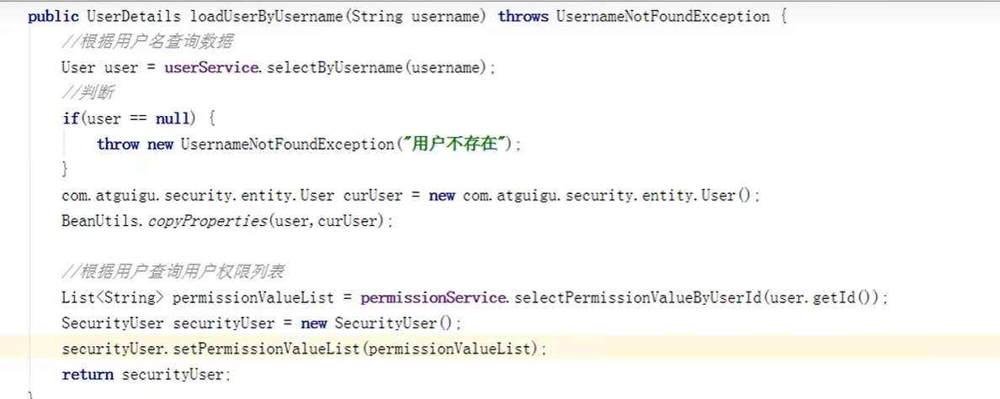
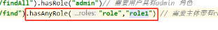
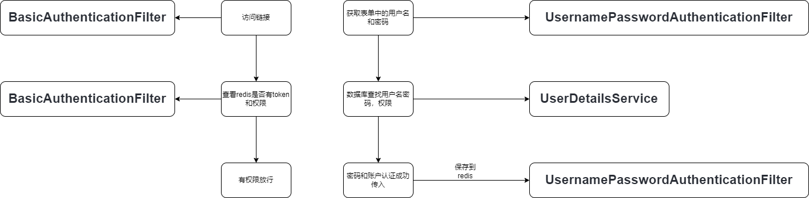

# Spring

## 简介

Spring框架的主要优势之⼀就是其分层架构，分层架构允许使⽤者选择使⽤哪⼀个组件，同时为J2EE应⽤程序开发提供集成的框架。

Spring框架中的组件模块众多，不⽤的组件模块⽤来解决不同的问题，我们可以单独使⽤某⼀个模块，也可以将众多模块根据项⽬需要，进⾏⾃由组合。

Spring框架中的所有组件模块都依赖于Spring提供的俩个基础功能：是控制反转（ IOC ）和⾯向切⾯（ AOP ）。

[Spring 官网](https://spring.io/)

> Spring其他项⽬都会依赖于核⼼项⽬ Spring Framework 的中的组件模块。

[**Spring Framework官⽹**](https://spring.io/projects/spring-framework)

### Spring优势

- 容器性质，⽅便解耦，简化开发**（核⼼）**

  Spring提供的 IOC 容器，可以将对象间的依赖关系交由Spring容器进⾏控制，避免硬编码所造成的过度程序耦合。

- AOP编程的⽀持**（核⼼）**

  通过Spring的 AOP 功能，⽅便进⾏⾯向切⾯的编程，许多不容易⽤传统OOP实现的功能可以通过AOP轻松应付。

- 声明式事务的⽀持

  通过声明式⽅式灵活的进⾏事务的管理，提⾼开发效率和质量

- 集成各种优秀框架

  Spring不仅不排除其他各种优秀的框架，同时对这些框架(Mybatis、Quartz等)提供了很好的⽀持

- 降低JavaEE API的使⽤难度

  Spring对JavaEE API 进⾏了封装，使得这些API降低了使⽤难度

### 模块化

#### 多个依赖

> 用什么到什么依赖


模块分为Core Container、Data Access/Integration、Web、AOP（Aspect Oriented Programming）、Instrumentation和Test

#### **Core Container**

> **核⼼容器**

```xml
<!--spring 核⼼ -->
<dependency>
	<groupId>org.springframework</groupId>
	<artifactId>spring-context</artifactId>
	<version>5.1.9.RELEASE</version>
</dependency>

<!--lombok 新版本idea不需要此依赖-->
<dependency>
	<groupId>org.projectlombok</groupId>
	<artifactId>lombok</artifactId>
	<version>1.18.22</version>
</dependency>
```

Core Container包含有Core、Beans、Context和Expression Language模块

Core和Beans模块：框架的基础部分，提供反转控制（IOC）和依赖注⼊（DI）特性。

Context模块：构建于Core和Beans模块基础之上，提供了对国际化、事件传播、资源加载和对Context的透明创建

的⽀持。ApplicationContext接⼝是Context模块的关键。

Expression Language模块：Expression Language模块提供了⼀个强⼤的表达式语⾔⽤于在运⾏时查询和操纵对象。

#### **Data Access/Integration**

> **数据访问/集成部分**

Data Access/Integration层包含有JDBC、ORM、OXM、JMS和Transaction模块

JDBC模块：该模块提供了⼀个JDBC抽象层，它可以消除冗⻓的JDBC编码和解析数据库⼚商特有的错误代码。

ORM模块：该模块为流⾏的对象-关系映射API——JPA、JDO、Hibernate、Mybatis等提供了⼀个交互层。利⽤

ORM封装包，可以混合使⽤所有Spring提供的特性进⾏O/R映射。如前边提到的简单声明性事物管理。

OXM模块：该模块提供了⼀个对Object/XML映射实现的抽象层，Object/XML映射实现包括JAXB、Castor、XMLBeans、JiBX和XStream。

JMS模块：JMS(Java Messaging Service)模块主要包含了⼀些制造和消费消息的特性。

Transaction模块：该模块⽀持编程和声明性的事物管理，这些事物类必须实现特定的接⼝，并且对所有的POJO都适⽤。

#### **Web**

> **javaweb**

Web层包含了Web、Servlet、WebSocket、Portlet模块

Web模块：该模块提供了基础的⾯向web的集成特性。例如多⽂件上传、使⽤servlet listeners初始化IoC容器以及

⼀个⾯向web的应⽤上下⽂。它还包含Spring远程⽀持中web相关部分。

Servlet模块：该模块包含Spring的model-view-controller（MVC）实现。Spring的MVC框架使得模型范围内的代码

和web forms之间能够清楚的分离开来，并与Spring框架的其他特性集成在⼀起。

WebSocket模块：该模块提供了对WebSocket的⽀持。

Portlet模块：提供了⽤于portlet环境的MVC的实现，Portlet是和Servlet类似的⼀种web技术。

#### **AOP和Instrumentation**

AOP模块：提供了⼀个符合AOP联盟标准的⾯向切⾯编程的实现，它让你可以定义⽅法拦截器和切点，从⽽将逻辑

代码分开，降低它们之间的耦合性。

Aspects模块：提供了对AspectJ的集成⽀持，Spring框架的AOP功能是使⽤AspectJ框架来实现的。

Instrumentation模块提供了class instrumentation⽀持和classloader实现，使得可以在特定的应⽤服务器上使⽤。

#### Test

Test模块：⽀持使⽤JUnit和TestNG对Spring组件进⾏测试。

## SpringFramework

### 依赖

```xml
<!--spring 核⼼ -->
<dependency>
	<groupId>org.springframework</groupId>
	<artifactId>spring-context</artifactId>
	<version>5.1.9.RELEASE</version>
</dependency>
```

生命周期

实例化 -> 属性赋值 -> 初始化 -> 销毁

### Ioc(反转控制)


#### 容器

##### 继承关系


- BeanFactory 和 ApplicationContext 的区别
- BeanFactory是Spring容器的顶层接⼝，ApplicationContext是其⼦接⼝
- ApplicationContext接⼝,它由BeanFactory接⼝派⽣⽽来，包含BeanFactory的所有功能


- BeanFactory
- ApplicationContext
  - ClassPathXmlApplicationContext 从类路径下加载配置文件 resources/
  - FileSystemXmlApplication 从本地文件加载配置文件D:/
  - AnnotationConfigApplicationContext 通过注解加载配置


- BeanFactory 创建容器时不会创建对象，当从容器⾥⾯获取对象时才会创建
- ApplicationContext 创建容器时就会创建对象

#### 获取对象

##### main

```java
public class SpringIocTest {
@Test
public void test(){
	// 1.解析配置⽂件,创建容器
	ApplicationContext ac = new 	ClassPathXmlApplicationContext("applicationContext.xml");
	// 2.根据配置的Id值,从容器中获取对象
	Husband hunsband = (Husband) ac.getBean("husband");
	System.out.println(hunsband);
 }
}
```

##### 通过id直接获取

```xml
<?xml version="1.0" encoding="UTF-8"?>
<beans xmlns="http://www.springframework.org/schema/beans"
       xmlns:xsi="http://www.w3.org/2001/XMLSchema-instance"
       xsi:schemaLocation="http://www.springframework.org/schema/beans
http://www.springframework.org/schema/beans/spring-beans.xsd">
    <!--
    bean标签的作⽤：⽤于配置让Spring容器创建对象
    class : 要创建对象的全限定类名
    name: 该对象在容器中的名字
    -->
    <bean id="husband" name="husband" class="com.briup.ioc.Husband"></bean>
</beans>
```

##### ⼯⼚获取对象：

###### 普通工厂

```java
//普通⼯⼚类
public class HusbandFactory {
 	public Husband getInstance() {
 	Husband h = new Husband();
    return h;
    }
}
```

```xml
<!--
 配置⼯⼚，让Spring容器产⽣⼯⼚实例
 -->
 <bean name="factory" class="com.briup.ioc.HusbandFactory"></bean>
 
 <!--
 factory-bean ⼯⼚实例在Spring容器中的唯⼀标识
 factory-method ⼯⼚实例中的⽅法
 -->
 <bean name="husband" factory-bean="factory" factory-method="getInstance"></bean>
 
</beans>
```

###### 静态工厂

```java
public class HusbandStaticFactory {
	// 静态⽅法
	public static Husband getInstance() {
		return new Husband();
 	}
}
```

```xml
<!--
class ⼯⼚类的全限定类名
factory-method ⼯⼚类⾥⾯的静态⽅法
将来容器取出 name 中的值 本质上调⽤的是 class 中的 factory-method ⽅法
-->
<bean name ="husband" class ="com.briup.ioc.factory.HusbandStaticFactory" factory-method="getInstance" />
```

#### bean标签

- id 给在容器中的对象提供⼀个唯⼀标识，⽤来获取对象
- name 功能类似id，命名要求没有id严格
- class 指定类的全限定类名。⽤于反射创建对象。默认情况下调⽤⽆参构造函数
- scope 指定对象范围
  - sigleton 默认值，单例
  - prototype 多例
  - request WEB项⽬中,Spring容器创建⼀个Bean对象，会将该对象存⼊request
  - session WEB项⽬中，Spring容器创建⼀个Bean对象，会将该对象存⼊session
  - golbal session 只有应⽤在基于portlet的Web应⽤程序中才有意义，它映射到portlet的global范围的sessionr
- init-method : 指定类的初始化⽅法的名称
- destory-method : 指定类中销毁⽅法的名称
- lazy-init ：指定使⽤进⾏延迟加载

> 注意生成的是单例对象

### DI(依赖注入）

#### set方法注入

```xml
<!--
 property 给属性采⽤set⽅法赋值
 name : 属性名，调⽤该属性的set⽅法
 value: 属性值，通过set⽅法赋值
 ref: 属性是其他bean类型采⽤ref(字符串除外)
 
 -->
 <bean name="hunsband" class="com.briup.ioc.Hunsband">
 	<property name="id" value="1"></property>
 	<property name="name" value="tom"></property>
 	<property name="salary" value="2000"></property>
 	<property name="date" ref="now"></property>
 </bean>

<bean name="now" class="java.util.Date"></bean>
```

#### **构造器注⼊**

```xml
<!--
 constructor-arg 让属性赋值采⽤构造函数赋值
 index: 指定参数在构造函数中的索引位置
 type: 指定参数在构造函数中的数据类型
 name: 指定参数在构造函数中的名字
 value: 具体的参数值
 ref: 如果需要的数据为其他bean类型，使⽤ref
-->
<bean id="husband" class="com.briup.ioc.Husband">
 	<constructor-arg name="id" value="2"></constructor-arg>
 	<constructor-arg name="name" value="mary"></constructor-arg> 
 	<constructor-arg name="salary" value="3000"></constructor-arg> 
 	<constructor-arg name="date" ref="now"></constructor-arg>
 </bean>

或者

<bean name="husband" class="com.briup.ioc.Husband">
	<constructor-arg index="0" value="3"></constructor-arg>
	<constructor-arg index="1" value="lucy"></constructor-arg>
	<constructor-arg index="2" value="5000"></constructor-arg>
	<constructor-arg index="3" ref="now"></constructor-arg>
</bean>

<bean name="now" class="java.util.Date"></bean>
```

#### 名明空间注入

```xml
xmlns:p="http://www.springframework.org/schema/p"
```


```xml
<?xml version="1.0" encoding="UTF-8"?>
<beans xmlns="http://www.springframework.org/schema/beans"
 xmlns:p="http://www.springframework.org/schema/p"
xmlns:xsi="http://www.w3.org/2001/XMLSchema-instance"
xsi:schemaLocation="http://www.springframework.org/schema/beans
https://www.springframework.org/schema/beans/spring-beans.xsd">
 
 <bean name="husband" class="com.briup.ioc.Husband" p:id="3" p:name="lucy" p:salary="4000"
p:date-ref="now"></bean>
 
 <bean name="now" class="java.util.Date"></bean>
 
</beans>
```

#### **集合属性注⼊**

```java
@Data
public class Entity {
 private String[] myStrs;
 private List<String> myList;
 private Set<String> mySet;
 private Map<String, String> myMap;
 private Properties myProps;
}
```

```xml
<?xml version="1.0" encoding="UTF-8"?>
<beans xmlns="http://www.springframework.org/schema/beans"
xmlns:xsi="http://www.w3.org/2001/XMLSchema-instance"
xsi:schemaLocation="http://www.springframework.org/schema/beans
https://www.springframework.org/schema/beans/spring-beans.xsd">
 
 	<bean name="entity" class="com.briup.ioc.Entity">
 		<!-- 注⼊数组 -->
 		<property name="myStrs">
 			<array>
 				<value>AAA</value>
 				<value>BBB</value>
			  	<value>CCC</value>
 			</array>
 		</property>
 
 		<!-- 注⼊List -->
 		<property name="myList">
 			<list>
 				<value>DDD</value>
 				<value>EEE</value>
 				<value>FFF</value>
 			</list>
 		</property>
        
        <!-- 注⼊Set -->
 		<property name="mySet">
 			<set>
 				<value>GGG</value>
 				<value>KKK</value>
                <value>LLL</value>
 			</set>
 		</property>
        
        <!-- 注⼊myMap -->
 		<property name="myMap">
 			<map>
 				<!-- 俩种形式都可以注⼊ -->
 				<entry key="name" value="tom"></entry>
 				<entry key="age">
 					<value>20</value>
 				</entry>
 			</map>
 		</property>
 
 
 		<!-- 注⼊Properties -->
 		<property name="myProps">
 			<props>
 				<prop key="name">mary</prop>
 				<prop key="age">30</prop>
 			</props>
 		</property>
 	</bean>
</beans>
        
        
```

### 数据源

- 数据源(连接池)是提高程序性能如出现的
- 事先实例化数据源，初始化部分连接资源
- 使用连接资源时从数据源中获取
- 使用完毕后将连接资源归还给数据源

> 常见的数据源(连接池)：**DBCP、C3P0、BoneCP、Druid**等

#### 导入依赖

```xml
<!-- C3P0连接池 -->
<dependency>
	<groupId>c3p0</groupId>
	<artifactId>c3p0</artifactId>
	<version>0.9.1.2</version>
</dependency>
<!-- Druid连接池 -->
<dependency>
	<groupId>com.alibaba</groupId>
	<artifactId>druid</artifactId>
	<version>1.1.10</version>
</dependency>
```

#### 手动创建

**c3p0**

```java
@Test
public void testC3P0() throws Exception {
		//创建数据源
        ComboPooledDataSource dataSource = new ComboPooledDataSource();
		//设置数据库连接参数
        dataSource.setDriverClass("com.mysql.jdbc.Driver");
        dataSource.setJdbcUrl("jdbc:mysql://localhost:3306/test");
        dataSource.setUser("root");
        dataSource.setPassword("root");
		//获得连接对象
        Connection connection = dataSource.getConnection();
        System.out.println(connection);
        }
}
```

**Druid**

```java
@Test
public void testDruid() throws Exception {
	//创建数据源
     DruidDataSource dataSource = new DruidDataSource();
	//设置数据库连接参数
     dataSource.setDriverClassName("com.mysql.jdbc.Driver");
     dataSource.setUrl("jdbc:mysql://localhost:3306/test");
     dataSource.setUsername("root");
     dataSource.setPassword("root");
	//获得连接对象
     Connection connection = dataSource.getConnection();
     System.out.println(connection);
}
```

#### spring配置

```xml
<context:property-placeholder location="classpath:jdbc.properties"/>读取配置文件
<bean id="dataSource" class="com.mchange.v2.c3p0.ComboPooledDataSource">
     <property name="driverClass" value="${jdbc.driver}"/>
     <property name="jdbcUrl" value="${jdbc.url}"/>
     <property name="user" value="${jdbc.username}"/>
     <property name="password" value="${jdbc.password}"/>
</bean>
```

### 注解

@Component  该注解加在类上代表该类需要让Spring容器去创建对象

> 名字默认类首字母名小写

@Value("") 加在属性上⽤来给属性注⼊数据

#### 配置

##### 文件

添加context名称空间的声明，已经其对对应schema⽂件的声明

```xml
xmlns:context="http://www.springframework.org/schema/context"

http://www.springframework.org/schema/context
http://www.springframework.org/schema/context/spring-context.xsd">
```

```xml
<?xml version="1.0" encoding="UTF-8"?>
<beans xmlns="http://www.springframework.org/schema/beans"
	xmlns:xsi="http://www.w3.org/2001/XMLSchema-instance"
	xmlns:context="http://www.springframework.org/schema/context"
	xsi:schemaLocation="http://www.springframework.org/schema/beans
		https://www.springframework.org/schema/beans/spring-beans.xsd
		http://www.springframework.org/schema/context
		http://www.springframework.org/schema/context/spring-context.xsd">
 
 <!-- 配置要扫描的注解包 -->
 	<context:component-scan base-package="com.briup.ioc"></context:component-scan>
 
</beans>
```

##### 不用配置文件

用AnnotationConfigApplicationContext

```java
ApplicationContext ac = new AnnotationConfigApplicationContext("com.briup.ioc");
```

##### JavaApi配置

 @Configuration+@Bean

```java
@Configuration
public class SpringConfig {
    /**
     * ⼀个@Bean注解就相当于bean标签
 	 * ⽅法的返回值对象会存储在Spring容器中
 	 * ⽅法名就是该对象在容器中的唯⼀标识
 	 */
    
    @Bean
    //⼿动指定名字，例如 @Bean("teacher")
 	public Teacher teacher() {
 		return new Teacher();
 	}
}
```

#### 常用注解

##### 原始注解

- @Component

  作⽤：

  ​		让spring容器来管理对象，相当于在xml中配置⼀个bean。

  属性：

  ​		value: 指定bean的名字，如果不指定，默认为当前类名且⾸字⺟⼩写

- @Controller , @Service , @Repository

  作⽤：

  ​		功能与 @Component 作⽤⼀样，只不过其语义更加明确

  ​		@Controller ⼀般作⽤于 表现层

  ​		@Service ⼀般作⽤于 业务层

  ​		@Repository ⼀般作⽤于 持久层

  属性：

  ​		value : 指定bean的名字,如果不指定，默认为当前类名，且⾸字⺟⼩写

- @Value

  作⽤：

  ​		⽤于给属性注⼊基本数据，此注解中还⽀持SpEL

  属性：

  ​		value :具体的属性值

- @Autowaired

  > JavaApi配中取
  >
  > @Autowaired（required = false）如果找不到就不注入

  作⽤：

  ​		⾃动按照类型注⼊，使⽤注解注⼊属性时，set⽅法可以省略，该注解只能注⼊bean类型，当有多个相同类型时，将bean的名字作为要注⼊对象的属性名，也可以注⼊成功

- @Qualifier

  作⽤：

  ​		在 @Autowaired 注⼊的基础之上，再按照Bean的名字注⼊。在给属性注⼊数据时不能独⽴使⽤，必须

  和 @Autowaired ⼀起使⽤

  属性：

  ​		value：指定bean的名字

- @Resource

  作⽤：

  ​		直接按照bean的id注⼊,只能注⼊bean类型

  属性：

  ​		name: bean的名字

- @Scope

  作⽤：

  ​		指定bean的作⽤范围

  属性：

  ​		value: 指定范围值

  ​		取值为： singleton , prototype , request , session , golbalsession

- @PostConstruct

  作⽤：

  ​		指定初始化⽅法

- @PreDestroy

  作⽤：

  ​		指定销毁⽅法

##### 新注解

- **@Configuration**

作⽤：

​		⽤于指定当前类是⼀个spring配置类，当创建容器时会从该类上加载注解

​		可以使⽤AnnotationConfigApplicationContext(配置类.class) 加载配置

```java
/**
* @Configuration
* 表示当前类是spring的⼀个配置类
* 相当于之前的xml，可以完成其对应的配置功能
*/
@Configuration
public class SpringConfig {
}
```

- **@ComponentScan**

作⽤：

​		⽤于指定spring在初始化容器时要扫描的包

```java
/**
* @Configuration
* 表示当前类是spring的⼀个配置类
* 相当于之前的xml，可以完成其对应的配置功能
*
* @ComponentScan("com.briup.ioc")
* 扫描当前包和指定包下⾯的java类，发现其中spring注解
* 包含指定包下⾯的⼦包
*/
@Configuration
@ComponentScan("com.briup.ioc")
public class SpringConfig {
}
```

- **@Bean**

```java
@Configuration
public class SpringConfig {
    /**
     * ⼀个@Bean注解就相当于bean标签
 	 * ⽅法的返回值对象会存储在Spring容器中
 	 * ⽅法名就是该对象在容器中的唯⼀标识
 	 */
    
    @Bean
    //⼿动指定名字，例如 @Bean("teacher")
 	public Teacher teacher() {
 		return new Teacher();
 	}
}
```

- **@PropertySource**

作⽤：

​		⽤于加载 .properties ⽂件中的值，加载后可以使⽤ @Value("${key}") 的形式来获取

```java
@Configuration
@PropertySource("my-value.properties")//指定要读取的资源⽂件位置
public class SpringConfig {
 @Value("${teacher.id}")
 private int id;
 @Value("${teacher.name}")
 private String name;
 @Value("${teacher.age}")
 private int age;
}
```

properties⽂件：my-value.properties

```properties
teacher.id=2
teacher.name=mary
teacher.age=30
```

- **@Import**

作⽤：

​		⽤于导⼊其他配置类

​		被引⼊配置类中，可以不⽤再写 @Configuration 注解。当然，写上也没问题

​		⼀般项⽬中写了很多配置类的时候，可以再写⼀个总的配置类，这个配置类上使⽤ @Import 去引⼊其他的配置，将来容器只要读取这个⼀个总的配置类即可

```java
@Configuration
@Import(value = {SpringConfig.class})
public class AppConfig {
}
```

### AOP(⾯向切⾯)

```xml
<!-- AspectJ 是⼀个基于 Java 语⾔的 AOP 框架 -->
<dependency>
	<groupId>org.aspectj</groupId>
	<artifactId>aspectjweaver</artifactId>
	<version>1.9.4</version>
</dependency>
```


> 解决统一功能代码的问题  **原理代理模式**

- 在软件业中，AOP为Aspect Oriented Programming的缩写，意为：⾯向切⾯编程，通过预编译⽅式和运⾏期间动态代理实现程序功能的统⼀维护的⼀种技术。
- 利⽤AOP可以对业务逻辑的各个部分进⾏隔离，从⽽使得业务逻辑各部分之间的耦合度降低，提⾼程序的可重⽤性，同时提⾼了开发的效率。
- 将程序中重复的代码抽取出来，在程序执⾏的时候，利⽤动态代理技术，在不修改源码的基础上，把抽取出来的代码，在重新织⼊到原有的程序中，对现有的功能进⾏动态的增强。

####  **术语**

- 切⾯/切⾯类（aspect）

  将来要被织⼊到⽅法执⾏ 前/后/异常 的时候去执⾏的代码⽚段

- 连接点（joinpoint）

  Spring中的连接点是⽬标对象⾥⾯需要被代理的⽅法，默认情况下是⽬标对象中所有⾮final修饰的⽅法

  **如果不是在SpringAOP中，joinPoint可能还会是属性**

- 切⼊点（pointCut）

  ⼀组连接点的集合，就是⼀个切⼊点。因为连接点就是⽅法(spring中是这样)，所有⼀个切⼊点也是⼀组⽅法的集合

- 通知/拦截器（advice）

  控制 切⾯/切⾯类 将来要在⽬标对象中⽅法的什么位置执⾏，例如⽅法的前⾯或者后⾯或者抛异常的时候

- 织⼊（wave）

  将切⾯类织⼊到指定⽅法中去执⾏的动作

- ⽬标对象（target）

  需要被代理的对象，⼀般是代理⽬标对象的⼀个或多个指定的⽅法

- 代理对象（proxy）

  代理⽬标对象，在完成核⼼功能的前提下，添加额外的代码去执⾏

#### 案例

```xml
<!-- AspectJ 是⼀个基于 Java 语⾔的 AOP 框架 -->
<dependency>
	<groupId>org.aspectj</groupId>
	<artifactId>aspectjweaver</artifactId>
	<version>1.9.4</version>
</dependency>
```

**⽬标类接⼝**

```java
package com.briup.service;
public interface ITeacherService {
 
 	void saveOrUpdate();
 	void delete();
 	void deleteBatch();
 
}
```

**⽬标类**

```java
package com.briup.service.impl;
import com.briup.service.ITeacherService;
public class TeacherServiceImpl implements ITeacherService {
 	@Override
 	public void saveOrUpdate() {
 		System.out.println("teacher:保存成功");
 	}
 	@Override
 	public void delete() {
		System.out.println("teacher:删除成功");
 	}
 	@Override
 	public void deleteBatch() {
 		System.out.println("teacher:批量删除成功");
 	}
}
```

**切⾯类（Aspect）**

```java
package com.briup.aspect;
import org.aspectj.lang.ProceedingJoinPoint;
public class MyAspect {
 
	//将该代码⽚段织⼊到⽬标对象中⽅法的执⾏之前
 	public void beforAdvice() {
 		System.out.println("前置通知");
 	}
 
	//将该代码⽚段织⼊到⽬标对象中⽅法的执⾏之后（被代理的⽅法必须正常返回，抛出异常不织⼊）
 	public void afterReturn() {
 		System.out.println("后置通知");
 	}
 
	//将该代码⽚段织⼊到⽬标对象中⽅法的执⾏抛异常的时候
 	public void throwable() {
 		System.out.println("异常通知");
 	}
 
	//将该代码⽚段织⼊到⽬标对象中⽅法的执⾏之后（被代理的⽅法正常返回或者抛出异常都会织⼊该代码⽚段）
 	public void after() {
 		System.out.println("最终通知");
 	}
 
	//将该代码⽚段织⼊到⽬标对象中⽅法的执⾏之前和和之后
 	public void around(ProceedingJoinPoint joinPoint) throws Throwable {
 	System.out.println("环绕通知：前");
 	// 获取执⾏⽅法的参数
 	Object[] args = joinPoint.getArgs();
 	joinPoint.proceed(args);
 	System.out.println("环绕通知: 后");
 	} 
}
```

#### **xml配置**

```xml
<?xml version="1.0" encoding="UTF-8"?>
<beans xmlns="http://www.springframework.org/schema/beans"
       xmlns:aop="http://www.springframework.org/schema/aop"
       xmlns:xsi="http://www.w3.org/2001/XMLSchema-instance"
       xsi:schemaLocation="http://www.springframework.org/schema/beans
 http://www.springframework.org/schema/beans/spring-beans.xsd
 http://www.springframework.org/schema/aop
 http://www.springframework.org/schema/aop/spring-aop.xsd">

    <!-- 配置⽬标类到SpringIOC容器中-->
    <bean name="teacherService" class="com.briup.service.impl.TeacherServiceImpl"></bean>
    <!-- 配置切⾯类到SpringIOC容器中-->
    <bean name="myAspect" class="com.briup.aspect.MyAspect"></bean>
    <!-- 配置aop -->
    <aop:config>
        <!-- 配置切⼊点，⼀组连接点的集合（Spring中就是⼀组⽅法的集合） -->
        <!-- id: 切⼊点的唯⼀标识 -->
        <!-- expression:切⼊点表达式 
			* 包.子包.类.方法(..)
		-->
        <aop:pointcut id="myPointcut1" expression="execution(* com.briup.service..*.*(..))"/>
        <aop:pointcut id="myPointcut2" expression="execution(* com.briup.service..*.delete*(..))"/>

        <!-- 指定容器中，那个对象是切⾯类对象 -->
        <aop:aspect id="aspect" ref="myAspect">
            <!-- 注意，切⼊点myPointcut1和myPointcut2分别代表俩组不同的连接点（⽅法） -->
            <!-- 前置通知，会将切⾯类中的代码⽚段（beforAdvice⽅法）织⼊到myPointcut1中 -->
            <aop:before method="beforAdvice" pointcut-ref="myPointcut1"></aop:before>
            <!-- 最终通知，会将切⾯类中的代码⽚段（after⽅法）织⼊到myPointcut1中 -->
            <aop:after method="after" pointcut-ref="myPointcut1"/>
            <!-- 后置通知，会将切⾯类中的代码⽚段（afterReturn⽅法）织⼊到myPointcut1中 -->
            <aop:after-returning method="afterReturn" pointcut-ref="myPointcut1"/>
            <!-- 环绕通知(d)，会将切⾯类中的代码⽚段（around⽅法）织⼊到myPointcut1中 -->
            <aop:around method="around" pointcut-ref="myPointcut1"/>
            <!-- 异常通知，会将切⾯类中的代码⽚段（throwable⽅法）织⼊到myPointcut2中 -->
            <aop:after-throwing method="throwable" pointcut-ref="myPointcut2"/>
        </aop:aspect>
    </aop:config>
</beans>
```


### 注解

#### 案例

接⼝不变，实现类（⽬标类）上加 @Service ，代替XML中的bean配置

```java
package com.briup.service.impl;
import org.springframework.stereotype.Service;
import com.briup.service.ITeacherService;
@Service
public class TeacherServiceImpl implements ITeacherService {
 	@Override
	public void saveOrUpdate() {
 		System.out.println("teacher:保存成功");
 	}
 	@Override
 	public void delete() {
 		System.out.println("teacher:删除成功");
 	}
 	@Override
 	public void deleteBatch() {
 		System.out.println("teacher:批量删除成功");
 	}
}
```

切⾯类加⼊@Component注解，代替执⾏XML的bean配置，同时加⼊@Aspect注解，指定这是⼀个切⾯类

```java
package com.briup.aspect;
import org.aspectj.lang.ProceedingJoinPoint;
import org.aspectj.lang.annotation.After;
import org.aspectj.lang.annotation.AfterReturning;
import org.aspectj.lang.annotation.AfterThrowing;
import org.aspectj.lang.annotation.Around;
import org.aspectj.lang.annotation.Aspect;
import org.aspectj.lang.annotation.Before;
import org.aspectj.lang.annotation.Pointcut;
import org.springframework.stereotype.Component;
@Component
@Aspect
public class MyAspect {
 
	//注意，⽅法名字就是这个切⼊点的名字
	@Pointcut("execution(* com.briup.service..*.*(..))")
 	public void pointcut1() {}
 
	//注意，⽅法名字就是这个切⼊点的名字
 	@Pointcut("execution(* com.briup.service..*.delete*(..))")
 	public void pointcut2() {}
 
 	@Before("pointcut1()")
 	public void beforAdvice() {
 		System.out.println("前置通知");
 	}
 
 	@AfterReturning("pointcut1()")
 	public void afterReturn() {
 		System.out.println("后置通知");
 	}
 
 	@AfterThrowing("pointcut2()")
 	public void throwable() {
 		System.out.println("异常通知");
 	}
 
 	@After("pointcut1()")
 	public void after() {
 		System.out.println("最终通知");
 	}
 
 	@Around("pointcut1()")
 	public void around(ProceedingJoinPoint joinPoint) throws Throwable {
 		System.out.println("环绕通知：前");
 		// 获取执⾏⽅法的参数
 		Object[] args = joinPoint.getArgs();
 		joinPoint.proceed(args);//z
 		System.out.println("环绕通知: 后");
 	}
}
```

编写配置类，代替XML⽂件的读取

```java
package com.briup.config;
import org.springframework.context.annotation.ComponentScan;
import org.springframework.context.annotation.Configuration;
import org.springframework.context.annotation.EnableAspectJAutoProxy;
@Configuration
@ComponentScan("com.briup")
@EnableAspectJAutoProxy开启aop
public class AOPConfig {
    
}
```

> 注意，@EnableAspectJAutoProxy⽤来指定当前spring配置中使⽤了AspectJ框架的注解
>
> 注意，AspectJ框架是专⻔实现AOP功能的⼀个框架，Spring中AOP功能也是依赖于AspectJ来实现的

```java
@Slf4j
@SpringJUnitConfig(classes = SpringConfig.class)
//@ContextConfiguration(locations = "classpath:applicationContext.xml"
class UserServiceImplTest {
    @Autowired
    private User user;

    @Autowired
    private UserService userService;

    @Test
    void save() {
        log.debug("User:{}",user);
        userService.save(user);
        userService.deleteById(1);
    }
}
```


### 自定义注解加配置

#### 自定义注解

```java
/**
 * @author Dong
 */
@RestController
@RequestMapping("/file")
@Slf4j
public class AopTestController {

    @PostMapping("/upload")
    @FileValid
    public String upload(@FileParam(suffix = {"doc"}) MultipartFile file, HttpServletRequest request, HttpServletResponse response) {

        log.info("in the method ...");

        return "success";
    }

}
```

#### aop配置类

```java
@Autowired
    private ILogService service;

    /**
     * Controller层切点,SysLog是自定义的注解
     */
    //注意，⽅法名字就是这个切⼊点的名字
    @Pointcut("@annotation(com.fuhao.cms.util.ArchivesLog)")
    public void pointcut1() {}


    /**
     * @Description 环绕通知  用于拦截Controller层记录用户的操作
     */
    @Around("pointcut1()")
    public Object around(ProceedingJoinPoint joinPoint) throws Throwable {

        HttpServletRequest request = ((ServletRequestAttributes) RequestContextHolder.getRequestAttributes()).getRequest();

        String token = request.getHeader("token");
        Long userId = null;
        if (token != null){
            userId =  Long.parseLong(JwtUtil.getUserId(token));
        }

        String requireType = request.getMethod();
        String requireUrl = request.getRequestURI();
        Log log = new Log();
        log.setUserId(userId);
        log.setRequestMode(requireType);
        log.setRequestUrl(requireUrl);
        log.setRequestTime(LocalDateTime.now());


        Object result = joinPoint.proceed();

        service.saveLog(log);

        return result;
    }
}
```


### 事务

Spring中操作事务的⽅式主要有两种：

- 编程式事务
- 声明式事务

#### 编程式事务

​	使⽤编程的⽅式，⾃⼰去实现事务管理⼯作，例如事务的开启、提交、回滚操作，需要开发⼈员⾃⼰调⽤commit()或者rollback()等⽅法来实现。

​	编程式事务需要我们⾃⼰在逻辑代码中⼿动书写事务控制逻辑，所以编程式事务是具有侵⼊性的。

```java
Sqlsession session = sqlSessionFactory.openSqlSession(false);
TeacherMapper mapper = session.getMapper(TeacherMapper.class)
try{
    mapper.insert(teacher);
    session.commi;
}catch(Exception e){
    session.rollback();
}
```

#### 声明式事务

​	只需要声明或者配置⼀个事务就可以了，不需要我们⼿动去编写事务管理代码。

这种⽅式属于⾮侵⼊性的，可以使⽤AOP思想实现事务管理，能够提⾼代码的复⽤性，提⾼开发效率。

例如，在Spring中，使⽤AOP来实现事务操作

- 将service层事务的开启、提交、回滚等代码抽出来，封装成切⾯类
- 使⽤环绕通知，将事务管理的代码织⼊到service层需要事务⽀持的⽅法中
- 获取service 实现类的代理对象，调⽤⽅法时会动态加⼊事务管理的代码

Spring中，使⽤AOP

- 目标类service下的类
- 切面类 开启事务，提交事务 回滚事务
  - spring提供了 PlatformTransactionManager类
- 代理类

##### **接⼝**

Spring事务管理器的接⼝是 org.springframework.transaction.PlatformTransactionManager ，通过这个接⼝，Spring为各个平台如JDBC、Hibernate、JPA、JTA等都提供了对应的事务管理器，但是具体的实现就是各个平台⾃⼰的事情了。


整PlatformTransactionManager 接⼝中只有三个⽅法：

```java
Public interface PlatformTransactionManager{ 
	// 由TransactionDefinition得到TransactionStatus对象
	TransactionStatus getTransaction(TransactionDefinition definition) throws
TransactionException;
	// 提交
	Void commit(TransactionStatus status) throws TransactionException; 
	// 回滚
	Void rollback(TransactionStatus status) throws TransactionException; 
}
```

> 该接⼝中的 getTransaction ⽅法通过 TransactionDefinition 类型参数，获取事务的状态

##### 事务属性

org.springframework.transaction.TransactionDefinition 接⼝中，定义了事务的⼀些基本的属性，事务的属性主要包括五个⽅⾯：**（重要）**

- 传播⾏为

  > 事务传播⾏为（propagation behavior），当事务⽅法被另⼀个事务⽅法调⽤时，必须指定事务应该如何传播 

  在事务⽅法A调⽤事务⽅法B的时候，事务⽅法B可能继续在现有事务中运⾏，也可能开启⼀个新事务，并在这个⾃⼰的事务中运⾏。Spring定义了七种传播⾏为：

  

  ```java
  public interface TransactionDefinition {
   int PROPAGATION_REQUIRED = 0;
   
   int PROPAGATION_SUPPORTS = 1;
   
   int PROPAGATION_MANDATORY = 2;
   
   int PROPAGATION_REQUIRES_NEW = 3;
   
   int PROPAGATION_NOT_SUPPORTED = 4;
   
   int PROPAGATION_NEVER = 5;
   
   int PROPAGATION_NESTED = 6;
  	
   int getPropagationBehavior();
  }
  ```

- 隔离级别

  相对于JDBC的隔离级别，Spring除了读未提交、读已提交、可重复读和串⾏化之外，还为我们提供了⼀个默认的隔离级别，例如：

  - ISOLATION_DEFAULT 默认级别，归属下⾯级别中的某⼀种

    ISOLATION_READ_UNCOMMITTED 读未提交

    ISOLATION_READ_COMMITTED 读已提交

    ISOLATION_REPEATABLE_READ 可重复读

    ISOLATION_SERIALIZABLE 串⾏化

  ```java
  public interface TransactionDefinition {
  int ISOLATION_DEFAULT = -1;
   
   int ISOLATION_READ_UNCOMMITTED = Connection.TRANSACTION_READ_UNCOMMITTED;
   
   int ISOLATION_READ_COMMITTED = Connection.TRANSACTION_READ_COMMITTED;
   
   int ISOLATION_REPEATABLE_READ = Connection.TRANSACTION_REPEATABLE_READ;
   
   int ISOLATION_SERIALIZABLE = Connection.TRANSACTION_SERIALIZABLE;
  int getIsolationLevel();
  }
  ```

  其中， ISOLATION_DEFAULT 是 DataSourceTransactionManager 的默认隔离级别，该隔离级别的意思就是使⽤数据库默认的隔离级别：

  mysql是REPEATABLE_READ

  oracle是READ_COMMITTED

- 是否只读

  如果事务中只包含对数据库的读操作，那么数据库可以利⽤事务的只读特性来进⾏⼀些特定的优化。

  ```java
  public interface TransactionDefinition {
  	boolean isReadOnly();
  }
  ```

- 事务超时

  为了使应⽤程序很好地运⾏，事务不能运⾏太⻓的时间。因为事务可能涉及对后端数据库的锁定，所以⻓时间的事务会不必要的占⽤数据库资源。

  ```java
  public interface TransactionDefinition {
  	int TIMEOUT_DEFAULT = -1;
  	int getTimeout();
  }
  ```

- 回滚规则

  在声明式事务的配置中，我们⼀般还会配置事务的另⼀个属性就是回滚规则

  > 默认配置下，事务只会对Error与RuntimeException及其⼦类这些UnChecked异常，做出回滚。⾮运⾏时异常这些Checked异常不会发⽣回滚，如果⼀般Exception想要回滚那么必须进⾏配置。

  

##### JDBC

```xml
<bean name="transactionManager"class="org.springframework.jdbc.datasource.DataSourceTransactionManager">
	<property name="dataSource" ref="dataSource" />
</bean>
```

###### xml

```xml
<?xml version="1.0" encoding="UTF-8"?>
<beans xmlns="http://www.springframework.org/schema/beans"
	xmlns:xsi="http://www.w3.org/2001/XMLSchema-instance"
 	xmlns:aop="http://www.springframework.org/schema/aop"
 	xmlns:tx="http://www.springframework.org/schema/tx"
 	xsi:schemaLocation="http://www.springframework.org/schema/beans
	 	http://www.springframework.org/schema/beans/spring-beans.xsd
 		http://www.springframework.org/schema/tx
 		http://www.springframework.org/schema/tx/spring-tx.xsd
 		http://www.springframework.org/schema/aop
 		http://www.springframework.org/schema/aop/spring-aop.xsd">
 	
     <!-- 配置JDBC的事务管理器 -->
 	 <bean name="transactionManager" class="org.springframework.jdbc.datasource.DataSourceTransactionManager">
 		<!-- 注⼊数据源 -->
 		<property name="dataSource" ref="dataSource"></property>
 	</bean>
 
 	<!-- 配置事务拦截器 -->
	<tx:advice id="txAdvice" transaction-manager="transactionManager">
 		<!-- 配置事务属性 -->
 		<tx:attributes>
 			<!--
 			name : 指定⽅法名称 *代表任意赐福
 			read-only 是否是只读事务
 			isolation：指定事务的隔离级别。默认值是使⽤数据库的默认隔离级别。
 			propagation：指定事务的传播⾏为。
 			timeout：指定超时时间。默认值为：-1。永不超时。
 			rollback-for：⽤于指定⼀个异常，当执⾏产⽣该异常时，事务回滚。
 			no-rollback-for：⽤于指定⼀个异常，当产⽣该异常时，事务不回滚。
 			-->
 			<tx:method name="find*" read-only="true" propagation="SUPPORTS"/>
 			<tx:method name="*" propagation="REQUIRED" rollback-for="Exception"/>
 		</tx:attributes>
    </tx:advice>
 
 	<!-- 配置 aop -->
 	<aop:config>
 		<!-- 定义切⼊点（⼀组⽅法的集合，这些⽅法需要织⼊事务控制代码） -->
 		<aop:pointcut id="txPointcut" expression="execution(* com.briup.service..*.*(..))"/>
 		<!-- 定义advisor，可以⽤来组合已有的advice和pointcut -->
		<!-- 事务拦截器 会将 事务管理器的代码（切⾯类） 织⼊ 到值的切⼊点内（⼀组⽅法的集合） -->
 		<aop:advisor advice-ref="txAdvice" pointcut-ref="txPointcut"/>
 	</aop:config> 
        
</beans>
```

###### 注解

目标类

```java
@Transactional(propagation = Propagation.REQUIRED,isolation = Isolation.DEFAULT)
@Service
public class TeacherServiceImpl implements TeacherService {
//    属性注入 get set
    @Autowired
    private TeacherDao teacherDao;

    @Transactional(propagation = Propagation.REQUIRED,isolation = Isolation.DEFAULT)
    @Override
    public void insert(Teacher teacher) {

    }
}
```

配置类

```java
@Configuration
@ComponentScan("com.briup.service")
@EnableTransactionManagement开启事务
public class SpringConfig {
 
}
```

切面类

```java
@Configuration
@ComponentScan("com.fuhao.service")
public class SpringServiceConfig {

    @Autowired
    private DruidDataSource druidDataSource;

    @Bean
    public PlatformTransactionManager platformTransactionManager(){
        return new DataSourceTransactionManager();
    }
}
```

见mybatis

## Spring-junit

### 准备

导⼊spring-test测试模块jar包和Junit单元测试框架

```xml
<!--spring 集成测试 -->
<dependency>
<groupId>org.springframework</groupId>
<artifactId>spring-test</artifactId>
<version>5.1.9.RELEASE</version>
</dependency>
<!-- 测试单元 -->
<!-- <dependency>-->
<!-- <groupId>junit</groupId>-->
<!-- <artifactId>junit</artifactId>-->
<!-- <version>4.12</version>-->
<!-- </dependency>-->
<dependency>
<groupId>org.junit.jupiter</groupId>
<artifactId>junit-jupiter-api</artifactId>
<version>5.8.2</version>
<scope>test</scope>
</dependency>
```

### 整合

**JUnit4**

```java
@RunWith(SpringJUnit4ClassRunner.class)
	/*
	  指明使⽤什么类来创建容器
	  也可以写成 @RunWith(SpringRunner.class)
	*/
@ContextConfiguration(classes=TestConfig.class)
	/*
	  location 导⼊具体的配置⽂件，如果有的话例如，@ContextConfiguration(locations = "classpath:applicationContext.xml")
	  classes 导⼊具体的配置类，如果有的话
	*/

public class SpringJUnit4Test {
 
	@Autowired //指的让容器把需要的对象进⾏⾃动注⼊
 	private Student student;
    
 	@org.junit.Test
 	public void test() {
 		System.out.println(student);
 	}
 }
```

**JUnit5**

```java
@ExtendWith(SpringExtension.class)
	//是配置JUnit Jupiter（导入junit5下的类包）使⽤Spring⽀持扩展测试
@ContextConfiguration(classes=TestConfig.class)
public class SpringJUnit5Test {
 	@Autowired
 	private Student student;
    
 	@org.junit.jupiter.api.Test
 	public void test1() {
 		System.out.println(student);
 	}
}
```

> 如果是Junit5，可以使⽤下⾯⽅式简化配置：@SpringJUnitConfig(classes = TestConfig.class)

```java
@SpringJUnitConfig(classes = TestConfig.class)
public class SpringJUnit5Test {
 	@Autowired
 	private Student student;
 	
	@org.junit.jupiter.api.Test
 	public void test1() {
 		System.out.println(student);
 	}
}
```

## spring—web

### 问题

应用上下文对象是通过<font color="#ff0000">new ClasspathXmlApplicationContext(spring配置文件)</font>方式获取的，但是每次从容器中获得Bean时都要编写<font color="#ff0000">new ClasspathXmlApplicationContext(spring配置文件)</font>，这样的弊端是配置文件加载多次，应用上下文对象创建多次。

在Web项目中，可以使用<font color="#ff0000">ServletContextListener</font>监听Web应用的启动，我们可以在Web应用启动时，就加载Spring的配置文件，创建应用上下文对象<font color="#ff0000">ApplicationContext</font>，在将其存储到最大的域****<font color="#ff0000">servletContext</font>域中，这样就可以在任意位置从域中获得应用上下文<font color="#ff0000">ApplicationContext</font>对象了。

### 解决

上面的分析不用手动实现，Spring提供了一个监听器<font color="#ffoooo">**ContextLoaderListener**</font>就是对上述功能的封装，该监听器内部加载Spring配置文件，创建应用上下文对象，并存储到**<font color="#ffoooo">ServletContext</font>**域中，提供了一个客户端工具<font color="#ffoooo">**WebApplicationContextUtils**</font>供使用者获得应用上下文对象。

> Spring框架在web环境（Servlet）中的⼯作核⼼是：
>
> - 在web.xml中配置监听器，启动服务器的过程中读取Spring的配置⽂件或者配置类，创建Spring容器
> - 在web环境中，Spring容器的类型是 WebApplicationContext ，它是 ApplicationContext 的⼦接⼝

### 导入依赖

```xml
<dependency>
	<groupId>org.springframework</groupId>
	<artifactId>spring-web</artifactId>
	<version>5.0.5.RELEASE</version>
</dependency>
```

### 配置监听器

web.xml

```xml
<!--全局参数-->
<context-param>
	<param-name>contextConfigLocation</param-name>
	<param-value>classpath:applicationContext.xml</param-value>
</context-param>
<!--Spring的监听器-->
<listener>
	<listener-class>
		org.springframework.web.context.ContextLoaderListener
	</listener-class>
</listener>
```

### 通过工具获取

```java
ApplicationContext applicationContext = WebApplicationContextUtils.getWebApplicationContext(servletContext);
Object obj = applicationContext.getBean("id");
```

## Spring-MVC

### 简介

#### MVC

MVC（Model-View-Controller），是⼀种架构型的模式,本身不引⼊新功能,只是帮助我们将开发的代码结构,组织的更加合理。其中：

- Model(模型)

  负责提供要展示的数据,因此包含数据和⾏为,⾏为是⽤来处理这些数据的。

  不过现在⼀般都分离开来，例如分为Value Object（数据） 和 服务层（⾏为）。

  也就是数据由实体类或者javabean来提供,⾏为由service层来提供。

- View(视图)

  负责进⾏模型的展示,⼀般就是我们⻅到的⽤户界⾯,客户想看到的东⻄

- Controller(控制器)

  负责接收⽤户请求,委托给模型进⾏处理,处理完毕后把返回的模型数据交给给视图。

  也就是说控制器在中间起到⼀个调度的作⽤。


#### **Spring Web MVC**

SpringWebMVC简称SpringMVC，它是Spring Framework框架中提供的⼀个模块,通过实现MVC模式来很好地将数据、业务与展现进⾏分离。

**SpringMVC** 是一种基于 Java 的实现 **MVC 设计模型**的请求驱动类型的轻量级 **Web 框架**，属于**SpringFrameWork** 的后续产品，已经融合在 Spring Web Flow 中。

SpringMVC 已经成为目前最主流的MVC框架之一，并且随着Spring3.0 的发布，全面超越 Struts2，成为最优秀的 MVC 框架。它通过一套注解，让一个简单的 Java 类成为处理请求的控制器，而无须实现任何接口。同时它还支持  <font color="#ffoooo">RESTful</font>编程风格的请求

#### 组件

SpringMVC中的核⼼组件，有以下⼏种：

- 分发器 DispatcherServlet

  > 前端控制器。⽤来过滤客户端发送过来,想要进⾏逻辑处理的请求

- 映射器 HandlerMapping

  > 找到控制器（那个selvet）

  处理器映射器（简称映射器）。DispatcherServlet接收到客户端请求的URL之后,根据⼀定的匹配规则,再把请求转发给对应的Handler,这个匹配规则由HandlerMapping 决定

- 控制器 Controller/Headler

  控制器/处理器。开发⼈员⾃定义,⽤来处理⽤户请求的,并且处理完成之后返回给⽤户指定视图的对象相当于我们之前编写的Servlet

- 适配器 HandlerAdaptor

  > 找到控制器对应方法 返回字符串(页面名)

  ⽤来适配每⼀个要执⾏的Handler对象。通过HandlerAdapter可以⽀持任意的类作为处理器。作⽤是告诉SpringMVC框架，将来需要调⽤Controller中的哪⼀个⽅法。

- 视图解析器 ViewResolver

  > 将适配器返回的字符转转为页面

  视图解析器（简称解析器）。Controller/Headler返回的是逻辑视图名,需要有⼀个解析器能够将逻辑视图名转换成实际的物理视图。例如，Controller中返回的逻辑视图名字为"hello"，解析器可以给这个逻辑视图名转换为真正的物理视图名，例如加⼊前缀和后缀：/WEB-INF/jsp/hello.jsp

  SpringMVC的可扩展性，决定了视图可以有很多种,所以不同的情况下需要不同的视图解析器，例如使⽤jsp充当视图的时候，就需要使⽤专⻔的jsp解析器

- 拦截器 Interceptor

  > flter

  ⽇志记录 权限检查 性能监控 通⽤⾏为

  适配器

  

​	


当⼀个请求进来之前，SpringMVC中的核⼼组件会⼀起配合来完成本次请求的处理：

1. 请求被前端控制器（DispatcherServlet）接收到
2. 前端控制器（DispatcherServlet）根据映射器（HandlerMapping）中配置的映射关系，将这个请求转交给真正能够处理客户端请求的处理（Controller/Headler）

3. 处理器（Controller/Headler）通过适配器（HandlerAdaptor），执⾏指定⽅法进⾏处理，完成后返回给⽤户ModelAndView（模型和视图的结合体）

4. 视图解析器（ViewResolver）根据ModelAndView中的逻辑视图名找到真正的物理视图

5. 使⽤ModelAndView中的模型对视图进⾏渲染


### 项目搭建xml

#### 步骤

1. 构建Web项⽬

2. 导⼊所需jar包

3. 配置前端控制器 DispatcherServlet

4. 编写 Controller 控制器(也称为 Handler 处理器)

5. 配置处理器映射器(可省去,有默认配置)

6. 配置处理器适配器(可省去,有默认配置)

7. 配置视图解析器(可省去,有默认配置,但是前缀和后缀都为"")

8. 配置控制器/处理器

#### 依赖

```xml
<dependencies>
    <!--spring核⼼-->
    <dependency>
        <groupId>org.springframework</groupId>
        <artifactId>spring-context</artifactId>
        <version>5.1.9.RELEASE</version>
    </dependency>
    <!--spring集成测试-->
    <dependency>
        <groupId>org.springframework</groupId>
        <artifactId>spring-test</artifactId>
        <version>5.1.9.RELEASE</version>
    </dependency>
    <!--测试单元-->
    <dependency>
        <groupId>junit</groupId>
        <artifactId>junit</artifactId>
        <version>4.12</version>
    </dependency>
    <!--⽇志-->
    <dependency>
        <groupId>log4j</groupId>
        <artifactId>log4j</artifactId>
        <version>1.2.17</version>
    </dependency>
    <!--集成slf4j-->
    <dependency>
        <groupId>org.slf4j</groupId>
        <artifactId>slf4j-log4j12</artifactId>
        <version>1.7.21</version>
    </dependency>
    <!--lombok 新版本idea不需要此依赖-->
    <dependency>
        <groupId>org.projectlombok</groupId>
        <artifactId>lombok</artifactId>
        <version>1.18.22</version>
        <scope>provided</scope>
    </dependency>
    <!-- aop  https://mvnrepository.com/artifact/org.aspectj/aspectjweaver -->
    
    <dependency>
        <groupId>org.aspectj</groupId>
        <artifactId>aspectjweaver</artifactId>
        <version>1.9.4</version>
    </dependency>
    <!--数据库-->
    <dependency>
        <groupId>com.oracle</groupId>
        <artifactId>ojdbc8</artifactId>
        <version>8</version>
    </dependency>
    <!--连接池-->
    <dependency>
        <groupId>com.alibaba</groupId>
        <artifactId>druid</artifactId>
        <version>1.1.10</version>
    </dependency>
    <!--整合mybatis 需要mybatis,mybatis-spring,spring-jdbc三个依赖 -->
    <dependency>
        <groupId>org.mybatis</groupId>
        <artifactId>mybatis</artifactId>
        <version>3.4.6</version>
    </dependency>
    <!-- https://mvnrepository.com/artifact/org.mybatis/mybatis-spring -->
    <dependency>
        <groupId>org.mybatis</groupId>
        <artifactId>mybatis-spring</artifactId>
        <version>2.0.6</version>
    </dependency>
    <dependency>
        <groupId>org.springframework</groupId>
        <artifactId>spring-jdbc</artifactId>
        <version>5.1.9.RELEASE</version>
    </dependency>
    <!--springmvc所需依赖-->
    <!-- servlet3.1规范的坐标 -->
    <dependency>
        <groupId>javax.servlet</groupId>
        <artifactId>javax.servlet-api</artifactId>
        <version>3.1.0</version>
        <scope>provided</scope>
    </dependency>
    <!--jsp坐标-->
    <dependency>
        <groupId>javax.servlet.jsp</groupId>
        <artifactId>jsp-api</artifactId>
        <version>2.1</version>
        <scope>provided</scope>
    </dependency>
    <!--spring web的坐标-->
    <dependency>
        <groupId>org.springframework</groupId>
        <artifactId>spring-web</artifactId>
        <version>5.1.9.RELEASE</version>
    </dependency>
    <!--springmvc的坐标-->
    <dependency>
        <groupId>org.springframework</groupId>
        <artifactId>spring-webmvc</artifactId>
        <version>5.1.9.RELEASE</version>
    </dependency>
</dependencies>
```

#### 编写控制器

```java
public class HelloController implements Controller{
 	@Override
 	public ModelAndView handleRequest(HttpServletRequest request, HttpServletResponse response) throws Exception {
 
 		String name = request.getParameter("name");
 
 		//ModelAndView对象中包括了要返回的逻辑视图,以及数据模型
		ModelAndView mv = new ModelAndView();
 
 		//设置数据模型
 		mv.addObject("name", name);
    	//设置逻辑视图名称
 		mv.setViewName("hello");
 		return mv;
 	}
}
```

##### ModelAndView

```java
//ModelAndView对象中包括了要返回的逻辑视图,以及数据模型
ModelAndView mv = new ModelAndView();
 
//设置数据模型
mv.addObject("name", name);
//设置逻辑视图名称
mv.setViewName("hello");
```


#### 配置分发器（web.xml）

```xml
<?xml version="1.0" encoding="UTF-8"?>
<web-app xmlns="http://xmlns.jcp.org/xml/ns/javaee"
         xmlns:xsi="http://www.w3.org/2001/XMLSchema-instance"
         xsi:schemaLocation="http://xmlns.jcp.org/xml/ns/javaee http://xmlns.jcp.org/xml/ns/javaee/web-app_4_0.xsd"
         version="4.0">
	
    
   <!--陪值过滤器-->
   <filter>
		<filter-name>CharacterEncodingFilter</filter-name>
		<filterclass>org.springframework.web.filter.CharacterEncodingFilter</filter-class>
       <!--设置编码-->
		<init-param>
			<param-name>encoding</param-name>
			<param-value>UTF-8</param-value>
		</init-param>
       <!--是否强制使用-->
		<init-param>
			<param-name>forceEncoding</param-name>
			<param-value>true</param-value>
		</init-param>
	</filter>
    <!--拦截规则-->
	<filter-mapping>
		<filter-name>CharacterEncodingFilter</filter-name>
		<url-pattern>/*</url-pattern>
	</filter-mapping>
    
    
    <!--配置servlet-->
    <servlet>
        <!--分发器-->
        <!--执行servlet service-->
        <servlet-name>DispatcherServlet</servlet-name>
        <servlet-class>org.springframework.web.servlet.DispatcherServlet</servlet-class>
        
        <!--DispatcherServlet协调组件 来自于spring配置文件
			默认去/WEB-INF下<servlet-name>-spring.xml-->
		<!--配置spring⽂件的加载路径-->
        <init-param>
            <param-name>contextConfigLocation</param-name>
            <param-value>classpath:springmvc.xml</param-value>
        </init-param>
        
        <!--每次启动生效>1-->
        <load-on-startup>1</load-on-startup>
    </servlet>
    
    
    <!--配置针对image/css/js等访问给则-->
    <servlet-mapper>
    	<servlet-name>default</servlet-name>
        <url-pattern>*.css</url-pattern>
    </servlet-mapper>

    <servlet-mapping>
        <!--只要命中.url-pattern 就DispatcherServlet拦截-->
        <!--只要.action结尾的都走组件
			/*.拦截所有资源
			/拦截servlet资源和静态资源，不拦截jsp资源-->
        
        <servlet-name>DispatcherServlet</servlet-name>
        <url-pattern>*.action</url-pattern>
    </servlet-mapping>

</web-app>
```


#### 配置(springmvc.xml)

```xml
<?xml version="1.0" encoding="UTF-8"?>
<beans xmlns="http://www.springframework.org/schema/beans"
       xmlns:xsi="http://www.w3.org/2001/XMLSchema-instance"
       xsi:schemaLocation="http://www.springframework.org/schema/beans http://www.springframework.org/schema/beans/spring-beans.xsd">


    <!--配置控制器-->
    <bean id="/hello.action" class="com.fuhao.controller.HelloController"/>
    <!--配置拦截器-->
    <bean name="helloInterceptor" class="com.fuhao.interceptor.HelloInterceptor"/>
    
    方法一
    <!-- 使⽤专⻔的mvc标签配置拦截器 -->
 	<mvc:interceptors>
 		<mvc:interceptor>
 			<!-- 指定需要拦截的请求路径 -->
 			<mvc:mapping path="/**"/>
 			<!-- 指定不进⾏拦截的请求路径 -->
 			<mvc:exclude-mapping path="/test"/>
 			<!-- 指定拦截器对象 -->
 			<ref bean="myInterceptor"/>
 		</mvc:interceptor>
 	</mvc:interceptors>

    <!--配置映射器
        映射规则 beanname(/hello.action) === url(/hello.action)-->
    <bean class="org.springframework.web.servlet.handler.BeanNameUrlHandlerMapping">
        方法二
        <!--配置拦截器绑定-->
        <property name="interceptors" >
            <list>
                <ref bean="helloInterceptor"/>
            </list>
        </property>
    </bean>

    <!--配置适配器-->
    <bean class="org.springframework.web.servlet.mvc.SimpleControllerHandlerAdapter"/>

    <!--配置试图解析器
        选取页面解析引擎，解析，试图 hello -> /WEB-INF/jsp/hello.jsp-->
    <bean class="org.springframework.web.servlet.view.InternalResourceViewResolver">
        
        <!-- 需要jstl依赖 设置⽣成的视图的类型
 		<property name="viewClass" value="org.springframework.web.servlet.view.JstlView"/>
 		
		<dependency>
			<groupId>javax.servlet</groupId>
			<artifactId>jstl</artifactId>
			<version>1.2</version>
  		</dependency>
		-->
        
        
        <!--地址前缀-->
        <property name="prefix" value="/WEB-INF/jsp/"/>
        <!--hello.jsp-->
        <property name="suffix" value=".jsp"/>
    </bean>


</beans>
```

### 注解

#### 配置

- @Controller （指定控制器）
- @RequestMapping （指定控制器中的⽅法和对应的映射路径）

##### web.xml

```xml
<?xml version="1.0" encoding="UTF-8"?>
<web-app xmlns="http://xmlns.jcp.org/xml/ns/javaee"
         xmlns:xsi="http://www.w3.org/2001/XMLSchema-instance"
         xsi:schemaLocation="http://xmlns.jcp.org/xml/ns/javaee http://xmlns.jcp.org/xml/ns/javaee/web-app_4_0.xsd"
         version="4.0">
	
    
   <!--陪值过滤器-->
   <filter>
		<filter-name>CharacterEncodingFilter</filter-name>
		<filterclass>org.springframework.web.filter.CharacterEncodingFilter</filter-class>
       <!--设置编码-->
		<init-param>
			<param-name>encoding</param-name>
			<param-value>UTF-8</param-value>
		</init-param>
       <!--是否强制使用-->
		<init-param>
			<param-name>forceEncoding</param-name>
			<param-value>true</param-value>
		</init-param>
	</filter>
    <!--拦截规则-->
	<filter-mapping>
		<filter-name>CharacterEncodingFilter</filter-name>
		<url-pattern>/*</url-pattern>
	</filter-mapping>
    
    
    <!--配置servlet-->
    <servlet>
        <!--分发器-->
        <!--执行servlet service-->
        <servlet-name>DispatcherServlet</servlet-name>
        <servlet-class>org.springframework.web.servlet.DispatcherServlet</servlet-class>
        
        <!--DispatcherServlet协调组件 来自于spring配置文件
			默认去/WEB-INF下<servlet-name>-spring.xml-->
		<!--配置spring⽂件的加载路径-->
        <init-param>
            <param-name>contextConfigLocation</param-name>
            <param-value>classpath:spring-web-mvc-annotation.xml</param-value>
        </init-param>
        
        <!--每次启动生效>1-->
        <load-on-startup>1</load-on-startup>
    </servlet>
    
    
    <!--配置针对image/css/js等访问给则-->
    <servlet-mapper>
    	<servlet-name>default</servlet-name>
        <url-pattern>*.css</url-pattern>
    </servlet-mapper>

    <servlet-mapping>
        <!--只要命中.url-pattern 就DispatcherServlet拦截-->
        <!--只要.action结尾的都走组件
			/*.拦截所有资源
			/拦截servlet资源和静态资源，不拦截jsp资源-->
        
        <servlet-name>DispatcherServlet</servlet-name>
        <url-pattern>*.action</url-pattern>
    </servlet-mapping>

</web-app>
```

> 使⽤ @Controller 后，TestController就成为了SpringIOC容器中的bean对象了，但是需要我们在xml中，指定Spring扫描的包路径，这样Spring就可以找到TestController类上⾯的注解了。

##### spring-web-mvc-annotation.xml

```xml
<?xml version="1.0" encoding="UTF-8"?>
<beans xmlns="http://www.springframework.org/schema/beans"
       xmlns:p="http://www.springframework.org/schema/p"
       xmlns:context="http://www.springframework.org/schema/context"
       xmlns:mvc="http://www.springframework.org/schema/mvc"
       xmlns:xsi="http://www.w3.org/2001/XMLSchema-instance"
       xsi:schemaLocation="http://www.springframework.org/schema/beans
http://www.springframework.org/schema/beans/spring-beans.xsd
http://www.springframework.org/schema/context
http://www.springframework.org/schema/context/spring-context.xsd
http://www.springframework.org/schema/mvc
http://www.springframework.org/schema/mvc/spring-mvc.xsd">
    <!-- 指定spring扫描的包路径 -->
    <context:component-scan base-package="com.briup.web.controller"></context:component-scan>
    <!-- 开启springmvc的注解功能 -->
    <mvc:annotation-driven conversion-service="formatService"></mvc:annotation-driven>
    
    <!--类型转换器-->
    <bean name="formatService"
class="org.springframework.format.support.FormattingConversionServiceFactoryBean">
	<property name="converters">
		<set>
		<!-- ⾃⼰编写的类型转换器,可以有多个 -->
			<bean class="com.briup.web.converter.StringToDateConverter"></bean>
		</set>
	</property>
</bean>

    <!-- 配置视图解析器-->
    <bean class="org.springframework.web.servlet.view.InternalResourceViewResolver">
        <property name="viewClass" value="org.springframework.web.servlet.view.JstlView"/>
        <property name="prefix" value="/WEB-INF/jsp/"/>
        <property name="suffix" value=".jsp"/>
    </bean>

    <!-- 配置静态资源不被拦截 -->
    <mvc:default-servlet-handler/>
    
    <!-- 配置请求中如果访问/upload路径，那么就直接返回 upload_test 逻辑视图名 -->
    <mvc:view-controller path="/upload" view-name="upload_test"/>

</beans>
```

##### 案例

```java
@RequestMapping("/mvc")
//时Controller中所有的映射⽅法的访问，都会多⼀个前缀 /mvc
@Controller
public class TestController {
 
 	@RequestMapping("/test")
 	public ModelAndView test(){
 		ModelAndView mv = new ModelAndView("hello");
 		return mv;
 	}
 
    //返回值为String 返回逻辑视图名
 	@RequestMapping("/test1")
	public String test1(){ 
 		return "hello";
 	}
    
    //返回值为void 不需要前端控制器处理，⽅法内部就处理本次请求的响应了
    @RequestMapping("/test2")
 	public void test2(HttpServletResponse response) throws IOException{
 		response.getWriter().println("hello world");
 	}
    
    //可以在参数列表中声明request，如果要传值给视图，可以在参数列表中声明model，将数据存放在model中即可
    
    //request、response、model，这些参数只要声明，就可以直接使⽤，springmvc在调⽤的时候会⾃动注⼊的，参数的名字和顺序没要求，只要参数的类型正确即可
    @RequestMapping("/test3")
 	public String test3(HttpServletRequest request, Model model) throws IOException{
 
 		String name = request.getParameter("name");
 		model.addAttribute("name", name);
 		return "hello";
 	}
}
```

##### 其他

Spring2.5中，引⼊注解对Controller进⾏⽀持

- @Controller，⽤于标识是处理器类
- @RequestMapping，请求到处理器功能⽅法的映射规则
- @RequestParam，请求参数到处理器功能处理⽅法的⽅法参数上的绑定
- @ModelAttribute，请求参数到Model中的绑定
- @SessionAttributes，⽤于声明session级别的数据存储
- @InitBinder，⾃定义数据绑定的注册⽀持

Spring3中，引⼊了更多的注解，其中包含了对 RESTful 架构⻛格的⽀持

- @CookieValue，cookie数据到处理器功能处理⽅法的⽅法参数上的绑定
- @RequestHeader，请求头数据到处理器功能处理⽅法的⽅法参数上的绑定
- @RequestBody，请求的body体的绑定
- @ResponseBody，处理器功能处理⽅法的返回值作为响应体
- @ResponseStatus，定义处理器功能处理⽅法/异常处理器返回的状态码和原因
- @ExceptionHandler，注解式声明异常处理器
- @PathVariable，请求URI 中的模板变量部分到处理器功能处理⽅法的⽅法参数上的绑定,从⽽⽀持 RESTful架构⻛格的URI

Spring4以后，引⼊了的⼀些注解，简化之前注解的配置

- @RestController
- @GetMapping
- @PostMapping
- @PutMapping
- @DeleteMapping
- @PatchMapping


### @RequestMapping

##### 请求映射

> 从格式中我们可以看到【请求⽅法、URL、请求头信息、请求正⽂】这四部分⼀般是可变的

1. URL路径映射

​		使⽤URL映射到处理器的功能处理⽅法

2. 请求⽅法映射

​		例如，限定功能处理⽅法只处理GET请求

3. 请求参数映射

​		例如，限定只处理包含username参数的请求

4. 请求头映射

​		例如，限定只处理"Accept=application/json"的请求

##### $\textcolor{Blue}{请求路径映射} $

> **普通URL路径映射请求路径映射**

@RequestMapping(value="/test")

@RequestMapping("/hello")

> **URI模板模式映射**

{}中可以添加任意值

@RequestMapping(value="/users/{userId}")

- {userId}占位符, 请求的URL可以是"/users/123456"或"/users/abcd"
- 之后可以通过@PathVariable可以提取URI模板模式中的{userId}中的值

@RequestMapping(value="/users/{userId}/create")

@RequestMapping(value="/users/{userId}/topics/{topicId}")

> **Ant⻛格的URL路径映射**

@RequestMapping(value="/users/**")

- 可以匹配"/users/abc/123"
- **代表该路径及其⼦路径
- 但"/users/123"将会被【URI模板模式映射中的"/users/{userId}"模式优先映射到】

@RequestMapping(value="/product/?")

- 可匹配"/product/1"或"/product/a"
- 但不匹配"/product"或"/product/aa"
- ?代表有且只有⼀个字符

@RequestMapping(value="/product*")

- 可匹配"/productabc"或"/product"
- 但不匹配"/productabc/abc"
- *代表0~n个字符

@RequestMapping(value="/product/*")

- 可匹配"/product/abc"
- 但不匹配"/productabc"

@RequestMapping(value="/products/**/{productId}")

- 可匹配"/products/abc/abc/123"或"/products/123"
- 也就是Ant⻛格和URI模板变量⻛格可混⽤
- **代表所有的⼦路径

> **正则表达式⻛格的URL路径映射**

从Spring3.0 开始，⽀持正则表达式⻛格的URL路径映射。

格式为{变量名:正则表达式}，然后通过 @PathVariable 可以提取{XXX:正则表达式}中的XXX这个变量的值。

@RequestMapping(value="/products/{categoryCode:\\d+}-{pageNumber:\\d+}")

- 可以匹配"/products/123-1"
- 但不能匹配"/products/abc-1"
- 这样可以设计更加严格的规则

@RequestMapping(value="/user/{userId:^\\d{4}-[a-z]{2}$}")

可以匹配"/user/1234-ab"

##### $\textcolor{Blue}{请求方法映射}$

但之前URL路径映射⽅式对任意请求⽅法都是接受的，因此我们需要某种⽅式来告诉相应的功能处理⽅法，只处理如GET⽅式的请求或POST⽅式的请求。

> @RequestMapping(value="/user/{userId:\\d+}",method=RequestMethod.GET)
>
> @GetMapping("/test")

- 可以匹配"/user/100"
- 并且请求⽅式只能是GET

> @RequestMapping(value="/hello", method= {RequestMethod.POST,RequestMethod.GET})
>
> @PostMapping("/test")

- 可以匹配"/hello"
- 并且请求⽅式只能是POST或者GET

##### $\textcolor{Blue}{请求参数映射} $

> @RequestMapping(params="create",method=RequestMethod.GET)

- 必须是GET⽅式请求
- 请求参数中必须有create参数

> @RequestMapping(params="!create", method=RequestMethod.GET)

- 必须是GET⽅式请求
- 请求参数中不能出现create参数

> @RequestMapping(params="username=tom")

- 请求参数中必须出现username=tom

> @RequestMapping(params="username!=tom")

- username参数名可以不出现
- 如果出现，那么参数值⼀定不能等于tom

> @RequestMapping(params={"create","username=tom"})

- 请求参数中必须有create参数
- 请求参数中必须有username=tom

##### $\textcolor{Blue}{请求头映射} $

> @RequestMapping(value="/header/test1", headers="Accept")

- 请求的URL必须为"/header/test1"

- 请求头中必须有Accept参数

> @RequestMapping(value="/header/test2", headers="!abc")

- 请求的URL必须为"/header/test2"
- 请求头中必须没有abc参数

> @RequestMapping(value="/header/test3", headers="Content-Type=application/json")

- 请求的URL必须为"/header/test3"
- 请求头中必须有"Content-Type=application/json"参数

> @RequestMapping(value="/header/test4", headers="Accept!=text/html")

- 请求的URL必须为"/header/test4"
- 请求头中必须有Accept参数,但是值不等于text/html
- Accept默认/*

> @RequestMapping(value="/header/test5", headers={"Accept!=text/html", "abc=123"})

- 请求的URL必须为"/header/test5"
- 请求头中必须有"Accept"参数，但值不等于"text/html"
- 请求中必须有参数"abc=123"

##### $\textcolor{Blue}{consumes} $

> consumes 指定处理请求中所提交数据类型(消费)

> @RequestMapping(value="/test",consumes="application/json")

- ⽅法仅处理请求中,Content-Type为"application/json"的情况

*请求头中的Content-Type属性，表示请求中携带给服务器的数据是什么类型的*

##### $\textcolor{Blue}{produces} $

> 指定返回的数据类型(⽣产)

> @RequestMapping(value= "/test", produces="application/json")

- ⽅法将产⽣json格式的数据
- 此时根据请求头中的Accept进⾏匹配,如请求头"Accept=application/json"时即可匹配

*请求中Accept属性，表示请求希望服务器返回的数据是什么类型的*

### 页面跳转

##### **servlet**

```java
@RequestMapping("/a")
public String testA(HttpServletRequest request,HttpServletResponse response) throws
ServletException, IOException{
 	System.out.println("testA");
 	//服务器内部跳转到⼀个⻚⾯
 	//request.getRequestDispatcher("/WEB-INF/jsp/hello.jsp").forward(request, response);
 	//服务器内部跳转到⼀个功能处理⽅法
 	//request.getRequestDispatcher("/forward-redirect/test").forward(request, response);
 	//客户端重定向到另⼀个功能处理⽅法
 	response.sendRedirect("/forward-redirect/test");
 	return null;
}
```

##### **字符串**

```java
@RequestMapping("/b")
 public String testB(){
 System.out.println("testB");
 	//服务器内部跳转到另⼀个功能处理⽅法
 	//return "forward:/forward-redirect/test";
 	//客户端重定向到另⼀个功能处理⽅法
 	//return "redirect:/forward-redirect/test";
 	//服务器内部跳转到⼀个⻚⾯
 	return "hello";
 }
```

##### **ModelAndView**

```java
 @RequestMapping("/c")
 public ModelAndView testC() throws ServletException, IOException{
 	System.out.println("testC");
 
 	//服务器内部跳转到另⼀个功能处理⽅法
 	//ModelAndView mv = new ModelAndView("forward:/forward-redirect/test");
 
 	//客户端重定向到另⼀个功能处理⽅法
 	//ModelAndView mv = new ModelAndView("redirect:/forward-redirect/test");
 
 	//服务器内部跳转到⼀个⻚⾯
 	ModelAndView mv = new ModelAndView("hello");
 
 	return mv;
 }
```


### 数据交互

经常会遇到这样的场景，前端⻚⾯中发送ajax请求给Controller中的处理⽅法，处理⽅法返回json格式的字符串给这个ajax请求。

#### 请求参数

##### 注解

Controller中的业务方法的参数名称要与请求参数的name一致，参数值会自动映射匹配。

```
http://localhost:8080/itheima_springmvc1/quick9?username=zhangsan&age=12
```

```java
public class User {
	private String username;
	private int age;
	getter/setter…
}

@RequestMapping("/quick10")
@ResponseBody
public void quickMethod10(User user) throws IOException {
	System.out.println(user);
}
```

Controller中的业务方法数组名称与请求参数的name一致，参数值会自动映射匹配。

```
http://localhost:8080/itheima_springmvc1/quick11?strs=111&strs=222&strs=333
```

```java
@RequestMapping("/quick11")
@ResponseBody
public void quickMethod11(String[] strs) throws IOException {
	System.out.println(Arrays.asList(strs));
}
```

获得集合参数时，要将集合参数包装到一个POJO中才可以。

```html
<form action="${pageContext.request.contextPath}/quick12" method="post">
	<input type="text" name="userList[0].username"><br>
	<input type="text" name="userList[0].age"><br>
    <input type="text" name="userList[1].username"><br>
	<input type="text" name="userList[1].age"><br>
	<input type="submit" value="提交"><br>
</form>
```

```java
@RequestMapping("/quick12")
@ResponseBody
public void quickMethod12(Vo vo) throws IOException {
	System.out.println(vo.getUserList());
}
```

当使用ajax提交时，可以指定contentType为json形式，那么在方法参数位置使用@RequestBody可以直接接收集合数据而无需使用POJO进行包装。

```js
<script>
	//模拟数据
	var userList = new Array();
	userList.push({username: "zhangsan",age: "20"});
	userList.push({username: "lisi",age: "20"});
	$.ajax({
		type: "POST",
		url: "/itheima_springmvc1/quick13",
		data: JSON.stringify(userList),
		contentType : 'application/json;charset=utf-8'
	});
</script>
```

```java
@RequestMapping("/quick13")
@ResponseBody
public void quickMethod13(@RequestBody List<User> userList) throws IOException {
	System.out.println(userList);
}
```

##### 案例

```java
//参数是基本数据类型/包装类型/String
@RequestMapping("test")
//注意，参数名字要和客户端传的参数名⼀致,否则需要使⽤ @RequestParam 来指定参数名
public String test(int age){...}
public String test(long id){...}
public String test(boolean flag){...}
public String test(Long id){...}
public String test(String name){...}

//参数是数组类型
@RequestMapping("test")
//注意，客户端传值类似于这样：name=tom&name=lisi
public String test(int[] age){...}
public String test(long[] id){...}
public String test(boolean[] flag){...}
public String test(Long[] id){...}
public String test(String[] name){...}

//参数是数组类型（json格式）
@RequestMapping("/index")
@ResponseBody
public String index(@RequestBody String[] arr){...}

//参数是类类型
@RequestMapping("test")
//注意，客户端传值类似于这样：id=1&name=tom&dob=1999-11-11
public String test(User user){...}

//参数是类类型的数组（json格式）
@RequestMapping("/test")
public String test(@RequestBody User[] users){...}

//参数是List/Set集合（json格式）
@RequestMapping("/index")
@ResponseBody
public String index(@RequestBody List<String> list){...}

//参数是Map集合（json格式）
@RequestMapping("/index")
@ResponseBody
public String index(@RequestBody Map<Long,User> map){...}


```

#### **回写数据**

##### 返回字符串

通过SpringMVC框架注入的response对象，使用response.getWriter().print(“hello world”) 回写数据，此时不需要视图跳转，业务方法返回值为void。

```java
@RequestMapping("/quick4")
public void quickMethod4(HttpServletResponse response) throws IOException {
	response.getWriter().print("hello world");
}
```

**@ResponseBody**注解告知SpringMVC框架，方法返回的字符串不是跳转是直接在http响应体中返回。

```java
@RequestMapping("/quick5")
@ResponseBody
public String quickMethod5() throws IOException {
	return "hello springMVC!!!";
}
```

##### 返回json

通过jackson转换json格式字符串，回写字符串。

```java
@RequestMapping("/quick7")
@ResponseBody
public String quickMethod7() throws IOException {
	User user = new User();
	user.setUsername("zhangsan");
	user.setAge(18);
	ObjectMapper objectMapper = new ObjectMapper();
	String s = objectMapper.writeValueAsString(user);
	return s;
}
```

**返回对象或集合**

通过SpringMVC帮助我们对对象或集合进行json字符串的转换并回写，为处理器适配器配置消息转换参数，指定使用jackson进行对象或集合的转换，因此需要在spring-mvc.xml中进行如下配置：

```xml
<!--配置适配器-->
<bean class="org.springframework.web.servlet.mvc.method.annotation.RequestMappingHandlerAdapter">
        <property name="messageConverters">
            <list>
                <bean class="org.springframework.http.converter.json.MappingJackson2HttpMessageConverter"></bean>
            </list>
        </property>
 </bean>
```

直接返回json

```java
@RequestMapping("/quick8")
@ResponseBody
public User quickMethod8() throws IOException {
	User user = new User();
	user.setUsername("zhangsan");
	user.setAge(18);
	return user;
}
```

> *<!--mvc**的注解驱动**-->*
>
> <<mvc:annotation-driven/>>
>
> 
>
> 在 SpringMVC 的各个组件中，**处理器映射器**、**处理器适配器**、**视图解析器**称为 SpringMVC 的三大组件。使用<mvc:annotation-driven>自动加载 RequestMappingHandlerMapping（处理映射器）和RequestMappingHandlerAdapter（ 处 理 适 配 器 ），可用在Spring-xml.xml配置文件中使用<mvc:annotation-driven>替代注解处理器和适配器的配置。同时使用<mvc:annotation-driven>默认底层就会集成jackson进行对象或集合的json格式字符串的转换。

```java
//给ajax请求返回单值
@ResponseBody
@RequestMapping(value="test1",consumes="application/json",produces="application/json",method=RequestMethod.POST)
public String test1(@RequestBody User user){
	System.out.println("user = "+user);
	return "hello world";
}

//给ajax请求返回数组（json格式）
@ResponseBody
@RequestMapping(value="test2",consumes="application/json",produces="application/json",method=RequestMethod.POST)
public String[] test2(@RequestBody User user){
	System.out.println("user = "+user);
	return new String[]{"hello","world","tom"};
}

//给ajax请求返回⾃定义类型的数组（json格式）
@ResponseBody
@RequestMapping(value="test3",consumes="application/json",produces="application/json",method=RequestMethod.POST)
public User[] test3(@RequestBody User user){
	System.out.println("user = "+user);
	return new User[]{new User(1L,"tom1"),new User(2L,"tom2"),new User(3L,"tom3")};
}

//给ajax请求返回List集合（json格式）
@ResponseBody
@RequestMapping(value="test4",consumes="application/json",produces="application/json",method=RequestMethod.POST)
public List<User> test4(@RequestBody User user){
	System.out.println("user = "+user);
	return Arrays.asList(new User(1L,"tom1"),new User(2L,"tom2"),new User(3L,"tom3"));
}

//给ajax请求返回Set集合（json格式）
@ResponseBody
@RequestMapping(value="test5",consumes="application/json",produces="application/json",method=RequestMethod.POST)
public Set<User> test5(@RequestBody User user){
	System.out.println("user = "+user);
	Set<User> set = new HashSet<>();
	set.add(new User(1L,"tom1"));
	set.add(new User(2L,"tom2"));
	set.add(new User(3L,"tom3"));
	return set;
}

//给ajax请求返回Map集合（json格式）
@ResponseBody
@RequestMapping(value="test6",consumes="application/json",produces="application/json",method=RequestMethod.POST)
public Map<String,User> test6(@RequestBody User user){
	System.out.println("user = "+user);
	Map<String,User> map = new HashMap<>();
	map.put("tom1", new User(1L,"tom1"));
	map.put("tom2", new User(2L,"tom2"));
	map.put("tom3", new User(3L,"tom3"));
	return map;
}
```

### 数据绑定

请求中携带的参数，或者将数据存放到Model（request）或者session中，或者设置响应中携带的数据，这些事情Springmvc中都提供了相应的注解，可以帮我们很⽅便的完成

####  **@RequestParam**

> 当请求的参数名称与Controller的业务方法参数名称不一致时，就需要通过@RequestParam注解显示的绑定。

```java
@RequestMapping("/test1")
/**
*value 与请求参数名称
*required = false 此在指定的请求参数是否必须包括，默认是true，提交时如果没有此参数则报错
*defaultValue 当没有指定请求参数时，则使用指定的默认值赋值
*
*/
public String test1(@RequestParam(value="name",required=false,defaultValue="#{systemProperties['java.vm.name']}") String username){
	System.out.println("username = "+username);
	return "hello";
}
```

#### **@PathVariable**

> @PathVariable ⽤于将请求URL中的模板变量映射到功能处理⽅法的参数上

```java
@RequestMapping("/test2/{name}")
public String test2(@PathVariable("name") String username){
	System.out.println("username = "+username);
	return "hello";
}
```

*注意，@PathVariabl还可以⾃动的把数据放到模型中去，⻚⾯中可以直接使⽤EL表达式取值 : ${name}*

#### **@CookieValue**

> @CookieValue ⽤于将请求中的Cookie数据映射到功能处理⽅法的参数上

```java
@RequestMapping("/test3")
/**
*value 参数
*required = false 不抛出异常 默认抛出
*
*/
public String test3(@CookieValue(value="JSESSIONID",required=false) String sessionId){
	System.out.println("sessionId = "+sessionId);
	return "hello";
}

@RequestMapping("/test3")
//传⼊参数类型也可以是javax.servlet.http.Cookie
public String test3(@CookieValue(value="JSESSIONID",required=false) Cookie cookie){
	System.out.println("cookie = "+cookie);
	return "hello";
}

```

#### **@RequestHeader**

> @RequestHeader ⽤于将请求的头中的值映射到功能处理⽅法的参数上

```java
@RequestMapping("/test4")
//⾃动将请求头"User-Agent"的值，⼊参到userAgent参数上，并将"Accept"请求头值⼊参到accepts参数上
public String test4(@RequestHeader("User-Agent") String userAgent,@RequestHeader(value="Accept") String[] accepts){
	System.out.println("userAgent = "+userAgent);
	System.out.println("accepts = "+Arrays.toString(accepts));
	return "hello";
}
```

#### **@ModelAttribute**

@ModelAttribute 注解⽤于将⽅法的参数或⽅法的返回值绑定到指定的模型属性上，并返回给Web视图

```java
@RequestMapping("/model")
@Controller
public class ModelAttributeController {
 
 	//任何映射⽅法执⾏之前，都会先调⽤该⽅法，将返回值存⼊模型中
	//key默认为返回类型的⾸字⺟⼩写，string
 	@ModelAttribute
 	public String addModel1() {
		 return "hello";
 	}
 
 	//任何映射⽅法执⾏之前，都会先调⽤该⽅法，将返回值存⼊模型中
	//如果是集合，key默认为泛型类型⾸字⼩写+List，这⾥为stringList
 	@ModelAttribute
	public List<String> addModel2() {
 		return java.util.Arrays.asList("hello","world");
 	}
 
 	//任何映射⽅法执⾏之前，都会先调⽤该⽅法，将返回值存⼊模型中
	//可以指定key的值，这⾥设置为name
	@ModelAttribute("name")
 	public String addModel3() {
 		return "tom";
 	}
 
 	@RequestMapping("/test")
 	public String test(Model model) {
		//输出model，可以看出⾥⾯存放的key和value
 		System.out.println(model);
 		return "hello";
 	}
    
    @RequestMapping("/test")
    //如果处理器⽅法的参数是⾃定义实体类型（例如User），会默认存放到模型中，key的默认值为类型⾸字⺟⼩写
 	public String test(User user,Model model) {
 		System.out.println(model);
 		return "hello";
 	}
    
    //@ModelAttribute("name")会先从模型中查询key为name的值
	//如果有key为name的值，那么就取出来注⼊到这个⽅法参数name上，这个值显示为：tom
	//及时这个时候访问地址并传参 /test?name=lucy ,这个lucy的是⽆法接收的
	//除⾮再添加⼀个注解 @RequestParam("name") ,这时候就可以拿到请求参数中的name值：lucy
 	@RequestMapping("/test")
 public String test(@ModelAttribute("name")String name) {
	 	System.out.println("name = "+name);
	 	return "hello";
 }
    
    @RequestMapping("/test")
    //⽆论是⾃定义实体类User，还是基本类型或者字符串类型，都可以使⽤ @ModelAttribute 注解将其存⼊模型中，并指定key的值
 	public String test(@ModelAttribute("name") String name,Model model) {
 		System.out.println(model);
 		return "hello";
 	}
    
}


```

{user=User [id=1, name=tom],

org.springframework.validation.BindingResult.user=org.springframework.validation.BeanPropertyBindingResult: 0 errors}

> 这⾥除了把User对象放⼊模型中，还把参数的验证结果存放了进来，之外在数据验证的时候会⽤到


#### **@SessionAttributes**

> @SessionAttributes 注解只⽤作⽤在类上，作⽤是将指定的 Model 的键值对保存在 **session** 中

```java
@SessionAttributes({"name"})
@RequestMapping("/session")
@Controller
public class SessionAttributesController {
 
 	@RequestMapping("/test1")
 	public String test1(Model model) {
 		model.addAttribute("name", "mary");
 		return "hello";
 	}
 
 	@RequestMapping("/test2")
 	public String test2(HttpSession session) {
 		System.out.println(session.getAttribute("name"));
 		return "hello";
 	}
}
```

#### **@Value**

> @Value 可以将⼀个SpEL表达式结果映射到功能处理⽅法的参数上

```java
 @RequestMapping("/test1")
 public String test1(@Value("#{systemProperties['java.vm.version']}") String jvmVersion) {
 
 	System.out.println(jvmVersion);
 
 	return "hello";
 }
```

> 使⽤SpEL，访问Spring容器中bean对象的属性和⽅法修改User类，添加sayHello⽅法

```java
@RequestMapping("/value")
@Controller
public class ValueController {

    @RequestMapping("/test1")
    public String test1(@Value("#{systemProperties['java.vm.version']}") String jvmVersion) {

        System.out.println(jvmVersion);

        return "hello";
    }

    @RequestMapping("/test2")
    public String test2(@Value("#{user.name}") String username) {

        System.out.println(username);

        return "hello";
    }

    @RequestMapping("/test3")
    public String test3(@Value("#{user.sayHello()}") String msg) {

        System.out.println(msg);

        return "hello";
    }

    @RequestMapping("/test4")
    public String test4(@Value("#{user.sayHello('mary')}") String msg) {

        System.out.println(msg);

        return "hello";
    }

    //这⾥的?号，是为了防⽌空指针，以为sayHello()⽅法可能返回null,不为null的时候才会继续调⽤
    @RequestMapping("/test5")
    public String test5(@Value("#{user.sayHello()?.toUpperCase()}") String msg) {

        System.out.println(msg);

        return "hello";
    }

}
```

> 如果要调⽤的某个类是外部类的静态⽅法,⽽不是spring中定义的bean,使⽤表达式T()

```java
@RequestMapping("/value")
@Controller
public class ValueController {
 
 	@RequestMapping("/test6")
 	public String test6(@Value("#{T(java.lang.Math).random()}") String msg) {
 
 		System.out.println(msg);
 
 		return "hello";
 	}
 
}
```

#### **@InitBinder**

> @InitBinder 注解可以解决类型转换的问题

```java
 @InitBinder//定义本类中实体类的日期 - 形式
 public void format(WebDataBinder binder){
 SimpleDateFormat dateFormat = new SimpleDateFormat("yyyy-MM-dd"); 
 	//指定⽇期转换的格式，true表示允许为空
 	binder.registerCustomEditor(Date.class, new CustomDateEditor(dateFormat, true)); 
 }
```

#### @DateTimeFormat

除了这种⽅式，将接收到的⽇期参数进⾏转换外，还有另⼀种⽅式，只需要添加⼀个 @DateTimeFormat 注解即可

```java
public class User {
 	private long id;
 	private String name;
 	@DateTimeFormat(pattern = "yyyy-MM-dd")
 	private Date dob;
 
 	public long getId() {
 		return id;
 	}
 	public void setId(long id) {
 		this.id = id;
 	}
}
```

#### **@Scope**

> Controller默认情况下和servlet⼀样也是单例,但是spring提供了⼀个@Scope注解可以让Controller对象变为⾮单例,只需在Controller类上⾯加⼊@Scope("prototype")即可

```java
@Controller
@RequestMapping("/hello")
@Scope("prototype")
public class HelloWorldController{
 //....
}
```

#### **@RequestBody**

> @RequestBody 表示从请求正⽂中取值 必须是post请求

```java
@RequestMapping(value="/test",method = RequestMethod.POST)
 public String test(@RequestBody String content) {
System.out.println(content);
 	return "hello";
 }
```

该注解⼀般⽤于接收请求体中的JSON格式字符串，并转换为java对象，但是需要引⼊操作json的相关jar包

```xml
<!-- https://mvnrepository.com/artifact/com.fasterxml.jackson.core/jackson-databind -->
<dependency>
	<groupId> com.fasterxml.jackson.core </groupId>
	<artifactId> jackson-databind </artifactId>
	<version> 2.13.3 </version>
</dependency>
```

```java
@RequestMapping(value="/test",method = RequestMethod.POST,consumes = "application/json")
 	public String test(@RequestBody User user) {
 		System.out.println(user);
 	return "hello";
 }
```

/WEB-INF/jsp/ajax.jsp⻚⾯，因为在WEB-INF下，所以浏览器⽆法直接⽅法，需要先放我Controller，然后返回逻辑视图名"ajax"，经过视图解析器，解析成真实的物理视图的路径，然后在显示。

简化

```xml
<mvc:view-controller path="/ajax" view-name="ajax"/>
```

*该配置的意思是，浏览器中放我/ajax，SpringMVC中直接返回ajax逻辑视图名*

由于是ajax请求，那么Controller中的处理⽅法就不能返回视图⻚⾯了，⽽是直接写回数据给⻚⾯

```java
@RequestMapping(value="/test",method = RequestMethod.POST,consumes = "application/json")
public void test(@RequestBody User user,Writer out)throws	Exception {
	System.out.println(user);
	out.write(user);
}
```

#### **@ResponseBody**

@ResponseBody 注解⽤于将处理器中功能处理⽅法返回的对象，经过转换为指定格式后，写⼊到Response对象的body数据区，也就是响应正⽂。

### **Restful风格**

#### 简介

> 在Spring中@RestController的作用等同于@Controller + @ResponseBody。
>
> 可以直接在类上标注@RestController，而不用在每个方法中标注@ResponseBody，简化了开发过程。

**Restful**是一种软件**架构风格**、**设计风格**，而不是标准，只是提供了一组设计原则和约束条件。主要用于客户端和服务器交互类的软件，基于这个风格设计的软件可以更简洁，更有层次，更易于实现缓存机制等。

**Restful**风格的请求是使用**“url+请求方式”**表示一次请求目的的，HTTP 协议里面四个表示操作方式的动词如下：

- GET：用于获取资源
- POST：用于新建资源
- PUT：用于更新资源
- DELETE：用于删除资源

案例

-  /user/1 GET ： 得到 id = 1 的 user
-  /user/1 DELETE： 删除 id = 1 的 user
-  /user/1 PUT： 更新 id = 1 的 user
-  /user POST：新增 user

#### 获得Restful风格

上述url地址/user/1中的1就是要获得的请求参数，在SpringMVC中可以使用占位符进行参数绑定。地址/user/1可以写成/user/{id}，占位符{id}对应的就是1的值。在业务方法中我们可以使用@PathVariable注解进行占位符的匹配获取工作。

```java
@RequestMapping("/quick19/{name}")
@ResponseBody
public void quickMethod19(@PathVariable(value = "name",required = true) String name){
	System.out.println(name);
}
```

```java
@GetMapping //使用Get方式请求
@PostMapping //使用Post方式请求
@PutMapping //使用Put方式请求
@DeleteMapping //使用Delete方式请求
@PatchMapping //使用Patch方式请求
```


#### 方法参数

> **HttpServletRequest和 HttpServletResponse**

```java
@RequestMapping("test1")
public void test1(HttpServletRequest request,HttpServletResponse response){
	System.out.println("request = "+request);
	System.out.println("response = "+response);
}
```

> **InputStream/OutputStream 和Reader/Writer**
>
> 使用流不能用试图输出，只能void

```java
@RequestMapping("test2")
public void test2(InputStream in,OutputStream out){
	//对应request.getInputStream();
	System.out.println("in = "+in);
	//对应response.getOutputStream();
	System.out.println("out = "+out);
}

@RequestMapping("test2")
public void test2(Reader in,Writer out){
	//request.getReader();
	System.out.println("in = "+in);
	//response.getWriter();
	System.out.println("out = "+out);
}
```

> **WebRequest/NativeWebRequest**

WebRequest是SpringMVC提供的统⼀请求访问接⼝,可以访问各个范围的数据；NativeWebRequest继承了WebRequest,并提供访问本地ServletAPI的⽅法。

```java
@RequestMapping("test3")
public String test3(WebRequest webRequest, NativeWebRequest nativeWebRequest){
	System.out.println(webRequest.getParameter("test"));
	webRequest.setAttribute("name", "tom",WebRequest.SCOPE_REQUEST); 
	System.out.println(webRequest.getAttribute("name",WebRequest.SCOPE_REQUEST)); 
	HttpServletRequest request = nativeWebRequest.getNativeRequest(HttpServletRequest.class);
	HttpServletResponse response = nativeWebRequest.getNativeResponse(HttpServletResponse.class); 
	return "test";
}
```

> **HttpSession**

```java
@RequestMapping("test4")
public void test4(HttpSession session){
	System.out.println("session = "+session);
}
```

> **值对象（Value Object）**

请求中含有 id=1&name=tom，这些值就会被封装到User对象中，需要参数名和属性名字⼀致

日期必须2001/9/10

```java
@RequestMapping("test5")
public void test5(User user){
	System.out.println("user = "+user);
}
```

> **Model、Map、ModelMap**

SpringMVC提供Model、Map或ModelMap让我们能去封装模型数据，将来再传⼊视图中

```java
@RequestMapping("test6")
public String test6(Model m1, Map<String,Object> m2, ModelMap m3){
model.addAttribute("name1", "tom1");
 	map.put("name2", "tom2");
 	modelMap.addAttribute("name3", "tom3");
 
 	System.out.println(model);
 
 	System.out.println(model == map);
 	System.out.println(model == modelMap);
 
 	System.out.println(model.getClass());
	return "hello";
}
```

*注意，虽然此处注⼊的是三个不同的类型参数，但三者是同⼀个对象*

> **HttpEntity<T>和ResponseEntity<T>**

例如，HttpEntity可以获取请求中各个部分的内容

请求实体

```java
@RequestMapping("test7")
public String test7(HttpEntity<String> httpEntity){
	//获得请求中的所有的header部分
	HttpHeaders headers = httpEntity.getHeaders();
	//获得请求中的所有的body部分
	String body = httpEntity.getBody(); 
	Set<Entry<String,List<String>>> set = headers.entrySet();
	StringBuffer s = new StringBuffer();
	for(Entry<String,List<String>> entry:set){
		String key = entry.getKey();
		s.append(key+": ");
		List<String> list = entry.getValue();
		for(String value:list){
			s.append(value+" ");
 		}
		System.out.println(s.toString());
		s.setLength(0);
 	}
	System.out.println("----------------");
	System.out.println("body = "+body);
	return "hello";
}
```

相应实体

```JAVA
@RequestMapping("test7")
public ResponseEntity<String> test7(){
	//创建响应头对象
	HttpHeaders headers = new HttpHeaders();
	//创建MediaType对象
	MediaType mt = new MediaType("text","html",Charset.forName("UTF-8"));
	//设置ContentType
	headers.setContentType(mt); 
	//准备好响应体
	String content = new String("hello world");
	//根据 响应内容/响应头信息/响应状态码 创建响应对象
	ResponseEntity<String> re = new ResponseEntity<String>(content,headers,HttpStatus.OK);//响应体 x'a
	//返回ResponseEntity对象
	return re;
}
```

### 类型转换器

SpringMVC 默认已经提供了一些常用的类型转换器，例如客户端提交的字符串转换成int型进行参数设置。但是不是所有的数据类型都提供了转换器，没有提供的就需要自定义转换器，例如：日期类型的数据就需要自定义转换器。

只针对普通（json）有问题

```java
//转换器 负责把String转换为Date
public class StringToDateConverter implements Converter<String,Date>{
 	private SimpleDateFormat dateFormat = new SimpleDateFormat("yyyy-MM-dd");
    @Override
 	public Date convert(String str) {
 		Date date = null;
 		try {
 			if(str!=null && !"".equals(str.trim())){
 				date = dateFormat.parse(str);
 			}
 		} catch (Exception e) {
 			e.printStackTrace();
 		}
 		return date;
 	}
}
```

配置文件

```xml
<mvc:annotation-driven conversion-service="formatService"/>

<bean name="formatService"
	class="org.springframework.format.support.FormattingConversionServiceFactoryBean">
	<property name="converters">
		<set>
		<!-- ⾃⼰编写的类型转换器,可以有多个 -->
			<bean class="com.briup.web.converter.StringToDateConverter"></bean>
		</set>
	</property>
</bean>
```

### 静态资源放行

> 在web.xml配置静态映射规则

```xml
 <!--配置针对image/css/js等访问给则-->
    <servlet-mapper>
    	<servlet-name>default</servlet-name>
        <url-pattern>*.css</url-pattern>
    </servlet-mapper>
```

> 在springmvc.xml

```xml
<!--手动配置静态映射规则
		mapping 访问的路径
		location 资源位置-->
    <mvc:resources mapping="/static/css/*" location="/static/css/" />
```

> 在springmvc直接配置使用tomcat的静态处理方式

```xml
<!--image/css/js...走默认路径-->
    <mvc:default-servlet-handler/>
```

### 请求乱码

当post请求时，数据会出现乱码，我们可以设置一个过滤器来进行编码的过滤。

```xml
<filter>
	<filter-name>CharacterEncodingFilter</filter-name>
	<filter-class>org.springframework.web.filter.CharacterEncodingFilter</filter-class>
	<init-param>
		<param-name>encoding</param-name>
		<param-value>UTF-8</param-value>
	</init-param>
</filter>
<filter-mapping>
	<filter-name>CharacterEncodingFilter</filter-name>
	<url-pattern>/*</url-pattern>
</filter-mapping>
```

### 日期

@ResponseBody ⼀般在处理器⽅法返回的数据不是html⻚⾯，⽽是json数据的时候使⽤，并且可以⾃动将对象转为json格式的字符串，放⼊响应体中，并返回。

```java
 @ResponseBody
 @RequestMapping("/test1")
 public User test1() {
 	User user = new User();
 	user.setId(1L);
 	user.setName("tom");
 	user.setDob(new Date());
	return user;
 }
```

可以看出，它默认把dob这个⽇期对象转为了⼀个时间戳，如果想按照⾃⼰的⽇期格式进⾏转换，那么需要⾃定义⼀个json的⽇期类型格式化类：

```java
//java对象中的⽇期属性 转 json字符串的时候，⽇期格式的设置
public class DateJsonSerializer extends JsonSerializer<Date> { 
 	@Override
 	public void serialize(Date value, JsonGenerator jgen,SerializerProvider provider) throws IOException,JsonProcessingException { 
 		SimpleDateFormat formatter = new SimpleDateFormat("yyyy-MM-dd"); 
 		String formattedDate = formatter.format(value); 
 		jgen.writeString(formattedDate); 
 	} 
}
```

```java
public class User {
 	private long id;
 	private String name;
    @JsonSerialize(using=DateJsonSerializer.class)//响应的日期格式
 	@DateTimeFormat(pattern = "yyyy-MM-dd")//接受的日期格式
 	private Date dob;
    
    /*
    @JsonSerialize(using=DateJsonSerializer.class)
 	public Date getDob() {
 		return dob;
 	}
 	*/
}
```

- @DateTimeFormat(pattern = "yyyy-MM-dd") ，是SpringMVC接收客户端请求中参数的时候，字符串转⽇期对象的格式
- @JsonSerialize(using=DateJsonSerializer.class) ，是Controller处理⽅法的返回值，将java对象转为json格式字符串的⽇期格式

### 拦截器

##### 定义

属于映射器管理在映射器里配置

> 拦截器接⼝为： org.springframework.web.servlet.HandlerInterceptor

```java
public interface HandlerInterceptor {
 
 	default boolean preHandle(HttpServletRequest request,HttpServletResponse response, Object handler)
 	throws Exception {
 	return true;
 }
 
 	default void postHandle(HttpServletRequest request,HttpServletResponse response, Object handler,
 @Nullable ModelAndView modelAndView) throws Exception {
 }
 
 default void afterCompletion(HttpServletRequest request,HttpServletResponse response, Object handler,
 	@Nullable Exception ex) throws Exception {
 	}
}
```

- preHandle

  目标方法执行之前

  true表示继续流程，也就是将请求放⾏(如调有下⼀个拦截器或处理器)

  false表示流程中断，此时需要通过response来产⽣响应

  第三个参数为的处理器(本次请求要访问的那个Controller)

- postHandle

  目标方法执行后

- afterCompletion

  渲染试图之后

**适配**

Spring 提供了⼀个 HandlerInterceptorAdapter 适配器,允许我们只实现需要的回调⽅法。在 HandlerInterceptorAdapter 中,对 HandlerInterceptor 接⼝中的三个⽅法都进⾏了空实现,其中preHandle⽅法的返回值,默认是true

##### 配置拦截器

方法1

```xml
<!--配置拦截器-->
    <bean name="helloInterceptor" class="com.fuhao.interceptor.HelloInterceptor"/>

<!--配置映射器
        映射规则 beanname(/hello.action) === url(/hello.action)-->
    <bean class="org.springframework.web.servlet.handler.BeanNameUrlHandlerMapping">
        <!--配置拦截器绑定-->
        <property name="interceptors" >
            <list>
                <ref bean="helloInterceptor"/>d
            </list>
        </property>
    </bean>
```

方法2

```xml
<!--配置拦截器-->
    <bean name="helloInterceptor" class="com.fuhao.interceptor.HelloInterceptor"/>

<!-- 使⽤专⻔的mvc标签配置拦截器 -->
 <mvc:interceptors>
 	<mvc:interceptor>
 		<!-- 指定需要拦截的请求路径 -->
 		<mvc:mapping path="/**"/>
 		<!-- 指定不进⾏拦截的请求路径 -->
 		<mvc:exclude-mapping path="/test"/>
 		<!-- 指定拦截器对象 -->
 		<ref bean="myInterceptor"/>
 	</mvc:interceptor>
 </mvc:interceptors>
```

##### 单例（线程安全）

> SpringMVC中的拦截器是单例，因此不管多少⽤户请求多少次，都只有⼀个拦截器实现，即⾮线程安全

A 线程中只能看到A线程的ThreadLocal,不能看到B线程的ThreadLocal。那么将值存到ThreadLocal中，那么⼀个线程在执⾏期间，就知道能拿到⾃⼰线程中的ThreadLocal⾥⾯的值了

```java
public class HelloInterceptor implements HandlerInterceptor {
    //拦截器是单例,不是线程安全的,所以这⾥使⽤ThreadLocal
    private ThreadLocal<Long> local = new ThreadLocal<>();

    @Override
    public boolean preHandle(HttpServletRequest request, HttpServletResponse response, Object
            handler)
            throws Exception {
        long start = System.currentTimeMillis();
        local.set(start);
        return true;
    }
    @Override
    public void afterCompletion(HttpServletRequest request, HttpServletResponse response, Object
            handler, Exception ex)
            throws Exception {
        long end = System.currentTimeMillis();
        System.out.println("共耗时:"+(end-local.get()));
    }
}
```


### 数据验证（@Valid）

> 通常在项⽬中使⽤较多的是前端校验，⽐如⻚⾯中js校验。对于安全要求较⾼的建议在服务端同时校验

SpringMVC使⽤hibernate的实现的校验框架validation，所以需要导⼊相关依赖

```xml
<!-- 校验依赖 -->
<dependency>
	<groupId> org.hibernate.validator </groupId>
	<artifactId> hibernate-validator </artifactId>
	<version> 6.2.0.Final </version >
</dependency>
```

##### 注解


```java
public class Teacher {
 
 	@NotNull(message = "ID不能为空")
 	private Long id;
 	@Size(min=5,max=8,message = "⻓度需要在5-8之间")
 	private String name;
 	@Min(value = 18,message = "年龄必须是18以上")
 	private Integer age;
 	@Past(message = "必须是过去的⽇期时间")
    @DateTimeFormat(pattern = "yyyy-MM-dd")
    //@DateTimeFormat(pattern = "yyyy-MM-dd")是为了接收参数时候的⽇期字符串格式的设置
 	private Date dob;
}
```

##### 测试

```java
@RequestMapping("/valid")
@Controller
public class ValidController {


    @RequestMapping(value="/test",method = {RequestMethod.GET,RequestMethod.POST})
    public String addTeacher(@Valid Teacher teacher, BindingResult bindingResult){
        //如果验证数据中有错误信息,将保存在bindingResult对象中
        if(bindingResult.hasErrors()){
            List<ObjectError> errorList = bindingResult.getAllErrors();
            for(ObjectError error : errorList){
                System.out.println(error.getDefaultMessage());
            }
        }
        return "hello";
    }
}
```

##### 前端验证

```xml
<html>
        <head>
            <meta http-equiv="Content-Type" content="text/html; charset=UTF-8">
            <title>valid.jsp</title>
        </head>
        <body>

            <sf:form method="post" modelAttribute="teacher">
                <sf:label path="name">⽤户名:</sf:label>
                <sf:input path="name"/>
                <sf:errors path="name" cssStyle="color:red"></sf:errors><br>
                <sf:label path="age"> 年 龄:</sf:label>
                <sf:input path="age"/>
                <sf:errors path="age" cssStyle="color:red"></sf:errors><br>
                <sf:label path="dob"> ⽣ ⽇:</sf:label>
                <sf:input path="dob"/>
                <sf:errors path="dob" cssStyle="color:red"></sf:errors><br>
                <input type="submit" value="提交"/>
            </sf:form>

        </body>
    </html>
```

### 异常处理

> 在SpringMVC中可以把异常统⼀进⾏处理，可以xml配置，也可以注解配置

#### xml

只要在xml配置⽂件中，添加⼀个异常解析器即可，并且指定⼀般异常需要跳转的视图，以及特定的异常需要跳转的视图。

##### 内置的异常处理器

```xml
<bean class="org.springframework.web.servlet.handler.SimpleMappingExceptionResolver">
	<!-- 默认异常 -->
	<!-- value="error/error" 表示error/⽬录下的逻辑视图，名字为error -->
	<property name="defaultErrorView" value="error/error"></property>
	<!-- 异常对象的变量名，默认名为exception -->
	<property name="exceptionAttribute" value="ex"></property>
<!-- 具体的异常，⽤简单类名或全限定名作为key，异常⻚名的逻辑视图名作为value -->
	<property name="exceptionMappings">
		<props>
			<prop key="IOException">error/error_io</prop>
			<prop key="java.sql.SQLException">error/error_sql</prop>
		</props>
	</property>
</bean>
```

##### **⾃定义的异常解析器**

```java
public class MyExceptionResolver implements HandlerExceptionResolver {
    /**
     *
     * @param request
     * @param response
     * @param handler 
     * @param ex 异常信息
     * @return
     */
    @Override
    public ModelAndView resolveException(HttpServletRequest request, HttpServletResponse response, Object handler,Exception ex) {

        Map<String,Object> model = new HashMap<>();
        model.put("ex", ex);

        String viewName = "error/error";

        if(ex instanceof IOException) {
            viewName = "error/error_io";
        }
        else if(ex instanceof SQLException) {
            viewName = "error/error_sql";
        }
        return new ModelAndView(viewName, model);
    }
}
```

```xml
<!-- 配置⾃定义异常解析器 -->
 <bean class="com.briup.web.resolver.MyExceptionResolver"></bean>
```

#### 注解

##### **@ExceptionHandler**

> 使⽤@ExceptionHandler注解作⽤在⽅法上⾯，参数是具体的异常类型。⼀旦系统抛出这种类型的异常时，会引导到该⽅法来处理

```java
@RequestMapping("/error")
@Controller
public class ErrorController {

    @RequestMapping("/test")
    public void test() throws IOException {
        Random random = new Random();
        int num = random.nextInt(10);
        if (num % 2 == 0) {
            throw new RuntimeException("Runtime异常测试");
        } else {
            throw new IOException("IO异常测试");
        }

    }

    //指定需要的处理的异常类型
    @ExceptionHandler({Exception.class})
    public String ex(Exception ex, Model model) {

        model.addAttribute("ex", ex);

        String viewName = "error/error";

        if (ex instanceof IOException) {
            viewName = "error/error_io";
        } else if (ex instanceof SQLException) {
            viewName = "error/error_sql";
        }

        return viewName;
    }
}
```

> 注意，处理异常的⽅法 和 抛出异常的⽅法 必须 在同⼀个controller中
>
> 注意，此外就不需要其他配置了

##### **@ControllerAdvice + @ExceptionHandler**

> 使⽤@ControllerAdvice 和@ExceptionHandler 可以全局控制异常，异常处理⽅法 和 抛出异常⽅法可以分开例如，

```java
@ControllerAdvice
public class GlobalExceptionHandler {

    @ExceptionHandler({Exception.class})
    public String ex(Exception ex,Model model) {

        model.addAttribute("ex", ex);

        String viewName = "error/error";

        if(ex instanceof IOException) {
            viewName = "error/error_io";
        }
        else if(ex instanceof SQLException) {
            viewName = "error/error_sql";
        }

        return viewName;
    }

}
```

> 此时全局的异常处理器可以单独编写，和其他Controller分开

```xml
<!-- 指定spring扫描的包路径 -->
<context:component-scan base-package="com.briup.web.annotation,com.briup.web.resolver"></context:component-scan>
```

### 文件上传

**文件上传客户端三要素**

- 表单项type=“file”
- 表单的提交方式是post
- 表单的enctype属性是多部分表单形式，及enctype=“multipart/form-data”

```jsp
<%@ page language="java" contentType="text/html; charset=UTF-8"
         pageEncoding="UTF-8"%>
<!DOCTYPE html PUBLIC "-//W3C//DTD HTML 4.01 Transitional//EN"
"http://www.w3.org/TR/html4/loose.dtd">
<html>
<head>
    <meta http-equiv="Content-Type" content="text/html; charset=UTF-8">
    <title>upload.jsp</title>
</head>
<body>
    <h1>普通上传</h1>
    <form action="/upload/test" method="post" enctype="multipart/form-data">
        <input type="file" name="file"><br>
        <input type="file" name="file"><br>
        <input type="submit" value="上传">
    </form>
</body>
</html>
```

> 注意，enctype的属性值，⼀定要设置为 "multipart/form-data ，这⾥可以同时上传俩个⽂件

原理

- 当form表单修改为多部分表单时，request.getParameter()将失效。
- enctype=“application/x-www-form-urlencoded”时，form表单的正文内容格式是**key=value&key=value&key=value**
- 当form表单的enctype取值为Mutilpart/form-data时，请求正文内容就变成多部分形式：

##### 依赖

```xml
<!-- ⽂件上传 -->
<dependency>
	<groupId> commons-fileupload </groupId>
	<artifactId> commons-fileupload </artifactId>
	<version> 1.3.3 </version>
</dependency>

<dependency>
	<groupId>commons-io</groupId>
	<artifactId>commons-io</artifactId>
	<version>2.4</version>
</dependency>
```

##### 文件上传解析器

```xml
<!-- SpringMVC上传⽂件时，需要配置MultipartResolver处理器 -->
    <!-- 注意:bean的名字不要改,⼀定要叫multipartResolver,否则上传报错 -->
    <bean name="multipartResolver"
          class="org.springframework.web.multipart.commons.CommonsMultipartResolver">
        <property name="defaultEncoding" value="UTF-8"/>
        <!-- 指定所上传⽂件的总⼤⼩不能超过指定字节⼤⼩ -->
        <property name="maxUploadSize" value="20000000"/>
    </bean>
```

##### Controller

```java
@RequestMapping("/upload")
@Controller
public class UploadController {

    @RequestMapping("/test")
    public String test(@RequestParam("file") MultipartFile[] files, HttpServletRequest request) {
        if (files != null && files.length > 0) 
            for(MultipartFile file: files){
                saveFile(request, file);
			}
         }
        // 重定向到/upload，在xml⽂件中可以配置/upload路径对应 upload_test 逻辑视图名
        return "redirect:/upload";
    }
    private void saveFile(HttpServletRequest , MultipartFile file) {
        // 判断⽂件是否为空
        if (!file.isEmpty()) {
            try {
                //保存的⽂件路径
                //需要的话，可以给⽂件名上加时间戳
                String filePath = "D:/briup/upload/"+file.getOriginalFilename();

                File newFile = new File(filePath);

                //⽂件所在⽬录不存在就创建
                if (!newFile.getParentFile().exists()){
                    newFile.getParentFile().mkdirs();
                }
                // 转存⽂件
                file.transferTo(newFile);
            } catch (Exception e) {
                e.printStackTrace();
            }
        }
    }

}
```

### **ajax上传**

> 在⻚⾯中，引⼊ajax上传的插件，也可以使⽤ajax完成上传功能

#### 文件上传解析器

```xml
<!-- SpringMVC上传⽂件时，需要配置MultipartResolver处理器 -->
 <!-- 注意:bean的名字不要改,⼀定要叫multipartResolver,否则上传报错 -->
<bean name="multipartResolver"
class="org.springframework.web.multipart.commons.CommonsMultipartResolver">
	<property name="defaultEncoding" value="UTF-8"/>
	<property name="maxUploadSize" value="20000000"/>
</bean>
```

#### 页面

```xml
<script type="text/javascript" src="/static/js/jquery-1.8.3.min.js"></script>
<script type="text/javascript" src="/static/js/ajaxfileupload.js"></script>
```

```jsp
<%@ page language="java" contentType="text/html; charset=UTF-8"
         pageEncoding="UTF-8"%>
<!DOCTYPE html PUBLIC "-//W3C//DTD HTML 4.01 Transitional//EN"
"http://www.w3.org/TR/html4/loose.dtd">
<html>
<head>
    <meta http-equiv="Content-Type" content="text/html; charset=UTF-8">
    <title>upload.jsp</title>
    <script type="text/javascript" src="/static/js/jquery-1.8.3.min.js"></script>
    <script type="text/javascript" src="/static/js/ajaxfileupload.js"></script>
    <script type="text/javascript">

        $(function(){
            $("input:button").on("click",function(){
                if(!$("#myfile").val()){
                    alert("请选择上传⽂件");
                    return;
                }
                ajaxFileUpload();
            });
        });

        function ajaxFileUpload(){
            $.ajaxFileUpload(
                {
                    url: '/upload/ajax',
                    fileElementId: 'myfile',
                    dataType: 'text',
                    success: function (data){
                        $("input:file").val("");
                        $("#sp").html(data).css("color","green");
                    },
                    error: function (data){
                        $("#sp").html(data).css("color","red");
                    }
                }
            );
        }

    </script>
</head>
<body>
	<h1>普通上传</h1>
	<form action="/upload/test" method="post" enctype="multipart/form-data">
    	<input type="file" name="file"><br>
    	<input type="file" name="file"><br>
    	<input type="submit" value="上传">
	</form>

	<h1>ajax上传</h1>
	<!-- ajax上传不需要表单 -->
	<!-- 这个上传框的id值⼀定要写,需要和js中的设置对应 -->
	<input id="myfile" type="file" name="myfile"><br>
	<input type="button" value="上传"><br>
	<span id="sp"></span>
</body>
</html>
```

```java
@RequestMapping("/upload")
@Controller
public class UploadController {

    @RequestMapping("/test")
    public String test(@RequestParam("file") MultipartFile[] files, HttpServletRequest request) {
        if (files != null && files.length > 0) {
            for (MultipartFile file : files) {
                // 保存⽂件
                saveFile(request, file);
            }
        }
        // 重定向
        return "redirect:/upload";
    }

    @RequestMapping("/ajax")
    @ResponseBody
    public String ajax(@RequestParam(value="myfile",required=false) MultipartFile[] files,HttpServletRequest request) throws Exception {
        if (files != null && files.length > 0) {
            for (MultipartFile file : files) {
                saveFile(request, file);
            }
        }
        return "上传成功";
    }
    
    private void saveFile(HttpServletRequest request, MultipartFile file) {
        // 判断⽂件是否为空
        if (!file.isEmpty()) {
            try {
                //保存的⽂件路径
                //需要的话可以给⽂件名上加时间戳
                String filePath = "D:/briup/upload/"+file.getOriginalFilename();

                File newFile = new File(filePath);

                //⽂件所在⽬录不存在就创建
                if (!newFile.getParentFile().exists()){
                    newFile.getParentFile().mkdirs();
                }
                // 转存⽂件
                file.transferTo(newFile);
            } catch (Exception e) {
                e.printStackTrace();
            }
        }
    }

}
```

### 乱码

SpringMVC默认处理的字符集是ISO-8859-1，使⽤ @ResponseBody 注解后，springmvc会⽤ HttpMessageConverter 消息转换机制。

⽀持 String 类型的消息转换器有 StringHttpMessageConverter ，它默认的字符编码为ISO-8859-1

##### 解决

解决这个问题，可以在配置⽂件中，配置 StringHttpMessageConverter ，在该消息转换器中注⼊媒体类型，并指定编码即可

```xml
<!-- 开启springmvc的注解功能 -->
<mvc:annotation-driven>
	<!-- 配置消息转换器，指定返回的字符编码 -->
	<mvc:message-converters>
		<bean class="org.springframework.http.converter.StringHttpMessageConverter">
			<property name="supportedMediaTypes">
				<list>
					<value>text/plain;charset=utf-8</value>
					<value>text/html;charset=utf-8</value>
				</list>
			</property>
		</bean>
	</mvc:message-converters>
</mvc:annotation-driven>
```


### 文件下载

> SpringMVC的下载功能，只需要⾃⼰设置response信息中的各个部分就可以，可以使⽤之前学习过的ResponseEntity<T> 来完成

#### 页面

```xml
<%@ page language="java" contentType="text/html; charset=UTF-8"
pageEncoding="UTF-8"%>
<!DOCTYPE html PUBLIC "-//W3C//DTD HTML 4.01 Transitional//EN"
"http://www.w3.org/TR/html4/loose.dtd">
<html>
<head>
<meta http-equiv="Content-Type" content="text/html; charset=UTF-8">
<title>download.jsp</title>
</head>
<body>
 	<a href="/download/test?fileName=测试.txt">点击下载</a>
</body>
</html>xml
```

#### xml

```xml
<!--新增路径/download和逻辑视图名字download_test 的对应关系-->
<mvc:view-controller path="/download" view-name="download_test"/>
```

#### 测试

```java
@RequestMapping("/download")
@Controller
public class DownloadController {

    @RequestMapping("/test")
    public ResponseEntity<byte[]> test(String fileName, HttpServletRequest request) throws
            IOException {
        //指定下载⽂件所在路径 可以指向系统中的任意⼀个有权访问的路径
        //这⾥可以设置从之前的上传⽬录中下载
        String downLoadPath = "D:/briup/upload/";

        //创建要下载的⽂件对象
        File file = new File(downLoadPath,fileName);
        
        //处理⼀下要下载的⽂件名字,解决中⽂乱码
        String downFileName = new String(fileName.getBytes("UTF-8"), "iso-8859-1");
        //创建响应头信息的对象
        HttpHeaders headers = new HttpHeaders();

        //设置下载的响应头信息,通知浏览器，响应正⽂的内容是要下载的,不⽤浏览器解析
        headers.setContentType(MediaType.APPLICATION_OCTET_STREAM);
        //设置下载的⽂件显示的名字
        headers.setContentDispositionFormData("attachment", downFileName);

        //通过响应内容、响应头信息、响应状态来构建⼀个响应对象并返回
        //org.apache.commons.io.FileUtils
        return new ResponseEntity<byte[]>(FileUtils.readFileToByteArray(file), headers,
                HttpStatus.CREATED);
    }
}
```

### 纯注解配置

#### 编写SpringConfig

- SpringConfig.class用来代替Spring的配置文件spring.xml.

```java
package com.limi.config;

import com.alibaba.druid.pool.DruidDataSource;
import org.springframework.context.annotation.Bean;
import org.springframework.context.annotation.ComponentScan;
import org.springframework.context.annotation.Configuration;
import org.springframework.jdbc.core.JdbcTemplate;

import javax.sql.DataSource;
@ComponentScan("com.limi")  //开启组件扫描
@Configuration //配置类, 代替xml配置文件
public class SpringConfig {
    //ssm整合之后，spring的配置信息写在此类中

    //创建数据库连接池
    //@Bean注解写在方法上面, 用于将方法的返回值加入到IOC容器中
    @Bean
    public DruidDataSource getDruidDataSource() {
        DruidDataSource dataSource = new DruidDataSource();
        dataSource.setDriverClassName("com.mysql.jdbc.Driver");
        dataSource.setUrl("jdbc:mysql://localhost:3306/db_springtest");
        dataSource.setUsername("root");
        dataSource.setPassword("123456");
        return dataSource;
    }
    //创建 JdbcTemplate 对象, 参数dataSource会自动从IOC容器中寻找并注入
    @Bean
    public JdbcTemplate getJdbcTemplate(DataSource dataSource) {
        //到 ioc 容器中根据类型找到 dataSource
        JdbcTemplate jdbcTemplate = new JdbcTemplate();
        //注入 dataSource
        jdbcTemplate.setDataSource(dataSource);
        return jdbcTemplate;
    }
}


```

- 对比在Spring配置文件spring.xml中的配置方式.

```xml
<?xml version="1.0" encoding="UTF-8"?>
<beans xmlns="http://www.springframework.org/schema/beans"
       xmlns:xsi="http://www.w3.org/2001/XMLSchema-instance"
       xmlns:context="http://www.springframework.org/schema/context"
       xmlns:aop="http://www.springframework.org/schema/aop"
       xsi:schemaLocation="http://www.springframework.org/schema/beans http://www.springframework.org/schema/beans/spring-beans.xsd http://www.springframework.org/schema/context https://www.springframework.org/schema/context/spring-context.xsd http://www.springframework.org/schema/aop https://www.springframework.org/schema/aop/spring-aop.xsd">
    <!--开启组件扫描-->
    <context:component-scan base-package="com.limi"></context:component-scan>

    <!-- 1.在 spring 配置文件配置数据库连接池-->
    <!-- 数据库连接池 -->
    <bean id="dataSource" class="com.alibaba.druid.pool.DruidDataSource" destroy-method="close">
        <property name="url" value="jdbc:mysql://localhost:3306/db_springtest" />
        <property name="username" value="root" />
        <property name="password" value="123456" />
        <property name="driverClassName" value="com.mysql.jdbc.Driver" />
    </bean>

    <!--2.配置 JdbcTemplate 对象，注入 DataSource-->
    <!-- JdbcTemplate 对象 -->
    <bean id="jdbcTemplate" class="org.springframework.jdbc.core.JdbcTemplate">
        <!--注入 dataSource-->
        <property name="dataSource" ref="dataSource"></property>
    </bean>

</beans>


```

#### 编写SpringMvcConfig

- SpringMvcConfig.class用来代替SpringMVC的配置类springMVC.xml,该类实现了WebMvcConfigurer.

```java
package com.limi.config;

import com.limi.interceptor.FirstInterceptor;
import org.springframework.context.annotation.Bean;
import org.springframework.context.annotation.Configuration;
import org.springframework.web.multipart.commons.CommonsMultipartResolver;
import org.springframework.web.servlet.HandlerExceptionResolver;
import org.springframework.web.servlet.ViewResolver;
import org.springframework.web.servlet.config.annotation.*;
import org.springframework.web.servlet.handler.SimpleMappingExceptionResolver;
import org.thymeleaf.spring5.SpringTemplateEngine;
import org.thymeleaf.spring5.templateresolver.SpringResourceTemplateResolver;
import org.thymeleaf.spring5.view.ThymeleafViewResolver;
import org.thymeleaf.templatemode.TemplateMode;
import org.thymeleaf.templateresolver.ITemplateResolver;


import java.util.List;
import java.util.Properties;


@Configuration
//开启MVC注解驱动
@EnableWebMvc
public class SpringMvcConfig implements WebMvcConfigurer {

    //使用默认的servlet处理静态资源
    @Override
    public void configureDefaultServletHandling(DefaultServletHandlerConfigurer configurer) {
        configurer.enable();
    }

    //配置文件上传解析器
    @Bean
    public CommonsMultipartResolver multipartResolver(){
        return new CommonsMultipartResolver();
    }

    //配置拦截器
    @Override
    public void addInterceptors(InterceptorRegistry registry) {
        FirstInterceptor firstInterceptor = new FirstInterceptor();//l
        registry.addInterceptor(firstInterceptor).addPathPatterns("/**") //拦截所有
                .excludePathPatterns("/index", "/login", "error");      //但是这些不拦截

    }

    //配置视图控制
    @Override
    public void addViewControllers(ViewControllerRegistry registry) {
        registry.addViewController("/").setViewName("index");
    }

    //配置异常映射
    @Override
    public void configureHandlerExceptionResolvers(List<HandlerExceptionResolver> resolvers) {
        SimpleMappingExceptionResolver exceptionResolver = new SimpleMappingExceptionResolver();
        Properties prop = new Properties();
        prop.setProperty("java.lang.ArithmeticException", "error");
        //设置异常映射
        exceptionResolver.setExceptionMappings(prop);
        //设置共享异常信息的键
        exceptionResolver.setExceptionAttribute("ex");
        resolvers.add(exceptionResolver);
    }

    //配置生成模板解析器
    @Bean
    public SpringResourceTemplateResolver templateResolver() {
        SpringResourceTemplateResolver templateResolver = new SpringResourceTemplateResolver();
        templateResolver.setPrefix("/WEB-INF/templates/");
        templateResolver.setSuffix(".html");
        templateResolver.setCharacterEncoding("UTF-8");
        templateResolver.setTemplateMode(TemplateMode.HTML);
        return templateResolver;
    }

    //生成模板引擎并为模板引擎注入模板解析器
    @Bean
    public SpringTemplateEngine templateEngine(ITemplateResolver templateResolver) {
        SpringTemplateEngine templateEngine = new SpringTemplateEngine();
        templateEngine.setTemplateResolver(templateResolver);
        return templateEngine;
    }

    //生成视图解析器并未解析器注入模板引擎
    @Bean
    public ViewResolver viewResolver(SpringTemplateEngine templateEngine) {
        ThymeleafViewResolver viewResolver = new ThymeleafViewResolver();
        viewResolver.setCharacterEncoding("UTF-8");
        viewResolver.setTemplateEngine(templateEngine);
        return viewResolver;
    }

}


```

- 对比在SpringMVC配置文件springMVC.xml中的配置方式.

```xml
<?xml version="1.0" encoding="UTF-8"?>
<beans xmlns="http://www.springframework.org/schema/beans"
       xmlns:xsi="http://www.w3.org/2001/XMLSchema-instance"
       xmlns:mvc="http://www.springframework.org/schema/mvc"
       xmlns:context="http://www.springframework.org/schema/context"
       xsi:schemaLocation="http://www.springframework.org/schema/beans http://www.springframework.org/schema/beans/spring-beans.xsd http://www.springframework.org/schema/context https://www.springframework.org/schema/context/spring-context.xsd http://www.springframework.org/schema/mvc https://www.springframework.org/schema/mvc/spring-mvc.xsd">

    <!--开启组件扫描-->
    <context:component-scan base-package="com.limi" ></context:component-scan>
    
    <!--
           处理静态资源，例如html、js、css、jpg
          若只设置该标签，则只能访问静态资源，其他请求则无法访问
          此时必须设置<mvc:annotation-driven/>解决问题
         -->
    <mvc:default-servlet-handler/>

    <!--必须通过文件解析器的解析才能将文件转换为MultipartFile对象-->
    <bean id="multipartResolver" class="org.springframework.web.multipart.commons.CommonsMultipartResolver"></bean>


    <!--拦截器-->
    <mvc:interceptors>
        <mvc:interceptor>
            <!-- 通过mvc:mapping设置需要拦截的请求，
                通过mvc:exclude-mapping设置需要排除的请求，即不需要拦截的请求
                -->
            <mvc:mapping path="/**"/>
            <mvc:exclude-mapping path="/index"/>
            <mvc:exclude-mapping path="/login"/>
            <mvc:exclude-mapping path="/error"/>
            <bean class="com.limi.interceptor.FirstInterceptor"></bean>
        </mvc:interceptor>
    </mvc:interceptors>


    <!-- 开启mvc注解驱动 -->
    <mvc:annotation-driven>
        <mvc:message-converters>
            <!-- 处理响应中文内容乱码 -->
            <bean class="org.springframework.http.converter.StringHttpMessageConverter">
                <property name="defaultCharset" value="UTF-8" />
                <property name="supportedMediaTypes">
                    <list>
                        <value>text/html</value>
                        <value>application/json</value>
                    </list>
                </property>
            </bean>
        </mvc:message-converters>
    </mvc:annotation-driven>


    <!-- 当SpringMVC中设置任何一个view-controller时，
         此时需要在SpringMVC的核心配置文件中设置开启mvc注解驱动的标签：mvc:annotation-driven
         不然其他控制器中的请求映射将全部失效，也就是说controller类里面的请求方法都会失效-->
        <!--<mvc:annotation-driven></mvc:annotation-driven>-->
    <mvc:view-controller path="/index" view-name="index"></mvc:view-controller>

    <!--自定义异常处理-->
    <bean class="org.springframework.web.servlet.handler.SimpleMappingExceptionResolver">

        <property name="exceptionMappings">
            <props>
                <!--
                    properties的键表示处理器方法执行过程中出现的异常
                    properties的值表示若出现指定异常时，设置一个新的视图名称，跳转到指定页面
                -->
                <prop key="java.lang.ArithmeticException">error</prop>
            </props>
        </property>
        <!--
            exceptionAttribute属性设置一个属性名，将出现的异常信息在请求域中进行共享
        -->
        <property name="exceptionAttribute" value="ex"></property>
    </bean>


    <!-- 配置Thymeleaf视图解析器 -->
    <bean id="viewResolver" class="org.thymeleaf.spring5.view.ThymeleafViewResolver">
        <property name="order" value="1"/>
        <property name="characterEncoding" value="UTF-8"/>
        <property name="templateEngine">
            <bean class="org.thymeleaf.spring5.SpringTemplateEngine">
                <property name="templateResolver">
                    <bean class="org.thymeleaf.spring5.templateresolver.SpringResourceTemplateResolver">
                        <!-- 视图前缀 -->
                        <property name="prefix" value="/WEB-INF/templates/"/>
                        <!-- 视图后缀 -->
                        <property name="suffix" value=".html"/>
                        <property name="templateMode" value="HTML5"/>
                        <property name="characterEncoding" value="UTF-8" />
                    </bean>
                </property>
            </bean>
        </property>
    </bean>

</beans>

```

#### 编写WebConfig

- WebConfig.class用来代替web工程配置文件web.xml,继承了AbstractAnnotationConfigDispatcherServletInitializer.

```java
package com.limi.config;

import org.springframework.context.annotation.Configuration;
import org.springframework.web.filter.CharacterEncodingFilter;
import org.springframework.web.filter.HiddenHttpMethodFilter;
import org.springframework.web.servlet.support.AbstractAnnotationConfigDispatcherServletInitializer;

import javax.servlet.Filter;

@Configuration
public class WebConfig extends AbstractAnnotationConfigDispatcherServletInitializer {

    /**
     * 指定spring的配置类
     * @return
     */
    @Override
    protected Class<?>[] getRootConfigClasses() {
        return new Class[]{SpringMvcConfig.class};
    }

    /**
     * 指定SpringMVC的配置类
     * @return
     */
    @Override
    protected Class<?>[] getServletConfigClasses() {
        return new Class[]{SpringConfig.class};
    }

    /**
     * 指定DispatcherServlet的映射规则，即url-pattern
     * @return
     */
    @Override
    protected String[] getServletMappings() {
        return new String[]{"/"};
    }

    /**
     * 添加过滤器
     * @return
     */
    @Override
    protected Filter[] getServletFilters() {
        CharacterEncodingFilter encodingFilter = new CharacterEncodingFilter();
        encodingFilter.setEncoding("UTF-8");
        encodingFilter.setForceRequestEncoding(true);
        HiddenHttpMethodFilter hiddenHttpMethodFilter = new HiddenHttpMethodFilter();
        return new Filter[]{encodingFilter, hiddenHttpMethodFilter};
    }
}


```

- 对比在WEB工程配置文件web.xml中的配置方式.

```xml
<?xml version="1.0" encoding="UTF-8"?>
<web-app xmlns="http://xmlns.jcp.org/xml/ns/javaee"
         xmlns:xsi="http://www.w3.org/2001/XMLSchema-instance"
         xsi:schemaLocation="http://xmlns.jcp.org/xml/ns/javaee http://xmlns.jcp.org/xml/ns/javaee/web-app_4_0.xsd"
         version="4.0">

    <!--配置springMVC的编码过滤器-->
    <filter>
        <filter-name>CharacterEncodingFilter</filter-name>
        <filter-class>org.springframework.web.filter.CharacterEncodingFilter</filter-class>
        <init-param>
            <!--配置请求编码-->
            <param-name>encoding</param-name>
            <param-value>UTF-8</param-value>
        </init-param>
        <init-param>
            <!--配置响应编码-->
            <param-name>forceResponseEncoding</param-name>
            <param-value>true</param-value>
        </init-param>
    </filter>
    <filter-mapping>
        <filter-name>CharacterEncodingFilter</filter-name>
        <url-pattern>/*</url-pattern>
    </filter-mapping>

    <!--配置HiddenHttpMethodFilter 请求方法过滤器-->
    <filter>
        <filter-name>HiddenHttpMethodFilter</filter-name>
        <filter-class>org.springframework.web.filter.HiddenHttpMethodFilter</filter-class>
    </filter>
    <filter-mapping>
        <filter-name>HiddenHttpMethodFilter</filter-name>
        <url-pattern>/*</url-pattern>
    </filter-mapping>


    <!-- 配置SpringMVC的前端控制器，对浏览器发送的请求统一进行处理 -->
    <servlet>
        <servlet-name>springMVC</servlet-name>
        <servlet-class>org.springframework.web.servlet.DispatcherServlet</servlet-class>
        <!-- 通过初始化参数指定SpringMVC配置文件的位置和名称 -->
        <init-param>
            <!-- contextConfigLocation为固定值 -->
            <param-name>contextConfigLocation</param-name>
            <!-- 使用classpath:表示从类路径查找配置文件，例如maven工程中的src/main/resources -->
            <param-value>classpath:springMVC.xml</param-value>
        </init-param>
        <!--
             作为框架的核心组件，在启动过程中有大量的初始化操作要做
            而这些操作放在第一次请求时才执行会严重影响访问速度
            因此需要通过此标签将启动控制DispatcherServlet的初始化时间提前到服务器启动时
        -->
        <load-on-startup>1</load-on-startup>
    </servlet>
    <servlet-mapping>
        <servlet-name>springMVC</servlet-name>
        <!--
            设置springMVC的核心控制器所能处理的请求的请求路径
            /所匹配的请求可以是/login或.html或.js或.css方式的请求路径
            但是/不能匹配.jsp请求路径的请求
        -->
        <url-pattern>/</url-pattern>
    </servlet-mapping>
</web-app>

```


## Spring-Boot

### 搭建项目

#### IDEA


#### 网站

[Spring Initializr](https://start.spring.io/)


#### IDEA国内


#### 手工搭建

pom文件

```xml
<?xml version="1.0" encoding="UTF-8"?>
<project xmlns="http://maven.apache.org/POM/4.0.0"
         xmlns:xsi="http://www.w3.org/2001/XMLSchema-instance"
         xsi:schemaLocation="http://maven.apache.org/POM/4.0.0 http://maven.apache.org/xsd/maven-4.0.0.xsd">
    <modelVersion>4.0.0</modelVersion>

    <parent>
        <groupId>org.springframework.boot</groupId>
        <artifactId>spring-boot-starter-parent</artifactId>
        <version>2.5.4</version>
    </parent>

    <groupId>com.itheima</groupId>
    <artifactId>springboot_01_04_quickstart</artifactId>
    <version>1.0-SNAPSHOT</version>

    <properties>
        <maven.compiler.source>8</maven.compiler.source>
        <maven.compiler.target>8</maven.compiler.target>
    </properties>

    <dependencies>
        <dependency>
            <groupId>org.springframework.boot</groupId>
            <artifactId>spring-boot-starter-web</artifactId>
        </dependency>
    </dependencies>

</project>
```

入口

```java
@SpringBootApplication
public class Application {
    public static void main(String[] args) {
        SpringApplication.run(<Application.class);
    }
}
```

### 简介

#### parent

- 解决版本冲突
  - 将所有的技术版本的常见使用方案都给开发者整理了出来，以后开发者使用时直接用它提供的版本方案，就不用担心冲突问题了，相当于SpringBoot做了无数个技术版本搭配的列表，这个技术搭配列表的名字叫做<font color="#ff0000"><b>parent</b></font>。
  - 每个<font color="#ff0000"><b>parent</b></font>版本中包含有几百个其他技术的版本号，不同的parent间使用的各种技术的版本号有可能会发生变化。
  - <font color="#ff0000"><b>parent</b></font>仅仅帮我们进行版本管理，它不负责帮你导入坐标，说白了用什么还是你自己定，只不过版本不需要你管理了。整体上来说，<font color="#ff0000"><b>使用parent可以帮助开发者进行版本的统一管理</b></font>

> 因为在maven中继承机会只有一次，上述继承的格式还可以切换成导入的形式进行，并且在阿里云的starter创建工程时就使用了此种形式

```xml
<dependencyManagement>
    <dependencies>
        <dependency>
            <groupId>org.springframework.boot</groupId>
            <artifactId>spring-boot-dependencies</artifactId>
            <version>${spring-boot.version}</version>
            <type>pom</type>
            <scope>import</scope>
        </dependency>
    </dependencies>
</dependencyManagement>
```

#### start

<font color="#ff0000"><b>使用starter可以帮助开发者减少依赖配置</b></font>

把所有的技术使用的固定搭配格式都给开发出来，以后你用某个技术，就不用一次写一堆依赖了，还容易写错，我给你做一个东西，代表一堆东西，开发者使用的时候，直接用我做好的这个东西就好了，对于这样的固定技术搭配，SpringBoot给它起了个名字叫做<font color="#ff0000"><b>starter</b></font>

#### 区别

1. <font color="#ff0000"><b>starter</b></font>是一个坐标中定了若干个坐标，以前写多个的，现在写一个，<font color="#ff0000"><b>是用来减少依赖配置的书写量的</b></font>
2. <font color="#ff0000"><b>parent</b></font>是定义了几百个依赖版本号，以前写依赖需要自己手工控制版本，现在由SpringBoot统一管理，这样就不存在版本冲突了，<font color="#ff0000"><b>是用来减少依赖冲突的</b></font>

> SpringBoot官方给出了好多个starter的定义，方便我们使用，而且名称都是如下格式

```JAVA
命名规则：spring-boot-starter-技术名称
```

#### 引导类

```java
@SpringBootApplication
public class Springboot0101QuickstartApplication {
    public static void main(String[] args) {
        ConfigurableApplicationContext ctx = SpringApplication.run(Springboot0101QuickstartApplication.class, args);
        BookController bean = ctx.getBean(BookController.class);
        System.out.println("bean======>" + bean);
    }
}
```

> 其实SpringBoot程序启动还是创建了一个Spring容器对象。这个类在SpringBoot程序中是所有功能的入口，称这个类为<font color="#ff0000"><b>引导类</b></font>。
>
> 作为一个引导类最典型的特征就是当前类上方声明了一个注解<font color="#ff0000"><b>@SpringBootApplication</b></font>

#### 内嵌tomcat

tomcat-embed-core，叫做<font color="#ff0000"><b>tomcat内嵌核心</b></font>。就是这个东西把tomcat功能引入到了我们的程序中。

**运行原理**

```xml
<dependencies>
    <dependency>
        <groupId>org.apache.tomcat.embed</groupId>
        <artifactId>tomcat-embed-core</artifactId>
        <version>9.0.52</version>
        <scope>compile</scope>
    </dependency>
</dependencies>
```

以一个对象的形式存在，保存在Spring容器中悄悄运行的。

> 可以通过依赖排除可以去掉这个web服务器功能

```xml
<dependencies>
    <dependency>
        <groupId>org.springframework.boot</groupId>
        <artifactId>spring-boot-starter-web</artifactId>
        <exclusions>
            <exclusion>
                <groupId>org.springframework.boot</groupId>
                <artifactId>spring-boot-starter-tomcat</artifactId>
            </exclusion>
        </exclusions>
    </dependency>
</dependencies>
```

**更换内嵌Tomcat**

SpringBoot提供了3款内置的服务器

- tomcat(默认)：apache出品，粉丝多，应用面广，负载了若干较重的组件
- jetty：更轻量级，负载性能远不及tomcat
- undertow：负载性能勉强跑赢tomcat

```xml
<dependencies>
    <dependency>
        <groupId>org.springframework.boot</groupId>
        <artifactId>spring-boot-starter-web</artifactId>
        <exclusions>
            <exclusion>
                <groupId>org.springframework.boot</groupId>
                <artifactId>spring-boot-starter-tomcat</artifactId>
            </exclusion>
        </exclusions>
    </dependency>
    <dependency>
        <groupId>org.springframework.boot</groupId>
        <artifactId>spring-boot-starter-jetty</artifactId>
    </dependency>
</dependencies>
```

### 基础配置

#### 属性配置

```properties
name=itheima
```

1. SpringBoot程序可以在application.properties文件中进行属性配置
2. application.properties文件中只要输入要配置的属性关键字就可以根据提示进行设置
3. SpringBoot将配置信息集中在一个文件中写，不管你是服务器的配置，还是数据库的配置，总之都写在一起，逃离一个项目十几种配置文件格式的尴尬局面

打开SpringBoot的官网，找到SpringBoot官方文档，打开查看附录中的Application Properties就可以获取到对应的配置项了，网址奉上：https://docs.spring.io/spring-boot/docs/current/reference/html/application-properties.html#application-properties

> 所有的starter中都会依赖下面这个starter，叫做spring-boot-starter。这个starter是所有的SpringBoot的starter的基础依赖，里面定义了SpringBoot相关的基础配置，
>
> ```xml
> <dependency>
>  <groupId>org.springframework.boot</groupId>
>  <artifactId>spring-boot-starter</artifactId>
>  <version>2.5.4</version>
>  <scope>compile</scope>
> </dependency>
> ```


#### 配置文件

- properties格式（传统格式/默认格式）

  ```properties
  server.port=80
  ```

- yml格式（主流格式）

  ```yaml
  server:
    port: 81
  ```

- yaml格式

  ```yaml
  server:
    port: 82
  ```

**优先级**

<font color="#ff0000">application.properties  >  application.yml  >  application.yaml></font>

> 每个配置文件中的项都会生效，只不过如果多个配置文件中有相同类型的配置会优先级高的文件覆盖优先级的文件中的配置。如果配置项不同的话，那所有的配置项都会生效。


#### yaml文件

**格式**

1. 大小写敏感
2. 属性层级关系使用多行描述，**每行结尾使用冒号结束**
3. 使用缩进表示层级关系，同层级左侧对齐，只允许使用空格（不允许使用Tab键）
4. 属性值前面添加空格（属性名与属性值之间使用冒号+空格作为分隔）
5. #号 表示注释

**书写**

```yaml
boolean: TRUE  						#TRUE,true,True,FALSE,false，False均可
float: 3.14    						#6.8523015e+5  #支持科学计数法
int: 123       						#0b1010_0111_0100_1010_1110    #支持二进制、八进制、十六进制
null: ~        						#使用~表示null
string: HelloWorld      			#字符串可以直接书写
string2: "Hello World"  			#可以使用双引号包裹特殊字符
date: 2018-02-17        			#日期必须使用yyyy-MM-dd格式
datetime: 2018-02-17T15:02:31+08:00  #时间和日期之间使用T连接，最后使用+代表时区
```

**数组**

```yaml
subject:
	- Java
	- 前端
	- 大数据
enterprise:
	name: itcast
    age: 16
    subject:
    	- Java
        - 前端
        - 大数据
likes: [王者荣耀,刺激战场]			#数组书写缩略格式
users:							 #对象数组格式一
  - name: Tom
   	age: 4
  - name: Jerry
    age: 5
users:							 #对象数组格式二
  -  
    name: Tom
    age: 4
  -   
    name: Jerry
    age: 5			    
users2: [ { name:Tom , age:4 } , { name:Jerry , age:5 } ]	#对象数组缩略格式
```


#### yaml读取

**读取单一数据**


**读取全部数据**


**读取对象数据**

首先定义一个对象，并将该对象纳入Spring管控的范围，也就是定义成一个bean，然后使用注解@ConfigurationProperties指定该对象加载哪一组yaml中配置的信息。


#### yaml数据引用

```yaml
baseDir: /usr/local/fire
	center:
    dataDir: ${baseDir}/data
    tmpDir: ${baseDir}/tmp
    logDir: ${baseDir}/log
    msgDir: ${baseDir}/msgDir
```

### 自动装配

#### 原理

SpringBoot 定义了一套接口规范，这套规范规定：SpringBoot 在启动时会扫描外部引用 jar 包中的`META-INF/spring.factories`文件，将文件中配置的类型信息加载到 Spring 容器（此处涉及到 JVM 类加载机制与 Spring 的容器知识），并执行类中定义的各种操作。对于外部 jar 来说，只需要按照 SpringBoot 定义的标准，就能将自己的功能装置进 SpringBoot。

### 事务

#### 使用

SpringBoot默认已经具备事务管理的功能了，不需要引入额外的jar包，也不需要在主启动类添加启用注解（@EnableTransactionManagement），我们可以直接使用注解@Transactional来开启事务。

### 整合mybatis

#### 依赖

```xml
<dependencies>
   
        <dependency>
            <groupId>org.springframework.boot</groupId>
            <artifactId>spring-boot-starter-jdbc</artifactId>
        </dependency>
        <dependency>
            <groupId>org.springframework.boot</groupId>
            <artifactId>spring-boot-starter-thymeleaf</artifactId>
        </dependency>
        <dependency>
            <groupId>org.springframework.boot</groupId>
            <artifactId>spring-boot-starter-web</artifactId>
        </dependency>

        <dependency>
            <groupId>org.mybatis.spring.boot</groupId>
            <artifactId>mybatis-spring-boot-starter</artifactId>
            <version>2.1.3</version>
        </dependency>

        <dependency>
            <groupId>mysql</groupId>
            <artifactId>mysql-connector-java</artifactId>
        </dependency>

        <dependency>
            <groupId>org.projectlombok</groupId>
            <artifactId>lombok</artifactId>
            <version>1.18.12</version>
            <scope>provided</scope>
        </dependency>

        <dependency>
            <groupId>com.alibaba</groupId>
            <artifactId>druid</artifactId>
            <version>1.2.1</version>
        </dependency>

        <dependency>
            <groupId>org.springframework.boot</groupId>
            <artifactId>spring-boot-starter-test</artifactId>
            <scope>test</scope>
            <exclusions>
                <exclusion>
                    <groupId>org.junit.vintage</groupId>
                    <artifactId>junit-vintage-engine</artifactId>
                </exclusion>
            </exclusions>
        </dependency>
        <dependency>
            <groupId>org.xmlunit</groupId>
            <artifactId>xmlunit-core</artifactId>
        </dependency>
        <dependency>
            <groupId>org.mybatis</groupId>
            <artifactId>mybatis</artifactId>
            <version>3.4.6</version>
        </dependency>
    </dependencies>
```


## restTemplate

常见的http客户端请求工具：

- jdk HttpURLConnection
- Apache HttpClient 比较常用
- OkHttp 比较常用

RestTemplate是一个同步的web http客户端请求模板工具

### 方法

#### 构造器


> RestTemplate默认是使用HttpURLConnection，可以通过构造方法替换底层的执行引擎，常见的引擎又HttpClient、Netty、OkHttp
>
> ```java
> //底层执行引擎
> RestTemplate template=new RestTemplate();
> 
> //底层执行引擎ClientHttp
> RestTemplate template=new RestTemplate(ClientHttpRequestFactory requestFactory);
> ```

### ge请求

#### 普通请求

```java
//getForObject方法，获取响应体，将其转换为第二个参数指定的类型
	BookDto bookDto = restTemplate.getForObject(url, BookDto.class);

//getForEntity方法，返回值为ResponseEntity类型
    // ResponseEntity中包含了响应结果中的所有信息，比如头、状态、body
    ResponseEntity<BookDto> responseEntity = restTemplate.getForEntity(url, BookDto.class);
    //状态码
    System.out.println(responseEntity.getStatusCode());
    //获取头
    System.out.println("头：" + responseEntity.getHeaders());
    //获取body
    BookDto bookDto = responseEntity.getBody();
```

#### url 中含有动态参数

```java
@GetMapping("/test/get/{id}/{name}")
@ResponseBody
public BookDto get(@PathVariable("id") Integer id, @PathVariable("name") String name) {
    return new BookDto(id, name);
}
```

```java
String url = "http://localhost:8080/chat16/test/get/{id}/{name}";
Map<String, String> uriVariables = new HashMap<>();
uriVariables.put("id", "1");
uriVariables.put("name", "SpringMVC系列");
//使用getForObject或者getForEntity方法
BookDto bookDto = restTemplate.getForObject(url, BookDto.class,uriVariables);


String url = "http://localhost:8080/chat16/test/get/{id}/{name}";
Map<String, String> uriVariables = new HashMap<>();
uriVariables.put("id", "1");
uriVariables.put("name", "SpringMVC系列");
//getForEntity方法
ResponseEntity<BookDto> responseEntity = restTemplate.getForEntity(url, BookDto.class, uriVariables);
```

#### 接口返回值为泛型

```java
@GetMapping("/test/getList")
@ResponseBody
public List<BookDto> getList() {
    return Arrays.asList(
            new BookDto(1, "Spring高手系列"),
            new BookDto(2, "SpringMVC系列")
    );
}
```

```java
 //返回值为泛型
    String url = "http://localhost:8080/chat16/test/getList";
    //若返回结果是泛型类型的，需要使用到exchange方法，
    //这个方法中有个参数是ParameterizedTypeReference类型，通过这个参数类指定泛型类型
    ResponseEntity<List<BookDto>> responseEntity =
            restTemplate.exchange(url,
                    HttpMethod.GET,
                    null,
                    new ParameterizedTypeReference<List<BookDto>>() {
                    });
	List<BookDto> bookDtoList = responseEntity.getBody();
```

#### 下载小文件

```
@Test
public void test6() {
    RestTemplate restTemplate = new RestTemplate();
    String url = "http://localhost:8080/chat16/test/downFile";
    //文件比较小的情况，直接返回字节数组
    ResponseEntity<byte[]> responseEntity = restTemplate.getForEntity(url, byte[].class);
    //获取文件的内容
    byte[] body = responseEntity.getBody();
    String content = new String(body);
    System.out.println(content);
}
```

#### 下载大文件

```java
/**
 * 下载文件
 *
 * @return
 */
@GetMapping("/test/downFile")
@ResponseBody
public HttpEntity<InputStreamResource> downFile() {
    //将文件流封装为InputStreamResource对象
    InputStream inputStream = this.getClass().getResourceAsStream("/1.txt");
    InputStreamResource inputStreamResource = new InputStreamResource(inputStream);
    //设置header
    MultiValueMap<String, String> headers = new HttpHeaders();
    headers.add(HttpHeaders.CONTENT_DISPOSITION, "attachment;filename=1.txt");
    HttpEntity<InputStreamResource> httpEntity = new HttpEntity<>(inputStreamResource);
    return httpEntity;
}
```

```java
@Test
public void test7() {
    RestTemplate restTemplate = new RestTemplate();
    String url = "http://localhost:8080/chat16/test/downFile";
    /**
     * 文件比较大的时候，比如好几个G，就不能返回字节数组了，会把内存撑爆，导致OOM
     * 需要这么玩：
     * 需要使用execute方法了，这个方法中有个ResponseExtractor类型的参数，
     * restTemplate拿到结果之后，会回调{@link ResponseExtractor#extractData}这个方法，
     * 在这个方法中可以拿到响应流，然后进行处理，这个过程就是变读边处理，不会导致内存溢出
     */
    String result = restTemplate.execute(url,
            HttpMethod.GET,
            null,
            new ResponseExtractor<String>() {
                @Override
                public String extractData(ClientHttpResponse response) throws IOException {
                    System.out.println("状态："+response.getStatusCode());
                    System.out.println("头："+response.getHeaders());
                    //获取响应体流
                    InputStream body = response.getBody();
                    //处理响应体流
                    String content = IOUtils.toString(body, "UTF-8");
                    return content;
                }
            }, new HashMap<>());
 
    System.out.println(result);
}

```

#### 传递头

```java
@GetMapping("/test/header")
@ResponseBody
public Map<String, List<String>> header(HttpServletRequest request) {
    Map<String, List<String>> header = new LinkedHashMap<>();
    Enumeration<String> headerNames = request.getHeaderNames();
    while (headerNames.hasMoreElements()) {
        String name = headerNames.nextElement();
        Enumeration<String> values = request.getHeaders(name);
        List<String> list = new ArrayList<>();
        while (values.hasMoreElements()) {
            list.add(values.nextElement());
        }
        header.put(name, list);
    }
    return header;
}
```

```java
@Test
public void test8() {
    RestTemplate restTemplate = new RestTemplate();
    String url = "http://localhost:8080/chat16/test/header";
    //①：请求头放在HttpHeaders对象中
    MultiValueMap<String, String> headers = new HttpHeaders();
    headers.add("header-1", "V1");
    headers.add("header-2", "Spring");
    headers.add("header-2", "SpringBoot");
    //②：RequestEntity：请求实体，请求的所有信息都可以放在RequestEntity中，比如body部分、头、请求方式、url等信息
    RequestEntity requestEntity = new RequestEntity(
            null, //body部分数据
            headers, //头
            HttpMethod.GET,//请求方法
            URI.create(url) //地址
    );
    ResponseEntity<Map<String, List<String>>> responseEntity = restTemplate.exchange(requestEntity,
            new ParameterizedTypeReference<Map<String, List<String>>>() {
            });
    Map<String, List<String>> result = responseEntity.getBody();
    System.out.println(result);
}
```

### POST 请求

#### post 请求常见的 3 种类型

- application/x-www-form-urlencoded	页面中普通的 form 表单提交时就是这种类型，表单中的元素会按照名称和值拼接好，然后之间用&连接，格式如：p1=v1&p2=v2&p3=v3然后通过 urlencoded 编码之后丢在 body 中发送
- multipart/form-data	页面中表单上传文件的时候，用到的就是这种格式
- application/json	将发送的数据转换为 json 格式，丢在 http 请求的 body 中发送，后端接口通常用@RequestBody 配合对象来接收。

#### 普通表单请求

```java
 //①：表单信息，需要放在MultiValueMap中，MultiValueMap相当于Map<String,List<String>>
    MultiValueMap<String, String> body = new LinkedMultiValueMap<>();
    //调用add方法填充表单数据(表单名称:值)
    body.add("id","1");
    body.add("name","SpringMVC系列");
    //②：发送请求(url,请求体，返回值需要转换的类型)
    BookDto result = restTemplate.postForObject(url, body, BookDto.class);
```

携带头信息

```java
MultiValueMap<String, String> body = new LinkedMultiValueMap<>();
    //调用add方法放入表单元素(表单名称:值)
    body.add("id","1");
    body.add("name","SpringMVC系列");
    //②：请求头
    HttpHeaders headers = new HttpHeaders();
    //调用set方法放入请求头
    headers.set(HttpHeaders.CONTENT_TYPE, MediaType.APPLICATION_FORM_URLENCODED_VALUE);
    //③：请求实体：包含了请求体和请求头
    HttpEntity<MultiValueMap<String, String>> httpEntity = new HttpEntity<>(body, headers);
    //④：发送请求(url,请求实体，返回值需要转换的类型)
    BookDto result = restTemplate.postForObject(url, httpEntity, BookDto.class);
```

#### 上传本地文件

```java
@PostMapping(value = "/test/form2")
@ResponseBody
public Map<String, String> form2(@RequestParam("file1") MultipartFile file1) {
    Map<String, String> fileMetadata = new LinkedHashMap<>();
    fileMetadata.put("文件名", file1.getOriginalFilename());
    fileMetadata.put("文件类型", file1.getContentType());
    fileMetadata.put("文件大小(byte)", String.valueOf(file1.getSize()));
    return fileMetadata;
}
```

```java
 //①：表单信息，需要放在MultiValueMap中，MultiValueMap相当于Map<String,List<String>>
    MultiValueMap<String, Object> body = new LinkedMultiValueMap<>();
    //调用add方法放入表单元素(表单名称:值)
    //②：文件对应的类型，需要是org.springframework.core.io.Resource类型的，常见的有[FileSystemResource、InputStreamResource、ByteArrayResource]
    body.add("file1", new FileSystemResource(".\\src\\main\\java\\com\\javacode2018\\springmvc\\chat16\\dto\\UserDto.java"));
    //③：头
    HttpHeaders headers = new HttpHeaders();
    headers.add("header1", "v1");
    headers.add("header2", "v2");
    //④：请求实体
    RequestEntity<MultiValueMap<String, Object>> requestEntity = new RequestEntity<>(body, headers, HttpMethod.POST, URI.create(url));
    //⑤：发送请求(请求实体，返回值需要转换的类型)
    ResponseEntity<Map<String, String>> responseEntity = restTemplate.exchange(
        requestEntity,
        new ParameterizedTypeReference<Map<String, String>>() {
        });
    Map<String, String> result = responseEntity.getBody();
}
```

#### 发送 json 格式数据：传递 java 对象

```java
RestTemplate restTemplate = new RestTemplate();
    String url = "http://localhost:8080/chat16/test/form4";
    BookDto body = new BookDto(1, "SpringMVC系列");
    BookDto result = restTemplate.postForObject(url, body, BookDto.class);
```

#### 发送 json 格式数据：传递 java 对象，返回值为泛型

```java
RestTemplate restTemplate = new RestTemplate();
    String url = "http://localhost:8080/chat16/test/form5";
    //①：请求体，发送的时候会被转换为json格式数据
    List<BookDto> body = Arrays.asList(
            new BookDto(1, "SpringMVC系列"),
            new BookDto(2, "MySQL系列"));
    //②：头
    HttpHeaders headers = new HttpHeaders();
    headers.add("header1", "v1");
    headers.add("header2", "v2");
    //③：请求实体
    RequestEntity requestEntity = new RequestEntity(body, headers, HttpMethod.POST, URI.create(url));
    //④：发送请求(请求实体，返回值需要转换的类型)
    ResponseEntity<List<BookDto>> responseEntity = restTemplate.exchange(
            requestEntity,
            new ParameterizedTypeReference<List<BookDto>>() {
            });
    //⑤：获取结果
    List<BookDto> result = responseEntity.getBody();
```

#### 发送 json 字符串格式数据

```java
String url = "http://localhost:8080/chat16/test/form5";
    //①：请求体为一个json格式的字符串
    String body = "[{\"id\":1,\"name\":\"SpringMVC系列\"},{\"id\":2,\"name\":\"MySQL系列\"}]";
    /**
     * ②：若请求体为json字符串的时候，需要在头中设置Content-Type=application/json；
     * 若body是普通的java类的时候，无需指定这个，RestTemplate默认自动配上Content-Type=application/json
     */
    HttpHeaders headers = new HttpHeaders();
    headers.setContentType(MediaType.APPLICATION_JSON);
    //③：请求实体（body，头、请求方式，uri）
    RequestEntity requestEntity = new RequestEntity(body, headers, HttpMethod.POST, URI.create(url));
    //④：发送请求(请求实体，返回值需要转换的类型)
    ResponseEntity<List<BookDto>> responseEntity = restTemplate.exchange(
            requestEntity,
            new ParameterizedTypeReference<List<BookDto>>() {
            });
    //⑤：获取结果

```

### DELETE、PUT、OPTION 请求

#### DELETE 请求

```java
public void delete(String url, Object... uriVariables);
public void delete(String url, Map<String, ?> uriVariables);
public void delete(URI url);
```

#### PUT 请求

```
PUT 请求和 POST 请求类似，将类型改为 PUT 就可以了。
```

#### OPTIONS 请求

```java
OPTIONS 请求用来探测接口支持哪些 http 方法
```

```java
public Set<HttpMethod> optionsForAllow(String url, Object... uriVariables);
public Set<HttpMethod> optionsForAllow(String url, Map<String, ?> uriVariables);
public Set<HttpMethod> optionsForAllow(URI url);
```

### 集成 HttpClient

> RestTemplate 内部默认用的是 jdk 自带的 HttpURLConnection 发送请求的，性能上面并不是太突出。
>
> 可以将其替换为 httpclient 或者 okhttp。

#### 依赖

```xml
<dependency>
    <groupId>org.apache.httpcomponents</groupId>
    <artifactId>httpclient</artifactId>
    <version>4.5.7</version>
</dependency>
```

#### 指定 HttpClient 配置

```java
public HttpClient httpClient() {
    HttpClientBuilder httpClientBuilder = HttpClientBuilder.create();
    try {
        //设置信任ssl访问
        SSLContext sslContext = new SSLContextBuilder().loadTrustMaterial(null, (arg0, arg1) -> true).build();
        httpClientBuilder.setSSLContext(sslContext);
        HostnameVerifier hostnameVerifier = NoopHostnameVerifier.INSTANCE;
        SSLConnectionSocketFactory sslConnectionSocketFactory = new SSLConnectionSocketFactory(sslContext, hostnameVerifier);
        Registry<ConnectionSocketFactory> socketFactoryRegistry = RegistryBuilder.<ConnectionSocketFactory>create()
                // 注册http和https请求
                .register("http", PlainConnectionSocketFactory.getSocketFactory())
                .register("https", sslConnectionSocketFactory).build();
 
        //使用Httpclient连接池的方式配置(推荐)，同时支持netty，okHttp以及其他http框架
        PoolingHttpClientConnectionManager poolingHttpClientConnectionManager = new PoolingHttpClientConnectionManager(socketFactoryRegistry);
        // 最大连接数
        poolingHttpClientConnectionManager.setMaxTotal(1000);
        // 同路由并发数
        poolingHttpClientConnectionManager.setDefaultMaxPerRoute(100);
        //配置连接池
        httpClientBuilder.setConnectionManager(poolingHttpClientConnectionManager);
        // 重试次数
        httpClientBuilder.setRetryHandler(new DefaultHttpRequestRetryHandler(0, true));
        //设置默认请求头
        List<Header> headers = new ArrayList<>();
        httpClientBuilder.setDefaultHeaders(headers);
        return httpClientBuilder.build();
    } catch (Exception e) {
        throw new RuntimeException(e);
    }
}
 
public ClientHttpRequestFactory clientHttpRequestFactory() {
    HttpComponentsClientHttpRequestFactory clientHttpRequestFactory = new HttpComponentsClientHttpRequestFactory(httpClient());
    // 连接超时(毫秒)，这里设置10秒
    clientHttpRequestFactory.setConnectTimeout(10 * 1000);
    // 数据读取超时时间(毫秒)，这里设置60秒
    clientHttpRequestFactory.setReadTimeout(60 * 1000);
    // 从连接池获取请求连接的超时时间(毫秒)，不宜过长，必须设置，比如连接不够用时，时间过长将是灾难性的
    clientHttpRequestFactory.setConnectionRequestTimeout(10 * 1000);
    return clientHttpRequestFactory;
}
 
public RestTemplate restTemplate(){
    //创建RestTemplate的时候，指定ClientHttpRequestFactory
    return new RestTemplate(this.clientHttpRequestFactory());
}
 
@Test
public void test18() {
    RestTemplate restTemplate = this.restTemplate();
    String url = "http://localhost:8080/chat16/test/get";
    //getForObject方法，获取响应体，将其转换为第二个参数指定的类型
    BookDto bookDto = restTemplate.getForObject(url, BookDto.class);
    System.out.println(bookDto);
}
```

#### 集成 okhttp

```xml
<dependency>
    <groupId>com.squareup.okhttp3</groupId>
    <artifactId>okhttp</artifactId>
    <version>4.3.1</version>
</dependency>
```

```java
new RestTemplate(new OkHttp3ClientHttpRequestFactory());
```

## SpringSecurtiy

### 前置

#### 依赖

```java
<dependency>
     <groupId>org.springframework.boot</groupId>
     <artifactId>spring-boot-starter-web</artifactId>
</dependency>
```

#### 概念

> 主体

英文单词：principal
使用系统的用户或设备或从其他系统远程登录的用户等等。简单说就是谁使用系
统谁就是主体。

> 认证

英文单词：authentication
权限管理系统确认一个主体的身份，允许主体进入系统。简单说就是“主体”证明自己是谁。笼统的认为就是以前所做的登录操作。

> 授权

英文单词：authorization
将操作系统的“权力”“授予”“主体”，这样主体就具备了操作系统中特定功能的能力。


#### 模块


### 原理

> 本质是一个 过滤器链

#### FilterSecurityInterceptor：

是一个方法级的权限过滤器, 基本位于过滤链的最底部。

super.beforeInvocation(fi) 表示查看之前的 filter 是否通过。
fi.getChain().doFilter(fi.getRequest(), fi.getResponse());表示真正的调用后台的服务。

#### ExceptionTranslationFilter

是个异常过滤器，用来处理在认证授权过程中抛出的异常

#### UsernamePasswordAuthenticationFilter 

对/login 的 POST 请求做拦截，校验表单中用户名，密码。

```java
public class TokenLoginFilter extends UsernamePasswordAuthenticationFilter {

    private AuthenticationManager authenticationManager;
    private TokenManager tokenManager;
    private RedisTemplate redisTemplate;
    public TokenLoginFilter(AuthenticationManager authenticationManager,
                            TokenManager tokenManager, RedisTemplate redisTemplate) {
        this.authenticationManager = authenticationManager;
        this.tokenManager = tokenManager;
        this.redisTemplate = redisTemplate;
        this.setPostOnly(false);
        this.setRequiresAuthenticationRequestMatcher(new AntPathRequestMatcher("/admin/acl/login","POST"));
    }

    //获取表单提交的用户名和密码
    @Override
    public Authentication attemptAuthentication(HttpServletRequest request, HttpServletResponse response) throws AuthenticationException {
        try {
            User user = new ObjectMapper().readValue(request.getInputStream(), User.class);
            return authenticationManager.authenticate(new UsernamePasswordAuthenticationToken(user.getUsername(),user.getPassword(),new ArrayList<>()));
        } catch (IOException e) {
            e.printStackTrace();
            throw new RuntimeException(e);
        }
    }

    //认证成功
    @Override
    protected void successfulAuthentication(HttpServletRequest request, HttpServletResponse response, FilterChain chain, Authentication authResult) throws IOException, ServletException {
        SecurityUser user = (SecurityUser) authResult.getPrincipal();
        String token = tokenManager.createToken(user.getCurrentUserInfo().getUsername());
        redisTemplate.opsForValue().set(user.getCurrentUserInfo().getUsername(),user.getPermissionValueList());

        ResponseUtil.out(response, R.ok().data("token",token));
    }

    //认证失败
    @Override
    protected void unsuccessfulAuthentication(HttpServletRequest request, HttpServletResponse response, AuthenticationException failed) throws IOException, ServletException {
        ResponseUtil.out(response,R.error());
    }
}
```


#### BasicAuthenticationFilter

```java
public class TokenAuthenticationFilter extends BasicAuthenticationFilter {
    private TokenManager tokenManager;
    private RedisTemplate redisTemplate;
    public TokenAuthenticationFilter(AuthenticationManager authManager,
                                     TokenManager tokenManager,RedisTemplate redisTemplate) {
        super(authManager);
        this.tokenManager = tokenManager;
        this.redisTemplate = redisTemplate;
    }
    @Override
    protected void doFilterInternal(HttpServletRequest req,
                                    HttpServletResponse res, FilterChain chain)
            throws IOException, ServletException {
        logger.info("================="+req.getRequestURI());
        if(req.getRequestURI().indexOf("admin") == -1) {
            chain.doFilter(req, res);
            return;
        }
        UsernamePasswordAuthenticationToken authentication = null;
        try {
            authentication = getAuthentication(req);
        } catch (Exception e) {
            ResponseUtil.out(res, R.error());
        }
        if (authentication != null) {

            SecurityContextHolder.getContext().setAuthentication(authentication);
        } else {
            ResponseUtil.out(res, R.error());
        }
        chain.doFilter(req, res);
    }

    private UsernamePasswordAuthenticationToken getAuthentication(HttpServletRequest request) {
        // token 置于 header 里
        String token = request.getHeader("token");
        if (token != null && !"".equals(token.trim())) {
            String userName = tokenManager.getUserInfoFromToken(token);
            List<String> permissionValueList = (List<String>) redisTemplate.opsForValue().get(userName);
            Collection<GrantedAuthority> authorities = new ArrayList<>();
            for(String permissionValue : permissionValueList) {
                if(StringUtils.isEmpty(permissionValue)) continue;
                SimpleGrantedAuthority authority = new
                        SimpleGrantedAuthority(permissionValue);
                authorities.add(authority);
            }
            if (!StringUtils.isEmpty(userName)) {
                return new UsernamePasswordAuthenticationToken(userName, token,
                        authorities);
            }
            return null;
        }
        return null;
    }
}
```

#### UserDetailsService

而在实际项目中账号和密码都是从数据库中查询出来的。 所以我们要通过自定义逻辑控制认证逻辑如果需要自定义逻辑时，只需要实现 UserDetailsService 接口即可

```java
public interface UserDetailsService {
    UserDetails loadUserByUsername(String var1) throws UsernameNotFoundException;
}
```



#### UserDetails

这个类是系统默认的用户“主体”

```java
// 表示获取登录用户所有权限
Collection<? extends GrantedAuthority> getAuthorities();
// 表示获取密码
String getPassword();
// 表示获取用户名
String getUsername();
// 表示判断账户是否过期
boolean isAccountNonExpired();
// 表示判断账户是否被锁定
boolean isAccountNonLocked();
// 表示凭证{密码}是否过期
boolean isCredentialsNonExpired();
// 表示当前用户是否可用
boolean isEnabled();
```

```java
@Data
@Slf4j
public class SecurityUser implements UserDetails {
    //当前登录用户
    private transient User currentUserInfo;
    //当前权限
    private List<String> permissionValueList;
    public SecurityUser() {
    }
    public SecurityUser(User user) {
        if (user != null) {
            this.currentUserInfo = user;
        }
    }
    @Override
    public Collection<? extends GrantedAuthority> getAuthorities() {
        Collection<GrantedAuthority> authorities = new ArrayList<>();
        for(String permissionValue : permissionValueList) {
            if(StringUtils.isEmpty(permissionValue)) continue;
            SimpleGrantedAuthority authority = new
                    SimpleGrantedAuthority(permissionValue);
            authorities.add(authority);
        }
        return authorities;
    }
    @Override
    public String getPassword() {
        return currentUserInfo.getPassword();
    }
    @Override
    public String getUsername() {
        return currentUserInfo.getUsername();
    }
    @Override
    public boolean isAccountNonExpired() {
        return true;
    }
    @Override
    public boolean isAccountNonLocked() {
        return true;
    }
    @Override
    public boolean isCredentialsNonExpired() {
        return true;
    }
    @Override
    public boolean isEnabled() {
        return true;
    }
}
```


#### PasswordEncoder

密码加密

```java
// 表示把参数按照特定的解析规则进行解析
String encode(CharSequence rawPassword);
// 表示验证从存储中获取的编码密码与编码后提交的原始密码是否匹配。如果密码匹配，则返回 true；如果不匹配，则返回 false。第一个参数表示需要被解析的密码。第二个参数表示存储的密码。
boolean matches(CharSequence rawPassword, String encodedPassword);
// 表示如果解析的密码能够再次进行解析且达到更安全的结果则返回 true，否则返回false。默认返回 false。
default boolean upgradeEncoding(String encodedPassword) {
	return false;
}
```

```java
public class DefaultPasswordEncoder implements PasswordEncoder {

    public DefaultPasswordEncoder(){
        this(-1);
    }

    public DefaultPasswordEncoder(int strength){

    }

    @Override
    public String encode(CharSequence charSequence) {
        return MD5.encrypt(charSequence.toString());

    }

    @Override
    public boolean matches(CharSequence charSequence, String s) {
        return s.equals(MD5.encrypt(charSequence.toString()));
    }
}
```


#### BCryptPasswordEncoder

`密码解析器`

PasswordEncoder 实现类 用于密码解析

```java
@Test
public void test01(){
    //创建密码解析器
    BCryptPasswordEncoder bCryptPasswordEncoder = new
    BCryptPasswordEncoder();
    //对密码进行加密
    String atguigu = bCryptPasswordEncoder.encode("atguigu");
    //打印加密之后的数据
    System.out.println("加密之后数据：\t"+atguigu);
    //判断原字符加密后和加密之前是否匹配
    boolean result = bCryptPasswordEncoder.matches("atguigu", atguigu);
    //打印比较结果
    System.out.println("比较结果：\t"+result);
}
```

#### LogOutHandler

#### AuthenticationEntryPoint

#### WebSecurityConfigurerAdapter

```java
@Configuration
@EnableWebSecurity
@EnableGlobalMethodSecurity(prePostEnabled = true)
public class TokenWebSecurityConfig extends WebSecurityConfigurerAdapter {
    //自定义查询数据库用户名密码和权限信息
    private UserDetailsService userDetailsService;
    //token 管理工具类（生成 token）
    private TokenManager tokenManager;
    //密码管理工具类
    private DefaultPasswordEncoder defaultPasswordEncoder;
    //redis 操作工具类
    private RedisTemplate redisTemplate;
    @Autowired
    public TokenWebSecurityConfig(UserDetailsService userDetailsService, DefaultPasswordEncoder defaultPasswordEncoder, TokenManager tokenManager, RedisTemplate
            redisTemplate) {
        this.userDetailsService = userDetailsService;
        this.defaultPasswordEncoder = defaultPasswordEncoder;
        this.tokenManager = tokenManager;
        this.redisTemplate = redisTemplate;
    }
    /**
     * 配置设置
     */
    //设置退出的地址和 token，redis 操作地址
    @Override
    protected void configure(HttpSecurity http) throws Exception {
        http.exceptionHandling()
                .authenticationEntryPoint(new UnauthEntryPoint())
                .and().csrf().disable()
                .authorizeRequests()
                .anyRequest().authenticated()
                .and().logout().logoutUrl("/admin/acl/index/logout")
                .addLogoutHandler(new TokenLogoutHandler(tokenManager,redisTemplate)).and()
                .addFilter(new TokenLoginFilter(authenticationManager(), tokenManager, redisTemplate))
                .addFilter(new TokenAuthenticationFilter(authenticationManager(), tokenManager, redisTemplate)).httpBasic();
    }
    /**
     * 密码处理
     */
    @Override
    public void configure(AuthenticationManagerBuilder auth) throws Exception {
        auth.userDetailsService(userDetailsService).passwordEncoder(defaultPasswordEncoder);
    }
    /**
     * 配置哪些请求不拦截
     */
    @Override
    public void configure(WebSecurity web) throws Exception {
        web.ignoring().antMatchers("/api/**" , "/swagger-ui.html/**");
    }
}
```


### web

#### 设置登录名和密码

##### 通过配置文件

```properties
spring.security.user.name=root
spring.security.user.password=root
```

##### 通过安全配置类

```java
@Configuration
public class UserConfig extends WebSecurityConfigurerAdapter {
    @Override
    protected void configure(AuthenticationManagerBuilder auth) throws Exception {
        BCryptPasswordEncoder bCryptPasswordEncoder = new BCryptPasswordEncoder();
        String encode = bCryptPasswordEncoder.encode("123");
        auth.inMemoryAuthentication().withUser("123").password(encode).roles("admin");
    }

    //需要创建出来
    @Bean
    public PasswordEncoder password(){
        return new BCryptPasswordEncoder();
    }
}
```

##### 自定编写实现类

没有设置自定义密码就会找**UserDetailsService**

```java
@Configuration
public class SecurityConfig extends WebSecurityConfigurerAdapter {
    @Autowired
    private UserDetailsService userDetailsService;

    @Override
    protected void configure(AuthenticationManagerBuilder auth) throws Exception {
        auth.userDetailsService(userDetailsService).passwordEncoder(password());
    }

    @Bean
    public PasswordEncoder password() {
        return new BCryptPasswordEncoder();
    }
}
```

```java
@Service
public class MyUserDetailsService implements UserDetailsService {
    @Override
    public UserDetails loadUserByUsername(String s) throws UsernameNotFoundException {
        List<GrantedAuthority> role = AuthorityUtils.commaSeparatedStringToAuthorityList("role");
        User root = new User("root", new BCryptPasswordEncoder().encode("123"), role);
        return root;
    }
}
```

#### 自定义登录页面

##### 安全配置类

```java
@Configuration
public class SecurityConfig extends WebSecurityConfigurerAdapter {
    @Autowired
    private UserDetailsService userDetailsService;

    @Override
    protected void configure(AuthenticationManagerBuilder auth) throws Exception {
        auth.userDetailsService(userDetailsService).passwordEncoder(password());
    }

    @Override
    protected void configure(HttpSecurity http) throws Exception {
        http.formLogin()//自定义自己编写的登录也页面
                .loginPage("/login.html")//登录也买你设置
                .loginProcessingUrl("/user/login")//登录访问路径
                .defaultSuccessUrl("/test/index")//登录成功后跳转路径
                .permitAll()//放行
                .and().authorizeRequests()
                .antMatchers("/", "/test/hello", "/user/login")//那些可以直接放行不需要要认证
                .permitAll()//放行
                .anyRequest().authenticated()
                .and().csrf().disable();//关闭csrf服务
    }

    @Bean
    public PasswordEncoder password() {
        return new BCryptPasswordEncoder();
    }
}
```

#### 权限

##### hasAuthority 

> 如果当前的主体具有指定的权限，则返回 true,否则返回 false

##### hasAnyAuthority

> 如果当前的主体有任何提供的角色（给定的作为一个逗号分隔的字符串列表）的话，返回true.

##### hasRole

> 如果用户具备给定角色就允许访问,否则出现 403。

> 注意配置文件中不需要添加”ROLE_“，因为上述的底层代码会自动添加与之进行匹配。

##### hasAnyRole

> 表示用户具备任何一个条件都可以访问。



##### 安全配置类

```java
@Configuration
public class SecurityConfig extends WebSecurityConfigurerAdapter {
    @Autowired
    private UserDetailsService userDetailsService;


    @Override
    protected void configure(HttpSecurity http) throws Exception {
        http.formLogin()//自定义自己编写的登录也页面
            
            	//登录也买你设置
                .loginPage("/login.html")
                .loginProcessingUrl("/user/login")//登录访问路径
                .defaultSuccessUrl("/test/index")//登录成功后跳转路径
                .permitAll()//放行
            
            	//页面放行
                .and().authorizeRequests()
                .antMatchers("/", "/test/hello", "/user/login")//那些可以直接放行不需要要认证
                .permitAll()//放行
            
                //拥有admins权限才能访问
                .antMatchers("/test/index").hasAuthority("admin")//单个
            	.antMatchers("/test/index").hasAnyAuthority("admin，matter")//多个
            	.antMatchers("/test/index").hasRole("admin")//单个
            	.antMatchers("/test/index").hasAnyRole("admin","user")//多个
            	.anyRequest()
            
            	//需要认证
                .authenticated()
            	
            	//关闭csrf服务
                .and().csrf().disable();
    }
    
    //第二
     @Override
    protected void configure(HttpSecurity http) throws Exception {
        http.formLogin()
            
            	//登录也买你设置
                .loginPage("/login.html")
                .loginProcessingUrl("/user/login")//登录访问路径
                .defaultSuccessUrl("/test/index")//登录成功后跳转路径
                .permitAll();//放行
        
        //页面放行
        http.formLogin()
            	.authorizeRequests()
                .antMatchers("/", "/test/hello", "/user/login")//那些可以直接放行不需要要认证
                .permitAll()//放行
            
                //拥有admins权限才能访问
                .antMatchers("/test/index").hasAuthority("admin")//单个
            	.antMatchers("/test/index").hasAnyAuthority("admin，matter")//多个
            	.antMatchers("/test/index").hasRole("admin")//单个
            	.antMatchers("/test/index").hasAnyRole("admin","user")//多个
            	.anyRequest()
            
            	//需要认证
                .authenticated()
       //关闭csrf服务
       http.csrf().disable();
    }

    @Bean
    public PasswordEncoder password() {
        return new BCryptPasswordEncoder();
    }
}
```

##### 赋权

```java
@Service
public class MyUserDetailsService implements UserDetailsService {

    @Autowired
    private UsersDao usersDao;
    @Override
    public UserDetails loadUserByUsername(String username) throws UsernameNotFoundException {
        QueryWrapper<Users> usersQueryWrapper = new QueryWrapper<>();
        usersQueryWrapper.eq("username",username);
        Users users = usersDao.selectOne(usersQueryWrapper);
        if (users ==null){
            throw new UsernameNotFoundException("用户不存在");
        }
        //f
        List<GrantedAuthority> role = AuthorityUtils.commaSeparatedStringToAuthorityList("role");
        List<GrantedAuthority> role = AuthorityUtils.commaSeparatedStringToAuthorityList("Rrole");
        //检验密码
        User root = new User(users.getUsername(), new BCryptPasswordEncoder().encode(users.getPassword()), role);
        return root;
    }
}
```

#### 自定以403

##### 安全配置类

```java
    //第二
     @Override
    protected void configure(HttpSecurity http) throws Exception {
        
    //推出路径    http.logout().logoutUrl("/logout").logoutSuccessUrl("/index").permitAll
        
        //配置没有权限访问路径
        http.exceptionHandling ()。accessDeniedPage("/403.html");
        
        http.formLogin()
            
            	//登录也买你设置
                .loginPage("/login.html")
                .loginProcessingUrl("/user/login")//登录访问路径
                .defaultSuccessUrl("/test/index")//登录成功后跳转路径
                .permitAll();//放行
        
        //页面放行
        http.formLogin()
            	.authorizeRequests()
                .antMatchers("/", "/test/hello", "/user/login")//那些可以直接放行不需要要认证
                .permitAll()//放行
            
                //拥有admins权限才能访问
                .antMatchers("/test/index").hasAuthority("admin")//单个
            	.antMatchers("/test/index").hasAnyAuthority("admin，matter")//多个
            	.antMatchers("/test/index").hasRole("admin")//单个
            	.antMatchers("/test/index").hasAnyRole("admin","user")//多个
            	.anyRequest()
            
            	//需要认证
                .authenticated()
       //关闭csrf服务
       http.csrf().disable();
    }

    @Bean
    public PasswordEncoder password() {
        return new BCryptPasswordEncoder();
    }
```

#### 注解开发

##### 开启注解

> @EnableGlobalMethodSecurity(securedEnabled=true)

##### @Secured

> 判断是否具有角色，另外需要注意的是这里匹配的字符串需要添加前缀“ROLE_“

```java
@Secured({"ROLE_normal","ROLE_admin"})
```

##### @PreAuthorize

>  进入方法前的权限验证         

```java
@PreAuthorize("hasAnyAuthority('menu:system')")
```

#####  @PostAuthorize 

> 方法执行后再进行权限验证 

```java
@PostAuthorize("hasAnyAuthority('menu:system')")
```

#### 用户注销

##### 安全配置类

```java
http.logout().logoutUrl("/logout").logoutSuccessUrl("/index").permitAll
```

#### 自动登录

##### 建表

```sql
CREATE TABLE `persistent_logins` (
    `username` varchar(64) NOT NULL,
    `series` varchar(64) NOT NULL,
    `token` varchar(64) NOT NULL,
    `last_used` timestamp NOT NULL DEFAULT CURRENT_TIMESTAMP ON UPDATE
    CURRENT_TIMESTAMP,
    PRIMARY KEY (`series`)
) ENGINE=InnoDB DEFAULT CHARSET=utf8;
```

##### 配置数据库

```properties
spring:
datasource:
driver-class-name: com.mysql.jdbc.Driver
url: jdbc:mysql://192.168.200.128:3306/test
username: root
password: root
```

##### 配置类

```java
@Configuration
public class BrowserSecurityConfig {
    @Autowired
    private DataSource dataSource;
    @Bean
    public PersistentTokenRepository persistentTokenRepository(){
        JdbcTokenRepositoryImpl jdbcTokenRepository = new JdbcTokenRepositoryImpl();
        //赋值数据源
        jdbcTokenRepository.setDataSource(dataSource);
        //自动创建表,第一次执行会创建，以后要执行就要删除掉！
        //jdbcTokenRepository.setCreateTableOnStartup(true);
        return jdbcTokenRepository;
    }
}
```

##### 安全配置类

```java
@Configuration
public class SecurityConfig extends WebSecurityConfigurerAdapter {
    @Autowired
    private UserDetailsService userDetailsService;
    
    @Autowired
	private PersistentTokenRepository tokenRepository;


    @Override
    protected void configure(HttpSecurity http) throws Exception {
        //开启记住我功能
        http.rememberMe()
            .rokenValiditySeconds(10)
        	.tokenRepository(tokenRepository)
        	.userDetailsService(usersService);
    }
    
    @Bean
    public PasswordEncoder password() {
        return new BCryptPasswordEncoder();
    }
}
```

##### 页面

```html
<input type="checkbox"name="remember-me"title="记住密码"/><br/>
```

> name 属性值必须位 remember-me.不能改为其他值


#### CSRF

​		跨站请求伪造（英语：Cross-site request forgery），也被称为 one-click
attack 或者 session riding，通常缩写为 CSRF 或者 XSRF， 是一种挟制用户在当前已登录的 Web 应用程序上执行非本意的操作的攻击方法。跟跨网站脚本（XSS）相比，XSS利用的是用户对指定网站的信任，CSRF 利用的是网站对用户网页浏览器的信任。

##### 安全配置类

```java
默认开启
// http.csrf().disable();关闭csRF
```

##### 页面

```html
<input type="hidden"th:if="${_csrf}!=null"th:value="${_csrf.token}"name="_csrf "/>
```

> 登录之后检验发送的token和session的token进行比较

### 流程

#### 过程




## 整合框架

### Mybaits

#### 依赖

```xml
<dependency>
   <groupId>com.oracle</groupId>
   <artifactId>ojdbc8</artifactId>
   <version>8</version>
</dependency>
<!--连接池-->
<dependency>
    <groupId>com.alibaba</groupId>
    <artifactId>druid</artifactId>
    <version>1.2.10</version>
</dependency>
<dependency>
    <groupId>org.springframework</groupId>
    <artifactId>spring-jdbc</artifactId>
    <version>5.1.9.RELEASE</version>
</dependency>
    <!--mybatis-->
    <dependency>
    <groupId>org.mybatis</groupId>
    <artifactId>mybatis</artifactId>
    <version>3.4.6</version>
</dependency>
<dependency>
    <groupId>org.mybatis</groupId>
    <artifactId>mybatis-spring</artifactId>
    <version>1.3.2</version>
</dependency>
```

准备

sql文件

```xml
<?xml version="1.0" encoding="utf-8"?>
<!DOCTYPE mapper PUBLIC "-//mybatis.org//DTD Mapper 3.0//EN"
        "http://mybatis.org/dtd/mybatis-3-mapper.dtd">
<mapper namespace="com.fuhao.dao.TeacherDao">


    <insert id="inter" parameterType="com.fuhao.bean.Teacher">
        insert into teacher(name, age, salary) values(#{name},#{age},#{salary})
    </insert>
</mapper>
```


#### 配置文件

mybatis步骤

```java
public static void main(String[] args) throws IOException {
        //1. 加载mybatis的核心配置文件，获取 SqlSessionFactory
        String resource = "mybatis-config.xml";
        InputStream inputStream = Resources.getResourceAsStream(resource);
        SqlSessionFactory sqlSessionFactory = new SqlSessionFactoryBuilder().build(inputStream);

        //2. 获取SqlSession对象，用它来执行sql
        SqlSession sqlSession = sqlSessionFactory.openSession();
        //3. 执行sql
        List<User> users = sqlSession.selectList("test.selectAll"); //参数是一个字符串，该字符串必须是映射配置文件的namespace.id
        System.out.println(users);
        //4. 释放资源
        sqlSession.close();
    }
```

##### spring-dao.xml

dataSource.properties

```properties
jdbc.driverClassName=oracle.jdbc.OracleDriver
jdbc.url=jdbc:oracle:thin:@127.0.0.1:1521:XE
jdbc.username=briup
jdbc.password=briup
```

> xmlns:tx="http://www.springframework.org/schema/tx"
>
> http://www.springframework.org/schema/tx
> http://www.springframework.org/schema/tx/spring-tx.xsd

```xml
<?xml version="1.0" encoding="UTF-8"?>
<beans xmlns="http://www.springframework.org/schema/beans"
       xmlns:xsi="http://www.w3.org/2001/XMLSchema-instance"
       xmlns:aop="http://www.springframework.org/schema/aop"
       xmlns:context="http://www.springframework.org/schema/context"
       xmlns:tx="http://www.springframework.org/schema/tx"
       xsi:schemaLocation="http://www.springframework.org/schema/beans
 http://www.springframework.org/schema/beans/spring-beans.xsd
 http://www.springframework.org/schema/tx
 http://www.springframework.org/schema/tx/spring-tx.xsd
 http://www.springframework.org/schema/aop
 http://www.springframework.org/schema/aop/spring-aop.xsd
 http://www.springframework.org/schema/context
 http://www.springframework.org/schema/context/spring-context.xsd">

    <!-- 读取properties资源⽂件内容 -->
    <context:property-placeholder location="classpath:dataSource.properties" />

    <!-- 配置数据库连接池 -->
    <bean name="dataSource" class="com.alibaba.druid.pool.DruidDataSource">
        <!-- 注⼊数据库连接属性 -->
        <property name="driverClassName" value="${jdbc.driverClassName}"></property>
        <property name="url" value="${jdbc.url}"></property>
        <property name="username" value="${jdbc.username}"></property>
        <property name="password" value="${jdbc.password}"></property>
    </bean>

    <!-- 配置sqlSessionFactory -->
    <bean name="sqlSessionFactory" class="org.mybatis.spring.SqlSessionFactoryBean">
        <!-- 注⼊数据源 -->
        <property name="dataSource" ref="dataSource"></property>
        <!-- 配置别名 -->
        <property name="typeAliasesPackage" value="com.briup.bean"></property>
        <!-- 配置sql映射⽂件路径，⽀持通配符 -->
        <property name="mapperLocations" value="classpath:com/briup/mapper/*Mapper.xml">
        </property>
    </bean>

    <!--Mapper 一次只能生成一个接口文件-->
    <bean class="org.mybatis.spring.mapper.MapperFactoryBean">
    	<property name="mapperInterface" value=""
    </bean>
    <!-- 配置映射接⼝所在位置 -->
    <!-- 如果没有指定bean的名字，默认为小写开头的类名 -->
    <bean class="org.mybatis.spring.mapper.MapperScannerConfigurer">
        <property name="basePackage" value="com.briup.dao"></property>
    </bean>

</beans>
```

配置mybaits-congfig.xml⽂件，然后再让spring去读取这个⽂件：

```xml
<!-- 配置sqlSessionFactory -->
<bean name="sqlSessionFactory" class="org.mybatis.spring.SqlSessionFactoryBean">
<!-- 注⼊数据源 -->
<property name="dataSource" ref="dataSource"></property>
<!-- 配置读取外部的mybatis-config.xml⽂件 -->
<property name="configLocation" value="mybatis-config.xml"></property>
</bean>
```

##### spring-service.xml

```xml
<?xml version="1.0" encoding="UTF-8"?>
<beans xmlns="http://www.springframework.org/schema/beans"
       xmlns:xsi="http://www.w3.org/2001/XMLSchema-instance"
       xmlns:aop="http://www.springframework.org/schema/aop"
       xmlns:tx="http://www.springframework.org/schema/tx"
       xsi:schemaLocation="http://www.springframework.org/schema/beans
 http://www.springframework.org/schema/beans/spring-beans.xsd
 http://www.springframework.org/schema/tx
 http://www.springframework.org/schema/tx/spring-tx.xsd
 http://www.springframework.org/schema/aop
 http://www.springframework.org/schema/aop/spring-aop.xsd">


    <!-- 配置Service -->
    <bean name="teacherService" class="com.briup.service.impl.TeacherServiceImpl">
        <!-- 注⼊dao层实现类 -->
        <property name="teacherDao" ref="ITeacherDao"></property>
    </bean>
    
    <!-- 配置事务管理器 切面类-->
 	<bean name="transactionManager" class="org.springframework.jdbc.datasource.DataSourceTransactionManager">
 		<!-- 注⼊数据源 -->
 		<property name="dataSource" ref="dataSource"></property>
 	</bean>
 
 	<!-- 配置事务拦截器 属性-->
 	<tx:advice id="txAdvice" transaction-manager="transactionManager">
 		<!-- 配置事务属性 -->
 		<tx:attributes>
 			<tx:method name="find*" read-only="true" propagation="SUPPORTS"/>
 			<tx:method name="*" propagation="REQUIRED" rollback-for="Exception"/>
 		</tx:attributes>
 	</tx:advice>
    
    <!-- 配置 aop -->
 	<aop:config>
 		<!-- 定义切⼊点（⼀组⽅法的集合，这些⽅法需要织⼊事务控制代码） -->
 		<aop:pointcut expression="execution(* com.briup.service..*.*(..))" id="txPointcut"/>
 		<!-- 定义advisor，可以⽤来组合已有的advice和pointcut -->
 		<aop:advisor advice-ref="txAdvice" pointcut-ref="txPointcut"/>
 	</aop:config>
    
    

</beans>
```

#####  applicationContext.xml

```xml
<?xml version="1.0" encoding="UTF-8"?>
<beans xmlns="http://www.springframework.org/schema/beans"
		xmlns:xsi="http://www.w3.org/2001/XMLSchema-instance"
 		xmlns:aop="http://www.springframework.org/schema/aop"
 		xmlns:tx="http://www.springframework.org/schema/tx"
 		xsi:schemaLocation="http://www.springframework.org/schema/beans
 					http://www.springframework.org/schema/beans/spring-beans.xsd
 					http://www.springframework.org/schema/tx
 					http://www.springframework.org/schema/tx/spring-tx.xsd
 					http://www.springframework.org/schema/aop
 					http://www.springframework.org/schema/aop/spring-aop.xsd">
 
 	<import resource="spring-dao.xml"/>
 	<import resource="spring-service.xml"/>
 
</beans>
```

这⾥导⼊spring的另外俩个配置⽂件，将来读取这⼀个配置⽂件即可

```java
@ExtendWith(SpringExtension.class)
@ContextConfiguration(locations = "classpath:applicationContext.xml")
public class service {

    @Autowired
    private TeacherServiceImpl teacherService;

    @Test
    public void test(){
        System.out.println(teacherService);
    }
}
```

#### 注解

```java
@Transactional(propagation = Propagation.REQUIRED,rollbackFor = Exception.class)
@Service
public class TeacherServiceImpl implements ITeacherService{
 
 	@Autowired
 	private ITeacherDao teacherDao;
 
    @Transactional(propagation = Propagation.REQUIRED,rollbackFor = Exception.class)
    
 	public void save(Teacher t) {
 		teacherDao.insertTeacher(t);
 	}
}
```

##### MybatisConfig.java

```java
@Configuration
@PropertySource("classpath:dataSource.properties")//读取资源⽂件
@MapperScan("com.briup.dao")//指定扫描映射接⼝的位置
public class MybatisConfig {
 	@Value("${jdbc.driverClassName}")
 	private String driverClassName;
 	@Value("${jdbc.url}")
 	private String url;
 	@Value("${jdbc.username}")
 	private String username;
 	@Value("${jdbc.password}")
 	private String password;
 
 	/**
 	* 配置数据源dataSource
 	*/
 	@Bean
 	public DataSource dataSource() {
 		DruidDataSource dataSource = new DruidDataSource();
 		dataSource.setDriverClassName(driverClassName);
 		dataSource.setUrl(url);
 		dataSource.setUsername(username);
 		dataSource.setPassword(password);
 		dataSource.setInitialSize(5);
 		dataSource.setMaxActive(10);
 		return dataSource;
 	}
 
 	/**
 	* 配置SqlSessionFactoryBean，⽤来产⽣SqlSessionFactory，从⽽获取SqlSession
 	*/
    @Bean
	public SqlSessionFactoryBean sqlSessionFactoryBean() throws IOException{
		//创建SqlSessionFactoryBean对象
		SqlSessionFactoryBean sqlSessionFactoryBean = new SqlSessionFactoryBean();
		//注⼊数据源
		sqlSessionFactoryBean.setDataSource(dataSource());
		//配置别名
		sqlSessionFactoryBean.setTypeAliasesPackage("com.briup.bean");
        
        //配置sql映射⽂件路径，⽀持通配符
		//注意，这⾥调⽤的是getResources()⽅法，⽽不是getResource()⽅法
        
        //资源解析器，⽤来读取指定位置的xml映射⽂件
		ResourcePatternResolver resourcePatternResolver = new PathMatchingResourcePatternResolver(); 
        Resource[] resources = new Resource[0];
        try {
            resources =  resourcePatternResolver.getResources("classpath:mapper/**/*Dao.xml");
        } catch (IOException e) {
            e.printStackTrace();
        }
		
		sqlSessionFactoryBean.setMapperLocations(resources);
		return sqlSessionFactoryBean;
 	}
    
    /**
 	* 配置JDBC的事务管理器（Mybaits通⽤）
 	*/
 	@Bean
 	public PlatformTransactionManager transactionManager() {
 		DataSourceTransactionManager transactionManager = new DataSourceTransactionManager();
 		transactionManager.setDataSource(dataSource());
 		return transactionManager;
 	}
    
 

}
```

##### SpringConfig.java

```java
@Configuration
@ComponentScan("com.fuhao.service")//指定需要扫描的包及其⼦包
@EnableTransactionManagement//开启事务配置的注解⽀持
public class SpringConfig {
 
}
```

- 指定要扫描的映射接⼝所在包
- 配置数据源
- 配置事务管理器
- 配置SqlSessionFactoryBean（核⼼）

### web

- 

#### 依赖

```xml
<!--整合web需要的依赖-->
<dependency>
	<groupId>javax.servlet</groupId>
	<artifactId>javax.servlet-api</artifactId>
	<version>3.1.0</version>
</dependency>
<dependency>
	<groupId>org.springframework</groupId>
	<artifactId>spring-web</artifactId>
	<version>5.1.9.RELEASE</version>
</dependency>
```

#### web.xml 

```xml
<?xml version="1.0" encoding="UTF-8"?>
<web-app xmlns:xsi="http://www.w3.org/2001/XMLSchema-instance"
 	xmlns="http://xmlns.jcp.org/xml/ns/javaee"
 	xsi:schemaLocation="http://xmlns.jcp.org/xml/ns/javaee 			http://xmlns.jcp.org/xml/ns/javaee/webapp_3_1.xsd"
 	version="3.1">
 
 	<!--配置spring⽂件的加载路径-->
	<context-param>
		<param-name>contextConfigLocation</param-name>
		<param-value>classpath:applicationContext.xml</param-value>
    </context-param>
            
	<!-- 配置监听器，读取配置⽂件，创建spring容器 -->
	<listener>
		<listenerclass>org.springframework.web.context.ContextLoaderListener</listener-class>
	</listener>
</web-app>
```

servlet

```java
@WebServlet(value="/test",loadOnStartup = 1)
public class TestServlet extends HttpServlet{
 	private static final long serialVersionUID = 1L;
 
 	private ITeacherService teacherService;
 
 	@Override
 	public void init() throws ServletException {
 		//获取spring容器，进⾏初始化
 		WebApplicationContext ac =
WebApplicationContextUtils.getWebApplicationContext(this.getServletContext());
 		teacherService = ac.getBean(ITeacherService.class);
 	}
 
 	@Override
 	protected void doGet(HttpServletRequest req, HttpServletResponse resp) throws ServletException, IOException {
    Teacher t = new Teacher();
	 t.setName("tom");
 	t.setAge(20);
 	t.setSalary(5000);
 	teacherService.save(t);
 
 	resp.setContentType("text/plain;charset=utf-8");
 
 	PrintWriter out = resp.getWriter();
 
 	out.println("操作成功！");
 
 	}
 
}
```

#### 注解

servlet

```java
@WebServlet(value="/test",loadOnStartup = 1)
public class TestServlet extends HttpServlet{
 	private static final long serialVersionUID = 1L;
 
 	@Autowired
 	private ITeacherService teacherService;
 
 	@Override
 	public void init() throws ServletException {
 		//获取spring容器，进⾏初始化
 		WebApplicationContext ac =WebApplicationContextUtils.getWebApplicationContext(this.getServletContext());
 		//通过Spring容器获取AutowireCapableBeanFactory
 		//AutowireCapableBeanFactory可以让容器外的bean使⽤依赖注⼊
        //开启自动装配注解
 		AutowireCapableBeanFactory autowireCapableBeanFactory = ac.getAutowireCapableBeanFactory();
 		autowireCapableBeanFactory.autowireBean(this);
 }
 
 	@Override
 	protected void doGet(HttpServletRequest req, HttpServletResponse resp) throws ServletException, IOException {
 
 		Teacher t = new Teacher();
 		t.setName("tom");
 		t.setAge(20);
 		t.setSalary(5000);
 		teacherService.save(t);
 
 		resp.setContentType("text/plain;charset=utf-8");
 
 		PrintWriter out = resp.getWriter();
 
 		out.println("操作成功！"); 
 
 }
 
}
```

web.xml

```xml
<?xml version="1.0" encoding="UTF-8"?>
<web-app xmlns="http://xmlns.jcp.org/xml/ns/javaee"
		 xmlns:xsi="http://www.w3.org/2001/XMLSchema-instance"
		 xsi:schemaLocation="http://xmlns.jcp.org/xml/ns/javaee
			http://xmlns.jcp.org/xml/ns/javaee/web-app_4_0.xsd"
		 version="4.0">
		<!--xml 配置监听器 项⽬⼀启动加载配置⽂件并创建容器-->
		<listener>
			<listener-class>org.springframework.web.context.ContextLoaderListener</listener-class>
		</listener>
		<!--加载spring的配置⽂件-->
		<!-- <context-param>-->
		<!-- <param-name>contextConfigLocation</param-name>-->
		<!-- <param-value>classpath:applicaitonContext.xml</param-value>-->
		<!-- </context-param>-->
		<!--配置Spring专⻔读取注解和配置类的容器类型-->
		<context-param>
			<param-name>contextClass</param-name>
			<paramvalue>org.springframework.web.context.support.AnnotationConfigWebApplicationContext</paramvalue>
		</context-param>
		<!--配置⾃定义的spring配置类（全限定名） -->
		<context-param>
			<param-name>contextConfigLocation</param-name>
			<param-value>com.briup.spring.config.SpringConfig</param-value>
		</context-param>
</web-app>
```

### SSM

#### xml

#### 注解

bean

```java
@Data
@Component
public class User implements Serializable {
    /**
     * 用户名id
     */
    private Integer id;

    /**
     * 用户名
     */
    private String username;

    /**
     * 联系人
     */
    private String linkman;

    /**
     * 电话
     */
    private String phone;

    /**
     * 邮箱
     */
    private String 邮箱;

    /**
     * 加入日期
     */
    private Date adddate;

    private static final long serialVersionUID = 1L;
}
```

dao

```java
public interface UserDao {
    long countByExample(UserExample example);

    int deleteByExample(UserExample example);

    int deleteByPrimaryKey(Integer id);

    int insert(User record);

    int insertSelective(User record);

    List<User> selectByExample(UserExample example);

    User selectByPrimaryKey(Integer id);

    int updateByExampleSelective(@Param("record") User record, @Param("example") UserExample example);

    int updateByExample(@Param("record") User record, @Param("example") UserExample example);

    int updateByPrimaryKeySelective(User record);

    int updateByPrimaryKey(User record);
}
```

service

```java
@Service
public class UserServiceImpl implements UserService {

    @Autowired
    private UserDao userDao;


    @Override
    public boolean cleckUser(User user) {
        String username = user.getUsername();
        String phone = user.getPhone();
        UserExample userExample = new UserExample();
        userExample.createCriteria().andUsernameEqualTo(username).andPhoneEqualTo(phone);
        List<User> users = userDao.selectByExample(userExample);
        if (users.size()!=0){
            return true;
        }
        return false;
    }

    @Override
    public List<User> selectAll() {
        UserExample userExample = new UserExample();
        List<User> users = userDao.selectByExample(userExample);
        return users;
    }

    @Override
    public void insterUser(User user) {
        userDao.insert(user);
    }

    @Override
    public void deleteUserById(Integer id) {

    }
}
```

web

```java
@Controller
public class UserController {

    @Autowired
    private UserService userService;

    @RequestMapping("/login")
    public String login(String username, String phone, Writer writer){
        User user = new User();
        user.setUsername(username);
        user.setPhone(phone);
        boolean b = userService.cleckUser(user);
        if (b){
            return "forward:/showuser";
        }else {
            try {
                writer.write("错误");
            } catch (IOException e) {
                e.printStackTrace();
            }
        }
        return "erro";
    }

    @RequestMapping("/showuser")
    public String showuser(Model model){
        List<User> users = userService.selectAll();
        model.addAttribute("users",users);
        return "showuser";
    }

    @RequestMapping("/adduser")
    public String adduser(User user){
        user.setAdddate(new Date());
        userService.insterUser(user);
        return "forward:/showuser";
    }

}
```

> xml

spring-dao.xml

```

```
