# java语言发展史

### Java语言

Java语言是美国Sun公司（Stanford University Network）在1995年推出的计算机语言

Java之父：詹姆斯·高斯林（James Gosling）

2009年，Sun公司被甲骨文公司收购，所以我们现在访问oracle官网即可：https://www.oracle.com

### Java语言跨平台原理（理解）

Java程序并非是直接运行的，Java编译器将Java源程序编译成与平台无关的字节码文件(class文件)，然后由Java虚 拟机（JVM）对字节码文件解释执行。所以在不同的操作系统下，只需安装不同的Java虚拟机即可实现java程序的 跨平台。

###  JRE和JDK（记忆）

JVM（Java Virtual Machine），Java虚拟机

 JRE（Java Runtime Environment），Java运行环境，包含了JVM和Java的核心类库（Java API）

 JDK（Java Development Kit）称为Java开发工具，包含了JRE和开发工具 

总结：我们只需安装JDK即可，它包含了java的运行环境和虚拟机。

###  JDK的下载和安装（应用）

#### 下载

通过官方网站获取JDK http://www.oracle.com 注意：针对不同的操作系统，需要下载对应版本的JDK。 具体下载步骤请参见《JDK下载及安装说明文档》

#### 安装

傻瓜式安装，下一步即可。但默认的安装路径是在C:\Program Files下，为方便统一管理建议修改安装路径，将与 开发相关的软件都安装到一个目录下，例如：E:\develop。 注意：安装路径不要包含中文或者空格等特殊字符（使用纯英文目录）。 具体安装步骤请参见《JDK下载及安装说明文档》

####  JDK的安装目录介绍

| 目录名称 | 说明                                                         |
| -------- | ------------------------------------------------------------ |
| bin      | 该路径下存放了JDK的各种工具命令。javac和java就放在这个目录。 |
| conf     | 该路径下存放了JDK的相关配置文件。                            |
| include  | 该路径下存放了一些平台特定的头文件。                         |
| jmods    | 该路径下存放了JDK的各种模块。                                |
| legal    | 该路径下存放了JDK各模块的授权文档。                          |
| lib      | 该路径下存放了JDK工具的一些补充JAR包。                       |

# java语法

1. **JDK 、JRE 、JVM** 是什么，他们的作用又是什么？ 

   	JDK 是整个JAVA的核心，包括了Java运行环境，一堆Java工具和Java基础的类库。

​       JRE是Java运行环境，并不是一个开发环境，所以没有包含任何开发工具.

​		JVM，即java虚拟机, java运行时的环境，JVM是一种用于计算设备的规范，它是一个虚构出来的计算机，是通过在实际的计算机上仿真模拟各种计算机功能来实现的。

1. 描述java程序从**编写**到**编译**到**运行**的过程 

​		编译->加载->解释->执行

1. 请简述环境变量中的 **CLASSPATH、PATH、JAVA_HOME** 这三个环境变量的作用 

​		**classpath**就是class的path，也就是类文件(*.class的路径)。

​		**PATH**指定命令搜索路径

​		**JAVA_HOME**JAVA_HOME：该环境变量的值就是 Java 所在的目录，一些 Java 版的软件和一些 Java 的工具需要用到该变量，设置 PATH 和 CLASSPATH 的时候，也可以使用该变量以方便设置。

1. 请简述命令 **javac 、java**的作用 

​		**java**c将指定的java源代码编译成class文件、

​		**java**运行class文件

### 命令

#### 1、javac

将文件编译成.class文件

```bash
用法: javac <options> <source files>
其中, 可能的选项包括:
 -g             生成所有调试信息
 -g:none          不生成任何调试信息
 -g:{lines,vars,source}   只生成某些调试信息
 -nowarn          不生成任何警告
 -verbose          输出有关编译器正在执行的操作的消息
 -deprecation        输出使用已过时的 API 的源位置
 -classpath <路径>      指定查找用户类文件和注释处理程序的位置
 -cp <路径>         指定查找用户类文件和注释处理程序的位置
 -sourcepath <路径>     指定查找输入源文件的位置
 -bootclasspath <路径>    覆盖引导类文件的位置
 -extdirs <目录>       覆盖所安装扩展的位置
 -endorseddirs <目录>    覆盖签名的标准路径的位置
 -proc:{none,only}     控制是否执行注释处理和/或编译。
 -processor <class1>[,<class2>,<class3>...] 要运行的注释处理程序的名称; 绕过默认的搜索进程
 -processorpath <路径>    指定查找注释处理程序的位置
 -d <目录>          指定放置生成的类文件的位置
 -s <目录>          指定放置生成的源文件的位置
 -implicit:{none,class}   指定是否为隐式引用文件生成类文件
 -encoding <编码>       指定源文件使用的字符编码
 -source <发行版>       提供与指定发行版的源兼容性
 -target <发行版>       生成特定 VM 版本的类文件
 -version          版本信息
 -help            输出标准选项的提要
 -A关键字[=值]        传递给注释处理程序的选项
 -X             输出非标准选项的提要
 -J<标记>           直接将 <标记> 传递给运行时系统
 -Werror           出现警告时终止编译
 @<文件名>          从文件读取选项和文件名

```

#### 2、java

执行 .class文件，若类中没有main函数，则不能执行。

```java
用法: java [-options] class [args...]
      (执行类)
  或 java [-options] -jar jarfile [args...]
      (执行 jar 文件)
其中选项包括:
  -d32     使用 32 位数据模型 (如果可用)
  -d64     使用 64 位数据模型 (如果可用)
  -server    选择 "server" VM
  -hotspot   是 "server" VM 的同义词 [已过时]
         默认 VM 是 server.
 
  -cp <目录和 zip/jar 文件的类搜索路径>
  -classpath <目录和 zip/jar 文件的类搜索路径>
         用 ; 分隔的目录, JAR 档案
         和 ZIP 档案列表, 用于搜索类文件。
  -D<name>=<value>
         设置系统属性
  -verbose[:class|gc|jni]
         启用详细输出
  -version   输出产品版本并退出
  -version:<value>
         需要指定的版本才能运行
  -showversion 输出产品版本并继续
  -jre-restrict-search | -no-jre-restrict-search
         在版本搜索中包括/排除用户专用 JRE
  -? -help   输出此帮助消息
  -X      输出非标准选项的帮助
  -ea[:<packagename>...|:<classname>]
  -enableassertions[:<packagename>...|:<classname>]
         按指定的粒度启用断言
  -da[:<packagename>...|:<classname>]
  -disableassertions[:<packagename>...|:<classname>]
         禁用具有指定粒度的断言
  -esa | -enablesystemassertions
         启用系统断言
  -dsa | -disablesystemassertions
         禁用系统断言
  -agentlib:<libname>[=<options>]
         加载本机代理库 <libname>, 例如 -agentlib:hprof
         另请参阅 -agentlib:jdwp=help 和 -agentlib:hprof=help
  -agentpath:<pathname>[=<options>]
         按完整路径名加载本机代理库
  -javaagent:<jarpath>[=<options>]
         加载 Java 编程语言代理, 请参阅 java.lang.instrument
  -splash:<imagepath>
         使用指定的图像显示启动屏幕

```

#### 3、jar

主要用于打包jar文件

```bash
用法: jar {ctxui}[vfm0Me] [jar-file] [manifest-file] [entry-point] [-C dir] files ...
选项包括:
  -c 创建新的归档文件
  -t 列出归档目录
  -x 从档案中提取指定的 (或所有) 文件
  -u 更新现有的归档文件
  -v 在标准输出中生成详细输出
  -f 指定归档文件名
  -m 包含指定清单文件中的清单信息
  -e 为捆绑到可执行 jar 文件的独立应用程序
    指定应用程序入口点
  -0 仅存储; 不使用情况任何 ZIP 压缩
  -M 不创建条目的清单文件
  -i 为指定的 jar 文件生成索引信息
  -C 更改为指定的目录并包含其中的文件
如果有任何目录文件, 则对其进行递归处理。
清单文件名, 归档文件名和入口点名称的指定顺序
与 'm', 'f' 和 'e' 标记的指定顺序相同。

```

#### 4、javadoc

主要用于生成帮助文档。

```bash
用法: javadoc [options] [packagenames] [sourcefiles] [@files]
-overview <file>     从 HTML 文件读取概览文档
-public          仅显示 public 类和成员
-protected        显示 protected/public 类和成员 (默认值)
-package         显示 package/protected/public 类和成员
-private         显示所有类和成员
-help           显示命令行选项并退出
-doclet <class>      通过替代 doclet 生成输出
-docletpath <path>    指定查找 doclet 类文件的位置
-sourcepath <pathlist>  指定查找源文件的位置
-classpath <pathlist>   指定查找用户类文件的位置
-exclude <pkglist>    指定要排除的程序包列表
-subpackages <subpkglist> 指定要递归加载的子程序包
-breakiterator      计算带有 BreakIterator 的第一个语句
-bootclasspath <pathlist> 覆盖由引导类加载器所加载的
              类文件的位置
-source <release>     提供与指定发行版的源兼容性
-extdirs <dirlist>    覆盖所安装扩展的位置
-verbose         输出有关 Javadoc 正在执行的操作的信息
-locale <name>      要使用的区域设置, 例如 en_US 或 en_US_WIN
-encoding <name>     源文件编码名称
-quiet          不显示状态消息
-J<flag>         直接将 <flag> 传递到运行时系统
-X            输出非标准选项的提要
 
通过标准 doclet 提供:
-d <directory>          输出文件的目标目录
-use               创建类和程序包用法页面
-version             包含 @version 段
-author              包含 @author 段
-docfilessubdirs         递归复制文档文件子目录
-splitindex            将索引分为每个字母对应一个文件
-windowtitle <text>        文档的浏览器窗口标题
-doctitle <html-code>       包含概览页面的标题
-header <html-code>        包含每个页面的页眉文本
-footer <html-code>        包含每个页面的页脚文本
-top  <html-code>        包含每个页面的顶部文本
-bottom <html-code>        包含每个页面的底部文本
-link <url>            创建指向位于 <url> 的 javadoc 输出的链接
-linkoffline <url> <url2>     利用位于 <url2> 的程序包列表链接至位于 <url> 的文档
-excludedocfilessubdir <name1>:.. 排除具有给定名称的所有文档文件子目录。
-group <name> <p1>:<p2>..     在概览页面中, 将指定的程序包分组
-nocomment            不生成说明和标记, 只生成声明。
-nodeprecated           不包含 @deprecated 信息
-noqualifier <name1>:<name2>:... 输出中不包括限定符的列表。
-nosince             不包含 @since 信息
-notimestamp           不包含隐藏时间戳
-nodeprecatedlist         不生成已过时的列表
-notree              不生成类分层结构
-noindex             不生成索引
-nohelp              不生成帮助链接
-nonavbar             不生成导航栏
-serialwarn            生成有关 @serial 标记的警告
-tag <name>:<locations>:<header> 指定单个参数定制标记
-taglet              要注册的 Taglet 的全限定名称
-tagletpath            Taglet 的路径
-Xdocrootparent <url>       将文档注释中出现的所有后跟 /.. 的 @docRoot 替换为 <url>
-charset <charset>        用于跨平台查看生成的文档的字符集。
-helpfile <file>         包含帮助链接所链接到的文件
-linksource            以 HTML 格式生成源文件
-sourcetab <tab length>      指定源中每个制表符占据的空格数
-keywords             使程序包, 类和成员信息附带 HTML 元标记
-stylesheetfile <path>      用于更改生成文档的样式的文件
-docencoding <name>        输出编码名称


```

#### 5、javah

主要是用于生成头文件。

```bash
用法:
 javah [options] <classes>
其中, [options] 包括:
 -o <file>        输出文件 (只能使用 -d 或 -o 之一)
 -d <dir>         输出目录
 -v -verbose       启用详细输出
 -h --help -?      输出此消息
 -version         输出版本信息
 -jni           生成 JNI 样式的标头文件 (默认值)
 -force          始终写入输出文件
 -classpath <path>    从中加载类的路径
 -bootclasspath <path>  从中加载引导类的路径
<classes> 是使用其全限定名称指定的

```

#### 6、javap

[反编译](https://so.csdn.net/so/search?q=反编译&spm=1001.2101.3001.7020)器，显示编译类中可以访问的方法和数据。

```bash
Usage: javap <options> <classes>
where possible options include:
 -help --help -?    Print this usage message
 -version         Version information
 -v -verbose       Print additional information
 -l            Print line number and local variable tables
 -public         Show only public classes and members
 -protected        Show protected/public classes and members
 -package         Show package/protected/public classes
              and members (default)
 -p -private       Show all classes and members
 -c            Disassemble the code
 -s            Print internal type signatures
 -sysinfo         Show system info (path, size, date, MD5 hash)
              of class being processed
 -constants        Show static final constants
 -classpath <path>    Specify where to find user class files
 -bootclasspath <path>  Override location of bootstrap class files

```


1. 访问https://www.oracle.com/官网，下载jdk10的安装包。

   https://www.oracle.com/java/technologies/downloads/archive/

### 注释（Javadoc）

单行注释：//；ctrl+/

多行注释：/*  */ ；

文档注释：/**   */；

1**.类、类属性、类方法**的注释必须使用 Javadoc 规范，使用/**内容*/格式，不得使用 //xxx 方式。

2.**方法内部单行注释**，在被注释语句上方另起一行，使用//注释。**方法内部多行注释** 使用/* */注释，注意与代码对齐。

3.所有的抽象方法（包括接口中的方法）必须要用 Javadoc 注释、除了返回值、参数、 异常说明外，还必须指出该方法做什么事情，实现什么功能。

4.所有的类都必须添加创建者信息。

5.所有的枚举类型字段必须要有注释，说明每个数据项的用途。

6.与其“半吊子”英文来注释，不如用中文注释把问题说清楚。专有名词与关键字保持 英文原文即可。

7.代码修改的同时，注释也要进行相应的修改，尤其是参数、返回值、异常、核心逻辑 等的修改。

8.注释掉的代码尽量要配合说明，而不是简单的注释掉。

9.对于注释的要求：第一、能够准确反应设计思想和代码逻辑；第二、能够描述业务含 义，使别的程序员能够迅速了解到代码背后的信息。完全没有注释的大段代                    码对于阅读者形同 天书，注释是给自己看的，即使隔很长时间，也能清晰理解当时的思路；注释也是给继任者看 的，使其能够快速接替自己的工作。

10.好的命名、代码结构是自解释的，注释力求精简准确、表达到位。避免出现注释的 一个极端：过多过滥的注释，代码的逻辑一旦修改，修改注释是相当大的负担。


### 逻辑

#### 短路

||  左为真 右不执行

&&  左为假右不执行

#### 三元

关系表达式？表达式1 ：表达式2；

### Scanner

import java.util.Scanner;

Scanner sc = new Scanner(System.in)

int i  = sc.nextInt();

### Random

import java.util.Random;

Random r = new Random;

int number = r.nextInt(10):包前不包后

### String常用方法

*字符串最大的特性：一旦被初始化就不可以被改变。重赋值只是改变了引用。*

#### 获取

*int length()：获取字符串的长度。*

*char charAt( int index )根据位置获取该位置上某个字符：*

根据字符获取该字符在字符串中的位置：

*int indexOf(int ch)：                           返回的是\*ch在字符串中第一次出现的的位置。*

*int indexOf(int ch,int fromIndex)：  从fromIndex指定位置开始，获取ch在字符串中出现的位置。*

*int indexOf(String str)：                  返回的是\*str在字符串中第一次出现的的位置。*

*int indexOf(String str,int fromIndex)：从fromIndex指定位置开始,获取str在字符串中出现的位置。*

*int lastIndexOf(xx,xx)：                   里面的参数与上面的\*4中方法一致。但是是从后面开始查找。*

#### 判断

*boolean contains(str)：字符串中是否包含某一个字符串。*

*indexOf(str)：可以索str第一次出现位置，如果返回-1，表示该str不在字符串中存在。即用该方              						法就可以判断是否包含某一个字符串。而且可以返回出现的位置。*

*boolean isEmpty()：字符中是否有内容。*

*boolean startsWith(str)：字符串是否是以指定内容开头。*

*boolean endsWith(str)：字符串是否是以指定内容结尾。*

*boolean equals(str)：判断字符串内容是否相等。复写了Object类中的equals()方法。*

*boolean equalsIgnoreCase(str)：判断字符串内容是否相同，并忽略大小写。*


#### 转换

将字符数组转换成字符串。

*String(char [])  将字符数组转换成字符串。*

*String(char [],offset,count)  将字符数组中的一部分转换成字符串。*开始，几个

静态方法：

*static copyValueOf(char [] data)*

*static copyValueOf(char [] data,int offset , int count)*     


将字符串转换成字符数组。

  *char []  toCharArray();*


将字节数组转换成字符串。

构造函数：

*String(byte []) 将字节数组转换成字符串。*

 *String(byte [],offset,count) 将字节数组中的一部分转换成字符串。*


将字符串转换成字符数组。 

  *byte [] getBytes();*

将基本数据类型转换成字符串。

static String   valueOf(基本数据类型)

特殊注意：字符串和字节数组在转换过程中，是可以指定编码表的。

#### 替换：

*String replace(oldChar,newChar); 如果要替换的字符不存在，则返回的还是原串。单引号。*

*String replace(oldCharSequence,newCharSequence); 如果要替换字符串不存在，返回原串。双引号。*

#### 切割：

*String [] split(regex); 参数为指定的字符串。*fafda，fasdfa ->fafda   fasdfa

#### 子串：252

*String substring(begin); 获取字符串中的一部分。从指定的位置开始。*

*String substring(begin,end); 获取字符串中的一部分。从指定的位置开始，到指定的位置前一位结束。*

#### 比较：

*int compareTo(String )：对两个字符串进行自然顺序的比较。*

#### 其他：

*String toUpperCase()：将字符串转换成大写。*

*String toLowerCase()：*小写

*String trim()：将字符串两端的多个空格去除。*

### StringBuffer

| 方法 | 方法描述                                                     |
| ---- | ------------------------------------------------------------ |
| 1    | public StringBuffer append(String s) 将指定的字符串追加到此字符序列。 |
| 2    | public StringBuffer reverse()  将此字符序列用其反转形式取代。 |
| 3    | public delete(int start, int end) 移除此序列的子字符串中的字符。 |
| 4    | public insert(int offset, int i) 将 `int` 参数的字符串表示形式插入此序列中。 |
| 5    | insert(int offset, String str) 将 `str` 参数的字符串插入此序列中。 |
| 6    | replace(int start, int end, String str) 使用给定 `String` 中的字符替换此序列的子字符串中的字符。 |

| 序号 | 方法描述                                                     |
| :--- | :----------------------------------------------------------- |
| 1    | int capacity() 返回当前容量。                                |
| 2    | char charAt(int index) 返回此序列中指定索引处的 `char` 值。  |
| 3    | void ensureCapacity(int minimumCapacity) 确保容量至少等于指定的最小值。 |
| 4    | void getChars(int srcBegin, int srcEnd, char[] dst, int dstBegin) 将字符从此序列复制到目标字符数组 `dst`。 |
| 5    | int indexOf(String str) 返回第一次出现的指定子字符串在该字符串中的索引。 |
| 6    | int indexOf(String str, int fromIndex) 从指定的索引处开始，返回第一次出现的指定子字符串在该字符串中的索引。 |
| 7    | int lastIndexOf(String str) 返回最右边出现的指定子字符串在此字符串中的索引。 |
| 8    | int lastIndexOf(String str, int fromIndex) 返回 String 对象中子字符串最后出现的位置。 |
| 9    | int length()  返回长度（字符数）。                           |
| 10   | void setCharAt(int index, char ch) 将给定索引处的字符设置为 `ch`。 |
| 11   | void setLength(int newLength) 设置字符序列的长度。           |
| 12   | CharSequence subSequence(int start, int end) 返回一个新的字符序列，该字符序列是此序列的子序列。 |
| 13   | String substring(int start) 返回一个新的 `String`，它包含此字符序列当前所包含的字符子序列。 |
| 14   | String substring(int start, int end) 返回一个新的 `String`，它包含此序列当前所包含的字符子序列。 |
| 15   | String toString() 返回此序列中数据的字符串表示形式。         |

### StringBuilder（线程安全）

同StringBuffer

### 数组常用方法

#### 获取

arrays.length()   数组长度

arrays.toString()，获取字符串

Arrays.toString(newArr)，类名调用获取字符串

#### 增强for

for(声明变量 ：数组名)

#### 复制

```java
public static void  arraycopy(sourceArray, int index1, copyArray,int index2, int length)
```

System.arraysCopy 

将源数组 **sourceArray**   从 下标 index1开始共length个元素复制到数组copyArray之中，copyArray从下标index2开始依次存放复制过来的元素。


```java
public static 数组类型 copyOf(数组类型 sourceArray ,int newLength )
```

Arrays.copyOf(a,10);  

源数组sourceArray从下标0开始的newLength个元素复制到一个新的数组中，并返回这个新数组，新数组的长度为newLength
需要注意的是如果newLength大于sourceArray的长度，超出的元素取默认值。


```java
public static（代表不用实例化） 数组类型 copyOfRang（数组类型 original,int from ,int to）
```

Arrays.copyOfRange(a,3,10);

 把数组a指定的数组从下标（from-1）到下标（to-1）（数组original的第to个元素）
复制到一个新的数组中，新数组长度为to-from。如果to的值大于数组数组original的长度，那么超出部分取默认值。

#### 排序

```java
public static void sort(数组类型 array)；
```

包含在Arrays类中,可以把数组array按升序排序

```java
public static void sort(array, int start, int end)
```

包含在Arrays类中,可以把参数array中下标start至下标end-1的元素（第end个元素）按升序排序。


#### 查找（二分）

```java
public static int binarySearch(数组类型 array， 类型 target)
```

Arrays.binarySearch(b,20);  

判断参数target指定的数据是否在参数array指定的数组当中，如果target和数组array中的某个元素相同，该方法就返回该元素的索引（下标），否则返回一个负数。需要注意的是array必须是已排序好的数组。

### java日期

#### 构造器

```java
Date( )// 使用当前日期和时间来初始化对象。
Date(long millisec)//该参数是从 1970 年 1 月 1 日起的毫秒数。
```

#### 方法

| 序号 | 方法和描述                                                   |
| :--- | :----------------------------------------------------------- |
| 1    | **boolean after(Date date)** 若当调用此方法的Date对象在指定日期之后返回true,否则返回false。 |
| 2    | **boolean before(Date date)** 若当调用此方法的Date对象在指定日期之前返回true,否则返回false。 |
| 3    | **Object clone( )** 返回此对象的副本。                       |
| 4    | **int compareTo(Date date)** 比较当调用此方法的Date对象和指定日期。两者相等时候返回0。调用对象在指定日期之前则返回负数。调用对象在指定日期之后则返回正数。 |
| 5    | **int compareTo(Object obj)** 若obj是Date类型则操作等同于compareTo(Date) 。否则它抛出ClassCastException。 |
| 6    | **boolean equals(Object date)** 当调用此方法的Date对象和指定日期相等时候返回true,否则返回false。 |
| 7    | **long getTime( )** 返回自 1970 年 1 月 1 日 00:00:00 GMT 以来此 Date 对象表示的毫秒数。 |
| 8    | **int hashCode( )**  返回此对象的哈希码值。                  |
| 9    | **void setTime(long time)**   用自1970年1月1日00:00:00 GMT以后time毫秒数设置时间和日期。 |
| 10   | **String toString( )** 把此 Date 对象转换为以下形式的 String： dow mon dd hh:mm:ss zzz yyyy 其中： dow 是一周中的某一天 (Sun, Mon, Tue, Wed, Thu, Fri, Sat)。 |

#### 格式化日期

**SimpleDateFormat** 是一个以语言环境敏感的方式来格式化和分析日期的类。SimpleDateFormat 允许你选择任何用户自定义日期时间格式来运行。例如：

| 方法             | 备注                                   |
| ---------------- | -------------------------------------- |
| parse（String ） | 从字符串中解析文本以产生一个 `Date` 。 |
| format ( Date)   | 将给定的 `Date`成日期/时间字符串       |


```java
 public static void main(String[] args) {
 
      Date dNow = new Date( );
      SimpleDateFormat ft = new SimpleDateFormat ("yyyy-MM-dd hh:mm:ss");
 
      System.out.println("当前时间为: " + ft.format(dNow));
     
     Dft.parse("2022-11-10 20:20:20")
   }
```

#### 格式化编码

| **字母** | **描述**                 | **示例**                |
| :------- | :----------------------- | :---------------------- |
| G        | 纪元标记                 | AD                      |
| y        | 四位年份                 | 2001                    |
| M        | 月份                     | July or 07              |
| d        | 一个月的日期             | 10                      |
| h        | A.M./P.M. (1~12)格式小时 | 12                      |
| H        | 一天中的小时 (0~23)      | 22                      |
| m        | 分钟数                   | 30                      |
| s        | 秒数                     | 55                      |
| S        | 毫秒数                   | 234                     |
| E        | 星期几                   | Tuesday                 |
| D        | 一年中的日子             | 360                     |
| F        | 一个月中第几周的周几     | 2 (second Wed. in July) |
| w        | 一年中第几周             | 40                      |
| W        | 一个月中第几周           | 1                       |
| a        | A.M./P.M. 标记           | PM                      |
| k        | 一天中的小时(1~24)       | 24                      |
| K        | A.M./P.M. (0~11)格式小时 | 10                      |
| z        | 时区                     | Eastern Standard Time   |
| '        | 文字定界符               | Delimiter               |
| "        | 单引号                   | `                       |

#### 使用printf格式化日期

| 转 换 符 | 说  明                      | 示  例                           |
| :------- | :-------------------------- | :------------------------------- |
| c        | 包括全部日期和时间信息      | 星期六 十月 27 14:21:20 CST 2007 |
| F        | "年-月-日"格式              | 2007-10-27                       |
| D        | "月/日/年"格式              | 10/27/07                         |
| r        | "HH:MM:SS PM"格式（12时制） | 02:25:51 下午                    |
| T        | "HH:MM:SS"格式（24时制）    | 14:28:16                         |
| R        | "HH:MM"格式（24时制）       | 14:28                            |

```java
public static void main(String[] args) {
     // 初始化 Date 对象
     Date date = new Date();
 
     //c的使用  
    System.out.printf("全部日期和时间信息：%tc%n",date);          
    //f的使用  
    System.out.printf("年-月-日格式：%tF%n",date);  
    //d的使用  
    System.out.printf("月/日/年格式：%tD%n",date);  
    //r的使用  
    System.out.printf("HH:MM:SS PM格式（12时制）：%tr%n",date);  
    //t的使用  
    System.out.printf("HH:MM:SS格式（24时制）：%tT%n",date);  
    //R的使用  
    System.out.printf("HH:MM格式（24时制）：%tR",date);  
  }
```

#### Calender(日历类)


### 包装类常用方法

### object常用方法

toString()   重写toString()，改变应用变量打印自己的内容；

equals()  重写equals() ，改变比价内容；

heshCode()

### Character API

| 1    | [isLetter()](https://www.runoob.com/java/character-isletter.html) 是否是一个字母 |
| ---- | ------------------------------------------------------------ |
| 2    | [isDigit()](https://www.runoob.com/java/character-isdigit.html) 是否是一个数字字符 |
| 3    | [isWhitespace()](https://www.runoob.com/java/character-iswhitespace.html) 是否是一个空白字符 |
| 4    | [isUpperCase()](https://www.runoob.com/java/character-isuppercase.html) 是否是大写字母 |
| 5    | [isLowerCase()](https://www.runoob.com/java/character-islowercase.html) 是否是小写字母 |
| 6    | [toUpperCase()](https://www.runoob.com/java/character-touppercase.html) 指定字母的大写形式 |
| 7    | [toLowerCase](https://www.runoob.com/java/character-tolowercase.html)() 指定字母的小写形式 |
| 8    | [toString](https://www.runoob.com/java/character-tostring.html)() 返回字符的字符串形式，字符串的长度仅为1 |

### Number & Math API

| 1    | [xxxValue()](https://www.runoob.com/java/number-xxxvalue.html) 将 Number 对象转换为xxx数据类型的值并返回。 |
| ---- | ------------------------------------------------------------ |
| 2    | [compareTo()](https://www.runoob.com/java/number-compareto.html) 将number对象与参数比较。 |
| 3    | [equals()](https://www.runoob.com/java/number-equals.html) 判断number对象是否与参数相等。 |
| 4    | [valueOf()](https://www.runoob.com/java/number-valueof.html) 返回一个 Number 对象指定的内置数据类型 |
| 5    | [toString()](https://www.runoob.com/java/number-tostring.html) 以字符串形式返回值。 |
| 6    | [parseInt()](https://www.runoob.com/java/number-parseInt.html) 将字符串解析为int类型。 |
| 7    | [abs()](https://www.runoob.com/java/number-abs.html) 返回参数的绝对值。 |
| 8    | [ceil()](https://www.runoob.com/java/number-ceil.html) 返回大于等于( >= )给定参数的的最小整数，类型为双精度浮点型。 |
| 9    | [floor()](https://www.runoob.com/java/number-floor.html) 返回小于等于（<=）给定参数的最大整数 。 |
| 10   | [rint()](https://www.runoob.com/java/number-rint.html) 返回与参数最接近的整数。返回类型为double。 |
| 11   | [round()](https://www.runoob.com/java/number-round.html) 它表示**四舍五入**，算法为 **Math.floor(x+0.5)**，即将原来的数字加上 0.5 后再向下取整，所以，Math.round(11.5) 的结果为12，Math.round(-11.5) 的结果为-11。 |
| 12   | [min()](https://www.runoob.com/java/number-min.html) 返回两个参数中的最小值。 |
| 13   | [max()](https://www.runoob.com/java/number-max.html) 返回两个参数中的最大值。 |
| 14   | [exp()](https://www.runoob.com/java/number-exp.html) 返回自然数底数e的参数次方。 |
| 15   | [log()](https://www.runoob.com/java/number-log.html) 返回参数的自然数底数的对数值。 |
| 16   | [pow()](https://www.runoob.com/java/number-pow.html) 返回第一个参数的第二个参数次方。 |
| 17   | [sqrt()](https://www.runoob.com/java/number-sqrt.html) 求参数的算术平方根。 |
| 18   | [sin()](https://www.runoob.com/java/number-sin.html) 求指定double类型参数的正弦值。 |
| 19   | [cos()](https://www.runoob.com/java/number-cos.html) 求指定double类型参数的余弦值。 |
| 20   | [tan()](https://www.runoob.com/java/number-tan.html) 求指定double类型参数的正切值。 |
| 21   | [asin()](https://www.runoob.com/java/number-asin.html) 求指定double类型参数的反正弦值。 |
| 22   | [acos()](https://www.runoob.com/java/number-acos.html) 求指定double类型参数的反余弦值。 |
| 23   | [atan()](https://www.runoob.com/java/number-atan.html) 求指定double类型参数的反正切值。 |
| 24   | [atan2()](https://www.runoob.com/java/number-atan2.html) 将笛卡尔坐标转换为极坐标，并返回极坐标的角度值。 |
| 25   | [toDegrees()](https://www.runoob.com/java/number-todegrees.html) 将参数转化为角度。 |
| 26   | [toRadians()](https://www.runoob.com/java/number-toradians.html) 将角度转换为弧度。 |
| 27   | [random()](https://www.runoob.com/java/number-random.html) 返回一个随机数。 |


### final

1  对于一个final变量,如果是基本数据类型的变量,则其数值一旦在初始化之后便不能更改;如果是引用类型的变量,则在对其初始化之后便不能再让其指向另一个对象。

2  当用final修饰一个类时,表明这个类不能被继承。final类中的所有成员方法都会被隐式地指定为final方法。
3  使用final方法的原因有两个。

第一个原因是把方法锁定,以防任何继承类修改它的含义;

第二个原因是效率。在早期的Java实现版本中,会将final方法转为内嵌调用。但是如果方法过于庞大,可能看不到内嵌调用带来的任何性能提升(现在的Java版本已经不需要使用final方法进行这些优化了) 。类中所有的private方法都隐式地指定为final

4.当类的属性被同时被修饰为static和final的时候，他属于类的资源，那么就是类在被加载进内存的时候

### this

调用其他构造器

```java
this(10)  //放第一行  
```

调用对象属性（谁调用就是谁）

```java
this.name;
```

调用对象方法（谁调用就是谁）

```java
this.sayHello();
```

### 权限修饰符

#### static

 static是静态修饰符，静态就是指在编译后所分配的内存会一直存在，直到程序退出内存才会释放这个空间用，static修饰的成员可以通过类名加“.”进行直接访问。

static表示“全局”或者“静态”的意思，用来修饰成员变量和成员方法，也可以形成静态static代码块，但是Java语言中没有全局变量的概念。

用public修饰的static成员变量和成员方法本质是全局变量和全局方法，当声明它类的对象市，不生成static变量的副本，而是类的所有实例共**享同一个static变量。**

用static修饰的代码块表示静态代码块，当Java虚拟机（JVM）加载类时，就会执行该代码块

##### 静态导入

`import static java.long.Math.PI`

### 集合


#### 集合遍历

**迭代器**

```java
实现迭代器接口
//获取c1集合的迭代器对象
Iterator iterator = c1.iterator();
//判断迭代器中，是否还有下一个元素
while(iterator.hasNext()){
	//如果有的话，就取出来
	Object obj = iterator.next();
	System.out.println(obj);
}
```

**foreach**

> 不可以对集合里的元素进行操作，添加，删除。

```java
for(变量类型 变量名 : 集合){
//操作变量
}
```

#### Collection

```java
//向集合中添加元素
boolean add(E e)
//把一个指定集合中的所有数据，添加到当前集合中    
boolean addAll(Collection<? extends E> c)
//清空集合中所有的元素。
void clear()
//判断当前集合中是否包含给定的对象。
boolean contains(Object o)
//判断当前集合中是否包含给定的集合的所有元素。
boolean containsAll(Collection<?> c)
//判断当前集合是否为空。
boolean isEmpty()
//返回遍历这个集合的迭代器对象
Iterator<E> iterator()
//把给定的对象，在当前集合中删除。
boolean remove(Object o)
//把给定的集合中的所有元素，在当前集合中删除。
boolean removeAll(Collection<?> c)
//判断俩个集合中是否有相同的元素，如果有当前集合只保留相同元素，如果没有当前集合元素清空
boolean retainAll(Collection<?> c)
//返回集合中元素的个数。
int size()
//把集合中的元素，存储到数组中。
Object[] toArray()
//把集合中的元素，存储到数组中，并指定数组的类型
<T> T[] toArray(T[] a)
```

#### List


```java
//返回集合中指定位置的元素。
E get(int index);
//用指定元素替换集合中指定位置的元素,并返回被替代的旧元素。
E set(int index, E element);
//将指定的元素，添加到该集合中的指定位置上。
void add(int index, E element);//如果有数据退后
//从指定位置开始，把另一个集合的所有元素添加进来
boolean addAll(int index, Collection<? extends E> c);
//移除列表中指定位置的元素, 并返回被移除的元素。
E remove(int index);
//查收指定元素在集合中的索引，从前往后查到的第一个元素（List集合可以重复存放数据）
int indexOf(Object o);
//查收指定元素在集合中的索引，从后往前查到的第一个元素（List集合可以重复存放数据）
int lastIndexOf(Object o);
//根据指定开始和结束位置，截取出集合中的一部分数据
16 List<E> subList(int fromIndex, int toIndex);

```

LinkedList(可做栈)

```java
//将指定元素插入此列表的开头
void addFirst(E e)
//将指定元素添加到此列表的结尾
void addLast(E e)
//返回此列表的第一个元素
E getFirst()
//返回此列表的最后一个元素
E getLast()
//从此列表所表示的堆栈处弹出一个元素
E pop()
//将元素推入此列表所表示的堆栈
void push(E e)
//移除并返回此列表的第一个元素
E removeFirst()
//移除并返回此列表的最后一个元素
E removeLast()
```

> Queue 是队列接口， Deque 是双端队列
>
> JavaAPI中提供了 java.util.Stack 来实现栈结构，但官方目前已不推荐使用，而是推荐使用 java.util.Deque 双端队列来实现队列与栈的各种需求 
>
> ··所以 LinkedList 同时具有队列和栈的操作方法，pop和push都是栈结构的操作方法

#### **set**

- Set是一种无序的集合
- Set是一种不带下标索引的集合 
- Set是一种不能存放重复数据的集合

**TreeSet  

- 自然排序 
- 比较器排序（也称客户化排序）

##### 自然排序 

如果一个类，实现了 java.lang.Comparable 接口，那么这个类的俩个对象就是可以比较大小的。 

```java
public interface Comparable<T> {
	public int compareTo(T o);
}
result的值大于0，说明o1比o2大
result的值小于0，说明o1比o2小
result的值等于0，说明o1与o2相等
    

```

```java
public class Student implements Comparable{
	String name;
	int age;
	public Student(){}
	public Student(String name, int age) {
		this.name = name;
		this.age = age;
	}
	@Override
	public String toString() {
		return "Student{" +
			"name='" + name + '\'' +
			", age=" + age +
			'}';
	}
	@Override
	public int compareTo(Object o) {
		//注意，这里this代表我，other代表你，也就是当前要和我比较大小的对象
		Student other = (Student)o;
		//如果我的年龄比你大，就返回正数，说明我比你大
		if(this.age > other.age){
			return 1;
		}
		//如果我的年龄比你小，就返回负数，说明我比你小
		else if(this.age < other.age){
			return -1;
		}
		//其他情况返回0，说明俩个对象（我和你）一样大
		else {
			return 0;
		}
	}
}
```

##### 比较器（Comparator）

```java
class StudentComparator implements Comparator{
    @Override
    public int compare(Object o1, Object o2) {
      return  o1-o2;
    }
}

//匿名内部类
```

#### Map

Map类型集合中，每次需要存一对数据，key-value（键值对） 

- key值必须是唯一的，value值允许重复 
- 键（key）和值（value）一一映射，一个key对应一个value 
- 在Map中，通过key值（唯一的），可以快速的找到对应的value值

```java
//把key-value存到当前Map集合中
V 					put(K key, V value)
//把指定map中的所有key-value，存到当前Map集合中
void 				putAll(Map<? extends K,? extends V> m)
//当前Map集合中是否包含指定的key值
boolean 			containsKey(Object key)
//当前Map集合中是否包含指定的value值
boolean 			containyqsValue(Object value)
//清空当前Map集合中的所有数据
void 				clear()
//在当前Map集合中，通过指定的key值，获取对应的value
V 					get(Object key)
//在当前Map集合中，移除指定key及其对应的value
V 					remove(Object key)
//返回当前Map集合中的元素个数（一对key-value，算一个元素数据）
int 				size()
//判断当前Map集合是否为空
boolean 			isEmpty()
//返回Map集合中所有的key值
Set<K> 				keySet()
//返回Map集合中所有的value值
Collection<V> 		values()
//把Map集合中的的key-value封装成Entry类型对象，再存放到set集合中，并返回
Set<Map.Entry<K,V>> entrySet()
    interface Entry<K,V> {
    	K getKey();
    	V getValue();
	}
    
```

##### 遍历

增强for

```java
Set keys = map.keySet();
for(Object key : keys){
	System.out.println(key+" : "+map.get(key));
}
```

Entry

```java
Set entrySet = map.entrySet();
for(Object obj : entrySet){
Map.Entry entry = (Map.Entry) obj;
	System.out.println(entry.getKey()+" : "+entry.getValue());
}

```

#### 集合工具类（Collections）

```java
//随机排序
Collections.shuffle(cards);
//使用指定元素替换指定列表中的所有元素
Collections.fill(cards);
//根据元素的自然顺序，返回给定集合的最大元素
Collections.max(list);
//根据元素的自然顺序，返回给定集合的最小元素
Collections.min(list);    
```

#### 手写ArrayList

```java
public class MyList<T>{
    private int INITIAL_CAPACITY = 10;
    private Object[] rawArrays;
    private int size = 0;

    public MyList(){
        rawArrays = new Object[INITIAL_CAPACITY];
    }

    public MyList<T> add(T t){
        System.out.println("当前下标："+size);
        dilatancy(size);
        rawArrays[size] = t;
        size += 1;
        System.out.println("插入后数据："+Arrays.toString(rawArrays));
        return this;
    }

    private void dilatancy(int newSize){
        System.out.println("当前空间："+INITIAL_CAPACITY);
        if (newSize>=INITIAL_CAPACITY){
            INITIAL_CAPACITY = INITIAL_CAPACITY+(INITIAL_CAPACITY>>1);
            rawArrays =  Arrays.copyOf(rawArrays, INITIAL_CAPACITY);
            System.out.println("扩容后："+INITIAL_CAPACITY);
        }
    }
}
```


#### 手写HashMap

```java
package org.fuhao.MyMap;

import java.util.Arrays;

public class DateMap<K,V> implements MyMap<K,V>{

    private int INITIAL_CAPACITY = 10; // 容量
    Object[] entry;
    private int ARRAY_STORAGE = 0;// 数组存储量

    public DateMap(){
        entry = new Object[INITIAL_CAPACITY];
    }

    @Override
    public V get(K k) {
        return null;
    }

    @Override
    public V put(K k, V v) {
        Entry<K, V> newEntry = new Entry<>(k, v);
        int offer = k.hashCode() % INITIAL_CAPACITY;
        System.out.println("offer:"+offer);
        for (int i = 0; i < 10; i++) {
            if (entry[offer] == null) {
                entry[offer] = new Entry<>(k, v);
                System.out.println("存放位置："+offer);
                break;
            } else if (ARRAY_STORAGE < INITIAL_CAPACITY) {
                offer = offer+1;
                if (offer >= INITIAL_CAPACITY) {
                    offer = 0;
                }
            }else {
                // 将该位置变为链表
                Node<K, V> oldNode;
                Node<K, V> newNode;
                if (entry[offer] instanceof Node){
                    oldNode = (Node) entry[offer];
                }else {
                    Entry<K, V> oldEntry = (Entry) entry[offer];
                    oldNode = new Node<>(oldEntry);
                }
                newNode = new Node<>(newEntry);
                newNode.next = oldNode;
                entry[offer] = newNode;
            }
            ARRAY_STORAGE += 1;
        }
        System.out.print("内容:{");
        for (int i = 0; i < entry.length; i++) {
            if (entry[i] instanceof Node){
                Node<K, V> kvNode = (Node) entry[i];
                System.out.print(kvNode+"->{");
                while (kvNode != null){
                    System.out.print(kvNode.entry+";");
                    kvNode = kvNode.next;
                }
                System.out.print("},");
            }else {
                System.out.print("["+entry[i]+"],");
            }
        }
        System.out.print("}");
        return v;
    }

    @Override
    public int size() {
        return 0;
    }

    @Override
    public V remove(K k) {
        return null;
    }

    @Override
    public boolean isEmpty() {
        return false;
    }
}

```


### 泛型

```java
//泛型类
class Point<T>{
	private T x;
	private T y;
	public Point(){}
	public Point(T x, T y) {
		this.x = x;
		this.y = y;
	}
	public T getX() {
		return x;
	}
}

//泛型集合
Set<Map.Entry<Integer,String>> s = .....;

//泛型方法
public <T> T test(T a){
    return a;
}
```

> 俩个类型，如果是当做泛型的指定类型的时候，就没有多态的特点了
>
> 解决方案
>
> **就可以使用通配符（?）来表示泛型的父类型：**
>
> public void test(Collection < ?> c)

#### 泛型上限

例如：  将来引用list就可以接收泛型是 Number 或者 Number 子类型的List集合对象

```java
public static void main(String[] args) {
List<? extends Number> list;
//list可以指向泛型是Number或者Number【子】类型的集合对象
	list = new ArrayList<Number>();
	list = new ArrayList<Integer>();
	list = new ArrayList<Double>();
	//编译报错，因为String不是Number类型，也不是Number的子类型
	//list = new ArrayList<String>();
}
```

#### 泛型下限

例如：  将来引用list就可以接收泛型是 Number 或者 Number 父类型的List集合对象

```java
public static void main(String[] args) {
	List<? super Number> list;
	//list可以指向泛型是Number或者Number【父】类型的集合对象
	list = new ArrayList<Number>();
	list = new ArrayList<Serializable>();
	list = new ArrayList<Object>();
    //编译报错，因为String不是Number类型，也不是Number的父类型
	//list = new ArrayList<String>();

	//编译报错，因为Integer不是Number类型，也不是Number的父类型
	//list = new ArrayList<Integer>();
}
```

```java
public <T extends Action> void test(T t);
//限定继承那个接口
```

#### 类型擦除

> 注意，泛型信息被擦除后，所有的泛型类型都会统一变为原始类型：Object

Java的泛型只存在于编译时期，泛型使编译器可以在编译期间对类型进行检查以提高类 型安全，减少运行时由于对象类型不匹配引发的异常。

#### instanceof

```java
a instanceof typs
```

前面 **应用** 是否指向 **本身及其子类对象，和接口**

### 代码块

##### 局部代码块

在方法中出现，可以限定变量生命周期，及早释放，提高内存利用率

##### 构造代码块

在类中方法外出现，每次调用构造方法都会执行，并且在构造方法前执行。

##### **构造代码块与构造函数的区别**：

构造代码块是给所有对象进行统一初始化，而构造函数是给对应的对象初始化，因为构造函数是可以多个的，运行哪个构造函数就会建立什么样的对象，但无论建立哪个对象，都会先执行相同的构造代码块。

##### 同步代码块

同步代码块指的是被Java中Synchronized关键词修饰的代码块，在Java中，Synchronized关键词不仅仅可以用来修饰代码块，与此同时也可以用来修饰方法，是一种线程同步机制，被Synchronized关键词修饰的代码块会被加上内置锁。

需要说明的是Synchronized同步代码块是一种高开销的操作，因此我们应该尽量减少被同步的内容，在很多场景，我们没有必要去同步整个方法，而只需要同步部分代码即可，也就是使用同步代码块（JDK源码中有很多应用）。

##### 静态代码块

在类中方法外出现，并加上static修饰，常用于给类进行初始化，在加载的时候就执行，并且静态代码块执行一次。

##### 代码块执行顺序

静态代码块：在类加载JVM时初始化，且只被执行一次；常用来执行类属性的初始化；静态块优先于各种代码块以及构造函数；此外静态代码块不能访问普通变量。

构造代码块：每次调用构造方法，构造代码块都执行一次；构造代码块优先于构造函数执行；同时构造代码块的运行依赖于构造函数。

父类静态块 ==> 子类静态块 ==> 父类代码块 ==> 父类构造器 ==> 子类代码块 ==> 子类构造器 。

### 枚举类

```java
public class Color{
    public static final Color WHITE;
    public static final Color BLACK;
    public static final Color PINK;
    
    static{
        WHITE = new Color();
        BLACK = new Color();
        PINK = new Color();
        
    }
    
    Private Color(){
        
    }
}
```

```java
ublic enum Rainbow implements Action {
    
    RED("红色"){  //对Rainbow 的子类的对象的引用
        @Override
        void test() {//重写Rainbow的test
            
        }

        @Override
        public void run() {//重写Rainbowchong实现的test方法
            
        }
    },
    ORANGE("橙色"){
        @Override
        void test() {
            super.test();
        }
        
    },
    YRELLO("黄色"),
    GREEN("黄色"),
    Cyanogen("黄色"),
    BLUE("黄色"),
    PURPLE("黄色");

    private int id;
    private String name;


    Rainbow(String name){
        this(1,name);
    }

    Rainbow(int id, String name){
        this.id = id;
        this.name = name;
    }

    public String getName() {
        return name;
    }

    public void setName(String name) {
        this.name = name;
    }

    @Override
    public String toString() {
        return "Rainbow{" +
                "id=" + id +
                ", name='" + name + '\'' +
                '}';
    }
//    abstract void test();
    
    void test(){};

    @Override
    public void run() {
        
    }
}
```

#### 常量

```java
public enum Color {  
  RED, GREEN, BLANK, YELLOW  
}
```

#### switch

```java
enum Signal {  
    GREEN, YELLOW, RED  
}  
public class TrafficLight {  
    Signal color = Signal.RED;  
    public void change() {  
        switch (color) {  
        case RED:  
            color = Signal.GREEN;  
            break;  
        case YELLOW:  
            color = Signal.RED;  
            break;  
        case GREEN:  
            color = Signal.YELLOW;  
            break;  
        }  
    }  
} 
```

#### 添加方法

values()，可以返回这个枚举类型的所有对象，返回类型是数组

valueof(), 通过一个字符串可以返回枚举对象，这个字符串参数就是枚举对象 的名字

name()  返回这个枚举对象的名字

ordinal()  返回这个枚举对象的编号，默认从0开始

#### 覆盖枚举的方法

```java
public enum Color {  
    RED("红色", 1), GREEN("绿色", 2), BLANK("白色", 3), YELLO("黄色", 4);  
    // 成员变量  
    private String name;  
    private int index;  
    // 构造方法  
    private Color(String name, int index) {  
        this.name = name;  
        this.index = index;  
    }  
    //覆盖方法  
    @Override  
    public String toString() {  
        return this.index+"_"+this.name;  
    }  
}
```

#### 实现接口

```java
public interface Behaviour {  
    void print();  
    String getInfo();  
}  
public enum Color implements Behaviour{  
    RED("红色", 1), GREEN("绿色", 2), BLANK("白色", 3), YELLO("黄色", 4);  
    // 成员变量  
    private String name;  
    private int index;  
    // 构造方法  
    private Color(String name, int index) {  
        this.name = name;  
        this.index = index;  
    }  
//接口方法  
    @Override  
    public String getInfo() {  
        return this.name;  
    }  
    //接口方法  
    @Override  
    public void print() {  
        System.out.println(this.index+":"+this.name);  
    }  
} 
```

#### 使用接口组织枚举

```java
public interface Food {  
    enum Coffee implements Food{  
        BLACK_COFFEE,DECAF_COFFEE,LATTE,CAPPUCCINO  
    }  
    enum Dessert implements Food{  
        FRUIT, CAKE, GELATO  
    }  
}
```

```java
 /**
     * 测试继承接口的枚举的使用（by 大师兄 or 大湿胸。）
     */
    private static void testImplementsInterface() {
        for (Food.DessertEnum dessertEnum : Food.DessertEnum.values()) {
            System.out.print(dessertEnum + "  ");
        }
        System.out.println();
        //我这地方这么写，是因为我在自己测试的时候，把这个coffee单独到一个文件去实现那个food接口，而不是在那个接口的内部。
        for (CoffeeEnum coffee : CoffeeEnum.values()) {
            System.out.print(coffee + "  ");
        }
        System.out.println();
        //搞个实现接口，来组织枚举，简单讲，就是分类吧。如果大量使用枚举的话，这么干，在写代码的时候，就很方便调用啦。
        //还有就是个“多态”的功能吧，
        Food food = Food.DessertEnum.CAKE;
        System.out.println(food);
        food = CoffeeEnum.BLACK_COFFEE;
        System.out.println(food);
    }
```

#### 关于枚举集合的使用

java.util.EnumSet和java.util.EnumMap是两个枚举集合。EnumSet保证集合中的元素不重复；EnumMap中的 key是enum类型，而value则可以是任意类型。关于这个两个集合的使用就不在这里赘述，可以参考JDK文档。

```java
package com.lxk.enumTest;
 
/**
 * Java枚举用法测试
 * <p>
 * Created by lxk on 2016/12/15
 */
public class EnumTest {
    public static void main(String[] args) {
        forEnum();
        useEnumInJava();
    }
 
    /**
     * 循环枚举,输出ordinal属性；若枚举有内部属性，则也输出。(说的就是我定义的TYPE类型的枚举的typeName属性)
     */
    private static void forEnum() {
        for (SimpleEnum simpleEnum : SimpleEnum.values()) {
            System.out.println(simpleEnum + "  ordinal  " + simpleEnum.ordinal());
        }
        System.out.println("------------------");
        for (TYPE type : TYPE.values()) {
            System.out.println("type = " + type + "    type.name = " + type.name() + "   typeName = " + type.getTypeName() + "   ordinal = " + type.ordinal());
        }
    }
 
    /**
     * 在Java代码使用枚举
     */
    private static void useEnumInJava() {
        String typeName = "f5";
        TYPE type = TYPE.fromTypeName(typeName);
        if (TYPE.BALANCE.equals(type)) {
            System.out.println("根据字符串获得的枚举类型实例跟枚举常量一致");
        } else {
            System.out.println("大师兄代码错误");
        }
 
    }
 
    /**
     * 季节枚举(不带参数的枚举常量)这个是最简单的枚举使用实例
     * Ordinal 属性，对应的就是排列顺序，从0开始。
     */
    private enum SimpleEnum {
        SPRING,
        SUMMER,
        AUTUMN,
        WINTER
    }
 
 
    /**
     * 常用类型(带参数的枚举常量，这个只是在书上不常见，实际使用还是很多的，看懂这个，使用就不是问题啦。)
     */
    private enum TYPE {
        FIREWALL("firewall"),
        SECRET("secretMac"),
        BALANCE("f5");
 
        private String typeName;
 
        TYPE(String typeName) {
            this.typeName = typeName;
        }
 
        /**
         * 根据类型的名称，返回类型的枚举实例。
         *
         * @param typeName 类型名称
         */
        public static TYPE fromTypeName(String typeName) {
            for (TYPE type : TYPE.values()) {
                if (type.getTypeName().equals(typeName)) {
                    return type;
                }
            }
            return null;
        }
 
        public String getTypeName() {
            return this.typeName;
        }
    }
}

```

### 抽象类

使用原则

（1）抽象方法必须为public或者protected（因为如果为private，则不能被子类继承，子类便无法实现该方法），缺省情况下默认为public；
（2）抽象类不能直接实例化，需要依靠子类采用向上转型的方式处理；
（3）抽象类必须有子类，使用extends继承，一个子类只能继承一个抽象类；
（4）子类（如果不是抽象类）则必须覆写抽象类之中的全部抽象方法（如果子类没有实现父类的抽象方法，则必须将子类也定义为为abstract类。）

```java
 public abstract Test{
     
 }
```

### 接口

接口可以理解为一种特殊的类，里面全部是由全局常量和公共的抽象方法所组成。接口是解决Java无法使用多继承的一种手段，但是接口在实际中更多的作用是制定标准的。或者我们可以直接把接口理解为100%的抽象类，既接口中的方法必须全部是抽象方法（JDK1.8之前可以这样理解）

**interface      implements** 实现

> 必须 **[public] [static] [final]**

```java
[public] interface interface_name [extends interface1_name[, interface2_name,…]] {
    // 接口体，其中可以包含定义常量和声明方法
    [public] [static] [final] type constant_name = value;    // 定义常量//[]可省
    [public] [abstract] returnType method_name(parameter_list);    // 声明方法
    //jdk1.8
    public static void test1(){
        System.out.println()
    }
    //jdk1.8
    public default void test2(){
        System.out.println()
    }
    //jdk1.9
     private void test(){};
}
```

```java
public class MathClass implements IMath {
    private int num1;    // 第 1 个操作数
    private int num2;    // 第 2 个操作数
    public MathClass(int num1,int num2) {
        // 构造方法
        this.num1 = num1;
        this.num2 = num2;
    }
    // 实现接口中的求和方法
    public int sum() {
        return num1 + num2;
    }
    // 实现接口中的获取较大数的方法
    public int maxNum(int a,int b) {
        if(a >= b) {
            return a;
        } else {
            return b;
        }
    }
}
```

### 内部类

- #### 成员内部类

  - 一个类中定义一个非静态修饰的内部类
  - 不能定义静态成员变量和方法（jdk1.8）
  - 访问⬇

  访问外部类非静态成员

  ```java
  外部类名.this.属性
  ```

  访问内部类成员

  ```java
  new 外部类().new 内部类() 
  ```

  

```java
public class MemberOuterClass {
    private String name;
    private static int age;

    public void run(){ }
    public static void stater(){ }
    class MemberInnerClass{
        private String name;
        //private static int age;  不能有静态变量（jdk1.8）
        public void run(String name){
            //局部变量name
            System.out.println(name);
            //内部类成员变量name
            System.out.println(this.name);
            //外部类成员变量name
            System.out.println(MemberOuterClass.this.name);
            //外部类静态变量name
            System.out.println(MemberOuterClass.age);
            //外部类非静态方法
            MemberOuterClass.this.stater();
            //外部类静态方法
            MemberOuterClass.stater();
        }
        //public static void stater(){}  不能有静态方法（jdk）
    }
}

class InnerClassTest{
    public static void main(String[] args) {
        //访问外部类
        MemberOuterClass memberOuterClass = new MemberOuterClass();
        //访问非static修饰的内部类
        MemberOuterClass.MemberInnerClass memberInnerClass = memberOuterClass.new MemberInnerClass();
        
    }
}
```

- #### 静态内部类

  - 一个类中定义以一个static修饰的内部类
  - 静态内部类可以定义静态属性和方法
  - 内部类不能访问外部类的非静态成员和方法
  - 访问⬇

  放问内部类静态成员

  ```java
  类名.属性
  ```

  访问内部类非静态

  ```java
  new 外部类().new 内部类()
  ```

  访问外部类静态

  ```java
  类名.属性
  ```

  不能访问非静态


```java
public class StaticOuterClass {
    private String name;
    private static int age;
    public void run(){
        StaticInnerClass staticInnerClass = new StaticInnerClass();//访问内部类非静态
        System.out.println(staticInnerClass.name);
        System.out.println(StaticInnerClass.age);//访问内部类静态
    };
    public static void go(){};
    
    public static class StaticInnerClass{
        private String name;
        private static int age;
        public void run(String name){
            System.out.println(name);
            System.out.println(this.name);
            System.out.println(StaticOuterClass.age);
            
//            System.out.println(StaticOuterClass.this.name); 静态内部类不能调用非静态
//            System.out.println(StaticOuterClass.this.go);
        }
        public static void go(){}
        
    }
}
class StaticOuterTest {
    public static void main(String[] args) {
        //访问静态外部类
        StaticOuterClass staticOuterClass = new StaticOuterClass();
        //访问静态内部类
        StaticOuterClass.StaticInnerClass staticInnerClass = new StaticOuterClass.StaticInnerClass();

    }
}
```

- #### 局部内部类

  - 在方法中定义内部类，尽可final或者abstract修饰
  - 局部内部类使用外部类的局部变量时，外部类局部变量一定要用final修饰
  - 不可以在方法外访问内部类


```java
public class LocalOuterClass {
    private String name;
    private static int age;
    
    // 方法外无法访问内部类d
    public void run(String name2){
        name2 ="sdfaf";
        class LocalInnerClass{
            private String name;
            //  private static String name; 
            
            public void run(String name){
                
            // System.out.println(name2); 必须是public void run(final String name2){}
               
                System.out.println(name);
                System.out.println(this.name);
                System.out.println(LocalOuterClass.this.name);
                System.out.println(LocalOuterClass.age);
            }
        }
        LocalInnerClass localInnerClass = new LocalInnerClass();//方法内访问
    }
}
```

- #### 匿名内部类

  - 匿名内部类必须依托于一个父类型或者一个接口 
  - 匿名内部类在声明的同时，就必须创建出对象，否则后面就没法创建了 
  - 匿名内部类中无法定义构造器

```java
父类或者接口类型 变量名 = new 父类或者接口(){
	// 方法重写
	@Override
	public void method() {
		// 执行语句
	}
};
	//调用实现（重写）后的方法
变量名.method();


public class NonameClass {
    public static void main(String[] args) {
        A a = new A() {
            @Override
            void run() {

            }
        };
        a.run();
    }
}
abstract class A{
    abstract void run();
}
```

- #### 内部类的选择： 

假设现在已经确定了要使用内部类，那么一般情况下，该如何选择？ 

```
1. 考虑这个内部类，如果需要反复的进行多次使用（必须有名字）
	1.  在这个内部类中，如果需要定义静态的属性和方法，选择使用静态内部类 
	2. 在这个内部类中，如果需要访问外部类的非静态属性和方法，选择使用成员内部类 
2. 考虑这个内部类，如果只需要使用一次（可以没有名字） 
	1. 选择使用匿名内部类 
3. 局部内部类，几乎不会使用
```

### 正则表达式（regex）

#### 用法

```java
//判断功能
public boolean matches(String regex)
s.matches(regex)
    
//分割功能
public String[] split(String regex)
age.split(regex)
    
//替换功能
public String replaceAll(String regex,String replacement)
s.replaceAll(regex,ss);    
```


### 反射（类的类 Class类型）

#### 反射机制的相关类

| 类名          | 用途                                             |
| ------------- | ------------------------------------------------ |
| Class类       | 代表类的实体，在运行的Java应用程序中表示类和接口 |
| Field类       | 代表类的成员变量（成员变量也称为类的属性）       |
| Method类      | 代表类的方法                                     |
| Constructor类 | 代表类的构造方法                                 |

#### Class类

Class代表类的实体，在运行的Java应用程序中表示类和接口。在这个类中提供了很多有用的方法，这里对他们简单的分类介绍。

**获得类相关的方法**

JAVA反射机制是在运行状态中，对于任意一个类，都能够知道这个类的所有属性和方法；对于任意一个对象，都能够调用它的任意一个方法和属性；这种动态获取的信息以及动态调用对象的方法的功能称为java语言的反射机制。
要想解剖一个类,必须先要获取到该类的字节码文件对象。而解剖使用的就是Class类中的方法.所以先要获取到每一个字节码文件对应的Class类型的对象.

- 反射是指对于任何一个Class类，在"运行的时候"都可以直接得到这个类全部成分。
- 在运行时,可以直接得到这个类的构造器对象：Constructor
- 在运行时,可以直接得到这个类的成员变量对象：Field
- 在运行时,可以直接得到这个类的成员方法对象：Method
- 这种运行时动态获取类信息以及动态调用类中成分的能力称为Java语言的反射机制。


反射的第一步都是先得到编译后的Class类对象，然后就可以得到Class的全部成分。

```java
HelloWorld.java -> javac -> HelloWorld.class
    Class c = HelloWorld.class;

```

#### 反射的使用

```java
//获取类的 类对象
类名.class; //任意类型
Class.forName("com.briup.demo.Student");//类类型和接口
obj.getClass(); //引用类型
//获取类的名字，全限定名
c.getName();
//获取类的名字，简单类名
c.getSimpleName();
//获取类所属包的名字
c.getPackage().getName();
//获取类的修饰符 值
c.getModifiers();
//获取类的修饰符 名
Modifier.toString(f.getModifiers()))
//获取类的父类型的名字
c.getSuperclass().getName();
//获取类实现的所有接口
c.getInterfaces();
//判断c2代表的类型是不是c代表类型 的父类型
c2.isAssignableFrom(c);

//Field 类
//获取类中的public修饰的属性
Field[] getFields()
Field getField(String name)
//获取类中声明的属性（包含私有的），但是不能获取从父类中继承过来的属性
Field[] getDeclaredFields()
Field getDeclaredField(String name)
//属性方法
Field[] fields = c.getDeclaredFields();
for(Field f : fields){
	System.out.println("属性的修饰符："+Modifier.toString(f.getModifiers()));
	System.out.println("属性的类型："+f.getType().getName());
	System.out.println("属性的名称："+f.getName());
	System.out.println("---------------------");
	}
}

//Method 类
//获取当前类中的public方法
Method[] getMethods()
Method getMethod(String name, Class<?>... parameterTypes)
//获取当前类中声明的方法（包含私有的）
Method[] getDeclaredMethods()
Method getDeclaredMethod(String name, Class<?>... parameterTypes)
//方法方法
//获取方法的修饰符
System.out.println(Modifier.toString(m.getModifiers()));
//获取方法的返回类型
System.out.println(m.getReturnType().getSimpleName());
//获取方法的名字
System.out.println(m.getName());
System.out.println("方法参数个数："+m.getParameterCount());
//获取方法的参数列表
Class[] paramArr = m.getParameterTypes();
//输出方法的参数列表
System.out.println("\t"+Arrays.toString(paramArr));
//获取方法所抛出的异常类型
Class[] exceptionArr = m.getExceptionTypes();
System.out.println("方法抛出异常个数："+exceptionArr.length);
//输出方法所抛出的异常列表
System.out.println("\t"+Arrays.toString(exceptionArr));

//Constructor类
//获取当前类中的public构造器
public Constructor<?>[] getConstructors()
public Constructor<T> getConstructor(Class<?>... parameterTypes)
//获取当前类中的所有构造器，包含私有的
public Constructor<?>[] getDeclaredConstructors()
public Constructor<T> getDeclaredConstructor(Class<?>... parameterTypes)
//构造器方法
//构造器的修饰符
constructor.getModifiers();
//构造器的名字
constructor.getName();
//构造器的参数列表
Class[] paramList = constructor.getParameterTypes();
System.out.println(java.util.Arrays.toString(paramList));
//构造器的抛出异常
Class[] exceptionList = constructor.getExceptionTypes();
System.out.println(java.util.Arrays.toString(exceptionList));
```

#### 反射用处

##### 动态修改属性值

```java
//获取类中名字叫name的属性
Field f1 = c.getDeclaredField("name");
//新建对象
Student stu = new Student();
//设置私有属性可以被访问，否则报错
f1.setAccessible(true);
//修改值
f1.set(stu,"tom");
```

##### 动态修改方法

```java
//新建对象
Student stu = new Student();
//获取类中的toString方法，没有参数，这是从父类继承的方法
Method m1 = c.getMethod("toString", null); 
//反射的方式，调用stu对象中的这个方法，没有参数，并接收执行结果
//相当于之前的：Object result = stu.toString();
Object result = m1.invoke(stu,null);
```

##### 反射创建对象

```java
//默认调用类中的无参构造器来创建对象
//相当于之前的：Object obj = new Student();
Object obj = c.newInstance();
System.out.println(obj);

//获取类中的俩参构造器
Constructor constructor = c.getConstructor(String.class, int.class);
//调用有参构造器创建对象，并传入对应的参数值
//相当于之前的：Object obj = new Student("tom",20);
Object obj = constructor.newInstance("tom",20);
System.out.println(obj);

```


#### **获取构造器对象**

- l反射的第一步是先得到类对象，然后从类对象中获取类的成分对象。
- lClass类中用于获取构造器的方法

| 方法                                                         | 说明                                       |
| ------------------------------------------------------------ | ------------------------------------------ |
| Constructor<?>[]  getConstructors()                          | 返回所有构造器对象的数组（只能拿public的） |
| Constructor<?>[]  getDeclaredConstructors()                  | 返回所有构造器对象的数组，存在就能拿到     |
| Constructor<T>  getConstructor(Class<?>...  parameterTypes)  | 返回单个构造器对象（只能拿public的）       |
| Constructor<T>  getDeclaredConstructor(Class<?>...  parameterTypes) | 返回单个构造器对象，存在就能拿到           |

```java
/**
    目标：反射_获取Constructor构造器对象.

    反射的第一步是先得到Class类对象。（Class文件）

    反射中Class类型获取构造器提供了很多的API:
         1. Constructor getConstructor(Class... parameterTypes)
            根据参数匹配获取某个构造器，只能拿public修饰的构造器，几乎不用！
         2. Constructor getDeclaredConstructor(Class... parameterTypes)
            根据参数匹配获取某个构造器，只要申明就可以定位，不关心权限修饰符，建议使用！
         3. Constructor[] getConstructors()
            获取所有的构造器，只能拿public修饰的构造器。几乎不用！！太弱了！
         4. Constructor[] getDeclaredConstructors()
            获取所有申明的构造器，只要你写我就能拿到，无所谓权限。建议使用！！
    小结：
        获取类的全部构造器对象： Constructor[] getDeclaredConstructors()
            -- 获取所有申明的构造器，只要你写我就能拿到，无所谓权限。建议使用！！
        获取类的某个构造器对象：Constructor getDeclaredConstructor(Class... parameterTypes)
            -- 根据参数匹配获取某个构造器，只要申明就可以定位，不关心权限修饰符，建议使用！

 */
public class TestStudent01 {
    // 1. getConstructors:
    // 获取全部的构造器：只能获取public修饰的构造器。
    // Constructor[] getConstructors()
    @Test
    public void getConstructors(){
        // a.第一步：获取类对象
        Class c = Student.class;
        // b.提取类中的全部的构造器对象(这里只能拿public修饰)
        Constructor[] constructors = c.getConstructors();
        // c.遍历构造器
        for (Constructor constructor : constructors) {
            System.out.println(constructor.getName() + "===>" + constructor.getParameterCount());
        }
    }


    // 2.getDeclaredConstructors():
    // 获取全部的构造器：只要你敢写，这里就能拿到，无所谓权限是否可及。
    @Test
    public void getDeclaredConstructors(){
        // a.第一步：获取类对象
        Class c = Student.class;
        // b.提取类中的全部的构造器对象
        Constructor[] constructors = c.getDeclaredConstructors();
        // c.遍历构造器
        for (Constructor constructor : constructors) {
            System.out.println(constructor.getName() + "===>" + constructor.getParameterCount());
        }
    }

    // 3.getConstructor(Class... parameterTypes)
    // 获取某个构造器：只能拿public修饰的某个构造器
    @Test
    public void getConstructor() throws Exception {
        // a.第一步：获取类对象
        Class c = Student.class;
        // b.定位单个构造器对象 (按照参数定位无参数构造器 只能拿public修饰的某个构造器)
        Constructor cons = c.getConstructor();
        System.out.println(cons.getName() + "===>" + cons.getParameterCount());
    }


    // 4.getConstructor(Class... parameterTypes)
    // 获取某个构造器：只要你敢写，这里就能拿到，无所谓权限是否可及。
    @Test
    public void getDeclaredConstructor() throws Exception {
        // a.第一步：获取类对象
        Class c = Student.class;
        // b.定位单个构造器对象 (按照参数定位无参数构造器)
        Constructor cons = c.getDeclaredConstructor();
        System.out.println(cons.getName() + "===>" + cons.getParameterCount());

        // c.定位某个有参构造器
        Constructor cons1 = c.getDeclaredConstructor(String.class, int.class);
        System.out.println(cons1.getName() + "===>" + cons1.getParameterCount());

    }

}
```

**l获取构造器的作用依然是初始化一个对象返回。**

**Constructor类中用于创建对象的方法**

| 符号                                      | 说明                                      |
| ----------------------------------------- | ----------------------------------------- |
| T newInstance(Object...  initargs)        | 根据指定的构造器创建对象                  |
| public  void setAccessible(boolean  flag) | 设置为true,表示取消访问检查，进行暴力反射 |

```java
/**
    目标: 反射_获取Constructor构造器然后通过这个构造器初始化对象。

    反射获取Class中的构造器对象Constructor作用：
            也是初始化并得到类的一个对象返回。

    Constructor的API:
         1. T newInstance(Object... initargs)
                创建对象，注入构造器需要的数据。
         2. void setAccessible(true)
                修改访问权限，true代表暴力攻破权限，false表示保留不可访问权限(暴力反射)
    小结：
        可以通过定位类的构造器对象。
        如果构造器对象没有访问权限可以通过：void setAccessible(true)打开权限
        构造器可以通过T newInstance(Object... initargs)调用自己，传入参数！
 */
public class TestStudent02 {
    // 1.调用构造器得到一个类的对象返回。
    @Test
    public void getDeclaredConstructor() throws Exception {
        // a.第一步：获取类对象
        Class c = Student.class;
        // b.定位单个构造器对象 (按照参数定位无参数构造器)
        Constructor cons = c.getDeclaredConstructor();
        System.out.println(cons.getName() + "===>" + cons.getParameterCount());

        // 如果遇到了私有的构造器，可以暴力反射
        cons.setAccessible(true); // 权限被打开

        Student s = (Student) cons.newInstance();
        System.out.println(s);

        System.out.println("-------------------");

        // c.定位某个有参构造器
        Constructor cons1 = c.getDeclaredConstructor(String.class, int.class);
        System.out.println(cons1.getName() + "===>" + cons1.getParameterCount());

        Student s1 = (Student) cons1.newInstance("孙悟空", 1000);
        System.out.println(s1);
    }


}
```

#### 获取成员变量对象

- l反射的第一步是先得到类对象，然后从类对象中获取类的成分对象。
- lClass类中用于获取成员变量的方法

| 方法                                  | 说明                                         |
| ------------------------------------- | -------------------------------------------- |
| Field[]  getFields()                  | 返回所有成员变量对象的数组（只能拿public的） |
| Field[]  getDeclaredFields()          | 返回所有成员变量对象的数组，存在就能拿到     |
| Field  getField(String  name)         | 返回单个成员变量对象（只能拿public的）       |
| Field  getDeclaredField(String  name) | 返回单个成员变量对象，存在就能拿到           |

```java
/**
     目标：反射_获取Field成员变量对象。

     反射的第一步是先得到Class类对象。

     1、Field getField(String name);
            根据成员变量名获得对应Field对象，只能获得public修饰
     2.Field getDeclaredField(String name);
            根据成员变量名获得对应Field对象，只要申明了就可以得到
     3.Field[] getFields();
            获得所有的成员变量对应的Field对象，只能获得public的
     4.Field[] getDeclaredFields();
            获得所有的成员变量对应的Field对象，只要申明了就可以得到
     小结：
        获取全部成员变量：getDeclaredFields
        获取某个成员变量：getDeclaredField
 */
public class FieldDemo01 {
    /**
     * 1.获取全部的成员变量。
     * Field[] getDeclaredFields();
     *  获得所有的成员变量对应的Field对象，只要申明了就可以得到
     */
    @Test
    public void getDeclaredFields(){
        // a.定位Class对象
        Class c = Student.class;
        // b.定位全部成员变量
        Field[] fields = c.getDeclaredFields();
        // c.遍历一下
        for (Field field : fields) {
            System.out.println(field.getName() + "==>" + field.getType());
        }
    }

    /**
        2.获取某个成员变量对象 Field getDeclaredField(String name);
     */
    @Test
    public void getDeclaredField() throws Exception {
        // a.定位Class对象
        Class c = Student.class;
        // b.根据名称定位某个成员变量
        Field f = c.getDeclaredField("age");
        System.out.println(f.getName() +"===>" + f.getType()//获取类型);
    }

}
```

**l获取成员变量的作用依然是在某个对象中取值、赋值**

**Field类中用于取值、赋值的方法**

| 符号                                      | 说明                                      |
| ----------------------------------------- | ----------------------------------------- |
| void  set(Object obj, Object value)：     | 赋值                                      |
| Object  get(Object obj)                   | 获取值。                                  |
| public  void setAccessible(boolean  flag) | 设置为true,表示取消访问检查，进行暴力反射 |

```java
/**
    目标：反射获取成员变量: 取值和赋值。

    Field的方法：给成员变量赋值和取值
        void set(Object obj, Object value)：给对象注入某个成员变量数据
        Object get(Object obj):获取对象的成员变量的值。
        void setAccessible(true);暴力反射，设置为可以直接访问私有类型的属性。
        Class getType(); 获取属性的类型，返回Class对象。
        String getName(); 获取属性的名称。
 */
public class FieldDemo02 {
    @Test
    public void setField() throws Exception {
        // a.反射第一步，获取类对象
        Class c = Student.class;
        // b.提取某个成员变量
        Field ageF = c.getDeclaredField("age");

        ageF.setAccessible(true); // 暴力打开权限

        // c.赋值
        Student s = new Student();
        ageF.set(s , 18);  // s.setAge(18);
        System.out.println(s);

        // d、取值
        int age = (int) ageF.get(s);
        System.out.println(age);

    }
}
```

#### 获取方法对象

- l反射的第一步是先得到类对象，然后从类对象中获取类的成分对象。
- lClass类中用于获取成员方法的方法

| 方法                                                         | 说明                                         |
| ------------------------------------------------------------ | -------------------------------------------- |
| Method[]  getMethods()                                       | 返回所有成员方法对象的数组（只能拿public的） |
| Method[]  getDeclaredMethods()                               | 返回所有成员方法对象的数组，存在就能拿到     |
| Method  getMethod(String  name, Class<?>... parameterTypes)  | 返回单个成员方法对象（只能拿public的）       |
| Method  getDeclaredMethod(String  name, Class<?>... parameterTypes) | 返回单个成员方法对象，存在就能拿到           |

```java
/**
    目标：反射——获取Method方法对象

    反射获取类的Method方法对象：
         1、Method getMethod(String name,Class...args);
             根据方法名和参数类型获得对应的方法对象，只能获得public的

         2、Method getDeclaredMethod(String name,Class...args);
             根据方法名和参数类型获得对应的方法对象，包括private的

         3、Method[] getMethods();
             获得类中的所有成员方法对象，返回数组，只能获得public修饰的且包含父类的

         4、Method[] getDeclaredMethods();
            获得类中的所有成员方法对象，返回数组,只获得本类申明的方法。

    Method的方法执行：
        Object invoke(Object obj, Object... args)
          参数一：触发的是哪个对象的方法执行。
          参数二： args：调用方法时传递的实际参数
 */
public class MethodDemo01 {
    /**
     * 1.获得类中的所有成员方法对象
     */
    @Test
    public void getDeclaredMethods(){
        // a.获取类对象
        Class c = Dog.class;
        // b.提取全部方法；包括私有的
        Method[] methods = c.getDeclaredMethods();
        // c.遍历全部方法
        for (Method method : methods) {
            System.out.println(method.getName() +" 返回值类型：" + method.getReturnType() + " 参数个数：" + method.getParameterCount());
        }
    }

    /**
     * 2. 获取某个方法对象
     */
    @Test
    public void getDeclardMethod() throws Exception {
        // a.获取类对象
        Class c = Dog.class;
        // b.提取单个方法对象
        Method m = c.getDeclaredMethod("eat");
        Method m2 = c.getDeclaredMethod("eat", String.class);

        // 暴力打开权限了
        m.setAccessible(true);
        m2.setAccessible(true);

        // c.触发方法的执行
        Dog d = new Dog();
        // 注意：方法如果是没有结果回来的，那么返回的是null.
        Object result = m.invoke(d);
        System.out.println(result);

        Object result2 = m2.invoke(d, "骨头");
        System.out.println(result2);
    }
}
```

l**获取成员方法的作用依然是在某个对象中进行执行此方法**

**Method类中用于触发执行的方法**

| 符号                                      | 说明                                                         |
| ----------------------------------------- | ------------------------------------------------------------ |
| Object invoke(Object obj, Object... args) | 运行方法  参数一：用obj对象调用该方法  参数二：调用方法的传递的参数（如果没有就不写）  返回值：方法的返回值（如果没有就不写） |
| public  void setAccessible(boolean  flag) | 设置为true,表示取消访问检查，进行暴力反射                    |

```java
/**
    目标：反射——获取Method方法对象

    反射获取类的Method方法对象：
         1、Method getMethod(String name,Class...args);
             根据方法名和参数类型获得对应的方法对象，只能获得public的

         2、Method getDeclaredMethod(String name,Class...args);
             根据方法名和参数类型获得对应的方法对象，包括private的

         3、Method[] getMethods();
             获得类中的所有成员方法对象，返回数组，只能获得public修饰的且包含父类的

         4、Method[] getDeclaredMethods();
            获得类中的所有成员方法对象，返回数组,只获得本类申明的方法。

    Method的方法执行：
        Object invoke(Object obj, Object... args)
          参数一：触发的是哪个对象的方法执行。
          参数二： args：调用方法时传递的实际参数
 */
public class MethodDemo01 {
    /**
     * 1.获得类中的所有成员方法对象
     */
    @Test
    public void getDeclaredMethods(){
        // a.获取类对象
        Class c = Dog.class;
        // b.提取全部方法；包括私有的
        Method[] methods = c.getDeclaredMethods();
        // c.遍历全部方法
        for (Method method : methods) {
            System.out.println(method.getName() +" 返回值类型：" + method.getReturnType() + " 参数个数：" + method.getParameterCount());
        }
    }

    /**
     * 2. 获取某个方法对象
     */
    @Test
    public void getDeclardMethod() throws Exception {
        // a.获取类对象
        Class c = Dog.class;
        // b.提取单个方法对象
        Method m = c.getDeclaredMethod("eat");
        Method m2 = c.getDeclaredMethod("eat", String.class);

        // 暴力打开权限了
        m.setAccessible(true);
        m2.setAccessible(true);

        // c.触发方法的执行
        Dog d = new Dog();
        // 注意：方法如果是没有结果回来的，那么返回的是null.
        Object result = m.invoke(d);
        System.out.println(result);

        Object result2 = m2.invoke(d, "骨头");
        System.out.println(result2);
    }
}
```

#### eg

**反射的作用绕过编译阶段为集合添加数据**

- 反射是作用在运行时的技术，此时集合的泛型将不能产生约束了，此时是可以为集合存入其他任意类型的元素

- 泛型只是在编译阶段可以约束集合只能操作某种数据类型，在编译成Class文件进入运行阶段的时候，其真实类型都是ArrayList了，泛型相当于被擦除了。

```java
public static void main(String[] args) throws Exception {
        // 需求：反射实现泛型擦除后，加入其他类型的元素
        ArrayList<String> lists1 = new ArrayList<>();
        ArrayList<Integer> lists2 = new ArrayList<>();

        System.out.println(lists1.getClass());
        System.out.println(lists2.getClass());

        System.out.println(lists1.getClass() ==  lists2.getClass());  // ArrayList.class

        System.out.println("---------------------------");
        ArrayList<Integer> lists3 = new ArrayList<>();
        lists3.add(23);
        lists3.add(22);
        // lists3.add("黑马");

        Class c = lists3.getClass(); // ArrayList.class  ===> public boolean add(E e)
        // 定位c类中的add方法
        Method add = c.getDeclaredMethod("add", Object.class);
        boolean rs = (boolean) add.invoke(lists3, "黑马");
        System.out.println(rs);

        System.out.println(lists3);

        ArrayList list4 = lists3;//突破泛型
        list4.add("白马");
        list4.add(false);
        System.out.println(lists3);
    }
}
```

```java
 /**
     保存任意类型的对象
     * @param obj
     */
    public static void save(Object obj){
        try (
                PrintStream ps = new PrintStream(new FileOutputStream("junit-reflect-annotation-proxy-app/src/data.txt", true));
        ){
            // 1、提取这个对象的全部成员变量：只有反射可以解决
            Class c = obj.getClass();  //   c.getSimpleName()获取当前类名   c.getName获取全限名：包名+类名
            ps.println("================" + c.getSimpleName() + "================");

            // 2、提取它的全部成员变量
            Field[] fields = c.getDeclaredFields();
            // 3、获取成员变量的信息
            for (Field field : fields) {
                String name = field.getName();
                // 提取本成员变量在obj对象中的值（取值）
                field.setAccessible(true);
                String value = field.get(obj) + "";
                ps.println(name  + "=" + value);
            }
        } catch (Exception e) {
            e.printStackTrace();
        }
    }
```

### 注解

**对Java中类、方法、成员变量做标记，然后进行特殊处理，至于到底做何种处理由业务需求来决定。**

**例如：JUnit框架中，标记了注解@Test的方法就可以被当成测试方法执行，而没有标记的就不能当成测试方法执行。**

#### 自定义注解-格式

```java
public @interface 注解名称{
   public String name();  // 不带默认值的属性
    String msg() default "hello";//带默认值的属性
}
```

自定义注解就是自己做一个注解来使用。

- value属性，如果只有一个value属性的情况下，使用value属性的时候可以省略value名称不写!!
- 但是如果有多个属性, 且多个属性没有默认值，那么value名称是不能省略的。

#### 元注解

元注解：就是注解注解的注解。

- **@Target**: 约束自定义注解只能在哪些地方使用，
- **@Retention**：申明注解的生命周期 
- **@Documented**: 用于描述该注解将会被javadoc生产到API文档中
- **@Inherited**: 用于表示某个被标注的类型是被继承的，如果一个使用了@Inherited修饰的annotation 类型被用于一个class，则这个annotation将被用于该class的子类。

**@Target**中可使用的值定义在 **ElementType** 枚举类中，常用值如下

- TYPE，类，接口

- FIELD, 成员变量

- METHOD, 成员方法

- PARAMETER, 方法参数

- CONSTRUCTOR, 构造器

- LOCAL_VARIABLE, 局部变量

- PACKAGE，使用在包上面（了解）

  > **包注解只能写在package-info.java文件中**

- ANNOTATION_TYPE，使用在注解类型上面（了解）

- TYPE_PARAMETER，使用在声明泛型参数前面，JDK1.8新增（了解）

- TYPE_USE，使用在代码中任何类型前面，JDK1.8新增（了解）

**@Retention**中可使用的值定义在 **RetentionPolicy** 枚举类中，常用值如下

-  SOURCE： 注解只作用在源码阶段，生成的字节码文件中不存在
-  CLASS： 注解作用在源码阶段，字节码文件阶段，运行阶段不存在，默认值.
-  RUNTIME：注解作用在源码阶段，字节码文件阶段，运行阶段（开发常用）``					


```java
public @interface 注解名称 {
    public 属性类型 属性名();
    public 属性类型 属性名() default 默认值 ;
}

```

```java
@Target({ElementType.METHOD,ElementType.FIELD}) // 元注解
@Retention(RetentionPolicy.RUNTIME) // 一直活着，在运行阶段这个注解也不消失
public @interface MyBook {
    String name();
    String[] authors();
    double price();
}

@MyBook(name="《精通JavaSE》",authors = {"黑马", "dlei"} , price = 199.5)
//@Book(value = "/delete")
// @Book("/delete")
@Book(value = "/delete", price = 23.5)
//@Book("/delete")
public class AnnotationDemo1 {

    @MyBook(name="《精通JavaSE2》",authors = {"黑马", "dlei"} , price = 199.5)
    private AnnotationDemo1(){

    }

    @MyBook(name="《精通JavaSE1》",authors = {"黑马", "dlei"} , price = 199.5)
    public static void main(String[] args) {
        @MyBook(name="《精通JavaSE2》",authors = {"黑马", "dlei"} , price = 199.5)
        int age = 21;
    }
}
```

#### 注解解析

注解的操作中经常需要进行解析，注解的解析就是判断是否存在注解，存在注解就解析出内容。

**与注解解析相关的接口**

- Annotation: 注解的顶级接口，注解都是Annotation类型的对象
- AnnotatedElement:该接口定义了与注解解析相关的解析方法

| 方法                                                         | 说明                                                         |
| ------------------------------------------------------------ | ------------------------------------------------------------ |
| Annotation[]  getDeclaredAnnotations()                       | 获得当前对象上使用的所有注解，返回注解数组。                 |
| T getDeclaredAnnotation(Class<T>  annotationClass)           | 根据注解类型获得对应注解对象                                 |
| boolean isAnnotationPresent(Class<Annotation>  annotationClass) | 判断当前对象是否使用了指定的注解，如果使用了则返回true，否则false |

- 所有的类成分Class, Method , Field , Constructor，都实现了AnnotatedElement接口他们都拥有解析注解的能力：

**解析注解的技巧**

- 注解在哪个成分上，我们就先拿哪个成分对象。
- 比如注解作用成员方法，则要获得该成员方法对应的Method对象，再来拿上面的注解
- 比如注解作用在类上，则要该类的Class对象，再来拿上面的注解
- 比如注解作用在成员变量上，则要获得该成员变量对应的Field对象，再来拿上面的注解

```java
/**
   目标：完成注解的解析
 */
public class AnnotationDemo3 {
    @Test
    public void parseClass(){
        // a.先得到类对象
        Class c = BookStore.class;
        // b.判断这个类上面是否存在这个注解
        if(c.isAnnotationPresent(Bookk.class)){
            //c.直接获取该注解对象
            Bookk book = (Bookk) c.getDeclaredAnnotation(Bookk.class);
            System.out.println(book.value());
            System.out.println(book.price());
            System.out.println(Arrays.toString(book.author()));
        }
    }

    @Test
    public void parseMethod() throws NoSuchMethodException {
        // a.先得到类对象
        Class c = BookStore.class;

        Method m = c.getDeclaredMethod("test");

        // b.判断这个类上面是否存在这个注解
        if(m.isAnnotationPresent(Bookk.class)){
            //c.直接获取该注解对象
            Bookk book = (Bookk) m.getDeclaredAnnotation(Bookk.class);
            System.out.println(book.value());
            System.out.println(book.price());
            System.out.println(Arrays.toString(book.author()));
        }
    }
}

@Bookk(value = "《情深深雨濛濛》", price = 99.9, author = {"琼瑶", "dlei"})
class BookStore{

    @Bookk(value = "《三少爷的剑》", price = 399.9, author = {"古龙", "熊耀华"})
    public void test(){
    }
}
```

### 异常

程序在运行过程中，由于意外情况导致程序发生异常事件，默认情况下发生的异常会中断程序的运行。


Exception 中并没有定义方法，它的方法都是从 Throwable 中继承过来的，其中常用的方式有：

| 方法                           | 作用                                                         |
| ------------------------------ | ------------------------------------------------------------ |
| printStackTrace()              | 打印输出当前发送异常的详细信息（重要）                       |
| getMessage()                   | 返回异常对象被抛出的时候，所携带的信息，一般是异常的发生原因（重要） |
| printStackTrace(PrintWriter s) | 方法重载，可以指定字符输出流，对异常信息进行输出             |
| printStackTrace(PrintStream s) | 方法重载，可以指定字节输出流，对异常信息进行输出             |

**编译时异常** : Exception 类，也称为checked exception，编译器在编译期间，会主动检查这种异 常，发现后会报错，并提示我们要对这种异常进行处理。 

**运行时异常**: 继承自 RuntimeException 类，也称为unchecked exception，编译器在编译期间，不会检 查这种异常，也不要求我们去处理，但是在运行期间，代码中可能会抛出这种类型的异常

#### 抛出异常c

> throw new Exception("用户名和预期不符！");

```java
public void test(String name){
	if(!"tom".equals(name)){
		throw new RuntimeException("用户名和预期不符！");
	}
}

public void test(String name)throw Exception{
	if(!"tom".equals(name)){
		throw new Exception("用户名和预期不符！");
	}
}

```

>  try{} catch(){}

```java
public void test(String className){
	try {
		Class.forName(className);
	} catch (ClassNotFoundException e) {
		e.printStackTrace();
	}
}
```

> 多种异常

```java
try {
	//forName声明抛出ClassNotFoundException
	Class c = Class.forName(className);
	//getMethod方法声明抛出NoSuchMethodException
	Method m = c.getMethod(methodName);
	//invoke方法声明抛出IllegalAccessException和InvocationTargetException
	m.invoke(null);
} //catch (ClassNotFoundException | NoSuchMethodException | IllegalAccessException | InvocationTargetException e) {
  //e.printStackTrace();
} catch (ClassNotFoundException){
    e.printStackTrace();
} catch (NoSuchMethodException e) {
	e.printStackTrace();
} catch (IllegalAccessException e) {
	e.printStackTrace();
} catch (InvocationTargetException e) {
	e.printStackTrace();
}
```

***注意，这种异常处理方式，要求多个catch中的异常不能相同，并且如果catch中的多个异常之间有子父类异常的关系的话，***

***那么子类异常要求在上面的catch处理，***

***父类异常在下面的catch处理。***

***因为如果父类型异常再最上面的话，下面catch语句代码，永远不会被执行***

> try-catch-finally

```java
try {
	t.test("zs");
} catch (Exception e) {
	e.printStackTrace();
}finally {
	System.out.println("briup");//这句代码一定会被执行
}

```

#### 自定义异常

- 如果要自定义一个编译时异常类型，就自定义一个类，并继承 Exception 
- 如果要自定义一个运行时异常类型，就自定义一个类，并继承 RuntimeException

```java
public class LoginExceptin extends Exception{
	public LoginExceptin(){
}
	public LoginExceptin(String message) {
		super(message);
	}
}

```

#### 断言 assert(开启)

**断言（ assert ）强制成立**，是JDK1.4的时候，增加的一个关键字。用它可以在程序中，确认一些关键性条件必 须是成立的，否则会抛出 AssertionError 类型的错误。（了解即可）

默认情况下，JVM是没有开启断言功能的，需要通过给JVM传参打开此项功能 需要使用 

-enableassertions 或者 -ea JVM参数


```java
assert 布尔表达式;
//或者
assert 布尔表达式 : "错误信息";

没有开启断言功能会被省略
```


### 多线程

**新开栈区，但是堆区共享**------------线程不安全

#### 方法

| 方法名                                | 作用             |
| ------------------------------------- | ---------------- |
| static Thread currentThread()         | 获取当前线程对象 |
| String getName()                      | 获取线程对象名字 |
| void setName(String name)             | 修改线程对象名字 |
| setPriority(Thtead1.Max_max_PRIORITY) | 设置优先级       |

#### 并发：

讲并发之前，要先看一张图：


Concurrency，是并发的意思。并发的实质是一个物理CPU(也可以多个物理CPU) 在若干道程序（或线程）之间多路复用，并发性是对有限物理资源强制行使多用户共享以提高效率。
微观角度：所有的并发处理都有排队等候，唤醒，执行等这样的步骤，在微观上他们都是序列被处理的，如果是同一时刻到达的请求（或线程）也会根据优先级的不同，而先后进入队列排队等候执行。
宏观角度：多个几乎同时到达的请求（或线程）在宏观上看就像是同时在被处理。
通俗点讲，并发就是只有一个CPU资源，程序（或线程）之间要竞争得到执行机会。图中的第一个阶段，在A执行的过程中B，C不会执行，因为这段时间内这个CPU资源被A竞争到了，同理，第二个阶段只有B在执行，第三个阶段只有C在执行。其实，并发过程中，A，B，C并不是同时在进行的（微观角度）。但又是同时进行的（宏观角度）。

#### 并行

并行：

同样，在讲并行之前，要先看一张图：


Parallelism，即并行，指两个或两个以上事件（或线程）在同一时刻发生，是真正意义上的不同事件或线程在同一时刻，在不同CPU资源呢上（多核），同时执行。
并行，不存在像并发那样竞争，等待的概念。
图中，A，B，C都在同时运行（微观，宏观）。

#### 常见调度方式

当俩个或多个线程使用一个CPU来运行代码的时候，在操作系统的内核中，就会有相应的算法来控制线 程获取CPU时间片的方式，从而使得这些线程可以按照某种顺序来使用cpu运行代码，这种情况被称为线 程调用。 

常见的调度方式： 

- 时间片轮转 

  所有线程轮流使用 CPU 的使用权，平均分配每个线程占用 CPU 的时间。 

- 抢占式调度 

  系统会让优先级高的线程优先使用 CPU（提高抢占到的概率），但是如果线程的优先级相同，那么 会随机选择一个线程获取当前CPU的时间片。

#### 多线程

对于java程序来说，当在DOS命令窗口中输入：
java HelloWorld 回车之后。会先启动JVM，而JVM就是一个进程。

JVM再启动一个主线程调用main方法（main方法就是主线程）。
同时再启动一个垃圾回收线程负责看护，回收垃圾。

最起码，现在的java程序中至少有两个线程并发，一个是*垃圾回收线程*，一个是 执行main方法的主线程。

**进程**：可以看做是现实生活当中的公司。

**线程**：可以看做是公司当中的某个员工。

线程A和线程B，**`堆内存`** 和 **`方法区`** 内存**共享**。但是 **`栈内存`** **独立**，**一个线程一个栈**。

**假设启动10个线程，会有10个栈空间，每个栈和每个栈之间，互不干扰，各自执行各自的，这就是多线程并发。**

对于单核的CPU来说，在某一个时间点上实际上只能处理一件事情，但是由于CPU的处理速度极快，多个线程之间频繁切换执行，给别人的感觉是：多个事情同时在做！！！

线程状态

1. 新建状态
2. 就绪状态
3. 运行状态
4. 阻塞状态
5. 死亡状态


| 构造方法名                           | 备注           |
| ------------------------------------ | -------------- |
| Thread()                             | 方法一         |
| Thread(String name)                  | name为线程名字 |
| **创建线程第二种方式**               |                |
| Thread(Runnable target)              | 方法二         |
| Thread(Runnable target, String name) | name为线程名字 |

#### 实现线程

##### 方法一

编写一个类，直接 **继承** **`java.lang.Thread`**，**重写** **`run方法`**。

```java
public class ThreadTest02 {
    public static void main(String[] args) {
        MyThread t = new MyThread();
        // 启动线程
        //t.run(); // 不会启动线程，不会分配新的分支栈。（这种方式就是单线程。）
        t.start();
        // 这里的代码还是运行在主线程中。
        for(int i = 0; i < 1000; i++){
            System.out.println("主线程--->" + i);
        }
    }
}

class MyThread extends Thread {
    @Override
    public void run() {
        // 编写程序，这段程序运行在分支线程中（分支栈）。
        for(int i = 0; i < 1000; i++){
            System.out.println("分支线程--->" + i);
        }
    }
}

```

##### 方法二

编写一个类，**实现** **`java.lang.Runnable`** 接口，**实现**`run方法`。

```java
public class ThreadTest03 {
    public static void main(String[] args) {
        Thread t = new Thread(new MyRunnable()); 
        // 启动线程
        t.start();
        
        for(int i = 0; i < 100; i++){
            System.out.println("主线程--->" + i);
        }
    }
}

// 这并不是一个线程类，是一个可运行的类。它还不是一个线程。
class MyRunnable implements Runnable {
    @Override
    public void run() {
        for(int i = 0; i < 100; i++){
            System.out.println("分支线程--->" + i);
        }
    }
}

```

采用匿名内部类创建：

```java
public class ThreadTest04 {
    public static void main(String[] args) {
        // 创建线程对象，采用匿名内部类方式。
        Thread t = new Thread(new Runnable(){
            @Override
            public void run() {
                for(int i = 0; i < 100; i++){
                    System.out.println("t线程---> " + i);
                }
            }
        });

        // 启动线程
        t.start();

        for(int i = 0; i < 100; i++){
            System.out.println("main线程---> " + i);
        }
    }
}


```

```java
class MyThread2 extends Thread {
    public void run(){
        for(int i = 0; i < 100; i++){
            // currentThread就是当前线程对象。当前线程是谁呢？
            // 当t1线程执行run方法，那么这个当前线程就是t1
            // 当t2线程执行run方法，那么这个当前线程就是t2
            Thread currentThread = Thread.currentThread();
            System.out.println(currentThread.getName() + "-->" + i);

            //System.out.println(super.getName() + "-->" + i);
            //System.out.println(this.getName() + "-->" + i);
        }
    }
}

```

##### 方法三

实现Callable接口（JDK8新特性）（这种方式实现的线程**可以获取线程的返回值**。）

可以获取到线程的执行结果。

**效率比较低**，在获取t线程执行结果的时候，当前线程受阻塞，效率较低。

```java
public class ThreadTest15 {
    public static void main(String[] args) throws Exception {

        // 第一步：创建一个“未来任务类”对象。
        // 参数非常重要，需要给一个Callable接口实现类对象。
        FutureTask task = new FutureTask(new Callable() {
            @Override
            public Object call() throws Exception { // call()方法就相当于run方法。只不过这个有返回值
                // 线程执行一个任务，执行之后可能会有一个执行结果
                // 模拟执行
                System.out.println("call method begin");
                Thread.sleep(1000 * 10);
                System.out.println("call method end!");
                int a = 100;
                int b = 200;
                return a + b; //自动装箱(300结果变成Integer)
            }
        });

        // 创建线程对象
        Thread t = new Thread(task);

        // 启动线程
        t.start();

        // 这里是main方法，这是在主线程中。
        // 在主线程中，怎么获取t线程的返回结果？
        // get()方法的执行会导致“当前线程阻塞”
        Object obj = task.get();
        System.out.println("线程执行结果:" + obj);

        // main方法这里的程序要想执行必须等待get()方法的结束
        // 而get()方法可能需要很久。因为get()方法是为了拿另一个线程的执行结果
        // 另一个线程执行是需要时间的。
        System.out.println("hello world!");
    }
}

```

##### 方法四（线程池）

**线程复用技术**

**优点**

1. 降低系统资源消耗，通过重用已存在的线程，降低线程创建和销毁造成的消耗；
2. 提高系统响应速度，当有任务到达时，无需等待新线程的创建便能立即执行；
3. 方便线程并发数的管控，线程若是无限制的创建，不仅会额外消耗大量系统资源，更是占用过多资源而阻塞系统或oom等状况，从而降低系统的稳定性。线程池能有效管控线程，统一分配、调优，提供资源使用率；
4. 更强大的功能，线程池提供了定时、定期以及可控线程数等功能的线程池，使用方便简单。


lJDK 5.0起提供了代表线程池的接口：**ExecutorService**

**方式一**：使用**ExecutorService**的实现类**ThreadPoolExecutor**自创建一个线程池对象

**方式二**：使用**Executors**（线程池的工具类）调用方法返回不同特点的线程池对象

```java
// 创建线程池
ThreadPoolExecutor threadPool = new ThreadPoolExecutor(CORE_POOL_SIZE,
                                             MAXIMUM_POOL_SIZE,
                                             KEEP_ALIVE,
                                             TimeUnit.SECONDS,
                                             sPoolWorkQueue,
                                             sThreadFactory);
// 向线程池提交任务//启动线程
threadPool.execute(new Runnable() {
    @Override
    public void run() {
        ... // 线程执行的任务
    }
});
// 关闭线程池
threadPool.shutdown(); // 设置线程池的状态为SHUTDOWN，然后中断所有没有正在执行任务的线程
threadPool.shutdownNow(); // 设置线程池的状态为 STOP，然后尝试停止所有的正在执行或暂停任务的线程，并返回等待执行任务的列表
```


###### ThreadPoolExecutor构造器的参数说明

```java
public ThreadPoolExecutor(int corePoolSize,                                                       int maximumPoolSize,                                                     long keepAliveTime,                                                     TimeUnit unit,                                                         BlockingQueue<Runnable> workQueue,                                     ThreadFactory threadFactory,                                           RejectedExecutionHandler handler) 

```

参数一：指定线程池的线程数量（核心线程）： corePoolSize

参数二：指定线程池可支持的最大线程数： maximumPoolSize

参数三：指定临时线程的最大存活时间： keepAliveTime

参数四：指定存活时间的单位(秒、分、时、天)： unit

参数五：指定任务队列： workQueue

参数六：指定用哪个线程工厂创建线程： threadFactory

参数七：指定线程忙，任务满的时候，新任务来了怎么办： handler

###### 任务队列（workQueue）

任务队列是基于阻塞队列实现的，即采用生产者消费者模式，在 Java 中需要实现 BlockingQueue 接口。但 Java 已经为我们提供了 7 种阻塞队列的实现：

1. ArrayBlockingQueue：一个由数组结构组成的有界阻塞队列（数组结构可配合指针实现一个环形队列）。
2. LinkedBlockingQueue： 一个由链表结构组成的有界阻塞队列，在未指明容量时，容量默认为 Integer.MAX_VALUE。
3. PriorityBlockingQueue： 一个支持优先级排序的无界阻塞队列，对元素没有要求，可以实现 Comparable 接口也可以提供 Comparator 来对队列中的元素进行比较。跟时间没有任何关系，仅仅是按照优先级取任务。
4. DelayQueue：类似于PriorityBlockingQueue，是二叉堆实现的无界优先级阻塞队列。要求元素都实现 Delayed 接口，通过执行时延从队列中提取任务，时间没到任务取不出来。
5. SynchronousQueue： 一个不存储元素的阻塞队列，消费者线程调用 take() 方法的时候就会发生阻塞，直到有一个生产者线程生产了一个元素，消费者线程就可以拿到这个元素并返回；生产者线程调用 put() 方法的时候也会发生阻塞，直到有一个消费者线程消费了一个元素，生产者才会返回。
6. LinkedBlockingDeque： 使用双向队列实现的有界双端阻塞队列。双端意味着可以像普通队列一样 FIFO（先进先出），也可以像栈一样 FILO（先进后出）。
7. LinkedTransferQueue： 它是ConcurrentLinkedQueue、LinkedBlockingQueue 和 SynchronousQueue 的结合体，但是把它用在 ThreadPoolExecutor 中，和 LinkedBlockingQueue 行为一致，但是是无界的阻塞队列。

注意有界队列和无界队列的区别：如果使用有界队列，当队列饱和时并超过最大线程数时就会执行拒绝策略；而如果使用无界队列，因为任务队列永远都可以添加任务，所以设置 maximumPoolSize 没有任何意义。


###### 线程工厂（默认）

```java
/**
 * The default thread factory.
 */
private static class DefaultThreadFactory implements ThreadFactory {
    private static final AtomicInteger poolNumber = new AtomicInteger(1);
    private final ThreadGroup group;
    private final AtomicInteger threadNumber = new AtomicInteger(1);
    private final String namePrefix;
 
    DefaultThreadFactory() {
        SecurityManager s = System.getSecurityManager();
        group = (s != null) ? s.getThreadGroup() :
                              Thread.currentThread().getThreadGroup();
        namePrefix = "pool-" +
                      poolNumber.getAndIncrement() +
                     "-thread-";
    }
 
    public Thread newThread(Runnable r) {
        Thread t = new Thread(group, r,
                              namePrefix + threadNumber.getAndIncrement(),
                              0);
        if (t.isDaemon())
            t.setDaemon(false);
        if (t.getPriority() != Thread.NORM_PRIORITY)
            t.setPriority(Thread.NORM_PRIORITY);
        return t;
    }
}

```

######  拒绝策略（handler）

当线程池的线程数达到最大线程数时，需要执行拒绝策略。拒绝策略需要实现 RejectedExecutionHandler 接口，并实现 rejectedExecution(Runnable r, ThreadPoolExecutor executor) 方法。不过 Executors 框架已经为我们实现了 4 种拒绝策略：

1. AbortPolicy（默认）：丢弃任务并抛出 RejectedExecutionException 异常。
2. CallerRunsPolicy：由调用线程处理该任务。
3. DiscardPolicy：丢弃任务，但是不抛出异常。可以配合这种模式进行自定义的处理方式。
4. DiscardOldestPolicy：丢弃队列最早的未处理任务，然后重新尝试执行任务。

###### 功能线程池（不推荐）

嫌上面使用线程池的方法太麻烦？其实Executors已经为我们封装好了 4 种常见的功能线程池，如下：

- 定长线程池（FixedThreadPool）
- 定时线程池（ScheduledThreadPool ）
- 可缓存线程池（CachedThreadPool）
- 单线程化线程池（SingleThreadExecutor）

 **定长线程池（FixedThreadPool）**

源码

```java
public static ExecutorService newFixedThreadPool(int nThreads) {
    return new ThreadPoolExecutor(nThreads, nThreads,
                                  0L, TimeUnit.MILLISECONDS,
                                  new LinkedBlockingQueue<Runnable>());
}
public static ExecutorService newFixedThreadPool(int nThreads, ThreadFactory threadFactory) {
    return new ThreadPoolExecutor(nThreads, nThreads,
                                  0L, TimeUnit.MILLISECONDS,
                                  new LinkedBlockingQueue<Runnable>(),
                                  threadFactory);
}
```

- **特点**：只有核心线程，线程数量固定，执行完立即回收，任务队列为链表结构的有界队列。
- **应用场景**：控制线程最大并发数。

```java
// 1. 创建定长线程池对象 & 设置线程池线程数量固定为3
ExecutorService fixedThreadPool = Executors.newFixedThreadPool(3);
// 2. 创建好Runnable类线程对象 & 需执行的任务
Runnable task =new Runnable(){
  public void run() {
     System.out.println("执行任务啦");
  }
};
// 3. 向线程池提交任务
fixedThreadPool.execute(task);
```

**定时线程池（ScheduledThreadPool ）**

源码

```java
private static final long DEFAULT_KEEPALIVE_MILLIS = 10L;
 
public static ScheduledExecutorService newScheduledThreadPool(int corePoolSize) {
    return new ScheduledThreadPoolExecutor(corePoolSize);
}
public ScheduledThreadPoolExecutor(int corePoolSize) {
    super(corePoolSize, Integer.MAX_VALUE,
          DEFAULT_KEEPALIVE_MILLIS, MILLISECONDS,
          new DelayedWorkQueue());
}
 
public static ScheduledExecutorService newScheduledThreadPool(
        int corePoolSize, ThreadFactory threadFactory) {
    return new ScheduledThreadPoolExecutor(corePoolSize, threadFactory);
}
public ScheduledThreadPoolExecutor(int corePoolSize,
                                   ThreadFactory threadFactory) {
    super(corePoolSize, Integer.MAX_VALUE,
          DEFAULT_KEEPALIVE_MILLIS, MILLISECONDS,
          new DelayedWorkQueue(), threadFactory);
}
```

- **特点**：核心线程数量固定，非核心线程数量无限，执行完闲置 10ms 后回收，任务队列为延时阻塞队列。
- **应用场景**：执行定时或周期性的任务。

```java
// 1. 创建 定时线程池对象 & 设置线程池线程数量固定为5
ScheduledExecutorService scheduledThreadPool = Executors.newScheduledThreadPool(5);
// 2. 创建好Runnable类线程对象 & 需执行的任务
Runnable task =new Runnable(){
  public void run() {
     System.out.println("执行任务啦");
  }
};
// 3. 向线程池提交任务
scheduledThreadPool.schedule(task, 1, TimeUnit.SECONDS); // 延迟1s后执行任务
scheduledThreadPool.scheduleAtFixedRate(task,10,1000,TimeUnit.MILLISECONDS);// 延迟10ms后、每隔1000ms执行任务
```

**可缓存线程池（CachedThreadPool）**

源码

```java
public static ExecutorService newCachedThreadPool() {
    return new ThreadPoolExecutor(0, Integer.MAX_VALUE,
                                  60L, TimeUnit.SECONDS,
                                  new SynchronousQueue<Runnable>());
}
public static ExecutorService newCachedThreadPool(ThreadFactory threadFactory) {
    return new ThreadPoolExecutor(0, Integer.MAX_VALUE,
                                  60L, TimeUnit.SECONDS,
                                  new SynchronousQueue<Runnable>(),
                                  threadFactory);
}
```

- **特点**：无核心线程，非核心线程数量无限，执行完闲置 60s 后回收，任务队列为不存储元素的阻塞队列。
- **应用场景**：执行大量、耗时少的任务。

```java
// 1. 创建可缓存线程池对象
ExecutorService cachedThreadPool = Executors.newCachedThreadPool();
// 2. 创建好Runnable类线程对象 & 需执行的任务
Runnable task =new Runnable(){
  public void run() {
     System.out.println("执行任务啦");
  }
};
// 3. 向线程池提交任务
cachedThreadPool.execute(task);
```

**单线程化线程池（SingleThreadExecutor**）

源码

```java
public static ExecutorService newSingleThreadExecutor() {
    return new FinalizableDelegatedExecutorService
        (new ThreadPoolExecutor(1, 1,
                                0L, TimeUnit.MILLISECONDS,
                                new LinkedBlockingQueue<Runnable>()));
}
public static ExecutorService newSingleThreadExecutor(ThreadFactory threadFactory) {
    return new FinalizableDelegatedExecutorService
        (new ThreadPoolExecutor(1, 1,
                                0L, TimeUnit.MILLISECONDS,
                                new LinkedBlockingQueue<Runnable>(),
                                threadFactory));
}
```

- **特点**：只有 1 个核心线程，无非核心线程，执行完立即回收，任务队列为链表结构的有界队列。
- **应用场景**：不适合并发但可能引起 IO 阻塞性及影响 UI 线程响应的操作，如数据库操作、文件操作等。

```java
// 1. 创建单线程化线程池
ExecutorService singleThreadExecutor = Executors.newSingleThreadExecutor();
// 2. 创建好Runnable类线程对象 & 需执行的任务
Runnable task =new Runnable(){
  public void run() {
     System.out.println("执行任务啦");
  }
};
// 3. 向线程池提交任务
singleThreadExecutor.execute(task);
```

#### 守护线程

- 一类是：**用户线程**

- 一类是：**守护线程**（**后台线程**）

  一般守护线程是一个**死循环**，**所有的用户线程只要结束，守护线程自动结束**。注意：主线程main方法是一个用户线程。

  

  每天00:00的时候系统数据自动备份。
  这个需要使用到定时器，并且我们可以将定时器设置为守护线程。
  一直在那里看着，没到00:00的时候就备份一次。所有的用户线程如果结束了，守护线程自动退出，没有必要进行数据备份了。

| 方法名                     | 作用                             |
| -------------------------- | -------------------------------- |
| void setDaemon(boolean on) | on为true表示把线程设置为守护线程 |


```java
public class ThreadTest14 {
    public static void main(String[] args) {
        Thread t = new BakDataThread();
        t.setName("备份数据的线程");

        // 启动线程之前，将线程设置为守护线程
        t.setDaemon(true);

        t.start();

        // 主线程：主线程是用户线程
        for(int i = 0; i < 10; i++){
            System.out.println(Thread.currentThread().getName() + "--->" + i);
            try {
                Thread.sleep(1000);
            } catch (InterruptedException e) {
                e.printStackTrace();
            }
        }
    }
}

class BakDataThread extends Thread {
    public void run(){
        int i = 0;
        // 即使是死循环，但由于该线程是守护者，当用户线程结束，守护线程自动终止。
        while(true){
            System.out.println(Thread.currentThread().getName() + "--->" + (++i));
            try {
                Thread.sleep(1000);
            } catch (InterruptedException e) {
                e.printStackTrace();
            }
        }
    }
}
```

#### 线程优先级

1(最小),10(最大),5(默认)

当俩个线程争夺CPU时间片的时候：

-  优先级相同，获得CPU使用权的概率相同 
-  优先级不同，那么高优先级的线程有更高的概率获取到CPU的使用权

```java
public class Test {
public static void main(String[] args) {
	Thread t1 = new Thread("t1线程"){
	@Override
	public void run() {
		String name = Thread.currentThread().getName();
		for (int i = 0; i < 10000; i++) {
		}
		System.out.println(name+"线程执行完毕");
		}
	};
	Thread t2 = new Thread("t2线程"){
	@Override
	public void run() {
	String name = Thread.currentThread().getName();
		for (int i = 0; i < 10000; i++) {
}
System.out.println(name+"线程执行完毕");
}
};
// t1.setPriority(Thread.MAX_PRIORITY);
// t2.setPriority(Thread.MIN_PRIORITY);
System.out.println("t1线程的优先级："+t1.getPriority());
System.out.println("t2线程的优先级："+t2.getPriority());
t1.start();
t2.start();
}
}
```

注意1，默认情况下，俩个线程的优先级都是5，那个俩个线程争夺到CPU的使用权的概率一样，那么基 本上俩个线程都有相同的概率先执行完10000次循环 

注意2，其实t1先稍微占了那么一点点的优势，因为毕竟在主线程的代码中，先启动了t1先，然后又启动 了t2线程 

注意3，设置t1和t2优先级之后，在运行查看结果，会明显看到优先级高的线程，有更高的概率先执行完 代码

#### 线程组

java.lang.ThreadGroup类

```java
public class ThreadGroup{
	public ThreadGroup(String name){
		//..
	}
	public ThreadGroup(ThreadGroup parent, String name){
		//..
	}
}
```

> 新建线程组

```java
ThreadGroup group = new ThreadGroup("我的线程组");
//指定线程所属的线程组
Thread t = new Thread(group,"t线程");

ThreadGroup threadGroup = t.getThreadGroup();

System.out.println(threadGroup);
```

> 方法

| 方法                           | 备注                                       |
| ------------------------------ | ------------------------------------------ |
| int        activeCount()       | 返回此线程组及其子组中活动线程数的估计。   |
| int         activeGroupCount() | 返回此线程组及其子组中活动组数的估计。     |
| void       checkAccess()       | 确定当前运行的线程是否有权限修改此线程组。 |
| void        destroy()          | 销毁此线程组及其所有子组。                 |
| int           getMaxPrioity()  | 返回此线程组的最大优先级                   |
| String     getName()           | 返回此线程组的名称。                       |
| ThreadGroup      getParent()   | 返回此线程组的父级。                       |
| void         intterrupt()      | 中断此线程组中的所有线程。                 |
|                                |                                            |

#### 线程状态


| 线程状态      | 名称        | 描述                                                         |
| ------------- | ----------- | ------------------------------------------------------------ |
| NEW           | 新建        | 线程刚被创建，还没调用start方法，或者刚刚调用了start方法，调用 start方法不一定"立即"改变线程状态，中间可能需要一些步骤才完成 一个线程的启动。 |
| RUNNABLE      | 可 行       | start方法调用结束,线程由NEW变成RUNNABLE，线程存活着，并尝试 抢占CPU资源，或者已经抢占到CPU资源正在运行，这俩种情况的状 态都显示为RUNNABLE |
| BLOCKED       | 锁阻塞      | 线程A和线程B都要执行方法test，而且方法test被加了锁，线程A先拿 到了锁去执行test方法，线程B这时候需要等待线程A把锁释放。这时 候线程B就是处理BLOCKED |
| WAITING       | 无限期等待  | 一个线程在等待另一个线程执行一个（唤醒）动作时，该线程进入 Waiting状态。进入这个状态后是不能自动唤醒的，必须等待另一个线 程调用notify或者notifyAll方法才能够唤醒。 |
| TIMED_WAITING | 有限期等待  | 和WAITING状态类似，但是有一个时间期限，时间到了，自己也会主 动醒来 |
| TERMINATED    | 终止死 亡） | run方法执行结束的线程处于这种状态。                          |


##### sleep

| 方法名                         | 作用                   |
| ------------------------------ | ---------------------- |
| static void sleep(long millis) | 让当前线程休眠millis秒 |

静态方法：Thread.sleep(1000);
参数是毫秒
作用： 让当前线程进入休眠，进入“阻塞状态”  **TIMED_WAITING**，放弃占有CPU时间片，让给其它线程使用。
这行代码出现在A线程中，A线程就会进入休眠。
这行代码出现在B线程中，B线程就会进入休眠。
Thread.sleep()方法，可以做到这种效果：间隔特定的时间，去执行一段特定的代码，每隔多久执行一次。

```java
public class ThreadTest06 {
    public static void main(String[] args) {
    	//每打印一个数字睡1s
        for(int i = 0; i < 10; i++){
            System.out.println(Thread.currentThread().getName() + "--->" + i);

            // 睡眠1秒
            try {
                Thread.sleep(1000);
            } catch (InterruptedException e) {
                e.printStackTrace();
            }
        }
    }
}

```

##### interrup()

谁调用打断谁

interrupt 方法是通过改变线程对象中的一个标识的值（true|false），来达到打断阻塞状态的效果。 一个线程在阻塞状态下，会时刻监测这个标识的值是不是true，如果一旦发现这个值变为true，那么就抛 出异常结束阻塞状态，并再把这个值改为false。

| 方法名                         | 作用                                                         |
| ------------------------------ | ------------------------------------------------------------ |
| void interrupt()               | 终止线程的睡眠                                               |
| t1.isInterrupted();            | 只是返回这个“打断标识”值，并且不会对这个值进行清除（true- >false) |
| currentThread().interrupted(); | 返回这个“打断标识”值，并且会对这个值进行清除（true->false）  |

```java
public class ThreadTest08 {
    public static void main(String[] args) {
        Thread t = new Thread(new MyRunnable2());
        t.setName("t");
        t.start();

        // 希望5秒之后，t线程醒来（5秒之后主线程手里的活儿干完了。）
        try {
            Thread.sleep(1000 * 5);
        } catch (InterruptedException e) {
            e.printStackTrace();
        }
        // 终断t线程的睡眠（这种终断睡眠的方式依靠了java的异常处理机制。）
        t.interrupt();
    }
}

class MyRunnable2 implements Runnable {
    @Override
    public void run() {
        System.out.println(Thread.currentThread().getName() + "---> begin");
        try {
            // 睡眠1年
            Thread.sleep(1000 * 60 * 60 * 24 * 365);
        } catch (InterruptedException e) {
            e.printStackTrace();
        }
        //1年之后才会执行这里
        System.out.println(Thread.currentThread().getName() + "---> end");
}

```

**为什么run()方法只能try…catch…不能throws？**

因为run()方法在**父类中没有抛出任何异常**，**子类不能比父类抛出更多的异常**。

stop()    停止线程     不使用

##### join()

使用join方法，可以让当前线程阻塞，进入**无限期等待**（**WAITING**）等待另一个指定的线程运行结束后，当前线程才可以继续运行

```java
public static void main(String ags0){
    Thread t1 = new Thread();
    
    t1.join(); //main 阻塞 t1 运行；
}
```

##### join(long tiome)

使用 join(long time）方法，可以让当前线程阻塞，进入**有限期等待**（**TIMED_WAITING**）等待时间结束后，当前线程才可以继续运行


##### 定时器

在实际的开发中，每隔多久执行一段特定的程序，这种需求是很常见的，那么在java中其实可以采用多种方式实现：

可以使用sleep方法，睡眠，设置睡眠时间，没到这个时间点醒来，执行任务。这种方式是最原始的定时器。（比较low）

在java的类库中已经写好了一个定时器：java.util.Timer，可以直接拿来用。
不过，这种方式在目前的开发中也很少用，因为现在有很多高级框架都是支持定时任务的。

在实际的开发中，目前使用较多的是Spring框架中提供的SpringTask框架，这个框架只要进行简单的配置，就可以完成定时器的任务。

| 构造方法名                           | 备注                             |
| ------------------------------------ | -------------------------------- |
| Timer()                              | 创建一个定时器                   |
| Timer(boolean isDaemon)              | isDaemon为true为守护线程定时器   |
| Timer(String name)                   | 创建一个定时器，其线程名字为name |
| Timer(String name, boolean isDaemon) | 结合2、3                         |

| 方法名                                                     | 作用                                                 |
| ---------------------------------------------------------- | ---------------------------------------------------- |
| void schedule(TimerTask task, Date firstTime, long period) | 安排指定的任务在指定的时间开始进行重复的固定延迟执行 |
| void cancel()                                              | 终止定时器                                           |

```java
class TimerTest01{
    public static void main(String[] args) {
        Timer timer = new Timer();
//        Timer timer = new Timer(true);//守护线程
        String firstTimeStr = "2021-05-09 17:27:00";
        SimpleDateFormat sdf = new SimpleDateFormat("yyyy-MM-dd HH:mm:ss");
        try {
            Date firstTime = sdf.parse(firstTimeStr);
            timer.schedule(new MyTimerTask(), firstTime, 1000 * 5);//每5s执行一次
        } catch (ParseException e) {
            e.printStackTrace();
        }
    }
}

class MyTimerTask extends TimerTask{
    @Override
    public void run() {
        Date d = new Date();
        SimpleDateFormat sdf = new SimpleDateFormat("yyyy-MM-dd HH:mm:ss");
        String time = sdf.format(d);
        System.out.println(time + ":备份日志一次！");
    }
}

```


```java
class TimerTest02{
    public static void main(String[] args) {
        Timer timer = new Timer();
        String firstTimeStr = "2021-05-09 17:56:00";
        SimpleDateFormat sdf = new SimpleDateFormat("yyyy-MM-dd HH:mm:ss");
        try {
            Date firstTime = sdf.parse(firstTimeStr);
            timer.schedule(new TimerTask() {
                @Override
                public void run() {
                    Date d = new Date();
                    SimpleDateFormat sdf = new SimpleDateFormat("yyyy-MM-dd HH:mm:ss");
                    String time = sdf.format(d);
                    System.out.println(time + ":备份日志一次！");
                }
            }, firstTime, 1000 * 5);
        } catch (ParseException e) {
            e.printStackTrace();
        }
    }
}

```

#### 线程安全

JVM内存中的堆区，是一个共享的区域，是所有线程都可以访问的内存空间。 

JVM内存中的栈区，是线程的私有空间，每个线程都有自己的栈区，别的线程无法访问到自己栈区 的数据。

如果有多个线程，它们在一段时间内，并发访问堆区中的同一个变量，并且有写入的操作，那么最终可 能会出数据的结果和预期不符的情况，这种情况就是线程安全问题。

##### 线程同步

##### synchronized(锁对象)

[详情见](C:\Users\18698\De锁对象.md)

**同步代码块**

```java
synchronized (锁对象){
	//操作共享变量的代码，这些代码需要线程同步，否则会有线程安全问题
	//...
}

```

代码的执行原理？
1、假设t1和t2线程并发，开始执行以下代码的时候，肯定有一个先一个后。

2、假设t1先执行了，遇到了synchronized，这个时候自动找“后面共享对象”的对象锁，
找到之后，并占有这把锁，然后执行同步代码块中的程序，在程序执行过程中一直都是
占有这把锁的。直到同步代码块代码结束，这把锁才会释放。

3、假设t1已经占有这把锁，此时t2也遇到synchronized关键字，也会去占有后面
共享对象的这把锁，结果这把锁被t1占有，t2只能在同步代码块外面等待t1的结束，
直到t1把同步代码块执行结束了，t1会归还这把锁，此时t2终于等到这把锁，然后
t2占有这把锁之后，进入同步代码块执行程序。

4、这样就达到了线程排队执行。

```java
class Account {
    private String actno;
    private double balance; //实例变量。

    //对象
    Object o= new Object(); // 实例变量。（Account对象是多线程共享的，Account对象中的实例变量obj也是共享的。）

    public Account() {
    }

    public Account(String actno, double balance) {
        this.actno = actno;
        this.balance = balance;
    }

    public String getActno() {
        return actno;
    }

    public void setActno(String actno) {
        this.actno = actno;
    }

    public double getBalance() {
        return balance;
    }

    public void setBalance(double balance) {
        this.balance = balance;
    }

    //取款的方法
    public void withdraw(double money){
        /**
         * 以下可以共享,金额不会出错
         * 以下这几行代码必须是线程排队的，不能并发。
         * 一个线程把这里的代码全部执行结束之后，另一个线程才能进来。
         */
        synchronized(this) {
        //synchronized(actno) {
        //synchronized(o) {
        
        /**
         * 以下不共享，金额会出错
         */
		  /*Object obj = new Object();
	        synchronized(obj) { // 这样编写就不安全了。因为obj2不是共享对象。
	        synchronized(null) {//编译不通过
	        String s = null;
	        synchronized(s) {//java.lang.NullPointerException*/
            double before = this.getBalance();
            double after = before - money;
            try {
                Thread.sleep(1000);
            } catch (InterruptedException e) {
                e.printStackTrace();
            }
            this.setBalance(after);
        //}
    }
}

class AccountThread extends Thread {
    // 两个线程必须共享同一个账户对象。
    private Account act;

    // 通过构造方法传递过来账户对象
    public AccountThread(Account act) {
        this.act = act;
    }

    public void run(){
        double money = 5000;
        act.withdraw(money);
        System.out.println(Thread.currentThread().getName() + "对"+act.getActno()+"取款"+money+"成功，余额" + act.getBalance());
    }
}

public class Test {
    public static void main(String[] args) {
        // 创建账户对象（只创建1个）
        Account act = new Account("act-001", 10000);
        // 创建两个线程，共享同一个对象
        Thread t1 = new AccountThread(act);
        Thread t2 = new AccountThread(act);

        t1.setName("t1");
        t2.setName("t2");
        t1.start();
        t2.start();
    }
}

```

synchronized出现在实例方法上，一定锁的是 **`this`**。没得挑。只能是this。不能是其他的对象了。所以这种方式**不灵活**。

synchronized出现在实例方法上，表示**整个方法体都需要同步**，可能会无故**扩大同步的范围**，导致程序的**执行效率降低**。所以这种方式**不常用**。

代码写的少了。节俭了。

如果共享的对象就是**this**，并且需要**同步的代码块是整个方法体**，建议使用这种方式。

```java
    public synchronized void withdraw(double money){
        double before = this.getBalance();
        double after = before - money;
        try {
            Thread.sleep(1000);
        } catch (InterruptedException e) {
            e.printStackTrace();
        }
        this.setBalance(after);
    }

```

在方法调用处使用synchronized

```java
    public void run(){
        double money = 5000;
        // 取款
        // 多线程并发执行这个方法。
        //synchronized (this) { //这里的this是AccountThread对象，这个对象不共享！
        synchronized (act) { // 这种方式也可以，只不过扩大了同步的范围，效率更低了。
            act.withdraw(money);
        }

        System.out.println(Thread.currentThread().getName() + "对"+act.getActno()+"取款"+money+"成功，余额" + act.getBalance());
    }

```

##### 死锁（DeadLock）

```java
/**
 * 比如：t1想先穿衣服在穿裤子
 *       t2想先穿裤子在传衣服
 * 此时：t1拿到衣服，t2拿到裤子；
 * 由于t1拿了衣服，t2找不到衣服；t2拿了裤子，t1找不到裤子
 * 就会导致死锁的发生！
 */
public class Thread_DeadLock {
    public static void main(String[] args) {
        Dress dress = new Dress();
        Trousers trousers = new Trousers();
        //t1、t2共享dress和trousers。
        Thread t1 = new Thread(new MyRunnable1(dress, trousers), "t1");
        Thread t2 = new Thread(new MyRunnable2(dress, trousers), "t2");
        t1.start();
        t2.start();
    }
}

class MyRunnable1 implements Runnable{
    Dress dress;
    Trousers trousers;

    public MyRunnable1() {
    }

    public MyRunnable1(Dress dress, Trousers trousers) {
        this.dress = dress;
        this.trousers = trousers;
    }

    @Override
    public void run() {
        synchronized(dress){
            try {
                Thread.sleep(1000);
            } catch (InterruptedException e) {
                e.printStackTrace();
            }
            synchronized (trousers){
                System.out.println("--------------");
            }
        }
    }
}

class MyRunnable2 implements Runnable{
    Dress dress;
    Trousers trousers;

    public MyRunnable2() {
    }

    public MyRunnable2(Dress dress, Trousers trousers) {
        this.dress = dress;
        this.trousers = trousers;
    }

    @Override
    public void run() {
        synchronized(trousers){
            try {
                Thread.sleep(1000);
            } catch (InterruptedException e) {
                e.printStackTrace();
            }
            synchronized (dress){
                System.out.println("。。。。。。。。。。。。。。");
            }
        }
    }
}

class Dress{

}

class Trousers{

}

```

#### 关于Object类的wait()、notify()、notifyAll()方法

| 方法名           | 作用                                                     |
| ---------------- | -------------------------------------------------------- |
| void wait()      | 让活动在当前对象的线程无限等待（释放之前占有的锁）       |
| void notify()    | 唤醒当前对象正在等待的线程（只提示唤醒，不会释放锁）     |
| void notifyAll() | 唤醒当前对象全部正在等待的线程（只提示唤醒，不会释放锁） |

**第一**：wait和notify方法**不是线程对象的方法**，是java中任何一个java对象都有的方法，因为这两个方法是 **`Object类中自带`** 的。

**wait方法和notify方法不是通过线程对象调用**，
不是这样的：t.wait()，也不是这样的：t.notify()…不对。

**第二**：wait()方法作用？

```java
Object o = new Object();

o.wait();

```

**表示：**
**让正在o对象上活动的线程进入等待状态，无期限等待，直到被唤醒为止。o.wait();方法的调用，会让“当前线程（正在o对象上活动的线程）”进入等待状态。**

**第三**：**notify()\**方法\**作用**？

```java
Object o = new Object();

o.notify();

```

**表示：唤醒正在o对象上等待的线程。**

**第四**：**notifyAll()** 方法 **作用**？

```java
Object o = new Object();

o.notifyAll();

```

**表示：这个方法是唤醒o对象上处于等待的所有线程**。

### IO流

#### File

##### 绝对路径

C:\Users\18698\Desktop\java笔记

##### 相对路径

C:\Users\18698\Desktop\java笔记

\javaWeb.md

..\\..\\..\           = C:\Users

##### 构造器

```java
public class File{
//通过指定文件路径，创建File对象。
public File(String pathname){...}
//通过父路径名和子路径名，创建File实例。
public File(String parent, String child){...}
//通过父路径名和子路径名，创建File实例。
public File(File parent, String child){...}
}
```

##### FileAPI

| 方法名称             | 说明                                                         |
| -------------------- | ------------------------------------------------------------ |
| canRead()            | 测试应用程序是否能从指定的文件中进行读取                     |
| canWrite()           | 测试应用程序是否能写当前文件                                 |
| delete()             | 删除当前对象指定的文件                                       |
| exists()             | 测试当前 File 是否存在                                       |
| getAbsolutePath()    | 返回由该对象表示的文件的绝对路径名                           |
| getName()            | 返回表示当前对象的文件名或路径名（如果是路径，则返回最后一级子路径名） |
| getParent()          | 返回当前 File 对象所对应目录（最后一级子目录）的父目录名     |
| isAbsolute()         | 测试当前 File 对象表示的文件是否为一个绝对路径名。该方法消除了不同平台的差异，可以直接判断 file 对象是否为绝对路径。在 UNIX/Linux/BSD 等系统上，如果路径名开头是一条斜线`/`，则表明该 File 对象对应一个绝对路径；在 Windows 等系统上，如果路径开头是盘符，则说明它是一个绝对路径。 |
| isDirectory()        | 测试当前 File 对象表示的文件是否为一个目录                   |
| isFile()             | 测试当前 File 对象表示的文件是否为一个“普通”文件             |
| lastModified()       | 返回当前 File 对象表示的文件最后修改的时间                   |
| length()             | 返回当前 File 对象表示的文件长度                             |
| list()               | 返回当前 File 对象指定的路径文件列表                         |
| list(FilenameFilter) | 返回当前 File 对象指定的目录中满足指定过滤器的文件列表       |
| mkdir()              | 创建一个目录，它的路径名由当前 File 对象指定                 |
| mkdirs()             | 创建一个目录，包括任何必需但不存在的父目录。                 |
| renameTo(File)       | 将当前 File 对象指定的文件更名为给定参数 File 指定的路径名   |
| createNewFile()      | 当且仅当具有该名称的文件尚不存在时，原子地创建一个由该抽象路径名命名的新的空文件。 |

#### IO流

|        | 输入流     | 输出流     |
| ------ | ---------- | ---------- |
| 字节流 | 字节输入流 | 字节输出流 |
| 字符流 | 字符输入流 | 字符输出流 |

对硬盘数据的读写

字节流：数据流中最小的数据单元是字节。

- InputStream, 输入
- OutputStream 输出

字符流：数据中最小的数据单元是字符，Java中的字符是Unicode编码，一个字符占用两个字节。

- Reader  输入
- new


#### 节点流

##### 字节流

**java.io.InputStream** 是所有字节输入流的抽象父类型：

**java.io.outputStream** 是所有字节输入流的抽象父类型：

**eg**

手动改变控制台的输入和输出

```JAVA
public class tEST {
    public static void main(String[] args) {
        //手动改变控制台的输入和输出
        //声明流
        InputStream is = null;
        OutputStream os = null;
        //创建流
        is = System.in;
        os = System.out;

        //使用流
        int data = -1;
        try {
            //读一个字节
            while ((data = is.read()) != -1) {
                //将这个字节写出去
                os.write(data);
                //刷新输出流
                os.flush();
            }
        } catch (IOException e) {
            e.printStackTrace();
        }finally {
            //关闭流
            try {
                is.close();
                os.close();
            } catch (IOException e) {
                e.printStackTrace();
            }
        }
    }
}
```

###### 字节数组

> 字节数组  java.io.ByteArrayInputStream    java.io.ByteArrayOutputStream


```java
public class tEST {
    public static void main(String[] args) throws IOException {
        //声明流
        ByteArrayInputStream bais = null;
        ByteArrayOutputStream baos = null;
        //创建流
        //提供字节数组的数据源
        byte[] b1 = new byte[]{10,20,30,40,50,60,70};
        byte[] b2 = "helo wprld".getBytes();
        bais = new ByteArrayInputStream(b1);
        baos = new ByteArrayOutputStream();
        //使用流
        int len = -1;
        byte[] bytes = new byte[2];
        
        while ((len = bais.read(bytes)) != -1){
            baos.write(bytes,0,len);
            baos.flush();

            byte[] bytes1 = baos.toByteArray();
            System.out.println(Arrays.toString(bytes1));
        }
    }
}
```

###### 管道

> 管道流 ： java.io.PipedInputStream     java.io.PipedOutputStream

```java
 public static void main(String[] args) {
        //声明流
        PipedInputStream pis = null;
        PipedOutputStream pos = null;
        //创建流
        pis = new PipedInputStream();
        pos = new PipedOutputStream();

        try {
            pis.connect(pos);
            Thread t1 = new WriteThread("t1",pos);
            Thread t2 = new ReadThread("t1",pis);
            t1.start();
            t2.start();

            t1.join();
            t2.join();

        }catch (IOException e) {
            e.printStackTrace();
        } catch (InterruptedException e) {
            e.printStackTrace();
        }
    }
}

class WriteThread extends Thread{
    PipedOutputStream pos;

    public WriteThread(String name, PipedOutputStream pos){
        super(name);
        this.pos=pos;
    }
    @Override
    public void run() {
        //准备原始数据
        String name = "线程t1的局部变量";
        //将数据name装换为字节数组
        byte[] data = name.getBytes();
        try {
            //将字节数组完整写道管道里
            pos.write(data);
        } catch (IOException e) {
            e.printStackTrace();
        }finally {
            try {
                pos.close();
            } catch (IOException e) {
                e.printStackTrace();
            }
        }
    }
}
class ReadThread extends Thread {
    PipedInputStream pis;

    public ReadThread(String name, PipedInputStream pis) {
        super(name);
        this.pis = pis;
    }

    @Override
    public void run() {
        //准备原始数据
        //将数据name装换为字节数组
        int len = -1;
        byte[] data = new byte[1024];
        try {
            while ((len = pis.read(data)) != -1){
                System.out.print("t2:"+new String(data, 0, len));
            }
        } catch (IOException e) {
            e.printStackTrace();
        }finally {
            try {
                pis.close();
            } catch (IOException e) {
                e.printStackTrace();
            }
        }
    }
```

###### 文件

> FileInputStream和FileOutputStream

**构造方法**

| 构造方法名                   | 备注           |
| ---------------------------- | -------------- |
| FileInputStream(String name) | name为文件路径 |
| FileInputStream(File file)   |                |

**方法**

| 方法名                               | 作用                                                         |
| ------------------------------------ | ------------------------------------------------------------ |
| int read()                           | 读取一个字节，返回值为该字节ASCII码；读到文件末尾返回-1      |
| int read(byte[] b)                   | 读b数组长度的字节到b数组中，返回值为读到的字节个数；读到文件末尾返回-1 |
| int read(byte[] b, int off, int len) | 从b素组off位置读len长度的字节到b数组中，返回值为读到的字节个数；读到文件末尾返回-1 |
| int available()                      | 返回文件有效的字节数                                         |
| long skip(long n)                    | 跳过n个字节                                                  |
| void close()                         | 关闭文件输入流                                               |

**构造方法**

| 构造方法名                                    | 备注                                                         |
| --------------------------------------------- | ------------------------------------------------------------ |
| FileOutputStream(String name)                 | name为文件路径                                               |
| FileOutputStream(String name, boolean append) | name为文件路径，append为true表示在文件末尾追加；为false表示清空文件内容，重新写入 |
| FileOutputStream(File file)                   |                                                              |
| FileOutputStream(File file, boolean append)   | append为true表示在文件末尾追加；为false表示清空文件内容，重新写入 |

**方法**

| 方法名                                 | 作用                                        |
| -------------------------------------- | ------------------------------------------- |
| void write(int b)                      | 将指定字节写入文件中                        |
| void write(byte[] b)                   | 将b.length个字节写入文件中                  |
| void write(byte[] b, int off, int len) | 将b素组off位置开始，len长度的字节写入文件中 |
| void flush()                           | 刷新此输出流并强制写出所有缓冲的输出字节    |
| void close()                           | 关闭文件输出流                              |

```java
//通过打开与实际文件的连接创建一个 FileInputStream ，该文
件由文件系统中的 File 对象 file 命名
FileInputStream(File file) {}

//通过打开与实际文件的连接来创建一个 FileInputStream ，该
文件由文件系统中的路径名 name 命名。
FileInputStream(String name) {}

//创建文件输出流以写入由指定的 File 对象表示的文件。
FileOutputStream(File file) {}
//创建文件输出流以指定的名称写入文件.
FileOutputStream(String name) {}

```

```java
public static void main(String[] args) throws IOException {
	FileInputStream fin=new FileInputStream("D:\\C++1.jpg");
	FileOutputStream fout=new FileOutputStream("D:\\C++1111.jpg");
	int len=0;
	byte[] buff=new byte[1024];
	while((len=fin.read(buff))!=-1) {
		fout.write(buff, 0, len);
	}
	fin.close();
	fout.close();
	}
}

```

##### 字符流

java.io.**Reader** 字符输入流

java.io.**Writer** 字符输出流

###### 字符数组

> CharArrayReader 和CharArrayWriter 


###### 管道

> PipedReader和PipedWriter 

**构造方法**

**方法**

```java
public class test2 {
    public static void main(String[] args) {
       PipedReader pr = null;
       PipedWriter pw = null;

       pr = new PipedReader();
       pw = new PipedWriter();

        try {
            pr.connect(pw);
            WriteThread t1 = new WriteThread("t1", pw);
            ReadThread t2 = new ReadThread("t2", pr);

            t1.start();

            t2.start();
            
            t1.join();
            t2.join();


        } catch (IOException e) {
            e.printStackTrace();
        } catch (InterruptedException e) {
            e.printStackTrace();
        }
    }
}

class WriteThread extends Thread{
    PipedWriter pos;

    public WriteThread(String name, PipedWriter pw){
        super(name);
        this.pw=pw;
    }
    @Override
    public void run() {
        //准备原始数据
        String name = "线程t1的局部变量";
        //将数据name装换为字节数组
        char[] data = name.toCharArray();
        try {
            //将字节数组完整写道管道里
            pw.write(data);
        } catch (IOException e) {
            e.printStackTrace();
        }finally {
            try {
                pw.close();
            } catch (IOException e) {
                e.printStackTrace();
            }
        }
    }
}
class ReadThread extends Thread {
    PipedReader pr;

    public ReadThread(String name, PipedReader pr) {
        super(name);
        this.pr = pr;
    }

    @Override
    public void run() {
        //准备原始数据
        //将数据name装换为字节数组
        int len = -1;
        char[] data = new char[1024];
        try {
            while ((len = pr.read(data)) != -1) {
                System.out.print("t2:" + new String(data, 0, len));
            }
        } catch (IOException e) {
            e.printStackTrace();
        } finally {
            try {
                pr.close();
            } catch (IOException e) {
                e.printStackTrace();
            }
        }
    }
}
```

###### 文件

> FileReader和FileWriter

**构造方法**


**方法**

```java
FileReader(File file)  //创建一个新的 FileReader ，给出 File 读取。
FileReader(String fileName) //创建一个新的 FileReader ，给定要读取的文件的名称。

FileWriter(File file)   //给一个File对象构造一个FileWriter对象。
FileWriter(String fileName)  //构造一个给定文件名的FileWriter对象

```

```java
//示例使用 FileReader 和 FileWriter 复制文件：
public class CopyFileDemo {
public static void main(String[] args) throws IOException {
	//创建输入流对象
	FileReader fr = new FileReader("E:\\bit\\bitSrc.java");
	//创建输出流对象
	FileWriter fw = new FileWriter("E:\\bit\\bitCopy.java");
	//读写数据
	int ch;
	while((ch=fr.read())!=-1) {
		fw.write(ch);
	}
	//释放资源
	fw.close();
	fr.close();
}

```

#### 工具流

##### 数据流（字节）

java.io.DataOutputStream ，可以将指定类型的数据 转换为 字节，并写出去，其代码结构大致为：

```java
public class DataOutputStream{
	private byte writeBuffer[] = new byte[8];
	public DataOutputStream(OutputStream out) {
		super(out);
	}
	public final void writeBoolean(boolean v) throws IOException {}
	public final void writeByte(int v) throws IOException {}
	public final void writeShort(int v) throws IOException {}
	public final void writeInt(int v) throws IOException {}
	public final void writeChar(int v) throws IOException {}
	public final void writeLong(long v) throws IOException {
		writeBuffer[0] = (byte)(v >>> 56);
		writeBuffer[1] = (byte)(v >>> 48);
		writeBuffer[2] = (byte)(v >>> 40);
		writeBuffer[3] = (byte)(v >>> 32);
		writeBuffer[4] = (byte)(v >>> 24);
		writeBuffer[5] = (byte)(v >>> 16);
		writeBuffer[6] = (byte)(v >>> 8);
		writeBuffer[7] = (byte)(v >>> 0);
		out.write(writeBuffer, 0, 8);
	}
	public final void writeFloat(float v) throws IOException {}
	public final void writeDouble(double v) throws IOException {}
	public final void writeUTF(String str) throws IOException {}
}

```

###### 输出 输入

DataOutputStream   DataInputStream

```java
public static void main(String[] args) {
        DataOutputStream dos = null;
        FileOutputStream fos = null;
        DataInputStream dis = null;
        FileInputStream fis = null;
        File file = new File("C:\\Users\\18698\\Desktop\\12.txt");

        try {
            fos = new FileOutputStream(file);
            dos = new DataOutputStream(fos);

            dos.writeDouble(10.0);
            dos.writeDouble(10.0);
            dos.writeDouble(10.0);
            dos.writeDouble(10.0);
            dos.writeDouble(10.0);
            dos.writeDouble(10.0);

            fis = new FileInputStream(file);
            dis = new DataInputStream(fis);

            System.out.println(dis.readDouble());
            System.out.println(dis.readDouble());
            System.out.println(dis.readDouble());
            System.out.println(dis.readDouble());
            System.out.println(dis.readDouble());
            System.out.println(dis.readDouble());


        } catch (FileNotFoundException e) {
            e.printStackTrace();
        } catch (IOException e) {
            e.printStackTrace();
        }finally {
            if(dos != null){
                try {
                    dos.close();
                } catch (IOException e) {
                    e.printStackTrace();
                }
            }
        }
```

##### 缓冲流

###### 字节缓冲流

BufferedInputStream和BufferedOutputStream

```java
//创建一个 BufferedInputStream 并保存其参数，输入流 in ，供以后使用。
BufferedInputStream(InputStream in)  {}
//创建 BufferedInputStream 具有指定缓冲区大小，并保存其参数，输入流 in ，供以后使用。
BufferedInputStream(InputStream in, int size)

//创建一个新的缓冲输出流，以将数据写入指定的底层输出流
BufferedOutputStream(OutputStream out) {}
//创建一个新的缓冲输出流，以便以指定的缓冲区大小将数据写入指定的底层输出流
BufferedOutputStream(OutputStream out, int size)

```

```java
//实现文件拷贝
package fileoperate;

import java.io.BufferedInputStream;
import java.io.BufferedOutputStream;
import java.io.File;
import java.io.FileInputStream;
import java.io.FileOutputStream;
import java.io.IOException;

public class BufferInputStreamTest {

	public static void main(String[] args) throws IOException {
		File file=new File("D:\\jl.txt");
		if(!file.isFile())
		{
			return;
		}
		BufferedInputStream bfis=new BufferedInputStream(new FileInputStream(file));
		BufferedOutputStream bfos=new BufferedOutputStream(new FileOutputStream("src\\"+file.getName()));
		byte bytes[]=new byte[1024];
		int temp=0;
		try {
			while((temp=bfis.read(bytes))!=-1){
				bfos.write(bytes,0,temp);
			}
		} catch (IOException e) {
			// TODO Auto-generated catch block
			e.printStackTrace();
		}
		bfos.flush();
		bfos.close();
		bfis.close();
		System.out.println("copy成功！");
	}
}


```

###### 字符缓冲流

BufferedReader和BufferedWriter

```java
BufferedReader(Reader in) //创建使用默认大小的输入缓冲区的缓冲字符输入流。
BufferedReader(Reader in, int sz) //创建使用指定大小的输入缓冲区的缓冲字符输入流。

BufferedWriter(Writer out)  //创建使用默认大小的输出缓冲区的缓冲字符输出流。
BufferedWriter(Writer out, int sz)  //创建一个新的缓冲字符输出流，使用给定大小的输出缓冲区。

```

```java
import java.io.BufferedReader;
import java.io.BufferedWriter;
import java.io.FileReader;
import java.io.FileWriter;
import java.io.IOException;

public class FileWrite {
public static void main(String[] args) throws IOException {
FileReader reader=new FileReader("E:\\BIT\\bit.txt");
BufferedReader bReader=new BufferedReader(reader);
FileWriter writer=new FileWriter(":\\BIT\\bit2.txt");
BufferedWriter bWriter=new BufferedWriter(writer);
String content="";
//readLine一行一行的读取
while((content=bReader.readLine())!=null){
//\r\n换行
bWriter.write(content+"\r\n");
}
/**
 * 关闭流的顺序：
 * 当A依赖B的时候先关闭A，再关闭B
 * 带缓冲的流最后关闭的时候会执行一次flush
 */
reader.close();
bReader.close();
bWriter.close();
writer.close();
}
}

```

##### 打印流

打印流属于输出流，是java中用来输出数据的流类，分为PrintStream和PrintWriter，分别继承自OutputStream和OutputWriter打印流使用更加高效

```java
import java.io.File;
import java.io.FileOutputStream;
import java.io.IOException;
import java.io.PrintStream;

public class PrintDemo {
    public static void main(String[] args) {
        File file=new File("f:\\001\\00.txt");
        PrintStream pr=null;
        try{
             pr=new PrintStream(new FileOutputStream(file));
        }catch(IOException e){
            System.out.println("打印流出现异常");
        }
        pr.println("hello");
        pr.print(123);
        pr.println("yes");
        pr.close();
    }
}

```

System.out.println()是系统类的打印方法，直接打印在控制台上，System.out其实就是PrintStream的一个对象，用来方便平时控制台打印。System.out.println()是系统类控制了流向在控制台上，可以使用重定向定位到其他位置，使用打印流

```java
import java.io.File;
import java.io.FileOutputStream;
import java.io.IOException;
import java.io.PrintStream;

public class PrintDemo2 {
    public static void main(String[] args) {
        File file=new File("f:\\001\\00.txt");
        PrintStream pr=null;
        try{
            pr=new PrintStream(new FileOutputStream(file));
            //重定向，将流向从控制台定位到pr对象
            System.setOut(pr);
            //可以使用System.out.println()方法打印到指定对象
            System.out.println("这次ok");
        }catch(IOException e){
            System.out.println("打印流出现异常");
        }
    }
}

```

###### 追加写入

**以上写入都会刷新之前的数据，若想追加写入，可以使用OutputStream的构造方法创建追加写对象**

**如下所示：**

```java
pr=new PrintStream(new FileOutputStream(file,true));
```

##### 转换流

字节流是比较通用的IO流，因为所有数据在计算机中都是以字节的形式存储的，所以在很多场景下，都 提供了字节流的操作实现。 字符流只是适用于读写字符数据的场景，例如，如果要读取别人写给你的一部电影，那么使用字符流很 显然是不合适的，但是如果是读取别人写给你的一份代码文件，使用字符流就没有问题，因为代码文件 里面都是字符。

OutputStreamWriter，InputStreamReader

```java
public class OutputStreamWriter extends Writer {
	public OutputStreamWriter(OutputStream in) {
		//使用默认编码转换
	}
	public OutputStreamWriter(OutputStream in, String charsetName){
		//使用指定编码转换
	}
}

public class InputStreamReader extends Reader {
	public InputStreamReader(InputStream in) {
		//使用默认编码转换
	}
	public InputStreamReader(InputStream in, String charsetName){
		//使用指定编码转换
	}
}

```

###### eg

```java
    public static void main(String[] args) {
        OutputStreamWriter osw = null;
        InputStreamReader isr = null;
        File file = new File("C:\\Users\\18698\\Desktop\\12.txt");


        try {
            char[] chars = "士大夫ssdfs ".toCharArray();
            osw = new OutputStreamWriter(new FileOutputStream(file));
            osw.write(chars);
            osw.flush();

            isr = new InputStreamReader(new FileInputStream(file));

            int len = -1;
            char[] buf = new char[1024];
            while ((len = isr.read(buf))!= -1){
                System.out.println(new String(buf,0,len));
            }


        } catch (FileNotFoundException e) {
            e.printStackTrace();
        } catch (IOException e) {
            e.printStackTrace();
        }finally {
            if (osw != null) {
                try {
                    osw.close();
                } catch (IOException e) {
                    e.printStackTrace();
                }
            }
        }
    }
```

##### 对象流

Java 提供了一种对象序列化的机制，可以将对象和字节序列之间进行转换：

- 序列化 

​	    程序中，可以用一个字节序列来表示一个对象，该字节序列包含了对象的类型、对象中的数   		据等。 如果这个字节序列写出到文件中，就相当于在文件中持久保存了这个对象的信息 

- 反序列化 

​		相反的过程，从文件中将这个字节序列读取回来，在内存中重新生成这个对象，对象的类		型、对象 中的数据等，都和之前的那个对象保持一致。（注意，这时候的对象和之前的对		象，内存地址可能 是不同的）

###### 要求

在java中，并非所有对象都可以进行序列化和反序列化，而是只有实现了指定接口的对象才可以进行。 java.io.Serializable 接口

```java
public interface Serializable {
}
```

###### 对象流

.ObjectOutputStream   ObjectInputStream

```java
public class ObjectOutputStream extends OutputStream{
	public ObjectOutputStream(OutputStream out) throws IOException {
		//..
	}
	//序列化方法
	public final void writeObject(Object obj) throws IOException {
		//..
	}
}

public class ObjectInputStream extends InputStream{
	public ObjectInputStream(InputStream in) throws IOException {
		//..
	}
	//反序列化方法
	public final Object readObject()throws IOException, ClassNotFoundException{
	//
	}
}
```

###### eg

###### transient

java中的关键字 transient ，可以修饰类中的属性，它是让对象在进行序列化的时候，忽略掉指定的属 性。

transient 的单词含义就是短暂的、转瞬即逝。

```java
public class Student implements Serializable {
	private String name;
	private transient int age;
	//...
}
```

###### 序列化版本号

Serializable 接口给需要序列化的类，提供了一个序列版本号：serialVersionUID 该版本号的目的，是用于验证序列化的对象和对应类是否版本匹配

##### 随机访问流

RandomAccessFile 是JavaAPI中提供的对文件进行随机访问的流

```java
public class RandomAccessFile extends Object{
	public RandomAccessFile(File file, String mode)throws FileNotFoundException{
		//...
	}
	public void seek(long pos) throws IOException {
		//...
	}
}
/*
创建该类的对象时，需要指定要操作的文件和操作的模式：
“r” 模式，以只读方式来打开指定文件夹。如果试图对该RandomAccessFile执行写入方法，都将抛出
IOException异常。
“rw” 模式，以读写方式打开指定文件。如果该文件尚不存在，则试图创建该文件。
“rws” 模式，以读写方式打开指定文件。相对于”rw” 模式，还要求对文件内容或元数据的每个更新
都同步写入到底层设备。
“rwd” 默认，以读写方式打开指定文件。相对于”rw” 模式，还要求对文件内容每个更新都同步写入
到底层设备。

```

###### eg

```

```


#### 编码解码

```java
public class Test {
    public static void main(String[] args) throws Exception {
        // 1、编码：把文字转换成字节（使用指定的编码）
        String name = "abc我爱你中国";
        // byte[] bytes = name.getBytes(); // 以当前代码默认字符集进行编码 （UTF-8）
        byte[] bytes = name.getBytes("GBK"); // 指定编码
        System.out.println(bytes.length);
        System.out.println(Arrays.toString(bytes));

        // 2、解码：把字节转换成对应的中文形式（编码前 和 编码后的字符集必须一致，否则乱码 ）
        // String rs = new String(bytes); // 默认的UTF-8
        String rs = new String(bytes, "GBK"); // 指定GBK解码
        System.out.println(rs);
    }
}
//使用System.setOut(PrintStream obj)方法重定向到了PrintStream的对象，此时System.out.println()方法打印流向就是该对象
```

#### 关闭流

```java
try(创建流1；创建流2){
	//自动关闭流
}
```


### 网络编程

**常见的通信模式有如下2种形式：Client-Server(CS) 、 Browser/Server(BS)**

client（客户端）     Browser（浏览器）    Server（服务端）

####  TCP与UDP的区别

1. TCP基于连接，UDP是无连接的；
2. 对系统资源的要求，TCP较多，UDP较少；
3. UDP程序结构较简单；
4. TCP是流模式，而UDP是数据报模式；
5. TCP保证数据正确性，而UDP可能丢包；TCP保证数据顺序，而UDP不保证；

java.net类

#### InetAddress 的使用

1. 获取本机信息：
   获取本机信息需要使用 getLocalHost 方法创建 InetAddress 对象。getLocalHost() 方法返回一个 InetAddress 对象，这个对象包含了本机的 IP 地址，计算机名等信息。

```java
 @Test
    public void method_01() throws Exception {
        //实例化InetAddress对象
        InetAddress inetAddress = InetAddress.getLocalHost();
        InetAddress inetAddress = InetAddress.getByName("36.152.44.96");
        InetAddress inetAddress = InetAddress.getByName("www.baidu.com");.
        //返回当前计算机的IP地址
        System.out.println(inetAddress.getHostAddress());
        //返回当前计算机名ml;
        System.out.println(inetAddress.getHostName());
    }

```

| 名称                                              | 说明                                             |
| ------------------------------------------------- | ------------------------------------------------ |
| public static  InetAddress getLocalHost()         | 返回本主机的地址对象                             |
| public static  InetAddress getByName(String host) | 得到指定主机的IP地址对象，参数是域名或者IP地址   |
| public String  getHostName()                      | 获取此IP地址的主机名                             |
| public String  getHostAddress()                   | 返回IP地址字符串                                 |
| public boolean isReachable(int timeout)           | 在指定毫秒内连通该IP地址对应的主机，连通返回true |

#### UDP通信

**DatagramPacket**数据包对象（韭菜盘子）

| 构造器                                                       | 说明                                                         |
| ------------------------------------------------------------ | ------------------------------------------------------------ |
| public           DatagramPacket(byte[] buf, int  length, InetAddress address,  int port) | 创建发送端数据包对象  buf：要发送的内容，字节数组  length：要发送内容的字节长度  address：接收端的IP地址对象  port：接收端的端口号 |
| public            DatagramPacket(byte[] buf, int  length)    | 创建接收端的数据包对象  buf：用来存储接收的内容  length：能够接收内容的长度 |

| 方法                   | 说明                     |
| ---------------------- | ------------------------ |
| public int getLength() | 获得实际接收到的字节个数 |

**DatagramSocket****发送端和接收端对象（人） 

| 构造器                          | 说明                                               |
| ------------------------------- | -------------------------------------------------- |
| public DatagramSocket()         | 创建发送端的Socket对象，系统会随机分配一个端口号。 |
| public DatagramSocket(int port) | 创建接收端的Socket对象并指定端口号                 |

| 方法                                  | 说明       |
| ------------------------------------- | ---------- |
| public void send(DatagramPacket dp)   | 发送数据包 |
| public void receive(DatagramPacket p) | 接收数据包 |

```java
public static void main(String[] args) throws Exception {
        DatagramSocket socket = new DatagramSocket();
        Scanner sc =new Scanner(System.in);

        while (true){
            String rs = sc.next();
            if (!rs.equals("exit")){
                byte[] buffer = rs.getBytes();
                DatagramPacket packet = new DatagramPacket(buffer,buffer.length, InetAddress.getLocalHost(),8080);
                socket.send(packet);
            }else {
                break;
            }
        }
        socket.close();
    }
}
```

```java
  public static void main(String[] args) throws Exception {
        DatagramSocket socket = new DatagramSocket(8080);

        byte[] butter = new byte[1024*64];
        DatagramPacket packet = new DatagramPacket(butter,butter.length);


        while (true) {
            socket.receive(packet);
            String rs = new String(butter,0,packet.getLength());
            System.out.println(rs);
//            socket.close();
        }
    }
```

```java
  public static void main(String[] args) throws Exception {
        MulticastSocket socket = new MulticastSocket(8080);//组播
      socket.joinGrop( InetAddress.getByName("224.0.1.1"));
      

        byte[] butter = new byte[1024*64];
        DatagramPacket packet = new DatagramPacket(butter,butter.length);


        while (true) {
            socket.receive(packet);
            String rs = new String(butter,0,packet.getLength());
            System.out.println(rs);
//            socket.close();
        }
    }
```

#### TCP通信

java.net.Socket     客户端    套接字

java.net.ServerSocket  服务端

服务器先启动

客户端

| 构造器                                | 说明                                                         |
| ------------------------------------- | ------------------------------------------------------------ |
| public Socket(String host , int port) | 创建发送端的Socket对象与服务端连接，参数为服务端程序的ip和端口。 |

| 方法                           | 说明               |
| ------------------------------ | ------------------ |
| OutputStream getOutputStream() | 获得字节输出流对象 |
| InputStream getInputStream()   | 获得字节输入流对象 |

服务端

| 构造器                        | 说明           |
| ----------------------------- | -------------- |
| public ServerSocket(int port) | 注册服务端端口 |

| 方法                   | 说明                                                         |
| ---------------------- | ------------------------------------------------------------ |
| public Socket accept() | 等待接收客户端的Socket通信连接  连接成功返回Socket对象与客户端建立端到端通信 |

```java
public static void main(String[] args) {
        try {
            System.out.println("====客户端启动===");
            // 1、创建Socket通信管道请求有服务端的连接
            // public Socket(String host, int port)
            // 参数一：服务端的IP地址
            // 参数二：服务端的端口
            Socket socket = new Socket("127.0.0.1", 7777);

            // 2、从socket通信管道中得到一个字节输出流 负责发送数据
            OutputStream os = socket.getOutputStream();

            // 3、把低级的字节流包装成打印流
            PrintStream ps = new PrintStream(os);

            // 4、发送消息
            ps.println("我是TCP的客户端，我已经与你对接，并发出邀请：约吗？");
            ps.flush();

            // 关闭资源。
            // socket.close();

        } catch (Exception e) {
            e.printStackTrace();
        }
    }
```

```java
 public static void main(String[] args) {
        try {
            System.out.println("===服务端启动成功===");
            // 1、注册端口
            ServerSocket serverSocket = new ServerSocket(7777);
            // 2、必须调用accept方法：等待接收客户端的Socket连接请求，建立Socket通信管道
            Socket socket = serverSocket.accept();
            // 3、从socket通信管道中得到一个字节输入流
            InputStream is = socket.getInputStream();
            // 4、把字节输入流包装成缓冲字符输入流进行消息的接收
            BufferedReader br = new BufferedReader(new InputStreamReader(is));
            // 5、按照行读取消息
            String msg;
            if ((msg = br.readLine()) != null){
                System.out.println(socket.getRemoteSocketAddress() + "说了：: " + msg);
            }
        } catch (Exception e) {
            e.printStackTrace();
        }
    }
```

#### 多用户接受消息（多线程）

```java
 public static void main(String[] args) {
        try {
            System.out.println("====客户端启动===");
            // 1、创建Socket通信管道请求有服务端的连接
            // public Socket(String host, int port)
            // 参数一：服务端的IP地址
            // 参数二：服务端的端口
            Socket socket = new Socket("127.0.0.1", 7777);

            // 2、从socket通信管道中得到一个字节输出流 负责发送数据
            OutputStream os = socket.getOutputStream();

            // 3、把低级的字节流包装成打印流
            PrintStream ps = new PrintStream(os);

            Scanner sc =  new Scanner(System.in);
            while (true) {
                System.out.println("请说：");
                String msg = sc.nextLine();
                // 4、发送消息
                ps.println(msg);
                ps.flush();
            }

            // 关闭资源。
            // socket.close();

        } catch (Exception e) {
            e.printStackTrace();
        }
    }
```

```java
public static void main(String[] args) {
        try {
            System.out.println("===服务端启动成功===");
            // 1、注册端口
            ServerSocket serverSocket = new ServerSocket(7777);
            // a.定义一个死循环由主线程负责不断的接收客户端的Socket管道连接。
            while (true) {
                // 2、每接收到一个客户端的Socket管道，交给一个独立的子线程负责读取消息
                Socket socket = serverSocket.accept();
                System.out.println(socket.getRemoteSocketAddress()+ "它来了，上线了！");
                // 3、开始创建独立线程处理socket
                new ServerReaderThread(socket).start();
            }
        } catch (Exception e) {
            e.printStackTrace();
        }
    }


/**
    线程类
   */
public class ServerReaderThread extends Thread{
    private Socket socket;
    public ServerReaderThread(Socket socket){
        this.socket = socket;
    }
    @Override
    public void run() {
        try {
            // 3、从socket通信管道中得到一个字节输入流
            InputStream is = socket.getInputStream();
            // 4、把字节输入流包装成缓冲字符输入流进行消息的接收
            BufferedReader br = new BufferedReader(new InputStreamReader(is));
            // 5、按照行读取消息
            String msg;
            while ((msg = br.readLine()) != null){
                System.out.println(socket.getRemoteSocketAddress() + "说了：: " + msg);
            }
        } catch (Exception e) {
            System.out.println(socket.getRemoteSocketAddress() + "下线了！！！");
        }
    }
}
```

线程池

```java
 // 使用静态变量记住一个线程池对象
    private static ExecutorService pool = new ThreadPoolExecutor(300,
            1500, 6, TimeUnit.SECONDS,
            new ArrayBlockingQueue<>(2)
    , Executors.defaultThreadFactory(), new ThreadPoolExecutor.AbortPolicy());

    public static void main(String[] args) {
        try {
            System.out.println("===服务端启动成功===");
            // 1、注册端口
            ServerSocket serverSocket = new ServerSocket(6666);
            // a.定义一个死循环由主线程负责不断的接收客户端的Socket管道连接。
            while (true) {
                // 2、每接收到一个客户端的Socket管道，
                Socket socket = serverSocket.accept();
                System.out.println(socket.getRemoteSocketAddress()+ "它来了，上线了！");

                // 任务对象负责读取消息。
                Runnable target = new ServerReaderRunnable(socket);
                pool.execute(target);
            }
        } catch (Exception e) {
            e.printStackTrace();
        }
    }
```

#### URI和URL

- URI（uniform resource identifier），统一资源标识符，用来唯一的标识一个资源。
- URL（uniform resource locator），统一资源定位符，它是一种具体的URI，即URL可以用来标识一个资

例如，http://127.0.0.1/hello ，这就是一个URL，它不仅标识了一个资源，还能定位这个资源。 例如，/hello ，这就是一个URI，它只是标识了一个资源。

### 发送邮件

# Jdk 1.8

例如，JDK1.7中新增释放IO流资源的方式

```java
	//其实代码格式为：
try (创建流对象语句，如果有多个流,使用';'隔开) {
	// ...
} catch (IOException e) {
	e.printStackTrace();
}

```

### 接口方法 

在已有的接口上，新增了很多的新方法，这种新增变化带来的问题

> 默认方法

方法调用的判断规则： 

1. 类中声明的方法优先级最高。 类或父类中，声明的方法要高于任何默认方法的优先级 
2. 如果无法依据第一条进行判断，那么子接口的优先级更高 例如，如果 B 接口继承了 A接口 ，那么 B 就比 A 更加具体，优先级更高 所以，在上述例子中，B是子接口，优先级别更高，调用test方法后输出：defaut method test in B. 
3. 最后，如果还是无法判断，那么继承了多个接口的类，必须通过实现（重写）方法来确定方法的 调用

```java
interface A{
	default void test(){
		System.out.println("Default Method test in A");
	}
}
interface B {
	default void test(){
		System.out.println("default method test in B")
	}
}
//如下代码编译会报错。
/*class C implements A,B{
	public static void main(String[] args){
		C c = new C();
		c.test();
	}
}*/
//如果C需要同时实现A和B接口，那么必须显示覆盖
class C implements A,B{
	public void test(){
	//如果在C中需要显示访问A/B的默认方法，可以使用接口名.super.方法名();
		A.super.test(); //内部类访问外部类非静态成员  A.this.test();
		B.super.test();
		//或者自己编写test方法的实现
	}
}

```

> 静态方法

```java
public interface StaticMethod{
	public static void test(){
		System.out.println("我是StaticMethod接口中的静态方法！");
	}
}
class A implements StaticMethod{}
class Test{
	public static void main(String args[]){
	//运行成功
	StaticMethod.test();
	//编译报错：
	//Static method may be invoked on containing interface class only
	//A.test();
	}
}

```

接口中的静态方法，只能使用当前接口的名字来调用

### lambda表达式 

#### 行为参数化

> 传给了 calculate 方法 我们可以通过这个参数，给方法传递不同的行为，来实现不同操作，这就是行为参数化

#### 函数式接口

> 有且只有一个抽象方法的接口，就是函数式接口。该接口中，也允许有其他的默认方法和静态方 法。

#### @FunctionalInterface

自己写@FunctionalInterface 检查是否为函数式接口

```java
public static void main(String[] args) {
        int sum = 0;
        Class<Fantion> fantionClass = Fantion.class;
        if ( fantionClass.isAnnotationPresent(MyFunctionallnterface.class)) {
            Method[] declaredMethods = fantionClass.getDeclaredMethods();
            for (Method declaredMethod : declaredMethods) {
                int modifiers = declaredMethod.getModifiers();
                if (modifiers == 1025){
                    sum++;
                }
            }
        }
        if (sum == 1){
            System.out.println("ok");

        }else {
            System.out.println("worry");
        }

    }
```

#### Lambda语法

```java
Lambda表达式的格式为： () -> {}
```

##### Predicate（有b返回值，有参数）

```java
@FunctionalInterface
public interface Predicate<T> {
	boolean test(T t);
    default Predicate<T> and(Predicate<? super T> other) {//和
        Objects.requireNonNull(other);
        return (t) -> test(t) && other.test(t);
    }
	default Predicate<T> or(Predicate<? super T> other) {//或
        Objects.requireNonNull(other);
        return (t) -> test(t) || other.test(t);
    }
	default Predicate<T> negate() {//取反
        return (t) -> !test(t)
    }
}
```

##### Consumer (无返回值，有参数）

```java
@FunctionalInterface
public interface Consumer<T> {
	void accept(T t);
    
	default Consumer<T> andThen(Consumer<? super T> after) {
		Objects.requireNonNull(after);
		return (T t) -> { accept(t); after.accept(t); };
	}
}
```

##### For Each

JDK1.8中，给Collection集合增加了默认方法： forEach 用来遍历集合，定义如下：

```java

```

##### Function（有返回 ，值有参数）

```java
@FunctionalInterface
public interface Function<T, R> {
	R apply(T t);
    
	default <V> Function<V, R> compose(Function<? super V, ? extends T> before) {
		Objects.requireNonNull(before);
		return (V v) -> apply(before.apply(v));
	}
    
	default <V> Function<T, V> andThen(Function<? super R, ? extends V> after) {
		Objects.requireNonNull(after);
		return (T t) -> after.apply(apply(t));
	}
	//Returns a function that always returns its input argument.
		static <T> Function<T, T> identity() {
		return t -> t;
	}
}

```

##### Supplier（有返回值，无参数）

```java
@FunctionalInterface
public interface Supplier<T> {
	/**
	* Gets a result.
	*
	* @return a result
	*/
	T get()
}
```

#### 重载解析

```java
public class Test {
	public static void main(String[] args) {
	//编译通过，用强转的方式指定了表达式的对应的接口类
		test(1,(Predicate<Integer>)(num->num>0));
	}
	public static void test(int a,Predicate<Integer> p){
	}
	public static void test(int a,Function<Integer,Boolean> f){
	}
}
```

> 但是，这种情况很少出现，我们应该在方法重载的时候就提前注意到这个问题，或者给方法起不同 的名字。

#### 局部变量


### 方法引用

Lambda表达式中，提供了特殊的语法，能让我们直接引用已经存在的方法，作为当前要表示的函数

```java
public class Test {
	public static void main(String[] args) {
		//使用Lambda表达式，直接表示一个函数
		//这个函数就作为run方法的具体实现
		Action a1 = ()-> System.out.println("hello!");
		//使用Lambda表达式，引用一个已经存在的方法，作为当前要表示的一个函数
		//这个被引用的方法，需要和Action接口中的抽象方法run保持一致：参数列表、返回类型
    	//这个方法就作为run方法的具体实现
		Action a2 = Student::sayHello;
		a1.run();//输出hello
		a2.run();//输出hello
	}
}
interface Action{
	void run();
}

```

#### 静态方法

使用Lambda表达式可以引用类中的静态方式，语法要求为：

```java
类名::静态方法名
```

> 注意，方法名字后面一定没有小括号，因为这里不是在调用方法，而是在引用这个方法的定义

#### 实例方法引用

```java
对象：：非静态方法
```

```java
interface Action{
	void run(); 
}

结构保持一致
```

```java
类名：：非静态方法
```

```java
interface Action{
	void run(String name,int a);
    
    String类中参数为int的方法
}

抽象方法中第一个参数的类型，决定了你能引用那个类中的方法 其他为参数
```

#### 构造方法引用

```java
类名：：new
```

```java
interface Action{
	String run(String name,int a);   
}
抽象方法的参数列表一定要和引用类中构造方法的参数一致
```

```java
数组类型：：new
```

### Optional

> java.util.Optional 类，是用来防止NullPointerException异常的辅助类型， Optional 对 象中封装的值，可以是 null ，也可以不是 null

#### 方法

| 方法       | 备注                                                         |                                              |
| ---------- | ------------------------------------------------------------ | -------------------------------------------- |
| of         | of方法 为非null的值创建一个Optional对象                      |                                              |
| ofNullable | ofNullable与of方法相似,唯一的区别是可以接受参数为null的情况  |                                              |
| isPresent  | isPresent方法 如果值存(不为null)在返回true,否则返回false     |                                              |
| ifPresent  | ifPresent方法 如果Optional实例有(！null)值则为其调用Consumer接口中的方法,否则不做处理 |                                              |
| get        | 如果Optional有值则将其返回,否则抛出NoSuchElementException    |                                              |
| orElse     | orElse方法 如果有值则将其返回,否则返回指定的其它值           |                                              |
| orElseGet  | orElseGet方法 orElseGet与orElse方法类似,区别在于得到的默认值的方式不同 |                                              |
| map        | map方法 如果有值,则调用mapper的函数处理并得到返回值   返回值并且依然Optional包裹起来,其泛型和你返回值的类型一致 | public  Optional map(Function mapper)        |
| flatMap    | flatMap方法 如果有值,则调用mapper的函数返回Optional类型返回值,否则返回空 Optional | public  Optional flatMap(Function> mapper);  |
| filter     | filter方法 如果有值并且满足断言条件返回包含该值的Optional,否则返回空Optional | public Optional filter(Predicate predicate); |

### Stream

> java.util.stream.Stream 接口，表示能应用在一组元素上，一次执行的操作序列，也就是可 以对一组数据进行连续的多次操作。

Stream是对集合功能的增强，它提供了各种非常便利、高效的聚合操作，可以大批量数据操作，同时再 结合Lambda表达式，就可以极大的提高编程效率。

> Stream的API提供了串行和并行两种模式进行操作数据。

Stream操作分为中间操作或者最终操作两种： 

- 中间操作，返回Stream本身，这样就可以将多个操作依次串起来 
  - 例如， map、flatMap、filter、distinct、sorted、peek、limit、skip、parallel、 sequential、unordered 
- 最终操作，返回一特定类型的计算结果 
  - 例如， forEach、forEachOrdered、toArray、reduce、collect、min、max、count、 anyMatch、allMatch、noneMatch、findFirst、findAny、iterator

#### 案例

```java
public static void main(String[] args) {
    List<Integer> list = new ArrayList<>();
    Collections.addAll(list,1,4,2,67,2,820,820,4,39);
    TreeSet<Integer> integers = new TreeSet<>((o1,o2)->o2-o1);
    list.forEach(i->{if(i%2 == 0 )integers.add(i);});
    System.out.println(integers);

    List<Integer> collect = list.stream()
            .distinct()
            .sorted((o1, o2) -> o2 - o1)
            .filter(i -> i % 2 == 0)
            .collect(Collectors.toList());
    System.out.println(collect);
}
```

#### Stream API

| 返回值       | 方法                                                         | 备注                                                         |
| ------------ | ------------------------------------------------------------ | ------------------------------------------------------------ |
| Stream<T>    | filter(Predicate<? super T> predicate)                       | 保留predicate为true的结果                                    |
| Stream<T>    | distinct()                                                   | 去除重复元素，通过equals判断是否相等                         |
| Stream<T>    | sorted(Comparator<? super T> comparator)                     | 排序 如果实现Comparable接口，直接用，否侧匿名内部类          |
| Stream<T>    | limit(long n)                                                | 返回前几个元素                                               |
| Stream<T>    | skip(long n)                                                 | 去除前几个元素                                               |
| <R>Stream<R> | map(Function<? super T,? extends R> mapper)                  | 返回由给定函数应用于此流的元素的结果组成的流。(映射)         |
| <R>Stream<R> | flatMap(Function<? super T,? extends Stream<? extends R>> mapper | 将流中的每一个元素 T 映射为一个流，再把每一个流连接成为一个流 |
| boolean      | anyMatch(Predicate<? super T> predicate)                     | 流中是否有一个元素匹配给定的 `T -> boolean` 条件             |
| boolean      | allMatch(Predicate<? super T> predicate)                     | 流中是否所有元素都匹配给定的 `T -> boolean` 条件             |
| boolean      | noneMatch(Predicate<? super T> predicate)                    | 流中是否没有元素匹配给定的 `T -> boolean` 条件               |
| Optional<T>  | findAny()                                                    | 找到其中一个元素 （使用 stream() 时找到的是第一个元素；使用 parallelStream() 并行时找到的是其中一个元素） |
| Optional<T>  | findFirst()                                                  | 找到第一个元素                                               |
| long         | count()                                                      | 返回流中的个数                                               |
| <R,A> R      | collect(Collector<? super T,A,R> collector)                  | 收集方法                                                     |
| void         | forEach(Consumer<? super T> action)                          | 遍历                                                         |
| Optional<T>  | max(Comparator<? super T> comparator)                        | 根据提供的 `Comparator`返回此流的最大元素。                  |
| Optional<T>  | min(Comparator<? super T> comparator)                        | 根据提供的 `Comparator`返回此流的最小元素。                  |


#### 其他转stream

值

```java

```

数组

```java

```

集合

```java

```

基本类型

```java

```


# java三大特征

### 封装

对现实世界进行抽象，模拟。

```java
piblic class StudentTest{
    private String name;
    
    public void setName(String name){
        this.name = name;
	}
     public String getName(){
        return this.name;
	}   
}
```


### 继承

- 子类不能选择性继承父类；
- Java不支持多重继承，但一个类可以实现多个接口，从而克服单继承的缺点；
- 构造方法不会被子类继承，但可以从子类中调用父类的构造方法。
- 可以在子类中编写一个父类当中具有相同名的新实例方法，这称为“方法重写”或“方法覆盖”；
- 在子类中可以声明一个与父类中同名的新字段或 **静态** 方法，从而“隐藏”父类中的字段或方法；（就近原则）
- 在子类中被重写的方法，其访问权限允许大于但不允许小于被其重写的方法，
- 使用super调用父类中重写的方法、访问父类中被隐藏的字段
- java中所有类继承object

#### this

this是自身的一个对象，代表对象本身

1、普通的直接引用

2、形参与成员名重名，用于区分

3、引用构造函数，，this（参数）：在一个构造函数中调用另一个构造函数，必须在当前类的构造函数的第一行

#### super

super是代表当前类的超类的关键字

1、 普通直接引用，，代表当前对象的父类，可以使用super.xxx来引用父类的成员

2、子类中的成员变量或方法与父类重名

3、引用构造参数，，super（参数）：调用父类中的某个构造函数，必须在当前类的构造函数的第一行

#### 重写


#### 重载


### 多态

#### 多态存在的三个必要条件

- 继承
- 重写
- 父类引用指向子类对象：**Parent p = new Child();**
- 接口引用指向子类对象9

```java
public class Test {
    public static void main(String[] args) {
      show(new Cat());  // 以 Cat 对象调用 show 方法
      show(new Dog());  // 以 Dog 对象调用 show 方法
                
      Animal a = new Cat();  // 向上转型  
      a.eat();               // 调用的是 Cat 的 eat
      Cat c = (Cat)a;        // 向下转型  
      c.work();        // 调用的是 Cat 的 work
  }  
            
    public static void show(Animal a)  {
      a.eat();  
        // 类型判断
        if (a instanceof Cat)  {  // 猫做的事情 
            Cat c = (Cat)a;  
            c.work();  
        } else if (a instanceof Dog) { // 狗做的事情 
            Dog c = (Dog)a;  
            c.work();  
        }  
    }  
}
 
abstract class Animal {  
    abstract void eat();  
}  
  
class Cat extends Animal {  
    public void eat() {  
        System.out.println("吃鱼");  
    }  
    public void work() {  
        System.out.println("抓老鼠");  
    }  
}  
  
class Dog extends Animal {  
    public void eat() {  
        System.out.println("吃骨头");  
    }  
    public void work() {  
        System.out.println("看家");  
    }  
}
```

当使用多态方式调用方法时，首先检查父类中是否有该方法，如果没有，则编译错误；如果有，再去调用子类的同名方法。

# java细节

### next和nextLine

> next（）在输入有效字符之后，将其后输入的空格键、Tab键或Enter键等视为分隔符或结束符。
>
> nextLine（）方法的结束符只是Enter键

next（）、nextDouble() 、nextFloat()、nextInt() 等语句之后加一个nextLine（）语句，将被next（）去掉的Enter结束符过滤掉。	

### 创建和初始化对象的过程： 

```java
Student s = new Student(); 
```

以这句代码为例进行说明： 

- 对Student类进行类加载，同时初始化类中静态的属性赋默认值，给静态方法分配内存空间 
- 执行类中的静态代码块 
- 堆区中分配对象的内存空间，同时初始化对象中的非静态的属性赋默认值 
- 调用Student的父类构造器 
- 对Student中的属性进行显示赋值，例如 public int age = 20; 
- 执行匿名代码块 
- 执行构造器代码 =号赋值操作，把对象的内存地址赋给变量s0-=0

[总结](‪C:\Users\18698\Desktop\java笔记\java.assets\JAVA.xmind)`	``	

# XML

XML是可扩展(用户可以自定义)标记语言（eXtensible Markup Language）的缩写，它是是一种数据表示格式，可以描述非常复杂的数据结构，常用于传输和存储数据。

```xml
<?xml version="1.0" encoding="UTF-8"?>
<data>
    <sender>张三</sender>
    <receiver>李四</receiver>
    <src>
    	 <addr>北京</addr>
         <date>2022-11-11 11:11:11</date>
    </src>
    <current>武汉</current>
    <dest>广州</dest>
</data>

```

- 一是纯文本，默认使用UTF-8编码；二是可嵌套；
- 如果把XML内容存为文件，那么它就是一个XML文件。
- XML的使用场景：**XML内容经常被当成消息进行网络传输，或者作为配置文件用于存储系统的信息。** 

#### 语法

- XML文件的后缀名为：xml
- 文档声明必须是第一行

```xml
<?xml version="1.0" encoding="UTF-8" ?>
version：XML默认的版本号码、该属性是必须存在的
encoding：本XML文件的编码

```

- 标签由一对尖括号和合法标识符组成: <name></name>，必须存在一个根标签，有且只能有一个。
- 标签必须成对出现，有开始，有结束: <name></name>
- 特殊的标签可以不成对，但是必须有结束标记，如:<br/>
- 标签中可以定义属性，属性和标签名空格隔开,属性值必须用引号引起来<student id = “1"></name>
- 标签需要正确的嵌套

```xml
<?xml version="1.0" encoding="UTF-8" ?>
<!-- 注释：根标签有且仅能有一个 -->
<student>
    <name id="2">女儿国王</name>    属性
    <sex>女</sex>
    <hobby>唐僧，追唐僧</hobby>
    <info>
        <age>30</age>
        <addr>女儿国</addr>
    </info>
    <sql>
        select * from user where age &lt; 18;
        select * from user where age &lt; 18 &amp;&amp; age > 10
        <![CDATA[
                select * from user where age < 18
        ]]>
    </sql>
</student>
```

#### 实体

```xml
 <!– 注释内容 -->
    &lt;    <  小于
    &gt;    >  大于
    &amp;   &  和号
    &apos;  '  单引号
    &quot;  "  引号
	XML文件中可以存在CDATA区: 不冲突
    <![CDATA[   …内容…  ]]>
```

自定义

```xml
<!DOCTYPE 根元素名称[
	<!ENTITY 实体名 实体内容>
]>
	
```

PCDATA

解析器进行解析的内容，称为PCDATA（Parsed CDATA） 

CDATA

解析器不会解析的内容，称为CDATA，（Character Data）

```java
<![CDATA[需要原样输出的字符串]]>
```

#### xml和css

```xml
<?xml version="1.0" encoding="UTF-8"?>
<?xml-stylesheet type="text/css" href="test.css"?>
<!DOCTYPE students [
	<!ENTITY brind "付豪">
]>
<students>
	<student id="1">
		<id>1</id>
		<name>tom</name>
		<age>12</age>
		<fuhao>&lt;</fuhao>
	</student>

	<student id="2">

		<![CDATA[]]>
		<id>2</id>
		<name>name</name>
		<age>13</age>
		<fuhao>&brind;</fuhao>
	</student>
</students>

```

```css
name{
	font-size: 30px;
	font-weight: bold;
	color: red;
}
age{
	font-size: 30px;
	font-weight: bold;
	color: green;
}
```

#### 命名空间

java包名

```xml
<?xml version="1.0" encoding="utf-8"?>
<x:table xmlns:x="http:www.fuhao.baidu">
	<tr>
		<td>hello</td>
		<td>world</td>
	</tr>
</x:table>

<table xmlns="http:www.fuhao.baidu"> 默认命名
	<tr>
		<td>hello</td>
		<td>world</td>
	</tr>
</table>
```

#### 文档约束

> 一个XML文件，如果里面的内容，满足XML的基本语法要求，那么这个XML文件就可以说是良构的。 在XML文件是良构的基础上，如果这个XML文件还通过dtd文件或者Schema文件的约束验证，那么这个 XML文件就可以说是有效的。

文档约束：是用来限定xml文件中的标签以及属性应该怎么写。

以此强制约束程序员必须按照文档约束的规定来编写xml文件。

##### **DTD**

- 编写DTD约束文档，后缀必须是.dtd
- 在需要编写的XML文件中导入该DTD约束文档
- 按照约束的规定编写XML文件的内容。
- 不能约束数据类型

语法

```xml-dtd
<!ELEMENT 元素名 (内容模式)>
```

1. EMPTY：元素不能包含子元素和文本（空元素） 
2. (#PCDATA)：可以包含任何字符数据，但是不能在其中包含任何子元素 
3. ANY：元素内容为任意的，主要是使用在元素内容不确定的情况下 
4. 修饰符：() | + * ? , 
   1. () 用来给元素分用组 
   2. | 在列出的元素中选择一个 
   3. +表示该元素最少出现一次，可以出现多次 (1或n次) 
   4. *表示该元素允许出现零次到任意多次（0到n次） 
   5. ?表示该元素可以出现，但只能出现一次 (0到1次) 
   6. ,对象必须按指定的顺序出现

```xml-dtd
<!ELEMENT students (stu*)>
<!ELEMENT stu (id|name|age)*>
```

描述属性

```xml-dtd
<!ATTLIST 元素名称
	属性名称 属性类型 属性特点
	属性名称 属性类型 属性特点
>
```

属性类型： 

		1. CDATA：属性值可以是任何字符（包括数字和中文） 
		1. ID：属性值必须唯一,属性值必须满足xml命名规则 
		1. IDREF：属性的值指向文档中其它地方声明的ID类型的值。 
		1.  IDREFS:同IDREF，但是可以具有由空格分开的多个引用。 
		1. enumerated：(枚举值1|枚举值2|枚举值3...)，属性值必须在枚举值中 

属性特点： 

	1. #REQUIRED：元素的所有示例都必须有该属性 
	1. #IMPLIED ：属性可以不出现 
	1. default-value：属性可以不出现，但是会有默认值
	1.  #FIXED ：属性可以不出现，但是如果出现的话必须是指定的属性值

```xml-dtd
<!ELEMENT students (student+)>
<!ELEMENT student (name,age?,score*)>
<!ATTLIST student id CDATA #REQUIRED>
<!ELEMENT name (#PCDATA)>
<!ATTLIST name firstName CDATA #IMPLIED>
<!ELEMENT age (#PCDATA)>
<!ATTLIST age xuAge CDATA #FIXED "20">
<!ELEMENT score (#PCDATA)>
<!ATTLIST score sel (60|80|100) #REQUIRED>
```

引入

1. 内部的DTD，DTD和xml文档在同一个文件中。（不常用）

2. 外部的DTD，DTD和xml文档不在同一个文件中。（常用）

   1. 本地DTD文件引入，这种方式一般都是自己编写DTD，然后自己使用。

      ```xml-dtd
      <!DOCTYPE 根元素 SYSTEM "DTD文件的路径">
      ```

   2. 公共DTD文件引入，这种方式可以让很多人使用共同的一个DTD文件。

      ```xml-dtd
      <!DOCTYPE 根元素 PUBLIC "DTD名称" "DTD文档的URL">
      ```

##### **schema**

- schema可以约束具体的数据类型，约束能力上更强大。
- schema本身也是一个xml文件，本身也受到其他约束文件的要求，所以编写的更加严谨

①：编写schema约束文档，后缀必须是.xsd，具体的形式到代码中观看。

②：在需要编写的XML文件中导入该schema约束文档

③：按照约束内容编写XML文件的标签。

```xml
<?xml version="1.0" encoding="UTF-8" ?>
<schema xmlns="http://www.w3.org/2001/XMLSchema"
        targetNamespace="http://www.itcast.cn"
        elementFormDefault="qualified" >
    <!-- targetNamespace:申明约束文档的地址（命名空间）-->
    <element name='书架'>
        <!-- 写子元素 -->
        <complexType>
            <!-- maxOccurs='unbounded': 书架下的子元素可以有任意多个！-->
            <sequence maxOccurs='unbounded'>
                <element name='书'>
                    <!-- 写子元素 -->
                    <complexType>
                        <sequence>
                            <element name='书名' type='string'/>
                            <element name='作者' type='string'/>
                            <element name='售价' type='double'/>
                        </sequence>
                    </complexType>
                </element>
            </sequence>
        </complexType>
    </element>
</schema>


<?xml version="1.0" encoding="UTF-8" ?>
<书架 xmlns="http://www.itcast.cn"
    xmlns:xsi="http://www.w3.org/2001/XMLSchema-instance"
    xsi:schemaLocation="http://www.itcast.cn data.xsd">
    <!-- xmlns="http://www.itcast.cn"  基本位置
         xsi:schemaLocation="http://www.itcast.cn books02.xsd" 具体的位置 -->
    <书>
        <书名>神雕侠侣</书名>
        <作者>金庸</作者>
        <售价>399.9</售价>
    </书>
    <书>
        <书名>神雕侠侣</书名>
        <作者>金庸</作者>
        <售价>19.5</售价>
    </书>

</书架>
```

### XML解析

使用程序读取xml中的数据

#### SAX解析

一行一行解析（大文件）

#### DOM解析

全部解析（小文件）

文档树解析

工具

| 名称  | 说明                                                         |
| ----- | ------------------------------------------------------------ |
| JAXP  | SUN公司提供的一套XML的解析的API                              |
| JDOM  | JDOM是一个开源项目，它基于树型结构，利用纯JAVA的技术对XML文档实现解析、生成、序列化以及多种操作。 |
| dom4j | 是JDOM的升级品，用来读写XML文件的。具有性能优异、功能强大和极其易使用的特点，它的性能超过sun公司官方的dom  技术，同时它也是一个开放源代码的软件，Hibernate也用它来读写配置文件。 |
| jsoup | 功能强大DOM方式的XML解析开发包，尤其对HTML解析更加方便       |

#### JAXP

##### DOM

###### 解析

```java
//创建 DOM 解析器的工厂 
DocumentBuilderFactory factory = DocumentBuilderFactory.newInstance();
//调用工厂对象的 newDocumentBuilder 方法得到 DOM 解析器对象 
DocumentBuilder documentBuilder = factory.newDocumentBuilder();
//调用 DOM 解析器对象的 parse() 方法解析 XML 文档
Document document = documentBuilder.parse("url");
```

| 方法                         | 备注                          |
| ---------------------------- | ----------------------------- |
| getDocumentElement()         | 获取根元素                    |
| getChildNodes();             | 获取子节点                    |
| childNodes.   item(int);     | 获取当前处理的子节点          |
| node.    getNodeType()       | 得到节点类型                  |
| node.    getTextContent()    | 得到文本节点内容              |
| node.    getNodeName()       | 得到节点名字                  |
| node.    getAttributes()     | /获取当前元素节点中的所有属性 |
| (Attr)attributes.   item(j); | 获取当前处理的属性            |
| attr.getName()               | 属性名                        |
| attr.getValue()              | 属性值                        |


###### 生成

```java
//创建 DOM 解析器的工厂 
DocumentBuilderFactory factory = DocumentBuilderFactory.newInstance();
//调用工厂对象的 newDocumentBuilder 方法得到 DOM 解析器对象 
DocumentBuilder documentBuilder = factory.newDocumentBuilder();
//调用 DOM 解析器对象的 parse() 方法解析 XML 文档
Document document = documentBuilder.newDocument();
```

| 方法                            | 备注                          |
| ------------------------------- | ----------------------------- |
| createElement("root")           | 创建节点                      |
| getChildNodes();                | 获取子节点                    |
| setAttribute("id", "2022001")   | 设置元素属性                  |
| createComment("这里是注释信息") | 创建注释节点                  |
| node.    getTextContent()       | 得到文本节点内容              |
| setTextContent("tom")           | 创建节点中的文本内容          |
| node.    getAttributes()        | /获取当前元素节点中的所有属性 |
| appendChild（）；               | 将根节点添加到document中      |
| attr.getName()                  | 属性名                        |
| attr.getValue()                 | 属性值                        |

```java
private void createXMLByDocument(Document document,String filePath) {
//获取TransformerFactory工厂类对象
TransformerFactory transformerFactory =
	TransformerFactory.newInstance();
	try {
		//通过工厂类对象，获得转换器对象
		//负责把document对象转换为xml文件
		Transformer transformer =
		transformerFactory.newTransformer();
		//设置xml中的编码
		transformer.setOutputProperty(OutputKeys.ENCODING, "UTF-8");
		//设置xml中的内容换行，否则全部写到一行中
		transformer.setOutputProperty(OutputKeys.INDENT, "yes");
		//把document对象转为xml文件
		transformer.transform(new DOMSource(document), new
		StreamResult(filePath));
	} catch (Exception e) {
		e.printStackTrace();
	}
}
```

eg

```java
public static void main(String[] args) {
    DocumentBuilderFactory factory = DocumentBuilderFactory.newInstance();
    try {
        DocumentBuilder documentBuilder = factory.newDocumentBuilder();
        Document parse = documentBuilder.parse("test/src/com/fuhao/work/user.xml");
        System.out.println("<?xml version=\"1.0\" encoding=\"UTF-8\"?>");

        Element root = parse.getDocumentElement();
        String nodeName = root.getNodeName();

        System.out.println("<" + nodeName + ">");
        
        NodeList childNodes = root.getChildNodes();
        for (int i = 1; i < childNodes.getLength(); i++) {
            Node item = childNodes.item(i);

            if (item.getNodeType() == Node.ELEMENT_NODE){
                System.out.print("\t");
                System.out.print("<" + item.getNodeName() + " ");
                NamedNodeMap attributes = item.getAttributes();
                for (int j = 0; j < attributes.getLength(); j++) {
                    Attr item1 = (Attr) attributes.item(j);
                    System.out.print(item1.getName() + "=" + item1.getValue());
                }
                System.out.println(">");


                NodeList childNodes1 = item.getChildNodes();

                for (int i1 = 1; i1 < childNodes1.getLength(); i1++) {
                    Node item1 = childNodes1.item(i1);
                    if (item1.getNodeType() == Node.ELEMENT_NODE) {
                        System.out.print("\t\t");
                        System.out.println("<" + item1.getNodeName() + ">"+item1.getTextContent()+"</"+item1.getNodeName()+">");
                    }
                }
                System.out.print("\t");
                System.out.println("</"+item.getNodeName()+">");
            }

        }

        System.out.println("</" + root.getNodeName() + ">");


    } catch (ParserConfigurationException e) {
        e.printStackTrace();
    } catch (IOException e) {
        e.printStackTrace();
    } catch (SAXException e) {
        e.printStackTrace();
    }


}
```

##### SAX


#### Dom4j

①下载Dom4j框架，官网下载。[dom4j](https://dom4j.github.io/)

②在项目中创建一个文件夹：lib

③将dom4j-2.1.1.jar文件复制到 lib 文件夹

④在jar文件上点右键，选择 Add as Library -> 点击OK

⑤在类中导包使用

**Dom4j解析XML-得到Document对象**

**SAXReader**

| 构造器/方法                | 说明                        |
| -------------------------- | --------------------------- |
| public SAXReader()         | 创建Dom4J的解析器对象       |
| Document  read(String url) | 加载XML文件成为Document对象 |

**Document类**

| 方法名                   | 说明           |
| ------------------------ | -------------- |
| Element getRootElement() | 获得根元素对象 |

**Dom4j解析XML的元素、属性、文本**

| 方法名                               | 说明                                                         |
| ------------------------------------ | ------------------------------------------------------------ |
| List<Element> elements()             | 得到当前元素下所有子元素                                     |
| List<Element>  elements(String name) | 得到当前元素下指定名字的子元素返回集合                       |
| Element  element(String name)        | 得到当前元素下指定名字的子元素,如果有很多名字相同的返回第一个 |
| String  getName()                    | 得到元素名字                                                 |
| String attributeValue(String name)   | 通过属性名直接得到属性值                                     |
| String  elementText(子元素名)        | 得到指定名称的子元素的文本                                   |
| String  getText()                    | 得到文本                                                     |

```java
public class Dom4JHelloWorldDemo1 {
    @Test
    public void parseXMLData() throws Exception {
        // 1、创建一个Dom4j的解析器对象，代表了整个dom4j框架
        SAXReader saxReader = new SAXReader();

        // 2、把XML文件加载到内存中成为一个Document文档对象
        // Document document = saxReader.read(new File("xml-app\\src\\Contacts.xml")); // 需要通过模块名去定位
        // Document document = saxReader.read(new FileInputStream("xml-app\\src\\Contacts.xml"));

        // 注意: getResourceAsStream中的/是直接去src下寻找的文件
        InputStream is = Dom4JHelloWorldDemo1.class.getResourceAsStream("/Contacts.xml");
        Document document = saxReader.read(is);

        // 3、获取根元素对象
        Element root = document.getRootElement();
        System.out.println(root.getName());

        // 4、拿根元素下的全部子元素对象(一级)
        // List<Element> sonEles =  root.elements();
        List<Element> sonEles =  root.elements("contact");
        for (Element sonEle : sonEles) {
            System.out.println(sonEle.getName());
        }

        // 拿某个子元素
        Element userEle = root.element("user");
        System.out.println(userEle.getName());

        // 默认提取第一个子元素对象 (Java语言。)
        Element contact = root.element("contact");
        // 获取子元素文本
        System.out.println(contact.elementText("name"));
        // 去掉前后空格
        System.out.println(contact.elementTextTrim("name"));
        // 获取当前元素下的子元素对象
        Element email = contact.element("email");
        System.out.println(email.getText());
        // 去掉前后空格
        System.out.println(email.getTextTrim());

        // 根据元素获取属性值
        Attribute idAttr = contact.attribute("id");
        System.out.println(idAttr.getName() + "-->" + idAttr.getValue());
        // 直接提取属性值
        System.out.println(contact.attributeValue("id"));
        System.out.println(contact.attributeValue("vip"));

    }
}

<contactList>
    <contact id="1" vip="true">
        <name>   潘金莲  </name>
        <gender>女</gender>
        <email>panpan@itcast.cn</email>
    </contact>
    <contact id="2" vip="false">
        <name>武松</name>
        <gender>男</gender>
        <email>wusong@itcast.cn</email>
    </contact>
    <contact id="3" vip="false">
        <name>武大狼</name>
        <gender>男</gender>
        <email>wuda@itcast.cn</email>
    </contact>
    <user>
    </user>
</contactList>
```

##### eg

```java
 @Override
    public String toString() {
        return "Contact{" +
                "id='" + id + '\'' +
                ", name='" + name + '\'' +
                ", gender='" + gender + '\'' +
                ", email='" + email + '\'' +
                '}';
    }

@Test
    public void parseXmlData() throws Exception {
        List<Contact> contacts = new ArrayList<>();
        SAXReader saxParser = new SAXReader();
        InputStream is = demo1.class.getResourceAsStream("/demo.xml");
        Document document = saxParser.read(is);
        Element root = document.getRootElement();
        List<Element> elements = root.elements();
        for (Element element : elements) {
            Contact contact = new Contact();
            contact.setId(element.attributeValue("id"));
            contact.setName(element.elementTextTrim("name"));
            contact.setGender(element.elementTextTrim("gender"));
            contact.setEmail(element.elementTextTrim("email"));
            contacts.add(contact);
        }
        System.out.println(contacts);

    }
```

##### 生成xml


##### Xpath（XML检索）

lXPath在解析XML文档方面提供了一独树一帜的路径思想，更加优雅，高效

lXPath使用路径表达式来定位XML文档中的元素节点或属性节点。


①导入jar包(dom4j和jaxen-1.1.2.jar)，Xpath技术依赖Dom4j技术

②通过dom4j的SAXReader获取Document对象

③利用XPath提供的API,结合XPath的语法完成选取XML文档元素节点进行解析操作。

④Document中与Xpath相关的API如下：

| 方法名                           | 说明                     |
| -------------------------------- | ------------------------ |
| Node  selectSingleNode("表达式") | 获取符合表达式的唯一元素 |
| List<Node> selectNodes("表达式") | 获取符合表达式的元素集合 |

**方案**

绝对路径

- 采用绝对路径获取从根节点开始逐层的查找/contactList/contact/name节点列表并打印信息

| 方法名                | 说明                                     |
| --------------------- | ---------------------------------------- |
| /根元素/子元素/孙元素 | 从根元素开始，一级一级向下查找，不能跨级 |

相对路径

- 先得到根节点contactList
- 再采用相对路径获取下一级contact 节点的name子节点并打印信息

| 方法名          | 说明                                       |
| --------------- | ------------------------------------------ |
| ./子元素/孙元素 | 从当前元素开始，一级一级向下查找，不能跨级 |

全文搜索

- 直接全文搜索所有的name元素并打印


| 方法名          | 说明                                                       |
| --------------- | ---------------------------------------------------------- |
| //contact       | 找contact元素，无论元素在哪里                              |
| //contact/name  | 找contact，无论在哪一级，但name一定是contact的子节点       |
| //contact//name | contact无论在哪一种，name只要是contact的子孙元素都可以找到 |

属性查找

- 在全文中搜索属性，或者带属性的元素

| 方法名                 | 说明                                                       |
| ---------------------- | ---------------------------------------------------------- |
| //@属性名              | 查找属性对象，无论是哪个元素，只要有这个属性即可。         |
| //元素[@属性名]        | 查找元素对象，全文搜索指定元素名和属性名。                 |
| //元素//[@属性名=‘值’] | 查找元素对象，全文搜索指定元素名和属性名，并且属性值相等。 |

```java
import java.util.List;

/**
    目标：XPath检索XML中的信息啊。(了解)

    引入：
        Dom4J可以用于解析整个XML的数据。
        但是如果要检索XML中的某些信息，建议使用XPath.（Xpath依赖Dom4j技术）
        Dom4J用于解析数据，Xpath用于检索数据。
    XPath使用步骤：
        1.导入dom4j框架。（XPath依赖于Dom4j技术,必须先导入dom4j框架！）
        2.导入XPath独有的框架包。jaxen-1.1.2.jar
    XPath常用API:
        List<Node> selectNodes(String var1):检索出一批节点集合。
        Node selectSingleNode(String var1)：检索出一个节点返回。
    XPath提供的四种检索数据的写法：
        1.绝对路径。
        2.相对路径。
        3.全文搜索。
        4.属性查找。
    小结：
         1.绝对路径： /根元素/子元素/子元素。
         2.相对路径： ./子元素/子元素。 (.代表了当前元素)
         3.全文搜索：
                //元素  在全文找这个元素
                //元素1/元素2  在全文找元素1下面的一级元素2
                //元素1//元素2  在全文找元素1下面的全部元素2
         4.属性查找。
                //@属性名称  在全文检索属性对象。
                //元素[@属性名称]  在全文检索包含该属性的元素对象。
                //元素[@属性名称=值]  在全文检索包含该属性的元素且属性值为该值的元素对象。
 */
public class XPathDemo {
    /**
     1.绝对路径: /根元素/子元素/子元素。
     */
    @Test
    public void parse01() throws Exception {
        // a、创建解析器对象
        SAXReader saxReader = new SAXReader();
        // b、把XML加载成Document文档对象
        Document document =
                saxReader.read(XPathDemo.class.getResourceAsStream("/Contacts2.xml"));
        // c、检索全部的名称
        List<Node> nameNodes = document.selectNodes("/contactList/contact/name");
        for (Node nameNode : nameNodes) {
            Element  nameEle = (Element) nameNode;
            System.out.println(nameEle.getTextTrim());
        }
    }

    /**
     2.相对路径： ./子元素/子元素。 (.代表了当前元素)
     */
    @Test
    public void parse02() throws Exception {
        // a、创建解析器对象
        SAXReader saxReader = new SAXReader();
        // b、把XML加载成Document文档对象
        Document document =
                saxReader.read(XPathDemo.class.getResourceAsStream("/Contacts2.xml"));
        Element root = document.getRootElement();
        // c、检索全部的名称
        List<Node> nameNodes = root.selectNodes("./contact/name");
        for (Node nameNode : nameNodes) {
            Element  nameEle = (Element) nameNode;
            System.out.println(nameEle.getTextTrim());
        }
    }

    /**
     3.全文搜索：
     //元素  在全文找这个元素
     //元素1/元素2  在全文找元素1下面的一级元素2
     //元素1//元素2  在全文找元素1下面的全部元素2
     */
    @Test
    public void parse03() throws Exception {
        // a、创建解析器对象
        SAXReader saxReader = new SAXReader();
        // b、把XML加载成Document文档对象
        Document document =
                saxReader.read(XPathDemo.class.getResourceAsStream("/Contacts2.xml"));
        // c、检索数据
        //List<Node> nameNodes = document.selectNodes("//name");
        // List<Node> nameNodes = document.selectNodes("//contact/name");
        List<Node> nameNodes = document.selectNodes("//contact//name");
        for (Node nameNode : nameNodes) {
            Element  nameEle = (Element) nameNode;
            System.out.println(nameEle.getTextTrim());
        }
    }

    /**
     4.属性查找。
     //@属性名称  在全文检索属性对象。
     //元素[@属性名称]  在全文检索包含该属性的元素对象。
     //元素[@属性名称=值]  在全文检索包含该属性的元素且属性值为该值的元素对象。
     */
    @Test
    public void parse04() throws Exception {
        // a、创建解析器对象
        SAXReader saxReader = new SAXReader();
        // b、把XML加载成Document文档对象
        Document document =
                saxReader.read(XPathDemo.class.getResourceAsStream("/Contacts2.xml"));
        // c、检索数据
        List<Node> nodes = document.selectNodes("//@id");
        for (Node node : nodes) {
            Attribute attr = (Attribute) node;
            System.out.println(attr.getName() + "===>" + attr.getValue());
        }

        // 查询name元素（包含id属性的）
//      Node node = document.selectSingleNode("//name[@id]");
        Node node = document.selectSingleNode("//name[@id=888]");
        Element ele = (Element) node;
        System.out.println(ele.getTextTrim());
    }
}
```

# 数据库

据库

1. 存储数据的仓库
2. 本质上是一个文件系统，还是以文件的方式存在服务器的电脑上的。
3. 所有的关系型数据库都可以使用通用的 SQL 语句进行管理 DBMS DataBase Management System


- MySQL：开源免费的数据库，小型的数据库，已经被 Oracle 收购了。MySQL6.x 版本也开始收费。后来 Sun 公司收购了 MySQL，而 Sun 公司又被 Oracle 收购
- Oracle：收费的大型数据库，Oracle 公司的产品。
- DB2 ：IBM 公司的数据库产品,收费的。常应用在银行系统中。
- SQL Server：MicroSoft 公司收费的中型的数据库。C#、.net 等语言常使用。
- SQLite: 嵌入式的小型数据库，应用在手机端，如：Android。

## Oracle

Oracle自带管理系统登录地址：http://127.0.0.1:8080/apex/ 

- 成功安装了oracle 
- 相关服务已经启动 
- 8080端口没有被占用

> 面向用户 （用户不同表不同，只有一个数据库）Mysql面向数据库（有很多数据库）

sqlplus 是oracle自带的工具，可以使用其命令登录到oracle数据中，并执行用户编写的sql语句。

**登录**

```sql
where sqlplus //查看系统中 sqlplus 命令的所在位置

sqlplus 用户名/密码

sqlplus "/as sysdba" ////使用DBA的身份登录，这种情况不需要密码，但是这种情况需要当操作系统的用户有权限才行

alter session set nls_language=english; //会话修改为英文环境 

alter session set nls_language='simplified chinese';//修改为简体中文环境

$CLS//Windows系统中清屏

$cls//或者

!clear //Ubuntu系统中
```

**用户**

```sql
create user test1 identified by test1;//创建用户test1，设置密码test1

grant connect,resource to test1;//把角色connect和resource授权给test1账号

切换用户
conn//或者

conn 用户名/密码

drop user test1 cascade;//删除用户

```

```sql
desc s_region 查看表结构：
```

**数据库对象**

数据库对象是数据库的组成部分，常常用 CREATE 命令进行创建，可以使用 ALTER 命令修改，用 DROP 执行删除操作。常见的数据库对象有： 

- 用户（user） 
- 表（table） 
- 视图（view） 
- 索引（index） 
- 触发器（trigger） 
- 存储过程（procedure） 
- 同义词（synonym）  
- 序列（sequence）

**sql、sqlplus、pl/sql的区别：**

- sql，结构化的查询语句，操作关系型数据库的语言 
- sqlplus，oracle数据库软件自带工具，可以接收用户输入的sql语句，然后将sql执行结果显示出来 
- pl/sql，程序化的sql语句，在sql语句的基础上加入一定的逻辑操作，如 if for 等

### sqlplus

使用 sqlplus 登录之后，可以使用buff（缓存）来存储/执行/修改上一条运行的sql语句 。

-  buff中只能存储一条sql语句，但是这条sql语句可能有很多行 
- 每次放入新的sql语句，会把之前的覆盖掉 
- 每次执行sql语句，都会把这个sql语句放到buff里面

sqlplus 相关的命令：

-  l 查看缓存中的sql语句 
- a 在[定位]的那一行后面追加新的内容 
- i 在[定位]的那一行下面插入新的一行 
- c 替换[定位]的那一行中的某些字符串 ，格式为：c/老的字符串/新的字符串 
- del 删除[定位]的那一行内容 
- n 后面加内容可以重写这一行 
- $ 后面跟一个终端命令，例如$cls清屏，linux中使用! 
- / 执行缓存sql命令

clear buffer 如果要清空buff中的sql：

@table.sql 导入

### fromat

```
//表示last_name列的下方有15个“-”
column last_name format a15
//或者简写为
col last_name for a15;

select id,last_name
from s_emp;
```

消除格式

```
clear column
//或者
clear col
```

### SQL

sql语句的分类：

- DQL (Data Query Language)，数据查询语言 用于检索数据库中的数据，主要是 SELECT 语句 
- DML (Data Manipulation Language)，数据操纵语言 用于改变数据库中的数据，主要是 INSERT , UPDATE , DELETE 语句
- DDL（Data Define Langage)，数据定义语言 用来建立、修改、删除数据库对象，主要是 CREATE 、 ALTER 、 DROP 、 TRUNCATE 语句 
- TCL (Transaction Control Language)，事务控制语言 用于维护数据的一致性，主要是 COMMIT , ROLLBACK , SAVEPOINT 语句 
- DCL（Data Control Language），数据控制功能 用于执行权限授予和权限收回操作，主要是 GRANT , REVOKE 语句

#### DQL (查询）

基础

```sql
select * from s_dept; //查询所有列表
select id,name,region_id from s_dept;
```

运算

```sql
select salary*12 from s_emp;
```

改名

```sql
select old_colum [as] new_column_name from tb_name; //[as]可选填
```

拼接

```sql
select col_name || 'spe_char' ||col_name from tb_name； //数据库中的字符串，需要使用单引号括起来
```

nvl

```sql
select nvl(col_name,change_value) from tb_name; //使用nvl函数可以将null进行替换
```

去重

```sql
select distinct col_name ,... from tb_name; //distinct关键词只能放在select关键词后面 //多列都相同才会去除
```

排序

```sql
select col_name,...from tb_name order by col_name[asc|desc];//asc：表示升序，desc：表示降序
```

条件查询

```sql
select col_name,... from tb_name where col_name (比较操作表达式)

逻辑比较操作符
= > < >= <= !=
不等于操作符，以下三个都表示不等于的意思，经常用的是 !=
!= <> ^=

between and 表示在俩个值之间
where salary between 700 and 1500;

in() 表示值在一个指定的列表中
where id in (1,3,5,7,9);

like 模糊查询语句
% ，通配0到多个字符
_ ，通配一个字符，并且是一定要有一个字符
\ ，转义字符，需要使用 escape 关键字指定，转义字符只能转义后面的一个字符
where last_name like '%\_%' escape '\'' ;

is null ，判断值为null的时候使用，null值的判断不能使用等号
where commission_pct is null;

and 、 or ，逻辑操作符，当条件有多个的时候可以使用
from s_emp where salary > 1000 and dept_id = 41 or dept_id = 44;
```

#### DML(操作)

| 添加数据                                                     | 备注             |
| ------------------------------------------------------------ | ---------------- |
| INSERT INTO 表名(列名1,列名2,…) VALUES(值1,值2,…)；          | 给指定列添加数据 |
| INSERT INTO 表名 VALUES(值1,值2,…);                          | 给全部列添加数据 |
| INSERT INTO 表名 VALUES(值1,值2,…),(值1,值2,…),(值1,值2,…）； | 批量添加数据     |
| INSERT INTO 表名(列名1,列名2,…) VALUES(值1,值2,…),(值1,值2,…),(值1,值2,…)…; | 批量添加数据     |

- INSERT

```sql
insert into 表名(列1,列2,..) values(值1,值2,...);
```

- UPDATE

```sql
update 表名 set 列1=值1,列2=值2,.... where 条件;
```

- DELETE

```sql
delete from 表名 where 条件;
```

> insert       customer_id外键列的值必须是t_customer表id列中出现过的
>
> 如果在外键列上加一个非空约束，那么这个外键列的值就不能为null了
>
> 如果在外键列上加一个唯一约束，那么这个外键列的值就不能重复了 可以使用表级约束，给一个列上添加多种约束，多声明俩次就可以了

#### TCL(事务)

- 只有DML语句才会产生事务，其他语句不会产生事务 
- DML语句执行的时候，如果当前有事务，那么就使用这个事务。如果当前没有事务，则产生一个新 事务 
- commit、rollback、DDL语句都可以把当前事务给结束掉 
- commit和DDL语句结束事务的方式是把这个事务给提交了，然后DML操作永久生效 
- rollback结束事务的方式是把这个事务给回滚了，默认回滚到事务开始的状态

事务特征（ACID）： 

	1. 原子性：Atomicity 一个事务中所有的DML操作，同时成功或者同时失败 
	1. 一致性：Consistency 事务执行的结果必须是使数据库从一个一致性状态变到另一个一致性状态  
	1. 隔离性：Isolation 、 事务操作应该相互独立 
	1. 持久性：Durability 事务所做的影响 ，在事务结束之后应该能够是持久的

**提交**

commit，提交事务，完成更改

**回滚**

在进行事务回滚的时候，默认是回滚到事务开始时候的状态

> savepoint

```sql
DML语句1
savepoint A
DML语句2
savepoint B
DML语句3
rollback to A/B

```

**隔离**

> 在数据库中，使用事务隔离级别，来解决事务在并发访问中，所产生的一些问题

- 脏读： 

  主要针对update操作。 一个事务A读到另一个事务B中修改过，但是还没有提交的数据 

- 不可重复读： 

  主要针对update操作。 一个事务A在第一次读数据和第二次读数据之间，有另一个事务B把这个数据更改 并提交了,所以就出现了事务A里面读一个数据俩次，但是读到的结果是不同的。 

- 幻读： 

  主要针对的是insert/delete操作。事务A第一次用where条件筛选出了10条数据，事务A第二次用通样的 where条件筛选出的却是11条数据。因为事务B在事务A的第一次和第二次查询之间进行了插入操作，并 且插入的这个数据满足事务A的where筛选条件

**事务隔离级别**

1. read-uncommitted 不提交也能读 
2. read-committed 提交之后才能读，解决了脏读 
3. repeatable-read 解决了脏读和不可重复读 
4. serializable 三个问题都解决了

> 注意，级别越高解决的问题越多但是效率越低 
>
> 注意，并不是所有数据库都支持这四种事务隔离级别 例如，oracle就只支持第二种和第四种这俩种。而mysql四种全都支持 
>
> 注意，具体的支持情况，不仅和数据库有关，也和数据库的版本有关。

```sql
Set Transaction Isolation Level Read Uncommitted
Set Transaction Isolation Level Read Committed
Set Transaction Isolation Level Read Repeatable
Set Transaction Isolation Level Serializable
```

> 注意，oracle里面默认的事务隔离级别是第二种：read-committed

#### DDL(表)

自动提交 当前事务

| 语句  操作表                                                 | 备注                               |
| ------------------------------------------------------------ | ---------------------------------- |
| DESC 表名称;                                                 | 查询表结构                         |
| CREATE TABLE 表名 ( 字段名1 数据类型1, 字段名2 数据类型2, … 字段名n 数据类型n ); | 创建表（最后一行末尾，不能加逗号） |
| DROP TABLE 表名;                                             | 删除表                             |
| DROP TABLE IF EXISTS 表名;                                   | 判断存在则删除                     |
| ALTER TABLE 表名 RENAME TO 新的表名;                         | 修改表名                           |
| ALTER  TABLE 表名 ADD 列名 数据类型;                         | 添加一列                           |
| ALTER TABLE 表名 MODIFY （列名 新数据类型）;                 | 修改数据类型                       |
| ALTER TABLE 表名 RENAME  COLUMN 列名 to 新列名 ;             | 修改数据类型和列名                 |
| ALTER TABLE 表名 DROP COLUMN 列名;                           | 删除列                             |
| ALTER TABLE 表名  ADD constraint user_name_un UNIQUE(列名)； | 添加约束                           |
| ALTER TABLE 表名  disable constraint user_name_un cascade;   | 让约束失效                         |
| ALTER TABLE 表名  enable  constraint user_name_un;           | 让失效的约束再次生效               |
| truncate table t_user;                                       | 截断表中的数据(清空数据)           |


### 函数

#### 单行函数

> 也可以称为单值函数，每操作一行数据（某个字段值），都会返回一个结果

**实例**8

```sql
select id,upper(last_name) as last_name,salary
from s_emp
where id<5
```

##### 字符

| upper( last_name )       | 每一个last_name转换为大写                                    |
| ------------------------ | ------------------------------------------------------------ |
| **ASCII(X)**             | **返回字符X的ASCII码**                                       |
| **CONCAT(X,Y)**          | 连接字符串X和Y                                               |
| INSTR(X,STR[,START][,N)  | 从X中查找str，可以指定从start开始，也可以指定从n开始（-1从后第一个开始） |
| LENGTH(X)                | 返回X的长度                                                  |
| LOWER(X)                 | X转换成小写                                                  |
| UPPER(X)                 | X转换成大写                                                  |
| INITCAP(X)               | X首字母转换为大写，其他字母小写                              |
| LTRIM(X[,TRIM_STR])      | 把X的左边截去trim_str字符串，缺省截去空格                    |
| RTRIM(X[,TRIM_STR])      | 把X的右边截去trim_str字符串，缺省截去空格                    |
| TRIM([TRIM_STR   FROM]X) | 把X的两边截去trim_str字符串，缺省截去空格                    |
| REPLACE(X,old,new)       | 在X中查找old，并替换成new                                    |
| SUBSTR(X,start[,length]) | 返回X的字串，从start处开始，截取length个字符，缺省length，默认 到结尾 |

##### 数字


##### 日期

```sql
//显示当前时间
select sysdate from dual;
```

##### 哑表

> 是一个单行单列的虚拟表，是Oracle内部自动创建的

在实际使用中，Dual表主要用来选择系统变量或求一个表达式的值，因为要使用dual来构造完成的查询 语法

```sql
select 1+1 from dual;
//运行结果：
1+1
----------
2
```

#### 转换函数

> 可以将一个类型的数据转换为另一种类型的数据

1. TO_CHAR ，把一个数字或日期数据转换为字符  
2. TO_NUMBER ，把字符转换为数字 
3. TO_DATE ，把字符转换为日期

##### 函数嵌套

#### 聚合函数

> 也可以称为多行函数、分组函数、组函数，它可以操作多行数据，并返回一个结果，一般会 结合着group分组来使用，当然也可以单独使用，那么默认全部数据就是一个小组。

| avg   | 求平均值         |
| ----- | ---------------- |
| count | 计算有多少条数据 |
| max   | 求最大值         |
| min   | 求最小值         |
| sum   | 求和             |

```sql
select 字段1,字段2
from 表
where 条件
group by 分组条件
having 分组筛选条件
order by 排序条件
```

##### select执行顺序

1. from子句，组装来自表的数据，有可能是多张表 
2.  where子句，基于指定的条件对记录行进行筛选
3. group by子句，将数据划分为多个分组
4. 使用聚合函数对没个小组中的数据进行计算
5. having子句，进行条件筛选，这里可以使用聚合函数的计算结果
6. 计算所有的运算表达式，主要是select部分 
7. order by子句，对结果集进行排序

##### 能够出现的位置： 

1. select后面 
2. having后面 
3. order by后面

> 注意，where后面一定【不能】出现组函数
>
> 注意，如果select、having语句后面出现了组函数，那么select、having后面没有被组函数修饰的 列，就必须出现在group by 后面 （非常重要）

##### order by：

1. 如果sql语句中需要排序，那么就一定要写在sql语句的最后面 
2.  order by后也可以出现组函数

### 多表查询

##### 笛卡尔积（俩个集合的全部子集）

在数据库中，如果直接查询俩张表，那么其查询结果就会产生笛卡尔积。

> 可用连接查询

##### 等值连接

```sql
select se.last_name,se.dept_id,sd.id,sd.name
from s_emp se,s_dept sd
where se.dept_id=sd.id;S
```

##### 不等值连接

```sql
//查询工资在俩者之间
select e.last_name, e.title, e.salray, s.gradeName
from s_emp e, salgrade s
where e.salray betweeb s.losal and s.hisal
```

##### 外连接

###### 左外连接

> 是以左表为基础，根据ON后给出的两表的条件将两表连接起来。

SELECT * FROM A LEFT JOIN B  ON ano=bno;

###### 右外连接

> 是以右表为基础，根据ON后给出的两表的条件将两表连接起来。

SELECT * FROM A RIGHT JOIN B  ON ano=bno;

###### 全连接

> 是以右表为基础，根据ON后给出的两表的条件将两表连接起来。

SELECT * FROM A FULL JOIN B  ON ano=bno;

##### 自连接

```sql
select s1.last_name,s2.last_name manager_name
from s_emp s1,s_emp s2
where s1.manager_id = s2.id;
```

### 操作结果集

> 每一条sql语句，查询出的一个结果，都可以被称为结果集。

union ，取俩个结果集的并集 

union all ，把俩个结果集合在一起显示出来

minus ，第一个结果集除去第二个结果集和它相同的部分 

intersect ，求俩个结果集的交集

### 子查询

> 子查询，也称嵌套查询，即一个select语句中嵌套了另外的一个或者多个select语句

**可以充当一个where条件中的一个值，或者充当一张虚拟的表。**

```sql
select * from A ,(select * ) B where (select *) 
```

#### rownum

> rownum （伪列），就像表中的列一样，但是在表中并不存在。

```
select rownum,last_name
from s_emp;
```

可以根据查询结果的条数，自动生成，并且一定是从1开始连续不断的数字 伪列rownum的本质就是给查询的一行行结果标上行号

**如果伪列用在where条件中，那么它只能有以下操作**

```sql
select last_name
from s_emp
where rownum=1
```

- rownum 如果是相同的条件，那么伪列只能等于1
- rownum 如果是大于的条件，那么伪列只能大于0
- rownum 可以小于任何数

### 数据建模

#### 软件开发

> **分析 设计 编码 测试 部署 上线 运维**

#### 数据建模

- 概念建模  

  客户交流 理解需求 形成实体

- 逻辑建模 

  此阶段主要是对概念建模阶段的实体进行细化、优化、测试等。E-R图

- 物理建模

  在逻辑建模阶段创建的实体关系图，根据选择使用的数据库，转为相应的 SQL代码

#### E-R图

构成ER图的三大要素有： 

- 实体 

  用来表示据有相同特征和性质的事物，实体由实体名和实体属性组成。

- 属性 

  实体所具有的某一特性就是它的属性，一个实体可以拥有多个属性

- 关系 

  一对一关系，一对多关系，多对多关系

##### 说明

1. \# ，表示唯一 
2. *，表示非空 
3. o ，表示可以为空
4. 虚线 ，表示may be 
5. 实现 ，表示must be 
6. 表示关系的连线，伞状的一端表示多的一方，另一端表示一的一方 
7. 连线上面还有可以加上文字说明
8. 矩形或圆角矩形，表示实体 
9. 菱形，描述关系 
10. 圆形，表示属性 
11. 连线，表示关系

#### 绘制工具

windows visio，（安装） 

power designer，（安装） 

navicat，（安装） 

diagrams.net，（在线） 

processon，（在线）

### 数据库设计

> 数据建模完成之后，可以把E-R图转换成数据库中的表

#### 主键

**主键的作用，就是用来唯一标识一行数据的**

> 能做主键的列必要满足非空唯一的特点
>
> 可以让多个列联合在一起做表中的主键 这个主键就是一个**联合主键**，要求这几个列的值联合在一起是非空唯一的

#### 外键

**外键的作用，就是用来标识这个类中的数据，是引用另一种表的一个字段值**

> 表中的某一个列声明为外键列，一般这个外键列都会引用另外一张表的主键列的值
>
> 如果把B表中的联合主键，引用到A表中做外键，那么这个外键就是一个联合外键

#### 范式

第一范式： 一个表中，每个列里面的值是不能再分割的。

第二范式： 第二范式是在满足第一范式的基础上，表中的非主键列都必须依赖于主键列

第三范式： 第三范式是在满足第二范式的基础上，表中的非主键列都必须直接依赖于主键列，而不能间接的依赖， 也就是不能出现依赖传递。

### 建表

#### 格式

```sql
-- 格式1
create table 表名(
	字段名 数据类型 [列约束类型],
	字段名 数据类型 [列约束类型],
	字段名 数据类型 [列约束类型],
	字段名 数据类型 [列约束类型],
	字段名 数据类型 [列约束类型]
);

-- 格式2
create table 表名(
字段名 数据类型 [列约束类型],
字段名 数据类型 [列约束类型],
字段名 数据类型 [列约束类型],
字段名 数据类型 [列约束类型],
[表级约束],
[表级约束]
);
```

#### 数据类型

```txt
char varchar varchar2 都是存储字符串
	char 存储数据的长度是固定的。varchar2 存储数据的长度是可变的。
	char 效率比 varchar2效率高。 varchar是数据库标准类型，varchar2类型是oracle数据库中特有的
	varchar2不能存空字符串，可以存null。varchar可以存空字符串
	Oracle建议使用VARCHAR2
number(p,s)
	p 表示最大位数（整数位+小数位）， s表示保留的小数位（四舍五入），也可以为负数。
	例如，number(5,2)
	存进去123.456，取出来为123.46
	存进去12345.456，运行报错：值大于为此列指定的允许精度
	注意1，其实这时候整数位最大只能有3位，因为要留俩位给小数位
	注意2，可以直接使用number，不加参数，描述没有默认没限制
date
	日期类型
blob
	存二进制对象，例如视频，音频，图片等
clob
	存储大文本，例如很多很多文字
```

#### 约束

1. 主键约束 PRIMARY KEY    primary key 
2. 外键约束 FOREIGN KEY   foreign key 
3. 唯一约束 UNIQUE     unique 
4. 非空约束 NOT NULL      not null 
5. check约束 CHECK     check

```sql
--列级约束--
create table student(
	id number primary key,
	name varchar2(100) not null,
	email varchar2(100) unique,
	gender char(1) check(gender in('f','m')),
	age number references t_customer(id),
	birthday date
);

--表级约束--
create table t_order(
	id number ，
    content varchar2(200)，
	customer_id number,
    
    primary key(id),
    unique(email),
	foreign key(customer_id) references t_customer(id)
);
```

> not null约束不能用表级约束来声明
>
>  如果要声明的约束为联合主键、联合外键、联合唯一的时候，就一定要用表级约束

#### constranit

> 1. constraint是约束的意思 2. 
> 2. 建表的时候可以给约束起一个名字，这个名字起的规律一般会是：表名_列名_约束类型 
> 3. 如果没有给约束起名字，那么系统也会给这个约束起一个默认的名字 
> 4. 将来我们可以根据之前给约束起好的名字，而找到这个约束，然后进行修改获取其他操作

```sql
create table student(
	id number constraint student_id_pk primary key,
	name varchar2(100) constraint student_name_nn not null,
	email varchar2(100) constraint student_email_un unique,
	gender char(1) constraint student_gender_ck check(gender in('f','m')),
	age number constraint  student_age_ck references t_customer(id),
	birthday date
);
```

#### 特殊

**建相同表**

```sql
create table test1
as
select * from s_dept;
```

**只拿结构**

```sql
create table test2
as
select * from s_dept
where 1=2;
```

**只复制表中某几个指定列的数据**

```sql
create table test3
as
select id,last_name,salary from s_emp;
```

#### delete on

**在外键约束后写**

```sql
on delete no action
on delete cascade  --级联-- 删除
on delete set null
```

### 注释

```sql
comment on table t_user is '很好'; --给表添加注释--
comment on column t_user.name is 'good'; --给列添加注释--

select * from user_tab_comments where table_name=upper('t_user'); --查看表中注释--

--查看列中的注释--
select * from user_col_comments
where
comments is not null
and
table_name=upper('t_user');
```

### 序列

> 它作用主要用来帮助表去创建自动增长的主键

#### 创建

```sql
create sequence 序列名;

create sequence 序列名
[INCREMENT BY n]
[START WITH n]
[{MAXVALUE n | NOMAXVALUE}]
[{MINVALUE n | NOMINVALUE}]
[{CYCLE | NOCYCLE}]
[{CACHE n | NOCACHE}]

1. INCREMENT BY --用于定义序列的步长，如果省略，则默认为1
2. START WITH  --定义序列的初始值(即产生的第一个值)，默认为1
3. MAXVALUE --定义序列能产生的最大值。NOMAXVALUE是默认值，代表没有最大值定义
4. MINVALUE --定义序列能产生的最小值。NOMAXVALUE是默认值，代表没有最小值定义
5. CYCLE 和 NOCYCLE --表示当序列的值达到限制值后是否循环
6. CACHE --定义存放序列值的缓冲区的大小，默认为20。 NOCACHE 表示不对序列进行内存缓冲

drop sequence --列名;

```

#### 操作

```sql
select 序列名.currval from dual; --查看序列的当前值--
select 序列名.nextval from dual; --查看序列下一个值--
```

> 注意，创建好一个序列之后，不能先使用currval，因为当前还没有值，需要先使用nextval，之后才 可以使用currval

```sql
insert into t_user(id,name,salary) values(t_user_seq.nextval,'tom',2000); --使用序列产生id值

select sequence_name from user_sequences; --查询当前用户的序列
```

### 视图

> 视图其实就是提取一张表或者多张表的数据生成一个映射。

- 简单视图

  没有group by语句，没有组函数，查询的只有一张表      **可以修改原来表中的数据**

- 复杂视图

  有group by语句，或者有组函数，或者查询的是多张表      **不能修改原来的数据的**

#### 权限

```sql
grant create view to briup;
```

#### 创建

```sql
create or replace view 视图名字
as
sql语句

[with read only]；--只能通过该视图进行查询数据,，不能修改--
[with check option]；--通过视图进行的修改，那么也必须可以通过这
个视图能够显示出来--
```

#### 删除

```sql
drop view 视图名称
```

### 索引

#### 概念

1. 类似书的目录结构  
2. Oracle 的索引是一种对象，是与表关联的可选对象，能提高SQL查询语句的速度 
3. 索引直接指向包含所查询值的行的位置，减少磁盘I/O 
4. 索引和表是相互独立的物理结构 
5. Oracle 自动使用并维护索引，插入、删除、更新表后，自动更新索引

> 创建了索引并不一定就会使用，因为oracle在自动统计表的信息后，会决定是否使用索引， 表中数据很少时，使用全表扫描速度已经很快了，那么就没有必要使用索引了。

#### 创建

1. 自动创建索引 

   当在表中指定了primary Key或者unique约束时，会自动创建唯一值索引。 

 2. 用户创建索引 

    用户可以创建非唯一值索引以提高在访问数据时的效率。

```sql
create index 索引名
on 表名(列名);
```

> 索引一旦建立成功，那么之后这个索引就由数据库来管理，我们自己是控制不了的

#### 查看

```sql
select index_name from user_indexes;
```

#### 删除

```sql
drop index 索引名;
```

#### 分类

常见的索引种类有： 

1. 唯一值索引 unique index 创建索引时候 列的约束时唯一约束或者时主键约束 
2. 非唯一值索引 nounique index 创建索引时候 列的约束时不是唯一约束或者不是主键约束  
3. 单行索引 single index 
4. 多行索引 concatenated index

#### 结构

1. B-tree 

   默认的索引就是这种结构。 

   1. 适合大量的增、删、改. 
   2. 不能用包含OR操作符的查询 
   3. 适合唯一值较多的列
   4. 典型的树状结构

2. 位图 

   数据基数比较少的时候，较适合建位图索引 

   1. 非常适合OR操作符的查询 
   2. 做UPDATE代价非常高，因为oracle要根据表的每次修改来更新索引

3. 反序 

   反向索引是B-tree索引的一个分支，主要是在创建索引时，针对索引列的索引键值进行字节反转。 它可以将索引键值分散到不用的节点中。

4. 函数

   经常对某个字段做查询的时候，并且是带函数操作的，那么此时函数索引就可以发挥作用，提高检索速 度。

## Mysql

```mysql
mysqld --initialize-insecure    //初始化
mysqld -install  //组策mysql服务
net start mysql  // 启动mysql服务   
net stop mysql  // 停止mysql服务
mysqladmin -u root password 1234  //修改默认密码
mysql -uroot -p1234  //登录mysql
exit
quit
mysql -u用户名 -p密码 -h要连接的mysql服务器的ip地址(默认127.0.0.1) -P端口号(默认3306)
卸载
net stop mysql
mysqld -remove mysql
```

**关系型数据库**

关系型数据库是建立在关系模型基础上的数据库，简单说，关系型数据库是由多张能互相连接的 二维表 组成的数据库

1. 都是使用表结构，格式一致，易于维护。 
2. 使用通用的 SQL 语言操作，使用方便，可用于复杂查询。 
3. - ​	关系型数据库都可以通过SQL进行操作，所以使用方便。
   - ​	 复杂查询。现在需要查询001号订单数据，我们可以看到该订单是1号客户的订单，而1号订单是李	聪这个客户。以 后也可以在一张表中进行统计分析等操作。 
4. 数据存储在磁盘中，安全。


### SQL

- 英文：Structured Query Language，简称 SQL 
- 结构化查询语言，一门操作关系型数据库的编程语言 
- 定义操作所有关系型数据库的统一标准 
- 对于同一个需求，每一种数据库操作的方式可能会存在一些不一样的地方，我们称为“方言”

#### 语法

- SQL 语句可以单行或多行书写，以分号结尾。
- MySQL 数据库的 SQL 语句不区分大小写，关键字建议使用大写。
- 单行注释: -- 注释内容 或 #注释内容(MySQL 特有）  ：使用-- 添加单行注释时，--后面一定要加空格，而#没有要求
- 多行注释: /* 注释 */

#### 分类

- DDL(Data Definition Language) ： 数据定义语言，用来定义数据库对象：数据库，表，列等
- DML(Data Manipulation Language) 数据操作语言，用来对数据库中表的数据进行增删改
- DQL(Data Query Language) 数据查询语言，用来查询数据库中表的记录(数据)
- DCL(Data Control Language) 数据控制语言，用来定义数据库的访问权限和安全级别，及创建用户


#### DDL

| 语句  操作数据库                              | 备注                       |
| --------------------------------------------- | -------------------------- |
| SHOW DATABASES;                               | 查询所有数据库             |
| CREATE DATABASE  [IF NOT EXISTS]  数据库名称; | 创建数据库                 |
| CREATE DATABASE  [IF NOT EXISTS]  数据库名称; | 判断如果不存在则创建数据库 |
| DROP DATABASE [if EXISTS]   数据库名称;       | 删除数据库                 |
| DROP DATABASE  [IF EXISTS]  数据库名称;       | 判断如果不存在则删除数据库 |
| USE 数据库名称;                               | 使用数据库                 |
| SELECT DATABASE();                            | 查看当前数据库表           |

| 语句  操作表                                                 | 备注                               |
| ------------------------------------------------------------ | ---------------------------------- |
| SHOW TABLES;                                                 | 查询当前数据库下的所有表           |
| DESC 表名称;                                                 | 查询表结构                         |
| CREATE TABLE 表名 ( 字段名1 数据类型1, 字段名2 数据类型2, … 字段名n 数据类型n ); | 创建表（最后一行末尾，不能加逗号） |
| DROP TABLE 表名;                                             | 删除表                             |
| DROP TABLE IF EXISTS 表名;                                   | 判断存在则删除                     |
| ALTER TABLE 表名 RENAME TO 新的表名;                         | 修改表名                           |
| ALTER TABLE 表名 ADD 列名 数据类型;                          | 添加一列                           |
| ALTER TABLE 表名 MODIFY 列名 新数据类型;                     | 修改数据类型                       |
| ALTER TABLE 表名 CHANGE 列名 新列名 新数据类型;              | 修改数据类型和列名                 |
| ALTER TABLE 表名 DROP 列名;                                  | 删除列                             |

#### **数据类型**

| 数据类型 | 特点                                                         |
| -------- | ------------------------------------------------------------ |
| tinyint  | 小整数型，占一个字节                                         |
| int      | 大整数类型，占四个字节                                       |
| double   | 浮点类型   字段名 double(总长度,小数点后保留的位数)  eg ： score double(5,2) |
| date     | 日期值。只包含年月日                                         |
| datetime | 混合日期和时间值。包含年月日时分秒                           |
| char     | 定长字符串。->name char(10) 如果存储的数据字符个数不足10个，也会占10个的空间 |
| varchar  | 变长字符串。 ->如果存储的数据字符个数不足10个，那就数据字符个数是几就占几个的空间 |

**eg**

```mysql
需求：设计一张学生表，请注重数据类型、长度的合理性
1. 编号
2. 姓名，姓名最长不超过10个汉字
3. 性别，因为取值只有两种可能，因此最多一个汉字
4. 生日，取值为年月日
5. 入学成绩，小数点后保留两位
6. 邮件地址，最大长度不超过 64
7. 家庭联系电话，不一定是手机号码，可能会出现 - 等字符
8. 学生状态（用数字表示，正常、休学、毕业...）

create table student (
	id int,
	name varchar(10),
	gender char(1),
	birthday date,
	score double(5,2),
	email varchar(15),
	tel varchar(15),
	status tinyint
);
```

#### DML

**DML主要是对数据进行增（insert）删（delete）改（update）操作。**

| 添加数据                                                     | 备注             |
| ------------------------------------------------------------ | ---------------- |
| INSERT INTO 表名(列名1,列名2,…) VALUES(值1,值2,…)；          | 给指定列添加数据 |
| INSERT INTO 表名 VALUES(值1,值2,…);                          | 给全部列添加数据 |
| INSERT INTO 表名 VALUES(值1,值2,…),(值1,值2,…),(值1,值2,…）； | 批量添加数据     |
| INSERT INTO 表名(列名1,列名2,…) VALUES(值1,值2,…),(值1,值2,…),(值1,值2,…)…; | 批量添加数据     |

| 修改数据                                             | 备注                                                         |
| ---------------------------------------------------- | ------------------------------------------------------------ |
| UPDATE 表名 SET 列名1=值1,列名2=值2,… [WHERE 条件] ; | 修改表数据      ！如果update语句没有加where条件，则会将表中所有数据全部修改！ |

| 删除                            | 备注                                                         |
| ------------------------------- | ------------------------------------------------------------ |
| DELETE FROM 表名 [WHERE 条件] ; | 删除数据  ！如果delete语句没有加where条件，则会将表中所有数据全部修改！ |

#### DQL

```sql
SELECT
	字段列表
FROM
	表名列表
WHERE
	条件列表
GROUP BY
	分组字段
HAVING
	分组后条件
ORDER BY
	排序字段
LIMIT
	分页限定
	d
```

##### 基础查询

```sql
查询多个字段
SELECT 字段列表 FROM 表名;
SELECT * FROM 表名; -- 查询所有数据   *所有，不使用

去除重复记录
SELECT DISTINCT 字段列表  FROM 表名;

起别名
AS: AS 也可以省略  SELECT  字段列表 AS 别名 FROM 表名;
```

##### 条件查询（WHERE）

```sql
SELECT 字段列表 FROM 表名 WHERE 条件列表;
```


eg

```sql
select * from stu where age >= 20 &&  age <= 30;
select * from stu where age >= 20 and  age <= 30;
select * from stu where age BETWEEN 20 and 30;
select * from stu where english is not null;
```

##### **模糊查询**

模糊查询使用like关键字，可以使用通配符进行占位:

（1）_ : 代表单个任意字符

（2）% : 代表任意个数字符

```sql
查询姓'马'的学员信息
select * from stu where name like '马%';
查询第二个字是'花'的学员信息  
select * from stu where name like '_花%';
查询名字中包含 '德' 的学员信息
select * from stu where name like '%德%';
```

##### 排序查询

```sql
SELECT 字段列表 FROM 表名 ORDER BY 排序字段名1 [排序方式1],排序字段名2 [排序方式2] …;
```

上述语句中的排序方式有两种，分别是：

* ASC ： 升序排列 **（默认值）**
* DESC ： 降序排列

> 注意：如果有多个排序条件，当前边的条件值一样时，才会根据第二条件进行排序

eg

```sql
select * from stu order by math desc , english asc ;
查询学生信息，按照数学成绩降序排列，如果数学成绩一样，再按照英语成绩升序排列
```

##### 分组查询（聚合函数）

###### **聚合函数**

将一列数据作为一个整体，进行纵向计算。

| 函数名      | 功能                             |
| ----------- | -------------------------------- |
| count(列名) | 统计数量（一般选用不为null的列） |
| max(列名)   | 最大值                           |
| min(列名)   | 最小值                           |
| sum(列名)   | 求和                             |
| avg(列名)   | 平均值                           |

**语法**

该字段某一行的值为null的话，将不会被统计。所以可以在count(*) 来实现。\* 表示所有字段数据，一行中也不可能所有的数据都为null，所以建议使用 count(\*)

```sql
SELECT 聚合函数名(列名) FROM 表;
select count(*) from stu;
```

------

注意：null 值不参与所有聚合函数运算

##### 分组查询

注意：分组之后，查询的字段为聚合函数和分组字段，查询其他字段无任何意义

```sql
SELECT 字段列表 FROM 表名 [WHERE 分组前条件限定] GROUP BY 分组字段名 [HAVING 分组后条件过滤];

查询男同学和女同学各自的数学平均分
select sex, avg(math) from stu group by sex;

查询男同学和女同学各自的数学平均分，以及各自人数，要求：分数低于70分的不参与分组，分组之后人数大于2个的
select sex, avg(math),count(*) from stu where math > 70 group by sex having count(*)  > 2;
```

**where 和 having 区别：**

* 执行时机不一样：where 是分组之前进行限定，不满足where条件，则不参与分组，而having是分组之后对结果进行过滤。

* 可判断的条件不一样：where 不能对聚合函数进行判断，having 可以。

##### 分页查询

```sql
SELECT 字段列表 FROM 表名 LIMIT  起始索引 , 查询条目数;

每页显示3条数据，查询第3页数据
select * from stu limit 6 , 3;
```

从上面的练习推导出起始索引计算公式：

> **起始索引** = (当前页码 - 1) * 每页显示的条数


> LIMIT是MySql的方言
>
> Oracl 是rownumber
>
> SQLServer 是top

### 约束

* 约束是作用于表中列上的规则，用于限制加入表的数据

  例如：我们可以给id列加约束，让其值不能重复，不能为null值。

* 约束的存在保证了数据库中数据的正确性、有效性和完整性

  添加约束可以在添加数据的时候就限制不正确的数据，年龄是3000，数学成绩是-5分这样无效的数据，继而保障数据的完整性。

  

#### **非空约束：  NOT NULL**

```sql
-- 创建表时添加非空约束
CREATE TABLE 表名(
   列名 数据类型 NOT NULL,
   …
); 

-- 建完表后添加非空约束
ALTER TABLE 表名 MODIFY 字段名 数据类型 NOT NULL;

-- 删除约束
ALTER TABLE 表名 MODIFY 字段名 数据类型;
```


#### **唯一约束：  UNIQUE**

```sql
-- 创建表时添加唯一约束
CREATE TABLE 表名(
   列名 数据类型 UNIQUE [AUTO_INCREMENT],
   -- AUTO_INCREMENT: 当不指定值时自动增长
   …
); 
CREATE TABLE 表名(
   列名 数据类型,
   …
   [CONSTRAINT] [约束名称] UNIQUE(列名)
); 

-- 建完表后添加唯一约束
ALTER TABLE 表名 MODIFY 字段名 数据类型 UNIQUE;

-- 删除约束
ALTER TABLE 表名 DROP INDEX 字段名;
```


#### **主键约束： PRIMARY KEY**

> 自增长 ：AUTO_INCREMENT 数字类型且唯一

```sql
-- 创建表时添加主键约束
CREATE TABLE 表名(
   列名 数据类型 PRIMARY KEY [AUTO_INCREMENT],
   …
); 
CREATE TABLE 表名(
   列名 数据类型,
   [CONSTRAINT] [约束名称] PRIMARY KEY(列名)
); 

-- 建完表后添加主键约束
ALTER TABLE 表名 ADD PRIMARY KEY(字段名);

-- 删除约束
ALTER TABLE 表名 DROP PRIMARY KEY;
```

#### 默认约束:    DEFAULT

```sql
-- 创建表时添加默认约束
CREATE TABLE 表名(
   列名 数据类型 DEFAULT 默认值,
   …
); 

-- 建完表后添加默认约束
ALTER TABLE 表名 ALTER 列名 SET DEFAULT 默认值;

-- 删除约束
ALTER TABLE 表名 ALTER 列名 DROP DEFAULT;
```


#### **检查约束： CHECK** 

> mysql**无检查约束**

#### 外键约束

**外键用来让两个表的数据之间建立链接，保证数据的一致性和完整性。**

**通过外键让这两张表产生数据库层面的关系，这样你要删除部门表中的1号部门的数据将无法删除。**

```sql
-- 创建表时添加外键约束
CREATE TABLE 表名(
   列名 数据类型,
   …
   [CONSTRAINT] [外键名称] FOREIGN KEY(外键列名) REFERENCES 主表(主表列名) 
    -- 添加外键 dep_id,关联 dept 表的id主键
	CONSTRAINT fk_emp_dept FOREIGN KEY(dep_id) REFERENCES dept(id)	
); 

-- 建完表后添加外键约束
ALTER TABLE 表名 ADD CONSTRAINT 外键名称 FOREIGN KEY (外键字段名称) REFERENCES 主表名称(主表列名称);
alter table emp add CONSTRAINT fk_emp_dept FOREIGN key(dep_id) REFERENCES dept(id);

-- 删除约束
ALTER TABLE 表名 DROP FOREIGN KEY 外键名称;
```

### 数据库设计

#### 软件研发步骤


#### 数据库设计概念

* 数据库设计就是根据业务系统的具体需求，结合我们所选用的DBMS，为这个业务系统构造出最优的数据存储模型。
* 建立数据库中的==表结构==以及==表与表之间的关联关系==的过程。
* 有哪些表？表里有哪些字段？表和表之间有什么关系？

#### 数据库设计的步骤

* 需求分析（数据是什么? 数据具有哪些属性? 数据与属性的特点是什么）

* 逻辑分析（通过ER图对数据库进行逻辑建模，不需要考虑我们所选用的数据库管理系统）

  如下图就是ER(Entity/Relation)图：

  

* 物理设计（根据数据库自身的特点把逻辑设计转换为物理设计）

* 维护设计（1.对新的需求进行建表；2.表优化）

### 表关系（外键约束实现）

#### 一对一

* 如：用户 和 用户详情
* 一对一关系多用于表拆分，将一个实体中经常使用的字段放一张表，不经常使用的字段放另一张表，用于提升查询性能

实现方式

==在任意一方加入外键，关联另一方主键，并且设置外键为唯一(UNIQUE)==

```sql
create table tb_user_desc (
	id int primary key auto_increment,
	city varchar(20),
	edu varchar(10),
	income int,
	status char(2),
	des varchar(100)
);

create table tb_user (
	id int primary key auto_increment,
	photo varchar(100),
	nickname varchar(50),
	age int,
	gender char(1),
	desc_id int unique, #唯一
	-- 添加外键
	CONSTRAINT fk_user_desc FOREIGN KEY(desc_id) REFERENCES tb_user_desc(id)	
);
```


#### 一对多

* 如：部门 和 员工
* 一个部门对应多个员工，一个员工对应一个部门。

```sql
-- 删除表
DROP TABLE IF EXISTS tb_emp;
DROP TABLE IF EXISTS tb_dept;

-- 部门表
CREATE TABLE tb_dept(
	id int primary key auto_increment,
	dep_name varchar(20),
	addr varchar(20)
);
-- 员工表 
CREATE TABLE tb_emp(
	id int primary key auto_increment,
	name varchar(20),
	age int,
	dep_id int,

	-- 添加外键 dep_id,关联 dept 表的id主键
	CONSTRAINT fk_emp_dept FOREIGN KEY(dep_id) REFERENCES tb_dept(id)	
);
```


#### 多对多

* 如：商品 和 订单
* 一个商品对应多个订单，一个订单包含多个商品


```sql
-- 删除表
DROP TABLE IF EXISTS tb_order_goods;
DROP TABLE IF EXISTS tb_order;
DROP TABLE IF EXISTS tb_goods;

-- 订单表
CREATE TABLE tb_order(
	id int primary key auto_increment,
	payment double(10,2),
	payment_type TINYINT,
	status TINYINT
);

-- 商品表
CREATE TABLE tb_goods(
	id int primary key auto_increment,
	title varchar(100),
	price double(10,2)
);

-- 订单商品中间表
CREATE TABLE tb_order_goods(
	id int primary key auto_increment,
	order_id int,
	goods_id int,
	count int
);

-- 建完表后，添加外键
alter table tb_order_goods add CONSTRAINT fk_order_id FOREIGN key(order_id) REFERENCES tb_order(id);
alter table tb_order_goods add CONSTRAINT fk_goods_id FOREIGN key(goods_id) REFERENCES tb_goods(id);
```

### 多表查询

**语法**

```sql
select * from emp , dept;  -- 从emp和dept表中查询所有的字段数据
笛卡尔积 获取所有组合
select * from emp , dept where emp.dep_id = dept.did; -- 消除无效数据
```

#### 链接查询

* 连

  

  接查询

   

  * 内连接查询 ：相当于查询AB交集数据
  * 外连接查询
    * 左外连接查询 ：相当于查询A表所有数据和交集部门数据
    * 右外连接查询 ： 相当于查询B表所有数据和交集部分数据

#### 内链接

```sql
-- 隐式内连接
SELECT 字段列表 FROM 表1,表2… WHERE 条件;

-- 显示内连接
SELECT 字段列表 FROM 表1 [INNER] JOIN 表2 ON 条件;


查询 emp的 name， gender，dept表的dname
SELECT
	emp. NAME,
	emp.gender,
	dept.dname
FROM
	emp t1,
	dept t2
WHERE
	emp.dep_id = dept.did;

显式内连接
select * from emp inner join dept on emp.dep_id = dept.did;
-- 上面语句中的inner可以省略，可以书写为如下语句
select * from emp  join dept on emp.dep_id = dept.did;
```

#### 外连接

```sql
-- 左外连接
SELECT 字段列表 FROM 表1 LEFT [OUTER] JOIN 表2 ON 条件;

-- 右外连接
SELECT 字段列表 FROM 表1 RIGHT [OUTER] JOIN 表2 ON 条件;
```

左外连接：相当于查询A表所有数据和交集部分数据

右外连接：相当于查询B表所有数据和交集部分数据

```sql
查询emp表所有数据和对应的部门信息（左外连接）
select * from emp left join dept on emp.dep_id = dept.did;

查询dept表所有数据和对应的员工信息（右外连接）
select * from emp right join dept on emp.dep_id = dept.did;

或者
select * from dept left join emp on emp.dep_id = dept.did;-- 改变表一表二
```

### 子查询

```sql
查询工资高于猪八戒的员工信息。
select salary from emp where name = '猪八戒'
select * from emp where salary > 3600;

-- 可以嵌套 
select * from emp where salary > (select salary from emp where name = '猪八戒');
```

* 子查询根据查询结果不同，作用不同
  * 子查询语句结果是单行单列，子查询语句作为条件值，使用 =  !=  >  <  等进行条件判断
  * 子查询语句结果是多行单列，子查询语句作为条件值，使用 in 等关键字进行条件判断
  * 子查询语句结果是多行多列，子查询语句作为虚拟表

```sql
-- 查询 '财务部' 和 '市场部' 所有的员工信息
-- 查询 '财务部' 或者 '市场部' 所有的员工的部门did
select did from dept where dname = '财务部' or dname = '市场部';

select * from emp where dep_id in (select did from dept where dname = '财务部' or dname = '市场部');

查询入职日期是 '2011-11-11' 之后的员工信息和部门信息
-- 查询入职日期是 '2011-11-11' 之后的员工信息
select * from emp where join_date > '2011-11-11' ; #多行多列作为虚拟表
-- 将上面语句的结果作为虚拟表和dept表进行内连接查询
select * from (select * from emp where join_date > '2011-11-11' ) t1, dept where t1.dep_id = dept.did;
```

### 事务

数据库的事务（Transaction）是一种机制、一个操作序列，包含了一组数据库操作命令。事务把所有的命令作为一个整体一起向系统提交或撤销操作请求，即这一组数据库命令要么同时成功，要么同时失败。事务是一个不可分割的工作逻辑单元。

#### **语法**

```sql
-- 开启事务
START TRANSACTION;
或者  
BEGIN;

-- 提交事务
commit;

-- 回滚事务
rollback;
```


```sql
-- 开启事务
BEGIN;
-- 转账操作
-- 1. 查询李四账户金额是否大于500

-- 2. 李四账户 -500
UPDATE account set money = money - 500 where name = '李四';

出现异常了...  -- 此处不是注释，在整体执行时会出问题，后面的sql则不执行
-- 3. 张三账户 +500
UPDATE account set money = money + 500 where name = '张三';

-- 提交事务
COMMIT;

-- 回滚事务
ROLLBACK;
```

以后我们肯定不可能这样操作，而是在java中进行操作，在java中可以抓取异常，没出现异常提交事务，出现异常回滚事务。

#### 事务的四大特征

* 原子性（Atomicity）: 事务是不可分割的最小操作单位，要么同时成功，要么同时失败

* 一致性（Consistency） :事务完成时，必须使所有的数据都保持一致状态

* 隔离性（Isolation） :多个事务之间，操作的可见性

* 持久性（Durability） :事务一旦提交或回滚，它对数据库中的数据的改变就是永久的

> ==说明：==
>
> mysql中事务是自动提交的。
>
> 也就是说我们不添加事务执行sql语句，语句执行完毕会自动的提交事务。
>
> 可以通过下面语句查询默认提交方式：
>
> ```java
> SELECT @@autocommit;
> ```
>
> 查询到的结果是1 则表示自动提交，结果是0表示手动提交。当然也可以通过下面语句修改提交方式
>
> ```sql
> set @@autocommit = 0;
> ```

## Readis

### 简介

#### Nosql

NoSQL：即 Not-Only SQL（ 泛指非关系型的数据库），`作为关系型数据库的补充`。

作用：应对基于海量用户和海量数据前提下的数据处理问题。

##### 特征：

- 可扩容，可伸缩
- 大数据量下高性能
- 灵活的数据模型
- 高可用

##### 常见 Nosql 数据库：

- Redis

- memcache
- HBase
- MongoDB

#### Redis

概念：Redis (**RE**mote **DI**ctionary **S**erver) 是用 C 语言开发的一个开源的高性`能键值对（key-value）数据库`。

##### 特征：

1. 数据间没有必然的关联关系

2. 内部采用单线程机制进行工作

3. 高性能。官方提供测试数据，50个并发执行100000 个请求,读的速度是110000 次/s,写的速度是81000次/s。

4. 多数据类型支持
   - 字符串类型    string
   - 列表类型   list
   - 散列类型  hash
   - 集合类型 set
   - 有序集合类型 sorted_set
5. 持久化支持。可以进行数据灾难恢复

##### **Redis 的应用**

- 为热点数据加速查询（主要场景），如热点商品、热点新闻、热点资讯、推广类等高访问量信息等任务队列，如秒杀、抢购、购票排队等
- 即时信息查询，如各位排行榜、各类网站访问统计、公交到站信息、在线人数信息（聊天室、网站）、设备信号等
- 时效性信息控制，如验证码控制、投票控制等
- 分布式数据共享，如分布式集群架构中的 session 分离
- 消息队列
- 分布式锁

##### 下载

Linux 版（适用于企业级开发）

- Redis 高级开始使用
-  以4.0 版本作为主版本

Windows 版本 Redis 入门使用

- Redis 入门使用
- 以 3.2 版本作为主版本
- 下载地址：https://github.com/MSOpenTech/redis/tags


# 单元测试

## **Junit单元测试框架**

- JUnit是使用Java语言实现的单元测试框架，它是开源的，Java开发者都应当学习并使用JUnit编写单元测试。
- 此外，几乎所有的IDE工具都集成了JUnit，这样我们就可以直接在IDE中编写并运行JUnit测试，JUnit目前最新版本是5。

## **JUnit优点**

- lJUnit可以灵活的选择执行哪些测试方法，可以一键执行全部测试方法。
- l Junit可以生成全部方法的测试报告。
- l 单元测试中的某个方法测试失败了，不会影响其他测试方法的测试。

## 入门

需求：使用单元测试进行业务方法预期结果、正确性测试的快速入门

分析：

①将JUnit的jar包导入到项目中

​				IDEA通常整合好了Junit框架，一般不需要导入。

​				如果IDEA没有整合好，需要自己手工导入如下2个JUnit的jar包到模块

②编写测试方法：该测试方法必须是公共的无参数无返回值的非静态方法。

③在测试方法上使用@Test注解：标注该方法是一个测试方法

④在测试方法中完成被测试方法的预期正确性测试。

⑤选中测试方法，选择“JUnit运行” ，如果**测试良好**则是**绿色**；如果**测试失败**，则是**红色**

## junit 4（常用注解）

| 注解         | 说明                                                         |
| ------------ | ------------------------------------------------------------ |
| @Test        | 测试方法                                                     |
| @Before      | 用来修饰实例方法，该方法会在每一个测试方法执行之前执行一次。 |
| @After       | 用来修饰实例方法，该方法会在每一个测试方法执行之后执行一次。 |
| @BeforeClass | 用来静态修饰方法，该方法会在所有测试方法之前只执行一次。     |
| @AfterClass  | 用来静态修饰方法，该方法会在所有测试方法之后只执行一次。     |

- 开始执行的方法:初始化资源。
- 执行完之后的方法:释放资源。

## junit 5 （常用注解）

| 注解                      | 说明                                                         |
| ------------------------- | ------------------------------------------------------------ |
| @Test                     | 测试方法                                                     |
| @BeforeEach               | 用来修饰实例方法，该方法会在每一个测试方法执行之前执行一次。 |
| @AfterEach                | 用来修饰实例方法，该方法会在每一个测试方法执行之后执行一次。 |
| @BeforeAll                | 用来静态修饰方法，该方法会在所有测试方法之前只执行一次。     |
| @AfterAll                 | 用来静态修饰方法，该方法会在所有测试方法之后只执行一次。     |
| @DidplayName(String)      | 起名。                                                       |
| @RepeatedTest(int)        | 循环测试                                                     |
| @ParameterizedTest        | 带参数测试搭配@ValueSource                                   |
| @ValueSource(strings= {}) | 传参   多次测试                                              |

- 开始执行的方法:初始化资源。
- 执行完之后的方法:释放资源。

```java
//测试类
public class TestUserService {

    // 修饰实例方法的
    @Before
    public void before(){
        System.out.println("===before方法执行一次===");
    }

    @After
    public void after(){
        System.out.println("===after方法执行一次===");
    }

    // 修饰静态方法
    @BeforeClass
    public static void beforeClass(){
        System.out.println("===beforeClass方法执行一次===");
    }

    @AfterClass
    public static void afterClass(){
        System.out.println("===afterClass方法执行一次===");
    }


    /**
       测试方法
       注意点：
            1、必须是公开的，无参数 无返回值的方法
            2、测试方法必须使用@Test注解标记。
     */
    @Test
    public void testLoginName(){
        UserService userService = new UserService();
        String rs = userService.loginName("admin","123456");

        // 进行预期结果的正确性测试：断言。
        Assert.assertEquals("您的登录业务可能出现问题", "登录成功", rs );
    }

    @Test
    public void testSelectNames(){
        UserService userService = new UserService();
        userService.selectNames();
    }

}

//主类
public class UserService {
    public String loginName(String loginName , String passWord){
        if("admin".equals(loginName) && "123456".equals(passWord)){
            return "登录成功";
        }else {
            return "用户名或者密码有问题";
        }
    }

    public void selectNames(){
        System.out.println(10/2);
        System.out.println("查询全部用户名称成功~~");
    }
}
```

# JDBC

在开发中我们使用的是java语言，那么势必要通过java语言操作数据库中的数据。这就是接下来要学习的JDBC。

> JDBC   就是使用Java语言操作关系型数据库的一套API
>
> 全称：( Java DataBase Connectivity ) Java 数据库连接


* 官方（sun公司）定义的一套操作所有关系型数据库的规则，即接口
* 各个数据库厂商去实现这套接口，提供数据库驱动jar包
* 我们可以使用这套接口（JDBC）编程，真正执行的代码是驱动jar包中的实现类
* 各数据库厂商使用相同的接口，Java代码不需要针对不同数据库分别开发
* 可随时替换底层数据库，访问数据库的Java代码基本不变

## 注册驱动

```java
//forName方式加载驱动类
Class.forName(className);

//new创建出驱动对象
Driver driver = new oracle.jdbc.driver.OracleDriver();

//设置环境变量
//jdbc.drivers=oracle.jdbc.driver.OracleDriver
//java -Djdbc.drivers=oracle.jdbc.driver.OracleDriver com.briup.test.Hello
//驱动管理器会自动加载该驱动类
System.setProperty("jdbc.drivers", "oracle.jdbc.driver.OracleDriver");
System.out.println(System.getProperty("jdbc.drivers"));

```


## 操作代码

```java
//注册驱动
Class.forName("com.mysql.jdbc.Driver" // "jdbc:oracle:thin:@127.0.0.1:1521:XE");
//获取链接
Connection conn = DriverManager.getConnection(url, username, password);
//定义SQL语句
String sql =  “update…” ;
//获取执行SQL对象
Statement stmt = conn.createStatement();
//执行SQL
stmt.executeUpdate(sql);  
```

## mysql

```java
public class JDBCDemo {

    public static void main(String[] args) throws Exception {
        //1. 注册驱动
        Class.forName("com.mysql.jdbc.Driver");
        //2. 获取连接
        String url = "jdbc:mysql://127.0.0.1:3306/db1";
        String username = "root";
        String password = "1234";
        Connection conn = DriverManager.getConnection(url, username, password);
        //3. 定义sql
        String sql = "update account set money = 2000 where id = 1";
        //4. 获取执行sql的对象 Statement
        Statement stmt = conn.createStatement();
        //5. 执行sql
        int count = stmt.executeUpdate(sql);//受影响的行数
        //6. 处理结果
        System.out.println(count);
        //7. 释放资源
        stmt.close();
        conn.close();
    }
}
```

## Oracle

```java
public class JDBCDemo {

    public static void main(String[] args) throws Exception {
        String dirverClassName = "oracle.jdbc.driver.OracleDriver";
        String url = "jdbc:oracle:thin:@127.0.0.1:1521:XE";
        String username = "system";
        String password = "system";
        
        //1. 注册驱动
        Class.forName(dirverClassName);
        //2. 获取连接
        Connection conn = DriverManager.getConnection(url, username, password);
        //3. 定义sql
        String sql = "update account set money = 2000 where id = 1";
        //4. 获取执行sql的对象 Statement
        Statement stmt = conn.createStatement();
        //5. 执行sql
        int count = stmt.executeUpdate(sql);//受影响的行数
        //6. 处理结果
        System.out.println(count);
        //7. 释放资源
        stmt.close();
        conn.close();
    }
}
```

## 步骤

1. 注册驱动  
2. 获取数据库连接 
3. 创建 Statement 类型或者子类型对象 
4. 执行sql  
5. 处理结果（如果需要的话，一般查询语句必须要处理
6. 关闭资源

## API

| 返回值                                                 | 方法                                  | 备注                                                  |
| ------------------------------------------------------ | ------------------------------------- | ----------------------------------------------------- |
| static void                                            | registerDriver(new Driver())          | DriverManager类下      使用注册指定的驱动类           |
| static Connection                                      | getConnection(url,username,password); | DriverManager 类下     获取数据库链接                 |
| Statement                                              | createStatement()                     | Connection类下       普通执行SQL对象                  |
| PreparedStatement                                      | prepareStatement(sql)                 | Connection 类下   预编译SQL的执行SQL对象：防止SQL注入 |
| CallableStatement                                      | prepareCall(sql)                      | Connection 类下   执行存储过程的对象                  |
| int   返回DML语句受影响的行数，返回执行后成功也可能是0 | execyueUpdate(sql)                    | 执行DML，DDL语句                                      |
| ResultSet                                              | exectueQuery(sql)                     | 执行DQL                                               |

### 注册驱动的三种方法

```java
//forName方式加载驱动类
Class.forName(className);

//new创建出驱动对象
Driver driver = new oracle.jdbc.driver.OracleDriver();

//设置环境变量
//jdbc.drivers=oracle.jdbc.driver.OracleDriver
//java -Djdbc.drivers=oracle.jdbc.driver.OracleDriver com.briup.test.Hello
//驱动管理器会自动加载该驱动类
System.setProperty("jdbc.drivers", "oracle.jdbc.driver.OracleDriver");
System.out.println(System.getProperty("jdbc.drivers"));
```

###  DriverManager

- 注册驱动

| 方法                                     | 备注                 |
| ---------------------------------------- | -------------------- |
| static void registerDriver(new Driver()) | 使用注册指定的驱动类 |

```java
Class.forName("com.mysql.jdbc.Driver");

/**
	Drivar源码
*/
public class Driver extends NonRegisteringDriver implements java.sql.Driver {
    public Driver() throws SQLException {
    }

    static {
        try {
            DriverManager.registerDriver(new Driver());
            //静态代码块加载类直接加载，Class.forName("com.mysql.jdbc.Driver")，加载了类;
        } catch (SQLException var1) {
            throw new RuntimeException("Can't register driver!");
        }
    }
}
```

> ==提示：==
>
> MySQL 5之后的驱动包，可以省略注册驱动的步骤
>
> 自动加载jar包中META-INF/services/java.sql.Driver文件中的驱动类

- 获取数据库连接

| 方法                                                         | 备注           |
| ------------------------------------------------------------ | -------------- |
| static Connection  getConnection(String url,String user,String password); | 获取数据库链接 |

参数说明：

* url ： 连接路径

  > 语法：jdbc:mysql://ip地址(域名):端口号/数据库名称?参数键值对1&参数键值对2…
  >
  > 示例：jdbc:mysql://127.0.0.1:3306/db1
  >
  > ==细节：==
  >
  > * 如果连接的是本机mysql服务器，并且mysql服务默认端口是3306，则url可以简写为：jdbc:mysql:///数据库名称?参数键值对
  >
  > * 配置 useSSL=false 参数，禁用安全连接方式，解决警告提示

* user ：用户名

* poassword ：密码

### Connection

Connection（数据库连接对象）作用：

**获取执行 SQL 的对象**

* 普通执行SQL对象

  ```java
  Statement createStatement()
  ```

  入门案例中就是通过该方法获取的执行对象。

* 预编译SQL的执行SQL对象：防止SQL注入

  ```java
  PreparedStatement  prepareStatement(sql)
  ```

  通过这种方式获取的 `PreparedStatement` SQL语句执行对象是我们一会重点要进行讲解的，它可以防止SQL注入。

* 执行存储过程的对象

  ```java
  CallableStatement prepareCall(sql)
  ```

  通过这种方式获取的 `CallableStatement` 执行对象是用来执行存储过程的，而存储过程在MySQL中不常用，所以这个我们将不进行讲解。

​    **管理事务**

Connection几口中定义了3个对应的方法：

| 方法                              | 备注                     |
| --------------------------------- | ------------------------ |
| setAutoCommit(bollean autoCommit) | true为自动提交，开启事务 |
| setSavepoint("p1")                | 设置回滚点               |
| commit（）                        | 提交事务                 |
| rollback（）                      | 回滚事务                 |

```java
/**
 * JDBC API 详解：Connection
 */
public class JDBCDemo3_Connection {

    public static void main(String[] args) throws Exception {
        //1. 注册驱动
        //Class.forName("com.mysql.jdbc.Driver");
        //2. 获取连接对象：如果连接的是本机mysql并且端口是默认的 3306 可以简化书写
        String url = "jdbc:mysql:///db1?useSSL=false";
        String username = "root";
        String password = "1234";
        Connection conn = DriverManager.getConnection(url, username, password);
        //3. 定义sql
        String sql1 = "update account set money = 3000 where id = 1";
        String sql2 = "update account set money = 3000 where id = 2";
        //4. 获取执行sql的对象 Statement
        Statement stmt = conn.createStatement();

        try {
            // ============开启事务==========
            conn.setAutoCommit(false);
            //5. 执行sql
            int count1 = stmt.executeUpdate(sql1);//受影响的行数
            //6. 处理结果
            System.out.println(count1);
            int i = 3/0;
            //5. 执行sql
            int count2 = stmt.executeUpdate(sql2);//受影响的行数
            //6. 处理结果
            System.out.println(count2);

            // ============提交事务==========
            //程序运行到此处，说明没有出现任何问题，则需求提交事务
            conn.commit();
        } catch (Exception e) {
            // ============回滚事务==========
            //程序在出现异常时会执行到这个地方，此时就需要回滚事务
            conn.rollback();
            e.printStackTrace();
        }

        //7. 释放资源
        stmt.close();
        conn.close();
    }
}
```

### Statement

Statement对象的作用就是用来执行SQL语句。而针对不同类型的SQL语句使用的方法也不一样。

| 方法                         | 备注                                                         |
| ---------------------------- | ------------------------------------------------------------ |
| boolean      exectue()       | 执行sql语句                                                  |
| int execyueUpdate(sql)       | 执行DML，DDL语句 返回DML语句受影响的行数，返回执行后成功也可能是0   DDL （极少使用） |
| ResultSet exectueQuery(sql)  | 执行DQL                                                      |
| addBatch(sql)                | 添加到批处理中                                               |
| int []        executeBatch() | 执行批处理中的sql语句,返回每一个语句的结果                   |

```java
/**
  * 执行DML语句
  * @throws Exception
  */
@Test
public void testDML() throws  Exception {
    //1. 注册驱动
    //Class.forName("com.mysql.jdbc.Driver");
    //2. 获取连接：如果连接的是本机mysql并且端口是默认的 3306 可以简化书写
    String url = "jdbc:mysql:///db1?useSSL=false";
    String username = "root";
    String password = "1234";
    Connection conn = DriverManager.getConnection(url, username, password);
    //3. 定义sql
    String sql = "update account set money = 3000 where id = 1";
    //4. 获取执行sql的对象 Statement
    Statement stmt = conn.createStatement();
    //5. 执行sql
    int count = stmt.executeUpdate(sql);//执行完DML语句，受影响的行数
    //6. 处理结果
    //System.out.println(count);
    if(count > 0){
        System.out.println("修改成功~");
    }else{
        System.out.println("修改失败~");
    }
    //7. 释放资源
    stmt.close();
    conn.close();
}
```

###  ResultSet

ResultSet（结果集对象）封装了SQL查询语句的结果

| 语法                        | 备注                                                         |
| --------------------------- | ------------------------------------------------------------ |
| ResultSet executeQuery(sql) | 执行DQL 语句，返回 ResultSet 对象                            |
| boolean  next()             | 将光标从当前位置向下移动一行  判断当前行是否为有效行     true  ： 有效航，当前行有数据   false ： 无效行，当前行没有数据 |
| xxx  getXxx(参数)：获取数据 | xxx : 数据类型；如： int getInt(参数) ；String getString(参数)  **参数** （ int类型的参数：列的编号，从1开始）   String类型的参数：（ 列的名称 ） |

```java
try {
    Class.forName("com.mysql.jdbc.Driver");
    String url = "jdbc:mysql://127.0.0.1:3306/test";
    String username = "root";
    String passwprd = "1234";
    Connection conn = DriverManager.getConnection(url, username, passwprd);
    String sql = "select * from test";
    Statement statement = conn.createStatement();
    ResultSet resultSet = statement.executeQuery(sql);
    List<Account> list = new ArrayList<>();
    while (resultSet.next()){
        Account account = new Account();
        account.setId(resultSet.getInt("id"));
        account.setName(resultSet.getString("name"));
        list.add(account);
    }

    System.out.println(list);
    resultSet.close();
    statement.close();
    conn.close();

} catch (Exception e) {
    e.printStackTrace();
}
```

###  PreparedStatement

| 方法                                     | 备注                                                         |
| ---------------------------------------- | ------------------------------------------------------------ |
| PreparedStatement  prepareStatement(sql) | Connection类下 获取sql对象   String sql = "select * from user where username = ? and password = ?"; |
| setXxx(参数1，参数2)                     | PreparedStatement类下    给 ?“1” 赋值                        |
| execute()                                | PreparedStatemen类下  执行sql语句                            |
| executeUpdate();                         | PreparedStatemen类下  执行DDL语句和DML语句                   |
| executeQuery()；                         | PreparedStatemen类下  执行DQL语句                            |
| addBatch();                              | 把这组数据加入到批处理中                                     |
| executeBatch();                          | 执行批处理                                                   |

SQL注入是通过操作输入来修改事先定义好的SQL语句，用以达到执行代码对服务器进行攻击的方法。

```java
String user = "哈哈哈";
String pwd = "' or '1' = '1";
String sql = "select * from test where username = '"+user+"' and pasword = '"+pwd+"'";

改变sql语句
select * from test where username = '哈哈哈' and pasword = '' or '1' = '1'
```

获取 PreparedStatement 对象【

```java
// SQL语句中的参数值，使用？占位符替代
String sql = "select * from user where username = ? and password = ?";
// 通过Connection对象获取，并传入对应的sql语句
PreparedStatement pstmt = conn.prepareStatement(sql);
```

**设置参数值**

上面的sql语句中参数使用 ? 进行占位，在之前之前肯定要设置这些 ?  的值。

> PreparedStatement对象：setXxx(参数1，参数2)：给 ? 赋值
>
> * Xxx：数据类型 ； 如 setInt (参数1，参数2)
>
> * 参数：
>
>   * 参数1： ？的位置编号，从1 开始
>
>   * 参数2： ？的值

**执行SQL语句**

> executeUpdate();  执行DDL语句和DML语句
>
> ;  执行DQL语句
>
> ==注意：==
>
> * 调用这两个方法时不需要传递SQL语句，因为获取SQL语句执行对象时已经对SQL语句进行预编译了。

####  PreparedStatement原理

* 开启预编译功能

  在代码中编写url时需要加上以下参数。而我们之前根本就没有开启预编译功能，只是解决了SQL注入漏洞。

  ```java
  useServerPrepStmts=true
  ```

* 配置MySQL执行日志（重启mysql服务后生效）

  在mysql配置文件（my.ini）中添加如下配置

  ```
  log-output=FILE
  general-log=1
  general_log_file="D:\mysql.log"
  slow-query-log=1
  slow_query_log_file="D:\mysql_slow.log"
  long_query_time=2
  ```

* java测试代码如下：

```java
 @Test
public void testPreparedStatement() throws  Exception {
    //2. 获取连接：如果连接的是本机mysql并且端口是默认的 3306 可以简化书写
    String url = "jdbc:mysql:///db1?useSSL=false";
    String username = "root";
    String password = "1234";
    Connection conn = DriverManager.getConnection(url, username, password);

    // 接收用户输入 用户名和密码
    String name = "zhangsan";
    String pwd = "' or '1' = '1";

    // 定义sql
    String sql = "select * from tb_user where username = ? and password = ?";
    // 获取pstmt对象
    PreparedStatement pstmt = conn.prepareStatement(sql);
    // 设置？的值
    pstmt.setString(1,name);
    pstmt.setString(2,pwd);
    // 执行sql
    ResultSet rs = pstmt.executeQuery();
    // 判断登录是否成功
    if(rs.next()){
        System.out.println("登录成功~");
    }else{
        System.out.println("登录失败~");
    }
    //7. 释放资源
    rs.close();
    pstmt.close();
    conn.close();
}
```

## 添加日期

- 第一种：

  ```sql
  insert into s_emp(id,age,date) values(1,17,sysdate) --获取当前时间--
  ```

- 第二种：

  ```sql
  insert into t_user values(2,'tom',20,'23-10月-22')  --根据字符串的日期格式添加，注意中英文回话环境
  ```

- 第三种：

  ```sql
  insert into t_user values(3,'tom',20,to_date('2022-10-01','yyyy-mm-dd') --转换函数--
  ```

- 第四种：

  ```java
  java.sql.Date d1 = new java.sql.Date(System.currentTimeMillis());
  ps.setDate(4, d1);
  ```

- 第五种：

  

## 数据库连接池

* 数据库连接池是个容器，负责分配、管理数据库连接(Connection)
* 它允许应用程序重复使用一个现有的数据库连接，而不是再重新建立一个；
* 释放空闲时间超过最大空闲时间的数据库连接来避免因为没有释放数据库连接而引起的数据库连接遗漏
* 好处
  * 资源重用
  * 提升系统响应速度
  * 避免数据库连接遗漏

**数据库使用了数据库连接池后，就能达到Connection对象的复用，如下图**


连接池是在一开始就创建好了一些连接（Connection）对象存储起来。用户需要连接数据库时，不需要自己创建连接，而只需要从连接池中获取一个连接进行使用，使用完毕后再将连接对象归还给连接池；这样就可以起到资源重用，也节省了频繁创建连接销毁连接所花费的时间，从而提升了系统响应的速度。

### 数据库连接池实现

* 标准接口：==DataSource==

  官方(SUN) 提供的数据库连接池标准接口，由第三方组织实现此接口。该接口提供了获取连接的功能：

  ```java
  Connection getConnection()
  ```

  那么以后就不需要通过 `DriverManager` 对象获取 `Connection` 对象，而是通过连接池（DataSource）获取 `Connection` 对象。

* 常见的数据库连接池

  * DBCP
  * C3P0
  * Druid

  我们现在使用更多的是Druid，它的性能比其他两个会好一些。

* Druid（德鲁伊）

  * Druid连接池是阿里巴巴开源的数据库连接池项目 
  * 功能强大，性能优秀，是Java语言最好的数据库连接池之一

**Driud使用**

> * 导入jar包 druid-1.1.12.jar
> * 定义配置文件
> * 加载配置文件
> * 获取数据库连接池对象
> * 获取连接

```java
1
/**
 * Druid数据库连接池演示
 */
public class DruidDemo {

    public static void main(String[] args) throws Exception {
        //1.导入jar包
        //2.定义配置文件
        //3. 加载配置文件
        Properties prop = new Properties();
        prop.load(new FileInputStream("jdbc-demo/src/druid.properties"));
        //4. 获取连接池对象
        DataSource dataSource = DruidDataSourceFactory.createDataSource(prop);

        //5. 获取数据库连接 Connection
        Connection connection = dataSource.getConnection();
        System.out.println(connection); //获取到了连接后就可以继续做其他操作了

        //System.out.println(System.getProperty("us案例er.dir"));
    }
}

2
public class DruidDemo2{
	Properties prop = new Properties();
    //1. 配置文件流
    InputStream resourceAsStream = DruidDemo2.class.getClassLoader().getResourceAsStream("");
    //2. 加载配置文件
    prop.load(resourceAsStream);
    //3. 获取连接池对象
    DataSource dataSource = DruidDataSourceFactory.creatDataSource(prop);
    //4. 获取数据库连接 Connection
    Connection conn = dataSource.getConnection();
}

```

## 封装


## 案例

### 查询

```java
 /**
   * 查询所有
   * 1. SQL：select * from tb_brand;
   * 2. 参数：不需要
   * 3. 结果：List<Brand>
   */

@Test
public void testSelectAll() throws Exception {
    //1. 获取Connection
    //3. 加载配置文件
    Properties prop = new Properties();
    prop.load(new FileInputStream("jdbc-demo/src/druid.properties"));
    //4. 获取连接池对象
    DataSource dataSource = DruidDataSourceFactory.createDataSource(prop);

    //5. 获取数据库连接 Connection
    Connection conn = dataSource.getConnection();
    //2. 定义SQL
    String sql = "select * from tb_brand;";
    //3. 获取pstmt对象
    PreparedStatement pstmt = conn.prepareStatement(sql);
    //4. 设置参数
    //5. 执行SQL
    ResultSet rs = pstmt.executeQuery();
    //6. 处理结果 List<Brand> 封装Brand对象，装载List集合
    Brand brand = null;
    List<Brand> brands = new ArrayList<>();
    while (rs.next()){
        //获取数据
        int id = rs.getInt("id");
        String brandName = rs.getString("brand_name");
        String companyName = rs.getString("company_name");
        int ordered = rs.getInt("ordered");
        String description = rs.getString("description");
        int status = rs.getInt("status");
        //封装Brand对象
        brand = new Brand();
        brand.setId(id);
        brand.setBrandName(brandName);
        brand.setCompanyName(companyName);
        brand.setOrdered(ordered);
        brand.setDescription(description);
        brand.setStatus(status);

        //装载集合
        brands.add(brand);
    }
    System.out.println(brands);
    //7. 释放资源
    rs.close();
    pstmt.close();
    conn.close();
}
```

### 添加

```java
/**
  * 添加
  * 1. SQL：insert into tb_brand(brand_name, company_name, ordered, description, status) values(?,?,?,?,?);
  * 2. 参数：需要，除了id之外的所有参数信息
  * 3. 结果：boolean
  */
@Test
public void testAdd() throws Exception {
    // 接收页面提交的参数
    String brandName = "香飘飘";
    String companyName = "香飘飘";
    int ordered = 1;
    String description = "绕地球一圈";
    int status = 1;

    //1. 获取Connection
    //3. 加载配置文件
    Properties prop = new Properties();
    prop.load(new FileInputStream("jdbc-demo/src/druid.properties"));
    //4. 获取连接池对象
    DataSource dataSource = DruidDataSourceFactory.createDataSource(prop);
    //5. 获取数据库连接 Connection
    Connection conn = dataSource.getConnection();
    //2. 定义SQL
    String sql = "insert into tb_brand(brand_name, company_name, ordered, description, status) values(?,?,?,?,?);";
    //3. 获取pstmt对象
    PreparedStatement pstmt = conn.prepareStatement(sql);
    //4. 设置参数
    pstmt.setString(1,brandName);
    pstmt.setString(2,companyName);
    pstmt.setInt(3,ordered);
    pstmt.setString(4,description);
    pstmt.setInt(5,status);

    //5. 执行SQL
    int count = pstmt.executeUpdate(); // 影响的行数
    //6. 处理结果
    System.out.println(count > 0);

    //7. 释放资源
    pstmt.close();
    conn.close();
}
```

### 修改

```java
/**
  * 修改
  * 1. SQL：

     update tb_brand
         set brand_name  = ?,
         company_name= ?,
         ordered     = ?,
         description = ?,
         status      = ?
     where id = ?

   * 2. 参数：需要，所有数据
   * 3. 结果：boolean
   */

@Test
public void testUpdate() throws Exception {
    // 接收页面提交的参数
    String brandName = "香飘飘";
    String companyName = "香飘飘";
    int ordered = 1000;
    String description = "绕地球三圈";
    int status = 1;
    int id = 4;

    //1. 获取Connection
    //3. 加载配置文件
    Properties prop = new Properties();
    prop.load(new FileInputStream("jdbc-demo/src/druid.properties"));
    //4. 获取连接池对象
    DataSource dataSource = DruidDataSourceFactory.createDataSource(prop);
    //5. 获取数据库连接 Connection
    Connection conn = dataSource.getConnection();
    //2. 定义SQL
    String sql = " update tb_brand\n" +
        "         set brand_name  = ?,\n" +
        "         company_name= ?,\n" +
        "         ordered     = ?,\n" +
        "         description = ?,\n" +
        "         status      = ?\n" +
        "     where id = ?";

    //3. 获取pstmt对象
    PreparedStatement pstmt = conn.prepareStatement(sql);

    //4. 设置参数
    pstmt.setString(1,brandName);
    pstmt.setString(2,companyName);
    pstmt.setInt(3,ordered);
    pstmt.setString(4,description);
    pstmt.setInt(5,status);
    pstmt.setInt(6,id);

    //5. 执行SQL
    int count = pstmt.executeUpdate(); // 影响的行数
    //6. 处理结果
    System.out.println(count > 0);

    //7. 释放资源
    pstmt.close();
    conn.close();
}
```

### 删除

```java
/**
  * 删除
  * 1. SQL：
            delete from tb_brand where id = ?
  * 2. 参数：需要，id
  * 3. 结果：boolean
  */
@Test
public void testDeleteById() throws Exception {
    // 接收页面提交的参数
    int id = 4;
    //1. 获取Connection
    //3. 加载配置文件
    Properties prop = new Properties();
    prop.load(new FileInputStream("jdbc-demo/src/druid.properties"));
    //4. 获取连接池对象
    DataSource dataSource = DruidDataSourceFactory.createDataSource(prop);
    //5. 获取数据库连接 Connection
    Connection conn = dataSource.getConnection();
    //2. 定义SQL
    String sql = " delete from tb_brand where id = ?";
    //3. 获取pstmt对象
    PreparedStatement pstmt = conn.prepareStatement(sql);
    //4. 设置参数
    pstmt.setInt(1,id);
    //5. 执行SQL
    int count = pstmt.executeUpdate(); // 影响的行数
    //6. 处理结果
    System.out.println(count > 0);

    //7. 释放资源
    pstmt.close();
    conn.close();
}
```

## MetaData

> 使用jdbc，可以查询到数据库中，指定表中的数据，与此同时，还可以获取到数据库本身的信息、表本 身的信息、结果集本身的信息，这些都需要用到MetaData：

java.sql.DatabaseMetaData 

java.sql.ResultSetMetaData

一个数据库系统包含多个Catalog，每个Catalog又包含多个Schema，而每个Schema又包含 多个数据库对象（表、视图、序列等）。


# Maven

Maven是专门用于管理和构建Java项目的工具，它的主要功能有：

* 提供了一套标准化的项目结构
* 提供了一套标准化的构建流程（编译，测试，打包，发布……）
* 提供了一套依赖管理机制

项目结构我们都知道，每一个开发工具（IDE）都有自己不同的项目结构，它们互相之间不通用。我再eclipse中创建的目录，无法在idea中进行使用，这就造成了很大的不方便

而Maven提供了一套标准化的项目结构，所有的IDE使用Maven构建的项目完全一样，所以IDE创建的Maven项目可以通用。如下图右边就是

## **项目结构**


## **标准化的构建流程：**


## **依赖管理：**

Maven使用标准的 ==坐标== 配置来管理各种依赖，只需要简单的配置就可以完成依赖管理。


如上图右边所示就是mysql驱动包的坐标，在项目中只需要写这段配置，其他都不需要我们担心，Maven都帮我们进行操作了。


##  Maven简介

> ==Apache Maven== 是一个项目管理和构建==工具==，它基于项目对象模型(POM)的概念，通过一小段描述信息来管理项目的构建、报告和文档。
>
> 官网 ：http://maven.apache.org/ 

###  Maven模型

* 项目对象模型 (Project Object Model)
* 依赖管理模型(Dependency)
* 插件(Plugin)


紫色下部分，他就是用来完成 `标准化构建流程` 。如我们需要编译，Maven提供了一个编译插件供我们使用，我们需要打包，Maven就提供了一个打包插件提供我们使用等。

紫色框上部分，项目对象模型就是将我们自己抽象成一个对象模型，有自己专属的坐标，依赖管理模型则是使用坐标来描述当前项目依赖哪儿些第三方jar包：

### 仓库

大家想想这样的场景，我们创建Maven项目，在项目中使用坐标来指定项目的依赖，那么依赖的jar包到底存储在什么地方呢？其实依赖jar包是存储在我们的本地仓库中。而项目运行时从本地仓库中拿需要的依赖jar包。

**仓库分类：**

* 本地仓库：自己计算机上的一个目录

* 中央仓库：由Maven团队维护的全球唯一的仓库

  * 地址： https://repo1.maven.org/maven2/

* 远程仓库(私服)：一般由公司团队搭建的私有仓库

  今天我们只学习远程仓库的使用，并不会搭建。

**当项目中使用坐标引入对应依赖jar包后，首先会查找本地仓库中是否有对应的jar包：**

* 如果有，则在项目直接引用;
* 如果没有，则去中央仓库中下载对应的jar包到本地仓库。


**如果还可以搭建远程仓库，将来jar包的查找顺序则变为：**

> 本地仓库 --> 远程仓库--> 中央仓库

### Maven安装配置

* 解压 apache-maven-3.6.1.rar 既安装完成

  

  > 建议解压缩到没有中文、特殊字符的路径下。如课程中解压缩到 `D:\software` 下。

- 解压 apache-maven-3.6.1.rar 既安装完成

1. bin目录 ： 存放的是可执行命令。mvn 命令重点关注。
2. conf目录 ：存放Maven的配置文件。`settings.xml` 配置文件后期需要修改。
3. lib目录 ：存放Maven依赖的jar包。Maven也是使用java开发的，所以它也依赖其他的jar包。

- 配置环境变量 MAVEN_HOME 为安装路径的bin目录
- 配置本地仓库
- 配置阿里云私服

中央仓库在国外，所以下载jar包速度可能比较慢，而阿里公司提供了一个远程仓库，里面基本也都有开源项目的jar包。

修改 conf/settings.xml 中的 <mirrors>标签，为其添加如下子标签：

```xml
<mirror>  
    <id>alimaven</id>  
    <name>aliyun maven</name>  
    <url>http://maven.aliyun.com/nexus/content/groups/public/</url>
    <mirrorOf>central</mirrorOf>          
</mirror>
```

##  Maven 常用命令

> * compile ：编译
>
> * clean：清理
>
> * test：测试
>
> * package：打包
>
> * install：安装

### 演示

需要在磁盘上进入到项目的 `pom.xml` 目录下，打开命令提示符

#### mvn compile ：编译

> * 从阿里云下载编译需要的插件的jar包，在本地仓库也能看到下载好的插件
> * 在项目下会生成一个 `target` 目录

#### **mvn clean** ：清理

> * 从阿里云下载清理需要的插件jar包
> * 删除项目下的 `target` 目录

#### mvn package：打包

> * 从阿里云下载打包需要的插件jar包
> * 在项目的 `terget` 目录下有一个jar包（将当前项目打成的jar包）

#### mvn test  ：测试

> 该命令会执行所有的测试代码。

#### mvn install：安装

> 该命令会将当前项目打成jar包，并安装到本地仓库

##  Maven 生命周期

Maven 构建项目生命周期描述的是一次构建过程经历经历了多少个事件

Maven 对项目构建的生命周期划分为3套：

* clean ：清理工作。
* default ：核心工作，例如编译，测试，打包，安装等。
* site ： 产生报告，发布站点等。这套声明周期一般不会使用。

> 同一生命周期执行后边的命令前边也会执行


## Maven 坐标详解

* Maven 中的坐标是==资源的唯一标识==
* 使用坐标来定义项目或引入项目中需要的依赖

* groupId：定义当前Maven项目隶属组织名称（通常是域名反写，例如：com.itheima）
* artifactId：定义当前Maven项目名称（通常是模块名称，例如 order-service、goods-service）
* version：定义当前项目版本号


> ==注意：==
>
> * 上面所说的资源可以是插件、依赖、当前项目。
> * 我们的项目如果被其他的项目依赖时，也是需要坐标来引入的。

## 依赖管理

### **使用坐标引入jar包的步骤：**

* 在项目的 pom.xml 中编写 <dependencies> 标签

* 在 <dependencies> 标签中 使用 <dependency> 引入坐标

* 定义坐标的 groupId，artifactId，version

> 注意：
>
> * 具体的坐标我们可以到如下网站进行搜索
> * https://mvnrepository.com/

### **快捷方式导入jar包的坐标：**

每次需要引入jar包，都去对应的网站进行搜索是比较麻烦的，接下来给大家介绍一种快捷引入坐标的方式

* 在 pom.xml 中 按 alt + insert，选择 Dependency

- 在弹出的面板中搜索对应坐标，然后双击选中对应坐标

- 点击刷新按钮，使坐标生效

### 依赖范围

通过设置坐标的依赖范围(scope)，可以设置 对应jar包的作用范围：编译环境、测试环境、运行环境。

如下图所示给 `junit` 依赖通过 `scope` 标签指定依赖的作用范围。 那么这个依赖就只能作用在测试环境，其他环境下不能使用。

那么 `scope` 都可以有哪些取值呢？

| **依赖范围** | 编译classpath | 测试classpath | 运行classpath | 例子              |
| ------------ | ------------- | ------------- | ------------- | ----------------- |
| **compile**  | Y             | Y             | Y             | logback           |
| **test**     | -             | Y             | -             | Junit             |
| **provided** | Y             | Y             | -             | servlet-api       |
| **runtime**  | -             | Y             | Y             | jdbc驱动          |
| **system**   | Y             | Y             | -             | 存储在本地的jar包 |

* compile ：作用于编译环境、测试环境、运行环境。
* test ： 作用于测试环境。典型的就是Junit坐标，以后使用Junit时，都会将scope指定为该值
* provided ：作用于编译环境、测试环境。我们后面会学习 `servlet-api` ，在使用它时，必须将 `scope` 设置为该值，不然运行时就会报错
* runtime  ： 作用于测试环境、运行环境。jdbc驱动一般将 `scope` 设置为该值，当然不设置也没有任何问题 

> 注意：
>
> * 如果引入坐标不指定 `scope` 标签时，默认就是 compile  值。以后大部分jar包都是使用默认值。

## Maven(POM)

父Pom

```xml
<?xml version="1.0" encoding="UTF-8"?>
<project xmlns="http://maven.apache.org/POM/4.0.0"
         xmlns:xsi="http://www.w3.org/2001/XMLSchema-instance"
         xsi:schemaLocation="http://maven.apache.org/POM/4.0.0 http://maven.apache.org/xsd/maven-4.0.0.xsd">
    <modelVersion>4.0.0</modelVersion>

    <!--项目版本号（maven坐标）-->
    <groupId>org.example</groupId>
    <artifactId>test</artifactId>
    <version>1.0-SNAPSHOT</version>

    <!--pom文件-->
    <packaging>pom</packaging>

    <!--子模块-->
    <modules>
        <module>untitled</module> <!--子模块路径-->
        <module>../untitled1</module>
    </modules>


    <properties>
        <project.build.sourceEncoding>UTF-8</project.build.sourceEncoding>
        <maven.compiler.source>1.8</maven.compiler.source>
        <maven.compiler.target>1.8</maven.compiler.target>

        <!--变量-->
        <junit.version>4.12</junit.version>
    </properties>

    <!-- dependencyManagement标签，用来管理依赖，并不是引入 -->
    <!-- 子项目中可以直接引入使用这里管理的依赖，不需要配置版本 -->
    <dependencyManagement
                          
        <dependencies>
            <!-- https://mvnrepository.com/artifact/junit/junit -->
            <dependency>
                <groupId>junit</groupId>
                <artifactId>junit</artifactId>
                <version>${junit.version}</version>
                <scope>test</scope>
            </dependency>
            
        </dependencies>
    </dependencyManagement>

    <!--build标签描述了如何编译及打包项目-->
    <build>
        <!--<defaultGoal></defaultGoal>执行构建（即编译或打包吧）时默认的goal或phase，如jar:jar或者package-->
        <!--<directory></directory> 构建的结果所在的路径，默认为${basedir}/target目录。-->
        <finalName>${project.artifactId}</finalName> <!--打包文件名。-->

        <plugins>
        <!-- 设置构建过程中需要的插件-->
        </plugins>
        
    </build>
</project>
```

子

```xml
<?xml version="1.0" encoding="UTF-8"?>
<project xmlns="http://maven.apache.org/POM/4.0.0"
         xmlns:xsi="http://www.w3.org/2001/XMLSchema-instance"
         xsi:schemaLocation="http://maven.apache.org/POM/4.0.0 http://maven.apache.org/xsd/maven-4.0.0.xsd">
    <parent>
        <!-- 子项目中，不需要配置groupId和version -->
        <!-- 默认和父项目保存一致 -->
        <groupId>org.example</groupId>
        <artifactId>test</artifactId>
        <version>1.0-SNAPSHOT</version>
    </parent>

    <!-- 模块版本 同父-->
    <modelVersion>4.0.0</modelVersion>

    <!--自己的id-->
    <artifactId>untitled</artifactId>

    <dependencies>
        <!-- 子项目中，可以使用父类项目管理的依赖 -->
        <!-- 不需要写版本，都这些都由父项目统一管理 -->
        <dependency>
            <groupId>junit</groupId>
            <artifactId>junit</artifactId>
            <scope>test</scope>
        </dependency>
        <dependency>
            <groupId>org.junit.jupiter</groupId>
            <artifactId>junit-jupiter</artifactId>
            <version>RELEASE</version>
            <scope>test</scope>
        </dependency>
    </dependencies>

</project>
```

## 属性

- 自定义属性

  - 作用

    定义变量

  - 格式

    ```xml
    <!-- -->
    <properties>
    	<spring.version>5.1.9.RELEASE</spring.version>
    	<junit.version>4.12</junit.version>
    </properties>
    ```

  - 调用

    ```xml
    <dependency>
    	<groupId>org.springframework</groupId>
    	<artifactId>spring-context</artifactId>
    	<version>${spring.version}</version>
    </dependency>
    
    ```

- 内置属性

  - 作用

    使用maven内置属性

  - 调用格式

    ```xml
    ${basedir}
    ${version}
    ```

- Setting属性

  - 作用

    使用Maven配置文件Setting.xml中的标签属性

  - 调用格式

    ```xml
    ${settings.localRepository}
    ```

- Java系统环境

  - 作用

    读取Java系统属性

    

- 环境变量

# HTML CSS

[w3school 在线教程](https://www.w3school.com.cn/index.html)

==HTML(HyperText Markup Language)：超文本标记语言：==

* 超文本：超越了文本的限制，比普通文本更强大。除了文字信息，还可以定义图片、音频、视频等内容

  如上图看到的页面，我们除了能看到一些文字，同时也有大量的图片展示；有些网页也有视频，音频等。这种展示效果超越了文本展示的限制。

* 标记语言：由标签构成的语言

  之前学习的XML就是标记语言，由一个一个的标签组成，HTML 也是由标签组成 。我们在浏览器页面右键可以查看页面的源代码，如下

- 通过Java程序从数据库中查询出来数据，然后交给页面进行展示，这样用户就能通过在浏览器通过页面看到数据。

- HTML 预定义了很多标签

- W3C是万维网联盟，这个组成是用来定义标准的。他们规定了一个网页是由三部分组成，分别是：

- * 结构：对应的是 HTML 语言
  * 表现：对应的是 CSS 语言
  * 行为：对应的是 JavaScript 语言

##  快速入门

* 新建文本文件，后缀名改为 .html

  页面文件的后缀名是 .html，所以需要该后缀名

* 编写 HTML 结构标签

  HTML 是由一个一个的标签组成的，但是它也用于表示结构的标签

```html
<html>
	<head>
    	<title> </title>
    </head>
    <body>
        
    </body>
</html>
```

html标签是根标签，下面有 `head` 标签和 `body` 标签这两个子标签。而 `head` 标签的 `title` 子标签是用来定义页面标题名称的，它定义的内容会展示在浏览器的标题位置

* HTML 文件以.htm或.html为扩展名

* HTML 结构标签

* HTML 标签不区分大小写

  如上案例中的 `font` 写成 `Font` 也是一样可以展示出对应的效果的。

* HTML 标签属性值 单双引皆可

  如上案例中的color属性值使用双引号也是可以的。<font color="red"></font> 

* HTML 语法松散

  比如 font 标签不加结束标签也是可以展示出效果的。但是建议同学们在写的时候还是不要这样做，严格按照要求去写。

> 见HTML文档

# JavaScript

## 引入方式

### 内部脚本

```html
<script>
        alert("hello js1");
 </script>
```

一般把脚本置于 <body> 元素的底部，可改善显示速度

因为浏览器在加载页面的时候会从上往下进行加载并解析。 我们应该让用户看到页面内容，然后再展示动态的效果。

### 外部脚本

**第一步：定义外部 js 文件。如定义名为 demo.js的文件**

**第二步：在页面中引入外部的js文件**

```html
<!DOCTYPE html>
<html lang="en">
<head>
    <meta charset="UTF-8">
    <title>Title</title>
</head>
<body>

<script src="../js/demo.js"></script>
</body>
</html>
```

==注意：==

* 外部脚本不能包含 `<script>` 标签

  在js文件中直接写 js 代码即可，不要在 js文件 中写 `script` 标签

* `<script>` 标签不能自闭合

  在页面中引入外部js文件时，不能写成 `<script src="../js/demo.js" />`。

## JavaScript基础语法

### 书写语法

* 区分大小写：与 Java 一样，变量名、函数名以及其他一切东西都是区分大小写的

* 每行结尾的分号可有可无

  如果一行上写多个语句时，必须加分号用来区分多个语句。

* 注释

  * 单行注释：// 注释内容
  * 多行注释：/* 注释内容 */

  > 注意：JavaScript 没有文档注释

* 大括号表示代码块

  下面语句大家肯定能看懂，和 java 一样 大括号表示代码块。

  ```js
  if (count == 3) { 
     alert(count); 
  } 
  ```

### 输出语句

- **使用 window.alert() 写入警告框**
- **使用 document.write() 写入 HTML 输出**
- **使用 console.log() 写入浏览器控制台**

```html
<!DOCTYPE html>
<html lang="en">
<head>
    <meta charset="UTF-8">
    <title>Title</title>
</head>
<body>

<script>
    window.alert("hello js");//写入警告框
    document.write("hello js 2~");//写入html页面
    console.log("hello js 3");//写入浏览器的控制台
</script>
</body>
</html>
```

### 变量

 `var 变量名 = 数据值;`

```js
var test = 20;
test = "张三";
```

JavaScript 是一门弱类型语言，变量==可以存放不同类型的值==

命名同java

 *`var` 关键字*

* 作用域：全局变量

  ```js
  {
      var age = 20;
  }
  alert(age);  // 在代码块中定义的age 变量，在代码块外边还可以使用
  ```

* 变量可以重复定义

  ```js
  {
      var age = 20;
      var age = 30;//JavaScript 会用 30 将之前 age 变量的 20 替换掉
  }
  alert(age); //打印的结果是 30
  ```

*`let` 关键字所在的代码块内有效，且不允许重复声明*。

*const关键字*

- const关键字，用来声明一个只读的常量。一旦声明，常量的值就不能改变。

### 数据类型

> 使用 typeof 运算符可以获取数据类型
>
> `alert(typeof age);` 以弹框的形式将 age 变量的数据类型输出

**原始数据类型：**

- **number**：数字（整数、小数、NaN(Not a Number)）
- **string**：字符、字符串，单双引皆可
- **boolean**：布尔。true，false
- **null**：对象为空
- **undefined**：当声明的变量未初始化时，该变量的默认值是 undefined

###  运算符

* 一元运算符：++，--
* 算术运算符：+，-，*，/，%
* 赋值运算符：=，+=，-=…
* 关系运算符：>，<，>=，<=，!=，\==，===…
* 逻辑运算符：&&，||，!
* 三元运算符：条件表达式 ? true_value : false_value 

#### **\==和===区别**

**概述:**

* ==：
  1. 判断类型是否一样，如果不一样，则进行类型转换

  2. 再去比较其值

* ===：js 中的全等于

  1. 判断类型是否一样，如果不一样，直接返回false
  2. 再去比较其值

#### 类型转换

* 其他类型转为number

  * string 转换为 number 类型：按照字符串的字面值，转为数字。如果字面值不是数字，则转为NaN

    将 string 转换为 number 有两种方式：

    * 使用 `+` 正号运算符：

      ```js
      var str = +"20";
      alert(str + 1) //21
      ```

    * 使用 `parseInt()` 函数(方法)：

      ```js
      var str = "20";
      alert(parseInt(str) + 1);
      ```

    > ==建议使用 `parseInt()` 函数进行转换。==

  * boolean 转换为 number 类型：true 转为1，false转为0

    ```js
    var flag = +false;
    alert(flag); // 0
    ```

* 其他类型转为boolean

  * number 类型转换为 boolean 类型：0和NaN转为false，其他的数字转为true
  * string 类型转换为 boolean 类型：空字符串转为false，其他的字符串转为true
  * null类型转换为 boolean 类型是 false
  * undefined 转换为 boolean 类型是 false

```js
var str = "abc";

//健壮性判断
if(str){
    alert("转为true");
}else {
    alert("转为false");
}
```

### 流程控制语句

JavaScript 中提供了和 Java 一样的流程控制语句，如下

* if 
* switch
* for
* while
* dowhile

#### if 语句

```js
var count = 3;
if (count == 3) {
    alert(count);
}
```

#### switch 语句

```js
var num = 3;
switch (num) {
    case 1:
        alert("星期一");
        break;
    case 2:
        alert("星期二");
        break;
    case 3:
        alert("星期三");
        break;
    case 4:
        alert("星期四");
        break;
    case 5:
        alert("星期五");
        break;
    case 6:
        alert("星期六");
        break;
    case 7:
        alert("星期日");
        break;
    default:
        alert("输入的星期有误");
        break;
}
```

####  for 循环语句

```js
var sum = 0;
for (let i = 1; i <= 100; i++) { //建议for循环小括号中定义的变量使用let
    sum += i;
}
alert(sum);
```

####  for in循环语句

```js
var student = {
          id:1,
          name:"tom",
          age:20,
      };

      for (let x in student){
          console.log(x+student[x]);
      }
```

#### while 循环语句

```js
var sum = 0;
var i = 1;
while (i <= 100) {
    sum += i;
    i++;
}
alert(sum);
```

####  dowhile 循环语句

```js
var sum = 0;
var i = 1;
do {
    sum += i;
    i++;
}
while (i <= 100);
alert(sum);
```

### 函数

#### 定义

* 方式1

  ```js
  function 函数名(参数1,参数2..){
      要执行的代码
  }
  ```

* 方式2

  ```js
  var 函数名 = function (参数列表){
      要执行的代码
  }
  ```

> ==注意：==
>
> 形式参数不需要类型。因为JavaScript是弱类型语言
>
> 返回值也不需要定义类型，可以在函数内部直接使用return返回即可

#### 函数调用

```js
函数名称(实际参数列表);
let result = add(10,20);

==注意：==

* JS中，函数调用可以传递任意个数参数

* 例如  `let result = add(1,2,3);` 

  它是将数据 1 传递给了变量a，将数据 2 传递给了变量 b，而数据 3 没有变量接收。
```

### JavaScript常用对象

#### Array对象

##### 定义格式

数组的定义格式有两种：

* 方式1

  ```js
  var 变量名 = new Array(元素列表); 
  ```

* 方式2

  ```js
  var 变量名 = [元素列表];
  ```

  ==注意：Java中的数组静态初始化使用的是{}定义，而 JavaScript 中使用的是 [] 定义==

##### 元素访问

访问数组中的元素和 Java 语言的一样，格式如下：

```js
arr[索引] = 值;
```

特点

JavaScript 中的数组相当于 Java 中集合。数组的长度是可以变化的，而 JavaScript 是弱类型，所以可以存储任意的类型的数据。

属性

length 返回数组长度

方法

- push 函数：给数组添加元素，也就是在数组的末尾添加元素

​		参数表示要添加的元素

- splice 函数：删除元素

  参数1：索引。表示从哪个索引位置删除

  参数2：个数。表示删除几个元素 

#### String对象

##### 定义格式

* 方式1：

  ```js
  var 变量名 = new String(s); 
  ```

* 方式2：

  ```js
  var 变量名 = "数组"; 
  ```

##### **属性：**

length 获取长度

##### 方法

charAt（）返回指定位置的字符

indexOf（）检索字符串

trim（）去前后空白

#### 日期对象

##### 定义格式


- 获取当前日期

  ```js
  let date = new Date();
  ```

##### 方法


### 自定义对象

```js

var 对象名称 = {
    属性名称1:属性值1,
    属性名称2:属性值2,
    ...,
    函数名称:function (形参列表){},
	...
};
```

### BOM

BOM：Browser Object Model 浏览器对象模型。也就是 JavaScript 将浏览器的各个组成部分封装为对象。

我们要操作浏览器的各个组成部分就可以通过操作 BOM 中的对象来实现。比如：我现在想将浏览器地址栏的地址改为 `https://www.itheima.com` 就可以通过使用 BOM 中定义的 `Location` 对象的 `href` 属性，代码： `location.href = "https://itheima.com";` 

 BOM 中包含了如下对象：

* Window：浏览器窗口对象
* Navigator：浏览器对象
* Screen：屏幕对象
* History：历史记录对象
* Location：地址栏对象

#### Window对象

window 对象是 JavaScript 对浏览器的窗口进行封装的对象。

##### 获取window对象

该对象不需要创建直接使用 `window`，其中 `window. ` 可以省略。比如我们之前使用的 `alert()` 函数，其实就是 `window` 对象的函数，在调用是可以写成如下两种

* 显式使用 `window` 对象调用

  ```js
  window.alert("abc");
  ```

* 隐式调用

  ```
  alert("abc")
  ```

##### window对象属性

`window` 对象提供了用于获取其他 BOM 组成对象的属性


也就是说，我们想使用 `Location` 对象的话，就可以使用 `window` 对象获取；写成 `window.location`，而 `window.` 可以省略，简化写成 `location` 来获取 `Location` 对象。

#####  window对象函数


`setTimeout(function,毫秒值)` : 在一定的时间间隔后执行一个function，只执行一次
`setInterval(function,毫秒值)` :在一定的时间间隔后执行一个function，循环执行

```js
// confirm()，点击确定按钮，返回true，点击取消按钮，返回false
var flag = confirm("确认删除？");

alert(flag);

setTimeout(function (){
    alert("hehe");
},3000);

setInterval(function (){
    alert("hehe");
},2000);
```

```js
<!DOCTYPE html>
<html lang="en">
<head>
    <meta charset="UTF-8">
    <title>JavaScript演示</title>
</head>
<body>

<input type="button" onclick="on()" value="开灯">

<input type="button" onclick="off()" value="关灯">

<script>
    function on(){
        document.getElementById('myImage').src='../imgs/on.gif';
    }

    function off(){
        document.getElementById('myImage').src='../imgs/off.gif'
    }
    
    //定义一个变量，用来记录灯的状态，偶数是开灯状态，奇数是关灯状态
    var x = 0;
    //使用循环定时器
    setInterval(function (){
        if(x % 2 == 0){//表示是偶数，开灯状态，调用 on() 函数
            on();
        }else {  //表示是奇数，关灯状态，调用 off() 函数
            off();
        }
        x ++;//改变变量的值
    },1000);

</script>
</body>
</html>
```

#### History对象

##### History 对象的获取

使用 window.history获取，其中window. 可以省略

##### History 对象的函数


当我们点击向左的箭头，就跳转到前一个访问的页面，这就是 `back()` 函数的作用；当我们点击向右的箭头，就跳转到下一个访问的页面，这就是 `forward()` 函数的作用。

#### Location对象

Location 对象是 JavaScript 对地址栏封装的对象。可以通过操作该对象，跳转到任意页面。

#####   获取Location对象

使用 window.location获取，其中window. 可以省略

#####  Location对象属性

Location对象提供了很对属性。以后常用的只有一个属性 `href`

```js
alert("要跳转了");
location.href = "https://www.baidu.com";
```

```js
document.write("3秒跳转到首页..."); 
setTimeout(function (){
    location.href = "https://www.baidu.com"
},3000);
```

#### 定时调用

setInterval(function,time) ，函数会返回一个定时编号，并且没间隔指定时间调用一次指定函数

clearInterval(id) ，根据定时调用编号，清除掉次定时调用的任务

#### 延时调用

setTimeout(functio) ，函数可以延迟指定时间，来调用一个指定函数（调用一次）

### DOM

DOM：Document Object Model 文档对象模型。也就是 JavaScript 将 HTML 文档的各个组成部分封装为对象。

DOM 其实我们并不陌生，之前在学习 XML 就接触过，只不过 XML 文档中的标签需要我们写代码解析，而 HTML 文档是浏览器解析。封装的对象分为

* Document：整个文档对象
* Element：元素对象
* Attribute：属性对象
* Text：文本对象
* Comment：注释对象


JavaScript 通过 DOM， 就能够对 HTML进行操作了

* 改变 HTML 元素的内容
* 改变 HTML 元素的样式（CSS）
* 对 HTML DOM 事件作出反应
* 添加和删除 HTML 元素

#### **DOM相关概念：**

DOM 是 W3C（万维网联盟）定义了访问 HTML 和 XML 文档的标准。该标准被分为 3 个不同的部分：

1. 核心 DOM：针对任何结构化文档的标准模型。 XML 和 HTML 通用的标准

   * Document：整个文档对象

   * Element：元素对象

   * Attribute：属性对象

   * Text：文本对象

   * Comment：注释对象

2. XML DOM： 针对 XML 文档的标准模型

3. HTML DOM： 针对 HTML 文档的标准模型

   该标准是在核心 DOM 基础上，对 HTML 中的每个标签都封装成了不同的对象

   * 例如：`` 标签在浏览器加载到内存中时会被封装成 `Image` 对象，同时该对象也是 `Element` 对象。
   * 例如：`<input type='button'>` 标签在浏览器加载到内存中时会被封装成 `Button` 对象，同时该对象也是 `Element` 对象。

#### 获取 Element对象

HTML 中的 Element 对象可以通过 `Document` 对象获取，而 `Document` 对象是通过 `window` 对象获取。

`Document` 对象中提供了以下获取 `Element` 元素对象的函数

* `getElementById()`：根据id属性值获取，返回单个Element对象
* `getElementsByTagName()`：根据标签名称获取，返回Element对象数组
* `getElementsByName()`：根据name属性值获取，返回Element对象数组
* `getElementsByClassName()`：根据class属性值获取，返回Element对象数组

**代码演示：**

下面有提前准备好的页面：

```html
<!DOCTYPE html>
<html lang="en">
<head>
    <meta charset="UTF-8">
    <title>Title</title>
</head>
<body>
     <br>

    <div class="cls">传智教育</div>   <br>
    <div class="cls">黑马程序员</div> <br>

    <input type="checkbox" name="hobby"> 电影
    <input type="checkbox" name="hobby"> 旅游
    <input type="checkbox" name="hobby"> 游戏
    <br>
    <script>
		//在此处书写js代码
    </script>
</body>
</html>
```

1. 根据 `id` 属性值获取上面的 `img` 元素对象，返回单个对象

   ```js
   var img = document.getElementById("light");
   alert(img);
   ```

2. 根据标签名称获取所有的 `div` 元素对象

   ```js
   var divs = document.getElementsByTagName("div");// 返回一个数组，数组中存储的是 div 元素对象
   // alert(divs.length);  //输出 数组的长度
   //遍历数组
   for (let i = 0; i < divs.length; i++) {
       alert(divs[i]);
   }
   ```

3. 获取所有的满足 `name = 'hobby'` 条件的元素对象

   ```js
   //3. getElementsByName：根据name属性值获取，返回Element对象数组
   var hobbys = document.getElementsByName("hobby");
   for (let i = 0; i < hobbys.length; i++) {
       alert(hobbys[i]);
   }
   ```

4. 获取所有的满足 `class='cls'` 条件的元素对象

   ```js
   //4. getElementsByClassName：根据class属性值获取，返回Element对象数组
   var clss = document.getElementsByClassName("cls");
   for (let i = 0; i < clss.length; i++) {
       alert(clss[i]);
   }
   ```

#### HTML Element对象使用

**查看文档**

```js
//1，根据 id='light' 获取 img 元素对象
var img = document.getElementById("light");
//2，修改 img 对象的 src 属性来改变图片
img.src = "../imgs/on.gif";


//1，获取所有的 div 元素对象
var divs = document.getElementsByTagName("div");
/*
        style:设置元素css样式
        innerHTML：设置元素内容
    */
//2，遍历数组，获取到每一个 div 元素对象，并修改元素内容
for (let i = 0; i < divs.length; i++) {
    //divs[i].style.color = 'red';
    divs[i].innerHTML = "呵呵";
}

//1，获取所有的 复选框 元素对象
var hobbys = document.getElementsByName("hobby");
//2，遍历数组，通过将 复选框 元素对象的 checked 属性值设置为 true 来改变复选框的选中状态
for (let i = 0; i < hobbys.length; i++) {
    hobbys[i].checked = true;
}
```

### 事件监听

JavaScript 可以在事件被侦测到时==执行一段逻辑代码

#### 事件绑定

* 方式一：通过 HTML标签中的事件属性进行绑定

  如下面代码，有一个按钮元素，我们是在该标签上定义 `事件属性`，在事件属性中绑定函数。`onclick` 就是 `单击事件` 的事件属性。`onclick='on（）'` 表示该点击事件绑定了一个名为 `on()` 的函数

  ```html
  <input type="button" onclick='on()’>
  ```

  下面是点击事件绑定的 `on()` 函数

  ```js
  function on(){
  	alert("我被点了");
  }
  ```

* 方式二：通过 DOM 元素属性绑定

  如下面代码是按钮标签，在该标签上我们并没有使用 `事件属性`，绑定事件的操作需要在 js 代码中实现

  ```html
  <input type="button" id="btn">
  ```

  下面 js 代码是获取了 `id='btn'` 的元素对象，然后将 `onclick` 作为该对象的属性，并且绑定匿名函数。该函数是在事件触发后自动执行

  ```js
  document.getElementById("btn").onclick = function (){
      alert("我被点了");
  }
  ```

#### 常见事件

上面案例中使用到了 `onclick` 事件属性，那都有哪些事件属性供我们使用呢？下面就给大家列举一些比较常用的事件属性

| 事件属性名  | 说明                     |
| ----------- | ------------------------ |
| onclick     | 鼠标单击事件             |
| onblur      | 元素失去焦点             |
| onfocus     | 元素获得焦点             |
| onload      | 某个页面或图像被完成加载 |
| onsubmit    | 当表单提交时触发该事件   |
| onmouseover | 鼠标被移到某元素之上     |
| onmouseout  | 鼠标从某元素移开         |

### 表单验证案例

```html
<!DOCTYPE html>
<html lang="en">
<head>
    <meta charset="UTF-8">
    <title>欢迎注册</title>
    <link href="../css/register.css" rel="stylesheet">
</head>
<body>

<div class="form-div">
    <div class="reg-content">
        <h1>欢迎注册</h1>
        <span>已有帐号？</span> <a href="#">登录</a>
    </div>
    <form id="reg-form" action="#" method="get">

        <table>

            <tr>
                <td>用户名</td>
                <td class="inputs">
                    <input name="username" type="text" id="username">
                    <br>
                    <span id="username_err" class="err_msg" style="display: none">用户名不太受欢迎</span>
                </td>

            </tr>

            <tr>
                <td>密码</td>
                <td class="inputs">
                    <input name="password" type="password" id="password">
                    <br>
                    <span id="password_err" class="err_msg" style="display: none">密码格式有误</span>
                </td>
            </tr>


            <tr>
                <td>手机号</td>
                <td class="inputs"><input name="tel" type="text" id="tel">
                    <br>
                    <span id="tel_err" class="err_msg" style="display: none">手机号格式有误</span>
                </td>
            </tr>

        </table>

        <div class="buttons">
            <input value="注 册" type="submit" id="reg_btn">
        </div>
        <br class="clear">
    </form>

</div>


<script>

    //1. 验证用户名是否符合规则
    //1.1 获取用户名的输入框
    var usernameInput = document.getElementById("username");

    //1.2 绑定onblur事件 失去焦点
    usernameInput.onblur = checkUsername;

    function checkUsername() {
        //1.3 获取用户输入的用户名
        var username = usernameInput.value.trim();

        //1.4 判断用户名是否符合规则：长度 6~12,单词字符组成
        var reg = /^\w{6,12}$/;
        var flag = reg.test(username);

        //var flag = username.length >= 6 && username.length <= 12;
        if (flag) {
            //符合规则
            document.getElementById("username_err").style.display = 'none';
        } else {
            //不合符规则
            document.getElementById("username_err").style.display = '';
        }

        return flag;
    }


    //1. 验证密码是否符合规则
    //1.1 获取密码的输入框
    var passwordInput = document.getElementById("password");

    //1.2 绑定onblur事件 失去焦点
    passwordInput.onblur = checkPassword;

    function checkPassword() {
        //1.3 获取用户输入的密码
        var password = passwordInput.value.trim();

        //1.4 判断密码是否符合规则：长度 6~12
        var reg = /^\w{6,12}$/;
        var flag = reg.test(password);

        //var flag = password.length >= 6 && password.length <= 12;
        if (flag) {
            //符合规则
            document.getElementById("password_err").style.display = 'none';
        } else {
            //不合符规则
            document.getElementById("password_err").style.display = '';
        }

        return flag;
    }


    //1. 验证手机号是否符合规则
    //1.1 获取手机号的输入框
    var telInput = document.getElementById("tel");

    //1.2 绑定onblur事件 失去焦点
    telInput.onblur = checkTel;

    function checkTel() {
        //1.3 获取用户输入的手机号
        var tel = telInput.value.trim();

        //1.4 判断手机号是否符合规则：长度 11，数字组成，第一位是1

        //var flag = tel.length == 11;
        var reg = /^[1]\d{10}$/;
        var flag = reg.test(tel);
        if (flag) {
            //符合规则
            document.getElementById("tel_err").style.display = 'none';
        } else {
            //不合符规则
            document.getElementById("tel_err").style.display = '';
        }

        return flag;
    }


    //1. 获取表单对象
    var regForm = document.getElementById("reg-form");

    //2. 绑定onsubmit 事件
    regForm.onsubmit = function () {
        //挨个判断每一个表单项是否都符合要求，如果有一个不合符，则返回false

        var flag = checkUsername() && checkPassword() && checkTel();

        return flag;
    }

</script>
</body>
</html>
```


### RegExp对象

RegExp 是正则对象。正则对象是判断指定字符串是否符合规则。

#### 正则对象使用

##### 创建对象

正则对象有两种创建方式：

* 直接量方式：注意不要加引号

  ```js
  var reg = /正则表达式/;
  ```

* 创建 RegExp 对象

  ```js
  var reg = new RegExp("正则表达式");
  ```

##### 函数

`test(str)` ：判断指定字符串是否符合规则，返回 true或 false

###  正则表达式

从上面创建正则对象的格式中可以看出不管哪种方式都需要正则表达式，那么什么是正则表达式呢？

正则表达式定义了字符串组成的规则。也就是判断指定的字符串是否符合指定的规则，如果符合返回true，如果不符合返回false。

正则表达式是和语言无关的。很多语言都支持正则表达式，Java语言也支持，只不过正则表达式在不同的语言中的使用方式不同，js 中需要使用正则对象来使用正则表达式。

正则表达式常用的规则如下：

* ^：表示开始

* $：表示结束

* [ ]：代表某个范围内的单个字符，比如： [0-9] 单个数字字符

* .：代表任意单个字符，除了换行和行结束符

* \w：代表单词字符：字母、数字、下划线(_)，相当于 [A-Za-z0-9_]

* \d：代表数字字符： 相当于 [0-9]

量词：

* +：至少一个
* *：零个或多个
* ？：零个或一个
* {x}：x个
* {m,}：至少m个
* {m,n}：至少m个，最多n个


# Web

##  Web和JavaWeb的概念

==Web是全球广域网，也称为万维网(www)，能够通过浏览器访问的网站。==
在我们日常的生活中，经常会使用浏览器去访问`百度`、`京东`、`传智官网`等这些网站，这些网站统称为Web网站。如下就是通过浏览器访问传智官网的界面: 

我们知道了什么是Web，那么JavaWeb又是什么呢？顾名思义==JavaWeb就是用Java技术来解决相关web互联网领域的技术栈。==

## JavaWeb技术栈

了解JavaWeb技术栈之前，有一个很重要的概念要介绍。

###  B/S架构

B/S 架构：Browser/Server，浏览器/服务器 架构模式，它的特点是，客户端只需要浏览器，应用程序的逻辑和数据都存储在服务器端。

* 打开浏览器访问百度首页，输入要搜索的内容，点击回车或百度一下，就可以获取和搜索相关的内容
* 思考下搜索的内容并不在我们自己的点上，那么这些内容从何而来？答案很明显是从百度服务器返回给我们的
* 日常百度的小细节，逢年过节百度的logo会更换不同的图片，服务端发生变化，客户端不需做任务事情就能获取最新内容
* 所以说B/S架构的好处:易于维护升级：服务器端升级后，客户端无需任何部署就可以使用到新的版本。
  了解了什么是B/S架构后，作为后台开发工程师的我们将来主要关注的是服务端的开发和维护工作。在服务端将来会放很多资源,都有哪些资源呢?

### 静态资源

* 静态资源主要包含HTML、CSS、JavaScript、图片等，主要负责页面的展示。

### 动态资源

* 动态资源主要包含Servlet、JSP等，主要用来负责逻辑处理。
* 动态资源处理完逻辑后会把得到的结果交给静态资源来进行展示，动态资源和静态资源要结合一起使用。

### 数据库

* 数据库主要负责存储数据。
* 整个Web的访问过程就如下图所示:


* (1)浏览器发送一个请求到服务端，去请求所需要的相关资源;
  (2)资源分为动态资源和静态资源,动态资源可以是使用Java代码按照Servlet和JSP的规范编写的内容;
  (3)在Java代码可以进行业务处理也可以从数据库中读取数据;
  (4)拿到数据后，把数据交给HTML页面进行展示,再结合CSS和JavaScript使展示效果更好;
  (5)服务端将静态资源响应给浏览器;
  (6)浏览器将这些资源进行解析;
  (7)解析后将效果展示在浏览器，用户就可以看到最终的结果。
  在整个Web的访问过程中，会设计到很多技术，这些技术有已经学习过的，也有还未涉及到的内容，都有哪些还没有涉及到呢?

#### HTTP协议

* HTTP协议:主要定义通信规则
* 浏览器发送请求给服务器，服务器响应数据给浏览器，这整个过程都需要遵守一定的规则，之前大家学习过TCP、UDP，这些都属于规则，这里我们需要使用的是HTTP协议，这也是一种规则。

#### Web服务器

* Web服务器:负责解析 HTTP 协议，解析请求数据，并发送响应数据
* 浏览器按照HTTP协议发送请求和数据，后台就需要一个Web服务器软件来根据HTTP协议解析请求和数据，然后把处理结果再按照HTTP协议发送给浏览器
* Web服务器软件有很多，我们课程中将学习的是目前最为常用的==Tomcat==服务器

### Web核心

整个Web核心，我们总共有六天的学习内容，分别是:

* 第一天：HTTP、Tomcat、Servlet
* 第二天：Request(请求)、Response(响应)
* 第三天：JSP、会话技术(Cookie、Session)
* 第四天：Filter(过滤器)、Listener(监听器)
* 第五天：Ajax、Vue、ElementUI
* 第六天：综合案例

(1)Request是从客户端向服务端发出的请求对象，

(2)Response是从服务端响应给客户端的结果对象，

(3)JSP是动态网页技术,

(4)会话技术是用来存储客户端和服务端交互所产生的数据，

(5)过滤器是用来拦截客户端的请求,

(6)监听器是用来监听特定事件,

(7)Ajax、Vue、ElementUI都是属于前端技术

### HTTP

#### **HTTP概念**

HyperText Transfer Protocol，超文本传输协议，规定了浏览器和服务器之间==数据传输的规则==。

* 数据传输的规则指的是请求数据和响应数据需要按照指定的格式进行传输。
* 如果想知道具体的格式，可以打开浏览器，点击`F12`打开开发者工具，点击`Network`来查看某一次请求的请求数据和响应数据具体的格式内容，如下图所示:

#### **HTTP协议特点**

HTTP协议有它自己的一些特点，分别是:

* 基于TCP协议: 面向连接，安全

  TCP是一种面向连接的(建立连接之前是需要经过三次握手)、可靠的、基于字节流的传输层通信协议，在数据传输方面更安全。

* 基于请求-响应模型的:一次请求对应一次响应

  请求和响应是一一对应关系

* HTTP协议是无状态协议:对于事物处理没有记忆能力。每次请求-响应都是独立的

  无状态指的是客户端发送HTTP请求给服务端之后，服务端根据请求响应数据，响应完后，不会记录任何信息。这种特性有优点也有缺点，

  * 缺点:多次请求间不能共享数据
  * 优点:速度快

  请求之间无法共享数据会引发的问题，如:

  * 京东购物，`加入购物车`和`去购物车结算`是两次请求，
  * HTTP协议的无状态特性，加入购物车请求响应结束后，并未记录加入购物车是何商品
  * 发起去购物车结算的请求后，因为无法获取哪些商品加入了购物车，会导致此次请求无法正确展示数据

  具体使用的时候，我们发现京东是可以正常展示数据的，原因是Java早已考虑到这个问题，并提出了使用`会话技术(Cookie、Session)`来解决这个问题。

#### 请求数据格式


* 请求行: HTTP请求中的第一行数据，请求行包含三块内容，分别是 GET[请求方式] /[请求URL路径] HTTP/1.1[HTTP协议及版本]

  请求方式有七种,最常用的是GET和POST

* 请求头: 第二行开始，格式为key: value形式

  请求头中会包含若干个属性，常见的HTTP请求头有:

  ```
  Host: 表示请求的主机名
  User-Agent: 浏览器版本,例如Chrome浏览器的标识类似Mozilla/5.0 ...Chrome/79，IE浏览器的标识类似Mozilla/5.0 (Windows NT ...)like Gecko；
  Accept：表示浏览器能接收的资源类型，如text/*，image/*或者*/*表示所有；
  Accept-Language：表示浏览器偏好的语言，服务器可以据此返回不同语言的网页；
  Accept-Encoding：表示浏览器可以支持的压缩类型，例如gzip, deflate等。
  ```

  举例说明:服务端可以根据请求头中的内容来获取客户端的相关信息，有了这些信息服务端就可以处理不同的业务需求，比如:

  * 不同浏览器解析HTML和CSS标签的结果会有不一致，所以就会导致相同的代码在不同的浏览器会出现不同的效果
  * 服务端根据客户端请求头中的数据获取到客户端的浏览器类型，就可以根据不同的浏览器设置不同的代码来达到一致的效果
  * 这就是我们常说的浏览器兼容问题

请求体: POST请求的最后一部分，存储请求参数


如上图红线框的内容就是请求体的内容，请求体和请求头之间是有一个空行隔开。此时浏览器发送的是POST请求，为什么不能使用GET呢?这时就需要回顾GET和POST两个请求之间的区别了:

* GET请求请求参数在请求行中，没有请求体，POST请求请求参数在请求体中
* GET请求请求参数大小有限制，POST没有

#### 响应数据格式

响应数据总共分为三部分内容，分别是==响应行==、==响应头==、==响应体==


* 响应行：响应数据的第一行,响应行包含三块内容，分别是 HTTP/1.1[HTTP协议及版本] 200[响应状态码] ok[状态码的描述]

* 响应头：第二行开始，格式为key：value形式

  响应头中会包含若干个属性，常见的HTTP响应头有:

  ```
  Content-Type：表示该响应内容的类型，例如text/html，image/jpeg；
  Content-Length：表示该响应内容的长度（字节数）；
  Content-Encoding：表示该响应压缩算法，例如gzip；
  Cache-Control：指示客户端应如何缓存，例如max-age=300表示可以最多缓存300秒
  ```

* 响应体： 最后一部分。存放响应数据

  上图中<html>...</html>这部分内容就是响应体，它和响应头之间有一个空行隔开。

#### 响应状态码

##### 一、状态码大类


| 状态码分类 | 说明                                                         |
| ---------- | ------------------------------------------------------------ |
| 1xx        | **响应中**——临时状态码，表示请求已经接受，告诉客户端应该继续请求或者如果它已经完成则忽略它 |
| 2xx        | **成功**——表示请求已经被成功接收，处理已完成                 |
| 3xx        | **重定向**——重定向到其它地方：它让客户端再发起一个请求以完成整个处理。 |
| 4xx        | **客户端错误**——处理发生错误，责任在客户端，如：客户端的请求一个不存在的资源，客户端未被授权，禁止访问等 |
| 5xx        | **服务器端错误**——处理发生错误，责任在服务端，如：服务端抛出异常，路由出错，HTTP版本不支持等 |

状态码大全：https://cloud.tencent.com/developer/chapter/13553 


##### 二、常见的响应状态码

| 状态码 | 英文描述                               | 解释                                                         |
| ------ | -------------------------------------- | ------------------------------------------------------------ |
| 200    | **`OK`**                               | 客户端请求成功，即**处理成功**，这是我们最想看到的状态码     |
| 302    | **`Found`**                            | 指示所请求的资源已移动到由`Location`响应头给定的 URL，浏览器会自动重新访问到这个页面 |
| 304    | **`Not Modified`**                     | 告诉客户端，你请求的资源至上次取得后，服务端并未更改，你直接用你本地缓存吧。隐式重定向 |
| 400    | **`Bad Request`**                      | 客户端请求有**语法错误**，不能被服务器所理解                 |
| 403    | **`Forbidden`**                        | 服务器收到请求，但是**拒绝提供服务**，比如：没有权限访问相关资源 |
| 404    | **`Not Found`**                        | **请求资源不存在**，一般是URL输入有误，或者网站资源被删除了  |
| 428    | **`Precondition Required`**            | **服务器要求有条件的请求**，告诉客户端要想访问该资源，必须携带特定的请求头 |
| 429    | **`Too Many Requests`**                | **太多请求**，可以限制客户端请求某个资源的数量，配合 Retry-After(多长时间后可以请求)响应头一起使用 |
| 431    | **` Request Header Fields Too Large`** | **请求头太大**，服务器不愿意处理请求，因为它的头部字段太大。请求可以在减少请求头域的大小后重新提交。 |
| 405    | **`Method Not Allowed`**               | 请求方式有误，比如应该用GET请求方式的资源，用了POST          |
| 500    | **`Internal Server Error`**            | **服务器发生不可预期的错误**。服务器出异常了，赶紧看日志去吧 |
| 503    | **`Service Unavailable`**              | **服务器尚未准备好处理请求**，服务器刚刚启动，还未初始化好   |
| 511    | **`Network Authentication Required`**  | **客户端需要进行身份验证才能获得网络访问权限**               |

关于响应状态码，我们先主要认识三个状态码，其余的等后期用到了再去掌握:

* 200  ok 客户端请求成功
* 404  Not Found 请求资源不存在
* 500 Internal Server Error 服务端发生不可预期的错误

### 自定义服务器

```java
package com.itheima;

import sun.misc.IOUtils;

import java.io.*;
import java.net.ServerSocket;
import java.net.Socket;
import java.nio.charset.StandardCharsets;
import java.nio.file.Files;
/*
    自定义服务器
 */
public class Server {
    public static void main(String[] args) throws IOException {
        ServerSocket ss = new ServerSocket(8080); // 监听指定端口
        System.out.println("server is running...");
        while (true){
            Socket sock = ss.accept();
            System.out.println("connected from " + sock.getRemoteSocketAddress());
            Thread t = new Handler(sock);
            t.start();
        }
    }
}

class Handler extends Thread {
    Socket sock;

    public Handler(Socket sock) {
        this.sock = sock;
    }

    public void run() {
        try (InputStream input = this.sock.getInputStream()) {
            try (OutputStream output = this.sock.getOutputStream()) {
                handle(input, output);
            }
        } catch (Exception e) {
            try {
                this.sock.close();
            } catch (IOException ioe) {
            }
            System.out.println("client disconnected.");
        }
    }

    private void handle(InputStream input, OutputStream output) throws IOException {
        BufferedReader reader = new BufferedReader(new InputStreamReader(input, StandardCharsets.UTF_8));
        BufferedWriter writer = new BufferedWriter(new OutputStreamWriter(output, StandardCharsets.UTF_8));
        // 读取HTTP请求:
        boolean requestOk = false;
        String first = reader.readLine();
        if (first.startsWith("GET / HTTP/1.")) {
            requestOk = true;
        }
        for (;;) {
            String header = reader.readLine();
            if (header.isEmpty()) { // 读取到空行时, HTTP Header读取完毕
                break;
            }
            System.out.println(header);
        }
        System.out.println(requestOk ? "Response OK" : "Response Error");
        if (!requestOk) {
            // 发送错误响应:
            writer.write("HTTP/1.0 404 Not Found\r\n");
            writer.write("Content-Length: 0\r\n");
            writer.write("\r\n");
            writer.flush();
        } else {
            // 发送成功响应:

            //读取html文件，转换为字符串
            BufferedReader br = new BufferedReader(new FileReader("http/html/a.html"));
            StringBuilder data = new StringBuilder();
            String line = null;
            while ((line = br.readLine()) != null){
                data.append(line);
            }
            br.close();
            int length = data.toString().getBytes(StandardCharsets.UTF_8).length;

            writer.write("HTTP/1.1 200 OK\r\n");
            writer.write("Connection: keep-alive\r\n");
            writer.write("Content-Type: text/html\r\n");
            writer.write("Content-Length: " + length + "\r\n");
            writer.write("\r\n"); // 空行标识Header和Body的分隔
            writer.write(data.toString());
            writer.flush();
        }
    }
}
```

## Tomcat

Web服务器是一个应用程序（==软件==），对HTTP协议的操作进行封装，使得程序员不必直接对协议进行操作，让Web开发更加便捷。主要功能是"提供网上信息浏览服务"。

### **Web服务器软件使用步骤**

* 准备静态资源
* 下载安装Web服务器软件
* 将静态资源部署到Web服务器上
* 启动Web服务器使用浏览器访问对应的资源

### **Tomcat**

* Tomcat是Apache软件基金会一个核心项目，是一个开源免费的轻量级Web服务器，支持Servlet/JSP少量JavaEE规范。

* 概念中提到了JavaEE规范，那什么又是JavaEE规范呢?

  JavaEE: Java Enterprise Edition,Java企业版。指Java企业级开发的技术规范总和。包含13项技术规范:JDBC、JNDI、EJB、RMI、JSP、Servlet、XML、JMS、Java IDL、JTS、JTA、JavaMail、JAF。

* 因为Tomcat支持Servlet/JSP规范，所以Tomcat也被称为Web容器、Servlet容器。Servlet需要依赖Tomcat才能运行。

* Tomcat的官网: https://tomcat.apache.org/ 从官网上可以下载对应的版本进行使用。

#### Web服务器的作用

> 封装HTTP协议操作，简化开发
>
> 可以将Web项目部署到服务器中，对外提供网上浏览服务

### 文件

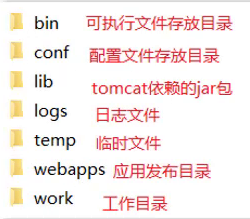

### 启动

双击: bin\startup.bat

启动后，通过浏览器访问 `http://localhost:8080`能看到Apache Tomcat的内容就说明Tomcat已经启动成功。

==注意==: 启动的过程中，控制台有中文乱码，需要修改conf/logging.prooperties

### 关闭

关闭有三种方式 

* 直接x掉运行窗口:强制关闭[不建议]
* bin\shutdown.bat：正常关闭
* ctrl+c： 正常关闭

### 配置

**修改端口**

* Tomcat默认的端口是8080，要想修改Tomcat启动的端口号，需要修改 conf/server.xml

> 注: HTTP协议默认端口号为80，如果将Tomcat端口号改为80，则将来访问Tomcat时，将不用输入端口号。

**启动时可能出现的错误**

* Tomcat的端口号取值范围是0-65535之间任意未被占用的端口，如果设置的端口号被占用，启动的时候就会包如下的错误

Address already in use : bind

- Tomcat启动的时候，启动窗口一闪而过: 需要检查JAVA_HOME环境变量是否正确配置

### 部署

* Tomcat部署项目： 将项目放置到webapps目录下，即部署完成。


一般JavaWeb项目会被打包称==war==包，然后将war包放到Webapps目录下，Tomcat会自动解压缩war文件

* 将 `资料/2. Tomcat/haha.war`目录拷贝到Tomcat的webapps目录下

* Tomcat检测到war包后会自动完成解压缩，在webapps目录下就会多一个haha目录

  通过浏览器访问`http://localhost/haha/a.html`，能看到下面的内容就说明项目已经部署成功。

## Maven创建Web项目

Maven Web项目结构: 开发中的项目

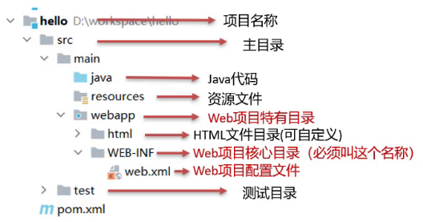

开发完成部署的Web项目


* 开发项目通过执行Maven打包命令==package==,可以获取到部署的Web项目目录
* 编译后的Java字节码文件和resources的资源文件，会被放到WEB-INF下的classes目录下
* pom.xml中依赖坐标对应的jar包，会被放入WEB-INF下的lib目录下

### 创建Maven Web项目

**使用骨架**

> 具体的步骤包含:
>
> 1.创建Maven项目
>
> 2.选择使用Web项目骨架
>
> 3.输入Maven项目坐标创建项目
>
> 4.确认Maven相关的配置信息后，完成项目创建
>
> 5.删除pom.xml中多余内容
>
> 6.补齐Maven Web项目缺失的目录结构

**不使用骨架**

>具体的步骤包含:
>
>1.创建Maven项目
>
>2.选择不使用Web项目骨架
>
>3.输入Maven项目坐标创建项目
>
>4.在pom.xml设置打包方式为war
>
>5.补齐Maven Web项目缺失webapp的目录结构
>
>6.补齐Maven Web项目缺失WEB-INF/web.xml的目录结构

## IDEA使用Tomcat

##### 集成本地Tomcat

目标: 将刚才本地安装好的Tomcat8集成到IDEA中，完成项目部署，具体的实现步骤

1. 打开添加本地Tomcat的面板
2. 指定本地Tomcat的具体路径
3. 修改Tomcat的名称，此步骤可以不改，只是让名字看起来更有意义，HTTP port中的端口也可以进行修改，比如把8080改成80
4. 将开发项目部署项目到Tomcat中
5. 扩展内容： xxx.war和 xxx.war exploded这两种部署项目模式的区别?

6. * war模式是将WEB工程打成war包，把war包发布到Tomcat服务器上

   * war exploded模式是将WEB工程以当前文件夹的位置关系发布到Tomcat服务器上
   * war模式部署成功后，Tomcat的webapps目录下会有部署的项目内容
   * war exploded模式部署成功后，Tomcat的webapps目录下没有，而使用的是项目的target目录下的内容进行部署
   * 建议大家都选war模式进行部署，更符合项目部署的实际情况
7. 部署成功后，就可以启动项目，为了能更好的看到启动的效果，可以在webapp目录下添加a.html页面
8. 启动成功后，可以通过浏览器进行访问测试

##### Tomcat Maven插件

1. 在pom.xml中添加Tomcat插件

   ```xml
   <build>
       <plugins>
       	<!--Tomcat插件 -->
           <plugin>
               <groupId>org.apache.tomcat.maven</groupId>
               <artifactId>tomcat7-maven-plugin</artifactId>
               <version>2.2</version>
           </plugin>
       </plugins>
   </build>
   ```

2. 使用Maven Helper插件快速启动项目，选中项目，右键-->Run Maven --> tomcat7:run

==注意:==

* 如果选中项目并右键点击后，看不到Run Maven和Debug Maven，这个时候就需要在IDEA中下载Maven Helper插件，具体的操作方式为: File --> Settings --> Plugins --> Maven Helper ---> Install,安装完后按照提示重启IDEA，就可以看到了。

* Maven Tomcat插件目前只有Tomcat7版本，没有更高的版本可以使用
* 使用Maven Tomcat插件，要想修改Tomcat的端口和访问路径，可以直接修改pom.xml

```xml
<build>
    <plugins>
    	<!--Tomcat插件 -->
        <plugin>
            <groupId>org.apache.tomcat.maven</groupId>
            <artifactId>tomcat7-maven-plugin</artifactId>
            <version>2.2</version>
            <configuration>
            	<port>80</port><!--访问端口号 -->
                <!--项目访问路径
					未配置访问路径: http://localhost:80/tomcat-demo2/a.html
					配置/后访问路径: http://localhost:80/a.html
					如果配置成 /hello,访问路径会变成什么?
						答案: http://localhost:80/hello/a.html
				-->
                <path>/</path>
            </configuration>
        </plugin>
    </plugins>
</build>
```

# Servlet

## http协议

## 快速入门

1. 创建Web项目`web-demo`，导入Servlet依赖坐标

```xml
<dependency>
    <groupId>javax.servlet</groupId>
    <artifactId>javax.servlet-api</artifactId>
    <version>3.1.0</version>
    <!--
      此处为什么需要添加该标签?
      provided指的是在编译和测试过程中有效,最后生成的war包时不会加入
       因为Tomcat的lib目录中已经有servlet-api这个jar包，如果在生成war包的时候生效就会和Tomcat中的jar包冲突，导致报错
    -->
    <scope>provided</scope>
</dependency>
```

2. 创建:定义一个类，实现Servlet接口，并重写接口中所有方法，并在service方法中输入一句话

```java
package com.itheima.web;

import javax.servlet.*;
import java.io.IOException;

public class ServletDemo1 implements Servlet {

    public void service(ServletRequest servletRequest, ServletResponse servletResponse) throws ServletException, IOException {
        System.out.println("servlet hello world~");
    }
    public void init(ServletConfig servletConfig) throws ServletException {

    }

    public ServletConfig getServletConfig() {
        return null;
    }

    public String getServletInfo() {
        return null;
    }

    public void destroy() {

    }
}
```

3. 配置:在类上使用@WebServlet注解，配置该Servlet的访问路径

```java
@WebServlet("/demo1")
```

4. 访问:启动Tomcat,浏览器中输入URL地址访问该Servlet

```
http://localhost:8080/web-demo/demo1
```

5. 器访问后，在控制台会打印`servlet hello world~` 说明servlet程序已经成功运行。

至此，Servlet的入门案例就已经完成，大家可以按照上面的步骤进行练习了。

## 执行流程

* 浏览器发出`http://localhost:8080/web-demo/demo1`请求，从请求中可以解析出三部分内容，分别是`localhost:8080`、`web-demo`、`demo1`
  * 根据`localhost:8080`可以找到要访问的Tomcat Web服务器
  * 根据`web-demo`可以找到部署在Tomcat服务器上的web-demo项目
  * 根据`demo1`可以找到要访问的是项目中的哪个Servlet类，根据@WebServlet后面的值进行匹配
* 找到ServletDemo1这个类后，Tomcat Web服务器就会为ServletDemo1这个类创建一个对象，然后调用对象中的service方法
  * ServletDemo1实现了Servlet接口，所以类中必然会重写service方法供Tomcat Web服务器进行调用
  * service方法中有ServletRequest和ServletResponse两个参数，ServletRequest封装的是请求数据，ServletResponse封装的是响应数据，后期我们可以通过这两个参数实现前后端的数据交互

1. Servlet由谁创建?Servlet方法由谁调用?

> Servlet由web服务器创建，Servlet方法由web服务器调用

2. 服务器怎么知道Servlet中一定有service方法?

> 因为我们自定义的Servlet,必须实现Servlet接口并复写其方法，而Servlet接口中有service方法

## 生命周期

* 生命周期: 对象的生命周期指一个对象从被创建到被销毁的整个过程。

* Servlet运行在Servlet容器(web服务器)中，其生命周期由容器来管理，分为4个阶段：

  1. ==加载和实例化==：默认情况下，当Servlet第一次被访问时，由容器创建Servlet对象

  ```xml
  默认情况，Servlet会在第一次访问被容器创建，但是如果创建Servlet比较耗时的话，那么第一个访问的人等待的时间就比较长，用户的体验就比较差，那么我们能不能把Servlet的创建放到服务器启动的时候来创建，具体如何来配置?
  
  @WebServlet(urlPatterns = "/demo1",loadOnStartup = 1)
  loadOnstartup的取值有两类情况
  	（1）负整数:第一次访问时创建Servlet对象
  	（2）0或正整数:服务器启动时创建Servlet对象，数字越小优先级越高
  ```

  2. ==初始化==：在Servlet实例化之后，容器将调用Servlet的==init()==方法初始化这个对象，完成一些如加载配置文件、创建连接等初始化的工作。该方法只==调用一次==
  3. ==请求处理==：==每次==请求Servlet时，Servlet容器都会调用Servlet的==service()==方法对请求进行处理
  4. ==服务终止==：当需要释放内存或者容器关闭时，容器就会调用Servlet实例的==destroy()==方法完成资源的释放。在destroy()方法调用之后，容器会释放这个Servlet实例，该实例随后会被Java的垃圾收集器所回收

## 方法介绍

```JAVA
@WebServlet(urlPatterns = "/demo1",loadOnStartup = 1)
loadOnstartup的取值有两类情况
	（1）负整数:第一次访问时创建Servlet对象
	（2）0或正整数:服务器启动时创建Servlet对象，数字越小优先级越高
```

* 初始化方法，在Servlet被创建时执行，只执行一次

```java
void init(ServletConfig config) 
```

* 提供服务方法， 每次Servlet被访问，都会调用该方法

```java
void service(ServletRequest req, ServletResponse res)
```

* 销毁方法，当Servlet被销毁时，调用该方法。在内存释放或服务器关闭时销毁Servlet

```java
void destroy() 
```

* 获取Servlet信息

```java
String getServletInfo() 
//该方法用来返回Servlet的相关信息，没有什么太大的用处，一般我们返回一个空字符串即可
public String getServletInfo() {
    return "";
}
```

* 获取ServletConfig对象

```java
ServletConfig getServletConfig()
```

ServletConfig对象，在init方法的参数中有，而Tomcat Web服务器在创建Servlet对象的时候会调用init方法，必定会传入一个ServletConfig对象，我们只需要将服务器传过来的ServletConfig进行返回即可。

**初始化参数在web-Inf中使用**	

- 启动

  ```
   初始化方法
       *  1.调用时机：默认情况下，Servlet被第一次访问时，调用
            loadOnStartup: 默认为-1，修改为0或者正整数，则会在服务器启动的时候，调用
       *  2.调用次数: 1次
  ```

```JAVA
package com.itheima.web;

import javax.servlet.*;
import javax.servlet.annotation.WebServlet;
import java.io.IOException;

/**
 * Servlet方法介绍
 */
@WebServlet(urlPatterns = "/demo3",loadOnStartup = 1)
public class ServletDemo3 implements Servlet {

    private ServletConfig servletConfig;
    /**
     *  初始化方法
     *  1.调用时机：默认情况下，Servlet被第一次访问时，调用
     *      * loadOnStartup: 默认为-1，修改为0或者正整数，则会在服务器启动的时候，调用
     *  2.调用次数: 1次
     * @param config
     * @throws ServletException
     */
    public void init(ServletConfig config) throws ServletException {
        this.servletConfig = config;
        System.out.println("init...");
    }
    public ServletConfig getServletConfig() {
        return servletConfig;
    }
    
    /**
     * 提供服务
     * 1.调用时机:每一次Servlet被访问时，调用
     * 2.调用次数: 多次
     * @param req
     * @param res
     * @throws ServletException
     * @throws IOException
     */
    public void service(ServletRequest req, ServletResponse res) throws ServletException, IOException {
        System.out.println("servlet hello world~");
    }

    /**
     * 销毁方法
     * 1.调用时机：内存释放或者服务器关闭的时候，Servlet对象会被销毁，调用
     * 2.调用次数: 1次
     */
    public void destroy() {
        System.out.println("destroy...");
    }
    
    public String getServletInfo() {
        return "";
    }
}
```

##  体系结构


```java
@WebServlet("/demo4")
public class ServletDemo4 extends HttpServlet {
    @Override
    protected void doGet(HttpServletRequest req, HttpServletResponse resp) throws ServletException, IOException {
        //TODO GET 请求方式处理逻辑
        System.out.println("get...");
    }
    @Override
    protected void doPost(HttpServletRequest req, HttpServletResponse resp) throws ServletException, IOException {
        //TODO Post 请求方式处理逻辑
        System.out.println("post...");
    }
}
```

原理

```java
package com.itheima.web;

import javax.servlet.*;
import javax.servlet.annotation.WebServlet;
import javax.servlet.http.HttpServlet;
import javax.servlet.http.HttpServletRequest;
import javax.servlet.http.HttpServletResponse;
import java.io.IOException;


@WebServlet("/demo5")
public class ServletDemo5 implements Servlet {

    public void init(ServletConfig config) throws ServletException {

    }

    public ServletConfig getServletConfig() {
        return null;
    }

    public void service(ServletRequest req, ServletResponse res) throws ServletException, IOException {
        //如何调用?
        //获取请求方式，根据不同的请求方式进行不同的业务处理
        HttpServletRequest request = (HttpServletRequest)req;
       //1. 获取请求方式
        String method = request.getMethod();
        //2. 判断
        if("GET".equals(method)){
            // get方式的处理逻辑
        }else if("POST".equals(method)){
            // post方式的处理逻辑
        }
    }

    public String getServletInfo() {
        return null;
    }

    public void destroy() {

    }
}

```

## urlPattern配置

一个Servlet,可以配置多个urlPattern

```java
package com.itheima.web;

import javax.servlet.ServletRequest;
import javax.servlet.ServletResponse;
import javax.servlet.annotation.WebServlet;

/**
* urlPattern: 一个Servlet可以配置多个访问路径
*/
@WebServlet(urlPatterns = {"/demo7","/demo8"})
public class ServletDemo7 extends MyHttpServlet {

    @Override
    protected void doGet(ServletRequest req, ServletResponse res) {
        
        System.out.println("demo7 get...");
    }
    @Override
    protected void doPost(ServletRequest req, ServletResponse res) {
    }
}
```

在浏览器上输入`http://localhost:8080/web-demo/demo7`,`http://localhost:8080/web-demo/demo8`这两个地址都能访问到ServletDemo7的doGet方法。

### ==urlPattern配置规则==

**精确匹配比目录匹配优先**

#### 精确匹配

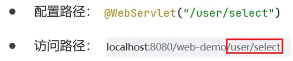

#### 目录匹配


#### 扩展名匹配


#### 任意匹配


==注意:==`/`和`/*`的区别?

1. 当我们的项目中的Servlet配置了 "/",会覆盖掉tomcat中的DefaultServlet,当其他的url-pattern都匹配不上时都会走这个Servlet

2. 当我们的项目中配置了"/*",意味着匹配任意访问路径

3. DefaultServlet是用来处理静态资源，如果配置了"/"会把默认的覆盖掉，就会引发请求静态资源的时候没有走默认的而是走了自定义的Servlet类，最终导致静态资源不能被访问

## error-page

在web.xml中，可以使用 <error-page> 来定制错误的返回页面

例如，如果出现404情况，则跳转到/404.html页面中

```xml
<error-page>
	<error-code>404</error-code>
	<location>/404.html</location>
</error-page>
```

也可以指定servlet中出现的异常情况：

例如，当servlet程序的时候，如果出现了以下类型异常，则跳转到not_found.html页面

```xml
<error-page>
	<error-type>java.io.FileNotFoundException</error-type>
	<location>/not_found.html</location>
</error-page>
```

##  XML配置

前面对应Servlet的配置，我们都使用的是@WebServlet,这个是Servlet从3.0版本后开始支持注解配置，3.0版本前只支持XML配置文件的配置方法。

* 在web.xml中配置该Servlet

```xml
<?xml version="1.0" encoding="UTF-8"?>
<web-app xmlns:xsi="http://www.w3.org/2001/XMLSchema-instance"
         xmlns="http://xmlns.jcp.org/xml/ns/javaee"
         xsi:schemaLocation="http://xmlns.jcp.org/xml/ns/javaee
http://xmlns.jcp.org/xml/ns/javaee/web-app_3_1.xsd"
         version="3.1">
  <servlet>
    <servlet-name>life</servlet-name>
    <servlet-class>com.fuhao.servlet.ServletTest1</servlet-class> 
    <init-param>
      <param-name>username</param-name>
      <param-value>briup</param-value>
    </init-param>
    <init-param>
      <param-name>password</param-name>
      <param-value>123456</param-value>
    </init-param>
    <load-on-startup>1</load-on-startup>
  </servlet>
  <servlet-mapping>
    <servlet-name>life</servlet-name>
    <url-pattern>/life</url-pattern>
  </servlet-mapping>
    
  <error-page>
	<error-code>404</error-code>
	<location>/404.html</location>
  </error-page>
</web-app>
```

这种配置方式和注解比起来，确认麻烦很多，所以建议大家使用注解来开发。但是大家要认识上面这种配置方式，因为并不是所有的项目都是基于注解开发的。

## WEB-INF

WEB-INF是Java的WEB应用中的安全目录。

> 只有服务端可以访问的目录。
>
> 在servlet中是可以通过服务器内部跳转，来访问到WEB-INF目录下的资源的。

*'浏览器可以访问servlet，让servlet再通过服务器内部跳转的方式，来访问WEB-INF下的hello.html，从而提高页面的安全性，因为在servlet中可以对本次请求进行验证，通过后跳转到WEB-INF下的页面，否则返回错误信息。*

# Request和Response

* request:==获取==请求数据
  * 浏览器会发送HTTP请求到后台服务器[Tomcat]
  * HTTP的请求中会包含很多请求数据[请求行+请求头+请求体]
  * 后台服务器[Tomcat]会对HTTP请求中的数据进行解析并把解析结果存入到一个对象中
  * 所存入的对象即为request对象，所以我们可以从request对象中获取请求的相关参数
  * 获取到数据后就可以继续后续的业务，比如获取用户名和密码就可以实现登录操作的相关业务
* response:==设置==响应数据
  * 业务处理完后，后台就需要给前端返回业务处理的结果即响应数据
  * 把响应数据封装到response对象中
  * 后台服务器[Tomcat]会解析response对象,按照[响应行+响应头+响应体]格式拼接结果
  * 浏览器最终解析结果，把内容展示在浏览器给用户浏览

##  Request

#### 获取请求行数据（get）


* 获取请求方式: `GET`

```
String getMethod()
```

* 获取虚拟目录(项目访问路径): `/request-demo`

```
String getContextPath()
```

* 获取URL(统一资源定位符): `http://localhost:8080/request-demo/req1`

```
StringBuffer getRequestURL()
```

* 获取URI(统一资源标识符): `/request-demo/req1`

```
String getRequestURI()
```

* 获取请求参数(GET方式): `username=zhangsan&password=123`

```
String getQueryString()
```

介绍完上述方法后，咱们通过代码把上述方法都使用下:

```java
/**
 * request 获取请求数据
 */
@WebServlet("/req1")
public class RequestDemo1 extends HttpServlet {
    @Override
    protected void doGet(HttpServletRequest req, HttpServletResponse resp) throws ServletException, IOException {
        // String getMethod()：获取请求方式： GET
        String method = req.getMethod();
        System.out.println(method);//GET
        // String getContextPath()：获取虚拟目录(项目访问路径)：/request-demo
        String contextPath = req.getContextPath();
        System.out.println(contextPath);
        // StringBuffer getRequestURL(): 获取URL(统一资源定位符)：http://localhost:8080/request-demo/req1
        StringBuffer url = req.getRequestURL();
        System.out.println(url.toString());
        // String getRequestURI()：获取URI(统一资源标识符)： /request-demo/req1
        String uri = req.getRequestURI();
        System.out.println(uri);
        // String getQueryString()：获取请求参数（GET方式）： username=zhangsan
        String queryString = req.getQueryString();
        System.out.println(queryString);
    }
    @Override
    protected void doPost(HttpServletRequest req, HttpServletResponse resp) throws ServletException, IOException {
    }
}
```

#### 获取请求头数据

对于请求头的数据，格式为`key: value`如下:


所以根据请求头名称获取对应值的方法为:

```
String getHeader(String name)
```

接下来，在代码中如果想要获取客户端浏览器的版本信息，则可以使用

```java
/**
 * request 获取请求数据
 */
@WebServlet("/req1")
public class RequestDemo1 extends HttpServlet {
    @Override
    protected void doGet(HttpServletRequest req, HttpServletResponse resp) throws ServletException, IOException {
        //获取请求头: user-agent: 浏览器的版本信息
        String agent = req.getHeader("user-agent");
		System.out.println(agent);
    }
    @Override
    protected void doPost(HttpServletRequest req, HttpServletResponse resp) throws ServletException, IOException {
    }
}

```

#### 获取请求体数据(post)

> 浏览器在发送GET请求的时候是没有请求体的，所以需要把请求方式变更为POST，请求体中的数据格式如下:
>


* **获取字节输入流**，如果前端发送的是字节数据，比如传递的是文件数据，则使用该方法

```
ServletInputStream getInputStream()
该方法可以获取字节
```

* **获取字符输入流**，如果前端发送的是纯文本数据，则使用该方法

```
BufferedReader getReader()
```

#### 行，头，体api

HTTP请求数据中包含了`请求行`、`请求头`和`请求体`，针对这三部分内容，Request对象都提供了对应的API方法来获取对应的值:

* 请求行

  ```java
  getMethod()	//获取请求方式
  getContextPath()	//获取项目访问路径
  getRequestURL()	//获取请求URL
  getRequestURI()	//获取请求URI
  getQueryString()	//获取GET请求方式的请求参数
  ```

* 请求头

  ```java
  getHeader(String name)  //根据请求头名称获取其对应的值
  ```

  

* 请求体
  * 注意: ==浏览器发送的POST请求才有请求体==

  ```java
  getReader() //如果是纯文本数据
  getInputStream() //如果是字节数据如文件数据
  ```

#### 通用方式

* GET方式:

```
String getQueryString()
```

* POST方式:

```
BufferedReader getReader();
```

##### 方案一:

```java
@WebServlet("/req1")
public class RequestDemo1 extends HttpServlet {
    @Override
    protected void doGet(HttpServletRequest req, HttpServletResponse resp) throws ServletException, IOException {
        //获取请求方式
        String method = req.getMethod();
        //获取请求参数
        String params = "";
        if("GET".equals(method)){
            params = req.getQueryString();
        }else if("POST".equals(method)){
            BufferedReader reader = req.getReader();
            params = reader.readLine();
        }
        //将请求参数进行打印控制台
        System.out.println(params);
      
    }
    @Override
    protected void doPost(HttpServletRequest req, HttpServletResponse resp) throws ServletException, IOException {
        this.doGet(req,resp);
    }
}
```

##### 方案二:

request对象已经将上述获取请求参数的方法进行了封装，并且request提供的方法实现的功能更强大，以后只需要调用request提供的方法即可，


> **方法**

* 获取所有参数Map集合

```
Map<String,String[]> getParameterMap()
```

* 获取所有参数名

```java
Enumeration<String> names = req.getParameterNames();

遍历
while(names.hasMoreElement){
    String name = names.nextElement();
}
```

* 根据名称获取参数值（多个值）

```
String[] getParameterValues(String name)
```

* 根据名称获取参数值(单个值)

```
String getParameter(String name)
```

##  请求中文乱码

#### POST

* 分析出现中文乱码的原因：
  * POST的请求参数是通过request的getReader()来获取流中的数据
  * TOMCAT在获取流的时候采用的编码是ISO-8859-1
  * ISO-8859-1编码是不支持中文的，所以会出现乱码
* 解决方案：
  * 页面设置的编码格式为UTF-8
  * 把TOMCAT在获取流数据之前的编码设置为UTF-8
  * 通过 **request.setCharacterEncoding("UTF-8")** 设置编码,UTF-8也可以写成小写

```java
/**
 * 中文乱码问题解决方案
 */
@WebServlet("/req4")
public class RequestDemo4 extends HttpServlet {
    @Override
    protected void doGet(HttpServletRequest request, HttpServletResponse response) throws ServletException, IOException {
        //1. 解决乱码: POST getReader()
        //设置字符输入流的编码，设置的字符集要和页面保持一致
        request.setCharacterEncoding("UTF-8");
       //2. 获取username
       String username = request.getParameter("username");
       System.out.println(username);
    }

    @Override
    protected void doPost(HttpServletRequest request, HttpServletResponse response) throws ServletException, IOException {
        this.doGet(request, response);
    }
}
```

####  GET

(1)浏览器通过HTTP协议发送请求和数据给后台服务器（Tomcat)

(2)浏览器在发送HTTP的过程中会对中文数据进行URL==编码==

(3)在进行URL编码的时候会采用页面`<meta>`标签指定的UTF-8的方式进行编码，`张三`编码后的结果为`%E5%BC%A0%E4%B8%89`

(4)后台服务器(Tomcat)接收到`%E5%BC%A0%E4%B8%89`后会默认按照`ISO-8859-1`进行URL==解码==

(5)由于前后编码与解码采用的格式不一样，就会导致后台获取到的数据为乱码。

**Tomcat**

如果是GET请求中携带的参数，出现乱码，可以在Tomcat服务器的server.xml文件中进行配置。

因为GET请求的参数写在URI后的，所以需要在 <Connector> 中加入新的属性URIEncoding="XXX"

```xml
<Connector URIEncoding="UTF-8" connectionTimeout="20000" port="8989"
protocol="HTTP/1.1" redirectPort="8443"/>
```

**URL编码**

这块知识我们只需要了解下即可,具体编码过程分两步，分别是:

(1)将字符串按照编码方式转为二进制

(2)每个字节转为2个16进制数并在前边加上%

`张三`按照UTF-8的方式转换成二进制的结果为:

```
1110 0101 1011 1100 1010 0000 1110 0100 1011 1000 1000 1001
```

编码:

```java
java.net.URLEncoder.encode("需要被编码的内容","字符集(UTF-8)")
```

解码:

```java
java.net.URLDecoder.decode("需要被解码的内容","字符集(UTF-8)")
```

接下来咱们对`张三`来进行编码和解码

```java
 //1. URL编码
        String encode = URLEncoder.encode(username, "utf-8");
        System.out.println(encode); //打印:%E5%BC%A0%E4%B8%89

       //2. URL解码
       //String decode = URLDecoder.decode(encode, "utf-8");//打印:张三
       String decode = URLDecoder.decode(encode, "ISO-8859-1");//打印:`å¼ ä¸ `
```

至此对于GET请求中文乱码的解决方案，我们就已经分析完了，最后在代码中去实现下:

```java
/**
 * 中文乱码问题解决方案
 */
@WebServlet("/req4")
public class RequestDemo4 extends HttpServlet {
    @Override
    protected void doGet(HttpServletRequest request, HttpServletResponse response) throws ServletException, IOException {

        //3. GET,获取参数的方式：getQueryString
        // 乱码原因：tomcat进行URL解码，默认的字符集ISO-8859-1
       /* //3.1 先对乱码数据进行编码：转为字节数组
        byte[] bytes = username.getBytes(StandardCharsets.ISO_8859_1);
        //3.2 字节数组解码
        username = new String(bytes, StandardCharsets.UTF_8);*/

        username  = new String(username.getBytes(StandardCharsets.ISO_8859_1),StandardCharsets.UTF_8);

        System.out.println("解决乱码后："+username);

    }

    @Override
    protected void doPost(HttpServletRequest request, HttpServletResponse response) throws ServletException, IOException {
        this.doGet(request, response);
    }
}
```

#### 写回数据乱码

```java
@Override
protected void doGet(HttpServletRequest req, HttpServletResponse resp) throws ServletException, IOException {
	//设置响应中的编码为UTF-8
	resp.setCharacterEncoding("UTF-8");
	//告诉浏览器当前响应中的内容的类型，和内容的编码为UTF-8
	resp.setContentType("text/plain;charset=UTF-8");
    
	PrintWriter out = resp.getWriter();
	out.println("你好，程序员");
}
```

#### 中文乱码（总结）

* POST请求和GET请求的参数中如果有中文，后台接收数据就会出现中文乱码问题

  GET请求在Tomcat8.0以后的版本就不会出现了

* POST请求解决方案是:设置输入流的编码

  ```
  request.setCharacterEncoding("UTF-8");
  注意:设置的字符集要和页面保持一致
  ```

* 通用方式（GET/POST）：需要先解码，再编码

  ```
  new String(username.getBytes("ISO-8859-1"),"UTF-8");
  ```

2. URL编码实现方式:

* 编码:

  ```
  URLEncoder.encode(str,"UTF-8");
  ```

* 解码:

  ```
  URLDecoder.decode(s,"ISO-8859-1");
  ```

## Request请求转发

请求转发(forward):一种在服务器**内部**的资源跳转方式。

(1)浏览器发送请求给服务器，服务器中对应的资源A接收到请求

(2)资源A处理完请求后将请求发给资源B

(3)资源B处理完后将结果响应给浏览器

(4)请求从资源A到资源B的过程就叫==请求转发==

#### API:

```
req.getRequestDispatcher("资源B路径").forward(req,resp);
```

#### 特点

* 浏览器地址栏路径不发生变化

  虽然后台从`/req5`转发到`/req6`,但是浏览器的地址一直是`/req5`,未发生变化

* 只能转发到当前服务器的内部资源

  不能从一个服务器通过转发访问另一台服务器

* 一次请求，可以在转发资源间使用request共享数据

  虽然后台从`/req5`转发到`/req6`，但是这个==只有一次请求==

## Response

**Response:使用response对象来设置响应数据**


### 设置响应数据

响应行


响应头


响应体


1. **响应行**

设置响应状态码:

```
void setStatus(int sc);
```

2. **响应头**

设置响应头键值对：

```
void setHeader(String name,String value);
```

3. **响应体**

获取字符输出流:

```
PrintWriter getWriter();
```

获取字节输出流

```
ServletOutputStream getOutputStream();
```

### Respones请求重定向

1. Response重定向(redirect):一种资源跳转方式。

(1)浏览器发送请求给服务器，服务器中对应的资源A接收到请求

(2)资源A现在无法处理该请求，就会给浏览器响应一个302的状态码+location的一个访问资源B的路径

(3)浏览器接收到响应状态码为302就会重新发送请求到location对应的访问地址去访问资源B

(4)资源B接收到请求后进行处理并最终给浏览器响应结果，这整个过程就叫==重定向==

2. 重定向的实现方式:

```java
resp.setStatus(302);
resp.setHeader("location","资源B的访问路径");
```

request对象给我们提供了简化的编写方式为:

```java
resposne.sendRedirect("/request-demo/resp2")
```

```java
response.sendRedirect("https://www.baidu.com");
```

### 路径问题

* 浏览器使用:需要加虚拟目录(项目访问路径)
* 服务端使用:不需要加虚拟目录


**是否加虚拟目录**

* `<a href='路劲'>`    超链接，从浏览器发送，需要加
* `<form action='路径'>`   超链接，从浏览器发送，需要加
* req.getRequestDispatcher("路径")  转发，是从服务器内部跳转，不需要加
* resp.sendRedirect("路径")   重定向，是由浏览器进行跳转，需要加。

> 问题2：在重定向的代码中，`/request-demo`是固定编码的，如果后期通过Tomcat插件配置了项目的访问路径，那么所有需要重定向的地方都需要重新修改，该如何优化?
>
> ```java
> @WebServlet("/resp1")
> public class ResponseDemo1 extends HttpServlet {
>     @Override
>     protected void doGet(HttpServletRequest request, HttpServletResponse response) throws ServletException, IOException {
>         System.out.println("resp1....");
> 
>         //简化方式完成重定向
>         //动态获取虚拟目录
>         String contextPath = request.getContextPath();
>         response.sendRedirect(contextPath+"/resp2");
>     }
> 
>     @Override
>     protected void doPost(HttpServletRequest request, HttpServletResponse response) throws ServletException, IOException {
>         this.doGet(request, response);
>     }
> }
> ```
>

**相对路径和绝对路径**

```html
客户端中/代表的是端口号后的这个/
		http://ip:port/
		例如:
			在html页面中,/TestServlet
			<a href="/TestServlet">测试</a>
			点击之后,地址栏中的url变为:
			http://ip:port/TestServlet
			这个时候会报错404,因为缺少项目名
		又例如:
			在客户端重定向中,/TestServlet response.sendRedirect("/TestServlet");
			【此时response会将地址发送回给浏览器，即客户端】
			运行之后,地址栏中的url变为:
			http://ip:port/TestServlet
			这个时候会报错404,因为缺少项目名
			因为response是带着这个路径返回到浏览器,让浏览器解析这个路径并重新发送请求,所以这种情况还是会少一个项目名

	
服务器端中/代表的是项目名后的这个/
		http://ip:port/项目名/
		例如:
			web.xml文件中,配置servlet的映射路径
			<url-pattern>/TestServlet</url-pattern>
			这个时候浏览器访问这个路径就需要写这样的url:
			http://ip:port/项目名/TestServlet
		又例如:
			在servlet中,进行服务器内部跳转
			String url = "/TestServlet";
			request.getRequestDispatcher(url).forward(request, response);
			这时候跳转后的地址栏中的url为:
			http://ip:port/项目名/TestServlet
```

### Response响应字符数据

要想将字符数据写回到浏览器，我们需要两个步骤:

* 通过Response对象获取字符输出流： PrintWriter writer = resp.getWriter();
* 通过字符输出流写数据: writer.write("aaa");
* 不需要关闭流

返回一个简单的字符串`aaa`

```java
 //1. 获取字符输出流
        PrintWriter writer = response.getWriter();
		 writer.write("aaa");
```

返回一串html字符串，并且能被浏览器解析

```java
PrintWriter writer = response.getWriter();
//content-type，告诉浏览器返回的数据类型是HTML类型数据，这样浏览器才会解析HTML标签
response.setHeader("content-type","text/html");
writer.write("<h1>aaa</h1>");
```

返回一个中文的字符串`你好`，需要注意设置响应数据的编码为`utf-8`

```java
//设置响应的数据格式及数据的编码
response.setContentType("text/html;charset=utf-8");
PrintWriter writer = response.getWriter();

writer.write("你好");
```

### Response响应字节数据

要想将字节数据写回到浏览器，我们需要两个步骤:

- 通过Response对象获取字节输出流：ServletOutputStream outputStream = resp.getOutputStream();

- 通过字节输出流写数据: outputStream.write(字节数据);

```java
  protected void doGet(HttpServletRequest request, HttpServletResponse response) throws ServletException, IOException {
        //1. 读取文件
        FileInputStream fis = new FileInputStream("d://a.jpg");
        //2. 获取response字节输出流
        ServletOutputStream os = response.getOutputStream();
        //3. 完成流的copy
        byte[] buff = new byte[1024];
        int len = 0;
        while ((len = fis.read(buff))!= -1){
            os.write(buff,0,len);
        }
        fis.close();
    }
```

上述代码中，对于流的copy的代码还是比较复杂的，所以我们可以使用别人提供好的方法来简化代码的开发，具体的步骤是:

(1)pom.xml添加依赖

```xml
<dependency>
    <groupId>commons-io</groupId>
    <artifactId>commons-io</artifactId>
    <version>2.6</version>
</dependency>
```

(2)调用工具类方法

```
//fis:输入流
//os:输出流
IOUtils.copy(fis,os);
```

优化后的代码:

```java
/**
 * 响应字节数据：设置字节数据的响应体
 */
@WebServlet("/resp4")
public class ResponseDemo4 extends HttpServlet {
    @Override
    protected void doGet(HttpServletRequest request, HttpServletResponse response) throws ServletException, IOException {
        //1. 读取文件
        FileInputStream fis = new FileInputStream("d://a.jpg");
        //2. 获取response字节输出流
        ServletOutputStream os = response.getOutputStream();
        //3. 完成流的copy
      	IOUtils.copy(fis,os);
        fis.close();
    }

    @Override
    protected void doPost(HttpServletRequest request, HttpServletResponse response) throws ServletException, IOException {
        this.doGet(request, response);
    }
}
```

## 范围对象

### request

> javax.servlet.http.HttpServletRequest
>
> 请求范围，数据存入后，在同一个请求内有效

**创建**

```java
//方法参数可直接使用
```

**生命**

客户端每次发请求，服务器就会创建一个新的request对象，本次访问结束后，该request对象就会被销毁，所以每次请求都是一个全新的request对象。

### session

> javax.servlet.http.HttpSession 
>
> 会话范围，数据存入后，在同一个会话内有效

**创建**

```java
//使用request对象，调用getSession方法即可
HttpSession session = request.getSession();

//如果request有对应的session,则返回这个session
//如果request没有对应的session,则创建一个新的session并返回
//request.getSession()等价于这种情况
HttpSession session = request.getSession(true);

//如果request有对应的session,则返回这个session
//如果request没有对应的session,则返回null
HttpSession session = request.getSession(false);
```

**生命**

request.getSession() 方法第一次被调用时，会创建session对象， session.invalidate() 调用的时候会销毁session。

session如果自动超时的话，也会被销毁，默认超时时间为30分钟，可以在web.xml中进行设置，单位是分钟

```xml
<session-config>
	<session-timeout>30</session-timeout>
</session-config>
```

### application

> javax.servlet.ServletContext 
>
> 应用范围，数据存入后，在同一个项目内有效

**创建**

```java
ServletContext application = request.getServletContext();
// 或者使用以下方式，默认当前servlet继承了HttpServlet
// request.getSession().getServletContext();
// super.getServletContext();
// super.getServletConfig().getServletContext();
//application对象有且只有一个，所以无论什么方式获取到的，都是同一个对象（内存地址一样）
```

**生命**

启动tomcat服务器的时候，就会被创建，关闭tomcat服务器的时候，就会被销毁。每个项目在运行期间，都会**有且只有一个**application对象，与这个项目对应。

### 存取数据

- 存

  ```java
  request.setAttribute("key", value);
  session.setAttribute("key", value);
  application.setAttribute("key", value);
  ```

- 取

  ```java
  request.getAttribute("key");
  session.getAttribute("key");
  application.getAttribute("key");
  ```

- 删

  ```java
  request.removeAttribute("key");
  session.removeAttribute("key");
  application.removeAttribute("key");
  ```

# 会话技术

会话:用户打开浏览器，访问web服务器的资源，会话建立，直到有一方断开连接，会话结束。在一次会话中可以包含==多次==请求和响应。

* 从浏览器发出请求到服务端响应数据给前端之后，一次会话(在浏览器和服务器之间)就被建立了
* 会话被建立后，如果浏览器或服务端都没有被关闭，则会话就会持续建立着
* 浏览器和服务器就可以继续使用该会话进行请求发送和响应，上述的整个过程就被称之为==会话==。

会话跟踪:一种维护浏览器状态的方法，服务器需要识别多次请求是否来自于同一浏览器，以便在同一次会话的多次请求间==共享数据==。

* 服务器会收到多个请求，这多个请求可能来自多个浏览器，如上图中的6个请求来自3个浏览器
* 服务器需要用来识别请求是否来自同一个浏览器
* 服务器用来识别浏览器的过程，这个过程就是==会话跟踪==
* 服务器识别浏览器后就可以在同一个会话中多次请求之间来共享数据

## Cookie

**概念**

==Cookie==：客户端会话技术，将数据保存到客户端，以后每次请求都携带Cookie数据进行访问。

* 服务端提供了两个Servlet，分别是ServletA和ServletB
* 浏览器发送HTTP请求1给服务端，服务端ServletA接收请求并进行业务处理
* 服务端ServletA在处理的过程中可以创建一个Cookie对象并将`name=zs`的数据存入Cookie
* 服务端ServletA在响应数据的时候，会把Cookie对象响应给浏览器
* 浏览器接收到响应数据，会把Cookie对象中的数据存储在浏览器内存中，此时浏览器和服务端就==建立了一次会话==
* ==在同一次会话==中浏览器再次发送HTTP请求2给服务端ServletB，浏览器会携带Cookie对象中的所有数据
* ServletB接收到请求和数据后，就可以获取到存储在Cookie对象中的数据，这样同一个会话中的多次请求之间就实现了数据共享

### **Cookie的基本使用**

发送Cookie

* 创建Cookie对象，并设置数据

```
Cookie cookie = new Cookie("key","value");
```

* 发送Cookie到客户端：使用==response==对象

```
response.addCookie(cookie);
```

获取Cookie

- jsp获取

```jsp
${cookie.key.value}
```


- 获取客户端携带的所有Cookie，使用==request==对象

```
Cookie[] cookies = request.getCookies();
```

- 遍历数组，获取每一个Cookie对象：for
- 使用Cookie对象方法获取数据

```
cookie.getName();
cookie.getValue();
```

###  Cookie的原理分析

对于Cookie的实现原理是基于HTTP协议的,其中设计到HTTP协议中的两个请求头信息:

* 响应头:set-cookie
* 请求头: cookie

* 前面的案例中已经能够实现，AServlet给前端发送Cookie,BServlet从request中获取Cookie的功能
* 对于AServlet响应数据的时候，Tomcat服务器都是基于HTTP协议来响应数据
* 当Tomcat发现后端要返回的是一个Cookie对象之后，Tomcat就会在响应头中添加一行数据==`Set-Cookie:username=zs`==
* 浏览器获取到响应结果后，从响应头中就可以获取到`Set-Cookie`对应值`username=zs`,并将数据存储在浏览器的内存中
* 浏览器再次发送请求给BServlet的时候，浏览器会自动在请求头中添加==`Cookie: username=zs`==发送给服务端BServlet
* Request对象会把请求头中cookie对应的值封装成一个个Cookie对象，最终形成一个数组
* BServlet通过Request对象获取到Cookie[]后，就可以从中获取自己需要的数据

### Cookie的使用细节

#### Cookie的存活时间

默认情况下，Cookie存储在浏览器内存中，当浏览器关闭，内存释放，则Cookie被销毁

Cookie其实已经为我们提供好了对应的API来完成这件事，这个API就是==setMaxAge==,

* 设置Cookie存活时间

```
setMaxAge(int seconds)
```

参数值为:

1.正数：将Cookie写入浏览器所在电脑的硬盘，持久化存储。到时间自动删除

2.负数：默认值，Cookie在当前浏览器内存中，当浏览器关闭，则Cookie被销毁

3.零：删除对应Cookie

####  Cookie存储中文

```java
//对中文进行URL编码
        value = URLEncoder.encode(value, "UTF-8");
        System.out.println("存储数据："+value);

 //URL解码
value = URLDecoder.decode(value,"UTF-8");
```


## Session

**概念**

==Session==：服务端会话跟踪技术：将数据保存到服务端。

* Session是存储在服务端而Cookie是存储在客户端
* 存储在客户端的数据容易被窃取和截获，存在很多不安全的因素
* 存储在服务端的数据相比于客户端来说就更安全

### Session的基本使用

在JavaEE中提供了HttpSession接口，来实现一次会话的多次请求之间数据共享功能。

* 获取Session对象,使用的是request对象

```
HttpSession session = request.getSession();
```

* Session对象提供的功能:

  * 存储数据到 session 域中

    ```
    void setAttribute(String name, Object o)
    ```

  * 根据 key，获取值

    ```
    Object getAttribute(String name)
    ```

  * 根据 key，删除该键值对

    ```
    void removeAttribute(String name)
    ```

### Session的原理分析

> Session是基于Cookie实现的

(1)demo1在第一次获取session对象的时候，session对象会有一个唯一的标识，假如是`id:10`

(2)demo1在session中存入其他数据并处理完成所有业务后，需要通过Tomcat服务器响应结果给浏览器

(3**)Tomcat服务器发现业务处理中使用了session对象，就会把session的唯一标识`id:10`当做一个cookie，添加`Set-Cookie:JESSIONID=10`到响应头中，并响应给浏览器**

(4)浏览器接收到响应结果后，会把响应头中的coookie数据存储到浏览器的内存中

(5)浏览器在同一会话中访问demo2的时候，会把cookie中的数据按照`cookie: JESSIONID=10`的格式添加到请求头中并发送给服务器Tomcat

(6)demo2获取到请求后，从请求头中就读取cookie中的JSESSIONID值为10，然后就会到服务器内存中寻找`id:10`的session对象，如果找到了，就直接返回该对象，如果没有则新创建一个session对象

(7)关闭打开浏览器后，因为浏览器的cookie已被销毁，所以就没有JESSIONID的数据，服务端获取到的session就是一个全新的session对象

> Session是基于Cookie来实现的

### Session的使用细节

#### Session钝化与活化

服务器重启后，Session中的数据是否还在?

(1)服务器端AServlet和BServlet共用的session对象应该是存储在服务器的内存中

(2)服务器重新启动后，内存中的数据应该是已经被释放，对象也应该都销毁了

* 钝化：在服务器正常关闭后，Tomcat会自动将Session数据写入硬盘的文件中

  * 钝化的数据路径为:`项目目录\target\tomcat\work\Tomcat\localhost\项目名称\SESSIONS.ser`

    

* 活化：再次启动服务器后，从文件中加载数据到Session中

  * 数据加载到Session中后，路径中的`SESSIONS.ser`文件会被删除掉

#### Session销毁

默认情况下，无操作，30分钟自动销毁

* 对于这个失效时间，是可以通过配置进行修改的

  * 在项目的web.xml中配置

    ```xml
    <?xml version="1.0" encoding="UTF-8"?>
    <web-app xmlns="http://xmlns.jcp.org/xml/ns/javaee"
             xmlns:xsi="http://www.w3.org/2001/XMLSchema-instance"
             xsi:schemaLocation="http://xmlns.jcp.org/xml/ns/javaee http://xmlns.jcp.org/xml/ns/javaee/web-app_3_1.xsd"
             version="3.1">
    
        <session-config>
            <session-timeout>100</session-timeout>
        </session-config>
    </web-app>
    ```

  * 如果没有配置，默认是30分钟，默认值是在Tomcat的web.xml配置文件中写死的

- 调用Session对象的invalidate()进行销毁

## **Cookie和Session小结**

* Cookie 和 Session 都是来完成一次会话内多次请求间==数据共享==的。

所需两个对象放在一块，就需要思考:

Cookie和Session的区别是什么?

Cookie和Session的应用场景分别是什么?

* 区别:
  * 存储位置：Cookie 是将数据存储在客户端，Session 将数据存储在服务端
  * 安全性：Cookie不安全，Session安全
  * 数据大小：Cookie最大3KB，Session无大小限制
  * 存储时间：Cookie可以通过setMaxAge()长期存储，Session默认30分钟
  * 服务器性能：Cookie不占服务器资源，Session占用服务器资源
* 应用场景:
  * 购物车:使用Cookie来存储
  * 以登录用户的名称展示:使用Session来存储
  * 记住我功能:使用Cookie来存储
  * 验证码:使用session来存储
* 结论
  * Cookie是用来保证用户在未登录情况下的身份识别
  * Session是用来保存用户登录后的数据

介绍完Cookie和Session以后，具体用哪个还是需要根据具体的业务进行具体分析。

# Filter

##  Filter概述

Filter 表示过滤器，是 JavaWeb 三大组件(Servlet、Filter、Listener)之一

过滤器一般完成一些通用的操作(权限控制)（过滤器还可以做 `统一编码处理`、 `敏感字符处理`）

过滤器可以把对资源的请求==拦截==下来，从而实现一些特殊的功能。

## Filter快速入门

* 定义类，实现 Filter接口，并重写其所有方法

* 配置Filter拦截资源的路径：在类上定义 `@WebFilter` 注解。而注解的 `value` 属性值 `/*` 表示拦截所有的资源

* 在doFilter方法中输出一句话，并放行

将 `filter` 创建在 `com.itheima.web.filter` 包下，起名为 `FilterDemo`

```java
@WebFilter("/*")
public class FilterDemo implements Filter {

    @Override
    public void doFilter(ServletRequest request, ServletResponse response, FilterChain chain) throws IOException, ServletException {
        //放行
 		chain.doFilter(request,response);
    }

    @Override
    public void init(FilterConfig filterConfig) throws ServletException {
    }

    @Override
    public void destroy() {
    }
}

```

## Filter执行流程

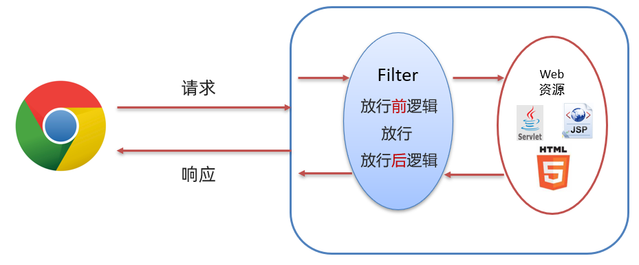

以后我们可以将对请求进行处理的代码放在放行之前进行处理，而如果请求完资源后还要对响应的数据进行处理时可以在放行后进行逻辑处理。

##  Filter拦截路径配置

**web.xml**

```xml
<filter>
	<filter-name>encodingFilter</filter-name>
	<filter-class>com.briup.filter.EncodingFilter</filter-class>
</filter>

<filter-mapping>
	<filter-name>encodingFilter</filter-name>
	<url-pattern>/*</url-pattern>
</filter-mapping>
```

> **执行顺序：按照web.xml中配置的**顺序从上到下**执行的**

**@WebFilter**

如：`@WebFilter("拦截路径")` 

拦截路径有如下四种配置方式：

* 拦截具体的资源：/index.jsp：只有访问index.jsp时才会被拦截
* 目录拦截：/user/*：访问/user下的所有资源，都会被拦截
* 后缀名拦截：*.jsp：访问后缀名为jsp的资源，都会被拦截
* 拦截所有：/*：访问所有资源，都会被拦截

> **执行顺序：过滤器类名(字符串)的自然排序。**


##  过滤器链

过滤器链是指在一个Web应用，可以配置多个过滤器，这多个过滤器称为过滤器链。


1. 执行 `Filter1` 的放行前逻辑代码
2. 执行 `Filter1` 的放行代码
3. 执行 `Filter2` 的放行前逻辑代码
4. 执行 `Filter2` 的放行代码
5. 访问到资源
6. 执行 `Filter2` 的放行后逻辑代码
7. 执行 `Filter1` 的放行后逻辑代码

## xml-inf配置

默认情况下，服务器内部跳转的请求，就无法被拦截，除非进行配置：

```xml
<filter>
	<filter-name>checkFilter</filter-name>
	<filter-class>com.briup.filter.CheckFilter</filter-class>
</filter>

<filter-mapping>
	<filter-name>checkFilter</filter-name>
	<url-pattern>/test</url-pattern>
	<dispatcher>FORWARD</dispatcher>
</filter-mapping>
```


## 注解配置

```java
@WebFilter(value = "/*", //路径
           initParams = {@WebInitParam(name = "encoding",value ="UTF-8")}, // 配置文件
           dispatcherTypes = {DispatcherType.REQUEST}) //拦截类型
```


# Listener

## 概述

* Listener 表示监听器，是 JavaWeb 三大组件(Servlet、Filter、Listener)之一。

* 监听器可以监听就是在 `application`，`session`，`request` 三个对象创建、销毁或者往其中添加修改删除属性时自动执行代码的功能组件。

  request 和 session 我们学习过。而 `application` 是 `ServletContext` 类型的对象。

  `ServletContext` 代表整个web应用，在服务器启动的时候，tomcat会自动创建该对象。在服务器关闭时会自动销毁该对象。

## 分类

- 监听 request、Session、application 的创建和销毁，这些接口分别

  ServletRequestListener

  HttpSessionListener

  ServletContextListener

```java
// 创建 session
public void sessionCreated(HttpSessionEvent se) {
	HttpSession session = se.getSession();
	System.out.println("新创建一个session, ID为: " + session.getId());
}

// 销毁 session
public void sessionDestroyed(HttpSessionEvent se) {
	HttpSession session = se.getSession();
	System.out.println("销毁一个session, ID为: " + session.getId());
}

// 加载 application
public void contextInitialized(ServletContextEvent sce) {
	ServletContext servletContext = sce.getServletContext();
	System.out.println("即将启动" + servletContext.getContextPath());
}

// 卸载 application
public void contextDestroyed(ServletContextEvent sce) {
	ServletContext servletContext = sce.getServletContext();
	System.out.println("即将关闭" + servletContext.getContextPath());
}

// 创建 request
public void requestInitialized(ServletRequestEvent sre) {
	HttpServletRequest request = (HttpServletRequest)sre.getServletRequest();
   	//项目名
	String uri = request.getRequestURI();
    //请求路径
    String query = request.getQueryString();
    
	uri = query == null ? uri : (uri + "?" +query);
    
	request.setAttribute("dateCreated", System.currentTimeMillis());
	System.out.println("IP " + request.getRemoteAddr() + " 请求 " + uri);
}

// 销毁 request
public void requestDestroyed(ServletRequestEvent sre) {
	HttpServletRequest request = (HttpServletRequest) sre.getServletRequest();
    long time = System.currentTimeMillis() - (Long)
	request.getAttribute("dateCreated");
	System.out.println(request.getRemoteAddr() + "请求处理结束, 用时" + time +"毫秒. ");
}
```

- **监听request、session、application三个对象中属性变化**

  ServletRequestAttributeListener

  HttpSessionAttributeListener

  ServletContextAttributeListener

```java
// 添加属性
public void attributeAdded(HttpSessionBindingEvent se) {
	//HttpSession session = se.getSession();
	String name = se.getName();
	Object value = se.getValue();
	System.out.println("新建session属性：" + name + ", 值为：" + value);
}

// 删除属性
public void attributeRemoved(HttpSessionBindingEvent se) {
	//HttpSession session = se.getSession();
	String name = se.getName();
	Object value = se.getValue();
	System.out.println("删除session属性：" + name + ", 值为：" + value);
}

// 修改属性
public void attributeReplaced(HttpSessionBindingEvent se) {
	HttpSession session = se.getSession();
	String name = se.getName();
	Object oldValue = se.getValue();
	Object newValue = session.getAttribute(name);
    System.out.println("修改session属性：" + name + ", 原值：" + oldValue + "新值：" + newValue);
```

- **监听Session对象里面存放着的其他对象，这些接口分别为**

​		HttpSessionBindingListener

​		HttpSessionActivationListener

```java
//对象被放进session前调用
public void valueBound(HttpSessionBindingEvent event);
//对象从session中移除后调用
public void valueUnbound(HttpSessionBindingEvent event);
//session即将被持久化到硬盘时
public void sessionWillPassivate(HttpSessionEvent se);
//session从硬盘加载后调用
public void sessionDidActivate(HttpSessionEvent se);
```

eg

```java
public class User implements HttpSessionBindingListener,HttpSessionActivationListener,Serializable{
	private static final long serialVersionUID = 1L;
	private long id;
	private String name;
    
	public User() {}
    
	public User(long id, String name) {
		this.id = id;
		this.name = name;
	}
    
	public long getId() {
		return id;
	}
    
	public void setId(long id) {
		this.id = id;
	}
    
	public String getName() {
		return name;
	}
    
	public void setName(String name) {
		this.name = name;
	}
    
	@Override
	public String toString() {
		return "User [id=" + id + ", name=" + name + "]";
	}
    
	// session从硬盘加载后
	@Override
	public void sessionDidActivate(HttpSessionEvent se) {
		HttpSession session = se.getSession();
		System.out.println(this + "已经成功从硬盘中加载。sessionId: " +session.getId());
	}
    
	// session即将被持久化到硬盘时
	@Override
	public void sessionWillPassivate(HttpSessionEvent se) {
		HttpSession session = se.getSession();
		System.out.println(this + "即将保存到硬盘。sessionId: " + session.getId());
    }
    
	// 当前对象被放进session前
	@Override
	public void valueBound(HttpSessionBindingEvent event) {
		HttpSession session = event.getSession();
		String name = event.getName();
		System.out.println(this + "被绑定到session \"" + session.getId() + "\"的" +name + "属性上");
	}
    
	// 当前对象从session中移除后
	@Override
	public void valueUnbound(HttpSessionBindingEvent event) {
		HttpSession session = event.getSession();
		String name = event.getName();
		System.out.println(this + "被从session \"" + session.getId() + "\"的" +
name + "属性上移除");
}
```


# JSP

==JSP（全称：Java Server Pages）：Java 服务端页面。==是一种动态的网页技术，其中既可以定义 HTML、JS、CSS等静态内容，还可以定义 Java代码的动态内容，也就是 `JSP = HTML + Java`。

> JSP 作用：简化开发，避免了在Servlet中直接输出HTML标签。
>

## 快速入门

### 导入 JSP 依赖

在 `dependencies` 标签中导入 JSP 的依赖，如下

```xml
<dependency>
    <groupId>javax.servlet.jsp</groupId>
    <artifactId>jsp-api</artifactId>
    <version>2.2</version>
    <scope>provided</scope>
</dependency>
```

该依赖的 `scope` 必须设置为 `provided`，因为 tomcat 中有这个jar包了，所以在打包时我们是不希望将该依赖打进到我们工程的war包中。

### 创建 jsp 页面

在项目的 `webapp` 下创建jsp页面

### 编写代码

在 `hello.jsp` 页面中书写 `HTML` 标签和 `Java` 代码，如下

```jsp
<%@ page contentType="text/html;charset=UTF-8" language="java" %>
<html>
<head>
    <title>Title</title>
</head>
<body>
    <h1>hello jsp</h1>

    <%
        System.out.println("hello,jsp~");
    %>
</body>
</html>
```

### JSP 原理

> ==JSP 本质上就是一个 Servlet。==


1. 浏览器第一次访问 `hello.jsp` 页面
2. `tomcat` 会将 `hello.jsp` 转换为名为 `hello_jsp.java` 的一个 `Servlet`
3. `tomcat` 再将转换的 `servlet` 编译成字节码文件 `hello_jsp.class`
4. `tomcat` 会执行该字节码文件，向外提供服务

JSP脚本用于在 JSP页面内定义 Java代码。在之前的入门案例中我们就在 JSP 页面定义的 Java 代码就是 JSP 脚本。

## 代码

JSP 脚本有如下三个分类：

* <%...%>：内容会直接放到_jspService()方法之中  Java 代码
* <%=…%>：内容会放到out.print()中，作为out.print()的参数，可以写Java代码
* <%!…%>：内容会放到_jspService()方法之外，被类直接包含 全局变量 或方法

```jsp
<%@ page import="com.itheima.pojo.Brand" %>
<%@ page import="java.util.List" %>
<%@ page import="java.util.ArrayList" %>
<%@ page contentType="text/html;charset=UTF-8" language="java" %>

<%
    // 查询数据库
    List<Brand> brands = new ArrayList<Brand>();
    brands.add(new Brand(1,"三只松鼠","三只松鼠",100,"三只松鼠，好吃不上火",1));
    brands.add(new Brand(2,"优衣库","优衣库",200,"优衣库，服适人生",0));
    brands.add(new Brand(3,"小米","小米科技有限公司",1000,"为发烧而生",1));

%>


<!DOCTYPE html>
<html lang="en">
<head>
    <meta charset="UTF-8">
    <title>Title</title>
</head>
<body>
<input type="button" value="新增"><br>
<hr>
<table border="1" cellspacing="0" width="800">
    <tr>
        <th>序号</th>
        <th>品牌名称</th>
        <th>企业名称</th>
        <th>排序</th>
        <th>品牌介绍</th>
        <th>状态</th>
        <th>操作</th>
    </tr>
    <%
        for (int i = 0; i < brands.size(); i++) {
            Brand brand = brands.get(i);
        //代码截断
    %>  
     

    <tr align="center">
        <td><%=brand.getId()%></td>
        <td><%=brand.getBrandName()%></td>
        <td><%=brand.getCompanyName()%></td>
        <td><%=brand.getOrdered()%></td>
        <td><%=brand.getDescription()%></td>
		<td><%=brand.getStatus() == 1 ? "启用":"禁用"%></td>
        <td><a href="#">修改</a> <a href="#">删除</a></td>
    </tr>

    <%
        }
    %>
</table>
</body>
</html>
```

## 指令

### page

新建jsp页面后，文件头部会默认有以下page指令的设置

```jsp
<%@ page language="java" contentType="text/html; charset=UTF-8"
pageEncoding="UTF-8"%>

<%--作用--%>
指定当前jsp页面中嵌入的语言是java
指定写回给浏览器页面的时候，contentType的内容
指定当前页面件保存时候所用的编码
```

在jsp中引入其他的类和接口

```jsp
<%@ page import="java.util.List,java.util.ArrayList" %>
```

指定当前jsp页面中是否支持session的使用，默认值就是true

```jsp
<%@ page session="true" %>
```

指定当前页面是专门用来显示错误的页面，在当前页面中可以使用隐藏对象exception来显示错误

信息

```jsp
<%@ page isErrorPage="true" %>
```

### include

可以将另一个页面的显示内容，引入到当前页面中的指定位置

```jsp
<%@include file="" %>
```

### taglib

在jsp中可以引入标签库，然后就可以使用标签库中的标签，来完成相应的功能了

```jsp
<%@ taglib uri="http://java.sun.com/jsp/jstl/core" prefix="c" %>
```

> 注意1，引入标签库，需要先在项目中引入对应的jar包
>
> 注意2，uri属性，指的是标签库的设置的URI地址
>
> 注意3，prefix属性，指的是给引入的标签库起一个别名，这样使用起来较为方便

## **动作**

jsp中还有内置的标签，称之为jsp的动作元素，它的本质就是把固定的java代码，封装成了标签的形式。

创建对象

```jsp
<jsp:useBean id="s" class="com.briup.bean.Student" scope="page"</jsp:useBean>

<%
	Student s = null;
	s = (Student)pageContext.getAttribute("s");
	if(s==null){
		s = new Student();
		pageContext.setAttribute("s",s);
	}
%>
```

设置对象属性

```jsp
<jsp:setProperty property="name" value="tom" name="s"/>

<%
	Student s = (Student)pageContext.getAttribute("s");
	s.setName("tom");
%>
```

得到对象属性

```jsp
<jsp:getProperty property="name" name="s"/>

<%
	Student s = (Student)pageContext.getAttribute("s");
	out.write(s.getName());
%>	
```

页面跳转

```jsp
<jsp:forward page="target.jsp"> <!--跳转页面- ->
	<jsp:param value="tom" name="name"/>  <!-- 添加参数-->
</jsp:forward>
```

动态包含

```jsp
<jsp:include page="foot.jsp">
	<jsp:param value="lisi" name="name"/>
</jsp:include>
```

## 对象

在jsp页面代码中，可以直接使用的内置的对象，只要对象名字写对即可。jsp中的内置对象一共有九种：


> 注意，这些对象的类型和名字都是固定的，任意打开一个jsp页面翻译成的java代码，查看
>
> _jspService方法，就可以看到这些内置的对象

> 注意，JSP中比servlet多了一个更加小的传值范围pageContext，存进去的值，只会在一个页面中有
>
> 效，比之前的request范围还要小

## 路径

一般情况下，jsp中路径问题是和我们之前在servlet中讨论的html里面的路径问题是一样的，但是在jsp中可以动态获得该项目的URL地

```JSP
<%
	String path = request.getContextPath();
	String basePath =request.getScheme()+"://"+request.getServerName()+":"+request.getServerPort()+path+"/";
%>

<base href="<%=basePath%>" />
```


##  缺点

通过上面的案例，我们可以看到 JSP 的很多缺点。

由于 JSP页面内，既可以定义 HTML 标签，又可以定义 Java代码，造成了以下问题：

* 书写麻烦：特别是复杂的页面

  既要写 HTML 标签，还要写 Java 代码

* 阅读麻烦

  上面案例的代码，相信你后期再看这段代码时还需要花费很长的时间去梳理

* 复杂度高：运行需要依赖于各种环境，JRE，JSP容器，JavaEE…

* 占内存和磁盘：JSP会自动生成.java和.class文件占磁盘，运行的是.class文件占内存

* 调试困难：出错后，需要找到自动生成的.java文件进行调试

* 不利于团队协作：前端人员不会 Java，后端人员不精 HTML

  如果页面布局发生变化，前端工程师对静态页面进行修改，然后再交给后端工程师，由后端工程师再将该页面改为 JSP 页面

接下来我们来学习第三阶段，使用 `EL表达式` 和 `JSTL` 标签库替换 `JSP` 中的 `Java` 代码。

## EL 表达式

###  概述

EL（全称Expression Language ）表达式语言，用于简化 JSP 页面内的 Java 代码。

EL 表达式的主要作用是 ==获取数据==。其实就是从域对象中获取数据，然后将数据展示在页面上。

而 EL 表达式的语法也比较简单，==${expression}== 。例如：${brands} 就是获取域中存储的 key 为 brands 的数据。

获取客户端参数

```Jsp
${param.name1 }
```

指定范围并取值

```jsp
${pageScope.name2 }
${requestScope.name3 }
${sessionScope.name4 }
${applicationScope.name5 }
```

可以不指定范围再去取值

```jsp
${name} 
```

> 这时候会按照pageContext request session application这样一个顺序依次的去找，有没有一个叫name的值存在，一旦找到了就输出出来，最终没有找到那么就什么都不输出

取出一个对象中的属性值

```jsp
${requestScope.student.id}
${requestScope.student.name}
${requestScope.student.age}
//或者
${student.id}
${student.name}
${student.age}
//或者
${student["id"]}
${student['id']}
${student["name"]}
${student['name']}
${student["age"]}
${student['age']}
```


### 代码演示

* 定义servlet，在 servlet 中封装一些数据并存储到 request 域对象中并转发到 `el-demo.jsp` 页面。

  ```java
  @WebServlet("/demo1")
  public class ServletDemo1 extends HttpServlet {
      @Override
      protected void doGet(HttpServletRequest request, HttpServletResponse response) throws ServletException, IOException {
          //1. 准备数据
          List<Brand> brands = new ArrayList<Brand>();
          brands.add(new Brand(1,"三只松鼠","三只松鼠",100,"三只松鼠，好吃不上火",1));
          brands.add(new Brand(2,"优衣库","优衣库",200,"优衣库，服适人生",0));
          brands.add(new Brand(3,"小米","小米科技有限公司",1000,"为发烧而生",1));
  
          //2. 存储到request域中
          request.setAttribute("brands",brands);
  
          //3. 转发到 el-demo.jsp
          request.getRequestDispatcher("/el-demo.jsp").forward(request,response);
      }
  
      @Override
      protected void doPost(HttpServletRequest request, HttpServletResponse response) throws ServletException, IOException {
          this.doGet(request, response);
      }
  }
  ```

  > ==注意：== 此处需要用转发，因为转发才可以使用 request 对象作为域对象进行数据共享

* 在 `el-demo.jsp` 中通过 EL表达式 获取数据

  ```jsp
  <%@ page contentType="text/html;charset=UTF-8" language="java" %>
  <html>
  <head>
      <title>Title</title>
  </head>
  <body>
      ${brands}
  </body>
  </html>
  ```

  

###  域对象

JavaWeb中有四大域对象，分别是：

* page：当前页面有效
* request：当前请求有效
* session：当前会话有效
* application：当前应用有效

el 表达式获取数据，会依次从这4个域中寻找，直到找到为止。而这四个域对象的作用范围如下图所示


例如： ${brands}，el 表达式获取数据，会先从page域对象中获取数据，如果没有再到 requet 域对象中获取数据，如果再没有再到 session 域对象中获取，如果还没有才会到 application 中获取数据。


## JSTL标签

###  概述

JSP标准标签库(Jsp Standarded Tag Library) ，使用标签取代JSP页面上的Java代码。如下代码就是JSTL标签

JSTL 使用也是比较简单的，分为如下步骤：

* 导入坐标

  ```xml
  <dependency>
      <groupId>jstl</groupId>
      <artifactId>jstl</artifactId>
      <version>1.2</version>
  </dependency>
  <dependency>
      <groupId>taglibs</groupId>
      <artifactId>standard</artifactId>
      <version>1.1.2</version>
  </dependency>
  ```

* 在JSP页面上引入JSTL标签库

  ```jsp
  <%@ taglib prefix="c" uri="http://java.sun.com/jsp/jstl/core" %> 
  ```

* 使用标签

### if 标签

`<c:if>`：相当于 if 判断

* 属性：test，用于定义条件表达式

```jsp
<c:if test="${flag == 1}">
    男
</c:if>
<c:if test="${flag == 2}">
    女
</c:if>
```

**代码演示：**

* 定义一个 `servlet` ，在该 `servlet` 中向 request 域对象中添加 键是 `status` ，值为 `1` 的数据

  ```java
  @WebServlet("/demo2")
  public class ServletDemo2 extends HttpServlet {
      @Override
      protected void doGet(HttpServletRequest request, HttpServletResponse response) throws ServletException, IOException {
          //1. 存储数据到request域中
          request.setAttribute("status",1);
  
          //2. 转发到 jstl-if.jsp
          数据request.getRequestDispatcher("/jstl-if.jsp").forward(request,response);
      }
  
      @Override
      protected void doPost(HttpServletRequest request, HttpServletResponse response) throws ServletException, IOException {
          this.doGet(request, response);
      }
  }
  ```

* 定义 `jstl-if.jsp` 页面，在该页面使用 `<c:if>` 标签

  ```jsp
  <%@ page contentType="text/html;charset=UTF-8" language="java" %>
  <%@ taglib prefix="c" uri="http://java.sun.com/jsp/jstl/core" %>
  <html>
  <head>
      <title>Title</title>
  </head>
  <body>
      <%--
          c:if：来完成逻辑判断，替换java  if else
      --%>
      <c:if test="${status ==1}">
          启用
      </c:if>
  
      <c:if test="${status ==0}">
          禁用
      </c:if>
  </body>
  </html>
  ```

  > ==注意：== 在该页面已经要引入 JSTL核心标签库
  >
  > `<%@ taglib prefix="c" uri="http://java.sun.com/jsp/jstl/core" %>`

###  forEach 标签

`<c:forEach>`：相当于 for 循环。java中有增强for循环和普通for循环，JSTL 中的 `<c:forEach>` 也有两种用法

####  用法一

类似于 Java 中的增强for循环。涉及到的 `<c:forEach>` 中的属性如下

* items：被遍历的容器
* var：遍历产生的临时变量
* varStatus：遍历状态对象

.index 从0开始      .count从1开始

如下代码，是从域对象中获取名为 brands 数据，该数据是一个集合；遍历遍历，并给该集合中的每一个元素起名为 `brand`，是 Brand对象。在循环里面使用 EL表达式获取每一个Brand对象的属性值

```jsp
<c:forEach items="${brands}" var="brand">
    <tr align="center">
        <td>${brand.id}</td>
        <td>${brand.brandName}</td>
        <td>${brand.companyName}</td>
        <td>${brand.description}</td>
    </tr>
</c:forEach>
```

**代码演示：**

* `servlet` 还是使用之前的名为 `ServletDemo1` 。

* 定义名为 `jstl-foreach.jsp` 页面，内容如下：

  ```jsp
  <%@ page contentType="text/html;charset=UTF-8" language="java" %>
  <%@ taglib prefix="c" uri="http://java.sun.com/jsp/jstl/core" %>
  
  <!DOCTYPE html>
  <html lang="en">
  <head>
      <meta charset="UTF-8">
      <title>Title</title>
  </head>
  <body>
  <input type="button" value="新增"><br>
  <hr>
  <table border="1" cellspacing="0" width="800">
      <tr>
          <th>序号</th>
          <th>品牌名称</th>
          <th>企业名称</th>
          <th>排序</th>
          <th>品牌介绍</th>
          <th>状态</th>
          <th>操作</th>
      </tr>
  
      <c:forEach items="${brands}" var="brand" varStatus="status">
          <tr align="center">
              <%--<td>${brand.id}</td>--%>
              <td>${status.count}</td>
              <td>${brand.brandName}</td>
              <td>${brand.companyName}</td>
              <td>${brand.ordered}</td>
              <td>${brand.description}</td>
              <c:if test="${brand.status == 1}">
                  <td>启用</td>
              </c:if>
              <c:if test="${brand.status != 1}">
                  <td>禁用</td>
              </c:if>
              <td><a href="#">修改</a> <a href="#">删除</a></td>
          </tr>
      </c:forEach>
  </table>
  </body>
  </html>
  ```

####  用法二

类似于 Java 中的普通for循环。涉及到的 `<c:forEach>` 中的属性如下

* begin：开始数

* end：结束数

* step：步长

实例代码：

从0循环到10，变量名是 `i` ，每次自增1

```jsp
<c:forEach begin="0" end="10" step="1" var="i">
    ${i}
</c:forEach>
```

### c:import 标签

和 <jsp:include> 的作用基本相同，但是 <c:import> 还可以选择把引入的内容先保存在一个变量中，之后通过EL表达式再拿出来显示

```jsp
<c:import var="data" url="a.jsp" />

<div>${data}</div>
```

### c:redirect 标签

重定向标签

```jsp
<c:redirect url="a.jsp"/> 
```

### 自定义

- 编写自定义标签处理类
- 建立一个 *.tld 文件，该文件放在WEB-INF下即可
- 每个 *.tld 文件对应一个标签库，每个标签库可以对应多个标签
- 在jsp文件中使用tablib指令引入并使用自定义标签
- jsp页面中使用该标签库

第一步，继承SimpleTagSupport，重写doTag即可

```java
public class HelloTag extends SimpleTagSupport {
	private int count;
	@Override
	public void doTag() throws JspException, IOException {
	//准备好一个StringWriter，接收标签体内容
		StringWriter sw = new StringWriter();
		//把标签体内容写到StringWriter中
		super.getJspBody().invoke(sw);
		//从StringWriter中获取标签体的内容
		String tagBody = sw.toString();
		for(int i=0;i<count;i++) {
			super.getJspContext().getOut().println("hello! "+tagBody+"<br>");
		}
	}
	public int getCount() {
		return count;
	}
	public void setCount(int count) {
		this.count = count;
	}
}
```

第二步，编写my-tag.tld文件(名字随意)，存放在WEB-INF下

```jsp
<?xml version="1.0" encoding="ISO-8859-1" ?>
<!DOCTYPE taglib
PUBLIC "-//Sun Microsystems, Inc.//DTD JSP Tag Library 1.2//EN"
"http://java.sun.com/j2ee/dtd/web-jsptaglibrary_1_2.dtd">
<taglib>
	<tlib-version>1.0</tlib-version>
	<jsp-version>1.2</jsp-version>
	<short-name>my-taglib</short-name>
	<uri>briup-taglib</uri>
	<tag>
		<name>hello</name>
		<tag-class>com.briup.test.HelloTag</tag-class>
		<body-content>scriptless</body-content>
		<attribute>
			<name>count</name>
			<required>true</required>
		</attribute>
	</tag>
</taglib>
```

> 标签类型

- empty，空标记，即起始标记和结束标记之间没有内容
- scriptless，可以接收文本、EL和JSP动作
- JSP，（SimpleTagSupport类型不支持），接受所有JSP语法，如定制的或内部的tag、scripts、静态
- HTML、脚本元素、JSP指令和动作
- tagdependent，标签体内容直接被写入BodyContent，由自定义标签类来进行处理，而不被JSP容器解释

第三步，jsp页面中引入并使用标签库

```jsp
<%@ page language="java" contentType="text/html; charset=UTF-8"
	pageEncoding="UTF-8"%>
<%@ taglib uri="briup-taglib" prefix="briup" %>
<!DOCTYPE html>
<html>
	<head>
		<meta charset="UTF-8">
		<title>hello.jsp</title>
	</head>
	<body>
		<briup:hello></briup:hello>
	</body>
</html>
```

# 开发模式

## MVC模式

MVC 模式和三层架构是一些理论的知识，将来我们使用了它们进行代码开发会让我们代码维护性和扩展性更好。

MVC 是一种分层开发的模式，其中：

* M：Model，业务模型，处理业务

* V：View，视图，界面展示

* C：Controller，控制器，处理请求，调用模型和视图


控制器（serlvlet）用来接收浏览器发送过来的请求，控制器调用模型（JavaBean）来获取数据，比如从数据库查询数据；控制器获取到数据后再交由视图（JSP）进行数据展示。

**MVC 好处：**

* 职责单一，互不影响。每个角色做它自己的事，各司其职。

* 有利于分工协作。

* 有利于组件重用

## 三层架构

三层架构是将我们的项目分成了三个层面，分别是 `表现层`、`业务逻辑层`、`数据访问层`。


* 数据访问层：对数据库的CRUD基本操作
* 业务逻辑层：对业务逻辑进行封装，组合数据访问层层中基本功能，形成复杂的业务逻辑功能。例如 `注册业务功能` ，我们会先调用 `数据访问层` 的 `selectByName()` 方法判断该用户名是否存在，如果不存在再调用 `数据访问层` 的 `insert()` 方法进行数据的添加操作
* 表现层：接收请求，封装数据，调用业务逻辑层，响应数据

三层架构的每一层都有特有的包名称：

* 表现层： `com.itheima.controller` 或者 `com.itheima.web`
* 业务逻辑层：`com.itheima.service`
* 数据访问层：`com.itheima.dao` 或者 `com.itheima.mapper`

## MVC 和 三层架构


可以将 `MVC 模式` 理解成是一个大的概念，而 `三层架构` 是对 `MVC 模式` 实现架构的思想。 那么我们以后按照要求将不同层的代码写在不同的包下，每一层里功能职责做到单一，将来如果将表现层的技术换掉，而业务逻辑层和数据访问层的代码不需要发生变化。


# Ajax

## 概述

==`AJAX` (Asynchronous JavaScript And XML)：异步的 JavaScript 和 XML。==

我们先来说概念中的 `JavaScript` 和 `XML`，`JavaScript` 表明该技术和前端相关；`XML` 是指以此进行数据交换。而这两个我们之前都学习过。

## 作用

1**与服务器进行数据交换**：通过AJAX可以给服务器发送请求，服务器将数据直接响应回给浏览器。


2**异步交互**：可以在==不重新加载整个页面==的情况下，与服务器交换数据并==更新部分网页==的技术，如：搜索联想、用户名是否可用校验，等等…

## 同步和异步

知道了局部刷新后，接下来我们再聊聊同步和异步:

* 同步发送请求过程如下


浏览器页面在发送请求给服务器，在服务器处理请求的过程中，浏览器页面不能做其他的操作。只能等到服务器响应结束后才能，浏览器页面才能继续做其他的操作。

- 异步发送请求过程如下


## 快速入门

### 服务端实现

在项目的创建 `com.itheima.web.servlet` ，并在该包下创建名为  `AjaxServlet` 的servlet

```java
@WebServlet("/ajaxServlet")
public class AjaxServlet extends HttpServlet {
    @Override
    protected void doGet(HttpServletRequest request, HttpServletResponse response) throws ServletException, IOException {
        //1. 响应数据
        response.getWriter().write("hello ajax~");
    }

    @Override
    protected void doPost(HttpServletRequest request, HttpServletResponse response) throws ServletException, IOException {
        this.doGet(request, response);
    }
}
```

### 客户端实现

在 `webapp` 下创建名为 `01-ajax-demo1.html` 的页面，在该页面书写 `ajax` 代码

* 创建核心对象，不同的浏览器创建的对象是不同的

  ```js
   var xhttp;
  if (window.XMLHttpRequest) {
      xhttp = new XMLHttpRequest();
  } else {
      // code for IE6, IE5
      xhttp = new ActiveXObject("Microsoft.XMLHTTP");
  }
  ```

* 发送请求

  ```js
  //建立连接
  xhttp.open("GET", "http://localhost:8080/ajax-demo/ajaxServlet");
  //发送请求
  xhttp.send();
  ```

* 获取响应

  ```js
  xhttp.onreadystatechange = function() {
      if (this.readyState == 4 && this.status == 200) {
          // 通过 this.responseText 可以获取到服务端响应的数据
          alert(this.responseText);
      }
  };
  ```

**完整代码如下：**

```html
<!DOCTYPE html>
<html lang="en">
<head>
    <meta charset="UTF-8">
    <title>Title</title>
</head>
<body>

<script>
    //1. 创建核心对象
    var xhttp;
    if (window.XMLHttpRequest) {
        xhttp = new XMLHttpRequest();
    } else {
        // code for IE6, IE5
        xhttp = new ActiveXObject("Microsoft.XMLHTTP");
    }
    //2. 发送请求
    xhttp.open("GET", "http://localhost:8080/ajax-demo/ajaxServlet");
    xhttp.send();

    //3. 获取响应
    xhttp.onreadystatechange = function() {
        if (this.readyState == 4 && this.status == 200) {
            alert(this.responseText);
        }
    };
</script>
</body>
</html>
```

## jquery

jquery是对js封装的一个库，也是一个js文件，使用的时候，只需要将jquery文件引入到当前页面中即可。

jquery官网： **https://www.bootcdn.cn/**

### 基本使用

- 引入

  ```JSP
  <script src="https://cdn.bootcdn.net/ajax/libs/jquery/3.6.1/jquery.min.js"></script>
  ```

> 由于浏览器解析页面，是从上往下，依次解析，所以我们一般希望的是，先加载完所有的html标签元素，然后再执行js代码，这样就可以在js中获取已经加载的html标签元素了。

```JAVA
//给window对象的onload事件绑定一个匿名函数
window.onload = function(){
	// js代码，操作页面元素
};

$(document).ready(function(){
	//jquery代码，操作页面元素
});

//$();
//$(function(){});
//将上面大括号展开即可
$(function(){
	//jquery代码，操作页面元素
});
```

​	**eg**

```jsp
<%@ page language="java" contentType="text/html; charset=UTF-8"
pageEncoding="UTF-8"%>
<!DOCTYPE html>
<html>
<head>
<meta charset="UTF-8">
<title>test</title>
<script type="text/javascript" src="/jquery/jquery-1.8.3.min.js"></script>
<script type="text/javascript">
	//页面加载完毕后，再执行jquery代码
	$(function(){
        
		//给btn1按钮添加点击事件
		$("#btn1").on("click",function(){
			//点击触发事件后，给div添加内容，并且设置其css的样式
	 		$("#dd").html("helloworld").css({width:"100px",height:"100px",border:"1px solid red"});
		});
        
		//给btn2按钮添加点击事件
		$("#btn2").on("click",function(){
			//点击触发事件后，让div隐藏起来，并且使用动画效果
			$("#dd").slideUp();
		});
        
		//给btn3按钮添加点击事件
		$("#btn3").on("click",function(){
			//点击触发事件后，让div显示出来，并且使用动画效果
			$("#dd").slideDown();
		});
});
</script>
</head>
<body>
<button id="btn1">测试</button>
<button id="btn2">隐藏</button>
<button id="btn3">显示</button>
<div id="dd"></div>
```

### ajax

#### Get

```jsp
<script type="text/javascript">
$(function(){
	$("#btn").on("click",function(){
		$.ajax({
			type: "GET",
			url: "/ajax-test?username=mary",
			dataType: "text",
			success: function(result){
				$("#dd").html(result);
			},
            beforeSend:function(){
                //当ajax向后台发送指令，会自动执行脚本
            	//该函数的返回值能后决定ajax是否真正向后台发送请求
                //如果true 发送 反之
                
            }
		});
	});
});
</script>
```

#### Post

```jsp
<script type="text/javascript">
	$(function(){
		$("#btn").on("click",function(){
			$.ajax({
				type: "POST",
				url: "/ajax-test",
				data: "username=lucy",
				dataType: "text",
				success: function(result){
					$("#dd").html(result);
				},
            beforeSend:function(){
                //当ajax向后台发送指令，会自动执行脚本
            	//该函数的返回值能后决定ajax是否真正向后台发送请求
                //如果true 发送 反之   
            }
		});
	});
});
```

#### 单独的函数

```jsp
<script type="text/javascript">
	$(function(){
		$("#btn").on("click",function(){
            
			//第二个参数，也可以写成 "username=briup" 或者 {username:"briup"}
			$.post("/ajax-test",{username:"briup"},function(result){
				$("#dd").html(result);
			},"text");
            
            //get相同
	});
});
</script>
```

## axios

Axios 对原生的AJAX进行封装，简化书写。

Axios官网是：https://www.axios-http.cn

###  基本使用

axios 使用是比较简单的，分为以下两步：

* 引入 axios 的 js 文件

  ```html
  <script src="js/axios-0.18.0.js"></script>
  ```

* 使用axios 发送请求，并获取响应结果

  * 发送 get 请求

    ```js
    axios({
        method:"get",
        url:"http://localhost:8080/ajax-demo1/aJAXDemo1?username=zhangsan"
    }).then(function (resp){
        alert(resp.data);
    })
    ```

  * 发送 post 请求

    ```js
    axios({
        method:"post",
        url:"http://localhost:8080/ajax-demo1/aJAXDemo1",
        data:"username=zhangsan"
    }).then(function (resp){
        alert(resp.data);
    });
    ```

`axios()` 是用来发送异步请求的，小括号中使用 js 对象传递请求相关的参数：

* `method` 属性：用来设置请求方式的。取值为 `get` 或者 `post`。
* `url` 属性：用来书写请求的资源路径。如果是 `get` 请求，需要将请求参数拼接到路径的后面，格式为： `url?参数名=参数值&参数名2=参数值2`。
* `data` 属性：作为请求体被发送的数据。也就是说如果是 `post` 请求的话，数据需要作为 `data` 属性的值。

```HTML
<!DOCTYPE html>
<html lang="en">
<head>
    <meta charset="UTF-8">
    <title>Title</title>
</head>
<body>

<script src="js/axios-0.18.0.js"></script>
<script>
    //1. get
   /* axios({
        method:"get",
        url:"http://localhost:8080/ajax-demo/axiosServlet?username=zhangsan"
    }).then(function (resp) {
        alert(resp.data);
    })*/

    //2. post  在js中{} 表示一个js对象，而这个js对象中有三个属性
    axios({
        method:"post",
        url:"http://localhost:8080/ajax-demo/axiosServlet",
        data:"username=zhangsan"
    }).then(function (resp) {
        alert(resp.data);
    })
</script>
</body>
</html>
```

###  请求方法别名

为了方便起见， Axios 已经为所有支持的请求方法提供了别名。如下：

* `get` 请求 ： `axios.get(url[,config])`

* `delete` 请求 ： `axios.delete(url[,config])`

* `head` 请求 ： `axios.head(url[,config])`

* `options` 请求 ： `axios.option(url[,config])`

* `post` 请求：`axios.post(url[,data[,config])`

* `put` 请求：`axios.put(url[,data[,config])`

* `patch` 请求：`axios.patch(url[,data[,config])`

而我们只关注 `get` 请求和 `post` 请求。

入门案例中的 `get` 请求代码可以改为如下：

```js
axios.get("http://localhost:8080/ajax-demo/axiosServlet?username=zhangsan").then(function (resp) {
    alert(resp.data);
});
```

入门案例中的 `post` 请求代码可以改为如下：

```js
axios.post("http://localhost:8080/ajax-demo/axiosServlet","username=zhangsan").then(function (resp) {
    alert(resp.data);
})
```

# Element

Element：是饿了么公司前端开发团队提供的一套基于 Vue 的网站组件库，用于快速构建网页。

https://element.eleme.cn/#/zh-CN

##  快速入门

1. 将资源 `04-资料\02-element` 下的 `element-ui` 文件夹直接拷贝到项目的 `webapp` 下。目录结构如下

2. 创建页面，并在页面引入Element 的css、js文件 和 Vue.js

   ```html
   <script src="vue.js"></script>
   <script src="element-ui/lib/index.js"></script>
   <link rel="stylesheet" href="element-ui/lib/theme-chalk/index.css">
   ```

3. .创建Vue核心对象

   Element 是基于 Vue 的，所以使用Element时必须要创建 Vue 对象

   ```html
   <script>
       new Vue({
           el:"#app"
       })
   </script>
   ```

4. 官网复制Element组件代码

   在左菜单栏找到 `Button 按钮` ，然后找到自己喜欢的按钮样式，点击 `显示代码` ，在下面就会展示出对应的代码，将这些代码拷贝到我们自己的页面即可。

**整体页面代码如下：**

```html
<!DOCTYPE html>
<html lang="en">
<head>
    <meta charset="UTF-8">
    <title>Title</title>
</head>
<body>
<div id="app">


    <el-row>
     	<el-button>默认按钮</el-button>
        <el-button type="primary">主要按钮</el-button>
        <el-button type="success">成功按钮</el-button>
        <el-button type="info">信息按钮</el-button>
        <el-button type="warning">警告按钮</el-button>
        <el-button type="danger">删除</el-button>
    </el-row>
    <el-row>
        <el-button plain>朴素按钮</el-button>
        <el-button type="primary" plain>主要按钮</el-button>
        <el-button type="success" plain>成功按钮</el-button>
        <el-button type="info" plain>信息按钮</el-button>
        <el-button type="warning" plain>警告按钮</el-button>
        <el-button type="danger" plain>危险按钮</el-button>
    </el-row>

    <el-row>
        <el-button round>圆角按钮</el-button>
        <el-button type="primary" round>主要按钮</el-button>
        <el-button type="success" round>成功按钮</el-button>
        <el-button type="info" round>信息按钮</el-button>
        <el-button type="warning" round>警告按钮</el-button>
        <el-button type="danger" round>危险按钮</el-button>
    </el-row>

    <el-row>
        <el-button icon="el-icon-search" circle></el-button>
        <el-button type="primary" icon="el-icon-edit" circle></el-button>
        <el-button type="success" icon="el-icon-check" circle></el-button>
        <el-button type="info" icon="el-icon-message" circle></el-button>
        <el-button type="warning" icon="el-icon-star-off" circle></el-button>
        <el-button type="danger" icon="el-icon-delete" circle></el-button>
    </el-row>
</div>

<script src="js/vue.js"></script>
<script src="element-ui/lib/index.js"></script>
<link rel="stylesheet" href="element-ui/lib/theme-chalk/index.css">

<script>
    new Vue({
        el:"#app"
    })
</script>

</body>
</html>
```

##   Element 布局

Element 提供了两种布局方式，分别是：

* Layout 布局
* Container 布局容器


**整体页面代码如下：**

```html
<!DOCTYPE html>
<html lang="en">
<head>
    <meta charset="UTF-8">
    <title>Title</title>

    <style>
        .el-row {
            margin-bottom: 20px;
        }
        .el-col {
            border-radius: 4px;
        }
        .bg-purple-dark {
            background: #99a9bf;
        }
        .bg-purple {
            background: #d3dce6;
        }
        .bg-purple-light {
            background: #e5e9f2;
        }
        .grid-content {
            border-radius: 4px;
            min-height: 36px;
        }
        .row-bg {
            padding: 10px 0;
            background-color: #f9fafc;
        }
    </style>
</head>
<body>
<div id="app">
    <el-row>
        <el-col :span="24"><div class="grid-content bg-purple-dark"></div></el-col>
    </el-row>
    <el-row>
        <el-col :span="12"><div class="grid-content bg-purple"></div></el-col>
        <el-col :span="12"><div class="grid-content bg-purple-light"></div></el-col>
    </el-row>
    <el-row>
        <el-col :span="8"><div class="grid-content bg-purple"></div></el-col>
        <el-col :span="8"><div class="grid-content bg-purple-light"></div></el-col>
        <el-col :span="8"><div class="grid-content bg-purple"></div></el-col>
    </el-row>
    <el-row>
        <el-col :span="6"><div class="grid-content bg-purple"></div></el-col>
        <el-col :span="6"><div class="grid-content bg-purple-light"></div></el-col>
        <el-col :span="6"><div class="grid-content bg-purple"></div></el-col>
        <el-col :span="6"><div class="grid-content bg-purple-light"></div></el-col>
    </el-row>
    <el-row>
        <el-col :span="4"><div class="grid-content bg-purple"></div></el-col>
        <el-col :span="4"><div class="grid-content bg-purple-light"></div></el-col>
        <el-col :span="4"><div class="grid-content bg-purple"></div></el-col>
        <el-col :span="4"><div class="grid-content bg-purple-light"></div></el-col>
        <el-col :span="4"><div class="grid-content bg-purple"></div></el-col>
        <el-col :span="4"><div class="grid-content bg-purple-light"></div></el-col>
    </el-row>
</div>
<script src="js/vue.js"></script>
<script src="element-ui/lib/index.js"></script>
<link rel="stylesheet" href="element-ui/lib/theme-chalk/index.css">

<script>
    new Vue({
        el:"#app"
    })
</script>
</body>
</html>
```

现在需要添加一行，要求该行显示8个格子，通过计算每个格子占 3 栏，具体的html 代码如下

```html
<!--
添加一行，8个格子  24/8 = 3
-->
<el-row>
    <el-col :span="3"><div class="grid-content bg-purple"></div></el-col>
    <el-col :span="3"><div class="grid-content bg-purple-light"></div></el-col>
    <el-col :span="3"><div class="grid-content bg-purple"></div></el-col>
    <el-col :span="3"><div class="grid-content bg-purple-light"></div></el-col>
    <el-col :span="3"><div class="grid-content bg-purple"></div></el-col>
    <el-col :span="3"><div class="grid-content bg-purple-light"></div></el-col>
    <el-col :span="3"><div class="grid-content bg-purple"></div></el-col>
    <el-col :span="3"><div class="grid-content bg-purple-light"></div></el-col>
</el-row>
```

## Container 布局容器

用于布局的容器组件，方便快速搭建页面的基本结构。如下图就是布局容器效果。

如下图是官网提供的 Container 布局容器实例：


该效果代码中包含了样式、页面标签、模型数据。将里面的样式 `<style>` 拷贝到我们自己页面的 `head` 标签中；将html标签拷贝到 `<div id="app"></div>` 标签中，再将数据模型拷贝到 `vue` 对象的 `data()` 中。

**整体页面代码如下：**

```html
<!DOCTYPE html>
<html lang="en">
<head>
    <meta charset="UTF-8">
    <title>Title</title>

    <style>
        .el-header {
            background-color: #B3C0D1;
            color: #333;
            line-height: 60px;
        }

        .el-aside {
            color: #333;
        }
    </style>
</head>
<body>
<div id="app">
    <el-container style="height: 500px; border: 1px solid #eee">
        <el-aside width="200px" style="background-color: rgb(238, 241, 246)">
            <el-menu :default-openeds="['1', '3']">
                <el-submenu index="1">
                    <template slot="title"><i class="el-icon-message"></i>导航一</template>
                    <el-menu-item-group>
                        <template slot="title">分组一</template>
                        <el-menu-item index="1-1">选项1</el-menu-item>
                        <el-menu-item index="1-2">选项2</el-menu-item>
                    </el-menu-item-group>
                    <el-menu-item-group title="分组2">
                        <el-menu-item index="1-3">选项3</el-menu-item>
                    </el-menu-item-group>
                    <el-submenu index="1-4">
                        <template slot="title">选项4</template>
                        <el-menu-item index="1-4-1">选项4-1</el-menu-item>
                    </el-submenu>
                </el-submenu>
                <el-submenu index="2">
                    <template slot="title"><i class="el-icon-menu"></i>导航二</template>
                    <el-submenu index="2-1">
                        <template slot="title">选项1</template>
                        <el-menu-item index="2-1-1">选项1-1</el-menu-item>
                    </el-submenu>
                </el-submenu>
                <el-submenu index="3">
                    <template slot="title"><i class="el-icon-setting"></i>导航三</template>
                    <el-menu-item-group>
                        <template slot="title">分组一</template>
                        <el-menu-item index="3-1">选项1</el-menu-item>
                        <el-menu-item index="3-2">选项2</el-menu-item>
                    </el-menu-item-group>
                    <el-menu-item-group title="分组2">
                        <el-menu-item index="3-3">选项3</el-menu-item>
                    </el-menu-item-group>
                    <el-submenu index="3-4">
                        <template slot="title">选项4</template>
                        <el-menu-item index="3-4-1">选项4-1</el-menu-item>
                    </el-submenu>
                </el-submenu>
            </el-menu>
        </el-aside>

        <el-container>
            <el-header style="text-align: right; font-size: 12px">
                <el-dropdown>
                    <i class="el-icon-setting" style="margin-right: 15px"></i>
                    <el-dropdown-menu slot="dropdown">
                        <el-dropdown-item>查看</el-dropdown-item>
                        <el-dropdown-item>新增</el-dropdown-item>
                        <el-dropdown-item>删除</el-dropdown-item>
                    </el-dropdown-menu>
                </el-dropdown>
                <span>王小虎</span>
            </el-header>

            <el-main>
                <el-table :data="tableData">
                    <el-table-column prop="date" label="日期" width="140">
                    </el-table-column>
                    <el-table-column prop="name" label="姓名" width="120">
                    </el-table-column>
                    <el-table-column prop="address" label="地址">
                    </el-table-column>
                </el-table>
            </el-main>
        </el-container>
    </el-container>
</div>
<script src="js/vue.js"></script>
<script src="element-ui/lib/index.js"></script>
<link rel="stylesheet" href="element-ui/lib/theme-chalk/index.css">

<script>
    new Vue({
        el:"#app",
        data() {
            const item = {
                date: '2016-05-02',
                name: '王小虎',
                address: '上海市普陀区金沙江路 1518 弄'
            };
            return {
                tableData: Array(20).fill(item)
            }
        }
    })
</script>
</body>
</html>
```

# JSON

###  概述

==概念：`JavaScript Object Notation`。JavaScript 对象表示法.==

如下是 `JavaScript` 对象的定义格式：

```js
{
	name:"zhangsan",
	age:23,
	city:"北京"
}
```

接下来我们再看看 `JSON` 的格式：

```json
{
	"name":"zhangsan",
	"age":23,
	"city":"北京"
}
```

由于其语法格式简单，层次结构鲜明，现多用于作为==数据载体==，在网络中进行数据传输

###  JSON 基础语法

#### 定义格式

`JSON` 本质就是一个字符串，但是该字符串内容是有一定的格式要求的。 定义格式如下：

```js
var 变量名 = '{"key":value,"key":value,...}';
```

`JSON` 串的键要求必须使用双引号括起来，而值根据要表示的类型确定。value 的数据类型分为如下

* 数字（整数或浮点数）
* 字符串（使用双引号括起来）
* 逻辑值（true或者false）
* 数组（在方括号中）
* 对象（在花括号中）
* null

```html
<!DOCTYPE html>
<html lang="en">
<head>
    <meta charset="UTF-8">
    <title>Title</title>
</head>
<body>
<script>
    //1. 定义JSON字符串
    var jsonStr = '{"name":"zhangsan","age":23,"addr":["北京","上海","西安"]}'
    alert(jsonStr);

</script>
</body>
</html>
```

### **JavaScript**

#### JSON对象转为字符串

```js
var jsonObj = {name:"tom",age:20};
var jsonStr = JSON.stringify(jsonObj);
```

#### 字符串转为JSON对象

```js
var jsonStr = "{\"name\":\"tom\",\"age\":20}";
var jsonObj = JSON.parse(jsonStr);
```

#### JSON数组对象转字符串

```js
var jsonArr = [];
var obj1 = {name:"tom1",age:21};
var obj2 = {name:"tom2",age:22};
jsonArr.push(obj1);
jsonArr.push(obj2);
console.log(JSON.stringify(jsonArr));
```

#### 字符串转换JSON数组对象

```js
var jsonArrStr = "[{\"name\":\"tom1\",\"age\":21},
{\"name\":\"tom2\",\"age\":22}]";
var jsonArr = JSON.parse(jsonArrStr);
console.log(jsonArr);
```

### java

#### Fastjson 

`Fastjson` 是阿里巴巴提供的一个Java语言编写的高性能功能完善的 `JSON` 库，是目前Java语言中最快的 `JSON` 库，可以实现 `Java` 对象和 `JSON` 字符串的相互转换。

**Fastjson 使用**

`Fastjson` 使用也是比较简单的，分为以下三步完成

1. **导入坐标**

   ```xml
   <dependency>
       <groupId>com.alibaba</groupId>
       <artifactId>fastjson</artifactId>
       <version>1.2.62</version>
   </dependency>
   ```

2. **Java对象转JSON**

   ```java
   String jsonStr = JSON.toJSONString(obj);
   ```

   将 Java 对象转换为 JSON 串，只需要使用 `Fastjson` 提供的 `JSON` 类中的 `toJSONString()` 静态方法即可。

3. **JSON字符串转Java对象**

   ```java
   User user = JSON.parseObject(jsonStr, User.class);
   ```

   将 json 转换为 Java 对象，只需要使用 `Fastjson` 提供的 `JSON` 类中的 `parseObject()` 静态方法即可。

```java
@WebServlet("/selectAllServlet")
public class SelectAllServlet extends HttpServlet {
    private BrandService brandService = new BrandService();

    @Override
    protected void doGet(HttpServletRequest request, HttpServletResponse response) throws ServletException, IOException {
        //1. 调用Service查询
        List<Brand> brands = brandService.selectAll();

        //2. 将集合转换为JSON数据   序列化
        String jsonString = JSON.toJSONString(brands);

        //3. 响应数据  application/json   text/json
        response.setContentType("text/json;charset=utf-8");
        response.getWriter().write(jsonString);
    }

    @Override
    protected void doPost(HttpServletRequest request, HttpServletResponse response) throws ServletException, IOException {
        this.doGet(request, response);
    }
}
```

```java
@WebServlet("/addServlet")
public class AddServlet extends HttpServlet {

    private BrandService brandService = new BrandService();

    @Override
    protected void doGet(HttpServletRequest request, HttpServletResponse response) throws ServletException, IOException {

        //1. 接收数据,request.getParameter 不能接收json的数据
       /* String brandName = request.getParameter("brandName");
        System.out.println(brandName);*/

        // 获取请求体数据
        BufferedReader br = request.getReader();
        String params = br.readLine();
        // 将JSON字符串转为Java对象
        Brand brand = JSON.parseObject(params, Brand.class);
        //2. 调用service 添加
        brandService.add(brand);
        //3. 响应成功标识
        response.getWriter().write("success");
    }

    @Override
    protected void doPost(HttpServletRequest request, HttpServletResponse response) throws ServletException, IOException {
        this.doGet(request, response);
    }
}
```

####  jackson

```xml
<dependency>
	<groupId>com.fasterxml.jackson.core</groupId>
	<artifactId>jackson-databind</artifactId>
	<version>2.11.3</version>
</dependency>
```

> 注意， @JsonFormat(pattern = "yyyy-MM-dd") 指定该属性转换json格式字符串的时候的日期格式

> 注意， @JsonIgnoreProperties({"password"}) 指定改属性在转json格式字符串的时候可以忽
>
> 略掉

**User对象转换json字符**串

```java
@Test
public void test_obj2json() {
	ObjectMapper mapper = new ObjectMapper();
	User user = new User(1,"tom",new Date(),"123456");
	try {
		String jsonStr = mapper.writeValueAsString(user);
		System.out.println(jsonStr);
	} catch (JsonProcessingException e) {
		e.printStackTrace();
	}
}
```

**json格式字符串转User对象**

```java
@Test
public void test_json2Obj() {
	ObjectMapper mapper = new ObjectMapper();
	String jsonStr = "{\"id\":1,\"name\":\"tom\",\"dob\":\"2022-10-29\"}";
	try {
		User user = mapper.readValue(jsonStr, User.class);
		System.out.println(user);
	} catch (JsonMappingException e) {
		e.printStackTrace();
	} catch (JsonProcessingException e) {
		e.printStackTrace();
	}
}
```

详情看json ppt

# Vue

Vue 是一套前端框架，免除原生JavaScript中的DOM操作，简化书写。

基于MVVM(Model-View-ViewModel)思想，实现数据的双向绑定，将编程的关注点放在数据上。

## 快速入门

Vue 使用起来是比较简单的，总共分为如下三步：

1. **新建 HTML 页面，引入 Vue.js文件**

   ```html
   <script src="js/vue.js"></script>
   ```

2. **在JS代码区域，创建Vue核心对象，进行数据绑定**

   ```js
   new Vue({
       el: "#app",
       data() {
           return {
               username: ""
           }
       }
   });
   ```

   创建 Vue 对象时，需要传递一个 js 对象，而该对象中需要如下属性：

   * `el` ： 用来指定哪儿些标签受 Vue 管理。 该属性取值 `#app` 中的 `app` 需要是受管理的标签的id属性值
   * `data` ：用来定义数据模型
   * `methods` ：用来定义函数。这个我们在后面就会用到

3. **编写视图**

   ```html
   <div id="app">
       <input name="username" v-model="username" >
       {{username}}
   </div>
   ```

   `{{}}` 是 Vue 中定义的 `插值表达式` ，在里面写数据模型，到时候会将该模型的数据值展示在这个位置。

**整体代码如下：**

```html
<!DOCTYPE html>
<html lang="en">
<head>
    <meta charset="UTF-8">
    <title>Title</title>
</head>
<body>
<div id="app">
    <input v-model="username">
    <!--插值表达式-->
    {{username}}
</div>
<script src="js/vue.js"></script>
<script>
    //1. 创建Vue核心对象
    new Vue({
        el:"#app",
        data(){  // data() 是 ECMAScript 6 版本的新的写法
            return {
                username:""
            }
        }

        /*data: function () {
            return {
                username:""
            }
        }*/
    });

</script>
</body>
</html>
```

##  Vue 指令

**指令：**HTML 标签上带有 v- 前缀的特殊属性，不同指令具有不同含义。例如：v-if，v-for…

常用的指令有：

| **指令**  | **作用**                                            |
| --------- | --------------------------------------------------- |
| v-bind    | 为HTML标签绑定属性值，如设置  href , css样式等      |
| v-model   | 在表单元素上创建双向数据绑定                        |
| v-on      | 为HTML标签绑定事件                                  |
| v-if      | 条件性的渲染某元素，判定为true时渲染,否则不渲染     |
| v-else    |                                                     |
| v-else-if |                                                     |
| v-show    | 根据条件展示某元素，区别在于切换的是display属性的值 |
| v-for     | 列表渲染，遍历容器的元素或者对象的属性              |

###  v-bind & v-model 指令

* **v-bind**

  该指令可以给标签原有属性绑定模型数据。这样模型数据发生变化，标签属性值也随之发生变化

  例如：

  ```html
  <a v-bind:href="url">百度一下</a>
  ```

  上面的 `v-bind:"`  可以简化写成 `:`  ，如下：

  ```html
  <!--
  	v-bind 可以省略
  -->
  <a :href="url">百度一下</a>
  ```

* **v-model**

  该指令可以给表单项标签绑定模型数据。这样就能实现双向绑定效果。例如：

  ```html
  <input name="username" v-model="username">
  ```

**代码演示：**

```html
<!DOCTYPE html>
<html lang="en">
<head>
    <meta charset="UTF-8">
    <title>Title</title>
</head>
<body>
<div id="app">
    <a v-bind:href="url">点击一下</a>
    <a :href="url">点击一下</a>
    <input v-model="url">
</div>

<script src="js/vue.js"></script>
<script>
    //1. 创建Vue核心对象
    new Vue({
        el:"#app",
        data(){
            return {
                username:"",
                url:"https://www.baidu.com"
            }
        }
    });
</script>
</body>
</html>
```

通过浏览器打开上面页面，并且使用检查查看超链接的路径，该路径会根据输入框输入的路径变化而变化，这是因为超链接和输入框绑定的是同一个模型数据

###  v-on 指令

我们在页面定义一个按钮，并给该按钮使用 `v-on` 指令绑定单击事件，html代码如下

```html
<input type="button" value="一个按钮" v-on:click="show()">
```

而使用 `v-on` 时还可以使用简化的写法，将 `v-on:` 替换成 `@`，html代码如下

```html
<input type="button" value="一个按钮" @click="show()">
```

上面代码绑定的 `show()` 需要在 Vue 对象中的 `methods` 属性中定义出来

```js
new Vue({
    el: "#app",
    methods: {
        show(){
            alert("我被点了");
        }
    }
});
```

> ==注意：`v-on:` 后面的事件名称是之前原生事件属性名去掉on。==
>
> 例如：
>
> * 单击事件 ： 事件属性名是 onclick，而在vue中使用是 `v-on:click`
> * 失去焦点事件：事件属性名是 onblur，而在vue中使用时 `v-on:blur`

**整体页面代码如下：**

```html
<!DOCTYPE html>
<html lang="en">
<head>
    <meta charset="UTF-8">
    <title>Title</title>
</head>
<body>
<div id="app">
    <input type="button" value="一个按钮" v-on:click="show()"><br>
    <input type="button" value="一个按钮" @click="show()">
</div>
<script src="js/vue.js"></script>
<script>
    //1. 创建Vue核心对象
    new Vue({
        el:"#app",
        data(){
            return {
                username:"",
            }
        },
        methods:{
            show(){
                alert("我被点了...");
            }
        }
    });
</script>
</body>
</html>
```

### 条件判断指令

```js
//1. 创建Vue核心对象
new Vue({
    el:"#app",
    data(){
        return {
            count:3
        }
    }
});
```

现在要实现，当 `count` 模型的数据是3时，在页面上展示 `div1` 内容；当 `count` 模型的数据是4时，在页面上展示 `div2` 内容；`count` 模型数据是其他值时，在页面上展示 `div3`。这里为了动态改变模型数据 `count` 的值，再定义一个输入框绑定 `count` 模型数据。html 代码如下：

```html
<div id="app">
    <div v-if="count == 3">div1</div>
    <div v-else-if="count == 4">div2</div>
    <div v-else>div3</div>
    <hr>
    <input v-model="count">
</div>
```

**整体页面代码如下：**

```html
<!DOCTYPE html>
<html lang="en">
<head>
    <meta charset="UTF-8">
    <title>Title</title>
</head>
<body>
<div id="app">
    <div v-if="count == 3">div1</div>
    <div v-else-if="count == 4">div2</div>
    <div v-else>div3</div>
    <hr>
    <input v-model="count">
</div>

<script src="js/vue.js"></script>
<script>
    //1. 创建Vue核心对象
    new Vue({
        el:"#app",
        data(){
            return {
                count:3
            }
        }
    });
</script>
</body>
</html>
```

然后我们在看看 `v-show` 指令的效果，如果模型数据 `count ` 的值是3时，展示 `div v-show` 内容，否则不展示，html页面代码如下

```html
<div v-show="count == 3">div v-show</div>
<br>
<input v-model="count">
```

 `v-show` 不展示的原理是给对应的标签添加 `display` css属性，并将该属性值设置为 `none` ，这样就达到了隐藏的效果。

而 `v-if` 指令是条件不满足时根本就不会渲染。

###  v-for 指令

这个指令看到名字就知道是用来遍历的，该指令使用的格式如下：

```html
<标签 v-for="变量名 in 集合模型数据">
    {{变量名}}
</标签>
```

> ==注意：需要循环那个标签，`v-for` 指令就写在那个标签上。==

如果在页面需要使用到集合模型数据的索引，就需要使用如下格式：

```html
<标签 v-for="(变量名,索引变量) in 集合模型数据">
    <!--索引变量是从0开始，所以要表示序号的话，需要手动的加1-->
   {{索引变量 + 1}} {{变量名}}
</标签>
```

**代码演示：**

```html
<!DOCTYPE html>
<html lang="en">
<head>
    <meta charset="UTF-8">
    <title>Title</title>
</head>
<body>
<div id="app">
    <div v-for="addr in addrs">
        {{addr}} <br>
    </div>

    <hr>
    <div v-for="(addr,i) in addrs">
        {{i+1}}--{{addr}} <br>
    </div>
</div>

<script src="js/vue.js"></script>
<script>

    //1. 创建Vue核心对象
    new Vue({
        el:"#app",
        data(){
            return {
                addrs:["北京","上海","西安"]
            }
        }
    });
</script>
</body>
</html>
```

##  生命周期

生命周期的八个阶段：每触发一个生命周期事件，会自动执行一个生命周期方法，这些生命周期方法也被称为钩子方法。


下图是 Vue 官网提供的从创建 Vue 到效果 Vue 对象的整个过程及各个阶段对应的钩子函数


## 案例

#### 查询所有功能

1. **在 brand.html 页面引入 vue 的js文件**

   ```html
   <script src="js/vue.js"></script>
   ```

2. **创建 Vue 对象**

   * 在 Vue 对象中定义模型数据
   * 在钩子函数中发送异步请求，并将响应的数据赋值给数据模型

   ```js
   new Vue({
       el: "#app",
       data(){
           return{
               brands:[]
           }
       },
       mounted(){
           // 页面加载完成后，发送异步请求，查询数据
           var _this = this;
           axios({
               method:"get",
               url:"http://localhost:8080/brand-demo/selectAllServlet"
           }).then(function (resp) {
               _this.brands = resp.data;
           })
       }
   })
   ```

3. **修改视图**

   * 定义 `<div id="app"></div>` ，指定该 `div` 标签受 Vue 管理

   * 将 `body` 标签中所有的内容拷贝作为上面 `div` 标签中

   * 删除表格的多余数据行，只留下一个

   * 在表格中的数据行上使用 `v-for` 指令遍历

     ```html
     <tr v-for="(brand,i) in brands" align="center">
         <td>{{i + 1}}</td>
         <td>{{brand.brandName}}</td>
         <td>{{brand.companyName}}</td>
         <td>{{brand.ordered}}</td>
         <td>{{brand.description}}</td>
         <td>{{brand.statusStr}}</td>
         <td><a href="#">修改</a> <a href="#">删除</a></td>
     </tr>
     ```

**整体页面代码如下：**

```html
<!DOCTYPE html>
<html lang="en">
<head>
    <meta charset="UTF-8">
    <title>Title</title>
</head>
<body>
<div id="app">
    <a href="addBrand.html"><input type="button" value="新增"></a><br>
    <hr>
    <table id="brandTable" border="1" cellspacing="0" width="100%">
        <tr>
            <th>序号</th>
            <th>品牌名称</th>
            <th>企业名称</th>
            <th>排序</th>
            <th>品牌介绍</th>
            <th>状态</th>
            <th>操作</th>
        </tr>
        <!--
            使用v-for遍历tr
        -->
        <tr v-for="(brand,i) in brands" align="center">
            <td>{{i + 1}}</td>
            <td>{{brand.brandName}}</td>
            <td>{{brand.companyName}}</td>
            <td>{{brand.ordered}}</td>
            <td>{{brand.description}}</td>
            <td>{{brand.statusStr}}</td>
            <td><a href="#">修改</a> <a href="#">删除</a></td>
        </tr>
    </table>
</div>
<script src="js/axios-0.18.0.js"></script>
<script src="js/vue.js"></script>

<script>
    new Vue({
        el: "#app",
        data(){
            return{
                brands:[]
            }
        },
        mounted(){
            // 页面加载完成后，发送异步请求，查询数据
            var _this = this;
            axios({
                method:"get",
                url:"http://localhost:8080/brand-demo/selectAllServlet"
            }).then(function (resp) {
                _this.brands = resp.data;
            })
        }
    })
</script>
</body>
</html>
```

#### 1.5.3  添加功能


> ==注意：前端代码的关键点在于使用 `v-model` 指令给标签项绑定模型数据，利用双向绑定特性，在发送异步请求时提交数据。==

1. **在 addBrand.html 页面引入 vue 的js文件**

   ```html
   <script src="js/vue.js"></script>
   ```

2. **创建 Vue 对象**

   * 在 Vue 对象中定义模型数据 `brand` 
   * 定义一个 `submitForm()` 函数，用于给 `提交` 按钮提供绑定的函数
   * 在 `submitForm()` 函数中发送 ajax 请求，并将模型数据 `brand` 作为参数进行传递

   ```js
   new Vue({
       el: "#app",
       data(){
           return {
               brand:{}
           }
       },
       methods:{
           submitForm(){
               // 发送ajax请求，添加
               var _this = this;
               axios({
                   method:"post",
                   url:"http://localhost:8080/brand-demo/addServlet",
                   data:_this.brand
               }).then(function (resp) {
                   // 判断响应数据是否为 success
                   if(resp.data == "success"){
                       location.href = "http://localhost:8080/brand-demo/brand.html";
                   }
               })
   
           }
       }
   })
   ```

3. **修改视图**

   * 定义 `<div id="app"></div>` ，指定该 `div` 标签受 Vue 管理

   * 将 `body` 标签中所有的内容拷贝作为上面 `div` 标签中

   * 给每一个表单项标签绑定模型数据。最后这些数据要被封装到 `brand` 对象中

     ```html
     <div id="app">
         <h3>添加品牌</h3>
         <form action="" method="post">
             品牌名称：<input id="brandName" v-model="brand.brandName" name="brandName"><br>
             企业名称：<input id="companyName" v-model="brand.companyName" name="companyName"><br>
             排序：<input id="ordered" v-model="brand.ordered" name="ordered"><br>
             描述信息：<textarea rows="5" cols="20" id="description" v-model="brand.description" name="description"></textarea><br>
             状态：
             <input type="radio" name="status" v-model="brand.status" value="0">禁用
             <input type="radio" name="status" v-model="brand.status" value="1">启用<br>
     
             <input type="button" id="btn" @click="submitForm" value="提交">
         </form>
     </div>
     ```

**整体页面代码如下：**

```html
<!DOCTYPE html>
<html lang="en">

<head>
    <meta charset="UTF-8">
    <title>添加品牌</title>
</head>
<body>
<div id="app">
    <h3>添加品牌</h3>
    <form action="" method="post">
        品牌名称：<input id="brandName" v-model="brand.brandName" name="brandName"><br>
        企业名称：<input id="companyName" v-model="brand.companyName" name="companyName"><br>
        排序：<input id="ordered" v-model="brand.ordered" name="ordered"><br>
        描述信息：<textarea rows="5" cols="20" id="description" v-model="brand.description" name="description"></textarea><br>
        状态：
        <input type="radio" name="status" v-model="brand.status" value="0">禁用
        <input type="radio" name="status" v-model="brand.status" value="1">启用<br>

        <input type="button" id="btn" @click="submitForm" value="提交">
    </form>
</div>
<script src="js/axios-0.18.0.js"></script>
<script src="js/vue.js"></script>
<script>
    new Vue({
        el: "#app",
        data(){
            return {
                brand:{}
            }
        },
        methods:{
            submitForm(){
                // 发送ajax请求，添加
                var _this = this;
                axios({
                    method:"post",
                    url:"http://localhost:8080/brand-demo/addServlet",
                    data:_this.brand
                }).then(function (resp) {
                    // 判断响应数据是否为 success
                    if(resp.data == "success"){
                        location.href = "http://localhost:8080/brand-demo/brand.html";
                    }
                })
            }
        }
    })
</script>
</body>
</html>
```

# 日志

## 简介

### 分类

- **SLF4J**
- **Apache Commons Logging**
- **Log4j 2**
- **Log4j**
- **JDK logging**

### **主要作用**

- 编程期调试代码
- 运营期记录信息
- 记录日常运营重要信息（峰值流量、平均响应时长……）
- 记录应用报错信息（错误堆栈）
- 记录运维过程数据（扩容、宕机、报警……）

## 导入

直接使用maven导入依赖

### 依赖

```xml
<!-- ⽇志 -->
<dependency>
	<groupId>log4j</groupId>
	<artifactId>log4j</artifactId>
	<version>1.2.17</version>
</dependency>
<!-- 集成 slf4j
很简单的就是为了能够少写两行代码，不用每次都在类的最前边写上：
private static final Logger logger = LoggerFactory.getLogger(this.XXX.class);

我们只需要在类前面添加注解@Slf4j，即可使用log日志的功能了
-->
<dependency>
	<groupId>org.slf4j</groupId>
	<artifactId>slf4j-log4j12</artifactId>
	<version>1.7.21</version>
</dependency>
```

## 使用logj

### 案例&详解

```java
package log4j;
 
import org.apache.log4j.BasicConfigurator;
import org.apache.log4j.Level;
import org.apache.log4j.Logger;
 
public class TestLog4j {
    static Logger logger = Logger.getLogger(TestLog4j.class);//基于类的名称获取日志对象
    public static void main(String[] args) throws InterruptedException {
        BasicConfigurator.configure(); //进行默认配置
  //PropertyConfigurator.configure("e:\\project\\log4j\\src\\log4j.properties");//加载配配置文件
        logger.setLevel(Level.DEBUG);//设置日志输出级别
        logger.trace("跟踪信息");
        logger.debug("调试信息");
        logger.info("输出信息");
        Thread.sleep(1000);
        logger.warn("警告信息");
        logger.error("错误信息");
        logger.fatal("致命信息");
 
    }
}
```


## 配置

#### log4j.properties

```properties
###配置日志根Logger
log4j.rootLogger=DEBUG,stdout,D,E,I,file
#ERROR 为严重错误 主要是程序的错误
#WARN 为一般警告，比如session丢失
#INFO 为一般要显示的信息，比如登录登出
#DEBUG 为程序的调试信息
log4j.additivity.org.apache=true
###配置日志信息输出目的地Appender
log4j.appender.stdout=org.apache.log4j.ConsoleAppender
 
 
 
### 输出到日志文件 ###
#org.apache.log4j.ConsoleAppender（控制台）
#org.apache.log4j.FileAppender（文件）
#org.apache.log4j.DailyRollingFileAppender（每天产生一个日志文件）
#org.apache.log4j.RollingFileAppender（文件大小到达指定尺寸的时候产生一个新的文件）
#org.apache.log4j.WriterAppender（将日志信息以流格式发送到任意指定的地方）
#log4j.appender.error.Target=System.out
log4j.appender.D = org.apache.log4j.DailyRollingFileAppender
log4j.appender.D.File = /data/log/bill.debug.log
log4j.appender.file.layout=org.apache.log4j.PatternLayout
log4j.appender.file.DatePattern='.'yyyy-MM-dd-HH-mm
# '.'yyyy-MM：每月
# '.'yyyy-ww：每周
# '.'yyyy-MM-dd：每天
# '.'yyyy-MM-dd-a：每天两次
# '.'yyyy-MM-dd-HH：每小时
# '.'yyyy-MM-dd-HH-mm：每分钟
#log4j.appender.file.MaxFileSize=1MB
###滚动文件的最大数
#log4j.appender.file.MaxBackupIndex=8
log4j.appender.file.layout.ConversionPattern=%d{yyyy-MM-dd HH:mm:ss} [%-5p](%-30c{1}) [TxId : %X{PtxId} , SpanId : %X{PspanId}] [ET:%X{ENV_TYPE},AN:%X{APP_NAME},SN:%X{SERVICE_NAME},CN:%X{CONTAINER_NAME},CI:%X{CONTAINER_IP}] %m%n
log4j.appender.file.Threshold=DEBUG
###将消息增加到指定文件中,false指将消息覆盖指定的文件内容
log4j.appender.file.append=true
###日志的保存位置
#log4j.appender.file.File=E:/logs/file-debug-log.log
log4j.appender.file.File=E:/logs/debug-debug.log
###每天产生一个日志文件
#log4j.appender.file=org.apache.log4j.DailyRollingFileAppender
#log4j.appender.file.layout=org.apache.log4j.PatternLayout
#log4j.appender.file.maxFileSize=100
#log4j.appender.file.maxBackupIndex=5
#log4j.appender.file.layout.ConversionPattern=%d{yyyy-MM-dd HH:mm:ss} [%-5p](%-30c{1}) [TxId : %X{PtxId} , SpanId : %X{PspanId}] [ET:%X{ENV_TYPE},AN:%X{APP_NAME},SN:%X{SERVICE_NAME},CN:%X{CONTAINER_NAME},CI:%X{CONTAINER_IP}] %m%n
#log4j.appender.file.Threshold=DEBUG
#log4j.appender.file.append=true
#log4j.appender.file.File=E:/logs/debug-log.log
 
 
 
log4j.appender.D.Append = true
log4j.appender.D.Threshold = DEBUG
###配置日志信息的格式（布局）
log4j.appender.stdout.layout=org.apache.log4j.PatternLayout
#org.apache.log4j.HTMLLayout（以HTML表格形式布局）
#org.apache.log4j.PatternLayout（可以灵活地指定布局模式）
#org.apache.log4j.SimpleLayout（包含日志信息的级别和信息字符串）
#org.apache.log4j.TTCCLayout（包含日志产生的时间、线程、类别等等信息）
log4j.appender.D.layout = org.apache.log4j.PatternLayout
###配置日志打印的格式格式化日志信息
#%m   输出代码中指定的消息
#%p   输出优先级，即DEBUG，INFO，WARN，ERROR，FATAL
#%r   输出自应用启动到输出该log信息耗费的毫秒数
#%c   输出所属的类目，通常就是所在类的全名
#%t   输出产生该日志事件的线程名
#%n   输出一个回车换行符，Windows平台为“\r\n”，Unix平台为“\n”
#%d   输出日志时间点的日期或时间，默认格式为ISO8601，也可以在其后指定格式，比如：%d{yyy MMM dd HH:mm:ss , SSS}
#%l   输出日志事件的发生位置，包括类目名、发生的线程，以及在代码中的行数
 
log4j.appender.D.layout.ConversionPattern = %-d{yyyy-MM-dd HH:mm:ss} [%t:%r] - [%p] %m%n
 
### 输出到日志文件 ###
log4j.appender.I = org.apache.log4j.DailyRollingFileAppender
log4j.appender.I.File = /data/log/bill.info.log
log4j.appender.I.Append = true
log4j.appender.I.Threshold = INFO
log4j.appender.I.layout = org.apache.log4j.PatternLayout
log4j.appender.I.layout.ConversionPattern = %-d{yyyy-MM-dd HH:mm:ss} [%t:%r] - [%p] %m%n
 
### 保存异常信息到单独文件 ###
log4j.appender.E = org.apache.log4j.DailyRollingFileAppender
log4j.appender.E.File = /data/log/bill.error.log
log4j.appender.E.Append = true
log4j.appender.E.Threshold = ERROR
log4j.appender.E.layout = org.apache.log4j.PatternLayout
log4j.appender.E.layout.ConversionPattern =%-d{yyyy-MM-dd HH:mm:ss} [%t:%r] - [%p] %m%
```

### 输出格式


> log4j日志输出格式一览：
> %c 输出日志信息所属的类的全名
> %d 输出日志时间点的日期或时间，默认格式为ISO8601，也可以在其后指定格式，比如：%d{yyy-MM-dd HH:mm:ss }，输出类似：2002-10-18- 22：10：28
> %f 输出日志信息所属的类的类名
> %l 输出日志事件的发生位置，即输出日志信息的语句处于它所在的类的第几行
> %m 输出代码中指定的信息，如log(message)中的message
> %n 输出一个回车换行符，Windows平台为“rn”，Unix平台为“n”
> %p 输出优先级，即DEBUG，INFO，WARN，ERROR，FATAL。如果是调用debug()输出的，则为DEBUG，依此类推
> %r 输出自应用启动到输出该日志信息所耗费的毫秒数
> %t 输出产生该日志事件的线程名
>
> 所以：
> %5p [%t] (%F:%L) - %m%n 就表示
> 宽度是5的优先等级 线程名称 (文件名:行号) - 信息 回车换行

### 案例

```properties
log4j.rootLogger=DEBUG, stdout
log4j.appender.stdout=org.apache.log4j.ConsoleAppender
log4j.appender.stdout.layout=org.apache.log4j.PatternLayout
log4j.appender.stdout.layout.ConversionPattern=%d [%-5p] %c - %m%n
#show sql
log4j.logger.java.sql.ResultSet=INFO 
log4j.logger.org.apache=INFO 
log4j.logger.java.sql.Connection=DEBUG 
log4j.logger.java.sql.Statement=DEBUG 
log4j.logger.java.sql.PreparedStatement=DEBUG
# set springframework log-level
log4j.logger.org.springframework=WARN
# set mybatis log-level
log4j.logger.org.mybatis=WARN
```

### spring boot配置

设置日志组，控制指定包对应的日志输出级别，也可以直接控制指定包对应的日志输出级别

```yaml
logging:
	# 设置日志组
    group:
    	# 自定义组名，设置当前组中所包含的包
        ebank: com.itheima.controller
    level:
    	root: warn
        # 为对应组设置日志级别
        ebank: debug
    	# 为对包设置日志级别
        com.itheima.controller: debug
```

**日志文件**

日志信息显示，记录已经控制住了，下面就要说一下日志的转存了。日志不能仅显示在控制台上，要把日志记录到文件中，方便后期维护查阅。

​		对于日志文件的使用存在各种各样的策略，例如每日记录，分类记录，报警后记录等。这里主要研究日志文件如何记录。

​		记录日志到文件中格式非常简单，设置日志文件名即可。

```YAML
logging:
	file:
    	name: server.log
```

​		虽然使用上述格式可以将日志记录下来了，但是面对线上的复杂情况，一个文件记录肯定是不能够满足运维要求的，通常会每天记录日志文件，同时为了便于维护，还要限制每个日志文件的大小。下面给出日志文件的常用配置方式：

```YAML
logging:
	logback:
    	rollingpolicy:
        	max-file-size: 3KB
            file-name-pattern: server.%d{yyyy-MM-dd}.%i.log
```

​		以上格式是基于logback日志技术设置每日日志文件的设置格式，要求容量到达3KB以后就转存信息到第二个文件中。文件命名规则中的%d标识日期，%i是一个递增变量，用于区分日志文件。

# Hutool

### 待续。。。。

# Mybatis

## 概述

### Mybatis概念

> * MyBatis 是一款优秀的==持久层框架==，用于简化 JDBC 开发
>
> * MyBatis 本是 Apache 的一个开源项目iBatis, 2010年这个项目由apache software foundation 迁移到了google code，并且改名为MyBatis 。2013年11月迁移到Github
>
> * 官网：https://mybatis.org/mybatis-3/zh/index.html 

### **持久层：**

* 负责将数据到保存到数据库的那一层代码。

  以后开发我们会将操作数据库的Java代码作为持久层。而Mybatis就是对jdbc代码进行了封装。

* JavaEE三层架构：表现层、业务层、持久层

  三层架构在后期会给大家进行讲解，今天先简单的了解下即可。

### **框架：**

* 框架就是一个半成品软件，是一套可重用的、通用的、软件基础代码模型
* 在框架的基础之上构建软件编写更加高效、规范、通用、可扩展

### jabc**缺点**

* 硬编码

  * 注册驱动、获取连接

    上图标1的代码有很多字符串，而这些是连接数据库的四个基本信息，以后如果要将Mysql数据库换成其他的关系型数据库的话，这四个地方都需要修改，如果放在此处就意味着要修改我们的源代码。

  * SQL语句

    上图标2的代码。如果表结构发生变化，SQL语句就要进行更改。这也不方便后期的维护。

* 操作繁琐

  * 手动设置参数

  * 手动封装结果集

    上图标4的代码是对查询到的数据进行封装，而这部分代码是没有什么技术含量，而且特别耗费时间的。

## Mybatis 操作

### 准备

* 硬编码可以配置到==配置文件==

* 操作繁琐的地方mybatis都==自动完成==

  > 创建模块，导入坐标
  >
  > 在创建好的模块中的 pom.xml 配置文件中添加依赖的坐标

```xml
<dependencies>
    <!--mybatis 依赖-->
    <dependency>
        <groupId>org.mybatis</groupId>
        <artifactId>mybatis</artifactId>
        <version>3.5.5</version>
    </dependency>

    <!--mysql 驱动-->
    <dependency>
        <groupId>mysql</groupId>
        <artifactId>mysql-connector-java</artifactId>
        <version>5.1.46</version>
    </dependency>

    <!--junit 单元测试-->
    <dependency>
        <groupId>junit</groupId>
        <artifactId>junit</artifactId>
        <version>4.13</version>
        <scope>test</scope>
    </dependency>

    <!-- 添加slf4j日志api -->
    <dependency>
        <groupId>org.slf4j</groupId>
        <artifactId>slf4j-api</artifactId>
        <version>1.7.20</version>
    </dependency>
    <!-- 添加logback-classic依赖 -->
    <dependency>
        <groupId>ch.qos.logback</groupId>
        <artifactId>logback-classic</artifactId>
        <version>1.2.3</version>
    </dependency>
    <!-- 添加logback-core依赖 -->
    <dependency>
        <groupId>ch.qos.logback</groupId>
        <artifactId>logback-core</artifactId>
        <version>1.2.3</version>
    </dependency>
</dependencies>
```

注意：需要在项目的 resources 目录下创建logback的配置文件

> 编写 MyBatis 核心配置文件 -- > 替换连接信息 解决硬编码问题
>
> 在模块下的 resources 目录下创建mybatis的配置文件 `mybatis-config.xml`，内容如下：

```xml
<?xml version="1.0" encoding="utf-8" ?>
<!DOCTYPE configuration
        PUBLIC "-//mybatis.org//DTD Config 3.0//EN"
        "http://mybatis.org/dtd/mybatis-3-config.dtd">
<configuration>  <!--配置-->
    
    <!--读取外部的propertiest-->
    <properties resource="application.properties">
    </properties>

    <!--取别名-->
    <typeAliases>
        <!--单取-->
        <typeAlias type="com.fuhao.mybatis.bean.Student" alias="Student"/>
        <!--默认为类名-->
        <package name="com.fuhao.mybatis.bean"/>
    </typeAliases>

   
    <!--配置数据库环境-->
    <environments default="oracleEnv"> <!--默认环境id-->

        <!--oracle-->
        <environment id="oracleEnv">
            <transactionManager type="JDBC"/>
            <dataSource type="POOLED"> <!--用池管理连接-->
                <!--数据库连接信息-->
                <property name="driver" value="${jdbc.driverClassName}"/>
                <property name="url" value="${jdbc.url}"/>
                <property name="username" value="${jdbc.username}"/>
                <property name="password" value="${jdbc.password}"/>
            </dataSource>
        </environment>

        <!--mysql-->
        <environment id="mysql">
            <transactionManager type="JDBC"/>
            <dataSource type="POOLED">
                <!--数据库连接信息-->
                <property name="driver" value="com.mysql.jdbc.Driver"/>
                <property name="url" value="jdbc:mysql:///mybatis?useSSL=false"/>
                <property name="username" value="root"/>
                <property name="password" value="1234"/>
            </dataSource>
        </environment>
    </environments>
    
    <!--加载sql映射文件-->
    <mappers>
        <mapper resource="mapper/StudentMapper.xml"/>
    </mappers>

</configuration>
```

### 非代理

> 编写 SQL 映射文件 --> 统一管理sql语句，解决硬编码问题
>
> 在模块的 `resources` 目录下创建映射配置文件 `UserMapper.xml`，内容如下：

```xml
<?xml version="1.0" encoding="UTF-8" ?>
<!DOCTYPE mapper PUBLIC "-//mybatis.org//DTD Mapper 3.0//EN" "http://mybatis.org/dtd/mybatis-3-mapper.dtd">
<mapper namespace="test">
    <select id="selectAll" resultType="com.itheima.pojo.User">
        select * from tb_user;
    </select>
</mapper>
```

> 在 `com.itheima` 包下编写 MybatisDemo 测试类

```java
public class MyBatisDemo {

    public static void main(String[] args) throws IOException {
        //1. 加载mybatis的核心配置文件，获取 SqlSessionFactory
        String resource = "mybatis-config.xml";
        InputStream inputStream = Resources.getResourceAsStream(resource);
        SqlSessionFactory sqlSessionFactory = new SqlSessionFactoryBuilder().build(inputStream);

        //2. 获取SqlSession对象，用它来执行sql
        SqlSession sqlSession = sqlSessionFactory.openSession();
        //3. 执行sql
        List<User> users = sqlSession.selectList("test.selectAll"); //参数是一个字符串，该字符串必须是映射配置文件的namespace.id
        System.out.println(users);
        //4. 释放资源
        sqlSession.close();
    }
}
```

### 代理开发

**使用Mapper代理要求**

- 定义与SQL映射文件同名的Mapper接口，并且将Mapper接口和SQL映射文件放置在同一目录下。如下图：

  

- 设置SQL映射文件的namespace属性为Mapper接口全限定名

- 在 Mapper 接口中定义方法，方法名就是SQL映射文件中sql语句的id，并保持参数类型和返回值类型一致

**案例代码实现**

* 在 `com.itheima.mapper` 包下创建 UserMapper接口，代码如下：

  ```java
  public interface UserMapper {
      List<User> selectAll();
      User selectById(int id);
  }
  ```

* 在 `resources` 下创建 `com/itheima/mapper` 目录，并在该目录下创建 UserMapper.xml 映射配置文件

  ```xml
  <!--
      namespace:名称空间。必须是对应接口的全限定名
  -->
  <mapper namespace="com.itheima.mapper.UserMapper">
      <select id="selectAll" resultType="com.itheima.pojo.User">
          select *
          from tb_user;
      </select>
  </mapper>
  ```

* 在 `com.itheima` 包下创建 MybatisDemo2 测试类，代码如下：

  ```java
  /**
   * Mybatis 代理开发
   */
  public class MyBatisDemo2 {
  
      public static void main(String[] args) throws IOException {
  
          //1. 加载mybatis的核心配置文件，获取 SqlSessionFactory
          String resource = "mybatis-config.xml";
          InputStream inputStream = Resources.getResourceAsStream(resource);
          SqlSessionFactory sqlSessionFactory = new SqlSessionFactoryBuilder().build(inputStream);
  
          //2. 获取SqlSession对象，用它来执行sql
          SqlSession sqlSession = sqlSessionFactory.openSession();
          //3. 执行sql
          //3.1 获取UserMapper接口的代理对象
          UserMapper userMapper = sqlSession.getMapper(UserMapper.class);
          List<User> users = userMapper.selectAll();
  
          System.out.println(users);
          //4. 释放资源
          sqlSession.close();
      }
  }
  ```

==注意：==

如果Mapper接口名称和SQL映射文件名称相同，并在同一目录下，则可以使用包扫描的方式简化SQL映射文件的加载。也就是将核心配置文件的加载映射配置文件的配置修改为

```xml
<mappers>
    <!--加载sql映射文件-->
    <!-- <mapper resource="com/itheima/mapper/UserMapper.xml"/>-->
    <!--Mapper代理方式-->
    <package name="com.itheima.mapper"/>
</mappers>
```

## 核心配置文件

### 总

```xml
<?xml version="1.0" encoding="utf-8" ?>
<!DOCTYPE configuration
        PUBLIC "-//mybatis.org//DTD Config 3.0//EN"
        "http://mybatis.org/dtd/mybatis-3-config.dtd">
<configuration>  <!--配置 元素有顺序要求-->

    <!--读取外部的propertiest-->
    <properties resource="application.properties">
    </properties>

    <!--取别名-->
    <typeAliases>
        <!--单取-->
        <typeAlias type="com.fuhao.mybatis.bean.Student" alias="Student"/>
        <!--默认为类名-->
        <package name="com.fuhao.mybatis.bean"/>
    </typeAliases>

    <!--配置数据库环境-->
    <environments default="oracleEnv"> <!--默认环境id-->

        <!--oracle-->
        <environment id="oracleEnv">
            <transactionManager type="JDBC"/>
            <dataSource type="POOLED"> <!--用池管理连接-->
                <!--数据库连接信息-->
                <property name="driver" value="${jdbc.driverClassName}"/>
                <property name="url" value="${jdbc.url}"/>
                <property name="username" value="${jdbc.username}"/>
                <property name="password" value="${jdbc.password}"/>
            </dataSource>
        </environment>

        <!--mysql-->
        <environment id="mysql">
            <transactionManager type="JDBC"/>
            <dataSource type="POOLED">
                <!--数据库连接信息-->
                <property name="driver" value="com.mysql.jdbc.Driver"/>
                <property name="url" value="jdbc:mysql:///mybatis?useSSL=false"/>
                <property name="username" value="root"/>
                <property name="password" value="1234"/>
            </dataSource>
        </environment>
    </environments>

    <!--加载sql映射文件-->
    <mappers>
        <mapper resource="mapper/StudentMapper.xml"/>
    </mappers>

</configuration>
```

### 顺序


### properties

```xml
 <!--读取外部的propertiest-->
    <properties resource="application.properties">
        <property name="" value=""/>  <!--可以在内部写-->
    </properties>
```

### **settings**

> 全局解决

```xml
<settings>
    <!-- 这个配置使全局的映射器启用或禁用缓存 -->
    <setting name="cacheEnabled" value="true" />
    <!-- 全局启用或禁用延迟加载。当禁用时，所有关联对象都会即时加载 -->
    <setting name="lazyLoadingEnabled" value="true" />
    <!-- 允许或不允许多种结果集从一个单独的语句中返回（需要适合的驱动） -->
    <setting name="multipleResultSetsEnabled" value="true" />
    <!-- 使用列标签代替列名。不同的驱动在这方便表现不同。参考驱动文档或充分测试两种方法来决定所使用的驱动 -->
    <setting name="useColumnLabel" value="true" />
    <!-- 允许JDBC支持生成的键。需要适合的驱动。 -->
    <setting name="useGeneratedKeys" value="false" />
    <!-- 指定MyBatis如何自动映射列到字段/属性。PARTIAL只会自动映射简单、没有嵌套的结果。FULL会自动映射任意复杂的结果（嵌套的或其他情况） -->
    <setting name="autoMappingBehavior" value="PARTIAL" />
    <!-- 配置默认的执行器。SIMPLE执行器没有什么特别之处。REUSE执行器重用预处理语句。BATCH执行器重用语句和批量更新 -->
    <setting name="defaultExecutorType" value="SIMPLE" />
    <!-- 设置超时时间，它决定驱动等待一个数据库响应的时间 -->
    <setting name="defaultStatementTimeout" value="25000" />
    <!-- 允许在嵌套语句中使用分页（RowBounds）默认false -->
    <setting name="safeRowBoundsEnabled" value="false" />
    <!-- 是否开启自动驼峰命名规则（camel case）映射，即从经典数据库列名 A_COLUMN 到经典Java 属性名 aColumn 的类似映射。默认false -->
    <setting name="mapUnderscoreToCamelCase" value="false" />
    <!-- MyBatis 利用本地缓存机制（Local Cache）防止循环引用（circular references）和加速重复嵌套查询。 默认值为 SESSION，这种情况下会缓存一个会话中执行的所有查询。 若设置值为STATEMENT，本地会话仅用在语句执行上，对相同 SqlSession 的不同调用将不会共享数据。 -->
    <setting name="localCacheScope" value="SESSION" />
    <!-- 当没有为参数提供特定的 JDBC 类型时，为空值指定 JDBC 类型。 某些驱动需要指定列的JDBC 类型，多数情况直接用一般类型即可，比如 NULL、VARCHAR 或 OTHER。 -->
    <setting name="jdbcTypeForNull" value="OTHER" />
    <!-- 指定对象的哪个方法触发一次延迟加载。 -->
    <setting name="lazyLoadTriggerMethods" value="equals,clone,hashCode,toString" />
    <!-- CGLIB | JAVASSIST 默认JAVASSIST(MyBatis 3.3 or above) -->
    <!-- 指定 Mybatis 创建具有延迟加载能力的对象所用到的代理工具。 -->
    <setting name="proxyFactory" value="JAVASSIST" />
    <!-- 当启用时，对任意延迟属性的调用会使带有延迟加载属性的对象完整加载；反之，每种属性将会按需加载。 -->
    <setting name="aggressiveLazyLoading" value="true" />
    <!-- 指定 MyBatis 所用日志的具体实现，未指定时将自动查找。 -->
    <setting name="logImpl" value="LOG4J " />
    <!-- 指定 MyBatis 增加到日志名称的前缀。值可以是任意字符串 -->
    <setting name="logPrefix" value="LOG4J " />
    <!-- 指定当结果集中值为 null 的时候是否调用映射对象的 setter（map 对象时为 put）方法，这对于有 Map.keySet() 依赖或 null 值初始化的时候是有用的。注意基本类型（int、boolean等）是不能设置成 null 的。 默认false-->
    <setting name="callSettersOnNulls" value="false " />
</settings>
```

### typeHandlers

```xml
<typeHandlers>
	<typeHandler handler="com.briup.typehandlers.PhoneTypeHandler" />
</typeHandlers>
```


> MyBaits会将java.util.Date类型转换为java.sql.Timestamp并设值：

MyBatis对于以下的类型使用内置的类型处理器：所有的基本数据类型、基本类型的包装类型、 byte[]、java.util.Date、java.sql.Date、java.sql.Time、java.sql.Timestamp、java枚举类型等。所以当MyBatis发现属性的类型属于上述类型，他会使用对应的类型处理器将值设置到PreparedStatement中，同样地，当SQL结果集封装成java类对象的时候，也有类似的过程。

> 为了让MyBatis明白怎样处理这个自定义的Java对象类型，如PhoneNumber，我们可以创建一个自定义的类型处理器,MyBatis提供了抽象类 BaseTypeHandler<T> ，我们可以继承此类创建自定义类型处理器。

```java
/**
 * @author 18698
 * @version 1.0
 * @description: TODO
 * @date 2022/12/1 14:59
 */
public class PhoneTypeHandler extends BaseTypeHandler<PhoneNumber> {

    /**
     * 遇到PhoneNumber对象怎么处理，使用ps的什么方法进行存储
     * @param preparedStatement ps对象
     * @param i 列的索引
     * @param phoneNumber 遇到需要处理的对象
     * @param jdbcType
     * @throws SQLException
     */
    @Override
    public void setNonNullParameter(PreparedStatement preparedStatement, int i, PhoneNumber phoneNumber, JdbcType jdbcType) throws SQLException {
        String countryCode = phoneNumber.getCountryCode();
        String stateCode = phoneNumber.getStateCode();
        String number = phoneNumber.getNumber();
        String s = countryCode + "-" + stateCode + "-" + number;
        preparedStatement.setString(i,s);
    }

    /**
     * 查询中遇到PhoneNumber类型的应该如何封装(使用列名封装)
     * @param resultSet
     * @param s
     * @return
     * @throws SQLException
     */
    @Override
    public PhoneNumber getNullableResult(ResultSet resultSet, String s) throws SQLException {
        String string = resultSet.getString(s);
        String[] split = string.split("\\-");
        return new PhoneNumber(split[0],split[1],split[2]);
    }

    /**
     * 查询中遇到PhoneNumber类型的应该如何封装(使用列的下标)
     * @param resultSet
     * @param i
     * @return
     * @throws SQLException
     */
    @Override
    public PhoneNumber getNullableResult(ResultSet resultSet, int i) throws SQLException {
        String string = resultSet.getString(i);
        String[] split = string.split("\\-");
        return new PhoneNumber(split[0],split[1],split[2]);
    }

    /**
     * CallableStatement使用中遇到了PhoneNumber类型的应该如何封装
     * @param callableStatement
     * @param i
     * @return
     * @throws SQLException
     */
    @Override
    public PhoneNumber getNullableResult(CallableStatement callableStatement, int i) throws SQLException {
        String string = callableStatement.getString(i);
        String[] split = string.split("\\-");
        return new PhoneNumber(split[0],split[1],split[2]);
    }
}
```

### typeAliases

在映射配置文件中的 `resultType` 属性需要配置数据封装的类型（类的全限定名）。而每次这样写是特别麻烦的，Mybatis 提供了 `类型别名`(typeAliases) 可以简化这部分的书写。

首先需要现在核心配置文件中配置类型别名，也就意味着给pojo包下所有的类起了别名（别名就是类名），不区分大小写。内容如下：

```xml
<typeAliases>
    <!--name属性的值是实体类所在包-->
    <package name="com.itheima.pojo"/> 
</typeAliases>
```

通过上述的配置，我们就可以简化映射配置文件中 `resultType` 属性值的编写

```xml
<mapper namespace="com.itheima.mapper.UserMapper">
    <select id="selectAll" resultType="user">
        select * from tb_user;
    </select>
</mapper>
```

###  environments

在核心配置文件的 `environments` 标签中其实是可以配置多个 `environment` ，使用 `id` 给每段环境起名，在 `environments` 中使用 `default='环境id'` 来指定使用哪儿段配置。我们一般就配置一个 `environment` 即可。

```xml
<environments default="development">
    <environment id="development">
        <transactionManager type="JDBC"/>
        <dataSource type="POOLED">
            <!--数据库连接信息-->
            <property name="driver" value="com.mysql.jdbc.Driver"/>
            <property name="url" value="jdbc:mysql:///mybatis?useSSL=false"/>
            <property name="username" value="root"/>
            <property name="password" value="1234"/>
        </dataSource>
    </environment>

    <environment id="test">
        <transactionManager type="JDBC"/>
        <dataSource type="POOLED">
            <!--数据库连接信息-->
            <property name="driver" value="com.mysql.jdbc.Driver"/>
            <property name="url" value="jdbc:mysql:///mybatis?useSSL=false"/>
            <property name="username" value="root"/>
            <property name="password" value="1234"/>
        </dataSource>
    </environment>
</environments>
```

### 日志

Mybatis 通过使用内置的日志工厂提供日志功能。内置日志工厂将会把日志工作委托给下面的实现之一：

- **SLF4J**
- **Apache Commons Logging**
- **Log4j 2**
- **Log4j**
- **JDK logging**

MyBatis 内置日志工厂会基于运行时检测信息选择日志委托实现。它会（按上面罗列的顺序）使用第一个查找到的实现。当没有找到这些实现时，将会禁用日志功能。

如果想使用指定的日志实现，可以通过在 MyBatis 配置文件 mybatis-config.xml 里面添加一项 setting 来选择其它日志实现。

```xml
<configuration>
	<settings>
		<setting name="logImpl" value="LOG4J"/>
	</settings>
</configuration>
```

## mapper文件

约束

```xml
<?xml version="1.0" encoding="utf-8"?>
 <!DOCTYPE mapper PUBLIC "-//mybatis.org//DTD Mapper 3.0//EN"
 "http://mybatis.org/dtd/mybatis-3-mapper.dtd">
```


### **SQL标签：**

* 将需要复用的SQL片段抽取到 `sql` 标签中

  id属性值是唯一标识，引用时也是通过该值进行引用。

* 在原sql语句中进行引用

  使用 `include` 标签引用上述的 SQL 片段，而 `refid` 指定上述 SQL 片段的id值。

  ```xml
  <sql id="brand_column">
  	id, brand_name as brandName, company_name as companyName, ordered, description, status
  </sql>
  
  <select id="selectAll" resultType="brand">
      select
      <include refid="brand_column" />
      from tb_brand;
  </select>
  ```

### **resultMap**

起别名 + sql片段的方式可以解决上述问题，但是它也存在问题。如果还有功能只需要查询部分字段，而不是查询所有字段，那么我们就需要再定义一个 SQL 片段，这就显得不是那么灵活。

那么我们也可以使用resultMap来定义字段和属性的映射关系的方式解决上述问题。

* 在映射配置文件中使用resultMap定义 字段 和 属性 的映射关系

```xml
<resultMap id="brandResultMap" type="brand">
    <!--
            id：完成主键字段的映射
                column：表的列名
                property：实体类的属性名
            result：完成一般字段的映射
                column：表的列名
                property：实体类的属性名
        -->
    <result column="brand_name" property="brandName"/>
    <result column="company_name" property="companyName"/>
    <!--单个结果-->
    <association property="address" resultMap="AddressResult" />
    <!--多个结果-->
    <collection property="courses" column="tutor_id" select="findCoursesByTutor"/>
</resultMap>


<select id="selectAll" resultMap="brandResultMap">
    select *
    from tb_brand;
</select>
```

#### 继承结果

```xml
<resultMap type="Student" id="StudentResult">
	<id property="studId" column="stud_id" />
	<result property="name" column="name" />
	<result property="email" column="email" />
	<result property="phone" column="phone" />
</resultMap>

<resultMap type="Student" id="StudentWithAddressResult" extends="StudentResult">
	<result property="address.addrId" column="addr_id" />
	<result property="address.street" column="street" />
	<result property="address.city" column="city" />
	<result property="address.state" column="state" />
	<result property="address.zip" column="zip" />
	<result property="address.country" column="country" />
</resultMap>
```

#### 嵌套结果

```xml
<resultMap type="Student" id="StudentWithAddressResult">
	<id property="studId" column="stud_id" />
	<result property="name" column="name" />
	<result property="email" column="email" />
	<result property="dob" column="dob" />
	<result property="phone" column="phone" />
	<association property="address" resultMap="AddressResult" />
</resultMap>
```

#### 嵌套查询

```xml
<resultMap type="Tutor" id="TutorResult">
	<id column="tutor_id" property="tutorId" />
	<result column="name" property="name" />
	<result column="email" property="email" />
	<result column="phone" property="phone" />
	<!-- 把addr_id列的值当做参数传给findAddressById进行查询 -->
	<association property="address" column="addr_id" select="findAddressById"></association>
	<!-- 把tutor_id列的值当做参数传给findCoursesByTutor进行查询 -->
	<collection property="courses" column="tutor_id" select="findCoursesByTutor"/>
</resultMap>
```

#### 特殊字段处理

> - 转义字符    下图的 `&lt;` 就是 `<` 的转义字符。
>
> - <![CDATA[内容]]>

### 添加-主键返回

> mysql

在 insert 标签上添加如下属性：

* useGeneratedKeys：是够获取自动增长的主键值。true表示获取
* keyProperty  ：指定将获取到的主键值封装到哪儿个属性里

```xml
<insert id="add" useGeneratedKeys="true" keyProperty="id">
    insert into tb_brand (brand_name, company_name, ordered, description, status)
    values (#{brandName}, #{companyName}, #{ordered}, #{description}, #{status});
</insert>
```

> oracle

Oracle并不支持AUTO_INCREMENT列，其使用序列（SEQUENCE）来生成主键值。

```sql
drop sequence my_seq;
create sequence my_seq;
```

- keyProperty  ：指定将获取到的主键值封装到哪儿个属性里
- resultType :结果类型
- order：表示MyBatis将取得序列的下一个值作为主键值

```xml
<insert id="insertStudent" parameterType="Student">
	<selectKey keyProperty="studId" resultType="int" order="BEFORE">
		SELECT my_seq.nextval FROM DUAL
	</selectKey>
	INSERT INTO STUDENTS(ID,NAME,EMAIL, PHONE)
	VALUES(#{studId},#{name},#{email},#{phone})
</insert>
```

> 注意，SelectKey需要注意order属性，像MySQL、SQLServer等一类支持自动增长类型的数据库中，order需要设置为after才会取到正确的值，而Oracle这样取序列的情况，需要设置为before

## 动态SQL

上述功能实现存在很大的问题。用户在输入条件时，肯定不会所有的条件都填写，这个时候我们的SQL语句就不能那样写的

```sql
select * from tb_brand where status = #{status} and company_name like #{companName}
```

针对上述的需要，Mybatis对动态SQL有很强大的支撑：

> * if
>
> * choose (when, otherwise)
>
> * trim (where, set)
>
> * foreach

### choose

```xml
<select id="searchCourses" parameterType="map" resultMap="CourseResult">
	SELECT * FROM COURSES
	<choose>
		<when test="searchBy == 'Tutor'">
			WHERE TUTOR_ID = #{tutorId}
		</when>
		<when test="searchBy == 'CourseName'">
			WHERE name like #{courseName}
		</when>
		<otherwise>
			WHERE start_date >= sysdate
		</otherwise>
	</choose>
</select>
```

### ifwhere

* if 标签：条件判断

  * test 属性：逻辑表达式

  ```xml
  <select id="selectByCondition" resultMap="brandResultMap">
      select *
      from tb_brand
      where
          <if test="status != null">
              and status = #{status}
          </if>
          <if test="companyName != null and companyName != '' ">
              and company_name like #{companyName}
          </if>
          <if test="brandName != null and brandName != '' ">
              and brand_name like #{brandName}
          </if>
  </select>
  ```

  如上的这种SQL语句就会根据传递的参数值进行动态的拼接。如果此时status和companyName有值那么就会值拼接这两个条件。

拼接的SQL语句就变成了

```sql
select * from tb_brand where and company_name like ? and brand_name like ?
```

where 标签

* 作用：
  * 替换where关键字
  * 会动态的去掉第一个条件前的 and 
  * 如果所有的参数没有值则不加where关键字

```xml
<select id="selectByCondition" resultMap="brandResultMap">
    select *
    from tb_brand
    <where>
        <if test="status != null">
            and status = #{status}
        </if>
        <if test="companyName != null and companyName != '' ">
            and company_name like #{companyName}
        </if>
        <if test="brandName != null and brandName != '' ">
            and brand_name like #{brandName}
        </if>
    </where>
</select>
```

### trim

```xml
<select id="searchCourses" parameterType="map" resultMap="CourseResult">
	SELECT * FROM COURSES
		<trim prefix="WHERE" suffixOverrides="and">
			<if test=" tutorId != null ">
				TUTOR_ID = #{tutorId} and
			</if>
			<if test="courseName != null">
				name like #{courseName} and
			</if>
		</trim>
</select>
```

- prefix表示有一个if成立则插入where语句
- suffix表示后缀,和prefix相反
- suffixOverrides="and"表示如果最后生成的sql语句多一个and,则自动去掉.
- prefixOverrides的意思是处理前缀,和suffixOverrides相反

### foreach

可以迭代遍历一个数组或者集合，构造AND/OR条件或一个IN子句。

```xml
<select id="searchCourses" parameterType="map" resultMap="CourseResult">
	SELECT * FROM COURSES
		<if test="tutorIds != null">
			<where>
				<foreach item="tutorId" collection="tutorIds">
					OR tutor_id = #{tutorId}
				</foreach>
			</where>
		</if>
</select>
```

```xml
<select id="searchCourses" parameterType="map" resultMap="CourseResult">
	SELECT * FROM COURSES
		<if test="tutorIds != null">
			<where>
				tutor_id IN
					<foreach item="tempValue" collection="tutorIds" open="("separator="," close=")">
						#{tempValue}
					</foreach>
			</where>
		</if>
</select>
```

- open

  以什么开头

- separator

  以什么分割

- close

  以什么结尾                                                                                                                                                                                                                                                                                                                                                                                                                                                                    

### set

<set> 元素和 <where> 元素类似，但是set元素只是针对update更新语句使用的。

```xml
<update id="updateStudent" parameterType="Student">
	update students
		<set>
			<if test="name != null">name=#{name},</if>
			<if test="email != null">email=#{email},</if>
			<if test="phone != null">phone=#{phone},</if>
		</set>
	where id=#{studId}
</update>
```

## 特殊

### 枚举

默认情况下MyBatis使用 EnumTypeHandler 来处理enum类型的Java属性，并且将其存储为enum值的名称。

如果我们想存储FEMALE为0，MALE为1到gender列中，需要在mybatis-config.xml文件中配置专门的**类型处理器**，并指定它处理的枚举类型是哪个。

```xml
<typeHandler handler="org.apache.ibatis.type.EnumOrdinalTypeHandler"
javaType="com.briup.special.Gender"/>
```

> 需要注意的是，枚举类型的【顺序值】是根据enum中的声明顺序赋值的。如果改变了Gender里面对象的声明顺序，则数据库存储的数据和此顺序值就不匹配了。

### **CLOB/BLOB**

BLOB是按二进制来存储的，而CLOB是可以直接存储文字的。通常像图片、文件、音乐等信息就用BLOB字段来存储，先将文件转为二进制再存储进去。文章或者是较长的文字，就用CLOB存储.

- 在MySQL中，clob对应text/longtext，blob对应blob
- 在Oracle中，clob对应clob，blob对应blob

MySQL的四种BLOB类型
　　类型                    大小   (单位：字节)
　　TinyBlob            最大   255
　　Blob                   最大 65K
　　MediumBlob    最大 16M
　　LongBlob          最大 4G


### 多个参数

如下面的代码，就是接收两个参数，而接收多个参数需要使用 `@Param` 注解，那么为什么要加该注解呢？这个问题要弄明白就必须来研究Mybatis 底层对于这些参数是如何处理的。

```java
User select(@Param("username") String username,@Param("password") String password);                                                                                                                                                                                                                                                                               
```

```xml
<select id="select" resultType="user">
	select *
    from tb_user
    where 
    	username=#{username}
    	and password=#{password}
</select>
```

我们在接口方法中定义多个参数，Mybatis 会将这些参数封装成 Map 集合对象，值就是参数值，而键在没有使用 `@Param` 注解时有以下命名规则：

* 以 arg 开头  ：第一个参数就叫 arg0，第二个参数就叫 arg1，以此类推。如：

  > map.put("arg0"，参数值1);
  >
  > map.put("arg1"，参数值2);

* 以 param 开头 ： 第一个参数就叫 param1，第二个参数就叫 param2，依次类推。如：

  > map.put("param1"，参数值1);
  >
  > map.put("param2"，参数值2);

**代码验证：**

* 在 `UserMapper` 接口中定义如下方法

  ```java
  User select(String username,String password);
  ```

* 在 `UserMapper.xml` 映射配置文件中定义SQL

  ```xml
  <select id="select" resultType="user">
  	select *
      from tb_user
      where 
      	username=#{arg0}
      	and password=#{arg1}
  </select>
  ```

  或者

  ```xml
  <select id="select" resultType="user">
  	select *
      from tb_user
      where 
      	username=#{param1}
      	and password=#{param2}
  </select>
  ```

  在接口方法参数上使用 `@Param` 注解，Mybatis 会将 `arg` 开头的键名替换为对应注解的属性值。

**代码验证：**

* 在 `UserMapper` 接口中定义如下方法，在 `username` 参数前加上 `@Param` 注解

  ```java
  User select(@Param("username") String username, String password);
  ```

  Mybatis 在封装 Map 集合时，键名就会变成如下：

  > map.put("username"，参数值1);
  >
  > map.put("arg1"，参数值2);
  >
  > map.put("param1"，参数值1);
  >
  > map.put("param2"，参数值2);

* 在 `UserMapper.xml` 映射配置文件中定义SQL

  ```xml
  <select id="select" resultType="user">
  	select *
      from tb_user
      where 
      	username=#{username}
      	and password=#{param2}
  </select>
  ```

* 运行程序结果没有报错。而如果将 `#{}` 中的 `username` 还是写成  `arg0` 

  ```xml
  <select id="select" resultType="user">
  	select *
      from tb_user
      where 
      	username=#{arg0}
      	and password=#{param2}
  </select>
  ```

#### 单个参数

* POJO 类型

  直接使用。要求 `属性名` 和 `参数占位符名称` 一致

* Map 集合类型

  直接使用。要求 `map集合的键名` 和 `参数占位符名称` 一致

* Collection 集合类型

  Mybatis 会将集合封装到 map 集合中，如下：

  > map.put("arg0"，collection集合);
  >
  > map.put("collection"，collection集合;

  ==可以使用 `@Param` 注解替换map集合中默认的 arg 键名。==

* List 集合类型

  Mybatis 会将集合封装到 map 集合中，如下：

  > map.put("arg0"，list集合);
  >
  > map.put("collection"，list集合);
  >
  > map.put("list"，list集合);

  ==可以使用 `@Param` 注解替换map集合中默认的 arg 键名。==

* Array 类型

  Mybatis 会将集合封装到 map 集合中，如下：

  > map.put("arg0"，数组);
  >
  > map.put("array"，数组);

  ==可以使用 `@Param` 注解替换map集合中默认的 arg 键名。==

* 其他类型

  比如int类型，`参数占位符名称` 叫什么都可以。尽量做到见名知意

### 多条件查询

##### 编写接口方法

* 使用 `@Param("参数名称")` 标记每一个参数，在映射配置文件中就需要使用 `#{参数名称}` 进行占位

  ```java
  List<Brand> selectByCondition(@Param("status") int status, @Param("companyName") String companyName,@Param("brandName") String brandName);
  ```

* 将多个参数封装成一个 实体对象 ，将该实体对象作为接口的方法参数。该方式要求在映射配置文件的SQL中使用 `#{内容}` 时，里面的内容必须和实体类属性名保持一致。

  ```java
  List<Brand> selectByCondition(Brand brand);
  ```

* 将多个参数封装到map集合中，将map集合作为接口的方法参数。该方式要求在映射配置文件的SQL中使用 `#{内容}` 时，里面的内容必须和map集合中键的名称一致。

  ```
  List<Brand> selectByCondition(Map map);
  ```

##### 编写SQL语句

在 `BrandMapper.xml` 映射配置文件中编写 `statement`，使用 `resultMap` 而不是使用 `resultType`

```xml
<select id="selectByCondition" resultMap="brandResultMap">
    select *
    from tb_brand
    where status = #{status}
    and company_name like #{companyName}
    and brand_name like #{brandName}
</select>
```

#####   编写测试方法

在 `test/java` 下的 `com.itheima.mapper`  包下的 `MybatisTest类中` 定义测试方法

```java
@Test
public void testSelectByCondition() throws IOException {
    //接收参数
    int status = 1;
    String companyName = "华为";
    String brandName = "华为";

    // 处理参数
    companyName = "%" + companyName + "%";
    brandName = "%" + brandName + "%";

    //1. 获取SqlSessionFactory
    String resource = "mybatis-config.xml";
    InputStream inputStream = Resources.getResourceAsStream(resource);
    SqlSessionFactory sqlSessionFactory = new SqlSessionFactoryBuilder().build(inputStream);
    //2. 获取SqlSession对象
    SqlSession sqlSession = sqlSessionFactory.openSession();
    //3. 获取Mapper接口的代理对象
    BrandMapper brandMapper = sqlSession.getMapper(BrandMapper.class);

    //4. 执行方法
	//方式一 ：接口方法参数使用 @Param 方式调用的方法
    //List<Brand> brands = brandMapper.selectByCondition(status, companyName, brandName);
    //方式二 ：接口方法参数是 实体类对象 方式调用的方法
     //封装对象
    /* Brand brand = new Brand();
        brand.setStatus(status);
        brand.setCompanyName(companyName);
        brand.setBrandName(brandName);*/
    
    //List<Brand> brands = brandMapper.selectByCondition(brand);
    
    //方式三 ：接口方法参数是 map集合对象 方式调用的方法
    Map map = new HashMap();
    map.put("status" , status);
    map.put("companyName", companyName);
    map.put("brandName" , brandName);
    List<Brand> brands = brandMapper.selectByCondition(map);
    System.out.println(brands);

    //5. 释放资源
    sqlSession.close();
}
```

### **映射Map**

```xml
<select id="findAllUsers" resultType="User">
	select id,name,gender from t_user
</select>
```


```java
@Test
public void test_findAllUsers_map(){
	SqlSession sqlSession = null;
	try {
		sqlSession = MyBatisSqlSessionFactory.openSession();
		Map<Integer, User> map =sqlSession.selectMap("com.briup.mappers.SpecialMapper.findAllUsers","id");
		map.forEach((k,v)->System.out.println(k+" : "+v));
		} catch (Exception e) {
			e.printStackTrace();
	}
}
```

### 分页

MyBatis可以使用RowBounds逐页加载表数据。RowBounds对象可以使用offset和limit参数来构建。参数offset表示开始位置，而limit表示要取的记录的数目。

```java
<select id="findAllUsers" resultType="User">
	select id,name,gender from t_user
</select>
```

```java
int offset = (PageNum-1)*pageSize;
int size = pageSize;
RowBounds rowBounds = new RowBounds(offset,size);
return mapper.selectByBage(rowBounds);
```

```sql
select *
from (
	select rownum as rowno, t.*
	from t_user t
	where rownum <= 10
) temp
where temp.rowno >= 5;
```

- rownum 可以等于1
- rownum 可以大于0
- rownum 可以小于任何数

### 缓存

默认情况下，mybatis会启用一级缓存。如果使用同一个session对象调用了相同的SELECT语句，则直接会从缓存中返回结果，而不是再查询一次数据库。

> session调用commit或close方法后,这个session中的一级缓存就会被清空


二级缓存，在不同的session对象之间可以共享缓存的数据

1. mybatis-config.xml 文件中保证 <setting name="cacheEnabled" value="true"/>设置中是缓存功能是开启的，默认就是开启的true

2. 在需要二级缓存的xml映射文件中,手动开启缓存功能,在根元素中加入一个标签即可:<cache/>

3. 一个session查询完数据之后,需要调用commit或者close方法后,这个数据才会进入到二级缓存中,然后其他session就可以共享到这个缓存数据了

4. 默认情况下,被二级缓存保存的对象需要实现序列化接口

```xml
<settings>
	<setting name="cacheEnabled" value="true"/>
</settings>
```

```xml
<mapper namespace="com.briup.mappers.SpecialMapper">
    <!--使用二级标签-->
	<cache/>
	<select> ..</select>
	<select> ..</select>
	<select> ..</select>
</mapper>

```

**如果要实现二级缓存需要实现序列化要**

二级缓存补充说明：

1. 映射语句文件中的所有select语句将会被缓存

2. 映射语句文件中的所有insert，update和delete语句会刷新缓存

3. 缓存会使用Least Recently Used（LRU，最近最少使用的）算法来收回。

4. 缓存会根据指定的时间间隔来刷新。

5. 缓存会存储1024个对象

```xml
<cache eviction="FIFO" flushInterval="60000" size="512" readOnly="true"/>
eviction="FIFO" ，回收策略为先进先出
flushInterval="60000" ，自动刷新时间60s
size="512" ，最多缓存512个引用对象
readOnly="true"，true表示对象不可以被序列化,false表示可以被序列化,默认值是false
```

> 注意，将来更多的时候我们会使用redis来进行对数据的缓存，而不是使用mybaits提供的缓存功能

## 注解

### 注解实现CRUD

使用注解开发会比配置文件开发更加方便。如下就是使用注解进行开发

```java
@Select(value = "select * from tb_user where id = #{id}")
public User select(int id);
```

> ==注意：==
>
> * 注解是用来替换映射配置文件方式配置的，所以使用了注解，就不需要再映射配置文件中书写对应的 `statement`

Mybatis 针对 CURD 操作都提供了对应的注解，已经做到见名知意。如下：

* 查询 ：@Select
* 添加 ：@Insert
* 修改 ：@Update
* 删除 ：@Delete

简单的功能用注解，复杂的用xml

### **结果映射**

可以将查询结果通过别名或者是 @Results 注解与实体类的属性映射起来。

```java
@Select("select * from students")
@Results({
		@Result(id = true, column = "id", property = "studId"),
		@Result(column = "name", property = "name"),
		@Result(column = "email", property = "email"),
		@Result(column = "addr_id", property = "address.addrId")
})

List<Student> findAllStudents();
```

也可以在xml中定义结果集，然后在注解中引用。例如：

```java
public interface StudentMapper{
	@Select("select * from students where stud_id=#{studId}")
	@ResultMap("com.briup.mappers.StudentMapper.StudentResult")
	Student findStudentById(int studId);
   
}
```


## 封装

```java
/**
 *封装
 * @author 18698
 * @version 1.0
 * @description: TODO
 * @date 2022/12/1 16:10
 */
public class MybatisSqlSessionFactory {

    private SqlSessionFactory sqlSessionFactory;

    //获得SqlSessionFactory
    public static SqlSessionFactory getSqlSessionFactory(){
        InputStream resourceAsStream = null;
        SqlSessionFactory sqlSessionFactory =null;
        try {
            resourceAsStream = Resources.getResourceAsStream("mybatis-config.xml");
            sqlSessionFactory = new SqlSessionFactoryBuilder().build(resourceAsStream);
        } catch (IOException e) {
            e.printStackTrace();
        }
        return sqlSessionFactory;
    }

    //获得SqlSession
    public static SqlSession openSession(){
        return openSession(false);
    }
	
    //获得SqlSession
    public static SqlSession openSession(boolean autocommit){
        return getSqlSessionFactory().openSession(autocommit);
    }
}
```

## mybatis实战

### 修改

#### 编写接口方法

在 `BrandMapper` 接口中定义修改方法。

```java
 /**
   * 修改
   */
void update(Brand brand);
```

> 上述方法参数 Brand 就是封装了需要修改的数据，而id肯定是有数据的，这也是和添加方法的区别。

#### 编写SQL语句

在 `BrandMapper.xml` 映射配置文件中编写修改数据的 `statement`。

```xml
<update id="update">
    update tb_brand
    <set>
        <if test="brandName != null and brandName != ''">
            brand_name = #{brandName},
        </if>
        <if test="companyName != null and companyName != ''">
            company_name = #{companyName},
        </if>
        <if test="ordered != null">
            ordered = #{ordered},
        </if>
        <if test="description != null and description != ''">
            description = #{description},
        </if>
        <if test="status != null">
            status = #{status}
        </if>
    </set>
    where id = #{id};
</update>
```

> *set* 标签可以用于动态包含需要更新的列，忽略其它不更新的列。

####  编写测试方法

在 `test/java` 下的 `com.itheima.mapper`  包下的 `MybatisTest类中` 定义测试方法

```java
@Test
public void testUpdate() throws IOException {
    //接收参数
    int status = 0;
    String companyName = "波导手机";
    String brandName = "波导";
    String description = "波导手机,手机中的战斗机";
    int ordered = 200;
    int id = 6;

    //封装对象
    Brand brand = new Brand();
    brand.setStatus(status);
    //        brand.setCompanyName(companyName);
    //        brand.setBrandName(brandName);
    //        brand.setDescription(description);
    //        brand.setOrdered(ordered);
    brand.setId(id);

    //1. 获取SqlSessionFactory
    String resource = "mybatis-config.xml";
    InputStream inputStream = Resources.getResourceAsStream(resource);
    SqlSessionFactory sqlSessionFactory = new SqlSessionFactoryBuilder().build(inputStream);
    //2. 获取SqlSession对象
    SqlSession sqlSession = sqlSessionFactory.openSession();
    //SqlSession sqlSession = sqlSessionFactory.openSession(true);
    //3. 获取Mapper接口的代理对象
    BrandMapper brandMapper = sqlSession.getMapper(BrandMapper.class);
    //4. 执行方法
    int count = brandMapper.update(brand);
    System.out.println(count);
    //提交事务
    sqlSession.commit();
    //5. 释放资源
    sqlSession.close();
}
```


### 删除一行数据

####  编写接口方法

在 `BrandMapper` 接口中定义根据id删除方法。

```java
/**
  * 根据id删除
  */
void deleteById(int id);
```

#### 编写SQL语句

在 `BrandMapper.xml` 映射配置文件中编写删除一行数据的 `statement`

```xml
<delete id="deleteById">
    delete from tb_brand where id = #{id};
</delete>
```

#### 编写测试方法

在 `test/java` 下的 `com.itheima.mapper`  包下的 `MybatisTest类中` 定义测试方法

```java
 @Test
public void testDeleteById() throws IOException {
    //接收参数
    int id = 6;

    //1. 获取SqlSessionFactory
    String resource = "mybatis-config.xml";
    InputStream inputStream = Resources.getResourceAsStream(resource);
    SqlSessionFactory sqlSessionFactory = new SqlSessionFactoryBuilder().build(inputStream);
    //2. 获取SqlSession对象
    SqlSession sqlSession = sqlSessionFactory.openSession();
    //SqlSession sqlSession = sqlSessionFactory.openSession(true);
    //3. 获取Mapper接口的代理对象
    BrandMapper brandMapper = sqlSession.getMapper(BrandMapper.class);
    //4. 执行方法
    brandMapper.deleteById(id);
    //提交事务
    sqlSession.commit();
    //5. 释放资源
    sqlSession.close();
}
```

### 批量删除

#### 编写接口方法

在 `BrandMapper` 接口中定义删除多行数据的方法。

```java
/**
  * 批量删除
  */
void deleteByIds(int[] ids);
```

> 参数是一个数组，数组中存储的是多条数据的id

####  编写SQL语句

在 `BrandMapper.xml` 映射配置文件中编写删除多条数据的 `statement`。

编写SQL时需要遍历数组来拼接SQL语句。Mybatis 提供了 `foreach` 标签供我们使用

**foreach 标签**

用来迭代任何可迭代的对象（如数组，集合）。

* collection 属性：
  * mybatis会将数组参数，封装为一个Map集合。
    * 默认：array = 数组
    * 使用@Param注解改变map集合的默认key的名称
* item 属性：本次迭代获取到的元素。
* separator 属性：集合项迭代之间的分隔符。`foreach` 标签不会错误地添加多余的分隔符。也就是最后一次迭代不会加分隔符。
* open 属性：开始，只会拼接一次
* close 属性：结束，只会拼接一次

```xml
<delete id="deleteByIds">
    delete from tb_brand where id
    in
    <foreach collection="array" item="id" separator="," open="(" close=")">
        #{id}
    </foreach>
    ;
</delete>
```

> 假如数组中的id数据是{1,2,3}，那么拼接后的sql语句就是：
>
> ```sql
> delete from tb_brand where id in (1,2,3);
> ```

#### 编写测试方法

在 `test/java` 下的 `com.itheima.mapper`  包下的 `MybatisTest类中` 定义测试方法

```java
@Test
public void testDeleteByIds() throws IOException {
    //接收参数
    int[] ids = {5,7,8};

    //1. 获取SqlSessionFactory
    String resource = "mybatis-config.xml";
    InputStream inputStream = Resources.getResourceAsStream(resource);
    SqlSessionFactory sqlSessionFactory = new SqlSessionFactoryBuilder().build(inputStream);
    //2. 获取SqlSession对象
    SqlSession sqlSession = sqlSessionFactory.openSession();
    //SqlSession sqlSession = sqlSessionFactory.openSession(true);
    //3. 获取Mapper接口的代理对象
    BrandMapper brandMapper = sqlSession.getMapper(BrandMapper.class);
    //4. 执行方法
    brandMapper.deleteByIds(ids);
    //提交事务
    sqlSession.commit();
    //5. 释放资源
    sqlSession.close();
}
```

# Mysql-Plus

## 简介

MyBatis-Plus（简称 MP）是一个 MyBatis 的增强工具，在 MyBatis 的基础上只做增强不做改变，为简化开发、提高

效率而生。

官网：https://mybatis.plus/ 或 https://mp.baomidou.com/

### 特性

- **无侵入**：只做增强不做改变，引入它不会对现有工程产生影响，如丝般顺滑
- **损耗小**：启动即会自动注入基本 CURD，性能基本无损耗，直接面向对象操作
- **强大的** **CRUD** **操作**：内置通用 Mapper、通用 Service，仅仅通过少量配置即可实现单表大部分 CRUD 操作，更有强大的条件构造器，满足各类使用需求
- **支持** **Lambda** **形式调用**：通过 Lambda 表达式，方便的编写各类查询条件，无需再担心字段写错
- **支持多种数据库**：支持 MySQL、MariaDB、Oracle、DB2、H2、HSQL、SQLite、Postgre、SQLServer2005、SQLServer 等多种数据库
- **支持主键自动生成**：支持多达 4 种主键策略（内含分布式唯一 ID 生成器 - Sequence），可自由配置，完美解决主键问题
- **支持** **XML** **热加载**：Mapper 对应的 XML 支持热加载，对于简单的 CRUD 操作，甚至可以无 XML 启动
- **支持** **ActiveRecord** **模式**：支持 ActiveRecord 形式调用，实体类只需继承 Model 类即可进行强大的 CRUD 操作
- **支持自定义全局通用操作**：支持全局通用方法注入（ Write once, use anywhere ）
- **支持关键词自动转义**：支持数据库关键词（order、key......）自动转义，还可自定义关键词
- **内置代码生成器**：采用代码或者 Maven 插件可快速生成 Mapper 、 Model 、 Service 、 Controller 层代码，支持模板引擎，更有超多自定义配置等您来使用
- **内置分页插件**：基于 MyBatis 物理分页，开发者无需关心具体操作，配置好插件之后，写分页等同于普通 List查询
- **内置性能分析插件**：可输出 Sql 语句以及其执行时间，建议开发测试时启用该功能，能快速揪出慢查询
- **内置全局拦截插件**：提供全表 delete 、 update 操作智能分析阻断，也可自定义拦截规则，预防误操作
- **内置** **Sql** **注入剥离器**：支持 Sql 注入剥离，有效预防 Sql 注入攻击

### 架构

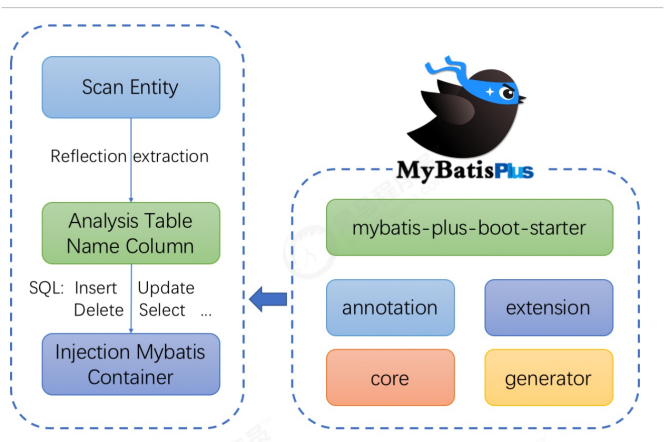

## 整合

### Mybatis+MP

```xml
<!-- mybatis-plus插件依赖 -->
<dependency>
	<groupId>com.baomidou</groupId>
	<artifactId>mybatis-plus</artifactId>
	<version>3.1.1</version>
</dependency>
```

**编写mybatis-config.xml**

```xml
<?xml version="1.0" encoding="UTF-8" ?>
<!DOCTYPE configuration
        PUBLIC "-//mybatis.org//DTD Config 3.0//EN"
        "http://mybatis.org/dtd/mybatis-3-config.dtd">
<configuration>
    <environments default="development">
        <environment id="development">
            <transactionManager type="JDBC"/>
            <dataSource type="POOLED">
                <property name="driver" value="com.mysql.jdbc.Driver"/>
                <property name="url" value="jdbc:mysql://127.0.0.1:3306/mp?useUnicode=true&amp;characterEncoding=utf8&amp;autoReconnect=true&amp;allowMultiQueries=true&amp;useSSL=false"/>
                <property name="username" value="root"/>
                <property name="password" value="root"/>
            </dataSource>
        </environment>
    </environments>
    <mappers>
        <mapper resource="UserMapper.xml"/>
    </mappers>
</configuration>
```

编写UserMapper.xml

```xml
<?xml version="1.0" encoding="UTF-8" ?>
<!DOCTYPE mapper
        PUBLIC "-//mybatis.org//DTD Mapper 3.0//EN"
        "http://mybatis.org/dtd/mybatis-3-mapper.dtd">
<mapper namespace="cn.itcast.mp.simple.mapper.UserMapper">
    <select id="findAll" resultType="cn.itcast.mp.simple.pojo.User">
        select * from tb_user
    </select>
</mapper>
```

**将UserMapper继承BaseMapper，将拥有了BaseMapper中的所有方法：**

```java
public interface UserMapper extends BaseMapper<User> {
		List<User> findAll();
}
```

测试

```java
public class TestMybatis {
    @Test
    public void testUserList() throws Exception{
        String resource = "mybatis-config.xml";
        InputStream inputStream = Resources.getResourceAsStream(resource);
        //使用MybatisSqlSessionFactoryBuilder()完成整合
        SqlSessionFactory sqlSessionFactory = new MybatisSqlSessionFactoryBuilder().build(inputStream);
        SqlSession sqlSession = sqlSessionFactory.openSession();
        UserMapper userMapper = sqlSession.getMapper(UserMapper.class);
        List<User> list = userMapper.findAll();
        for (User user : list) {
            System.out.println(user);
        }
    }
}
```

### **Spring + Mybatis + MP**

```xml
<dependencies>
    <dependency>
        <groupId>org.springframework</groupId>
        <artifactId>spring-webmvc</artifactId>
        <version>${spring.version}</version>
    </dependency>
    <dependency>
        <groupId>org.springframework</groupId>
        <artifactId>spring-jdbc</artifactId>
        <version>${spring.version}</version>
    </dependency>
    <dependency>
        <groupId>org.springframework</groupId>
        <artifactId>spring-test</artifactId>
        <version>${spring.version}</version>
    </dependency>
</dependencies>
```

**编写jdbc.properties**

```properties
jdbc.driver=com.mysql.jdbc.Driver
jdbc.url=jdbc:mysql://127.0.0.1:3306/mp?useUnicode=true&characterEncoding=utf8&autoReconnect=true&allowMultiQueries=true&useSSL=false
jdbc.username=root
jdbc.password=root
```

**编写applicationContext.xml**

```xml
<?xml version="1.0" encoding="UTF-8"?>
<beans xmlns="http://www.springframework.org/schema/beans"
       xmlns:xsi="http://www.w3.org/2001/XMLSchema-instance"
       xmlns:context="http://www.springframework.org/schema/context"
       xsi:schemaLocation="http://www.springframework.org/schema/beans
http://www.springframework.org/schema/beans/spring-beans.xsd
http://www.springframework.org/schema/context
http://www.springframework.org/schema/context/spring-context.xsd">
    <context:property-placeholder location="classpath:*.properties"/>
    <!-- 定义数据源 -->
    <bean id="dataSource" class="com.alibaba.druid.pool.DruidDataSource"
          destroy-method="close">
        <property name="url" value="${jdbc.url}"/>
        <property name="username" value="${jdbc.username}"/>
        <property name="password" value="${jdbc.password}"/>
        <property name="driverClassName" value="${jdbc.driver}"/>
        <property name="maxActive" value="10"/>
        <property name="minIdle" value="5"/>
    </bean>
    <!--这里使用MP提供的sqlSessionFactory，完成了Spring与MP的整合-->
    <bean id="sqlSessionFactory"
          class="com.baomidou.mybatisplus.extension.spring.MybatisSqlSessionFactoryBean">
        <property name="dataSource" ref="dataSource"/>
    </bean>
    <!--扫描mapper接口，使用的依然是Mybatis原生的扫描器-->
    <bean class="org.mybatis.spring.mapper.MapperScannerConfigurer">
        <property name="basePackage" value="cn.itcast.mp.simple.mapper"/>
    </bean>
</beans>
```

**编写User对象以及UserMapper接口：**

```java
@Data
@NoArgsConstructor
@AllArgsConstructor
//添加表名，默认类名
@TableName("tb_user")
public class User {
	private Long id;
	private String userName;
	private String password;
	private String name;
	private Integer age;
	private String email;
}
```

### **SpringBoot + Mybatis + MP**

pom

```xml
<?xml version="1.0" encoding="UTF-8"?>
<project xmlns="http://maven.apache.org/POM/4.0.0"
         xmlns:xsi="http://www.w3.org/2001/XMLSchema-instance"
         xsi:schemaLocation="http://maven.apache.org/POM/4.0.0
http://maven.apache.org/xsd/maven-4.0.0.xsd">
    <modelVersion>4.0.0</modelVersion>
    <parent>
        <groupId>org.springframework.boot</groupId>
        <artifactId>spring-boot-starter-parent</artifactId>
        <version>2.1.4.RELEASE</version>
    </parent>
    <groupId>cn.itcast.mp</groupId>
    <artifactId>itcast-mp-springboot</artifactId>
    <version>1.0-SNAPSHOT</version>
    <dependencies>
        <dependency>
            <groupId>org.springframework.boot</groupId>
            <artifactId>spring-boot-starter</artifactId>
            <exclusions>
                <exclusion>
                    <groupId>org.springframework.boot</groupId>
                    <artifactId>spring-boot-starter-logging</artifactId>
                </exclusion>
            </exclusions>
        </dependency>
        <dependency>
            <groupId>org.springframework.boot</groupId>
            <artifactId>spring-boot-starter-test</artifactId>
            <scope>test</scope>
        </dependency>
        
        <!--简化代码的工具包-->
        <dependency>
            <groupId>org.projectlombok</groupId>
            <artifactId>lombok</artifactId>
            <optional>true</optional>
        </dependency>
        <!--mybatis-plus的springboot支持-->
        <dependency>
            <groupId>com.baomidou</groupId>
            <artifactId>mybatis-plus-boot-starter</artifactId>
            <version>3.1.1</version>
        </dependency>
        <!--mysql驱动-->
        <dependency>
            <groupId>mysql</groupId>
            <artifactId>mysql-connector-java</artifactId>
            <version>5.1.47</version>
        </dependency>
        <dependency>
            <groupId>org.slf4j</groupId>
            <artifactId>slf4j-log4j12</artifactId>
        </dependency>
    </dependencies>
    <build>
        <plugins>
            <plugin>
                <groupId>org.springframework.boot</groupId>
                <artifactId>spring-boot-maven-plugin</artifactId>
            </plugin>
        </plugins>
    </build>
</project>
```

**编写启动类**

```java
@MapperScan("cn.itcast.mp.mapper") //设置mapper接口的扫描包
@SpringBootApplication
public class MyApplication {
    public static void main(String[] args) {
        SpringApplication.run(MyApplication.class, args);
    }
}
```

## 条件构造器

wapper介绍 ：

- Wrapper ： 条件构造抽象类，最顶端父类
- AbstractWrapper ： 用于查询条件封装，生成 sql 的 where 条件

- QueryWrapper ： Entity 对象封装操作类，不是用lambda语法

- UpdateWrapper ： Update 条件封装，用于Entity对象更新操作

- AbstractLambdaWrapper ： Lambda 语法使用 Wrapper统一处理解析 lambda 获取 column。

- LambdaQueryWrapper ：看名称也能明白就是用于Lambda语法使用的查询Wrapper

- LambdaUpdateWrapper ： Lambda 更新封装Wrapper

AbstractWrapper和AbstractChainWrapper是重点实现，接下来我们重点学习AbstractWrapper以及其

子类

> 官网文档地址：https://mybatis.plus/guide/wrapper.html

### allEq

```java
/**
  *params 
  *key 为数据库字段名, value 为字段值
  *
  *null2IsNull
  * 为 true 则在 map 的 value 为null 时调用 isNull 方法,为 false 时则忽略 value 为 null 的
  *
  *filter
  * 过滤函数,是否允许字段传入比对条件中
 **/
allEq(Map<R, V> params)
allEq(Map<R, V> params, boolean null2IsNull)
allEq(boolean condition, Map<R, V> params, boolean null2IsNull)
    
allEq(BiPredicate<R, V> filter, Map<R, V> params)
allEq(BiPredicate<R, V> filter, Map<R, V> params, boolean null2IsNull)
allEq(boolean condition, BiPredicate<R, V> filter, Map<R, V> params, boolean null2IsNull)
```

> 例1: allEq({id:1,name:"老王",age:null}) ---> id = 1 and name = '老王' and age is null
>
> 例2: allEq({id:1,name:"老王",age:null}, false) ---> id = 1 and name = '老王'
>
> 例3: allEq((k,v) -> k.indexOf("a") > 0, {id:1,name:"老王",age:null}) ---> name = '老王' and age is null
>
> 例4: allEq((k,v) -> k.indexOf("a") > 0, {id:1,name:"老王",age:null}, false) ---> name ='老王'

### 基本比较

- eq

  - 等于 =

- ne

  - 不等于 <>

- gt

  - 大于 >

- ge

  - 大于等于 >=

- lt

  - 小于 <

- le

  - 小于等于 <=

- between

  - BETWEEN 值1 AND 值2

- notBetween

  - NOT BETWEEN 值1 AND 值2

- in

  - 字段 IN (value.get(0), value.get(1), ...)

- notIn

  字段 NOT IN (v0, v1, ...)

### 模糊查询

- like

  - LIKE '%值%'
  - 例: like("name", "王") ---> name like '%王%'

- notLike

  - NOT LIKE '%值%'

  - 例: notLike("name", "王") ---> name not like '%王%'

- likeLeft
  - LIKE '%值'
  - 例: likeLeft("name", "王") ---> name like '%王'
- likeRight
  - LIKE '值%'
  - 例: likeRight("name", "王") ---> name like '王%'

### 排序

- orderBy
  - 排序：ORDER BY 字段, ...
- derByAsc
  - 排序：ORDER BY 字段, ... ASC
  - 例: orderByAsc("id", "name") ---> order by id ASC,name ASC
- orderByDesc
  - 排序：ORDER BY 字段, ... DESC
  - 例: orderByDesc("id", "name") ---> order by id DESC,name DESC

### 逻辑查询

- or
  - 拼接 OR
  - 主动调用 or 表示紧接着下一个**方法**不是用 and 连接!(不调用 or 则默认为使用 and 连接)
- and
  - AND 嵌套
  - 例: and(i -> i.eq("name", "李白").ne("status", "活着")) ---> and (name = '李白' and status<> '活着')

### **select**

```java
//在MP查询中，默认查询所有的字段，如果有需要也可以通过select方法进行指定字段。
//SELECT id,name,age FROM tb_user WHERE name = ? OR age = ?
wrapper.eq("name", "李四")
.or()
.eq("age", 24)
.select("id", "name", "age");
```

## 分页

**定义MP拦截器并将其设置为Spring管控的bean**

```java
@Configuration
public class MPConfig {
    @Bean
    public MybatisPlusInterceptor mybatisPlusInterceptor(){
        MybatisPlusInterceptor interceptor = new MybatisPlusInterceptor();
        interceptor.addInnerInterceptor(new PaginationInnerInterceptor());
        return interceptor;
    }
}
```

### **selectPage**

```java
/**
* 根据 entity 条件，查询全部记录（并翻页）
*
* @param page 分页查询条件（可以为 RowBounds.DEFAULT）
* @param queryWrapper 实体对象封装操作类（可以为 null）
*/
IPage<T> selectPage(IPage<T> page, @Param(Constants.WRAPPER) Wrapper<T> queryWrapper);
```

### 配置分页插件（拦截器）

```java
@Configuration
public class MPConfig {
    @Bean
    public MybatisPlusInterceptor mybatisPlusInterceptor(){//拦截器
        MybatisPlusInterceptor interceptor = new MybatisPlusInterceptor();
        interceptor.addInnerInterceptor(new PaginationInnerInterceptor());//添加分页
        return interceptor;
    }
}
```

```java
@Configuration
@MapperScan("cn.itcast.mp.mapper") //设置mapper接口的扫描包
public class MybatisPlusConfig {
    /**
     * 分页插件
     */
    @Bean
    public PaginationInterceptor paginationInterceptor() {
        return new PaginationInterceptor();
    }
}
```

```java
@Test
public void testSelectPage() {
    QueryWrapper<User> wrapper = new QueryWrapper<User>();
   	wrapper.gt("age", 20); //年龄大于20岁
   	Page<User> page = new Page<>(1,1);
	//根据条件查询数据
    IPage<User> iPage = this.userMapper.selectPage(page, wrapper);
    System.out.println("数据总条数：" + iPage.getTotal());
	System.out.println("总页数：" + iPage.getPages());
    
	List<User> users = iPage.getRecords();
	for (User user : users) {
  		System.out.println("user = " + user);
	}
}
```


## 通用Dao

> 继承`BaseMapper<User>`

通用CRUD


### Insert


```java
/**
* 插入一条记录
*
* @param entity 实体对象
*/
int insert(T entity);
```

### Updata

```java
// 根据 whereWrapper 条件，更新记录
int update(@Param(Constants.ENTITY) T updateEntity, @Param(Constants.WRAPPER) Wrapper<T> whereWrapper);

// 根据 ID 修改
int updateById(@Param(Constants.ENTITY) T entity);
```


### Delete

```java
// 根据 entity 条件，删除记录
int delete(@Param(Constants.WRAPPER) Wrapper<T> wrapper);

// 删除（根据ID 批量删除）
int deleteBatchIds(@Param(Constants.COLLECTION) Collection<? extends Serializable> idList);

// 根据 ID 删除
int deleteById(Serializable id);

// 根据 columnMap 条件，删除记录
int deleteByMap(@Param(Constants.COLUMN_MAP) Map<String, Object> columnMap);
```


### Selec

```java
// 根据 ID 查询
T selectById(Serializable id);
// 根据 entity 条件，查询一条记录
T selectOne(@Param(Constants.WRAPPER) Wrapper<T> queryWrapper);

// 查询（根据ID 批量查询）
List<T> selectBatchIds(@Param(Constants.COLLECTION) Collection<? extends Serializable> idList);
// 根据 entity 条件，查询全部记录
List<T> selectList(@Param(Constants.WRAPPER) Wrapper<T> queryWrapper);
// 查询（根据 columnMap 条件）
List<T> selectByMap(@Param(Constants.COLUMN_MAP) Map<String, Object> columnMap);
// 根据 Wrapper 条件，查询全部记录
List<Map<String, Object>> selectMaps(@Param(Constants.WRAPPER) Wrapper<T> queryWrapper);
// 根据 Wrapper 条件，查询全部记录。注意： 只返回第一个字段的值
List<Object> selectObjs(@Param(Constants.WRAPPER) Wrapper<T> queryWrapper);

// 根据 entity 条件，查询全部记录（并翻页）
IPage<T> selectPage(IPage<T> page, @Param(Constants.WRAPPER) Wrapper<T> queryWrapper);
// 根据 Wrapper 条件，查询全部记录（并翻页）
IPage<Map<String, Object>> selectMapsPage(IPage<T> page, @Param(Constants.WRAPPER) Wrapper<T> queryWrapper);
// 根据 Wrapper 条件，查询总记录数
Integer selectCount(@Param(Constants.WRAPPER) Wrapper<T> queryWrapper);
```


## 通用Service

> 接口继承 `IService<T>` 
>
> 实现类继承`ServiceImpl<M extends BaseMapper<T>, T>`
>
> 实现`接口`

### Save

```java
// 插入一条记录（选择字段，策略插入）
boolean save(T entity);

// 插入（批量）
boolean saveBatch(Collection<T> entityList);

// 插入（批量）
boolean saveBatch(Collection<T> entityList, int batchSize);
```


### SaveOrUpdate

```java
// TableId 注解存在更新记录，否插入一条记录
boolean saveOrUpdate(T entity);

// 根据updateWrapper尝试更新，否继续执行saveOrUpdate(T)方法
boolean saveOrUpdate(T entity, Wrapper<T> updateWrapper);

// 批量修改插入
boolean saveOrUpdateBatch(Collection<T> entityList);

// 批量修改插入
boolean saveOrUpdateBatch(Collection<T> entityList, int batchSize);
```


### Remove

```java
// 根据 entity 条件，删除记录
boolean remove(Wrapper<T> queryWrapper);
// 根据 ID 删除
boolean removeById(Serializable id);
// 根据 columnMap 条件，删除记录
boolean removeByMap(Map<String, Object> columnMap);
// 删除（根据ID 批量删除）
boolean removeByIds(Collection<? extends Serializable> idList);
```


### Update

```java
// 根据 UpdateWrapper 条件，更新记录 需要设置sqlset
boolean update(Wrapper<T> updateWrapper);

// 根据 whereWrapper 条件，更新记录
boolean update(T updateEntity, Wrapper<T> whereWrapper);

// 根据 ID 选择修改
boolean updateById(T entity);

// 根据ID 批量更新
boolean updateBatchById(Collection<T> entityList);

// 根据ID 批量更新
boolean updateBatchById(Collection<T> entityList, int batchSize);
```


### Get

```java
// 根据 ID 查询
T getById(Serializable id);
// 根据 Wrapper，查询一条记录。结果集，如果是多个会抛出异常，随机取一条加上限制条件 wrapper.last("LIMIT 1")
T getOne(Wrapper<T> queryWrapper);
// 根据 Wrapper，查询一条记录
T getOne(Wrapper<T> queryWrapper, boolean throwEx);
// 根据 Wrapper，查询一条记录
Map<String, Object> getMap(Wrapper<T> queryWrapper);
// 根据 Wrapper，查询一条记录
<V> V getObj(Wrapper<T> queryWrapper, Function<? super Object, V> mapper);
```


### List

```java
// 查询所有
List<T> list();

// 查询列表
List<T> list(Wrapper<T> queryWrapper);

// 查询（根据ID 批量查询）
Collection<T> listByIds(Collection<? extends Serializable> idList);

// 查询（根据 columnMap 条件）
Collection<T> listByMap(Map<String, Object> columnMap);

// 查询所有列表
List<Map<String, Object>> listMaps();

// 查询列表
List<Map<String, Object>> listMaps(Wrapper<T> queryWrapper);

// 查询全部记录
List<Object> listObjs();

// 查询全部记录
<V> List<V> listObjs(Function<? super Object, V> mapper);

// 根据 Wrapper 条件，查询全部记录
List<Object> listObjs(Wrapper<T> queryWrapper);

// 根据 Wrapper 条件，查询全部记录
<V> List<V> listObjs(Wrapper<T> queryWrapper, Function<? super Object, V> mapper);
```


### Page

```java
// 无条件分页查询
IPage<T> page(IPage<T> page);
// 条件分页查询
IPage<T> page(IPage<T> page, Wrapper<T> queryWrapper);
// 无条件分页查询
IPage<Map<String, Object>> pageMaps(IPage<T> page);
// 条件分页查询
IPage<Map<String, Object>> pageMaps(IPage<T> page, Wrapper<T> queryWrapper);
```


### Count

```java
// 查询总记录数
int count();
// 根据 Wrapper 条件，查询总记录数
int count(Wrapper<T> queryWrapper);
```


### Chain

query

```java
// 链式查询 普通
QueryChainWrapper<T> query();
// 链式查询 lambda 式。注意：不支持 Kotlin
LambdaQueryChainWrapper<T> lambdaQuery();

// 示例：
query().eq("column", value).one();
lambdaQuery().eq(Entity::getId, value).list();
```

update

```java
// 链式更改 普通
UpdateChainWrapper<T> update();
// 链式更改 lambda 式。注意：不支持 Kotlin
LambdaUpdateChainWrapper<T> lambdaUpdate();

// 示例：
update().eq("column", value).remove();
lambdaUpdate().eq(Entity::getId, value).update(entity);
```

## 配置

### 基础

```xml
<!--configLocation-->
<!--加载 MyBatis配置文件-->
<bean id="sqlSessionFactory" class="com.baomidou.mybatisplus.extension.spring.MybatisSqlSessionFactoryBean">
    <property name="configLocation" value="classpath:mybatis-config.xml"/>
</bean>

<!--mapperLocations-->
<!--MyBatis Mapper 所对应的 XML 文件位置-->
<bean id="sqlSessionFactory" class="com.baomidou.mybatisplus.extension.spring.MybatisSqlSessionFactoryBean">
    <property name="mapperLocations" value="classpath*:mybatis/*.xml"/>
</bean>

<!--typeAliasesPackage-->
<!--MyBaits 别名包扫描路径-->
<bean id="sqlSessionFactory" class="com.baomidou.mybatisplus.extension.spring.MybatisSqlSessionFactoryBean">
    <property name="typeAliasesPackage" value="com.baomidou.mybatisplus.samples.quickstart.entity"/>
</bean>
```

### 进阶

```properties
#mapUnderscoreToCamelCase
#是否开启自动驼峰命名规则（camel case）映射，即从经典数据库列名 A_COLUMN（下划线命名） 到经典 Java 属性名 aColumn（驼峰命名） 的类似映射。
#关闭自动驼峰映射，该参数不能和mybatis-plus.config-location同时存在
mybatis-plus.configuration.map-underscore-to-camel-case=false

#cacheEnabled
#全局地开启或关闭配置文件中的所有映射器已经配置的任何缓存，默认为 true。
mybatis-plus.configuration.cache-enabled=false
```

### **DB** 策略配置

```xml
<!--idType-->
<!--tablePrefix-->
<!--这里使用MP提供的sqlSessionFactory，完成了Spring与MP的整合-->
<bean id="sqlSessionFactory" class="com.baomidou.mybatisplus.extension.spring.MybatisSqlSessionFactoryBean">
<property name="dataSource" ref="dataSource"/>
<property name="globalConfig">
    <bean class="com.baomidou.mybatisplus.core.config.GlobalConfig">
        <property name="dbConfig">
            <bean class="com.baomidou.mybatisplus.core.config.GlobalConfig$DbConfig">
                <!--全局默认主键类型，设置后，即可省略实体对象中的@TableId(type = IdType.AUTO)配置。-->
                <property name="idType" value="AUTO"/>
                <!--表名前缀，全局配置后可省略@TableName()配置。-->
                <property name="tablePrefix" value="tb_"/>
            </bean>
        </property>
    </bean>
</property>
</bean>
```

### springboot配置

```yaml
mybatis-plus:
	global-config:
		db-config:
			# 主键id 雪花算法全局设置
			id-type: auto #默认为assign_id
			# 前缀表名
			table-prefix: tbl_
			
			# 逻辑删除字段名
			logic-delete-field: deleted
			# 逻辑删除字面值：未删除为0
			logic-not-delete-value: 0
			# 逻辑删除字面值：删除为1
			logic-delete-value: 1
			
			
```


## 注解配置

### @TableName

- 描述：表名注解，标识实体类对应的表
- 使用位置：实体类

```java
@TableName("sys_user")
public class User {
    private Long id;
    private String name;
    private Integer age;
    private String email;
}
```


### @TableId

- 描述：主键注解
- 使用位置：实体类主键字段

```java
@TableName("sys_user")
public class User {
    @TableId
    private Long id;
    private String name;
    private Integer age;
    private String email;
}
```


typ**类型**


### **@TableField**

1、描述：字段注解（非主键）

```java
@TableName("sys_user")
public class User {
    @TableId
    private Long id;
    
    //数据库字段名不同
    @TableField(value="nickname")
    
    //数据库字段不存在
    @TableField(exist=false)
    
    //是否参与查询
    @TableField(select  = false)
    
    
    private String name;
    private Integer age;
    private String email;
}
```


### @TableLogic

- 描述：表字段逻辑处理注解（逻辑删除）
- 数据库内添加字段delete

```java
@TableName("sys_user")
public class User {
    @TableId
    private Long id;
    private String name;
    private Integer age;
    private String email;
    
    //逻辑删除字段，标记当前记录是否被删除
	// 注意：下面一行可不写，配置文件中可进行统一配置
    @TableLogic(value = "0", delval = "1")
    private Integer deleted;
    
}
```


### @version

- 描述：乐观锁注解、标记 `@Version` 在字段上
- 添加version字段

```java
@Configuration
public class MpConfig {
	@Bean
	public MybatisPlusInterceptor mpInterceptor() {
		//1.定义Mp拦截器
		MybatisPlusInterceptor mpInterceptor = new MybatisPlusInterceptor();
        
		//2.添加乐观锁拦截器 【第三步】
		mpInterceptor.addInnerInterceptor(newOptimisticLockerInnerInterceptor());
		return mpInterceptor;
	}
}
```


## ActiveRecord

### 简介

**ActiveRecord也属于ORM（对象关系映射）层，由Rails最早提出，遵循标准的ORM模型：表映射到记录，记**

**录映射到对象，字段映射到对象属性。配合遵循的命名和配置惯例，能够很大程度的快速实现模型的操作，而**

**且简洁易懂。**

ActiveRecord的主要思想是：

- 每一个数据库表对应创建一个类，类的每一个对象实例对应于数据库中表的一行记录；通常表的每个字段在类中都有相应的Field；
- ActiveRecord同时负责把自己持久化，在ActiveRecord中封装了对数据库的访问，即CURD;；
- ActiveRecord是一种领域模型(Domain Model)，封装了部分业务逻辑；

> 开启AR非常简单，只需要将实体对象继承Model即可。

### 运用

```java
//根据主键查询
User user = new User();
user.setId(2L);
User user2 = user.selectById();

//新增数据
User user = new User();
user.setName("刘备");
user.setAge(30);
boolean insert = user.insert();

//更新操作
User user = new User();
user.setId(8L);
user.setAge(35);
boolean update = user.updateById();

//删除操作
User user = new User();
user.setId(7L);
boolean delete = user.deleteById();

//根据条件查询
User user = new User();
QueryWrapper<User> userQueryWrapper = new QueryWrapper<>();
userQueryWrapper.le("age","20");
List<User> users = user.selectList(userQueryWrapper);
```

## **Oracle** **主键Sequence**

### **部署Oracl**

为了简化环境部署，这里使用<font color="#ff0000">Docker </font>环境进行部署安装Oracle。

```shell
#拉取镜像
docker pull sath89/oracle-12c
#创建容器
docker create --name oracle -p 1521:1521 sath89/oracle-12c
#启动
docker start oracle && docker logs -f oracle
#下面是启动过程
Database not initialized. Initializing database.
Starting tnslsnr
```

### **配置序列**

创建序列

```sql
CREATE SEQUENCE SEQ_USER START WITH 1 INCREMENT BY 1
```

需要配置MP的序列生成器到Spring容器：

```java
@Configuration
@MapperScan("cn.itcast.mp.mapper") //设置mapper接口的扫描包
public class MybatisPlusConfig {
    /**
     * 分页插件
     */
    @Bean
    public PaginationInterceptor paginationInterceptor() {
        return new PaginationInterceptor();
    }

    /**
     * 序列生成器
     */
    @Bean
    public OracleKeyGenerator oracleKeyGenerator() {
        return new OracleKeyGenerator();
    }
}
```

在实体对象中指定序列的名称：

```java
@KeySequence(value = "SEQ_USER", clazz = Long.class)
public class User{
......
}
```

## 代码生成器

### 依赖

```xml
<!--代码生成器-->
<dependency>
	<groupId>com.baomidou</groupId>
	<artifactId>mybatis-plus-generator</artifactId>
	<version>3.4.1</version>
</dependency>

<!--velocity模板引擎-->
<dependency>
	<groupId>org.apache.velocity</groupId>
	<artifactId>velocity-engine-core</artifactId>
	<version>2.3</version>
</dependency>
```

### 代码生成器类

```java
/**
 * @author shaoyb
 * @program: ims
 * @description 代码生成器主类
 * @create 2022/12/7 11:20
 **/
public class Generator {
    public static void main(String[] args) {
        //1. 创建代码生成器对象，执行生成代码操作
        AutoGenerator autoGenerator = new AutoGenerator();

        //2. 数据源相关配置：读取数据库中的信息，根据数据库表结构生成代码
        DataSourceConfig dataSource = new DataSourceConfig();
        dataSource.setDriverName("com.mysql.jdbc.Driver");
        dataSource.setUrl("jdbc:mysql://localhost:3306/cms?useUnicode=true&characterEncoding=utf8");
        dataSource.setUsername("root");
        dataSource.setPassword("123456");
        autoGenerator.setDataSource(dataSource);

        /**
          *设置全局配置
        **/
        GlobalConfig globalConfig = new GlobalConfig();
        //设置代码生成位置
        globalConfig.setOutputDir(System.getProperty("user.dir")+"/src/main/java"); 
        //设置生成完毕后是否打开生成代码所在的目录
        globalConfig.setOpen(false);
        //设置作者
        globalConfig.setAuthor("briup"); 
        //设置是否覆盖原始生成的文件
        globalConfig.setFileOverride(true);  
        //设置数据层接口名，%s为占位符，指代模块名称
        globalConfig.setMapperName("%sDao");   
        globalConfig.setIdType(IdType.ASSIGN_ID);
        //设置Id生成策略
        autoGenerator.setGlobalConfig(globalConfig);

        /**
          *设置包名相关配置
        **/
        PackageConfig packageInfo = new PackageConfig();
        //设置生成的包名，与代码所在位置不冲突，二者叠加组成完整路径
        packageInfo.setParent("com.briup.cms"); 
        //设置实体类包名
        packageInfo.setEntity("domain"); 
        //设置数据层包名
        packageInfo.setMapper("dao"); 
        //设置映射文件报名，默认mapper.xml
        packageInfo.setXml("mapper");      
        autoGenerator.setPackageInfo(packageInfo);

        /**
          *策略设置
        **/
        StrategyConfig strategyConfig = new StrategyConfig();
        //设置当前参与生成的表名，参数为可变参数
        //strategyConfig.setInclude("tbl_user"); 
        //设置数据库表的前缀名称，模块名 = 数据库表名 - 前缀名  例如： User = tbl_user - tbl_
        strategyConfig.setTablePrefix("cms_");
        //设置是否启用Rest风格
        strategyConfig.setRestControllerStyle(true);
        //设置乐观锁字段名
        strategyConfig.setVersionFieldName("version");  
        //设置逻辑删除字段名
        strategyConfig.setLogicDeleteFieldName("deleted");
        //设置是否启用lombok
        strategyConfig.setEntityLombokModel(true); 
        //设置c_id成cId
        strategyConfig.setColumnNaming(NamingStrategy.underline_to_camel);  
        autoGenerator.setStrategy(strategyConfig);

        //3. 执行生成操作
        autoGenerator.execute();
    }
}

```

## 分表

## 插件

## SQL注入器

## 自动填充功能


# Swagger

> 项目采用前后台分离的架构进行开发，后台可以使用Swagger，生成在线API文档，方便前端人员对接使用

Swagger 是一个规范和完整的框架，用于生成、描述、调用和可视化 RESTful 风格的 Web 服务。

https://swagger.io/

`springfox `，是一个开源的API Doc的框架， 它的前身是swagger-springmvc，可以将我们的

Controller中的方法以文档的形式展现。

http://springfox.github.io/springfox/

## 依赖

```xml
 		<!--  swagger-ui  -->
        <dependency>
            <groupId>io.springfox</groupId>
            <artifactId>springfox-swagger-ui</artifactId>
            <version>2.9.2</version>
        </dependency>
        <!--  swagger api文档  -->
        <dependency>
            <groupId>io.springfox</groupId>
            <artifactId>springfox-swagger2</artifactId>
            <version>2.9.2</version>
            <!--  剔除models模块  -->
            <exclusions>
                <exclusion>
                    <groupId>io.swagger</groupId>
                    <artifactId>swagger-models</artifactId>
                </exclusion>
                <exclusion>
                    <groupId>io.swagger</groupId>
                    <artifactId>swagger-annotations</artifactId>
                </exclusion>
            </exclusions>
        </dependency>
        <!--  重新引入上面剔除的models模块  -->
        <dependency>
            <groupId>io.swagger</groupId>
            <artifactId>swagger-models</artifactId>
            <version>1.5.21</version>
        </dependency>
        <!--  swagger-annotations  -->
        <dependency>
            <groupId>io.swagger</groupId>
            <artifactId>swagger-annotations</artifactId>
            <version>1.5.21</version>
        </dependency>
```

## 配置类

```java
@Configuration
// 开启对swagger的支持
@EnableSwagger2
public class Swagger2Config {
	// 配置需要扫面的controller包
	// 注意: 此处需要根据自己的包结构编写扫描路径
	// com.briup.web.controller
	@Bean
	public Docket createRestApi() {
		return new Docket(DocumentationType.SWAGGER_2)
           			.apiInfo(apiInfo())
            		.select()
            		.apis(RequestHandlerSelectors
                  			.basePackage("com.briup.cms.web.controller"))
            				.paths(PathSelectors.any())
					.build();
	}
    
	// swagger页面中显示的基本信息
	private ApiInfo apiInfo() {
		return new ApiInfoBuilder()
            		.title("***团体开发")
            		.description("欢迎访问briup官网,http://www.briup.com")
					.termsOfServiceUrl("http://www.briup.com")
            		.version("1.0").build();
	}
}
```

## 使用

```java
@RestController
@RequestMapping("/hello")
@Api(tags = "测试模块")
public class HelloController {
	//注意不要写@RequestMapping,否则会出现所有请求方法
	@GetMapping("/test")
	@ApiOperation(value = "测试方法1",notes = "测试,需要提供一个字符串参数")
	@ApiImplicitParams({
		@ApiImplicitParam(name = "name",value = "姓名",required = true,paramType = "query",defaultValue ="tom",dataType = "String")
	})
	public String test1(String name) {
		return "hello "+name;
	}
}
```


## 注解

@Api ，用来指定当前API模块的名称

@ApiOperation ，用来设置API方法的简介说明

@ApiImplicitParams ，用来设置API方法的参数，可以有多个参数

@ApiImplicitParam ，用来设置一个参数的详细信息

- name，参数的名称
- value，参数的介绍
- dataType，参数的数据类型，例如String
- required，是否为必须参数
- defaultValue，默认填入输入框的值
- paramType，参数的类型：
  - path  /user/{id}
  - query  /user?id=
  - body  正文
  - header  请求头
  - form  请求表单

# knife4j


# JWT

> 避免session过多

JSON Web Token (JWT，token的一种)，是一个开放标准(RFC 7519)，它定义了一种紧凑的、自包含的方式，用于作为JSON对象在各方之间安全地传输信息。该信息可以被验证和信任，因为它是数字签名的。

- JWT存放在客户端（前端），每次请求的请求头中，携带此JWT发送给服务器，服务器端负责接收和验证
- 服务器端可以不用存储JWT，这样可以降低服务器的内存的开销
- JWT和语言无关，扩展起来非常方便，无论是PC端还是移动端，都可以很容易的使用
- 不受cookie的限制


## 依赖

```xml
<dependency>
	<groupId>com.auth0</groupId>
	<artifactId>java-jwt</artifactId>
	<version>3.11.0</version>
</dependency>
```

## 配置类

```java
public class JwtUtil {
	/**
     * 过期时间20分钟
     */
    private static final long EXPIRE_TIME = 20 * 60 * 1000;
    /**
     * jwt 密钥
     */
    private static final String SECRET = "jwt_secret";

    /**
     * 生成签名，五分钟后过期
     * @param userId 用户id
     * @param info，Map的value只能存放的值的类型为：Map, List, Boolean, Integer, Long, Double, String and Date
     * @return 返回token字符串
     */
    public static String sign(String userId, Map<String,Object> info) {
        try {
            //获取token的过期时间
            Date date = new Date(System.currentTimeMillis() + EXPIRE_TIME);
            //
            Algorithm algorithm = Algorithm.HMAC256(SECRET);
            return JWT.create()
                    // 将 user id 保存到 token 里面
                    .withAudience(userId)
                    // 存放自定义数据
                    .withClaim("info", info)
                    // 五分钟后token过期
                    .withExpiresAt(date)
                    // token 的密钥
                    .sign(algorithm);
        } catch (Exception e) {
        	e.printStackTrace();
            return null;
        }
    }

    /**
     * 根据token获取userId
     * @param token 返回的token
     * @return 返回用户id
     */
    public static String getUserId(String token) {
        try {
            String userId = JWT.decode(token).getAudience().get(0);
            return userId;
        } catch (JWTDecodeException e) {
            return null;
        }
    }
    
    /**
     * 根据token获取自定义数据info
     * @param token 返回的token
     * @return 返回信息
     */
    public static Map<String,Object> getInfo(String token) {
        try {
            return JWT.decode(token).getClaim("info").asMap();
        } catch (JWTDecodeException e) {
            return null;
        }
    }
    

    /**
     * 校验token
     * @param token 返回的token
     * @return 返回成功
     */
    public static boolean checkSign(String token) {
        try {
            Algorithm algorithm = Algorithm.HMAC256(SECRET);
            JWTVerifier verifier = JWT.require(algorithm)
                    // .withClaim("username", username)
                    .build();
            //token校验，不通过会有异常抛出
            verifier.verify(token);
            return true;
        } catch (JWTVerificationException exception) {
            throw new RuntimeException("token 无效，请重新获取");
        }
    }
}

```

## 拦截器

```java
/**
 * jwt拦截器
 */
public class JwtInterceptor implements HandlerInterceptor {

    @Override
    public boolean preHandle(HttpServletRequest httpServletRequest, HttpServletResponse httpServletResponse, Object object) {
    	// 如果不是映射到方法直接通过
    	if(!(object instanceof HandlerMethod)){
    		return true;
    	}
    	
        // 从 http 请求头中取出 token
        String token = httpServletRequest.getHeader("token");
       
        if (token == null) {
            throw new RuntimeException("无token，请重新登录");
        }
        
        // 验证 token
        JwtUtil.checkSign(token);

        //下面为测试代码，实际开发中可以删除
        // 验证通过后，取出JWT中存放的数据
        // 获取 token 中的 userId
//        String userId = JwtUtil.getUserId(token);
//        System.out.println("id: " + userId);
        
        // 获取并输出 token 中的 其他数据
//        Map<String, Object> info = JwtUtil.getInfo(token);
//        info.forEach((k,v)->System.out.println(k+": "+v));

        return true;
    }

}
```

配置拦截器

```java
 /**Override
     * 添加jwt拦截器,并指定拦截路径
     */
    @Override
    public void addInterceptors(InterceptorRegistry registry) {
        registry.addInterceptor(jwtInterceptor())
                .addPathPatterns("/user/**")
                .excludePathPatterns("/user/login");
    }

    /**
     * 创建jwt拦截器对象并加入spring容器
     */
    @Bean
    public JwtInterceptor jwtInterceptor() {
        return new JwtInterceptor();
    }

    //跨域问题解决
    @Override
    public void addCorsMappings(CorsRegistry registry) {
        registry.addMapping("/**")
                .allowedOrigins("*")	//配置 http://127.0.0.1:9999
                .allowCredentials(false)//配置 true，则上面配置应改为
                .allowedMethods("GET", "POST", "PUT", "DELETE", "OPTIONS")
                .allowedHeaders("*")
                .maxAge(3600);
    }
}

```

# Struts2

```xml
<!-- https://mvnrepository.com/artifact/org.apache.struts/struts2-core -->
<dependency>
    <groupId>org.apache.struts</groupId>
    <artifactId>struts2-core</artifactId>
    <version>2.5.13</version>
</dependency>

```

## 快速入门

### 配置web.xml

```xml
<!--sutruts入口核心过滤器-->
    <filter>
        <filter-name>Struts2</filter-name>
        <filter-class>org.apache.struts2.dispatcher.filter.StrutsPrepareAndExecuteFilter</filter-class>
    </filter>

    <filter-mapping>
        <filter-name>Struts2</filter-name>
        <url-pattern>/*</url-pattern>
    </filter-mapping>
```

### 配置文件struts.xml

```xml
<?xml version="1.0" encoding="UTF-8" ?>
<!DOCTYPE struts PUBLIC
        "-//Apache Software Foundation//DTD Struts Configuration 2.3//EN"
        "http://struts.apache.org/dtds/struts-2.3.dtd">
<struts>
    

</struts>
```


# Spring

## 简介

Spring框架的主要优势之⼀就是其分层架构，分层架构允许使⽤者选择使⽤哪⼀个组件，同时为J2EE应⽤程序开发提供集成的框架。

Spring框架中的组件模块众多，不⽤的组件模块⽤来解决不同的问题，我们可以单独使⽤某⼀个模块，也可以将众多模块根据项⽬需要，进⾏⾃由组合。

Spring框架中的所有组件模块都依赖于Spring提供的俩个基础功能：是控制反转（ IOC ）和⾯向切⾯（ AOP ）。

[Spring 官网](https://spring.io/)

> Spring其他项⽬都会依赖于核⼼项⽬ Spring Framework 的中的组件模块。
>

[**Spring Framework官⽹**](https://spring.io/projects/spring-framework)

### Spring优势

- 容器性质，⽅便解耦，简化开发**（核⼼）**

  Spring提供的 IOC 容器，可以将对象间的依赖关系交由Spring容器进⾏控制，避免硬编码所造成的过度程序耦合。

- AOP编程的⽀持**（核⼼）**

  通过Spring的 AOP 功能，⽅便进⾏⾯向切⾯的编程，许多不容易⽤传统OOP实现的功能可以通过AOP轻松应付。

- 声明式事务的⽀持

  通过声明式⽅式灵活的进⾏事务的管理，提⾼开发效率和质量

- 集成各种优秀框架

  Spring不仅不排除其他各种优秀的框架，同时对这些框架(Mybatis、Quartz等)提供了很好的⽀持

- 降低JavaEE API的使⽤难度

  Spring对JavaEE API 进⾏了封装，使得这些API降低了使⽤难度

### 模块化

#### 多个依赖

> 用什么到什么依赖


模块分为Core Container、Data Access/Integration、Web、AOP（Aspect Oriented Programming）、Instrumentation和Test

#### **Core Container**

> **核⼼容器**

```xml
<!--spring 核⼼ -->
<dependency>
	<groupId>org.springframework</groupId>
	<artifactId>spring-context</artifactId>
	<version>5.1.9.RELEASE</version>
</dependency>

<!--lombok 新版本idea不需要此依赖-->
<dependency>
	<groupId>org.projectlombok</groupId>
	<artifactId>lombok</artifactId>
	<version>1.18.22</version>
</dependency>
```

Core Container包含有Core、Beans、Context和Expression Language模块

Core和Beans模块：框架的基础部分，提供反转控制（IOC）和依赖注⼊（DI）特性。

Context模块：构建于Core和Beans模块基础之上，提供了对国际化、事件传播、资源加载和对Context的透明创建

的⽀持。ApplicationContext接⼝是Context模块的关键。

Expression Language模块：Expression Language模块提供了⼀个强⼤的表达式语⾔⽤于在运⾏时查询和操纵对象。

#### **Data Access/Integration**

> **数据访问/集成部分**

Data Access/Integration层包含有JDBC、ORM、OXM、JMS和Transaction模块

JDBC模块：该模块提供了⼀个JDBC抽象层，它可以消除冗⻓的JDBC编码和解析数据库⼚商特有的错误代码。

ORM模块：该模块为流⾏的对象-关系映射API——JPA、JDO、Hibernate、Mybatis等提供了⼀个交互层。利⽤

ORM封装包，可以混合使⽤所有Spring提供的特性进⾏O/R映射。如前边提到的简单声明性事物管理。

OXM模块：该模块提供了⼀个对Object/XML映射实现的抽象层，Object/XML映射实现包括JAXB、Castor、XMLBeans、JiBX和XStream。

JMS模块：JMS(Java Messaging Service)模块主要包含了⼀些制造和消费消息的特性。

Transaction模块：该模块⽀持编程和声明性的事物管理，这些事物类必须实现特定的接⼝，并且对所有的POJO都适⽤。

#### **Web**

> **javaweb**

Web层包含了Web、Servlet、WebSocket、Portlet模块

Web模块：该模块提供了基础的⾯向web的集成特性。例如多⽂件上传、使⽤servlet listeners初始化IoC容器以及

⼀个⾯向web的应⽤上下⽂。它还包含Spring远程⽀持中web相关部分。

Servlet模块：该模块包含Spring的model-view-controller（MVC）实现。Spring的MVC框架使得模型范围内的代码

和web forms之间能够清楚的分离开来，并与Spring框架的其他特性集成在⼀起。

WebSocket模块：该模块提供了对WebSocket的⽀持。

Portlet模块：提供了⽤于portlet环境的MVC的实现，Portlet是和Servlet类似的⼀种web技术。

#### **AOP和Instrumentation**

AOP模块：提供了⼀个符合AOP联盟标准的⾯向切⾯编程的实现，它让你可以定义⽅法拦截器和切点，从⽽将逻辑

代码分开，降低它们之间的耦合性。

Aspects模块：提供了对AspectJ的集成⽀持，Spring框架的AOP功能是使⽤AspectJ框架来实现的。

Instrumentation模块提供了class instrumentation⽀持和classloader实现，使得可以在特定的应⽤服务器上使⽤。

#### Test

Test模块：⽀持使⽤JUnit和TestNG对Spring组件进⾏测试。

## SpringFramework

### 依赖

```xml
<!--spring 核⼼ -->
<dependency>
	<groupId>org.springframework</groupId>
	<artifactId>spring-context</artifactId>
	<version>5.1.9.RELEASE</version>
</dependency>
```

生命周期

实例化 -> 属性赋值 -> 初始化 -> 销毁

### Ioc(反转控制)


#### 容器

##### 继承关系


- BeanFactory 和 ApplicationContext 的区别
- BeanFactory是Spring容器的顶层接⼝，ApplicationContext是其⼦接⼝
- ApplicationContext接⼝,它由BeanFactory接⼝派⽣⽽来，包含BeanFactory的所有功能


- BeanFactory
- ApplicationContext
  - ClassPathXmlApplicationContext 从类路径下加载配置文件 resources/
  - FileSystemXmlApplication 从本地文件加载配置文件D:/
  - AnnotationConfigApplicationContext 通过注解加载配置


- BeanFactory 创建容器时不会创建对象，当从容器⾥⾯获取对象时才会创建
- ApplicationContext 创建容器时就会创建对象

#### 获取对象

##### main

```java
public class SpringIocTest {
@Test
public void test(){
	// 1.解析配置⽂件,创建容器
	ApplicationContext ac = new 	ClassPathXmlApplicationContext("applicationContext.xml");
	// 2.根据配置的Id值,从容器中获取对象
	Husband hunsband = (Husband) ac.getBean("husband");
	System.out.println(hunsband);
 }
}
```

##### 通过id直接获取

```xml
<?xml version="1.0" encoding="UTF-8"?>
<beans xmlns="http://www.springframework.org/schema/beans"
       xmlns:xsi="http://www.w3.org/2001/XMLSchema-instance"
       xsi:schemaLocation="http://www.springframework.org/schema/beans
http://www.springframework.org/schema/beans/spring-beans.xsd">
    <!--
    bean标签的作⽤：⽤于配置让Spring容器创建对象
    class : 要创建对象的全限定类名
    name: 该对象在容器中的名字
    -->
    <bean id="husband" name="husband" class="com.briup.ioc.Husband"></bean>
</beans>
```

##### ⼯⼚获取对象：

###### 普通工厂

```java
//普通⼯⼚类
public class HusbandFactory {
 	public Husband getInstance() {
 	Husband h = new Husband();
    return h;
    }
}
```

```xml
<!--
 配置⼯⼚，让Spring容器产⽣⼯⼚实例
 -->
 <bean name="factory" class="com.briup.ioc.HusbandFactory"></bean>
 
 <!--
 factory-bean ⼯⼚实例在Spring容器中的唯⼀标识
 factory-method ⼯⼚实例中的⽅法
 -->
 <bean name="husband" factory-bean="factory" factory-method="getInstance"></bean>
 
</beans>
```

###### 静态工厂

```java
public class HusbandStaticFactory {
	// 静态⽅法
	public static Husband getInstance() {
		return new Husband();
 	}
}
```

```xml
<!--
class ⼯⼚类的全限定类名
factory-method ⼯⼚类⾥⾯的静态⽅法
将来容器取出 name 中的值 本质上调⽤的是 class 中的 factory-method ⽅法
-->
<bean name ="husband" class ="com.briup.ioc.factory.HusbandStaticFactory" factory-method="getInstance" />
```

#### bean标签

- id 给在容器中的对象提供⼀个唯⼀标识，⽤来获取对象
- name 功能类似id，命名要求没有id严格
- class 指定类的全限定类名。⽤于反射创建对象。默认情况下调⽤⽆参构造函数
- scope 指定对象范围
  - sigleton 默认值，单例
  - prototype 多例
  - request WEB项⽬中,Spring容器创建⼀个Bean对象，会将该对象存⼊request
  - session WEB项⽬中，Spring容器创建⼀个Bean对象，会将该对象存⼊session
  - golbal session 只有应⽤在基于portlet的Web应⽤程序中才有意义，它映射到portlet的global范围的sessionr
- init-method : 指定类的初始化⽅法的名称
- destory-method : 指定类中销毁⽅法的名称
- lazy-init ：指定使⽤进⾏延迟加载

> 注意生成的是单例对象
>

### DI(依赖注入）

#### set方法注入

```xml
<!--
 property 给属性采⽤set⽅法赋值
 name : 属性名，调⽤该属性的set⽅法
 value: 属性值，通过set⽅法赋值
 ref: 属性是其他bean类型采⽤ref(字符串除外)
 
 -->
 <bean name="hunsband" class="com.briup.ioc.Hunsband">
 	<property name="id" value="1"></property>
 	<property name="name" value="tom"></property>
 	<property name="salary" value="2000"></property>
 	<property name="date" ref="now"></property>
 </bean>

<bean name="now" class="java.util.Date"></bean>
```

#### **构造器注⼊**

```xml
<!--
 constructor-arg 让属性赋值采⽤构造函数赋值
 index: 指定参数在构造函数中的索引位置
 type: 指定参数在构造函数中的数据类型
 name: 指定参数在构造函数中的名字
 value: 具体的参数值
 ref: 如果需要的数据为其他bean类型，使⽤ref
-->
<bean id="husband" class="com.briup.ioc.Husband">
 	<constructor-arg name="id" value="2"></constructor-arg>
 	<constructor-arg name="name" value="mary"></constructor-arg> 
 	<constructor-arg name="salary" value="3000"></constructor-arg> 
 	<constructor-arg name="date" ref="now"></constructor-arg>
 </bean>

或者

<bean name="husband" class="com.briup.ioc.Husband">
	<constructor-arg index="0" value="3"></constructor-arg>
	<constructor-arg index="1" value="lucy"></constructor-arg>
	<constructor-arg index="2" value="5000"></constructor-arg>
	<constructor-arg index="3" ref="now"></constructor-arg>
</bean>

<bean name="now" class="java.util.Date"></bean>
```

#### 名明空间注入

```xml
xmlns:p="http://www.springframework.org/schema/p"
```


```xml
<?xml version="1.0" encoding="UTF-8"?>
<beans xmlns="http://www.springframework.org/schema/beans"
 xmlns:p="http://www.springframework.org/schema/p"
xmlns:xsi="http://www.w3.org/2001/XMLSchema-instance"
xsi:schemaLocation="http://www.springframework.org/schema/beans
https://www.springframework.org/schema/beans/spring-beans.xsd">
 
 <bean name="husband" class="com.briup.ioc.Husband" p:id="3" p:name="lucy" p:salary="4000"
p:date-ref="now"></bean>
 
 <bean name="now" class="java.util.Date"></bean>
 
</beans>
```

#### **集合属性注⼊**

```java
@Data
public class Entity {
 private String[] myStrs;
 private List<String> myList;
 private Set<String> mySet;
 private Map<String, String> myMap;
 private Properties myProps;
}
```

```xml
<?xml version="1.0" encoding="UTF-8"?>
<beans xmlns="http://www.springframework.org/schema/beans"
xmlns:xsi="http://www.w3.org/2001/XMLSchema-instance"
xsi:schemaLocation="http://www.springframework.org/schema/beans
https://www.springframework.org/schema/beans/spring-beans.xsd">
 
 	<bean name="entity" class="com.briup.ioc.Entity">
 		<!-- 注⼊数组 -->
 		<property name="myStrs">
 			<array>
 				<value>AAA</value>
 				<value>BBB</value>
			  	<value>CCC</value>
 			</array>
 		</property>
 
 		<!-- 注⼊List -->
 		<property name="myList">
 			<list>
 				<value>DDD</value>
 				<value>EEE</value>
 				<value>FFF</value>
 			</list>
 		</property>
        
        <!-- 注⼊Set -->
 		<property name="mySet">
 			<set>
 				<value>GGG</value>
 				<value>KKK</value>
                <value>LLL</value>
 			</set>
 		</property>
        
        <!-- 注⼊myMap -->
 		<property name="myMap">
 			<map>
 				<!-- 俩种形式都可以注⼊ -->
 				<entry key="name" value="tom"></entry>
 				<entry key="age">
 					<value>20</value>
 				</entry>
 			</map>
 		</property>
 
 
 		<!-- 注⼊Properties -->
 		<property name="myProps">
 			<props>
 				<prop key="name">mary</prop>
 				<prop key="age">30</prop>
 			</props>
 		</property>
 	</bean>
</beans>
        
        
```

### 数据源

- 数据源(连接池)是提高程序性能如出现的
- 事先实例化数据源，初始化部分连接资源
- 使用连接资源时从数据源中获取
- 使用完毕后将连接资源归还给数据源

> 常见的数据源(连接池)：**DBCP、C3P0、BoneCP、Druid**等

#### 导入依赖

```xml
<!-- C3P0连接池 -->
<dependency>
	<groupId>c3p0</groupId>
	<artifactId>c3p0</artifactId>
	<version>0.9.1.2</version>
</dependency>
<!-- Druid连接池 -->
<dependency>
	<groupId>com.alibaba</groupId>
	<artifactId>druid</artifactId>
	<version>1.1.10</version>
</dependency>
```

#### 手动创建

**c3p0**

```java
@Test
public void testC3P0() throws Exception {
		//创建数据源
        ComboPooledDataSource dataSource = new ComboPooledDataSource();
		//设置数据库连接参数
        dataSource.setDriverClass("com.mysql.jdbc.Driver");
        dataSource.setJdbcUrl("jdbc:mysql://localhost:3306/test");
        dataSource.setUser("root");
        dataSource.setPassword("root");
		//获得连接对象
        Connection connection = dataSource.getConnection();
        System.out.println(connection);
        }
}
```

**Druid**

```java
@Test
public void testDruid() throws Exception {
	//创建数据源
     DruidDataSource dataSource = new DruidDataSource();
	//设置数据库连接参数
     dataSource.setDriverClassName("com.mysql.jdbc.Driver");
     dataSource.setUrl("jdbc:mysql://localhost:3306/test");
     dataSource.setUsername("root");
     dataSource.setPassword("root");
	//获得连接对象
     Connection connection = dataSource.getConnection();
     System.out.println(connection);
}
```

#### spring配置

```xml
<context:property-placeholder location="classpath:jdbc.properties"/>读取配置文件
<bean id="dataSource" class="com.mchange.v2.c3p0.ComboPooledDataSource">
     <property name="driverClass" value="${jdbc.driver}"/>
     <property name="jdbcUrl" value="${jdbc.url}"/>
     <property name="user" value="${jdbc.username}"/>
     <property name="password" value="${jdbc.password}"/>
</bean>
```

### 注解

@Component  该注解加在类上代表该类需要让Spring容器去创建对象

> 名字默认类首字母名小写

@Value("") 加在属性上⽤来给属性注⼊数据

#### 配置

##### 文件

添加context名称空间的声明，已经其对对应schema⽂件的声明

```xml
xmlns:context="http://www.springframework.org/schema/context"

http://www.springframework.org/schema/context
http://www.springframework.org/schema/context/spring-context.xsd">
```

```xml
<?xml version="1.0" encoding="UTF-8"?>
<beans xmlns="http://www.springframework.org/schema/beans"
	xmlns:xsi="http://www.w3.org/2001/XMLSchema-instance"
	xmlns:context="http://www.springframework.org/schema/context"
	xsi:schemaLocation="http://www.springframework.org/schema/beans
		https://www.springframework.org/schema/beans/spring-beans.xsd
		http://www.springframework.org/schema/context
		http://www.springframework.org/schema/context/spring-context.xsd">
 
 <!-- 配置要扫描的注解包 -->
 	<context:component-scan base-package="com.briup.ioc"></context:component-scan>
 
</beans>
```

##### 不用配置文件

用AnnotationConfigApplicationContext

```java
ApplicationContext ac = new AnnotationConfigApplicationContext("com.briup.ioc");
```

##### JavaApi配置

 @Configuration+@Bean

```java
@Configuration
public class SpringConfig {
    /**
     * ⼀个@Bean注解就相当于bean标签
 	 * ⽅法的返回值对象会存储在Spring容器中
 	 * ⽅法名就是该对象在容器中的唯⼀标识
 	 */
    
    @Bean
    //⼿动指定名字，例如 @Bean("teacher")
 	public Teacher teacher() {
 		return new Teacher();
 	}
}
```

#### 常用注解

##### 原始注解

- @Component

  作⽤：

  ​		让spring容器来管理对象，相当于在xml中配置⼀个bean。

  属性：

  ​		value: 指定bean的名字，如果不指定，默认为当前类名且⾸字⺟⼩写

- @Controller , @Service , @Repository

  作⽤：

  ​		功能与 @Component 作⽤⼀样，只不过其语义更加明确

  ​		@Controller ⼀般作⽤于 表现层

  ​		@Service ⼀般作⽤于 业务层

  ​		@Repository ⼀般作⽤于 持久层

  属性：

  ​		value : 指定bean的名字,如果不指定，默认为当前类名，且⾸字⺟⼩写

- @Value

  作⽤：

  ​		⽤于给属性注⼊基本数据，此注解中还⽀持SpEL

  属性：

  ​		value :具体的属性值

- @Autowaired

  > JavaApi配中取
  >
  > @Autowaired（required = false）如果找不到就不注入

  作⽤：

  ​		⾃动按照类型注⼊，使⽤注解注⼊属性时，set⽅法可以省略，该注解只能注⼊bean类型，当有多个相同类型时，将bean的名字作为要注⼊对象的属性名，也可以注⼊成功

- @Qualifier

  作⽤：

  ​		在 @Autowaired 注⼊的基础之上，再按照Bean的名字注⼊。在给属性注⼊数据时不能独⽴使⽤，必须

  和 @Autowaired ⼀起使⽤

  属性：

  ​		value：指定bean的名字

- @Resource

  作⽤：

  ​		直接按照bean的id注⼊,只能注⼊bean类型

  属性：

  ​		name: bean的名字

- @Scope

  作⽤：

  ​		指定bean的作⽤范围

  属性：

  ​		value: 指定范围值

  ​		取值为： singleton , prototype , request , session , golbalsession

- @PostConstruct

  作⽤：

  ​		指定初始化⽅法

- @PreDestroy

  作⽤：

  ​		指定销毁⽅法

##### 新注解

- **@Configuration**

作⽤：

​		⽤于指定当前类是⼀个spring配置类，当创建容器时会从该类上加载注解

​		可以使⽤AnnotationConfigApplicationContext(配置类.class) 加载配置

```java
/**
* @Configuration
* 表示当前类是spring的⼀个配置类
* 相当于之前的xml，可以完成其对应的配置功能
*/
@Configuration
public class SpringConfig {
}
```

- **@ComponentScan**

作⽤：

​		⽤于指定spring在初始化容器时要扫描的包

```java
/**
* @Configuration
* 表示当前类是spring的⼀个配置类
* 相当于之前的xml，可以完成其对应的配置功能
*
* @ComponentScan("com.briup.ioc")
* 扫描当前包和指定包下⾯的java类，发现其中spring注解
* 包含指定包下⾯的⼦包
*/
@Configuration
@ComponentScan("com.briup.ioc")
public class SpringConfig {
}
```

- **@Bean**

```java
@Configuration
public class SpringConfig {
    /**
     * ⼀个@Bean注解就相当于bean标签
 	 * ⽅法的返回值对象会存储在Spring容器中
 	 * ⽅法名就是该对象在容器中的唯⼀标识
 	 */
    
    @Bean
    //⼿动指定名字，例如 @Bean("teacher")
 	public Teacher teacher() {
 		return new Teacher();
 	}
}
```

- **@PropertySource**

作⽤：

​		⽤于加载 .properties ⽂件中的值，加载后可以使⽤ @Value("${key}") 的形式来获取

```java
@Configuration
@PropertySource("my-value.properties")//指定要读取的资源⽂件位置
public class SpringConfig {
 @Value("${teacher.id}")
 private int id;
 @Value("${teacher.name}")
 private String name;
 @Value("${teacher.age}")
 private int age;
}
```

properties⽂件：my-value.properties

```properties
teacher.id=2
teacher.name=mary
teacher.age=30
```

- **@Import**

作⽤：

​		⽤于导⼊其他配置类

​		被引⼊配置类中，可以不⽤再写 @Configuration 注解。当然，写上也没问题

​		⼀般项⽬中写了很多配置类的时候，可以再写⼀个总的配置类，这个配置类上使⽤ @Import 去引⼊其他的配置，将来容器只要读取这个⼀个总的配置类即可

```java
@Configuration
@Import(value = {SpringConfig.class})
public class AppConfig {
}
```

### AOP(⾯向切⾯)

```xml
<!-- AspectJ 是⼀个基于 Java 语⾔的 AOP 框架 -->
<dependency>
	<groupId>org.aspectj</groupId>
	<artifactId>aspectjweaver</artifactId>
	<version>1.9.4</version>
</dependency>
```


> 解决统一功能代码的问题  **原理代理模式**

- 在软件业中，AOP为Aspect Oriented Programming的缩写，意为：⾯向切⾯编程，通过预编译⽅式和运⾏期间动态代理实现程序功能的统⼀维护的⼀种技术。
- 利⽤AOP可以对业务逻辑的各个部分进⾏隔离，从⽽使得业务逻辑各部分之间的耦合度降低，提⾼程序的可重⽤性，同时提⾼了开发的效率。
- 将程序中重复的代码抽取出来，在程序执⾏的时候，利⽤动态代理技术，在不修改源码的基础上，把抽取出来的代码，在重新织⼊到原有的程序中，对现有的功能进⾏动态的增强。

####  **术语**

- 切⾯/切⾯类（aspect）

  将来要被织⼊到⽅法执⾏ 前/后/异常 的时候去执⾏的代码⽚段

- 连接点（joinpoint）

  Spring中的连接点是⽬标对象⾥⾯需要被代理的⽅法，默认情况下是⽬标对象中所有⾮final修饰的⽅法

  **如果不是在SpringAOP中，joinPoint可能还会是属性**

- 切⼊点（pointCut）

  ⼀组连接点的集合，就是⼀个切⼊点。因为连接点就是⽅法(spring中是这样)，所有⼀个切⼊点也是⼀组⽅法的集合

- 通知/拦截器（advice）

  控制 切⾯/切⾯类 将来要在⽬标对象中⽅法的什么位置执⾏，例如⽅法的前⾯或者后⾯或者抛异常的时候

- 织⼊（wave）

  将切⾯类织⼊到指定⽅法中去执⾏的动作

- ⽬标对象（target）

  需要被代理的对象，⼀般是代理⽬标对象的⼀个或多个指定的⽅法

- 代理对象（proxy）

  代理⽬标对象，在完成核⼼功能的前提下，添加额外的代码去执⾏

#### 案例

```xml
<!-- AspectJ 是⼀个基于 Java 语⾔的 AOP 框架 -->
<dependency>
	<groupId>org.aspectj</groupId>
	<artifactId>aspectjweaver</artifactId>
	<version>1.9.4</version>
</dependency>
```

**⽬标类接⼝**

```java
package com.briup.service;
public interface ITeacherService {
 
 	void saveOrUpdate();
 	void delete();
 	void deleteBatch();
 
}
```

**⽬标类**

```java
package com.briup.service.impl;
import com.briup.service.ITeacherService;
public class TeacherServiceImpl implements ITeacherService {
 	@Override
 	public void saveOrUpdate() {
 		System.out.println("teacher:保存成功");
 	}
 	@Override
 	public void delete() {
		System.out.println("teacher:删除成功");
 	}
 	@Override
 	public void deleteBatch() {
 		System.out.println("teacher:批量删除成功");
 	}
}
```

**切⾯类（Aspect）**

```java
package com.briup.aspect;
import org.aspectj.lang.ProceedingJoinPoint;
public class MyAspect {
 
	//将该代码⽚段织⼊到⽬标对象中⽅法的执⾏之前
 	public void beforAdvice() {
 		System.out.println("前置通知");
 	}
 
	//将该代码⽚段织⼊到⽬标对象中⽅法的执⾏之后（被代理的⽅法必须正常返回，抛出异常不织⼊）
 	public void afterReturn() {
 		System.out.println("后置通知");
 	}
 
	//将该代码⽚段织⼊到⽬标对象中⽅法的执⾏抛异常的时候
 	public void throwable() {
 		System.out.println("异常通知");
 	}
 
	//将该代码⽚段织⼊到⽬标对象中⽅法的执⾏之后（被代理的⽅法正常返回或者抛出异常都会织⼊该代码⽚段）
 	public void after() {
 		System.out.println("最终通知");
 	}
 
	//将该代码⽚段织⼊到⽬标对象中⽅法的执⾏之前和和之后
 	public void around(ProceedingJoinPoint joinPoint) throws Throwable {
 	System.out.println("环绕通知：前");
 	// 获取执⾏⽅法的参数
 	Object[] args = joinPoint.getArgs();
 	joinPoint.proceed(args);
 	System.out.println("环绕通知: 后");
 	} 
}
```

#### **xml配置**

```xml
<?xml version="1.0" encoding="UTF-8"?>
<beans xmlns="http://www.springframework.org/schema/beans"
       xmlns:aop="http://www.springframework.org/schema/aop"
       xmlns:xsi="http://www.w3.org/2001/XMLSchema-instance"
       xsi:schemaLocation="http://www.springframework.org/schema/beans
 http://www.springframework.org/schema/beans/spring-beans.xsd
 http://www.springframework.org/schema/aop
 http://www.springframework.org/schema/aop/spring-aop.xsd">

    <!-- 配置⽬标类到SpringIOC容器中-->
    <bean name="teacherService" class="com.briup.service.impl.TeacherServiceImpl"></bean>
    <!-- 配置切⾯类到SpringIOC容器中-->
    <bean name="myAspect" class="com.briup.aspect.MyAspect"></bean>
    <!-- 配置aop -->
    <aop:config>
        <!-- 配置切⼊点，⼀组连接点的集合（Spring中就是⼀组⽅法的集合） -->
        <!-- id: 切⼊点的唯⼀标识 -->
        <!-- expression:切⼊点表达式 
			* 包.子包.类.方法(..)
		-->
        <aop:pointcut id="myPointcut1" expression="execution(* com.briup.service..*.*(..))"/>
        <aop:pointcut id="myPointcut2" expression="execution(* com.briup.service..*.delete*(..))"/>

        <!-- 指定容器中，那个对象是切⾯类对象 -->
        <aop:aspect id="aspect" ref="myAspect">
            <!-- 注意，切⼊点myPointcut1和myPointcut2分别代表俩组不同的连接点（⽅法） -->
            <!-- 前置通知，会将切⾯类中的代码⽚段（beforAdvice⽅法）织⼊到myPointcut1中 -->
            <aop:before method="beforAdvice" pointcut-ref="myPointcut1"></aop:before>
            <!-- 最终通知，会将切⾯类中的代码⽚段（after⽅法）织⼊到myPointcut1中 -->
            <aop:after method="after" pointcut-ref="myPointcut1"/>
            <!-- 后置通知，会将切⾯类中的代码⽚段（afterReturn⽅法）织⼊到myPointcut1中 -->
            <aop:after-returning method="afterReturn" pointcut-ref="myPointcut1"/>
            <!-- 环绕通知(d)，会将切⾯类中的代码⽚段（around⽅法）织⼊到myPointcut1中 -->
            <aop:around method="around" pointcut-ref="myPointcut1"/>
            <!-- 异常通知，会将切⾯类中的代码⽚段（throwable⽅法）织⼊到myPointcut2中 -->
            <aop:after-throwing method="throwable" pointcut-ref="myPointcut2"/>
        </aop:aspect>
    </aop:config>
</beans>
```


### 注解

#### 案例

接⼝不变，实现类（⽬标类）上加 @Service ，代替XML中的bean配置

```java
package com.briup.service.impl;
import org.springframework.stereotype.Service;
import com.briup.service.ITeacherService;
@Service
public class TeacherServiceImpl implements ITeacherService {
 	@Override
	public void saveOrUpdate() {
 		System.out.println("teacher:保存成功");
 	}
 	@Override
 	public void delete() {
 		System.out.println("teacher:删除成功");
 	}
 	@Override
 	public void deleteBatch() {
 		System.out.println("teacher:批量删除成功");
 	}
}
```

切⾯类加⼊@Component注解，代替执⾏XML的bean配置，同时加⼊@Aspect注解，指定这是⼀个切⾯类

```java
package com.briup.aspect;
import org.aspectj.lang.ProceedingJoinPoint;
import org.aspectj.lang.annotation.After;
import org.aspectj.lang.annotation.AfterReturning;
import org.aspectj.lang.annotation.AfterThrowing;
import org.aspectj.lang.annotation.Around;
import org.aspectj.lang.annotation.Aspect;
import org.aspectj.lang.annotation.Before;
import org.aspectj.lang.annotation.Pointcut;
import org.springframework.stereotype.Component;
@Component
@Aspect
public class MyAspect {
 
	//注意，⽅法名字就是这个切⼊点的名字
	@Pointcut("execution(* com.briup.service..*.*(..))")
 	public void pointcut1() {}
 
	//注意，⽅法名字就是这个切⼊点的名字
 	@Pointcut("execution(* com.briup.service..*.delete*(..))")
 	public void pointcut2() {}
 
 	@Before("pointcut1()")
 	public void beforAdvice() {
 		System.out.println("前置通知");
 	}
 
 	@AfterReturning("pointcut1()")
 	public void afterReturn() {
 		System.out.println("后置通知");
 	}
 
 	@AfterThrowing("pointcut2()")
 	public void throwable() {
 		System.out.println("异常通知");
 	}
 
 	@After("pointcut1()")
 	public void after() {
 		System.out.println("最终通知");
 	}
 
 	@Around("pointcut1()")
 	public void around(ProceedingJoinPoint joinPoint) throws Throwable {
 		System.out.println("环绕通知：前");
 		// 获取执⾏⽅法的参数
 		Object[] args = joinPoint.getArgs();
 		joinPoint.proceed(args);//z
 		System.out.println("环绕通知: 后");
 	}
}
```

编写配置类，代替XML⽂件的读取

```java
package com.briup.config;
import org.springframework.context.annotation.ComponentScan;
import org.springframework.context.annotation.Configuration;
import org.springframework.context.annotation.EnableAspectJAutoProxy;
@Configuration
@ComponentScan("com.briup")
@EnableAspectJAutoProxy开启aop
public class AOPConfig {
    
}
```

> 注意，@EnableAspectJAutoProxy⽤来指定当前spring配置中使⽤了AspectJ框架的注解
>
> 注意，AspectJ框架是专⻔实现AOP功能的⼀个框架，Spring中AOP功能也是依赖于AspectJ来实现的

```java
@Slf4j
@SpringJUnitConfig(classes = SpringConfig.class)
//@ContextConfiguration(locations = "classpath:applicationContext.xml"
class UserServiceImplTest {
    @Autowired
    private User user;

    @Autowired
    private UserService userService;

    @Test
    void save() {
        log.debug("User:{}",user);
        userService.save(user);
        userService.deleteById(1);
    }
}
```


### 自定义注解加配置

#### 自定义注解

```java
/**
 * @author Dong
 */
@RestController
@RequestMapping("/file")
@Slf4j
public class AopTestController {

    @PostMapping("/upload")
    @FileValid
    public String upload(@FileParam(suffix = {"doc"}) MultipartFile file, HttpServletRequest request, HttpServletResponse response) {

        log.info("in the method ...");

        return "success";
    }

}
```

#### aop配置类

```java
@Autowired
    private ILogService service;

    /**
     * Controller层切点,SysLog是自定义的注解
     */
    //注意，⽅法名字就是这个切⼊点的名字
    @Pointcut("@annotation(com.fuhao.cms.util.ArchivesLog)")
    public void pointcut1() {}


    /**
     * @Description 环绕通知  用于拦截Controller层记录用户的操作
     */
    @Around("pointcut1()")
    public Object around(ProceedingJoinPoint joinPoint) throws Throwable {

        HttpServletRequest request = ((ServletRequestAttributes) RequestContextHolder.getRequestAttributes()).getRequest();

        String token = request.getHeader("token");
        Long userId = null;
        if (token != null){
            userId =  Long.parseLong(JwtUtil.getUserId(token));
        }

        String requireType = request.getMethod();
        String requireUrl = request.getRequestURI();
        Log log = new Log();
        log.setUserId(userId);
        log.setRequestMode(requireType);
        log.setRequestUrl(requireUrl);
        log.setRequestTime(LocalDateTime.now());


        Object result = joinPoint.proceed();

        service.saveLog(log);

        return result;
    }
}
```


### 事务

Spring中操作事务的⽅式主要有两种：

- 编程式事务
- 声明式事务

#### 编程式事务

​	使⽤编程的⽅式，⾃⼰去实现事务管理⼯作，例如事务的开启、提交、回滚操作，需要开发⼈员⾃⼰调⽤commit()或者rollback()等⽅法来实现。

​	编程式事务需要我们⾃⼰在逻辑代码中⼿动书写事务控制逻辑，所以编程式事务是具有侵⼊性的。

```java
Sqlsession session = sqlSessionFactory.openSqlSession(false);
TeacherMapper mapper = session.getMapper(TeacherMapper.class)
try{
    mapper.insert(teacher);
    session.commi;
}catch(Exception e){
    session.rollback();
}
```

#### 声明式事务

​	只需要声明或者配置⼀个事务就可以了，不需要我们⼿动去编写事务管理代码。

这种⽅式属于⾮侵⼊性的，可以使⽤AOP思想实现事务管理，能够提⾼代码的复⽤性，提⾼开发效率。

例如，在Spring中，使⽤AOP来实现事务操作

- 将service层事务的开启、提交、回滚等代码抽出来，封装成切⾯类
- 使⽤环绕通知，将事务管理的代码织⼊到service层需要事务⽀持的⽅法中
- 获取service 实现类的代理对象，调⽤⽅法时会动态加⼊事务管理的代码

Spring中，使⽤AOP

- 目标类service下的类
- 切面类 开启事务，提交事务 回滚事务
  - spring提供了 PlatformTransactionManager类
- 代理类

##### **接⼝**

Spring事务管理器的接⼝是 org.springframework.transaction.PlatformTransactionManager ，通过这个接⼝，Spring为各个平台如JDBC、Hibernate、JPA、JTA等都提供了对应的事务管理器，但是具体的实现就是各个平台⾃⼰的事情了。


整PlatformTransactionManager 接⼝中只有三个⽅法：

```java
Public interface PlatformTransactionManager{ 
	// 由TransactionDefinition得到TransactionStatus对象
	TransactionStatus getTransaction(TransactionDefinition definition) throws
TransactionException;
	// 提交
	Void commit(TransactionStatus status) throws TransactionException; 
	// 回滚
	Void rollback(TransactionStatus status) throws TransactionException; 
}
```

> 该接⼝中的 getTransaction ⽅法通过 TransactionDefinition 类型参数，获取事务的状态

##### 事务属性

org.springframework.transaction.TransactionDefinition 接⼝中，定义了事务的⼀些基本的属性，事务的属性主要包括五个⽅⾯：**（重要）**

- 传播⾏为

  > 事务传播⾏为（propagation behavior），当事务⽅法被另⼀个事务⽅法调⽤时，必须指定事务应该如何传播 

  在事务⽅法A调⽤事务⽅法B的时候，事务⽅法B可能继续在现有事务中运⾏，也可能开启⼀个新事务，并在这个⾃⼰的事务中运⾏。Spring定义了七种传播⾏为：

  

  ```java
  public interface TransactionDefinition {
   int PROPAGATION_REQUIRED = 0;
   
   int PROPAGATION_SUPPORTS = 1;
   
   int PROPAGATION_MANDATORY = 2;
   
   int PROPAGATION_REQUIRES_NEW = 3;
   
   int PROPAGATION_NOT_SUPPORTED = 4;
   
   int PROPAGATION_NEVER = 5;
   
   int PROPAGATION_NESTED = 6;
  	
   int getPropagationBehavior();
  }
  ```

- 隔离级别

  相对于JDBC的隔离级别，Spring除了读未提交、读已提交、可重复读和串⾏化之外，还为我们提供了⼀个默认的隔离级别，例如：

  - ISOLATION_DEFAULT 默认级别，归属下⾯级别中的某⼀种

    ISOLATION_READ_UNCOMMITTED 读未提交

    ISOLATION_READ_COMMITTED 读已提交

    ISOLATION_REPEATABLE_READ 可重复读

    ISOLATION_SERIALIZABLE 串⾏化

  ```java
  public interface TransactionDefinition {
  int ISOLATION_DEFAULT = -1;
   
   int ISOLATION_READ_UNCOMMITTED = Connection.TRANSACTION_READ_UNCOMMITTED;
   
   int ISOLATION_READ_COMMITTED = Connection.TRANSACTION_READ_COMMITTED;
   
   int ISOLATION_REPEATABLE_READ = Connection.TRANSACTION_REPEATABLE_READ;
   
   int ISOLATION_SERIALIZABLE = Connection.TRANSACTION_SERIALIZABLE;
  int getIsolationLevel();
  }
  ```

  其中， ISOLATION_DEFAULT 是 DataSourceTransactionManager 的默认隔离级别，该隔离级别的意思就是使⽤数据库默认的隔离级别：

  mysql是REPEATABLE_READ

  oracle是READ_COMMITTED

- 是否只读

  如果事务中只包含对数据库的读操作，那么数据库可以利⽤事务的只读特性来进⾏⼀些特定的优化。

  ```java
  public interface TransactionDefinition {
  	boolean isReadOnly();
  }
  ```

- 事务超时

  为了使应⽤程序很好地运⾏，事务不能运⾏太⻓的时间。因为事务可能涉及对后端数据库的锁定，所以⻓时间的事务会不必要的占⽤数据库资源。

  ```java
  public interface TransactionDefinition {
  	int TIMEOUT_DEFAULT = -1;
  	int getTimeout();
  }
  ```

- 回滚规则

  在声明式事务的配置中，我们⼀般还会配置事务的另⼀个属性就是回滚规则

  > 默认配置下，事务只会对Error与RuntimeException及其⼦类这些UnChecked异常，做出回滚。⾮运⾏时异常这些Checked异常不会发⽣回滚，如果⼀般Exception想要回滚那么必须进⾏配置。

  

##### JDBC

```xml
<bean name="transactionManager"class="org.springframework.jdbc.datasource.DataSourceTransactionManager">
	<property name="dataSource" ref="dataSource" />
</bean>
```

###### xml

```xml
<?xml version="1.0" encoding="UTF-8"?>
<beans xmlns="http://www.springframework.org/schema/beans"
	xmlns:xsi="http://www.w3.org/2001/XMLSchema-instance"
 	xmlns:aop="http://www.springframework.org/schema/aop"
 	xmlns:tx="http://www.springframework.org/schema/tx"
 	xsi:schemaLocation="http://www.springframework.org/schema/beans
	 	http://www.springframework.org/schema/beans/spring-beans.xsd
 		http://www.springframework.org/schema/tx
 		http://www.springframework.org/schema/tx/spring-tx.xsd
 		http://www.springframework.org/schema/aop
 		http://www.springframework.org/schema/aop/spring-aop.xsd">
 	
     <!-- 配置JDBC的事务管理器 -->
 	 <bean name="transactionManager" class="org.springframework.jdbc.datasource.DataSourceTransactionManager">
 		<!-- 注⼊数据源 -->
 		<property name="dataSource" ref="dataSource"></property>
 	</bean>
 
 	<!-- 配置事务拦截器 -->
	<tx:advice id="txAdvice" transaction-manager="transactionManager">
 		<!-- 配置事务属性 -->
 		<tx:attributes>
 			<!--
 			name : 指定⽅法名称 *代表任意赐福
 			read-only 是否是只读事务
 			isolation：指定事务的隔离级别。默认值是使⽤数据库的默认隔离级别。
 			propagation：指定事务的传播⾏为。
 			timeout：指定超时时间。默认值为：-1。永不超时。
 			rollback-for：⽤于指定⼀个异常，当执⾏产⽣该异常时，事务回滚。
 			no-rollback-for：⽤于指定⼀个异常，当产⽣该异常时，事务不回滚。
 			-->
 			<tx:method name="find*" read-only="true" propagation="SUPPORTS"/>
 			<tx:method name="*" propagation="REQUIRED" rollback-for="Exception"/>
 		</tx:attributes>
    </tx:advice>
 
 	<!-- 配置 aop -->
 	<aop:config>
 		<!-- 定义切⼊点（⼀组⽅法的集合，这些⽅法需要织⼊事务控制代码） -->
 		<aop:pointcut id="txPointcut" expression="execution(* com.briup.service..*.*(..))"/>
 		<!-- 定义advisor，可以⽤来组合已有的advice和pointcut -->
		<!-- 事务拦截器 会将 事务管理器的代码（切⾯类） 织⼊ 到值的切⼊点内（⼀组⽅法的集合） -->
 		<aop:advisor advice-ref="txAdvice" pointcut-ref="txPointcut"/>
 	</aop:config> 
        
</beans>
```

###### 注解

目标类

```java
@Transactional(propagation = Propagation.REQUIRED,isolation = Isolation.DEFAULT)
@Service
public class TeacherServiceImpl implements TeacherService {
//    属性注入 get set
    @Autowired
    private TeacherDao teacherDao;

    @Transactional(propagation = Propagation.REQUIRED,isolation = Isolation.DEFAULT)
    @Override
    public void insert(Teacher teacher) {

    }
}
```

配置类

```java
@Configuration
@ComponentScan("com.briup.service")
@EnableTransactionManagement开启事务
public class SpringConfig {
 
}
```

切面类

```java
@Configuration
@ComponentScan("com.fuhao.service")
public class SpringServiceConfig {

    @Autowired
    private DruidDataSource druidDataSource;

    @Bean
    public PlatformTransactionManager platformTransactionManager(){
        return new DataSourceTransactionManager();
    }
}
```

见mybatis

## Spring-junit

### 准备

导⼊spring-test测试模块jar包和Junit单元测试框架

```xml
<!--spring 集成测试 -->
<dependency>
<groupId>org.springframework</groupId>
<artifactId>spring-test</artifactId>
<version>5.1.9.RELEASE</version>
</dependency>
<!-- 测试单元 -->
<!-- <dependency>-->
<!-- <groupId>junit</groupId>-->
<!-- <artifactId>junit</artifactId>-->
<!-- <version>4.12</version>-->
<!-- </dependency>-->
<dependency>
<groupId>org.junit.jupiter</groupId>
<artifactId>junit-jupiter-api</artifactId>
<version>5.8.2</version>
<scope>test</scope>
</dependency>
```

### 整合

**JUnit4**

```java
@RunWith(SpringJUnit4ClassRunner.class)
	/*
	  指明使⽤什么类来创建容器
	  也可以写成 @RunWith(SpringRunner.class)
	*/
@ContextConfiguration(classes=TestConfig.class)
	/*
	  location 导⼊具体的配置⽂件，如果有的话例如，@ContextConfiguration(locations = "classpath:applicationContext.xml")
	  classes 导⼊具体的配置类，如果有的话
	*/

public class SpringJUnit4Test {
 
	@Autowired //指的让容器把需要的对象进⾏⾃动注⼊
 	private Student student;
    
 	@org.junit.Test
 	public void test() {
 		System.out.println(student);
 	}
 }
```

**JUnit5**

```java
@ExtendWith(SpringExtension.class)
	//是配置JUnit Jupiter（导入junit5下的类包）使⽤Spring⽀持扩展测试
@ContextConfiguration(classes=TestConfig.class)
public class SpringJUnit5Test {
 	@Autowired
 	private Student student;
    
 	@org.junit.jupiter.api.Test
 	public void test1() {
 		System.out.println(student);
 	}
}
```

> 如果是Junit5，可以使⽤下⾯⽅式简化配置：@SpringJUnitConfig(classes = TestConfig.class)

```java
@SpringJUnitConfig(classes = TestConfig.class)
public class SpringJUnit5Test {
 	@Autowired
 	private Student student;
 	
	@org.junit.jupiter.api.Test
 	public void test1() {
 		System.out.println(student);
 	}
}
```

## spring—web

### 问题

应用上下文对象是通过<font color="#ff0000">new ClasspathXmlApplicationContext(spring配置文件)</font>方式获取的，但是每次从容器中获得Bean时都要编写<font color="#ff0000">new ClasspathXmlApplicationContext(spring配置文件)</font>，这样的弊端是配置文件加载多次，应用上下文对象创建多次。

在Web项目中，可以使用<font color="#ff0000">ServletContextListener</font>监听Web应用的启动，我们可以在Web应用启动时，就加载Spring的配置文件，创建应用上下文对象<font color="#ff0000">ApplicationContext</font>，在将其存储到最大的域****<font color="#ff0000">servletContext</font>域中，这样就可以在任意位置从域中获得应用上下文<font color="#ff0000">ApplicationContext</font>对象了。

### 解决

上面的分析不用手动实现，Spring提供了一个监听器<font color="#ffoooo">**ContextLoaderListener**</font>就是对上述功能的封装，该监听器内部加载Spring配置文件，创建应用上下文对象，并存储到**<font color="#ffoooo">ServletContext</font>**域中，提供了一个客户端工具<font color="#ffoooo">**WebApplicationContextUtils**</font>供使用者获得应用上下文对象。

> Spring框架在web环境（Servlet）中的⼯作核⼼是：
>
> - 在web.xml中配置监听器，启动服务器的过程中读取Spring的配置⽂件或者配置类，创建Spring容器
> - 在web环境中，Spring容器的类型是 WebApplicationContext ，它是 ApplicationContext 的⼦接⼝

### 导入依赖

```xml
<dependency>
	<groupId>org.springframework</groupId>
	<artifactId>spring-web</artifactId>
	<version>5.0.5.RELEASE</version>
</dependency>
```

### 配置监听器

web.xml

```xml
<!--全局参数-->
<context-param>
	<param-name>contextConfigLocation</param-name>
	<param-value>classpath:applicationContext.xml</param-value>
</context-param>
<!--Spring的监听器-->
<listener>
	<listener-class>
		org.springframework.web.context.ContextLoaderListener
	</listener-class>
</listener>
```

### 通过工具获取

```java
ApplicationContext applicationContext = WebApplicationContextUtils.getWebApplicationContext(servletContext);
Object obj = applicationContext.getBean("id");
```

## Spring-MVC

### 简介

#### MVC

MVC（Model-View-Controller），是⼀种架构型的模式,本身不引⼊新功能,只是帮助我们将开发的代码结构,组织的更加合理。其中：

- Model(模型)

  负责提供要展示的数据,因此包含数据和⾏为,⾏为是⽤来处理这些数据的。

  不过现在⼀般都分离开来，例如分为Value Object（数据） 和 服务层（⾏为）。

  也就是数据由实体类或者javabean来提供,⾏为由service层来提供。

- View(视图)

  负责进⾏模型的展示,⼀般就是我们⻅到的⽤户界⾯,客户想看到的东⻄

- Controller(控制器)

  负责接收⽤户请求,委托给模型进⾏处理,处理完毕后把返回的模型数据交给给视图。

  也就是说控制器在中间起到⼀个调度的作⽤。


#### **Spring Web MVC**

SpringWebMVC简称SpringMVC，它是Spring Framework框架中提供的⼀个模块,通过实现MVC模式来很好地将数据、业务与展现进⾏分离。

**SpringMVC** 是一种基于 Java 的实现 **MVC 设计模型**的请求驱动类型的轻量级 **Web 框架**，属于**SpringFrameWork** 的后续产品，已经融合在 Spring Web Flow 中。

SpringMVC 已经成为目前最主流的MVC框架之一，并且随着Spring3.0 的发布，全面超越 Struts2，成为最优秀的 MVC 框架。它通过一套注解，让一个简单的 Java 类成为处理请求的控制器，而无须实现任何接口。同时它还支持  <font color="#ffoooo">RESTful</font>编程风格的请求

#### 组件

SpringMVC中的核⼼组件，有以下⼏种：

- 分发器 DispatcherServlet

  > 前端控制器。⽤来过滤客户端发送过来,想要进⾏逻辑处理的请求

- 映射器 HandlerMapping

  > 找到控制器（那个selvet）

  处理器映射器（简称映射器）。DispatcherServlet接收到客户端请求的URL之后,根据⼀定的匹配规则,再把请求转发给对应的Handler,这个匹配规则由HandlerMapping 决定

- 控制器 Controller/Headler

  控制器/处理器。开发⼈员⾃定义,⽤来处理⽤户请求的,并且处理完成之后返回给⽤户指定视图的对象相当于我们之前编写的Servlet

- 适配器 HandlerAdaptor

  > 找到控制器对应方法 返回字符串(页面名)

  ⽤来适配每⼀个要执⾏的Handler对象。通过HandlerAdapter可以⽀持任意的类作为处理器。作⽤是告诉SpringMVC框架，将来需要调⽤Controller中的哪⼀个⽅法。

- 视图解析器 ViewResolver

  > 将适配器返回的字符转转为页面

  视图解析器（简称解析器）。Controller/Headler返回的是逻辑视图名,需要有⼀个解析器能够将逻辑视图名转换成实际的物理视图。例如，Controller中返回的逻辑视图名字为"hello"，解析器可以给这个逻辑视图名转换为真正的物理视图名，例如加⼊前缀和后缀：/WEB-INF/jsp/hello.jsp

  SpringMVC的可扩展性，决定了视图可以有很多种,所以不同的情况下需要不同的视图解析器，例如使⽤jsp充当视图的时候，就需要使⽤专⻔的jsp解析器
  
- 拦截器 Interceptor

  > flter

  ⽇志记录 权限检查 性能监控 通⽤⾏为

  适配器

  

​	

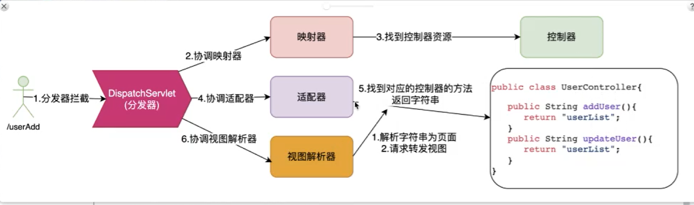

当⼀个请求进来之前，SpringMVC中的核⼼组件会⼀起配合来完成本次请求的处理：

1. 请求被前端控制器（DispatcherServlet）接收到
2. 前端控制器（DispatcherServlet）根据映射器（HandlerMapping）中配置的映射关系，将这个请求转交给真正能够处理客户端请求的处理（Controller/Headler）

3. 处理器（Controller/Headler）通过适配器（HandlerAdaptor），执⾏指定⽅法进⾏处理，完成后返回给⽤户ModelAndView（模型和视图的结合体）

4. 视图解析器（ViewResolver）根据ModelAndView中的逻辑视图名找到真正的物理视图

5. 使⽤ModelAndView中的模型对视图进⾏渲染


### 项目搭建xml

#### 步骤

1. 构建Web项⽬

2. 导⼊所需jar包

3. 配置前端控制器 DispatcherServlet

4. 编写 Controller 控制器(也称为 Handler 处理器)

5. 配置处理器映射器(可省去,有默认配置)

6. 配置处理器适配器(可省去,有默认配置)

7. 配置视图解析器(可省去,有默认配置,但是前缀和后缀都为"")

8. 配置控制器/处理器

#### 依赖

```xml
<dependencies>
    <!--spring核⼼-->
    <dependency>
        <groupId>org.springframework</groupId>
        <artifactId>spring-context</artifactId>
        <version>5.1.9.RELEASE</version>
    </dependency>
    <!--spring集成测试-->
    <dependency>
        <groupId>org.springframework</groupId>
        <artifactId>spring-test</artifactId>
        <version>5.1.9.RELEASE</version>
    </dependency>
    <!--测试单元-->
    <dependency>
        <groupId>junit</groupId>
        <artifactId>junit</artifactId>
        <version>4.12</version>
    </dependency>
    <!--⽇志-->
    <dependency>
        <groupId>log4j</groupId>
        <artifactId>log4j</artifactId>
        <version>1.2.17</version>
    </dependency>
    <!--集成slf4j-->
    <dependency>
        <groupId>org.slf4j</groupId>
        <artifactId>slf4j-log4j12</artifactId>
        <version>1.7.21</version>
    </dependency>
    <!--lombok 新版本idea不需要此依赖-->
    <dependency>
        <groupId>org.projectlombok</groupId>
        <artifactId>lombok</artifactId>
        <version>1.18.22</version>
        <scope>provided</scope>
    </dependency>
    <!-- aop  https://mvnrepository.com/artifact/org.aspectj/aspectjweaver -->
    
    <dependency>
        <groupId>org.aspectj</groupId>
        <artifactId>aspectjweaver</artifactId>
        <version>1.9.4</version>
    </dependency>
    <!--数据库-->
    <dependency>
        <groupId>com.oracle</groupId>
        <artifactId>ojdbc8</artifactId>
        <version>8</version>
    </dependency>
    <!--连接池-->
    <dependency>
        <groupId>com.alibaba</groupId>
        <artifactId>druid</artifactId>
        <version>1.1.10</version>
    </dependency>
    <!--整合mybatis 需要mybatis,mybatis-spring,spring-jdbc三个依赖 -->
    <dependency>
        <groupId>org.mybatis</groupId>
        <artifactId>mybatis</artifactId>
        <version>3.4.6</version>
    </dependency>
    <!-- https://mvnrepository.com/artifact/org.mybatis/mybatis-spring -->
    <dependency>
        <groupId>org.mybatis</groupId>
        <artifactId>mybatis-spring</artifactId>
        <version>2.0.6</version>
    </dependency>
    <dependency>
        <groupId>org.springframework</groupId>
        <artifactId>spring-jdbc</artifactId>
        <version>5.1.9.RELEASE</version>
    </dependency>
    <!--springmvc所需依赖-->
    <!-- servlet3.1规范的坐标 -->
    <dependency>
        <groupId>javax.servlet</groupId>
        <artifactId>javax.servlet-api</artifactId>
        <version>3.1.0</version>
        <scope>provided</scope>
    </dependency>
    <!--jsp坐标-->
    <dependency>
        <groupId>javax.servlet.jsp</groupId>
        <artifactId>jsp-api</artifactId>
        <version>2.1</version>
        <scope>provided</scope>
    </dependency>
    <!--spring web的坐标-->
    <dependency>
        <groupId>org.springframework</groupId>
        <artifactId>spring-web</artifactId>
        <version>5.1.9.RELEASE</version>
    </dependency>
    <!--springmvc的坐标-->
    <dependency>
        <groupId>org.springframework</groupId>
        <artifactId>spring-webmvc</artifactId>
        <version>5.1.9.RELEASE</version>
    </dependency>
</dependencies>
```

#### 编写控制器

```java
public class HelloController implements Controller{
 	@Override
 	public ModelAndView handleRequest(HttpServletRequest request, HttpServletResponse response) throws Exception {
 
 		String name = request.getParameter("name");
 
 		//ModelAndView对象中包括了要返回的逻辑视图,以及数据模型
		ModelAndView mv = new ModelAndView();
 
 		//设置数据模型
 		mv.addObject("name", name);
    	//设置逻辑视图名称
 		mv.setViewName("hello");
 		return mv;
 	}
}
```

##### ModelAndView

```java
//ModelAndView对象中包括了要返回的逻辑视图,以及数据模型
ModelAndView mv = new ModelAndView();
 
//设置数据模型
mv.addObject("name", name);
//设置逻辑视图名称
mv.setViewName("hello");
```


#### 配置分发器（web.xml）

```xml
<?xml version="1.0" encoding="UTF-8"?>
<web-app xmlns="http://xmlns.jcp.org/xml/ns/javaee"
         xmlns:xsi="http://www.w3.org/2001/XMLSchema-instance"
         xsi:schemaLocation="http://xmlns.jcp.org/xml/ns/javaee http://xmlns.jcp.org/xml/ns/javaee/web-app_4_0.xsd"
         version="4.0">
	
    
   <!--陪值过滤器-->
   <filter>
		<filter-name>CharacterEncodingFilter</filter-name>
		<filterclass>org.springframework.web.filter.CharacterEncodingFilter</filter-class>
       <!--设置编码-->
		<init-param>
			<param-name>encoding</param-name>
			<param-value>UTF-8</param-value>
		</init-param>
       <!--是否强制使用-->
		<init-param>
			<param-name>forceEncoding</param-name>
			<param-value>true</param-value>
		</init-param>
	</filter>
    <!--拦截规则-->
	<filter-mapping>
		<filter-name>CharacterEncodingFilter</filter-name>
		<url-pattern>/*</url-pattern>
	</filter-mapping>
    
    
    <!--配置servlet-->
    <servlet>
        <!--分发器-->
        <!--执行servlet service-->
        <servlet-name>DispatcherServlet</servlet-name>
        <servlet-class>org.springframework.web.servlet.DispatcherServlet</servlet-class>
        
        <!--DispatcherServlet协调组件 来自于spring配置文件
			默认去/WEB-INF下<servlet-name>-spring.xml-->
		<!--配置spring⽂件的加载路径-->
        <init-param>
            <param-name>contextConfigLocation</param-name>
            <param-value>classpath:springmvc.xml</param-value>
        </init-param>
        
        <!--每次启动生效>1-->
        <load-on-startup>1</load-on-startup>
    </servlet>
    
    
    <!--配置针对image/css/js等访问给则-->
    <servlet-mapper>
    	<servlet-name>default</servlet-name>
        <url-pattern>*.css</url-pattern>
    </servlet-mapper>

    <servlet-mapping>
        <!--只要命中.url-pattern 就DispatcherServlet拦截-->
        <!--只要.action结尾的都走组件
			/*.拦截所有资源
			/拦截servlet资源和静态资源，不拦截jsp资源-->
        
        <servlet-name>DispatcherServlet</servlet-name>
        <url-pattern>*.action</url-pattern>
    </servlet-mapping>

</web-app>
```


#### 配置(springmvc.xml)

```xml
<?xml version="1.0" encoding="UTF-8"?>
<beans xmlns="http://www.springframework.org/schema/beans"
       xmlns:xsi="http://www.w3.org/2001/XMLSchema-instance"
       xsi:schemaLocation="http://www.springframework.org/schema/beans http://www.springframework.org/schema/beans/spring-beans.xsd">


    <!--配置控制器-->
    <bean id="/hello.action" class="com.fuhao.controller.HelloController"/>
    <!--配置拦截器-->
    <bean name="helloInterceptor" class="com.fuhao.interceptor.HelloInterceptor"/>
    
    方法一
    <!-- 使⽤专⻔的mvc标签配置拦截器 -->
 	<mvc:interceptors>
 		<mvc:interceptor>
 			<!-- 指定需要拦截的请求路径 -->
 			<mvc:mapping path="/**"/>
 			<!-- 指定不进⾏拦截的请求路径 -->
 			<mvc:exclude-mapping path="/test"/>
 			<!-- 指定拦截器对象 -->
 			<ref bean="myInterceptor"/>
 		</mvc:interceptor>
 	</mvc:interceptors>

    <!--配置映射器
        映射规则 beanname(/hello.action) === url(/hello.action)-->
    <bean class="org.springframework.web.servlet.handler.BeanNameUrlHandlerMapping">
        方法二
        <!--配置拦截器绑定-->
        <property name="interceptors" >
            <list>
                <ref bean="helloInterceptor"/>
            </list>
        </property>
    </bean>

    <!--配置适配器-->
    <bean class="org.springframework.web.servlet.mvc.SimpleControllerHandlerAdapter"/>

    <!--配置试图解析器
        选取页面解析引擎，解析，试图 hello -> /WEB-INF/jsp/hello.jsp-->
    <bean class="org.springframework.web.servlet.view.InternalResourceViewResolver">
        
        <!-- 需要jstl依赖 设置⽣成的视图的类型
 		<property name="viewClass" value="org.springframework.web.servlet.view.JstlView"/>
 		
		<dependency>
			<groupId>javax.servlet</groupId>
			<artifactId>jstl</artifactId>
			<version>1.2</version>
  		</dependency>
		-->
        
        
        <!--地址前缀-->
        <property name="prefix" value="/WEB-INF/jsp/"/>
        <!--hello.jsp-->
        <property name="suffix" value=".jsp"/>
    </bean>


</beans>
```

### 注解

#### 配置

- @Controller （指定控制器）
- @RequestMapping （指定控制器中的⽅法和对应的映射路径）

##### web.xml

```xml
<?xml version="1.0" encoding="UTF-8"?>
<web-app xmlns="http://xmlns.jcp.org/xml/ns/javaee"
         xmlns:xsi="http://www.w3.org/2001/XMLSchema-instance"
         xsi:schemaLocation="http://xmlns.jcp.org/xml/ns/javaee http://xmlns.jcp.org/xml/ns/javaee/web-app_4_0.xsd"
         version="4.0">
	
    
   <!--陪值过滤器-->
   <filter>
		<filter-name>CharacterEncodingFilter</filter-name>
		<filterclass>org.springframework.web.filter.CharacterEncodingFilter</filter-class>
       <!--设置编码-->
		<init-param>
			<param-name>encoding</param-name>
			<param-value>UTF-8</param-value>
		</init-param>
       <!--是否强制使用-->
		<init-param>
			<param-name>forceEncoding</param-name>
			<param-value>true</param-value>
		</init-param>
	</filter>
    <!--拦截规则-->
	<filter-mapping>
		<filter-name>CharacterEncodingFilter</filter-name>
		<url-pattern>/*</url-pattern>
	</filter-mapping>
    
    
    <!--配置servlet-->
    <servlet>
        <!--分发器-->
        <!--执行servlet service-->
        <servlet-name>DispatcherServlet</servlet-name>
        <servlet-class>org.springframework.web.servlet.DispatcherServlet</servlet-class>
        
        <!--DispatcherServlet协调组件 来自于spring配置文件
			默认去/WEB-INF下<servlet-name>-spring.xml-->
		<!--配置spring⽂件的加载路径-->
        <init-param>
            <param-name>contextConfigLocation</param-name>
            <param-value>classpath:spring-web-mvc-annotation.xml</param-value>
        </init-param>
        
        <!--每次启动生效>1-->
        <load-on-startup>1</load-on-startup>
    </servlet>
    
    
    <!--配置针对image/css/js等访问给则-->
    <servlet-mapper>
    	<servlet-name>default</servlet-name>
        <url-pattern>*.css</url-pattern>
    </servlet-mapper>

    <servlet-mapping>
        <!--只要命中.url-pattern 就DispatcherServlet拦截-->
        <!--只要.action结尾的都走组件
			/*.拦截所有资源
			/拦截servlet资源和静态资源，不拦截jsp资源-->
        
        <servlet-name>DispatcherServlet</servlet-name>
        <url-pattern>*.action</url-pattern>
    </servlet-mapping>

</web-app>
```

> 使⽤ @Controller 后，TestController就成为了SpringIOC容器中的bean对象了，但是需要我们在xml中，指定Spring扫描的包路径，这样Spring就可以找到TestController类上⾯的注解了。

##### spring-web-mvc-annotation.xml

```xml
<?xml version="1.0" encoding="UTF-8"?>
<beans xmlns="http://www.springframework.org/schema/beans"
       xmlns:p="http://www.springframework.org/schema/p"
       xmlns:context="http://www.springframework.org/schema/context"
       xmlns:mvc="http://www.springframework.org/schema/mvc"
       xmlns:xsi="http://www.w3.org/2001/XMLSchema-instance"
       xsi:schemaLocation="http://www.springframework.org/schema/beans
http://www.springframework.org/schema/beans/spring-beans.xsd
http://www.springframework.org/schema/context
http://www.springframework.org/schema/context/spring-context.xsd
http://www.springframework.org/schema/mvc
http://www.springframework.org/schema/mvc/spring-mvc.xsd">
    <!-- 指定spring扫描的包路径 -->
    <context:component-scan base-package="com.briup.web.controller"></context:component-scan>
    <!-- 开启springmvc的注解功能 -->
    <mvc:annotation-driven conversion-service="formatService"></mvc:annotation-driven>
    
    <!--类型转换器-->
    <bean name="formatService"
class="org.springframework.format.support.FormattingConversionServiceFactoryBean">
	<property name="converters">
		<set>
		<!-- ⾃⼰编写的类型转换器,可以有多个 -->
			<bean class="com.briup.web.converter.StringToDateConverter"></bean>
		</set>
	</property>
</bean>

    <!-- 配置视图解析器-->
    <bean class="org.springframework.web.servlet.view.InternalResourceViewResolver">
        <property name="viewClass" value="org.springframework.web.servlet.view.JstlView"/>
        <property name="prefix" value="/WEB-INF/jsp/"/>
        <property name="suffix" value=".jsp"/>
    </bean>

    <!-- 配置静态资源不被拦截 -->
    <mvc:default-servlet-handler/>
    
    <!-- 配置请求中如果访问/upload路径，那么就直接返回 upload_test 逻辑视图名 -->
    <mvc:view-controller path="/upload" view-name="upload_test"/>

</beans>
```

##### 案例

```java
@RequestMapping("/mvc")
//时Controller中所有的映射⽅法的访问，都会多⼀个前缀 /mvc
@Controller
public class TestController {
 
 	@RequestMapping("/test")
 	public ModelAndView test(){
 		ModelAndView mv = new ModelAndView("hello");
 		return mv;
 	}
 
    //返回值为String 返回逻辑视图名
 	@RequestMapping("/test1")
	public String test1(){ 
 		return "hello";
 	}
    
    //返回值为void 不需要前端控制器处理，⽅法内部就处理本次请求的响应了
    @RequestMapping("/test2")
 	public void test2(HttpServletResponse response) throws IOException{
 		response.getWriter().println("hello world");
 	}
    
    //可以在参数列表中声明request，如果要传值给视图，可以在参数列表中声明model，将数据存放在model中即可
    
    //request、response、model，这些参数只要声明，就可以直接使⽤，springmvc在调⽤的时候会⾃动注⼊的，参数的名字和顺序没要求，只要参数的类型正确即可
    @RequestMapping("/test3")
 	public String test3(HttpServletRequest request, Model model) throws IOException{
 
 		String name = request.getParameter("name");
 		model.addAttribute("name", name);
 		return "hello";
 	}
}
```

##### 其他

Spring2.5中，引⼊注解对Controller进⾏⽀持

- @Controller，⽤于标识是处理器类
- @RequestMapping，请求到处理器功能⽅法的映射规则
- @RequestParam，请求参数到处理器功能处理⽅法的⽅法参数上的绑定
- @ModelAttribute，请求参数到Model中的绑定
- @SessionAttributes，⽤于声明session级别的数据存储
- @InitBinder，⾃定义数据绑定的注册⽀持

Spring3中，引⼊了更多的注解，其中包含了对 RESTful 架构⻛格的⽀持

- @CookieValue，cookie数据到处理器功能处理⽅法的⽅法参数上的绑定
- @RequestHeader，请求头数据到处理器功能处理⽅法的⽅法参数上的绑定
- @RequestBody，请求的body体的绑定
- @ResponseBody，处理器功能处理⽅法的返回值作为响应体
- @ResponseStatus，定义处理器功能处理⽅法/异常处理器返回的状态码和原因
- @ExceptionHandler，注解式声明异常处理器
- @PathVariable，请求URI 中的模板变量部分到处理器功能处理⽅法的⽅法参数上的绑定,从⽽⽀持 RESTful架构⻛格的URI

Spring4以后，引⼊了的⼀些注解，简化之前注解的配置

- @RestController
- @GetMapping
- @PostMapping
- @PutMapping
- @DeleteMapping
- @PatchMapping


### @RequestMapping

##### 请求映射

> 从格式中我们可以看到【请求⽅法、URL、请求头信息、请求正⽂】这四部分⼀般是可变的

1. URL路径映射

​		使⽤URL映射到处理器的功能处理⽅法

2. 请求⽅法映射

​		例如，限定功能处理⽅法只处理GET请求

3. 请求参数映射

​		例如，限定只处理包含username参数的请求

4. 请求头映射

​		例如，限定只处理"Accept=application/json"的请求

##### $\textcolor{Blue}{请求路径映射} $

> **普通URL路径映射请求路径映射**

@RequestMapping(value="/test")

@RequestMapping("/hello")

> **URI模板模式映射**

{}中可以添加任意值

@RequestMapping(value="/users/{userId}")

- {userId}占位符, 请求的URL可以是"/users/123456"或"/users/abcd"
- 之后可以通过@PathVariable可以提取URI模板模式中的{userId}中的值

@RequestMapping(value="/users/{userId}/create")

@RequestMapping(value="/users/{userId}/topics/{topicId}")

> **Ant⻛格的URL路径映射**

@RequestMapping(value="/users/**")

- 可以匹配"/users/abc/123"
- **代表该路径及其⼦路径
- 但"/users/123"将会被【URI模板模式映射中的"/users/{userId}"模式优先映射到】

@RequestMapping(value="/product/?")

- 可匹配"/product/1"或"/product/a"
- 但不匹配"/product"或"/product/aa"
- ?代表有且只有⼀个字符

@RequestMapping(value="/product*")

- 可匹配"/productabc"或"/product"
- 但不匹配"/productabc/abc"
- *代表0~n个字符

@RequestMapping(value="/product/*")

- 可匹配"/product/abc"
- 但不匹配"/productabc"

@RequestMapping(value="/products/**/{productId}")

- 可匹配"/products/abc/abc/123"或"/products/123"
- 也就是Ant⻛格和URI模板变量⻛格可混⽤
- **代表所有的⼦路径

> **正则表达式⻛格的URL路径映射**

从Spring3.0 开始，⽀持正则表达式⻛格的URL路径映射。

格式为{变量名:正则表达式}，然后通过 @PathVariable 可以提取{XXX:正则表达式}中的XXX这个变量的值。

@RequestMapping(value="/products/{categoryCode:\\d+}-{pageNumber:\\d+}")

- 可以匹配"/products/123-1"
- 但不能匹配"/products/abc-1"
- 这样可以设计更加严格的规则

@RequestMapping(value="/user/{userId:^\\d{4}-[a-z]{2}$}")

可以匹配"/user/1234-ab"

##### $\textcolor{Blue}{请求方法映射}$

但之前URL路径映射⽅式对任意请求⽅法都是接受的，因此我们需要某种⽅式来告诉相应的功能处理⽅法，只处理如GET⽅式的请求或POST⽅式的请求。

> @RequestMapping(value="/user/{userId:\\d+}",method=RequestMethod.GET)
>
> @GetMapping("/test")

- 可以匹配"/user/100"
- 并且请求⽅式只能是GET

> @RequestMapping(value="/hello", method= {RequestMethod.POST,RequestMethod.GET})
>
> @PostMapping("/test")

- 可以匹配"/hello"
- 并且请求⽅式只能是POST或者GET

##### $\textcolor{Blue}{请求参数映射} $

> @RequestMapping(params="create",method=RequestMethod.GET)

- 必须是GET⽅式请求
- 请求参数中必须有create参数

> @RequestMapping(params="!create", method=RequestMethod.GET)

- 必须是GET⽅式请求
- 请求参数中不能出现create参数

> @RequestMapping(params="username=tom")

- 请求参数中必须出现username=tom

> @RequestMapping(params="username!=tom")

- username参数名可以不出现
- 如果出现，那么参数值⼀定不能等于tom

> @RequestMapping(params={"create","username=tom"})

- 请求参数中必须有create参数
- 请求参数中必须有username=tom

##### $\textcolor{Blue}{请求头映射} $

> @RequestMapping(value="/header/test1", headers="Accept")

- 请求的URL必须为"/header/test1"

- 请求头中必须有Accept参数

> @RequestMapping(value="/header/test2", headers="!abc")

- 请求的URL必须为"/header/test2"
- 请求头中必须没有abc参数

> @RequestMapping(value="/header/test3", headers="Content-Type=application/json")

- 请求的URL必须为"/header/test3"
- 请求头中必须有"Content-Type=application/json"参数

> @RequestMapping(value="/header/test4", headers="Accept!=text/html")

- 请求的URL必须为"/header/test4"
- 请求头中必须有Accept参数,但是值不等于text/html
- Accept默认/*

> @RequestMapping(value="/header/test5", headers={"Accept!=text/html", "abc=123"})

- 请求的URL必须为"/header/test5"
- 请求头中必须有"Accept"参数，但值不等于"text/html"
- 请求中必须有参数"abc=123"

##### $\textcolor{Blue}{consumes} $

> consumes 指定处理请求中所提交数据类型(消费)

> @RequestMapping(value="/test",consumes="application/json")

- ⽅法仅处理请求中,Content-Type为"application/json"的情况

*请求头中的Content-Type属性，表示请求中携带给服务器的数据是什么类型的*

##### $\textcolor{Blue}{produces} $

> 指定返回的数据类型(⽣产)

> @RequestMapping(value= "/test", produces="application/json")

- ⽅法将产⽣json格式的数据
- 此时根据请求头中的Accept进⾏匹配,如请求头"Accept=application/json"时即可匹配

*请求中Accept属性，表示请求希望服务器返回的数据是什么类型的*

### 页面跳转

##### **servlet**

```java
@RequestMapping("/a")
public String testA(HttpServletRequest request,HttpServletResponse response) throws
ServletException, IOException{
 	System.out.println("testA");
 	//服务器内部跳转到⼀个⻚⾯
 	//request.getRequestDispatcher("/WEB-INF/jsp/hello.jsp").forward(request, response);
 	//服务器内部跳转到⼀个功能处理⽅法
 	//request.getRequestDispatcher("/forward-redirect/test").forward(request, response);
 	//客户端重定向到另⼀个功能处理⽅法
 	response.sendRedirect("/forward-redirect/test");
 	return null;
}
```

##### **字符串**

```java
@RequestMapping("/b")
 public String testB(){
 System.out.println("testB");
 	//服务器内部跳转到另⼀个功能处理⽅法
 	//return "forward:/forward-redirect/test";
 	//客户端重定向到另⼀个功能处理⽅法
 	//return "redirect:/forward-redirect/test";
 	//服务器内部跳转到⼀个⻚⾯
 	return "hello";
 }
```

##### **ModelAndView**

```java
 @RequestMapping("/c")
 public ModelAndView testC() throws ServletException, IOException{
 	System.out.println("testC");
 
 	//服务器内部跳转到另⼀个功能处理⽅法
 	//ModelAndView mv = new ModelAndView("forward:/forward-redirect/test");
 
 	//客户端重定向到另⼀个功能处理⽅法
 	//ModelAndView mv = new ModelAndView("redirect:/forward-redirect/test");
 
 	//服务器内部跳转到⼀个⻚⾯
 	ModelAndView mv = new ModelAndView("hello");
 
 	return mv;
 }
```


### 数据交互

经常会遇到这样的场景，前端⻚⾯中发送ajax请求给Controller中的处理⽅法，处理⽅法返回json格式的字符串给这个ajax请求。

#### 请求参数

##### 注解

Controller中的业务方法的参数名称要与请求参数的name一致，参数值会自动映射匹配。

```
http://localhost:8080/itheima_springmvc1/quick9?username=zhangsan&age=12
```

```java
public class User {
	private String username;
	private int age;
	getter/setter…
}

@RequestMapping("/quick10")
@ResponseBody
public void quickMethod10(User user) throws IOException {
	System.out.println(user);
}
```

Controller中的业务方法数组名称与请求参数的name一致，参数值会自动映射匹配。

```
http://localhost:8080/itheima_springmvc1/quick11?strs=111&strs=222&strs=333
```

```java
@RequestMapping("/quick11")
@ResponseBody
public void quickMethod11(String[] strs) throws IOException {
	System.out.println(Arrays.asList(strs));
}
```

获得集合参数时，要将集合参数包装到一个POJO中才可以。

```html
<form action="${pageContext.request.contextPath}/quick12" method="post">
	<input type="text" name="userList[0].username"><br>
	<input type="text" name="userList[0].age"><br>
    <input type="text" name="userList[1].username"><br>
	<input type="text" name="userList[1].age"><br>
	<input type="submit" value="提交"><br>
</form>
```

```java
@RequestMapping("/quick12")
@ResponseBody
public void quickMethod12(Vo vo) throws IOException {
	System.out.println(vo.getUserList());
}
```

当使用ajax提交时，可以指定contentType为json形式，那么在方法参数位置使用@RequestBody可以直接接收集合数据而无需使用POJO进行包装。

```js
<script>
	//模拟数据
	var userList = new Array();
	userList.push({username: "zhangsan",age: "20"});
	userList.push({username: "lisi",age: "20"});
	$.ajax({
		type: "POST",
		url: "/itheima_springmvc1/quick13",
		data: JSON.stringify(userList),
		contentType : 'application/json;charset=utf-8'
	});
</script>
```

```java
@RequestMapping("/quick13")
@ResponseBody
public void quickMethod13(@RequestBody List<User> userList) throws IOException {
	System.out.println(userList);
}
```

##### 案例

```java
//参数是基本数据类型/包装类型/String
@RequestMapping("test")
//注意，参数名字要和客户端传的参数名⼀致,否则需要使⽤ @RequestParam 来指定参数名
public String test(int age){...}
public String test(long id){...}
public String test(boolean flag){...}
public String test(Long id){...}
public String test(String name){...}

//参数是数组类型
@RequestMapping("test")
//注意，客户端传值类似于这样：name=tom&name=lisi
public String test(int[] age){...}
public String test(long[] id){...}
public String test(boolean[] flag){...}
public String test(Long[] id){...}
public String test(String[] name){...}

//参数是数组类型（json格式）
@RequestMapping("/index")
@ResponseBody
public String index(@RequestBody String[] arr){...}

//参数是类类型
@RequestMapping("test")
//注意，客户端传值类似于这样：id=1&name=tom&dob=1999-11-11
public String test(User user){...}

//参数是类类型的数组（json格式）
@RequestMapping("/test")
public String test(@RequestBody User[] users){...}

//参数是List/Set集合（json格式）
@RequestMapping("/index")
@ResponseBody
public String index(@RequestBody List<String> list){...}

//参数是Map集合（json格式）
@RequestMapping("/index")
@ResponseBody
public String index(@RequestBody Map<Long,User> map){...}


```

#### **回写数据**

##### 返回字符串

通过SpringMVC框架注入的response对象，使用response.getWriter().print(“hello world”) 回写数据，此时不需要视图跳转，业务方法返回值为void。

```java
@RequestMapping("/quick4")
public void quickMethod4(HttpServletResponse response) throws IOException {
	response.getWriter().print("hello world");
}
```

**@ResponseBody**注解告知SpringMVC框架，方法返回的字符串不是跳转是直接在http响应体中返回。

```java
@RequestMapping("/quick5")
@ResponseBody
public String quickMethod5() throws IOException {
	return "hello springMVC!!!";
}
```

##### 返回json

通过jackson转换json格式字符串，回写字符串。

```java
@RequestMapping("/quick7")
@ResponseBody
public String quickMethod7() throws IOException {
	User user = new User();
	user.setUsername("zhangsan");
	user.setAge(18);
	ObjectMapper objectMapper = new ObjectMapper();
	String s = objectMapper.writeValueAsString(user);
	return s;
}
```

**返回对象或集合**

通过SpringMVC帮助我们对对象或集合进行json字符串的转换并回写，为处理器适配器配置消息转换参数，指定使用jackson进行对象或集合的转换，因此需要在spring-mvc.xml中进行如下配置：

```xml
<!--配置适配器-->
<bean class="org.springframework.web.servlet.mvc.method.annotation.RequestMappingHandlerAdapter">
        <property name="messageConverters">
            <list>
                <bean class="org.springframework.http.converter.json.MappingJackson2HttpMessageConverter"></bean>
            </list>
        </property>
 </bean>
```

直接返回json

```java

@RequestMapping("/quick8")
@ResponseBody
public User quickMethod8() throws IOException {
	User user = new User();
	user.setUsername("zhangsan");
	user.setAge(18);
	return user;
}
```

> *<!--mvc**的注解驱动**-->*
>
> <<mvc:annotation-driven/>>
>
> 
>
> 在 SpringMVC 的各个组件中，**处理器映射器**、**处理器适配器**、**视图解析器**称为 SpringMVC 的三大组件。使用<mvc:annotation-driven>自动加载 RequestMappingHandlerMapping（处理映射器）和RequestMappingHandlerAdapter（ 处 理 适 配 器 ），可用在Spring-xml.xml配置文件中使用<mvc:annotation-driven>替代注解处理器和适配器的配置。同时使用<mvc:annotation-driven>默认底层就会集成jackson进行对象或集合的json格式字符串的转换。

```java
//给ajax请求返回单值
@ResponseBody
@RequestMapping(value="test1",consumes="application/json",produces="application/json",method=RequestMethod.POST)
public String test1(@RequestBody User user){
	System.out.println("user = "+user);
	return "hello world";
}

//给ajax请求返回数组（json格式）
@ResponseBody
@RequestMapping(value="test2",consumes="application/json",produces="application/json",method=RequestMethod.POST)
public String[] test2(@RequestBody User user){
	System.out.println("user = "+user);
	return new String[]{"hello","world","tom"};
}

//给ajax请求返回⾃定义类型的数组（json格式）
@ResponseBody
@RequestMapping(value="test3",consumes="application/json",produces="application/json",method=RequestMethod.POST)
public User[] test3(@RequestBody User user){
	System.out.println("user = "+user);
	return new User[]{new User(1L,"tom1"),new User(2L,"tom2"),new User(3L,"tom3")};
}

//给ajax请求返回List集合（json格式）
@ResponseBody
@RequestMapping(value="test4",consumes="application/json",produces="application/json",method=RequestMethod.POST)
public List<User> test4(@RequestBody User user){
	System.out.println("user = "+user);
	return Arrays.asList(new User(1L,"tom1"),new User(2L,"tom2"),new User(3L,"tom3"));
}

//给ajax请求返回Set集合（json格式）
@ResponseBody
@RequestMapping(value="test5",consumes="application/json",produces="application/json",method=RequestMethod.POST)
public Set<User> test5(@RequestBody User user){
	System.out.println("user = "+user);
	Set<User> set = new HashSet<>();
	set.add(new User(1L,"tom1"));
	set.add(new User(2L,"tom2"));
	set.add(new User(3L,"tom3"));
	return set;
}

//给ajax请求返回Map集合（json格式）
@ResponseBody
@RequestMapping(value="test6",consumes="application/json",produces="application/json",method=RequestMethod.POST)
public Map<String,User> test6(@RequestBody User user){
	System.out.println("user = "+user);
	Map<String,User> map = new HashMap<>();
	map.put("tom1", new User(1L,"tom1"));
	map.put("tom2", new User(2L,"tom2"));
	map.put("tom3", new User(3L,"tom3"));
	return map;
}
```

### 数据绑定

请求中携带的参数，或者将数据存放到Model（request）或者session中，或者设置响应中携带的数据，这些事情Springmvc中都提供了相应的注解，可以帮我们很⽅便的完成

####  **@RequestParam**

> 当请求的参数名称与Controller的业务方法参数名称不一致时，就需要通过@RequestParam注解显示的绑定。

```java
@RequestMapping("/test1")
/**
*value 与请求参数名称
*required = false 此在指定的请求参数是否必须包括，默认是true，提交时如果没有此参数则报错
*defaultValue 当没有指定请求参数时，则使用指定的默认值赋值
*
*/
public String test1(@RequestParam(value="name",required=false,defaultValue="#{systemProperties['java.vm.name']}") String username){
	System.out.println("username = "+username);
	return "hello";
}
```

#### **@PathVariable**

> @PathVariable ⽤于将请求URL中的模板变量映射到功能处理⽅法的参数上

```java
@RequestMapping("/test2/{name}")
public String test2(@PathVariable("name") String username){
	System.out.println("username = "+username);
	return "hello";
}
```

*注意，@PathVariabl还可以⾃动的把数据放到模型中去，⻚⾯中可以直接使⽤EL表达式取值 : ${name}*

#### **@CookieValue**

> @CookieValue ⽤于将请求中的Cookie数据映射到功能处理⽅法的参数上

```java
@RequestMapping("/test3")
/**
*value 参数
*required = false 不抛出异常 默认抛出
*
*/
public String test3(@CookieValue(value="JSESSIONID",required=false) String sessionId){
	System.out.println("sessionId = "+sessionId);
	return "hello";
}

@RequestMapping("/test3")
//传⼊参数类型也可以是javax.servlet.http.Cookie
public String test3(@CookieValue(value="JSESSIONID",required=false) Cookie cookie){
	System.out.println("cookie = "+cookie);
	return "hello";
}

```

#### **@RequestHeader**

> @RequestHeader ⽤于将请求的头中的值映射到功能处理⽅法的参数上

```java
@RequestMapping("/test4")
//⾃动将请求头"User-Agent"的值，⼊参到userAgent参数上，并将"Accept"请求头值⼊参到accepts参数上
public String test4(@RequestHeader("User-Agent") String userAgent,@RequestHeader(value="Accept") String[] accepts){
	System.out.println("userAgent = "+userAgent);
	System.out.println("accepts = "+Arrays.toString(accepts));
	return "hello";
}
```

#### **@ModelAttribute**

@ModelAttribute 注解⽤于将⽅法的参数或⽅法的返回值绑定到指定的模型属性上，并返回给Web视图

```java
@RequestMapping("/model")
@Controller
public class ModelAttributeController {
 
 	//任何映射⽅法执⾏之前，都会先调⽤该⽅法，将返回值存⼊模型中
	//key默认为返回类型的⾸字⺟⼩写，string
 	@ModelAttribute
 	public String addModel1() {
		 return "hello";
 	}
 
 	//任何映射⽅法执⾏之前，都会先调⽤该⽅法，将返回值存⼊模型中
	//如果是集合，key默认为泛型类型⾸字⼩写+List，这⾥为stringList
 	@ModelAttribute
	public List<String> addModel2() {
 		return java.util.Arrays.asList("hello","world");
 	}
 
 	//任何映射⽅法执⾏之前，都会先调⽤该⽅法，将返回值存⼊模型中
	//可以指定key的值，这⾥设置为name
	@ModelAttribute("name")
 	public String addModel3() {
 		return "tom";
 	}
 
 	@RequestMapping("/test")
 	public String test(Model model) {
		//输出model，可以看出⾥⾯存放的key和value
 		System.out.println(model);
 		return "hello";
 	}
    
    @RequestMapping("/test")
    //如果处理器⽅法的参数是⾃定义实体类型（例如User），会默认存放到模型中，key的默认值为类型⾸字⺟⼩写
 	public String test(User user,Model model) {
 		System.out.println(model);
 		return "hello";
 	}
    
    //@ModelAttribute("name")会先从模型中查询key为name的值
	//如果有key为name的值，那么就取出来注⼊到这个⽅法参数name上，这个值显示为：tom
	//及时这个时候访问地址并传参 /test?name=lucy ,这个lucy的是⽆法接收的
	//除⾮再添加⼀个注解 @RequestParam("name") ,这时候就可以拿到请求参数中的name值：lucy
 	@RequestMapping("/test")
 public String test(@ModelAttribute("name")String name) {
	 	System.out.println("name = "+name);
	 	return "hello";
 }
    
    @RequestMapping("/test")
    //⽆论是⾃定义实体类User，还是基本类型或者字符串类型，都可以使⽤ @ModelAttribute 注解将其存⼊模型中，并指定key的值
 	public String test(@ModelAttribute("name") String name,Model model) {
 		System.out.println(model);
 		return "hello";
 	}
    
}


```

{user=User [id=1, name=tom],

org.springframework.validation.BindingResult.user=org.springframework.validation.BeanPropertyBindingResult: 0 errors}

> 这⾥除了把User对象放⼊模型中，还把参数的验证结果存放了进来，之外在数据验证的时候会⽤到


#### **@SessionAttributes**

> @SessionAttributes 注解只⽤作⽤在类上，作⽤是将指定的 Model 的键值对保存在 **session** 中

```java
@SessionAttributes({"name"})
@RequestMapping("/session")
@Controller
public class SessionAttributesController {
 
 	@RequestMapping("/test1")
 	public String test1(Model model) {
 		model.addAttribute("name", "mary");
 		return "hello";
 	}
 
 	@RequestMapping("/test2")
 	public String test2(HttpSession session) {
 		System.out.println(session.getAttribute("name"));
 		return "hello";
 	}
}
```

#### **@Value**

> @Value 可以将⼀个SpEL表达式结果映射到功能处理⽅法的参数上

```java
 @RequestMapping("/test1")
 public String test1(@Value("#{systemProperties['java.vm.version']}") String jvmVersion) {
 
 	System.out.println(jvmVersion);
 
 	return "hello";
 }
```

> 使⽤SpEL，访问Spring容器中bean对象的属性和⽅法修改User类，添加sayHello⽅法

```java
@RequestMapping("/value")
@Controller
public class ValueController {

    @RequestMapping("/test1")
    public String test1(@Value("#{systemProperties['java.vm.version']}") String jvmVersion) {

        System.out.println(jvmVersion);

        return "hello";
    }

    @RequestMapping("/test2")
    public String test2(@Value("#{user.name}") String username) {

        System.out.println(username);

        return "hello";
    }

    @RequestMapping("/test3")
    public String test3(@Value("#{user.sayHello()}") String msg) {

        System.out.println(msg);

        return "hello";
    }

    @RequestMapping("/test4")
    public String test4(@Value("#{user.sayHello('mary')}") String msg) {

        System.out.println(msg);

        return "hello";
    }

    //这⾥的?号，是为了防⽌空指针，以为sayHello()⽅法可能返回null,不为null的时候才会继续调⽤
    @RequestMapping("/test5")
    public String test5(@Value("#{user.sayHello()?.toUpperCase()}") String msg) {

        System.out.println(msg);

        return "hello";
    }

}
```

> 如果要调⽤的某个类是外部类的静态⽅法,⽽不是spring中定义的bean,使⽤表达式T()

```java
@RequestMapping("/value")
@Controller
public class ValueController {
 
 	@RequestMapping("/test6")
 	public String test6(@Value("#{T(java.lang.Math).random()}") String msg) {
 
 		System.out.println(msg);
 
 		return "hello";
 	}
 
}
```

#### **@InitBinder**

> @InitBinder 注解可以解决类型转换的问题

```java
 @InitBinder//定义本类中实体类的日期 - 形式
 public void format(WebDataBinder binder){
 SimpleDateFormat dateFormat = new SimpleDateFormat("yyyy-MM-dd"); 
 	//指定⽇期转换的格式，true表示允许为空
 	binder.registerCustomEditor(Date.class, new CustomDateEditor(dateFormat, true)); 
 }
```

#### @DateTimeFormat

除了这种⽅式，将接收到的⽇期参数进⾏转换外，还有另⼀种⽅式，只需要添加⼀个 @DateTimeFormat 注解即可

```java
public class User {
 	private long id;
 	private String name;
 	@DateTimeFormat(pattern = "yyyy-MM-dd")
 	private Date dob;
 
 	public long getId() {
 		return id;
 	}
 	public void setId(long id) {
 		this.id = id;
 	}
}
```

#### **@Scope**

> Controller默认情况下和servlet⼀样也是单例,但是spring提供了⼀个@Scope注解可以让Controller对象变为⾮单例,只需在Controller类上⾯加⼊@Scope("prototype")即可

```java
@Controller
@RequestMapping("/hello")
@Scope("prototype")
public class HelloWorldController{
 //....
}
```

#### **@RequestBody**

> @RequestBody 表示从请求正⽂中取值 必须是post请求

```java
@RequestMapping(value="/test",method = RequestMethod.POST)
 public String test(@RequestBody String content) {
System.out.println(content);
 	return "hello";
 }
```

该注解⼀般⽤于接收请求体中的JSON格式字符串，并转换为java对象，但是需要引⼊操作json的相关jar包

```xml
<!-- https://mvnrepository.com/artifact/com.fasterxml.jackson.core/jackson-databind -->
<dependency>
	<groupId> com.fasterxml.jackson.core </groupId>
	<artifactId> jackson-databind </artifactId>
	<version> 2.13.3 </version>
</dependency>
```

```java
@RequestMapping(value="/test",method = RequestMethod.POST,consumes = "application/json")
 	public String test(@RequestBody User user) {
 		System.out.println(user);
 	return "hello";
 }
```

/WEB-INF/jsp/ajax.jsp⻚⾯，因为在WEB-INF下，所以浏览器⽆法直接⽅法，需要先放我Controller，然后返回逻辑视图名"ajax"，经过视图解析器，解析成真实的物理视图的路径，然后在显示。

简化

```xml
<mvc:view-controller path="/ajax" view-name="ajax"/>
```

*该配置的意思是，浏览器中放我/ajax，SpringMVC中直接返回ajax逻辑视图名*

由于是ajax请求，那么Controller中的处理⽅法就不能返回视图⻚⾯了，⽽是直接写回数据给⻚⾯

```java
@RequestMapping(value="/test",method = RequestMethod.POST,consumes = "application/json")
public void test(@RequestBody User user,Writer out)throws	Exception {
	System.out.println(user);
	out.write(user);
}
```

#### **@ResponseBody**

@ResponseBody 注解⽤于将处理器中功能处理⽅法返回的对象，经过转换为指定格式后，写⼊到Response对象的body数据区，也就是响应正⽂。

### **Restful风格**

#### 简介

> 在Spring中@RestController的作用等同于@Controller + @ResponseBody。
>
> 可以直接在类上标注@RestController，而不用在每个方法中标注@ResponseBody，简化了开发过程。

**Restful**是一种软件**架构风格**、**设计风格**，而不是标准，只是提供了一组设计原则和约束条件。主要用于客户端和服务器交互类的软件，基于这个风格设计的软件可以更简洁，更有层次，更易于实现缓存机制等。

**Restful**风格的请求是使用**“url+请求方式”**表示一次请求目的的，HTTP 协议里面四个表示操作方式的动词如下：

- GET：用于获取资源
- POST：用于新建资源
- PUT：用于更新资源
- DELETE：用于删除资源

案例

-  /user/1 GET ： 得到 id = 1 的 user
-  /user/1 DELETE： 删除 id = 1 的 user
- /user/1 PUT： 更新 id = 1 的 user
- /user POST：新增 user

#### 获得Restful风格

上述url地址/user/1中的1就是要获得的请求参数，在SpringMVC中可以使用占位符进行参数绑定。地址/user/1可以写成/user/{id}，占位符{id}对应的就是1的值。在业务方法中我们可以使用@PathVariable注解进行占位符的匹配获取工作。

```java
@RequestMapping("/quick19/{name}")
@ResponseBody
public void quickMethod19(@PathVariable(value = "name",required = true) String name){
	System.out.println(name);
}
```

```java
@GetMapping //使用Get方式请求
@PostMapping //使用Post方式请求
@PutMapping //使用Put方式请求
@DeleteMapping //使用Delete方式请求
@PatchMapping //使用Patch方式请求
```


#### 方法参数

> **HttpServletRequest和 HttpServletResponse**

```java
@RequestMapping("test1")
public void test1(HttpServletRequest request,HttpServletResponse response){
	System.out.println("request = "+request);
	System.out.println("response = "+response);
}
```

> **InputStream/OutputStream 和Reader/Writer**
>
> 使用流不能用试图输出，只能void

```java
@RequestMapping("test2")
public void test2(InputStream in,OutputStream out){
	//对应request.getInputStream();
	System.out.println("in = "+in);
	//对应response.getOutputStream();
	System.out.println("out = "+out);
}

@RequestMapping("test2")
public void test2(Reader in,Writer out){
	//request.getReader();
	System.out.println("in = "+in);
	//response.getWriter();
	System.out.println("out = "+out);
}
```

> **WebRequest/NativeWebRequest**

WebRequest是SpringMVC提供的统⼀请求访问接⼝,可以访问各个范围的数据；NativeWebRequest继承了WebRequest,并提供访问本地ServletAPI的⽅法。

```java
@RequestMapping("test3")
public String test3(WebRequest webRequest, NativeWebRequest nativeWebRequest){
	System.out.println(webRequest.getParameter("test"));
	webRequest.setAttribute("name", "tom",WebRequest.SCOPE_REQUEST); 
	System.out.println(webRequest.getAttribute("name",WebRequest.SCOPE_REQUEST)); 
	HttpServletRequest request = nativeWebRequest.getNativeRequest(HttpServletRequest.class);
	HttpServletResponse response = nativeWebRequest.getNativeResponse(HttpServletResponse.class); 
	return "test";
}
```

> **HttpSession**

```java
@RequestMapping("test4")
public void test4(HttpSession session){
	System.out.println("session = "+session);
}
```

> **值对象（Value Object）**

请求中含有 id=1&name=tom，这些值就会被封装到User对象中，需要参数名和属性名字⼀致

日期必须2001/9/10

```java
@RequestMapping("test5")
public void test5(User user){
	System.out.println("user = "+user);
}
```

> **Model、Map、ModelMap**

SpringMVC提供Model、Map或ModelMap让我们能去封装模型数据，将来再传⼊视图中

```java
@RequestMapping("test6")
public String test6(Model m1, Map<String,Object> m2, ModelMap m3){
model.addAttribute("name1", "tom1");
 	map.put("name2", "tom2");
 	modelMap.addAttribute("name3", "tom3");
 
 	System.out.println(model);
 
 	System.out.println(model == map);
 	System.out.println(model == modelMap);
 
 	System.out.println(model.getClass());
	return "hello";
}
```

*注意，虽然此处注⼊的是三个不同的类型参数，但三者是同⼀个对象*

> **HttpEntity<T>和ResponseEntity<T>**

例如，HttpEntity可以获取请求中各个部分的内容

请求实体

```java
@RequestMapping("test7")
public String test7(HttpEntity<String> httpEntity){
	//获得请求中的所有的header部分
	HttpHeaders headers = httpEntity.getHeaders();
	//获得请求中的所有的body部分
	String body = httpEntity.getBody(); 
	Set<Entry<String,List<String>>> set = headers.entrySet();
	StringBuffer s = new StringBuffer();
	for(Entry<String,List<String>> entry:set){
		String key = entry.getKey();
		s.append(key+": ");
		List<String> list = entry.getValue();
		for(String value:list){
			s.append(value+" ");
 		}
		System.out.println(s.toString());
		s.setLength(0);
 	}
	System.out.println("----------------");
	System.out.println("body = "+body);
	return "hello";
}
```

相应实体

```JAVA
@RequestMapping("test7")
public ResponseEntity<String> test7(){
	//创建响应头对象
	HttpHeaders headers = new HttpHeaders();
	//创建MediaType对象
	MediaType mt = new MediaType("text","html",Charset.forName("UTF-8"));
	//设置ContentType
	headers.setContentType(mt); 
	//准备好响应体
	String content = new String("hello world");
	//根据 响应内容/响应头信息/响应状态码 创建响应对象
	ResponseEntity<String> re = new ResponseEntity<String>(content,headers,HttpStatus.OK);//响应体 x'a
	//返回ResponseEntity对象
	return re;
}
```

### 作用域@Scope


### 类型转换器

SpringMVC 默认已经提供了一些常用的类型转换器，例如客户端提交的字符串转换成int型进行参数设置。但是不是所有的数据类型都提供了转换器，没有提供的就需要自定义转换器，例如：日期类型的数据就需要自定义转换器。

只针对普通（json）有问题

```java
//转换器 负责把String转换为Date
public class StringToDateConverter implements Converter<String,Date>{
 	private SimpleDateFormat dateFormat = new SimpleDateFormat("yyyy-MM-dd");
    @Override
 	public Date convert(String str) {
 		Date date = null;
 		try {
 			if(str!=null && !"".equals(str.trim())){
 				date = dateFormat.parse(str);
 			}
 		} catch (Exception e) {
 			e.printStackTrace();
 		}
 		return date;
 	}
}
```

配置文件

```xml
<mvc:annotation-driven conversion-service="formatService"/>

<bean name="formatService"
	class="org.springframework.format.support.FormattingConversionServiceFactoryBean">
	<property name="converters">
		<set>
		<!-- ⾃⼰编写的类型转换器,可以有多个 -->
			<bean class="com.briup.web.converter.StringToDateConverter"></bean>
		</set>
	</property>
</bean>
```

### 静态资源放行

> 在web.xml配置静态映射规则

```xml
 <!--配置针对image/css/js等访问给则-->
    <servlet-mapper>
    	<servlet-name>default</servlet-name>
        <url-pattern>*.css</url-pattern>
    </servlet-mapper>
```

> 在springmvc.xml

```xml
<!--手动配置静态映射规则
		mapping 访问的路径
		location 资源位置-->
    <mvc:resources mapping="/static/css/*" location="/static/css/" />
```

> 在springmvc直接配置使用tomcat的静态处理方式

```xml
<!--image/css/js...走默认路径-->
    <mvc:default-servlet-handler/>
```

### 请求乱码

当post请求时，数据会出现乱码，我们可以设置一个过滤器来进行编码的过滤。

```xml
<filter>
	<filter-name>CharacterEncodingFilter</filter-name>
	<filter-class>org.springframework.web.filter.CharacterEncodingFilter</filter-class>
	<init-param>
		<param-name>encoding</param-name>
		<param-value>UTF-8</param-value>
	</init-param>
</filter>
<filter-mapping>
	<filter-name>CharacterEncodingFilter</filter-name>
	<url-pattern>/*</url-pattern>
</filter-mapping>
```

### 日期

@ResponseBody ⼀般在处理器⽅法返回的数据不是html⻚⾯，⽽是json数据的时候使⽤，并且可以⾃动将对象转为json格式的字符串，放⼊响应体中，并返回。

```java
 @ResponseBody
 @RequestMapping("/test1")
 public User test1() {
 	User user = new User();
 	user.setId(1L);
 	user.setName("tom");
 	user.setDob(new Date());
	return user;
 }
```

可以看出，它默认把dob这个⽇期对象转为了⼀个时间戳，如果想按照⾃⼰的⽇期格式进⾏转换，那么需要⾃定义⼀个json的⽇期类型格式化类：

```java
//java对象中的⽇期属性 转 json字符串的时候，⽇期格式的设置
public class DateJsonSerializer extends JsonSerializer<Date> { 
 	@Override
 	public void serialize(Date value, JsonGenerator jgen,SerializerProvider provider) throws IOException,JsonProcessingException { 
 		SimpleDateFormat formatter = new SimpleDateFormat("yyyy-MM-dd"); 
 		String formattedDate = formatter.format(value); 
 		jgen.writeString(formattedDate); 
 	} 
}
```

```java
public class User {
 	private long id;
 	private String name;
    @JsonSerialize(using=DateJsonSerializer.class)//响应的日期格式
 	@DateTimeFormat(pattern = "yyyy-MM-dd")//接受的日期格式
 	private Date dob;
    
    /*
    @JsonSerialize(using=DateJsonSerializer.class)
 	public Date getDob() {
 		return dob;
 	}
 	*/
}
```

- @DateTimeFormat(pattern = "yyyy-MM-dd") ，是SpringMVC接收客户端请求中参数的时候，字符串转⽇期对象的格式
- @JsonSerialize(using=DateJsonSerializer.class) ，是Controller处理⽅法的返回值，将java对象转为json格式字符串的⽇期格式

### 拦截器

##### 定义

属于映射器管理在映射器里配置

> 拦截器接⼝为： org.springframework.web.servlet.HandlerInterceptor

```java
public interface HandlerInterceptor {
 
 	default boolean preHandle(HttpServletRequest request,HttpServletResponse response, Object handler)
 	throws Exception {
 	return true;
 }
 
 	default void postHandle(HttpServletRequest request,HttpServletResponse response, Object handler,
 @Nullable ModelAndView modelAndView) throws Exception {
 }
 
 default void afterCompletion(HttpServletRequest request,HttpServletResponse response, Object handler,
 	@Nullable Exception ex) throws Exception {
 	}
}
```

- preHandle

  目标方法执行之前

  true表示继续流程，也就是将请求放⾏(如调有下⼀个拦截器或处理器)

  false表示流程中断，此时需要通过response来产⽣响应

  第三个参数为的处理器(本次请求要访问的那个Controller)

- postHandle

  目标方法执行后

- afterCompletion

  渲染试图之后

**适配**

Spring 提供了⼀个 HandlerInterceptorAdapter 适配器,允许我们只实现需要的回调⽅法。在 HandlerInterceptorAdapter 中,对 HandlerInterceptor 接⼝中的三个⽅法都进⾏了空实现,其中preHandle⽅法的返回值,默认是true

##### 配置拦截器

方法1

```xml
<!--配置拦截器-->
    <bean name="helloInterceptor" class="com.fuhao.interceptor.HelloInterceptor"/>

<!--配置映射器
        映射规则 beanname(/hello.action) === url(/hello.action)-->
    <bean class="org.springframework.web.servlet.handler.BeanNameUrlHandlerMapping">
        <!--配置拦截器绑定-->
        <property name="interceptors" >
            <list>
                <ref bean="helloInterceptor"/>d
            </list>
        </property>
    </bean>
```

方法2

```xml
<!--配置拦截器-->
    <bean name="helloInterceptor" class="com.fuhao.interceptor.HelloInterceptor"/>

<!-- 使⽤专⻔的mvc标签配置拦截器 -->
 <mvc:interceptors>
 	<mvc:interceptor>
 		<!-- 指定需要拦截的请求路径 -->
 		<mvc:mapping path="/**"/>
 		<!-- 指定不进⾏拦截的请求路径 -->
 		<mvc:exclude-mapping path="/test"/>
 		<!-- 指定拦截器对象 -->
 		<ref bean="myInterceptor"/>
 	</mvc:interceptor>
 </mvc:interceptors>
```

##### 单例（线程安全）

> SpringMVC中的拦截器是单例，因此不管多少⽤户请求多少次，都只有⼀个拦截器实现，即⾮线程安全

A 线程中只能看到A线程的ThreadLocal,不能看到B线程的ThreadLocal。那么将值存到ThreadLocal中，那么⼀个线程在执⾏期间，就知道能拿到⾃⼰线程中的ThreadLocal⾥⾯的值了

```java
public class HelloInterceptor implements HandlerInterceptor {
    //拦截器是单例,不是线程安全的,所以这⾥使⽤ThreadLocal
    private ThreadLocal<Long> local = new ThreadLocal<>();

    @Override
    public boolean preHandle(HttpServletRequest request, HttpServletResponse response, Object
            handler)
            throws Exception {
        long start = System.currentTimeMillis();
        local.set(start);
        return true;
    }
    @Override
    public void afterCompletion(HttpServletRequest request, HttpServletResponse response, Object
            handler, Exception ex)
            throws Exception {
        long end = System.currentTimeMillis();
        System.out.println("共耗时:"+(end-local.get()));
    }
}
```


### 数据验证（@Valid）

> 通常在项⽬中使⽤较多的是前端校验，⽐如⻚⾯中js校验。对于安全要求较⾼的建议在服务端同时校验

SpringMVC使⽤hibernate的实现的校验框架validation，所以需要导⼊相关依赖

```xml
<!-- 校验依赖 -->
<dependency>
	<groupId> org.hibernate.validator </groupId>
	<artifactId> hibernate-validator </artifactId>
	<version> 6.2.0.Final </version >
</dependency>
```

##### 注解


```java
public class Teacher {
 
 	@NotNull(message = "ID不能为空")
 	private Long id;
 	@Size(min=5,max=8,message = "⻓度需要在5-8之间")
 	private String name;
 	@Min(value = 18,message = "年龄必须是18以上")
 	private Integer age;
 	@Past(message = "必须是过去的⽇期时间")
    @DateTimeFormat(pattern = "yyyy-MM-dd")
    //@DateTimeFormat(pattern = "yyyy-MM-dd")是为了接收参数时候的⽇期字符串格式的设置
 	private Date dob;
}
```

##### 测试

```java
@RequestMapping("/valid")
@Controller
public class ValidController {


    @RequestMapping(value="/test",method = {RequestMethod.GET,RequestMethod.POST})
    public String addTeacher(@Valid Teacher teacher, BindingResult bindingResult){
        //如果验证数据中有错误信息,将保存在bindingResult对象中
        if(bindingResult.hasErrors()){
            List<ObjectError> errorList = bindingResult.getAllErrors();
            for(ObjectError error : errorList){
                System.out.println(error.getDefaultMessage());
            }
        }
        return "hello";
    }
}
```

##### 前端验证

```xml
<html>
        <head>
            <meta http-equiv="Content-Type" content="text/html; charset=UTF-8">
            <title>valid.jsp</title>
        </head>
        <body>

            <sf:form method="post" modelAttribute="teacher">
                <sf:label path="name">⽤户名:</sf:label>
                <sf:input path="name"/>
                <sf:errors path="name" cssStyle="color:red"></sf:errors><br>
                <sf:label path="age"> 年 龄:</sf:label>
                <sf:input path="age"/>
                <sf:errors path="age" cssStyle="color:red"></sf:errors><br>
                <sf:label path="dob"> ⽣ ⽇:</sf:label>
                <sf:input path="dob"/>
                <sf:errors path="dob" cssStyle="color:red"></sf:errors><br>
                <input type="submit" value="提交"/>
            </sf:form>

        </body>
    </html>
```

### 异常处理

> 在SpringMVC中可以把异常统⼀进⾏处理，可以xml配置，也可以注解配置

#### xml

只要在xml配置⽂件中，添加⼀个异常解析器即可，并且指定⼀般异常需要跳转的视图，以及特定的异常需要跳转的视图。

##### 内置的异常处理器

```xml
<bean class="org.springframework.web.servlet.handler.SimpleMappingExceptionResolver">
	<!-- 默认异常 -->
	<!-- value="error/error" 表示error/⽬录下的逻辑视图，名字为error -->
	<property name="defaultErrorView" value="error/error"></property>
	<!-- 异常对象的变量名，默认名为exception -->
	<property name="exceptionAttribute" value="ex"></property>
<!-- 具体的异常，⽤简单类名或全限定名作为key，异常⻚名的逻辑视图名作为value -->
	<property name="exceptionMappings">
		<props>
			<prop key="IOException">error/error_io</prop>
			<prop key="java.sql.SQLException">error/error_sql</prop>
		</props>
	</property>
</bean>
```

##### **⾃定义的异常解析器**

```java
public class MyExceptionResolver implements HandlerExceptionResolver {
    /**
     *
     * @param request
     * @param response
     * @param handler 
     * @param ex 异常信息
     * @return
     */
    @Override
    public ModelAndView resolveException(HttpServletRequest request, HttpServletResponse response, Object handler,Exception ex) {

        Map<String,Object> model = new HashMap<>();
        model.put("ex", ex);

        String viewName = "error/error";

        if(ex instanceof IOException) {
            viewName = "error/error_io";
        }
        else if(ex instanceof SQLException) {
            viewName = "error/error_sql";
        }
        return new ModelAndView(viewName, model);
    }
}
```

```xml
<!-- 配置⾃定义异常解析器 -->
 <bean class="com.briup.web.resolver.MyExceptionResolver"></bean>
```

#### 注解

##### **@ExceptionHandler**

> 使⽤@ExceptionHandler注解作⽤在⽅法上⾯，参数是具体的异常类型。⼀旦系统抛出这种类型的异常时，会引导到该⽅法来处理

```java
@RequestMapping("/error")
@Controller
public class ErrorController {

    @RequestMapping("/test")
    public void test() throws IOException {
        Random random = new Random();
        int num = random.nextInt(10);
        if (num % 2 == 0) {
            throw new RuntimeException("Runtime异常测试");
        } else {
            throw new IOException("IO异常测试");
        }

    }

    //指定需要的处理的异常类型
    @ExceptionHandler({Exception.class})
    public String ex(Exception ex, Model model) {

        model.addAttribute("ex", ex);

        String viewName = "error/error";

        if (ex instanceof IOException) {
            viewName = "error/error_io";
        } else if (ex instanceof SQLException) {
            viewName = "error/error_sql";
        }

        return viewName;
    }
}
```

> 注意，处理异常的⽅法 和 抛出异常的⽅法 必须 在同⼀个controller中
>
> 注意，此外就不需要其他配置了

##### **@ControllerAdvice + @ExceptionHandler**

> 使⽤@ControllerAdvice 和@ExceptionHandler 可以全局控制异常，异常处理⽅法 和 抛出异常⽅法可以分开例如，

```java
@ControllerAdvice
public class GlobalExceptionHandler {

    @ExceptionHandler({Exception.class})
    public String ex(Exception ex,Model model) {

        model.addAttribute("ex", ex);

        String viewName = "error/error";

        if(ex instanceof IOException) {
            viewName = "error/error_io";
        }
        else if(ex instanceof SQLException) {
            viewName = "error/error_sql";
        }

        return viewName;
    }

}
```

> 此时全局的异常处理器可以单独编写，和其他Controller分开

```xml
<!-- 指定spring扫描的包路径 -->
<context:component-scan base-package="com.briup.web.annotation,com.briup.web.resolver"></context:component-scan>
```

### 文件上传

**文件上传客户端三要素**

- 表单项type=“file”
- 表单的提交方式是post
- 表单的enctype属性是多部分表单形式，及enctype=“multipart/form-data”

```jsp
<%@ page language="java" contentType="text/html; charset=UTF-8"
         pageEncoding="UTF-8"%>
<!DOCTYPE html PUBLIC "-//W3C//DTD HTML 4.01 Transitional//EN"
"http://www.w3.org/TR/html4/loose.dtd">
<html>
<head>
    <meta http-equiv="Content-Type" content="text/html; charset=UTF-8">
    <title>upload.jsp</title>
</head>
<body>
    <h1>普通上传</h1>
    <form action="/upload/test" method="post" enctype="multipart/form-data">
        <input type="file" name="file"><br>
        <input type="file" name="file"><br>
        <input type="submit" value="上传">
    </form>
</body>
</html>
```

> 注意，enctype的属性值，⼀定要设置为 "multipart/form-data ，这⾥可以同时上传俩个⽂件

原理

- 当form表单修改为多部分表单时，request.getParameter()将失效。
- enctype=“application/x-www-form-urlencoded”时，form表单的正文内容格式是**key=value&key=value&key=value**
- 当form表单的enctype取值为Mutilpart/form-data时，请求正文内容就变成多部分形式：

##### 依赖

```xml
<!-- ⽂件上传 -->
<dependency>
	<groupId> commons-fileupload </groupId>
	<artifactId> commons-fileupload </artifactId>
	<version> 1.3.3 </version>
</dependency>

<dependency>
	<groupId>commons-io</groupId>
	<artifactId>commons-io</artifactId>
	<version>2.4</version>
</dependency>
```

##### 文件上传解析器

```xml
<!-- SpringMVC上传⽂件时，需要配置MultipartResolver处理器 -->
    <!-- 注意:bean的名字不要改,⼀定要叫multipartResolver,否则上传报错 -->
    <bean name="multipartResolver"
          class="org.springframework.web.multipart.commons.CommonsMultipartResolver">
        <property name="defaultEncoding" value="UTF-8"/>
        <!-- 指定所上传⽂件的总⼤⼩不能超过指定字节⼤⼩ -->
        <property name="maxUploadSize" value="20000000"/>
    </bean>
```

##### Controller

```java
@RequestMapping("/upload")
@Controller
public class UploadController {

    @RequestMapping("/test")
    public String test(@RequestParam("file") MultipartFile[] files, HttpServletRequest request) {
        if (files != null && files.length > 0) 
            for(MultipartFile file: files){
                saveFile(request, file);
			}
         }
        // 重定向到/upload，在xml⽂件中可以配置/upload路径对应 upload_test 逻辑视图名
        return "redirect:/upload";
    }
    private void saveFile(HttpServletRequest , MultipartFile file) {
        // 判断⽂件是否为空
        if (!file.isEmpty()) {
            try {
                //保存的⽂件路径
                //需要的话，可以给⽂件名上加时间戳
                String filePath = "D:/briup/upload/"+file.getOriginalFilename();

                File newFile = new File(filePath);

                //⽂件所在⽬录不存在就创建
                if (!newFile.getParentFile().exists()){
                    newFile.getParentFile().mkdirs();
                }
                // 转存⽂件
                file.transferTo(newFile);
            } catch (Exception e) {
                e.printStackTrace();
            }
        }
    }

}
```

### **ajax上传**

> 在⻚⾯中，引⼊ajax上传的插件，也可以使⽤ajax完成上传功能

#### 文件上传解析器

```xml
<!-- SpringMVC上传⽂件时，需要配置MultipartResolver处理器 -->
 <!-- 注意:bean的名字不要改,⼀定要叫multipartResolver,否则上传报错 -->
<bean name="multipartResolver"
class="org.springframework.web.multipart.commons.CommonsMultipartResolver">
	<property name="defaultEncoding" value="UTF-8"/>
	<property name="maxUploadSize" value="20000000"/>
</bean>
```

#### 页面

```xml
<script type="text/javascript" src="/static/js/jquery-1.8.3.min.js"></script>
<script type="text/javascript" src="/static/js/ajaxfileupload.js"></script>
```

```jsp
<%@ page language="java" contentType="text/html; charset=UTF-8"
         pageEncoding="UTF-8"%>
<!DOCTYPE html PUBLIC "-//W3C//DTD HTML 4.01 Transitional//EN"
"http://www.w3.org/TR/html4/loose.dtd">
<html>
<head>
    <meta http-equiv="Content-Type" content="text/html; charset=UTF-8">
    <title>upload.jsp</title>
    <script type="text/javascript" src="/static/js/jquery-1.8.3.min.js"></script>
    <script type="text/javascript" src="/static/js/ajaxfileupload.js"></script>
    <script type="text/javascript">

        $(function(){
            $("input:button").on("click",function(){
                if(!$("#myfile").val()){
                    alert("请选择上传⽂件");
                    return;
                }
                ajaxFileUpload();
            });
        });

        function ajaxFileUpload(){
            $.ajaxFileUpload(
                {
                    url: '/upload/ajax',
                    fileElementId: 'myfile',
                    dataType: 'text',
                    success: function (data){
                        $("input:file").val("");
                        $("#sp").html(data).css("color","green");
                    },
                    error: function (data){
                        $("#sp").html(data).css("color","red");
                    }
                }
            );
        }

    </script>
</head>
<body>
	<h1>普通上传</h1>
	<form action="/upload/test" method="post" enctype="multipart/form-data">
    	<input type="file" name="file"><br>
    	<input type="file" name="file"><br>
    	<input type="submit" value="上传">
	</form>

	<h1>ajax上传</h1>
	<!-- ajax上传不需要表单 -->
	<!-- 这个上传框的id值⼀定要写,需要和js中的设置对应 -->
	<input id="myfile" type="file" name="myfile"><br>
	<input type="button" value="上传"><br>
	<span id="sp"></span>
</body>
</html>
```

```java
@RequestMapping("/upload")
@Controller
public class UploadController {

    @RequestMapping("/test")
    public String test(@RequestParam("file") MultipartFile[] files, HttpServletRequest request) {
        if (files != null && files.length > 0) {
            for (MultipartFile file : files) {
                // 保存⽂件
                saveFile(request, file);
            }
        }
        // 重定向
        return "redirect:/upload";
    }

    @RequestMapping("/ajax")
    @ResponseBody
    public String ajax(@RequestParam(value="myfile",required=false) MultipartFile[] files,HttpServletRequest request) throws Exception {
        if (files != null && files.length > 0) {
            for (MultipartFile file : files) {
                saveFile(request, file);
            }
        }
        return "上传成功";
    }
    
    private void saveFile(HttpServletRequest request, MultipartFile file) {
        // 判断⽂件是否为空
        if (!file.isEmpty()) {
            try {
                //保存的⽂件路径
                //需要的话可以给⽂件名上加时间戳
                String filePath = "D:/briup/upload/"+file.getOriginalFilename();

                File newFile = new File(filePath);

                //⽂件所在⽬录不存在就创建
                if (!newFile.getParentFile().exists()){
                    newFile.getParentFile().mkdirs();
                }
                // 转存⽂件
                file.transferTo(newFile);
            } catch (Exception e) {
                e.printStackTrace();
            }
        }
    }

}
```

### 乱码

SpringMVC默认处理的字符集是ISO-8859-1，使⽤ @ResponseBody 注解后，springmvc会⽤ HttpMessageConverter 消息转换机制。

⽀持 String 类型的消息转换器有 StringHttpMessageConverter ，它默认的字符编码为ISO-8859-1

##### 解决

解决这个问题，可以在配置⽂件中，配置 StringHttpMessageConverter ，在该消息转换器中注⼊媒体类型，并指定编码即可

```xml
<!-- 开启springmvc的注解功能 -->
<mvc:annotation-driven>
	<!-- 配置消息转换器，指定返回的字符编码 -->
	<mvc:message-converters>
		<bean class="org.springframework.http.converter.StringHttpMessageConverter">
			<property name="supportedMediaTypes">
				<list>
					<value>text/plain;charset=utf-8</value>
					<value>text/html;charset=utf-8</value>
				</list>
			</property>
		</bean>
	</mvc:message-converters>
</mvc:annotation-driven>
```


### 文件下载

> SpringMVC的下载功能，只需要⾃⼰设置response信息中的各个部分就可以，可以使⽤之前学习过的ResponseEntity<T> 来完成

#### 页面

```xml
<%@ page language="java" contentType="text/html; charset=UTF-8"
pageEncoding="UTF-8"%>
<!DOCTYPE html PUBLIC "-//W3C//DTD HTML 4.01 Transitional//EN"
"http://www.w3.org/TR/html4/loose.dtd">
<html>
<head>
<meta http-equiv="Content-Type" content="text/html; charset=UTF-8">
<title>download.jsp</title>
</head>
<body>
 	<a href="/download/test?fileName=测试.txt">点击下载</a>
</body>
</html>xml
```

#### xml

```xml
<!--新增路径/download和逻辑视图名字download_test 的对应关系-->
<mvc:view-controller path="/download" view-name="download_test"/>
```

#### 测试

```java
@RequestMapping("/download")
@Controller
public class DownloadController {

    @RequestMapping("/test")
    public ResponseEntity<byte[]> test(String fileName, HttpServletRequest request) throws
            IOException {
        //指定下载⽂件所在路径 可以指向系统中的任意⼀个有权访问的路径
        //这⾥可以设置从之前的上传⽬录中下载
        String downLoadPath = "D:/briup/upload/";

        //创建要下载的⽂件对象
        File file = new File(downLoadPath,fileName);
        
        //处理⼀下要下载的⽂件名字,解决中⽂乱码
        String downFileName = new String(fileName.getBytes("UTF-8"), "iso-8859-1");
        //创建响应头信息的对象
        HttpHeaders headers = new HttpHeaders();

        //设置下载的响应头信息,通知浏览器，响应正⽂的内容是要下载的,不⽤浏览器解析
        headers.setContentType(MediaType.APPLICATION_OCTET_STREAM);
        //设置下载的⽂件显示的名字
        headers.setContentDispositionFormData("attachment", downFileName);

        //通过响应内容、响应头信息、响应状态来构建⼀个响应对象并返回
        //org.apache.commons.io.FileUtils
        return new ResponseEntity<byte[]>(FileUtils.readFileToByteArray(file), headers,
                HttpStatus.CREATED);
    }
}
```

### 纯注解配置

#### 编写SpringConfig

- SpringConfig.class用来代替Spring的配置文件spring.xml.

```java
package com.limi.config;

import com.alibaba.druid.pool.DruidDataSource;
import org.springframework.context.annotation.Bean;
import org.springframework.context.annotation.ComponentScan;
import org.springframework.context.annotation.Configuration;
import org.springframework.jdbc.core.JdbcTemplate;

import javax.sql.DataSource;
@ComponentScan("com.limi")  //开启组件扫描
@Configuration //配置类, 代替xml配置文件
public class SpringConfig {
    //ssm整合之后，spring的配置信息写在此类中

    //创建数据库连接池
    //@Bean注解写在方法上面, 用于将方法的返回值加入到IOC容器中
    @Bean
    public DruidDataSource getDruidDataSource() {
        DruidDataSource dataSource = new DruidDataSource();
        dataSource.setDriverClassName("com.mysql.jdbc.Driver");
        dataSource.setUrl("jdbc:mysql://localhost:3306/db_springtest");
        dataSource.setUsername("root");
        dataSource.setPassword("123456");
        return dataSource;
    }
    //创建 JdbcTemplate 对象, 参数dataSource会自动从IOC容器中寻找并注入
    @Bean
    public JdbcTemplate getJdbcTemplate(DataSource dataSource) {
        //到 ioc 容器中根据类型找到 dataSource
        JdbcTemplate jdbcTemplate = new JdbcTemplate();
        //注入 dataSource
        jdbcTemplate.setDataSource(dataSource);
        return jdbcTemplate;
    }
}


```

- 对比在Spring配置文件spring.xml中的配置方式.

```xml
<?xml version="1.0" encoding="UTF-8"?>
<beans xmlns="http://www.springframework.org/schema/beans"
       xmlns:xsi="http://www.w3.org/2001/XMLSchema-instance"
       xmlns:context="http://www.springframework.org/schema/context"
       xmlns:aop="http://www.springframework.org/schema/aop"
       xsi:schemaLocation="http://www.springframework.org/schema/beans http://www.springframework.org/schema/beans/spring-beans.xsd http://www.springframework.org/schema/context https://www.springframework.org/schema/context/spring-context.xsd http://www.springframework.org/schema/aop https://www.springframework.org/schema/aop/spring-aop.xsd">
    <!--开启组件扫描-->
    <context:component-scan base-package="com.limi"></context:component-scan>

    <!-- 1.在 spring 配置文件配置数据库连接池-->
    <!-- 数据库连接池 -->
    <bean id="dataSource" class="com.alibaba.druid.pool.DruidDataSource" destroy-method="close">
        <property name="url" value="jdbc:mysql://localhost:3306/db_springtest" />
        <property name="username" value="root" />
        <property name="password" value="123456" />
        <property name="driverClassName" value="com.mysql.jdbc.Driver" />
    </bean>

    <!--2.配置 JdbcTemplate 对象，注入 DataSource-->
    <!-- JdbcTemplate 对象 -->
    <bean id="jdbcTemplate" class="org.springframework.jdbc.core.JdbcTemplate">
        <!--注入 dataSource-->
        <property name="dataSource" ref="dataSource"></property>
    </bean>

</beans>


```

#### 编写SpringMvcConfig

- SpringMvcConfig.class用来代替SpringMVC的配置类springMVC.xml,该类实现了WebMvcConfigurer.

```java
package com.limi.config;

import com.limi.interceptor.FirstInterceptor;
import org.springframework.context.annotation.Bean;
import org.springframework.context.annotation.Configuration;
import org.springframework.web.multipart.commons.CommonsMultipartResolver;
import org.springframework.web.servlet.HandlerExceptionResolver;
import org.springframework.web.servlet.ViewResolver;
import org.springframework.web.servlet.config.annotation.*;
import org.springframework.web.servlet.handler.SimpleMappingExceptionResolver;
import org.thymeleaf.spring5.SpringTemplateEngine;
import org.thymeleaf.spring5.templateresolver.SpringResourceTemplateResolver;
import org.thymeleaf.spring5.view.ThymeleafViewResolver;
import org.thymeleaf.templatemode.TemplateMode;
import org.thymeleaf.templateresolver.ITemplateResolver;


import java.util.List;
import java.util.Properties;


@Configuration
//开启MVC注解驱动
@EnableWebMvc
public class SpringMvcConfig implements WebMvcConfigurer {

    //使用默认的servlet处理静态资源
    @Override
    public void configureDefaultServletHandling(DefaultServletHandlerConfigurer configurer) {
        configurer.enable();
    }

    //配置文件上传解析器
    @Bean
    public CommonsMultipartResolver multipartResolver(){
        return new CommonsMultipartResolver();
    }

    //配置拦截器
    @Override
    public void addInterceptors(InterceptorRegistry registry) {
        FirstInterceptor firstInterceptor = new FirstInterceptor();//l
        registry.addInterceptor(firstInterceptor).addPathPatterns("/**") //拦截所有
                .excludePathPatterns("/index", "/login", "error");      //但是这些不拦截

    }

    //配置视图控制
    @Override
    public void addViewControllers(ViewControllerRegistry registry) {
        registry.addViewController("/").setViewName("index");
    }

    //配置异常映射
    @Override
    public void configureHandlerExceptionResolvers(List<HandlerExceptionResolver> resolvers) {
        SimpleMappingExceptionResolver exceptionResolver = new SimpleMappingExceptionResolver();
        Properties prop = new Properties();
        prop.setProperty("java.lang.ArithmeticException", "error");
        //设置异常映射
        exceptionResolver.setExceptionMappings(prop);
        //设置共享异常信息的键
        exceptionResolver.setExceptionAttribute("ex");
        resolvers.add(exceptionResolver);
    }

    //配置生成模板解析器
    @Bean
    public SpringResourceTemplateResolver templateResolver() {
        SpringResourceTemplateResolver templateResolver = new SpringResourceTemplateResolver();
        templateResolver.setPrefix("/WEB-INF/templates/");
        templateResolver.setSuffix(".html");
        templateResolver.setCharacterEncoding("UTF-8");
        templateResolver.setTemplateMode(TemplateMode.HTML);
        return templateResolver;
    }

    //生成模板引擎并为模板引擎注入模板解析器
    @Bean
    public SpringTemplateEngine templateEngine(ITemplateResolver templateResolver) {
        SpringTemplateEngine templateEngine = new SpringTemplateEngine();
        templateEngine.setTemplateResolver(templateResolver);
        return templateEngine;
    }

    //生成视图解析器并未解析器注入模板引擎
    @Bean
    public ViewResolver viewResolver(SpringTemplateEngine templateEngine) {
        ThymeleafViewResolver viewResolver = new ThymeleafViewResolver();
        viewResolver.setCharacterEncoding("UTF-8");
        viewResolver.setTemplateEngine(templateEngine);
        return viewResolver;
    }

}


```

- 对比在SpringMVC配置文件springMVC.xml中的配置方式.

```xml
<?xml version="1.0" encoding="UTF-8"?>
<beans xmlns="http://www.springframework.org/schema/beans"
       xmlns:xsi="http://www.w3.org/2001/XMLSchema-instance"
       xmlns:mvc="http://www.springframework.org/schema/mvc"
       xmlns:context="http://www.springframework.org/schema/context"
       xsi:schemaLocation="http://www.springframework.org/schema/beans http://www.springframework.org/schema/beans/spring-beans.xsd http://www.springframework.org/schema/context https://www.springframework.org/schema/context/spring-context.xsd http://www.springframework.org/schema/mvc https://www.springframework.org/schema/mvc/spring-mvc.xsd">

    <!--开启组件扫描-->
    <context:component-scan base-package="com.limi" ></context:component-scan>
    
    <!--
           处理静态资源，例如html、js、css、jpg
          若只设置该标签，则只能访问静态资源，其他请求则无法访问
          此时必须设置<mvc:annotation-driven/>解决问题
         -->
    <mvc:default-servlet-handler/>

    <!--必须通过文件解析器的解析才能将文件转换为MultipartFile对象-->
    <bean id="multipartResolver" class="org.springframework.web.multipart.commons.CommonsMultipartResolver"></bean>


    <!--拦截器-->
    <mvc:interceptors>
        <mvc:interceptor>
            <!-- 通过mvc:mapping设置需要拦截的请求，
                通过mvc:exclude-mapping设置需要排除的请求，即不需要拦截的请求
                -->
            <mvc:mapping path="/**"/>
            <mvc:exclude-mapping path="/index"/>
            <mvc:exclude-mapping path="/login"/>
            <mvc:exclude-mapping path="/error"/>
            <bean class="com.limi.interceptor.FirstInterceptor"></bean>
        </mvc:interceptor>
    </mvc:interceptors>


    <!-- 开启mvc注解驱动 -->
    <mvc:annotation-driven>
        <mvc:message-converters>
            <!-- 处理响应中文内容乱码 -->
            <bean class="org.springframework.http.converter.StringHttpMessageConverter">
                <property name="defaultCharset" value="UTF-8" />
                <property name="supportedMediaTypes">
                    <list>
                        <value>text/html</value>
                        <value>application/json</value>
                    </list>
                </property>
            </bean>
        </mvc:message-converters>
    </mvc:annotation-driven>


    <!-- 当SpringMVC中设置任何一个view-controller时，
         此时需要在SpringMVC的核心配置文件中设置开启mvc注解驱动的标签：mvc:annotation-driven
         不然其他控制器中的请求映射将全部失效，也就是说controller类里面的请求方法都会失效-->
        <!--<mvc:annotation-driven></mvc:annotation-driven>-->
    <mvc:view-controller path="/index" view-name="index"></mvc:view-controller>

    <!--自定义异常处理-->
    <bean class="org.springframework.web.servlet.handler.SimpleMappingExceptionResolver">

        <property name="exceptionMappings">
            <props>
                <!--
                    properties的键表示处理器方法执行过程中出现的异常
                    properties的值表示若出现指定异常时，设置一个新的视图名称，跳转到指定页面
                -->
                <prop key="java.lang.ArithmeticException">error</prop>
            </props>
        </property>
        <!--
            exceptionAttribute属性设置一个属性名，将出现的异常信息在请求域中进行共享
        -->
        <property name="exceptionAttribute" value="ex"></property>
    </bean>


    <!-- 配置Thymeleaf视图解析器 -->
    <bean id="viewResolver" class="org.thymeleaf.spring5.view.ThymeleafViewResolver">
        <property name="order" value="1"/>
        <property name="characterEncoding" value="UTF-8"/>
        <property name="templateEngine">
            <bean class="org.thymeleaf.spring5.SpringTemplateEngine">
                <property name="templateResolver">
                    <bean class="org.thymeleaf.spring5.templateresolver.SpringResourceTemplateResolver">
                        <!-- 视图前缀 -->
                        <property name="prefix" value="/WEB-INF/templates/"/>
                        <!-- 视图后缀 -->
                        <property name="suffix" value=".html"/>
                        <property name="templateMode" value="HTML5"/>
                        <property name="characterEncoding" value="UTF-8" />
                    </bean>
                </property>
            </bean>
        </property>
    </bean>

</beans>

```

#### 编写WebConfig

- WebConfig.class用来代替web工程配置文件web.xml,继承了AbstractAnnotationConfigDispatcherServletInitializer.

```java
package com.limi.config;

import org.springframework.context.annotation.Configuration;
import org.springframework.web.filter.CharacterEncodingFilter;
import org.springframework.web.filter.HiddenHttpMethodFilter;
import org.springframework.web.servlet.support.AbstractAnnotationConfigDispatcherServletInitializer;

import javax.servlet.Filter;

@Configuration
public class WebConfig extends AbstractAnnotationConfigDispatcherServletInitializer {

    /**
     * 指定spring的配置类
     * @return
     */
    @Override
    protected Class<?>[] getRootConfigClasses() {
        return new Class[]{SpringMvcConfig.class};
    }

    /**
     * 指定SpringMVC的配置类
     * @return
     */
    @Override
    protected Class<?>[] getServletConfigClasses() {
        return new Class[]{SpringConfig.class};
    }

    /**
     * 指定DispatcherServlet的映射规则，即url-pattern
     * @return
     */
    @Override
    protected String[] getServletMappings() {
        return new String[]{"/"};
    }

    /**
     * 添加过滤器
     * @return
     */
    @Override
    protected Filter[] getServletFilters() {
        CharacterEncodingFilter encodingFilter = new CharacterEncodingFilter();
        encodingFilter.setEncoding("UTF-8");
        encodingFilter.setForceRequestEncoding(true);
        HiddenHttpMethodFilter hiddenHttpMethodFilter = new HiddenHttpMethodFilter();
        return new Filter[]{encodingFilter, hiddenHttpMethodFilter};
    }
}


```

- 对比在WEB工程配置文件web.xml中的配置方式.

```xml
<?xml version="1.0" encoding="UTF-8"?>
<web-app xmlns="http://xmlns.jcp.org/xml/ns/javaee"
         xmlns:xsi="http://www.w3.org/2001/XMLSchema-instance"
         xsi:schemaLocation="http://xmlns.jcp.org/xml/ns/javaee http://xmlns.jcp.org/xml/ns/javaee/web-app_4_0.xsd"
         version="4.0">

    <!--配置springMVC的编码过滤器-->
    <filter>
        <filter-name>CharacterEncodingFilter</filter-name>
        <filter-class>org.springframework.web.filter.CharacterEncodingFilter</filter-class>
        <init-param>
            <!--配置请求编码-->
            <param-name>encoding</param-name>
            <param-value>UTF-8</param-value>
        </init-param>
        <init-param>
            <!--配置响应编码-->
            <param-name>forceResponseEncoding</param-name>
            <param-value>true</param-value>
        </init-param>
    </filter>
    <filter-mapping>
        <filter-name>CharacterEncodingFilter</filter-name>
        <url-pattern>/*</url-pattern>
    </filter-mapping>

    <!--配置HiddenHttpMethodFilter 请求方法过滤器-->
    <filter>
        <filter-name>HiddenHttpMethodFilter</filter-name>
        <filter-class>org.springframework.web.filter.HiddenHttpMethodFilter</filter-class>
    </filter>
    <filter-mapping>
        <filter-name>HiddenHttpMethodFilter</filter-name>
        <url-pattern>/*</url-pattern>
    </filter-mapping>


    <!-- 配置SpringMVC的前端控制器，对浏览器发送的请求统一进行处理 -->
    <servlet>
        <servlet-name>springMVC</servlet-name>
        <servlet-class>org.springframework.web.servlet.DispatcherServlet</servlet-class>
        <!-- 通过初始化参数指定SpringMVC配置文件的位置和名称 -->
        <init-param>
            <!-- contextConfigLocation为固定值 -->
            <param-name>contextConfigLocation</param-name>
            <!-- 使用classpath:表示从类路径查找配置文件，例如maven工程中的src/main/resources -->
            <param-value>classpath:springMVC.xml</param-value>
        </init-param>
        <!--
             作为框架的核心组件，在启动过程中有大量的初始化操作要做
            而这些操作放在第一次请求时才执行会严重影响访问速度
            因此需要通过此标签将启动控制DispatcherServlet的初始化时间提前到服务器启动时
        -->
        <load-on-startup>1</load-on-startup>
    </servlet>
    <servlet-mapping>
        <servlet-name>springMVC</servlet-name>
        <!--
            设置springMVC的核心控制器所能处理的请求的请求路径
            /所匹配的请求可以是/login或.html或.js或.css方式的请求路径
            但是/不能匹配.jsp请求路径的请求
        -->
        <url-pattern>/</url-pattern>
    </servlet-mapping>
</web-app>

```


## Spring-Boot

### 搭建项目

#### IDEA


#### 网站

[Spring Initializr](https://start.spring.io/)


#### IDEA国内


#### 手工搭建

pom文件

```xml
<?xml version="1.0" encoding="UTF-8"?>
<project xmlns="http://maven.apache.org/POM/4.0.0" xmlns:xsi="http://www.w3.org/2001/XMLSchema-instance"
         xsi:schemaLocation="http://maven.apache.org/POM/4.0.0 https://maven.apache.org/xsd/maven-4.0.0.xsd">
    <modelVersion>4.0.0</modelVersion>
    
    <parent>
        <groupId>org.springframework.boot</groupId>
        <artifactId>spring-boot-starter-parent</artifactId>
        <version>2.2.1.RELEASE</version>
        <relativePath/> <!-- lookup parent from repository -->
    </parent>
    
    <groupId>com.fuhao</groupId>
    <artifactId>al_shanggugu</artifactId>
    <version>0.0.1-SNAPSHOT</version>
    <name>al_shanggugu</name>
    <description>al_shanggugu</description>
    
    <properties>
        <java.version>1.8</java.version>
    </properties>
    
    <dependencies>
        <dependency>
            <groupId>org.springframework.boot</groupId>
            <artifactId>spring-boot-starter</artifactId>
        </dependency>

        <dependency>
            <groupId>org.springframework.boot</groupId>
            <artifactId>spring-boot-starter-test</artifactId>
            <scope>test</scope>
        </dependency>
    </dependencies>

    <build>
        <plugins>
            <plugin>
                <groupId>org.springframework.boot</groupId>
                <artifactId>spring-boot-maven-plugin</artifactId>
            </plugin>
        </plugins>
    </build>

</project>
```

入口

```java
@SpringBootApplication
public class Application {
    public static void main(String[] args) {
        SpringApplication.run(<Application.class);
    }
}
```

### 简介

#### parent

- 解决版本冲突
  - 将所有的技术版本的常见使用方案都给开发者整理了出来，以后开发者使用时直接用它提供的版本方案，就不用担心冲突问题了，相当于SpringBoot做了无数个技术版本搭配的列表，这个技术搭配列表的名字叫做<font color="#ff0000"><b>parent</b></font>。
  - 每个<font color="#ff0000"><b>parent</b></font>版本中包含有几百个其他技术的版本号，不同的parent间使用的各种技术的版本号有可能会发生变化。
  - <font color="#ff0000"><b>parent</b></font>仅仅帮我们进行版本管理，它不负责帮你导入坐标，说白了用什么还是你自己定，只不过版本不需要你管理了。整体上来说，<font color="#ff0000"><b>使用parent可以帮助开发者进行版本的统一管理</b></font>

> 因为在maven中继承机会只有一次，上述继承的格式还可以切换成导入的形式进行，并且在阿里云的starter创建工程时就使用了此种形式

```xml
<dependencyManagement>
    <dependencies>
        <dependency>
            <groupId>org.springframework.boot</groupId>
            <artifactId>spring-boot-dependencies</artifactId>
            <version>${spring-boot.version}</version>
            <type>pom</type>
            <scope>import</scope>
        </dependency>
    </dependencies>
</dependencyManagement>
```

#### start

<font color="#ff0000"><b>使用starter可以帮助开发者减少依赖配置</b></font>

把所有的技术使用的固定搭配格式都给开发出来，以后你用某个技术，就不用一次写一堆依赖了，还容易写错，我给你做一个东西，代表一堆东西，开发者使用的时候，直接用我做好的这个东西就好了，对于这样的固定技术搭配，SpringBoot给它起了个名字叫做<font color="#ff0000"><b>starter</b></font>

#### 区别

1. <font color="#ff0000"><b>starter</b></font>是一个坐标中定了若干个坐标，以前写多个的，现在写一个，<font color="#ff0000"><b>是用来减少依赖配置的书写量的</b></font>
2. <font color="#ff0000"><b>parent</b></font>是定义了几百个依赖版本号，以前写依赖需要自己手工控制版本，现在由SpringBoot统一管理，这样就不存在版本冲突了，<font color="#ff0000"><b>是用来减少依赖冲突的</b></font>

> SpringBoot官方给出了好多个starter的定义，方便我们使用，而且名称都是如下格式
>

```JAVA
命名规则：spring-boot-starter-技术名称
```

#### 引导类

```java
@SpringBootApplication
public class Springboot0101QuickstartApplication {
    public static void main(String[] args) {
        ConfigurableApplicationContext ctx = SpringApplication.run(Springboot0101QuickstartApplication.class, args);
        BookController bean = ctx.getBean(BookController.class);
        System.out.println("bean======>" + bean);
    }
}
```

> 其实SpringBoot程序启动还是创建了一个Spring容器对象。这个类在SpringBoot程序中是所有功能的入口，称这个类为<font color="#ff0000"><b>引导类</b></font>。
>
> 作为一个引导类最典型的特征就是当前类上方声明了一个注解<font color="#ff0000"><b>@SpringBootApplication</b></font>

#### 内嵌tomcat

tomcat-embed-core，叫做<font color="#ff0000"><b>tomcat内嵌核心</b></font>。就是这个东西把tomcat功能引入到了我们的程序中。

**运行原理**

```xml
<dependencies>
    <dependency>
        <groupId>org.apache.tomcat.embed</groupId>
        <artifactId>tomcat-embed-core</artifactId>
        <version>9.0.52</version>
        <scope>compile</scope>
    </dependency>
</dependencies>
```

以一个对象的形式存在，保存在Spring容器中悄悄运行的。

> 可以通过依赖排除可以去掉这个web服务器功能

```xml
<dependencies>
    <dependency>
        <groupId>org.springframework.boot</groupId>
        <artifactId>spring-boot-starter-web</artifactId>
        <exclusions>
            <exclusion>
                <groupId>org.springframework.boot</groupId>
                <artifactId>spring-boot-starter-tomcat</artifactId>
            </exclusion>
        </exclusions>
    </dependency>
</dependencies>
```

**更换内嵌Tomcat**

SpringBoot提供了3款内置的服务器

- tomcat(默认)：apache出品，粉丝多，应用面广，负载了若干较重的组件
- jetty：更轻量级，负载性能远不及tomcat
- undertow：负载性能勉强跑赢tomcat

```xml
<dependencies>
    <dependency>
        <groupId>org.springframework.boot</groupId>
        <artifactId>spring-boot-starter-web</artifactId>
        <exclusions>
            <exclusion>
                <groupId>org.springframework.boot</groupId>
                <artifactId>spring-boot-starter-tomcat</artifactId>
            </exclusion>
        </exclusions>
    </dependency>
    <dependency>
        <groupId>org.springframework.boot</groupId>
        <artifactId>spring-boot-starter-jetty</artifactId>
    </dependency>
</dependencies>
```

### 基础配置

#### 属性配置

```properties
name=itheima
```

1. SpringBoot程序可以在application.properties文件中进行属性配置
2. application.properties文件中只要输入要配置的属性关键字就可以根据提示进行设置
3. SpringBoot将配置信息集中在一个文件中写，不管你是服务器的配置，还是数据库的配置，总之都写在一起，逃离一个项目十几种配置文件格式的尴尬局面

打开SpringBoot的官网，找到SpringBoot官方文档，打开查看附录中的Application Properties就可以获取到对应的配置项了，网址奉上：https://docs.spring.io/spring-boot/docs/current/reference/html/application-properties.html#application-properties

> 所有的starter中都会依赖下面这个starter，叫做spring-boot-starter。这个starter是所有的SpringBoot的starter的基础依赖，里面定义了SpringBoot相关的基础配置，
>
> ```xml
> <dependency>
>     <groupId>org.springframework.boot</groupId>
>     <artifactId>spring-boot-starter</artifactId>
>     <version>2.5.4</version>
>     <scope>compile</scope>
> </dependency>
> ```
>


#### 配置文件

- properties格式（传统格式/默认格式）

  ```properties
  server.port=80
  ```

- yml格式（主流格式）

  ```yaml
  server:
    port: 81
  ```

- yaml格式

  ```yaml
  server:
    port: 82
  ```

**优先级**

<font color="#ff0000">application.properties  >  application.yml  >  application.yaml></font>

> 每个配置文件中的项都会生效，只不过如果多个配置文件中有相同类型的配置会优先级高的文件覆盖优先级的文件中的配置。如果配置项不同的话，那所有的配置项都会生效。


#### yaml文件

**格式**

1. 大小写敏感
2. 属性层级关系使用多行描述，**每行结尾使用冒号结束**
3. 使用缩进表示层级关系，同层级左侧对齐，只允许使用空格（不允许使用Tab键）
4. 属性值前面添加空格（属性名与属性值之间使用冒号+空格作为分隔）
5. #号 表示注释

**书写**

```yaml
boolean: TRUE  						#TRUE,true,True,FALSE,false，False均可
float: 3.14    						#6.8523015e+5  #支持科学计数法
int: 123       						#0b1010_0111_0100_1010_1110    #支持二进制、八进制、十六进制
null: ~        						#使用~表示null
string: HelloWorld      			#字符串可以直接书写
string2: "Hello World"  			#可以使用双引号包裹特殊字符
date: 2018-02-17        			#日期必须使用yyyy-MM-dd格式
datetime: 2018-02-17T15:02:31+08:00  #时间和日期之间使用T连接，最后使用+代表时区
```

**数组**

```yaml
subject:
	- Java
	- 前端
	- 大数据
enterprise:
	name: itcast
    age: 16
    subject:
    	- Java
        - 前端
        - 大数据
likes: [王者荣耀,刺激战场]			#数组书写缩略格式
users:							 #对象数组格式一
  - name: Tom
   	age: 4
  - name: Jerry
    age: 5
users:							 #对象数组格式二
  -  
    name: Tom
    age: 4
  -   
    name: Jerry
    age: 5			    
users2: [ { name:Tom , age:4 } , { name:Jerry , age:5 } ]	#对象数组缩略格式
```


#### yaml读取

**读取单一数据**


**读取全部数据**


**读取对象数据**

首先定义一个对象，并将该对象纳入Spring管控的范围，也就是定义成一个bean，然后使用注解@ConfigurationProperties指定该对象加载哪一组yaml中配置的信息。


#### yaml数据引用

```yaml
baseDir: /usr/local/fire
	center:
    dataDir: ${baseDir}/data
    tmpDir: ${baseDir}/tmp
    logDir: ${baseDir}/log
    msgDir: ${baseDir}/msgDir
```

### 自动装配

#### 原理

SpringBoot 定义了一套接口规范，这套规范规定：SpringBoot 在启动时会扫描外部引用 jar 包中的`META-INF/spring.factories`文件，将文件中配置的类型信息加载到 Spring 容器（此处涉及到 JVM 类加载机制与 Spring 的容器知识），并执行类中定义的各种操作。对于外部 jar 来说，只需要按照 SpringBoot 定义的标准，就能将自己的功能装置进 SpringBoot。

### 事务

#### 使用

SpringBoot默认已经具备事务管理的功能了，不需要引入额外的jar包，也不需要在主启动类添加启用注解（@EnableTransactionManagement），我们可以直接使用注解@Transactional来开启事务。

### 整合mybatis

#### 依赖

```xml
<dependencies>
   
        <dependency>
            <groupId>org.springframework.boot</groupId>
            <artifactId>spring-boot-starter-jdbc</artifactId>
        </dependency>
        <dependency>
            <groupId>org.springframework.boot</groupId>
            <artifactId>spring-boot-starter-thymeleaf</artifactId>
        </dependency>
        <dependency>
            <groupId>org.springframework.boot</groupId>
            <artifactId>spring-boot-starter-web</artifactId>
        </dependency>

        <dependency>
            <groupId>org.mybatis.spring.boot</groupId>
            <artifactId>mybatis-spring-boot-starter</artifactId>
            <version>2.1.3</version>
        </dependency>

        <dependency>
            <groupId>mysql</groupId>
            <artifactId>mysql-connector-java</artifactId>
        </dependency>

        <dependency>
            <groupId>org.projectlombok</groupId>
            <artifactId>lombok</artifactId>
            <version>1.18.12</version>
            <scope>provided</scope>
        </dependency>

        <dependency>
            <groupId>com.alibaba</groupId>
            <artifactId>druid</artifactId>
            <version>1.2.1</version>
        </dependency>

        <dependency>
            <groupId>org.springframework.boot</groupId>
            <artifactId>spring-boot-starter-test</artifactId>
            <scope>test</scope>
            <exclusions>
                <exclusion>
                    <groupId>org.junit.vintage</groupId>
                    <artifactId>junit-vintage-engine</artifactId>
                </exclusion>
            </exclusions>
        </dependency>
        <dependency>
            <groupId>org.xmlunit</groupId>
            <artifactId>xmlunit-core</artifactId>
        </dependency>
        <dependency>
            <groupId>org.mybatis</groupId>
            <artifactId>mybatis</artifactId>
            <version>3.4.6</version>
        </dependency>
    </dependencies>
```


## restTemplate

常见的http客户端请求工具：

- jdk HttpURLConnection
- Apache HttpClient 比较常用
- OkHttp 比较常用

RestTemplate是一个同步的web http客户端请求模板工具

### 方法

#### 构造器


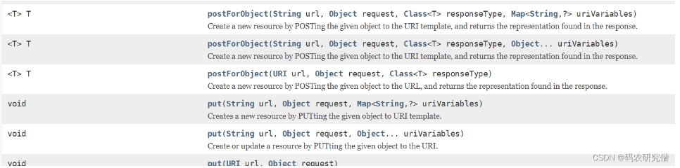

> RestTemplate默认是使用HttpURLConnection，可以通过构造方法替换底层的执行引擎，常见的引擎又HttpClient、Netty、OkHttp
>
> ```java
> //底层执行引擎
> RestTemplate template=new RestTemplate();
> 
> //底层执行引擎ClientHttp
> RestTemplate template=new RestTemplate(ClientHttpRequestFactory requestFactory);
> ```

### ge请求

#### 普通请求

```java
//getForObject方法，获取响应体，将其转换为第二个参数指定的类型
	BookDto bookDto = restTemplate.getForObject(url, BookDto.class);

//getForEntity方法，返回值为ResponseEntity类型
    // ResponseEntity中包含了响应结果中的所有信息，比如头、状态、body
    ResponseEntity<BookDto> responseEntity = restTemplate.getForEntity(url, BookDto.class);
    //状态码
    System.out.println(responseEntity.getStatusCode());
    //获取头
    System.out.println("头：" + responseEntity.getHeaders());
    //获取body
    BookDto bookDto = responseEntity.getBody();
```

```java
String url = "http://127.0.0.1:8080/rest/get";
MultiValueMap<String, String> params = new LinkedMultiValueMap<>();
params.add("name", "这是name");
params.add("id", "1");
UriComponentsBuilder builder = UriComponentsBuilder.fromHttpUrl(url);
URI uri = builder.queryParams(params).build().encode().toUri();
 
ResponseEntity<RestVO> forEntity = restTemplate.getForEntity(uri, RestVO.class);
return forEntity.getBody();

```


#### url 中含有动态参数

```java
@GetMapping("/test/get/{id}/{name}")
@ResponseBody
public BookDto get(@PathVariable("id") Integer id, @PathVariable("name") String name) {
    return new BookDto(id, name);
}
```

```java
String url = "http://localhost:8080/chat16/test/get/{id}/{name}";
Map<String, String> uriVariables = new HashMap<>();
uriVariables.put("id", "1");
uriVariables.put("name", "SpringMVC系列");
//使用getForObject或者getForEntity方法
BookDto bookDto = restTemplate.getForObject(url, BookDto.class,uriVariables);


String url = "http://localhost:8080/chat16/test/get/{id}/{name}";
Map<String, String> uriVariables = new HashMap<>();
uriVariables.put("id", "1");
uriVariables.put("name", "SpringMVC系列");
//getForEntity方法
ResponseEntity<BookDto> responseEntity = restTemplate.getForEntity(url, BookDto.class, uriVariables);
```

#### 接口返回值为泛型

```java
@GetMapping("/test/getList")
@ResponseBody
public List<BookDto> getList() {
    return Arrays.asList(
            new BookDto(1, "Spring高手系列"),
            new BookDto(2, "SpringMVC系列")
    );
}
```

```java
 //返回值为泛型
    String url = "http://localhost:8080/chat16/test/getList";
    //若返回结果是泛型类型的，需要使用到exchange方法，
    //这个方法中有个参数是ParameterizedTypeReference类型，通过这个参数类指定泛型类型
    ResponseEntity<List<BookDto>> responseEntity =
            restTemplate.exchange(url,
                    HttpMethod.GET,
                    null,
                    new ParameterizedTypeReference<List<BookDto>>() {
                    });
	List<BookDto> bookDtoList = responseEntity.getBody();
```

#### 下载小文件

```
@Test
public void test6() {
    RestTemplate restTemplate = new RestTemplate();
    String url = "http://localhost:8080/chat16/test/downFile";
    //文件比较小的情况，直接返回字节数组
    ResponseEntity<byte[]> responseEntity = restTemplate.getForEntity(url, byte[].class);
    //获取文件的内容
    byte[] body = responseEntity.getBody();
    String content = new String(body);
    System.out.println(content);
}
```

#### 下载大文件

```java
/**
 * 下载文件
 *
 * @return
 */
@GetMapping("/test/downFile")
@ResponseBody
public HttpEntity<InputStreamResource> downFile() {
    //将文件流封装为InputStreamResource对象
    InputStream inputStream = this.getClass().getResourceAsStream("/1.txt");
    InputStreamResource inputStreamResource = new InputStreamResource(inputStream);
    //设置header
    MultiValueMap<String, String> headers = new HttpHeaders();
    headers.add(HttpHeaders.CONTENT_DISPOSITION, "attachment;filename=1.txt");
    HttpEntity<InputStreamResource> httpEntity = new HttpEntity<>(inputStreamResource);
    return httpEntity;
}
```

```java

@Test
public void test7() {
    RestTemplate restTemplate = new RestTemplate();
    String url = "http://localhost:8080/chat16/test/downFile";
    /**
     * 文件比较大的时候，比如好几个G，就不能返回字节数组了，会把内存撑爆，导致OOM
     * 需要这么玩：
     * 需要使用execute方法了，这个方法中有个ResponseExtractor类型的参数，
     * restTemplate拿到结果之后，会回调{@link ResponseExtractor#extractData}这个方法，
     * 在这个方法中可以拿到响应流，然后进行处理，这个过程就是变读边处理，不会导致内存溢出
     */
    String result = restTemplate.execute(url,
            HttpMethod.GET,
            null,
            new ResponseExtractor<String>() {
                @Override
                public String extractData(ClientHttpResponse response) throws IOException {
                    System.out.println("状态："+response.getStatusCode());
                    System.out.println("头："+response.getHeaders());
                    //获取响应体流
                    InputStream body = response.getBody();
                    //处理响应体流
                    String content = IOUtils.toString(body, "UTF-8");
                    return content;
                }
            }, new HashMap<>());
 
    System.out.println(result);
}

```

#### 传递头

```java

@GetMapping("/test/header")
@ResponseBody
public Map<String, List<String>> header(HttpServletRequest request) {
    Map<String, List<String>> header = new LinkedHashMap<>();
    Enumeration<String> headerNames = request.getHeaderNames();
    while (headerNames.hasMoreElements()) {
        String name = headerNames.nextElement();
        Enumeration<String> values = request.getHeaders(name);
        List<String> list = new ArrayList<>();
        while (values.hasMoreElements()) {
            list.add(values.nextElement());
        }
        header.put(name, list);
    }
    return header;
}
```

```java
@Test
public void test8() {
    RestTemplate restTemplate = new RestTemplate();
    String url = "http://localhost:8080/chat16/test/header";
    //①：请求头放在HttpHeaders对象中
    MultiValueMap<String, String> headers = new HttpHeaders();
    headers.add("header-1", "V1");
    headers.add("header-2", "Spring");
    headers.add("header-2", "SpringBoot");
    //②：RequestEntity：请求实体，请求的所有信息都可以放在RequestEntity中，比如body部分、头、请求方式、url等信息
    RequestEntity requestEntity = new RequestEntity(
            null, //body部分数据
            headers, //头
            HttpMethod.GET,//请求方法
            URI.create(url) //地址
    );
    ResponseEntity<Map<String, List<String>>> responseEntity = restTemplate.exchange(requestEntity,
            new ParameterizedTypeReference<Map<String, List<String>>>() {
            });
    Map<String, List<String>> result = responseEntity.getBody();
    System.out.println(result);
}
```

### POST 请求

#### post 请求常见的 3 种类型

- application/x-www-form-urlencoded	页面中普通的 form 表单提交时就是这种类型，表单中的元素会按照名称和值拼接好，然后之间用&连接，格式如：p1=v1&p2=v2&p3=v3然后通过 urlencoded 编码之后丢在 body 中发送
- multipart/form-data	页面中表单上传文件的时候，用到的就是这种格式
- application/json	将发送的数据转换为 json 格式，丢在 http 请求的 body 中发送，后端接口通常用@RequestBody 配合对象来接收。

#### 普通表单请求

```java
 //①：表单信息，需要放在MultiValueMap中，MultiValueMap相当于Map<String,List<String>>
    MultiValueMap<String, String> body = new LinkedMultiValueMap<>();
    //调用add方法填充表单数据(表单名称:值)
    body.add("id","1");
    body.add("name","SpringMVC系列");
    //②：发送请求(url,请求体，返回值需要转换的类型)
    BookDto result = restTemplate.postForObject(url, body, BookDto.class);
```

携带头信息

```java
MultiValueMap<String, String> body = new LinkedMultiValueMap<>();
    //调用add方法放入表单元素(表单名称:值)
    body.add("id","1");
    body.add("name","SpringMVC系列");
    //②：请求头
    HttpHeaders headers = new HttpHeaders();
    //调用set方法放入请求头
    headers.set(HttpHeaders.CONTENT_TYPE, MediaType.APPLICATION_FORM_URLENCODED_VALUE);
    //③：请求实体：包含了请求体和请求头
    HttpEntity<MultiValueMap<String, String>> httpEntity = new HttpEntity<>(body, headers);
    //④：发送请求(url,请求实体，返回值需要转换的类型)
    BookDto result = restTemplate.postForObject(url, httpEntity, BookDto.class);
```

#### 上传本地文件

```java
@PostMapping(value = "/test/form2")
@ResponseBody
public Map<String, String> form2(@RequestParam("file1") MultipartFile file1) {
    Map<String, String> fileMetadata = new LinkedHashMap<>();
    fileMetadata.put("文件名", file1.getOriginalFilename());
    fileMetadata.put("文件类型", file1.getContentType());
    fileMetadata.put("文件大小(byte)", String.valueOf(file1.getSize()));
    return fileMetadata;
}
```

```java
 //①：表单信息，需要放在MultiValueMap中，MultiValueMap相当于Map<String,List<String>>
    MultiValueMap<String, Object> body = new LinkedMultiValueMap<>();
    //调用add方法放入表单元素(表单名称:值)
    //②：文件对应的类型，需要是org.springframework.core.io.Resource类型的，常见的有[FileSystemResource、InputStreamResource、ByteArrayResource]
    body.add("file1", new FileSystemResource(".\\src\\main\\java\\com\\javacode2018\\springmvc\\chat16\\dto\\UserDto.java"));
    //③：头
    HttpHeaders headers = new HttpHeaders();
    headers.add("header1", "v1");
    headers.add("header2", "v2");
    //④：请求实体
    RequestEntity<MultiValueMap<String, Object>> requestEntity = new RequestEntity<>(body, headers, HttpMethod.POST, URI.create(url));
    //⑤：发送请求(请求实体，返回值需要转换的类型)
    ResponseEntity<Map<String, String>> responseEntity = restTemplate.exchange(
        requestEntity,
        new ParameterizedTypeReference<Map<String, String>>() {
        });
    Map<String, String> result = responseEntity.getBody();
}
```

#### 发送 json 格式数据：传递 java 对象

```java
RestTemplate restTemplate = new RestTemplate();
    String url = "http://localhost:8080/chat16/test/form4";
    BookDto body = new BookDto(1, "SpringMVC系列");
    BookDto result = restTemplate.postForObject(url, body, BookDto.class);
```

#### 发送 json 格式数据：传递 java 对象，返回值为泛型

```java
RestTemplate restTemplate = new RestTemplate();
    String url = "http://localhost:8080/chat16/test/form5";
    //①：请求体，发送的时候会被转换为json格式数据
    List<BookDto> body = Arrays.asList(
            new BookDto(1, "SpringMVC系列"),
            new BookDto(2, "MySQL系列"));
    //②：头
    HttpHeaders headers = new HttpHeaders();
    headers.add("header1", "v1");
    headers.add("header2", "v2");
    //③：请求实体
    RequestEntity requestEntity = new RequestEntity(body, headers, HttpMethod.POST, URI.create(url));
    //④：发送请求(请求实体，返回值需要转换的类型)
    ResponseEntity<List<BookDto>> responseEntity = restTemplate.exchange(
            requestEntity,
            new ParameterizedTypeReference<List<BookDto>>() {
            });
    //⑤：获取结果
    List<BookDto> result = responseEntity.getBody();
```

#### 发送 json 字符串格式数据

```java
String url = "http://localhost:8080/chat16/test/form5";
    //①：请求体为一个json格式的字符串
    String body = "[{\"id\":1,\"name\":\"SpringMVC系列\"},{\"id\":2,\"name\":\"MySQL系列\"}]";
    /**
     * ②：若请求体为json字符串的时候，需要在头中设置Content-Type=application/json；
     * 若body是普通的java类的时候，无需指定这个，RestTemplate默认自动配上Content-Type=application/json
     */
    HttpHeaders headers = new HttpHeaders();
    headers.setContentType(MediaType.APPLICATION_JSON);
    //③：请求实体（body，头、请求方式，uri）
    RequestEntity requestEntity = new RequestEntity(body, headers, HttpMethod.POST, URI.create(url));
    //④：发送请求(请求实体，返回值需要转换的类型)
    ResponseEntity<List<BookDto>> responseEntity = restTemplate.exchange(
            requestEntity,
            new ParameterizedTypeReference<List<BookDto>>() {
            });
    //⑤：获取结果

```

```java
public void postRequest(String url) {
        // 设置超时时间
        SimpleClientHttpRequestFactory requestFactory = new SimpleClientHttpRequestFactory();
        requestFactory.setReadTimeout(30 * 1000);
        requestFactory.setConnectTimeout(30 * 1000);
        RestTemplate restTemplate = new RestTemplate(requestFactory);


        HttpHeaders headers = new HttpHeaders();
        headers.setContentType(MediaType.APPLICATION_JSON);
        // 组装body参数
        Map body = new HashMap();
        body.put("1", "1");
        body.put("2", "2");

        // 将map转为json串，放入restTemplate的参数对象中
        String bodyJsonData = JSON.toJSONString(body);
        HttpEntity<String> request = new HttpEntity<>(bodyJsonData, headers);

        // 组装url参数 ?username=zhangsan&age=20&sex=男
        MultiValueMap<String, String> queryMap = new LinkedMultiValueMap<>();
        queryMap.add("username", "zhangsan");
        queryMap.add("age", "20");
        queryMap.add("sex", "男");

        // 将参数拼入请求url中
        UriComponentsBuilder builder = UriComponentsBuilder.fromHttpUrl(url).queryParams(queryMap);
        // 发起请求
        ResponseEntity<JSONObject> responseEntity = restTemplate.postForEntity(builder.toUriString(), request, JSONObject.class);
        System.out.println(builder.toUriString());
        System.out.println(responseEntity);
    }

```


### DELETE、PUT、OPTION 请求

#### DELETE 请求

```java
public void delete(String url, Object... uriVariables);
public void delete(String url, Map<String, ?> uriVariables);
public void delete(URI url);
```

#### PUT 请求

```
PUT 请求和 POST 请求类似，将类型改为 PUT 就可以了。
```

#### OPTIONS 请求

```java
OPTIONS 请求用来探测接口支持哪些 http 方法
```

```java
public Set<HttpMethod> optionsForAllow(String url, Object... uriVariables);
public Set<HttpMethod> optionsForAllow(String url, Map<String, ?> uriVariables);
public Set<HttpMethod> optionsForAllow(URI url);
```

### 集成 HttpClient

> RestTemplate 内部默认用的是 jdk 自带的 HttpURLConnection 发送请求的，性能上面并不是太突出。
>
> 可以将其替换为 httpclient 或者 okhttp。

#### 依赖

```xml
<dependency>
    <groupId>org.apache.httpcomponents</groupId>
    <artifactId>httpclient</artifactId>
    <version>4.5.7</version>
</dependency>
```

#### 指定 HttpClient 配置

```java
public HttpClient httpClient() {
    HttpClientBuilder httpClientBuilder = HttpClientBuilder.create();
    try {
        //设置信任ssl访问
        SSLContext sslContext = new SSLContextBuilder().loadTrustMaterial(null, (arg0, arg1) -> true).build();
        httpClientBuilder.setSSLContext(sslContext);
        HostnameVerifier hostnameVerifier = NoopHostnameVerifier.INSTANCE;
        SSLConnectionSocketFactory sslConnectionSocketFactory = new SSLConnectionSocketFactory(sslContext, hostnameVerifier);
        Registry<ConnectionSocketFactory> socketFactoryRegistry = RegistryBuilder.<ConnectionSocketFactory>create()
                // 注册http和https请求
                .register("http", PlainConnectionSocketFactory.getSocketFactory())
                .register("https", sslConnectionSocketFactory).build();
 
        //使用Httpclient连接池的方式配置(推荐)，同时支持netty，okHttp以及其他http框架
        PoolingHttpClientConnectionManager poolingHttpClientConnectionManager = new PoolingHttpClientConnectionManager(socketFactoryRegistry);
        // 最大连接数
        poolingHttpClientConnectionManager.setMaxTotal(1000);
        // 同路由并发数
        poolingHttpClientConnectionManager.setDefaultMaxPerRoute(100);
        //配置连接池
        httpClientBuilder.setConnectionManager(poolingHttpClientConnectionManager);
        // 重试次数
        httpClientBuilder.setRetryHandler(new DefaultHttpRequestRetryHandler(0, true));
        //设置默认请求头
        List<Header> headers = new ArrayList<>();
        httpClientBuilder.setDefaultHeaders(headers);
        return httpClientBuilder.build();
    } catch (Exception e) {
        throw new RuntimeException(e);
    }
}
 
public ClientHttpRequestFactory clientHttpRequestFactory() {
    HttpComponentsClientHttpRequestFactory clientHttpRequestFactory = new HttpComponentsClientHttpRequestFactory(httpClient());
    // 连接超时(毫秒)，这里设置10秒
    clientHttpRequestFactory.setConnectTimeout(10 * 1000);
    // 数据读取超时时间(毫秒)，这里设置60秒
    clientHttpRequestFactory.setReadTimeout(60 * 1000);
    // 从连接池获取请求连接的超时时间(毫秒)，不宜过长，必须设置，比如连接不够用时，时间过长将是灾难性的
    clientHttpRequestFactory.setConnectionRequestTimeout(10 * 1000);
    return clientHttpRequestFactory;
}
 
public RestTemplate restTemplate(){
    //创建RestTemplate的时候，指定ClientHttpRequestFactory
    return new RestTemplate(this.clientHttpRequestFactory());
}
 
@Test
public void test18() {
    RestTemplate restTemplate = this.restTemplate();
    String url = "http://localhost:8080/chat16/test/get";
    //getForObject方法，获取响应体，将其转换为第二个参数指定的类型
    BookDto bookDto = restTemplate.getForObject(url, BookDto.class);
    System.out.println(bookDto);
}
```

#### 集成 okhttp

```xml
<dependency>
    <groupId>com.squareup.okhttp3</groupId>
    <artifactId>okhttp</artifactId>
    <version>4.3.1</version>
</dependency>
```

```java
new RestTemplate(new OkHttp3ClientHttpRequestFactory());
```

## SpringSecurtiy

### 前置

#### 依赖

```java
<dependency>
     <groupId>org.springframework.boot</groupId>
     <artifactId>spring-boot-starter-web</artifactId>
</dependency>
```

#### 概念

> 主体

英文单词：principal
使用系统的用户或设备或从其他系统远程登录的用户等等。简单说就是谁使用系
统谁就是主体。

> 认证

英文单词：authentication
权限管理系统确认一个主体的身份，允许主体进入系统。简单说就是“主体”证明自己是谁。笼统的认为就是以前所做的登录操作。

> 授权

英文单词：authorization
将操作系统的“权力”“授予”“主体”，这样主体就具备了操作系统中特定功能的能力。


#### 模块


### 原理

> 本质是一个 过滤器链

#### FilterSecurityInterceptor：

是一个方法级的权限过滤器, 基本位于过滤链的最底部。

super.beforeInvocation(fi) 表示查看之前的 filter 是否通过。
fi.getChain().doFilter(fi.getRequest(), fi.getResponse());表示真正的调用后台的服务。

#### ExceptionTranslationFilter

是个异常过滤器，用来处理在认证授权过程中抛出的异常

#### UsernamePasswordAuthenticationFilter 

对/login 的 POST 请求做拦截，校验表单中用户
名，密码。

#### **UserDetailsService**

而在实际项目中账号和密码都是从数据库中查询出来的。 所以我们要通过自定义逻辑控制认证逻辑如果需要自定义逻辑时，只需要实现 UserDetailsService 接口即可

```java
public interface UserDetailsService {
    UserDetails loadUserByUsername(String var1) throws UsernameNotFoundException;
}
```

#### **UserDetails**

这个类是系统默认的用户“主体”

```java
// 表示获取登录用户所有权限
Collection<? extends GrantedAuthority> getAuthorities();
// 表示获取密码
String getPassword();
// 表示获取用户名
String getUsername();
// 表示判断账户是否过期
boolean isAccountNonExpired();
// 表示判断账户是否被锁定
boolean isAccountNonLocked();
// 表示凭证{密码}是否过期
boolean isCredentialsNonExpired();
// 表示当前用户是否可用
boolean isEnabled();
```

#### **PasswordEncoder** 

密码加密

```java
// 表示把参数按照特定的解析规则进行解析
String encode(CharSequence rawPassword);
// 表示验证从存储中获取的编码密码与编码后提交的原始密码是否匹配。如果密码匹配，则返回 true；如果不匹配，则返回 false。第一个参数表示需要被解析的密码。第二个参数表示存储的密码。
boolean matches(CharSequence rawPassword, String encodedPassword);
// 表示如果解析的密码能够再次进行解析且达到更安全的结果则返回 true，否则返回false。默认返回 false。
default boolean upgradeEncoding(String encodedPassword) {
	return false;
}
```

#### **BCryptPasswordEncoder**

`密码解析器`

PasswordEncoder 实现类 用于密码解析

```java
@Test
public void test01(){
    //创建密码解析器
    BCryptPasswordEncoder bCryptPasswordEncoder = new
    BCryptPasswordEncoder();
    //对密码进行加密
    String atguigu = bCryptPasswordEncoder.encode("atguigu");
    //打印加密之后的数据
    System.out.println("加密之后数据：\t"+atguigu);
    //判断原字符加密后和加密之前是否匹配
    boolean result = bCryptPasswordEncoder.matches("atguigu", atguigu);
    //打印比较结果
    System.out.println("比较结果：\t"+result);
}
```


## 整合框架

### Mybaits

#### 依赖

```xml
<dependency>
   <groupId>com.oracle</groupId>
   <artifactId>ojdbc8</artifactId>
   <version>8</version>
</dependency>
<!--连接池-->
<dependency>
    <groupId>com.alibaba</groupId>
    <artifactId>druid</artifactId>
    <version>1.2.10</version>
</dependency>
<dependency>
    <groupId>org.springframework</groupId>
    <artifactId>spring-jdbc</artifactId>
    <version>5.1.9.RELEASE</version>
</dependency>
    <!--mybatis-->
    <dependency>
    <groupId>org.mybatis</groupId>
    <artifactId>mybatis</artifactId>
    <version>3.4.6</version>
</dependency>
<dependency>
    <groupId>org.mybatis</groupId>
    <artifactId>mybatis-spring</artifactId>
    <version>1.3.2</version>
</dependency>
```

准备

sql文件

```xml
<?xml version="1.0" encoding="utf-8"?>
<!DOCTYPE mapper PUBLIC "-//mybatis.org//DTD Mapper 3.0//EN"
        "http://mybatis.org/dtd/mybatis-3-mapper.dtd">
<mapper namespace="com.fuhao.dao.TeacherDao">


    <insert id="inter" parameterType="com.fuhao.bean.Teacher">
        insert into teacher(name, age, salary) values(#{name},#{age},#{salary})
    </insert>
</mapper>
```


#### 配置文件

mybatis步骤

```java
public static void main(String[] args) throws IOException {
        //1. 加载mybatis的核心配置文件，获取 SqlSessionFactory
        String resource = "mybatis-config.xml";
        InputStream inputStream = Resources.getResourceAsStream(resource);
        SqlSessionFactory sqlSessionFactory = new SqlSessionFactoryBuilder().build(inputStream);

        //2. 获取SqlSession对象，用它来执行sql
        SqlSession sqlSession = sqlSessionFactory.openSession();
        //3. 执行sql
        List<User> users = sqlSession.selectList("test.selectAll"); //参数是一个字符串，该字符串必须是映射配置文件的namespace.id
        System.out.println(users);
        //4. 释放资源
        sqlSession.close();
    }
```

##### spring-dao.xml

dataSource.properties

```properties
jdbc.driverClassName=oracle.jdbc.OracleDriver
jdbc.url=jdbc:oracle:thin:@127.0.0.1:1521:XE
jdbc.username=briup
jdbc.password=briup
```

> xmlns:tx="http://www.springframework.org/schema/tx"
>
> http://www.springframework.org/schema/tx
>  http://www.springframework.org/schema/tx/spring-tx.xsd

```xml
<?xml version="1.0" encoding="UTF-8"?>
<beans xmlns="http://www.springframework.org/schema/beans"
       xmlns:xsi="http://www.w3.org/2001/XMLSchema-instance"
       xmlns:aop="http://www.springframework.org/schema/aop"
       xmlns:context="http://www.springframework.org/schema/context"
       xmlns:tx="http://www.springframework.org/schema/tx"
       xsi:schemaLocation="http://www.springframework.org/schema/beans
 http://www.springframework.org/schema/beans/spring-beans.xsd
 http://www.springframework.org/schema/tx
 http://www.springframework.org/schema/tx/spring-tx.xsd
 http://www.springframework.org/schema/aop
 http://www.springframework.org/schema/aop/spring-aop.xsd
 http://www.springframework.org/schema/context
 http://www.springframework.org/schema/context/spring-context.xsd">

    <!-- 读取properties资源⽂件内容 -->
    <context:property-placeholder location="classpath:dataSource.properties" />

    <!-- 配置数据库连接池 -->
    <bean name="dataSource" class="com.alibaba.druid.pool.DruidDataSource">
        <!-- 注⼊数据库连接属性 -->
        <property name="driverClassName" value="${jdbc.driverClassName}"></property>
        <property name="url" value="${jdbc.url}"></property>
        <property name="username" value="${jdbc.username}"></property>
        <property name="password" value="${jdbc.password}"></property>
    </bean>

    <!-- 配置sqlSessionFactory -->
    <bean name="sqlSessionFactory" class="org.mybatis.spring.SqlSessionFactoryBean">
        <!-- 注⼊数据源 -->
        <property name="dataSource" ref="dataSource"></property>
        <!-- 配置别名 -->
        <property name="typeAliasesPackage" value="com.briup.bean"></property>
        <!-- 配置sql映射⽂件路径，⽀持通配符 -->
        <property name="mapperLocations" value="classpath:com/briup/mapper/*Mapper.xml">
        </property>
    </bean>

    <!--Mapper 一次只能生成一个接口文件-->
    <bean class="org.mybatis.spring.mapper.MapperFactoryBean">
    	<property name="mapperInterface" value=""
    </bean>
    <!-- 配置映射接⼝所在位置 -->
    <!-- 如果没有指定bean的名字，默认为小写开头的类名 -->
    <bean class="org.mybatis.spring.mapper.MapperScannerConfigurer">
        <property name="basePackage" value="com.briup.dao"></property>
    </bean>

</beans>
```

配置mybaits-congfig.xml⽂件，然后再让spring去读取这个⽂件：

```xml
<!-- 配置sqlSessionFactory -->
<bean name="sqlSessionFactory" class="org.mybatis.spring.SqlSessionFactoryBean">
<!-- 注⼊数据源 -->
<property name="dataSource" ref="dataSource"></property>
<!-- 配置读取外部的mybatis-config.xml⽂件 -->
<property name="configLocation" value="mybatis-config.xml"></property>
</bean>
```

##### spring-service.xml

```xml
<?xml version="1.0" encoding="UTF-8"?>
<beans xmlns="http://www.springframework.org/schema/beans"
       xmlns:xsi="http://www.w3.org/2001/XMLSchema-instance"
       xmlns:aop="http://www.springframework.org/schema/aop"
       xmlns:tx="http://www.springframework.org/schema/tx"
       xsi:schemaLocation="http://www.springframework.org/schema/beans
 http://www.springframework.org/schema/beans/spring-beans.xsd
 http://www.springframework.org/schema/tx
 http://www.springframework.org/schema/tx/spring-tx.xsd
 http://www.springframework.org/schema/aop
 http://www.springframework.org/schema/aop/spring-aop.xsd">


    <!-- 配置Service -->
    <bean name="teacherService" class="com.briup.service.impl.TeacherServiceImpl">
        <!-- 注⼊dao层实现类 -->
        <property name="teacherDao" ref="ITeacherDao"></property>
    </bean>
    
    <!-- 配置事务管理器 切面类-->
 	<bean name="transactionManager" class="org.springframework.jdbc.datasource.DataSourceTransactionManager">
 		<!-- 注⼊数据源 -->
 		<property name="dataSource" ref="dataSource"></property>
 	</bean>
 
 	<!-- 配置事务拦截器 属性-->
 	<tx:advice id="txAdvice" transaction-manager="transactionManager">
 		<!-- 配置事务属性 -->
 		<tx:attributes>
 			<tx:method name="find*" read-only="true" propagation="SUPPORTS"/>
 			<tx:method name="*" propagation="REQUIRED" rollback-for="Exception"/>
 		</tx:attributes>
 	</tx:advice>
    
    <!-- 配置 aop -->
 	<aop:config>
 		<!-- 定义切⼊点（⼀组⽅法的集合，这些⽅法需要织⼊事务控制代码） -->
 		<aop:pointcut expression="execution(* com.briup.service..*.*(..))" id="txPointcut"/>
 		<!-- 定义advisor，可以⽤来组合已有的advice和pointcut -->
 		<aop:advisor advice-ref="txAdvice" pointcut-ref="txPointcut"/>
 	</aop:config>
    
    

</beans>
```

#####  applicationContext.xml

```xml
<?xml version="1.0" encoding="UTF-8"?>
<beans xmlns="http://www.springframework.org/schema/beans"
		xmlns:xsi="http://www.w3.org/2001/XMLSchema-instance"
 		xmlns:aop="http://www.springframework.org/schema/aop"
 		xmlns:tx="http://www.springframework.org/schema/tx"
 		xsi:schemaLocation="http://www.springframework.org/schema/beans
 					http://www.springframework.org/schema/beans/spring-beans.xsd
 					http://www.springframework.org/schema/tx
 					http://www.springframework.org/schema/tx/spring-tx.xsd
 					http://www.springframework.org/schema/aop
 					http://www.springframework.org/schema/aop/spring-aop.xsd">
 
 	<import resource="spring-dao.xml"/>
 	<import resource="spring-service.xml"/>
 
</beans>
```

这⾥导⼊spring的另外俩个配置⽂件，将来读取这⼀个配置⽂件即可

```java
@ExtendWith(SpringExtension.class)
@ContextConfiguration(locations = "classpath:applicationContext.xml")
public class service {

    @Autowired
    private TeacherServiceImpl teacherService;

    @Test
    public void test(){
        System.out.println(teacherService);
    }
}
```

#### 注解

```java
@Transactional(propagation = Propagation.REQUIRED,rollbackFor = Exception.class)
@Service
public class TeacherServiceImpl implements ITeacherService{
 
 	@Autowired
 	private ITeacherDao teacherDao;
 
    @Transactional(propagation = Propagation.REQUIRED,rollbackFor = Exception.class)
    
 	public void save(Teacher t) {
 		teacherDao.insertTeacher(t);
 	}
}
```

##### MybatisConfig.java

```java
@Configuration
@PropertySource("classpath:dataSource.properties")//读取资源⽂件
@MapperScan("com.briup.dao")//指定扫描映射接⼝的位置
public class MybatisConfig {
 	@Value("${jdbc.driverClassName}")
 	private String driverClassName;
 	@Value("${jdbc.url}")
 	private String url;
 	@Value("${jdbc.username}")
 	private String username;
 	@Value("${jdbc.password}")
 	private String password;
 
 	/**
 	* 配置数据源dataSource
 	*/
 	@Bean
 	public DataSource dataSource() {
 		DruidDataSource dataSource = new DruidDataSource();
 		dataSource.setDriverClassName(driverClassName);
 		dataSource.setUrl(url);
 		dataSource.setUsername(username);
 		dataSource.setPassword(password);
 		dataSource.setInitialSize(5);
 		dataSource.setMaxActive(10);
 		return dataSource;
 	}
 
 	/**
 	* 配置SqlSessionFactoryBean，⽤来产⽣SqlSessionFactory，从⽽获取SqlSession
 	*/
    @Bean
	public SqlSessionFactoryBean sqlSessionFactoryBean() throws IOException{
		//创建SqlSessionFactoryBean对象
		SqlSessionFactoryBean sqlSessionFactoryBean = new SqlSessionFactoryBean();
		//注⼊数据源
		sqlSessionFactoryBean.setDataSource(dataSource());
		//配置别名
		sqlSessionFactoryBean.setTypeAliasesPackage("com.briup.bean");
        
        //配置sql映射⽂件路径，⽀持通配符
		//注意，这⾥调⽤的是getResources()⽅法，⽽不是getResource()⽅法
        
        //资源解析器，⽤来读取指定位置的xml映射⽂件
		ResourcePatternResolver resourcePatternResolver = new PathMatchingResourcePatternResolver(); 
        Resource[] resources = new Resource[0];
        try {
            resources =  resourcePatternResolver.getResources("classpath:mapper/**/*Dao.xml");
        } catch (IOException e) {
            e.printStackTrace();
        }
		
		sqlSessionFactoryBean.setMapperLocations(resources);
		return sqlSessionFactoryBean;
 	}
    
    /**
 	* 配置JDBC的事务管理器（Mybaits通⽤）
 	*/
 	@Bean
 	public PlatformTransactionManager transactionManager() {
 		DataSourceTransactionManager transactionManager = new DataSourceTransactionManager();
 		transactionManager.setDataSource(dataSource());
 		return transactionManager;
 	}
    
 

}
```

##### SpringConfig.java

```java
@Configuration
@ComponentScan("com.fuhao.service")//指定需要扫描的包及其⼦包
@EnableTransactionManagement//开启事务配置的注解⽀持
public class SpringConfig {
 
}
```

- 指定要扫描的映射接⼝所在包
- 配置数据源
- 配置事务管理器
- 配置SqlSessionFactoryBean（核⼼）

### web

- 

#### 依赖

```xml
<!--整合web需要的依赖-->
<dependency>
	<groupId>javax.servlet</groupId>
	<artifactId>javax.servlet-api</artifactId>
	<version>3.1.0</version>
</dependency>
<dependency>
	<groupId>org.springframework</groupId>
	<artifactId>spring-web</artifactId>
	<version>5.1.9.RELEASE</version>
</dependency>
```

#### web.xml 

```xml
<?xml version="1.0" encoding="UTF-8"?>
<web-app xmlns:xsi="http://www.w3.org/2001/XMLSchema-instance"
 	xmlns="http://xmlns.jcp.org/xml/ns/javaee"
 	xsi:schemaLocation="http://xmlns.jcp.org/xml/ns/javaee 			http://xmlns.jcp.org/xml/ns/javaee/webapp_3_1.xsd"
 	version="3.1">
 
 	<!--配置spring⽂件的加载路径-->
	<context-param>
		<param-name>contextConfigLocation</param-name>
		<param-value>classpath:applicationContext.xml</param-value>
    </context-param>
            
	<!-- 配置监听器，读取配置⽂件，创建spring容器 -->
	<listener>
		<listenerclass>org.springframework.web.context.ContextLoaderListener</listener-class>
	</listener>
</web-app>
```

servlet

```java
@WebServlet(value="/test",loadOnStartup = 1)
public class TestServlet extends HttpServlet{
 	private static final long serialVersionUID = 1L;
 
 	private ITeacherService teacherService;
 
 	@Override
 	public void init() throws ServletException {
 		//获取spring容器，进⾏初始化
 		WebApplicationContext ac =
WebApplicationContextUtils.getWebApplicationContext(this.getServletContext());
 		teacherService = ac.getBean(ITeacherService.class);
 	}
 
 	@Override
 	protected void doGet(HttpServletRequest req, HttpServletResponse resp) throws ServletException, IOException {
    Teacher t = new Teacher();
	 t.setName("tom");
 	t.setAge(20);
 	t.setSalary(5000);
 	teacherService.save(t);
 
 	resp.setContentType("text/plain;charset=utf-8");
 
 	PrintWriter out = resp.getWriter();
 
 	out.println("操作成功！");
 
 	}
 
}
```

#### 注解

servlet

```java
@WebServlet(value="/test",loadOnStartup = 1)
public class TestServlet extends HttpServlet{
 	private static final long serialVersionUID = 1L;
 
 	@Autowired
 	private ITeacherService teacherService;
 
 	@Override
 	public void init() throws ServletException {
 		//获取spring容器，进⾏初始化
 		WebApplicationContext ac =WebApplicationContextUtils.getWebApplicationContext(this.getServletContext());
 		//通过Spring容器获取AutowireCapableBeanFactory
 		//AutowireCapableBeanFactory可以让容器外的bean使⽤依赖注⼊
        //开启自动装配注解
 		AutowireCapableBeanFactory autowireCapableBeanFactory = ac.getAutowireCapableBeanFactory();
 		autowireCapableBeanFactory.autowireBean(this);
 }
 
 	@Override
 	protected void doGet(HttpServletRequest req, HttpServletResponse resp) throws ServletException, IOException {
 
 		Teacher t = new Teacher();
 		t.setName("tom");
 		t.setAge(20);
 		t.setSalary(5000);
 		teacherService.save(t);
 
 		resp.setContentType("text/plain;charset=utf-8");
 
 		PrintWriter out = resp.getWriter();
 
 		out.println("操作成功！"); 
 
 }
 
}
```

web.xml

```xml
<?xml version="1.0" encoding="UTF-8"?>
<web-app xmlns="http://xmlns.jcp.org/xml/ns/javaee"
		 xmlns:xsi="http://www.w3.org/2001/XMLSchema-instance"
		 xsi:schemaLocation="http://xmlns.jcp.org/xml/ns/javaee
			http://xmlns.jcp.org/xml/ns/javaee/web-app_4_0.xsd"
		 version="4.0">
		<!--xml 配置监听器 项⽬⼀启动加载配置⽂件并创建容器-->
		<listener>
			<listener-class>org.springframework.web.context.ContextLoaderListener</listener-class>
		</listener>
		<!--加载spring的配置⽂件-->
		<!-- <context-param>-->
		<!-- <param-name>contextConfigLocation</param-name>-->
		<!-- <param-value>classpath:applicaitonContext.xml</param-value>-->
		<!-- </context-param>-->
		<!--配置Spring专⻔读取注解和配置类的容器类型-->
		<context-param>
			<param-name>contextClass</param-name>
			<paramvalue>org.springframework.web.context.support.AnnotationConfigWebApplicationContext</paramvalue>
		</context-param>
		<!--配置⾃定义的spring配置类（全限定名） -->
		<context-param>
			<param-name>contextConfigLocation</param-name>
			<param-value>com.briup.spring.config.SpringConfig</param-value>
		</context-param>
</web-app>
```

### SSM

#### xml

#### 注解

bean

```java
@Data
@Component
public class User implements Serializable {
    /**
     * 用户名id
     */
    private Integer id;

    /**
     * 用户名
     */
    private String username;

    /**
     * 联系人
     */
    private String linkman;

    /**
     * 电话
     */
    private String phone;

    /**
     * 邮箱
     */
    private String 邮箱;

    /**
     * 加入日期
     */
    private Date adddate;

    private static final long serialVersionUID = 1L;
}
```

dao

```java
public interface UserDao {
    long countByExample(UserExample example);

    int deleteByExample(UserExample example);

    int deleteByPrimaryKey(Integer id);

    int insert(User record);

    int insertSelective(User record);

    List<User> selectByExample(UserExample example);

    User selectByPrimaryKey(Integer id);

    int updateByExampleSelective(@Param("record") User record, @Param("example") UserExample example);

    int updateByExample(@Param("record") User record, @Param("example") UserExample example);

    int updateByPrimaryKeySelective(User record);

    int updateByPrimaryKey(User record);
}
```

service

```java
@Service
public class UserServiceImpl implements UserService {

    @Autowired
    private UserDao userDao;


    @Override
    public boolean cleckUser(User user) {
        String username = user.getUsername();
        String phone = user.getPhone();
        UserExample userExample = new UserExample();
        userExample.createCriteria().andUsernameEqualTo(username).andPhoneEqualTo(phone);
        List<User> users = userDao.selectByExample(userExample);
        if (users.size()!=0){
            return true;
        }
        return false;
    }

    @Override
    public List<User> selectAll() {
        UserExample userExample = new UserExample();
        List<User> users = userDao.selectByExample(userExample);
        return users;
    }

    @Override
    public void insterUser(User user) {
        userDao.insert(user);
    }

    @Override
    public void deleteUserById(Integer id) {

    }
}
```

web

```java
@Controller
public class UserController {

    @Autowired
    private UserService userService;

    @RequestMapping("/login")
    public String login(String username, String phone, Writer writer){
        User user = new User();
        user.setUsername(username);
        user.setPhone(phone);
        boolean b = userService.cleckUser(user);
        if (b){
            return "forward:/showuser";
        }else {
            try {
                writer.write("错误");
            } catch (IOException e) {
                e.printStackTrace();
            }
        }
        return "erro";
    }

    @RequestMapping("/showuser")
    public String showuser(Model model){
        List<User> users = userService.selectAll();
        model.addAttribute("users",users);
        return "showuser";
    }

    @RequestMapping("/adduser")
    public String adduser(User user){
        user.setAdddate(new Date());
        userService.insterUser(user);
        return "forward:/showuser";
    }

}
```

> xml

spring-dao.xml

```

```

# Nginx

## 简介

Nginx (engine x) 是一个高性能的HTTP和反向代理web服务器，同时也提供了IMAP/POP3/SMTP服务。

- 反向代理
- 正向代理


### 负载均衡

负载均衡（Load Balance）其意思就是分摊到多个操作单元上进行执行，例如Web服务器、FTP服务器、企业关键应用服务器和其它关键任务服务器等，从而共同完成工作任务

Nginx给出来三种关于负载均衡的方式：

- 轮询法（默认方法）：

  每个请求按时间顺序逐一分配到不同的后端服务器，如果后端服务器down掉，能自动剔除。适合服务器配置相当，无状态且短平快的服务使用。也适用于图片服务器集群和纯静态页面服务器集群。

- weight权重模式（加权轮询）：

  指定轮询几率，weight和访问比率成正比，用于后端服务器性能不均的情况。

  这种方式比较灵活，当后端服务器性能存在差异的时候，通过配置权重，可以让服务器的性能得到充分发挥，有效利用资源。weight和访问比率成正比，用于后端服务器性能不均的情况。权重越高，在被访问的概率越大

- ip_hash：

  上述方式存在一个问题就是说，在负载均衡系统中，假如用户在某台服务器上登录了，那么该用户第二次请求的时候，因为我们是负载均衡系统，每次请求都会重新定位到服务器集群中的某一个，那么已经登录某一个服务器的用户再重新定位到另一个服务器，其登录信息将会丢失，这样显然是不妥的。

  我们可以采用ip_hash指令解决这个问题，如果客户已经访问了某个服务器，当用户再次访问时，会将该请求通过哈希算法，自动定位到该服务器。每个请求按访问ip的hash结果分配，这样每个访客固定访问一个后端服务器，可以解决session的问题。

### Nginx的动静分离！

Nginx的静态处理能力很强，但是动态处理能力不足，因此，在企业中常用动静分离技术。动静分离技术其实是采用代理的方式，在server{}段中加入带正则匹配的location来指定匹配项针对PHP的动静分离：静态页面交给Nginx处理，动态页面交给PHP-FPM模块或Apache处理。在Nginx的配置中，是通过location配置段配合正则匹配实现静态与动态页面的不同处理方式
目前，通过使用Nginx大大提高了网站的响应速度，优化了用户体验，让网站的健壮性更上一层楼！

### 下载

[官网下载点我](http://nginx.org/en/download.html)

### 启动

启动方式一：双击nginx.exe，双击后你能看见一个小黑窗口一闪而过。
启动方式二：打开cmd命令窗口，切换到nginx解压目录下，输入命令 nginx.exe ，回车即可

## 命令

### 常用命令

```nginx
#查看版本号
./nginx -v

#启动nginx
./nginx

#关闭nginx
./nginx -s stop

#重新加载nginx
./naginx -s reload

```


## 配置

### 基本配置

```nginx
#全局配置

#运行 Nginx 服务器的用户（组）
#允许生成的 worker process 数    worker_processes 值越大，可以支持的并发处理量也越多，但是 会受到硬件、软件等设备的制约。
#进程 PID 存放路径
#日志存放路径和类型以 
#及配置文件的引入

worker_processes  1;

events {
    #主要影响 Nginx 服务器与用户的网络连接，

    #常用的设置包括是否开启对多 work process 下的网络连接进行序列化，
    #是否 允许同时接收多个网络连接，
    #选取哪种事件驱动模型来处理连接请求，
    #每个 word process 可以同时支持的最大连接数等。'

    worker_connections  1024;
}


http {
    #文件引入
    #MIME-TYPE 定义
    #日志自定义
    #连接超时时间
    #单链接请求数上限

    include       mime.types;
    default_type  application/octet-stream;

    sendfile        on;
    keepalive_timeout  65;


    #负载均衡
    #轮询（默认）
    #权重（ server 208.208.128.122:8081 weight=10; ）
    #ip_hash(ip_hash;                     
    #        server 208.208.128.122:8081 ;)ip 的 hash 结果分配，这样每个访客固定访问一个后端服务器
    #fair(按后端服务器的响应时间来分配请求，响应时间短的优先分配。)
    upstream myserver{
        server 127.0.0.1:8081;
        server 127.0.0.1:8081;
    }

    server {
        #http 块可以包括多个 server 块，而每个 server 块就相当于一个虚拟主机
        #本虚拟机主机的监听配置和本虚拟主机的名称或IP配置。

        listen       80;
        server_name  localhost;

        location / {
            #这块的主要作用是基于 Nginx 服务器接收到的请求字符串（例如 server_name/ri-string），
            #对虚拟主机名称 （也可以是IP 别名）之外的字符串（例如 前面的 uri-string）进行匹配，对特定的请求进行处理。 
            #地址定向、数据缓存和应答控制等功能，还有许多第三方模块的配置也在这里进行。

            root   html;
            proxy_pass http：//127.0.0.1:8081
            index  index.html index.htm;
        }

        location ~ /vod/{
            #这块的主要作用是基于 Nginx 服务器接收到的请求字符串（例如 server_name/ri-string），
            #对虚拟主机名称 （也可以是IP 别名）之外的字符串（例如 前面的 uri-string）进行匹配，对特定的请求进行处理。 
            #地址定向、数据缓存和应答控制等功能，还有许多第三方模块的配置也在这里进行。

            root   html;
            proxy_pass http：//127.0.0.1:8082
            index  index.html index.htm;
        }

    
        error_page   500 502 503 504  /50x.html;

        location = /50x.html {
            root   html;
        }
    }


}
```


# 分布式相关概念

## 大型互联网项目架构目标	

### 用户体验

美观、功能、速度、稳定性

### 衡量一个网站速度是否快：

打开一个新页面一瞬间完成；页面内跳转，一刹那间完成。

> 经过周密的计算，一瞬间为0.36 秒,一刹那有 0.018 

### 特点

- 用户多
- 流量大，并发高
- 海量数据
- 易受攻击
- 功能繁琐
- 变更快

### 衡量网站的性能指标：

响应时间：指执行一个请求从开始到最后收到响应数据所花费的总体时间。

并发数：指系统同时能处理的请求数量。

- 并发连接数：指的是客户端向服务器发起请求，并建立了TCP连接。每秒钟服务器连接的总TCP数量

- 请求数：也称为QPS(Query Per Second) 指每秒多少请求.

- 并发用户数：单位时间内有多少用户

吞吐量：指单位时间内系统能处理的请求数量。

- QPS：Query Per Second 每秒查询数。 

- TPS：Transactions Per Second 每秒事务数。 

- 一个事务是指一个客户机向服务器发送请求然后服务器做出反应的过程。客户机在发送请求时开始计时，收到服务器响应后结束计时，以此来计算使用的时间和完成的事务个数。

- 一个页面的一次访问，只会形成一个TPS；但一次页面请求，可能产生多次对服务器的请求，就会有多个QPS

- 高性能：提供快速的访问体验。
- 高可用：网站服务一直可以正常访问。
- 可伸缩：通过硬件增加/减少，提高/降低处理能力。
- 高可扩展：系统间耦合低，方便的通过新增/移除方式，增加/减少新的功能/模块。 
- 安全性：提供网站安全访问和数据加密，安全存储等策略。
- 敏捷性：随需应变，快速响应。

## 集群和分布式

- 集群：很多“人”一起 ，干一样的事。 
- 分布式：很多“人”一起，干不一样的事。这些不一样的事，合起来是一件大事。 


### 集群


### 集群和分布式


## 架构演进


### 单体架构

优点：

- 简单：开发部署都很方便，小型项目首选

缺点：

- 项目启动慢
- 可靠性差
- 可伸缩性差
- 扩展性和可维护性差
- 性能低

### 垂直架构

垂直架构是指将单体架构中的多个模块拆分为多个独立的项目。形成多个独立的单体架构。

单体架构存在的问题：

- 项目启动慢
- 可靠性差
- 可伸缩性差
- 扩展性和可维护性差
- 性能低

垂直架构存在的问题：

- 重复功能太多

### 分布式架构

- 分布式架构是指在垂直架构的基础上，将公共业务模块抽取出来，作为独立的服务，供其他调用者消费，以实现服务的共享和重用。
- RPC： Remote Procedure Call 远程过程调用。有非常多的协议和技术来都实现了RPC的过程。比如：HTTP REST风格，Java RMI规范、WebService SOAP协议、Hession等等。

垂直架构存在的问题：

- 重复功能太多

分布式架构存在的问题：

- 服务提供方一旦产生变更，所有消费方都需要变更。

### SOA架构

### 微服务架构

- 单一职责：微服务拆分粒度更小，每一个服务都对应唯一的业务能力，做到单一职责
- 自治：团队独立、技术独立、数据独立，独立部署和交付
- 面向服务：服务提供统一标准的接口，与语言和技术无关
- 隔离性强：服务调用做好隔离、容错、降级，避免出现级联问题

# 微服务

## pom

```xml
<?xml version="1.0" encoding="UTF-8"?>
<project xmlns="http://maven.apache.org/POM/4.0.0"
         xmlns:xsi="http://www.w3.org/2001/XMLSchema-instance"
         xsi:schemaLocation="http://maven.apache.org/POM/4.0.0 http://maven.apache.org/xsd/maven-4.0.0.xsd">
    <modelVersion>4.0.0</modelVersion>
    
    <groupId>org.example</groupId>
    <artifactId>cloud-test</artifactId>
    <version>1.0-SNAPSHOT</version>
    <packaging>pom</packaging>

    <!--spring boot-->
    <parent>
        <groupId>org.springframework.boot</groupId>
        <artifactId>spring-boot-starter-parent</artifactId>
        <version>2.3.2.RELEASE</version>
    </parent>

    <modules>
        <module>gatway</module>
    </modules>


    <properties>
        <maven.compiler.source>8</maven.compiler.source>
        <maven.compiler.target>8</maven.compiler.target>
        <project.build.sourceEncoding>UTF-8</project.build.sourceEncoding>
        <spring-cloud.version>Hoxton.SR8</spring-cloud.version>
        <spring-cloud-alibaba.version>2.2.5.RELEASE</spring-cloud-alibaba.version>
    </properties>
    

    <dependencyManagement>
        <dependencies>
            <dependency>
                <groupId>com.alibaba.cloud</groupId>
                <artifactId>spring-cloud-alibaba-dependencies</artifactId>
                <version>${spring-cloud-alibaba.version}</version>
                <type>pom</type>
                <scope>import</scope>
            </dependency>
            <dependency>
                <groupId>org.springframework.cloud</groupId>
                <artifactId>spring-cloud-dependencies</artifactId>
                <version>${spring-cloud.version}</version>
                <type>pom</type>
                <scope>import</scope>
            </dependency>
        </dependencies>
    </dependencyManagement>

    <build>
        <plugins>
            <plugin>
                <groupId>org.springframework.boot</groupId>
                <artifactId>spring-boot-maven-plugin</artifactId>
            </plugin>
        </plugins>
    </build>

</project>
```

**微服务**是一种经过良好架构设计的**分布式架构方案** 。

## 技术栈

### 技术


## 微服务


**微服务架构的风格，就是将单一程序开发成一个微服务，每个微服务运行在自己的进程中，并使用轻量级通信机制，通常是HTTP RESTFUL API 。这些服务围绕业务能力来划分构建的，并通过完全自动化部署机制来独立部署这些服务可以使用不同的编程语言，以及不同数据存储技术，以保证最低限度的集中式管理。**

### 简述

微服务是一种经过良好架构设计的分布式架构方案，微服务架构特征：

- 单一职责：微服务拆分粒度更小，每一个服务都对应唯一的业务能力，做到单一职责，避免重复业务开发
- 面向服务：微服务对外暴露业务接口
- 自治：团队独立、技术独立、数据独立、部署独立
- 隔离性强：服务调用做好隔离、容错、降级，避免出现级联问题

> RPC远程过程调用

### 特点

**1. 按业务(功能)划分为一个独立运行的程序，即服务单元。**

**2. 服务之间通过 HTTP 协议相互通信。 http 是一个万能的协议 (web 应用都支持的模式)**

**3. 自动化部署。**

**4. 可以用不同的编程语言。**

**5. 可以用不同的存储技术（数据库独立）。**

**6. 服务集中化管理。**

**7. 微服务是一个分布式系统。**

### 自动化部署（CI /CD）


### 不足

1. 微服务的复杂度

2. 分布式事务问题

3. 服务的划分（按照功能划分 还是按照组件来划分呢） 分工

4. 服务的部署（不用自动化部署 自动化部署）


### **微服务架构的设计原则（项目起步搭建）**

《**设计模式之禅**》

## SpringCloud

### 简介

> 管理各个模块

**Spring Cloud** **的首要目标就是通过提供一系列开发组件和框架，帮助开发者迅速搭建**

**一个分布式的微服务系统**。

https://spring.io/projects/spring-cloud

### 版本


### 组件

**服务的注册和发现。（eureka,nacos,consul）**

**服务的负载均衡。(ribbon,dubbo)**

**服务的相互调用。（openFeign,dubbo）**

**服务的容错。（hystrix，sentinel）**

**服务网关。（gateway，zuul）**

**服务配置的统一管理。（config-server,nacos,apollo）**

**服务消息总线。(bus)**

**服务安全组件。(security,Oauth2.0)**

**服务监控。(admin)（jvm）**

**链路追踪。(sleuth+zipkin)**

> SpringCloud 就是微服务理念的一种**具体落地实现方式**，帮助微服务架构提供了必备的功能
>
> 目前开发中常用的落地实现有三种：
>
> Dubbo+Zookeeper 半自动化的微服务实现架构 (别的管理没有)
>
> SpringCloud Netflix 一站式微服务架构
>
> SpringCloud Alibaba 新的一站式微服务架构
>
> 三大公司
>
> Spring Netflix Alibaba

## SpringCloud Alibaba

### 简介

Spring Cloud Alibaba 致力于提供**微服务开发的一站式解决方案**。此项目包含开发分布式应用微服务的必需组件，方便开发者通过 Spring Cloud 编程模型轻松使用这些组件来开发分布式应用服务。

### 组件


### 版本


## 服务拆分和远程调用

### 服务拆分原则

- 不同微服务，不要重复开发相同业务
- 微服务数据独立，不要访问其它微服务的数据库
- 微服务可以将自己的业务暴露为接口，供其它微服务调用

### 远程调用

**RestTemplate查看spring下RestTemplate**

### 提供者和消费者

**服务提供者**：一次业务中，被其它微服务调用的服务。（提供接口给其它微服务）

**服务消费者**：一次业务中，调用其它微服务的服务。（调用其它微服务提供的接口）

## 注册和发现中心

### **Eureka**

`默认端口8761`

#### 简介

##### 分布式特征

什么是 CAP 原则（面试)

问：为什么 zookeeper 不适合做注册中心？ 

CAP 原则又称 CAP 定理，指的是在一个分布式系统中， 

- 一致性（Consistency）（A,B,C 数据是一致的）
  - Zk 注重数据的一致性。 
  - Eureka 不是很注重数据的一致性！
-  可用性（Availability） （若 zk 集群里面的 master 挂了怎么办）Paxos（多数派）
  - 在 zk 里面，若主机挂了，则 zk 集群整体不对外提供服务了，需要选一个新的出来（120s 左右）才能继续对外提供服务！ 
  - Eureka 注重服务的可用性，当 Eureka 集群只有一台活着，它就能对外提供服务
- 分区容错性（Partition tolerance）（这个特性是不可避免的） （在集群里面的机器，因为网络原因，机房的原因，可能导致数据不会里面 同步），它在分布式必须需要实现的特性！
  - Zookeeper 注重数据的一致性，CP zk(注册中心，配置文件中心，协调中心) 
  - Eureka 注重服务的可用性 AP eureka （注册中心

CAP 原则指的是，这三个要素最多只能同时实现两点，不可能三者兼顾

#### 快速入门

##### 服务端

**创建springBoot**

- 添加 Eureka-server

**修改pom**

```xml
<version>2.3.12</version>
<spring-cloud.version>Hoxton.SR12</spring-cloud.version>
```

**配置文件**

```yml
server:
	port: 8761 #默认端口
spring:
	application:
		name: eureka-server #服务名
```

**验证**


> Eureka-Server 不仅提供让别人注册的功能，它也能注册到别人里面，自己注册自己

##### 客户端

**创建springBoot**

- 添加 Eureka-Client

**修改pom**

```xml
<version>2.3.12</version>
<spring-cloud.version>Hoxton.SR12</spring-cloud.version>
```

**配置文件**

```yml
server:
	port: 8001 
spring:
	application:
		name: eureka-client-a #服务名

eureka:
	client:
		service-url: #eureka 服务端和客户端的交互地址
			defaultZone: http://localhost:8761/eureka/
```

修改启动类

```java
@SpringBootApplication
@EnableEurekaClient
public class EurekaClient01Application {

    public static void main(String[] args) {
        SpringApplication.run(EurekaClient01Application.class, args);
    }

}
```

> @EnableEurekaClient只适用于Eureka作为注册中心，@EnableDiscoveryClient 可以是其他注册中心。

**验证**


**同一个服务（客户端）启动多台**


#### 注册中心状态

##### 状态

UP: 服务是上线的，括号里面是具体服务实例的个数，提供服务的最小单元

DOWN: 服务是下线的 

UN_KONW: 服务的状态未知

##### 的实例名称


#### 配置

##### Server配置

```yml
server:
	port: 8761
spring:
	application:
		name: eureka-server
		
eureka:
	server:
		eviction-interval-timer-in-ms: 30000 #清除无效节点的频率(毫秒)--定期删除
		enable-self-preservation: true #server 的自我保护机制，避免因为网络原因造成误剔除,生产环境建议打开
		renewal-percent-threshold: 0.85 #85%，如果在一个机房的 client 端，15 分钟内有 85%的 client 没有续约，那么则可能是网络原因，认为服务实例没有问题，不会剔除他们，宁可放过一万，不可错杀一个，确保高可用
		
	instance:
		hostname: localhost # 服务主机名称
		instance-id: eureka.instance.hostname}:${spring.application.name}:${server.port} # 实例 id
		prefer-ip-address: true # 服务列表以 ip 的形式展示服务信息
		lease-renewal-interval-in-seconds: 10 # 服务实例的续约时间 
		lease-expiration-duration-in-seconds: 20 #表示 eureka server 至上一次收到 client 的心跳之后，等待下一次心跳的超时时间，在这个时间内若没收到下一次心跳，则将移除该实例
```

##### clien配置

```yml
server:
	port: 8080
spring:
	application:
		name: eureka-client
eureka:
	client:
		service-url: #eureka 服务端和客户端的交互地址,集群用,隔开
			defaultZone: http://localhost:8761/eureka
		register-with-eureka: true #注册自己
		fetch-registry: true #拉取服务列表
		registry-fetch-interval-seconds: 5 # 表示 eureka-client 间隔多久去拉取服务注册信息
	instance:
		hostname: localhost # 服务主机名称
		instance-id: ${eureka.instance.hostname}:${spring.application.name}:${server.port} # 实例 id
		prefer-ip-address: true # 服务列表以 ip 的形式展示
		lease-renewal-interval-in-seconds: 10 # 表示 eureka client 发送心跳给 server 端的频率
		lease-expiration-duration-in-seconds: 20 #表示 eureka server 至上一次收到 client 的心跳之后，等待下一次心跳的超时时间，在这个时间内若没收到下一次心跳，则将移除该实例

```

#### 高可用的Rureka

eureka会将数据进行广播和扩散

##### 集群

###### raft

**集群共识**

通过主修改数据：通知子节点，当大部分都响应时，再次通知子节点修改数据

**领导选取**

0-300mm的睡眠谁先睡醒（给自己投一票）向外发通知，接受到通知必须投票（当选）持续发出心跳

如果同时睡醒重新选举

###### paxos

#### 源码

##### Eureka概念

###### 注册

###### 续约

###### 主动下线

###### 剔除（被动下线）

##### 运作原理

#### 服务发现与注册

##### 代码

```java
/**
 * 通过应用名找到IP，端口
 * 发起http请求
 * @author SeaBreeze
 * @version 1.0
 * @description: TODO
 * @date 2023/3/29 14:53
 */
@RestController
public class DiscoverController {

    //springcloud 接口
    @Autowired
    private DiscoveryClient discoveryClient;

    @GetMapping("/test")
    public String doDiscover(String serviceName){
        //服务法相通过服务的应用名 找到服务的具体信息
        //一个名称可以有多台注册
        List<ServiceInstance> instances = discoveryClient.getInstances(serviceName);
        ServiceInstance serviceInstance = instances.get(0);
        String ip = serviceInstance.getHost();//ip
        int port = serviceInstance.getPort();//端口
        //有b的端口ip
        return instances.get(0).toString();
    }
}
```

#### docker 部署

### nacos

Nacos 致力于**发现、配置和管理微服务**。Nacos 提供了一组简单易用的特性集，帮助您快速实现动态服务发现、服务配置、服务元数据及流量管理。Nacos 帮助您更敏捷和容易地构建、交付和管理微服务平台。 Nacos 是构建以“服务”为中心的现代应用架构 (例如微服务范式、云原生范式) 的服务基础设施。

#### 核心概念

##### service

#### NacosServer

##### 下载

对应版本

https://github.com/alibaba/nacos/releases/tag/1.4.2

##### 目录

- **bin**：可执行文件夹目录，包含：启动、停止命令等等
- **conf**：配置文件目录
- target：存放 naocs-server.jar
- LICENSE：授权信息，Nacos 使用 Apache License Version 2.0 授权
- NOTICE：公告信息

##### 配置

**配置数据库**

进入${Nacos}/conf 目录里面，使用文件编辑器打开 application.properties 文件

```properties
spring.datasource.platform=mysql
db.num=1
db.url.0=jdbc:mysql://localhost:3306/nacos?characterEncoding=utf8&connectTimeout=1
000&socketTimeout=3000&autoReconnect=true
db.user=root
db.password=123456
```

**导入表**

进入${Nacos}/config 目录里面，使用文件编辑器打开 nacos-mysql.sql 文件

**启动**

进入${Nacos}/bin 目录里面

```shell
startup.cmd -m standalone #启动单击版本
```

修改文件

**使用** **nodepad++打开startup.cmd** **修改默认参数将** **set MODE=”cluster”修改为** **standalone**

**登录**

http://localhost:8848/nacos

**Nacos** **默认用户名和密码都是** **nacos。如果想修改密码，可以直接修改数据库的** **user** **表，密码可以使用** **BcryptPasswordEncoder加密**

#### 服务注册与发现

##### 服务注册

依赖

```xml
<!-- spring-cloud-alibaba 的当前稳定发行版本 2.2.6 -->
<spring-cloud-alibaba.version>2.2.6.RELEASE</spring-cloud-alibaba.version>

<!-- 添加 nacos 的依赖 -->
<dependency>
	<groupId>com.alibaba.cloud</groupId>
	<artifactId>spring-cloud-starter-alibaba-nacos-discovery</artifactId>
</dependency>

<!-- 添加 alibaba 的依赖管理 -->
<dependencyManagement>
	<dependencies>
		<dependency>
			<groupId>com.alibaba.cloud</groupId>
			<artifactId>spring-cloud-alibaba-dependencies</artifactId>
			<version>${spring-cloud-alibaba.version}</version>
			<type>pom</type>
			<scope>import</scope>
		</dependency>
	</dependencies>
</dependencyManagement>
```

配置文件

```yml
server:
	port: 8001
spring:
	application:
		name: alibaba-nacos-consumer
	cloud:
		nacos: # 客户端注册的地址
			server-addr: localhost:8848
			username: nacos
			password: nacos
```

修改启动类

```java
@SpringBootApplication
@EnableDiscoveryClient //开启服务发现客户端 也就是 nacosServer 的客户端
public class AlibabaNacosConsumerApplication {
	public static void main(String[] args) {
		SpringApplication.run(AlibabaNacosConsumerApplication.class, args);
	}
}
```

##### 服务发现

配置文件和依赖同上

修改controller

```java
@RestController
public class ConsumerController {
	/**
	* 注入服务发现组件 在 eureka 中也用过
	*/
	@Autowired
	private DiscoveryClient discoveryClient;
	/**
	* 服务发现的接口
	*
	* @param serviceId
	* @return
	*/
	@GetMapping("discovery")
	public String discoveryService(String serviceId) {
		// 根据实例名称拿到实例集合
		List<ServiceInstance> instances = discoveryClient.getInstances(serviceId);
		// 从实例集合列表中获取一个实例对象
		ServiceInstance serviceInstance = instances.get(0);
		System.out.println(serviceInstance.getHost() + ":" + serviceInstance.getPort());
		return serviceInstance.getHost() + ":" + serviceInstance.getPort();
	}
}
```

#### 服务分级存储模型

Nacos就将同一机房内的实例 划分为一个**集群**。

也就是说，user-service是服务，一个服务可以包含多个集群，如杭州、上海，每个集群下可以有多个实例，形成分级模型，如图：


##### 配置

```
spring:
  cloud:
    nacos:
      server-addr: localhost:8848
      discovery:
        cluster-name: HZ # 集群名称
```

-Dserver.port=8083 -Dspring.cloud.nacos.discovery.cluster-name=SH

#### 同集群优先的负载均衡

默认的`ZoneAvoidanceRule`并不能实现根据同集群优先来实现负载均衡。

因此Nacos中提供了一个`NacosRule`的实现，可以优先从同集群中挑选实例。

##### 配置

```yml
spring:
  cloud:
    nacos:
      server-addr: localhost:8848
      discovery:
        cluster-name: HZ # 集群名称
```

```yml
userservice:
  ribbon:
    NFLoadBalancerRuleClassName: com.alibaba.cloud.nacos.ribbon.NacosRule # 负载均衡规则 
```

#### 权重配置

但默认情况下NacosRule是同集群内随机挑选，不会考虑机器的性能问题。

因此，Nacos提供了权重配置来控制访问频率，权重越大则访问频率越高。

##### 配置


#### 环境隔离

Nacos提供了namespace来实现环境隔离功能。

- nacos中可以有多个namespace
- namespace下可以有group、service等
- 不同namespace之间相互隔离，例如不同namespace的服务互相不可见

##### 配置


#### 集成openfeign

##### 依赖

```xml
<dependency>
	<groupId>org.springframework.cloud</groupId>
	<artifactId>spring-cloud-starter-openfeign</artifactId>
</dependency>
```

##### 修改启动类

```java
@SpringBootApplication
@EnableDiscoveryClient //开启服务发现客户端 也就是 nacosServer 的客户端
@EnableFeignClients //开启 feign 的客户端
public class AlibabaNacosConsumerApplication {
	public static void main(String[] args) {
		SpringApplication.run(AlibabaNacosConsumerApplication.class, args);
	}
}
```

##### 添加feign接口

```java
@FeignClient(value = "alibaba-nacos-provider")
public interface ProviderFeign {
	/**
	* 远程调用打招呼的接口
	*
	* @param name
	* @return
	*/
	@GetMapping("hello")
	String hello(@RequestParam("name") String name);
}
```

##### 服务发现

```java
@Autowired
private ProviderFeign providerFeign;
	/**
	* 测试远程调用
	* @return
	*/
	@GetMapping("rpc")
	public String testRpc() {
		String bjpowernode = providerFeign.hello("bjpowernode");
		System.out.println(bjpowernode);
		return bjpowernode;
	}
```

#### 配置

##### 服务注册

```yml
cloud:
		nacos: # 客户端注册的地址
			server-addr: localhost:8848
			username: nacos
			password: nacos
			# discovery: # 命名空间 可以做项目隔离
				# namespace: car-namespace
				# group: dev # 在命名空间下的组别，可以用来做细粒度的隔离
```

##### 其他配置

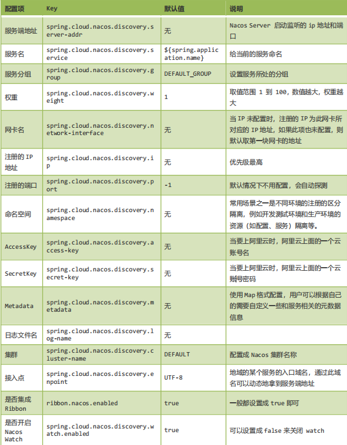


### eureka和nacos

Nacos的服务实例分为两种l类型：

- 临时实例：如果实例宕机超过一定时间，会从服务列表剔除，默认的类型。
- 非临时实例：如果实例宕机，不会从服务列表剔除，也可以叫永久实例。

```yml
spring:
  cloud:
    nacos:
      discovery:
        ephemeral: false # 设置为非临时实例
```

- Nacos与eureka的共同点
  - 都支持服务注册和服务拉取
  - 都支持服务提供者心跳方式做健康检测

- Nacos与Eureka的区别
  - Nacos支持服务端主动检测提供者状态：临时实例采用心跳模式，非临时实例采用主动检测模式
  - 临时实例心跳不正常会被剔除，非临时实例则不会被剔除
  - Nacos支持服务列表变更的消息推送模式，服务列表更新更及时
  - Nacos集群默认采用AP方式，当集群中存在非临时实例时，采用CP模式；Eureka采用AP方式

## 配置中心

### nacos

使用 Spring Cloud Alibaba Nacos Config，可基于 Spring Cloud 的编程模型快速接入 Nacos 配置管理功能

#### 快速入门

##### 依赖

```xml
<dependency>
	<groupId>com.alibaba.cloud</groupId>
	<artifactId>spring-cloud-starter-alibaba-nacos-config</artifactId>
</dependency>
```

##### 添加一个配置文件


##### 修改配置文件

> 修改名字bootstrap.yml

```yml
server:
	port: 8080
spring:
	application:
		name: config-client-a
	cloud:
		nacos:
			config: 
				#指定配置中心的地址
				server-addr: localhost:8848
				#用户名 默认nacos
				username: nacos
				#密码 默认nacos
				pasword: nacos
				#命名空间
				namespace: 5510ef39-ca9a-4f5d-87ba-7fb2afbf7035
				#组别
				group: GROUP_A
				#配置文件前缀
				prefix: config-client
				#配置中心使用的数据格式
				file-extension: properties
	profiles:
		active: dev # spring 的环境配置
#这里会根据spring.cloud.nacos.server-addr获取nacos地址，再根据`${spring.application.name}-${spring.profiles.active}.${spring.cloud.nacos.config.file-extension}`作为文件id，来读取配置。
```

##### 添加控制类

```java
/**
* @Author 武汉动力节点
*/
@Data
@AllArgsConstructor
@NoArgsConstructor
@Component // 添加到 IOC 中，一会在 controller 注入
@RefreshScope // 刷新的域，当配置文件修改后可以动态刷新
public class Hero {
	@Value("${hero.name}")
	private String name;
	@Value("${hero.age}")
	private Integer age;
	@Value("${hero.address}")
	private String address;
}
```

#### 配置文件

##### 历史版本

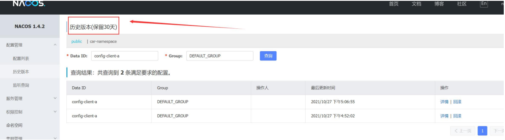

##### 版本回滚


##### 读取方式

nacos 配置中心通过 namespace、dataId 和 group 来唯一确定一条配置。

- Namespace：即命名空间。默认的命名空间为 public，我们可以在 Nacos 控制台中新建命名空间；
- dataId：即配置文件名称
- Group ： 即 配 置 分 组 ， 默 认 为 DEFAULT_GROUP ， 可 以 通spring.cloud.nacos.config.group 配置。

```yml
spring:
	application:
		name: config-client-a
	cloud:
		nacos:
			config: 
				#指定配置中心的地址
				server-addr: localhost:8848
				#用户名 默认nacos
				username: nacos
				#密码 默认nacos
				pasword: nacos
				#命名空间
				namespace: 5510ef39-ca9a-4f5d-87ba-7fb2afbf7035
				#组别
				group: GROUP_A
				#配置文件前缀
				prefix: config-client
				#配置中心使用的数据格式
				file-extension: properties
	profiles:
		active: dev # spring 的环境配置
```

> 其中：dataId 是最关键的配置字段：格式如下：
>
> \${prefix}-\${spring.profiles.active}. ${file-extension}

- prefix 默 认 为 spring.application.name 的 值 ， 也 可 以 通 过 配 置 项spring.cloud.nacos.config.prefix 来配置；
- spring.profiles.active 即 为 当 前 环 境 对 应 的 profile 。 注 意 ， 当pring.profiles.active 为空时，对应的连接符-也将不存在，dataId 的拼接格式变成\${prefix}.${file-extension}；
- file-extension 为 配 置 内 容 的 数 据 格 式 ， 可 以 通 过 配 置spring.cloud.nacos.config.file-extension 来配置。

> 注意:在写 dataId 的时候一定要添加文件类型后缀
>
> Eg: nacos-config-dev**.yml**

##### 配置文件划分

项目分为三个环境：开发环境 dev、测试环境 test 和生产环境 prod。

#### 获取多配置文件

##### 读取多配置文件

```yml
cloud:
	nacos:
		config:
			server-addr: localhost:8848
			namespace: 5510ef39-ca9a-4f5d-87ba-7fb2afbf7035 # 命名空间 注意使用 id
			extension-configs: # 配置多个配置文件 数组形式
				- data-id: config-a.yml # 配置 id，必须要加文件后缀 不支持dev
				  group: GROUP_A # 组别
				  refresh: true # 是否支持刷新
				- data-id: config-b.yml
				  group: GROUP_B
				  refresh: false
				  
```

- spring.cloud.nacos.config.extension-configs[n].dataId ， 指 定 多 个 配 置 的dataId，必须包含文件格式，支持 properties、yaml 或 yml；
- spring.cloud.nacos.config.extension-configs[n].group，指定分组；
- spring.cloud.nacos.config.extension-configs[n].refresh，是否支持刷新。

##### 读取共享配置文件

```yml
spring:
	application:
		name: config-client-a
	cloud:
		nacos:
			config: 
				#指定配置中心的地址
				server-addr: localhost:8848
				#用户名 默认nacos
				username: nacos
				#密码 默认nacos
				pasword: nacos
				#命名空间
				namespace: 5510ef39-ca9a-4f5d-87ba-7fb2afbf7035
				#组别
				group: GROUP_A
				#配置文件前缀
				prefix: config-client
				#配置中心使用的数据格式
				file-extension: yml
				shared-configs: #共享配置文件
					#- application-dev.yml #放在当前默认组DEFAULT_GROUP
					- data-id: config-b.yml
				  	  group: GROUP_B
				  	  refresh: false
				
	profiles:
		active: dev # spring 的环境配置
```


#### 配置

##### 基本配置

```yml
spring:
	application:
		name: config-client-a
	cloud:
		nacos:
			config: 
				#指定配置中心的地址
				server-addr: localhost:8848
				#用户名 默认nacos
				username: nacos
				#密码 默认nacos
				pasword: nacos
				#命名空间
				namespace: 5510ef39-ca9a-4f5d-87ba-7fb2afbf7035
				#组别
				group: GROUP_A
				#配置文件前缀
				prefix: config-client
				#配置中心使用的数据格式
				file-extension: properties
	profiles:
		active: dev # spring 的环境配置
```

##### 常用配置


#### **两端的配置文件写什么内容**

本地的 bootstrap.yml(应用名称，配置文件中心（注册中心地址），读取的配置文件名称信

息)远端的配置文件(端口，数据源，redis，mq，mybatis，Swagger...)

## 远程调用及负载均衡工具

### Rebbon

Ribbon 是一个基于 HTTP 和 TCP 的客户端负载均衡工具，它基于 Netflix Ribbon 实现。通过 Spring Cloud 的封装，可以让我们轻松地将面向服务的 REST 模版请求 自动转换成客户端负载均衡的服务调用。 轮询 hash 权重 ...

> 简单的说 Ribbon 就是 netfix 公司的一个开源项目，主要功能是提供客户端负载均衡算法和 服务调用。

Ribbon 作为服务消费者的负载均衡器，有两种使 用方式，一种是和 RestTemplate 相结合，另一种是和 OpenFeign 相结合。OpenFeign 已经 默认集成了 Ribbon,关于 OpenFeign 的内容将会在下一章进行详细讲解。Ribbon 有很多子 模块，但很多模块没有用于生产环境

#### 负载均衡

负载均衡，英文名称为 Load Balance（LB）http:// lb://（负载均衡协议） ，其含义 就是指将负载（工作任务）进行平衡、分摊到多个操作单元上进行运行，

##### 服务器

Nginx，F5


#### 快速入门

```xml
<dependency>
	<groupId>org.springframework.cloud</groupId>
	<artifactId>spring-cloud-starter-netflix-ribbon</artifactId>
	<version>2.2.9.RELEASE</version>
</dependency>
```


##### 使用RestTemplate

编写启动类

```java
@SpringBootApplication
@EnableEurekaClient
public class ConsumerApplication {
	public static void main(String[] args) {
		SpringApplication.run(ConsumerApplication.class, args);
	}
	/**
	* 用来发请求的
	* 使用spring管理RestTemplate创建
	* @return
	*/
	@Bean
	public RestTemplate restTemplate() {
		return new RestTemplate();
	}
}
```

编写controller

```java
 /**
     * @Author: 北京动力节点
     */
    @RestController
    public class TestController {
        //发送请求
        @Autowired
        private RestTemplate restTemplate;
        //获取端口
        @Autowired
        private DiscoveryClient discoveryClient;
        
        static Random random = new Random();
        @RequestMapping("/testBalance")
        public String testBalance(String serviceId) {
//获取服务列表
            List<ServiceInstance> instances = discoveryClient.getInstances(serviceId);
            if (ObjectUtils.isEmpty(instances)) {
                return "服务列表为空";
            }
//如果服务列表不为空，先自己做一个负载均衡
            ServiceInstance serviceInstance = loadBalance(instances);
            String host = serviceInstance.getHost();
            int port = serviceInstance.getPort();
            String url = "http://" + host + ":" + port + "/info";
            System.out.println("本次我调用的是" + url);
            String forObject = restTemplate.getForObject(url, String.class);
            System.out.println(forObject);
            return forObject;
        }
        private ServiceInstance loadBalance(List<ServiceInstance> instances) {
//拼接 url 去调用 ip:port 先自己实现不用 ribbon
            ServiceInstance serviceInstance =
                    instances.get(random.nextInt(instances.size()));
            return serviceInstance;
        }
    }
```

##### 使用Ribbon 改造

编写启动类

```java
@SpringBootApplication
@EnableEurekaClient
public class ConsumerApplication {
	public static void main(String[] args) {
		SpringApplication.run(ConsumerApplication.class, args);
	}
	/**
	* 用来发请求的
	* 使用spring管理RestTemplate创建
	* @return
	*/
	@Bean
    @LoadBalanced //ribbon 的负载均衡注解 失去ip+端口访问能里，重新new
	public RestTemplate restTemplate() {
		return new RestTemplate();
	}
}
```

controller

```java
/**
 * 测试 ribbon 的负载均衡
 *
 * @param serviceId
 * @return
*/
@RequestMapping("/testRibbonBalance")
public String testRibbonBalance(String serviceId) {
	//直接用服务名称替换 ip:port
	String url = "http://" + serviceId + "/info";
	String forObject = restTemplate.getForObject(url,String.class);
	System.out.println(forObject);
	return forObject;
}
```

#### 源码分析

##### 轮询算法


##### 源码分析

##### 负载均衡算法

####  配置

| **内置负载均衡规则类**    | **规则描述**                                                 |
| ------------------------- | ------------------------------------------------------------ |
| RoundRobinRule            | 简单轮询服务列表来选择服务器。它是Ribbon默认的负载均衡规则。 |
| AvailabilityFilteringRule | 对以下两种服务器进行忽略：   （1）在默认情况下，这台服务器如果3次连接失败，这台服务器就会被设置为“短路”状态。短路状态将持续30秒，如果再次连接失败，短路的持续时间就会几何级地增加。  （2）并发数过高的服务器。如果一个服务器的并发连接数过高，配置了AvailabilityFilteringRule规则的客户端也会将其忽略。并发连接数的上限，可以由客户端的<clientName>.<clientConfigNameSpace>.ActiveConnectionsLimit属性进行配置。 |
| WeightedResponseTimeRule  | 为每一个服务器赋予一个权重值。服务器响应时间越长，这个服务器的权重就越小。这个规则会随机选择服务器，这个权重值会影响服务器的选择。 |
| **ZoneAvoidanceRule**     | 以区域可用的服务器为基础进行服务器的选择。使用Zone对服务器进行分类，这个Zone可以理解为一个机房、一个机架等。而后再对Zone内的多个服务做轮询。 |
| BestAvailableRule         | 忽略那些短路的服务器，并选择并发数较低的服务器。             |
| RandomRule                | 随机选择一个可用的服务器。                                   |
| RetryRule                 | 重试机制的选择逻辑                                           |

##### 配置负载均衡算法

```yml
#指定某一个服务使用什么算法
provider: #提供者的服务名称,那么访问该服务的时候就会按照自定义的负载均衡算法
	ribbon:
		NFLoadBalancerRuleClassName: com.netflix.loadbalancer.RandomRule #几种算法的全限定类名

#配置此消费者调用任何服务都用某种算法

@Bean
public IRule myRule() {
	//指定调用所有的服务都用此算法
	return new RandomRule();
}
```

##### Ribbon 的配置文件和常用配置

> Ribbon 有很多默认的配置，查看 DefaultClientConfigImp

```yml
ribbon: #全局的设置
  eager-load:
    enabled: false # ribbon 一启动不会主动去拉取服务列表，当实际使用时才去拉取 是否立即加载
http:
  client:
    enabled: false # 在 ribbon 最后要发起 Http 的调用调用，我们认为是RestTemplate 完成的，其实最后是 HttpURLConnection 来完成的，这里面设置为 true ，可以把 HttpUrlConnection->HttpClient
okhttp:
  enabled: false #HttpUrlConnection 来完成的，这里面设置为 true ，可以把 HttpUrlConnection->OkHttpClient(也是发 http 请求的，它在移动端的开发用的多)

provider: #提供者的服务名称,那么访问该服务的时候就会按照自定义的负载均衡算法
  ribbon:
    NFLoadBalancerRuleClassName: com.netflix.loadbalancer.RandomRule
#修改默认负载均衡算法，几种算法的全限定类名
# NFLoadBalancerClassName: #loadBalance 策略
# NFLoadBalancerPingClassName: #ping 机制策略
# NIWSServerListClassName: #服务列表策略
# NIWSServerListFilterClassName: #服务列表过滤策略ZonePreferenceServerListFilter 默认是优先过滤非一个区的服务列
```

##### 饥饿加载

Ribbon默认是采用懒加载，即第一次访问时才会去创建LoadBalanceClient，请求时间会很长。

```yml
ribbon:
  eager-load:
    enabled: true
    clients: userservice
```


#### 总结

##### 总结

> Ribbon 是客户端实现负载均衡的远程调用组件，用法简单 
>
> Ribbon 源码核心： 
>
> ILoadBalancer 接口：
>
> 起到承上启下的作用 
>
> 1. 承上：从 eureka 拉取服务列表 
> 2. 2. 启下：使用 IRule 算法实现客户端调用的负载均衡

设计思想：每一个服务提供者都有自己的 ILoadBalancer 

userService---》客户端有自己的 ILoadBalancer T

eacherService---》客户端有自己的 ILoadBalancer

 在客户端里面就是 Map iLoadBalancers 

Map iLoadBalancers 消费者端 服务提供者的名称 value （服务列表 算法规则 ）

 如何实现负载均衡的呢？ 

iloadBalancer loadbalance = iloadBalancers.get(“user-service”) 

List servers = Loadbalance.getReachableServers();//缓存起来 Server server = loadbalance .chooseServer(key) //key 是区 id，--》IRule 算法 chooseServer 下面有一个 IRule 算法 

IRule 下面有很多实现的负载均衡算法 

你就可以使用 eureka+ribbon 做分布式项

### OpenFeign

Feign 是声明性(注解)**Web 服务**客户端**。它使编写 Web 服务客户端更加容易。**要使用Feign，请创建一个接口并对其进行注解。它具有可插入注解支持，包括 Feign 注解和 JAX-RS 注解。Feign 还支持可插拔编码器和解码器。Spring Cloud 集成了 Ribbon 和 Eureka 以及 Spring Cloud LoadBalancer，以在使用 Feig 时提供负载平衡的http客户端。

> Feign 是一个**远程调用**的组件 (接口，注解) http 调用的
>
> Feign 集成了 ribbon  ribbon 里面集成了 eureka


#### 快速入门

##### 添加依赖


##### 配置

```yml
server:
 	port: 8081
spring:
 	application:
        name: consumer-user-service
eureka:
	client:
		service-url:
			defaultZone: http://localhost:8761/eureka
	instance:
		instance-id: ${spring.application.name}:${server.port}
		prefer-ip-address: true
```

##### 创建接口

```java
/**
*
* @FeignClient 声明是 feign 的调用
* value = "provider-order-service" value 后面的值必须和提供者的服
务名一致
*/
@FeignClient(value = "provider-order-service")
public interface UserOrderFeign {
	/**
	* 描述: 下单的方法 这里的路径必须和提供者的路径一致
	*
	* @param :
	* @return java.lang.String
	*/
	@GetMapping("doOrder")
		String doOrder();
	}
```

##### 调用

```java
@RestController
public class UserController {
	@Autowired
	private UserOrderFeign userOrderFeign;
    
	/**
	* 用户远程调用下单的接口
	*
	* @return
	*/
	@GetMapping("userDoOrder")
	public String userDoOrder() {
		String result = userOrderFeign.doOrder();
		System.out.println(result);
		return result;
	}
}
```

##### 添加启动注解

```java
@SpringBootApplication
@EnableEurekaClient
@EnableFeignClients //标记 feign 的客户端
public class ConsumerUserServiceApplication {
	public static void main(String[] args) {
		SpringApplication.run(ConsumerUserServiceApplication.class, args);
	}
}
```

#### 配置

##### 基本配置

| 类型                   | 作用             | 说明                                                   |
| ---------------------- | ---------------- | ------------------------------------------------------ |
| **feign.Logger.Level** | 修改日志级别     | 包含四种不同的级别：NONE、BASIC、HEADERS、FULL         |
| feign.codec.Decoder    | 响应结果的解析器 | http远程调用的结果做解析，例如解析json字符串为java对象 |
| feign.codec.Encoder    | 请求参数编码     | 将请求参数编码，便于通过http请求发送                   |
| feign. Contract        | 支持的注解格式   | 默认是SpringMVC的注解                                  |
| feign. Retryer         | 失败重试机制     | 请求失败的重试机制，默认是没有，不过会使用Ribbon的重试 |

##### 负债均衡

采用ribbon配置

##### 超时设置

**因 为** **ribbon** **默 认 调 用 超 时 时 长 为** **1s** **， 可 以 修 改 ， 超 时 调 整 可 以 查 DefaultClientConfigImpl**

```yml
ribbon: #feign 默认调用 1s 超时
	ReadTimeout: 5000 #修改调用时长为 5s
	ConnectTimeout: 5000 #修改连接时长为 5s
```

##### 配置文件方式

**一：基于配置文件修改feign的日志级别可以针对单个服务：**

```yml
feign:  
  client:
    config: 
      userservice: # 针对某个微服务的配置
        loggerLevel: FULL #  日志级别 
```

**二：也可以针对所有服务**

```yml
feign:  
  client:
    config: 
      default: # 这里用default就是全局配置，如果是写服务名称，则是针对某个微服务的配置
        loggerLevel: FULL #  日志级别 
```

而日志的级别分为四种：

- NONE：不记录任何日志信息，这是默认值。
- BASIC：仅记录请求的方法，URL以及响应状态码和执行时间
- HEADERS：在BASIC的基础上，额外记录了请求和响应的头信息
- FULL：记录所有请求和响应的明细，包括头信息、请求体、元数据。

**三：Java代码方式**

先声明一个类，然后声明一个Logger.Level的对象：

```java
public class DefaultFeignConfiguration  {
    @Bean
    public Logger.Level feignLogLevel(){
        return Logger.Level.BASIC; // 日志级别为BASIC
    }
}
```

如果要**全局生效**，将其放到启动类的@EnableFeignClients这个注解中：

```java
@EnableFeignClients(defaultConfiguration = DefaultFeignConfiguration .class) 
```

如果是**局部生效**，则把它放到对应的@FeignClient这个注解中：

```java
@FeignClient(value = "userservice", configuration = DefaultFeignConfiguration .class) 
```


#### 调用参数处理

##### getPost传递

1. **Feign** **传参确保消费者和提供者的参数列表一致 包括返回值 方法签名要一致**
2. **通过** **URL** **传参数，GET请求，参数列表使用@PathVariable（“”）**
3. **如果是** **GET** **请求，每个基本参数必须加@RequestParam（“”）**
4. **如果是** **POST** **请求，而且是对象集合等参数，必须加@Requestbody或者*@RequestParam**

eg

```java
@RestController
public class TestParamController {
    /**
     * 测试单个参数
     *
     * @param name
     * @return
     */
    @GetMapping("testOneParam")
    public BaseResult oneParam(@RequestParam("name") String name) {
        System.out.println(name);
        return BaseResult.success(200, "成功", "ok");
    }
    /**
     * 测试两个参数
     *
     * @param name
     * @param age
     * @return
     */
    @PostMapping("testTwoParam")
    public BaseResult twoParam(@RequestParam("name") String name, @RequestParam("age") Integer age) {
        System.out.println(name + ":" + age);
        return BaseResult.success(200, "ok", "ok");
    }
    /**
     * 测试一个对象的传参
     *
     * @param order
     * @return
     */
    @PostMapping("testObjectParam")
    public BaseResult objectParam(@RequestBody Order order) {
        System.out.println(order);
        return BaseResult.success(200, "ok", order);
    }
    /**
     * 测试一个对象 一个参数
     *
     * @param order
     * @param name
     * @return
     */
    @PostMapping("testOneObjectOneParam")
    public BaseResult oneObjectOneParam(@RequestBody Order order,
                                        @RequestParam String name) {
        System.out.println(order);
        System.out.println(name);
        return BaseResult.success(200, "ok", order);
    }
    /**
     * 测试 url 传参
     *
     * @param id
     * @return
     */
    @GetMapping("testUrlParam/{id}")
    public BaseResult testUrlParam(@PathVariable("id") Integer id) {
        System.out.println(id);
        return BaseResult.success(200, "ok", id);
    }
}
```

> openFeign接口名相同

##### **时间日期参数问题**

使用 feign 远程调用时，传递 Date 类型，接收方的时间会相差 14 个小时，是因为时区造成的

1. 使用字符串传递参数，接收方转换成时间类型（推荐使用）不要单独传递时间**
2. 使用 JDK8 的 LocalDate(日期) 或 LocalDateTime(日期和时间，接收方只有秒，没有毫秒)
3. 自定义转换方法，放在其他类里

#### 源码分析

#### **日志功能**

##### 日志级别

> 在level类中

- NONE 默认的，不显示日志
- BASE 仅记录请求方法，URL ，响应状态码及执行时间
- HEADERS 在 BASE 之上增加了请求和响应头的信息
- FULL 在 HEADERS 之上增加了请求和响应的正文及无数据

##### 创建配置类

```java
@Bean
Logger.Level feignLogger() {
	return Logger.Level.FULL;
}

```

```yml
#配置文件
logging:
	level:
		com.bjpowernode.feign.UserOrderFeign: debug #指定类下的日志打印
```

#### 优化使用

Feign底层发起http请求，依赖于其它的框架。其底层客户端实现包括：

•URLConnection：默认实现，不支持连接池

•Apache HttpClient ：支持连接池

•OKHttp：支持连接池

因此提高Feign的性能主要手段就是使用**连接池**代替默认的URLConnection。

##### 依赖

```xml
<!--httpClient的依赖 -->
<dependency>
    <groupId>io.github.openfeign</groupId>
    <artifactId>feign-httpclient</artifactId>
</dependency>
```

##### 配置连接池

```yml
feign:
  client:
    config:
      default: # default全局的配置
        loggerLevel: BASIC # 日志级别，BASIC就是基本的请求和响应信息
  httpclient:
    enabled: true # 开启feign对HttpClient的支持
    max-connections: 200 # 最大的连接数
    max-connections-per-route: 50 # 每个路径的最大连接数
```

##### 总结

总结，Feign的优化：

1.日志级别尽量用basic

2.使用HttpClient或OKHttp代替URLConnection

①  引入feign-httpClient依赖

②  配置文件开启httpClient功能，设置连接池参数

## 熔断器

### Hystrix

```xml
<dependency>
	<groupId>org.springframework.cloud</groupId>
	<artifactId>spring-cloud-starter-netflix-hystrix</artifactId>
</dependency>
```

熔断器，也叫断路器！（正常情况下 断路器是关的 只有出了问题才打开）用来**保护微服务不**

**雪崩的方法**。思想和我们上面画的拦截器一样。

Hystrix 是 Netflix 公司开源的一个项目，它提供了熔断器功能，能够阻止**分布式系统中出现**

**联动故障**。Hystrix 是通过隔离服务的访问点阻止联动故障的，并提供了故障的解决方案，从

而提高了整个分布式系统的弹性。微博 弹性云扩容 

Docker K8s

####  服务雪崩

##### 原因


> **服务雪崩的本质：线程没有及时回收。**
>
> **不管是调用成功还是失败，只要线程可以及时回收，就可以解决服务雪崩**

##### 解决方法

**修改调用的超时时长（不推荐）**

**设置拦截器**

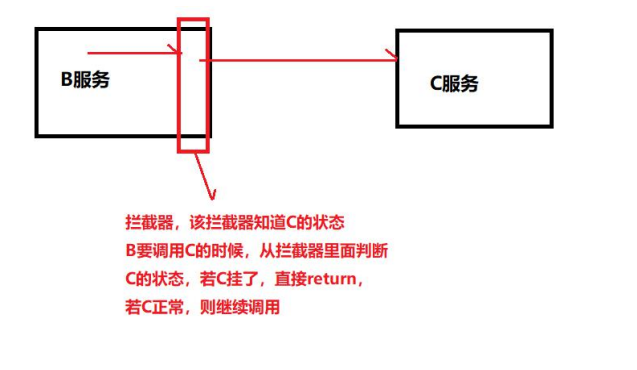

#### 快速入门

##### **在** **OpenFeign** **中使用** **Hystrix**

###### 创建Hystrix类实现**OrderServiceFeign**接口

```java
@Component
public class OrderServiceHystrix implements OrderServiceFeign {
@Override
public String doOrder() {
	System.out.println("调用下单服务失败，我走 hystrix 了");
		return "我是 hystrix 的 doOrder，说明下单失败了";
	}
	......省略其他的实现方法
}
```

###### 修改feign接口

```java
@FeignClient(value = "provider-order-service", fallback =
OrderServiceHystrix.class)
```

###### 修改配置文件

```yml
feign:
	hystrix:
		enabled: true #开启断路器的使用
```

##### **Ribbon** **中使用** **Hystrix**

###### 修改启动类

```java
@SpringBootApplication
@EnableEurekaClient
@EnableFeignClients

@EnableCircuitBreaker //开启断路器
public class ConsumerUserServiceApplication {
	public static void main(String[] args) {
		SpringApplication.run(ConsumerUserServiceApplication.class, args);
	}
```

###### 修改controller

```java
/**
* 用户下单方法 ribbon 的熔断
*
* @return
* @HystrixCommand(fallbackMethod = "ribbonHystrix")
* 指定熔断的方法
*/
@GetMapping("userDoOrderRibbon")
@HystrixCommand(fallbackMethod = "ribbonHystrix")
public String testRibbonHystrix(String serviceId) {
	String result = restTemplate.getForObject("http:" + serviceId + "/doOrder", String.class);
	System.out.println(result);
	return "成功";
}

//方法签名要和原来的方法一致
public String ribbonHystrix(String serviceId) {
	return "我是 ribbon 的备选方案";
}
```

#### 源码分析

##### 手写熔断器

[看源码](源码\hystrix-demo)

#### 常用配置

```yml
feign:
	hystrix:
		enabled: true
hystrix: #hystrix 的全局控制
	command:
		default: #default 是全局控制，也可以换成单个方法控制，把 default 换成方法名即可
			fallback:
				isolation:
					semaphore:
						maxConcurrentRequests: 1000 #信号量隔离级别最大并发数
			circuitBreaker:
				enabled: true #开启断路器
				requestVolumeThreshold: 3 #失败次数（阀值）
				sleepWindowInMilliseconds: 20000 #窗口时间
				errorThresholdPercentage: 60 #失败率
			execution:
				isolation:
					Strategy: thread #隔离方式 thread 线程隔离集合和 SEMAPHORE 信号量隔离
					thread:
						timeoutInMilliseconds: 3000 #调用超时时长
ribbon:
	ReadTimeout: 5000 #要结合 feign 的底层 ribbon 调用的时长
	ConnectTimeout: 5000
```

> \#隔离方式 两种隔离方式 thread 线程池 按照 group（10 个线程）划分服务提供者，用户请求的线程和做远程的线程不一样
>
> \# 好处 当 B 服务调用失败了 或者请求 B 服务的量太大了 不会对 C 服务造成影响 用户访问比较大的情况下使用比较好 异步的方式
>
> \# 缺点 线程间切换开销大，对机器性能影响
>
> \# 应用场景 调用第三方服务 并发量大的情况下
>
> 
>
> \# SEMAPHORE 信号量隔离 每次请进来 有一个原子计数器 做请求次数的++ 当请求完成以后 --
>
> \# 好处 对 cpu 开销小
>
> \# 缺点 并发请求不易太多 当请求过多 就会拒绝请求 做一个保护机制
>
> \# 场景 使用内部调用 ，并发小的情况下
>
> \# 源码入门 HystrixCommand AbstractCommand HystrixThreadPool

## Feign工程化实例


### 父项目（pom）

```xml
<?xml version="1.0" encoding="UTF-8"?>
<project xmlns="http://maven.apache.org/POM/4.0.0"
         xmlns:xsi="http://www.w3.org/2001/XMLSchema-instance"
         xsi:schemaLocation="http://maven.apache.org/POM/4.0.0 http://maven.apache.org/xsd/maven-4.0.0.xsd">
    <modelVersion>4.0.0</modelVersion>
    <!--打包方式-->
    <packaging>pom</packaging>
    <modules>
        <module>project-domain</module>
        <module>common-api</module>
        <module>order-center</module>
        <module>user-center</module>
    </modules>

    <!--继承父类-->
    <parent>
        <artifactId>spring-boot-starter-parent</artifactId>
        <groupId>org.springframework.boot</groupId>
        <version>2.3.12.RELEASE</version>
    </parent>

    <groupId>org.fuhao</groupId>
    <artifactId>openfein-project</artifactId>
    <version>1.0-SNAPSHOT</version>

    <!--全局版本号控制的地方-->
    <properties>
        <maven.compiler.source>8</maven.compiler.source>
        <maven.compiler.target>8</maven.compiler.target>
        <java.version>1.8</java.version>
        <spring-cloud.version>Hoxton.SR12</spring-cloud.version>
    </properties>


    <!-- 这里的依赖所以的子模块都会有-->
    <dependencies>
        <dependency>
            <groupId>org.projectlombok</groupId>
            <artifactId>lombok</artifactId>
        </dependency>

    </dependencies>

    <!-- 加在这里的依赖不会被这的引入进项目 只是做了一个版本控制-->
    <dependencyManagement>
        <dependencies>
            <dependency>
                <groupId>org.springframework.cloud</groupId>
                <artifactId>spring-cloud-dependencies</artifactId>
                <version>${spring-cloud.version}</version>
                <type>pom</type>
                <scope>import</scope>
            </dependency>
        </dependencies>
    </dependencyManagement>

    <!-- 打包 仓库 等配置 -->
    <!--    <build>-->

    <!--    </build>-->

</project>
```

### domain

类

```java
@Data
@AllArgsConstructor
@NoArgsConstructor
@Builder
public class User {

    private Integer id;
    private String name;
    private int age;

}
```

### common-api

pom

```xml
<?xml version="1.0" encoding="UTF-8"?>
<project xmlns="http://maven.apache.org/POM/4.0.0"
         xmlns:xsi="http://www.w3.org/2001/XMLSchema-instance"
         xsi:schemaLocation="http://maven.apache.org/POM/4.0.0 http://maven.apache.org/xsd/maven-4.0.0.xsd">
    <parent>
        <artifactId>openfein-project</artifactId>
        <groupId>org.fuhao</groupId>
        <version>1.0-SNAPSHOT</version>
    </parent>
    <modelVersion>4.0.0</modelVersion>

    <artifactId>common-api</artifactId>

    <properties>
        <maven.compiler.source>8</maven.compiler.source>
        <maven.compiler.target>8</maven.compiler.target>
    </properties>
    <dependencies>


        <dependency>
            <groupId>org.fuhao</groupId>
            <artifactId>project-domain</artifactId>
            <version>1.0-SNAPSHOT</version>
        </dependency>
        <dependency>
            <groupId>org.springframework.cloud</groupId>
            <artifactId>spring-cloud-starter-openfeign</artifactId>
        </dependency>

        <dependency>
            <groupId>org.springframework.cloud</groupId>
            <artifactId>spring-cloud-starter-netflix-hystrix</artifactId>
        </dependency>
    </dependencies>

</project>
```

UserOderFeign

```java
@FeignClient(value = "order-service",fallback = UserOderFeignHystrix.class)
public interface UserOderFeign {

    //查询订单
    @GetMapping("/order/getOrderByUserId")
    User getOrderBuuser(@RequestParam Integer id);

}
```

UserOderFeignHystrix

```java
@Component
public class UserOderFeignHystrix implements UserOderFeign {

    @Override
    public User getOrderBuuser(Integer id) {
        return new User(1,"错误",1);
    }
}
```

### 提供者

pom

```xml
<?xml version="1.0" encoding="UTF-8"?>
<project xmlns="http://maven.apache.org/POM/4.0.0"
         xmlns:xsi="http://www.w3.org/2001/XMLSchema-instance"
         xsi:schemaLocation="http://maven.apache.org/POM/4.0.0 http://maven.apache.org/xsd/maven-4.0.0.xsd">
    <parent>
        <artifactId>openfein-project</artifactId>
        <groupId>org.fuhao</groupId>
        <version>1.0-SNAPSHOT</version>
    </parent>
    <modelVersion>4.0.0</modelVersion>

    <artifactId>order-center</artifactId>

    <properties>
        <maven.compiler.source>8</maven.compiler.source>
        <maven.compiler.target>8</maven.compiler.target>
    </properties>

    <dependencies>

        <dependency>
            <groupId>org.fuhao</groupId>
            <artifactId>common-api</artifactId>
            <version>1.0-SNAPSHOT</version>
        </dependency>

        <dependency>
            <groupId>org.springframework.boot</groupId>
            <artifactId>spring-boot-starter-web</artifactId>
        </dependency>

        <dependency>
            <groupId>org.springframework.cloud</groupId>
            <artifactId>spring-cloud-starter-netflix-eureka-client</artifactId>
        </dependency>
    </dependencies>

</project>
```

OderController

```java
@RestController
public class OderController implements UserOderFeign {

    @Override
    public User getOrderBuuser(Integer id) {
        return new User(id,"张三",13);
    }
}
```

启动类

```java
@SpringBootApplication
@EnableEurekaClient
public class OrderApp {
    public static void main(String[] args) {
        SpringApplication.run(OrderApp.class,args);
    }
}
```

### 消费者

pom

```xml
<?xml version="1.0" encoding="UTF-8"?>
<project xmlns="http://maven.apache.org/POM/4.0.0"
         xmlns:xsi="http://www.w3.org/2001/XMLSchema-instance"
         xsi:schemaLocation="http://maven.apache.org/POM/4.0.0 http://maven.apache.org/xsd/maven-4.0.0.xsd">
    <parent>
        <artifactId>openfein-project</artifactId>
        <groupId>org.fuhao</groupId>
        <version>1.0-SNAPSHOT</version>
    </parent>
    <modelVersion>4.0.0</modelVersion>

    <artifactId>user-center</artifactId>

    <properties>
        <maven.compiler.source>8</maven.compiler.source>
        <maven.compiler.target>8</maven.compiler.target>
    </properties>

    <dependencies>
        <dependency>
            <groupId>org.fuhao</groupId>
            <artifactId>common-api</artifactId>
            <version>1.0-SNAPSHOT</version>
        </dependency>

        <dependency>
            <groupId>org.springframework.boot</groupId>
            <artifactId>spring-boot-starter-web</artifactId>
        </dependency>

        <dependency>
            <groupId>org.springframework.cloud</groupId>
            <artifactId>spring-cloud-starter-netflix-eureka-client</artifactId>
        </dependency>
    </dependencies>

</project>
```

UserController

```java
@RestController
public class UserController {
    @Autowired
    private UserOderFeign oderFeign;

    @GetMapping("test")
    public User test(Integer id){
       return oderFeign.getOrderBuuser(id);
    }

}
```

启动类

```java
@SpringBootApplication
@EnableEurekaClient
@EnableFeignClients
public class UserServerApp {
    public static void main(String[] args) {
        SpringApplication.run(UserServerApp.class,args);
    }

}
```

## 链路追踪	

sleuth+zipkin

（zipkin 就是一个可视化的监控控制台）

Zipkin 是 Twitter 的一个开源项目，允许开发者收集 Twitter 各个服务上的监控数据，并提

供查询接口。该系统让开发者可通过一个 Web 前端轻松的收集和分析数据，例如用户每次请求服务的处理时间等，可方便的监测系统中存在的瓶颈。	

### Zipkin

#### 使用

SpringCloud 从 F 版以后已不需要自己构建 Zipkin server 了，只需要调用 jar 包即可

https://dl.bintray.com/openzipkin/maven/io/zipkin/java/zipkin-server/

https://dl.bintray.com/openzipkin/maven/io/zipkin/java/zipkin-server/2.12.9/

> java -jar zipkin-server-2.12.9-exec.jar
>
> http://localhost:9411查看控制台

#### 链路图


> Trace:类似于树结构的 Span 集合，表示一条调用链路，存在唯一标识
>
> span:表示调用链路来源，通俗的理解 span 就是一次请求信息


### Sleuth

```xml
<dependency>
	<groupId>org.springframework.cloud</groupId>
	<artifactId>spring-cloud-starter-zipkin</artifactId>
</dependency>
```

官网：https://spring.io/projects/spring-cloud-sleuth

链路追踪就是：**追踪微服务的调用路径**

一个由客户端发起的请求在后端系统中会经过多个不同的服务节点调用来协同产生最后的请求结果，每一个请求都会开成一条复杂的分布式服务调用链路，链路中的任何一环出现高延时或错误都会引导起整个请求最后的失败。（不建议微服务中链路调用超过 3次）

#### 启动Zipkin

> java -jar zipkin-server-2.12.9-exec.jar

#### 修改配置文件

每个服务都需要加

```yml
spring:
	zipkin:
		base-url: http://localhost:9411
	sleuth:
		sampler:
			probability: 1 #配置采样率 默认的采样比例为: 0.1，即 10%，所设置的值介于 0 到 1 之间，1 则表示全部采集
			rate: 10 #为了使用速率限制采样器,选择每秒间隔接受的 trace 量，最小数字为 0，最大值为 2,147,483,647（最大 int） 默认为 10。
```

## 服务监控

### admin

```xml
<dependency>
	<groupId>de.codecentric</groupId>
	<artifactId>spring-boot-admin-starter-server</artifactId>
<dependency>
    
<spring-boot-admin.version>2.4.3</spring-boot-admin.version>
 
<dependencyManagement>
	<dependency>
     	<groupId>de.codecentric</groupId>
     	<artifactId>spring-boot-admin-dependencies</artifactId>
     	<version>${spring-boot-admin.version}</version>
     	<type>pom</type>
      	<scope>import</scope>
	</dependency>
</dependencyManagement>
```


> 监控本质：心跳检测


#### 快速入门

#### pom

```xml
<?xml version="1.0" encoding="UTF-8"?>
<project xmlns="http://maven.apache.org/POM/4.0.0" xmlns:xsi="http://www.w3.org/2001/XMLSchema-instance"
         xsi:schemaLocation="http://maven.apache.org/POM/4.0.0 https://maven.apache.org/xsd/maven-4.0.0.xsd">
    <modelVersion>4.0.0</modelVersion>
    <groupId>com.example</groupId>
    <artifactId>admin-server</artifactId>
    <version>0.0.1-SNAPSHOT</version>
    <name>admin-server</name>
    <description>Demo project for Spring Boot</description>
    <properties>
        <java.version>1.8</java.version>
        <project.build.sourceEncoding>UTF-8</project.build.sourceEncoding>
        <project.reporting.outputEncoding>UTF-8</project.reporting.outputEncoding>
        <spring-boot-admin.version>2.4.3</spring-boot-admin.version>
        <spring-boot.version>2.3.12.RELEASE</spring-boot.version>
        <spring-cloud.version>Hoxton.SR12</spring-cloud.version>
    </properties>
    <dependencies>
        <dependency>
            <groupId>org.springframework.boot</groupId>
            <artifactId>spring-boot-starter-web</artifactId>
        </dependency>

        <dependency>
            <groupId>org.springframework.cloud</groupId>
            <artifactId>spring-cloud-starter-netflix-eureka-client</artifactId>
        </dependency>

        <dependency>
            <groupId>de.codecentric</groupId>
            <artifactId>spring-boot-admin-starter-server</artifactId>
        </dependency>

        <dependency>
            <groupId>org.springframework.boot</groupId>
            <artifactId>spring-boot-starter-test</artifactId>
            <scope>test</scope>
            <exclusions>
                <exclusion>
                    <groupId>org.junit.vintage</groupId>
                    <artifactId>junit-vintage-engine</artifactId>
                </exclusion>
            </exclusions>
        </dependency>
    </dependencies>
    <dependencyManagement>
        <dependencies>
            <dependency>
                <groupId>org.springframework.cloud</groupId>
                <artifactId>spring-cloud-dependencies</artifactId>
                <version>${spring-cloud.version}</version>
                <type>pom</type>
                <scope>import</scope>
            </dependency>
            <dependency>
                <groupId>org.springframework.boot</groupId>
                <artifactId>spring-boot-dependencies</artifactId>
                <version>${spring-boot.version}</version>
                <type>pom</type>
                <scope>import</scope>
            </dependency>
            <dependency>
                <groupId>de.codecentric</groupId>
                <artifactId>spring-boot-admin-dependencies</artifactId>
                <version>${spring-boot-admin.version}</version>
                <type>pom</type>
                <scope>import</scope>
            </dependency>
        </dependencies>
    </dependencyManagement>

    <build>
        <plugins>
            <plugin>
                <groupId>org.apache.maven.plugins</groupId>
                <artifactId>maven-compiler-plugin</artifactId>
                <version>3.8.1</version>
                <configuration>
                    <source>1.8</source>
                    <target>1.8</target>
                    <encoding>UTF-8</encoding>
                </configuration>
            </plugin>
            <plugin>
                <groupId>org.springframework.boot</groupId>
                <artifactId>spring-boot-maven-plugin</artifactId>
                <version>${spring-boot.version}</version>
                <configuration>
                    <mainClass>com.example.adminserver.AdminServerApplication</mainClass>
                    <skip>true</skip>
                </configuration>
                <executions>
                    <execution>
                        <id>repackage</id>
                        <goals>
                            <goal>repackage</goal>
                        </goals>
                    </execution>
                </executions>
            </plugin>
        </plugins>
    </build>

</project>
```

配置文件

```yml
# 应用服务 WEB 访问端口
server:
  port: 10086 #0-65535
spring:
  application:
    name: admin—server
eureka:
  client:
    service-url: #eureka 服务端和客户端的交互地址,集群用,隔开
      defaultZone: http://p1:8761/eureka
  instance:
    hostname: p2 # 服务主机名称
    instance-id: ${eureka.instance.hostname}:${spring.application.name}:${server.port} 
    
#暴露监控端口
management:
  endpoints:
    web:
      exposure:
        include: '*' #暴露所有监控端点 如果一个服务需要被监控 那么就要将自身的一些情况暴露出去
```

启动类

```java
@SpringBootApplication
@EnableAdminServer //开启监控
public class AdminServerApplication {

    public static void main(String[] args) {
        SpringApplication.run(AdminServerApplication.class, args);
    }

}
```

如果想在其他项暴露依赖需要添加依赖

```xml
<!--暴露自身检查端点的依赖-->
<dependency>
   <groupId>org.springframework.boot</groupId>
   <artifactId>spring-boot-starter-actuator</artifactId>
</dependency>
```

> 可使用这个检查查看端口映射文件位置
>
> 

## 网关

网关是**微服务最边缘的服务**，**直接暴露给用户，用来做用户和微服务的桥梁**

1. 没有网关：客户端直接访问我们的微服务，会需要在客户端配置很多的 ip：port，如果user-service 并发比较大，则无法完成负载均衡

2. 有网关：客户端访问网关，网关来访问微服务，（网关可以和注册中心整合，通过服务名称找到目标的 ip：prot）这样只需要使用**服务名称即可访问微服务**，可以实现负载均衡，可以实现 token 拦截，权限验证，限流等操作

- **gateway **

  - 基于 webFlux 框架实现的，而 webFlux 框架底层则使用了高性能的 Reactor 模式通信框架的 Netty
  - NIO(非阻塞式 io)

- **zuul**

  的本质，**一组过滤器，根据自定义的过滤器顺序来执行，本质就是web组件web三大组件（监听器 过滤器servlet拦截springmvc**）

  - Zuul1.0 使用的是 BIO（Blocking IO） tomcat7.0 以前都是 BIO 性能一般
  - Zuul2.0 性能好 NIO
  - AIO 异步非阻塞 io a+nio = aio = async 
  - 它基于 spring5.x，springboot2.x 和 ProjectReactor 等技术。
  - 它的目地是让**路由更加简单，灵活，还提供了一些强大的过滤器功能**，例如：熔断、限流、重试,自义定过滤器等 token 校验 ip 黑名单等

​	

> SpringCloud Gateway 是基于 webFlux 框架实现的，而 webFlux 框架底层则使用了高性能
>
> 的 Reactor 模式通信框架的 Netty

### **Gateway**

```xml
<?xml version="1.0" encoding="UTF-8"?>
<project xmlns="http://maven.apache.org/POM/4.0.0" xmlns:xsi="http://www.w3.org/2001/XMLSchema-instance"
         xsi:schemaLocation="http://maven.apache.org/POM/4.0.0 https://maven.apache.org/xsd/maven-4.0.0.xsd">
    <modelVersion>4.0.0</modelVersion>
    <parent>
        <groupId>org.springframework.boot</groupId>
        <artifactId>spring-boot-starter-parent</artifactId>
        <version>2.7.11</version>
        <relativePath/> <!-- lookup parent from repository -->
    </parent>
    <groupId>com.example</groupId>
    <artifactId>demo</artifactId>
    <version>0.0.1-SNAPSHOT</version>
    <name>demo</name>
    <description>demo</description>
    <properties>
        <java.version>1.8</java.version>
        <spring-cloud.version>2021.0.7</spring-cloud.version>
    </properties>
    <dependencies>
        <dependency>
            <groupId>org.springframework.cloud</groupId>
            <artifactId>spring-cloud-starter-gateway</artifactId>
        </dependency>

        <dependency>
            <groupId>org.springframework.boot</groupId>
            <artifactId>spring-boot-starter-test</artifactId>
            <scope>test</scope>
        </dependency>
    </dependencies>
    <dependencyManagement>
        <dependencies>
            <dependency>
                <groupId>org.springframework.cloud</groupId>
                <artifactId>spring-cloud-dependencies</artifactId>
                <version>${spring-cloud.version}</version>
                <type>pom</type>
                <scope>import</scope>
            </dependency>
        </dependencies>
    </dependencyManagement>

    <build>
        <plugins>
            <plugin>
                <groupId>org.springframework.boot</groupId>
                <artifactId>spring-boot-maven-plugin</artifactId>
            </plugin>
        </plugins>
    </build>

</project>
```


#### 简介

##### 功能

**权限控制**：网关作为微服务入口，需要校验用户是是否有请求资格，如果没有则进行拦截。

**路由和负载均衡**：一切请求都必须先经过gateway，但网关不处理业务，而是根据某种规则，把请求转发到某个微服务，这个过程叫做路由。当然路由的目标服务有多个时，还需要做负载均衡。

**限流**：当请求流量过高时，在网关中按照下流的微服务能够接受的速度来放行请求，避免服务压力过大。

##### 工作流程


客户端向 springcloud Gateway 发出请求，然后在 Gateway Handler Mapping 中找到与请求相匹配的路由，将其发送到 Gateway Web Handler。

Handler 再通过指定的过滤器来将请求发送到我们实际的服务的业务逻辑，然后返回。 过滤器之间用虚线分开是因为过滤器可能会在发送爱丽请求之前【pre】或之后【post】执行业务逻辑，对其进行加强或处理。

Filter 在 【pre】 类型的过滤器可以做参数校验、权限校验、流量监控、日志输出、协议转换等

在【post】 类型的过滤器中可以做响应内容、响应头的修改、日志的输出，流量监控等有着非常重要的作用

> **总结：Gateway 的核心逻辑也就是 路由转发 + 执行过滤器链**

##### **三大核心概念**

- **Route(路由）（重点 和** **eureka** **结合做动态路由）**

  - **路由信息的组成：**

    **由一个 ID、一个目的 URL、一组断言工厂、一组 Filter 组成。**

    **如果路由断言为真，说明请求 URL 和配置路由匹配。**

- **Predicate(断言)（就是一个返回** **bool** **的表达式）**

  - **Java 8 中的断言函数。** **lambda** **四大接口 供给形，消费性，函数型，断言型Cloud Gateway 中 的 断 言 函 数 输 入 类 型 是 Spring 5.0 框 架 中 的ServerWebExchange。Spring Cloud Gateway 的断言函数允许开发者去定义匹配来自于Http Request 中的任何信息比如请求头和参数。**

- **Filter(过滤) (重点)**

  - **一个标准的 Spring WebFilter。** 

    **Web** **三大组件(servlet listener filter) mvc  interceptor**

    **Spring Cloud Gateway 中的 Filter 分为两种类型的 Filter，分别是 Gateway Filter 和Global Filter。过滤器 Filter 将会对请求和响应进行修改处理。**

    1.一个是针对某一个路由(路径)的 filter 对某一个接口做限流

    2.一个是针对全局的 filter token ip 黑名单

##### **Nginx** **和** **Gateway** **的区别**

- Nginx 在做路由，负载均衡，限流之前，都有修改 nginx.conf 的配置文件，把需要负载均衡，路由，限流的规则加在里面。Eg:使用 nginx 做 tomcat 的负载均衡
- gateway **自动的负载均衡和路由**，gateway 和 eureka 高度集成，实现自动的路由，和 Ribbon 结合，实现了负载均衡（lb），gateway 也能轻易的实现限流和权限验证。


#### 	快速入门

##### 添加依赖

```
GateWay（netty） 不能用web（tomcat） 
```

##### 修改启动类

```java
@SpringBootApplication
@EnableEurekaClient //网关也是 eureka 的客户端
public class Gateway80Application {
	public static void main(String[] args) {
		SpringApplication.run(Gateway80Application.class, args);
	}
}
```

##### 配置

```yml
server:
	port: 80
spring:
	application:
		name: gateway-80
	cloud:
		gateway:
			enabled: true #开启网关，默认是开启的
			routes: #设置路由，注意是数组，可以设置多个，按照 id 做隔离
				- id: user-service-router #路由 id，没有要求，保持唯一即可
				  uri: http://localhost:8081 #设置真正的服务 ip:port
				  predicates: #断言匹配
					- Path=/info/** #和服务中的路径匹配,是正则匹配的模式
				- id: provider-service-router
				  uri: http://localhost:8082
				  filters:
            			- StripPrefix= 1
				  predicates:
					- Path=/info/** #如果匹配到第一个路由，则第二个就不会走了，注意这不是负载均衡
	
```

#### 路由方式

##### 代码路由

配置文件

```yml
server:
	port: 80
spring:
	application:
		name: gateway-80
	cloud:
		gateway:
			enabled: true #开启网关，默认是开启的
			routes: #设置路由，注意是数组，可以设置多个，按照 id 做隔离
				- id: user-service-router #路由 id，没有要求，保持唯一即可
				  uri: http://localhost:8081 #设置真正的服务 ip:port
				  predicates: #断言匹配
					- Path=/info/** #和服务中的路径匹配,是正则匹配的模式
				- id: provider-service-router
				  uri: http://localhost:8082
				  predicates:
					- Path=/info/** #如果匹配到第一个路由，则第二个就不会走了，注意这不是负载均衡
	
```

配置类

```java
@Configuration
public class GatewayConfig {
@Bean
public RouteLocator routeLocator(RouteLocatorBuilder routeLocatorBuilder){
	RouteLocatorBuilder.Builder routes = routeLocatorBuilder.routes();
	routes
	.route("path_rote_guonei", r -> r.path("/guonei").uri("http://news.baidu.com/guonei"))
		.route("path_rote_guoji", r -> r.path("/guoji").uri("http://news.baidu.com/guoji"))
		.route("path_rote_tech", r -> r.path("/tech").uri("http://news.baidu.com/tech"))
		.route("path_rote_lady", r -> r.path("/lady").uri("http://news.baidu.com/lady"))
		.build();
return routes.build();
}
```


##### 动态路由

**Gateway 会根据注册中心的服务列表，以注册中心上微服务名为路径创建动态路由进行转发，从而实现动态路由的功能**

> **需要注意的是 uri 的协议为 lb（load Balance），表示启用 Gateway 的负载均衡功能。lb://serviceName 是 spring cloud gateway 在微服务中自动为我们创建的负载均衡 uri**

修改配置文件

```yml
server:
	port: 80
spring:
	application:
		name: gateway-80
cloud:
	gateway:
		discovery:
			locator:
				enabled: true #开启动态路由
				lower-case-service-id: true #动态路由小驼峰规则
				
#eureka 的配置
eureka:
	instance:
		instance-id: ${spring.application.name}:${server.port}
		prefer-ip-address: true
	client:
		service-url:
			defaultZone: http://localhost:8761/eureka/
```

##### 负载均衡

Gateway在开启了自动路由之后，**自带负载均衡**

手动负载均衡

```yml
cloud:
	gateway:
		discovery:
			locator:
				enabled: true #开启动态路由
				lower-case-service-id: true #动态路由小驼峰规则
		routes: #设置路由，注意是数组，可以设置多个，按照 id 做隔离
			- id: user-service-router #路由 id，没有要求，保持唯一即可
			  uri: lb://provider #使用 lb 协议 微服务名称做负均衡
			  predicates: #断言匹配
				- Path=/info/** #和服务中的路径匹配,是正则匹配的模式这不是负载均衡
#eureka 的配置
eureka:
	instance:
		instance-id: ${spring.application.name}:${server.port}
		prefer-ip-address: true
	client:
		service-url:
			defaultZone: http://localhost:8761/eureka/
```


#### 集群


##### 配置文件

```yml
server:
	port: 80
spring:
	application:
		name: gateway-80
cloud:
	gateway:
		enabled: true #开启网关，默认是开启的
		discovery:
			locator:
				enabled: true
				lower-case-service-id: true
		routes: #设置路由，注意是数组，可以设置多个，按照 id 做隔离
			- id: user-service-router #路由 id，没有要求，保持唯一即可
			  uri: http://192.168.226.1:8081 #设置真正的服务 ip:port
			  predicates: #断言匹配
				- Path=/info/** #和服务中的路径匹配,是正则匹配的模式
			- id: provider-service-router
			  uri: http://192.168.226.1:8082
			  predicates:
				- Path=/info/** #如果匹配到第一个路由，则第二个就不会走了，注意这不是负载均衡
#eureka 的配置
eureka:
	instance:
		instance-id: ${spring.application.name}:${server.port}
		prefer-ip-address: true
	client:
		service-url:
			defaultZone: http://localhost:8761/eureka/
```

##### 配置nginx


#### 断言工厂

在 gateway 启动时会去加载一些路由断言工厂(判断一句话是否正确 一个 boolean 表达式 )

##### 简介

通俗的说，**断言就是一些布尔表达式**，满足条件的返回 true，不满足的返回 false。


##### 使用

```yml
spring:
  application:
    name: gateway-80
  cloud:
    gateway:
      enabled: true #开启网关，默认是开启的
      routes: #设置路由，注意是数组，可以设置多个，按照 id 做隔离
        - id: user-service #路由 id，没有要求，保持唯一即可
          uri: lb://provider #使用 lb 协议 微服务名称做负均衡
          
          
          predicates: #断言匹配
            #和服务中的路径匹配,是正则匹配的模式
            - Path=/info/**

            #此断言匹配发生在指定日期时间之后的请求，ZonedDateTime dateTime=ZonedDateTime.now()获得
            - After=2020-01-20T17:42:47.789-07:00[Asia/Shanghai]

            #此断言匹配发生在指定日期时间之前的请求
            - Before=2020-06-18T21:26:26.711+08:00[Asia/Shanghai]

            #此断言匹配发生在指定日期时间之间的请求
            - Between=2020-06-18T21:26:26.711+08:00[Asia/Shanghai],2020-06-18T21:32:26.711+08:00[Asia/Shanghai]

            #Cookie 路由断言工厂接受两个参数，Cookie 名称和 regexp(一个 Java 正则表达式)。此断言匹配具有给定名称且其值与正则表达式匹配的 cookie
            - Cookie=name,xiaobai

            #头路由断言工厂接受两个参数，头名称和 regexp(一个 Java 正则表达式)。此断言与具有给定名称的头匹配，该头的值与正则表达式匹配。
            - Header=token,123456

            #主机路由断言工厂接受一个参数:主机名模式列表。该模式是一个 ant 样式的模式。作为分隔符。此断言匹配与模式匹配的主机头
            - Host=**.bai*.com:*

            #方法路由断言工厂接受一个方法参数，该参数是一个或多个参数:要匹配的 HTTP 方法
            - Method=GET,POST

            #查询路由断言工厂接受两个参数:一个必需的 param 和一个可选的 regexp(一个 Java 正则表达式)。
            - Query=username,cxs

            #RemoteAddr 路由断言工厂接受一个源列表(最小大小 1)，这些源是 cidr 符号(IPv4 或 IPv6)字符串，比如 192.168.1.1/24(其中 192.168.1.1 是 IP 地址，24 是子网掩码)。
            - RemoteAddr=192.168.1.1/24

            #还有一个访问权重的设置，80%的请求，由 https://weighthigh.org 这个 url 去处理 20%的请求由 https://weightlow.org 去处理
            - id: weight_high
              uri: https://weighthigh.org
              predicates:
                - Weight=group1, 8
            - id: weight_low
              uri: https://weightlow.org
              predicates:
                - Weight=group1, 2
```

##### 自定义断言工厂

自定义路由断言工厂需要继承 `AbstractRoutePredicateFactory` 类，重写 `apply` 方法的逻辑。

- 在 apply 方法中可以通过 exchange.getRequest() 拿到 ServerHttpRequest 对象，从而可以获取到请求的参数、请求方式、请求头等信息。
- apply 方法的参数是自定义的配置类，在使用的时候配置参数，在 apply 方法中直接获取使用。
- 命名需要以 RoutePredicateFactory 结尾，比如 CheckAuthRoutePredicateFactory，那么在使用的时候 CheckAuth 就是这个路由断言工厂的名称。

```java
@Component
public class CheckAuthRoutePredicateFactory
        extends AbstractRoutePredicateFactory<CheckAuthRoutePredicateFactory.Config>
{
    public CheckAuthRoutePredicateFactory() {
        super(Config.class);
    }
    @Override
    public Predicate<ServerWebExchange> apply(Config config) {
        return exchange -> {
            System.err.println("进入了 CheckAuthRoutePredicateFactory\t" +
                    config.getName());
            if (config.getName().equals("xiaobai")) {
                return true;
            }
            return false;
        };
    }
    @Data
    static class Config {
        private String name;
    }
}
```

```yml
spring:
	application:
		name: gateway-80
	cloud:
		gateway:
			enabled: true #开启网关，默认是开启的
			routes: #设置路由，注意是数组，可以设置多个，按照 id 做隔离
				- id: user-service #路由 id，没有要求，保持唯一即可
				  uri: lb://provider #使用 lb 协议 微服务名称做负均衡
				  predicates: #断言匹配
					- name: CheckAuth
						args:
						name: xiaobai
```

#### 过滤器工厂

gateway 里面的过滤器和 Servlet 里面的过滤器，功能差不多，路由过滤器可以用于修改进入Http 请求和返回 Http 响应

- **pre 在业务逻辑之前**
- **post 在业务逻辑之后**
- **GatewayFilter 需要配置某个路由，才能过滤。如果需要使用全局路由，需要配置 DefaultFilters。**
- **GlobalFilter全局过滤器，不需要配置路由，系统初始化作用到所有路由上**

官方提供的过滤器 **单一过滤器（31 个）** **全局过滤器（9 个）**

https://docs.spring.io/spring-cloud-gateway/docs/2.2.5.RELEASE/reference/


##### 自定义网关过滤器

###### 创建配置类

```java
@Component
@Slf4j
public class GlobalFilterConfig implements GlobalFilter, Ordered {
    @Override
    public Mono<Void> filter(ServerWebExchange exchange, GatewayFilterChain chain) {
        log.info("进入了我自己的全局过滤器");
        String token = exchange.getRequest().getQueryParams().getFirst("token");
        if (token == null) {
            log.error("token 为空，说明没有认证");
            exchange.getResponse().setStatusCode(HttpStatus.NOT_ACCEPTABLE);
            return exchange.getResponse().setComplete();
        }
        log.info("验证通过");
        return chain.filter(exchange);
    }
    /**
     * order 越小 越先执行
     *
     * @return
     */
    @Override
    public int getOrder() {
       return 0;
    }
}
```

#### 跨域配置

`跨域问题：浏览器禁止请求的发起者与服务端发生跨域ajax请求，请求被浏览器拦截的问题`

出于浏览器的同源策略限制。同源策略（Sameoriginpolicy）是一种约定，它是浏览器最核心也最基本的安全功能，如果缺少了同源策略，则浏览器的正常功能可能都会受到影响。可以说Web是构建在同源策略基础之上的，浏览器只是针对同源策略的一种实现。同源策略会阻止一个域的javascript脚本和另外一个域的内容进行交互。所谓同源（即指在同一个域）就是两个页面具有相同的协议（protocol），主机（host）和端口号（port）

##### 方法一

添加配置文件

```java
@Configuration
public class CorsConfig {
    @Bean
    public CorsWebFilter corsFilter() {
        CorsConfiguration config = new CorsConfiguration();
        config.addAllowedMethod("*");
        config.addAllowedOrigin("*");
        config.addAllowedHeader("*");

        UrlBasedCorsConfigurationSource source = new UrlBasedCorsConfigurationSource(new PathPatternParser());
        source.registerCorsConfiguration("/**", config);

        return new CorsWebFilter(source);
    }
}
```

##### 方法二

yml文件配置

```yml
spring:
  cloud:
    gateway:
      globalcors:
        corsConfigurations:
          '[/**]'
            allowCredentials: true
            allowedOrigins: "*"
            allowedMethods: "*"
            allowedHeaders: "*"
            
spring:
  cloud:
    gateway:
      # 。。。
      globalcors: # 全局的跨域处理
        add-to-simple-url-handler-mapping: true # 解决options请求被拦截问题
        corsConfigurations:
          '[/**]':
            allowedOrigins: # 允许哪些网站的跨域请求 
              - "http://localhost:8090"
            allowedMethods: # 允许的跨域ajax的请求方式
              - "GET"
              - "POST"
              - "DELETE"
              - "PUT"
              - "OPTIONS"
            allowedHeaders: "*" # 允许在请求中携带的头信息
            allowCredentials: true # 是否允许携带cookie
            maxAge: 360000 # 这次跨域检测的有效期
```

# Redis

## 简介

#### 安装


#### 配置

redis.conf

```
1 默认daemonize no              改为  daemonize yes

2 默认protected-mode  yes    改为  protected-mode no

3 默认bind 127.0.0.1             改为  直接注释掉(默认bind 127.0.0.1只能本机访问)或改成本机IP地址，否则影响远程IP连接

4 添加redis密码                      改为 requirepass 你自己设置的密码
```

#### 启动

redis-server redis.conf 配置文件

redis-cli -h host -p port -a password

ps -ef|grep redis

#### 关闭


#### 卸载


## 操作命令

### key

#### 命令

```
keys *
exists key
del key
unlink key
ttl key
expire key
move key dbindex
select 0~15
dbsize
flushdb
flushall
```

`数据类型指的是value key都是字符串`

### 10大数据类型

#### String

- string是redis最基本的类型，一个key对应一个value。
- string类型是二进制安全的，意思是redis的string可以包含任何数据，比如jpg图片或者序列化的对象 。
- string类型是Redis最基本的数据类型，一个redis中字符串value最多可以是512M

常用

```bash
set key value [NX|XX] [GET] [EX seconds|PX milliseconds|EXAT unix-time-seconds|PXAT unix-time-milliseconds|KEEPTTL]

-EX seconds – 设置过期时间 以秒为单位
-PX milliseconds – 设置过期时间 以豪秒为单位
-EXAT seconds 设置以nuix时间戳所对应的过期时间
-PXAT 设置以nuix -时间戳所对应的过期时间
-KEEPTTL milliseconds -继承过期时间

-NX – 只有键key不存在的时候才会设置key的值
-XX – 只有键key存在的时候才会设置key的值
-GET - 修改时先显示原先值

get key 获取值
```

同时获取多个值

```bash
#插入多个值
mest key value [key value]
#获取所有(一个或多个)给定 key 的值。
mget key [key]
#同时设置一个或多个 key-value 对，当且仅当所有给定 key 都不存在。
msetnx key value [key value]
```

获取指定区间的值

```bash
#获取指定区间范围内的值，类似between......and的关系
getrange key satreindex endindex
#设置指定区间范围内的值，格式是setrange key值 具体值
setrange key startindex world
```

数值增减

```bash
#递增
incr key
#增加指定整数
incrby key increment
#递减
decr key
#减少指定整数
decrby key increment
```

获取字符串长度和内容追加

```bash
#获取长度
strlen key
#内容追加
append key value
```

分布式锁

```bash
#只有在key不存在时才设置
setnx key value
#设置带过期时间的key，动态设置。
setex key secend value
```

getset

```
getset:将给定 key 的值设为 value ，并返回 key 的旧值(old value)。简单一句话，先get然后立即set
```


#### List

- Redis列表是简单的字符串列表，按照插入顺序排序。你可以添加一个元素到列表的头部（左边）或者尾部（右边）
- 它的底层实际是个双端链表，最多可以包含 2^32 - 1 个元素 (4294967295, 每个列表超过40亿个元素)

添加元素

```c
# 将一个或多个值插入到列表的头部
lpush key value1 value2 value3 ......
# 将一个或多个值插入到已存在的列表的头部
lpushx key value

# 将值插入到列表的尾部
rpush key value1 value2 value3 ......
# 将一个或多个值插入到已存在的列表的尾部
rpushx key value
```

遍历元素

```c
# 遍历所有元素
lrange key  0 -1
# 遍历 索引范围为 start — top 的元素
lrange key start stop
```

移除并返回元素

```c
# 移除并获取列表的第一个元素
lpop key

# 移除并获取列表的最后一个元素
rpop key
```

通过索引获取列表中的元素

```c
lindex key index
```

获取列表的长度

```c
llen key
```

在列表的元素前或后插入元素

```c
# 在列表元素 pivot 前面插入 element
linsert key before pivot element

# 在列表元素 pivot 后面插入 element
linsert key after pivot element
```

通过索引设置元素的值

```c
lset key index value
```

删除列表元素中重复的n个值

```c
# 删除 N 个 值等于 value 的元素
lrem key N value
```

截取指定范围的值后赋值给key

```c
ltrim key start stop
```

移除列表的最后一个元素并将该元素添加到另外一个列表并返回

```c
# 将 key1 列表的最后一个元素移除，并添加到 key2 列表
rpoplpush key1 key2
```

#### Hash

- Redis hash 是一个 string 类型的 field（字段） 和 value（值） 的映射表，hash 特别适合用于存储对象。
- Redis 中每个 hash 可以存储 2^32 - 1 键值对（40多亿）

​	设置hash

```c
# 将哈希表 key 中的字段 field 的值设为 value
hset key field value
# 同时将多个 field-value 对设置到 hash表 key 中
hmset key field1 value field2 value2 ......
# 当字段 field 不存在时，设置哈希表字段的值
hsetnx key field value
```

获取

```c
# 获取存储在哈希表中指定字段的值
hget key field
# 获取所有给定的字段值
hmget key field1 field2 ......
# 获取在哈希表中指定 key 的所有字段和值
hgetall key
# 获取所有字段
hkeys key
# 获取所有值
hvals key
```

删除

```c
# 删除一个或多个哈希表字段
hdel key field1 field2 ......
```

获取哈希表中字段的数量

```c
hlen key
```

查看哈希表 key 中是否存在指定字段

```c
hexists key field
```

哈希表 key 中指定字段 增加

```c
# 为哈希表 key 中指定字段的整数数值加上增量 increment
hincrby key field increment
# 为哈希表 key 中指定字段的浮点数值加上增量 increment
hincrbyfloat key field increment
```

#### Set

- Redis 的 Set 是 String 类型的无序集合。集合成员是唯一的，这就意味着集合中不能出现重复的数据，集合对象的编码可以是 intset 或者 hashtable。
- Redis 中Set集合是通过哈希表实现的，所以添加，删除，查找的复杂度都是 O(1)。
- 集合中最大的成员数为 2^32 - 1 (4294967295, 每个集合可存储40多亿个成员)

1. 向集合中添加成员

   ```c
   sadd key member1 [member2 ......]
   ```

2. 遍历集合中的所有元素

   ```c
   smembers key
   ```

3. 获取集合中的元素个数

   ```c
   scard key
   ```

4. 判断元素是否在集合中

   ```c
   sismember key member
   ```

5. 删除元素

   ```c
   # 删除集合中的一个或多个成员
   srem key member1 [memeber2 ...]
   # 随机删除 count 个元素并返回
   spop key count
   
   # 将 member 元素从 集合1 移动到 集合2
   smove key1 key2 member
   ```

6. 返回集合中一个或多个随机数

   ```c
   srandmember key count
   # eg: 随机返回set1中的 n个随机数
   srandmember set1 n
   ```

7. 集合的运算

   1. 差集（A-B）

      ```c
      sdiff key1 [key2 ...]
      # 返回给定所有集合的差集并存储在 destination 中
      sdiffstore destination key1 [key2 ...]
      ```

   2. 并集（A∪B）

      ```c
      sunion key1 [key2 ...]
      # 返回给定所有集合的并集并存储在 destination 中
      sunionstore destination key1 [key2 ...]
      ```

   3. 交集（A∩B）

      ```c
      sinter key1 [key2 ...]
      返回给定的所有集合的交集并存储在 destination 中
      sinterstore destination key1 [key2 ...]
          
      # redis7 新命令，不会返回结果集，返回结果的交集的基数（个数）
      sintercard keyCount key1 [key2 ...]
      ```


#### ZSet

- zset 和 set 一样也是string类型元素的集合,且不允许重复的成员。
- 不同的是每个元素都会关联一个double类型的分数，redis正是通过分数来为集合中的成员进行从小到大的排序。
- zset的成员是唯一的,但分数(score)却可以重复。
- zset集合是通过哈希表实现的，所以添加，删除，查找的复杂度都是 O(1)。 集合中最大的成员数为 2^32 - 1

添加一个或多个成员

```c
zadd key score1 member1 [score1 member1 ...]
```

通过索引区间返回有序集合指定区间内的成员

```c
# 按照元素分数从底到高的顺序 withcores带分数
zrange key start stop [withcores]
# 按照元素分数从高到底的顺序 withcores带分数
zrevrange key start stop [withcores]
    
# 通过分数从低到高返回有序集合指定区间的成员
# 默认包含边界，( 表示不包含边界
zrangebyscore key min max [withscores] [limit offset count]
# 通过分数从高到低返回有序集合指定区间的成员
zrevrangebyscore key max min [withscores] [limit offset count]
```

获取元素的分数

```c
zscore key member
```

获取集合中元素的数量

```c
scard key
```

获取指定分数范围内的元素个数

```c
zcount key min max
```

获取指定成员的索引

```c
zrank key member

# 获取指定成员的索引，逆序
zrevrank key member
```

删除

```c
zrem key member1 [member2 ...]
# 删除指定成员区间的所有成员
zremrangebylex key [memberStart [memberStop
# 删除指定索引区间（排名区间）的所有成员
zremrangebyrank key indexStart indexStop
# 删除指定的分数区间的所有成员
zremrangebyscore key minScore maxScore
```

增加某个元素的分数

```c
zincrby key increment member
```


#### GEO

- Redis GEO 主要用于存储地理位置信息，并对存储的信息进行操作，包括
  - 添加地理位置的坐标。获取地理位置的坐标。
  - 计算两个位置之间的距离。
  - 根据用户给定的经纬度坐标来获取指定范围内的地理位置集合

添加经纬度坐标

```c
geoadd key longitude1 latitude1 member1 [longitude2 latitude2 member2 ...]
```

遍历

```c
zrange key start end
zrange city 0 -1
```

返回元素的经纬度

```c
geopos key member1 [member2 ...]
# geohash表示
geohash key member1 [member2 ...]
```

返回两个位置之间的距离

```c
geodist key member1 member2
```

返回与给定的经纬度的中心位置不超过给定的最大距离的所有位置元素

```c
# 以半径为中心，查找
georadius key longitude latitude radius m[km ...]

georadiusbymember key member radius m[km ...]
```

#### HyperLogLog

- HyperLogLog 是用来做基数统计的算法，HyperLogLog 的优点是，在输入元素的数量或者体积非常非常大时，计算基数所需的空间总是固定且是很小的。
- 在 Redis 里面，每个 HyperLogLog 键只需要花费 12 KB 内存，就可以计算接近 2^64 个不同元素的基 数。这和计算基数时，元素越多耗费内存就越多的集合形成鲜明对比。
- 但是，因为 HyperLogLog 只会根据输入元素来计算基数，而不会储存输入元素本身，所以 HyperLogLog 不能像集合那样，返回输入的各个元素。

添加元素到HyperLoglog

```c
pfadd key element1 [element2 ...]
```

获取基数估计值

```c
pfcount key1 [key2 ...]
```

合并 HyperLoglog

```c
pfmerge destinationKey sourceKey1 [sourceKey2 ...]
```

#### bitmap

- 由0和1状态表现的二进制位的bit数组

给指定 key 的值的第 offset 赋值value

```c
setbit key offset value
# value的值只能位 0 或者 1
```

获取指定 key 的第offset位

```c
getbit key offset
```

统计字节数占用多少

```c
strlen key
```

统计 1 的个数

```c
bitcount key start end
```

对不同的二进制存储数据进行位运算（and、or、not、xor）

```c
bitop operation destinationKey key
# eg：统计两天都连续签到的用户
# 	将用户id和位置做映射，如下
# 	用户 023uh 映射为 0
hset uid:map 0 023uh
# 	用户 02rhh 映射为 1
hset uid:map 1 02rhh

# 模拟用户在 20240201 20240202 两天的登录
setbit 20240201 0 1
setbit 20240201 1 1
setbit 20240201 2 1
setbit 20240201 3 1

setbit 20240202 0 1
setbit 20240202 1 1

bitop and destinationKey 20240201 20240202
bitcount destinationKey
```

#### bitfield

- 通过bitfield命令可以一次性操作多个比特位域(指的是连续的多个比特位)，它会执行一系列操作并返回一个响应数组，这个数组中的元素对应参数列表中的相应操作的执行结果。
- 说白了就是通过bitfield命令我们可以一次性对多个比特位域进行操作。

#### Stream

- Redis Stream 是 Redis 5.0 版本新增加的数据结构。
- Redis Stream 主要用于消息队列（MQ，Message Queue），Redis 本身是有一个 Redis 发布订阅 (pub/sub) 来实现消息队列的功能，但它有个缺点就是消息无法持久化，如果出现网络断开、Redis 宕机等，消息就会被丢弃。
- 简单来说发布订阅 (pub/sub) 可以分发消息，但无法记录历史消息。
- 而 Redis Stream 提供了消息的持久化和主备复制功能，可以让任何客户端访问任何时刻的数据，并且能记住每一个客户端的访问位置，还能保证消息不丢失

添加消息到队列末尾

```erlang
# 消息的 id必须要比上一个 id大，默认用 星号表示自动生成规则
xadd key id/*  field1 value1 [field2 value2 ...]

xadd mystream * id 11 cname z3
```

获取消息列表，忽略删除的消息

```c
xrange key start end [count count]
# eg
xrange mystream - + count 4
# 反向获取，ID 从大到小
xrevrange key end start [count count]
```

删除消息

```c
xdel key id1 [id2 ...]
```

获取消息长度

```c
xlen key
```

对Stream长度进行截取，超长会进行截取

```c
# 允许的最大长度
xtrim key maxlen mumber
# 允许的最小id，比该id小的值会被舍弃
xtrim key minid mumber
```

获取消息

```c
# 非阻塞
xread [count count] streams key id1 [id2 ...]
# eg:
xread count 2 streams mystream $
xread count 2 streams mystream 0-0
    
# 阻塞
xread [count count] block milliseconds streams key id1 [id2 ...]
# eg:
xread count 1 block 0 streams mystream $
```

创建消费组

```c
xgroup create key groupName id|$
    
# eg:
xgroup create mystream groupA $
xgroup create mystream groupB 0
```

读取消费者组中的消息

```c
xreadgroup group groupName consumerName [count count] streams key

# eg：
xreadgroup group groupA consumer1 count 2 streams mystream >
xreadgroup group groupA consumer2 count 2 streams mystream >
xreadgroup group groupA consumer3 count 2 streams mystream >
```

获取消费组内所有消费者待处理的详细消息

```c
# 查询每个消费组内所有消费者 [已读但未确认] 的消息
xpending key groupName
# 查看某个消费者具体读取了那些数据
xpending key groupName start stop count consumerName
# eg: 
xpending mystream groupA - + 10 consumer2
```

向消息队列确认消息处理完成

```c
xack key groupName id

# eg:
xack mystream groupA 1679119688868-0
```

打印Stream、Consumer、Group的详细信息

```c
xinfo stream key
```

## 持久化

​	`内存数据库，在宕机后依然可用`

#### RDB


RDB（Redis 数据库）：RDB 持久性以指定的时间间隔执行数据集的时间点快照。

- 
- 
- 

##### 配置

- 自动触发

**6.0**


**7.0**

执行几次或过几秒自动备份


- dump文件保存路径


- 修改文件名称


##### 备份恢复

开机回自动读取dump文件

##### 手动触发

- Save


- BGSAVE


> 在Linux程序中，fork()会产生一个和父进程完全相同的子进程，但子进程在此后多会exec系统调用，出于效率考虑，尽量避免膨胀。

- LASTSAVE

获取最后一次成功执行快照的时间

##### 优势


##### 劣势


##### 修复rdb文件

redis-check-rdb dump.rdb

##### 触发快照


##### 禁用

1. 动态禁用

   redis-cli config set save ""

2. 配置

   

##### 优化配置

在redis.conf 的SNAPSHOTTING模块下

```shell
stop-writes-on-bgsave-error
#默认yes
#如果配置成no，表示你不在乎数据不一致或者有其他的手段发现和控制这种不一致，那么在快照写入失败时，也能确保redis继续接受新的写请求

rdbcompression
#默认yes
#对于存储到磁盘中的快照，可以设置是否进行压缩存储。如果是的话，redis会采用LZF算法进行压缩。如果你不想消耗CPU来进行压缩的话，可以设置为关闭此功能

rdbchecksum
#默认yes
#在存储快照后，还可以让redis使用CRC64算法来进行数据校验，但是这样做会增加大约10%的性能消耗，如果希望获取到最大的性能提升，可以关闭此功能

rdb-del-sync-files
#在没有持久性的情况下删除复制中使用的RDB文件启用。默认情况下no，此选项是禁用的。
```

#### AOF


> 默认关闭
>
> appendonly yes
>
> redis6 一个aof文件
>
> redis7三个aof文件

##### 流程


##### 写回策略

Always 同步写回

everysec 每秒写回

no 不写回

##### 配置

```shell
#开启
appendonly yes
#写回策略
appendfsync everysec
#aof 文件保存路径 
#redis6 同RDB
dir/myredirs
#redis7 dir/ + app
appenddirname 'appendonlydir'
#文件名
#redis6 只有一个文件
appendfilename ""
#redis7 有三个文件
#base基本文件
#incr增量文件
#manifest清单文件
appendfilename "" //文件名前缀
```

##### 恢复

```sh
#异常
#修复aof
redis-check-aof --fix 
```

##### 优势


##### 劣势


##### 重写机制


```sh
#自动触发
auto-aof-rewrite-percentage 100
auto-aof-rewrite-min-size 64mb
#同时满足，且的关系才会触发
1 根据上次重写后的aof大小，判断当前aof大小是不是增长了1倍
2 重写时满足的文件大小

#手动触发
bgrewriteaof
```

原理

1：在重写开始前，redis会创建一个“重写子进程”，这个子进程会读取现有的AOF文件，并将其包含的指令进行分析压缩并写入到一个临时文件中。

2：与此同时，主进程会将新接收到的写指令一边累积到内存缓冲区中，一边继续写入到原有的AOF文件中，这样做是保证原有的AOF文件的可用性，避免在重写过程中出现意外。

3：当“重写子进程”完成重写工作后，它会给父进程发一个信号，父进程收到信号后就会将内存中缓存的写指令追加到新AOF文件中

4：当追加结束后，redis就会用新AOF文件来代替旧AOF文件，之后再有新的写指令，就都会追加到新的AOF文件中

5：重写aof文件的操作，并没有读取旧的aof文件，而是将整个内存中的数据库内容用命令的方式重写了一个新的aof文件，这点和快照有点类似


> 同步将强制停止redis服务

#### AOF+RDB


##### 建议混合模式

开启

```
设置aof-use-rdb-preamble的值为 yes  yes表示开启，设置为no表示禁用
```

2 RDB+AOF的混合方式---------> 结论：RDB镜像做全量持久化，AOF做增量持久化

先使用RDB进行快照存储，然后使用AOF持久化记录所有的写操作，当重写策略满足或手动触发重写的时候，将最新的数据存储为新的RDB记录。这样的话，重启服务的时候会从RDB和AOF两部分恢复数据，既保证了数据完整性，又提高了恢复数据的性能。简单来说：混合持久化方式产生的文件一部分是RDB格式，一部分是AOF格式。**----》AOF包括了RDB头部+AOF混写**

#### 纯缓存模式

##### 关闭AOF和RDB


## 事务

### 简介

可以一次性执行多个命令，本质是一组命令的集合。一个事务中的所有命令都会序列化

按顺序的串行化执行而不会被其他命令插入

> 一个队列中，一次性、顺序性、排他性的执行一系列命令

### reids事务和数据库事务

数据库的事务（Transaction）是一种机制、一个操作序列，包含了一组数据库操作命令。事务把所有的命令作为一个整体一起向系统提交或撤销操作请求，即这一组数据库命令要么同时成功，要么同时失败。事务是一个不可分割的工作逻辑单元。


### 命令


> 为执行事务 当出现语法错误，全部不执行
>
> 运行出错其他正确

**监控**

使用**乐观锁**


> 当客户端断开连接监控丢失
>
> 当执行exec监控丢失

## 管道

### 简介


> 批处理命令变种优化措施，，类似Redis的原生批命令(mget和mset)

### 操作命令

```sh
cat cmd.txt | redis-cli -a root --pipe
```

### 对比


> 


## 发布订阅

### 简介


## 复制

## 哨兵

## redis使用

### java操作redis

##### 引入jdes

```xml
<dependencies>
    <dependency>
        <groupId>redis.clients</groupId>
        <artifactId>jedis</artifactId>
        <version>3.2.0</version>
    </dependency>
</dependencies>
```

##### 链接测试

```java
//连接本地的 Redis 服务
Jedis jedis = new Jedis("服务器地址", 6379);
String response = jedis.ping();
System.out.println(response); // PONG
```

##### 基本操作

```java
//链接数据库
Jedis jedis = new Jedis("127.0.0.1", 6379);
//设置密码
jedis.auth("root");
//删除当前选择数据库中的所有key
jedis.flushDB();
//设置数据库
jedis.select(2)
```

### springBoot 继承数据库

##### 引入

```
<dependency>
    <groupId>org.springframework.boot</groupId>
    <artifactId>spring-boot-starter-data-redis</artifactId>
</dependency>
```

##### 配置

```properties
#配置redis
# Redis服务器地址
spring.redis.host=服务器地址
# Redis服务器连接端口
spring.redis.port=6379  
# Redis数据库索引（默认为0）
spring.redis.database=0
# Redis服务器连接密码（默认为空）
spring.redis.password=
# 连接池最大连接数（使用负值表示没有限制） 默认 8
spring.redis.lettuce.pool.max-active=8
# 连接池最大阻塞等待时间（使用负值表示没有限制） 默认 -1
spring.redis.lettuce.pool.max-wait=-1
# 连接池中的最大空闲连接 默认 8
spring.redis.lettuce.pool.max-idle=8
# 连接池中的最小空闲连接 默认 0
spring.redis.lettuce.pool.min-idle=0
```

##### 操作

测试类

```java
package com.yixin;
 
import org.junit.jupiter.api.Test;
import org.springframework.beans.factory.annotation.Autowired;
import org.springframework.boot.test.context.SpringBootTest;
import org.springframework.data.redis.core.RedisTemplate;
 
@SpringBootTest
class SpringbootRedisApplicationTests {
 
    @Autowired
    private RedisTemplate<String,String> redisTemplate;
 
    @Test
    void contextLoads() {
        redisTemplate.opsForValue().set("name","yixin");
        redisTemplate.opsForValue().get("name");
    }
}
```

保存对象

> 要实现序列号Serializable

```java
package com.yixin.pojo;
 
import java.io.Serializable;
 
public class User implements Serializable {
    private String name;
    private int age;
}
```

配置类

```java
package com.yixin.config;
 
import com.fasterxml.jackson.annotation.JsonAutoDetect;
import com.fasterxml.jackson.annotation.PropertyAccessor;
import com.fasterxml.jackson.databind.ObjectMapper;
import org.springframework.context.annotation.Bean;
import org.springframework.context.annotation.Configuration;
import org.springframework.data.redis.connection.RedisConnectionFactory;
import org.springframework.data.redis.core.RedisTemplate;
import org.springframework.data.redis.serializer.Jackson2JsonRedisSerializer;
import org.springframework.data.redis.serializer.StringRedisSerializer;
 
@Configuration
public class RedisConfig {
 
  @Bean
  @SuppressWarnings("all")
  public RedisTemplate<String, Object> redisTemplate(RedisConnectionFactory factory) {
 
      //为了自己开发方便，一般直接使用 <String, Object>
      RedisTemplate<String, Object> template = new RedisTemplate<String, Object>();
      template.setConnectionFactory(factory);
 
    // Json序列化配置
      Jackson2JsonRedisSerializer jackson2JsonRedisSerializer = new Jackson2JsonRedisSerializer(Object.class);
      ObjectMapper om = new ObjectMapper();
      om.setVisibility(PropertyAccessor.ALL, JsonAutoDetect.Visibility.ANY);
      om.enableDefaultTyping(ObjectMapper.DefaultTyping.NON_FINAL);
      jackson2JsonRedisSerializer.setObjectMapper(om);
 
      // String 的序列化
      StringRedisSerializer stringRedisSerializer = new StringRedisSerializer();
 
      // key采用String的序列化方式
      template.setKeySerializer(stringRedisSerializer);
      // hash的key也采用String的序列化方式
      template.setHashKeySerializer(stringRedisSerializer);
      // value序列化方式采用jackson
      template.setValueSerializer(jackson2JsonRedisSerializer);
      // hash的value序列化方式采用jackson
      template.setHashValueSerializer(jackson2JsonRedisSerializer);
      template.afterPropertiesSet();
 
      return template;
  }
}
```

粗存对象

```java
package com.yixin;
 
import com.yixin.pojo.User;
import org.junit.jupiter.api.Test;
import org.springframework.beans.factory.annotation.Autowired;
import org.springframework.boot.test.context.SpringBootTest;
import org.springframework.data.redis.core.RedisTemplate;
 
@SpringBootTest
class SpringbootRedisApplicationTests {
 
    @Autowired
    private RedisTemplate<String,Object> redisTemplate;
    @Test
    void contextLoads() {
        User user=new User("yixin",18);
        redisTemplate.opsForValue().set("user",user);
        redisTemplate.opsForValue().get("user");
 
    }
}
```

# Docker

Docker为了解决依赖的兼容问题的，采用了两个手段：

- 将应用的Libs（函数库）、Deps（依赖）、配置与应用一起打包
- 将每个应用放到一个隔离**容器**去运行，避免互相干扰


Docker如何解决不同系统环境的问题？

- Docker将用户程序与所需要调用的系统(比如Ubuntu)函数库一起打包
- Docker运行到不同操作系统时，直接基于打包的函数库，借助于操作系统的Linux内核来运行

## docker架构

### 镜像和容器

**镜像（Image）**：Docker将应用程序及其所需的依赖、函数库、环境、配置等文件打包在一起，称为镜像。

**容器（Container）**：镜像中的应用程序运行后形成的进程就是**容器**，只是Docker会给容器进程做隔离，对外不可见。


**DockerHub**

- DockerHub：DockerHub是一个官方的Docker镜像的托管平台。这样的平台称为Docker Registry。
- 国内也有类似于DockerHub 的公开服务，比如 [网易云镜像服务](https://c.163yun.com/hub)、[阿里云镜像库](https://cr.console.aliyun.com/)等。

**Docker架构**

Docker是一个CS架构的程序，由两部分组成：

- 服务端(server)：Docker守护进程，负责处理Docker指令，管理镜像、容器等
- 客户端(client)：通过命令或RestAPI向Docker服务端发送指令。可以在本地或远程向服务端发送指令。

## Docker基本操作

### 镜像操作

#### 镜像名称

首先来看下镜像的名称组成：

- 镜名称一般分两部分组成：[repository]:[tag]。
- 在没有指定tag时，默认是latest，代表最新版本的镜像


#### 镜像命令

****

**拉去镜像**

```dockerfile
docker pull nginx
```

**查看镜像**

```dockerfile
docker images
```

**导出到磁盘**

```
docker save -o [保存的目标文件名称] [镜像名称]

docker save -o nginx.tar nginx:latest
```

**从磁盘加载**

```
docker load -i nginx.tar
```

**删除镜像**

```
docker rmi nginx:latest
```

### 容器操作

#### 容器状态

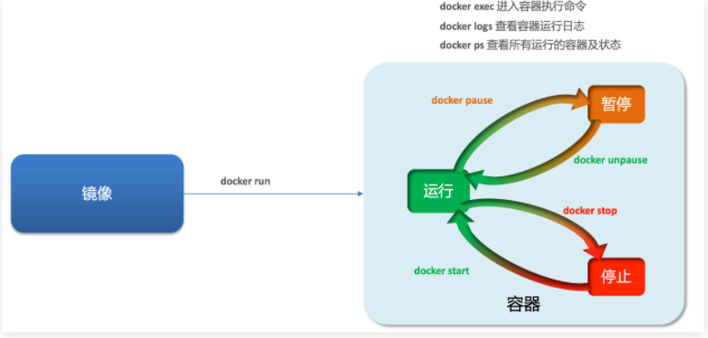

容器保护三个状态：

- 运行：进程正常运行
- 暂停：进程暂停，CPU不再运行，并不释放内存
- 停止：进程终止，回收进程占用的内存、CPU等资源

#### 命令

- docker run：创建并运行一个容器，处于运行状态
- docker pause：让一个运行的容器暂停
- docker unpause：让一个容器从暂停状态恢复运行
- docker stop：停止一个运行的容器
- docker start：让一个停止的容器再次运行
- docker rm：删除一个容器 

创建并运行nginx容器的命令：

```sh
docker run --name containerName -p 80:80 -d nginx

- docker run ：创建并运行一个容器
- --name : 给容器起一个名字，比如叫做mn
- -p ：将宿主机端口与容器端口映射，冒号左侧是宿主机端口，右侧是容器端口
- -d：后台运行容器
- nginx：镜像名称，例如nginx
```

进入容器，修改文件

```sh
docker exec -it mn bash

- docker exec ：进入容器内部，执行一个命令
- -it : 给当前进入的容器创建一个标准输入、输出终端，允许我们与容器交互
- mn ：要进入的容器的名称
- bash：进入容器后执行的命令，bash是一个linux终端交互命令
```

文件系统看档

修改index.html内容

```sh
sed -i -e 's#Welcome to nginx#传智教育欢迎您#g' -e 's#<head>#<head><meta charset="utf-8">#g' index.html
```

查看日志

```sh
docker logs
添加 -f 参数可以持续查看日志
```

查看容器状态

```sh
- docker ps
- docker ps -a 查看所有容器，包括已经停止的
```

### 数据卷

**数据卷（volume）**是一个虚拟目录，指向宿主机文件系统中的某个目录。


我们操作宿主机的/var/lib/docker/volumes/html目录，就等于操作容的/usr/share/nginx/html目录了

#### 命令

- docker volume create：创建数据卷
- docker volume ls：查看所有数据卷
- docker volume inspect：查看数据卷详细信息，包括关联的宿主机目录位置
- docker volume rm：删除指定数据卷
- docker volume prune：删除所有未使用的数据卷

```sh
docker volume [COMMAND]

- create 创建一个volume
- inspect 显示一个或多个volume的信息
- ls 列出所有的volume
- prune 删除未使用的volume
- rm 删除一个或多个指定的volume
```

创建数据卷

```sh
docker volume create html
```

查看所有数据

```sh
docker volume ls
```

查看数据卷详细信息卷

```sh
docker volume inspect html
```

#### 挂载数据卷

我们在创建容器时，可以通过 -v 参数来挂载一个数据卷到某个容器内目录，命令格式如下：

```sh
docker run \
  --name mn \
  -v html:/root/html \
  -v ...
  -p 8080:80
  nginx \
  
`-v html:/root/htm` ：把html数据卷挂载到容器内的/root/html这个目录中
```

eg

```sh
docker run --name mn -v html:/usr/share/nginx/html -p 80:80 -d nginx

# 查看html数据卷的位置
docker volume inspect html
# 进入该目录
cd /var/lib/docker/volumes/html/_data
# 修改文件
vi index.html
```

#### 挂在到本地

- 带数据卷模式：宿主机目录 --> 数据卷 ---> 容器内目录
- 直接挂载模式：宿主机目录 ---> 容器内目录

```
- -v [宿主机目录]:[容器内目录]
- -v [宿主机文件]:[容器内文件]

docker run --name mysql -v /tmp/mysql/data:/usr/share/nginx/html -v /tmp/mysql/conf/hmy.cnf -p 3306:3306 -d nginx
```

### 自定义镜像

#### 镜像结构

镜像是将应用程序及其需要的系统函数库、环境、配置、依赖打包而成。


#### Dockerfile语法

构建自定义的镜像时，并不需要一个个文件去拷贝，打包。

我们只需要告诉Docker，我们的镜像的组成，需要哪些BaseImage、需要拷贝什么文件、需要安装什么依赖、启动脚本是什么，将来Docker会帮助我们构建镜像。而描述上述信息的文件就是Dockerfile文件。


#### 操作

#### 构建

上传文件


其中的内容如下：

```dockerfile
# 指定基础镜像
FROM ubuntu:16.04
# 配置环境变量，JDK的安装目录
ENV JAVA_DIR=/usr/local

# 拷贝jdk和java项目的包
COPY ./jdk8.tar.gz $JAVA_DIR/
COPY ./docker-demo.jar /tmp/app.jar

# 安装JDK
RUN cd $JAVA_DIR \
 && tar -xf ./jdk8.tar.gz \
 && mv ./jdk1.8.0_144 ./java8

# 配置环境变量
ENV JAVA_HOME=$JAVA_DIR/java8
ENV PATH=$PATH:$JAVA_HOME/bin

# 暴露端口
EXPOSE 8090
# 入口，java项目的启动命令
ENTRYPOINT java -jar /tmp/app.jar
```

进入docker-demo

```
将准备好的docker-demo上传到虚拟机任意目录，然后进入docker-demo目录下
```

运行命令

```
docker build -t javaweb:1.0 .
```

#### 基于java8构建Java项目

虽然我们可以基于Ubuntu基础镜像，添加任意自己需要的安装包，构建镜像，但是却比较麻烦。所以大多数情况下，我们都可以在一些安装了部分软件的基础镜像上做改造。

需求：基于java:8-alpine镜像，将一个Java项目构建为镜像

实现思路如下：

- ① 新建一个空的目录，然后在目录中新建一个文件，命名为Dockerfile

- ② 拷贝课前资料提供的docker-demo.jar到这个目录中

- ③ 编写Dockerfile文件：

  - a ）基于java:8-alpine作为基础镜像

  - b ）将app.jar拷贝到镜像中

  - c ）暴露端口

  - d ）编写入口ENTRYPOINT

    内容如下：

```
FROM java:8-alpine
COPY ./app.jar /tmp/app.jar
EXPOSE 8090
ENTRYPOINT java -jar /tmp/app.jar
```

```sh
docker build -t javaweb:1.0 .
```

## Docker-Compose

Docker Compose可以基于Compose文件帮我们快速的部署分布式应用，而无需手动一个个创建和运行容器！

### 快速入门

```yml
version: "3.8"
services:
  mysql:
    image: mysql:5.7.25
    environment:
     MYSQL_ROOT_PASSWORD: 123 
    volumes:
     - "/tmp/mysql/data:/var/lib/mysql"
     - "/tmp/mysql/conf/hmy.cnf:/etc/mysql/conf.d/hmy.cnf"
  web:
    build: .
    ports:
     - "8090:8090"
```

上面的Compose文件就描述一个项目，其中包含两个容器：

- mysql：一个基于`mysql:5.7.25`镜像构建的容器，并且挂载了两个目录
- web：一个基于`docker build`临时构建的镜像容器，映射端口时8090

DockerCompose的详细语法参考官网：https://docs.docker.com/compose/compose-file/

> 其实DockerCompose文件可以看做是将多个docker run命令写到一个文件，只是语法稍有差异。

### 部署微服务集群

**实现思路**：

① 查看课前资料提供的cloud-demo文件夹，里面已经编写好了docker-compose文件

② 修改自己的cloud-demo项目，将数据库、nacos地址都命名为docker-compose中的服务名

③ 使用maven打包工具，将项目中的每个微服务都打包为app.jar

④ 将打包好的app.jar拷贝到cloud-demo中的每一个对应的子目录中

⑤ 将cloud-demo上传至虚拟机，利用 docker-compose up -d 来部署

```yml
version: "3.2"

services:
  nacos:
    image: nacos/nacos-server
    environment:
      MODE: standalone
    ports:
      - "8848:8848"
  mysql:
    image: mysql:5.7.25
    environment:
      MYSQL_ROOT_PASSWORD: 123
    volumes:
      - "$PWD/mysql/data:/var/lib/mysql"
      - "$PWD/mysql/conf:/etc/mysql/conf.d/"
  userservice:
    build: ./user-service
  orderservice:
    build: ./order-service
  gateway:
    build: ./gateway
    ports:
      - "10010:10010"
```

- `nacos`：作为注册中心和配置中心
  - `image: nacos/nacos-server`： 基于nacos/nacos-server镜像构建
  - `environment`：环境变量
    - `MODE: standalone`：单点模式启动
  - `ports`：端口映射，这里暴露了8848端口
- `mysql`：数据库
  - `image: mysql:5.7.25`：镜像版本是mysql:5.7.25
  - `environment`：环境变量
    - `MYSQL_ROOT_PASSWORD: 123`：设置数据库root账户的密码为123
  - `volumes`：数据卷挂载，这里挂载了mysql的data、conf目录，其中有我提前准备好的数据
- `userservice`、`orderservice`、`gateway`：都是基于Dockerfile临时构建的

> 因为微服务将来要部署为docker容器，而容器之间互联不是通过IP地址，而是通过容器名。这里我们将order-service、user-service、gateway服务的mysql、nacos地址都修改为基于容器名的访问。

## Docker镜像仓库

### 简化版镜像仓库

Docker官方的Docker Registry是一个基础版本的Docker镜像仓库，具备仓库管理的完整功能，但是没有图形化界面。

搭建方式比较简单，命令如下：

```sh
docker run -d \
    --restart=always \
    --name registry	\
    -p 5000:5000 \
    -v registry-data:/var/lib/registry \
    registry
```


命令中挂载了一个数据卷registry-data到容器内的/var/lib/registry 目录，这是私有镜像库存放数据的目录。

访问http://YourIp:5000/v2/_catalog 可以查看当前私有镜像服务中包含的镜像


### 带有图形化界面版本

```
version: '3.0'
services:
  registry:
    image: registry
    volumes:
      - ./registry-data:/var/lib/registry
  ui:
    image: joxit/docker-registry-ui:static
    ports:
      - 8080:80
    environment:
      - REGISTRY_TITLE=传智教育私有仓库
      - REGISTRY_URL=http://registry:5000
    depends_on:
      - registry
```

### 配置Docker信任地址

```sh
# 打开要修改的文件
vi /etc/docker/daemon.json
# 添加内容：
"insecure-registries":["http://192.168.150.101:8080"]
# 重加载
systemctl daemon-reload
# 重启docker
systemctl restart docker
```

### 操作

① 重新tag本地镜像，名称前缀为私有仓库的地址：192.168.150.101:8080/

 ```sh
docker tag nginx:latest 192.168.150.101:8080/nginx:1.0 
 ```


② 推送镜像

```sh
docker push 192.168.150.101:8080/nginx:1.0 
```


③ 拉取镜像

```sh
docker pull 192.168.150.101:8080/nginx:1.0 
```

# K8s


# MQ

## 同步通信和异步通信

微服务间通讯有同步和异步两种方式：

同步通讯：就像打电话，需要实时响应。

异步通讯：就像发邮件，不需要马上回复。

### 同步同行

我们之前学习的Feign调用就属于同步方式，虽然调用可以实时得到结果，但存在下面的问题：

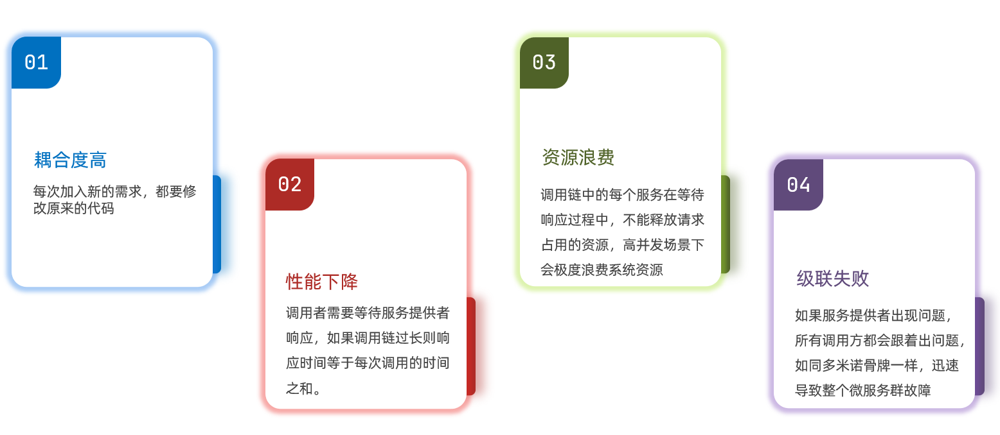

总结：

同步调用的优点：

- 时效性较强，可以立即得到结果

同步调用的问题：

- 耦合度高
- 性能和吞吐能力下降
- 有额外的资源消耗
- 有级联失败问题

### 异步通信

异步调用则可以避免上述问题：

​	我们以购买商品为例，用户支付后需要调用订单服务完成订单状态修改，调用物流服务，从仓库分配响应的库存并准备发货。

​	在事件模式中，支付服务是事件发布者（publisher），在支付完成后只需要发布一个支付成功的事件（event），事件中带上订单id。

​	订单服务和物流服务是事件订阅者（Consumer），订阅支付成功的事件，监听到事件后完成自己业务即可。

​	为了解除事件发布者与订阅者之间的耦合，两者并不是直接通信，而是有一个中间人（Broker）。发布者发布事件到Broker，不关心谁来订阅事件。订阅者从Broker订阅事件，不关心谁发来的消息。


Broker 是一个像数据总线一样的东西，所有的服务要接收数据和发送数据都发到这个总线上，这个总线就像协议一样，让服务间的通讯变得标准和可控。

好处：

- 吞吐量提升：无需等待订阅者处理完成，响应更快速

- 故障隔离：服务没有直接调用，不存在级联失败问题
- 调用间没有阻塞，不会造成无效的资源占用
- 耦合度极低，每个服务都可以灵活插拔，可替换
- 流量削峰：不管发布事件的流量波动多大，都由Broker接收，订阅者可以按照自己的速度去处理事件

缺点：

- 架构复杂了，业务没有明显的流程线，不好管理
- 需要依赖于Broker的可靠、安全、性能

好在现在开源软件或云平台上 Broker 的软件是非常成熟的，比较常见的一种就是我们今天要学习的MQ技术。

### 技术对比

MQ，中文是消息队列（MessageQueue），字面来看就是存放消息的队列。也就是事件驱动架构中的Broker。

比较常见的MQ实现：

- ActiveMQ
- RabbitMQ
- RocketMQ
- Kafka

|            | **RabbitMQ**            | **ActiveMQ**                   | **RocketMQ** | **Kafka**  |
| ---------- | ----------------------- | ------------------------------ | ------------ | ---------- |
| 公司/社区  | Rabbit                  | Apache                         | 阿里         | Apache     |
| 开发语言   | Erlang                  | Java                           | Java         | Scala&Java |
| 协议支持   | AMQP，XMPP，SMTP，STOMP | OpenWire,STOMP，REST,XMPP,AMQP | 自定义协议   | 自定义协议 |
| 可用性     | 高                      | 一般                           | 高           | 高         |
| 单机吞吐量 | 一般                    | 差                             | 高           | 非常高     |
| 消息延迟   | 微秒级                  | 毫秒级                         | 毫秒级       | 毫秒以内   |
| 消息可靠性 | 高                      | 一般                           | 高           | 一般       |

追求可用性：Kafka、 RocketMQ 、RabbitMQ

追求可靠性：RabbitMQ、RocketMQ

追求吞吐能力：RocketMQ、Kafka

追求消息低延迟：RabbitMQ、Kafka

## RabbitMq

### 简介

#### 安装

```bash
$ docker run -d  --name mq -e RABBITMQ_DEFAULT_USER=root -e RABBITMQ_DEFAULT_PASS=root -p 15672:15672 -p 5672:5672 rabbitmq
```

RabbitMQ中的一些角色：

- publisher：生产者
- consumer：消费者
- exchange个：交换机，负责消息路由
- queue：队列，存储消息
- virtualHost：虚拟主机，隔离不同租户的exchange、queue、消息的隔离

#### RabbitMQ消息模型

RabbitMQ官方提供了5个不同的Demo示例，对应了不同的消息模型：


### 快速入门

#### 消息发送者

- 建立连接
- 创建Channel
- 声明队列
- 发送消息
- 关闭连接和channel

```java
package cn.itcast.mq.helloworld;

import com.rabbitmq.client.Channel;
import com.rabbitmq.client.Connection;
import com.rabbitmq.client.ConnectionFactory;
import org.junit.Test;

import java.io.IOException;
import java.util.concurrent.TimeoutException;

public class PublisherTest {
    @Test
    public void testSendMessage() throws IOException, TimeoutException {
        // 1.建立连接
        ConnectionFactory factory = new ConnectionFactory();
        // 1.1.设置连接参数，分别是：主机名、端口号、vhost、用户名、密码
        factory.setHost("192.168.150.101");
        factory.setPort(5672);
        factory.setVirtualHost("/");
        factory.setUsername("itcast");
        factory.setPassword("123321");
        // 1.2.建立连接
        Connection connection = factory.newConnection();

        // 2.创建通道Channel
        Channel channel = connection.createChannel();

        // 3.创建队列
        String queueName = "simple.queue";
        channel.queueDeclare(queueName, false, false, false, null);

        // 4.发送消息
        String message = "hello, rabbitmq!";
        channel.basicPublish("", queueName, null, message.getBytes());
        System.out.println("发送消息成功：【" + message + "】");

        // 5.关闭通道和连接
        channel.close();
        connection.close();

    }
}
```

#### 消息订阅者实现

代码思路：

- 建立连接
- 创建Channel
- 声明队列
- 订阅消息

```java
package cn.itcast.mq.helloworld;

import com.rabbitmq.client.*;

import java.io.IOException;
import java.util.concurrent.TimeoutException;

public class ConsumerTest {

    public static void main(String[] args) throws IOException, TimeoutException {
        // 1.建立连接
        ConnectionFactory factory = new ConnectionFactory();
        // 1.1.设置连接参数，分别是：主机名、端口号、vhost、用户名、密码
        factory.setHost("192.168.150.101");
        factory.setPort(5672);
        factory.setVirtualHost("/");
        factory.setUsername("itcast");
        factory.setPassword("123321");
        // 1.2.建立连接
        Connection connection = factory.newConnection();

        // 2.创建通道Channel
        Channel channel = connection.createChannel();

        // 3.创建队列
        String queueName = "simple.queue";
        channel.queueDeclare(queueName, false, false, false, null);

        // 4.订阅消息
        channel.basicConsume(queueName, true, new DefaultConsumer(channel){
            @Override
            public void handleDelivery(String consumerTag, Envelope envelope,
                                       AMQP.BasicProperties properties, byte[] body) throws IOException {
                // 5.处理消息
                String message = new String(body);
                System.out.println("接收到消息：【" + message + "】");
            }
        });
        System.out.println("等待接收消息。。。。");
    }
}
```

### SpringAMQP

SpringAMQP是基于RabbitMQ封装的一套模板，并且还利用SpringBoot对其实现了自动装配，使用起来非常方便。

SpringAmqp的官方地址：https://spring.io/projects/spring-amqp


SpringAMQP提供了三个功能：

- 自动声明队列、交换机及其绑定关系
- 基于注解的监听器模式，异步接收消息
- 封装了RabbitTemplate工具，用于发送消息 

#### 配置

yml

```yaml
spring:
 
```

#### 简单队列模型

消息发送

```java
@RunWith(SpringRunner.class)
@SpringBootTest
public class SpringAmqpTest {

    @Autowired
    private RabbitTemplate rabbitTemplate;

    @Test
    public void testSimpleQueue() {
        // 队列名称
        String queueName = "simple.queue";
        // 消息
        String message = "hello, spring amqp!";
        // 发送消息
        rabbitTemplate.convertAndSend(queueName, message);
    }
}
```

消息接受

```java
@Component
public class SpringRabbitListener {

    @RabbitListener(queues = "simple.queue")//以创建
    //@RabbitListener(queuesToDeclare = {@Queue(name = "q1"),@Queue(name = "q2")})创建并连接
    public void listenSimpleQueueMessage(String msg) throws InterruptedException {
        System.out.println("spring 消费者接收到消息：【" + msg + "】");
    }
}
```

#### 工作队列模型


Work queues，也被称为（Task queues），任务模型。简单来说就是**让多个消费者绑定到一个队列，共同消费队列中的消息**。

消息发送

```java
/**
     * workQueue
     * 向队列中不停发送消息，模拟消息堆积。
     */
@Test
public void testWorkQueue() throws InterruptedException {
    // 队列名称
    String queueName = "simple.queue";
    // 消息
    String message = "hello, message_";
    for (int i = 0; i < 50; i++) {
        // 发送消息
        rabbitTemplate.convertAndSend(queueName, message + i);
        Thread.sleep(20);
    }
}
```

消息接受

```java
@RabbitListener(queues = "simple.queue")
public void listenWorkQueue1(String msg) throws InterruptedException {
    System.out.println("消费者1接收到消息：【" + msg + "】" + LocalTime.now());
    Thread.sleep(20);
}

@RabbitListener(queues = "simple.queue")
public void listenWorkQueue2(String msg) throws InterruptedException {
    System.err.println("消费者2........接收到消息：【" + msg + "】" + LocalTime.now());
    Thread.sleep(200);
}
```

> 也就是说消息是平均分配给每个消费者

配置能者多劳

```yaml
spring:
  rabbitmq:
    listener:
      simple:
        prefetch: 1 # 每次只能获取一条消息，处理完成才能获取下一个消息
```

> - 多个消费者绑定到一个队列，同一条消息只会被一个消费者处理
> - 通过设置prefetch来控制消费者预取的消息数量
>

#### 发布订阅模型


- Publisher：生产者，也就是要发送消息的程序，但是不再发送到队列中，而是发给X（交换机）
- Exchange：交换机，图中的X。一方面，接收生产者发送的消息。另一方面，知道如何处理消息，例如递交给某个特别队列、递交给所有队列、或是将消息丢弃。到底如何操作，取决于Exchange的类型。Exchange有以下3种类型：
  - Fanout：广播，将消息交给所有绑定到交换机的队列
  - Direct：定向，把消息交给符合指定routing key 的队列
  - Topic：通配符，把消息交给符合routing pattern（路由模式） 的队列
- Consumer：消费者，与以前一样，订阅队列，没有变化
- Queue：消息队列也与以前一样，接收消息、缓存消息。

> **Exchange（交换机）只负责转发消息，不具备存储消息的能力**，因此如果没有任何队列与Exchange绑定，或者没有符合路由规则的队列，那么消息会丢失！

##### **Fanout（广播）**

在广播模式下，消息发送流程是这样的：

- 1）  可以有多个队列
- 2）  每个队列都要绑定到Exchange（交换机）
- 3）  生产者发送的消息，只能发送到交换机，交换机来决定要发给哪个队列，生产者无法决定
- 4）  交换机把消息发送给绑定过的所有队列
- 5）  订阅队列的消费者都能拿到消息

声明队列和交换机并绑定

```java
@Configuration
public class FanoutConfig {
    /**
     * 声明交换机
     * @return Fanout类型交换机
     */
    @Bean
    public FanoutExchange fanoutExchange(){
        return new FanoutExchange("itcast.fanout");
    }

    /**
     * 第1个队列
     */
    @Bean
    public Queue fanoutQueue1(){
        return new Queue("fanout.queue1");
    }

    /**
     * 绑定队列和交换机
     */
    @Bean
    public Binding bindingQueue1(Queue fanoutQueue1, FanoutExchange fanoutExchange){
        return BindingBuilder.bind(fanoutQueue1).to(fanoutExchange);
    }

    /**
     * 第2个队列
     */
    @Bean
    public Queue fanoutQueue2(){
        return new Queue("fanout.queue2");
    }

    /**
     * 绑定队列和交换机
     */
    @Bean
    public Binding bindingQueue2(Queue fanoutQueue2, FanoutExchange fanoutExchange){
        return BindingBuilder.bind(fanoutQueue2).to(fanoutExchange);
    }
}
```

消息发送

```java
@Test
public void testFanoutExchange() {
    // 交换机名称
    String exchangeName = "itcast.fanout";
    // 消息
    String message = "hello, everyone!";
    rabbitTemplate.convertAndSend(exchangeName, "", message);
}
```

消息接受

```java
@RabbitListener(queues = "fanout.queue1")
public void listenFanoutQueue1(String msg) {
    System.out.println("消费者1接收到Fanout消息：【" + msg + "】");
}

@RabbitListener(queues = "fanout.queue2")
public void listenFanoutQueue2(String msg) {
    System.out.println("消费者2接收到Fanout消息：【" + msg + "】");
}
```

##### Direct（路由）


- 队列与交换机的绑定，不能是任意绑定了，而是要指定一个`RoutingKey`（路由key）
- 消息的发送方在 向 Exchange发送消息时，也必须指定消息的 `RoutingKey`。
- Exchange不再把消息交给每一个绑定的队列，而是根据消息的`Routing Key`进行判断，只有队列的`Routingkey`与消息的 `Routing key`完全一致，才会接收到消息

**基于注解声明队列和交换机**

```java
@RabbitListener(bindings = @QueueBinding(
    value = @Queue(name = "direct.queue1"),
    exchange = @Exchange(name = "itcast.direct", type = ExchangeTypes.DIRECT),
    key = {"red", "blue"}
))
public void listenDirectQueue1(String msg){
    System.out.println("消费者接收到direct.queue1的消息：【" + msg + "】");
}
```

**消息发送**

```java
@Test
public void testSendDirectExchange() {
    // 交换机名称
    String exchangeName = "itcast.direct";
    // 消息
    String message = "红色警报！日本乱排核废水，导致海洋生物变异，惊现哥斯拉！";
    // 发送消息
    rabbitTemplate.convertAndSend(exchangeName, "red", message);
}
```

##### Topic（路由）


`Topic`类型的`Exchange`与`Direct`相比，都是可以根据`RoutingKey`把消息路由到不同的队列。只不过`Topic`类型`Exchange`可以让队列在绑定`Routing key` 的时候使用通配符！


`Routingkey` 一般都是有一个或多个单词组成，多个单词之间以”.”分割，例如： `item.insert`

 通配符规则：

`#`：匹配一个或多个词

`*`：匹配不多不少恰好1个词


举例：

`item.#`：能够匹配`item.spu.insert` 或者 `item.spu`

`item.*`：只能匹配`item.spu`

**消息发送**

```java
/**
     * topicExchange
     */
@Test
public void testSendTopicExchange() {
    // 交换机名称
    String exchangeName = "itcast.topic";
    // 消息
    String message = "喜报！孙悟空大战哥斯拉，胜!";
    // 发送消息
    rabbitTemplate.convertAndSend(exchangeName, "china.news", message);
}
```

**消息接收**

```java
@RabbitListener(bindings = @QueueBinding(
    value = @Queue(name = "topic.queue2"),
    exchange = @Exchange(name = "itcast.topic", type = ExchangeTypes.TOPIC),
    key = "#.news"
))
public void listenTopicQueue2(String msg){
    System.out.println("消费者接收到topic.queue2的消息：【" + msg + "】");
}
```

#### 消息转换器

之前说过，Spring会把你发送的消息序列化为字节发送给MQ，接收消息的时候，还会把字节反序列化为Java对象。

只不过，默认情况下Spring采用的序列化方式是JDK序列化。众所周知，JDK序列化存在下列问题：

- 数据体积过大
- 有安全漏洞
- 可读性差

##### 配置Json转换器

在publisher和consumer两个服务中都引入依赖：

```xml
<dependency>
    <groupId>com.fasterxml.jackson.dataformat</groupId>
    <artifactId>jackson-dataformat-xml</artifactId>
    <version>2.9.10</version>
</dependency>
```

添加启动类

```java
@Bean
public MessageConverter jsonMessageConverter(){
    return new Jackson2JsonMessageConverter();
}
```

# Elasticsearch

## 简介

elasticsearch是一款非常强大的开源搜索引擎，具备非常多强大功能，可以帮助我们从海量数据中快速找到需要的内容

elasticsearch结合kibana、Logstash、Beats，也就是elastic stack（ELK）。被广泛应用在日志数据分析、实时监控等领域：


### 正向索引

如果是根据id查询，那么直接走索引，查询速度非常快。

但如果是基于title做模糊查询，只能是逐行扫描数据，流程如下：

1）用户搜索数据，条件是title符合`"%手机%"`

2）逐行获取数据，比如id为1的数据

3）判断数据中的title是否符合用户搜索条件

4）如果符合则放入结果集，不符合则丢弃。回到步骤1

逐行扫描，也就是全表扫描，随着数据量增加，其查询效率也会越来越低。当数据量达到数百万时，就是一场灾难。

### 倒排索引

- 文档（`Document`）：用来搜索的数据，其中的每一条数据就是一个文档。例如一个网页、一个商品信息
- 词条（`Term`）：对文档数据或用户搜索数据，利用某种算法分词，得到的具备含义的词语就是词条。例如：我是中国人，就可以分为：我、是、中国人、中国、国人这样的几个词条

**创建倒排索引**是对正向索引的一种特殊处理，流程如下：

- 将每一个文档的数据利用算法分词，得到一个个词条
- 创建表，每行数据包括词条、词条所在文档id、位置等信息
- 因为词条唯一性，可以给词条创建索引，例如hash表结构索引

如图：


倒排索引的**搜索流程**如下（以搜索"华为手机"为例）：

1）用户输入条件`"华为手机"`进行搜索。

2）对用户输入内容**分词**，得到词条：`华为`、`手机`。

3）拿着词条在倒排索引中查找，可以得到包含词条的文档id：1、2、3。

4）拿着文档id到正向索引中查找具体文档。


> **正向索引**：
>
> - 优点：
>   - 可以给多个字段创建索引
>   - 根据索引字段搜索、排序速度非常快
> - 缺点：
>   - 根据非索引字段，或者索引字段中的部分词条查找时，只能全表扫描。
>
> **倒排索引**：
>
> - 优点：
>   - 根据词条搜索、模糊搜索时，速度非常快
> - 缺点：
>   - 只能给词条创建索引，而不是字段
>   - 无法根据字段做排序
>

### 概念

**文档和字段**

elasticsearch是面向**文档（Document）**存储的，可以是数据库中的一条商品数据，一个订单信息。文档数据会被序列化为json格式后存储在elasticsearch中

而Json文档中往往包含很多的**字段（Field）**，类似于数据库中的列。

**索引和映射**

**索引（Index）**，就是相同类型的文档的集合。

例如：

- 所有用户文档，就可以组织在一起，称为用户的索引；
- 所有商品的文档，可以组织在一起，称为商品的索引；
- 所有订单的文档，可以组织在一起，称为订单的索引；


数据库的表会有约束信息，用来定义表的结构、字段的名称、类型等信息。因此，索引库中就有**映射（mapping）**，是索引中文档的字段约束信息，类似表的结构约束。

> | **MySQL** | **Elasticsearch** | **说明**                                                     |
> | --------- | ----------------- | ------------------------------------------------------------ |
> | Table     | Index             | 索引(index)，就是文档的集合，类似数据库的表(table)           |
> | Row       | Document          | 文档（Document），就是一条条的数据，类似数据库中的行（Row），文档都是JSON格式 |
> | Column    | Field             | 字段（Field），就是JSON文档中的字段，类似数据库中的列（Column） |
> | Schema    | Mapping           | Mapping（映射）是索引中文档的约束，例如字段类型约束。类似数据库的表结构（Schema） |
> | SQL       | DSL               | DSL是elasticsearch提供的JSON风格的请求语句，用来操作elasticsearch，实现CRUD |

因此在企业中，往往是两者结合使用：

- 对安全性要求较高的写操作，使用mysql实现
- 对查询性能要求较高的搜索需求，使用elasticsearch实现
- 两者再基于某种方式，实现数据的同步，保证一致性


安装

```bash
docker run -d --name es  -e "ES_JAVA_OPTS=-Xms512m -Xmx512m" -e "discovery.type=single-node" -v es-data:/usr/share/elasticsearch/data -v es-plugins:/usr/share/elasticsearch/plugins --privileged --ip 173.18.0.2 -p 9200:9200 -p 9300:9300 elasticsearch:7.12.1
```

```bash
docker run -d --name kibana -e ELASTICSEARCH_HOSTS=http://173.18.0.2:9200  -p 5601:5601  kibana:7.12.1
```

分词器

```elm
GET /_analyze
{
  "analyzer": "ik_max_word",
  "text": "黑马程序员学习java太棒了"
}

* `ik_smart`：最少切分

* `ik_max_word`：最细切分
```

## 操作

### 索引库操作

#### mapping映射属性

mapping是对索引库中文档的约束，常见的mapping属性包括：

- type：字段数据类型，常见的简单类型有：
  - 字符串：text（可分词的文本）、keyword（精确值，例如：品牌、国家、ip地址）
  - 数值：long、integer、short、byte、double、float、
  - 布尔：boolean
  - 日期：date
  - 对象：object
- index：是否创建索引，默认为true
- analyzer：使用哪种分词器
- properties：该字段的子字段

#### 创建索引库

```json
PUT /索引库名称
{
  "mappings": {
    "properties": {
      "字段名":{
        "type": "text",
        "analyzer": "ik_smart"
      },
      "字段名2":{
        "type": "keyword",
        "index": "false"
      },
      "字段名3":{
        "properties": {
          "子字段": {
            "type": "keyword"
          }
        }
      },
      // ...略
    }
  }
}
```

#### 查询索引库

```json
GET /索引库名
```

#### 修改索引库

索引库**一旦创建，无法修改mapping**。

但是却允许添加新的字段到mapping中

```json
PUT /索引库名/_mapping
{
  "properties": {
    "新字段名":{
      "type": "integer"
    }
  }
}
```

#### 删除索引库

```json
DELETE /索引库名
```

### 文档操作

#### 新增文档

```json
POST /索引库名/_doc/文档id
{
    "字段1": "值1",
    "字段2": "值2",
    "字段3": {
        "子属性1": "值3",
        "子属性2": "值4"
    },
    // ...
}
```

#### 查询文档

```json
GET /{索引库名称}/_doc/{id}
```

#### 删除文档

```json
DELETE /{索引库名}/_doc/id值
```

#### 修改文档

- 全量修改：直接覆盖原来的文档

  - 根据指定的id删除文档
  - 新增一个相同id的文档

  ```json
  PUT /{索引库名}/_doc/文档id
  {
      "字段1": "值1",
      "字段2": "值2",
      // ... 略
  }
  ```

- 增量修改：修改文档中的部分字段

  - 增量修改是只修改指定id匹配的文档中的部分字段。

  ```json
  POST /{索引库名}/_update/文档id
  {
      "doc": {
           "字段名": "新的值",
      }
  }
  ```

## RestAPI

```xml
<dependency>
    <groupId>org.elasticsearch.client</groupId>
    <artifactId>elasticsearch-rest-high-level-client</artifactId>
</dependency>

<properties>
    <java.version>1.8</java.version>
    <elasticsearch.version>7.12.1</elasticsearch.version>
</properties>

#始化
RestHighLevelClient client = new RestHighLevelClient(RestClient.builder(
        HttpHost.create("http://192.168.150.101:9200")
));
```

### 索引库操作

#### 创建索引库

```java
@Test
public void createHotelIndex() throws IOException {
    RestHighLevelClient restHighLevelClient = new RestHighLevelClient(RestClient.builder(HttpHost.create("http://192.168.10.11:9200")));
    // 1.创建Request对象
    CreateIndexRequest request = new CreateIndexRequest("hotel");
    // 2.准备请求的参数：DSL语句
    request.source(MAPPING_TEMPLATE,XContentType.JSON);
    // 3.发送请求
    restHighLevelClient.indices().create(request,RequestOptions.DEFAULT);
    restHighLevelClient.close();
}
```

#### 删除索引库

```java
 @Test
    public void deleteHotelIndex() throws IOException {
        RestHighLevelClient restHighLevelClient = new RestHighLevelClient(RestClient.builder(HttpHost.create("http://192.168.10.11:9200")));
        // 1.创建Request对象
        DeleteIndexRequest request = new DeleteIndexRequest("hotel");
        // 2.准备请求的参数：DSL语句
        // 3.发送请求
        restHighLevelClient.indices().delete(request, RequestOptions.DEFAULT);
        restHighLevelClient.close();
    }
```

#### 判断索引库是否存在

```java
    @Test
    public void existsHotelIndex() throws IOException {
        RestHighLevelClient restHighLevelClient = new RestHighLevelClient(RestClient.builder(HttpHost.create("http://192.168.10.11:9200")));
        // 1.创建Request对象
        GetIndexRequest request = new GetIndexRequest("hotel");
        // 2.准备请求的参数：DSL语句
        // 3.发送请求
        boolean exists = restHighLevelClient.indices().exists(request, RequestOptions.DEFAULT);
        System.err.println(exists?"存在":"不存在");
        restHighLevelClient.close();
    }
```

### 文档操作

#### 新增文档

> POST /{索引库名}/_doc/1
> {
>     "name": "Jack",
>     "age": 21
> }

```java
    @Test
    public void addDocument() throws IOException {
        Hotel byId = hotelService.getById(36934);
        HotelDoc hotelDoc = new HotelDoc(byId);
        System.out.println(hotelDoc);

        RestHighLevelClient restHighLevelClient = new RestHighLevelClient(RestClient.builder(HttpHost.create("http://192.168.10.11:9200")));
        // 1.准备Request对象
        IndexRequest request = new IndexRequest("hotel").id(hotelDoc.getId().toString());
        // 2.准备Json文档
        request.source(JSON.toJSONString(hotelDoc),XContentType.JSON);
        // 3.发送请求
        restHighLevelClient.index(request, RequestOptions.DEFAULT);
        restHighLevelClient.close();
    }
```

#### 查询文档

> GET /hotel/_doc/{id}

```java
    @Test
    public void getDocument() throws IOException {
        RestHighLevelClient restHighLevelClient = new RestHighLevelClient(RestClient.builder(HttpHost.create("http://192.168.10.11:9200")));
        // 1.准备Request对象
        GetRequest request = new GetRequest("hotel", "36934");
        // 2.准备Json文
        // 3.发送请求
        GetResponse documentFields = restHighLevelClient.get(request, RequestOptions.DEFAULT);
        String json = documentFields.getSourceAsString();
        HotelDoc hotelDoc = JSON.parseObject(json, HotelDoc.class);
        System.out.println(hotelDoc);
        restHighLevelClient.close();
    }
```

#### 删除文档

> DELETE /hotel/_doc/{id}

```java
    @Test
    public void deleteDocument() throws IOException {
        RestHighLevelClient restHighLevelClient = new RestHighLevelClient(RestClient.builder(HttpHost.create("http://192.168.10.11:9200")));
        // 1.准备Request对象
        DeleteRequest request = new DeleteRequest("hotel", "36934");
        // 2.准备Json文
        // 3.发送请求
        restHighLevelClient.delete(request, RequestOptions.DEFAULT);
        restHighLevelClient.close();
    }
```

#### 修改文档

全量修改：与新增的API完全一致，判断依据是ID

增量修改：修改文档中的指定字段值

```java
    @Test
    public void updataDocument() throws IOException {
        RestHighLevelClient restHighLevelClient = new RestHighLevelClient(RestClient.builder(HttpHost.create("http://192.168.10.11:9200")));
        // 1.准备Request对象
        UpdateRequest request = new UpdateRequest("hotel", "36934");
        // 2.准备Json文
        request.doc("price","952","starName","四钻");
        // 3.发送请求
        restHighLevelClient.update(request, RequestOptions.DEFAULT);
        restHighLevelClient.close();
    }
```

#### 批量导入

```
    @Test
    public void Document() throws IOException {
        List<Hotel> list = hotelService.list();

        RestHighLevelClient restHighLevelClient = new RestHighLevelClient(RestClient.builder(HttpHost.create("http://192.168.10.11:9200")));
        // 1.准备Request对象
        BulkRequest request = new BulkRequest();
        // 2.准备Json文
        list.forEach(s->{
            HotelDoc hotelDoc = new HotelDoc(s);
            request.add(new IndexRequest("hotel").id(hotelDoc.getId().toString()).source(JSON.toJSONString(hotelDoc),XContentType.JSON ));
        });

        // 3.发送请求
        restHighLevelClient.bulk(request, RequestOptions.DEFAULT);
        restHighLevelClient.close();
    }
```

> 批量查询
>
>  GET /hotel/_search

## DSL

Elasticsearch提供了基于JSON的DSL（[Domain Specific Language](https://www.elastic.co/guide/en/elasticsearch/reference/current/query-dsl.html)）来定义查询。常见的查询类型包括：

### 查询文档

#### **查询所有**

查询出所有数据，一般测试用。

```json


// 查询所有
GET /indexName/_search

GET /indexName/_search
{
  "query": {
    "match_all": {
    }
  }
}
```

#### **全文检索查询**

利用分词器对用户输入内容分词，然后去倒排索引库中匹配。

```json
//单字段查询
GET /indexName/_search
{
  "query": {
    "match": {
      "FIELD": "TEXT"
    }
  }
}

//多字段查询
GET /indexName/_search
{
  "query": {
    "multi_match": {
      "query": "TEXT",
      "fields": ["FIELD1", " FIELD12"]
    }
  }
}
```

> 因为我们将brand、name、business值都利用copy_to复制到了all字段中。因此你根据三个字段搜索，和根据all字段搜索效果当然一样了。但是，搜索字段越多，对查询性能影响越大，因此建议采用copy_to，然后单字段查询的方式。
>

#### **精确查询**

根据精确词条值查找数据，一般是查找keyword、数值、日期、boolean等类型字段。

```json
//term查询（精确查询）
GET /indexName/_search
{
  "query": {
    "term": {
      "FIELD": {
        "value": "VALUE"
      }
    }
  }
}


//range查询（范围查询）
GET /indexName/_search
{
  "query": {
    "range": {
      "FIELD": {
        "gte": 10, // 这里的gte代表大于等于，gt则代表大于
        "lte": 20 // lte代表小于等于，lt则代表小于
      }
    }
  }
}
```

#### **地理查询**

根据经纬度查询。

```json
//矩形范围查询（查询时，需要指定矩形的左上、右下两个点的坐标，然后画出一个矩形，落在该矩形内的都是符合条件的点。）

// geo_bounding_box查询
GET /indexName/_search
{
  "query": {
    "geo_bounding_box": {
      "FIELD": {
        "top_left": { // 左上点
          "lat": 31.1,
          "lon": 121.5
        },
        "bottom_right": { // 右下点
          "lat": 30.9,
          "lon": 121.7
        }
      }
    }
  }
}

//附近查询
// geo_distance 查询
GET /indexName/_search
{
  "query": {
    "geo_distance": {
      "distance": "15km", // 半径
      "FIELD": "31.21,121.5" // 圆心
    }
  }
}

```


#### **复合查询**

复合查询可以将上述各种查询条件组合起来，合并查询条

- fuction score：算分函数查询，可以控制文档相关性算分，控制文档排名
- bool query：布尔查询，利用逻辑关系组合多个其它的查询，实现复杂搜索

**相关性算分**

复合（compound）查询：复合查询可以将其它简单查询组合起来，实现更复杂的搜索逻辑。常见的有两种：

- fuction score：算分函数查询，可以控制文档相关性算分，控制文档排名
- bool query：布尔查询，利用逻辑关系组合多个其它的查询，实现复杂搜索


在后来的5.1版本升级中，elasticsearch将算法改进为BM25算法，公式如下：


**算分函数查询**

function score 查询中包含四部分内容：

- **原始查询**条件：query部分，基于这个条件搜索文档，并且基于BM25算法给文档打分，**原始算分**（query score)
- **过滤条件**：filter部分，符合该条件的文档才会重新算分
- **算分函数**：符合filter条件的文档要根据这个函数做运算，得到的**函数算分**（function score），有四种函数
  - weight：函数结果是常量
  - field_value_factor：以文档中的某个字段值作为函数结果
  - random_score：以随机数作为函数结果
  - script_score：自定义算分函数算法
- **运算模式**：算分函数的结果、原始查询的相关性算分，两者之间的运算方式，包括：
  - multiply：相乘
  - replace：用function score替换query score
  - 其它，例如：sum、avg、max、min

```json

GET /hotel/_search
{
  "query": {
    "function_score": {
      "query": {  .... }, // 原始查询，可以是任意条件
      "functions": [ // 算分函数
        {
          "filter": { // 满足的条件，品牌必须是如家
            "term": {
              "brand": "如家"
            }
          },
          "weight": 2 // 算分权重为2
        }
      ],
      "boost_mode": "sum" // 加权模式，求和
    }
  }
}

```

> function score的运行流程如下：
>
> - 1）根据**原始条件**查询搜索文档，并且计算相关性算分，称为**原始算分**（query score）
> - 2）根据**过滤条件**，过滤文档
> - 3）符合**过滤条件**的文档，基于**算分函数**运算，得到**函数算分**（function score）
> - 4）将**原始算分**（query score）和**函数算分**（function score）基于**运算模式**做运算，得到最终结果，作为相关性算分。
>
> 

**布尔查询**

布尔查询是一个或多个查询子句的组合，每一个子句就是一个**子查询**。子查询的组合方式有：

- must：必须匹配每个子查询，类似“与”
- should：选择性匹配子查询，类似“或”
- must_not：必须不匹配，**不参与算分**，类似“非”
- filter：必须匹配，**不参与算分**

```java
GET /hotel/_search
{
  "query": {
    "bool": {
      "must": [
        {"term": {"city": "上海" }}
      ],
      "should": [
        {"term": {"brand": "皇冠假日" }},
        {"term": {"brand": "华美达" }}
      ],
      "must_not": [
        { "range": { "price": { "lte": 500 } }}
      ],
      "filter": [
        { "range": {"score": { "gte": 45 } }}
      ]
    }
  }
}
```

### 搜索结果处理

#### 排序

elasticsearch默认是根据相关度算分（_score）来排序，但是也支持自定义方式对搜索[结果排序](https://www.elastic.co/guide/en/elasticsearch/reference/current/sort-search-results.html)。可以排序字段类型有：keyword类型、数值类型、地理坐标类型、日期类型等。

```json
//普通字段排序
GET /indexName/_search
{
  "query": {
    "match_all": {}
  },
  "sort": [
    {
      "FIELD": "desc"  // 排序字段、排序方式ASC、DESC
    }
  ]
}
```

> 排序条件是一个数组，也就是可以写多个排序条件。按照声明的顺序，当第一个条件相等时，再按照第二个条件排序，以此类推
>

```json
//地理坐标排序
GET /indexName/_search
{
  "query": {
    "match_all": {}
  },
  "sort": [
    {
      "_geo_distance" : {
          "FIELD" : "纬度，经度", // 文档中geo_point类型的字段名、目标坐标点
          "order" : "asc", // 排序方式
          "unit" : "km" // 排序的距离单位
      }
    }
  ]
}
```

> - 指定一个坐标，作为目标点
> - 计算每一个文档中，指定字段（必须是geo_point类型）的坐标 到目标点的距离是多少
> - 根据距离排序

获取你的位置的经纬度的方式：https://lbs.amap.com/demo/jsapi-v2/example/map/click-to-get-lnglat/

#### 分页

elasticsearch 默认情况下只返回top10的数据。而如果要查询更多数据就需要修改分页参数了。elasticsearch中通过修改from、size参数来控制要返回的分页结果：

- from：从第几个文档开始
- size：总共查询几个文档

```json
//基本分页
GET /hotel/_search
{
  "query": {
    "match_all": {}
  },
  "from": 0, // 分页开始的位置，默认为0
  "size": 10, // 期望获取的文档总数
  "sort": [
    {"price": "asc"}
  ]
}
```

> elasticsearch内部分页时，必须先查询 0~1000条，然后截取其中的990 ~ 1000的这10条：j

```
//after search
分页时需要排序，原理是从上一次的排序值开始，查询下一页数据。官方推荐使用的方式。
```

> - `from + size`：
>   - 优点：支持随机翻页
>   - 缺点：深度分页问题，默认查询上限（from + size）是10000
>   - 场景：百度、京东、谷歌、淘宝这样的随机翻页搜索
> - `after search`：
>   - 优点：没有查询上限（单次查询的size不超过10000）
>   - 缺点：只能向后逐页查询，不支持随机翻页
>   - 场景：没有随机翻页需求的搜索，例如手机向下滚动翻页
>
> - `scroll`：
>   - 优点：没有查询上限（单次查询的size不超过10000）
>   - 缺点：会有额外内存消耗，并且搜索结果是非实时的
>   - 场景：海量数据的获取和迁移。从ES7.1开始不推荐，建议用 after search方案。
>

#### 高亮

- 1）给文档中的所有关键字都添加一个标签，例如`<em>`标签
- 2）页面给`<em>`标签编写CSS样式

```json
GET /hotel/_search
{
  "query": {
    "match": {
      "FIELD": "TEXT" // 查询条件，高亮一定要使用全文检索查询
    }
  },
  "highlight": {
    "fields": { // 指定要高亮的字段
      "FIELD": {
      	required_field_match=false,//字端段名不同
        "pre_tags": "<em>",  // 用来标记高亮字段的前置标签
        "post_tags": "</em>" // 用来标记高亮字段的后置标签
      }
    }
  }
}
```

> - 高亮是对关键字高亮，因此**搜索条件必须带有关键字**，而不能是范围这样的查询。
> - 默认情况下，**高亮的字段，必须与搜索指定的字段一致**，否则无法高亮
> - 如果要对非搜索字段高亮，则需要添加一个属性：required_field_match=false

#### 总结

查询的DSL是一个大的JSON对象，包含下列属性：

- query：查询条件
- from和size：分页条件
- sort：排序条件
- highlight：高亮条件

示例：


## DSL-RestAPI

### 查询全部

```java
    @Test
    public void testMatchAll() throws IOException {

        RestHighLevelClient restHighLevelClient = new RestHighLevelClient(RestClient.builder(HttpHost.create("http://192.168.10.11:9200")));
        // 1.准备Request对象
        SearchRequest request = new SearchRequest("hotel");
        // 2.准备Json文
        request.source().query(QueryBuilders.matchAllQuery());
        // 3.发送请求
        SearchResponse search = restHighLevelClient.search(request, RequestOptions.DEFAULT);
        
        SearchHits hits = search.getHits();
        long value = hits.getTotalHits().value;
        SearchHit[] hits1 = hits.getHits();
        for (SearchHit documentFields : hits1) {
            String sourceAsString = documentFields.getSourceAsString();
            System.out.println(sourceAsString);
        }
        
        restHighLevelClient.close();
    }
```


elasticsearch返回的结果是一个JSON字符串，结构包含：

- `hits`：命中的结果
  - `total`：总条数，其中的value是具体的总条数值
  - `max_score`：所有结果中得分最高的文档的相关性算分
  - `hits`：搜索结果的文档数组，其中的每个文档都是一个json对象
    - `_source`：文档中的原始数据，也是json对象

因此，我们解析响应结果，就是逐层解析JSON字符串，流程如下：

- `SearchHits`：通过response.getHits()获取，就是JSON中的最外层的hits，代表命中的结果
  - `SearchHits#getTotalHits().value`：获取总条数信息
  - `SearchHits#getHits()`：获取SearchHit数组，也就是文档数组
    - `SearchHit#getSourceAsString()`：获取文档结果中的_source，也就是原始的json文档数据

### 结果解析

### match查询


```java
//match
    @Test
    public void testMatch() throws IOException {

        RestHighLevelClient restHighLevelClient = new RestHighLevelClient(RestClient.builder(HttpHost.create("http://192.168.10.11:9200")));
        // 1.准备Request对象
        SearchRequest request = new SearchRequest("hotel");
        // 2.准备Json文
        request.source().query(QueryBuilders.matchQuery("name", "如家"));
        // 3.发送请求
        SearchResponse search = restHighLevelClient.search(request, RequestOptions.DEFAULT);
        System.out.println(search);
        SearchHit[] hits = search.getHits().getHits();
        System.out.println(Arrays.toString(hits));

        restHighLevelClient.close();
    }
```

```java
//multi_match
    @Test
    public void testMultiMatch() throws IOException {

        RestHighLevelClient restHighLevelClient = new RestHighLevelClient(RestClient.builder(HttpHost.create("http://192.168.10.11:9200")));
        // 1.准备Request对象
        SearchRequest request = new SearchRequest("hotel");
        // 2.准备Json文
        request.source().query(QueryBuilders.multiMatchQuery("上海", "name","city"));
        // 3.发送请求
        SearchResponse search = restHighLevelClient.search(request, RequestOptions.DEFAULT);
        System.out.println(search);
        SearchHit[] hits = search.getHits().getHits();
        System.out.println(Arrays.toString(hits));

        restHighLevelClient.close();
    }
```

### 精确查询

```java
    //词条精确匹配
    @Test
    public void testtermMatch() throws IOException {

        RestHighLevelClient restHighLevelClient = new RestHighLevelClient(RestClient.builder(HttpHost.create("http://192.168.10.11:9200")));
        // 1.准备Request对象
        SearchRequest request = new SearchRequest("hotel");
        // 2.准备Json文
        request.source().query(QueryBuilders.termQuery("city","上海"));
        // 3.发送请求
        SearchResponse search = restHighLevelClient.search(request, RequestOptions.DEFAULT);
        System.out.println(search);
        SearchHit[] hits = search.getHits().getHits();
        System.out.println(Arrays.toString(hits));

        restHighLevelClient.close();
    }
```

```java
//范围查询
    @Test
    public void testrangMatch() throws IOException {

        RestHighLevelClient restHighLevelClient = new RestHighLevelClient(RestClient.builder(HttpHost.create("http://192.168.10.11:9200")));
        // 1.准备Request对象
        SearchRequest request = new SearchRequest("hotel");
        // 2.准备Json文
        request.source().query(QueryBuilders.rangeQuery("price").gte(100).lte(150));
        // 3.发送请求
        SearchResponse search = restHighLevelClient.search(request, RequestOptions.DEFAULT);
        System.out.println(search);
        SearchHit[] hits = search.getHits().getHits();
        System.out.println(Arrays.toString(hits));

        restHighLevelClient.close();
    }
```

### 布尔查询

```java
@Test
void testBool() throws IOException {
    // 1.准备Request
    SearchRequest request = new SearchRequest("hotel");
    // 2.准备DSL
    // 2.1.准备BooleanQuery
    BoolQueryBuilder boolQuery = QueryBuilders.boolQuery();
    // 2.2.添加term
    boolQuery.must(QueryBuilders.termQuery("city", "杭州"));
    // 2.3.添加range
    boolQuery.filter(QueryBuilders.rangeQuery("price").lte(250));

    request.source().query(boolQuery);
    // 3.发送请求
    SearchResponse response = client.search(request, RequestOptions.DEFAULT);
    // 4.解析响应
    handleResponse(response);

}
```

### 排序分页

```java
@Test
void testPageAndSort() throws IOException {
    // 页码，每页大小
    int page = 1, size = 5;

    // 1.准备Request
    SearchRequest request = new SearchRequest("hotel");
    // 2.准备DSL
    // 2.1.query
    request.source().query(QueryBuilders.matchAllQuery());
    // 2.2.排序 sort
    request.source().sort("price", SortOrder.ASC);
    // 2.3.分页 from、size
    request.source().from((page - 1) * size).size(5);
    // 3.发送请求
    SearchResponse response = client.search(request, RequestOptions.DEFAULT);
    // 4.解析响应
    handleResponse(response);

}
```

### 高亮

```java
@Test
void testHighlight() throws IOException {
    // 1.准备Request
    SearchRequest request = new SearchRequest("hotel");
    // 2.准备DSL
    // 2.1.query
    request.source().query(QueryBuilders.matchQuery("all", "如家"));
    // 2.2.高亮
    request.source().highlighter(new HighlightBuilder().field("name").requireFieldMatch(false));
    // 3.发送请求
    SearchResponse response = client.search(request, RequestOptions.DEFAULT);
    // 4.解析响应
    handleResponse(response);

}
```

结果解析

```java
private void handleResponse(SearchResponse response) {
    // 4.解析响应
    SearchHits searchHits = response.getHits();
    // 4.1.获取总条数
    long total = searchHits.getTotalHits().value;
    System.out.println("共搜索到" + total + "条数据");
    // 4.2.文档数组
    SearchHit[] hits = searchHits.getHits();
    // 4.3.遍历
    for (SearchHit hit : hits) {
        // 获取文档source
        String json = hit.getSourceAsString();
        // 反序列化
        HotelDoc hotelDoc = JSON.parseObject(json, HotelDoc.class);
        // 获取高亮结果
        Map<String, HighlightField> highlightFields = hit.getHighlightFields();
        if (!CollectionUtils.isEmpty(highlightFields)) {
            // 根据字段名获取高亮结果
            HighlightField highlightField = highlightFields.get("name");
            if (highlightField != null) {
                // 获取高亮值
                String name = highlightField.getFragments()[0].string();
                // 覆盖非高亮结果
                hotelDoc.setName(name);
            }
        }
        System.out.println("hotelDoc = " + hotelDoc);
    }
}
```


# Dubbo

## 简介

### 框架


**服务提供者（**Provider）：暴露服务的服务提供方，服务提供者在启动时，向注册中心注

册自己提供的服务。

**服务消费者（Consumer）**: 调用远程服务的服务消费方，服务消费者在启动时，向注册

中心订阅自己所需的服务，服务消费者，从提供者地址列表中，基于软负载均衡算法，选一

台提供者进行调用，如果调用失败，再选另一台调用。

**注册中心（Registry）**：注册中心返回服务提供者地址列表给消费者，如果有变更，注册

中心将基于长连接推送变更数据给消费者

**监控中心（Monitor）**：服务消费者和提供者，在内存中累计调用次数和调用时间，定时

每分钟发送一次统计数据到监控中心

### 协议

支持多种协议：dubbo , hessian , rmi , http, webservice , thrift , memcached , redis。

dubbo 官方推荐使用 dubbo 协议。dubbo 协议默认端口 20880

使用 dubbo 协议，spring 配置文件加入：

<dubbo:protocol name="dubbo" port="20880" />

 

## 入门

### 直连

#### 引入依赖

```xml
	<!--dubbo依赖-->
      <dependency>
          <groupId>com.alibaba</groupId>
          <artifactId>dubbo</artifactId>
          <version>2.6.2</version>
      </dependency>


      <!--spring-->
      <dependency>
          <groupId>org.springframework</groupId>
          <artifactId>spring-context</artifactId>
          <version>5.1.9.RELEASE</version>
      </dependency>

      <dependency>
          <groupId>org.springframework</groupId>
          <artifactId>spring-webmvc</artifactId>
          <version>5.1.9.RELEASE</version>
      </dependency>

<!--tomcat插件-->
          <plugin>
              <groupId>org.apache.tomcat.maven</groupId>
              <artifactId>tomcat7-maven-plugin</artifactId>
              <version>2.1</version>
              <configuration>
                  <port>8000</port>
                  <path>/</path>
              </configuration>
          </plugin>
```

#### 提供者

UserServiceImpl

```java
//org.apache.dubbo.config.annotation.Service;的Service
@Service//将这个类提供的方法对外发布，将访问的地址注册到注册中心
public class UserServiceImpl implements UserService {
    @Override
    public String test() {
        System.out.println("asdfa");
        return "asdfafas";
    }
}
```

application.xml

```xml
<?xml version="1.0" encoding="UTF-8"?>
<beans xmlns="http://www.springframework.org/schema/beans"
       xmlns:xsi="http://www.w3.org/2001/XMLSchema-instance"
       xmlns:dubbo="http://dubbo.apache.org/schema/dubbo"
       xmlns:mvc="http://www.springframework.org/schema/mvc"
       xmlns:context="http://www.springframework.org/schema/context"
       xsi:schemaLocation="http://www.springframework.org/schema/beans http://www.springframework.org/schema/beans/spring-beans.xsd
        http://www.springframework.org/schema/mvc http://www.springframework.org/schema/mvc/spring-mvc.xsd
         http://dubbo.apache.org/schema/dubbo http://dubbo.apache.org/schema/dubbo/dubbo.xsd http://www.springframework.org/schema/context https://www.springframework.org/schema/context/spring-context.xsd">
    
    <!--声明服务提供者，保证他唯一-->
    <dubbo:application name="service-er"/>

    <!--指定dubbo的协议名称和端口号
        name协议名称
        prot协议端口号-->
    <dubbo:protocol name="dubbo" port="20880"/>

    <!--
        暴露服务：dubbo：service
        interface 暴露服务的接口全限定类名
        ref引用接口在spring容器中的标识
        registry 使用直连方式 不使用注册 值 N/A-->
    <dubbo:service interface="com.example.service.UserService" ref="userService" registry="N/A"/>
    
     <!--加载实现类-->
    <bean name="userService" class="com.example.service.impl.UserServiceImpl"/>
  

</beans>
```

web.xml

```xml
<!--加载配置文价-->
    <context-param>
        <param-name>contextConfigLocation</param-name>
        <param-value>classpath:spring-service.xml</param-value>
    </context-param>
    <listener>
        <listener-class>org.springframework.web.context.ContextLoaderListener</listener-class>
    </listener>
```

#### 消费者

UserController

```java
@RestController
@RequestMapping("/user")
public class UserController {

	/*
    * 1从zookeeper注册中心获取userservice 的访问url
    * 2进行远程调用prc
    * 3将结果分装为一个代理对象
    *
    * */
    @Autowired//远程注入
    private UserService userService;
    private UserService userService;

    public String sayhello(){
        return "";
    }
}
```

springmvc.xml

```xml
<?xml version="1.0" encoding="UTF-8"?>
<beans xmlns="http://www.springframework.org/schema/beans"
       xmlns:xsi="http://www.w3.org/2001/XMLSchema-instance"
       xmlns:dubbo="http://dubbo.apache.org/schema/dubbo"
       xmlns:mvc="http://www.springframework.org/schema/mvc"
       xmlns:context="http://www.springframework.org/schema/context"
       xsi:schemaLocation="http://www.springframework.org/schema/beans http://www.springframework.org/schema/beans/spring-beans.xsd
        http://www.springframework.org/schema/mvc http://www.springframework.org/schema/mvc/spring-mvc.xsd
         http://dubbo.apache.org/schema/dubbo http://dubbo.apache.org/schema/dubbo/dubbo.xsd http://www.springframework.org/schema/context https://www.springframework.org/schema/context/spring-context.xsd">

    <!--声明消费者者，保证他唯一-->
    <dubbo:application name="service-er"/>

    <!--引用远程接口
        id远程接口对象服务的代理对象名
        interface 接口的全限定类名
        url调用远程接口服务的url地址
        registry直连方式 值N/A-->
    <dubbo:reference id="userService" interface="com.example.service.UserService" url="dubbo://localhost:20880" registry="N/A"/>
    
</beans>
```

spring-mvc

```xml
<?xml version="1.0" encoding="UTF-8"?>
<beans xmlns="http://www.springframework.org/schema/beans"
       xmlns:xsi="http://www.w3.org/2001/XMLSchema-instance"
       xmlns:dubbo="http://dubbo.apache.org/schema/dubbo"
       xmlns:mvc="http://www.springframework.org/schema/mvc"
       xmlns:context="http://www.springframework.org/schema/context"
       xsi:schemaLocation="http://www.springframework.org/schema/beans http://www.springframework.org/schema/beans/spring-beans.xsd
        http://www.springframework.org/schema/mvc http://www.springframework.org/schema/mvc/spring-mvc.xsd
         http://dubbo.apache.org/schema/dubbo http://dubbo.apache.org/schema/dubbo/dubbo.xsd http://www.springframework.org/schema/context https://www.springframework.org/schema/context/spring-context.xsd">

   <context:component-scan base-package="com.example.controller"/>

   <mvc:annotation-driven/>

   <bean class="org.springframework.web.servlet.view.InternalResourceViewResolver">
      <property name="prefix" value="/"/>
      <property name="suffix" value=".jsp"/>
   </bean>

</beans>
```

web.xml

```xml
<?xml version="1.0" encoding="UTF-8"?>
<web-app xmlns="http://xmlns.jcp.org/xml/ns/javaee"
         xmlns:xsi="http://www.w3.org/2001/XMLSchema-instance"
         xsi:schemaLocation="http://xmlns.jcp.org/xml/ns/javaee http://xmlns.jcp.org/xml/ns/javaee/web-app_4_0.xsd"
         version="4.0">

    <!-- Springmvc -->
    <servlet>
        <servlet-name>springmvc</servlet-name>
        <servlet-class>org.springframework.web.servlet.DispatcherServlet</servlet-class>
        <!-- 指定加载的配置文件 ，通过参数contextConfigLocation加载-->
        <init-param>
            <param-name>contextConfigLocation</param-name>
            <param-value>classpath:applicationContext.xml,classpath:springmvc.xml</param-value>
        </init-param>
    </servlet>

    <servlet-mapping>
        <servlet-name>springmvc</servlet-name>
        <url-pattern>*.do</url-pattern>
    </servlet-mapping>
</web-app>
```

### 通过注册中心

#### 依赖

zookeepeer

```xml
<dependency>
	<groupId>org.apache.curator</groupId>
	<artifactId>curator-framework</artifactId>
	<version>4.1.0</version>
</dependency>
```

#### 提供者

spring-service

```xml
<?xml version="1.0" encoding="UTF-8"?>
<beans xmlns="http://www.springframework.org/schema/beans"
       xmlns:xsi="http://www.w3.org/2001/XMLSchema-instance"
       xmlns:dubbo="http://dubbo.apache.org/schema/dubbo"
       xmlns:mvc="http://www.springframework.org/schema/mvc"
       xmlns:context="http://www.springframework.org/schema/context"
       xsi:schemaLocation="http://www.springframework.org/schema/beans http://www.springframework.org/schema/beans/spring-beans.xsd
        http://www.springframework.org/schema/mvc http://www.springframework.org/schema/mvc/spring-mvc.xsd
         http://dubbo.apache.org/schema/dubbo http://dubbo.apache.org/schema/dubbo/dubbo.xsd http://www.springframework.org/schema/context https://www.springframework.org/schema/context/spring-context.xsd">

    <!--声明服务提供者，保证他唯一-->
    <dubbo:application name="service-er">
        <!--监控中心（Monitor）端口-->
        <dubbo:parameter key="qos.port" value="4444"/>
    </dubbo:application>

    <!--指定dubbo的协议名称和端口号
        name协议名称
        prot协议端口号-->
    <dubbo:protocol name="dubbo" port="20880"/>
    
     <!-- 元数据配置 -->
    <dubbo:metadata-report address="zookeeper://localhost:2181" />

    <!--zoopeeker注册地址-->
   <dubbo:registry address="zookeeper://localhost:2181"/>

    <!--
        暴露服务：dubbo：service
        interface 暴露服务的接口全限定类名
        ref引用接口在spring容器中的标识-->
    <dubbo:service interface="com.example.service.UserService" ref="userService"/>

    <!--加载实现类-->
    <bean name="userService" class="com.example.service.impl.UserServiceImpl"/>


</beans>
```

#### 消费者

```xml
<?xml version="1.0" encoding="UTF-8"?>
<beans xmlns="http://www.springframework.org/schema/beans"
       xmlns:xsi="http://www.w3.org/2001/XMLSchema-instance"
       xmlns:dubbo="http://dubbo.apache.org/schema/dubbo"
       xmlns:mvc="http://www.springframework.org/schema/mvc"
       xmlns:context="http://www.springframework.org/schema/context"
       xsi:schemaLocation="http://www.springframework.org/schema/beans http://www.springframework.org/schema/beans/spring-beans.xsd
        http://www.springframework.org/schema/mvc http://www.springframework.org/schema/mvc/spring-mvc.xsd
         http://dubbo.apache.org/schema/dubbo http://dubbo.apache.org/schema/dubbo/dubbo.xsd http://www.springframework.org/schema/context https://www.springframework.org/schema/context/spring-context.xsd">

    <!--声明服务提供者，保证他唯一-->
    <dubbo:application name="service-er">
        <!--监控中心（Monitor）端口-->
        <dubbo:parameter key="qos.port" value="4444"/>
    </dubbo:application>
    
    <!--zoopeeker注册地址-->
    <dubbo:registry address="zookeeper://localhost:2181"/>

    <!--引用远程接口
        id远程接口对象服务的代理对象名
        interface 接口的全限定类名
-->
    <dubbo:reference id="userService" interface="com.example.service.UserService"/>
    
</beans>
```

## 配置

### 原则

在服务提供者配置访问参数。因为服务提供者更了解服务的各种参数。

### 关闭检查

`check=true`

dubbo 缺省会在启动时检查依赖的服务是否可用，不可用时会抛出异常默认 check=true， check="false"关闭检查

> 测试时，有些服务不关心，或者出现了循环依赖，必须有一方先启动。

关闭某个服务的启动时检查

<dubbo:reference interface="com.foo.BarService" check="false" />

关闭注册中心启动时检查

<dubbo:registry check="false" />

### **重试次数**

`retries="2" `

消费者访问提供者，如果访问失败，则切换重试访问其它服务器，但重试会带来更长延迟。访问时间变长，用户的体验较差。多次重新访问服务器有可能访问成功。可通过 retries="2" 来设置重试次数(不含第一次)

```xml
重试次数配置如下：
<dubbo:service retries="2" />
或
<dubbo:reference retries="2" />
```


### **超时时间**

`timeout="2000"`

由于网络或服务端不可靠，会导致调用出现一种不确定的中间状态（超时）。为了避免超时导致客户端资源（线程）挂起耗尽，必须设置超时时间。

timeout：调用远程服务超时时间(毫秒)

```xml
消费端
指定接口超时配置
<dubbo:reference interface="com.foo.BarService" timeout="2000" />
```

```xml
服务端
指定接口超时配置
<dubbo:server interface="com.foo.BarService" timeout="2000" />
```

### 版本号

`version="2.0"`

每个接口都应定义版本号，为后续不兼容升级提供可能。当一个接口有不同的实现，项目早期使用的一个实现类， 之后创建接口的新的实现类。区分不同的接口实现使用 version。特别是项目需要把早期接口的实现全部换位新的实现类，也需要使用 version.

可以用版本号从早期的接口实现过渡到新的接口实现，版本号不同的服务相互间不引用。

可以按照以下的步骤进行版本迁移：

- 在低压力时间段，先升级一半提供者为新版本
- 再将所有消费者升级为新版本
- 然后将剩下的一半提供者升级为新版本

```xml
提供者
    <!--
        暴露服务：dubbo：service
        interface 暴露服务的接口全限定类名
        ref引用接口在spring容器中的标识
	-->
<dubbo:service interface="com.example.service.UserService" ref="userService" version="1.0"/>

    <dubbo:service interface="com.example.service.UserService" ref="userService2" version="2.0"/>

	 <!--加载实现类-->
    <bean name="userService2" class="com.example.service.impl.UserServiceImpl2"/>
    <!--加载实现类-->
    <bean name="userService" class="com.example.service.impl.UserServiceImpl"/>
```

```xml
消费者
    
    <!--引用远程接口
        id远程接口对象服务的代理对象名
        interface 接口的全限定类名
-->
    <dubbo:reference id="userService" interface="com.example.service.UserService" version="2.0"/>
```

### 负载均衡

负载均衡策略（4种） ：

- Random ：按权重随机，默认值。按权重设置随机概率。
- RoundRobin ：按权重轮询。
- LeastActive：最少活跃调用数，相同活跃数的随机。
- ConsistentHash：一致性 Hash，相同参数的请求总是发到同一提供者。

`weight='100'`

```xml
提供者
    <!--
        暴露服务：dubbo：service
        interface 暴露服务的接口全限定类名
        ref引用接口在spring容器中的标识
	-->
<dubbo:service interface="com.example.service.UserService" ref="userService" weight="100"/>
```

```xml
消费者
    
    <!--引用远程接口
        id远程接口对象服务的代理对象名
        interface 接口的全限定类名
		loadbalance="random" 负载均衡策略
-->
    <dubbo:reference id="userService" interface="com.example.service.UserService" loadbalance="random"/>
```

### 集群容错

**集群容错模式：**

- Failover Cluster：失败重试。默认值。当出现失败，重试其它服务器 ，默认重试2次，使用 retries 配置。一般用于读操作
- Failfast Cluster ：快速失败，只发起一次调用，失败立即报错。通常用于写操作。
- Failsafe Cluster ：失败安全，出现异常时，直接忽略。返回一个空结果。
- Failback Cluster ：失败自动恢复，后台记录失败请求，定时重发。通常用于消息通知操作。
- Forking Cluster ：并行调用多个服务器，只要一个成功即返回。
- Broadcast  Cluster ：广播调用所有提供者，逐个调用，任意一台报错则报错。

### 服务降级

``mock="true"``

**服务降级方式**

- mock=force:return null 表示消费方对该服务的方法调用都直接返回null
- mock=fail:rerurn null 表示消费方对该服务的方法调用失败后返回null

```xml
消费者
    
    <!--引用远程接口
        id远程接口对象服务的代理对象名
        interface 接口的全限定类名
		loadbalance="random" 负载均衡策略
-->
    <dubbo:reference id="userService" interface="com.example.service.UserService" mock="force:return null"/>
```


## 注解

### @EnableDubbo

`@EnableDubbo` 注解是 `@EnableDubboConfig` 和 `@DubboComponentScan`两者组合的便捷表达方式。与注解驱动相关的是 `@DubboComponentScan`。

```java
package org.apache.dubbo.config.spring.context.annotation;

@EnableDubboConfig
@DubboComponentScan
public @interface EnableDubbo {
    /**
     * Base packages to scan for annotated @Service classes.
     * <p>
     * Use {@link #scanBasePackageClasses()} for a type-safe alternative to String-based
     * package names.
     *
     * @return the base packages to scan
     * @see DubboComponentScan#basePackages()
     */
    @AliasFor(annotation = DubboComponentScan.class, attribute = "basePackages")
    String[] scanBasePackages() default {};

    /**
     * Type-safe alternative to {@link #scanBasePackages()} for specifying the packages to
     * scan for annotated @Service classes. The package of each class specified will be
     * scanned.
     *
     * @return classes from the base packages to scan
     * @see DubboComponentScan#basePackageClasses
     */
    @AliasFor(annotation = DubboComponentScan.class, attribute = "basePackageClasses")
    Class<?>[] scanBasePackageClasses() default {};    
}
```

通过 `@EnableDubbo` 可以在指定的包名下（通过 `scanBasePackages`），或者指定的类中（通过 `scanBasePackageClasses`）扫描 Dubbo 的服务提供者（以 `@Service` 标注）以及 Dubbo 的服务消费者（以 `Reference` 标注）。

扫描到 Dubbo 的服务提供方和消费者之后，对其做相应的组装并初始化，并最终完成服务暴露或者引用的工作。

当然，如果不使用外部化配置（External Configuration）的话，也可以直接使用 `@DubboComponentScan`。

### @Service

`@Service` 用来配置 Dubbo 的服务提供方，比如：

```java
@Service
public class AnnotatedGreetingService implements GreetingService {
    public String sayHello(String name) {
        return "hello, " + name;
    }
}
```

属性

1. @Service 只能定义在一个类上，表示一个服务的具体实现
2. interfaceClass：指定服务提供方实现的 interface 的类
3. interfaceName：指定服务提供方实现的 interface 的类名
4. version：指定服务的版本号
5. group：指定服务的分组
6. export：是否暴露服务
7. registry：是否向注册中心注册服务
8. application：应用配置
9. module：模块配置
10. provider：服务提供方配置
11. protocol：协议配置
12. monitor：监控中心配置
13. registry：注册中心配置

> 另外，需要注意的是，application、module、provider、protocol、monitor、registry（从 8 到 13）需要提供的是对应的 spring bean 的名字，而这些 bean 的组装要么通过传统的 XML 配置方式完成，要么通过现代的 Java Config 来完成。在本文中，将会展示 Java Config 的使用方式。

### @Reference

`@Reference` 用来配置 Dubbo 的服务消费方，比如：

```java
@Component
public class GreetingServiceConsumer {
    @Reference
    private GreetingService greetingService;

    public String doSayHello(String name) {
        return greetingService.sayHello(name);
    }
}
```

属性

1. @Reference 可以定义在类中的一个字段上，也可以定义在一个方法上，甚至可以用来修饰另一个 annotation，表示一个服务的引用。通常 @Reference 定义在一个字段上
2. interfaceClass：指定服务的 interface 的类
3. interfaceName：指定服务的 interface 的类名
4. version：指定服务的版本号
5. group：指定服务的分组
6. url：通过指定服务提供方的 URL 地址直接绕过注册中心发起调用
7. application：应用配置
8. module：模块配置
9. consumer：服务消费方配置
10. protocol：协议配置
11. monitor：监控中心配置
12. registry：注册中心配置

### 配置文件

**提供者**

```xml
<!--声明服务提供者，保证他唯一-->
    <dubbo:application name="service-er"/>

    <!--指定dubbo的协议名称和端口号
        name协议名称
        prot协议端口号-->
    <dubbo:protocol name="dubbo" port="20880"/>

	<!--zoopeeker注册地址-->
   <dubbo:registry address="zookeeper://localhost:2181"/>

	<!--扫描注解-->
    <dubbo:annotation package="com.example.controller"/>
```

**消费者**

```xml
<!--声明消费者者，保证他唯一-->
    <dubbo:application name="service-er"/>
    
	<!--zoopeeker注册地址-->
    <dubbo:registry address="zookeeper://localhost:2181"/>

   	<!--扫描注解-->
    <dubbo:annotation package="com.example.controller"/>
```


## dubbo-admin

dubbo-admin 是一个前后端分离的项目。前端使用vue，后端使用springboot，安装 dubbo-admin 其实就是部署该项目。我们将dubbo-admin安装到开发环境上。要保证开发环境有jdk，maven，nodejs

注意:Dubbo Admin【服务Mock】【服务统计】将在后续版本发布....

在上面的步骤中，我们已经进入了Dubbo-Admin的主界面，在【快速入门】章节中，我们定义了服务生产者、和服务消费者，下面我们从Dubbo-Admin管理界面找到这个两个服务

### 使用

**1、点击服务查询**


**2、查询结果**

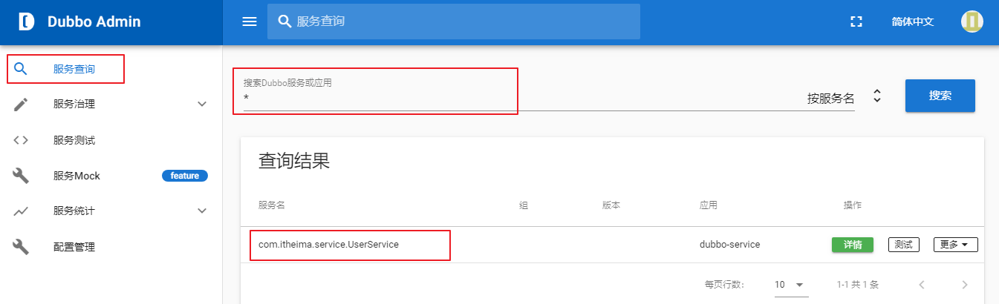


A:输入的查询条件com.itheima.service.UserService

B:搜索类型，主要分为【按服务名】【按IP地址】【按应用】三种类型查询

C:搜索结果

**3.1.4 dubo-admin查看详情**

我们查看com.itheima.service.UserService （服务提供者）的具体详细信息，包含【元数据信息】

**1）点击详情**


从【详情】界面查看，主要分为3个区域

A区域：主要包含服务端 基础信息比如服务名称、应用名称等

B区域：主要包含了生产者、消费者一些基本信息

**C区域：是元数据信息，注意看上面的图,元数据信息是空的**

我们需要打开我们的生产者配置文件加入下面配置

```xml
    <!-- 元数据配置 -->
    <dubbo:metadata-report address="zookeeper://192.168.149.135:2181" />
```

重新启动生产者，再次打开Dubbo-Admin

这样我们的元数据信息就出来了

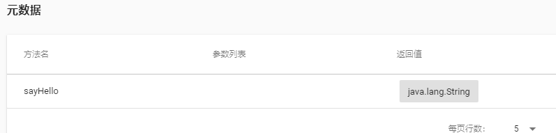

# 框架整合

## Spring-boot+Dubbo

### 依赖

```xml
   <!--Dubbo集成SpringBoot起步依赖-->
   <dependency>
       <groupId>com.alibaba.spring.boot</groupId>
       <artifactId>dubbo-spring-boot-starter</artifactId>
       <version>2.0.0</version>
   </dependency>

   <!--zookeeper注册中心依赖-->
   <dependency>
       <groupId>com.101tec</groupId>
       <artifactId>zkclient</artifactId>
       <version>0.11</version>
   </dependency>
```

### 服务提供者

#### 配置信息


```properties
#设置连接数据库的配置
spring.datasource.driver-class-name=com.mysql.cj.jdbc.Driver
spring.datasource.url=jdbc:mysql://localhost:3306/mybatis?useUnicode=true&characterEncoding=UTF-8&useJDBCCompliantTimezoneShift=true&useLegacyDatetimeCode=false&serverTimezone=Asia/Shanghai
spring.datasource.username=root
spring.datasource.password=11111

#设置内嵌Tomcat端口号
server.port=8080
#设置上下文根
server.servlet.context-path=/

#mybatis配置sql映射文件的路径
mybatis.mapper-locations=classpath:mybatis/mapper/*.xml
#mybatis配置指定使用别名的包(xml文件使用别名处会爆红但不影响使用)
mybatis.type-aliases-package=huaxin.entity
#mybatis配置开启驼峰命名
mybatis.configuration.map-underscore-to-camel-case=true


#设置dubbo的配置
#服务提供者声明名称：必须保证服务名称的唯一性，它的名称是dubbo内部使用的唯一标识
spring.application.name=13_springboot-integration-dubbo-service-provider
#声明当前工程是一个服务提供者
spring.dubbo.server=true
#设置访问服务的协议及端口号，dubbo官方推荐使用的是dubbo协议，端口号默认20880
spring.dubbo.protocol.name=dubbo
spring.dubbo.protocol.port=20880
#指定zookeeper注册中心地址和端口号
spring.dubbo.registry=zookeeper://localhost:2181

```

#### 业务层

**业务层实现类中添加`com.alibaba.dubbo.config.annotation.Service`包里面的`@Service`注解来暴露服务**

```java
@Service(interfaceClass = UserService.class,vserion = "1.0.0")
public class UserServiceImpl implements UserService {

    @Override
    public String save() {
        return "hello";
    }
}
```

#### **工程入口**

**在工程入口类添加`@EnableDubboConfiguration` 开启Dubbo配置**

```java
@SpringBootApplication
@EnableDubboConfiguration //开启Dubbo配置核心注解
public class Springboot0101QuickstartApplication {
    public static void main(String[] args) {
        SpringApplication.run(Springboot0101QuickstartApplication.class, args)；
    }
}
```

### 消费者

#### 配置信息

```properties
#设置内嵌Tomcat端口号
server.port=8081
#设置上下文根
server.servlet.context-path=/

#设置dubbo的配置
#服务提供者声明名称：必须保证服务名称的唯一性，它的名称是dubbo内部使用的唯一标识
spring.application.name=14_springboot-integration-dubbo-consumer
#指定zookeeper注册中心地址和端口号
spring.dubbo.registry=zookeeper://localhost:2181

```

#### 表现层

**在表现层`com.alibaba.dubbo.config.annotation.Reference`包下的`@Reference`注解来引用远程服务**

```java
@RestController
@RequestMapping("/user")
public class UserController {

    @Reference(interfaceClass = UserService.class,vserion = "1.0.0")
    private UserService userService;

    @RequestMapping
    public String test(){
        String save = userService.save();
        return save;
    }
}
```

#### **工程入口**

**在工程入口类添加`@EnableDubboConfiguration` 开启Dubbo配置**

```java
@SpringBootApplication
@EnableDubboConfiguration //开启Dubbo配置核心注解
public class Springboot0101QuickstartApplication {
    public static void main(String[] args) {
        SpringApplication.run(Springboot0101QuickstartApplication.class, args)；
    }
}
```


# 设计模式

## 代理模式

> 代理模式是⼀种常⻅的设计模式，它提供间接对⽬标对象访问的⽅式，通过代理对象访问⽬标对象，从⽽在⽬标对象现有的功能能上，增加额外的功能补充，实现扩展⽬标对象的功能

代理模式主要包含三个⻆⾊：

- 主题类⻆⾊

  可以是接⼝，也可以是抽象类，需要让⽬标对象和代理对象去实现或者继承，⽬的是为了让⽬标对象和代理对象具有相同的⽅法

- ⽬标类⻆⾊

  它的对象就是⽬标对象，核⼼业务逻辑的具体执⾏者

- 代理类⻆⾊

  它的对象就是代理对象，内部含有对真实⽬标对象的引⽤，负责对⽬标对象⽅法的调⽤，并且在调⽤前后进 ⾏预处

### 静态代理


公共接⼝ Singer ：

```java
package com.briup.proxy;
public interface Singer {
 void sing();
}
```

⽬标类 Target ：

```java
package com.briup.proxy;
public class Target implements Singer {
 @Override
 public void sing() {
 System.out.println("⽬标对象进⾏歌曲演唱");
 }
}
```

```java
package com.briup.proxy;
public class Proxy implements Singer {
 //代理对象中，需要持有真正的⽬标对象的引⽤
 //其⽬的是在完成辅助⼯作之后，使⽤⽬标对象来完成真正的核⼼⼯作
 private Singer target;
    
 public Proxy(Singer target) {
 this.target = target;
 }
 
 @Override
 public void sing() {
 //完成各种各种⼯作
 System.out.println("安排时间");
 System.out.println("联系场地");
 System.out.println("安全保障");
 System.out.println("合同签订");
 System.out.println("费⽤结算");
 System.out.println("------------");
 //使⽤⽬标对象来完成核⼼⼯作
 this.target.sing();
 }
}
```

### 动态代理

- JDK动态代理（重要，需要掌握）
- CGLIB动态代理（了解即可）

> JDK动态代理主要是借助 java.lang.reflect.Proxy ⽣成代理对象


```java
package java.lang.reflect;
public class Proxy implements java.io.Serializable {
	/**
	* loader,⽬标类的类加载器
	* interfaces，⽬标类所实现的接⼝，可以是多个
	* InvocationHandler，InvocationHandler接⼝的实现类对象
	*/
	public static Object newProxyInstance(ClassLoader loader,Class<?>[]interfaces,InvocationHandler h)throws IllegalArgumentException{
	//...
 	}
}

//java.lang.reflect.InvocationHandler 接⼝中只有⼀个抽象⽅法：
package java.lang.reflect;
public interface InvocationHandler {
 /**
* proxy,将来动态⽣成的代理类对象
* method，将来需要代理的⽬标对象中的⽅法
* args，将来调⽤⽬标对象⽅法时所传⼊的参数列表
*/
public Object invoke(Object proxy, Method method, Object[] args)
throws Throwable;
}

```

eg

```java
package com.briup.proxy;
import java.lang.reflect.InvocationHandler;
import java.lang.reflect.Method;
import java.lang.reflect.Proxy;
public class User {
 	public static void main(String[] args) {
 	//创建⽬标类对象
 	Singer target = new Target();
 
 	//⽬标类的类加载
 	ClassLoader loader = Target.class.getClassLoader();
 
 	//⽬标类所实现的接⼝
 	Class<?>[] interfaces = Target.class.getInterfaces();
 
 	//InvocationHandler接⼝的实现类对象
 	InvocationHandler h = new InvocationHandler() {
 		@Override
 		public Object invoke(Object proxy, Method method, Object[] args) throws Throwable {
 
 			System.out.println("安排时间");
			System.out.println("联系场地");
 			System.out.println("安全保障");
 			System.out.println("合同签订");
 			System.out.println("费⽤结算");
 			System.out.println("------------");
 
			//反射调⽤⽬标对象中需要代理的⽅式，并传⼊参数
 			Object result = method.invoke(target, args);
 
 			return result;
 		}
    };
 
 	Singer proxy = (Singer) Proxy.newProxyInstance(loader, interfaces, h);
 
	//调⽤代理对象的sing⽅法
 	//proxy对象将代理target对象中的sing
 	//在完成真正的sing功能之前，会完成⼀些额外的功能
 	proxy.sing();
 
 	//观察这个代理对象真正的类型是什么
 	System.out.println("代理对象proxy的真实类型："+proxy.getClass());
 
 	}
}
```

> Mybaits中默认情况下，就是利⽤这种⽅式来完成的动态⽣成Mapper接⼝的动态代理对象
>


例如，编写⼀个⽅法，可以给任意指定⽬标对象（必须实现接⼝）产⽣动态代理对象，该动态代理对象的作⽤是在完成⽬标对象中的功能之前，进⾏⽇志记录，输出 "xxx⽅法被调⽤了"

```java

```

**CGLIB动态代理**

> 如果⽬标对象没有实现任何接⼝，那么就不能使⽤JDK动态代理，这时候可以使⽤CGLIB的动态代理

- CGLIB通过ASM动态操作指令，⽣成了被代理类的⼦类，如果⽬标类是final修饰的，则不能够被代理。
- CGLIB⽣成的代理对象，其实是⽬标对象的**⼦类型**对象，并重写了⽬标类中所有的**⾮**private**、**⾮**final**的⽅法，从⽽完成这些⽅法的代理⼯作。

例如，给service对象创建动态代理对象，在service⽅法执⾏前后加⼊事务管理的⼯作

**⽬标类**

```java
package com.briup.cglib;
	//service对象
	public class StudentService {
 		public void saveOrUpdate() {
 			System.out.println("操作成功");
 		}
	}
```

**测试类**

```java
package com.briup.cglib;
import java.lang.reflect.Method;
import net.sf.cglib.proxy.Enhancer;
import net.sf.cglib.proxy.MethodInterceptor;
import net.sf.cglib.proxy.MethodProxy;
public class CGLIBTest {
 	public static void main(String[] args) {
 
 	//CGLIB中产⽣代理对象的核⼼类型
 	Enhancer enhancer = new Enhancer();
 
 	// 设置代理类的⽗类对象
 	enhancer.setSuperclass(StudentService.class);
 
 	enhancer.setCallback(new MethodInterceptor() {
 
 		/**
 		* @param proxy 代理对象实例
 		* @param method ⽬标类中的⽅法对象
 		* @param args ⽅法参数
 		* @param methodProxy ⽅法代理对象
 		*/
 		@Override
 		public Object intercept(Object proxy, Method method, Object[] args, MethodProxy methodProxy) throws Throwable {
 			System.out.println("开启事务");
 
 			//调⽤代理对象⽗类型的中的指定⽅法
 			//代理对象的⽗类型也就是⽬标对象的类型
 			//因为CGLIB⽣成代理对象的⽅式就是给⽬标对象动态⽣成⼀个⼦类对象对象
 			//这个⼦类型对象就是代理对象
 			Object result = methodProxy.invokeSuper(proxy, args);
 
 			System.out.println("提交事务");
 
 			return result;
 
 		}
 	});
 
 	// 产⽣代理对象
 	StudentService studentService = (StudentService) enhancer.create();
 
 	studentService.saveOrUpdate();
 	}
}
```

# IDEA

## 隐藏文件


## 自动提示消失

- Setting → Project Structure → Facets
- 选中对应项目/工程
- Customize Spring Boot
- 选择配置文件


# 项目

## 框架


