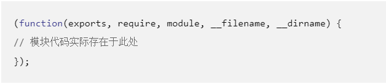
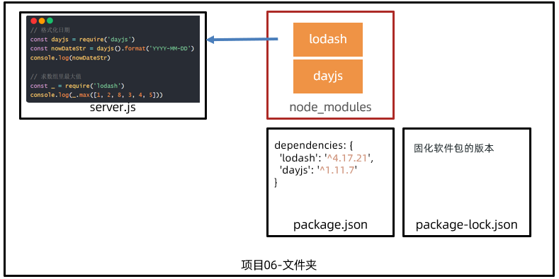
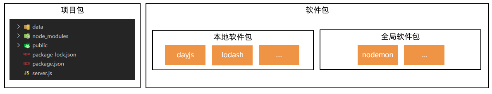
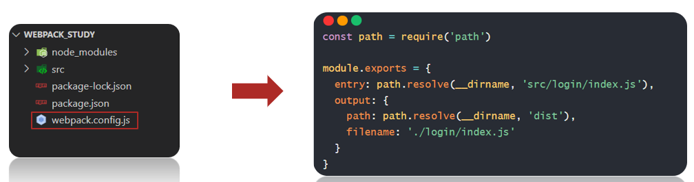
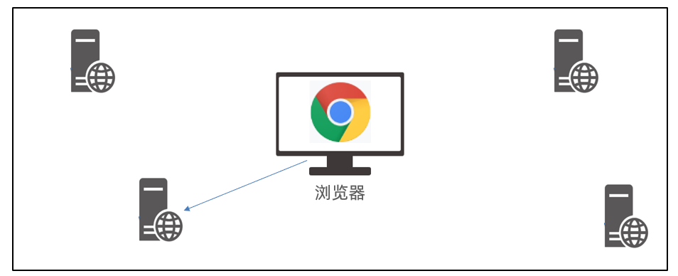
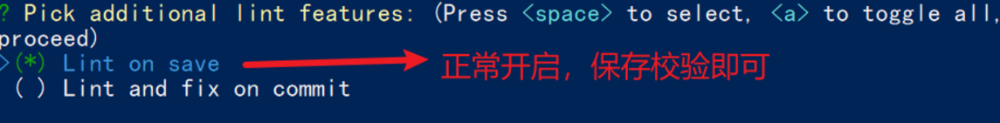

# CSS

## 语法

### 格式


### 样式类型

**内联样式**


**内部样式**


**外部样式**


## 选择器


# javaScript

## 语法

### =

=：赋值

==：值相同，自动转换类型比较

===：值和类型都相同


### Number

数字类型

```js
1 + 2; // 3
(1 + 2) * 5 / 2; // 7.5
2 / 0; // Infinity
0 / 0; // NaN
10 % 3; // 1
10.5 % 3; // 1.5
```

### NAN

### NULL

> 空值

### undefined

> 值未定义

### 数组

```js
var arr = [1, 2, 3.14, 'Hello', null, true];

new Array(1, 2, 3); // 创建了数组[1, 2, 3]

arr[0]; // 返回索引为0的元素，即1
arr[5]; // 返回索引为5的元素，即true
arr[6]; // 索引超出了范围，返回undefined
```

### 对象

```js
var person = {
name: 'Bob',
age: 20,
tags: ['js', 'web', 'mobile'],
city: 'Beijing',
hasCar: true,
zipcode: null
};
```

### 变量

```js
var a; // 申明了变量a，此时a的值为undefined
var $b = 1; // 申明了变量$b，同时给$b赋值，此时$b的值为1
var s_007 = '007'; // s_007是一个字符串
var Answer = true; // Answer是一个布尔值true
var t = null; // t的值是null

注意类型之间的转换
```

### **strict模式**

```js
'use strict';
```

### 判断

> if

```js
var age = 3;
if (age >= 18) {
	alert('adult');
} else if (age >= 6) {
	alert('teenager');
} else {
	alert('kid');
}
```


### 循环

> for

```js
var x = 0;
var i;
for (i=1; i<=10000; i++) {
	x = x + i;
}
x; // 50005000


var x = 0;
for (;;) { // 将无限循环下去
	if (x > 100) {
		break; // 通过if判断来退出循环
	}
	x ++;
}
```

> for in

```js
var o = {
    name: 'Jack',
    age: 20,
    city: 'Beijing'
};
for (var key in o) {
	if (o.hasOwnProperty(key)) {
		console.log(key); // 'name', 'age', 'city'
	}
}
```

> while

```js
var x = 0;
var n = 99;
while (n > 0) {
	x = x + n;
	n = n - 2;
}
x; // 2500
```

> do.....while

```js
var n = 0;
do {
	n = n + 1;
} while (n < 100);
n; // 100
```

### Map

> key不能重复

```js
var m = new Map([['Michael', 95], ['Bob', 75], ['Tracy', 85]]);
m.get('Michael'); // 95
```

### Set

> 不能重复

```js
var s2 = new Set([1, 2, 3]); // 含1, 2, 3
```

### Iterable

> 具有 iterable 类型的集合可以通过新的 for ... of 循环来遍历。

```js
var a = ['A', 'B', 'C'];
var s = new Set(['A', 'B', 'C']);
var m = new Map([[1, 'x'], [2, 'y'], [3, 'z']]);
for (var x of a) { // 遍历Array
	console.log(x);
}
for (var x of s) { // 遍历Set
	console.log(x);
}
for (var x of m) { // 遍历Map
	console.log(x[0] + '=' + x[1]);
}
```

> foreach

```js
a.forEach(function (element, index, array) {
	// element: 指向当前元素的值
	// index: 指向当前索引
	// array: 指向Array对象本身
	console.log(element + ', index = ' + index);
});
```

## 方法

### 字符串

```js
var name = '小明';
var age = 20;
var message = `你好, ${name}, 你今年${age}岁了!`;
```

| 方法             | 备注s.                     |
| ---------------- | -------------------------- |
| s.length         | 获取字符串长度             |
| toUpperCase()    | 把一个字符串全部变为大写   |
| toLowerCase()    | 把一个字符串全部变为小写   |
| s.indexOf('s')   | 会搜索指定字符串出现的位置 |
| s.substring(0,5) | 返回指定索引区间的子串     |

### 数组

```js
var arr = [1, 2, 3.14, 'Hello', null, true];
```

| 方法                  | 备注                           |
| --------------------- | ------------------------------ |
| arr.length            | 获取元素个数                   |
| arr.indexof(10)       | 指定元素的索引                 |
| arr.slice(0,3)        | 截取数组返回新数组             |
| arr.push(1，“3”，...) | 向末尾添加若干元素，返回长度   |
| arr.pop()             | 删除最后一个元素，返回删除元素 |
| arr.shift()           | 向开始添加若干个元素，返回个数 |
| arr.unshift()         | 删除第一个元素，返回删除元素   |
| arr.sort()            | 排序                           |
| arr.reverse()         | 反转                           |
| arr.splice(2,2,"s")   | 从2开始删除2个添加“s"          |
| arr.concat(arr)       | 合并数组                       |
| arr.join("_")         | 拼接数组为字符串               |

### 对象

```js
var 对象名 = {
    key: 'value',
    key: 'value',
    key: 'value'
}
```

| 方法                             | 备注            |
| -------------------------------- | --------------- |
| xiaoming.age = 18;               | 新增一个age属性 |
| delete xiaoming.age;             | 删除age属性     |
| delete xiaoming['name'];         | 删除name属性    |
| 'name' in xiaoming;              | 是否拥有属性    |
| xiaoming.hasOwnProperty('name'); | 判断是否为继承  |

​                                                                                                       

### Map

```js
var m = new Map([['Michael', 95], ['Bob', 75], ['Tracy', 85]]);
m.get('Michael'); // 95
```

| 方法               | 备注                   |
| ------------------ | ---------------------- |
| m.set('Adam', 67); | 添加新的key-value      |
| m.get('Adam');     | 67                     |
| m.has('Adam');     | 否存在key 'Adam': true |
| m.delete('Adam');  | 删除key 'Adam'         |

### Set

```js
var s = new Set([1, 2, 3, 3, '3']);
```

| 方法         | 备注 |
| ------------ | ---- |
| s.add(4);    | 添加 |
| s.delete(3); | 删除 |
|              |      |

## 函数

### 定义

> 一

```js
function abs(x) {
	if (x >= 0) {
		return x;
	} else {
		return -x;
	}
}

//如果没有 return 语句，函数执行完毕后也会返回结果，只是结果为 undefined 。
```

> 二

```js
var abs = function (x) {
	if (x >= 0) {
		return x;
	} else {
		return -x;
	}
};
```

### 调用

```js
abs(10)
```

### arguments

> 它只在函数内部起作用，并且永远指向当前函数的调用者传入的所有参数。
>
> 判断入参个数

```js
function abs() {
    if (arguments.length === 0) {
        return 0;
    }
    var x = arguments[0];
    return x >= 0 ? x : -x;
}
abs(); // 0
abs(10); // 10
abs(-9); // 9
```

### rest

> ES6标准引入了rest参数，上面的函数可以改写为：

```js
function foo(a, b, ...rest) {
    console.log('a = ' + a);
    console.log('b = ' + b);
    console.log(rest);
}
foo(1, 2, 3, 4, 5);
```

### 作用域

> 作用域

如果函数嵌套，同名变量使用内部

> 变量提升

变量的定义会放在开头

变量赋值不变

```js
推荐 function foo() {
    var
        x = 1, // x初始化为1
        y = x + 1, // y初始化为2
        z, i; // z和i为undefined
    // 其他语句:
    for (i=0; i<100; i++) {
    	...
    }
}
```

> 全局作用域

不在任何函数内定义的变量就具有全局作用域。

`JavaScript默认有一个全局对象 window ，全局作用域的变量实际上被绑定到 window 的一个属性：`


```js
'use strict';
var course = 'Learn JavaScript';
alert(course); // 'Learn JavaScript'
alert(window.course); // 'Learn JavaScript

直接访问全局变量 course 和访问 window.course 是完全一样的。
```

推建

```js
// 唯一的全局变量MYAPP:
var MYAPP = {};
// 其他变量:
MYAPP.name = 'myapp';
MYAPP.version = 1.0;
// 其他函数:
MYAPP.foo = function () {
	return 'foo';
};
```

> 局部作用域 let

```js
为了解决块级作用域，ES6引入了新的关键字 let ，用 let 替代 var 可以申明一个块级作用域
的变量：
```

> 常量 const

```js
ES6标准引入了新的关键字 const 来定义常量， const 与 let 都具有块级作用域：
```

### 方法

> 定义方法

在一个对象中绑定函数，称为这个对象的方法。

```js
var xiaoming = {
    name: '小明',
    birth: 1990,
    age: function () {
        var y = new Date().getFullYear();
        return y - this.birth;
    }
};


```

> this

在一个方法内部， this 是一个特殊变量，它始终指向当前对象

`如果以对象的方法形式调用，比如 xiaoming.age() ，该函数的 this 指向被调用的对象，也就是 xiaoming ，这是符合我们预期的。`

`如果单独调用函数，比如 getAge() ，此时，该函数的 this 指向全局对象，也就是 window 。`

> apply

要指定函数的 this 指向哪个对象，可以用函数本身的 apply 方法

```js
function getAge() {
    var y = new Date().getFullYear();
    return y - this.birth;
}
var xiaoming = {
    name: '小明',
    birth: 1990,
    age: getAge
};
xiaoming.age(); // 25
getAge.apply(xiaoming, []); // 25, this指向xiaoming, 参数为空

```

## 标准对象

### typeof 

> 用 typeof 操作符获取对象的类型，它总是返回一个字符串

```js
typeof 123; // 'number'
typeof NaN; // 'number'
typeof 'str'; // 'string'
typeof true; // 'boolean'
typeof undefined; // 'undefined'
typeof Math.abs; // 'function'
typeof null; // 'object'
typeof []; // 'object'
typeof {}; // 'object'
```


### Date

> Date 对象用来表示日期和时间。

```js
var now = new Date();
now; // Wed Jun 24 2015 19:49:22 GMT+0800 (CST)
now.getFullYear(); // 2015, 年份
now.getMonth(); // 5, 月份，注意月份范围是0~11，5表示六月
now.getDate(); // 24, 表示24号
now.getDay(); // 3, 表示星期三
now.getHours(); // 19, 24小时制
now.getMinutes(); // 49, 分钟
now.getSeconds(); // 22, 秒
now.getMilliseconds(); // 875, 毫秒数
now.getTime(); // 1435146562875, 以number形式表示的时间戳
```

> 时区

```js
var d = new Date(1435146562875);
d.toLocaleString(); // '2015/6/24 下午7:49:22'，本地时间（北京时区+8:00），显示的字
符串与操作系统设定的格式有关
d.toUTCString(); // 'Wed, 24 Jun 2015 11:49:22 GMT'，UTC时间，与本地时间相差8小时
```

> 时间戳

```js
if (Date.now) {
	console.log(Date.now()); // 老版本IE没有now()方法
} else {
	console.log(new Date().getTime());
}
```


### Json

```json
{"name": "QinJiang"}
{"age": "3"}
{"sex": "男"}
```

> json转Javascript

```js
var obj = JSON.parse('{"a": "Hello", "b": "World"}');
```

> javaScript转json

```js
var json = JSON.stringify({a: 'Hello', b: 'World'});
```

## 面对对象编程

### 面向对象

> xiaoming.__proto__ = Student;

JavaScript的原型链和Java的Class区别就在，它没有“Class”的概念，所有对象都是实例，所谓继承关系不过是把一个对象的原型指向另一个对象而已。

```js
var Student = {
    name: 'Robot',
    height: 1.2,
    run: function () {
        console.log(this.name + ' is running...');
    }
};

var xiaoming = {
	name: '小明'
};

xiaoming.__proto__ = Student;
```

### class

> class

```js
class Student {
        constructor(name) {
        this.name = name;
	}
    hello() {
        alert('Hello, ' + this.name + '!');
    }
}
```

 class 的定义包含了构造函数 constructor 和定义在原型对象上的函数hello() （注意没有 function 关键字），这样就避免了 Student.prototype.hello =function () {...} 这样分散的代码。最后，创建一个 Student 对象代码和前面章节完全一样：

```js
var xiaoming = new Student('小明');
xiaoming.hello();
```

> class继承

```js
class PrimaryStudent extends Student {
    constructor(name, grade) {
        super(name); // 记得用super调用父类的构造方法!
        this.grade = grade;
	}
    myGrade() {
    	alert('I am at grade ' + this.grade);
    }
}
```

## BOM

### window

> window 对象不但充当全局作用域，而且表示浏览器窗口。

`IE<=8不支持`

| 属性                | 备注     |
| ------------------- | -------- |
| window.innerWidth   | 内部宽度 |
| window.innerHeight  | 内部高度 |
| window.  outerWidth | 外部宽   |
| window.outerHeight  | 外部高   |

### navigator

> navigator 对象表示浏览器的信息，最常用的属性包括：

| 属性                 | 备注                               |
| -------------------- | ---------------------------------- |
| navigator.appName    | ：浏览器名称；                     |
| navigator.appVersion | ：浏览器版本；                     |
| navigator.language   | ：浏览器设置的语言；               |
| navigator.platform   | ：操作系统类型；                   |
| navigator.userAgent  | ：浏览器设定的 User-Agent 字符串。 |

很多初学者为了针对不同浏览器编写不同的代码，喜欢用 if 判断浏览器版本

正确的方法是充分利用JavaScript对不存在属性返回undefined 的特性，直接用短路运算符 || 计算：

```js
var width = window.innerWidth || document.body.clientWidth;
```

### screen

> 表示屏幕信息

| 属性                | 备注                        |
| ------------------- | --------------------------- |
| screen.width：      | 屏幕宽度，以像素为单位；    |
| screen.height：     | 屏幕高度，以像素为单位；    |
| screen.colorDepth： | 返回颜色位数，如8、16、24。 |

### location

> location 对象表示当前页面的URL信息。例如，一个完整的URL：

```js
location.href  //http://www.example.com:8080/path/index.html?a=1&b=2#TOP
location.protocol; // 'http'
location.host; // 'www.example.com'
location.port; // '8080'
location.pathname; // '/path/index.html'
location.search; // '?a=1&b=2'
location.hash; // 'TOP'
```

| 属性                 | 备注             |
| -------------------- | ---------------- |
| location.assign(url) | 要加载一个新页面 |
| location.reload()    | 重新加载当前页面 |

### document

> document 对象表示当前页面

由于HTML在浏览器中以DOM形式表示为树形结构， document 对象就是整个DOM树的根节点。

| 属性                            | 方法             |
| ------------------------------- | ---------------- |
| document.getElementById()       | 根据id获节点     |
| document.getElementsByTagName() | 根据标签获取节点 |
| document.cookie                 | 获取页面cookie   |

为了解决这个问题，服务器在设置Cookie时可以使用 httpOnly ，设定了 httpOnly 的Cookie将不能被JavaScript读取。这个行为由浏览器实现，主流浏览器均支持 httpOnly 选项，IE从IE6 SP1开始支持。

### history

> history 对象保存了浏览器的历史记录

| 属性               | 方法 |
| ------------------ | ---- |
| history.back()     | 后退 |
| history.forward () | 前进 |
|                    |      |

**不使用**

## DOM

### 选这器

> 由于HTML文档被浏览器解析后就是一棵DOM树，要改变HTML的结构，就需要通过JavaScript来操作DOM。

始终记住DOM是一个树形结构。操作一个DOM节点实际上就是这么几个操作：

- 更新：更新该DOM节点的内容，相当于更新了该DOM节点表示的HTML的内容；
- 遍历：遍历该DOM节点下的子节点，以便进行进一步操作；
- 添加：在该DOM节点下新增一个子节点，相当于动态增加了一个HTML节点；
- 删除：将该节点从HTML中删除，相当于删掉了该DOM节点的内容以及它包含的所有子节点。

> 一

| 方法                                  | 备注                       |
| ------------------------------------- | -------------------------- |
| document.getElementById('test')；     | 通过id获取节点             |
| document.getElementsByTagName('tr')； | 通过元素获取节点           |
| document.getElementsByClassName（”“） | 通过class获取节点          |
| test.children                         | 获取节点下的所有直属子节点 |
| test.firstElementChild;               | 获取第一个                 |
| test.lastElementChild                 | 获取最后一个               |


> 二使用 querySelector() 和 querySelectorAll() 


```js
// 通过querySelector获取ID为q1的节点：
var q1 = document.querySelector('#q1');
// 通过querySelectorAll获取q1节点内的符合条件的所有节点：
var ps = q1.querySelectorAll('div.highlighted > p');
```

### 更新DOM

> innerHTML 

一种是修改 innerHTML 属性，这个方式非常强大，不但可以修改一个DOM节点的文本内容，还可以直接通过HTML片段修改DOM节点内部的子树：

```js
// 获取<p id="p-id">...</p>
var p = document.getElementById('p-id');
// 设置文本为abc:
p.innerHTML = 'ABC'; // <p id="p-id">ABC</p>
// 设置HTML:
p.innerHTML = 'ABC <span style="color:red">RED</span> XYZ';
// <p>...</p>的内部结构已修改
```


>  innerText 

这样可以自动对字符串进行HTML编码，保证无法设置任何HTML标签：

```js
// 获取<p id="p-id">...</p>
var p = document.getElementById('p-id');
// 设置文本:
p.innerText = '<script>alert("Hi")</script>';
// HTML被自动编码，无法设置一个<script>节点:
// <p id="p-id">&lt;script&gt;alert("Hi")&lt;/script&gt;</p>
```

> css

CSS允许 font-size 这样的名称，但它并非JavaScript有效的属性名，所以需要在JavaScript中改写为驼峰式命名 fontSize ：

```js
// 获取<p id="p-id">...</p>
var p = document.getElementById('p-id');
// 设置CSS:
p.style.color = '#ff0000';
p.style.fontSize = '20px';
p.style.paddingTop = '2em';
```

### 插入DOM

> appendChild

把一个子节点添加到父节点的最后一个子节点

```js
var js = document.getElementById('js'),
	list = document.getElementById('list');
list.appendChild(js);
```

`插入的 js 节点已经存在于当前的文档树，因此这个节点首先会从原先的位置删除，再插入到新的位置。`

> createElement

```js
var
	list = document.getElementById('list'),
	haskell = document.createElement('p');
haskell.id = 'haskell';
haskell.innerText = 'Haskell';
list.appendChild(haskell);
```

```js
var d = document.createElement('style');
d.setAttribute('type', 'text/css');
d.innerHTML = 'p { color: red }';
//head 头部标签
document.getElementsByTagName('head')[0].appendChild(d);

```

> insertBefore

parentElement.insertBefore(newElement, referenceElement); ，子节点会插入到

referenceElement 之前。

```js
var
    list = document.getElementById('list'),
    ref = document.getElementById('python'),
    haskell = document.createElement('p');
haskell.id = 'haskell';
haskell.innerText = 'Haskell';
list.insertBefore(haskell, ref);
```

### 删除DOM

> parentElement
>
> removeChild(self);

要删除一个节点，首先要获得该节点本身以及它的父节点，然后，调用父节点的 removeChild 把自己删掉：

```js
// 拿到待删除节点:
var self = document.getElementById('to-be-removed');
// 拿到父节点:
var parent = self.parentElement;
// 删除:
var removed = parent.removeChild(self);
removed === self; // true
```

当你遍历一个父节点的子节点并进行删除操作时，要注意， children 属性是一个只读属性，并且它在子节点变化时会实时更新。

```js
var parent = document.getElementById('parent');
parent.removeChild(parent.children[0]);
parent.removeChild(parent.children[1]); // <-- 浏览器报错
```

浏览器报错： parent.children[1] 不是一个有效的节点。原因就在于，当 First 节点被删除后， parent.children 的节点数量已经从2变为了1，索引 [1] 已经不存在了。

## 操作表单

- 文本框，对应的 <input type="text"> ，用于输入文本；
- 口令框，对应的 <input type="password"> ，用于输入口令；
- 单选框，对应的 <input type="radio"> ，用于选择一项；
- 复选框，对应的 <input type="checkbox"> ，用于选择多项；
- 下拉框，对应的 <select> ，用于选择一项；
- 隐藏文本，对应的 <input type="hidden"> ，用户不可见，但表单提交时会把隐藏文本发送到服务器。

### 获取值

>  text 、 password 、 hidden 以及 select 。

```js
// <input type="text" id="email">
var input = document.getElementById('email');
input.value; // '用户输入的值'
```

> 单选框和复选框

```js
var mon = document.getElementById('monday');
var tue = document.getElementById('tuesday');
mon.value; // '1'
tue.value; // '2'
mon.checked; // true或者false
tue.checked; // true或者false
```

### 设置值

>  text 、 password 、 hidden 以及 select 。

```js
// <input type="text" id="email">
var input = document.getElementById('email');
input.value = 'test@example.com'; // 文本框的内容已更新
```

> 单选框和复选框

```JS
checked 为 true 或 false
```

### 提交表单

```html
<!-- HTML -->
<form id="test-form">
	<input type="text" name="test">
	<button type="button" onclick="doSubmitForm()">Submit</button>
</form>
<script>
	function doSubmitForm() {
	var form = document.getElementById('test-form');
	// 可以在此修改form的input...
	// 提交form:
	form.submit();
}
</script>
```

```html
<script src="https://cdn.bootcss.com/blueimp-md5/2.10.0/js/md5.min.js">
</script>
<!-- HTML -->
<form id="login-form" method="post" onsubmit="return checkForm()">
	<input type="text" id="username" name="username">
	<input type="password" id="input-password">
	<input type="hidden" id="md5-password" name="password">
	<button type="submit">Submit</button>
</form>
<script>
	function checkForm() {
        var input_pwd = document.getElementById('input-password');
        var md5_pwd = document.getElementById('md5-password');
        // 把用户输入的明文变为MD5:
        md5_pwd.value = md5(input_pwd.value);
        // 继续下一步:
        return true;
	}
</script>
```

# JQuery

### 语法

```js
基础语法： $(selector).action()

- 美元符号定义 jQuery
- 选择符（selector）"查询"和"查找" HTML 元素
- jQuery 的 action() 执行对元素的操作
```

### 选择器

> 元素：$("p")

```js
$(document).ready(function(){
  $("button").click(function(){
    $("p").hide();
  });
});
```

> id：$("#test")

```js
$(document).ready(function(){
  $("button").click(function(){
    $("#test").hide();
  });
});
```

> .class 选择器 $(".test")

```js
$(document).ready(function(){
  $("button").click(function(){
    $(".test").hide();
  });
});
```

| 语法                     | 描述                                                    |
| :----------------------- | :------------------------------------------------------ |
| $("*")                   | 选取所有元素                                            |
| $(this)                  | 选取当前 HTML 元素                                      |
| $("p.intro")             | 选取 class 为 intro 的 <p> 元素                         |
| $("p:first")             | 选取第一个 <p> 元素                                     |
| $("ul li:first")         | 选取第一个 <ul> 元素的第一个 <li> 元素                  |
| $("ul li:first-child")   | 选取每个 <ul> 元素的第一个 <li> 元素                    |
| $("[href]")              | 选取带有 href 属性的元素                                |
| $("a[target='_blank']")  | 选取所有 target 属性值等于 "_blank" 的 <a> 元素         |
| $("a[target!='_blank']") | 选取所有 target 属性值不等于 "_blank" 的 <a> 元素       |
| $(":button")             | 选取所有 type="button" 的 <input> 元素 和 <button> 元素 |
| $("tr:even")             | 选取偶数位置的 <tr> 元素                                |
| $("tr:odd")              | 选取奇数位置的 <tr> 元素                                |

### 事件

| 鼠标事件                                                     | 键盘事件                                                     | 表单事件                                                  | 文档/窗口事件                                             |
| :----------------------------------------------------------- | :----------------------------------------------------------- | :-------------------------------------------------------- | :-------------------------------------------------------- |
| [click](https://www.runoob.com/jquery/event-click.html)      | [keypress](https://www.runoob.com/jquery/event-keypress.html) | [submit](https://www.runoob.com/jquery/event-submit.html) | [load](https://www.runoob.com/jquery/event-load.html)     |
| [dblclick](https://www.runoob.com/jquery/event-dblclick.html) | [keydown](https://www.runoob.com/jquery/event-keydown.html)  | [change](https://www.runoob.com/jquery/event-change.html) | [resize](https://www.runoob.com/jquery/event-resize.html) |
| [mouseenter](https://www.runoob.com/jquery/event-mouseenter.html) | [keyup](https://www.runoob.com/jquery/event-keyup.html)      | [focus](https://www.runoob.com/jquery/event-focus.html)   | [scroll](https://www.runoob.com/jquery/event-scroll.html) |
| [mouseleave](https://www.runoob.com/jquery/event-mouseleave.html) |                                                              | [blur](https://www.runoob.com/jquery/event-blur.html)     | [unload](https://www.runoob.com/jquery/event-unload.html) |
| [hover](https://www.runoob.com/jquery/event-hover.html)      |                                                              |                                                           |                                                           |

# AJAX

使用浏览器的 XMLHttpRequest 对象 与服务器通信

## axios

### 语法

```js
axios({
  url: '目标资源地址',
  method: '请求方法',
  data: {
    参数名: 值
  }
}).then(result => {
  // 对服务器返回的数据做后续处理
}).catch(error => {
  // 处理失败错误
})
```


### URL

> 统一资源定位符


### 请求方式

前面我们获取数据其实用的就是GET请求方法，但是axios内部设置了默认请求方法就是GET，我们就没有写


## HTTP协议

### 三次握手

三次握手（Three-way Handshake）其实就是指建立一个TCP连接时，需要客户端和服务器总共发送3个包。进行三次握手的主要作用就是为了确认双方的接收能力和发送能力是否正常、指定自己的初始化序列号为后面的可靠性传送做准备。实质上其实就是连接服务器指定端口，建立TCP连接，并同步连接双方的序列号和确认号，交换TCP窗口大小信息。、

- 第一次握手：客户端给服务端发一个 SYN 报文，并指明客户端的初始化序列号 ISN，此时客户端处于 SYN_SEND 状态。

  > 首部的同步位SYN=1，初始序号seq=x，SYN=1的报文段不能携带数据，但要消耗掉一个序号。

- 第二次握手：服务器收到客户端的 SYN 报文之后，会以自己的 SYN 报文作为应答，并且也是指定了自己的初始化序列号 ISN。同时会把客户端的 ISN + 1 作为ACK 的值，表示自己已经收到了客户端的 SYN，此时服务器处于 SYN_REVD 的状态。

  > 在确认报文段中SYN=1，ACK=1，确认号ack=x+1，初始序号seq=y

- 第三次握手：客户端收到 SYN 报文之后，会发送一个 ACK 报文，当然，也是一样把服务器的 ISN + 1 作为 ACK 的值，表示已经收到了服务端的 SYN 报文，此时客户端处于 ESTABLISHED 状态。服务器收到 ACK 报文之后，也处于 ESTABLISHED 状态，此时，双方已建立起了连接。

  > 确认报文段ACK=1，确认号ack=y+1，序号seq=x+1（初始为seq=x，第二个报文段所以要+1），ACK报文段可以携带数据，不携带数据则不消耗序号。

### 四次挥手

刚开始双方都处于 ESTABLISHED 状态，假如是客户端先发起关闭请求。四次挥手的过程如下：

- 第一次挥手： 客户端会发送一个 FIN 报文，报文中会指定一个序列号。此时客户端处于 FIN_WAIT1 状态。

  > 即发出连接释放报文段（FIN=1，序号seq=u），并停止再发送数据，主动关闭TCP连接，进入FIN_WAIT1（终止等待1）状态，等待服务端的确认。

- 第二次挥手：服务端收到 FIN 之后，会发送 ACK 报文，且把客户端的序列号值 +1 作为 ACK 报文的序列号值，表明已经收到客户端的报文了，此时服务端处于 CLOSE_WAIT 状态。

  > 即服务端收到连接释放报文段后即发出确认报文段（ACK=1，确认号ack=u+1，序号seq=v），服务端进入CLOSE_WAIT（关闭等待）状态，此时的TCP处于半关闭状态，客户端到服务端的连接释放。客户端收到服务端的确认后，进入FIN_WAIT2（终止等待2）状态，等待服务端发出的连接释放报文段。

- 第三次挥手：如果服务端也想断开连接了，和客户端的第一次挥手一样，发给 FIN 报文，且指定一个序列号。此时服务端处于 LAST_ACK 的状态。

  > 即服务端没有要向客户端发出的数据，服务端发出连接释放报文段（FIN=1，ACK=1，序号seq=w，确认号ack=u+1），服务端进入LAST_ACK（最后确认）状态，等待客户端的确认。

- 第四次挥手：客户端收到 FIN 之后，一样发送一个 ACK 报文作为应答，且把服务端的序列号值 +1 作为自己 ACK 报文的序列号值，此时客户端处于 TIME_WAIT 状态。需要过一阵子以确保服务端收到自己的 ACK 报文之后才会进入 CLOSED 状态，服务端收到 ACK 报文之后，就处于关闭连接了，处于 CLOSED 状态。

  > 即客户端收到服务端的连接释放报文段后，对此发出确认报文段（ACK=1，seq=u+1，ack=w+1），客户端进入TIME_WAIT（时间等待）状态。此时TCP未释放掉，需要经过时间等待计时器设置的时间2MSL后，客户端才进入CLOSED状态。

因为当服务端收到客户端的SYN连接请求报文后，可以直接发送SYN+ACK报文。其中ACK报文是用来应答的，SYN报文是用来同步的。但是关闭连接时，当服务端收到FIN报文时，很可能并不会立即关闭SOCKET，所以只能先回复一个ACK报文，告诉客户端，“你发的FIN报文我收到了”。只有等到我服务端所有的报文都发送完了，我才能发送FIN报文，因此不能一起发送，故需要四次挥手。

### 请求报文


* 请求行：请求方法，URL，协议
* 请求头：以键值对的格式携带的附加信息，比如：Content-Type（指定了本次传递的内容类型）
* 空行：分割请求头，空行之后的是发送给服务器的资源
* 请求体：发送的资源

### 请求头


### 响应报文


* 响应行（状态行）：协议，HTTP响应状态码，状态信息
* 响应头：以键值对的格式携带的附加信息，比如：Content-Type（告诉浏览器，本次返回的内容类型）
* 空行：分割响应头，控制之后的是服务器返回的资源
* 响应体：返回的资源

### 状态码


## 原理

### XMLHttpRequest

> 语法

```js
const xhr = new XMLHttpRequest()
xhr.open('请求方法', '请求url网址')
xhr.addEventListener('loadend', () => {
  // 响应结果
  console.log(xhr.response)
})
xhr.send()
```

> get参数

单个

```js
/**
 * 目标：使用XHR携带查询参数，展示某个省下属的城市列表
*/
const xhr = new XMLHttpRequest()
xhr.open('GET', 'http://hmajax.itheima.net/api/city?pname=辽宁省')
xhr.addEventListener('loadend', () => {
})
xhr.send()、
post

const xhr = new XMLHttpRequest()
xhr.open('请求方法', '请求url网址')
xhr.addEventListener('loadend', () => {
  console.log(xhr.response)
})

// 1. 告诉服务器，我传递的内容类型，是 JSON 字符串
xhr.setRequestHeader('Content-Type', 'application/json')
// 2. 准备数据并转成 JSON 字符串
const user = { username: 'itheima007', password: '7654321' }
const userStr = JSON.stringify(user)
// 3. 发送请求体数据
xhr.send(userStr)
```

多个参数

```js
// 1. 创建 URLSearchParams 对象
const paramsObj = new URLSearchParams({
  参数名1: 值1,
  参数名2: 值2
})

// 2. 生成指定格式查询参数字符串
const queryString = paramsObj.toString()
// 结果：参数名1=值1&参数名2=值2

```


> post参数

```js
const xhr = new XMLHttpRequest()
xhr.open('请求方法', '请求url网址')
xhr.addEventListener('loadend', () => {
  console.log(xhr.response)
})

// 1. 告诉服务器，我传递的内容类型，是 JSON 字符串
xhr.setRequestHeader('Content-Type', 'application/json')
// 2. 准备数据并转成 JSON 字符串
const user = { username: 'itheima007', password: '7654321' }
const userStr = JSON.stringify(user)
// 3. 发送请求体数据
xhr.send(userStr)
```

### Promise

成功或失败会关联后续的处理函数

> 语法

```js
// 1. 创建 Promise 对象
const p = new Promise((resolve, reject) => {
 // 2. 执行异步任务-并传递结果
 // 成功调用: resolve(值) 触发 then() 执行
 // 失败调用: reject(值) 触发 catch() 执行
})
// 3. 接收结果
p.then(result => {
 // 成功
}).catch(error => {
 // 失败
})
```

> 状态

1. 待定（pending）：初始状态，既没有被兑现，也没有被拒绝
2. 已兑现（fulfilled）：操作成功完成
3. 已拒绝（rejected）：操作失败


### 案例

```js
/**
 * 目标：使用Promise管理XHR请求省份列表
 *  1. 创建Promise对象
 *  2. 执行XHR异步代码，获取省份列表
 *  3. 关联成功或失败函数，做后续处理
*/
// 1. 创建Promise对象
const p = new Promise((resolve, reject) => {
  // 2. 执行XHR异步代码，获取省份列表
  const xhr = new XMLHttpRequest()
  xhr.open('GET', 'http://hmajax.itheima.net/api/province')
  xhr.addEventListener('loadend', () => {
    // xhr如何判断响应成功还是失败的？
    // 2xx开头的都是成功响应状态码
    if (xhr.status >= 200 && xhr.status < 300) {
      resolve(JSON.parse(xhr.response))
    } else {
      reject(new Error(xhr.response))
    }
  })
  xhr.send()
})

// 3. 关联成功或失败函数，做后续处理
p.then(result => {
  console.log(result)
  document.querySelector('.my-p').innerHTML = result.list.join('<br>')
}).catch(error => {
  // 错误对象要用console.dir详细打印
  console.dir(error)
  // 服务器返回错误提示消息，插入到p标签显示
  document.querySelector('.my-p').innerHTML = error.message
})
```

## 简易封装

### 案例

```js
/**
 * 目标：封装_简易axios函数_获取省份列表
 *  1. 定义myAxios函数，接收配置对象，返回Promise对象
 *  2. 发起XHR请求，默认请求方法为GET
 *  3. 调用成功/失败的处理程序
 *  4. 使用myAxios函数，获取省份列表展示
*/
// 1. 定义myAxios函数，接收配置对象，返回Promise对象
function myAxios(config) {
  return new Promise((resolve, reject) => {
    // 2. 发起XHR请求，默认请求方法为GET
    const xhr = new XMLHttpRequest()
    xhr.open(config.method || 'GET', config.url)
    xhr.addEventListener('loadend', () => {
      // 3. 调用成功/失败的处理程序
      if (xhr.status >= 200 && xhr.status < 300) {
        resolve(JSON.parse(xhr.response))
      } else {
        reject(new Error(xhr.response))
      }
    })
    xhr.send()
  })
}

// 4. 使用myAxios函数，获取省份列表展示
myAxios({
  url: 'http://hmajax.itheima.net/api/province'
}).then(result => {
  console.log(result)
  document.querySelector('.my-p').innerHTML = result.list.join('<br>')
}).catch(error => {
  console.log(error)
  document.querySelector('.my-p').innerHTML = error.message
})
```

## 回调

### 回调地狱

1. 概念：在回调函数中嵌套回调函数，一直嵌套下去就形成了回调函数地狱
2. 缺点：可读性差，异常无法捕获，耦合性严重，牵一发动全身

### Promise-链式调用

1. 概念：依靠 then() 方法会返回一个新生成的 Promise 对象特性，继续串联下一环任务，直到结束

2. 细节：then() 回调函数中的返回值，会影响新生成的 Promise 对象最终状态和结果

3. 好处：通过链式调用，解决回调函数嵌套问题

```js
/**
 * 目标：掌握Promise的链式调用
 * 需求：把省市的嵌套结构，改成链式调用的线性结构
*/
// 1. 创建Promise对象-模拟请求省份名字
const p = new Promise((resolve, reject) => {
  setTimeout(() => {
    resolve('北京市')
  }, 2000)
})

// 2. 获取省份名字
const p2 = p.then(result => {
  console.log(result)
  // 3. 创建Promise对象-模拟请求城市名字
  // return Promise对象最终状态和结果，影响到新的Promise对象
  return new Promise((resolve, reject) => {
    setTimeout(() => {
      resolve(result + '--- 北京')
    }, 2000)
  })
})

// 4. 获取城市名字
p2.then(result => {
  console.log(result)
})

// then()原地的结果是一个新的Promise对象
console.log(p2 === p)
```

### 解决回调地狱

1. 目标：使用 Promise 链式调用，解决回调函数地狱问题

2. 做法：每个 Promise 对象中管理一个异步任务，用 then 返回 Promise 对象，串联起来

```js
/**
 * 目标：把回调函数嵌套代码，改成Promise链式调用结构
 * 需求：获取默认第一个省，第一个市，第一个地区并展示在下拉菜单中
*/
let pname = ''
// 1. 得到-获取省份Promise对象
axios({url: 'http://hmajax.itheima.net/api/province'}).then(result => {
  pname = result.data.list[0]
  document.querySelector('.province').innerHTML = pname
  // 2. 得到-获取城市Promise对象
  return axios({url: 'http://hmajax.itheima.net/api/city', params: { pname }})
}).then(result => {
  const cname = result.data.list[0]
  document.querySelector('.city').innerHTML = cname
  // 3. 得到-获取地区Promise对象
  return axios({url: 'http://hmajax.itheima.net/api/area', params: { pname, cname }})
}).then(result => {
  console.log(result)
  const areaName = result.data.list[0]
  document.querySelector('.area').innerHTML = areaName
})
```

## async

### await

1. 概念：在 async 函数内，使用 await 关键字取代 then 函数，等待获取 Promise 对象成功状态的结果值 
2. 做法：使用 async 和 await 解决回调地狱问题
3. 核心代码：

```js
/**
 * 目标：掌握async和await语法，解决回调函数地狱
 * 概念：在async函数内，使用await关键字，获取Promise对象"成功状态"结果值
 * 注意：await必须用在async修饰的函数内（await会阻止"异步函数内"代码继续执行，原地等待结果）
*/
// 1. 定义async修饰函数
async function getData() {
  // 2. await等待Promise对象成功的结果
  const pObj = await axios({url: 'http://hmajax.itheima.net/api/province'})
  const pname = pObj.data.list[0]
  const cObj = await axios({url: 'http://hmajax.itheima.net/api/city', params: { pname }})
  const cname = cObj.data.list[0]
  const aObj = await axios({url: 'http://hmajax.itheima.net/api/area', params: { pname, cname }})
  const areaName = aObj.data.list[0]


  document.querySelector('.province').innerHTML = pname
  document.querySelector('.city').innerHTML = cname
  document.querySelector('.area').innerHTML = areaName
}

getData()
```

### 捕获错误

> try...catch

```
try {
  // 要执行的代码
} catch (error) {
  // error 接收的是，错误消息
  // try 里代码，如果有错误，直接进入这里执行
}
```

> 尝试把代码中 url 地址写错，运行观察 try catch 的捕获错误信息能力

```js
/**
 * 目标：async和await_错误捕获
*/
async function getData() {
  // 1. try包裹可能产生错误的代码
  try {
    const pObj = await axios({ url: 'http://hmajax.itheima.net/api/province' })
    const pname = pObj.data.list[0]
    const cObj = await axios({ url: 'http://hmajax.itheima.net/api/city', params: { pname } })
    const cname = cObj.data.list[0]
    const aObj = await axios({ url: 'http://hmajax.itheima.net/api/area', params: { pname, cname } })
    const areaName = aObj.data.list[0]

    document.querySelector('.province').innerHTML = pname
    document.querySelector('.city').innerHTML = cname
    document.querySelector('.area').innerHTML = areaName
  } catch (error) {
    // 2. 接着调用catch块，接收错误信息
    // 如果try里某行代码报错后，try中剩余的代码不会执行了
    console.dir(error)
  }
}

getData()
```

## 事件循环

## 宏任务和微任务

## Promise.all

> 合并多个 Promise 对象，等待所有同时成功完成（或某一个失败），做后续逻辑

```js
const p = Promise.all([Promise对象, Promise对象, ...])
p.then(result => {
  // result 结果: [Promise对象成功结果, Promise对象成功结果, ...]
}).catch(error => {
  // 第一个失败的 Promise 对象，抛出的异常对象
})
```

### 案例

```js
<!DOCTYPE html>
<html lang="en">

<head>
  <meta charset="UTF-8">
  <meta http-equiv="X-UA-Compatible" content="IE=edge">
  <meta name="viewport" content="width=device-width, initial-scale=1.0">
  <title>Promise的all方法</title>
</head>

<body>
  <ul class="my-ul"></ul>
  <script src="https://cdn.jsdelivr.net/npm/axios/dist/axios.min.js"></script>
  <script>
    /**
     * 目标：掌握Promise的all方法作用，和使用场景
     * 业务：当我需要同一时间显示多个请求的结果时，就要把多请求合并
     * 例如：默认显示"北京", "上海", "广州", "深圳"的天气在首页查看
     * code：
     * 北京-110100
     * 上海-310100
     * 广州-440100
     * 深圳-440300
    */
    // 1. 请求城市天气，得到Promise对象
    const bjPromise = axios({ url: 'http://hmajax.itheima.net/api/weather', params: { city: '110100' } })
    const shPromise = axios({ url: 'http://hmajax.itheima.net/api/weather', params: { city: '310100' } })
    const gzPromise = axios({ url: 'http://hmajax.itheima.net/api/weather', params: { city: '440100' } })
    const szPromise = axios({ url: 'http://hmajax.itheima.net/api/weather', params: { city: '440300' } })

    // 2. 使用Promise.all，合并多个Promise对象
    const p = Promise.all([bjPromise, shPromise, gzPromise, szPromise])
    p.then(result => {
      // 注意：结果数组顺序和合并时顺序是一致
      console.log(result)
      const htmlStr = result.map(item => {
        return `<li>${item.data.data.area} --- ${item.data.data.weather}</li>`
      }).join('')
      document.querySelector('.my-ul').innerHTML = htmlStr
    }).catch(error => {
      console.dir(error)
    })
  </script>
</body>

</html>
```


# Node.js

## 基本

### 概述

1. Node.js 是一个独立的 JavaScript 运行环境，能独立执行 JS 代码，因为这个特点，它可以用来编写服务器后端的应用程序

2. Node.js 作用除了编写后端应用程序，也可以对前端代码进行压缩，转译，整合等等，提高前端开发和运行效率

3. Node.js 基于Chrome V8 引擎封装，独立执行 JS 代码，但是语法和浏览器环境的 V8 有所不同，没有 document 和 window 但是都支持 ECMAScript 标准的代码语法

4. 想要得到 Node.js 需要把这个软件安装到电脑，在素材里有安装程序（window 和 mac 环境的）参考 PPT 默认下一步安装即可

5. Node.js 没有图形化界面，需要使用 cmd 终端命令行（利用一些命令来操控电脑执行某些程序软件）输入，node -v 检查是否安装成功

### 运行

```sh
node 01.js
```

### fs模块

1. 模块：类似插件，封装了方法和属性供我们使用
2. fs 模块：封装了与本机文件系统进行交互的，方法和属性

1. * 加载 fs 模块，得到 fs 对象

     ```js
     const fs = require('fs')
     ```

   * 写入文件内容语法：

     ```js
     fs.writeFile('文件路径', '写入内容', err => {
       // 写入后的回调函数
     })
     ```

   * 读取文件内容的语法：

     ```js
     fs.readFile('文件路径', (err, data) => {
       // 读取后的回调函数
       // data 是文件内容的 Buffer 数据流
     })
     ```


4. 需求：向 test.txt 文件写入内容并读取打印

   ```js
   /**
    * 目标：使用 fs 模块，读写文件内容
    * 语法：
    * 1. 引入 fs 模块
    * 2. 调用 writeFile 写入内容
    * 3. 调用 readFile  读取内容
    */
   // 1. 引入 fs 模块
   const fs = require('fs')
   // 2. 调用 writeFile 写入内容
   // 注意：建议写入字符串内容，会覆盖目标文件所有内容
   fs.writeFile('./text.txt', '欢迎使用 fs 模块读写文件内容', err => {
     if (err) console.log(err)
     else console.log('写入成功')
   })
   // 3. 调用 readFile  读取内容
   fs.readFile('./text.txt', (err, data) => {
     if (err) console.log(err)
     else console.log(data.toString()) // 把 Buffer 数据流转成字符串类型
   })
   ```

   ### path模块

   

> Node.js 执行 JS 代码时，代码中的路径都是以终端所在文件夹出发查找相对路径，而不是以我们认为的从代码本身出发，会遇到问题，所以在 Node.js 要执行的代码中，访问其他文件，建议使用绝对路径

1. 使用模块内置变量 `__dirname`配合 path.join() 来得到绝对路径使用

```js
const fs = require('fs')
console.log(__dirname) // D:\备课代码\2_node_3天\Node_代码\Day01_Node.js入门\代码\03

// 1. 加载 path 模块
const path = require('path')
// 2. 使用 path.join() 来拼接路径
const pathStr = path.join(__dirname, '..', 'text.txt')
console.log(pathStr)

fs.readFile(pathStr, (err, data) => {
  if (err) console.log(err)
  else console.log(data.toString())
})
```

2. 再次执行查看问题就被修复了！以后在 Node.js 要执行的 JS 代码中访问其他文件的路径，都建议使用绝度路径

### http模块

1. 引入 http 模块，创建 Web 服务对象
2. 监听 request 请求事件，对本次请求，做一些响应处理
3. 启动 Web 服务监听对应端口号
4. 运行本服务在终端进程中，用浏览器发起请求

```js
/**
 * 目标：基于 http 模块创建 Web 服务程序
 *  1.1 加载 http 模块，创建 Web 服务对象
 *  1.2 监听 request 请求事件，设置响应头和响应体
 *  1.3 配置端口号并启动 Web 服务
 *  1.4 浏览器请求（http://localhost:3000）测试
 */
// 1.1 加载 http 模块，创建 Web 服务对象
const http = require('http')
const server = http.createServer()
// 1.2 监听 request 请求事件，设置响应头和响应体
server.on('request', (req, res) => {
  // 设置响应头-内容类型-普通文本以及中文编码格式
  res.setHeader('Content-Type', 'text/plain;charset=utf-8')
  // 设置响应体内容，结束本次请求与响应
  res.end('欢迎使用 Node.js 和 http 模块创建的 Web 服务')
})
// 1.3 配置端口号并启动 Web 服务
server.listen(3000, () => {
  console.log('Web 服务启动成功了')
})
```

### 模块化

1. 在 Node.js 中每个文件都被当做是一个独立的模块，模块内定义的变量和函数都是独立作用域的，因为 Node.js 在执行模块代码时，将使用如下所示的函数封装器对其进行封装

   

​	

2. 而且项目是由多个模块组成的，每个模块之间都是独立的，而且提高模块代码复用性，按需加载，独立作用域

   

3. 但是因为模块内的属性和函数都是私有的，如果对外使用，需要使用标准语法导出和导入才可以，而这个标准叫 CommonJS 标准，接下来我们在一个需求中，体验下模块化导出和导入语法的使用

4. 需求：定义 utils.js 模块，封装基地址和求数组总和的函数，导入到 index.js 使用查看效果

   

5. 导出语法：

   ```js
   module.exports = {
     对外属性名: 模块内私有变量
   }
   ```

6. 导入语法：

   ```js
   const 变量名 = require('模块名或路径')
   // Node.js 环境内置模块直接写模块名（例如：fs，path，http）
   // 自定义模块：写模块文件路径（例如：./utils.js)
   ```

   > 变量名的值接收的就是目标模块导出的对象

7. 代码实现

   * utils.js：导出

     ```js
     /**
      * 目标：基于 CommonJS 标准语法，封装属性和方法并导出
      */
     const baseURL = 'http://hmajax.itheima.net'
     const getArraySum = arr => arr.reduce((sum, item) => sum += item, 0)
     
     // 导出
     module.exports = {
       url: baseURL,
       arraySum: getArraySum
     }
     ```

   * index.js：导入使用

     ```js
     /**
      * 目标：基于 CommonJS 标准语法，导入工具属性和方法使用
      */
     // 导入
     const obj = require('./utils.js')
     console.log(obj)
     const result = obj.arraySum([5, 1, 2, 3])
     console.log(result)
     ```


### 默认导出和导入

1. CommonJS 规范是 Node.js 环境中默认的，后来官方推出 ECMAScript 标准语法，我们接下来在一个需求中，体验下这个标准中默认导出和导入的语法要如何使用

1. 需求：封装并导出基地址和求数组元素和的函数，导入到 index.js 使用查看效果

1. 导出语法：

   ```js
   export default {
     对外属性名: 模块内私有变量
   }
   ```

1. 导入语法：

   ```js
   import 变量名 from '模块名或路径'
   ```

   > 变量名的值接收的就是目标模块导出的对象


5. 注意：Node.js 默认只支持 CommonJS 标准语法，如果想要在当前项目环境下使用 ECMAScript 标准语法，请新建 package.json 文件设置 type: 'module' 来进行设置

   ```json
   { “type”: "module" }
   ```


6. 代码实现：

   * utils.js：导出

     ```js
     /**
      * 目标：基于 ECMAScript 标准语法，封装属性和方法并"默认"导出
      */
     const baseURL = 'http://hmajax.itheima.net'
     const getArraySum = arr => arr.reduce((sum, item) => sum += item, 0)
     
     // 默认导出
     export default {
       url: baseURL,
       arraySum: getArraySum
     }
     ```

   * index.js：导入

     ```js
     /**
      * 目标：基于 ECMAScript 标准语法，"默认"导入，工具属性和方法使用
      */
     // 默认导入
     import obj from './utils.js'
     console.log(obj)
     const result = obj.arraySum([10, 20, 30])
     console.log(result)
     ```

### 命名导出和导入

1. 命名导出语法：

   ```js
   export 修饰定义语句
   ```

2. 命名导入语法：

   ```js
   import { 同名变量 } from '模块名或路径'
   ```

   > 注意：同名变量指的是模块内导出的变量名

3. 代码示例：

   * utils.js 导出

     ```js
     /**
      * 目标：基于 ECMAScript 标准语法，封装属性和方法并"命名"导出
      */
     export const baseURL = 'http://hmajax.itheima.net'
     export const getArraySum = arr => arr.reduce((sum, item) => sum += item, 0)
     
     ```

   * index.js 导入

     ```js
     /**
      * 目标：基于 ECMAScript 标准语法，"命名"导入，工具属性和方法使用
      */
     // 命名导入
     import {baseURL, getArraySum} from './utils.js'
     console.log(obj)
     console.log(baseURL)
     console.log(getArraySum)
     const result = getArraySum([10, 21, 33])
     console.log(result)
     ```

4. 与默认导出如何选择：

   * 按需加载，使用命名导出和导入
   * 全部加载，使用默认导出和导入

### 包

1. 包：将模块，代码，其他资料整合成一个文件夹，这个文件夹就叫包

2. 包分类：

   * 项目包：主要用于编写项目和业务逻辑
   * 软件包：封装工具和方法进行使用

3. 包要求：根目录中，必须有 package.json 文件（记录包的清单信息）

   

   

4. 包使用：在引入一个包文件夹到代码中，默认引入的是包文件节下的 index.js 模块文件里导出的对象，如果没有 index.js 文件，则会引入 package.json 里 main 属性指定的文件模块导出的对象

5. 需求：封装数组求和函数的模块，封装判断用户名和密码长度函数的模块，形成一个软件包，并导入到 index.js 中使用查看效果

6. 代码示例：

   * utils/lib 相关代码在素材里准备好了，只需要自己在 utils/index.js 统一出口进行导出

     ```js
     /**
      * 本文件是，utils 工具包的唯一出口
      * 作用：把所有工具模块方法集中起来，统一向外暴露
      */
     const { getArraySum } = require('./lib/arr.js')
     const { checkUser, checkPwd } = require('./lib/str.js')
     
     // 统一导出所有函数
     module.exports = {
       getArraySum,
       checkUser,
       checkPwd
     }
     
     ```

   * index.js 导入软件包文件夹使用（注意：这次导入的是包文件夹，不是模块文件）

     ```js
     /**
      * 目标：导入 utils 软件包，使用里面封装的工具函数
      */
     const obj = require('./utils')
     console.log(obj)
     const result = obj.getArraySum([10, 20, 30])
     console.log(result)
     ```


   ## npm

   1. npm 简介[链接]([http://dev.nodejs.cn/learn/an-introduction-to-the-npm-package-manager#npm-%E7%AE%80%E4%BB%8B](http://dev.nodejs.cn/learn/an-introduction-to-the-npm-package-manager))： 软件包管理器，用于下载和管理 Node.js 环境中的软件包

   

   1. npm 使用步骤：

      1. 初始化清单文件： npm init -y （得到 package.json 文件，有则跳过此命令）

         > 注意 -y 就是所有选项用默认值，所在文件夹不要有中文/特殊符号，建议英文和数字组成，因为 npm 包名限制建议用英文和数字或者下划线中划线

      2. 下载软件包：npm i 软件包名称

      3. 使用软件包

   2. 需求：使用 npm 下载 dayjs 软件包到本地项目文件夹中，引入到 index.js 中格式化日期打印，运行观察效果

   3. 具体使用流程图：

      

   

   ### 安装所有依赖

   1. 我们拿到了一个别人编写的项目，但是没有 node_modules，项目能否正确运行？

      > 不能，因为缺少了项目需要的依赖软件包，比如要使用 dayjs 和 lodash 但是你项目里没有这个对应的源码，项目会报错的

      

   1. 为何没有给我 node_modules？

      > 因为每个人在自己的本机使用 npm 下载，要比磁盘间传递要快（npm 有缓存在本机）

   1. 如何得到需要的所有依赖软件包呢？

      > 直接在项目目录下，运行终端命令：npm i 即可安装 package.json 里记录的所有包和对应版本到本项目中的 node_modules

      

   

   4. 需求：请在准备好的素材项目中，安装项目所有需要的依赖软件包，并运行 index.js 代码看是否正常！

   ### nodemon

   1. 软件包区别：
      * 本地软件包：当前项目内使用，<span style="color: red;">封装属性和方法</span>，存在于 node_modules
      * 全局软件包：本机所有项目使用，<span style="color: red;">封装命令和工具</span>，存在于系统设置的位置


   2. nodemon 作用：替代 node 命令，检测代码更改，自动重启程序
   3. 使用：
      1. 安装：npm i nodemon -g （-g 代表安装到全局环境中）
      2. 运行：nodemon 待执行的目标 js 文件
   4. 需求：使用 nodemon 命令来启动素材里准备好的项目，然后修改代码保存后，观察终端重启应用程序

   ### 常用命令

   1. Node.js 模块化：把每个文件当做一个模块，独立作用域，按需加载，使用特定标准语法导出和导入使用

      > CommonJS 标准：一般应用在 Node.js 项目环境中
      >
      > ECMAScript 标准：一般应用在前端工程化项目中

      

      

   

   2. Node.js 包：把模块文件，代码文件，其他资料聚合成一个文件夹就是包

      > 项目包：编写项目需求和业务逻辑的文件夹
      >
      > 软件包：封装工具和方法进行使用的文件夹（一般使用 npm 管理）
      >
      > * 本地软件包：作用在当前项目，封装的属性/方法，供项目调用编写业务需求
      > * 全局软件包：作用在所有项目，一般封装的命令/工具，支撑项目运行

      

   

   3. Node.js 常用命令：

      

   

# Webpack

## 概念

1. Webpack 是一个静态模块打包工具，从入口构建依赖图，打包有关的模块，最后用于展示你的内容

   


2. 静态模块：编写代码过程中的，html，css， js，图片等固定内容的文件

3. 打包过程，注意：只有和入口有直接/间接引入关系的模块，才会被打包

   


4. Webpack 的作用：把静态模块内容，压缩，这个和，转译等（前端工程化）

   * 把 less/sass 转成 css 代码
   * 把 ES6+ 降级成 ES5 等
   * 支持多种模块文件类型，多种模块标准语法

## 使用

1. 新建项目文件夹 Webpack_study，初始化包环境，得到 package.json 文件

   ```bash
   npm init -y
   ```

    2. 新建 src 源代码文件夹（书写代码）包括 utils/check.js 封装用户名和密码长度函数，引入到 src/index.js 进行使用

       * src/utils/check.js

         ```js
         // 封装校验手机号长度和校验验证码长度的函数
         export const checkPhone = phone => phone.length === 11
         export const checkCode = code => code.length === 6
         ```

       * src/index.js

         ```js
         /**
          * 目标1：体验 webpack 打包过程
          */
         // 1.1 准备项目和源代码
         import { checkPhone, checkCode } from '../utils/check.js'
         console.log(checkPhone('13900002020'))
         console.log(checkCode('123123123123'))
         // 1.2 准备 webpack 打包的环境
         // 1.3 运行自定义命令打包观察效果（npm run 自定义命令）
         ```

   3. 下载 webpack webpack-cli 到项目（版本独立）

       ```bash
       npm i webpack webpack-cli --save-dev
       ```

       > 注意：虽然 webpack 是全局软件包，封装的是命令工具，但是为了保证项目之间版本分别独立，所以这次比较特殊，下载到某个项目环境下，但是需要把 webpack 命令配置到 package.json 的 scripts 自定义命令，作为局部命令使用

       

    4. 项目中运行工具命令，采用自定义命令的方式（局部命令）

       ```bash
       npm run build
       ```

       > npm run 自定义命令名字
       >
       > 注意：实际上在终端运行的是 build 右侧的具体命名

    5. 自动产生 dist 分发文件夹（压缩和优化后，用于最终运行的代码）

 5. 需求最终流程图：

    

## 修改入口和出口

1. [Webpack 配置]([https://webpack.docschina.org/concepts/#entry](https://webpack.docschina.org/concepts/))：影响 Webpack 打包过程

2. 步骤：

   1. 项目根目录，新建 Webpack.config.js 配置文件

   2. 导出配置对象，配置入口，出口文件路径（别忘了修改磁盘文件夹和文件的名字）

      ```js
      const path = require('path')
      
      module.exports = {
        entry: path.resolve(__dirname, 'src/login/index.js'),
        output: {
          path: path.resolve(__dirname, 'dist'),
          filename: './login/index.js'  
        }
      }
      ```

   3. 重新打包观察

3. 图解：

   

## 自动生成html

1. [插件 html-webpack-plugin 作用](https://webpack.docschina.org/plugins/html-webpack-plugin/)：在 Webpack 打包时生成 html 文件，并引入其他打包后的资源

2. 步骤：

   1. 下载 html-webpack-plugin 本地软件包到项目中

      ```bash
      npm i html-webpack-plugin --save-dev
      ```

   2. 配置 webpack.config.js 让 Webpack 拥有插件功能

      ```js
      // ...
      const HtmlWebpackPlugin = require('html-webpack-plugin')
      
      module.exports = {
        // ...
        plugins: [
          new HtmlWebpackPlugin({
            template: './public/login.html', // 模板文件
            filename: './login/index.html' // 输出文件
          })
        ]
      }
      ```

   3. 指定以 public/login.html 为模板复制到 dist/login/index.html，并自动引入其他打包后资源

3. 运行打包命令，观察打包后 dist 文件夹下内容并运行查看效果

## 打包 css 代码

1. 注意：Webpack 默认只识别 JS 和 JSON 文件内容，所以想要让 Webpack 识别更多不同内容，需要使用加载器

2. 介绍需要的 2 个加载器来辅助 Webpack 才能打包 css 代码

   * [加载器 css-loader](https://webpack.docschina.org/loaders/css-loader/)：解析 css 代码
   * [加载器 style-loader](https://webpack.docschina.org/loaders/style-loader/)：把解析后的 css 代码插入到 DOM（style 标签之间）

3. 步骤：

   1. 准备 css 文件引入到 src/login/index.js 中（压缩转译处理等）

      ```js
      /**
       * 目标5：打包 css 代码
       *  5.1 准备 css 代码，并引入到 js 中
       *  5.2 下载 css-loader 和 style-loader 本地软件包
       *  5.3 配置 webpack.config.js 让 Webpack 拥有该加载器功能
       *  5.4 打包后观察效果
       */
      // 5.1 准备 css 代码，并引入到 js 中
      import 'bootstrap/dist/css/bootstrap.min.css'
      import './index.css'
      ```

      > 注意：这里只是引入代码内容让 Webpack 处理，不需定义变量接收在 JS 代码中继续使用，所以没有定义变量接收

   2. 下载 css-loader 和 style-loader 本地软件包

      ```bash
      npm i css-loader style-loader --save-dev
      ```

   3. 配置 webpack.config.js 让 Webpack 拥有该加载器功能

      ```js
      // ...
      
      module.exports = {
        // ...
        module: { // 加载器
          rules: [ // 规则列表
            {
              test: /\.css$/i, // 匹配 .css 结尾的文件
              use: ['style-loader', 'css-loader'], // 使用从后到前的加载器来解析 css 代码和插入到 DOM
            }
          ]
        }
      };
      ```

   4. 打包后运行 dist/login/index.html 观察效果，看看准备好的样式是否作用在网页上

   

   ##  less 代码

   

1. [加载器 less-loader](https://webpack.docschina.org/loaders/less-loader/)：把 less 代码编译为 css 代码，还需要依赖 less 软件包

2. 步骤：

   1. 新建 login/index.less 文件，设置背景图样式（图片在配套资料-素材文件夹中）

      ```less
      html {
        body {
          background: url('./assets/login-bg.png') no-repeat center/cover;
        }
      }
      ```

      

   2. less 样式引入到 src/login/index.js 中

      ```js
      /**
       * 目标8：打包 less 代码
       *  8.1 新建 less 代码（设置背景图）并引入到 src/login/index.js 中
       *  8.2 下载 less 和 less-loader 本地软件包
       *  8.3 配置 webpack.config.js 让 Webpack 拥有功能
       *  8.4 打包后观察效果
       */
      // 8.1 新建 less 代码（设置背景图）并引入到 src/login/index.js 中
      import './index.less'
      ```

   3. 下载 less 和 less-loader 本地软件包

      ```bash
      npm i less less-loader --save-dev
      ```

   4. 配置 webpack.config.js 让 Webpack 拥有功能

      ```js
      // ...
      
      module.exports = {
        // ...
        module: {
          rules: [
            // ...
            {
              test: /\.less$/i,
              use: [MiniCssExtractPlugin.loader, "css-loader", "less-loader"]
            }
          ]
        }
      }
      ```

   5. 打包后运行  观察效果

   ## 打包图片

   1. [资源模块](https://webpack.docschina.org/guides/asset-modules/)：Webpack 内置了资源模块的打包，无需下载额外 loader 

   2. 步骤：

      1. 配置 webpack.config.js 让 Webpack 拥有打包图片功能

         占位符 【hash】对模块内容做算法计算，得到映射的数字字母组合的字符串

         占位符 【ext】使用当前模块原本的占位符，例如：.png / .jpg 等字符串

         占位符 【query】保留引入文件时代码中查询参数（只有 URL 下生效）

         

      2. 注意：判断临界值默认为 8KB

         大于 8KB 文件：发送一个单独的文件并导出 URL 地址

         小于 8KB 文件：导出一个 data URI（base64字符串）

      3. 在 src/login/index.js 中给 img 标签添加 logo 图片

         ```js
         /**
          * 目标9：打包资源模块（图片处理）
          *  9.1 创建 img 标签并动态添加到页面，配置 webpack.config.js
          *  9.2 打包后观察效果和区别
          */
         // 9.1 创建 img 标签并动态添加到页面，配置 webpack.config.js
         // 注意：js 中引入本地图片资源要用 import 方式（如果是网络图片http地址，字符串可以直接写）
         import imgObj from './assets/logo.png'
         const theImg = document.createElement('img')
         theImg.src = imgObj
         document.querySelector('.login-wrap').appendChild(theImg)
         ```

      4. 配置 webpack.config.js 让 Webpack 拥有打包图片功能

         ```js
         // ...
         
         module.exports = {
           // ...
           module: {
             rules: [
               // ...
               {
                 test: /\.(png|jpg|jpeg|gif)$/i,
                 type: 'asset',
                 generator: {
                   filename: 'assets/[hash][ext][query]'
                 }
               }
             ]
           }
         }
         ```

      5. 打包后运行观察效果

   

   ## 搭建开发环境

   1. 每次改动代码，都要重新打包，很麻烦，所以这里给项目集成 webpack-dev-server 开发服务器

   2. 作用：启动 Web 服务，打包输出源码在内存，并会自动检测代码变化热更新到网页

   3. 步骤；

      1. 下载 webpack-dev-server 软件包到当前项目

         ```bash
         npm i webpack-dev-server --save-dev
         ```

      2. 配置自定义命令，并设置打包的模式为开发模式

         ```js
         // ...
         
         module.exports = {
           // ...
           mode: 'development'
         }
         ```

         ```json
         "scripts": {
           // ...
           "dev": "webpack serve --mode=development"
         },
         ```

      3. 使用 npm run dev 来启动开发服务器，访问提示的域名+端口号，在浏览器访问打包后的项目网页，修改代码后试试热更新效果

         > 在 js / css 文件中修改代码保存后，会实时反馈到浏览器

   ## 打包模式

   

   1. [打包模式](https://webpack.docschina.org/configuration/mode/)：告知 Webpack 使用相应模式的内置优化

   2. 分类：

      | **模式名称** | **模式名字** | **特点**                         | 场景     |
      | ------------ | ------------ | -------------------------------- | -------- |
      | 开发模式     | development  | 调试代码，实时加载，模块热替换等 | 本地开发 |
      | 生产模式     | production   | 压缩代码，资源优化，更轻量等     | 打包上线 |

   3. 如何设置影响 Webpack呢？

      * 方式1：在 webpack.config.js 配置文件设置 mode 选项

        ```js
        // ...
        
        module.exports = {
          // ...
          mode: 'production'
        }
        ```

      * 方式2：在 package.json 命令行设置 mode 参数

        ```json
        "scripts": {
          "build": "webpack --mode=production",
          "dev": "webpack serve --mode=development"
        },
        ```

   4. 注意：命令行设置的优先级高于配置文件中的，推荐用命令行设置

   5. 体验：在 build 命令后 修改 mode 的值，打包输出观察打包后的 js 文件内容

## 打包模式的应用

1. 需求：在开发模式下用 style-loader 内嵌更快，在生产模式下提取 css 代码

2. [方案](https://webpack.docschina.org/configuration/mode/)[1](https://webpack.docschina.org/configuration/mode/)：webpack.config.js 配置导出函数，但是局限性大（只接受 2 种模式）

   方案2：借助 cross-env （跨平台通用）包命令，设置参数区分环境

   [方案](https://webpack.docschina.org/guides/production/)[3](https://webpack.docschina.org/guides/production/)：配置不同的 webpack.config.js （适用多种模式差异性较大情况）

3. 主要使用方案 2 尝试，其他方案可以结合点击跳转的官方文档查看尝试

4. 步骤：

   1.下载 cross-env 软件包到当前项目

   ```js
   npm i cross-env --save-dev
   ```

   

   2.配置自定义命令，传入参数名和值（会绑定到 process.env 对象下）

   

   3.在 webpack.config.js 区分不同环境使用不同配置

   ```js
   module: {
       rules: [
         {
           test: /\.css$/i,
           // use: ['style-loader', "css-loader"],
           use: [process.env.NODE_ENV === 'development' ? 'style-loader' : MiniCssExtractPlugin.loader, "css-loader"]
         },
         {
           test: /\.less$/i,
           use: [
             // compiles Less to CSS
             process.env.NODE_ENV === 'development' ? 'style-loader' : MiniCssExtractPlugin.loader,
             'css-loader',
             'less-loader',
           ],
         }
       ],
     },
   ```

   

   4.重新打包观察两种配置区别

## 前端注入环境变量

1. 需求：前端项目中，开发模式下打印语句生效，生产模式下打印语句失效

2. 问题：cross-env 设置的只在 Node.js 环境生效，前端代码无法访问 process.env.NODE_ENV

3. [解决](https://webpack.docschina.org/plugins/define-plugin)：使用 Webpack 内置的 DefinePlugin 插件

4. 作用：在编译时，将前端代码中匹配的变量名，替换为值或表达式

5. 配置 webpack.config.js 中给前端注入环境变量

   ```js
   // ...
   const webpack = require('webpack')
   
   module.exports = {
     // ...
     plugins: [
       // ...
       new webpack.DefinePlugin({
         // key 是注入到打包后的前端 JS 代码中作为全局变量
         // value 是变量对应的值（在 corss-env 注入在 node.js 中的环境变量字符串）
         'process.env.NODE_ENV': JSON.stringify(process.env.NODE_ENV)
       })
     ]
   }
   ```


## 开发环境调错 source map

1. [source map]([https://webpack.docschina.org/guides/development/#using-source-maps](https://webpack.docschina.org/guides/development/))：可以准确追踪 error 和 warning 在原始代码的位置

2. 问题：代码被压缩和混淆，无法正确定位源代码位置（行数和列数）

3. 设置：webpack.config.js 配置 devtool 选项

   ```js
   // ...
   
   module.exports = {
     // ...
     devtool: 'inline-source-map'
   }
   ```

   > inline-source-map 选项：把源码的位置信息一起打包在 JS 文件内

4. 注意：source map 适用于开发环境，不要在生产环境使用（防止被轻易查看源码位置）


## 设置解析别名路径

1. [解析别名]([https://webpack.docschina.org/configuration/resolve#resolvealias](https://webpack.docschina.org/configuration/resolve))：配置模块如何解析，创建 import 或 require 的别名，来确保模块引入变得更简单

2. 例如：

   1. 原来路径如下：

      ```js
      import { checkPhone, checkCode } from '../src/utils/check.js'
      ```

   2. 配置解析别名：在 webpack.config.js 中设置

      ```js
      // ...
      
      const config = {
        // ...
        resolve: {
          alias: {
            '@': path.resolve(__dirname, 'src')
          }
        }
      }
      ```

   3. 这样我们以后，引入目标模块写的路径就更简单了

      ```js
      import { checkPhone, checkCode } from '@/utils/check.js'
      ```

3. 修改代码的路径后，重新打包观察效果是否正常！

## 优化-CDN使用

1. 需求：开发模式使用本地第三方库，生产模式下使用 CDN 加载引入

2. [CDN](https://developer.mozilla.org/zh-CN/docs/Glossary/CDN)[定义](https://developer.mozilla.org/zh-CN/docs/Glossary/CDN)：内容分发网络，指的是一组分布在各个地区的服务器

3. 作用：把静态资源文件/第三方库放在 CDN 网络中各个服务器中，供用户就近请求获取

4. 好处：减轻自己服务器请求压力，就近请求物理延迟低，配套缓存策略

   


5. 实现需求的思路图：

   

6. 步骤：

   1.在 html 中引入第三方库的 [CDN ](https://www.bootcdn.cn/)[地址](https://www.bootcdn.cn/)[ ](https://www.bootcdn.cn/)并用模板语法判断

   ```html
   <% if(htmlWebpackPlugin.options.useCdn){ %>
       <link href="https://cdn.bootcdn.net/ajax/libs/twitter-bootstrap/5.2.3/css/bootstrap.min.css" rel="stylesheet">
   <% } %>
   ```

   

   2.配置 webpack.config.js 中 [externals](https://webpack.docschina.org/configuration/externals) 外部扩展选项（防止某些 import 的包被打包）

   ```js
   // 生产环境下使用相关配置
   if (process.env.NODE_ENV === 'production') {
     // 外部扩展（让 webpack 防止 import 的包被打包进来）
     config.externals = {
       // key：import from 语句后面的字符串
       // value：留在原地的全局变量（最好和 cdn 在全局暴露的变量一致）
       'bootstrap/dist/css/bootstrap.min.css': 'bootstrap',
       'axios': 'axios'
     }
   }
   ```

   ```js
   // ...
   const config = {
     // ...
     plugins: [
       new HtmlWebpackPlugin({
         // ...
         // 自定义属性，在 html 模板中 <%=htmlWebpackPlugin.options.useCdn%> 访问使用
         useCdn: process.env.NODE_ENV === 'production'
       })
     ]
   }
   ```

   

   3.两种模式下打包观察效果


## 多页面打包

1. 概念：[单页面](https://developer.mozilla.org/zh-CN/docs/Glossary/SPA)：单个 html 文件，切换 DOM 的方式实现不同业务逻辑展示，后续 Vue/React 会学到

   多页面：多个 html 文件，切换页面实现不同业务逻辑展示


2. 需求：把黑马头条-数据管理平台-内容页面一起引入打包使用

3. 步骤：

   1. 准备源码（html，css，js）放入相应位置，并改用模块化语法导出

   2. 下载 form-serialize 包并导入到核心代码中使用

   3. 配置 webpack.config.js 多入口和多页面的设置

      ```js
      // ...
      const config = {
        entry: {
          '模块名1': path.resolve(__dirname, 'src/入口1.js'),
          '模块名2': path.resolve(__dirname, 'src/入口2.js'),
        },
        output: {
          path: path.resolve(__dirname, 'dist'),
          filename: './[name]/index.js'  
        }
        plugins: [
          new HtmlWebpackPlugin({
            template: './public/页面2.html', // 模板文件
            filename: './路径/index.html', // 输出文件
            chunks: ['模块名2']
          })
          new HtmlWebpackPlugin({
            template: './public/页面2.html', // 模板文件
            filename: './路径/index.html', // 输出文件
            chunks: ['模块名2']
          })
        ]
      }
      ```

   4. 重新打包观察效果

## 优化-分割公共代码

需求：把 2 个以上页面引用的公共代码提取

步骤：

1.配置 webpack.config.js 的 splitChunks 分割功能

```js
// ...
const config = {
  // ...
  optimization: {
    // ...
    splitChunks: {
      chunks: 'all', // 所有模块动态非动态移入的都分割分析
      cacheGroups: { // 分隔组
        commons: { // 抽取公共模块
          minSize: 0, // 抽取的chunk最小大小字节
          minChunks: 2, // 最小引用数
          reuseExistingChunk: true, // 当前 chunk 包含已从主 bundle 中拆分出的模块，则它将被重用
          name(module, chunks, cacheGroupKey) { // 分离出模块文件名
            const allChunksNames = chunks.map((item) => item.name).join('~') // 模块名1~模块名2
            return `./js/${allChunksNames}` // 输出到 dist 目录下位置
          }
        }
      }
    }
      
 
```

2.打包观察效果


# Vue

## 概述

Vue (读音 /vjuː/，类似于 view) 是一套 **构建用户界面 ** 的 **渐进式** **框架**

Vue2官网：<https://v2.cn.vuejs.org/>

### 渐进式

渐进式就是循序渐进，不一定非得把Vue中的所有API都学完才能开发Vue，可以学一点开发一点

### 开发方式

1. Vue核心包开发

   场景：局部模块改造

2. Vue核心包&Vue插件&工程化

   场景：整站开发

## 快速入门

### 包

```js
<script src="https://cdn.jsdelivr.net/npm/vue/dist/vue.js"></script>
```

### 结构

```html
<!DOCTYPE html>
<html lang="en">
<head>
    <meta charset="UTF-8">
    <meta name="viewport" content="width=device-width, initial-scale=1.0">
    <title>Document</title>
</head>
<body>

<div id="app">
    {{ message }}
    
    {{ totalCount }}
</div>


<script src="https://cdn.jsdelivr.net/npm/vue/dist/vue.js"></script>

<script>
    // 1. 创建一个vue实例
    const app = new Vue({
        el: '#app',
        data: {
            //数据
            message: 'Hello Vue!'
        },
        computed:{
            //计算属性
            
        },
        watch:{
            //监听
           
        },
        methods: {
            //方法
        },
        
    })

</script>

</body>
</html>
```


## 语法

### 概念

#### 插值表达式

插值表达式是一种Vue的模板语法

我们可以用插值表达式渲染出Vue提供的数据

> {{  }}

```js
<h3>{{title}}<h3>

<p>{{nickName.toUpperCase()}}</p>

<p>{{age >= 18 ? '成年':'未成年'}}</p>

<p>{{obj.name}}</p>

<p>{{fn()}}</p>
```

#### 响应式特征

简单理解就是数据变，视图对应变。 

data中的数据, 最终会被添加到实例上

① 访问数据： "实例.属性名"

② 修改数据： "实例.属性名"= "值"


```js
// 1. 创建一个vue实例
const app = new Vue({
    el: '#app',
    data: {
        message: 'Hello Vue!'
    }
})

app.message //获取数据
app.message = '' //修改数据
```

### 指令

带有v-前缀的特殊标签属性

#### v-html

```js
<p v-html="intro">hello</p>
```

- v-html（类似 innerHTML）


- - 使用语法：`<p v-html="intro">hello</p>`，意思是将 intro 值渲染到 p 标签中
  - 类似 innerHTML，使用该语法，会覆盖 p 标签原有内容
  - 类似 innerHTML，使用该语法，能够将HTML标签的样式呈现出来。

#### v-text

```js
<p v-text="uname">hello</p>
```

- v-text（类似innerText）


- - 使用语法：`<p v-text="uname">hello</p>`，意思是将 uame 值渲染到 p 标签中
  - 类似 innerText，使用该语法，会覆盖 p 标签原有内容

#### v-show

```js
<div v-show="表达式" class="box">我是v-show控制的盒子</div>
```

1. 作用：  控制元素显示隐藏
2. 语法：  v-show = "表达式"   表达式值为 true 显示， false 隐藏
3. 原理：  切换 display:none 控制显示隐藏
4. 场景：频繁切换显示隐藏的场景

#### v-if

```js
<div v-if="表达式" class="box">我是v-if控制的盒子</div>
```

1. 作用：  控制元素显示隐藏（条件渲染）
2. 语法：  v-if= "表达式"          表达式值 true显示， false 隐藏
3. 原理：  基于条件判断，是否创建 或 移除元素节点
4. 场景：  要么显示，要么隐藏，不频繁切换的场景

#### v-else

```js
<div v-if="表达式" class="box">我是v-if控制的盒子</div>
<div v-else="表达式" class="box">我是v-if控制的盒子</div>
<div v-else-if="表达式" class="box">我是v-if控制的盒子</div>
```

1. 作用：辅助v-if进行判断渲染
2. 语法：v-else  v-else-if="表达式"
3. 需要紧接着v-if使用

#### v-on

```js
<button @click="count--">-</button>
<span>{{ count }}</span>
<button v-on:click="count++">+</button>
```

- <button v-on:事件名="内联语句">按钮</button>
- <button v-on:事件名="处理函数">按钮</button>
- <button v-on:事件名="处理函数(实参)">按钮</button>
- `v-on:` 简写为 **@**

#### v-bind

```js


```

- **作用：**动态设置html的标签属性 比如：src、url、title
- **语法**：**v-bind:**属性名=“表达式”
- **v-bind:**可以简写成 =>   **:**

#### v-for

```js
//遍历数组
<div v-for="(item, index) in arr">{{value}}</div>

//遍历对象
<div v-for="(value, key, index) in object">{{value}}</div>
value:对象中的值
key:对象中的键
index:遍历索引从0开始

//遍历数字
<p v-for="item in 10">{{item}}</p>
item从1 开始
```

- item 是数组中的每一项
- index 是每一项的索引，不需要可以省略
- arr 是被遍历的数组

#### v-for key

```js
<ul>
  <li v-for="(item, index) in booksList" :key="item.id">
    <span>{{ item.name }}</span>
    <span>{{ item.author }}</span>
    <button @click="del(item.id)">删除</button>
  </li>
</ul>
```

- **语法：** key="唯一值"
- **作用：**给列表项添加的**唯一标识**。便于Vue进行列表项的**正确排序复用**。
- **为什么加key：**Vue 的默认行为会尝试原地修改元素（**就地复用**）

#### v-model

```js
账户：<input type="text" v-model = "username"> <br><br>
密码：<input type="password" v-model = "p"> <br><br>
```

### 指令修饰符

#### 语法

@keyup.enter  —>当点击enter键的时候才触发

@事件名.stop —> 阻止冒泡

@事件名.prevent  —>阻止默认行为

@事件名.stop.prevent —>可以连用 即阻止事件冒泡也阻止默认行为

v-model.trim  —>去除首位空格

v-model.number —>转数字

### v-bind样式控制

#### class

> 类

当class动态绑定的是**对象**时，**键就是类名，值就是布尔值**，如果值是**true**，就有这个类，否则没有这个类

```js
<div class="box" :class="{ 类名1: 布尔值, 类名2: 布尔值 }"></div>
```


> 数组

当class动态绑定的是**数组**时 → 数组中所有的类，都会添加到盒子上，本质就是一个 class 列表

```js
<div class="box" :class="[ 类名1, 类名2, 类名3 ]"></div>
```

#### style

```js
<div class="box" :style="{ CSS属性名1: CSS属性值, CSS属性名2: CSS属性值 }"></div>
```

### v-model 表单

#### 属性

```js
输入框  input:text   ——> value
文本域  textarea	 ——> value
复选框  input:checkbox  ——> checked
单选框  input:radio   ——> checked
下拉菜单 select    ——> value
```

#### 案例

```html
<!DOCTYPE html>
<html lang="en">
<head>
  <meta charset="UTF-8">
  <meta http-equiv="X-UA-Compatible" content="IE=edge">
  <meta name="viewport" content="width=device-width, initial-scale=1.0">
  <title>Document</title>
  <style>
    textarea {
      display: block;
      width: 240px;
      height: 100px;
      margin: 10px 0;
    }
  </style>
</head>
<body>

  <div id="app">
    <h3>小黑学习网</h3>

    姓名：
      <input type="text" v-model="username"> 
      <br><br>

    是否单身：
      <input type="checkbox" v-model="isSingle"> 
      <br><br>

    <!-- 
      前置理解：
        1. name:  给单选框加上 name 属性 可以分组 → 同一组互相会互斥
        2. value: 给单选框加上 value 属性，用于提交给后台的数据
      结合 Vue 使用 → v-model
    -->
    性别: 
      <input v-model="gender" type="radio" name="gender" value="1">男
      <input v-model="gender" type="radio" name="gender" value="2">女
      <br><br>

    <!-- 
      前置理解：
        1. option 需要设置 value 值，提交给后台
        2. select 的 value 值，关联了选中的 option 的 value 值
      结合 Vue 使用 → v-model
    -->
    所在城市:
      <select v-model="cityId">
        <option value="101">北京</option>
        <option value="102">上海</option>
        <option value="103">成都</option>
        <option value="104">南京</option>
      </select>
      <br><br>

    自我描述：
      <textarea v-model="desc"></textarea> 

    <button>立即注册</button>
  </div>
  <script src="https://cdn.jsdelivr.net/npm/vue@2/dist/vue.js"></script>
  <script>
    const app = new Vue({
      el: '#app',
      data: {
        username: '',
        isSingle: false,
        gender: "2",
        cityId: '102',
        desc: ""
      }
    })
  </script>
</body>
</html>
```

### 计算属性

基于**现有的数据**，计算出来的**新属性**。 **依赖**的数据变化，**自动**重新计算。

#### 语法

```js
{{ totalCount }}

computed: {
    totalCount () {
        return 6;
    }
}
//完全写法
computed: {
    totalCount () {
        get(){
            return 0;
        }
        set(){
            
        }
    }
}
```


1. 声明在 **computed 配置项**中，一个计算属性对应一个函数
2. 使用起来和普通属性一样使用  {{ 计算属性名}} 

#### 计算属性 VS methods方法

> 1.computed计算属性

作用：封装了一段对于**数据**的处理，求得一个**结果**

语法：

1. 写在computed配置项中
2. 作为属性，直接使用
   - js中使用计算属性： this.计算属性
   - 模板中使用计算属性：{{计算属性}}


> 2.methods计算属性

作用：给Vue实例提供一个**方法**，调用以**处理业务逻辑**。

语法：

1. 写在methods配置项中
2. 作为方法调用
   - js中调用：this.方法名()
   - 模板中调用 {{方法名()}}  或者 @事件名=“方法名”


> 3.计算属性的优势

1. 缓存特性（提升性能）

   计算属性会对计算出来的结果缓存，再次使用直接读取缓存，

   依赖项变化了，会自动重新计算 → 并再次缓存

2. methods没有缓存特性

3. 通过代码比较

### watch

**监视数据变化**，执行一些业务逻辑或异步操作

#### 语法

```js
//简单写法： 简单类型数据直接监视
data: { 
  words: '苹果',
  obj: {
    words: '苹果'
  }
},

watch: {
  // 该方法会在数据变化时，触发执行
  数据属性名 (newValue, oldValue) {
    一些业务逻辑 或 异步操作。 
  },
  '对象.属性名' (newValue, oldValue) {
    一些业务逻辑 或 异步操作。 
  }
}

//完整写法
data: {
  obj: {
    words: '苹果',
    lang: 'italy'
  },
},

watch: {// watch 完整写法
  对象: {
    deep: true, // 深度监视 //k
    immdiate:true,//立即执行handler函数
    handler (newValue) {
      console.log(newValue)
    }
  }
}
```

## 生命周期

### 概念

生命周期四个阶段：① 创建 ② 挂载 ③ 更新 ④ 销毁

1.创建阶段：创建响应式数据

2.挂载阶段：渲染模板

3.更新阶段：修改数据，更新视图

4.销毁阶段：销毁Vue实例


### 钩子函数

Vue生命周期过程中，会**自动运行一些函数**，被称为【**生命周期钩子**】→  让开发者可以在【**特定阶段**】运行**自己的代码**


```html
<!DOCTYPE html>
<html lang="en">
<head>
    <meta charset="UTF-8">
    <meta name="viewport" content="width=device-width, initial-scale=1.0">
    <title>Document</title>
</head>
<body>

<div id="app">
    {{ message }}
</div>


<script src="https://cdn.jsdelivr.net/npm/vue/dist/vue.js"></script>

<script>
    // 1. 创建一个vue实例
    const app = new Vue({
        el: '#app',
        data: {
            //数据
            message: 'Hello Vue!'
        },
        methods: {
            //方法
        },
        computed: {
            //计算属性  
        },
        watch: { 
            //侦听器
        },
        //生命周期钩子函数
        beforeCreate(){
            //创建前
        },
        created(){
            //创建后
        },
        beforeMount(){
            //挂载前
        },
        mounted(){
            //挂载后
        },
        beforeUpdate(){
            //更新前
        },
        updated(){
            //更新后
        },
        beforeDestroy(){
            //销毁前
        },
        destroyed(){
            //销毁后
        }
    })

</script>

</body>
</html>
```

# Vue工程开发


> main.js

```js
//文件核心作用：导入App.vue,基于App.vue创建结构渲染index.html
//1,导入vue核心包
import { createApp } from 'vue'

//2，导入APP.vue 根组件
import App from './App.vue'

//全局注册
// 导入需要全局注册的组件
import HmButton from './components/HmButton'
Vue.component('HmButton', HmButton)

//提示：当前处于什么环境（生产环境/开发环境）
Vue.config.productionTip = false

//mount('#app') 与el:'#app' 作用一致用于指定vue所管理容器
//简写
createApp(App).mount('#app')

//全写
new Vue({
    render : h => h(app)
}).$mount('#app')
```

> App.vue

```vue
<template>
  
  <HelloWorld msg="Welcome to Your Vue.js App"/>
</template>

<script>
import HelloWorld from './components/HelloWorld.vue'

//导出当前组件配置项
export default {
  name: 'App',
  // 局部注册
  components: {
    HelloWorld
  },
  po
}
</script>

<style>
#app {
  font-family: Avenir, Helvetica, Arial, sans-serif;
  text-align: center;
  color: #2c3e50;
  margin-top: 60px;
}
</style>
```

> index.html

```js
<!DOCTYPE html>
<html lang="">
  <head>
    <meta charset="utf-8">
    <meta http-equiv="X-UA-Compatible" content="IE=edge">
    <meta name="viewport" content="width=device-width,initial-scale=1.0">
    <link rel="icon" href="<%= BASE_URL %>favicon.ico">
    <title><%= htmlWebpackPlugin.options.title %></title>
  </head>
  <body>
    <noscript>
      <strong>We're sorry but <%= htmlWebpackPlugin.options.title %> doesn't work properly without JavaScript enabled. Please enable it to continue.</strong>
    </noscript>
    <div id="app"></div>
    <!-- built files will be auto injected -->
  </body>
</html
```

## Vue CLI

### 介绍

Vue CLI 是Vue官方提供的一个**全局命令工具**可以帮助我们**快速创建**一个开发Vue项目的**标准化基础架子**。【集成了webpack配置】

### 使用

1. 全局安装（只需安装一次即可） yarn global add @vue/cli 或者 npm i @vue/cli -g
2. 查看vue/cli版本： vue --version
3. 创建项目架子：**vue create project-name**(项目名不能使用中文)
4. 启动项目：**yarn serve** 或者 **npm run serve**(命令不固定，找package.json)


### 目录结构


### 运行流程


## 根组件APP.vue

### 语法

```vue
<template>
  
  <HelloWorld msg="Welcome to Your Vue.js App"/>
</template>

<script>
import HelloWorld from './components/HelloWorld.vue'

 //导出组件配置类
export default {
  name: 'App',
  components: {
    HelloWorld
  }
}
</script>

<style>
#app {
  font-family: Avenir, Helvetica, Arial, sans-serif;
  text-align: center;
  color: #2c3e50;
  margin-top: 60px;
}
</style>
```


### 结构


### 构成

- 语法高亮插件


- 三部分构成

  - template：结构 （有且只能一个根元素）
  - script:   js逻辑 
  - style： 样式 (可支持less，需要装包)

- 让组件支持less

  （1） style标签，lang="less" 开启less功能 

  （2） 装包: yarn add less less-loader -D 或者npm i less less-loader -D

## 普通组件

> 结构

```vue
<template>

</template>

<script>

//导出组件配置类
export default {
  
}
</script>

<style>

</style>
```

### 局部注册

在根节点注册

```js
// 导入需要注册的组件
import 组件对象 from '.vue文件路径'
import HmHeader from './components/HmHeader'

export default {  // 局部注册
  components: {
   '组件名': 组件对象,
    HmHeader:HmHeaer,
    HmHeader
  }
}
```

### 全局注册

在main.js注册

```js
// 导入需要全局注册的组件
import HmButton from './components/HmButton'
Vue.component('HmButton', HmButton)
```

## scoped样式冲突

### 语法

1. **全局样式**: 默认组件中的样式会作用到全局，任何一个组件中都会受到此样式的影响


2. **局部样式**: 可以给组件加上**scoped** 属性,可以**让样式只作用于当前组件**


```vue
//样式冲突
<style scoped>
</style>
```

### 原理

1. 当前组件内标签都被添加**data-v-hash值** 的属性 
2. css选择器都被添加 [**data-v-hash值**] 的属性选择器

最终效果: **必须是当前组件的元素**, 才会有这个自定义属性, 才会被这个样式作用到 


## data函数

### 语法

一个组件的 **data** 选项必须**是一个函数**。目的是为了：保证每个组件实例，维护**独立**的一份**数据**对象。

每次创建新的组件实例，都会新**执行一次data 函数**，得到一个新对象。


### 

```vue
<script>
export default {
  data: function () {
    return {
      count: 100,
    }
  },
}
</script>
```

## 组件通信

- 组件的数据是独立的，无法直接访问其他组件的数据。
- 想使用其他组件的数据，就需要组件通信

### 父子通信

#### 父->子

<Son :tatel = 'msg'></Son>

 props:['tatel']

```vue
<template>
    <div class="app" style="border: 3px solid #000; margin: 10px">
        我是APP组件 
        <Son :tatel = 'msg'></Son>
    </div>
</template>
<script>
export default {
  data(){
      return{
          msg:'ssss'
      }
  }
}
</script>
```

```vue
<template>
    <div >
        {{ msg }}
    </div>
</template>

<script>
export default {
  props:['tatel']
}
</script>
```


#### 子->父

this.$emit('changtatel','sss')

 <Son @changetatel='chang' ></Son>

```vue
<template>
    <div >
        {{ msg }}
    </div>
	<butten @click='chang'></butten>
</template>

<script>
export default {
  methods:{
      chang(){
      	this.$emit('changtatel','sss')
  	}	
  }
}
</script>
```

```vue
<template>
    <div class="app" style="border: 3px solid #000; margin: 10px">
        我是APP组件 
        <Son @changetatel='chang' ></Son>
    </div>
</template>
<script>
export default {
  methods:{
      chang(msg){
          this.msg=msg
      }
  }
}
</script>
```


### props

#### 传参

1. 可以 传递 **任意数量** 的prop
2. 可以 传递 **任意类型** 的prop

#### 检验

- **类型校验**
- 非空校验
- 默认值
- 自定义校验

```js
propos:{
	检验属性名：类型
}
```

#### 完整写法

```js
props: {
  校验的属性名: {
    type: 类型,  // Number String Boolean ...
    required: true, // 是否必填
    default: 默认值, // 默认值
    validator (value) {
      // 自定义校验逻辑
      return 是否通过校验
    }
  }
},
```

### 单项数据流

#### 概念

- data 的数据是**自己**的  →   随便改  
- prop 的数据是**外部**的  →   不能直接改，要遵循 **单向数据流**

父级props 的数据更新，会向下流动，影响子组件。这个数据流动是单向的


### 非父子同信

#### event bus

1. 创建一个都能访问的事件总线 （空Vue实例）

   ```js
   import Vue from 'vue'
   const Bus = new Vue()
   export default Bus
   ```

2. A组件（接受方），监听Bus的 $on事件

   ```vue
   created () {
     Bus.$on('sendMsg', (msg) => {
       this.msg = msg
     })
   }
   ```

3. B组件（发送方），触发Bus的$emit事件

   ```vue
   Bus.$emit('sendMsg', '这是一个消息')
   ```


#### provide&inject


1. 父组件 provide提供数据

```js
export default {
  provide () {
    return {
       // 普通类型【非响应式】
       color: this.color, 
       // 复杂类型【响应式】
       userInfo: this.userInfo, 
    }
  }
}
```

2.子/孙组件 inject获取数据

```js
export default {
  inject: ['color','userInfo'],
  created () {
    console.log(this.color, this.userInfo)
  }
}
```

### v-mode

#### 原理

- v-model本质上是一个语法糖。例如应用在输入框上，就是value属性 和 input事件 的合写
- 不同的表单元素， v-model在底层的处理机制是不一样的。比如给checkbox使用v-model底层处理的是 checked属性和change事件。

> 页面内

```js
<input v-model="msg" type="text">
<input 
:value="msg" 
@input="msg = $event.target.value"
>
```

> 组件

```js
<CustomInput v-model = ''/>
<CustomInput
  :modelValue="searchText"
  @update:modelValue="newValue => searchText = newValue"
/>
```

> **$event** 用于在模板中，获取事件的形参

#### 表单类组件同信

实现子组件和父组件数据的双向绑定 （实现App.vue中的selectId和子组件选中的数据进行双向绑定）

**父组件**

```vue
<template>
  <div class="app">
    <BaseSelect :cityid = "selectId" @chang='change'></BaseSelect>
  </div>
</template>

<script>
import BaseSelect from './components/BaseSelect.vue'
export default {
  data() {
    return {
      selectId: '102',
    }
  },
  components: {
    BaseSelect,
  },
  methods: {
  	change(e){
        this.selectId = e;
    }
  }
}
</script>

<style>
</style>
```

**子组件**

```js
<select :value="value" @change="handleChange">...</select>
props: {
  cityid: String
},
methods: {
  handleChange (e) {
    this.$emit('chang', e.target.value)
  }
}
```

、

#### v-model简化

使用原理

v-model == :value="msg" @input="msg = $event.target.value"

子组件

```js
<select :value="value" @change="handleChange">...</select>
props: {
  modelValue: String
},
methods: {
  handleChange (e) {
    this.$emit('update:modelValue', e.target.value)
  }
}
```

父组件

```vue
<BaseSelect v-model="selectId"></BaseSelect>
```

### .sync修饰符

#### 作用

可以实现 **子组件** 与 **父组件数据** 的 **双向绑定**，简化代码

简单理解：**子组件可以修改父组件传过来的props值**


#### 原理

.sync修饰符 就是 **:属性名** 和 **@update:属性名** 合写

#### 语法

父组件

```vue
//.sync写法
<BaseDialog :visible.sync="isShow" />
--------------------------------------
//完整写法
<BaseDialog 
  :visible="isShow" 
  @update:visible="isShow = $event" 
/>
```

子组件

```vue
props: {
  visible: Boolean
},

this.$emit('update:visible', false)
```

## ref和$refs

### 作用

利用ref 和 $refs 可以用于 获取 dom 元素 或 组件实例

### 语法

给要获取的盒子添加ref属性

```html
<div ref="chartRef">我是渲染图表的容器</div>
```

2.获取时通过 $refs获取  this.\$refs.chartRef 获取

```js
mounted () {
  console.log(this.$refs.chartRef)
}
```

> document.querySelect('.box') 获取的是整个页面中的盒子

## 异步更新 & $nextTick

### 异步更新

vue跟新dom对象市异步的只有跟新完渲染

- "显示之后"，立刻获取焦点是不能成功的！

- 原因：Vue 是异步更新DOM  (提升性能)

### $nextTick

$nextTick：**等 DOM更新后**,才会触发执行此方法里的函数体

```js
this.$nextTick(() => {
  this.$refs.inp.focus()
})
```

## 自定义指令

### 概念

自己定义的指令，可以**封装一些DOM操作**，扩展额外的功能

### 语法

全局注册

- 全局注册

  ```js
  //在main.js中
  Vue.directive('指令名', {
    "inserted" (el，binding) {
         //inserted:被绑定元素插入父节点时调用的钩子函数
        //el :使用指令的那个DOM元素
        //binding :binding.value可以拿到值
    },
      "updata"(){
          //跟新
      }
  })
  ```

- 局部注册

  ```js
  //在Vue组件的配置项中
  directives: {
    color: {
      inserted (el, binding) {
        el.style.color = binding.value
      },
      update (el, binding) {
        el.style.color = binding.value
      }
    }
  }
  ```

- 使用指令

  注意：在使用指令的时候，一定要**先注册**，**再使用**，否则会报错
  使用指令语法： v-指令名。如：<input type="text"  v-focus/>  

  **注册**指令时**不用**加**v-前缀**，但**使用时**一定要**加v-前缀**

> inserted:被绑定元素插入父节点时调用的钩子函数
>
> el：使用指令的那个DOM元素
>
> binding.value ：可以拿到指令值，**指令值修改会 触发 update 函数**

## 插槽

让组件内部的一些 **结构** 支持 **自定义**

1. 组件内需要定制的结构部分，改用**<slot></slot>**占位
2. 使用组件时, **<MyDialog></MyDialog>**标签内部, 传入结构替换slot
3. 给插槽传入内容时，可以传入**纯文本、html标签、组件**

### 默认插槽

```html
默认插槽
<MyDialog>
      你确认要退出么
</MyDialog>

<slot >默认值</slot>
```

### 具名插槽

- 多个slot使用name属性区分名字 
- template配合v-slot:名字来分发对应标签
- 简单写法 **v-slot —> #**

```js
具名插槽
<template v-slot:head>
	<MyDialog>
      你确认要退出么
	</MyDialog>
</template>
<template #head>
	<MyDialog>
      你确认要退出么
	</MyDialog>
</template>
<slot name="head1">默认值</slot>
<slot name="head2">默认值</slot>
<slot name="head3">默认值</slot>
<slot name="head4">默认值</slot>
```

### 作用域插槽

定义slot 插槽的同时, 是可以**传值**的。给 **插槽** 上可以 **绑定数据**，将来 **使用组件时可以用**

1. 给 slot 标签, 以 添加属性的方式传值

   ```vue
   <slot :id="item.id" msg="测试文本"></slot>
   ```

2. 所有添加的属性, 都会被收集到一个对象中

   ```vue
   { id: 3, msg: '测试文本' }
   ```

3. 在template中, 通过  ` #插槽名= "obj"` 接收，默认插槽名为 default

   ```vue
   <MyTable :list="list">
     <template #default="obj">
       <button @click="del(obj.id)">删除</button>
     </template>
   </MyTable>
   ```

## 路由

### 单页面程序

#### 概念

单页应用程序：SPA【Single Page Application】是指所有的功能都在**一个html页面**上实现

#### 区别


### 路由

生活中的路由：设备和ip的映射关系

Vue中的路由：**路径和组件**的**映射**关系

#### 配置

1. 下载 VueRouter 模块到当前工程，版本3.6.5

   ```bash
   yarn add vue-router@3.6.5
   ```

2. main.js中引入VueRouter

   ```js
   import VueRouter from 'vue-router'
   ```

3. 安装注册

   ```js
   Vue.use(VueRouter)
   ```

4. 创建路由对象

   ```js
   const router = new VueRouter()
   ```

5. 注入，将路由对象注入到new Vue实例中，建立关联

   ```js
   new Vue({
     render: h => h(App),
     router:router
   }).$mount('#app')
   
   ```

```js
// 路由的使用步骤 5 + 2
// 5个基础步骤
// 1. 下载 v3.6.5
// yarn add vue-router@3.6.5
// 2. 引入
// 3. 安装注册 Vue.use(Vue插件)
// 4. 创建路由对象
// 5. 注入到new Vue中，建立关联


import VueRouter from 'vue-router'
Vue.use(VueRouter) // VueRouter插件初始化

const router = new VueRouter({
    //路由
})

new Vue({
  render: h => h(App),
  router
}).$mount('#app')
```

#### 语法

main.js

```js
import Find from './views/Find.vue'
import My from './views/My.vue'
import Friend from './views/Friend.vue'

const router = new VueRouter({
    mode:'histroy', //默认是hash
    routes:[
        {path:'/' ,redirect:'/home' }, //重定向
        {path: '/find',compoment:Find},
        {path: '/search/:words？',compoment:Find},//动态路由？可不传
        {path: '/find',compoment:Find},
        {name: '路由名', path: '/path/xxx', component: XXX },
        {path: '*', component: NotFind } //必须最后一个 404
    ]
})

$router.query.参数名 //获取
```

App.vue

```html
<div class="footer_wrap">
  <a href="#/find">发现音乐</a>
  <a href="#/my">我的音乐</a>
  <a href="#/friend">朋友</a>
  <router-link to="/path/参数值"></router-link>
  <router-link to="/path?参数名=值"></router-link>
 
</div>
<div class="top">
  <router-view></router-view>
</div>

//完整写法
this.$router.push({
  path: '路由路径'
})

go(-1): 原页面表单中的内容会丢失；
this.$router.go(-1)：后退+刷新；
this.$router.go(0)：刷新；
this.$router.go(1) ：前进

back(): 原页表表单中的内容会保留；
this.$router.back():后退 ；
this.$router.back(0) 刷新；
this.$router.back(1)：前进
```

### 组件存放

#### 分类

vue文件分为2类，都是 **.vue文件（本质无区别）**

- 页面组件 （配置路由规则时使用的组件）
- 复用组件（多个组件中都使用到的组件）

#### 存放

分类开来的目的就是为了 **更易维护**

1. src/views文件夹

   页面组件 - 页面展示 - 配合路由用

2. src/components文件夹

   复用组件 - 展示数据 - 常用于复用

### 封装抽离

#### src/router/index.js下


main.js导入

```js
import Friend from './router/index.js'
```

### router-link

#### 语法

- **能跳转**，配置 to 属性指定路径(**必须**) 。本质还是 a 标签 ，**to 无需 #**
- **能高亮**，默认就会提供**高亮类名**，可以直接设置高亮样式

```html
<div>
    <div class="footer_wrap">
      <router-link to="/find">发现音乐</router-link>
      <router-link to="/my">我的音乐</router-link>
      <router-link to="/friend">朋友</router-link>
    </div>
    <div class="top">
      <!-- 路由出口 → 匹配的组件所展示的位置 -->
      <router-view></router-view>
    </div>
  </div>
```

#### 原理

使用router-link跳转后，我们发现。当前点击的链接默认加了两个class的值 `router-link-exact-active`和`router-link-active`

我们可以给任意一个class属性添加高亮样式即可实现功能

#### router-link-active

**模糊匹配（用的多）**

to="/my"  可以匹配 /my    /my/a    /my/b    ....  

只要是以/my开头的路径 都可以和 to="/my"匹配到

#### router-link-exact-active

**精确匹配**

to="/my" 仅可以匹配  /my

#### 自定义类名

```js
const router = new VueRouter({
  routes: [...],
  linkActiveClass: "类名1",
  linkExactActiveClass: "类名2"
})
```

### 参数

#### 查询参数传参

- 如何传参？

  <router-link to="/path?参数名=值"></router-link>

- 如何接受参数

  ```js
  $router.query.参数名
  ```

#### 动态路由传参

- 配置动态路由

  ```js
  const router = new VueRouter({
    routes: [
      ...,
      { 
        path: '/search/:words', 
        component: Search 
      }
    ]
  })
  ```

- 配置导航链接

  <router-link to="/path/参数值"></router-link>

- 对应页面组件**接受参数**

  ```js
  $route.params.参数名
  ```

  

### 重定向

**重定向** → 匹配 / 后, 强制跳转 /home 路径

#### 语法

```js
{ path: 匹配路径, redirect: 重定向到的路径 },
比如：
{ path:'/' ,redirect:'/home' }
```

### 404

404的路由，虽然配置在任何一个位置都可以，但一般都**配置在其他路由规则的最后面**

#### 语法

```js
import NotFind from '@/views/NotFind'

const router = new VueRouter({
  routes: [
    ...
    { path: '*', component: NotFind } //最后一个
  ]
})
```

### 模式设置

路由的路径看起来不自然, 有#，能否切成真正路径形式?

- hash路由(默认)        例如:  http://localhost:8080/#/home
- history路由(常用)     例如: http://localhost:8080/home   (以后上线需要服务器端支持，开发环境webpack给规避掉了history模式的问题)

#### 语法

```js
const router = new VueRouter({
    mode:'histroy', //默认是hash
    routes:[]
})
```

### 编程式导航

两种语法：

- path 路径跳转 （简易方便）
- name 命名路由跳转 (适合 path 路径长的场景)

#### path路径跳转语法

```js
//简单写法
this.$router.push('路由路径')

//完整写法
this.$router.push({
  path: '路由路径'
})
```

> query传参

```js
//简单写法
this.$router.push('/路径?参数名1=参数值1&参数2=参数值2')
//完整写法
this.$router.push({
  path: '/路径',
  query: {
    参数名1: '参数值1',
    参数名2: '参数值2'
  }
})
```

> 动态路由传参

```js
//简单写法
this.$router.push('/路径/参数值')
//完整写法
this.$router.push({
  path: '/路径/参数值'
})
```


#### name命名路由跳转

```js
{ name: '路由名', path: '/path/xxx', component: XXX },

this.$router.push({
  name: '路由名'
})
```

> query传参

```js
this.$router.push({
  name: '路由名字',
  query: {
    参数名1: '参数值1',
    参数名2: '参数值2'
  }
})
```

> 动态路由传参

```js
this.$router.push({
  name: '路由名字',
  params: {
    参数名: '参数值',
  }
})
```

## VueCli 

### 自定义创建项目


1.安装脚手架 (已安装)

```
npm i @vue/cli -g
```

2.创建项目

```
vue create hm-exp-mobile
```

+ 选项

```js
Vue CLI v5.0.8
? Please pick a preset:
  Default ([Vue 3] babel, eslint)
  Default ([Vue 2] babel, eslint)
> Manually select features     选自定义
```

+ 手动选择功能


+ 选择vue的版本

```jsx
  3.x
> 2.x
```

+ 是否使用history模式


+ 选择css预处理


+ 选择eslint的风格 （eslint 代码规范的检验工具，检验代码是否符合规范）
+ 比如：const age = 18;   =>  报错！多加了分号！后面有工具，一保存，全部格式化成最规范的样子


+ 选择校验的时机 （直接回车）



+ 选择配置文件的生成方式 （直接回车）


- 是否保存预设，下次直接使用？  =>   不保存，输入 N


+ 等待安装，项目初始化完成


+ 启动项目

```
npm run serve
```

# 缓存

## 语法

# Vuex

main.js

```js
import Vue from 'vue'
import App from './App.vue'
import store from './store'

Vue.config.productionTip = false

new Vue({
  render: h => h(App),
  store
}).$mount('#app')
```

store/index.js

```js
// 导入 vue
import Vue from 'vue'
// 导入 vuex
import Vuex from 'vuex'
// vuex也是vue的插件, 需要use一下, 进行插件的安装初始化
Vue.use(Vuex)

// 创建仓库 store
const store = new Vuex.Store({
  
  state: {
    	//数据
  },
  
   mutations: {
       //修改数据
  },
  actions: {
      //异步代码
  },
  getters: {
    // getters函数的第一个参数是 state
    // 必须要有返回值
     filterList:  state =>  state.list.filter(item => item > 5)
  }
})

// 导出仓库
export default store
```

访问

```javascript
//state
获取 store：
 1.Vue模板中获取 this.$store
 2.js文件中获取 import store from @store


模板中：     {{ $store.state.xxx }}
组件逻辑中：  this.$store.state.xxx
JS模块中：   store.state.xxx

import { mapState } from 'vuex'
computed: {
    ...mapState(['count'])
}

//mutations

this.$store.commit('addCount')
this.$store.commit('xxx',  参数)

import  { mapMutations } from 'vuex'
methods: {
    ...mapMutations(['addCount'])
}

//action
this.$store.dispatch('setAsyncCount', 666)

import { mapActions } from 'vuex'
methods: {
   ...mapActions(['changeCountAction'])
}

//getters
{{ $store.getters.filterList }}

computed: {
    ...mapGetters(['filterList'])
}
```


> yarn add vuex@3 或者 npm i vuex@3

Vuex 是一个 Vue 的 状态管理工具，状态就是数据。

大白话：Vuex 是一个插件，可以帮我们管理 Vue 通用的数据 (多组件共享的数据)。例如：购物车数据   个人信息数

- 共同维护一份数据，**数据集中化管理**
- **响应式变化**
- 操作简洁 (vuex提供了一些辅助函数)

## 创建仓库

### 创建仓库 store/index.js

store/index.js下

```js
// 导入 vue
import Vue from 'vue'
// 导入 vuex
import Vuex from 'vuex'
// vuex也是vue的插件, 需要use一下, 进行插件的安装初始化
Vue.use(Vuex)

// 创建仓库 store
const store = new Vuex.Store({数据})

// 导出仓库
export default store
```

### main.js 导入挂载 

```js
import Vue from 'vue'
import App from './App.vue'
import store from './store'

Vue.config.productionTip = false

new Vue({
  render: h => h(App),
  store
}).$mount('#app')
```

## 数据操作

### 提供数据

```js
// 创建仓库 store
const store = new Vuex.Store({
  // state 状态, 即数据, 类似于vue组件中的data,
  // 区别：
  // 1.data 是组件自己的数据, 
  // 2.state 中的数据整个vue项目的组件都能访问到
  state: {
    count: 101
  }
})
```

### 访问数据

```js
获取 store：
 1.Vue模板中获取 this.$store
 2.js文件中获取 import store from @store


模板中：     {{ $store.state.xxx }}
组件逻辑中：  this.$store.state.xxx
JS模块中：   store.state.xxx
```

### 辅助函数mapState

导入mapState (mapState是vuex中的一个函数)

```js
import { mapState } from 'vuex'
```

采用数组形式引入state属性

```js
mapState(['count']) 

上面代码的最终得到的是 **类似于**
count () {
    return this.$store.state.count
}
```

利用**展开运算符**将导出的状态映射给计算属性

```js
computed: {
    ...mapState(['count'])
}
```

### 严格模式

通过 `strict: true` 可以开启严格模式,开启严格模式后，直接修改state中的值会报错


### 修改数据mutations

定义mutations

```js
const store  = new Vuex.Store({
  state: {
    count: 0
  },
  // 定义mutations
  mutations: {
     
  }
})
```

格式说明

```js
mutations: {
    // 方法里参数 第一个参数是当前store的state属性
    // payload 载荷 运输参数 调用mutaiions的时候 可以传递参数 传递载荷
    addCount (state) {
      state.count += 1
    }
  },
      
//带参数
mutations: {
  ...
  addCount (state, count) {
    state.count = count
  }
},
```

提交mutations

```js
this.$store.commit('addCount')

this.$store.commit('xxx',  参数)
```

> 提交的参数只能是一个, 如果有多个参数要传, 可以传递一个对象

### 辅助函数mapMuations

mapMutations和mapState很像，它把位于mutations中的方法提取了出来，我们可以将它导入

```js
import  { mapMutations } from 'vuex'
methods: {
    ...mapMutations(['addCount'])
}

等价于
methods: {
      // commit(方法名, 载荷参数)
      addCount () {
          this.$store.commit('addCount')
      }
 }
```

### action

state是存放数据的，mutations是同步更新数据 (便于监测数据的变化, 更新视图等, 方便于调试工具查看变化)，

actions则负责进行异步操作

```js
mutations: {
  changeCount (state, newCount) {
    state.count = newCount
  }
}


actions: {
  setAsyncCount (context, num) {
    // 一秒后, 给一个数, 去修改 num
    setTimeout(() => {
      context.commit('changeCount', num)
    }, 1000)
  }
},
```

调用

```js
setAsyncCount () {
  this.$store.dispatch('setAsyncCount', 666)
}
```

### 辅助函数mapActions

mapActions 是把位于 actions中的方法提取了出来，映射到组件methods中

```js
import { mapActions } from 'vuex'
methods: {
   ...mapActions(['changeCountAction'])
}

//mapActions映射的代码 本质上是以下代码的写法
//methods: {
//  changeCountAction (n) {
//    this.$store.dispatch('changeCountAction', n)
//  },
//}
```

调用

```html
<button @click="changeCountAction(200)">+异步</button>
```

### getters

除了state之外，有时我们还需要从state中**筛选出符合条件的一些数据**，这些数据是依赖state的，此时会用到**getters**

```js
 getters: {
    // getters函数的第一个参数是 state
    // 必须要有返回值
     filterList:  state =>  state.list.filter(item => item > 5)
  }
```

调用

```html
<div>{{ $store.getters.filterList }}</div>
```

### 辅助函数mapGetters

```js
computed: {
    ...mapGetters(['filterList'])
}
```

```js
<div>{{ filterList }}</div>
```

## 模块化开发

### 模块定义

user中管理用户的信息状态  userInfo  `store/modules/user.js`

```js
const state = {
  userInfo: {
    name: 'zs',
    age: 18
  }
}

const mutations = {}

const actions = {}

const getters = {}

export default {
  state,
  mutations,
  actions,
  getters
}
```

### 注册模块

```js
import user from './modules/user'
import setting from './modules/setting'

const store = new Vuex.Store({
    modules:{
        user,
        setting
    }
})
```

### state

- 直接通过模块名访问 $store.state.模块名.xxx

  ```
  $store.state.user.userInfo.name
  ```

  

- 通过 mapState 映射：

1. 默认根级别的映射  mapState([ 'xxx' ])     

2. 子模块的映射 ：mapState('模块名', ['xxx'])  -  需要开启命名空间 **namespaced:true**

   ```js
   ...mapState('user', ['userInfo']),
   ...mapState('setting', ['theme', 'desc']),
   ```

   

### getters

1. 直接通过模块名访问` $store.getters['模块名/xxx ']` 

   ```js
   <!-- 测试访问模块中的getters - 原生 -->
   <div>{{ $store.getters['user/UpperCaseName'] }}</div>
   ```

2. 通过 mapGetters 映射      

   1. 默认根级别的映射  `mapGetters([ 'xxx' ]) `

   2. 子模块的映射  `mapGetters('模块名', ['xxx'])` -  需要开启命名空间

      ```js
      computed:{
        ...mapGetters('user', ['UpperCaseName'])
      }
      ```

### mutations

1. 直接通过 store 调用   $store.commit('模块名/xxx ',  额外参数)

   ```js
   <button @click="updateUser">更新个人信息</button> 
   <button @click="updateTheme">更新主题色</button>
   
   
   export default {
     methods: {
       updateUser () {
         // $store.commit('模块名/mutation名', 额外传参)
         this.$store.commit('user/setUser', {
           name: 'xiaowang',
           age: 25
         })
       }, 
       updateTheme () {
         this.$store.commit('setting/setTheme', 'pink')
       }
     }
   }
   ```

2. 通过 mapMutations 映射    

   1. 默认根级别的映射  mapMutations([ 'xxx' ])     

   2. 子模块的映射 mapMutations('模块名', ['xxx'])  -  需要开启命名空间

      ```js
      <button @click="setUser({ name: 'xiaoli', age: 80 })">更新个人信息</button>
      <button @click="setTheme('skyblue')">更新主题</button>
      
      methods:{
      // 分模块的映射
      ...mapMutations('setting', ['setTheme']),
      ...mapMutations('user', ['setUser']),
      }
      ```

### action

1. 直接通过 store 调用   $store.dispatch('模块名/xxx ',  额外参数)

   ```js
   <button @click="updateUser2">一秒后更新信息</button>
   
   methods:{
       updateUser2 () {
         // 调用action dispatch
         this.$store.dispatch('user/setUserSecond', {
           name: 'xiaohong',
           age: 28
         })
       },
   }
   ```

   

2. 通过 mapActions 映射     

   1. 默认根级别的映射  mapActions([ 'xxx' ])     

   2. 子模块的映射 mapActions('模块名', ['xxx'])  -  需要开启命名空间

      ```js
      <button @click="setUserSecond({ name: 'xiaoli', age: 80 })">一秒后更新信息</button>
      
      methods:{
        ...mapActions('user', ['setUserSecond'])
      }
      ```

# vue3

## 组合式api

### setup

#### 语法

非响应式

```js
<script>
  export default {
    setup(){
      const message = 'this is message'
      const logMessage = ()=>{
        console.log(message)
      }
      // 必须return才可以
      return {
        message,
        logMessage
      }
    },
    beforeCreate(){
      
    }
  }
</script>
```


#### 语法糖

```vue
<script setup>
  const message = 'this is message'
  const logMessage = ()=>{
    console.log(message)
  }
</script>
```

### reactive

> 接受对象类型数据的参数传入并返回一个`响应式`的对象

#### 语法

```vue
<script setup>
 // 导入
 import { reactive } from 'vue'
 // 执行函数 传入参数 变量接收
 const state = reactive({
   msg:'this is msg'
 })
 const setSate = ()=>{
   // 修改数据更新视图
   state.msg = 'this is new msg'
 }
</script>

<template>
  {{ state.msg }}
  <button @click="setState">change msg</button>
</template>
```

### ref（推荐）

> 接收简单类型或者对象类型的数据传入并返回一个响应式的对象

#### 语法

```vue
<script setup>
 // 导入
 import { ref } from 'vue'
 // 执行函数 传入参数 变量接收
 const count = ref(0)
 const setCount = ()=>{
   // 修改数据更新视图必须加上.value
   count.value++
 }
</script>

<template>
  <button @click="setCount">{{count}}</button>
</template>
```

1. 都是用来生成响应式数据
2. 不同点
   1. reactive不能处理简单类型的数据
   2. ref参数类型支持更好，但是必须通过.value做访问修改
   3. ref函数内部的实现依赖于reactive函数
3. 在实际工作中的推荐
   1. 推荐使用ref函数，减少记忆负担，小兔鲜项目都使用ref

### computed

> 计算属性基本思想和Vue2保持一致，组合式API下的计算属性只是修改了API写法

#### 语法

```vue
<script setup>
// 导入
import {ref, computed } from 'vue'
// 原始数据
const count = ref(0)
// 计算属性
const doubleCount = computed(()=>count.value * 2)

// 原始数据
const list = ref([1,2,3,4,5,6,7,8])
// 计算属性list
const filterList = computed(item=>item > 2)
</script>
```

### watch

> 侦听一个或者多个数据的变化，数据变化时执行回调函数，俩个额外参数 immediate控制立刻执行，deep开启深度侦听

#### 语法

单个数据

```vue
<script setup>
  // 1. 导入watch
  import { ref, watch } from 'vue'
  const count = ref(0)
  // 2. 调用watch 侦听变化
  watch(count, (newValue, oldValue)=>{
    console.log(`count发生了变化，老值为${oldValue},新值为${newValue}`)
  })
</script>
```

多个数据

```vue
<script setup>
  // 1. 导入watch
  import { ref, watch } from 'vue'
  const count = ref(0)
  const name = ref('cp')
  // 2. 调用watch 侦听变化
  watch([count, name], ([newCount, newName],[oldCount,oldName])=>{
    console.log(`count或者name变化了，[newCount, newName]，[oldCount,oldName])
  })
</script>
```

#### immediate

> 在侦听器创建时立即出发回调，响应式数据变化之后继续执行回调

```vue
<script setup>
  // 1. 导入watch
  import { ref, watch } from 'vue'
  const count = ref(0)
  // 2. 调用watch 侦听变化
  watch(count, (newValue, oldValue)=>{
    console.log(`count发生了变化，老值为${oldValue},新值为${newValue}`)
  },{
    immediate: true
  })
</script>
```

#### deep

> 通过watch监听的ref对象默认是浅层侦听的，直接修改嵌套的对象属性不会触发回调执行，需要开启deep

```vue
<script setup>
  // 1. 导入watch
  import { ref, watch } from 'vue'
  const state = ref({ count: 0 })
  // 2. 监听对象state
  watch(state, ()=>{
    console.log('数据变化了')
  })
  const changeStateByCount = ()=>{
    // 直接修改不会引发回调执行
    state.value.count++
  }
</script>

<script setup>
  // 1. 导入watch
  import { ref, watch } from 'vue'
  const state = ref({ count: 0 })
  // 2. 监听对象state 并开启deep
  watch(state, ()=>{
    console.log('数据变化了')
  },{deep:true})
  const changeStateByCount = ()=>{
    // 此时修改可以触发回调
    state.value.count++
  }
</script>
```

### 生命周期

#### 对比


#### 使用

> 1. 导入生命周期函数
> 2. 执行生命周期函数，传入回调

```vue
<scirpt setup>
import { onMounted } from 'vue'
onMounted(()=>{
  // 自定义逻辑
})
</script>
```

> 生命周期函数执行多次的时候，会按照顺序依次执行

```vue
<scirpt setup>
import { onMounted } from 'vue'
onMounted(()=>{
  // 自定义逻辑
})

onMounted(()=>{
  // 自定义逻辑
})
</script>
```

### 通信

#### 父->子defineProps

> 基本思想
>
> 1. 父组件中给子组件绑定属性
> 2. 子组件内部通过props选项接收数据


#### 子->父degineEmits

> 基本思想
>
> 1. 父组件中给子组件标签通过@绑定事件
> 2. 子组件内部通过 emit 方法触发事件


### 模板引用（获取DOM）

实现步骤：

1. 调用ref函数生成一个ref对象
2. 通过ref标识绑定ref对象到标签

```vue
<script setup>
const dom = ref();
onMounted(() => {
    console.log(dom.value)
})
</script>

<template>
<div>
    <h2 ref="dom">{{num}}</h2>
    <button @click = 'upNum'>+</button>
</div>
</template>
```

### defineExpose

> 默认情况下在 <script setup>语法糖下组件内部的属性和方法是不开放给父组件访问的，可以通过defineExpose编译宏指定哪些属性和方法容许访问
> 说明：指定testMessage属性可以被访问到


可以通过这个模式调用方法

### provide和inject

> 顶层组件向任意的底层组件传递数据和方法，实现跨层组件通信

#### 传递普通数据

实现步骤

1. 顶层组件通过 `provide` 函数提供数据
2. 底层组件通过 `inject` 函数提供数据


#### 跨层传递响应式数据

> 在调用provide函数时，第二个参数设置为ref对象


```vue
const inject1 = inject('key');
console.log(inject1.value);
```


#### 传递方法

> 顶层组件可以向底层组件传递方法，底层组件调用方法修改顶层组件的数据


### defineOptions

所以在 Vue 3.3 中新引入了 defineOptions 宏。顾名思义，主要是用来定义 Options API 的选项。可以用 defineOptions 定义任意的选项， props, emits, expose, slots 除外（因为这些可以使用 defineXXX 来做到）


### defineModel

在Vue3中，自定义组件上使用v-model, 相当于传递一个modelValue属性，同时触发 update:modelValue 事件


我们需要先定义 props，再定义 emits 。其中有许多重复的代码。如果需要修改此值，还需要手动调用 emit 函数。

于是乎 defineModel 诞生了。


# Pinia

## 概念

Pinia 是 Vue 的专属的最新状态管理库 ，是 Vuex 状态管理工具的替代品


## 添加

后面在实际开发项目的时候，Pinia可以在项目创建时自动添加，现在我们初次学习，从零开始：

1.  使用 Vite 创建一个空的 Vue3项目

```bash
npm init vite@latest
```

2.  按照官方文档安装 pinia 到项目中 

## 语法

### 创建仓库

1. 定义store
2. 组件使用store


### getters实现

Pinia中的 getters 直接使用 computed函数 进行模拟, 组件中需要使用需要把 getters return出去


### action异步实现

方式：异步action函数的写法和组件中获取异步数据的写法完全一致

- 接口地址：http://geek.itheima.net/v1_0/channels

- 请求方式：get

- 请求参数：无


需求：在Pinia中获取频道列表数据并把数据渲染App组件的模板中


### storeToRefs工具函数

使用storeToRefs函数可以辅助保持数据（state + getter）的响应式解构


### Pinia的调试

Vue官方的 dev-tools 调试工具 对 Pinia直接支持，可以直接进行调试


## Pinia持久化插件

官方文档：https://prazdevs.github.io/pinia-plugin-persistedstate/zh/

1. 安装插件 pinia-plugin-persistedstate

```jsx
npm i pinia-plugin-persistedstate
```

2. 使用 main.js

```jsx
import persist from 'pinia-plugin-persistedstate'
...
app.use(createPinia().use(persist))
```

3. 配置 store/counter.js

```jsx
import { defineStore } from 'pinia'
import { computed, ref } from 'vue'

export const useCounterStore = defineStore('counter', () => {
  ...
  return {
    count,
    doubleCount,
    increment
  }
}, {
  persist: true
})
```

4. 其他配置，看官网文档即可


# 微信小程序

## 起步

## 构成

```js
.json 后缀的 JSON 配置文件
.wxml 后缀的 WXML 模板文件
.wxss 后缀的 WXSS 样式文件
.js 后缀的 JS 脚本逻辑文件
```

###  全局配置app.json

`app.json` 是当前小程序的全局配置，包括了小程序的所有页面路径、界面表现、网络超时时间、底部 tab 等。QuickStart 项目里边的 `app.json` 配置内容如下：

```json
{
    //用于描述当前小程序所有页面路径，这是为了让微信客户端知道当前你的小程序页面定义在哪个目录。
  "pages":[
    "pages/index/index",
    "pages/logs/logs"
  ],
    //定义小程序所有页面的顶部背景颜色，文字颜色定义等。
  "window":{
    "backgroundTextStyle":"light",
    "navigationBarBackgroundColor": "#fff",
    "navigationBarTitleText": "Weixin",
    "navigationBarTextStyle":"black"
  }
}
```

### 工具配置project.config.json

开发工具配置


### 局部配置 page.json

这里的 `page.json` 其实用来表示 pages/logs 目录下的 `logs.json` 这类和小程序页面相关的配置。

如果你整个小程序的风格是蓝色调，那么你可以在 `app.json` 里边声明顶部颜色是蓝色即可。实际情况可能不是这样，可能你小程序里边的每个页面都有不一样的色调来区分不同功能模块，因此我们提供了 `page.json`，让开发者可以独立定义每个页面的一些属性，例如刚刚说的顶部颜色、是否允许下拉刷新等等。

### WXML 模板

```html
<view class="container">
  <view class="userinfo">
    <button wx:if="{{!hasUserInfo && canIUse}}"> 获取头像昵称 </button>
    <block wx:else>
      <image src="{{userInfo.avatarUrl}}" background-size="cover"></image>
      <text class="userinfo-nickname">{{userInfo.nickName}}</text>
    </block>
  </view>
  <view class="usermotto">
    <text class="user-motto">{{motto}}</text>
  </view>
</view>
```

```html
<text>{{msg}}</text>

this.setData({ msg: "Hello World" })

```

### WXSS 样式

1. 新增了尺寸单位。在写 `CSS` 样式时，开发者需要考虑到手机设备的屏幕会有不同的宽度和设备像素比，采用一些技巧来换算一些像素单位。`WXSS` 在底层支持新的尺寸单位 `rpx` ，开发者可以免去换算的烦恼，只要交给小程序底层来换算即可，由于换算采用的浮点数运算，所以运算结果会和预期结果有一点点偏差。
2. 提供了全局的样式和局部样式。和前边 `app.json`, `page.json` 的概念相同，你可以写一个 `app.wxss` 作为全局样式，会作用于当前小程序的所有页面，局部页面样式 `page.wxss` 仅对当前页面生效。
3. 此外 `WXSS` 仅支持部分 `CSS` 选择器

### JS 逻辑交互

一个服务仅仅只有界面展示是不够的，还需要和用户做交互：响应用户的点击、获取用户的位置等等。在小程序里边，我们就通过编写 `JS` 脚本文件来处理用户的操作。

```html
<view>{{ msg }}</view>
<button bindtap="clickMe">点击我</button>
```

点击 `button` 按钮的时候，我们希望把界面上 `msg` 显示成 `"Hello World"`，于是我们在 `button` 上声明一个属性: `bindtap` ，在 JS 文件里边声明了 `clickMe` 方法来响应这次点击操作：

```js
Page({
  clickMe: function() {
    this.setData({ msg: "Hello World" })
  }
})
```

## 语法

### 注册小程序

每个小程序都需要在 `app.js` 中调用 `App` 方法注册小程序实例，绑定生命周期回调函数、错误监听和页面不存在监听函数等。

详细的参数含义和使用请参考 [App 参考文档](https://developers.weixin.qq.com/miniprogram/dev/reference/api/App.html) 。

```js
// app.js
App({
  onLaunch (options) {
    // Do something initial when launch.
  },
  onShow (options) {
    // Do something when show.
  },
  onHide () {
    // Do something when hide.
  },
  onError (msg) {
    console.log(msg)
  },
  globalData: 'I am global data'
})
```

整个小程序只有一个 App 实例，是全部页面共享的。开发者可以通过 `getApp` 方法获取到全局唯一的 App 实例，获取App上的数据或调用开发者注册在 `App` 上的函数。

```js
// xxx.js
const appInstance = getApp()
console.log(appInstance.globalData) // I am global data
```

### 注册页面

```js
//index.js
Page({
  data: {
    text: "This is page data."
  },
  onLoad: function(options) {
    // 页面创建时执行
  },
  onShow: function() {
    // 页面出现在前台时执行
  },
  onReady: function() {
    // 页面首次渲染完毕时执行
  },
  onHide: function() {
    // 页面从前台变为后台时执行
  },
  onUnload: function() {
    // 页面销毁时执行
  },
  onPullDownRefresh: function() {
    // 触发下拉刷新时执行
  },
  onReachBottom: function() {
    // 页面触底时执行
  },
  onShareAppMessage: function () {
    // 页面被用户分享时执行
  },
  onPageScroll: function() {
    // 页面滚动时执行
  },
  onResize: function() {
    // 页面尺寸变化时执行
  },
  onTabItemTap(item) {
    // tab 点击时执行
    console.log(item.index)
    console.log(item.pagePath)
    console.log(item.text)
  },
  // 事件响应函数
  viewTap: function() {
    this.setData({
      text: 'Set some data for updating view.'
    }, function() {
      // this is setData callback
    })
  },
  // 自由数据
  customData: {
    hi: 'MINA'
  }
})

```

### VXML

数据绑定

列表渲染

条件渲染

模板
